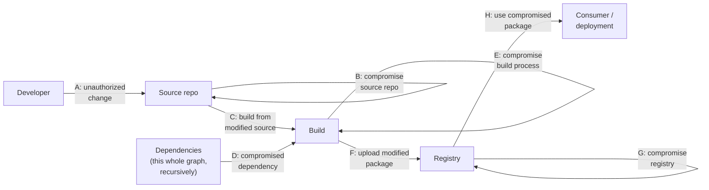
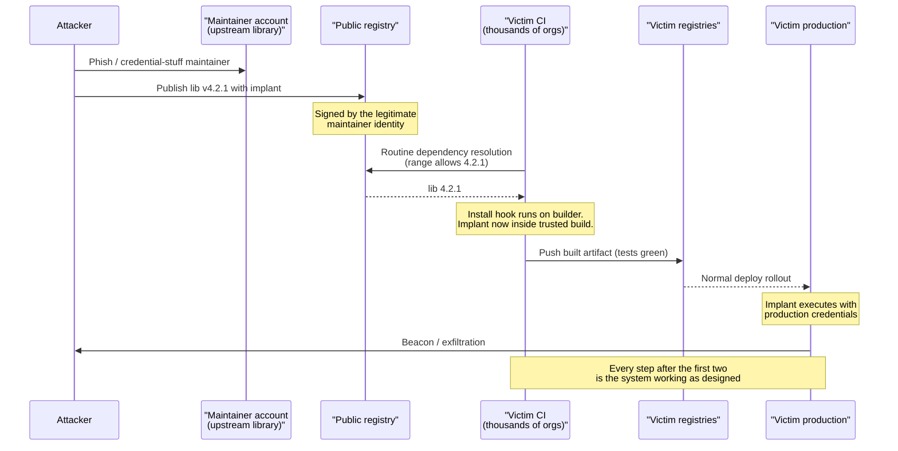
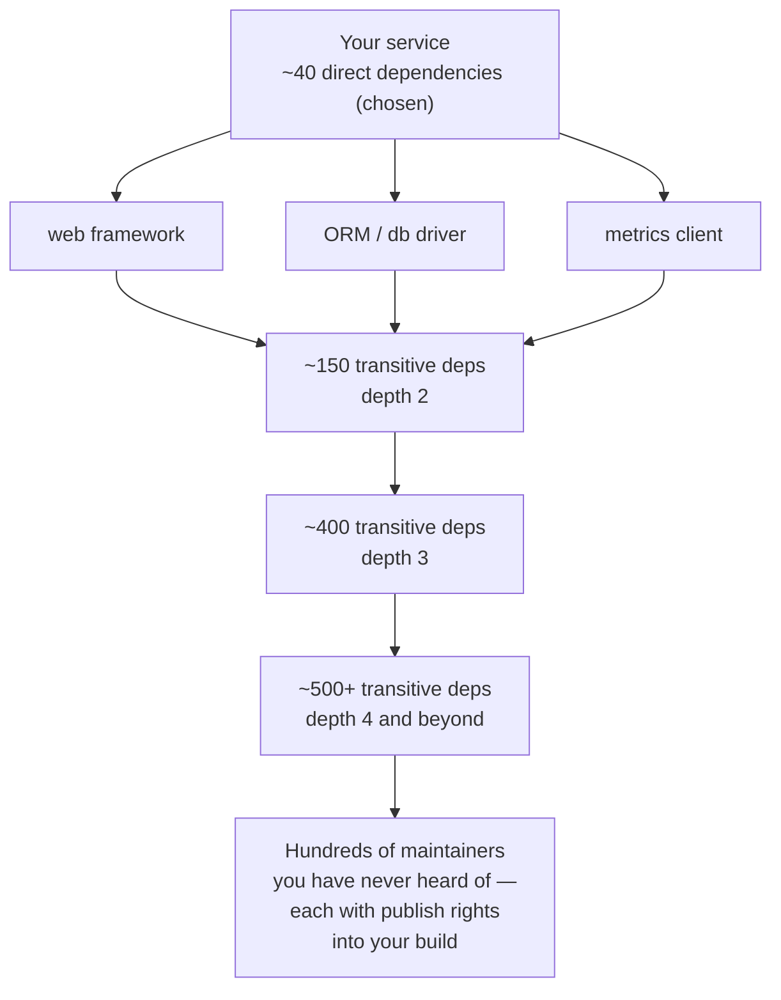
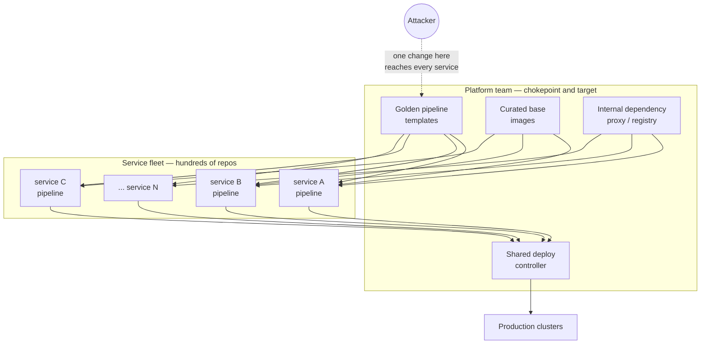

# Chapter 1 — The Software Supply Chain: Anatomy and Attack Surface

**What this chapter covers.** This chapter defines the software supply chain precisely,
maps its end-to-end lifecycle as a directed graph with explicit trust boundaries, and
enumerates the attack surface at every node and edge of that graph. It introduces the
structural asymmetries that make supply chain attacks uniquely attractive to attackers,
the transitive-trust problem that makes them uniquely hard to defend against, and the
conceptual vocabulary — artifacts, attestations, identities, policies — that the rest of
this suite builds on. Later chapters go deep on taxonomy (Chapter 2), real incidents
(Chapters 3–5), and defensive machinery (Books 2–8); this chapter's job is to draw the map.

Learning goals — after this chapter you should be able to:

- Define the software supply chain as the full set of systems, artifacts, and identities
  that influence the bits running in production, and explain why that definition is
  deliberately broad.
- Draw the supply chain lifecycle as a directed graph and mark its trust boundaries.
- Enumerate, for any node in that graph, three questions: who can write to it, what
  trusts its output, and what secrets it holds.
- Place a hypothetical attack into SLSA v1.0's threat model (threats A–H) and its
  source / dependency / build / usage categories.
- Explain the attacker/defender cost asymmetry and why supply chain attacks scale.
- Explain transitive trust, quantify the dependency explosion for a typical service, and
  articulate why "first party vs. third party" is a blurred and eroding distinction.
- Describe how microservice fleets and platform teams change the shape of the problem.

## What, exactly, is the software supply chain?

The term borrows from manufacturing, and the analogy is imperfect in a revealing way. A
physical supply chain moves *matter*: raw materials in, finished goods out, with custody
transfers you can inspect at a loading dock. A software supply chain moves *influence over
bits*. The question it answers is not "where did this box come from?" but:

> **What is the complete set of things — code, systems, people, and machine identities —
> that could have influenced the bits now executing in production?**

Everything in that set is part of your supply chain, whether or not you chose it, pay for
it, or know it exists. Concretely, the set includes:

- **Source code** — first-party code in your repositories, including its full history,
  branches, and the review process that gates changes into it.
- **Dependencies** — every third-party library resolved at build time or runtime, direct
  and transitive, plus the registries (npm, Maven Central, PyPI, crates.io, Go module
  proxies) that serve them and the maintainers who publish to those registries.
- **Toolchains** — compilers, interpreters, linkers, code generators, and the standard
  libraries they embed into your output. `gcc`, `javac`, the Go toolchain, `tsc`,
  `protoc` — each one transforms input bits into output bits and could, in principle,
  transform them maliciously.
- **Build systems and CI/CD** — the machines and orchestration (GitHub Actions, GitLab CI,
  Jenkins, Buildkite, Bazel remote execution clusters) that check out source, resolve
  dependencies, run the toolchain, and produce artifacts. Including every plugin,
  action, orb, and shared pipeline template those systems load.
- **Artifact stores** — container registries, package repositories, object storage buckets
  holding release tarballs; anywhere a built artifact rests between build and deploy.
- **Deployment machinery** — CD controllers, GitOps agents (Argo CD, Flux), Helm charts,
  Terraform state and providers, admission controllers; everything that decides *which*
  artifact runs *where*.
- **Runtime infrastructure** — base images, node OS images, the kubelet and container
  runtime, sidecars injected by the platform, agents installed by security and
  observability vendors.
- **The humans and machine identities behind all of the above** — developer accounts,
  maintainer accounts on public registries, CI service accounts, deploy robots, OIDC
  identities, personal access tokens, signing keys. Every write path in the chain
  terminates in a credential held by someone or something.

Two consequences of this definition are worth stating explicitly, because the whole field
follows from them.

First, **the supply chain is defined by influence, not by intent or contract**. The
maintainer of a transitive dependency four levels deep in your lockfile is in your supply
chain even though you have no relationship with them. The SaaS vendor whose CI
integration holds a token to your repositories is in your supply chain even though you
bought them for code coverage, not code execution. If it can change the bits, it is in
scope.

Second, **the supply chain is a graph of trust relationships, and trust composes
transitively whether you want it to or not**. When your deploy system trusts your
registry, and your registry trusts your CI, and your CI trusts a third-party plugin, then
your production environment trusts that plugin's author — a fact that appears in no
architecture diagram and no vendor contract, but is enforced by the machinery every day.

This is why we treat supply chain security as a distributed-systems problem rather than
purely an application-security one. The unit of analysis is not a program but a *pipeline
of mutually trusting systems*, operated by different teams (and different companies),
failing independently, and composing their guarantees — or their compromises.

## The lifecycle as a directed graph

The canonical path a change takes from a developer's editor to production is a directed
graph. The trunk is familiar: workstation → source control → CI → build → artifact
registry → deployment → runtime. But the trunk alone is misleading, because most of the
attack surface lives in the *sidecar chains* that feed it: dependency registries feeding
the build, base images feeding the container build, plugin marketplaces feeding CI, and
SaaS integrations holding standing credentials into several stages at once.

```mermaid
flowchart LR
    subgraph DEV["Trust domain: developer"]
        WS["Developer workstation<br/>IDE, extensions, local toolchain"]
    end

    subgraph SRC["Trust domain: source control"]
        SCM["SCM / code review<br/>GitHub, GitLab"]
    end

    subgraph BUILD["Trust domain: build"]
        CI["CI orchestrator<br/>pipeline definitions"]
        BLD["Build workers<br/>compilers, packagers"]
    end

    subgraph DIST["Trust domain: distribution"]
        REG["Artifact registry<br/>OCI images, packages"]
    end

    subgraph PROD["Trust domain: production"]
        CD["Deploy machinery<br/>GitOps, CD controller"]
        RT["Runtime<br/>clusters, hosts, functions"]
    end

    WS -->|"push commit"| SCM
    SCM -->|"webhook / trigger"| CI
    CI -->|"schedule job"| BLD
    BLD -->|"push artifact"| REG
    REG -->|"pull artifact"| CD
    CD -->|"apply / rollout"| RT

    subgraph SIDE["Sidecar chains — external trust"]
        DEP["Dependency registries<br/>npm, PyPI, Maven, Go proxy"]
        BASE["Base images<br/>Docker Hub, distro images"]
        PLUG["CI plugins and actions<br/>marketplaces"]
        TOOL["Toolchain distribution<br/>compiler and SDK downloads"]
        SAAS["SaaS integrations<br/>coverage, scanning, bots"]
    end

    DEP -->|"resolve deps"| BLD
    DEP -.->|"local install"| WS
    BASE -->|"FROM image"| BLD
    PLUG -->|"load plugin code"| CI
    TOOL -->|"install toolchain"| BLD
    TOOL -.->|"install toolchain"| WS
    SAAS -.->|"tokens into"| SCM
    SAAS -.->|"tokens into"| CI

    RT -.->|"pull at runtime:<br/>plugins, models, updates"| DEP
```



Read the diagram with three observations in mind.

**Every solid arrow is a trust decision.** When CI triggers on a webhook, it trusts that
the SCM's claim about "what changed and who changed it" is true. When the deploy
controller pulls `registry.internal/payments:sha256-abc…`, it trusts that whatever put
that digest in the registry was the legitimate build of legitimate source. In most
organizations these trust decisions are *implicit*: enforced by nothing more than network
reachability and a credential. Making them explicit and verifiable — turning "the registry
has it, so it must be fine" into "a verifiable statement says trusted builder B built it
from reviewed commit C" — is the core project of this entire suite, and the subject of
Book 5 in particular.

**Trust boundaries do not align with organizational boundaries.** The five subgraphs
above are typically operated by at least three different parties: your organization, your
vendors (GitHub, your cloud), and thousands of open source maintainers behind the sidecar
chains. The sidecar arrows cross from *entirely external* trust domains directly into
your build — the highest-leverage stage of the whole graph.

**The graph has back-edges.** The dotted arrow from runtime back to dependency
registries is easy to forget: services that download plugins, ML models, or "auto-update"
components at runtime have extended the supply chain past deployment, bypassing every
control upstream of it. Log4Shell — covered properly in Book 1, Chapter 5 — was so
devastating partly because it turned a logging library into an arbitrary *runtime* code
loader.

### Nodes, edges, and the three questions

For every node in the graph, the attack-surface analysis reduces to three questions:

1. **Who can write to it?** (Accounts, tokens, service identities, and the systems that
   can impersonate them.)
2. **What trusts its output?** (The downstream blast radius if it lies.)
3. **What secrets does it hold?** (What an attacker gains beyond the node itself —
   lateral movement potential.)

Applied across the trunk, the answers look like this:

| Node | Who can write to it | What trusts its output | Secrets it typically holds |
|---|---|---|---|
| Developer workstation | The developer; every IDE extension, local tool, and `npm install` script run with their privileges | SCM (accepts pushes), reviewers (assume the diff is what the author intended) | SSH keys, cloud CLI sessions, long-lived PATs, browser sessions to SCM/CI |
| SCM | Anyone with push rights; branch-protection bypassers; admins; integrated apps with `contents:write` | CI (builds what it is told changed), other repos (submodules, template pulls), auditors | Webhook secrets, deploy keys, installed-app tokens, Actions secrets configured at repo/org level |
| CI orchestrator | Anyone who can edit pipeline definitions — which usually means anyone who can push a branch | Build workers (execute what it schedules), registries (accept its pushes), reviewers who assume "CI passed" means something | The crown jewels: registry push credentials, cloud deploy roles, signing keys, tokens for every integrated SaaS |
| Build workers | The CI orchestrator; the toolchain and every dependency's install-time hooks executing *on* the worker | The registry (accepts the artifact), everything downstream | Ambient credentials of the job: cache tokens, dependency-registry credentials, sometimes the CI secrets themselves |
| Artifact registry | CI service accounts; humans with push rights; replication from other registries | Deploy machinery and *every cluster that pulls from it* | Usually few secrets, but its access-control database is itself a target |
| Deploy machinery | Platform team; whoever can merge to the GitOps repo; the CD controller's own service account | The runtime — it applies whatever it is told, typically with cluster-admin | Kubeconfigs/cluster credentials, cloud roles, decryption keys for sealed secrets |
| Runtime | The deploy machinery; node/image update channels; anyone with `kubectl exec`-equivalent access | Your customers | Application secrets, data-store credentials, service-mesh identities |

Notice the pattern in the middle column: **each node's output is trusted by everything
after it, and almost nothing verifies that trust independently**. The registry does not
check that CI really built the image from reviewed source; the deploy controller does not
check that the registry entry was pushed by CI rather than by a leaked credential. Each
stage launders the previous stage's output into something the next stage accepts without
question. Attackers read this table the same way defenders should: the CI/build stage
combines the broadest write-access (anyone who can push a branch can usually alter a
pipeline) with the richest secrets and a fully trusted output path. It is the graph's
center of gravity.

## Organizing the threats: SLSA v1.0's model

Enumerating attacks ad hoc gets unwieldy; a shared frame helps. The most widely used one
is the threat model published with **SLSA v1.0** (Supply-chain Levels for Software
Artifacts), which annotates essentially the same lifecycle graph with lettered threats
**A through H**, grouped into source, dependency, and build threats, plus the final
"usage" step where a consumer runs what it fetched:

- **Source threats**
  - **(A) Submit unauthorized change** — malicious code enters through the front door of
    source control: a hijacked developer account, a rubber-stamped review, a pushed
    commit on an unprotected branch. The code is malicious but the *process* records it
    as legitimate.
  - **(B) Compromise source repo** — the SCM itself is subverted: history rewritten,
    branch protections bypassed by an admin or platform bug, code injected outside any
    change-management process.
- **Build threats**
  - **(C) Build from modified source** — the builder is fed something other than the
    intended, reviewed source: a tampered checkout, a mirror that diverges from the
    authoritative repo, build scripts fetched from elsewhere at build time.
  - **(E) Compromise build process** — the build environment itself is subverted so that
    correct source still yields malicious output: a poisoned worker image, a malicious
    CI plugin, cross-contamination from another tenant's build. This is the SolarWinds
    pattern (Chapter 3).
  - **(F) Upload modified package** — the artifact is tampered with after the build but
    before or during upload; or an attacker with registry credentials simply pushes an
    artifact that never went through the build at all.
  - **(G) Compromise package registry** — the registry serves consumers something other
    than what the publisher uploaded: a compromised registry, a malicious mirror or
    proxy, a name resolved to the wrong package (the dependency-confusion class lives
    here and at H).
- **Dependency threats**
  - **(D) Use compromised dependency** — your build consumes a dependency that is itself
    the product of any of these threats, recursively. This single letter is the
    entry point for the entire attack class Book 2 covers: typosquatting, hijacked
    maintainer accounts, malicious updates, install-script payloads.
- **Usage threats**
  - **(H) Use compromised package** — the consumer fetches or runs the wrong artifact:
    no verification at deploy time, mutable tags swapped underneath them, a
    look-alike package name.

Two things to note about the frame. First, there is deliberately no threat "(D)" inside
the build group and no letter between C and E in it — D is reserved for the dependency
threat, which SLSA models as the *same graph applied recursively to each dependency*.
That recursion is the formally precise statement of the transitive-trust problem we
examine below. Second, SLSA v1.0's Build track — its levels and provenance requirements,
covered in Book 1, Chapter 7 and in depth in Books 4–5 — primarily mitigates the build
threats (C, E, F, and parts of G/H via verification). Source threats and post-deployment
threats (compromised deploy machinery, runtime tampering) are acknowledged in the model
but largely out of scope of the v1.0 levels; deployment-side controls are the business
of Book 6, and source-side controls of Book 7.



When you encounter a new incident writeup, the first useful move is to place it on this
diagram. event-stream (Chapter 4) is A executed against a *dependency's* repo, reaching
you via D. Codecov (Chapter 5) is E — a tampered CI-time script exfiltrating build
secrets. Dependency confusion is G/H — the resolver picking the wrong registry's answer
for a name. SolarWinds is E in its purest form: source clean, artifact dirty, signature
valid. The taxonomy in Chapter 2 refines this into finer-grained classes, but A–H is the
load-bearing skeleton.

## The asymmetry that defines the domain

Every security domain has an attacker/defender asymmetry; supply chain security has a
distinctive and brutal one, and it is worth being precise about its three components.

**1. One compromised link transitively compromises everyone downstream.** The lifecycle
graph is a *dependency* graph, and compromise flows along its edges in the direction of
trust. Compromise a workstation and you can (at minimum) submit code as that developer.
Compromise CI and you control every artifact it produces. Compromise a widely used
package and you execute code in every downstream build — and, at install-hook time, on
every downstream developer's laptop, which holds credentials to *their* supply chains,
which is how compromise turns into a self-propagating worm across organizational
boundaries. Defenders must hold every link; the attacker needs one.

**2. The attacker attacks the cheapest link; the defender pays for all of them.**
Popping a hardened production perimeter is expensive. By contrast: registering a
typosquatted package costs nothing; phishing one maintainer of a tired, understaffed
open source project is a commodity operation; a stale CI plugin with a leaked publishing
token is a scripted find. The economic analysis — why rational attackers moved upstream
as perimeters hardened, and what that implies for where defenders should spend — is
developed properly in Chapter 6. Here it is enough to note the direction of the
gradient: **attacks migrate toward the least-defended writable node whose output is
still fully trusted**, and in most organizations today that node is in the build or
dependency sidecar, not in production.

**3. Distribution is the payload's force multiplier.** A conventional intrusion
compromises one victim per operation. A supply chain implant is *distributed by the
victim's own trusted machinery*: signed by their keys, shipped through their release
process, installed by their customers' auto-updaters. One implant, thousands of victims,
each of whom received it through a channel they had every conventional reason to trust.
This is why the marginal cost of the Nth victim is approximately zero for the attacker —
and why the defender's traditional signal, "did something unusual cross my perimeter?",
fires on nothing at all. The malicious update *is* the usual thing crossing the
perimeter.

The propagation dynamics are worth seeing end to end, because the striking feature is
how every step after the initial compromise consists of systems working exactly as
designed:



The defender's problem, made vivid: at which step in that sequence would your current
controls have fired? For most organizations the honest answer is "the last one, if the
EDR vendor had a signature" — which is to say, after the attacker had already won the
supply chain phase. Moving detection and prevention *up* this sequence — verifying at
each edge rather than hoping at the last one — is the strategic arc of this suite.

## Transitive trust and the dependency explosion

The single most consequential fact about modern software composition is quantitative.
Run this in any mature Node.js service:

```bash
$ npm ls --all --parseable 2>/dev/null | wc -l
1387

$ npm ls --all --parseable 2>/dev/null | awk -F/node_modules/ '{print $NF}' | sort -u | wc -l
1104
```

Over a thousand distinct packages, of which the team deliberately chose perhaps forty —
the `dependencies` block of `package.json`. Everything else arrived transitively. The
numbers vary by ecosystem — JVM services commonly land in the hundreds of jars, Go's
module graph tends to be leaner but still routinely spans hundreds of modules, Python
sits in between — but the structure is the same everywhere: **a shallow layer of chosen
dependencies riding on a deep pyramid of unchosen ones.**



The research literature put numbers on this years ago: Zimmermann et al.'s 2019 study of
the npm ecosystem ("Small World with High Risks," USENIX Security) found that installing
an average npm package implicitly trusts roughly 80 other packages and dozens of distinct
maintainers. Whatever the exact figure for your stack today, the qualitative point is
stable and is the one to internalize:

> **You are trusting people you have never heard of.** Not their code — their *accounts*.
> Each maintainer in the pyramid holds publish rights to a name your resolver will
> fetch, and in ecosystems with install-time hooks, code execution on your build workers
> and developer laptops. Their password hygiene, their laptop's security posture, their
> willingness to hand the project to a helpful stranger when they burn out — all of it
> is, functionally, part of your security posture.

Three structural features make this worse than the raw count suggests.

**Trust attaches to names and accounts, not to code.** Your lockfile pins content hashes
for versions already resolved, which is genuine protection against threat G-style
substitution — but the moment any dependency is updated, trust reverts to "whatever the
account that owns this name publishes next." Review of dependency *updates* is rare in
practice; review of transitive updates is essentially nonexistent. The xz-utils backdoor
(Chapter 5) is the canonical demonstration that the account itself — the maintainership —
can be the thing acquired by the attacker, patiently, over years.

**The pyramid concentrates.** Dependency graphs are heavy-tailed: a small set of
utility packages appears in a huge fraction of all graphs. That concentration means a
single compromised commodity package reaches an enormous installed base — the
event-stream and ua-parser-js incidents (Chapter 4) were exactly this — and it means the
maintainers of the most-depended-on packages are, whether they know it or not,
critical infrastructure operators, frequently unpaid ones. The sustainability half of that
problem is Chapter 8's subject.

**The recursion has no natural floor.** Each dependency was itself built by a supply
chain — its maintainer's laptop, its CI, its release tooling — so threat D expands into
the *entire A–H graph, per package, recursively*. Follow the recursion all the way down
and you reach the question Ken Thompson posed in his 1984 Turing Award lecture,
"Reflections on Trusting Trust": a compiler can be backdoored to recognize and trojan
both the programs it compiles *and future versions of itself*, leaving no trace in any
source code anyone will ever review. The lecture's closing moral — "you can't trust code
that you did not totally create yourself" — is the theoretical bedrock of this field: at
some depth, inspection gives out and you are trusting *provenance*, not code. What
modern supply chain security offers is not an escape from that conclusion but a
disciplined response to it: reproducible builds, bootstrapped toolchains, and verifiable
provenance chains, which get a full treatment in Book 7, Chapter 5.

## First party, third party, and the blurred line

Security programs love the first-party/third-party split: our code, reviewed and owned,
versus their code, scanned and inventoried. The split is administratively convenient and
increasingly fictional. Consider the cases that fall between:

- **Vendored code.** A third-party library copied into your tree — `third_party/`,
  `vendor/` — is third-party provenance wearing first-party clothes. It passes your code
  review *once*, at import, then drifts: upstream fixes CVEs that your copy never
  receives, and your scanning tooling may no longer even recognize it as the library it
  is. Vendoring converts a visible dependency into an invisible one.
- **Internal forks.** A fork of an upstream project is a commitment to merge upstream's
  security fixes forever, made implicitly and usually without an owner. Two years later
  it is neither first party (nobody on staff understands all of it) nor third party
  (upstream's advisories no longer match your code).
- **Internal packages.** Code published by *another team* to your internal registry is
  first party on the org chart and third party in every mechanical respect: you consume
  it by name from a registry, sight unseen, on a version range. An attacker who
  compromises one team's publishing credentials attacks every internal consumer through
  the same machinery a public-registry attacker would use. Worse, the interaction
  *between* internal names and public registries is itself an attack surface — the
  dependency-confusion class, dissected in Book 2.
- **Contractors and outsourced development.** Code written by external parties under
  contract lands in your repos with first-party trust, from workstations and identity
  practices you do not control. The identity-and-access dimension of this is Book 7's
  territory.
- **AI-generated code.** Code produced by an LLM assistant enters through the
  first-party front door — a developer commits it — but its effective provenance is a
  statistical distillation of the model's training corpus, and its failure modes include
  confidently importing packages that do not exist (an attack surface the moment someone
  registers those names publicly). It is authored-by-us in the audit log and
  authored-by-no-one in every meaningful sense. Policy responses are covered in Book 8.

The lesson is not that the first/third-party distinction is useless — it still tracks
*who you can call at 2 a.m.* — but that it is not a security boundary. The security-relevant
questions are the mechanical ones from earlier: what is the provenance of these bits,
who could write to their source, and what verified them on the way in? A mature program
applies those questions uniformly and lets "first party vs. third party" be an
answer, not an assumption.

## Why this domain surged after 2020

Supply chain attacks are old — Thompson described the ultimate one in 1984, and
practitioners had been cataloguing registry malware for years — but the field's modern
form dates to a two-year window.

In December 2020, the **SolarWinds** campaign was disclosed: a build-process compromise
(threat E) at a single network-management vendor delivered a trojaned, validly signed
update to on the order of eighteen thousand organizations, including US federal
agencies. It demonstrated, at nation-state quality, everything this chapter has argued
structurally: the build system as center of gravity, the victim's own signing and
distribution as the delivery mechanism, and the transitive blast radius of one link.

The policy response was fast by policy standards. In May 2021, US **Executive Order
14028** ("Improving the Nation's Cybersecurity") directed NIST to define secure software
development practices — yielding the **SSDF, SP 800-218** — and set in motion federal
procurement requirements for SBOMs and vendor attestations. Regulation elsewhere
followed, most significantly the **EU Cyber Resilience Act**; the compliance landscape
is Book 8's subject. Simultaneously, the attacks professionalized and diversified:
dependency confusion was demonstrated at scale against major tech companies in 2021,
Codecov and Log4Shell landed the same year, and the 2024 xz-utils backdoor showed
multi-year social-engineering investment in acquiring maintainership itself. Chapters
3–5 treat these properly as case studies; the point here is only the shape of the
inflection: **a demonstrated nation-state playbook, a regulatory forcing function, and a
commoditizing criminal ecosystem arrived within roughly three years of each other**, and
an area that had been a niche concern became a first-order engineering discipline with
its own frameworks (SLSA, SSDF, S2C2F — Chapter 7) and its own tooling stack (Books 3–6).

## The distributed-systems lens: fleets, pipelines, and platform chokepoints

Everything so far described one pipeline. You do not operate one pipeline. A
mid-size backend organization operates hundreds of repositories, each with its own CI
configuration, dependency graph, and container images, deploying dozens of times a day
across multiple clusters. This multiplies the problem along one axis and — if you are
deliberate — collapses it along another.

**Multiplication.** Every additional service adds a full copy of the lifecycle graph:
another pipeline definition someone can edit, another set of CI secrets, another image
lineage, another lockfile drifting on its own schedule. Attack surface scales roughly
with (services × stages × integrations), and *inconsistency* scales with it: the fleet's
effective security level is set by its weakest pipeline, and in a hundred-repo
organization there is always a repo nobody has touched since the intern who created it
left. High deploy frequency compounds this — with hundreds of deploys a day, "a human
looks at each release" is not an available control, so any control that does not execute
mechanically, per artifact, does not exist.

**Collapse.** The standard organizational response is a platform team: golden pipeline
templates, a curated base-image lineage, an internal dependency proxy, a shared deploy
controller. This is the right architecture, and this suite will repeatedly recommend it,
because it converts an unwinnable per-team problem into a tractable chokepoint where
controls (provenance verification, admission policy, dependency curation) can be
implemented once and enforced fleet-wide.

But be honest about what a chokepoint is: **the platform team is the highest-value
target in the company**. A malicious change to the shared pipeline template is threat E
executed against every service at once. The internal base image is `FROM`-ed by a
thousand Dockerfiles; the deploy controller holds cluster-admin everywhere; the internal
registry proxy is a man-in-the-middle for every dependency the company resolves — that
is precisely why it works as a control point, and precisely what it costs if it is
compromised. Centralization does not reduce total risk so much as *relocate and
concentrate* it, exchanging a thousand mediocre defenses for one defense that had better
be excellent — with commensurate investment in the platform's own supply chain: who can
merge to the template repo, how the base image is itself built and attested, how the
controller's credentials are scoped. Chapter 9 develops this lens fully; Books 4 and 6
build the machinery.



A concrete miniature of the multiplication problem, because it is the single most common
finding in real fleets — the unpinned CI action:

```yaml
# .github/workflows/build.yml — found, with variations, in most of the fleet
jobs:
  build:
    runs-on: ubuntu-latest
    steps:
      - uses: actions/checkout@v4          # tag: mutable, repointable
      - uses: some-org/setup-widget@main   # branch: whatever HEAD is today
      - run: make release
        env:
          REGISTRY_TOKEN: ${{ secrets.REGISTRY_TOKEN }}
```

Both `uses:` lines execute third-party code inside a job holding a registry push token —
threat E, one compromised action-author account away. The tag `v4` and the branch `main`
are *names*, repointable by whoever controls that repo, which is exactly the
names-versus-code trust failure from the dependency section, reappearing in the CI
sidecar. (The remediation — SHA-pinning, scoped tokens, and their limits — is Book 4's
material; the pattern-recognition is this chapter's.) Multiply by three hundred repos,
each with its own drift, and the case for the golden template — and for guarding it like
production — makes itself.

## The conceptual model for the rest of the suite

The following four terms recur through all eight books. Formal definitions (and the
specs that pin them down — in-toto, SLSA provenance, DSSE, Sigstore) come later; here
are the working notions.

**Artifact.** Any immutable, addressable output of a supply chain step: a source
tarball, a container image, a Java jar, a Terraform module, an SBOM document, a binary.
The critical property is *content-addressability* — an artifact is identified by a
cryptographic digest of its bytes (`sha256:…`), not by a mutable name like `latest` or
`v4`. Names are claims; digests are facts. A large fraction of practical supply chain
security consists of replacing name-based references with digest-based ones.

**Attestation.** A signed, structured statement *about* an artifact, made by some
identity: "builder B built digest X from commit C using pipeline P" (provenance), "scanner
S found these components in X" (an SBOM attestation), "reviewer R approved the change."
Attestations are the mechanism that turns the implicit trust edges in our lifecycle
graph into explicit, verifiable evidence — metadata that travels with the artifact and
can be checked by anyone downstream, rather than institutional knowledge trapped in the
CI logs. Book 5 is devoted to them.

**Identity.** The answer to "who says so?" — for humans (developers, reviewers,
maintainers) and, at least as importantly, for machines (a CI workload, a deploy
controller, a builder). The field's direction of travel is from long-lived bearer
secrets (PATs, static keys — the things exfiltrated in half the incidents in Chapters
3–5) toward short-lived, verifiable workload identities (OIDC-federated CI identities,
keyless signing). An attestation is only as strong as the identity that signed it and
the process that guarded that identity.

**Policy.** A machine-enforceable rule that consumes attestations and identities to gate
an action: "no image runs in this cluster without provenance from a trusted builder,"
"no dependency enters the proxy without a known-good source," "no deploy without a
matching SBOM." Policy is where evidence becomes enforcement — evaluated automatically,
per artifact, at admission points like registries, deploy controllers, and cluster
admission webhooks, which is the only form of control that survives the deploy
frequencies of a real fleet. Books 6 and 8 cover the enforcement machinery and its
governance.

The suite's through-line, in one sentence built from these terms: **identify every
artifact by digest, bind evidence to it as attestations signed by verifiable
identities, and enforce policies over that evidence at every trust boundary in the
lifecycle graph** — so that each solid arrow in this chapter's first diagram stops
meaning "reachable and credentialed" and starts meaning "verified."

## Key takeaways

- The software supply chain is *everything that influences the bits running in
  production*: source, dependencies, toolchains, build/CI systems, artifact stores,
  deployment machinery, runtime infrastructure, and the human and machine identities
  behind each. Membership is defined by influence, not by contract or intent.
- Model it as a directed graph — workstation → SCM → CI → build → registry → deploy →
  runtime, plus the sidecar chains (dependencies, base images, CI plugins, toolchains,
  SaaS integrations) that inject external trust directly into the trunk. Every edge is a
  trust decision, and most are implicit today.
- For any node, ask three questions: who can write to it, what trusts its output, what
  secrets does it hold. By that measure the CI/build stage is the center of gravity:
  broadest write access, richest secrets, fully trusted output.
- SLSA v1.0's threat model (threats A–H, grouped as source, dependency, build, and
  usage threats) is the standard frame for placing any attack; threat D expands
  recursively into the full graph for every dependency.
- The domain's defining asymmetry: one compromised link transitively compromises
  everything downstream; attackers pay for the cheapest link while defenders pay for
  all of them; and the victim's own trusted distribution machinery multiplies one
  implant into thousands of victims.
- Transitive trust attaches to *names and accounts*, not code. A typical service trusts
  hundreds to thousands of packages and hundreds of maintainers it never chose.
  Thompson's "Reflections on Trusting Trust" marks the theoretical floor: past some
  depth you are trusting provenance, not inspection.
- The first-party/third-party split is not a security boundary. Vendored code, forks,
  internal packages, contractor code, and AI-generated code all cross it; apply the same
  provenance questions to everything.
- At fleet scale, attack surface multiplies with services × stages × integrations, and
  effective security equals the weakest pipeline. Platform chokepoints (golden
  pipelines, curated bases, shared deploy controllers) are the right response — and are
  therefore the highest-value targets, deserving production-grade protection themselves.
- The suite's working model: **artifacts** (digest-identified bits), **attestations**
  (signed statements about them), **identities** (who signs), and **policies** (rules
  that enforce evidence at trust boundaries).

## Further reading

- SLSA v1.0 specification, especially the threat model ("Supply chain threats"):
  https://slsa.dev/spec/v1.0/threats
- Ken Thompson, "Reflections on Trusting Trust," Turing Award lecture, *Communications
  of the ACM* 27(8), 1984: https://dl.acm.org/doi/10.1145/358198.358210
- Zimmermann, Staicu, Tenny, Pradel, "Small World with High Risks: A Study of Security
  Threats in the npm Ecosystem," USENIX Security 2019:
  https://www.usenix.org/conference/usenixsecurity19/presentation/zimmerman
- Ohm, Plate, Sykosch, Meier, "Backstabber's Knife Collection: A Review of Open Source
  Software Supply Chain Attacks," DIMVA 2020: https://arxiv.org/abs/2005.09535
- NIST SP 800-218, "Secure Software Development Framework (SSDF) Version 1.1":
  https://csrc.nist.gov/publications/detail/sp/800-218/final
- Executive Order 14028, "Improving the Nation's Cybersecurity," May 2021:
  https://www.federalregister.gov/documents/2021/05/17/2021-10460/improving-the-nations-cybersecurity
- ENISA, "Threat Landscape for Supply Chain Attacks," 2021:
  https://www.enisa.europa.eu/publications/threat-landscape-for-supply-chain-attacks
- CNCF Security TAG, "Software Supply Chain Best Practices" white paper:
  https://github.com/cncf/tag-security/blob/main/community/working-groups/supply-chain-security/supply-chain-security-paper/CNCF_SSCP_v1.pdf
