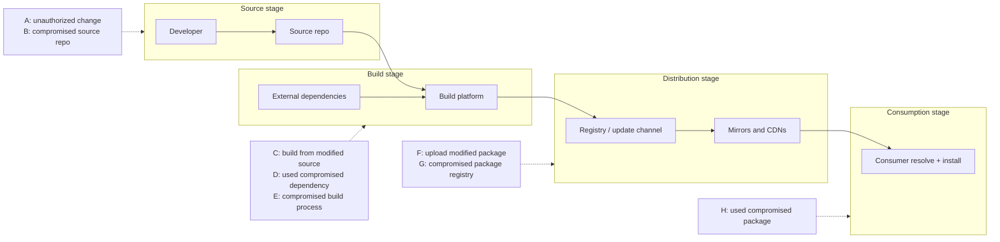
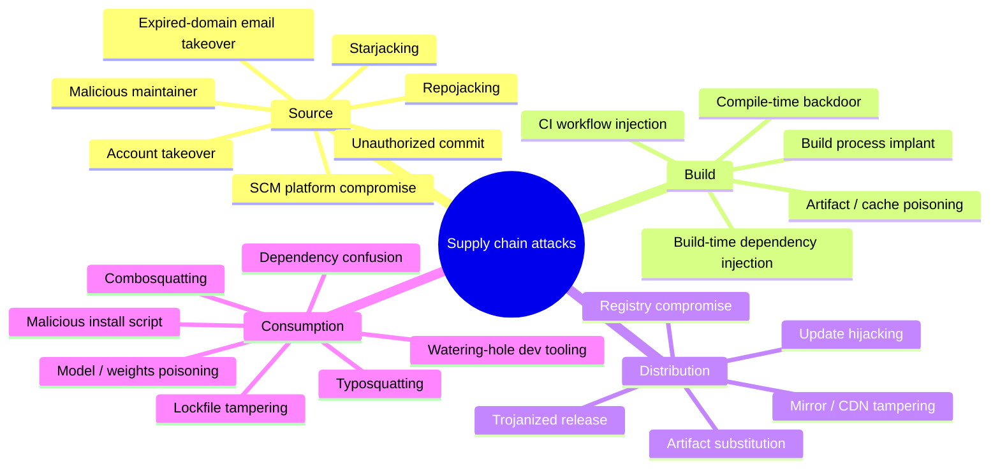
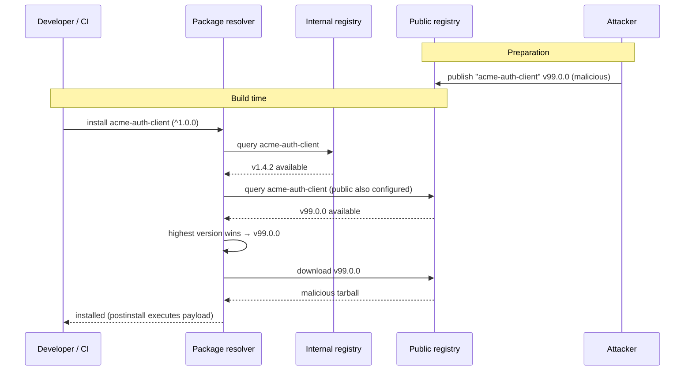
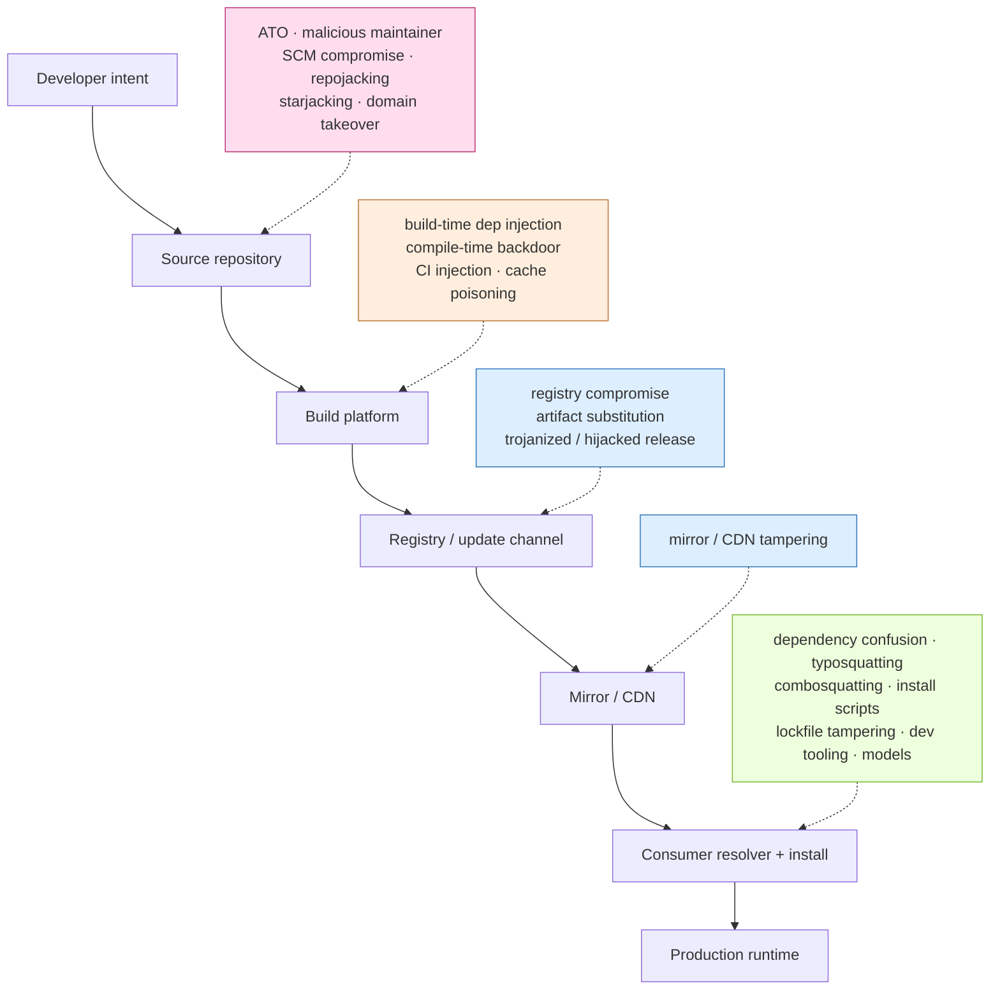

# Chapter 2 — A Taxonomy of Supply Chain Attacks

*What this chapter covers.* Chapter 1 mapped the anatomy of a modern software supply chain — source, build, distribution, and consumption — and enumerated its attack surface. This chapter imposes order on the attacks themselves. We build a two-axis classification: **where in the chain the compromise occurs** (aligned with the SLSA v1.0 threat model's threats A–H) and **how trust is subverted** (technical compromise, social engineering, or legitimate-but-malicious action). We then catalog the named attack patterns you will encounter in incident reports and vendor pitches — typosquatting, dependency confusion, repojacking, build-time injection, update hijacking, and the rest — and pin each one to a precise mechanism, the attacker capability it requires, its blast radius, its detectability, and a real incident that exemplifies it. Finally, we compare our taxonomy honestly against MITRE ATT&CK, the SLSA threat model, and the academic literature, and close with the distributed-systems view: which classes actually dominate for organizations running large microservice fleets with internal registries.

Learning goals:

- Explain why a shared attack taxonomy matters for threat modeling, control mapping, and cross-incident comparison — and what a bad taxonomy costs you.
- Classify any supply chain incident along two axes: chain stage (source, build, distribution, consumption) and trust-subversion mode (technical, social, legitimate-but-malicious).
- Describe the precise mechanism of each named attack pattern, from typosquatting to compile-time backdoors, without hand-waving.
- For each pattern, state the attacker capability required, the typical blast radius, and how detectable it is in practice.
- Relate the SLSA v1.0 threats A–H, MITRE ATT&CK T1195, and the Ladisa et al. taxonomy to each other and know where each is silent.
- Identify which attack classes matter most for an organization with hundreds of services, internal packages, and an internal registry — and which team owns each class.

## Why taxonomy matters

Security engineering runs on shared vocabulary. When a colleague says "SQL injection," you know the mechanism, the preconditions, the fix, and roughly where to look in the codebase. Supply chain security in the early 2020s lacked that shared vocabulary: the same incident would be described as "a dependency attack," "a build compromise," or "an npm hack" depending on who wrote the postmortem, and the imprecision had real costs.

Three concrete costs, in order of how often they bite:

**Threat modeling degenerates into anecdote-matching.** Without a taxonomy, teams model "the SolarWinds scenario" and "the xz scenario" as monoliths. But SolarWinds (Book 1, Chapter 3) is a *build-process compromise via technical means*, and xz-utils (Book 1, Chapter 5) is a *source compromise via long-horizon social engineering*. The controls that address one do almost nothing against the other. A taxonomy lets you enumerate the classes systematically and ask, per class, "what stops this here?" — instead of replaying famous incidents and hoping the next attacker is unoriginal.

**Control mapping becomes unfalsifiable.** Vendors and internal platform teams alike claim their control "prevents supply chain attacks." Prevents *which*? Artifact signing (Book 5) does nothing against a malicious maintainer who signs their own backdoor. SCA scanning (Book 2, Chapter 6) does nothing against a compromised build platform. Provenance verification (Book 5, Chapter 8) does nothing against typosquatting, because the typosquatted package has perfectly valid provenance — for the wrong package. A taxonomy turns "we're covered" into a coverage matrix with visible holes.

**Incident comparison across organizations fails.** Information sharing (Book 8, Chapter 7) depends on comparable categories. If one org reports "npm account takeover with malicious patch release" and another reports "malicious update to a JavaScript library," an analyst cannot tell whether these are the same campaign, the same technique by different actors, or different techniques entirely. Taxonomies are what make incident corpora queryable.

A useful taxonomy for this domain must satisfy two requirements that are in mild tension. It must be **organized by defender-relevant structure** — controls attach to places in the chain, so the primary axis should be *where* the compromise occurs. And it must capture **attacker-relevant structure** — the same place can be reached by stolen credentials, by patient social engineering, or by a legitimate owner turning hostile, and those require different defenses (credential hygiene versus contributor vetting versus update gating). Hence two axes, not one.

## Axis one: where in the chain the compromise occurs

The primary axis follows the flow of software from a developer's intent to a consumer's runtime. This aligns with the SLSA v1.0 threat model, which labels threats A through H along the same pipeline. We group them into four stages.

The letters map to SLSA v1.0's threats as published. Threats A and B are *source* threats: A is an unauthorized change to the source that the SCM accepts as legitimate; B is a compromise of the source repository platform itself. Threats C, D, and E are *build* threats: C is building from a source other than the reviewed one, D is using a compromised dependency during the build, and E is compromise of the build process. Threats F and G are *distribution* threats: F is uploading a package that did not come from the build system, and G is compromise of the package registry. Threat H is a *consumption* threat: the consumer selects and uses a compromised package — the class where dependency confusion and typosquatting live.

Two notes on how we deviate from SLSA. First, SLSA's framing is deliberately build-centric — it exists to justify provenance, so its threat labels cluster around the build. Our four-stage grouping is symmetric across the chain because we are classifying *all* attacks, not motivating one control family. Second, SLSA folds "malicious maintainer" implicitly into threat A (an authorized actor makes an unauthorized-in-spirit change). We surface it explicitly on the second axis, because a legitimate maintainer acting maliciously defeats every source-integrity control that assumes the maintainer is honest.

### Source-stage threats

The compromise occurs in the version-control system or in the human process feeding it. The attacker's output is malicious source that the organization treats as its own. Concretely: unauthorized commits (a pushed change no reviewer approved), SCM platform compromise (the git server or its forge is subverted — the March 2021 push of two backdoor commits to the self-hosted `git.php.net` server, masquerading as core maintainers, is the canonical example), and the malicious maintainer who has legitimate commit rights and abuses them.

Source-stage compromises are among the hardest to detect because the malicious change enters through the same door as every legitimate change and inherits the same downstream trust. Every subsequent stage — build, sign, publish — faithfully processes the poisoned source and stamps it with valid provenance. Provenance attests *that this was built from that commit*, not *that the commit was benign*.

### Build-stage threats

The source is clean; the build turns it into a malicious artifact. This includes building from unreviewed source (SLSA C), pulling a compromised dependency at build time (SLSA D — a build-time analogue of a consumption attack, distinguished because the poisoned dependency executes in your *build* environment with its privileges), and compromise of the build process itself (SLSA E). SolarWinds is the archetype: the SUNSPOT implant sat on the build server and rewrote source files *during compilation*, so the checked-in source stayed clean and the shipped binary carried SUNBURST. Build-stage attacks are potent because the build platform typically holds signing keys and production credentials, and because reproducible builds are still rare enough that "the binary doesn't match the source" is not routinely checked (Book 4, Chapter 2).

### Distribution-stage threats

The artifact is built correctly, then something between the build and the consumer swaps or corrupts it: registry compromise (SLSA G), artifact substitution or unauthorized upload (SLSA F), and mirror/CDN tampering. The 2017 M.E.Doc/NotPetya event — attackers subverted the update server of a widely used Ukrainian accounting product and pushed NotPetya through the legitimate update channel — is a distribution compromise, as is the 2024 polyfill.io case where a change of the CDN's ownership turned a trusted script host into a malware distributor for every site embedding it.

### Consumption-stage threats

Nothing in your chain is compromised; the attacker gets you to *select* their artifact. Dependency confusion, typosquatting, combosquatting, and installing a maliciously crafted "new" package all live here (SLSA H). These are the cheapest attacks to mount — no credential theft, no platform compromise, just publishing a package and waiting — and consequently the most common by raw count in the npm/PyPI ecosystems.

## Axis two: how trust is subverted

The second axis is orthogonal and captures the *attacker's method of gaining the ability to act*. The same location can be reached three fundamentally different ways, and the defenses differ accordingly.

**Technical compromise.** The attacker defeats a technical control: steals or phishes credentials, exploits a vulnerability, abuses a misconfiguration, or reuses a leaked token. The ledger connect-kit incident (December 2023) is a clean example — a former employee's npm account was phished, and the attacker published a wallet-draining version of `@ledgerhq/connect-kit`. The ESLint incident (July 2018) is another: stolen npm credentials were used to publish malicious `eslint-scope` versions that attempted to exfiltrate other maintainers' npm tokens. Defenses are the classic ones: MFA, short-lived scoped tokens, secret scanning, patching.

**Social engineering.** The attacker manipulates a human into granting access or trust. This ranges from ordinary phishing (which shades into technical compromise) to the *long con* — cultivating a maintainer relationship over months or years to inherit commit rights. The xz-utils backdoor (2024) is the defining case: the "Jia Tan" persona spent roughly two years making legitimate contributions, gaining co-maintainer status, and applying social pressure on the original maintainer, before landing an obfuscated backdoor in the release tarballs. No credential was stolen and no CVE was exploited; the trust was *given*. Defenses are organizational, not technical: contributor vetting, two-person review, provenance of *who* changed what.

**Legitimate-but-malicious.** The actor is exactly who they claim to be and has every right to act — and acts against the consumer's interest anyway. Protestware is the clearest form: the `colors.js`/`faker.js` sabotage (January 2022), where the legitimate author intentionally shipped an infinite loop and garbage output, and the `node-ipc` case (March 2022), where the author pushed a version that overwrote files on machines geolocated to Russia and Belarus. Also here: license traps (a maintainer relicensing to something hostile), and genuinely malicious *new* releases published by the real owner who has decided to monetize their user base maliciously — which is what the polyfill.io ownership change effectively became. There is no credential to protect and no persona to unmask; the only defenses are *not trusting the current owner implicitly* — pinning, review of updates, and vendoring (Book 2, Chapter 8).

The value of the second axis is that it predicts *which controls help*. Technical-compromise attacks yield to credential hygiene and detection; social-engineering attacks yield to process and contributor governance; legitimate-but-malicious attacks yield only to update gating and reduced trust in upstream. A control that addresses one axis-value tells you nothing about the other two.

## The taxonomy tree

Combining both axes, the named patterns organize as follows. The tree is grouped by chain stage; trust-subversion mode is noted per leaf where it is characteristic.

The rest of the chapter walks each leaf, grouped by stage, and states four properties per pattern: **attacker capability** required, **blast radius**, **detectability**, and a one-line **representative incident**. The full case studies are Chapters 3–5; here we characterize, not narrate.

## Source-stage patterns

**Account takeover (ATO).** The attacker obtains a maintainer's SCM or registry credentials — via phishing, credential stuffing, malware, or a leaked token — and acts as them. *Capability:* valid credentials or session; MFA bypass if enabled. *Blast radius:* everything the account can publish or push; for a popular package, millions of downstream installs. *Detectability:* moderate — anomalous publish times, new IPs, or unusual version jumps can flag it, but the artifact itself looks authentic. *Incident:* ESLint 2018 (`eslint-scope`), where stolen npm credentials pushed token-stealing releases.

**Malicious maintainer / insider.** A person with legitimate rights abuses them. This is the axis-two "social" or "legitimate-but-malicious" case realized at the source. *Capability:* existing commit or publish rights — no compromise needed. *Blast radius:* the maintained package and its dependents. *Detectability:* low; the change is authorized and signed. Only code review and behavioral diffing of releases catch it. *Incident:* event-stream (2018), where a new maintainer, having taken over the package through a routine-looking handoff, introduced the `flatmap-stream` dependency that targeted the Copay bitcoin wallet.

**SCM platform compromise.** The forge or git server itself is subverted, letting the attacker inject commits that appear to come from trusted authors. *Capability:* compromise of the hosting infrastructure or its authentication. *Blast radius:* every repo on the platform, potentially. *Detectability:* moderate to high if commit signing is enforced (unsigned or wrongly-signed commits stand out), low otherwise. *Incident:* the `git.php.net` compromise (March 2021), where two backdoor commits were pushed under the identities of core maintainers, prompting PHP to migrate to GitHub.

**Repojacking.** GitHub (and similar forges) retire a namespace when a user or org is renamed or deleted, and — subject to the platform's retirement rules — that namespace can become re-registrable. If a popular project's old `owner/repo` path is still referenced by dependents, redirect handling, or install scripts, an attacker who claims the freed namespace controls what those references resolve to. *Capability:* the ability to register a freed username/org; discovery of dangling references. *Blast radius:* every consumer still resolving the old path — for Go modules, install scripts, or documentation links, this can be large. *Detectability:* low until exploited; the reference looks normal. GitHub retains popular namespaces to blunt this, but the long tail remains exposed. *Incident:* numerous PoCs against widely-referenced org renames; no single canonical name, but the class has been demonstrated repeatedly against dependencies pinned to `github.com/<old-org>/...`.

**Starjacking.** A package's registry page displays the star count of a *linked* source repository, and registries frequently do not verify that the publisher controls that repo. An attacker publishes a malicious package while pointing its `repository` field at a famous project, inheriting its apparent popularity and trust signals. *Capability:* the ability to publish a package with an arbitrary repository URL. *Blast radius:* whoever is swayed by the borrowed reputation. *Detectability:* high if you check, near-zero if you rely on displayed stars. *Incident:* demonstrated broadly across npm and PyPI; the technique is a trust-signal forgery rather than a code-execution primitive on its own, and is typically combined with typosquatting.

**Expired-domain email takeover.** A maintainer's registered email uses a domain that lapses. The attacker re-registers the domain, provisions the mailbox, and triggers a password reset on the SCM or registry account — inheriting publish rights without touching a password. *Capability:* noticing a lapsed domain and re-registering it (cheap and automatable at scale). *Blast radius:* every package the account controls. *Detectability:* low; the reset flow is legitimate. *Incident:* the `ctx` PyPI package and a forked `phpass` (May 2022), where a lapsed maintainer domain was re-registered, the account reset, and malicious versions published that exfiltrated environment variables (later attributed to a security researcher demonstrating the technique).

## Build-stage patterns

**Build-time dependency injection (SLSA D).** A dependency pulled *during the build* — a build plugin, a base image, a compiler toolchain, a CI action — is malicious and executes with the build's privileges. This is distinct from a runtime dependency because the payload runs where signing keys and cloud credentials live. *Capability:* control of any package the build resolves, including transitive build tooling. *Blast radius:* the built artifact plus anything the build environment can reach — often the crown jewels. *Detectability:* moderate with build-environment monitoring (Book 4, Chapter 9); low otherwise. *Incident:* Codecov (2021), where the Bash Uploader — a build-time tool countless CI pipelines curl'd and executed — was altered to exfiltrate environment variables, harvesting secrets from thousands of CI runs.

**Compile-time backdoor / build-process implant (SLSA E).** Malicious code resident on the build platform modifies the artifact during compilation while leaving the source repository clean. *Capability:* code execution on the build host or control of the build orchestration. *Blast radius:* every artifact that host builds. *Detectability:* very low without reproducible builds — the definitive check is rebuilding from source on independent infrastructure and comparing (Book 4, Chapter 2). *Incident:* SolarWinds SUNSPOT (2020), which patched Orion source in-memory during the MSBuild step so the shipped, validly-signed binary carried SUNBURST.

**CI workflow injection.** Attacker-controlled input (a PR title, a branch name, an issue body, a fork's contents) flows into a CI workflow that evaluates it with elevated privileges — leading to code execution in the pipeline, secret theft, or artifact tampering. This is a large enough topic that Book 4, Chapter 7 (Pipeline Poisoning) treats it in depth; here it is one pattern. *Capability:* the ability to submit input a misconfigured workflow trusts — often just opening a pull request. *Blast radius:* pipeline secrets and publish rights. *Detectability:* moderate; the malicious run is visible in CI logs if anyone looks. *Incident:* a recurring class across GitHub Actions "pwn request" misconfigurations; deep-dived in Book 4.

**Artifact / cache poisoning.** The attacker plants a malicious artifact in a shared build cache, dependency proxy, or intermediate store so that later builds consume it as if legitimate. *Capability:* write access to the cache or the ability to influence cache keys. *Blast radius:* every build that hits the poisoned cache entry. *Detectability:* low; caches are trusted by construction and rarely re-verified. *Incident:* demonstrated against CI cache mechanisms; treated with build-tooling context in Book 4, Chapter 7.

## Distribution-stage patterns

**Registry compromise (SLSA G).** The package registry or its infrastructure is subverted, letting the attacker alter or replace artifacts server-side. *Capability:* compromise of registry infrastructure or privileged registry access. *Blast radius:* potentially the entire ecosystem the registry serves. *Detectability:* high *if* consumers verify signatures or hashes against an out-of-band source (TUF and Sigstore exist precisely for this — Book 5); low if they trust whatever the registry returns. *Incident:* no top-tier public compromise of a major language registry's storage to date at this scale, which is itself notable; the threat is modeled seriously (hence TUF adoption by PyPI and others).

**Artifact substitution / unauthorized upload (SLSA F).** A package that did *not* come from the legitimate build is uploaded under the legitimate package name — via stolen publish tokens or a registry flaw. *Capability:* publish rights (often obtained via ATO) or a registry authorization bug. *Blast radius:* dependents of that package. *Detectability:* moderate; provenance verification (Book 5, Chapter 8) catches it because the malicious upload lacks valid build provenance — but only where provenance is required. *Incident:* ua-parser-js (October 2021), where an npm account takeover let attackers publish trojanized versions carrying a cryptominer and password stealer.

**Mirror / CDN tampering.** A mirror, proxy, or CDN that consumers trust serves altered content. Because many organizations pull packages and scripts through mirrors for speed or availability, the mirror becomes a high-value substitution point. *Capability:* control of a mirror/CDN node or of the account that owns the CDN property. *Blast radius:* every consumer routing through that mirror. *Detectability:* high with subresource integrity or hash pinning, low with bare `<script src>` includes. *Incident:* polyfill.io (2024), where a change in the CDN's ownership led `cdn.polyfill.io` to serve malicious code to sites that embedded it; and XcodeGhost (2015), where a trojanized Xcode distributed through fast unofficial mirrors injected malware into every iOS app compiled with it.

**Trojanized release.** A legitimately-distributed product ships with an embedded backdoor, signed with the vendor's real certificate and delivered through the official channel. *Capability:* compromise of the vendor's build or release process (this overlaps the build stage; the *distribution* is what makes it dangerous, because the malware wears the vendor's signature). *Blast radius:* the vendor's entire customer base. *Detectability:* very low — valid signature, official channel, expected update cadence. *Incident:* ASUS ShadowHammer (2019), where the ASUS Live Update utility, signed with legitimate ASUS certificates and served from ASUS update servers, targeted specific machines by MAC address; and 3CX (2023), where the trojanized 3CXDesktopApp — itself a victim of a *prior* supply chain compromise via the X_TRADER software — was shipped to 3CX's customers.

**Update hijacking.** The attacker takes over the *update mechanism* to push a malicious version through the normal auto-update flow. Distinct from a one-off trojanized release in that it weaponizes the ongoing update channel. *Capability:* control of the update server or the signing/publishing path it uses. *Blast radius:* the entire installed base, delivered automatically. *Detectability:* low; auto-update is designed to be trusted and silent. *Incident:* Kaseya VSA (2021), where a zero-day in the VSA remote-management platform was used to push REvil ransomware to managed service providers and their downstream customers; and M.E.Doc/NotPetya (2017).

## Consumption-stage patterns

These are the attacks that require no compromise of anything you own — only that your resolver or a developer selects the attacker's artifact.

**Dependency confusion.** An organization uses internal package names (e.g., `acme-auth-client`) that are not published to the public registry. If the build's resolver is configured to consult the public registry as well, an attacker who publishes `acme-auth-client` publicly — often with a higher version number — can cause the resolver to prefer the public (malicious) package over the intended internal one. Alex Birsan's 2021 research demonstrated this against Apple, Microsoft, and dozens of other large firms simply by mining internal package names from leaked `package.json` files and publishing matching public packages. *Capability:* knowledge of an internal package name and the ability to publish that name publicly. No compromise required. *Blast radius:* every build that mis-resolves — potentially every service using the internal package. *Detectability:* moderate; the malicious fetch is visible in resolver logs, and scoped registries / namespace reservation prevent it (Book 2, Chapter 3). This is *the* canonical internal-package risk and is examined at the end of this chapter and again in Book 2.

The sequence exposes the root cause precisely: a resolver configured with *both* an internal and a public source, and a version-selection rule ("highest wins") that does not prefer the trusted source. Fix the resolution policy — scoped registries, explicit source pinning, namespace reservation on the public registry — and the confusion disappears. This is a *configuration* vulnerability, not a code one.

**Typosquatting.** The attacker publishes a package whose name is a near-miss of a popular one (`reqeusts` for `requests`, `electorn` for `electron`), relying on developer typos and copy-paste errors. *Capability:* the ability to publish a plausibly-named package. *Blast radius:* whoever mistypes — smaller than dependency confusion, but continuous. *Detectability:* high with name-similarity scanning and install-time policy; low if developers install ad hoc. *Incident:* endemic on npm and PyPI; recurring campaigns publish hundreds of typosquats at a time.

**Combosquatting.** A variant that *adds* tokens to a real name rather than misspelling it: `python3-dateutil` (the real one is `python-dateutil`), or `<real-lib>-utils`, `node-<real-lib>`. It exploits the plausibility of the extra token. *Capability:* same as typosquatting. *Blast radius:* developers who assume the composed name is an official variant. *Detectability:* moderate; harder than typosquatting because the name is not obviously wrong. *Incident:* observed alongside typosquatting campaigns in both ecosystems.

**Malicious install script.** The payload rides in a package manager's lifecycle hook that runs *on install*, before any code is imported: npm `preinstall`/`postinstall`, Python `setup.py` executed during `pip install` of an sdist, RubyGems extensions. Installation alone — not use — triggers execution. *Capability:* publishing a package (usually combined with typosquatting, combosquatting, or confusion to get it installed). *Blast radius:* the developer workstation or CI runner doing the install, with its credentials. *Detectability:* moderate; `--ignore-scripts`, sandboxed installs, and static screening of lifecycle hooks catch it (Book 2, Chapter 4). *Incident:* the standard delivery mechanism for the majority of malicious npm/PyPI packages, including many dependency-confusion payloads.

**Lockfile tampering.** The attacker alters `package-lock.json`, `yarn.lock`, `poetry.lock`, or `go.sum` to point a dependency at a malicious version or integrity hash — often via a subtle pull request that reviewers skim because "it's just a lockfile." *Capability:* the ability to land a change in the repo (a PR, or write access). *Blast radius:* every build that installs from the tampered lockfile. *Detectability:* moderate; lockfile diffs are reviewable but frequently ignored, and hash mismatches against the source registry can flag substitution. *Incident:* discussed as a class in Book 2, Chapter 2; lockfiles are a defense that becomes an attack surface when review discipline lapses.

**Watering-hole developer tooling.** Rather than attack a package, the attacker poisons the *developer's environment*: a malicious IDE extension (VS Code marketplace), a trojanized dev container image, a compromised language-server or linter binary. The developer installs it for productivity and grants it broad local access. *Capability:* publishing to an extension marketplace or a container registry the developer trusts. *Blast radius:* developer workstations, source access, local credentials. *Detectability:* low; extensions and dev containers are rarely scanned with the rigor applied to production dependencies. *Incident:* malicious VS Code Marketplace extensions have been repeatedly discovered exfiltrating data and installing payloads; the class overlaps XcodeGhost's "poison the tooling" logic.

**Model / weights poisoning.** As ML models become dependencies, a poisoned model file (a pickle-based checkpoint executing code on load, or a backdoored weight set) is a consumption-stage attack against the AI supply chain. *Capability:* publishing a model to a hub, or substituting one. *Blast radius:* every application that loads the model. *Detectability:* low today; scanning of serialized model formats is immature. *Incident:* malicious models on public hubs abusing insecure deserialization; treated in depth in Book 7, Chapter 7 (AI-Generated Code and the Model Supply Chain).

## How this maps to existing taxonomies

No taxonomy is authoritative; each was built for a purpose and is silent where that purpose ends. Three are worth reconciling with ours.

**MITRE ATT&CK — T1195, Supply Chain Compromise.** ATT&CK is an adversary-behavior knowledge base organized by tactic and technique. Supply chain compromise sits under the Initial Access tactic as technique **T1195**, with three sub-techniques: **T1195.001** Compromise Software Dependencies and Development Tools, **T1195.002** Compromise Software Supply Chain, and **T1195.003** Compromise Hardware Supply Chain. ATT&CK's strength is that it links supply chain compromise to *what the adversary does next* — the technique is an entry point into the broader ATT&CK graph of execution, persistence, and exfiltration. Its limitation for our purposes is granularity: T1195 is a single technique with three children, so it does not distinguish typosquatting from dependency confusion from build implant — all are "compromise the software supply chain." ATT&CK tells you the adversary got in via the supply chain and what they might do afterward; it does not give you the fine-grained *where and how* that control mapping needs. Use ATT&CK to connect a supply chain incident to the rest of the intrusion; use a domain taxonomy to reason about the supply chain portion itself.

**The SLSA v1.0 threat model.** SLSA's threats A–H (mapped in the diagram above) are the closest fit to our chain-stage axis because both follow the source→build→distribution→consumption pipeline. The difference is scope and intent. SLSA is build-provenance-centric by design: it exists to justify the SLSA levels, so its threat model is sharpest around the build (threats C, D, E) and treats source and consumption more coarsely. It also does not model the *trust-subversion* axis — SLSA does not distinguish a stolen credential from a maintainer's long con, because its controls (hermetic builds, provenance) address the *where*, not the *how*. Our second axis is precisely what SLSA leaves out, which is why SLSA provenance is necessary but not sufficient: it authenticates the *path*, not the *intent*.

**Academic: Ladisa et al., "SoK: Taxonomy of Attacks on Open-Source Software Supply Chains" (IEEE S&P 2023).** This systematization-of-knowledge paper builds an attack tree from a large survey of real incidents and literature, with the root goal "inject malicious code into a software supply chain" and branches covering the concrete techniques — typosquatting, dependency confusion, compromise of maintainer accounts, injection into the build, and so on — together with a catalog of safeguards mapped to the attack-tree nodes. Its strength is empirical grounding and breadth: it is the most complete open catalog of *techniques* and their countermeasures, and it validates categories against practitioner surveys. Its scope is deliberately *open-source* supply chains, so proprietary/vendor cases like SolarWinds or 3CX sit at the edge of its framing, and it is a research artifact rather than an operational control-mapping standard. Where our taxonomy leads with defender-relevant chain stage, Ladisa et al. lead with the attacker's goal tree; the two are complementary — read theirs for exhaustive technique coverage and safeguard mapping, use the chain-stage view for control placement.

The honest summary: ATT&CK situates supply chain attacks in the broader intrusion lifecycle but under-resolves them; SLSA resolves the build finely but ignores intent and under-resolves the ends of the chain; Ladisa et al. give the most complete technique catalog but for open source specifically and as research rather than operational doctrine. The two-axis view in this chapter is a synthesis chosen for one job — letting a senior engineer place any incident and reason about which control family applies.

## Summary matrix

Each pattern, its dominant chain stage, its characteristic trust-subversion mode, and one representative incident. "Trust mode" lists the *typical* mode; several patterns can be realized more than one way (e.g., a Trojanized release presupposes an upstream technical compromise but is *delivered* through legitimate channels).

| Pattern | Chain stage | Trust subversion | Representative incident |
|---|---|---|---|
| Account takeover | Source / Distribution | Technical | ESLint `eslint-scope` (2018) |
| Malicious maintainer | Source | Social / legitimate-but-malicious | event-stream (2018) |
| SCM platform compromise | Source | Technical | `git.php.net` backdoor commits (2021) |
| Repojacking | Source | Technical | GitHub namespace-retirement PoCs |
| Starjacking | Source | Legitimate-but-malicious (trust forgery) | npm/PyPI demonstrations |
| Expired-domain email takeover | Source | Technical | `ctx` PyPI / `phpass` (2022) |
| Build-time dependency injection | Build | Technical | Codecov Bash Uploader (2021) |
| Compile-time backdoor / build implant | Build | Technical | SolarWinds SUNSPOT (2020) |
| CI workflow injection | Build | Technical | GitHub Actions "pwn request" class |
| Artifact / cache poisoning | Build | Technical | CI cache poisoning PoCs |
| Registry compromise | Distribution | Technical | (modeled; TUF/PyPI motivation) |
| Artifact substitution | Distribution | Technical | ua-parser-js (2021) |
| Mirror / CDN tampering | Distribution | Technical / ownership change | polyfill.io (2024), XcodeGhost (2015) |
| Trojanized release | Distribution | Technical (upstream) → legitimate channel | ASUS ShadowHammer (2019), 3CX (2023) |
| Update hijacking | Distribution | Technical | Kaseya VSA (2021), M.E.Doc/NotPetya (2017) |
| Dependency confusion | Consumption | Technical (config) | Birsan PoC (2021) |
| Typosquatting | Consumption | Social (developer error) | endemic npm/PyPI campaigns |
| Combosquatting | Consumption | Social (developer error) | `python3-dateutil` and similar |
| Malicious install script | Consumption | Technical (execution primitive) | majority of malicious npm/PyPI packages |
| Lockfile tampering | Consumption | Technical / social (review lapse) | class discussed in Book 2 |
| Watering-hole dev tooling | Consumption | Technical | malicious VS Code extensions |
| Model / weights poisoning | Consumption | Technical | malicious models on public hubs |
| Protestware / sabotage | Source → all | Legitimate-but-malicious | `colors.js`/`faker.js`, node-ipc (2022) |

## Where each class strikes

The chain-stage view, annotated with the patterns that dominate each junction, makes the coverage question concrete: a control placed at one node does nothing for attacks that strike elsewhere.

## Distributed-systems lens

For a small team shipping one application, the dominant risk is consumption-stage: typosquats and malicious install scripts on the handful of open-source packages they pull. As an organization grows into a large microservice fleet with internal packages and an internal registry, the risk profile shifts in three specific ways.

**Dependency confusion becomes the signature internal-package risk.** The precondition for confusion is exactly the thing that defines a mature backend org: a corpus of internally-named packages (`acme-*`, `@acme/*`) consumed by many services, resolved by build pipelines that also reach the public registry. Every internal package name is a public-registry namespace an attacker can squat. The blast radius scales with fleet size: one mis-resolved internal utility can land in dozens of services' builds simultaneously. This is why Birsan's 2021 research hit large enterprises specifically — small shops have few internal packages to confuse. The mitigations (namespace reservation on the public registry, scoped registries with source pinning, resolver policy that never prefers public over internal) are Book 2, Chapter 3 material, but the *risk assessment* belongs here: if you run an internal registry, dependency confusion is your highest-probability supply chain exposure, and it is a configuration problem you can close deterministically.

**Build-stage attacks scale with build-platform centralization.** Large orgs centralize CI onto a shared platform for consistency and cost. That platform becomes a single high-value target holding signing keys and production credentials for hundreds of services — the SolarWinds and Codecov logic applied to your own infrastructure. A compromise there is not one poisoned service but a fleet-wide event. The centralization is correct engineering; it just moves the crown jewels, which is why Book 4 devotes an entire book to hardening it.

**Distribution attacks map to internal mirrors and proxies.** Orgs at scale run pull-through caches and mirrors (Artifactory, Nexus, internal PyPI/npm proxies) for availability and speed. Each becomes a distribution-stage substitution point that every build trusts. The mirror is now part of *your* supply chain, subject to the same registry-compromise and tampering threats as the public one — treated in Book 2, Chapter 8 and Book 6, Chapter 2.

The organizational corollary is that **attack classes map to team ownership**, and taxonomy is what makes that mapping legible:

- **Consumption-stage** (dependency confusion, typosquatting, install scripts, lockfiles) is owned jointly by **application teams** (who choose and pin dependencies) and the **platform team** (who set resolver policy and reserve namespaces). Confusion in particular is a platform-team responsibility because no single app team can fix resolver configuration fleet-wide.
- **Build-stage** (build implants, CI injection, build-time dependency injection, cache poisoning) is owned by the **platform/build team** — application teams cannot harden a shared build platform they do not administer.
- **Source-stage** (ATO, malicious maintainer, SCM compromise, repojacking) is owned by the **security team** and **SCM administrators** — MFA enforcement, commit-signing policy, contributor governance, and forge configuration are org-wide controls.
- **Distribution-stage** (registry/mirror compromise, artifact substitution) is owned by the **platform team** for internal registries and by **security/vendor-risk** for third-party channels (Book 8, Chapter 3).

A supply chain program that cannot say, per class, "which team is accountable and which control applies" is a program running on anecdote. The taxonomy is the prerequisite for the accountability. The next three chapters (Case Studies I–III) take the highest-signal incidents named here — SolarWinds and 3CX (build compromise), event-stream, ua-parser-js, node-ipc, and PyTorch (dependency attacks), and xz-utils, Codecov, and Log4Shell — and reconstruct their mechanisms in full, so that each abstract class in this chapter acquires a concrete, load-bearing example.

## Key takeaways

- A supply chain attack taxonomy is not academic tidiness; it is the prerequisite for falsifiable control mapping, systematic threat modeling, and cross-organization incident comparison. Without it, "we're covered against supply chain attacks" is unfalsifiable.
- Classify along **two orthogonal axes**: *where* the compromise occurs (source, build, distribution, consumption — aligned with SLSA v1.0 threats A–H) and *how* trust is subverted (technical compromise, social engineering, legitimate-but-malicious). The first axis tells you where to place a control; the second tells you which control family can possibly help.
- The second axis is what SLSA and provenance leave out: provenance authenticates the *path* an artifact took, not the *intent* of the actor who produced it. A signed backdoor from a legitimate maintainer has perfect provenance.
- Consumption-stage attacks (typosquatting, dependency confusion, malicious install scripts) are the cheapest and most common; build-stage attacks (SolarWinds, Codecov) are the rarest and most damaging because the build platform holds keys and credentials.
- For large backend organizations, **dependency confusion is the canonical internal-package risk** — its precondition is an internal registry consulted alongside a public one, and it is a deterministically-closable configuration problem.
- Existing taxonomies are complementary and each is silent somewhere: MITRE ATT&CK T1195 situates supply chain compromise in the broader intrusion but under-resolves it; the SLSA threat model resolves the build finely but ignores intent; Ladisa et al. (2023) give the most complete open-source technique catalog as a research artifact.
- Taxonomy enables **ownership mapping**: source-stage to security/SCM admins, build-stage to the platform/build team, distribution-stage to platform and vendor-risk, consumption-stage jointly to app teams and the platform team.

## Further reading

- SLSA v1.0 — "Threats & mitigations" (the A–H threat model): https://slsa.dev/spec/v1.0/threats
- MITRE ATT&CK — T1195, Supply Chain Compromise, and sub-techniques .001/.002/.003: https://attack.mitre.org/techniques/T1195/
- P. Ladisa, H. Plate, M. Martinez, O. Barais, "SoK: Taxonomy of Attacks on Open-Source Software Supply Chains," IEEE Symposium on Security and Privacy (S&P) 2023: https://arxiv.org/abs/2204.04008
- A. Birsan, "Dependency Confusion: How I Hacked Into Apple, Microsoft and Dozens of Other Companies" (2021): https://medium.com/@alex.birsan/dependency-confusion-4a5d60fec610
- CISA — Alert AA20-352A (SolarWinds/SUNBURST) and the SolarWinds/SUNSPOT technical analyses (CrowdStrike, FireEye/Mandiant).
- Andres Freund, oss-security disclosure of the xz-utils backdoor (CVE-2024-3094), March 2024: https://www.openwall.com/lists/oss-security/2024/03/29/4
- Codecov post-incident report on the Bash Uploader compromise (2021).
- NIST SP 800-161r1 — "Cybersecurity Supply Chain Risk Management Practices for Systems and Organizations."
- OpenSSF / SLSA supplementary material on threat modeling and the "Great MFA Distribution" of the npm ecosystem, for context on account-takeover countermeasures.
