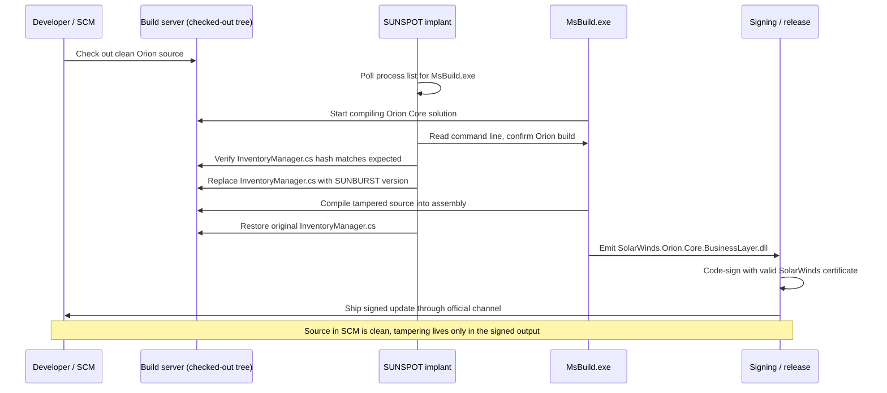
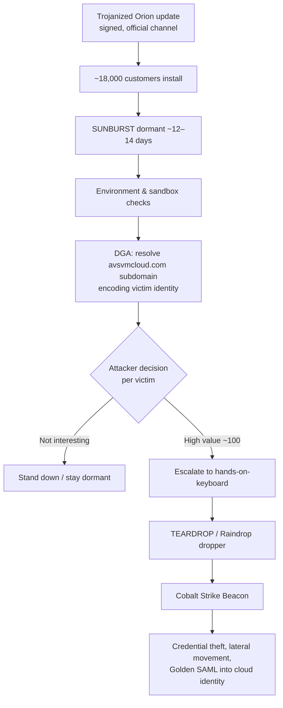
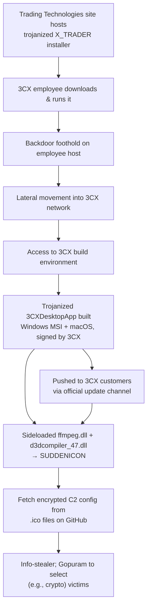
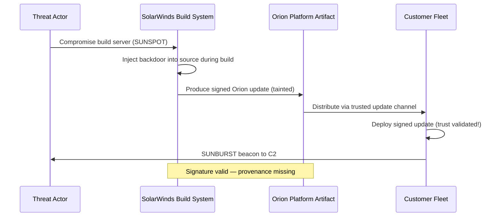
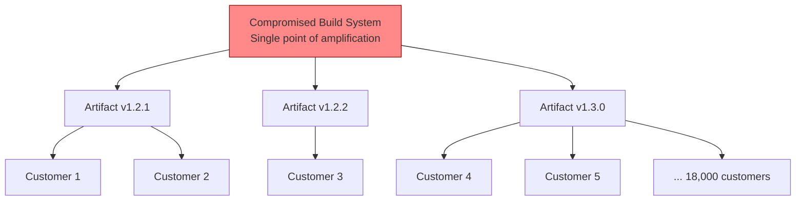

# Chapter 3 — Case Studies I: Build System Compromise — SolarWinds and 3CX

*What this chapter covers.* This is the first of three case-study chapters, and it deals
with the highest-leverage attack in the entire supply chain: compromise of the build
system itself. When an adversary owns the machine that turns source into shipped binaries,
they inherit every downstream trust relationship the vendor has spent years earning. The
source in version control stays clean. The code review passes. The signing key signs
faithfully. The customer's update client verifies the signature and installs, exactly as
designed. Nothing along the way is technically malfunctioning — and that is the point. We
examine two incidents in depth: **SolarWinds / SUNBURST** (2019–2020), still the reference
example of a build-time software implant, and **3CX** (2023), the first widely documented
*cascading* supply chain attack, where one build compromise seeded another.

Learning goals — after this chapter you should be able to:

- Reconstruct the SolarWinds intrusion timeline and explain, at the level of process
  mechanics, how the SUNSPOT implant tampered with Orion builds without touching source
  control.
- Describe SUNBURST's operational design — dormancy, domain-generation-algorithm (DGA)
  command-and-control, victim profiling, and staged hands-on-keyboard follow-on — and why
  each choice served the attacker's goals.
- Articulate precisely *why* code review, code signing, and vendor trust all failed to
  detect the compromise, and what a code signature does and does not prove.
- Explain the 3CX cascade (X_TRADER → 3CX → 3CX's customers) and the EDR
  false-positive-dismissal failure mode.
- Compare the two campaigns on dwell time, targeting, and tradecraft, and identify which
  controls — reproducible builds, provenance, build isolation, egress control, binary
  transparency — would plausibly have caught each.
- Reason about your own organization as *both* a consumer of vendor build outputs and a
  producer whose build farm is somebody else's SolarWinds.

A note on accuracy before we begin. Both incidents were investigated in public by multiple
credible teams — Mandiant/FireEye, CrowdStrike, Microsoft, and government agencies for
SolarWinds; CrowdStrike, SentinelOne, Mandiant, and Kaspersky for 3CX. Where those reports
agree, this chapter states facts plainly. Where a detail is disputed, uncertain, or was
never disclosed, the text says so rather than inventing precision. No quotes, CVE numbers,
or figures appear here that were not published by those investigators.

## The build system as the apex target

Recall the anatomy from Chapter 1: source is authored, dependencies are resolved, a build
system compiles and links, artifacts are signed and packaged, and a distribution channel
delivers them to consumers who verify and install. An attacker can strike at any stage, and
Chapters 4 and 5 examine strikes on dependencies and on source. The build stage is special
because it sits *after* the controls most organizations invest in — code review, branch
protection, commit signing — and *before* the controls customers rely on — signature
verification and vendor reputation. It is the one place where you can inject code that is
simultaneously invisible to the producer's own developers and fully trusted by the
producer's customers.

Chapter 2's taxonomy called this the **build/CI compromise** class. Its defining property
is trust inheritance. A signed release is a statement: "this artifact was produced by the
holder of this key." Customers reasonably treat that as "this artifact is what the vendor
intended to ship." The gap between those two statements — between *provenance of the
signer* and *integrity of the build* — is exactly the gap SolarWinds and 3CX drove through.
Both are unusually instructive because the adversaries were disciplined, well-resourced
nation-state teams who understood that gap and engineered specifically to live inside it.

## SolarWinds: the intrusion timeline

SolarWinds is a Texas-based vendor of IT management software. Its Orion platform is a suite
for network and infrastructure monitoring, deployed deep inside enterprise and government
networks — precisely the kind of software that holds broad credentials and talks to
everything, which made it an ideal beachhead.

The publicly reconstructed timeline, drawn from SolarWinds' own disclosures, Mandiant's
investigation, and CrowdStrike's SUNSPOT analysis, runs roughly as follows:

- **Around September 2019:** the actor gained access to the SolarWinds environment. The
  exact initial access vector was never conclusively established in public reporting; theories
  included compromised credentials and internet-facing systems, but SolarWinds and its
  investigators did not definitively confirm the first foothold.
- **October 2019:** investigators found evidence of a *trial* modification — the attackers
  injected benign test code into an Orion build to prove they could alter build output
  without detection, then watched to see whether anyone noticed. Nobody did. This
  reconnaissance run is a hallmark of a patient, professional operation.
- **February 20, 2020:** according to CrowdStrike, the **SUNSPOT** implant was deployed onto
  a SolarWinds build server. SUNSPOT is the tool that performed the actual source-swap
  during compilation (detailed in the next section).
- **March–June 2020:** trojanized Orion builds carrying the **SUNBURST** backdoor were
  compiled, signed, and released. The affected versions span roughly Orion Platform
  2019.4 HF5 through 2020.2.1, distributed as normal software updates through SolarWinds'
  update infrastructure.
- **June 2020:** the attackers removed SUNBURST from the build environment, ending the
  trojanized-build window before discovery. They had operated cleanly for months.
- **December 8, 2020:** FireEye (whose consulting arm is Mandiant) disclosed that it had
  been breached and that its internal Red Team tooling had been stolen. Investigating its
  own compromise led FireEye to the Orion vector.
- **December 13, 2020:** FireEye and SolarWinds publicly disclosed the SUNBURST backdoor in
  Orion. CISA issued Emergency Directive 21-01 the same week ordering U.S. federal agencies
  to disconnect or power down affected Orion products.
- **January 5, 2021:** a joint statement by the Cyber Unified Coordination Group (FBI, CISA,
  ODNI, with NSA support) assessed the actor as "likely Russian in origin."
- **April 15, 2021:** the U.S. government formally attributed the operation to Russia's
  foreign intelligence service, the **SVR** — the actor tracked across industry as **APT29 /
  Cozy Bear**, by Mandiant at the time as **UNC2452**, and by Microsoft as **Nobelium** (later
  renamed **Midnight Blizzard**).

Roughly **18,000** SolarWinds customers are believed to have downloaded and installed a
trojanized Orion update. That figure is the *exposure*, not the *exploitation*: of those,
the attackers hand-selected on the order of **100** organizations for active, hands-on-keyboard
intrusion. Publicly named victims included multiple U.S. federal departments (among them the
Treasury, Commerce, State, Energy, Homeland Security, and the National Institutes of Health),
as well as Microsoft and FireEye itself. The mismatch between 18,000 and 100 is not
sloppiness — it is the design, and we return to it below.

## SUNSPOT: subverting the compiler

SUNSPOT is the most interesting artifact in the whole affair, because it is a purpose-built
tool for tampering with a build *without leaving a trace in source control*. CrowdStrike's
analysis (published January 11, 2021) describes its mechanics; the summary here follows that
report.

SUNSPOT ran on the build server as a persistent implant. Its job was to wait for an Orion
build to happen and hijack it. The relevant facts:

- **It monitored for `MsBuild.exe`.** SolarWinds built Orion with MSBuild, Microsoft's build
  engine. SUNSPOT periodically enumerated running processes looking for MSBuild instances.
- **It identified Orion builds specifically.** When it found an MSBuild process, it read that
  process's command line to determine whether the build in progress was the Orion Core
  solution — not just any build on the machine, but the specific target the operation cared
  about.
- **It swapped a single source file during compilation.** Having identified an Orion build,
  SUNSPOT located the relevant source file in the checked-out working tree — the file
  publicly identified as **`InventoryManager.cs`** — and replaced it with a malicious version
  containing the SUNBURST backdoor code. The compiler then compiled the *attacker's* version
  of that file into the Orion assembly.
- **It restored the original immediately afterward.** Once compilation of the tampered file
  had been consumed by the build, SUNSPOT wrote the legitimate source back to disk. The
  window during which malicious source existed on the filesystem was as short as the design
  allowed.

SUNSPOT was written defensively. It performed hash checks to confirm the source file it was
about to replace matched the version it expected; if the developers had changed
`InventoryManager.cs`, the mismatch would cause SUNSPOT to abort rather than risk producing
a broken build that would draw attention. It watched for compilation errors so that a failed
build — a very visible event — would not be triggered by its tampering. It used a named
mutex to avoid running twice concurrently. Every one of those choices is about *not getting
caught*: a failed or non-deterministic build is exactly the anomaly that a build engineer
investigates.

The consequence is the crux of the entire case:

> The malicious code never existed in SolarWinds' version control system. It existed only on
> the build server, only for the seconds between file-swap and restore, and only inside the
> resulting signed binary. Every artifact a developer could inspect — the Git history, the
> pull requests, the source in the IDE — was clean.



Two design lessons for a build-platform engineer fall out of this diagram immediately.
First, the attack targets the *gap between source and artifact*: any control that verifies
"the artifact corresponds to this reviewed source" would have had a chance; controls that
verify only the source, or only the signer, had none. Second, the build machine was a
long-lived, stateful host that an implant could persist on and observe over months. A build
node that is ephemeral — created fresh per build, destroyed after — denies an implant the
foothold SUNSPOT relied on. Both threads are picked up in the synthesis and in Book 4.

## SUNBURST: dormancy, DGA C2, and staged victim selection

The code SUNSPOT injected became **SUNBURST** (Microsoft's name; also **Solorigate**),
compiled into `SolarWinds.Orion.Core.BusinessLayer.dll` and shipped inside Orion. Its
runtime behavior is a study in patience and blending in.

**Dormancy.** After installation, SUNBURST did nothing for a substantial delay — publicly
reported as roughly **12 to 14 days**. A backdoor that phones home the moment an update
lands is easy to correlate with that update. A backdoor that waits two weeks breaks the
temporal link that a defender's timeline analysis depends on.

**Environmental checks and blending in.** On waking, SUNBURST performed reconnaissance
before doing anything overt: it checked for analysis and security tooling, examined the
domain it was running in, and confirmed it was in a real target rather than a sandbox or a
security researcher's lab. Its network traffic was designed to look like legitimate Orion
telemetry — it mimicked the **Orion Improvement Program (OIP)** protocol and stored
retrieved data in files resembling normal Orion configuration, so its C2 chatter hid inside
traffic a network defender would expect Orion to generate.

**DGA-based command and control.** SUNBURST located its controllers using a **domain
generation algorithm**. Rather than hard-coding a C2 domain (which a defender can block once
and for all), it encoded victim-identifying information into DNS subdomain labels under the
parent domain **`avsvmcloud.com`** and resolved them. The DNS response steered the implant:
most victims were told, in effect, to stand down; a chosen few were escalated. Because the
generated subdomain encoded a hash derived from the victim's environment, the attackers
could *profile who had called home* purely from passive DNS — and decide, per victim,
whether to proceed. (This DGA/DNS channel is also what enabled the eventual sinkholing of
`avsvmcloud.com` once it was identified.)

**Staged, hands-on-keyboard follow-on.** For the small set of high-value victims selected
from the ~18,000, the attackers escalated from the automated backdoor to interactive
intrusion. SUNBURST delivered a memory-only dropper — **TEARDROP**, and a related loader
**Raindrop** documented by Symantec — which loaded a customized **Cobalt Strike Beacon**.
From there the operation was manual: credential theft, lateral movement, and in cloud and
identity environments, forging SAML tokens (the "Golden SAML" technique) to move into
Microsoft 365 and Azure AD. The Orion backdoor was only the front door.



The 18,000-versus-100 gap is now legible as strategy. Mass distribution maximizes the number
of doors the attacker *could* open; selective activation minimizes the operational footprint,
noise, and exposure of opening them. Every activated implant is a chance to be caught. A
disciplined intelligence operation spends that risk only where the intelligence payoff
justifies it. This is the opposite of ransomware economics, where breadth *is* the payoff,
and it tells you what kind of adversary you are dealing with.

## Why it defeated the era's controls

It is tempting to read SolarWinds as a story of negligence. That reading is comforting and
mostly wrong. The uncomfortable truth is that the controls organizations were told to
implement in 2020 were, in this case, working as designed and still lost. Walk through them:

**Code review saw clean source.** Review operates on what is in the repository. SUNSPOT
never put anything in the repository; the malicious `InventoryManager.cs` existed only
transiently on the build host during compilation. There was nothing for a reviewer to catch,
no diff to reject. Static analysis of the source tree would have found nothing either,
because the source tree was authentic.

**The signing infrastructure faithfully signed malicious output.** SolarWinds signed the
trojanized `SolarWinds.Orion.Core.BusinessLayer.dll` with its genuine, valid code-signing
certificate. The signature was not forged and the key was not (as far as public reporting
established) stolen — the build pipeline handed the signer a malicious binary and the signer
did its job. To every customer, Windows Authenticode reported a valid signature from
SolarWinds, because it *was* a valid signature from SolarWinds.

**Customers had no provenance to check.** The vendor-trust model of the era was binary: is
this update signed by the vendor I bought the product from? Yes → install. There was no
notion a customer could verify of *how* the artifact was built — no statement that "this
binary was produced by this build pipeline, from this specific source commit, under these
conditions." Even a security-conscious customer had nothing to inspect between "valid
vendor signature" and "trust." The information needed to catch the attack did not exist in
any form the customer could obtain.

This is the single most important idea in the chapter, and it generalizes far beyond
SolarWinds:

> A code signature answers **who built it**, not **whether the build was honest**. It binds
> an artifact to an identity. It says nothing about the integrity of the process that
> produced the artifact. When the build system is the thing that is compromised, the
> signature is not a defense — it is the mechanism by which the compromise is laundered into
> something customers trust.

Every subsequent chapter of this suite that talks about *provenance* (SLSA in Book 4,
attestations and in-toto in Book 5) exists to close this specific gap: to make the honesty of
the build itself a verifiable property, distinct from the identity of the signer.

## Aftermath: regulation, enforcement, and an industry

SolarWinds did more than compromise its victims; it reset the policy and market landscape.

**Executive Order 14028.** On **May 12, 2021**, the White House issued EO 14028, "Improving
the Nation's Cybersecurity." It directed NIST to produce secure-software-development
guidance and pushed software bill of materials (SBOM) requirements and secure development
practices into the federal procurement process. The Order's software-supply-chain provisions
were a direct policy response to SolarWinds, and they are what put SBOMs and the NIST Secure
Software Development Framework (SSDF, NIST SP 800-218) on the roadmap of essentially every
vendor selling to the U.S. government. EO 14028 and its downstream guidance are treated in
Book 8, Chapter 1 — The Regulatory Landscape.

**SEC enforcement.** On **October 30, 2023**, the U.S. Securities and Exchange Commission
charged SolarWinds and its Chief Information Security Officer, Timothy Brown, with fraud and
internal-control failures related to disclosures about the company's cybersecurity posture —
a landmark in that it named an individual security executive. The case was legally contested:
in **July 2024**, a federal judge dismissed most of the SEC's claims, allowing only a narrower
set to proceed. The lasting significance for practitioners is less the legal outcome than the
signal it sent to boards — that security representations and controls are now matters of
securities-law exposure, which changed how CISOs document risk.

**The birth of an industry.** SolarWinds is, more than any single incident, what turned
"software supply chain security" from a niche research interest into a funded product
category and a board-level concern. SLSA (published by the Open Source Security Foundation in
2021), Sigstore's rapid adoption, the SBOM tooling ecosystem, and the reframing of build
systems as tier-0 infrastructure all accelerated sharply in its wake. Much of what the rest
of this suite describes is, historically, a reaction to this one campaign.

## 3CX: the first documented cascade

If SolarWinds proved a nation-state could weaponize a vendor's build, the **3CX** incident of
2023 proved something newer and, in a sense, worse: that a supply chain attack can be *seeded
by another supply chain attack*. It is the first widely documented **cascading** compromise —
one trojanized vendor product used to breach a second vendor, whose trojanized product then
reached that vendor's own customers.

3CX makes a widely used VoIP/PBX software phone. Its desktop client, **3CXDesktopApp**, is
deployed across large numbers of businesses. In late March 2023, CrowdStrike, SentinelOne, and
Sophos began flagging malicious behavior originating from the *signed, legitimately
distributed* 3CXDesktopApp — behavior their telemetry tied to the vendor's own software, not
to a third-party intruder. 3CX publicly confirmed the compromise on **March 30, 2023**, and
engaged Mandiant to investigate.

**How the outer compromise began.** Mandiant's investigation reached a striking conclusion:
3CX was itself breached through a supply chain attack. An employee downloaded and ran a
trojanized installer of **X_TRADER**, a trading application from **Trading Technologies**. The
X_TRADER installer had been backdoored (carrying a malware family Mandiant tracked in this
campaign, with the backdoor stage often referred to as VEILEDSIGNAL) and was distributed from
a site associated with Trading Technologies — even though X_TRADER had reportedly been
discontinued years earlier, the installer remained available to download. Running it gave the
attacker a foothold on the employee's machine; from there they moved laterally into 3CX's
network and, ultimately, into its **build environment**.

**How the inner compromise worked.** With access to 3CX's build environment, the attacker
produced trojanized 3CXDesktopApp builds for **both Windows and macOS**, distributed through
3CX's normal update mechanism and signed with 3CX's valid certificates. On Windows, the
malicious MSI shipped tampered, sideloaded DLLs — publicly identified as **`ffmpeg.dll`** and
**`d3dcompiler_47.dll`**. The technique is DLL sideloading: the legitimate application loads a
DLL by name from its own directory, and the attacker replaces that DLL (or a companion it
loads) with a malicious one. Here `ffmpeg.dll` loaded shellcode from `d3dcompiler_47.dll`,
where an encrypted payload had been appended to an otherwise valid-looking file. That payload,
tracked as **SUDDENICON**, retrieved a further stage.

**The GitHub-hosted C2 configuration.** SUDDENICON's next-stage location was not hard-coded as
a bare domain; it read encrypted command-and-control configuration from **icon (`.ico`) files
hosted in a GitHub repository** (published under an account named IconStorages). The icon
files rendered as ordinary images, but carried base64-encoded, encrypted data appended after
the image content. Using GitHub as a dead-drop for C2 config is a blending-in choice directly
analogous to SUNBURST hiding inside OIP traffic: outbound HTTPS to GitHub from a developer or
IT machine is unremarkable. GitHub removed the repository once it was identified. Final-stage
activity included an information stealer; Kaspersky separately reported a backdoor it named
**Gopuram** deployed to a subset of victims, notably cryptocurrency-related companies —
consistent with the actor's financial motivation.

**Attribution.** Mandiant attributed the 3CX intrusion to a cluster it tracked as **UNC4736**,
assessed with links to North Korean state actors — part of the broader activity grouped under
the **Lazarus** umbrella, and specifically consistent with the DPRK's long-running,
financially motivated **AppleJeus** campaigns against cryptocurrency and financial targets.
Unlike SolarWinds' espionage mission, 3CX's ultimate objective appears to have skewed toward
financial theft.



**The EDR false-positive-dismissal failure mode.** There is a specific operational lesson in
how 3CX was — and was not — caught. Endpoint detection and response (EDR) products *did* flag
3CXDesktopApp's behavior. But because the alerts named a signed, trusted, widely deployed
business application, some users and administrators treated them as false positives. In 3CX's
own community forums, early reports of security tools flagging the client were, initially, met
with skepticism and workaround advice rather than escalation. This is a general and dangerous
pattern: a signed binary from a known vendor enjoys a *reputational halo* that biases analysts
toward dismissing true positives about it. The very trust that made the attack work also
suppressed the signal that could have shortened it. When your detection tooling flags a
trusted vendor's signed software, "it's signed, it must be fine" is precisely the reasoning
the attacker is counting on.

## Synthesis: comparing the two campaigns

Strip away the specifics and both campaigns share one structure:

1. **Implant the build.** Gain persistent influence over the environment that turns source
   into artifacts (SUNSPOT on a SolarWinds build server; access to 3CX's build environment).
2. **Inherit the vendor's trust.** Produce artifacts that are, in every checkable respect, the
   vendor's genuine output.
3. **Sign the result.** Let the vendor's real signing process bless the malicious artifact,
   laundering it into something customers verify and accept.
4. **Distribute through the official channel.** Ship via the same update mechanism customers
   already trust and have whitelisted.

The differences are equally instructive:

| Dimension | SolarWinds / SUNBURST | 3CX |
|---|---|---|
| Actor | Russian SVR (APT29 / Nobelium / Midnight Blizzard) | DPRK-linked (UNC4736, Lazarus / AppleJeus) |
| Primary motive | Espionage | Financial (with espionage tradecraft) |
| Build tampering | SUNSPOT swaps source file during MSBuild compilation | Trojanized build env emits tampered signed installers |
| Initial access | Never conclusively established publicly | Cascading: trojanized X_TRADER installer |
| Cascade | No (direct vendor compromise) | Yes — first widely documented cascade |
| Approx. exposure | ~18,000 installs of trojanized Orion | Large 3CXDesktopApp install base |
| Targeting | ~100 selected for hands-on-keyboard follow-on | Broad delivery; select escalation (e.g., crypto firms) |
| Dwell time | Access ~Sept 2019; trojanized builds Mar–Jun 2020; found Dec 2020 | Access weeks-to-months prior; found late Mar 2023 |
| C2 tradecraft | DGA under avsvmcloud.com; OIP-mimicking traffic | Encrypted config in GitHub-hosted .ico files |
| Follow-on | TEARDROP/Raindrop → Cobalt Strike; Golden SAML | SUDDENICON → info-stealer; Gopuram to select victims |
| Signature status | Valid SolarWinds Authenticode signature | Valid 3CX signatures (Windows + macOS) |

The two most consequential contrasts are **dwell time** and **cascade**. SolarWinds' dwell —
over a year from initial access to public discovery, with clean trojanized builds shipping for
roughly three months and the implant then withdrawn before anyone noticed — reflects an
espionage actor optimizing for stealth and longevity. 3CX's cascade is the genuinely new
element: it collapses the tidy mental model in which "our vendors" are a fixed, auditable set.
Trading Technologies was not 3CX's vendor in any procurement sense; X_TRADER was software an
individual employee happened to run. Yet it was the entry point. Your effective supply chain
includes not just what your organization buys, but what runs on the machines of the people who
build what you buy — recursively, all the way down.

## What would have caught it

No single control would have stopped both campaigns, but several would have raised the
attacker's cost or created a detection opportunity. Each is developed in later books; the
point here is to connect the failure to the fix.

**Reproducible builds and verified provenance.** A **reproducible build** is one where the
same source, deterministically, yields a bit-for-bit identical artifact. If SolarWinds — or an
independent party — had rebuilt Orion from the tagged source commit and compared hashes, the
SUNSPOT-tampered binary would not have matched the binary a clean rebuild produced, because the
tampering existed only in the build, not the source. Reproducibility turns "trust the build
server" into "verify the artifact against the source," and it is exactly the property SUNSPOT
was engineered to keep out of anyone's reach. **Provenance** — a signed, verifiable statement
of what source, what builder, and what parameters produced an artifact — is the customer-facing
half: with SLSA-style provenance, a customer could ask "was this built by the expected pipeline
from the expected commit?" rather than merely "is it signed?" Reproducible and hermetic builds
are the subject of Book 4, Chapter 2; SLSA provenance is Book 4, Chapter 3.

**Build isolation and integrity monitoring.** SUNSPOT depended on a long-lived, stateful build
host it could persist on and observe over months. **Ephemeral build environments** — a fresh,
immutable, minimal environment created per build and destroyed after — deny an implant that
foothold; there is no persistent process to poll for `MsBuild.exe` across builds. Integrity
monitoring on the build host (file-integrity monitoring, process allow-listing) would at least
have made a persistent implant and mid-build file-swaps into observable events. Ephemeral and
isolated build environments are Book 4, Chapter 8.

**Egress control on build machines.** Build machines should talk to a small, known set of
destinations: source, artifact repositories, and package mirrors. A build host — or a
build-adjacent implant — reaching out to novel domains is a strong anomaly. Strict egress
allow-listing would not by itself have stopped the source-swap, but it constrains both the
implant's ability to be updated and, more broadly, the class of exfiltration and staging
channels the operation relies on. Build observability and anomaly detection are Book 4,
Chapter 9.

**Binary transparency.** Borrowing from Certificate Transparency, **binary transparency**
publishes an append-only, publicly verifiable log of the artifacts a vendor releases. It does
not by itself prove a build was honest, but it removes the attacker's ability to serve a
tampered artifact to a subset of victims quietly, and it gives defenders and researchers a
durable, tamper-evident record to audit against. Transparency logs — the Merkle-tree
mechanics, Rekor, and the lessons from Certificate Transparency — are Book 5, Chapter 5.

For 3CX specifically, the same provenance and reproducibility controls apply to 3CX's own
builds. And the *cascade* points at a further discipline: treating the software your engineers
run on build-adjacent and privileged workstations as part of your attack surface — application
allow-listing, and not running discontinued, unmaintained third-party tools like a
years-abandoned X_TRADER on machines that can reach your build network. Finally, the
false-positive dismissal is a process fix, not a technology one: EDR alerts on signed vendor
software must be escalated and investigated, not waved off because the binary carries a
reputable signature.

## Distributed-systems lens

For a senior engineer running large backend systems, the operative reframing is this: **your
organization sits on both sides of every one of these incidents at once.**

You are a **consumer**. Every vendor agent, every observability collector, every IT-management
tool, every base image and CI plugin you pull is in *your* supply chain the moment it runs
inside your perimeter — exactly as Orion was in the chains of 18,000 organizations that never
thought of SolarWinds as part of their build. A software phone client or a discontinued trading
app is not obviously "supply chain" until it is the thing that owns you. The consumer-side
obligations that follow are concrete: maintain an inventory of what runs where and with what
privileges; prefer vendors who publish verifiable provenance and who can tell you what commit
and pipeline produced a given release; and treat EDR detections on signed third-party software
as first-class incidents rather than noise. Do not grant a monitoring agent broad credentials
and network reach without asking what happens when *its* build is the one that was
compromised.

You are also a **producer**. If you operate an internal build farm, a platform team's shared
CI, or a base-image factory, then to every team and service downstream of you, **your build
system is somebody's SolarWinds.** A compromise of your central build platform inherits the
trust of every service it produces, and in a large organization that blast radius can be the
entire fleet. The implication is organizational, not just technical: **build infrastructure is
a tier-0, production-critical system** and must be governed like one. That means the same rigor
you apply to your most sensitive production database — least-privilege access, mandatory review
for changes, immutable and ephemeral runners, strict egress, integrity monitoring, and
break-glass procedures — applied to the pipeline itself. In too many organizations the build
farm is treated as internal plumbing that any engineer can modify, running on long-lived hosts
with broad network access and weak auditing. That is precisely the SolarWinds build server's
threat profile.

There is a scale multiplier that makes this sharper for distributed backends than for a
single-product vendor. SolarWinds compromised one product's build. A modern platform team's CI
compromise can, in a single stroke, poison the artifacts of hundreds of microservices across
dozens of teams — a fan-out SolarWinds never had. The centralization that makes a shared build
platform efficient is the same centralization that makes it catastrophic to lose. High deploy
frequency compounds it: a poisoned build promoted through an automated CD pipeline can reach
production in minutes, across many services, before any human looks. The controls in Book 4 —
provenance, hermeticity, ephemerality, egress control, observability — are not compliance
theater for such an organization; they are the difference between a contained incident and a
fleet-wide one.

The through-line from SolarWinds to 3CX to your own platform is a single sentence: **trust in
an artifact should derive from verifiable properties of how it was built, not from the identity
of who signed it or the reputation of who shipped it.** Building the machinery to make "how it
was built" verifiable — for the software you consume and the software you produce — is the
subject of nearly everything that follows.

## Key takeaways

- The build system is the apex target because it sits after the producer's own review and
  signing controls and before the consumer's verification controls. Compromising it lets an
  attacker inject code that is invisible to the vendor's developers and fully trusted by the
  vendor's customers.
- SUNSPOT tampered with SolarWinds' Orion builds by monitoring for `MsBuild.exe`, confirming an
  Orion build, swapping `InventoryManager.cs` for a SUNBURST-carrying version during
  compilation, then restoring the original — so source control stayed clean and the tampering
  lived only in the signed binary.
- SUNBURST was engineered for stealth: ~12–14 days dormancy, DGA C2 under `avsvmcloud.com`,
  OIP-mimicking traffic, per-victim profiling, and hands-on-keyboard follow-on (TEARDROP/
  Raindrop → Cobalt Strike) for only ~100 of ~18,000 exposed organizations.
- Code review, code signing, and vendor trust all failed *while working as designed*. A code
  signature proves **who built it**, not **that the build was honest**; closing that gap
  requires verifiable build provenance, which did not exist for customers to check.
- SolarWinds reset policy and markets: EO 14028 (May 12, 2021), SEC charges against SolarWinds
  and its CISO (October 30, 2023, with most claims dismissed in July 2024), and the emergence
  of the modern supply chain security industry.
- 3CX (disclosed March 30, 2023) is the first widely documented cascading attack: a trojanized
  X_TRADER installer breached 3CX, whose compromised build environment then shipped trojanized,
  signed 3CXDesktopApp (sideloaded `ffmpeg.dll`/`d3dcompiler_47.dll` → SUDDENICON, C2 config in
  GitHub-hosted `.ico` files) to its customers. Attributed to DPRK-linked UNC4736 (Lazarus /
  AppleJeus).
- 3CX also illustrates the EDR false-positive-dismissal failure mode: alerts against a signed,
  trusted vendor binary were initially waved off, letting the reputational halo of a valid
  signature suppress a true positive.
- Reproducible builds, verified provenance, ephemeral/isolated build environments, egress
  control on build hosts, and binary transparency each would have raised the attacker's cost or
  created detection opportunities — and each is developed later (Book 4, Chapters 2–3, 8–9;
  Book 5, Chapter 5).
- Your organization is both a consumer (vendor agents and tools are in *your* chain) and a
  producer (your build farm is someone's SolarWinds, with a fan-out across many services a
  single vendor never had). Treat build infrastructure as tier-0, production-critical
  infrastructure.


### SolarWinds SUNBURST injection flow




### Build-system chokepoint: one compromise, many victims




### 3CX vs SolarWinds: comparison of build-compromise vectors

```mermaid
flowchart LR
    subgraph SW["SolarWinds (2020)"]
        SW1["Build server<br/>compromise"] --> SW2["Source injection<br/>at build time"] --> SW3["Signed artifact<br/>via update channel"]
    end
    subgraph CX3["3CX (2023)"]
        CX1["Upstream dependency<br/>compromise"] --> CX2["Trojanized<br/>FFmpeg build"] --> CX3["Bundled installer<br/>signed & distributed"]
    end
    SW3 -. both bypass .-> TRUST["Trust in signature<br/>without provenance"]
    CX3 -. both bypass .-> TRUST
    style TRUST fill:#ffcc00,stroke:#333
```

## Further reading

- CrowdStrike, "SUNSPOT: An Implant in the Build Process" (January 11, 2021) — the primary
  technical account of the build-time source-swap mechanism.
- FireEye / Mandiant, "Highly Evasive Attacker Leverages SolarWinds Supply Chain to Compromise
  Multiple Global Victims with SUNBURST Backdoor" (December 13, 2020) — original SUNBURST
  disclosure and analysis.
- Microsoft, "Analyzing Solorigate, the compromised DLL file that started a sophisticated
  cyberattack" (December 18, 2020) and subsequent Nobelium/Midnight Blizzard write-ups.
- Symantec Threat Hunter Team, "Raindrop: New Malware Discovered in SolarWinds Investigation"
  (January 18, 2021).
- CISA Emergency Directive 21-01, "Mitigate SolarWinds Orion Code Compromise" (December 2020).
- U.S. Government joint statements attributing the SolarWinds campaign to the Russian SVR
  (Cyber Unified Coordination Group, January 5, 2021; White House, April 15, 2021).
- Executive Order 14028, "Improving the Nation's Cybersecurity" (May 12, 2021), and NIST SP
  800-218, the Secure Software Development Framework (SSDF).
- U.S. SEC litigation release and complaint, SEC v. SolarWinds Corp. and Timothy G. Brown
  (October 30, 2023), and the July 2024 court order dismissing most claims.
- Mandiant, "3CX Software Supply Chain Compromise Initiated by a Prior Software Supply Chain
  Compromise" (April 20, 2023) — the X_TRADER cascade and UNC4736 attribution.
- SentinelOne, "SmoothOperator" 3CX supply chain analysis (March 2023), and CrowdStrike's
  intelligence reporting on the 3CXDesktopApp intrusion (late March 2023).
- Kaspersky, "Gopuram backdoor deployed through 3CX supply chain attack" (April 3, 2023).
- SLSA (Supply-chain Levels for Software Artifacts), v1.0 specification — forward reference for
  the provenance model that addresses the build-integrity gap (see Book 4, Chapter 3).
```
