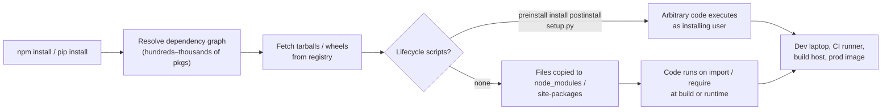
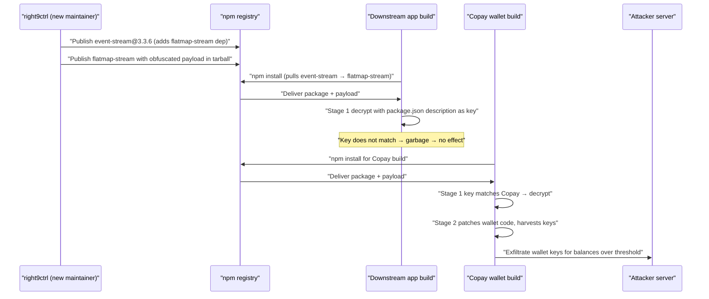
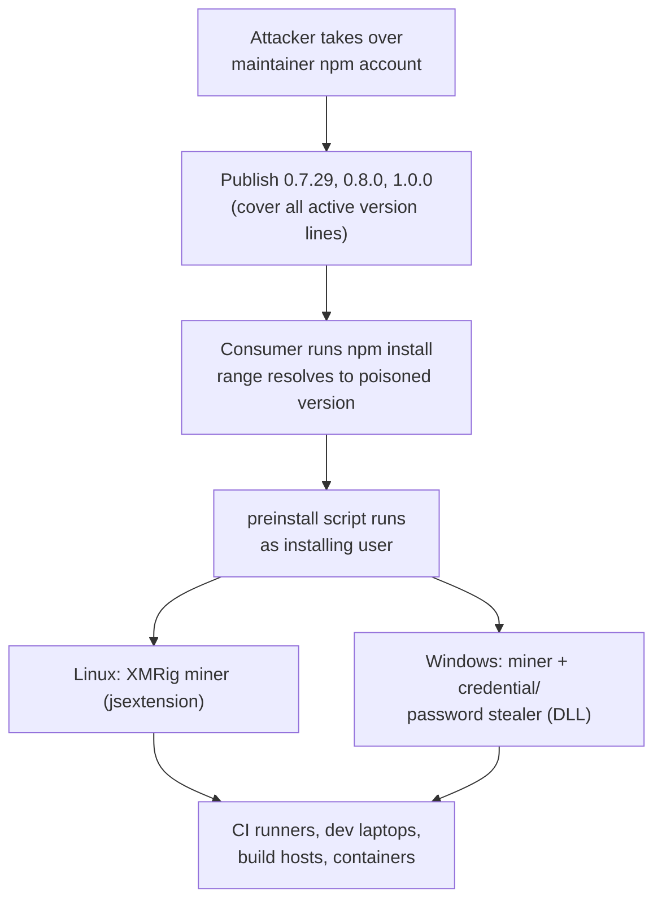
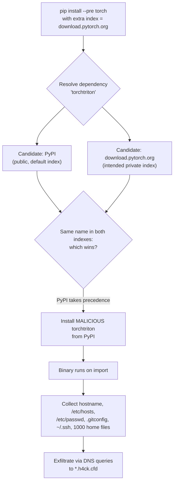
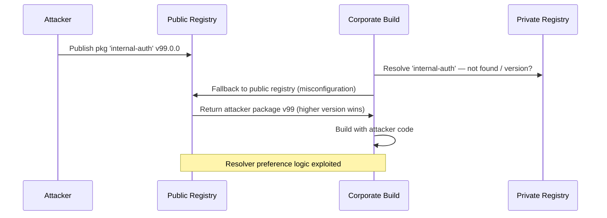
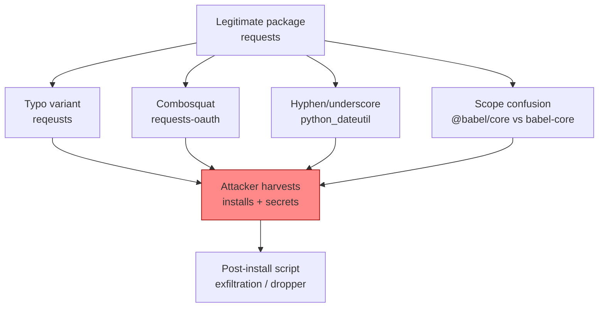
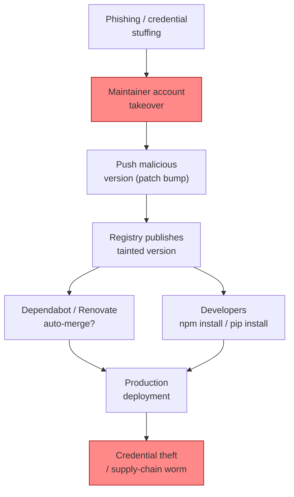

# Chapter 4 — Case Studies II: Dependency Attacks — event-stream, ua-parser-js, node-ipc, PyTorch

*What this chapter covers.* This is the second of three case-study chapters. Chapter 3 dealt
with compromise of a vendor's *build system* — the apex target, where an attacker inherits a
vendor's entire trust chain. This chapter deals with the channel that reaches victims far more
frequently and far more cheaply: the **open-source dependency graph**. Every service you run
resolves a tree of transitive packages from a public registry — npm, PyPI, and their peers —
and executes whatever code those packages contain, at install time and at runtime, with the
privileges of whoever ran `npm install` or `pip install`. That resolution is automatic, it is
deep, and almost nobody reads what it pulls. We examine four incidents that abused this channel
through four *different* mechanisms: **event-stream** (2018), a maintainer handoff exploited to
plant a targeted payload; **ua-parser-js** (2021), a maintainer-account takeover that shipped
crypto-mining and credential-stealing install scripts; **node-ipc** (2022), a legitimate
maintainer weaponizing his own package as protestware; and the **PyTorch / torchtriton**
incident (2022), a dependency-confusion attack that exploited how Python's package resolver
prioritizes indexes. The point of putting them side by side is that they share almost no
technical mechanism — and yet all four reached victims because a package manager did exactly
what it was designed to do.

Learning goals — after this chapter you should be able to:

- Explain the maintainer-handoff and transitive-dependency dynamics behind event-stream, and
  how a payload can be *targeted* to decrypt and activate only inside one specific victim's
  build.
- Describe how an npm account takeover (ua-parser-js) turns install-time lifecycle scripts
  (`preinstall`/`postinstall`) into arbitrary code execution on every consumer's machine, and
  why download count is a proxy for blast radius.
- Articulate why "protestware" like node-ipc is a distinct and uncomfortable category — the
  *legitimate owner* turning a package malicious — and why that specific case defeats signing
  and provenance rather than being caught by them.
- Trace the index-resolution logic behind the PyTorch dependency-confusion attack and explain
  precisely why mixing a private index with public PyPI, without isolation, is dangerous by
  default.
- Compare the four incidents on attacker type, abused channel, and effective control, and map
  each to the concrete mitigations — lockfiles with integrity hashes, `--ignore-scripts`, index
  isolation, dependency review, and provenance — that would have mattered.
- Reason about all of this at fleet scale, where thousands of transitive dependencies span
  hundreds of services and a single popular package's compromise is a fan-out event.

A note on accuracy. Each incident here was documented publicly and in detail — by the npm
security team, by GitHub and CISA advisories, by Snyk and other vendors, and by the affected
projects themselves. Where those sources agree, the text states facts plainly. Where a version
number, date, or motive is uncertain or was described only approximately in public reporting,
the text says so rather than inventing precision. No CVE numbers, dates, package versions, or
quotes appear here that were not published by those sources.

## The dependency channel

Chapter 1's anatomy separated the stages of a supply chain: authoring, dependency resolution,
build, signing, distribution, and consumption. Chapter 3 attacked the *build* stage. This
chapter attacks the *dependency-resolution* stage — and it is worth being precise about why
that stage is so exposed.

When you run `npm install express` or `pip install torch`, the package manager resolves a
directed graph. `express` does not just install `express`; it installs its dependencies, and
*their* dependencies, recursively, until the graph closes. A typical Node service resolves
hundreds to low thousands of packages; the overwhelming majority are **transitive** —
dependencies of dependencies you never named and, in practice, never audited. Two properties of
this graph make it a superb attack channel:

**Execution, not just inclusion.** Installing a package is not a passive copy. npm supports
lifecycle scripts — `preinstall`, `install`, `postinstall` — that run *arbitrary shell commands
during installation*, with the privileges of the user running the installer. pip executes
`setup.py` for source distributions, and any code in a package's top-level module runs on first
`import`. A dependency, transitive or direct, therefore gets code execution on developer
laptops, CI runners, and production build hosts as a matter of routine. The registry is not a
document store you read from; it is a code-execution surface you invoke.

**Trust by transitivity.** You made a decision to trust `express`. You did not make a decision
to trust the four-hundredth package in its transitive closure, maintained by a volunteer you
have never heard of, whose account security you cannot see and whose next release you will pull
automatically the moment your version range permits it. Trust does not compose the way the graph
assumes it does. Every edge in the dependency graph is an implicit statement that you trust the
target as much as the source — and the graph is large enough that no human ever checks whether
that is true.



The four incidents in this chapter each pry at a different joint of this machine. Read them not
as a catalogue of bad luck but as a demonstration that the channel itself — automatic, deep,
executing — is the vulnerability, and the specific payloads are interchangeable.

## event-stream: a maintainer handoff and a targeted payload

`event-stream` was a popular npm utility library for working with Node streams, authored by
**Dominic Tarr**, a prolific and well-respected open-source maintainer. By late 2018 it was
being downloaded on the order of **two million times per week** — not because most of those
consumers depended on it directly, but because it sat deep in the transitive closure of many
other packages. It is the archetype of the small, old, ubiquitous utility that everyone ships
and nobody thinks about.

**The handoff.** Tarr had long since stopped using `event-stream` himself. Like thousands of
maintainers of thousands of small libraries, he was carrying an unpaid maintenance burden for
software he no longer had any personal stake in. In 2018, a user operating under the npm/GitHub
handle **right9ctrl** offered to take over maintenance. Tarr, seeing no reason to refuse free
labor on a package he no longer cared about, granted publish rights and handed it over. This is
not an exotic event. It is the *normal* lifecycle of abandoned-but-load-bearing open source, and
it is precisely the point: the attacker did not break in. He *volunteered*, and the social norms
of open source welcomed him.

**The injection.** Having gained publish rights, right9ctrl published `event-stream@3.3.6`, which
added a new dependency: a package called **flatmap-stream**. On its face this was unremarkable —
a small stream utility, plausibly useful. The malicious code was not in `event-stream` itself and
was not, initially, obviously present in `flatmap-stream` either. Two details made it hard to
catch:

- **The payload lived in the published tarball, not the source repository.** The malicious code
  was present in the minified JavaScript shipped in `flatmap-stream`'s npm package but was absent
  from the corresponding GitHub source. Anyone auditing the project by reading its repository —
  the natural thing to do — would see clean code. This is the same *source-versus-artifact
  divergence* that defined SolarWinds in Chapter 3: what you can review is not what actually
  ships.
- **The payload was heavily obfuscated and multi-stage.** It did not do anything overtly
  malicious on a generic machine. It carried an encrypted blob and only came alive under a
  specific condition, which is what made it so quiet for so long.

**The targeting.** This is the detail that makes event-stream a landmark rather than just another
malicious package. The payload was a two-stage decryption designed to activate in exactly one
environment. The first stage decrypted itself using a key derived from the `description` field in
the top-level `package.json` of whatever application had pulled the dependency in. In other words,
the malware only unlocked when it found itself inside a build whose project metadata matched what
the attacker expected. That target was **Copay**, a Bitcoin wallet application published by BitPay
(and the related `copay-dash` package). On any other project the decryption produced garbage and
nothing happened; inside a Copay build, the second stage decrypted and activated. That stage
patched Copay's own wallet code to harvest account details and private keys for wallets above a
balance threshold and exfiltrate them to an attacker-controlled server. The affected Copay
releases were roughly versions **5.0.2 through 5.1.0**.

Think about what the environment-keyed decryption bought the attacker. A researcher who downloaded
`flatmap-stream` to inspect it, or ran it in any context other than a Copay build, would observe
*nothing malicious*, because the malicious behavior was cryptographically gated to a target the
researcher was overwhelmingly unlikely to reproduce. Targeting was not just about who got robbed;
it was a *stealth mechanism*, an anti-analysis measure built directly into the payload — the
dependency-channel analogue of SUNBURST's sandbox checks.



**How it was found.** The gate that made the payload stealthy is also, indirectly, what exposed
it. A developer noticed a **runtime deprecation warning** traced to `flatmap-stream`: the payload
used `crypto.createDecipher`, an API Node had deprecated. Pulling that thread — why is this
obscure transitive dependency doing crypto at all? — led to the obfuscated blob and then to the
whole scheme. The issue was raised publicly on the `event-stream` GitHub repository in
**November 2018**, and the npm security team published a detailed post-mortem shortly after (late
November 2018). The malicious `flatmap-stream` was removed from the registry.

**Lessons.** Three, each of which recurs through the rest of this chapter.

- *Maintainer burnout and handoff are a first-class supply-chain risk.* The attack's entire
  initial-access phase was a polite offer to help. There was no vulnerability to patch. Book 1,
  Chapter 8 — The Open Source Ecosystem — treats the sustainability crisis this exposes.
- *Transitivity is the blast-radius multiplier.* Almost no victim depended on `event-stream`
  directly. They depended on something that depended on something that depended on it. Your risk
  is the whole closure, not the packages you chose.
- *Targeted payloads defeat generic analysis.* A payload that only activates for one victim will
  survive casual inspection indefinitely. General-purpose scanning is necessary but not
  sufficient against an adversary willing to gate their code.

## ua-parser-js: account takeover and weaponized install scripts

`ua-parser-js` is a small, extremely widely used JavaScript library that parses browser
User-Agent strings into structured data. By 2021 it was being downloaded on the order of several
million times per week and sat in the dependency graphs of a large fraction of the web ecosystem
— again, mostly transitively. Its maintainer is **Faisal Salman**.

**The takeover.** On **October 22, 2021**, an attacker who had gained control of the maintainer's
npm publishing account pushed malicious releases: versions **0.7.29**, **0.8.0**, and **1.0.0**.
Note the spread across major-version lines. Publishing a poisoned release on each active line
maximizes the chance of matching consumers' version ranges: a project pinned to `0.7.x`, one on
`0.8.x`, and one on `1.x` would each pull the corresponding malicious version. This was not a
handoff or a maintainer gone rogue; it was straightforward account compromise — the credentials
of a trusted publisher used to ship malware under a trusted name.

**The payload.** The malicious versions carried a **`preinstall` lifecycle script**. This is the
crux: the moment any consumer ran `npm install` and resolved one of these versions, the script
executed automatically, before the package was even fully installed, with the privileges of the
installing user. On a developer laptop that is the developer; on a CI runner it is often a
service account with credentials and network reach. The script dropped platform-specific
payloads:

- On **Linux**, it fetched and ran a cryptcurrency miner — an **XMRig**-based Monero miner
  delivered as a binary the script named `jsextension`.
- On **Windows**, it ran the same class of miner and additionally dropped a **credential- and
  password-stealing** component (delivered as a DLL) that harvested secrets from the machine.

So a package whose entire legitimate job is to parse a string became, for anyone who installed
the poisoned version, a coin-miner and an infostealer running at install time. There was no
exploit and no user interaction beyond the install every CI pipeline performs thousands of times
a day.



**Detection and response.** Salman regained control of the account quickly. He recognized the
compromise — reportedly tipped by a flood of unusual account activity — deprecated the malicious
versions, and published clean patched releases (**0.7.30**, **0.8.1**, **1.0.1**). A GitHub
Security Advisory was issued, and **CISA published an alert on October 22, 2021** warning that a
popular npm package had been used to distribute malware and directing consumers to check for and
remove the affected versions. Because the malicious versions were live for a matter of hours, the
window was short — but with millions of weekly downloads and continuous CI, "a matter of hours"
still means a large number of machines.

**Lessons.**

- *npm account security is supply-chain security.* The entire attack reduces to one compromised
  publisher credential. Two-factor authentication on registry accounts — later made mandatory by
  npm for high-impact packages — is the specific control that raises the cost of this class of
  attack. Package-signing and provenance help downstream consumers *verify* who published, but
  the first line is not letting the attacker become the publisher.
- *Install scripts are arbitrary code execution and should be treated as such.* The payload
  needed nothing more than the lifecycle-script feature that npm runs by default. `npm install
  --ignore-scripts`, and CI that installs with scripts disabled except where explicitly required,
  removes the automatic-execution primitive this attack depended on. Install-script hardening is
  developed in Book 2.
- *Download count is a blast-radius proxy.* The reason this incident mattered — and got a CISA
  alert within hours — is popularity. When you are choosing dependencies, the download count that
  reassures you ("everyone uses it, it must be fine") is the same number that tells an attacker
  where to aim. Popularity is an asset for the ecosystem and a target list for the adversary.

## node-ipc: when the legitimate maintainer is the attacker

The first two incidents involved an outsider — a volunteer who turned out to be malicious, and a
thief who stole a maintainer's credentials. **node-ipc** is categorically different and, for the
trust model, more disturbing: the *real, legitimate owner* of the package deliberately turned it
into malware.

`node-ipc` is a widely used Node module for inter-process communication, maintained by
**Brandon Nozaki Miller**, who publishes under the handle **RIAEvangelist**. It is a transitive
dependency of many popular tools — including the Vue.js CLI — so its reach is broad.

**The act.** In **March 2022**, in response to Russia's invasion of Ukraine, the maintainer added
code to `node-ipc` that behaved destructively based on the machine's geography. Versions **10.1.1
and 10.1.2** (published around March 7–8, 2022) contained logic — deliberately obfuscated inside
the package — that performed an IP-geolocation lookup and, if the host was determined to be in
**Russia or Belarus**, recursively overwrote files on the filesystem with a heart emoji. This is
a wiper: destructive, indiscriminate within its target geography, and running with the privileges
of whatever process pulled in `node-ipc`. That destructive behavior was assigned
**CVE-2022-23812**.

After significant backlash, the destructive versions were pulled, but the maintainer continued to
ship a related module, **`peacenotwar`** (also his own), as a dependency. `peacenotwar`'s behavior
was milder — it wrote a file bearing a peace message (a `WITH-LOVE-FROM-AMERICA.txt` on the user's
desktop) — but the pattern was the same: a maintainer using his position in millions of dependency
graphs to run code expressing a political message on other people's machines. The umbrella term
that emerged for this is **protestware**: software sabotaged or repurposed by its own author to
make a political point.

**Why this is a trust-model problem, not a bug.** Stop and consider what defenses this defeats.
The malicious code was signed — insofar as anything on npm is — by the *genuine* maintainer. It
was published from the *legitimate* account, using the *correct* credentials, with the *correct*
2FA. There was no account takeover, no stolen key, no source-versus-artifact divergence in the
sense of an intruder hiding something. Every provenance and signing control we will spend Book 5
building answers the question "was this really published by the maintainer of record?" — and here
the answer is an emphatic *yes*. The maintainer of record is the attacker.

This is the uncomfortable ceiling on provenance. Provenance binds an artifact to an identity and a
process; it proves the chain is intact. It cannot tell you that the person at the end of an intact
chain has decided to harm you. When your threat model includes the maintainer themselves — burnout,
coercion, ideology, a bad day — signatures and attestations are simply the wrong tool. The tools
that help are the ones that constrain *behavior* regardless of who authored it: install-script
sandboxing, `--ignore-scripts`, egress control, pinning to reviewed versions rather than floating
ranges, and staging updates through an internal registry (below) so a hostile release does not
reach production the instant it is published.

**Lessons.**

- *"Legitimate but malicious" is a real quadrant of the threat model.* Most controls implicitly
  assume the maintainer is on your side and the problem is an impostor. node-ipc is the standing
  counterexample.
- *Floating version ranges let a hostile release auto-propagate.* Consumers with `^` or `~`
  ranges pulled the destructive versions automatically. A lockfile that pins exact versions and
  is only updated through review turns "the maintainer shipped a wiper at 3am" into "a proposed
  version bump that a human looks at."
- *Protestware corrodes the ecosystem's trust baseline.* The lasting damage is not the files
  overwritten; it is that node-ipc demonstrated, publicly, that a trusted maintainer *will*
  sometimes weaponize their reach — which forces every serious consumer toward defense-in-depth
  that assumes exactly that.

## PyTorch / torchtriton: dependency confusion in the Python ecosystem

The fourth incident abused neither a handoff, a stolen credential, nor a maintainer's intent. It
abused the *resolution algorithm itself* — specifically, how `pip` chooses between multiple
package indexes. This is **dependency confusion** (also called substitution or namespace
confusion), and the PyTorch case is its clearest ecosystem-scale illustration.

**The setup.** PyTorch's **nightly** builds depended on a package named **`torchtriton`** — a
wrapper around Triton, the GPU-kernel compiler. That dependency was intended to be pulled from
**PyTorch's own package index** (`download.pytorch.org`), not from public PyPI. Users installed
nightly builds with a command that pointed pip at PyTorch's index in addition to the default.

Here is the flaw, and it is a flaw in the *default composition of indexes*, not in PyTorch's code.
When pip is given an extra index (or when the default PyPI index remains in play alongside a
private one), and a package name exists in **both** indexes, pip does not treat the private index
as authoritative for that name. It considers candidates from all configured indexes and applies
its normal selection — and in this configuration, the public PyPI copy took precedence. So if an
attacker uploads a package to **PyPI** with the *same name* as a package you host privately, pip
may fetch the attacker's public package instead of your intended private one.

**The attack.** Between roughly **December 25 and December 30, 2022**, a malicious package named
`torchtriton` was present on **PyPI**. Because PyPI took priority in the resolution, users who
installed the PyTorch nightly during that window pulled the **malicious PyPI `torchtriton`**
rather than the benign one from PyTorch's index. The malicious package carried a binary that ran
on import and functioned as an infostealer. Per PyTorch's published advisory, it collected system
fingerprinting and secrets, including: the machine's **nameserver information** (`/etc/resolv.conf`),
**hostname**, **current username**, the contents of **`/etc/hosts`** and **`/etc/passwd`**, the
user's **`.gitconfig`** and **SSH keys** (`~/.ssh`), and up to the first **1,000 files** in the
user's home directory. It exfiltrated this data by **encoding it into DNS queries** to an
attacker-controlled domain (`*.h4ck.cfd`) — a DNS-tunnelling channel that blends into ordinary
name-resolution traffic and often survives egress filtering that would block direct HTTP.



**Response.** PyTorch published an advisory around the **end of December 2022 / early January
2023**. Their remediation is instructive because it is the standard defensive playbook for
dependency confusion: they **renamed** the real dependency from `torchtriton` to
**`pytorch-triton`** and **registered a placeholder `torchtriton` package on PyPI themselves** so
that no attacker could re-claim the abandoned name. They advised anyone who had installed the
nightly during the affected window to uninstall it and the malicious package and rotate any
secrets that might have been exposed. The person who uploaded the package publicly claimed it was
**research** — a demonstration of the confusion technique rather than a criminal operation — a
claim that echoes the broader dependency-confusion research disclosed in 2021. Whatever the
intent, the payload exfiltrated real secrets from real machines, which is precisely why "it was
just research" is not an exculpatory technicality for anyone whose SSH keys left the building.

**Lessons.**

- *Index priority is a security property, not a convenience setting.* The vulnerability is that a
  private name and a public name collide and the public side wins. The fix is **isolation**:
  never let a private dependency be satisfiable from a public index. Concretely, that means using
  `--index-url` (which *replaces* the index set) rather than `--extra-index-url` (which *adds* to
  it) for private packages, pulling everything through a single controlled index/proxy that
  merges upstreams under your policy, and defensively registering your internal package names on
  the public registry so no one else can. The full mechanics — pip's resolution order, namespace
  reservation, scoped registries — are the subject of Book 2, Chapter 3.
- *Dependency confusion is a configuration attack.* No package was compromised; no maintainer was
  malicious; no credential was stolen. The attacker simply published a public package with a name
  your tooling would prefer. It is a property of how you compose indexes, and it is on by default
  in the most natural-looking install command.

## Adjacent incidents, same patterns

The four core cases are not isolated. Two brief pointers reinforce that they are instances of
recurring structure rather than freak events.

**colors.js / faker.js (January 2022): self-sabotage.** The maintainer **Marak Squires**
intentionally sabotaged his own widely used npm packages `colors` and `faker`. He pushed a
release of `colors` that entered an infinite loop printing garbage (including a "LIBERTY LIBERTY
LIBERTY" banner and corrupted text), and effectively emptied `faker`. Both were transitive
dependencies of enormous numbers of projects, so the breakage cascaded widely. The motive was a
protest over the economics of unpaid maintenance of software that large companies profit from —
the same maintainer-relationship fault line as node-ipc, expressed as denial-of-service rather
than as a wiper. Together, colors.js and node-ipc mark early 2022 as the moment "the maintainer
did it on purpose" became an operational category the industry could no longer wave away.

**The 2023–2024 malware wave.** In the years since, automated, high-volume malicious-package
campaigns became routine on both npm and PyPI: typosquats (packages named to be mistyped versions
of popular ones), mass-uploaded infostealers, and install-script droppers, published by the
thousands and taken down continuously. The individual packages are usually low-quality and
short-lived; the significance is the shift from *rare, targeted* dependency attacks like
event-stream to *industrialized background radiation* that any consumer of a public registry now
lives in. Malicious-package analysis at this scale is the subject of Book 2, Chapter 4.

## Synthesis: four mechanisms, one channel

The value of these four incidents is that they abuse the *same channel* through *four different
mechanisms* and are stopped by *four different controls*. Lay them side by side:

| Dimension | event-stream (2018) | ua-parser-js (2021) | node-ipc (2022) | PyTorch / torchtriton (2022) |
|---|---|---|---|---|
| Attacker type | Volunteer takeover (social) | Credential/account takeover | Legitimate maintainer (protestware) | Dependency-confusion researcher/attacker |
| Abused channel | Maintainer handoff + transitive dep | Compromised publish credential | Trusted maintainer's own reach | Public/private index name collision |
| How the payload ran | Runtime, patched Copay wallet code | `preinstall` lifecycle script | Runtime, on require of node-ipc | On import of malicious package |
| Payload | Targeted, env-keyed key stealer | XMRig miner + credential stealer | Geo-gated file wiper (heart emoji) | Infostealer, DNS exfil of secrets |
| Targeting | One victim (Copay), crypto-gated | Broad, all consumers | Geo-gated (RU/BY) | Broad, anyone installing nightly |
| Identifier | npm advisory (Nov 2018) | GitHub advisory + CISA alert | CVE-2022-23812 | PyTorch advisory (Dec 2022) |
| Signature/provenance would help? | Partly (source vs artifact) | Yes (verify publisher) | **No** — maintainer is the attacker | No — resolution, not authorship |
| Control that mattered most | Dependency review + lockfile | 2FA + `--ignore-scripts` | Pinning + install sandboxing | Index isolation (`--index-url`) |

Read down the "control that mattered most" column and the central lesson of the chapter appears:
**there is no single defense against the dependency channel, because the channel is abused at
different joints.** A 2FA mandate that would have stopped ua-parser-js does nothing against node-ipc,
where the credentials were never stolen. Provenance that would help you notice an impostor is
useless when the maintainer of record is the attacker. Index isolation that defeats
dependency confusion is irrelevant to a targeted payload inside a legitimately named package.
Defending the channel is inherently a defense-in-depth problem.

Still, some controls recur across multiple cases and are worth extracting:

- **Lockfiles with integrity hashes.** A lockfile (`package-lock.json`, `yarn.lock`,
  `poetry.lock`, `pip`'s hash-checking mode) pins the *exact* version and *cryptographic hash* of
  every resolved dependency, transitive included. It does two things at once: it stops a floating
  range from silently pulling a newly poisoned minor version (the node-ipc and event-stream
  auto-propagation vector), and its integrity hashes detect a tarball that was swapped out from
  under a version number. Lockfiles do not judge whether code is malicious; they make dependency
  changes *explicit and reviewable* instead of automatic.
- **`--ignore-scripts`.** Disabling install-time lifecycle scripts removes the arbitrary-code-
  execution-at-install primitive that ua-parser-js relied on entirely and that the 2023–2024 wave
  leans on constantly. Most legitimate packages do not need install scripts; the ones that do can
  be allow-listed. This is one of the highest-leverage single settings available to a consumer.
- **Dependency review.** Human or automated review of *what changes* when a dependency is added
  or bumped — new transitive packages, new maintainers, new install scripts, sudden version jumps
  — is what caught event-stream (a developer asking "why is this doing crypto?"). Tooling that
  surfaces these diffs at pull-request time turns the review into something that scales.
- **Index isolation.** Never let a private dependency be satisfiable from a public registry. Use
  a single controlled index/proxy, replace rather than extend the index set for private packages,
  and reserve your internal names publicly. This is the specific and complete answer to
  dependency confusion.
- **Provenance and signing.** Verifying who published a package and how it was built raises the
  cost of impostor-style attacks (ua-parser-js) and closes source-versus-artifact gaps
  (event-stream's tarball). It is necessary but — as node-ipc proves — not sufficient, because it
  cannot vet the intent of a legitimate author.

These threads are picked up in depth later. Dependency confusion is Book 2, Chapter 3.
Malicious-package analysis is Book 2, Chapter 4. Install-script hardening runs through Book 2.
Provenance and signing are Book 5.

## Distributed-systems lens

Everything above is uncomfortable for a single application. At **fleet scale** it becomes a
structural problem, and the reframing a senior backend engineer needs is about *aggregation* and
*chokepoints*.

**The fan-out is the whole game.** A large organization does not run one dependency graph; it runs
hundreds — one per service — and those graphs overlap heavily. The same handful of ubiquitous
utilities (`event-stream`-shaped packages: small, old, everywhere) appear in the transitive
closure of most of your services. That overlap means a *single* popular package's compromise is
not one incident; it is a simultaneous incident across every service that resolves it. When
ua-parser-js was poisoned, an organization with three hundred Node services did not have one
exposed pipeline — it had every CI job that ran `npm install` on an affected range in the exposure
window, all at once, each running the install script as whatever identity that runner holds. The
economics that make transitive dependencies efficient (write once, reuse everywhere) are exactly
what make their compromise a fleet-wide event. Popularity concentrates risk.

**High deploy frequency compresses the reaction window.** In an organization that ships
continuously, a poisoned dependency does not sit in a staging queue waiting for a human. A build
pulls it, an automated pipeline promotes it, and it reaches production in minutes — potentially
before the registry has even pulled the malicious version and before any advisory exists. The
ua-parser-js window was hours; a fully automated CD pipeline can turn hours of registry exposure
into production deployment across many services with no human in the loop.

**The internal registry as a chokepoint.** The single most valuable architectural move against all
of this is to stop letting services talk to public registries directly and route everything
through a **curated internal registry or proxy** — Artifactory, Nexus, Verdaccio, a private PyPI
index, or a cloud equivalent. Directly, this closes the dependency-confusion hole: the proxy is
the *only* index, it merges upstreams under your policy, and a public package cannot outrank a
private one because your services never see the public index. But the deeper value is that a
chokepoint is where you get **observability, control, and rollback**:

- *Detection.* Every package your fleet pulls flows through one place, so you can scan it, diff it
  against known-good, flag new maintainers or newly added install scripts, and enforce
  allow-lists — once, centrally, instead of per-service.
- *Caching and immutability.* A proxy that caches and pins the exact artifacts your fleet has
  already vetted means a package pulled last week does not silently become a different tarball
  this week; you serve what you approved.
- *Rollback and blast-radius containment.* When an advisory lands, a single control point lets you
  block a version across the entire fleet in one action, and tell — from the proxy's logs —
  exactly which services pulled the bad version and when. Without the chokepoint, answering "who
  is exposed?" means auditing hundreds of independent lockfiles under time pressure.

None of the four incidents in this chapter would have been *prevented* purely by an internal
registry — a curated proxy that mirrored the poisoned ua-parser-js during its live window would
have cached the poison too. But every one of them would have been *contained and detected* faster:
the proxy is where you notice the anomalous install script, where you enforce `--ignore-scripts`
and lockfile policy fleet-wide, and where you slam the door once you know. In a distributed
backend, the argument for a curated registry is not developer convenience or bandwidth. It is that
you cannot govern a channel you do not funnel, and the dependency channel is the one that reaches
every service you run.

The through-line from event-stream to torchtriton is a single reframing: **your production
software includes every line of code in the transitive closure of your dependency graphs, executed
with your privileges, updated on someone else's schedule.** The point of the controls in this
chapter — and the deeper machinery in Books 2 and 5 — is to convert that closure from something
that happens *to* you automatically into something you *govern* deliberately.

## Key takeaways

- The dependency channel is exposed by two properties working together: package managers
  **execute code** at install (lifecycle scripts, `setup.py`) and at import, and they do so across
  a large **transitive** graph you never individually audited. The registry is a code-execution
  surface, not a document store.
- **event-stream (2018):** a maintainer handoff to the volunteer `right9ctrl` planted the
  `flatmap-stream` dependency, whose obfuscated payload lived in the published tarball (not the
  source repo) and was *environment-keyed* to decrypt and activate only inside a Copay Bitcoin
  wallet build to steal keys. Targeting doubles as anti-analysis; it was found via a deprecation
  warning on an odd transitive dependency.
- **ua-parser-js (2021):** an account takeover shipped malicious 0.7.29 / 0.8.0 / 1.0.0 whose
  `preinstall` script dropped an XMRig miner (Linux/Windows) and a credential stealer (Windows).
  Maintainer Faisal Salman regained control and published clean versions; a CISA alert followed
  on October 22, 2021. Lessons: registry 2FA, `--ignore-scripts`, and download count as a
  blast-radius proxy.
- **node-ipc (2022):** the legitimate maintainer (RIAEvangelist) turned his own package into
  protestware — a geo-gated file wiper against Russia/Belarus (CVE-2022-23812) plus the
  `peacenotwar` message dropper. Because the maintainer of record *is* the attacker, signing and
  provenance do not help; behavioral controls (pinning, install sandboxing, staging through an
  internal registry) do.
- **PyTorch / torchtriton (2022):** a malicious `torchtriton` on public PyPI shadowed the
  intended dependency from PyTorch's own index; because pip let the public index take precedence,
  nightly installs (Dec 25–30, 2022) pulled the malicious package, which exfiltrated hostname,
  `/etc/passwd`, `/etc/hosts`, `.gitconfig`, SSH keys, and up to 1,000 home-directory files via
  DNS. The fix is **index isolation** (`--index-url`, single controlled proxy, reserved names).
- The four share a channel but abuse different joints, so **no single control defends all of
  them**: 2FA stops ua-parser-js but not node-ipc; provenance catches impostors but not a hostile
  legitimate maintainer; index isolation defeats confusion but not a targeted payload. Dependency
  security is inherently defense-in-depth.
- Recurring high-leverage controls: **lockfiles with integrity hashes** (stop auto-propagation and
  detect swapped tarballs), **`--ignore-scripts`** (remove install-time code execution),
  **dependency review** (surface new maintainers/scripts/version jumps), **index isolation**, and
  **provenance/signing** (necessary, not sufficient).
- At fleet scale a popular package's compromise is a **simultaneous, fan-out** event across every
  service that resolves it, and high deploy frequency compresses the reaction window to minutes. A
  **curated internal registry/proxy** is the chokepoint that gives you detection, policy
  enforcement, and one-action rollback across the whole fleet — you cannot govern a channel you do
  not funnel.


### Dependency confusion attack flow




### Typosquatting and combosquatting variants




### Maintainer account takeover chain



## Further reading

- npm (GitHub) Security team, "Details about the event-stream incident" (November 26, 2018) — the
  official post-mortem of the flatmap-stream compromise and the Copay-targeted payload.
- The original `event-stream` GitHub issue thread (issue #116, November 2018) in which the
  malicious `flatmap-stream` dependency was first flagged and analyzed publicly.
- GitHub Security Advisory and CISA alert on the `ua-parser-js` compromise (October 22, 2021) —
  affected versions and the miner/credential-stealer payloads.
- Snyk, "A post-mortem of the malicious event-stream backdoor" and Snyk's analysis of the
  `node-ipc` / `peacenotwar` protestware (March 2022), which documents the geo-gated wiper and
  CVE-2022-23812.
- The National Vulnerability Database entry for **CVE-2022-23812** (`node-ipc`) for the
  authoritative scope of the destructive behavior.
- PyTorch, "Compromised nightly dependency – torchtriton" advisory (late December 2022 / early
  January 2023) — the dependency-confusion mechanism, the exact data exfiltrated, and the
  rename-and-reserve remediation.
- Alex Birsan, "Dependency Confusion: How I Hacked Into Apple, Microsoft and Dozens of Other
  Companies" (February 2021) — the foundational public research on the index-priority attack class
  that the torchtriton incident instantiates (developed further in Book 2, Chapter 3).
- pip documentation on `--index-url` vs `--extra-index-url` and hash-checking mode; npm
  documentation on `--ignore-scripts`, `package-lock.json`, and mandatory 2FA for high-impact
  packages — the primary-source basis for the mitigations in this chapter.
```
