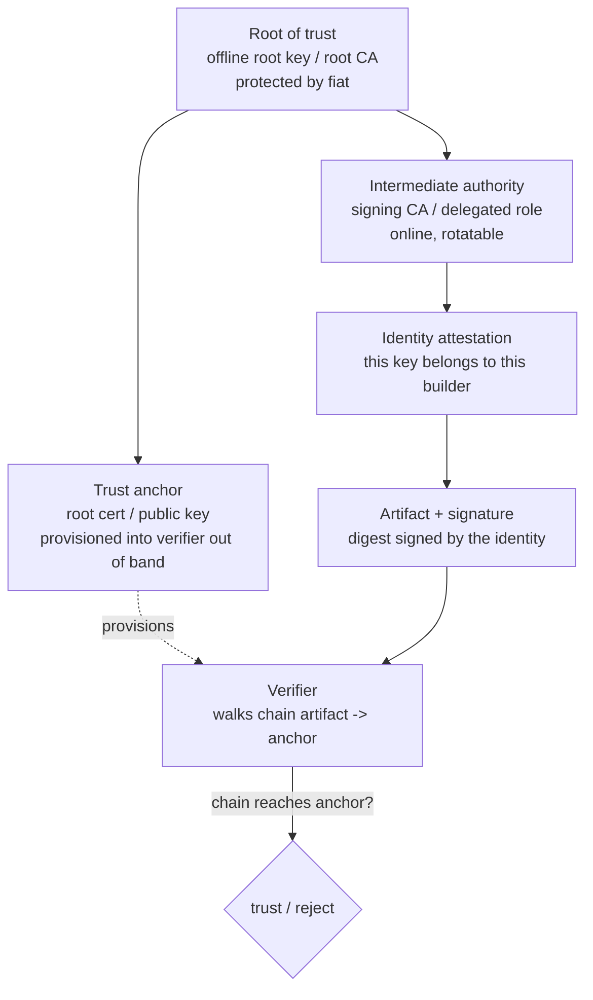
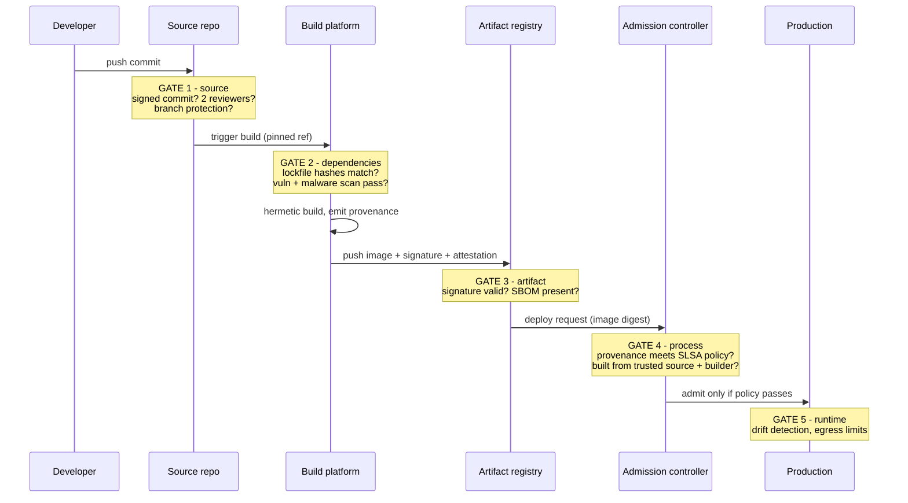
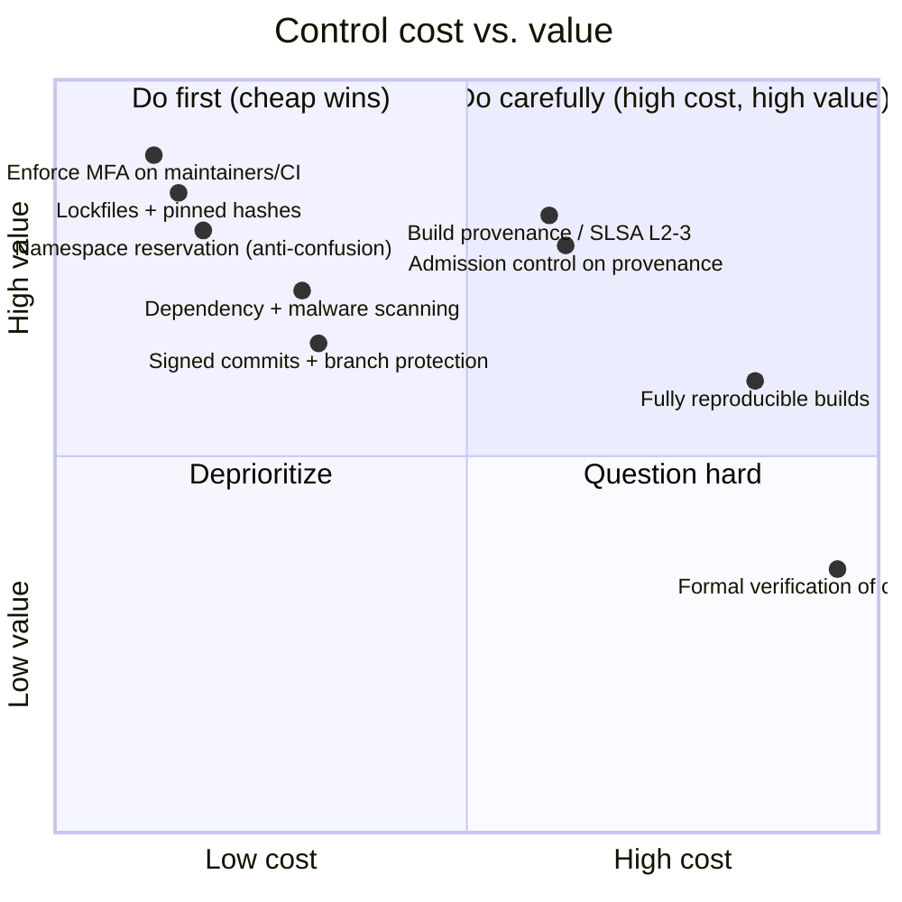

# Chapter 6 — Trust, Threat Models, and the Economics of Supply Chain Risk

*What this chapter covers.* The first five chapters were largely descriptive: the anatomy of
the chain, a taxonomy of attacks, and case studies of what actually went wrong. This chapter
is where we stop cataloguing and start reasoning. It builds the analytical toolkit that the
rest of the series uses without re-deriving: a precise notion of **trust**, a **threat
model** adapted to the supply chain rather than borrowed wholesale from application security,
and an **economic** frame for deciding where to spend a finite defensive budget. These three
lenses are not independent. Trust defines what you are exposed to; the threat model defines
who exploits that exposure and how; economics defines which of the resulting risks are worth
paying to reduce, and in what order. Get the trust model wrong and your threat model has the
wrong boundaries; get the economics wrong and you buy expensive controls that move the needle
less than a free one you skipped.

Learning goals — after this chapter you should be able to:

- Define trust precisely as *accepting inputs you did not produce and cannot fully verify*,
  and explain why it is transitive, non-obvious, and impossible to eliminate — only relocate
  and reduce.
- Distinguish a **root of trust**, a **trust anchor**, and a **trust chain**, and separate the
  three distinct things you can trust: an **identity**, an **artifact**, and a **process**.
- Explain Ken Thompson's "Reflections on Trusting Trust" correctly, state its actual
  implication for verification, and describe diverse double-compilation as the practical (not
  theoretical) rebuttal.
- Build a supply chain threat model: name the actors and their capabilities, motivations, and
  favored chain stages; construct an attack tree for a concrete goal; and place verification
  gates along a pipeline under an assume-breach posture.
- Reason about the attacker/defender cost asymmetry that makes supply chain attacks
  economically attractive, and the open-source maintenance economics that create the softest
  upstream targets.
- Apply a usable risk-prioritization model — *criticality × exposure × exploitability* — and
  place candidate controls on a cost/value curve to decide what to buy first.

We will keep two deep topics deliberately shallow here because they get full treatment later:
the mechanics of defeating trusting-trust (Book 7, Chapter 5 — Backdoors and Malicious Code)
and the cryptographic machinery of roots of trust and trust chains (Book 5, Chapters 1 and 3).
This chapter is about the *concepts*, so that when those books get mechanical, the vocabulary
is already yours.

## What trust actually means here

In casual use "trust" is a feeling — you trust a vendor, a maintainer, a tool. That is
useless for engineering. The operational definition we use throughout the series is
mechanical and unsentimental:

> **You trust a component when you accept inputs from it that you did not produce and cannot
> fully verify, and your integrity depends on the integrity of those inputs.**

Every clause matters. *Inputs you did not produce*: if you wrote and compiled every line
yourself on hardware you fabricated, you would trust nothing — and ship nothing. *Cannot
fully verify*: trust is precisely the gap that verification does not close. When you `npm
install` a package, you can verify its hash matches the lockfile, but you have not read and
understood its code, so you are trusting its behavior. *Your integrity depends on it*: trust
is only interesting where a betrayal hurts you. A dependency you import but whose code path is
never reached is a smaller trust relationship than one that handles your auth tokens.

Under this definition, trust is not optional and not a weakness. It is the price of not
rebuilding the universe from sand. The engineering question is never "how do we stop
trusting" — that is incoherent — but "which things are we trusting, how much does each one's
betrayal cost, and can we make the trust smaller, more accountable, or more verifiable?"

### Trust is transitive and non-obvious

The property that makes supply chain trust dangerous, and different from most access-control
reasoning, is **transitivity**. If you trust A, and A trusts B, you trust B — whether or not
you have ever heard of B. Your service depends on a web framework; the framework depends on a
YAML parser; the parser depends on a C library for its regex engine; that library was built by
a compiler you did not choose on a CI runner you cannot see. You did not decide to trust the
regex library — the decision was made for you, transitively, by a chain of maintainers each
making a locally reasonable choice. This is why a modern application's *transitive* dependency
count runs to the hundreds or thousands while its *direct* count is a few dozen: trust fans out
multiplicatively, and almost all of it is invisible at the point of decision.

Transitivity is what turns a single upstream compromise into a fleet-wide event. The
event-stream incident (Book 1, Chapter 4) worked because thousands of projects trusted
`event-stream` directly, and it in turn came to trust a new, malicious sub-dependency
(`flatmap-stream`) that almost none of those projects had ever evaluated. The trust was real,
load-bearing, and — until the payload fired — completely non-obvious to the people relying on
it. A trust relationship you cannot see is one you cannot govern, which is the whole motivation
for the transparency mechanisms in Book 3 (SBOMs) and Book 5 (attestations): to make
transitive trust *legible*.

### Roots of trust, trust anchors, and trust chains

Because you cannot verify everything from first principles, verification systems are built to
*bottom out* somewhere. That terminal point is a **root of trust**: a small, well-protected
thing you decide to trust axiomatically, without deriving that trust from anything else. A
root of trust is not magically trustworthy; it is trustworthy by *fiat and protection*. You
choose it, you invest heavily in guarding it, and you accept that if it is compromised, so is
everything that hangs off it. A hardware security module holding a signing key, the set of
root CA certificates baked into your OS trust store, the TUF root role's keys (Book 5,
Chapter 7), the Fulcio root in Sigstore (Book 5, Chapter 3) — all are roots of trust.

A **trust anchor** is the concrete, distributed representation of a root of trust: the actual
public key or certificate you provision into a verifier so it can start checking. The
distinction is subtle but worth keeping: the root of trust is the authority; the trust anchor
is the artifact you ship to relying parties so they can recognize that authority. Getting the
anchor to the verifier *securely and out of band* is the hard part — an anchor delivered over
the same channel it is meant to protect anchors nothing.

A **trust chain** (or chain of trust) is the sequence of verifiable links from the root down
to the artifact in front of you. Each link is a cryptographic statement — "this key vouches
for that key," "this identity signed that digest" — and verification walks the chain from the
artifact back up to a trust anchor it already holds. If every link checks out and terminates
at an anchor, the artifact is trusted; if any link is broken or the chain does not reach an
anchor, it is not.

Two properties of chains matter for the rest of the series. First, **a chain is only as
strong as its root and its weakest link** — a perfectly valid signature chained to an anchor
you never verified out of band proves nothing, and an intermediate key silently stolen breaks
everything below it. Second, **chains let you rotate and delegate without re-provisioning the
anchor**: you keep the root offline and rarely used, delegate day-to-day signing to online
intermediates, and revoke a compromised intermediate without touching the anchor in every
verifier. This is the entire design logic behind PKI, TUF role delegation, and Sigstore's
architecture, which we build properly in Book 5.

### Three different things you can trust

Careless discussion of "trust" conflates three distinct objects, and most real-world failures
come from trusting one when you needed another:

- **Trusting an identity** answers *who*. A code signature, a verified commit, an OIDC token
  — these bind an action to an actor. SolarWinds' signature was valid: the *identity* was
  genuinely SolarWinds. Identity trust was never violated. That is exactly why it did not
  help.
- **Trusting an artifact** answers *what*. A hash pinned in a lockfile, a subresource
  integrity digest — these bind you to specific bits, independent of who produced them. Hash
  pinning gives strong artifact trust and zero identity or process trust: you know you got
  *these exact bytes*, but not that the bytes are honest, only that they have not changed
  since you pinned them.
- **Trusting a process** answers *how*. Build provenance, in-toto attestations, SLSA levels —
  these assert that an artifact was produced by a particular process (hermetic build, no
  human tampering, from this source). Process trust is the one that closes the SolarWinds gap,
  because the failure there was neither a fake identity nor swapped bits *after* the build,
  but a dishonest *build process*.

The recurring supply chain mistake is substituting the cheap trust for the expensive one:
treating a valid signature (identity) as if it proved build integrity (process). A signature
proves *who* signed, never *that what they signed is honest*. Keep these three separated and a
surprising amount of muddled security reasoning resolves itself. We will return to this triple
constantly.

## Reflections on trusting trust

In 1984, Ken Thompson used his Turing Award lecture, later published as "Reflections on
Trusting Trust," to demonstrate the deepest problem in this whole domain. The argument is
frequently mis-stated, so here it is precisely.

Thompson described a three-stage attack on a compiler. **Stage one:** you can add a backdoor
to a program — say, `login` — by teaching its compiler to recognize when it is compiling
`login` and to silently insert extra code (an accept-any-password path). The source of
`login` stays clean; the malice lives in the compiler. **Stage two:** obviously someone
reading the compiler's source would see the backdoor, so you push it down a level. You teach
the compiler to recognize when it is compiling *itself* and to re-insert both the `login`
backdoor and the self-recognition logic. **Stage three — the payoff:** you compile the
compiler once with this malicious source to produce a poisoned binary, then *remove the
malice from the compiler's source entirely*. Now the source of both `login` and the compiler
is pristine. The poisoned compiler binary, when it compiles the clean compiler source,
reproduces the backdoor in the new binary — and reinserts the self-propagation. The backdoor
survives with no trace in any source anyone can read. It has become a property of the binary
toolchain, self-perpetuating across generations of clean source.

The implication is genuinely unsettling: **you cannot fully trust code you did not totally
create yourself.** Auditing source is insufficient, because the tool that compiles the source
can betray both the source and itself, invisibly. And the tools that built *that* tool could
have done the same, ad infinitum, all the way down to the microcode and the silicon. There is
no bedrock of self-evidently trustworthy tooling; verification does not terminate on its own.
This is the strongest possible statement of why trust cannot be *eliminated* — at some point
every verification chain rests on a tool or a person you did not, and cannot, fully verify.

For years this was treated as an unanswerable koan. It is not. David A. Wheeler's 2009
doctoral work, "Fully Countering Trusting Trust through Diverse Double-Compiling" (DDC),
provides a practical rebuttal — not by achieving perfect trust, but by making the attack
detectable under a realistic assumption. The idea: to check whether compiler binary *A* is
honest, compile *A's own source* using a second, *independent* compiler *B* (different
codebase, ideally different author lineage) to get a first-stage result. Then use that result
to recompile *A's* source again. If *A* is honest, this diverse rebuild reproduces *A*
bit-for-bit. If *A* carries a trusting-trust backdoor, *B* does not know the trigger, so the
rebuilt compiler differs — the discrepancy exposes the implant. The attacker would now have to
have subverted *both* independent compiler lineages *in the same way* to hide, which is a far
higher bar. DDC does not eliminate trust; it *relocates* it onto the assumption that two
independent toolchains are not identically backdoored, and makes any failure of that
assumption *detectable*. That is the whole spirit of modern supply chain defense in one
result, and it depends utterly on **reproducible builds** (Book 4, Chapter 2), because
"reproduces bit-for-bit" is only a meaningful test if honest builds are bit-for-bit
reproducible in the first place. We treat the mechanics fully in Book 7, Chapter 5.

### Trust minimization, not trust elimination

Thompson's lecture and Wheeler's answer together give us the governing principle of the field:

> You cannot eliminate trust. You can only **relocate** it and **reduce** it. The goal is
> *fewer* trust relationships, each *more accountable* and *more verifiable*.

Every good supply chain control is an instance of this. Pinning a hash does not eliminate
trust in the package; it relocates trust from "whatever the registry serves tomorrow" to "the
specific bytes I reviewed today." Reproducible builds do not eliminate trust in the build; they
relocate it from "trust the build server" to "trust that independent rebuilders will notice if
the server lies." Sigstore does not eliminate trust in signers; it relocates trust from "keep a
private key secret forever" to "trust a transparency log that anyone can audit." In each case
the count of trusted parties goes down, or the trust becomes *checkable after the fact*, or
both. When you evaluate any control in the coming books, ask the two minimization questions:
*does this reduce the number of parties I must trust?* and *does this make a betrayal
detectable?* A control that does neither is theater.

## Threat modeling for the supply chain

Threat modeling in application security has a well-worn recipe: identify assets, enumerate
entry points and trust boundaries, apply a mnemonic like **STRIDE** to each, and derive
controls. It is a good recipe for the thing it was designed for — a running system with
requests crossing boundaries. It fits the supply chain awkwardly, and it is worth being
precise about why, because the mismatch tells you what to use instead.

STRIDE — **S**poofing, **T**ampering, **R**epudiation, **I**nformation disclosure,
**D**enial of service, **E**levation of privilege — is organized around a *data flow diagram*
of a live system: threats are things that happen to data as it crosses a boundary at runtime.
The supply chain is not primarily a runtime data flow; it is a *temporal pipeline of artifact
transformations* — commit, build, package, publish, resolve, deploy — where the "attacker's
request" might be a pull request submitted six months before the payload fires. STRIDE's
categories still *apply* in a narrow sense (a malicious commit is Tampering; a stolen
maintainer token is Spoofing; a backdoor that survives review is Elevation of privilege), but
the categorization adds little, because in the supply chain almost every interesting attack is
"Tampering with an artifact somewhere in the pipeline," and lumping them under one STRIDE
letter throws away the distinction that matters — *which stage* was tampered with and *what
trust it inherited downstream*. STRIDE is still useful for modeling the *infrastructure* of
the pipeline as running systems (the CI control plane, the registry API, the artifact store
all have data flows worth STRIDE-ing), just not for modeling the flow of artifacts through it.

Two framings fit the supply chain natively. The first is the **SLSA threat model** (Book 1,
Chapter 2 introduced its lettered threats A–H), which organizes threats by *chain stage* —
source, build, dependency, distribution — precisely because the defining feature of a supply
chain attack is *where in the pipeline* it lands and *what downstream trust that position
inherits*. The second is **attack-tree thinking**, which starts from an attacker *goal* and
decomposes it into the alternative paths to reach it. Attack trees are a better fit than
STRIDE here because supply chain compromise is fundamentally a *goal with many
substitutable paths* — the attacker does not care whether they get in via a typosquat, a
stolen CI token, or a bribed maintainer, only that one path works and is cheap. A tree makes
that substitutability explicit and forces you to defend the *cheapest* path, not your
favorite one.

### The actors, precisely

"Attacker" is not a threat model. Different adversaries have different capabilities, different
motivations, and — critically — different favored stages of the chain, because they optimize
different cost functions. Modeling them distinctly is what lets you predict *where* a given
adversary will actually strike. The supply-chain-relevant actors:

- **External attacker (unauthenticated).** No access, no insider position. Must acquire
  access by exploiting a vulnerability, phishing a credential, or exploiting a resolution
  policy (dependency confusion, typosquatting). Motivation varies; the defining trait is
  *starting from outside*. Favors the consumption and distribution stages, where publishing a
  package or squatting a name needs no prior access.
- **Malicious maintainer.** A legitimate, authorized maintainer of an upstream component who
  turns hostile — voluntarily inserting a backdoor or protestware into code they are entitled
  to change. Defeats every control that assumes the maintainer is honest: review, branch
  protection, and commit signing all faithfully authorize the malicious change. Favors the
  source stage of *their own* project. (event-stream's handoff and node-ipc are the archetypes;
  Book 1, Chapter 4.)
- **Compromised maintainer.** A legitimate maintainer whose *account* is taken over — stolen
  token, phished password, no MFA — so the attacker acts with the maintainer's authority
  without the maintainer's knowledge or consent. Same downstream effect as a malicious
  maintainer, different root cause and different fix (account security vs. governance). Favors
  source and distribution (publishing) stages.
- **Malicious insider.** An employee or contractor of *your* organization who abuses
  legitimate internal access — pushing to internal repos, touching the build farm, publishing
  to the internal registry. Motivations: money, coercion, grievance, or planted-agent
  intent. Favors whatever internal stage their role touches; disproportionately dangerous at
  the build and distribution stages because internal trust there is broad.
- **Compromised insider.** An internal account or workstation taken over by an external
  actor, who then operates from inside your trust boundary. Identical downstream access to a
  malicious insider; the two are worth separating because the *detection signal* differs
  (anomalous behavior vs. authorized-but-hostile behavior) and the *control* differs (endpoint
  and credential hygiene vs. separation of duties).
- **Nation-state.** Patient, well-resourced, willing to spend months and burn bespoke
  tooling for strategic access. Distinctive traits: long dwell time, operational discipline
  (SUNSPOT's benign trial run), and willingness to invest in the *hardest, highest-leverage*
  stage — build-system compromise — because the payoff (SolarWinds' ~18,000-org fan-out with
  ~100 selected for exploitation) justifies the cost. Favors the build stage and long-game
  maintainer infiltration (the xz operation's multi-year social engineering fits here).
- **Opportunistic criminal.** The economic inverse of the nation-state: optimizes for
  *scale at low effort*. Publishes hundreds of typosquats and confusion packages, sprays
  crypto-stealers and credential-harvesters, and moves on. Does not care *who* they hit, only
  *how many* cheaply. Favors the consumption stage almost exclusively — publishing malicious
  packages is the lowest-effort, highest-volume path in the entire chain.
- **Hacktivist.** Motivated by a cause rather than money or espionage. In the supply chain
  this manifests as **protestware**: a maintainer (usually acting as a malicious maintainer)
  sabotages their own widely-used package to make a political statement — wiping files based
  on geolocation, printing propaganda, degrading service. Favors the source stage of popular
  packages, and is uniquely *self-disclosing* (the point is to be noticed), which makes it
  loud but sometimes destructive before it is caught (node-ipc, 2022).

The single most important modeling insight from this list: **cost function predicts stage.**
The opportunistic criminal minimizes effort and lands in consumption; the nation-state
maximizes leverage and reaches for the build system; the disgruntled maintainer already holds
source-stage authority and simply uses it. When you decide which stage to harden first, you
are implicitly betting on which actor you most need to stop.

### Actor-capability matrix

The matrix below maps each actor to its typical starting capability, primary motivation,
favored chain stage, and the class of control that most raises its cost. Read it as a
planning aid: find the row that matches your threat model and let the last column tell you
where the marginal defensive dollar goes.

| Actor | Starting capability | Motivation | Favored stage(s) | Highest-leverage control class |
|---|---|---|---|---|
| External attacker | None; must acquire access | Varies (money, access) | Consumption, distribution | Resolution policy, edge hardening, MFA |
| Malicious maintainer | Authorized source write | Ideology, money, spite | Source (own project) | Provenance, reproducibility, dependency vetting |
| Compromised maintainer | Stolen legit authority | (attacker's) money/access | Source, distribution | Account security (MFA, tokens, signing) |
| Malicious insider | Legit internal access | Money, coercion, grievance | Build, distribution (internal) | Separation of duties, least privilege, audit |
| Compromised insider | Hijacked internal account | (attacker's) access | Whatever the role touches | Endpoint/credential hygiene, anomaly detection |
| Nation-state | Whatever they need to buy/build | Espionage, strategic access | Build, long-game maintainership | Build isolation, hermeticity, egress control, provenance |
| Opportunistic criminal | Ability to publish packages | Scale, low-effort profit | Consumption | Typosquat/confusion defenses, install-script sandboxing |
| Hacktivist | Usually authorized (maintainer) | Political statement | Source (popular pkgs) | Dependency pinning, update review, vetting |

### An attack tree for "run attacker code in production"

Attack trees decompose a single attacker goal into the alternative ways to achieve it. OR
nodes are substitutable paths (any one suffices); the attacker picks the cheapest available
one. The tree below targets a concrete, realistic objective — *execute attacker-controlled
code in Company X's production environment* — and branches through the four chain stages. It
is deliberately not exhaustive; it is meant to show the *shape* of the reasoning and to make
the cheapest-path logic visible.

```mermaid
flowchart TB
    GOAL["GOAL: run attacker code in Company X production"]

    GOAL --> SRC["via SOURCE"]
    GOAL --> DEP["via DEPENDENCY"]
    GOAL --> BLD["via BUILD"]
    GOAL --> DIST["via DEPLOY / DISTRIBUTION"]

    SRC --> S1["compromise a developer account (phish, no MFA)"]
    SRC --> S2["malicious insider pushes code"]
    SRC --> S3["backdoor survives review (underhanded / obfuscated PR)"]

    DEP --> D1["typosquat / combosquat an imported name"]
    DEP --> D2["dependency confusion on an internal name"]
    DEP --> D3["compromise an upstream maintainer account"]
    DEP --> D4["social-engineer maintainership of a critical lib"]

    BLD --> B1["steal a CI runner token / OIDC identity"]
    BLD --> B2["poison a shared build cache"]
    BLD --> B3["inject via a malicious build-time plugin/action"]
    BLD --> B4["implant on the build host (SUNSPOT-style)"]

    DIST --> P1["steal registry publish credentials"]
    DIST --> P2["tamper artifact in transit / on a mirror"]
    DIST --> P3["compromise the deploy pipeline / GitOps repo"]

    S1 --> WIN["attacker code reaches prod runtime"]
    S2 --> WIN
    S3 --> WIN
    D1 --> WIN
    D2 --> WIN
    D3 --> WIN
    D4 --> WIN
    B1 --> WIN
    B2 --> WIN
    B3 --> WIN
    B4 --> WIN
    P1 --> WIN
    P2 --> WIN
    P3 --> WIN
```

Two things fall out of the tree immediately. First, the defender must cover *every* leaf,
because the attacker only needs one; this is the **weakest-link** property we quantify in the
economics section. Second, the leaves are wildly unequal in cost. `D1` (publish a typosquat)
costs the attacker minutes and no prior access; `B4` (implant on the build host) costs a
nation-state months. A defender who has hardened the build farm to nation-state standard but
left resolver policy (`D2`) or MFA (`S1`, `D3`) unaddressed has raised the *tallest* branch
while leaving the *shortest* one untouched — and the attacker walks straight through the short
one. The tree forces you to price the leaves and defend the cheapest, not the scariest.

### Assume breach, defense in depth, and verification gates

No single control on that tree is perfect, and any one of them can fail. The correct posture
is therefore **assume breach**: design as though some stage is already compromised, and ensure
that a compromise at one stage is *caught or contained* by a control at another. In the supply
chain, "defense in depth" takes a specific and powerful form — **verification points** (also
called **control gates**) placed along the pipeline, each *independently* re-checking the
integrity of the artifact as it flows toward production. The key word is independently: a gate
is only worth having if it does not share a failure mode with the stage it is checking. A
build server that signs its own output and then checks its own signature has added no depth; a
*separate* admission controller that verifies build provenance against a policy the build
server cannot edit has added a real gate.

The sequence below shows gates along a representative pipeline. Each gate can *reject* — halt
the artifact's progress — and each checks a property the previous stage could not forge on its
own.

Notice how the gates map onto the *three kinds of trust*: Gate 1 establishes **identity** and
authorized change; Gates 2–3 establish **artifact** integrity (hashes, signatures); Gate 4 —
the admission controller checking provenance against policy — is the **process** gate, the one
that would have caught a SolarWinds-style dishonest build that sailed through the identity and
artifact gates. A pipeline with only identity and artifact gates is the pre-2020 industry
default, and it is exactly the configuration that trojanized-but-validly-signed builds defeat.
The process gate is the expensive, load-bearing addition, and Books 4 and 5 exist largely to
build it.

## The economics of supply chain risk

Security is an economics problem wearing an engineering costume. Attackers have finite budgets
and pick targets by return on effort; defenders have finite budgets and must buy down the most
risk per dollar. Two economic facts explain why supply chain attacks have surged, and a third
tells defenders what to do about it.

### The asymmetry that makes the chain attractive

The defining economic property of a supply chain attack is **fan-out**: one compromise yields
many victims. Compromise a single popular npm package and every project that installs it is
exploited on their next build — the attacker's cost is roughly constant while their reach
scales with the package's popularity. This is economies of scale for the attacker, and it
inverts the usual defender advantage. In a direct attack, the attacker pays per target; in a
supply chain attack, they pay once and harvest thousands. SolarWinds is the extreme case:
months of effort against *one* build system yielded access to ~18,000 organizations. The cost
per victim approached zero.

The mirror image of fan-out is the **weakest-link** structure of defense. Recall the attack
tree: the attacker needs *one* path, the defender must hold *all* of them. Formally, if the
attacker's cost to breach the whole system is the *minimum* cost across paths while the
defender must fund *every* path, then the rational attacker always attacks your cheapest
unguarded link — and improving any link *other than* the current cheapest one buys you nothing
until you have raised the floor. This is why upstream, softer targets get hit: an attacker
targeting Company X does not attack Company X's hardened production edge; they attack the
under-resourced open-source library three hops up X's dependency tree, because that link is
cheaper and X trusts it transitively. The attacker moves to the softest point in *your* chain,
which is frequently a point you do not own and did not choose.

Put the two together and the strategic picture is stark: attackers enjoy increasing returns
(fan-out) while defenders face a weakest-link cost structure (fund everything). That asymmetry
is not going to be engineered away; it is why the field exists. What defenders *can* do is
raise the floor — make the cheapest link expensive enough that the attack stops paying — and
that requires knowing where the cheap links are, which brings us to open source.

### The economics of open-source maintenance

The cheapest links are very often unpaid. Enormous swaths of critical infrastructure rest on
open-source components maintained by one or a few volunteers, for free, in their spare time.
xkcd 2347 captured it exactly: a towering edifice of "all modern digital infrastructure"
balanced on a tiny block labeled "a project some random person in Nebraska has been
thanklessly maintaining since 2003." It is a joke because it is true. Heartbleed (OpenSSL,
2014) and Log4Shell (Log4j, 2021) both traced to critical libraries maintained by
underfunded, understaffed teams — a couple of volunteers carrying software that runs a
meaningful fraction of the internet.

This is a **tragedy of the commons**. Everyone depends on the shared resource; no one is
individually incentivized to fund its upkeep; the maintainer bears all the cost and captures
almost none of the value. And it creates a specific, exploitable weakness that the **xz-utils**
incident (Book 1, Chapter 5) made vivid. The mechanism there was not primarily technical — it
was *economic and social*. `xz`/`liblzma` was maintained essentially by one overburdened
volunteer (Lasse Collin) who, under real-life stress and visible burnout, was susceptible to
an offer of help. An attacker operating the "Jia Tan" persona spent roughly two years building
trust, contributing legitimately, and — with the help of sockpuppet accounts applying pressure
on the maintainer to hand off responsibility — was granted co-maintainer authority, which was
then used to plant a backdoor targeting sshd. The vulnerability the attacker exploited was
*maintainer burnout*. No amount of signing or scanning addresses "the sole maintainer is
exhausted and lonely and someone friendly offered to help." The fix is economic: pay
maintainers, fund redundancy, reduce the bus-factor-of-one.

Several initiatives target exactly this, and it is worth describing them accurately:

- **OpenSSF** (Open Source Security Foundation), a Linux Foundation project, is the umbrella
  under which much of this work sits — home to Scorecard, Sigstore, SLSA, the Best Practices
  Badge, and working groups on securing critical projects.
- **Alpha-Omega**, an OpenSSF-associated project funded by industry (Microsoft, Google, Amazon
  among the backers), takes a two-pronged approach: "Alpha" works directly with a small set of
  the most critical projects to improve their security posture, while "Omega" applies automated
  analysis at scale across the long tail of thousands of projects.
- The **Sovereign Tech Fund / Sovereign Tech Agency**, funded by the German government, invests
  directly in the maintenance and security of open-source infrastructure "in the public
  interest" — paying for the unglamorous upkeep that no single company will fund alone.

These are correct responses because they attack the actual weakest link — the economics of
maintenance — rather than adding another gate downstream. A defender who runs an internal
program should understand this: some of your highest-leverage risk reduction may be *funding a
maintainer* or contributing engineering time upstream, not buying another scanner. Book 1,
Chapter 8 develops the sustainability angle in depth.

### Cost-benefit for defenders: the marginal-return curve

Because the defender's budget is finite and the weakest-link structure means you must
eventually cover everything, the question is *ordering*: what do you buy first? The answer
comes from the **marginal return** of each control — the risk reduced per unit of cost — and
these vary by more than an order of magnitude. Some controls are cheap and enormously valuable;
others are expensive and, for most organizations, marginal. Placing them on a cost/value grid
is the single most useful budgeting exercise in the field.

The pattern is consistent and worth internalizing:

- **Cheap, high value (do first).** MFA on maintainer and CI accounts closes the compromised-
  maintainer and stolen-token leaves for near-zero cost. Lockfiles with pinned hashes convert
  fragile "whatever the registry serves" trust into strong artifact trust with a config change.
  Namespace reservation on public registries deterministically kills dependency confusion for
  the price of registering some names. These are the floor-raisers; skipping them while buying
  anything fancier is malpractice.
- **Expensive, high value (do carefully, later).** Build provenance and SLSA Build L2–L3,
  plus the admission control that enforces it, close the SolarWinds *process* gap — genuinely
  high value, but they require real platform engineering. Buy them once the cheap floor is in.
- **Expensive, lower marginal value for most (question hard).** Fully reproducible builds are
  the gold standard and the prerequisite for diverse double-compilation — but achieving
  bit-for-bit reproducibility across a large polyglot fleet is a multi-quarter effort with
  steeply diminishing returns for most organizations relative to provenance. Formal
  verification of components is superb where it applies (a crypto primitive, a hypervisor
  boundary) and almost never cost-justified across an application dependency tree. Neither is
  *wrong*; both are *expensive enough that you must justify them against the marginal
  alternative*, and for most teams that alternative — closing another cheap leaf — wins.

The trap the curve exposes is the **prestige control**: buying the sophisticated, conference-
talk-worthy control (reproducible builds, formal methods) while a cheap high-value one (MFA,
namespace reservation) sits undone. The attacker attacks the cheapest link; a defense budget
must therefore be spent cheapest-valuable-first, however unglamorous.

### A usable risk-prioritization model

To order work you need to *score* risk, and the classic formulation — **risk = likelihood ×
impact** — is correct but too coarse to act on directly in this domain. A more usable
decomposition for supply chain links, one you can compute on a whiteboard, is:

> **Risk(link) ≈ Criticality(asset) × Exposure(chain link) × Exploitability(link)**

- **Criticality** is *impact if this asset is compromised* — how much you lose if code running
  through this link turns hostile. A library in your payments service scores high; one in an
  internal dashboard scores low. This is the "what does betrayal cost" clause from our trust
  definition, made numeric.
- **Exposure** is *how reachable the link is to an attacker and how broadly it fans out* — a
  direct dependency of every service scores higher than a transitive dependency of one; a
  package pulled from a public registry with no pinning scores higher than one vendored and
  hash-pinned. This is likelihood-of-reach.
- **Exploitability** is *how cheaply an attacker can actually subvert this link given its
  current controls* — an upstream with a sole burned-out maintainer and no MFA scores high; a
  well-funded project with signed releases, provenance, and multiple maintainers scores low.
  This is likelihood-of-success, and it is where controls move the number: adding MFA or
  provenance drops exploitability without touching criticality or exposure.

Multiply, rank descending, and work the top of the list. The model is deliberately crude —
the numbers are ordinal estimates, not measurements — but it does the one thing you need:
it forces the cheapest-link logic into your prioritization by *rewarding controls that reduce
exploitability on high-criticality, high-exposure links*, which is exactly where the attacker
will go. A dependency that is critical (payments), exposed (direct, unpinned, fleet-wide), and
exploitable (single volunteer maintainer, no MFA) is your xz waiting to happen, and this model
surfaces it to the top where it belongs. Book 2, Chapter 7 (Reachability and Prioritization)
turns the "exposure" term into something measurable with call-graph reachability; Book 2,
Chapter 10 (Evaluating Dependencies) turns "exploitability" into scored signals (Scorecard,
maintainer count, release hygiene). This chapter's model is the mental scaffold those later,
sharper tools hang on.

## Distributed-systems lens

Everything above sharpens in a large distributed backend, because the two quantities that
drive supply chain risk — the number of trust relationships and the number of chain links —
grow with the number of services and teams, and they grow *faster than linearly*.

**Trust boundaries multiply with service and team count.** A monolith maintained by one team
has one build, one dependency tree, one deploy path — a handful of trust relationships. Split
it into 300 microservices owned by 40 teams and you now have (in the worst case) 300
dependency trees, 300 build configurations, 300 deploy paths, and 40 sets of humans with
publish rights, each a trust boundary an attacker can probe. The transitive-trust fan-out from
earlier compounds this: each of the 300 services independently drags in hundreds of transitive
dependencies, and the *union* of all trusted upstreams across the fleet is enormous and mostly
unaudited. The number of leaves on the fleet-wide attack tree is roughly (services × links per
service), and the weakest-link property means the attacker attacks the single softest leaf
across all of them. Scale is, in pure supply chain terms, an expansion of attack surface that
no individual team can see in full.

**The paved road concentrates and amortizes trust decisions.** The response that actually
works at scale is the **platform / paved-road** model: a central platform team builds the
secure path — a golden CI template with pinned actions and hermetic builds, a base-image set
that is scanned and signed, an internal registry that enforces provenance, resolver
configuration that cannot be confused — and makes *that path the easiest one to take*. The
insight is economic: instead of 40 teams each making 40 mediocre, independently-wrong trust
decisions, the platform team makes the decision *once*, well, and amortizes it across the
fleet. A single upgrade to the paved road (say, adding admission control on provenance) raises
the security of all 300 services at once. This is the fleet-scale version of trust
minimization: fewer, more-accountable trust decisions, made by the party best positioned to
make them well. The governing design principle is **make the secure path the easy path** —
because if the secure path is harder than the insecure one, teams under delivery pressure will
route around it, and you will have bought a control nobody uses.

**Centralized policy vs. team autonomy is the standing tension.** The paved road only works if
teams actually stay on it, which pushes toward *mandatory* central policy — enforced admission
control, no exceptions, no direct-to-registry pushes. But hard central mandates collide with
team autonomy, velocity, and the genuine reality that some teams have legitimate needs the
paved road does not serve. The workable resolution is almost always **paved road by default,
deviation by exception with accountability**: the secure path is the frictionless default that
covers 95% of cases, deviations are *possible* but require an explicit, logged, reviewed
exception, and the exception carries the risk-ownership back to the team that requested it.
This preserves autonomy for the genuine edge case while ensuring the default is safe and every
deviation is visible. The failure modes are symmetric: too rigid and teams shadow-IT around
you, re-fragmenting trust; too loose and the paved road is a suggestion nobody follows and you
have central cost with distributed risk.

**The internal registry/proxy is the trust chokepoint — for better and worse.** At scale,
almost every organization funnels dependency acquisition through an internal registry or
pull-through proxy (Artifactory, Nexus, an internal PyPI/npm mirror). This is a natural and
powerful *control gate*: it is the one place every build's dependencies flow through, so it is
the ideal spot to enforce scanning, block known-malicious packages, quarantine new releases,
reserve namespaces against confusion, and pin what the fleet may consume — fleet-wide coverage
from one control. But concentration cuts both ways: the same chokepoint is now a single
high-value target. Compromise the internal registry and you have compromised the dependency
supply of every service that trusts it — the distribution-stage attack, aimed at *your own*
infrastructure. So the chokepoint must be treated as tier-0 infrastructure, hardened and
monitored to the standard of the build farm, precisely because so much trust has been
deliberately concentrated there. Book 2, Chapter 8 (Vendoring, Mirroring, and Internal
Registries) and Book 6, Chapter 2 (Registries) build this out; the risk-modeling point for now
is that concentrating trust into a chokepoint is *correct* — trust minimization made
operational — but it relocates rather than removes the risk, and the new location must be
defended accordingly.

## Key takeaways

- **Trust is accepting inputs you did not produce and cannot fully verify, where your
  integrity depends on theirs.** It is transitive (trusting A means trusting everything A
  trusts, invisibly) and cannot be eliminated — only relocated and reduced. Every good control
  makes trust *smaller*, *more accountable*, or *checkable after the fact*.
- **Separate the three trusts: identity (who), artifact (what), process (how).** The endemic
  mistake is treating a valid signature (identity) as proof of build integrity (process). A
  signature proves who signed, never that what they signed is honest — the SolarWinds gap.
- **A root of trust is trusted by fiat and protection; a trust anchor is its provisioned
  representation; a trust chain is verifiable links from artifact to anchor.** A chain is only
  as strong as its root, its anchor's out-of-band delivery, and its weakest link.
- **Trusting-trust (Thompson, 1984) proves you cannot fully verify code you did not create;
  diverse double-compilation (Wheeler, 2009) is the practical rebuttal** — it relocates trust
  onto "two independent toolchains are not identically backdoored" and makes betrayal
  *detectable*, given reproducible builds.
- **Model actors distinctly, because cost function predicts stage.** Opportunistic criminals
  minimize effort and land in consumption (typosquats); nation-states maximize leverage and
  reach for the build system; malicious maintainers already hold source authority. Which stage
  you harden first is a bet on which actor you most need to stop.
- **Use SLSA-style stage framing and attack trees, not STRIDE, for the artifact pipeline.**
  Attack trees make the weakest-link structure explicit: the attacker needs one path, you must
  hold all of them, and the leaves differ in cost by orders of magnitude — defend the cheapest,
  not the scariest.
- **Assume breach; place independent verification gates along the pipeline.** Gates map to the
  three trusts; the *process* gate (provenance checked by an admission controller the build
  server cannot edit) is the expensive, load-bearing one that catches dishonest builds.
- **The economics are attacker-favorable: fan-out gives attackers increasing returns while
  defenders face a weakest-link cost structure.** Attackers move to the softest upstream link,
  which is frequently an unpaid, single-maintainer open-source project (the xz lesson). Funding
  maintainers (OpenSSF, Alpha-Omega, Sovereign Tech Fund) attacks the actual weakest link.
- **Spend cheapest-valuable-first.** MFA, lockfiles/pinned hashes, and namespace reservation
  are cheap and high-value; provenance and admission control are expensive and high-value;
  reproducible builds and formal verification are expensive with lower marginal value for most.
  Beware the prestige control bought while a cheap high-value one sits undone.
- **Prioritize with Criticality × Exposure × Exploitability.** Controls move the
  *exploitability* term; the highest-scoring links (critical, exposed, easily subverted) are
  your next incident and belong at the top of the list.
- **At scale, harden through the paved road and the registry chokepoint.** Concentrate trust
  decisions where they can be made once and well, make the secure path the easy path, allow
  deviation only by accountable exception — and treat the chokepoint you create as tier-0,
  because concentrating trust relocates the risk rather than removing it.

## Further reading

- Ken Thompson, "Reflections on Trusting Trust," *Communications of the ACM* 27(8), August
  1984 — the ACM Turing Award lecture; the original compiler-backdoor argument.
- David A. Wheeler, "Fully Countering Trusting Trust through Diverse Double-Compiling," Ph.D.
  dissertation, George Mason University, 2009 — the practical DDC rebuttal (deeper treatment in
  Book 7, Chapter 5).
- Bruce Schneier, "Attack Trees," *Dr. Dobb's Journal*, December 1999 — the canonical
  introduction to attack-tree modeling.
- Adam Shostack, *Threat Modeling: Designing for Security* (Wiley, 2014) — STRIDE and the
  data-flow-diagram methodology this chapter contrasts against supply chain framing.
- SLSA (Supply-chain Levels for Software Artifacts), v1.0 — the specification and its
  threats-and-mitigations / terminology pages (`slsa.dev`), for the stage-oriented threat
  model.
- The xz-utils backdoor (CVE-2024-3094): Andres Freund's original disclosure to the
  oss-security mailing list (March 29, 2024) and subsequent community timelines — the
  maintainer-burnout economics discussed here (full case study in Book 1, Chapter 5).
- Randall Munroe, xkcd #2347, "Dependencies" (`xkcd.com/2347`) — the Nebraska-maintainer
  illustration of open-source fragility.
- OpenSSF (`openssf.org`), the Alpha-Omega project (`alpha-omega.dev`), and the Sovereign Tech
  Agency (`sovereign.tech`) — initiatives funding maintenance of critical open-source
  infrastructure.
- NIST SP 800-218, the Secure Software Development Framework (SSDF), and NIST SP 800-161r1,
  Cybersecurity Supply Chain Risk Management Practices — risk-management framing for the
  controls prioritized here (developed in Book 1, Chapter 7 and Book 8, Chapter 1).
- Ross Anderson, *Security Engineering*, 3rd ed. (Wiley, 2020), chapters on economics of
  security and the weakest-link / free-rider dynamics that underlie this chapter's economics.
