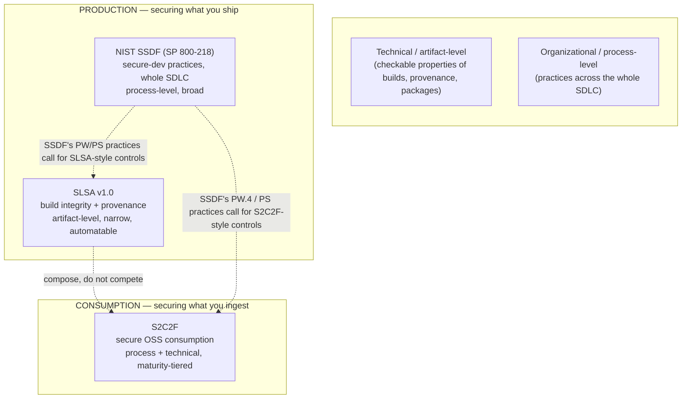
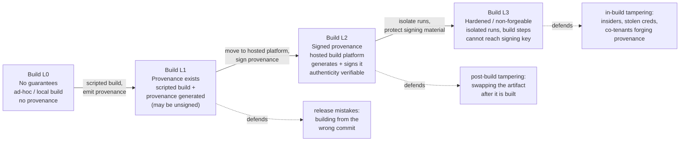
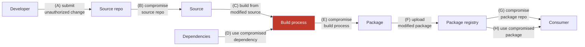
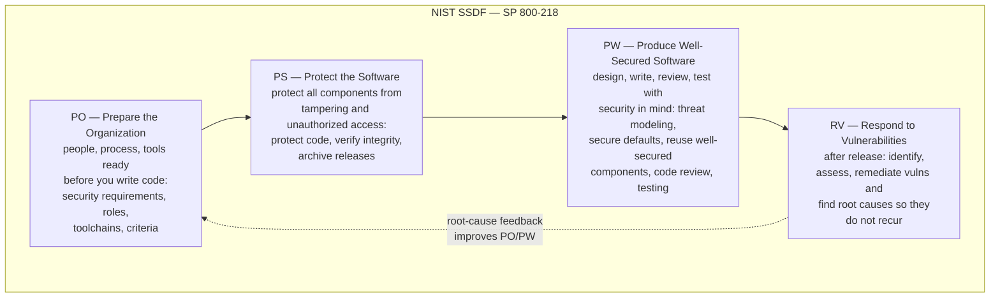
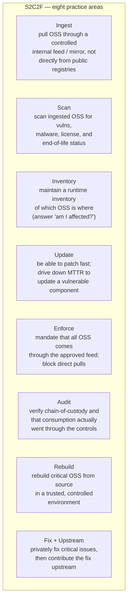
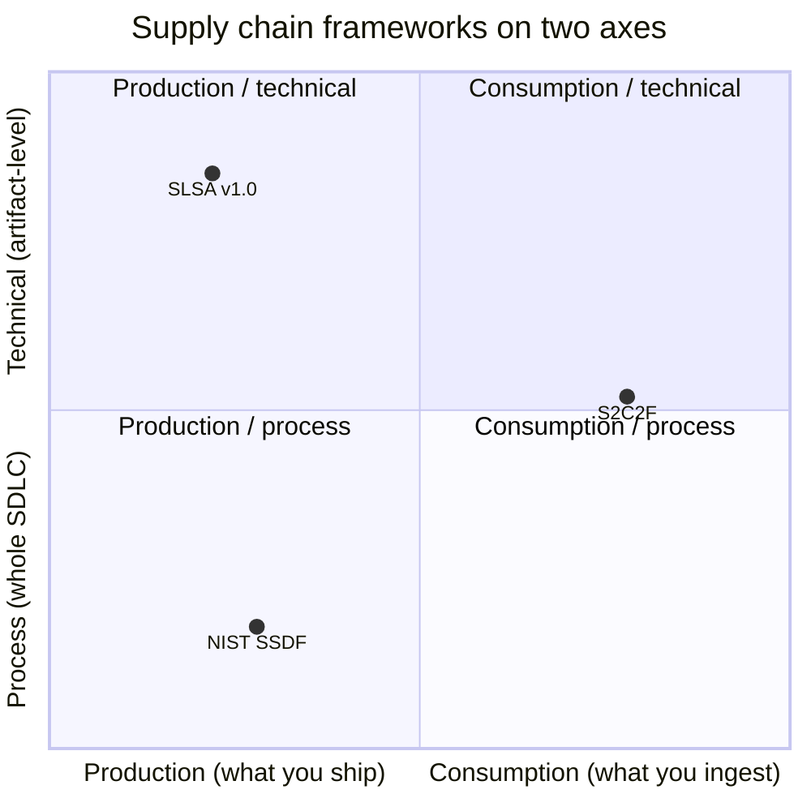
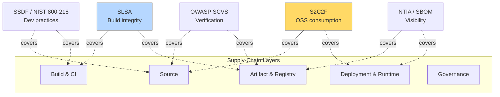
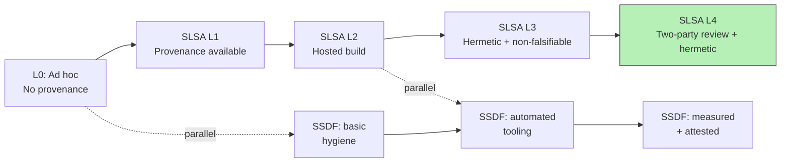

# Chapter 7 — Risk Frameworks and Maturity Models: SLSA, SSDF, S2C2F

*What this chapter covers.* The previous chapter gave you the reasoning tools — trust, threat
models, economics. This one gives you the **maps other people have already drawn**. Supply
chain security has, in the last few years, accreted an alphabet soup of frameworks, levels,
and maturity models: SLSA, SSDF, S2C2F, SCVS, SAMM, BSIMM, SDL, the CIS guide, the CNCF paper.
A senior engineer walking into this space for the first time is right to be suspicious — much
of it looks like the same checklist rebadged by a different working group. It is not. The good
frameworks each occupy a distinct position on two axes that matter, and once you can place any
new acronym on those axes you stop being confused by the soup. This chapter's job is to teach
you the coordinate system, then plot the three frameworks that carry the most weight in
practice — **SLSA v1.0**, **NIST SSDF (SP 800-218)**, and **S2C2F** — accurately and in
enough depth that you know what each actually claims, what it deliberately does not, and when
to reach for which. The deep adoption mechanics — rolling these out across a real org, the
regulatory obligations that force your hand — belong to Book 8. This chapter is the map, not
the expedition.

Learning goals — after this chapter you should be able to:

- Place any supply chain framework on the two axes that distinguish them: **production vs
  consumption** and **technical-artifact vs organizational-process**, and explain why SLSA,
  SSDF, and S2C2F occupy three different quadrants and therefore *compose* rather than compete.
- State the **SLSA v1.0** Build track levels (L0–L3) precisely — what each requires, what each
  defends against — and explain the v1.0 restructuring into *tracks*, the provenance-centric
  model, the A–H threat taxonomy, and the sharp boundary of what SLSA does *not* claim.
- Describe the **NIST SSDF** structure — the four practice groups PO/PS/PW/RV — as
  outcome-oriented practices rather than prescriptive controls, and explain its load-bearing
  role in US federal secure-software self-attestation (EO 14028, OMB M-22-18 / M-23-16).
- Describe **S2C2F** — its eight practice areas and four maturity levels — as the *consumption*
  counterpart to SLSA's production focus, and map it to the open-source ingestion threats.
- Locate the secondary frameworks you will meet — CIS, CNCF, OWASP SCVS, SAMM, BSIMM,
  Microsoft SDL, Google's BeyondProd — without confusing them for the primary three.
- Use maturity levels as *properties to achieve* rather than *checkboxes to claim*, and reason
  about how a paved-road platform lets a fleet inherit a SLSA level "for free."

## Why frameworks at all

You could, in principle, run a supply chain security program straight off the threat model of
Chapter 6 — enumerate your actors, build attack trees, prioritize by criticality × exposure ×
exploitability, and spend. Some very sophisticated organizations essentially do. So what do
frameworks buy you? Three things.

First, **a shared vocabulary**. When a vendor's security questionnaire asks "do you produce
SLSA Build L3 provenance?" that sentence carries a precise, checkable meaning that "our builds
are pretty locked down" does not. Frameworks turn fuzzy assurances into propositions that can
be true or false, tested, and attested. Most of the value of SLSA is not the requirements
themselves — a competent team would arrive at most of them independently — but that the
requirements are *named* and *tiered* so that two parties who have never met can communicate an
integrity property in four characters.

Second, **completeness**. A threat model you build yourself has the blind spots you build into
it. A framework assembled by a working group of people who have each been burned differently is
a checklist against your own imagination. You may disagree with SSDF task PW.4 ("reuse existing,
well-secured software"), but the fact that it is on the list forces you to have a position on
it rather than to simply never think of it.

Third, **leverage on other people**. Frameworks are how you make demands of parties you do not
control — suppliers, upstream maintainers, internal teams — without re-litigating first
principles each time. "Meet SLSA Build L2" is a contract term; "be more secure" is not.

The cost of frameworks is the failure mode this chapter spends its last third on:
**cargo-culting**. A level is a claim about a property. It is trivially possible to satisfy the
letter of a level while the property it was meant to guarantee is absent — to be "SLSA L3" on
paper while your provenance is, in practice, forgeable. Frameworks are tools for thinking, not
substitutes for it. Hold that tension the whole way through.

### The coordinate system

Before any specific framework, install the two axes. Everything downstream hangs off them.

The first axis is **production vs consumption**. Are you securing the software *you build and
ship* (production), or the software *you pull in and depend on* (consumption)? These are
genuinely different problems with different threat actors. Production security is about proving
that what you shipped is what you meant to ship — build integrity, provenance, signing.
Consumption security is about not getting owned by what you pulled from npm — ingestion
control, scanning, inventory, patching. The same organization is simultaneously a producer (of
its services) and a consumer (of its dependencies), and the two postures barely overlap.

The second axis is **technical-artifact vs organizational-process**. Does the framework
specify *properties of artifacts and systems* (this provenance must be non-forgeable; builds
must be isolated), or *practices an organization performs* (train your developers; have a
vulnerability disclosure policy; review third-party components)? Artifact-level frameworks are
narrow, deep, mechanically checkable, and often automatable. Process-level frameworks are
broad, shallow-per-item, human-audited, and cover the whole software development lifecycle
rather than one slice of it.

Keep this diagram in your head. SLSA lives in the production/technical quadrant: narrow, deep,
about artifacts. SSDF lives in the production/process quadrant: broad, whole-lifecycle, about
what your organization does. S2C2F lives on the consumption side, spanning technical and
process because ingesting open source safely requires both mechanical controls (an internal
mirror, scanners) and organizational practice (inventory, patching SLAs). Three frameworks,
three positions, no overlap worth fighting about. Now the details.

## SLSA v1.0 — build integrity and provenance

**SLSA** — Supply-chain Levels for Software Artifacts, pronounced "salsa" — is the framework
you will hear invoked most in engineering rooms, because it is the one that turns into CI
configuration. It is a project of the **OpenSSF** (Open Source Security Foundation, under the
Linux Foundation). It originated inside Google, which announced the first draft in June 2021,
generalizing ideas from Google's internal **Binary Authorization for Borg** (BAB) — the system
that refuses to deploy a binary to production unless it carries verifiable provenance proving
it came from an approved build pipeline out of reviewed source. Google donated the framework to
OpenSSF, where it matured from **v0.1 (2021)** through release candidates to **v1.0, published
in April 2023**.

### The track restructuring

The single most important thing to understand about v1.0 — and the thing most stale blog posts
get wrong — is that v1.0 **reorganized SLSA into tracks**. In the v0.1 model there was one
ladder of four levels (L1–L4), and each level bundled together requirements about source
control, build integrity, and provenance. That coupling was a design mistake: it meant you
could not certify that your *builds* were hardened without also dragging in requirements about
your *source* review process, even though those are separately-achievable properties defended
against different threats.

v1.0 split the ladder into independent **tracks**, each measuring one dimension of supply chain
integrity, each with its own levels. At v1.0, exactly one track is fully specified — the
**Build track** (L0–L3). A **Source track** and others are described as future work and were
still in development when v1.0 shipped (the Source track has since been specified in later SLSA
releases; at v1.0 it was not). The payoff of tracks is that you can say "we're Build L3" as a
crisp, self-contained claim about build integrity, without conflating it with anything about
how your code is reviewed.

The reframing also **dissolved the old Level 4**. In v0.1, L4 required *hermetic and
reproducible builds* plus *two-person review* of everything. v1.0 did not carry L4 forward.
Two-person review is a *source* property and moved conceptually to the Source track;
hermeticity and reproducibility were reframed as valuable practices that support L3's
non-forgeability goal rather than as a mandatory top rung. So if you read "SLSA Level 4"
anywhere describing v1.0, the author is working from the old model. v1.0 Build track tops out
at **L3**.

### The core artifact: provenance

Everything in SLSA orbits one artifact: **provenance**. Provenance is a signed, machine-readable
statement, generated *by the build process*, that describes how an artifact was produced — who
(which builder identity) built it, from what (the source revision and the build inputs), how
(the build entry point / command), and when. In v1.0 it is expressed as an **in-toto
attestation** carrying a **SLSA Provenance predicate** (the mechanics — predicate schema,
in-toto envelope, DSSE signing — are the subject of Book 4, Chapter 3 and Book 5, Chapter 4).
The intuition: provenance is a birth certificate for a binary, issued by the hospital (build
platform) that delivered it, so that anyone downstream can later check the binary's parentage
against the claim.

The levels are, at bottom, a scale of **how much you can trust that birth certificate**. Does
one exist at all? Is it signed? Could the baby have forged its own certificate?

### The Build track levels

**Build L0 — no guarantees.** The baseline. No provenance, no requirements. A binary built on
a developer laptop and uploaded by hand is L0. This is not a failing grade so much as the
absence of any claim; it exists so that "L0" is a thing you can say instead of "outside the
framework."

**Build L1 — provenance exists.** The build runs through a *consistent, scripted process*
(not a human typing compile commands by hand) and that process *emits provenance* describing
what was built, by what process, from what inputs, and distributes it to consumers. Crucially,
at L1 the provenance may be **unsigned** — SLSA is explicit that L1 provenance can be "trivial
to bypass or forge." So what does L1 buy you? It defends against **honest mistakes**: building
from a commit that never made it upstream, shipping from a dirty working tree, a release
engineer's local patch that was never reviewed. It also makes builds *legible* — you now have a
record to inspect. It defends against nobody who is actually trying. That is fine; it is rung
one.

**Build L2 — signed provenance from a hosted build platform.** Two things change. The build
moves onto a **hosted build platform** (a shared CI service, not a laptop), and that platform
**generates and signs the provenance itself**, so downstream verifiers can check the
signature's authenticity. The property gained is **tamper-evidence after the build**: because
the provenance is cryptographically bound to the artifact digest and signed by the platform, an
adversary who swaps the artifact in the registry afterward cannot produce matching provenance.
SLSA notes a secondary, almost sociological benefit: L2 raises the cost of misbehavior for
adversaries who face legal or financial consequences, because the signed record creates
accountability. What L2 does *not* yet stop is tampering *during* the build — because at L2 the
user-controlled build steps might still be able to reach the signing key.

**Build L3 — hardened, non-forgeable provenance.** L3 closes that gap. The build platform must
provide **strong isolation** between runs (one build cannot influence another) and must ensure
**the signing material is inaccessible to the user-defined build steps** — the very code being
run in the build cannot get at the key used to sign its own provenance. This is the property
that makes provenance **non-forgeable**: even an attacker who fully controls the build's
*inputs* (malicious source, a poisoned dependency, a compromised developer credential) cannot
make the platform sign a *lie* about what it built, because the attacker's code and the signing
authority are architecturally separated. L3 defends against **in-build tampering** by insider
threats, compromised credentials, and malicious co-tenants on a shared platform. This is the
level that BAB effectively enforces at Google and the level that regulated buyers increasingly
ask for.

Notice the shape of the ladder. L1 is about *existence*, L2 about *authenticity*, L3 about
*integrity of the build environment itself*. Each rung defends against a strictly stronger
adversary. And the jump that matters most operationally is that L1→L2→L3 are *about the
platform*, not about the project — which is exactly why, in the distributed-systems section,
the platform team can hand an entire fleet L2 or L3 without any individual service team doing
work.

### The threat model: A–H

SLSA levels are calibrated against an explicit threat taxonomy. The v1.0 spec enumerates supply
chain threats **A through H**, laid out along the path from source to consumer:

The letters, per the v1.0 threats specification:

| Threat | Name | Category |
|---|---|---|
| A | Submit unauthorized change | Source |
| B | Compromise source repo | Source |
| C | Build from modified source | Source to build |
| D | Use compromised dependency | Dependency |
| E | Compromise build process | Build |
| F | Upload modified package | Build to distribution |
| G | Compromise package repo | Distribution |
| H | Use compromised package | Distribution / usage |

The Build track directly addresses the **build threats — principally E and F**, and via
provenance's record of the source revision it helps *detect* C (a build that did not come from
the claimed source). It does **not** address the source threats A and B — those are the Source
track's remit — and it does **not** solve the dependency threat D, though the provenance it
produces is an input that *consumption*-side tools use to reason about dependencies. G and H
are distribution and usage threats that live largely with package registries and verifiers
(Book 5's signing and transparency machinery, Book 8's registry hardening).

This is the producer/verifier model in one picture. SLSA describes two roles: the **producer**,
who runs builds that emit provenance at some level, and the **verifier**, who checks provenance
against a policy before trusting an artifact ("only deploy Build L3 provenance signed by our
platform, attesting a source repo on our allowlist"). SLSA the *framework* defines the levels
and the provenance format; it deliberately leaves the verification *policy* to you, because the
policy is where your specific trust decisions live. The mechanics of writing and enforcing that
policy — admission controllers, `slsa-verifier`, `cosign verify-attestation`, policy engines —
are Book 4 and Book 5.

### What SLSA does not claim

Be ruthlessly clear about SLSA's scope, because over-claiming it is a common and dangerous
mistake. **SLSA is about build integrity and provenance. It is not about code quality, and it
is not about vulnerabilities.** A Build L3 artifact is one you can prove was built by a hardened
platform from a specific source revision with a truthful, non-forgeable birth certificate. It
says *nothing* about whether that source is any good. You can achieve Build L3 provenance for a
binary that is riddled with SQL injection, ships a known-vulnerable Log4j, or contains a
maintainer's deliberate backdoor — as long as the backdoor was in the source, faithfully built,
and faithfully attested, SLSA is *satisfied*, because SLSA's promise is "what you got is what
that source compiled to," not "that source is safe." The xz-utils backdoor (Book 1, Chapter 5)
would have sailed through a Build L3 pipeline untouched, because the malice was in the source
tree the maintainer controlled. SLSA raises the cost of *tampering with the build*; it does
nothing about *trusting the wrong source*. Confusing "L3" with "secure" is the archetypal
cargo-cult error, and it is why the next two frameworks exist.

## NIST SSDF — SP 800-218

If SLSA is a scalpel, the **NIST Secure Software Development Framework** is a whole surgical
curriculum. Published as **NIST Special Publication 800-218** (version 1.1, February 2022), the
SSDF is a catalog of **secure software development practices spanning the entire lifecycle** —
organizational preparation, protecting your source and build assets, producing well-secured
software, and responding to vulnerabilities after release. Where SLSA measures one artifact
property on a technical ladder, SSDF describes *what a software-producing organization should
do*, from developer training to incident response.

### Structure: practices and tasks, not controls

SSDF is deliberately **not** a set of prescriptive controls. It does not say "use tool X" or
"set config Y." It is organized as **practices** (outcomes to achieve) decomposed into
**tasks** (the work that achieves them), each accompanied by *implementation examples* and
*references* to other standards (BSIMM, OWASP SAMM, SP 800-53, and others) where you can find
concrete controls. This is a deliberate design choice: SSDF aims to be technology-agnostic and
composable, a common vocabulary that maps onto whatever concrete practices you already run,
rather than a competing control set. The practices are grouped into **four families**:

- **PO — Prepare the Organization.** Get people, processes, and tooling ready *before* you
  build: define security requirements for software and for the toolchain, assign roles, provide
  training, establish the criteria by which you will judge software's security.
- **PS — Protect the Software.** Protect all components from tampering and unauthorized access:
  guard source and build artifacts, provide a mechanism to *verify software integrity* (this is
  where signing and provenance appear at the SSDF level), and archive/protect each release.
- **PW — Produce Well-Secured Software.** The biggest family: design software to meet security
  requirements and mitigate risks (threat modeling), *reuse existing well-secured software*
  rather than reinventing (the task, PW.4, that pulls in dependency-management and thus
  S2C2F-shaped concerns), follow secure coding practices, configure secure defaults, and review
  and test the code.
- **RV — Respond to Vulnerabilities.** After release: identify and confirm vulnerabilities on
  an ongoing basis, assess and remediate them, and analyze root causes to reduce recurrence —
  the disclosure, triage, and patch loop.

SSDF 1.1 comprises on the order of nineteen practices and several dozen tasks across these four
families. You are not meant to memorize the identifiers; you are meant to internalize the shape:
**organization then protect assets then build securely then respond**, a full lifecycle rather
than one slice.

### Why SSDF is the one regulators point at

SSDF matters out of proportion to its technical novelty because of where it sits in US federal
policy. **Executive Order 14028** ("Improving the Nation's Cybersecurity," May 2021) directed
NIST to produce secure-software guidance; SSDF (and its companion SP 800-161 for C-SCRM) is that
guidance. The Office of Management and Budget then made it operative for procurement: **OMB
M-22-18** (September 2022), updated and clarified by **OMB M-23-16** (June 2023), requires
federal agencies to obtain a **self-attestation** from software producers that they follow SSDF
practices before that software may be used. CISA subsequently published a common **Secure
Software Development Attestation Form** to standardize how producers make that attestation.

The practical consequence for you: if your software touches the US federal government, SSDF is
the framework whose language your attestation will be written in. This is why SSDF, despite
being the least *technical* of the three, is often the one that lands on an engineering
leader's desk first — not because it is the sharpest tool, but because it is the one with a
regulatory mandate behind it. The full weight of that mandate, the attestation form, and the
parallel EU regime (the Cyber Resilience Act) are Book 8's subject.

NIST also published **SP 800-218A** (2024), a *community profile* extending the SSDF with
practices specific to the development of **generative AI and dual-use foundation models** —
addressing model-specific supply chain concerns like training-data provenance and model
weights. Mentioned here so you can place it; if you build or ship models, it is the SSDF
overlay to read.

### SSDF vs SLSA: the composition

The relationship is the whole point. **SSDF is broad and process-oriented across the entire
SDLC; SLSA is narrow and technical about build integrity.** They are not alternatives — SSDF's
PS practices literally *call for* the kind of integrity verification that SLSA provenance
provides. A useful way to hold it: SSDF tells you *that* you must be able to verify software
integrity and protect your build; SLSA tells you *how* to do the build-and-provenance part
concretely, with levels. You satisfy an SSDF practice partly by implementing SLSA. One is the
syllabus, the other is a graded module within it.

## S2C2F — securing the consumption side

SLSA and SSDF are both, fundamentally, about the software *you produce*. But the majority of the
code in your running services is not code you wrote — it is open source you *consumed*. The
frameworks above barely touch the moment where a developer types `npm install` and pulls an
unreviewed package tree from the public internet into your build. That ingestion moment is where
typosquatting, dependency confusion, and malicious-maintainer attacks (Book 1, Chapter 4) land.
The **Secure Supply Chain Consumption Framework — S2C2F** — is the framework built specifically
for it.

S2C2F was created by **Microsoft** (used internally since around 2019) and **donated to the
OpenSSF** in August 2022, where it lives under the Supply Chain Integrity Working Group. Its
scope is the mirror image of SLSA's: not "prove what I ship," but **"consume open source
safely."** It was designed with a threat-based method — start from the real ways OSS consumption
goes wrong, then define practices that reduce each risk — and it maps its requirements to a
catalog of real-world OSS consumption threats: accidental inheritance of a known-vulnerable
version, an intentionally sabotaged package (the `colors`/`faker` sabotage), a compromised
distribution mirror, a compromised upstream repository, typosquatting, a compromised build tool,
dependency confusion, a malicious *transitive* dependency (event-stream), package tampering,
upstream deletion (left-pad), unpatched end-of-life components, slow upstream fixes, a hijacked
maintainer account (ua-parser-js), and hostile re-licensing (node-ipc). If you read Book 1's
case-study chapters, you will recognize nearly every one.

### Eight practice areas, four maturity levels

S2C2F organizes the work into **eight practice areas** and grades adoption on **four maturity
levels (1–4)**. Each individual requirement is tagged with the maturity level at which it
applies, so "S2C2F Level 2" means "you meet every requirement tagged Level 1 and 2 across all
eight practices."

- **Ingest** — pull open source through a controlled internal feed or mirror rather than letting
  every build reach straight out to public registries. This single practice is the linchpin: it
  creates the chokepoint at which every other control can act.
- **Scan** — scan ingested components for known vulnerabilities, malware, license problems, and
  end-of-life status.
- **Inventory** — keep an inventory of what OSS is deployed where, so that when the next
  Log4Shell drops you can answer "are we affected, and where?" in minutes not weeks.
- **Update** — maintain the capability to patch quickly; the metric here is mean-time-to-remediate
  a vulnerable dependency.
- **Enforce** — make the controlled feed *mandatory*: block builds from ingesting OSS by any
  other path. Ingest without Enforce is a suggestion.
- **Audit** — verify chain-of-custody: confirm that what you consumed actually flowed through
  your controls and detect tampering.
- **Rebuild** — for your most critical dependencies, rebuild them from source in a trusted
  environment rather than trusting upstream's published binaries (this is where S2C2F reaches
  toward SLSA-style production integrity, applied to code you consume).
- **Fix + Upstream** — privately patch critical issues when you must, and contribute fixes back
  upstream so you are not carrying a permanent fork and so the ecosystem improves.

The maturity levels, per the specification, run:

| Level | Intent |
|---|---|
| 1 | Baseline governance: use a package-caching/mirror solution, inventory your OSS, scan it, and update it — the most common minimum set of capabilities. |
| 2 | Shift left: harden ingestion configuration, drive down MTTR to patch OSS vulnerabilities, and respond to incidents. |
| 3 | Proactive: perform security analysis on your most-used OSS components and reduce the risk of consuming outright malicious packages. |
| 4 | Aspirational: rebuild critical OSS from source and mitigate sophisticated, not-yet-public threats — hard at scale, and not expected of most organizations. |

The design is intentionally forgiving. Level 1 is achievable by any competent platform team in a
quarter (mirror + scanner + inventory). Level 4 is a research posture that Microsoft-scale
organizations approach and most others rationally never reach. The maturity model exists so you
can honestly say "we are Level 2, working toward 3" rather than being forced into an all-or-nothing
claim — the same virtue as SLSA's tracks, applied to consumption.

### S2C2F vs SLSA: two halves of the same coin

Put S2C2F beside SLSA and the complementarity is exact. SLSA secures **production** — it lets
*you*, the producer, emit trustworthy provenance. S2C2F secures **consumption** — it lets *you*,
the consumer, safely ingest software that other producers shipped. If every one of your upstreams
produced SLSA L3 provenance, S2C2F's job would get easier (you would have provenance to verify at
ingest time), but it would not disappear, because most of the public ecosystem produces no
provenance at all, and because inventory, patching, and enforcement are consumer responsibilities
no producer can discharge for you. In the real world you run *both*: SLSA-style controls on your
own build platform, S2C2F-style controls on your ingestion path. They meet in the middle at the
verifier.

## How they fit together

Here is the synthesis, which is the part worth carrying out of this chapter. Three frameworks,
three positions on the two axes:

And the same three, compared on the dimensions that actually differ:

| Dimension | SLSA v1.0 | NIST SSDF (SP 800-218) | S2C2F |
|---|---|---|---|
| **Governance** | OpenSSF (Linux Foundation); origin Google | NIST (US government) | OpenSSF; origin Microsoft |
| **Primary scope** | Producing software | Producing software | Consuming open source |
| **Focus** | Build integrity + provenance | Secure-dev practices, whole SDLC | Safe OSS ingestion |
| **Altitude** | Technical / artifact-level | Organizational / process-level | Both (mirror + inventory/process) |
| **Unit of measure** | Build track levels L0–L3 | Practices and tasks (PO/PS/PW/RV) | 8 practice areas by maturity 1–4 |
| **Checkable how** | Automatable (verify provenance) | Human audit / self-attestation | Mixed (tooling + program audit) |
| **Answers** | "Is this artifact what its source built to?" | "Does this org build software securely?" | "Am I ingesting open source safely?" |
| **Silent on** | Code quality, vulnerabilities | Concrete tool/control choices | Producing your own artifacts |

The right mental model is **layers, not options**. SSDF is the broad substrate: it tells your
organization to build securely across the whole lifecycle, and it is the one a US federal
attestation is written against. Inside SSDF's "protect the software" and "produce well-secured
software" families, SLSA is the concrete, technical answer for the build-integrity slice, and
S2C2F is the concrete answer for the consume-open-source slice. A mature program runs all three
without friction because they were, more or less, designed to nest.

### The rest of the map

You will meet other acronyms. Place them, do not deep-dive them — most are covered where they do
real work, later in the series.

- **CIS Software Supply Chain Security Guide** — a benchmark-style guide from the Center for
  Internet Security (developed with Aqua Security), offering a large set of concrete, prescriptive
  recommendations across five areas (source code, build pipelines, dependencies, artifacts,
  deployment). Where SLSA gives you levels and SSDF gives you outcomes, CIS gives you a long
  checklist of specific hardening items. Reach for it when you want concrete controls to
  implement, not a model to reason with.

- **CNCF Software Supply Chain Best Practices** — a white paper from the CNCF's Security Technical
  Advisory Group (TAG Security), oriented to cloud-native pipelines, organized around securing the
  source, materials, build pipelines, artifacts, and deployments. Its companion **Secure Software
  Factory** reference architecture is a concrete blueprint for a hardened pipeline. This is the
  Kubernetes-native reader's on-ramp; it informs much of Book 6.

- **OWASP SCVS (Software Component Verification Standard)** — a community standard (v1.0, 2020)
  for verifying the security of *third-party and open-source components*, organized into control
  families (inventory, SBOM, build environment, package management, component analysis, pedigree
  and provenance) with three increasing verification levels. Think of it as the
  consumption-verification counterpart that predates and overlaps S2C2F's technical practices;
  strong on SBOM and component analysis, which is why it recurs in Book 3.

- **OWASP SAMM** and **BSIMM** — two *appsec* maturity models broader than supply chain.
  **SAMM** (Software Assurance Maturity Model, v2.0) is *prescriptive*: five business functions
  (governance, design, implementation, verification, operations), each with practices scored at
  maturity levels 1–3, telling you what to do. **BSIMM** (Building Security In Maturity Model) is
  *descriptive*: it does not tell you what to do; it reports what a large cohort of real firms are
  *observed* to do, so you can benchmark yourself against the herd. Same domain, opposite
  epistemology — SAMM is a target, BSIMM is a mirror. Both are whole-appsec, wider than the supply
  chain, and predate the current wave.

- **Microsoft SDL (Security Development Lifecycle)** — the ancestor of much of this, born inside
  Microsoft after the 2002 Trustworthy Computing push. A set of secure-development practices across
  the lifecycle; SSDF is in many ways the vendor-neutral, government-blessed generalization of the
  ideas SDL pioneered.

- **Google BeyondProd** — not a framework you adopt but a *paper describing an architecture*:
  Google's account of how it secures its own cloud-native production environment, including the
  Binary Authorization for Borg mechanism that is SLSA's direct ancestor. Read it to understand
  where SLSA's non-forgeable-provenance idea came from and what a fully-realized version looks like
  at hyperscale.

## Using maturity levels without cargo-culting

Every framework in this chapter hands you a number to put on a slide — Build L3, S2C2F Level 2,
SAMM maturity 2. Those numbers are useful and dangerous in the same breath, and a senior engineer's
job is to keep the usefulness while refusing the danger.

The danger is **treating the level as the goal instead of the property**. "We are SLSA L3" is
either a *claim about a real property* — our build platform genuinely isolates runs and genuinely
keeps signing material out of reach of build steps, and we have verified this — or it is a
*checkbox*, a slide that a compliance exercise produced by mapping some existing CI to some level
descriptions and declaring victory. The two are indistinguishable on the slide and completely
different in reality. The cargo-cult failure is building the runway and the control tower out of
straw and wondering why no planes land: you have the *artifacts* of L3 (a provenance file, a
signature) without the *property* of L3 (non-forgeability), and an attacker who understands the
difference walks straight through.

Concretely, ask of any level claim:

- **What property does this level actually assert, in mechanism terms?** For Build L3:
  "user-controlled build steps cannot access the signing key." Now — *can they?* If your "L3"
  pipeline runs the build and the signer in the same context with the key in an environment
  variable, you have an L1 pipeline wearing an L3 badge. The badge lies.
- **Who verifies, and against what policy?** A level is meaningless without a verifier that
  *rejects* non-conforming artifacts. Provenance nobody checks is a decoration. If nothing in your
  deploy path refuses an artifact for failing the level, you do not have the level; you have a
  file.
- **Is the level even the property you needed?** Recall SLSA is silent on code quality. A team that
  drove hard to Build L3 while never scanning a single dependency has optimized a number that does
  not defend against the threat that will actually hit them (a malicious dependency, threat D,
  which L3 does not touch). Cargo-culting is not only faking a level; it is *achieving a real level
  that answers the wrong question*.

Use levels as **communication and as a ratchet**: a shared shorthand for a property, and a ladder
that lets you show honest incremental progress ("we moved the fleet from L1 to L2 this quarter").
Refuse them as **trophies**. The healthiest orgs treat their level as a *hypothesis to be tested* —
they periodically try to forge their own provenance, and only believe "L3" once they have failed
to.

## Distributed-systems lens: frameworks across a fleet

Everything above is written as though "you" adopt a framework. In a real backend organization
there is no singular you: there are hundreds of services, dozens of teams, thousands of repos,
and deploys by the minute. The frameworks do not change, but the *unit of adoption* does, and that
changes the whole strategy.

**You will never get every repo to L3 one repo at a time.** If achieving SLSA Build L3 requires
each of 400 teams to independently harden their build, isolate runs, and protect signing material,
the program is dead on arrival — most teams have no security engineer, no time, and no interest,
and the long tail of neglected services will sit at L0 forever. Per-repo adoption of a technical
framework does not scale, and anyone who plans it that way is planning to fail.

**The escape hatch is that SLSA levels are properties of the build *platform*, not of the
project.** Re-read the L2 and L3 definitions: "hosted build platform generates and signs the
provenance," "the platform prevents runs from influencing each other and prevents build steps from
accessing signing material." Those are properties of the *shared CI system*. Which means: if you
harden the *platform* once, every tenant that builds on it inherits L2 or L3 provenance **for free**,
with no change to their code and often no awareness that it happened. This is the **paved road**
(Chapter 6's chokepoint made concrete): a central platform team builds one hardened, isolated,
provenance-emitting build service, makes it the path of least resistance, and the entire fleet
climbs the ladder together. A service team's "adoption" of SLSA L3 becomes "they migrated their
build onto the paved road" — a Kubernetes-native reality Book 6 develops and a rollout Book 8
sequences.

The same logic applies to S2C2F. You do not ask 400 teams to each stand up a scanned, audited OSS
mirror. You stand up *one* internal package feed with scanning, malware detection, and inventory
built in, and you make it the default (better yet, the only) registry the build network can reach —
that is S2C2F **Enforce** implemented as network policy, and it drags the whole fleet from S2C2F
Level 1 toward Level 2 at once. Consumption security scales through a shared ingestion chokepoint
for exactly the same reason production security scales through a shared build platform:
**concentrate the trust decision where it can be made once, well, by people who care.**

This reframes what "measuring maturity across a fleet" means. The wrong metric is an average — "our
mean SLSA level is 1.8" — because the average hides the risk, which lives in the *tail*. The
question that matters is **coverage**: what fraction of production traffic, or of tier-0 services,
is served by artifacts that came off the paved road with L3 provenance and passed the verifier? A
fleet where 95% of critical services are L3 and 5% are unaudited legacy is not "1.9 on average"; it
is "L3 with a 5% hole," and the hole is where the incident comes from. Track coverage and the tail,
not the mean. And track it with the *verifier's* records — the admission controller's log of what
it accepted and rejected — not with a spreadsheet of self-declared levels, because self-declared
levels are exactly the cargo-cult artifact this chapter warned you about. The platform that grants
the level should also be the platform that measures it; that closes the loop between the property
and the number.

## Key takeaways

- **Two axes place every framework: production vs consumption, and technical-artifact vs
  organizational-process.** SLSA is production/technical, SSDF is production/process, S2C2F is
  consumption (both). Once you can plot an acronym on these axes you stop being confused by the
  soup — and you see the three primary frameworks *compose* rather than compete.

- **SLSA v1.0 is about build integrity and provenance, nothing more.** It is an OpenSSF project
  (origin Google/BAB), restructured in v1.0 (April 2023) into independent *tracks*; only the Build
  track (L0–L3) is fully specified, the old L4 was dropped, and the Source track was still future
  work at v1.0. The core artifact is signed provenance.

- **The Build track ladder climbs existence, then authenticity, then integrity.** L1: provenance
  exists (may be unsigned; stops honest mistakes). L2: hosted platform signs it (stops post-build
  tampering). L3: build steps cannot reach the signing key and runs are isolated (stops in-build
  tampering — non-forgeable provenance). Levels are properties of the *platform*, not the project.

- **SLSA is silent on code quality and vulnerabilities.** A backdoored, vulnerable binary can be
  perfectly Build L3. It defends threats E and F (build tampering, modified upload), detects C, and
  does not solve source threats (A, B) or the dependency threat (D). Confusing "L3" with "secure" is
  the archetypal cargo-cult error.

- **NIST SSDF (SP 800-218) is the broad, process-level substrate across the whole SDLC** — four
  families PO / PS / PW / RV, expressed as outcome-oriented practices and tasks, not prescriptive
  controls. It matters out of proportion to its novelty because it is the framework US federal
  self-attestation is written against (EO 14028, OMB M-22-18 / M-23-16). SP 800-218A extends it to
  generative-AI models.

- **S2C2F secures the consumption side that SLSA and SSDF barely touch** — eight practice areas
  (Ingest, Scan, Inventory, Update, Enforce, Audit, Rebuild, Fix+Upstream) across four maturity
  levels, mapped to real OSS ingestion threats. OpenSSF project, Microsoft origin. It is the mirror
  image of SLSA: safe *ingestion* rather than trustworthy *production*.

- **They nest.** SSDF is the syllabus; SLSA is its build-integrity module and S2C2F its
  consume-OSS module. Run all three. Around them sit CIS (concrete checklist), CNCF (cloud-native
  blueprint), OWASP SCVS (component verification), SAMM/BSIMM (broad appsec maturity —
  prescriptive vs descriptive), Microsoft SDL (the ancestor), and BeyondProd (the hyperscale
  architecture SLSA came from).

- **Treat a level as a property to verify, not a checkbox to claim.** Ask what mechanism the level
  asserts, whether it actually holds, who verifies against what policy, and whether the level even
  answers the threat you face. Test your own "L3" by trying to forge your own provenance.

- **At fleet scale, adopt through the platform, not the repo.** Harden one shared build platform
  and the fleet inherits L2/L3 for free; enforce one scanned ingestion feed and the fleet climbs
  S2C2F together. Measure *coverage and the tail* (from the verifier's own records), never the
  average — the risk lives in the unaudited 5%, not the mean.

### Framework coverage map: which layer each protects

### Adoption ladder: incremental maturity

## Further reading

- SLSA (Supply-chain Levels for Software Artifacts), **v1.0** — the specification at `slsa.dev`:
  the *levels*, *tracks*, *provenance*, *terminology*, and *threats & mitigations* pages. Released
  April 2023 under the OpenSSF. (Provenance mechanics: Book 4, Chapter 3; verification and signing:
  Book 5, Chapters 3–4.)
- NIST **SP 800-218**, *Secure Software Development Framework (SSDF) Version 1.1: Recommendations
  for Mitigating the Risk of Software Vulnerabilities* (February 2022), and **SP 800-218A**,
  *Secure Software Development Practices for Generative AI and Dual-Use Foundation Models* (2024) —
  `csrc.nist.gov`.
- Executive Order 14028, *Improving the Nation's Cybersecurity* (May 2021); OMB Memoranda
  **M-22-18** (September 2022) and **M-23-16** (June 2023); and CISA's *Secure Software Development
  Attestation Form* — the federal chain that makes SSDF operative (developed in Book 8, Chapter 1).
- **S2C2F** — the *Secure Supply Chain Consumption Framework* specification in the OpenSSF
  `ossf/s2c2f` repository: the framework document (eight practice areas, four maturity levels) and
  the OSS threat mapping. Donated to OpenSSF by Microsoft, August 2022.
- NIST **SP 800-161r1**, *Cybersecurity Supply Chain Risk Management Practices for Systems and
  Organizations* — the C-SCRM companion to SSDF referenced by EO 14028.
- CIS **Software Supply Chain Security Guide** (Center for Internet Security, with Aqua Security) —
  concrete, benchmark-style recommendations across source, build, dependencies, artifacts, and
  deployment.
- CNCF Security TAG (TAG Security), *Software Supply Chain Best Practices* white paper and the
  *Secure Software Factory* reference architecture (`github.com/cncf/tag-security`) — cloud-native
  pipeline guidance underlying Book 6.
- OWASP **SCVS** (Software Component Verification Standard), v1.0 — component-verification control
  families and levels (`owasp.org`); and OWASP **SAMM** v2.0 (`owaspsamm.org`).
- **BSIMM** (Building Security In Maturity Model) — the latest release (BSIMM15, 2024); a
  *descriptive* observational model, contrasted with SAMM's prescriptive stance.
- Google, *BeyondProd: A new approach to cloud-native security* (whitepaper, 2019), and the SLSA
  origin story in Binary Authorization for Borg — the hyperscale antecedent of SLSA's non-forgeable
  provenance.
- Microsoft **Security Development Lifecycle (SDL)** (`microsoft.com/sdl`) — the lifecycle-practices
  ancestor of SSDF, and the origin home of S2C2F.
