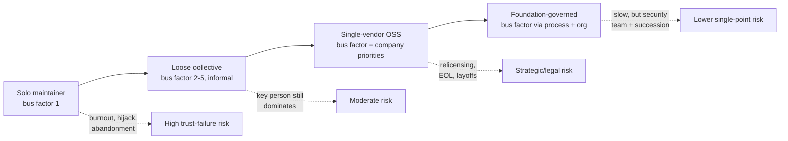
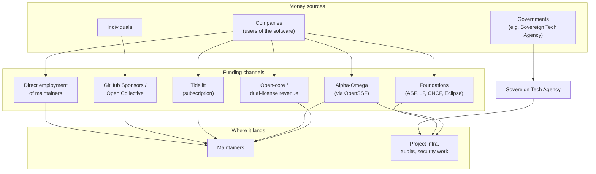
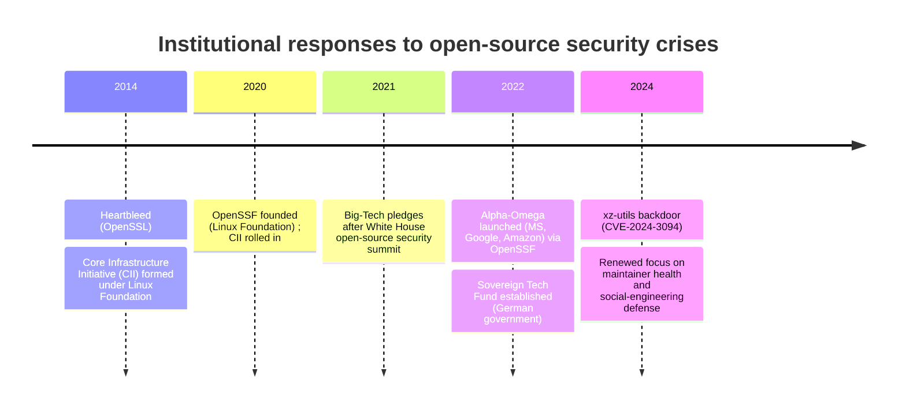
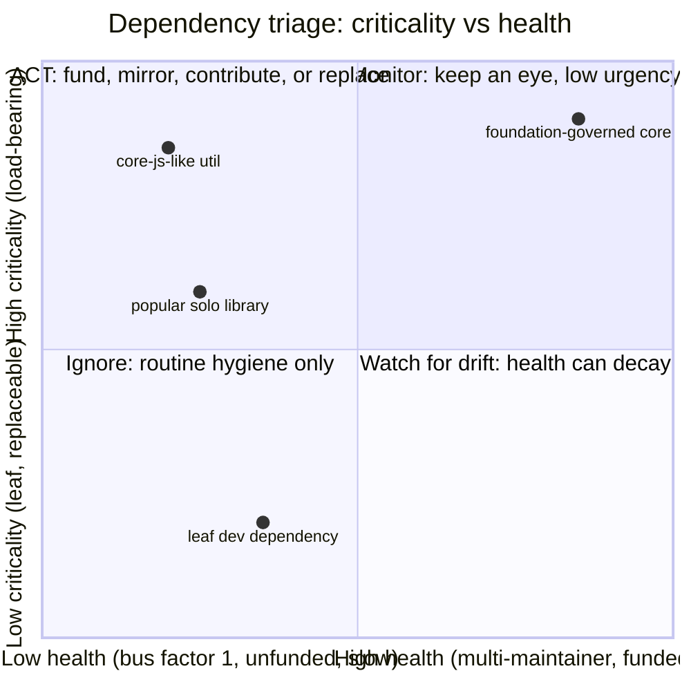

# Chapter 8 — The Open Source Ecosystem: Sustainability, Maintainership, and Risk

*What this chapter covers.* The previous chapters of this book dissected attacks — how an
adversary tampers with a build, a package, a maintainer relationship — and how to reason
about the resulting trust and threat models. This chapter steps back from the attacker and
looks at the *terrain* the attacker exploits. Modern backend systems are, by line count,
overwhelmingly other people's code: your service is a thin shell of business logic wrapped
around a deep tree of open-source libraries, runtimes, and tools that you did not write, do
not read, and mostly cannot name. That code is produced by a sprawling, informal, chronically
underfunded human system — volunteers, hobbyists, a few company-employed maintainers, a
handful of foundations. The central claim of this chapter is blunt: **the human and economic
structure of open-source production is not context for the risk; it *is* the risk surface.** A
solo maintainer's burnout, a foundation's security-response capacity, a company's decision to
relicense, a registry's unpublish policy — these are not soft "community" concerns orthogonal
to your threat model. They are the load-bearing properties of the supply chain you have
already shipped to production. We examine who actually produces open source and under what
governance, why the people doing it are so often unpaid and overextended, what the ecosystem
has built in response (CII, OpenSSF, Alpha-Omega, the Sovereign Tech Agency), how licensing
itself is a supply-chain risk, and how to read a project's health so you can triage thousands
of dependencies you will never have time to vet one by one.

Learning goals — after this chapter you should be able to:

- Distinguish the major open-source **governance models** — solo maintainer, loose collective,
  foundation-governed, single-vendor, community fork — and explain how each shapes security-
  response capacity and bus factor.
- Explain the **maintainer reality**: why critical infrastructure is so often carried by one or
  a few unpaid people, what the bus factor measures, and why burnout is a *systemic* condition
  that makes the maintainer a single point of both technical and trust failure (connecting to
  xz-utils in Chapter 5 and the colors.js / node-ipc self-sabotage in Chapter 4).
- State the **xkcd 2347 "Nebraska" problem** precisely and cite accurate real examples of
  load-bearing-but-underfunded libraries (core-js, pre-Heartbleed OpenSSL, colors.js).
- Compare **funding models** (foundations, corporate employment, GitHub Sponsors, Open
  Collective, Tidelift, bounties, open-core) and their failure modes, and articulate why "just
  pay the maintainers" is genuinely hard — discoverability, fairness, and tax/legal friction.
- Describe accurately what the **institutional responses** to Heartbleed and xz actually do:
  the CII, the OpenSSF, Alpha-Omega, the Sovereign Tech Fund/Agency, and Big Tech investments.
- Treat **license changes** (MongoDB, Elastic, HashiCorp, Redis) and the forks they spawned
  (OpenSearch, OpenTofu, Valkey) as availability and legal supply-chain risks.
- Read **project-health signals** and triage a fleet's dependency graph by *criticality ×
  health*, distinguishing popularity from health, and know where mirroring and upstreaming fit.

A note on accuracy. The incidents and initiatives below are described from public record:
maintainers' own blog posts and funding pages, foundation charters and announcements, npm's
own postmortems, and vendor license announcements. Where a figure is approximate — donation
amounts, download counts, dates of relicensing — this chapter says so rather than inventing
precision. Several of these stories are still moving as of this writing (2026); where a vendor
later reversed course, that is noted.

## The terrain: you are mostly running other people's code

Start with the uncomfortable arithmetic. A typical Node.js service with a few dozen direct
dependencies resolves to *hundreds to low-thousands* of transitive packages. A Java service
built on Spring pulls a comparably deep Maven tree. A Go binary statically links dozens of
modules. Your own code — the part your organization employs people to write and review — is
frequently under 5% of what ships in the container. The rest arrived through a package
manager doing exactly what it was designed to do (Chapter 4), and it executes with your
privileges, in your build and at your runtime.

That code did not fall from the sky. Each package has an owner or owners, a governance model
(often implicit), an economic situation (often precarious), and a license (which can change
under you). Those four properties determine how fast a security fix ships when a CVE lands, how
likely the project is to be abandoned or hijacked, and whether you are legally permitted to
keep using it next year. This is the ecosystem's risk surface, and unlike a firewall rule it
is not something you configure — it is something you *inherit*, transitively, thousands of
times over.

## The structure of open-source production

"Open source" is not one thing. It is a spectrum of governance arrangements, and where a
project sits on that spectrum tells you most of what you need to know about its resilience.

### Governance models along the bus-factor axis

The **bus factor** (also "truck factor" or "lottery factor") is the number of people who would
have to be hit by a bus — leave abruptly, for any reason — before a project stalls because
the knowledge and access to continue are gone. A bus factor of 1 means one person holds the
commit rights, the release keys, the design knowledge, and the security-response
responsibility. Governance model and bus factor are tightly coupled.



**Solo maintainer.** One person, usually unpaid, often maintaining the project on evenings and
weekends. This is the modal state of the long tail of npm/PyPI/crates.io, and — critically —
it is also true of some *extremely* load-bearing packages. Bus factor 1. Security response
depends entirely on that person's availability, attention, and goodwill. This is the model that
produced both xz-utils (Chapter 5) and colors.js (Chapter 4): in the first case the exhausted
maintainer was socially engineered into handing over control; in the second the maintainer
himself weaponized his own project.

**Loose collective.** A handful of maintainers who found each other, with no formal legal
entity, no defined succession, and usually no security team. Better than bus factor 1 on
paper, but frequently one person still does most of the work and holds the release keys, so the
*effective* bus factor is lower than the headcount suggests. Decision-making is by rough
consensus or by whoever shows up. Many mid-tier libraries live here.

**Single-vendor (company-controlled) open source.** One company employs the maintainers, owns
the trademark, controls the roadmap, and often holds copyright (via a Contributor License
Agreement that assigns rights to the company). Redis, Elasticsearch, MongoDB, HashiCorp's
Terraform, and Grafana were or are of this type. The bus factor for *code* is decent — there is
a payroll behind it — but a new risk appears: the project's direction, and even its license,
follows the company's commercial interest, not the community's. When the company's business
model collides with the community (typically because a cloud provider is monetizing the
software without contributing), the vendor can and does change the license. That is a
supply-chain risk of a different kind, treated later in this chapter.

**Foundation-governed.** The project is stewarded by a neutral non-profit that holds the
trademark and assets, enforces a governance process, and — this is the part that matters for
security — provides institutional continuity independent of any single contributor or employer.
The major foundations:

- **The Apache Software Foundation (ASF).** A membership non-profit hosting hundreds of
  projects (httpd, Kafka, Tomcat, Log4j, Cassandra, Spark). Apache requires projects to
  operate as a Project Management Committee (PMC) with multiple committers, mandates a defined
  security-response process, and holds a hard rule that "community over code" — a project with
  a single active committer is considered at risk and may be moved to the Attic. The Apache
  Security Team coordinates CVE handling across projects. Log4Shell (Chapter 5) was handled
  through exactly this machinery.
- **The Linux Foundation (LF)** and its sub-foundations. The LF is an umbrella that hosts the
  Linux kernel's infrastructure plus a large portfolio of sub-foundations, including the
  **Cloud Native Computing Foundation (CNCF)** (Kubernetes, Prometheus, Envoy, etcd, containerd)
  and the **OpenSSF** (below). CNCF runs a graduation process — sandbox → incubating → graduated
  — with escalating governance, security-audit, and maintainer-diversity requirements at each
  tier. A graduated CNCF project has undergone an independent security audit and has documented
  governance and multiple maintaining organizations.
- **The Eclipse Foundation.** A European (Belgium-based) foundation hosting Jakarta EE, the
  Eclipse IDE, and a growing set of embedded/automotive and identity projects. It is notable for
  a rigorous, legally careful IP-review process for contributions.

Foundations trade speed for resilience. Their decision-making is slower and more bureaucratic,
but they provide the two things a solo maintainer cannot: a **security-response process** that
survives any individual leaving, and **succession** — the project does not die or get hijacked
when one person burns out. For a dependency you consider critical, foundation governance is a
meaningful positive signal, though not a guarantee: Log4j was an Apache project and still
carried Log4Shell for years, because governance addresses *response and continuity*, not the
existence of latent bugs.

**Community fork.** When a project is abandoned, captured, or relicensed against its
community's wishes, the community can fork — take the last permissively licensed source and
continue it under new, independent governance (usually a foundation). Forks are the
ecosystem's ultimate check on single-vendor capture. OpenTofu, Valkey, and OpenSearch (below)
are all community forks born from license changes. A fork resets the governance model — usually
from single-vendor to foundation-governed — but it must rebuild maintainer depth from scratch,
so a young fork's bus factor can initially be worse than the parent's.

### The maintainer reality

Strip away the logos and the story is consistent: **most open source, including most critical
open source, is maintained by volunteers, and often by one or a few of them.** Surveys by the
Linux Foundation and Tidelift over recent years repeatedly find that a large share of
maintainers are unpaid, that a large share have considered quitting, and that burnout is the
norm rather than the exception. The precise percentages move year to year; the shape does not.

Burnout is not an individual failing here — it is a **systemic condition** produced by the
economics. A maintainer of a popular library receives a steady stream of bug reports, feature
demands, security reports, "is this dead?" comments, and entitled messages from people building
commercial products on their unpaid labor, and receives, typically, no money and little thanks.
The incentives point one way: the more successful and load-bearing your project becomes, the
heavier the unpaid burden, with no corresponding increase in resources. This is a free-rider
problem in the textbook sense (Ross Anderson's *Security Engineering* treats it well): everyone
benefits, nobody is individually incentivized to pay, and the maintainer absorbs the
externality until they can't.

For the security engineer, the maintainer is therefore a **single point of both technical and
trust failure**, in three distinct modes seen in the case studies:

1. **Abandonment.** The maintainer stops responding. Security reports go unanswered, CVEs go
   unpatched, and the project becomes a latent liability — either exploited directly or used as
   the entry point for a takeover (the "is this maintained? can I help?" opening that preceded
   several account-takeover attacks in Chapter 4).
2. **Capture.** An exhausted maintainer, desperate for help, hands commit and release authority
   to an adversary who has spent months building trust. This is precisely the xz-utils
   mechanism (Chapter 5): burnout was not incidental to the attack — it was the *attack surface*.
   The sockpuppet pressure campaign that pushed Lasse Collin to accept "Jia Tan" as co-maintainer
   only worked because the burden on a solo maintainer of critical compression code was real and
   visible.
3. **Self-sabotage.** The legitimate maintainer, in protest or frustration, weaponizes their own
   package. In January 2022 Marak Squires deliberately pushed a broken update to **colors.js** —
   introducing an infinite loop that printed garbage ("zalgo" text) — and emptied his
   **faker.js** repository, breaking thousands of downstream builds that depended on these
   widely used packages. Two months later, a separate incident: the maintainer of **node-ipc**
   shipped protestware (the `peacenotwar` payload) that, in some versions, wiped files on hosts
   geolocated to Russia and Belarus (Chapter 4). Both defeat signing and provenance entirely,
   because the *legitimate owner* is the threat — the artifact is authentic; it is the intent
   that is malicious.

The uncomfortable synthesis: the same property that makes a maintainer trustworthy — that one
identifiable human controls the code — is what makes them a single point of failure. Provenance
and signing (Books 5 and 6) prove that the maintainer produced the artifact; they cannot tell
you whether the maintainer is exhausted, compromised, or angry.

### The Nebraska problem

Randall Munroe's xkcd #2347, "Dependencies," draws all modern digital infrastructure as a
precarious tower of blocks, with the whole edifice resting on one small block labeled: "A
project some random person in Nebraska has been thanklessly maintaining since 2003." The joke
is load-bearing because it is literally true. Some concrete, accurately described examples:

- **core-js.** A JavaScript standard-library polyfill depended upon, directly or transitively,
  by an enormous fraction of the web — it ships in the build output of a huge share of sites via
  Babel and the broader toolchain. It has been maintained primarily by one person, **Denis
  Pushkarev (zloirock)**. In a widely read 2023 post ("So, what's next?") he laid out the
  mismatch starkly: billions of downloads and near-universal deployment, against funding
  insufficient to support the work, compounded by personal hardship (he has been open about a
  serious traffic accident and a subsequent prison term in Russia that interrupted the work).
  core-js is the Nebraska block made concrete: universal, load-bearing, and dependent on one
  underfunded person.
- **OpenSSL before Heartbleed.** In 2014, when Heartbleed (CVE-2014-0160) exposed that a
  memory-disclosure bug in the world's most widely used TLS library had gone unnoticed for two
  years, the public learned how OpenSSL was actually resourced: a tiny core team, only a small
  number of people doing the bulk of the work and essentially one person full-time, funded by on
  the order of a couple thousand dollars a year in donations (as OpenSSL Software Foundation's
  Steve Marquess described publicly at the time). The library securing a large fraction of the
  internet's transport was, economically, a Nebraska project. Heartbleed is the event that
  finally made the ecosystem treat this as an institutional problem — see the CII, below.
- **colors.js.** Before its sabotage, colors.js was a small, ubiquitous terminal-coloring
  library with millions of weekly downloads and a bus factor of 1. Its popularity was precisely
  what made the January 2022 self-sabotage a fleet-wide event.

The pattern to internalize: **the packages most likely to be a Nebraska project are not the
obscure ones — they are the small, boring, universally depended-upon utilities** that everyone
takes for granted precisely because they "just work." Nobody funds left-pad. Everybody ships it.

## Economics and sustainability

If the disease is unfunded critical infrastructure, the treatments are the various funding
models — none of which fully works, and all of which have instructive failure modes.



### Funding models and their failure modes

**Foundations.** Companies pay membership dues; the foundation funds infrastructure, legal, CI,
and sometimes staff. *Failure mode:* foundation money tends to reach the foundation's flagship
projects and their infrastructure, not the long-tail solo maintainer whose library the flagship
depends on. Foundations solve governance far better than they solve individual-maintainer
income.

**Corporate employment of maintainers.** The most robust model when it exists: a company hires
the maintainer to work on the project full-time (Google, Red Hat, Microsoft, and others employ
kernel, compiler, and toolchain maintainers). *Failure mode:* it covers only projects strategic
to a company with the means and will to pay, it introduces vendor influence over direction, and
it evaporates in layoffs — an entire project's bus factor can drop to zero in a reorg that had
nothing to do with the project's importance to the ecosystem.

**GitHub Sponsors and Open Collective.** Direct-to-maintainer donations. GitHub Sponsors
(launched 2019) lets individuals and companies fund maintainers with low friction; Open
Collective provides a transparent fiscal host so a project can receive and spend money without
forming its own legal entity. *Failure mode:* donation income is small, lumpy, and correlated
with visibility rather than criticality — the charismatic framework author does well; the
maintainer of a boring, critical, invisible transitive dependency does not. Denis Pushkarev's
core-js situation is the canonical illustration: universal dependence, negligible donations.

**Tidelift.** A subscription model: enterprises pay Tidelift for a curated, "managed" set of
open-source packages, and Tidelift pays participating maintainers to meet defined standards
(keeping the project maintained, following security practices, providing metadata). It attempts
to convert diffuse free-riding into a contractual relationship. *Failure mode:* coverage is
limited to enrolled maintainers and packages, per-maintainer amounts are often modest, and it
depends on enough enterprises buying in.

**Bounties.** Payment per fixed bug or implemented feature. *Failure mode:* bounties fund
episodic *work*, not ongoing *maintenance* — nobody puts a bounty on "keep responding to
security reports for the next five years," which is the actual scarce resource. Security bug
bounties (distinct from feature bounties) do help surface vulnerabilities, but they reward
finders, not maintainers who must then fix and release.

**Dual-licensing / open-core.** The project is open source, but the company sells a proprietary
edition, hosted service, or enterprise add-ons (dual-license: same code under a copyleft license
free, or a commercial license for a fee; open-core: an open core with proprietary shells). This
is the dominant *commercial* model for single-vendor OSS and it genuinely funds full-time
development. *Failure mode:* it aligns the maintainer's incentive with the company's revenue,
not the community's needs, and — as the license section shows — it sets up the relicensing
conflict when a cloud provider monetizes the open core without paying.

### Why "just pay the maintainers" is hard

The recurring reaction to every open-source incident is "companies make billions off this;
they should just pay the maintainers." The sentiment is correct and the execution is genuinely
difficult, for three structural reasons:

- **Discoverability.** *Which* maintainers? Your risk is concentrated in your critical
  dependencies, but the critical ones are frequently deep transitive packages you cannot name
  without tooling. The Nebraska block is by definition the one you never think about. Directing
  money to criticality requires first *measuring* criticality across a graph of thousands of
  nodes — which is exactly why the OpenSSF built a Criticality Score (below). Absent that,
  money flows to the visible, not the load-bearing.
- **Fairness.** How do you split funds among a project's contributors? Between the framework and
  the ten libraries it stands on? A package's importance is a function of the whole graph, not
  any single node, so any allocation rule is contestable and creates its own perverse
  incentives (maintainers gaming metrics, disputes over who "really" maintains).
- **Tax and legal friction.** Paying an individual maintainer — who may be in any country, may
  be subject to sanctions, may have no company — raises real problems: tax withholding and
  reporting across jurisdictions, sanctions/export-control screening, the risk of
  reclassifying a volunteer as an employee or contractor, and the sheer overhead of vendor
  onboarding a hobbyist. This is a large part of why fiscal hosts (Open Collective), managed
  intermediaries (Tidelift), and foundations exist: they absorb the legal machinery that a
  direct payment would otherwise impose on both sides.

None of this makes funding hopeless. It explains why the effective responses have been
*institutional* — pooled money, routed through intermediaries, targeted by criticality metrics
— rather than a thousand companies each writing checks to individuals.

## Institutional responses: from Heartbleed to post-xz

Two crises bookend the institutional history: Heartbleed (2014) exposed the underfunding of
critical infrastructure, and xz-utils (2024) exposed that even funded attention had not solved
the maintainer-capture problem. The response has accreted in layers.



**Core Infrastructure Initiative (CII), 2014.** Formed by the Linux Foundation directly in
response to Heartbleed, the CII pooled money from major technology companies to fund the
maintenance and security of critical projects that were dangerously underfunded — OpenSSL,
OpenSSH, NTP, GnuPG and others received support. The CII also produced durable artifacts: the
**CII Best Practices Badge** (a self-certification of security-relevant practices, since folded
into the OpenSSF Best Practices Badge) and a **Census** effort to systematically identify which
open-source projects were both widely used and under-resourced — the first serious attempt to
*measure* the Nebraska problem rather than react to it after each crisis.

**OpenSSF (Open Source Security Foundation), 2020.** A Linux Foundation umbrella that
consolidated several prior efforts (the CII among them) into a single organization focused on
open-source software security. The OpenSSF is best understood as the *home* for much of this
book's later subject matter: it stewards or hosts **Scorecard** and the **Criticality Score**
(below), the **SLSA** framework (Book 5), **Sigstore** (Book 5), the **S2C2F** consumption
framework (below and Book 8), best-practices guidance, and security-tooling working groups. Its
role is coordination and production of shared standards and tools, not day-to-day maintenance of
any one project.

**Alpha-Omega, 2022.** An OpenSSF-associated project funded initially by Microsoft and Google
(later joined by Amazon), with the explicit mission of improving the security of critical
open-source projects — and it does so with money and staff time, not just standards. Its name
encodes its two-pronged strategy: **Alpha** engages *directly* with a targeted set of the most
critical projects and ecosystems (funding dedicated security engineers, audits, and
maintainers to do security work), while **Omega** applies *automated* analysis at scale across
the long tail of thousands of projects to find and report vulnerabilities that no human is
watching. Alpha-Omega is the closest thing the ecosystem has to a mechanism that routes
corporate money to critical-project security work by criticality.

**Sovereign Tech Fund / Sovereign Tech Agency, 2022.** A striking departure: a *government*
funding open-source infrastructure as public digital infrastructure. Established with backing
from the German federal government (via its economics ministry), the Sovereign Tech Fund — now
operating as the **Sovereign Tech Agency** — invests directly in the maintenance, improvement,
and security of foundational open-source components that the digital economy depends on,
including efforts to fund maintainers and reduce single-maintainer fragility (its "Bug Resilience"
and maintenance programs target exactly the bus-factor problem). It treats OSS the way a state
treats roads and bridges: as public infrastructure warranting public maintenance funding,
independent of any single company's commercial interest.

**Big-Tech security investments.** Beyond Alpha-Omega, individual companies have made direct
commitments — funding kernel and toolchain maintainers on payroll, running fuzzing services
(Google's **OSS-Fuzz** continuously fuzzes hundreds of critical projects for free), operating
package-registry security features (npm/PyPI 2FA mandates, provenance), and pledging security
spending after the 2021 White House open-source security summit that followed Log4Shell and
SolarWinds. These are real and material, but they are also *strategic* — concentrated on what
matters to the funder — which is exactly why the pooled, criticality-targeted vehicles (CII,
Alpha-Omega, Sovereign Tech) exist alongside them.

What none of these solves, and what xz-utils drove home in 2024, is the *social* attack surface:
money and audits do not, by themselves, tell an overloaded maintainer that the eager new
contributor offering to help is a long-con adversary. The post-xz conversation has accordingly
turned toward **maintainer health and trust** — reducing the pressure that makes capture
possible, and treating maintainer well-being and contributor-vetting as security controls, not
HR niceties. This is progress in framing; it is not yet a solved problem.

## License risk as supply-chain risk

Security engineers instinctively model the supply chain as a *confidentiality/integrity*
problem — someone tampers with code. But the license is a supply-chain risk in the
*availability* and *legal* dimensions: a project you depend on can, without any code changing,
become one you are no longer permitted to use as you were using it, or one whose obligations you
are now violating. This risk needs to sit in your dependency review alongside CVEs.

### Copyleft obligations

The classic license risk is **copyleft**. The GPL family requires that if you distribute a work
derived from GPL code, you must offer the corresponding source under the GPL. The **AGPL**
(Affero GPL) closes the "SaaS loophole": it treats *network interaction* with the software as
triggering the source-provision obligation, so running modified AGPL code as a backend service
your users reach over a network can obligate you to offer that modified source. For a
distributed-systems shop, an AGPL dependency pulled transitively into a service is a genuine
compliance exposure — not because AGPL is malicious, but because your obligations changed the
moment it entered the graph, and most teams have no tooling watching license transitions the way
they watch CVEs. (Chapter 4's protestware overlaps here in spirit: a license, like a payload,
is an obligation the maintainer can impose on you unilaterally.)

### The rug-pull pattern: single-vendor relicensing

The higher-profile recent risk is the **relicensing rug-pull**: a single-vendor project,
originally under a permissive OSI-approved license, changes to a *source-available* or
restrictive license — typically to prevent cloud providers from offering the software as a
managed service without paying. The code is still visible, but it is no longer open source by
the OSI definition, and your permitted uses may narrow sharply. The pattern, described
accurately:

| Project | Original license | Changed to | Approx. year | Community fork |
|---|---|---|---|---|
| MongoDB | AGPL | SSPL | 2018 | (no major fork) |
| Elasticsearch / Kibana | Apache 2.0 | SSPL + Elastic License | 2021 | **OpenSearch** (AWS) |
| Terraform (and others) | MPL 2.0 | BSL (Business Source License) | 2023 | **OpenTofu** (Linux Foundation) |
| Redis | BSD 3-clause | RSALv2 / SSPLv1 dual | 2024 | **Valkey** (Linux Foundation) |

The two recurring license instruments:

- **SSPL (Server Side Public License)**, introduced by MongoDB, extends AGPL-style obligations
  aggressively: offering the software as a service obligates you to release the source of your
  entire *service management stack*. The OSI has declined to approve SSPL as an open-source
  license precisely because that condition discriminates against a field of use. Elastic (2021)
  and Redis (2024) both adopted SSPL as one of their options.
- **BSL (Business Source License)**, used by HashiCorp for Terraform, Vault, and others in 2023,
  is *source-available with a time delay and a use restriction*: the source is public, you may
  use it for non-competing purposes, and each version converts to a truly open license (for
  HashiCorp, MPL 2.0) after a change date (typically a few years). It is not open source during
  the restricted window.

The community response to relicensing has been the **fork**, and these forks are now
significant infrastructure in their own right:

- **OpenSearch** — Amazon's Apache-2.0 fork of the last open-source Elasticsearch/Kibana, later
  moved under the Linux Foundation.
- **OpenTofu** — a fork of Terraform at its last MPL-2.0 version, developed under the Linux
  Foundation as a community-governed drop-in.
- **Valkey** — a fork of Redis at its last BSD version, under the Linux Foundation, backed by
  several major cloud providers.

Note the direction of travel: each fork moves governance from *single-vendor* to
*foundation-governed*, which is a resilience improvement, but each young fork must rebuild
maintainer depth and prove it can sustain a security-response process. The picture keeps
moving — both Elastic (2024) and later Redis (2025) added back an AGPL option to their
licensing, partly in response to the reputational and competitive cost of the fork. As of this
writing the forks continue in parallel with the relicensed originals.

For your fleet, the practical consequences are concrete and belong in a risk register:

- **You may be forced to migrate** — to a fork or an alternative — on the vendor's timeline,
  not yours, if the new terms conflict with your use (e.g., you *are* a service provider).
- **Your license-compliance posture can silently drift out of compliance** when a transitive
  dependency relicenses in a routine version bump. Watching for license *changes* in dependency
  updates is as important as watching for CVEs — and far less commonly automated.
- **Governance is a durable signal.** A foundation-governed project *cannot* be unilaterally
  relicensed by one company; a single-vendor project can. If relicensing risk matters to you,
  weight foundation governance accordingly when you choose dependencies.

## Reading project health

You cannot vet thousands of dependencies deeply. What you *can* do is learn to read the signals
that predict whether a project will respond well when something goes wrong — because "responds
well to a security report" is the property that actually protects you at 2 a.m. when a CVE
lands in something you ship.

### Signals that actually matter

- **Release cadence and recency.** A project that ships regularly is alive; one whose last
  release was years ago may be abandoned (or may be "done" — for a truly small, stable library,
  no releases can be fine, so read cadence together with issue responsiveness).
- **Responsiveness to security reports.** The single most predictive signal. Is there a
  documented private disclosure channel? Do past security issues show timely, competent
  responses? A project that triages and patches quickly is one you can depend on under fire.
- **Number of active maintainers (effective bus factor).** Not the contributor count — the
  number of people with commit/release authority who are *currently active*. One name on 95% of
  recent commits is a bus factor of 1 regardless of how many drive-by contributors exist.
- **A security policy (`SECURITY.md`).** Its presence signals the maintainer has thought about
  disclosure at all, and it tells *you* how to report responsibly instead of filing a public
  issue that becomes a 0-day.
- **2FA enforcement on the registry account.** npm and PyPI now mandate 2FA for
  high-impact/maintainer accounts precisely because account takeover (Chapter 4) is a primary
  attack vector. A maintainer account without 2FA is a takeover waiting to happen.
- **Provenance and signing.** Does the project publish signed artifacts and build provenance
  (npm provenance, Sigstore attestations — Books 5 and 6)? Provenance lets you verify what you
  received; its presence also signals a maintainer investing in supply-chain hygiene.
- **Funding status.** Is anyone paid to maintain this? An unfunded, high-download, solo project
  is the Nebraska risk in its pure form.
- **Downstream criticality.** How load-bearing is this in *your* graph and the ecosystem's? A
  bug in a leaf dev-dependency is a nuisance; a bug in a package half your services link is an
  incident.

### Tooling: Scorecard and Criticality Score

The OpenSSF has turned several of these signals into automated tools; this book treats them in
depth in Book 2, Chapter 10, but they belong in your vocabulary now:

- **OpenSSF Scorecard** runs a set of automated checks against a repository — branch
  protection, whether CI runs tests, dependency pinning, presence of a security policy, code
  review on changes, token permissions, whether releases are signed, fuzzing, and more — and
  produces a 0–10 score per check plus an aggregate. It is a *practices* signal, machine-
  evaluable across thousands of repos, and can run in CI to flag when a dependency's hygiene
  degrades.
- **OpenSSF Criticality Score** estimates how *critical* a project is to the broader ecosystem
  from signals like dependent count, contributor and commit activity, and organizational
  reach. It is the tool that operationalizes "which Nebraska blocks matter most," and thus the
  input to any rational funding or vetting prioritization.

```bash
# Scorecard against a dependency's repository (illustrative)
scorecard --repo=github.com/some-org/some-critical-lib

# ...produces per-check scores and an aggregate, e.g.:
#   Aggregate score: 6.4 / 10
#   Branch-Protection    8
#   Code-Review          9
#   Security-Policy     10
#   Signed-Releases      0   <-- no signed releases
#   Token-Permissions    2   <-- overly broad CI token perms
#   Maintained           7
```

### Popularity is not health

The most important distinction in this whole chapter for day-to-day dependency selection:
**popularity and health are different axes, and conflating them is the danger.** A package with
fifty million weekly downloads can be a solo side project with a bus factor of 1, no security
policy, no 2FA, and no funding — colors.js and left-pad both were. High download counts create
a *false sense of safety* ("everyone uses it, so it must be fine") while simultaneously *raising
the blast radius* of any failure. Popularity measures how much you'd hurt if it broke;
criticality-times-health measures how likely it is to break and how well it would recover. Those
are the numbers to reason about.

## Distributed-systems lens

At fleet scale — hundreds of services, thousands of transitive dependencies, high deploy
frequency — the ecosystem's structure stops being abstract and becomes an operational
constraint. Three consequences follow directly.

### You cannot vet everything, so triage by criticality × health

You will never have the human hours to deeply review thousands of packages. Attempting equal
scrutiny across the whole graph guarantees you under-scrutinize the few that matter while
wasting effort on leaves that don't. The tractable strategy is a two-axis triage: **how
load-bearing is this dependency (criticality)** against **how well-maintained is it (health)**.



The upper-left quadrant — **high criticality, low health** — is where your finite attention
belongs. Those are the packages that are both load-bearing *and* fragile: the Nebraska blocks
in your specific graph. For each one you have a menu of responses, roughly in ascending cost:
mirror it (below); subscribe to its advisories and pin it with integrity hashes; fund it
(Sponsors/Tidelift/Open Collective); contribute maintenance to raise its bus factor; or, if the
risk is unacceptable and unfixable, replace or vendor it. The point is to *spend the scrutiny
where criticality and fragility intersect*, not uniformly.

### Give back: fix and upstream

At fleet scale you are a large consumer of open source, and the ecosystem's health is partly
your responsibility because it is partly your risk. When you find and fix a bug or vulnerability
in a dependency, the mature move — captured in the OpenSSF **S2C2F (Secure Supply Chain
Consumption Framework)** as the **"Fix + Upstream"** practice — is to fix it *and contribute the
fix back to the maintainer*, rather than carrying a private patch forever. This is not altruism;
it is engineering economics: a private fork of a dependency is a maintenance liability that
diverges further from upstream with every release, and upstreaming both discharges that liability
and improves the shared artifact you depend on. It also, in aggregate, raises the effective bus
factor of the projects you rely on — your engineers become part of the maintenance capacity.
(The S2C2F and the broader "consume securely" discipline are developed fully in Book 8.)

### Mirror so a maintainer can't break your builds: left-pad

The final fleet-scale lesson is defensive and concrete: **do not let a live public registry sit
on your build's critical path.** If your CI resolves dependencies directly from npm/PyPI/etc. at
build time, then any registry outage, any package deletion, or any maintainer's protest can stop
your entire fleet from building. The canonical demonstration is **left-pad, March 2016.**

Azer Koçulu maintained a large number of small npm packages, including **left-pad** — an
eleven-line function that pads a string on the left. He also owned a package named **kik**. The
messaging company Kik, through its lawyers, wanted that name; when Koçulu refused, npm's
leadership sided with Kik and transferred the name. In protest at npm overriding his ownership,
Koçulu **unpublished all of his packages from npm** — roughly two hundred and fifty of them,
including left-pad. Because left-pad was a transitive dependency of enormously popular
toolchains (Babel, and through it much of the React/JavaScript build ecosystem), builds across
the industry began failing within minutes as `npm install` could no longer resolve the
now-missing package. npm took the highly unusual step of **restoring ("un-unpublishing")
left-pad** — overriding a maintainer's deletion, itself a norm-breaking act — to stop the
bleeding. In the aftermath npm **changed its unpublish policy**: packages can be freely
unpublished only within a short window after publishing (72 hours), and after that a package
that others depend on cannot simply be removed — deletion requires contacting npm and is blocked
when the package has dependents, precisely so one person can never again vaporize a load-bearing
dependency at will.

The eleven lines of left-pad were never the point. The lesson is architectural: **an external,
mutable registry is a runtime dependency of your build, and a maintainer or a registry has
unilateral control over it unless you interpose a cache you control.** The mitigation is an
**internal mirror / pull-through proxy** — Artifactory, Nexus, Verdaccio, a private PyPI, Go's
`GOPROXY`, a vendored `vendor/` directory, or a cloud artifact registry — that caches every
dependency you have ever resolved so that a deletion, outage, or relicensing upstream cannot
break a build you have already validated. The mirror is also a **security chokepoint** (Chapter
6): the single place to enforce allow-lists, scanning, provenance verification, and pinning
before a package can enter your builds. left-pad is usually told as a story about tiny
dependencies; it is really a story about **who controls your build's inputs**, and the answer
should be *you*.

## Key takeaways

- **The ecosystem's human and economic structure is the risk surface, not context for it.**
  Governance model, maintainer capacity, funding, and license are load-bearing properties of the
  code you have already shipped — inherited transitively, thousands of times, and mostly
  unmanaged.
- **Governance predicts resilience.** Solo-maintainer (bus factor 1) and single-vendor
  (relicensing risk) sit at the fragile end; foundation-governed (ASF, LF/CNCF, Eclipse)
  provides the two things individuals cannot — a durable security-response process and
  succession. Community forks are the ecosystem's check on single-vendor capture.
- **Burnout is systemic, and it makes the maintainer a single point of both technical and trust
  failure** — abandonment, capture (xz-utils, Chapter 5), and self-sabotage (colors.js and
  node-ipc, Chapter 4). Signing and provenance prove *who* produced an artifact; they cannot
  tell you the maintainer is exhausted, compromised, or angry.
- **The Nebraska problem is concrete:** core-js, pre-Heartbleed OpenSSL, and colors.js were all
  universal and underfunded. The packages most likely to be a one-person project are the small,
  boring, universally depended-upon utilities.
- **"Just pay maintainers" is genuinely hard** — discoverability of critical deps, fairness of
  allocation, and tax/legal friction — which is why the effective responses are institutional
  and criticality-targeted: CII (post-Heartbleed), OpenSSF, Alpha-Omega, and the Sovereign Tech
  Agency, each doing a specific, distinct job.
- **License changes are supply-chain risk in the availability/legal dimension.** Copyleft
  (GPL/AGPL) obligations and single-vendor rug-pulls (MongoDB SSPL 2018, Elastic 2021, HashiCorp
  BSL 2023, Redis 2024 → OpenSearch, OpenTofu, Valkey) can force migration on someone else's
  timeline. Watch dependency updates for license *changes*, not just CVEs.
- **Popularity is not health.** A hugely-depended-on package can be a solo side project — that
  combination is the danger. Read health from responsiveness, effective bus factor, `SECURITY.md`,
  2FA, provenance, and funding; use OpenSSF Scorecard and Criticality Score to do it at scale
  (Book 2, Chapter 10).
- **At fleet scale, triage by criticality × health, upstream your fixes (S2C2F Fix+Upstream,
  Book 8), and mirror your dependencies** so that a maintainer deleting a package (left-pad,
  2016) cannot break builds you have already validated — and so the mirror doubles as your
  security chokepoint.

## Further reading

- Randall Munroe, xkcd #2347, "Dependencies" (`xkcd.com/2347`) — the Nebraska-maintainer
  illustration of critical-dependency fragility.
- Nadia Eghbal (Asparouhova), *Roads and Bridges: The Unseen Labor Behind Our Digital
  Infrastructure* (Ford Foundation, 2016), and *Working in Public: The Making and Maintenance of
  Open Source Software* (Stripe Press, 2020) — the definitive treatments of open-source
  economics and maintainer labor.
- Denis Pushkarev, "So, what's next?" (2023) — the core-js maintainer's own account of universal
  dependence against negligible funding (`github.com/zloirock/core-js`).
- Steve Marquess, OpenSSL Software Foundation, "Of Money, Responsibility, and Pride" (2014) — the
  post-Heartbleed account of how little funded OpenSSL actually was.
- The Core Infrastructure Initiative and its successor, the **OpenSSF** (`openssf.org`) — charter,
  working groups, and the Best Practices Badge.
- **Alpha-Omega** (`alpha-omega.dev`) — annual reports describing the Alpha (targeted) and Omega
  (long-tail) strategies and where the money goes.
- **Sovereign Tech Agency** (`sovereign.tech`) — program descriptions for funding and bug-
  resilience work on critical open-source infrastructure.
- OpenSSF **Scorecard** (`github.com/ossf/scorecard`) and **Criticality Score**
  (`github.com/ossf/criticality_score`) — the automated health and criticality tools (deep dive
  in Book 2, Chapter 10).
- OpenSSF **Secure Supply Chain Consumption Framework (S2C2F)** — the "Fix + Upstream" and secure-
  consumption practices (developed in Book 8).
- The Open Source Initiative's analyses of SSPL and the Business Source License, and the OSI's
  criteria for what constitutes an open-source license — background for the relicensing section.
- The npm blog, "kik, left-pad, and npm" (2016) and the subsequent unpublish-policy announcement
  — npm's own account of the left-pad incident and the policy change it produced.
- Ross Anderson, *Security Engineering*, 3rd ed. (Wiley, 2020) — the economics-of-security and
  free-rider chapters underlying this chapter's account of why maintenance goes unfunded.
