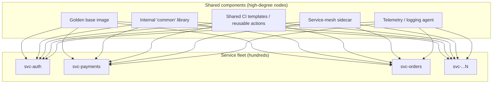
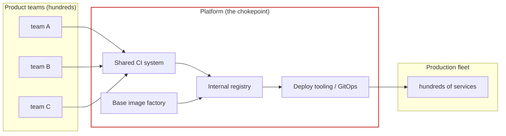
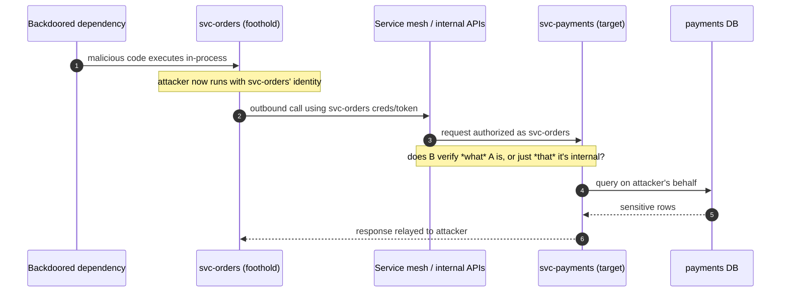
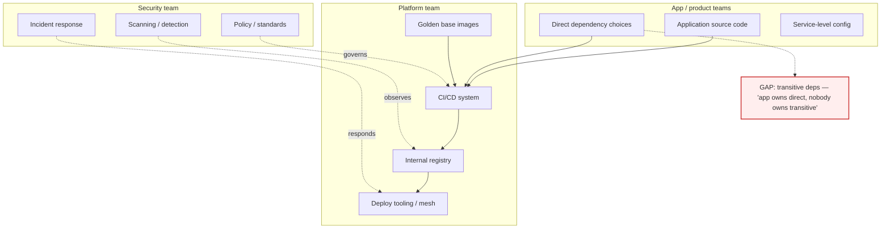
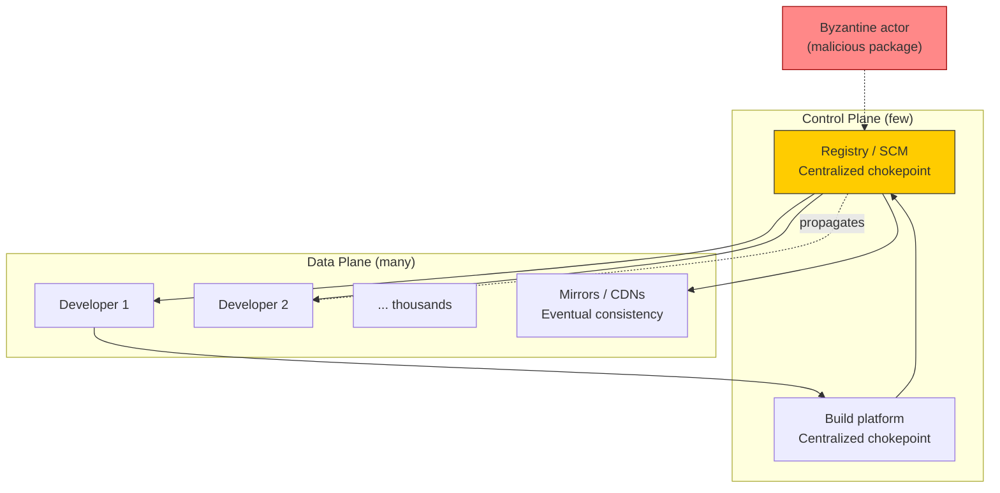
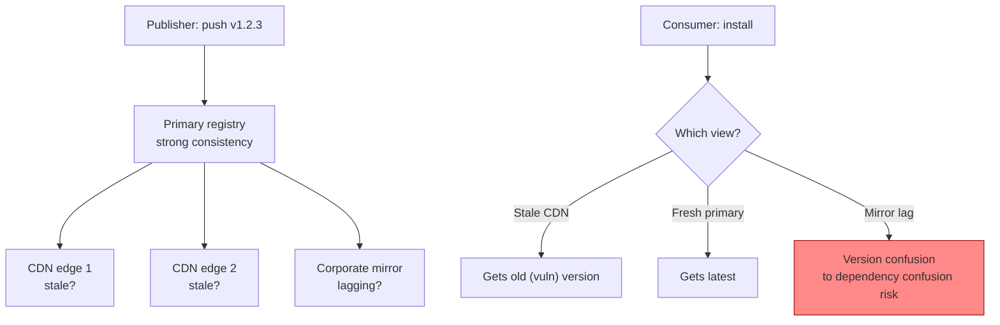

# Chapter 9 — Supply Chain Security in Distributed Backend Systems

*What this chapter covers.* Every prior chapter ended with a "distributed-systems lens": a
paragraph or section translating the topic into the language of many services, many teams, many
repos, and high deploy frequency. This chapter inverts the ratio. The lens *is* the subject.
The supply chain concepts you have accumulated — the chain's anatomy (Chapter 1), the attack
taxonomy (Chapter 2), the case studies (Chapters 3–5), and the trust/threat/economics toolkit
(Chapter 6) — were mostly developed against an implicit *single* artifact: one build producing
one binary that one team deploys. That model is pedagogically clean and operationally extinct
at any company large enough to have a platform team. A modern backend estate is not one supply
chain with one endpoint. It is hundreds of supply chains, overlapping through shared components,
feeding a fleet that redeploys thousands of times a day. Scale does not merely make the same
problem bigger. It changes the shape of the problem: where the concentration risk lives, who the
high-value target is, how an initial compromise moves, and — critically — how fast both attack
and remediation propagate. This chapter is the bridge that makes the rest of the series
specifically about *your* system: a large, heterogeneous, continuously deployed microservice
estate, rather than a generic "the software supply chain."

Learning goals — after this chapter you should be able to:

- Quantify the **multiplication effect** and reason about **blast radius** when a shared base
  image, internal library, CI template, or injected agent is compromised, rather than a
  single service.
- Identify **concentration risk** in your estate: the small set of components whose betrayal
  reaches most or all of the fleet, and explain why they are high-value targets precisely
  because they are ubiquitous.
- Explain the **platform team as chokepoint and target** — the paved-road model as both a
  security multiplier and an internal SolarWinds — and why paved roads beat voluntary policy at
  scale on pure economics.
- Map the **architecture-specific attack surface** of cloud-native systems: service-to-service
  trust as a lateral-movement path, sidecars/agents/webhooks/operators/DaemonSets as fleet-wide
  auto-updating trust, and IaC/config as "code you run."
- Reframe **inventory and response** (the Log4Shell question) as a distributed-systems problem —
  "which of my 500 services, across N languages and M versions, are affected and where?" — and
  connect it to fleet SBOM inventory, immutable infrastructure, and remediation velocity.
- Apply **Conway's Law** to supply chain ownership: draw the boundaries between app, platform,
  and security teams, and see the gaps between them as the places attacks live.

We will forward-reference heavily and prove little cryptographically here. The mechanisms —
SBOM formats (Book 3), provenance and SLSA (Book 4), Sigstore and signing (Book 5), the
cloud-native control plane (Book 6), zero-trust identity with SPIFFE/mTLS (Book 6 Ch 5 and Book
9) — get full treatment in their own books. This chapter's job is to make you feel the shape of
the problem at fleet scale so that when those books get mechanical, you already know which
levers matter and why.

## The multiplication effect: from one chain to hundreds

Start with the monolith, because it is the baseline everyone's intuition was trained on. One
repository. One CI pipeline. One build producing one deployable artifact — a JAR, a container
image, a binary. One deploy target, perhaps replicated for availability but conceptually
singular. The supply chain is a line: source → dependencies → build → artifact → deploy → run.
When you reason about it, you reason about *one* of each thing. You can, in principle, read the
whole dependency manifest, know every CI step, and hold the entire chain in your head.

Now decompose that monolith into a microservice estate — the architecture almost every
large backend organization has adopted or inherited. The counts explode, and they do not
explode uniformly. A representative mid-to-large estate might look like:

| Dimension          | Monolith | Microservice estate (illustrative)        |
|--------------------|----------|-------------------------------------------|
| Source repos       | 1        | 200–1,000+                                 |
| Build pipelines    | 1        | one or more per repo → hundreds            |
| Languages / ecosystems | 1–2  | 5–8 (npm, Maven/Gradle, Go, PyPI, Cargo, gems, …) |
| Produced artifacts | 1        | hundreds of images, per commit            |
| Deploys per day    | 1–10     | thousands (per-service CD, autoscaling)    |
| Third-party deps (transitive) | hundreds | tens of thousands across the estate |

The naive reading is "the same problem, times N." That undercounts, because the estate is not N
independent copies of the monolith's supply chain. It is N chains that **share** components, and
sharing is where the interesting risk concentrates. Every service pulls a base image. Most
services in a given language pull the same handful of internal libraries. Every pipeline runs
the same CI templates or reusable workflows. Every pod gets the same injected sidecar and the
same telemetry agent. So the estate's supply-chain graph is not N disjoint lines; it is a graph
with a small number of **high-degree nodes** — components consumed by nearly everything — and a
long tail of leaf dependencies used by one or two services.



This graph structure is the whole point. In classic reliability engineering you learn to hunt
for the single points of failure — the shared database, the one load balancer. Supply chain
security at scale is the same hunt with a different failure mode: not "what breaks everything if
it goes *down*," but "what compromises everything if it goes *bad*." The two questions have
overlapping answers, and the overlap is your concentration risk.

### Blast-radius math

Make it concrete with arithmetic, because the arithmetic is what separates a shared base image
from a leaf dependency in a risk conversation.

Suppose your estate has **400 services**. A leaf npm package used by exactly one service has a
blast radius of 1 service if it is backdoored: bad, bounded, and — crucially — *someone owns
it*, because it lives in that one team's `package.json`. Now the golden base image. If all 400
services `FROM` it (directly or through a language-specific variant that itself derives from
it), a malicious layer added to that base image has a blast radius of **400 services** the next
time each one rebuilds. Not 400 as a worst case you have to reason your way to — 400 as the
*default*, because that is what "shared base image" means.

The multiplier is not just service count; it is service count times deploy frequency times the
privilege and reach of the compromised component. Three numbers matter:

- **Fan-out (F):** how many services consume the component. For a base image or a mesh sidecar,
  F approaches the whole fleet.
- **Propagation time (T):** how quickly a poisoned version reaches production once published.
  In a continuous-deployment shop with automated base-image bumps, T is hours, not months.
- **Privilege (P):** what the component can do where it runs. A telemetry agent running as a
  privileged DaemonSet with host mounts has vastly higher P than an application-level utility
  library.

A leaf dependency is (F=1, T=slow, P=app-level). The golden base image is (F≈fleet, T=hours,
P=whatever your containers can do). The injected node agent is (F=every node, T=auto, P=host).
Risk tracks the product, and the product for shared infrastructure components is orders of
magnitude larger than for the leaf dependencies that dominate raw dependency counts. This is why
"we have 40,000 dependencies" is a misleading headline number: the risk is not spread evenly
across 40,000 things. It is piled onto the few dozen that everything shares.

### The internal analogue of a popular OSS package

You already know why attackers target popular open-source packages: one compromise of `event-stream`
or a typosquat of a widely-installed library reaches everyone downstream (Chapter 4). The
distributed-systems insight is that **your own internal shared components are popular packages
from the attacker's point of view — just with a smaller, richer, and less-scrutinized user
base.** The internal `common` library that every Java service imports for logging, config, and
HTTP clients is, structurally, `log4j-core` for your company: ubiquitous, load-bearing, and
rarely audited with the paranoia its reach deserves. It is often *worse* than a public OSS
package on the dimension that matters, because public packages at least get many eyes, public
CVE tracking, and ecosystem-wide scanning. Your internal `common` library gets reviewed by the
handful of people on the platform team who touch it and is invisible to every external scanner
you run. The reach of a popular OSS package, minus the scrutiny. That is the trade you made
when you centralized, and it is usually still worth it — but only if you *know* you made it.

## Heterogeneity: many ecosystems, uneven maturity

The monolith model also hides a second scaling problem: **heterogeneity**. A single service is
usually one language and one package ecosystem. An estate of hundreds is not. A realistic large
backend runs Java/Kotlin services on Maven or Gradle, Go services on Go modules, Node/TypeScript
services on npm or pnpm, a Python data or ML tier on PyPI, maybe Rust for performance-critical
paths on Cargo, and a legacy Ruby corner on Bundler. Each ecosystem has its own manifest format,
its own lockfile semantics (or lack thereof), its own registry, its own signing story, its own
notion of "transitive dependency," and its own failure modes. `npm`'s postinstall scripts, Go's
module proxy and `GOSUMDB`, Maven's coordinate resolution and the historically weak default of
unauthenticated HTTP repositories, Python's `setup.py` executing arbitrary code at install time —
these are *different* attack surfaces, each covered in depth in Book 2, and no single control
covers all of them.

The security consequence of heterogeneity is that **uniform policy is genuinely hard**, and the
difficulty is not evenly distributed. "Require a lockfile with hashes" is a one-line policy that
means five different things across five ecosystems and is unenforceable in the ones that do not
support hash-pinning cleanly. "Scan dependencies for known vulnerabilities" requires an advisory
database and a resolver per ecosystem. "Sign artifacts" runs into a different registry story per
language. Every control you design centrally has to be implemented, tested, and maintained N
times, once per ecosystem, and the marginal ecosystem — the one Rust service, the one Ruby app —
gets the least attention and becomes the soft spot.

Which points at the sharpest heterogeneity risk: **the lowest-maturity team is often the entry
point.** An estate's security posture is not its average; it is closer to its minimum, because an
attacker chooses where to enter. The team that skipped the paved road, runs its own snowflake
pipeline, pins nothing, and hasn't rotated a CI credential since 2021 is the way in — and once
in, the attacker pivots toward the shared components and the high-privilege services (see the
lateral-movement discussion below). Aggregate metrics ("92% of services are on the golden
pipeline") flatter you precisely by hiding the 8% that matter. At scale, the security question is
never "what is our average maturity" but "where is our *minimum*, and what does it touch."

## The platform team as chokepoint — and as target

Confronted with the multiplication effect and heterogeneity, every large engineering
organization converges on the same structural answer: a **platform team** (variously "developer
platform," "developer experience," "infrastructure," "foundation") that provides shared
capabilities so that individual product teams do not each solve build, deploy, and runtime from
scratch. The platform team owns the CI system, the golden base images, the internal artifact
registry, the deployment tooling, the service mesh, and the observability stack. This is the
**paved road** (Netflix's coinage) or **golden path** (Spotify's): an opinionated, well-lit,
well-supported way to build and ship a service, such that a team walking the paved road gets a
compliant pipeline, a hardened base image, signed artifacts, and standard telemetry *for free*,
as a byproduct of using the standard tooling rather than as a checklist they must consciously
satisfy.

From a supply chain standpoint the paved road is a **trust chokepoint**, and the word chokepoint
carries both meanings deliberately.



**The good direction.** Centralizing the build and deploy path concentrates the trust you have
to establish well into a *small, expert-run* surface. Instead of asking 400 product teams to
each correctly configure provenance, pin dependencies, sign artifacts, and harden a Dockerfile —
which they will do with 400 different levels of rigor — you ask one platform team to do it once,
correctly, in the shared tooling. Provenance becomes a property of "built on the paved road"
rather than something each team opts into. Consistency is itself a security property: when every
artifact is built the same way, an artifact built a *different* way is an anomaly you can detect
(Chapter 6's assume-breach posture becomes tractable when "normal" is well-defined). The
economics, which we return to below, are decisively in favor of this model. Fewer things to
secure well; secured once; enforced by default.

**The dangerous direction.** The same concentration that makes the platform efficient to secure
makes it catastrophic to compromise. Every property above runs in reverse. Compromise the shared
CI system and you can inject into *every* build. Compromise the base image factory and you own
the bottom layer of every container. Compromise the deploy tooling and you can push to the whole
fleet. The platform team's credentials, signing keys, and pipeline definitions are the highest-
value targets in the entire estate, because they sit at the point through which all trust flows.

The right mental model is not abstract. **Your platform team runs your internal SolarWinds.**
The 2020 SolarWinds Orion compromise (covered in Chapter 3) worked precisely because Orion was a
trusted, widely-deployed piece of software distributed through a build system that customers
implicitly trusted: subvert the build (the SUNBURST implant was inserted into the Orion build
process, not the published source), and the malicious update flows out to ~18,000 organizations
through the normal, signed, trusted update channel. Your internal base-image factory and CI
system have exactly this shape — a trusted build process feeding a signed artifact to a large
population of consumers who take the update automatically — with one difference: the blast radius
is bounded by your org instead of the internet, but *within* your org it is total. The SolarWinds
lesson for a platform team is not "external vendors are risky." It is "the build system that
everything trusts is the thing an attacker most wants, and you are running one." The controls
that follow from this — protecting the build environment as a Tier-0 asset, hardening the CI
runners, signing with keys that live in an HSM/KMS not on a runner, generating provenance for
platform artifacts themselves, and requiring two-person review for changes to base images and
pipeline templates — are the subject of Book 4 (build integrity) and Book 5 (signing). What
matters *here* is recognizing that the platform is the target, and that "we centralized, so we're
safer" is only half true. You centralized the defense and the single point of catastrophic
failure into the same team.

### Why paved roads beat voluntary security: the economics

It is worth being explicit about *why* the paved-road model wins, because the reasoning
generalizes and because "just make a policy requiring teams to do X" is the perennial
alternative that keeps failing.

Voluntary security fails at scale for structural, not cultural, reasons. A product team's
incentives point at shipping features; security work is a tax with diffuse, probabilistic
benefit and immediate, certain cost. Ask 400 teams to each spend a sprint hardening their
pipeline and you are asking each of them to pay a definite cost for a benefit that (a) mostly
accrues to the org rather than the team and (b) only materializes if they happen to be the one
that gets attacked. Rational teams under deadline pressure defer it. Not because they are
irresponsible — because the local economics are against it. This is a classic collective-action
problem, and exhortation does not solve collective-action problems.

The paved road solves it by **changing the default cost, not the incentive.** If the *easiest*
way to build and ship — the one with the best developer experience, the fastest onboarding, the
least YAML to write — is also the secure way, then teams get security by taking the path of least
resistance. The secure choice and the lazy choice become the same choice. You are not fighting
the incentive gradient; you are re-terracing the hill so the gradient runs downhill toward the
secure outcome. Concretely: a team that uses the standard reusable CI workflow gets pinned
actions, provenance attestation, and artifact signing without writing any of it, because the
platform wrote it once. A team that uses the golden base image gets a patched, minimal, scanned
base without curating one, because the platform maintains it. The security is a byproduct of the
convenience.

The economic argument is straightforward marginal-cost reasoning. Centralized: pay a large fixed
cost once (the platform builds the secure tooling) plus a near-zero marginal cost per team.
Decentralized/voluntary: pay a per-team cost N times, with high variance in quality and a long
tail of teams that never pay it. For any N large enough to have a platform team, the centralized
total cost is lower *and* the worst-case posture is better, because the minimum-maturity team is
dragged up to the paved-road baseline instead of setting the org's floor. The only thing
centralization costs you is the concentration risk of the previous section — real, but a *known,
single, defensible* surface rather than a diffuse, unmanaged one. A trade almost always worth
making, provided you actually treat the platform as the Tier-0 target it is.

## Architecture-specific attack surface

Everything so far is about the *build and deploy* supply chain at scale. Cloud-native
distributed systems add attack surface that a monolith simply does not have, because the runtime
architecture itself introduces new trust relationships and new auto-updating, fleet-wide
components. These are covered mechanically in Book 6 (the cloud-native control plane); the point
here is to see them as *supply chain* problems, not merely runtime-security problems.

### The runtime supply chain: service-to-service trust and lateral movement

In a monolith, a compromised dependency runs inside one process with one blast radius: that
process. In a microservice estate, a compromised dependency in one service runs inside a node in
a **mesh of services that trust each other over the network.** Supply chain compromise thereby
becomes an *initial-access* vector for lateral movement. The attacker's foothold is a backdoored
library in `svc-orders`; their objective is the data in `svc-payments`; the path between them is
the internal API surface that every microservice architecture is built to expose.



The security of this hinges entirely on step 4: **when `svc-payments` receives an internal
request, does it verify what the caller is and whether it is authorized, or does it trust the
request simply because it arrived on the internal network?** The failure mode is the flat,
implicitly-trusted internal network — the "hard shell, soft center" perimeter model — where any
workload that can reach another can effectively act on it. Under that model, a single
supply-chain foothold anywhere in the estate is a foothold *everywhere* it can route to, and the
multiplication effect strikes again: the attacker did not need to compromise `svc-payments`'s
supply chain, only *any* service's, plus reachability.

The mitigation is **zero-trust service identity**: every workload has a cryptographic identity
(SPIFFE/SPIRE issuing SVIDs), every call is mutually authenticated (mTLS), and every service
authorizes callers by identity and policy rather than by network position. Under that model, the
backdoored `svc-orders` can still misuse `svc-orders`'s *own* identity and whatever it is
legitimately allowed to call, but it cannot impersonate other services or reach endpoints its
identity is not authorized for — the blast radius of the foothold is bounded by that one
workload's legitimate authority rather than by network topology. This is the runtime complement
to build-time supply chain security, and it is why the two disciplines are converging. Full
treatment is in Book 6, Chapter 5 (service mesh and workload identity) and Book 9 (zero-trust
architecture). The supply-chain framing to carry forward: **your dependency graph and your
service call graph are two halves of the same attack surface.** A compromise in the first
propagates along the second.

### Sidecars, agents, webhooks, operators, DaemonSets: fleet-wide privileged auto-update

Cloud-native platforms run a category of component that has no monolith equivalent and is almost
purpose-built to be a high-value supply chain target: **software that is injected fleet-wide,
runs with elevated privilege, and updates itself automatically.** Enumerate the usual residents:

- **Service-mesh sidecars** (Envoy proxies injected into every pod) — sit in the data path of
  every request, terminate mTLS, and are injected automatically by a mutating admission webhook.
- **Node agents / DaemonSets** — logging shippers, metrics collectors, security agents, CNI
  plugins — run on *every node*, frequently as privileged containers with host filesystem mounts,
  host network, and elevated capabilities.
- **Admission webhooks** — validating and mutating webhooks sit in the control-plane path of
  *every* object creation; a compromised mutating webhook can rewrite every pod spec in the
  cluster (inject a container, mount a secret, change an image).
- **Operators and controllers** — run with broad RBAC to manage their custom resources across
  namespaces; their permissions are often over-broad and their images auto-updated.

Each of these has the worst possible combination of the F/T/P factors from earlier: fan-out is
the entire cluster or fleet, propagation is automatic (they pull new versions on their own
schedule), and privilege is high (host access, control-plane mutation, request-path
interception). A supply chain compromise of any of them — a poisoned upstream image for your
logging agent, a backdoored release of your service mesh, a typosquatted operator — is a
fleet-wide, high-privilege compromise delivered through the normal update channel. It is the
SolarWinds shape again, instantiated at the infrastructure layer, and it is genuinely
distinct from application-dependency risk because these components are (a) often third-party or
open-source infrastructure you did not write, (b) deployed by the platform team fleet-wide rather
than by product teams per-service, and (c) frequently exempt from the scanning and policy that
application images go through, precisely because they are "infrastructure." Book 6 covers the
controls: admission control (Kyverno/Gatekeeper) to constrain what can be injected, signature
verification on infrastructure images before they run, minimizing privilege on agents and
operators, and treating the admission-webhook and operator images as Tier-0 supply chain the same
as the base image factory.

### The config and IaC supply chain: code you run without calling it code

There is a persistent blind spot in how organizations scope "supply chain security": they scope
it to application code and its dependencies, and quietly exclude the **infrastructure-as-code and
configuration** that actually decides what runs and with what privilege. This is a mistake,
because Terraform modules, Helm charts, and Kubernetes manifests are *code you run* — they just
run in the control plane instead of the data plane.

Consider the trust relationships. A `terraform apply` executes modules — frequently pulled from a
registry or a shared internal module repo — with cloud credentials powerful enough to create IAM
roles, open security groups, and provision databases. A shared Terraform module is exactly as
much of a concentration-risk chokepoint as a shared library: every stack that consumes it inherits
whatever it does. A Helm chart from a public repo templates the Kubernetes objects for a service,
including its image references, its RBAC, its mounted secrets, and its security context; a
malicious or subverted chart can set `privileged: true`, mount the host, or point an image at an
attacker registry — and it does so through the normal, trusted deploy path. Kubernetes manifests
and GitOps repositories (Argo CD, Flux) are, functionally, the source of truth for what the
cluster runs; whoever can merge to the GitOps repo can deploy to the fleet, which makes the
GitOps repo's supply chain (its access controls, its required reviews, its provenance) as
security-critical as any application pipeline.

The distributed-systems framing: at scale, *configuration is centralized and shared for the same
efficiency reasons application components are*, and it therefore concentrates risk the same way.
The shared base Helm chart, the common Terraform module, the standard `kustomize` base are the
config-layer analogues of the golden base image, and they belong inside the supply chain
threat model, not outside it. Book 6, Chapters 7–8 cover IaC and config security in depth
(policy-as-code, signed and version-pinned modules, provenance for config); the point to
internalize now is that "code you run" includes the YAML.

### Speed cuts both ways: continuous deployment as a security property

The last architecture-specific factor is **velocity**. A monolith might deploy weekly; a mature
microservice estate deploys thousands of times a day, with automated dependency bumps and
base-image updates flowing through CD without a human in the loop. Speed is a security property —
in *both* directions, and it is important to hold both at once rather than treating deploy
frequency as simply good or simply dangerous.

On the attack side, high deploy frequency means **a poisoned artifact reaches production fast.**
The window between "malicious version published to the internal registry" and "malicious version
running in production across the fleet" is measured in hours or minutes when base-image bumps and
dependency updates are automated. There is no slow human release train to act as an accidental
speed bump; the automation that makes you fast makes the compromise fast too. The xz backdoor
(Chapter 5) was caught partly because the poisoned versions had *not yet* reached stable
enterprise distributions — the slowness of that release channel bought time. A fully automated CD
pipeline removes that accidental buffer by design.

On the defense side, the *same* velocity is your best remediation capability. An organization that
can rebuild and redeploy every service in hours can also *remediate* every service in hours: ship
the patched base image, let CD roll it out, done. An organization that deploys quarterly and by
hand needs weeks to push a fix to the whole fleet, and spends those weeks exposed. Log4Shell
(Chapter 5) was survivable for teams that could rebuild-and-redeploy fast and agonizing for teams
that could not. Deploy velocity is therefore not a risk to be minimized; it is a **double-edged
capability** to be paired with the right controls. The controls that make speed safe rather than
dangerous — signature verification and admission control as gates *before* the fast path reaches
production, canarying and progressive rollout so a bad artifact is caught in a small blast radius,
and the ability to roll back or forward equally fast — are what convert velocity from an attacker
asset into a defender asset. A fast pipeline with a verification gate is strictly better than a
slow one without: fast to remediate, and the gate stops the fast compromise.

## Inventory and response at fleet scale

Chapter 5 introduced Log4Shell primarily as a *response* problem: not "how bad is the
vulnerability" (unauthenticated RCE, very bad) but "where do I even have it?" That question is
the definitive distributed-systems supply chain problem, so restate it precisely in fleet terms:

> Which of my 500 services, written across 6 language ecosystems, currently running some spread
> of M versions each, contain the affected component — directly or transitively, including shaded
> and vendored copies — and *where* (which service, which version, which environment) is each
> occurrence?

Notice everything in that sentence that the monolith version of the question does not contain.
"500 services" — you cannot inspect them by hand. "6 ecosystems" — no single scanner or manifest
format covers all of them. "M versions each" — production is not one version of each service but
a distribution across whatever has been deployed, canaried, or left un-upgraded. "Transitively,
including shaded and vendored" — the affected component may not appear in any manifest you can
grep, because it was bundled into a fat JAR or vendored into a Go binary (exactly the Log4Shell
difficulty). At fleet scale this is not a question you can answer *reactively*, by going and
looking when the CVE drops, because the looking takes longer than the exploitation window. It is a
question you must have **pre-answered**, as a standing inventory.

That standing inventory is the motivation for **fleet-wide SBOM as a build-time byproduct**, the
subject of Book 3. The core discipline: every build emits a Software Bill of Materials (SPDX or
CycloneDX) enumerating its complete dependency closure, that SBOM is stored in centralized
artifact metadata keyed by artifact digest, and it is generated *at build time* — when the full
resolved dependency graph is known and shading/vendoring has already happened — rather than
reconstructed later by scanning a running system. With that in place, the Log4Shell question
becomes a query against a database instead of an archaeology project across 500 repos:

```bash
# Fleet-wide impact query against centralized SBOM metadata (illustrative)
# "Every deployed artifact whose dependency closure includes vulnerable log4j-core"
$ osv-scanner --experimental-all-packages \
    --format json ./sboms/ | jq '
      .results[] | select(
        .packages[].package.name == "org.apache.logging.log4j:log4j-core"
        and (.packages[].package.version | inrange("2.0","2.15"))
      ) | .source.path'
```

The important shift is architectural, not tool-specific: you move the cost of answering "where is
X?" from *incident time* (when it is on the critical path and the clock is an attacker's) to
*build time* (when it is cheap, automated, and off the critical path). That is the same move the
paved road makes — pay a fixed cost once, up front, so the marginal cost at the dangerous moment
is near zero. An organization with fleet SBOM answers "am I affected by the next Log4Shell?" in
minutes with a query; an organization without it spends the first day of every major CVE
rediscovering its own inventory.

### Remediation velocity: rebuild, redeploy, roll back — all of it, fast

Knowing where the vulnerable component is buys nothing if you cannot *act* on the whole fleet
quickly. Fleet-scale remediation has two enablers, both of which are architectural properties you
either invested in earlier or wish you had:

**Immutable infrastructure** means you never patch a running system in place; you build a new
artifact and replace the old one. This is what makes fleet remediation *tractable and auditable*:
there is exactly one way a fix reaches production (rebuild → new image → redeploy), the fix is the
same everywhere, and after the rollout you can prove what is running by digest rather than hoping
a config-management run converged. Its converse — mutable, hand-patched hosts — turns remediation
into 500 individually-uncertain patch operations with no clean way to verify completeness.

**Reproducible builds** (Book 4) make remediation *trustworthy*: when you rebuild everything to
pick up a patched dependency, reproducibility lets you confirm that the only thing that changed is
the intended change, and that the rebuild was not itself an opportunity to inject something. At
the scale of "rebuild 500 services in response to a CVE," you are executing your entire build
fleet under time pressure; reproducibility and build provenance are what keep that mass rebuild
from becoming its own supply-chain risk.

Together with the deploy velocity from the previous section, these define your **remediation SLA**:
the wall-clock time from "patched version available" to "patched version running everywhere,
verified." Organizations rarely measure this until an incident forces them to, and it is one of
the most useful numbers you can put on a dashboard, because it is the direct output of your
immutable-infrastructure, reproducible-build, and CD investments — and it is the number that
decided who slept during Log4Shell and who did not.

### Detecting anomalies across a fleet versus in one system

A final scale inversion, and it cuts pleasantly in the defender's favor for once. In a single
system, "is this behavior normal?" is a hard question — you have one instance, no baseline, and
the anomaly and the baseline are the same data point. Across a fleet of hundreds of services built
the same way on the same paved road, **normal is a distribution, and outliers are visible.** If
399 services' builds pull dependencies from the internal proxy and one suddenly reaches out to an
external host during build, that one is an anomaly against a strong baseline. If every service's
image is built by the shared CI system and one image's provenance says it was built somewhere else,
that provenance mismatch is detectable *because* consistency made "normal" well-defined. The
homogeneity the paved road imposes — the same thing that concentrates risk — also creates the
statistical baseline that makes fleet-wide anomaly detection possible. Scale gives the attacker a
bigger target and gives the defender a bigger sample size; which side wins depends on whether you
built the centralized metadata (SBOMs, provenance, build telemetry) that turns the sample into a
baseline you can query. This is the fleet complement to Chapter 6's assume-breach posture:
detection is tractable exactly to the degree that "normal" is defined, and centralization is what
defines it.

## Conway's Law: the org chart is the supply chain's threat model

Conway's Law states that organizations design systems that mirror their communication structures.
The supply-chain corollary is sharper and less comfortable: **the seams between teams are where
supply chain attacks live, because a seam is a place where each side assumes the other is handling
security.** At the scale where you have distinct app, platform, and security organizations, the
supply chain is *divided among owners*, and the divisions do not perfectly tile the chain — they
overlap in some places and, more dangerously, leave gaps in others.

Map the ownership as it typically falls out:



The characteristic gaps, each of which is a real place attacks have landed:

- **Transitive dependencies.** App teams feel ownership of the dependencies they *chose* (the ones
  in their manifest) and little ownership of the ones those pulled in. The platform team owns the
  pipeline, not the app's dependency graph. Security owns policy, not remediation labor. So the
  transitive closure — where most vulnerabilities and most dependency-confusion and typosquat
  attacks actually land — is everyone's concern and no one's job.
- **Base image contents.** The platform team owns "the golden base image exists and is patched."
  App teams own "my app runs on it." Who owns the vulnerabilities *inside* the base image that the
  app inherits? If the answer is ambiguous, a CVE in a base-image package sits unpatched while each
  side waits for the other.
- **The last mile of config.** Platform owns the deploy tooling; app teams own their service's
  manifest values. A privileged security context or an over-broad service account set in an app's
  Helm values is an app-team artifact deployed through a platform-team path under a
  security-team policy — three owners, and if none of them is *specifically* accountable for that
  field, it ships.
- **Infrastructure/agent images.** As noted earlier, the fleet-wide sidecars and DaemonSets are
  often deployed by the platform team and treated as "infrastructure," landing outside the app-
  image scanning that security mandates — a gap defined precisely by the org boundary between "app
  supply chain" and "platform infrastructure."

The remedy is not reorganization; it is **explicit accountability across the boundaries**, most
usefully expressed as a RACI over the supply chain's stages so that every stage has a named
*Accountable* owner and no stage is left to the seam:

| Supply chain stage             | App team | Platform team | Security team |
|--------------------------------|----------|---------------|---------------|
| Application source integrity   | **A/R**  | C             | C             |
| Direct dependency selection    | **A/R**  | C             | C             |
| Transitive dependency risk     | R        | C             | **A**         |
| Build pipeline integrity       | C        | **A/R**       | C             |
| Base image patching            | I        | **A/R**       | C             |
| Artifact signing & provenance  | I        | **A/R**       | C             |
| Deploy-time policy enforcement | I        | R             | **A**         |
| Runtime service identity/mTLS  | C        | **A/R**       | C             |
| SBOM inventory & CVE response  | R        | R             | **A**         |
| Incident response coordination | C        | C             | **A/R**       |

(**A**=Accountable, **R**=Responsible, **C**=Consulted, **I**=Informed.) The exact assignments are
less important than the discipline the table enforces: *every row has exactly one Accountable
owner, and the rows most likely to fall in a seam — transitive dependencies, deploy-time policy,
SBOM/CVE response — are named explicitly.* The reason to draw this is not bureaucratic tidiness.
It is that an attacker's reconnaissance is, in effect, a search for the row where the A column is
blank. Conway's Law guarantees your architecture mirrors your org; supply chain security is the
practice of making sure the *defensive* responsibilities tile the chain as completely as the
architecture does, especially at the boundaries where each team can plausibly believe the problem
belongs to someone else.

## Distributed-systems lens

This chapter *is* the lens, so rather than repeat it, use this section to compress the whole thing
into the handful of shifts that distinguish supply chain security at fleet scale from the
single-artifact model the earlier chapters implicitly assumed:

- **From a line to a graph.** The unit of analysis is no longer one chain but a graph of hundreds
  of chains joined at shared, high-degree nodes. Risk concentrates on the nodes everything shares —
  base images, internal libraries, CI templates, injected agents — not evenly across the long tail
  of leaf dependencies. Hunt for concentration the way you hunt for single points of failure.
- **From "secure it" to "secure the chokepoint."** The platform team is where trust concentrates:
  a defensive multiplier and a catastrophic single point of compromise in the same place. Treat it
  as your internal SolarWinds and as Tier-0.
- **From voluntary to paved.** At scale, security-by-policy loses to security-by-default on pure
  economics. Make the secure path the easy path so teams get provenance, signing, and hardened
  bases as a byproduct of convenience.
- **From process blast radius to fleet blast radius.** A compromised dependency is initial access,
  and the service call graph is the lateral-movement path. Your dependency graph and your service
  mesh are two halves of one attack surface; zero-trust workload identity bounds the second half.
- **From reactive to pre-answered inventory.** "Where do I have X?" must be a query against
  build-time SBOM metadata, not an incident-time archaeology dig. Move the cost off the critical
  path.
- **From patch to rebuild-and-redeploy.** Remediation velocity is a first-class metric, and it is
  the output of your immutable-infrastructure, reproducible-build, and CD investments. Speed is a
  weapon for whoever wields it faster.
- **From "someone owns it" to a RACI that tiles the chain.** Conway's Law puts the attacks in the
  seams between app, platform, and security. Name an Accountable owner for every stage.

## Key takeaways

- A microservice estate is not one supply chain but **hundreds of overlapping chains** joined at a
  small number of shared, high-degree components. The estate's supply-chain graph has a few nodes
  everything depends on and a long tail that barely matters; risk is piled on the former, not
  spread evenly across raw dependency counts.
- **Blast radius is the product of fan-out × propagation speed × privilege.** A leaf dependency is
  (1, slow, app-level); a golden base image is (≈fleet, hours, container-level); an injected
  privileged agent is (every node, automatic, host-level). Shared infrastructure components are
  orders of magnitude higher-risk than the leaf deps that dominate dependency counts.
- Your **internal shared components are popular OSS packages minus the scrutiny**: the `common`
  library every service imports has log4j-style reach with none of the many-eyes review or
  external CVE tracking. Centralization bought efficiency at the cost of concentration — usually
  worth it, but only if you know you made the trade.
- Heterogeneity (npm + Maven + Go + PyPI + Cargo + gems) makes uniform policy hard and makes the
  **lowest-maturity team the entry point**. An estate's posture is closer to its minimum than its
  average, because the attacker chooses where to enter.
- The **platform team is the chokepoint** — both the defensive multiplier that secures the build
  path once for everyone and the internal SolarWinds whose compromise is total within the org.
  Paved roads beat voluntary security on economics: change the default cost, don't exhort the
  incentive.
- Cloud-native architecture adds supply-chain surface a monolith lacks: **service-to-service trust
  as a lateral-movement path** (a dependency compromise is initial access; the mesh is the pivot),
  **fleet-wide privileged auto-updating components** (sidecars, DaemonSets, admission webhooks,
  operators), and **IaC/config as code you run** (Terraform modules, Helm charts, GitOps repos).
- **Velocity cuts both ways.** Continuous deployment carries a poisoned artifact to production in
  hours *and* remediates the fleet in hours. Pair speed with verification gates, progressive
  rollout, and fast rollback to make it a defender's asset rather than an attacker's.
- The Log4Shell question — "which of my 500 services, across N languages and M versions, are
  affected and where?" — must be **pre-answered** by fleet-wide build-time SBOM inventory, not
  reconstructed reactively. Move the cost from incident time to build time.
- **Conway's Law puts the attacks in the seams.** Draw a RACI over the supply chain so every stage
  has one Accountable owner and the seam-prone stages — transitive dependencies, deploy-time
  policy, SBOM/CVE response — are named explicitly. An attacker's recon is a search for the row
  where the Accountable column is blank.


### Supply chain as a distributed system




### Consistency vs availability in registries



## Further reading

- Netflix Technology Blog, "The Paved PaaS to Microservices" and related posts on the paved-road
  model — the origin of the "paved road" framing for platform-provided golden paths.
- Spotify Engineering, "How We Use Golden Paths to Solve Fragmentation in Our Software Ecosystem"
  — the golden-path model and its developer-experience-as-adoption-lever economics.
- Melvin Conway, "How Do Committees Invent?" (Datamation, 1968) — the original statement of what
  is now called Conway's Law.
- CISA / joint advisories on the SolarWinds Orion (SUNBURST) supply chain compromise (2020–2021)
  — the canonical example of a trusted build/update channel weaponized against a large consumer
  base; the mental model for the platform team as internal SolarWinds.
- SPIFFE and SPIRE documentation (spiffe.io) — workload identity (SVIDs) as the basis for
  zero-trust service-to-service authentication that bounds supply-chain lateral movement.
- SLSA v1.0 specification (slsa.dev) — build provenance and integrity levels, the foundation for
  treating platform build systems as verifiable Tier-0 assets (full treatment in Book 4).
- CycloneDX 1.6 and SPDX 3.0 specifications — SBOM formats for the fleet-wide, build-time
  component inventory this chapter argues is mandatory at scale (full treatment in Book 3).
- Kubernetes documentation on admission controllers, plus the Kyverno and OPA/Gatekeeper projects
  — policy-as-code for constraining fleet-wide injection (sidecars, mutating webhooks) and gating
  the fast deploy path.
- Forward references within this series: Book 2 (per-ecosystem dependency risk and reachability);
  Book 3 (SBOMs and fleet inventory); Book 4 (reproducible builds, provenance, build-system
  hardening); Book 5 (signing and Sigstore); Book 6 (cloud-native control plane, service mesh and
  workload identity in Chapter 5, IaC/config supply chain in Chapters 7–8); Book 9 (zero-trust
  architecture).
