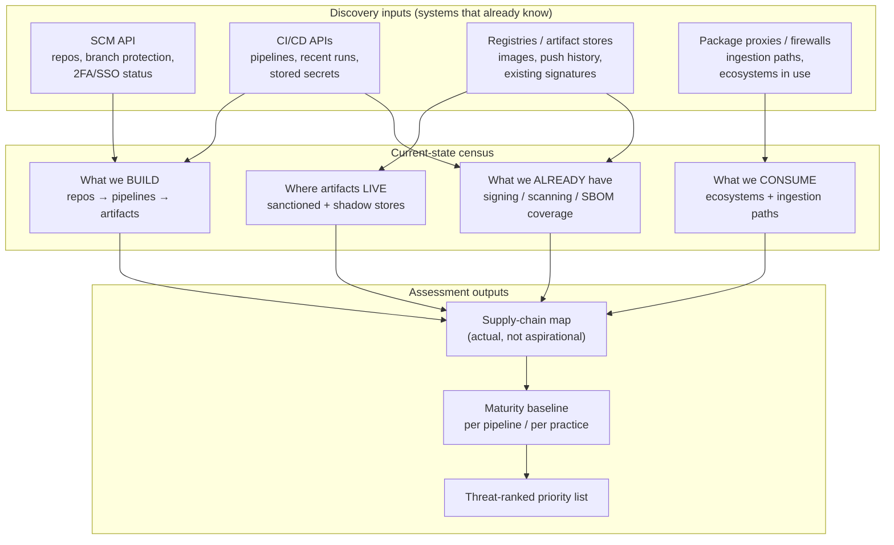
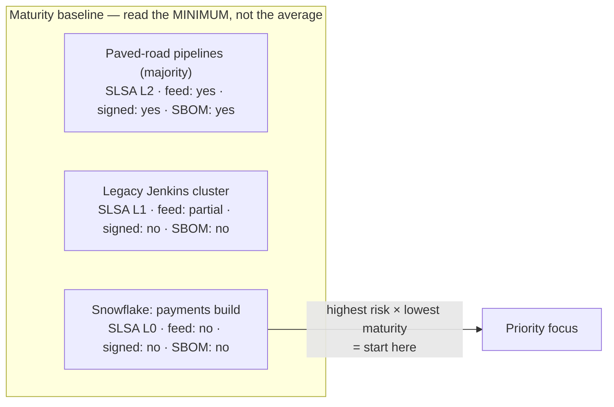
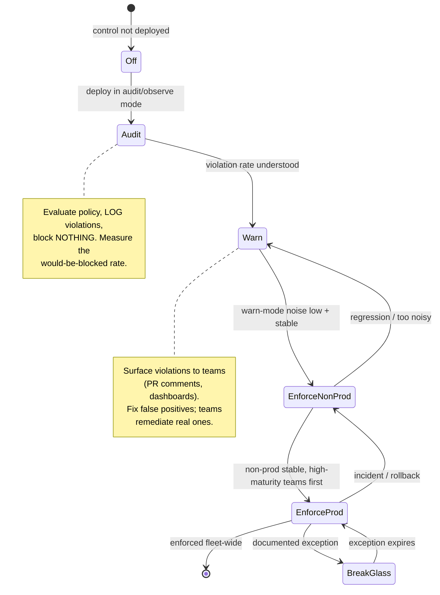
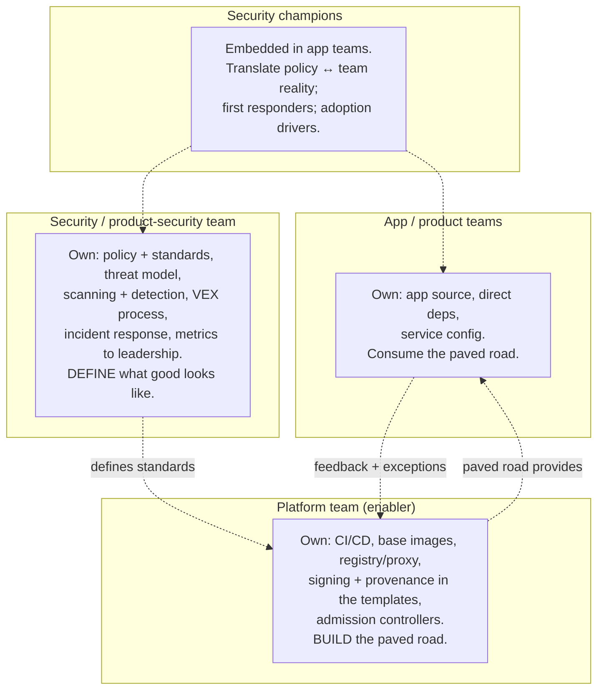

# Chapter 10 — Building a Supply Chain Security Program

*What this chapter covers.* The previous nine chapters gave you the anatomy of the supply chain
(Chapter 1), a taxonomy of how it is attacked (Chapter 2), the case studies that make the
attacks concrete (Chapters 3–5), a toolkit for reasoning about trust, threat models, and
economics (Chapter 6), the frameworks that let you measure yourself (Chapter 7), the human and
ecosystem realities (Chapter 8), and the distributed-systems shape of the whole problem
(Chapter 9). This chapter turns that understanding into a *program* — an ordered, opinionated,
resourced plan of work that a staff engineer can start executing Monday morning and that
survives past the initial enthusiasm to become a permanent capability of the organization. It is
also the reading map for the rest of the suite: every phase of work below points at the book
that covers its mechanics in depth. This is the capstone of Book 1. After it, the series stops
building intuition and starts building systems.

Learning goals — after this chapter you should be able to:

- Run a **current-state assessment**: inventory what you build and consume, discover pipelines
  and artifact stores, and baseline your maturity honestly against SLSA, S2C2F, and SSDF
  (Chapter 7) rather than performing checkbox theater.
- Prioritize the work using a **threat-model-driven, marginal-return** lens (Chapter 6) so that
  effort lands on *your* highest-risk chokepoints first, not on whatever a vendor slide deck
  ranks first.
- Sequence a concrete **four-phase roadmap** — hygiene, integrity/visibility,
  verification/enforcement, program maturity — and explain why each control is where it is and
  what it depends on.
- Apply the **paved-road and warn-then-enforce** patterns so that adoption is automatic and
  enforcement never triggers a developer revolt.
- Design the **organizational ownership** (RACI, enablers-vs-gatekeepers, security champions)
  and make buy-vs-build decisions against an accurate map of the open-source tool landscape.
- Choose **metrics that prove value and tie back to the threat model**, and recognize the
  common failure modes — tool sprawl, blocking before enabling, checkbox compliance, alert
  fatigue, treating a program as a project — before you walk into them.

A note on posture before we start. A supply chain security program is not a procurement exercise
and not a compliance filing. It is an engineering program with the same properties as any other
platform investment: it has a fixed cost paid up front, a marginal cost paid per team, a
maintenance cost paid forever, and a value that is mostly invisible until the day it is enormous.
The chapters that follow will make you fluent in the mechanisms; this chapter is about *judgment*
— what to do first, what to defer, what to never do, and how to tell whether it is working.

## Starting from reality: you cannot secure what you cannot see

Every failed supply chain security program the author has watched shared one starting mistake:
it began with a control instead of a census. Someone read the SLSA spec, decided the org needed
Build L3, and started requiring provenance from teams — without knowing how many pipelines
existed, what they produced, or where the artifacts went. Six months later the "L3 initiative"
covered the four pipelines the security team could find and missed the two hundred it could not,
including the one snowflake Jenkins box in a forgotten AWS account that built the payment
service. The program measured itself by the controls it deployed and never noticed that the
controls sat on the wrong chain.

So the program begins the only place it can: with **discovery**. The goal of the assessment phase
is a defensible, mostly-complete map of your supply chain as it actually is — not as the
architecture diagram claims, not as the golden path prescribes, but as it runs in production
today. Four inventories make up that map.

**What you build.** Enumerate the source repositories, and for each one the pipelines that build
from it and the artifacts those pipelines produce. At scale this is not a spreadsheet you fill in
by asking teams; it is a query against systems that already know. Your SCM's API lists every
repo. Your CI system's API lists every pipeline and its recent runs. Your container registry
lists every image and its push history. The intersection — repos that push images, pipelines
that ran this quarter — is your *live* build surface, and the difference between that and the
full repo list tells you how much is dormant, forked, or abandoned (Chapter 8's unmaintained-code
problem, inside your own walls).

**What you consume.** Every ecosystem your builds pull from — npm, Maven/Gradle, Go modules,
PyPI, Cargo, RubyGems, and the base images and OS packages underneath them (Chapter 9's
heterogeneity). The critical discovery question is not "what do we depend on" — that is a
per-build SBOM concern for later — but "*through what path* do dependencies enter?" Do builds
reach straight out to `registry.npmjs.org` and Maven Central, or through an internal proxy? The
answer decides whether you have an ingestion chokepoint (S2C2F's linchpin practice, Chapter 7) or
hundreds of independent front doors.

**What pipelines exist and where artifacts live.** This is where the archaeology happens. The
sanctioned CI system is easy; the shadow build surface is the risk. Search for CI config files
across all repos (`.github/workflows/`, `.gitlab-ci.yml`, `Jenkinsfile`, `azure-pipelines.yml`,
`.circleci/`) to find pipelines the central team never registered. Enumerate every registry and
artifact store — the official one, the three that predate it, the S3 buckets teams use as ad-hoc
artifact stores, the GitHub Releases pages. Each store is a place a compromised or unsigned
artifact can be served from.

**What is already signed and scanned.** Before you propose new controls, find the ones already
running. Some teams already scan; some already sign; some already emit SBOMs because a tool they
adopted does it by default. Discovering existing coverage does two things: it stops you
proposing work that is half-done, and it surfaces the *inconsistency* that is itself a finding —
if 30% of images are signed by three different mechanisms, you have a standardization problem
before you have a coverage problem.

The output of this phase is not a report; it is a living map, kept current by the same APIs that
produced it. The moment the map becomes a stale document, the program is back to securing an
imagined system. Wire the discovery queries into a scheduled job so the map refreshes weekly, and
you have converted a one-time audit into a standing capability — the first small instance of this
chapter's recurring theme: *pay the cost once, up front, so the answer is always cheap.*

### Maturity baselining without the theater

With a map in hand, grade it. Chapter 7 gave you the three frameworks that matter: **SLSA v1.0**
Build levels (L0–L3) for what you *produce*, **S2C2F** (eight practice areas, four maturity
levels) for what you *consume*, and **NIST SSDF** (the PO/PS/PW/RV practice groups) for the
organizational process wrapper. Baselining means placing each pipeline on the SLSA ladder, your
consumption program on the S2C2F ladder, and your practices against SSDF.

The discipline that separates a real baseline from theater is *honesty about the difference
between the letter and the property*. Chapter 7 warned about being "L3 on paper" — satisfying the
words of a level while the property it guarantees is absent. A pipeline that emits provenance but
signs it with a key the build steps can read is not L3; it is L1 wearing an L3 badge, because the
non-forgeability property L3 exists to provide is missing. Grade against the property, not the
artifact. The honest baseline is almost always lower and more uneven than the aspirational one,
and that unevenness is the actual finding: not "our average is L1.5" but "our payment pipeline is
L0 and our marketing site is L3," because the average flatters you by hiding the minimum, and at
scale your posture is closer to your minimum than your average (Chapter 9).

A pragmatic baseline is a table, one row per pipeline (or per pipeline *class*, if hundreds of
pipelines share a template), with columns for SLSA build level, whether dependencies flow through
a controlled feed, whether artifacts are signed, whether an SBOM is produced, and who owns it. It
is deliberately coarse. Precision here is false comfort; you want the shape, and the shape is
usually "a small paved-road majority at a decent level, a long tail of snowflakes at zero, and
the highest-risk system somewhere it should not be."

### Threat-model-driven prioritization

A baseline tells you where you are weak. It does not tell you where weakness *matters*, and those
are different questions. Prioritization is where Chapter 6's threat-modeling and economics come
back. You do not secure the chain uniformly; you secure it in order of risk, and risk is the
product of likelihood and impact against *your* architecture and *your* threat actors.

Reuse Chapter 9's blast-radius factors — fan-out, propagation speed, privilege — as the impact
axis. The golden base image and the shared CI templates have fleet-wide fan-out; a leaf
dependency in one service does not. Cross that with the maturity baseline (where are the controls
weak?) and the threat model (who is likely to come for us, and by which of the Chapter 2 attack
classes?). The intersection — high blast radius, low current maturity, plausible attacker path —
is your first quarter's work. The snowflake payment build that is SLSA L0 and pulls dependencies
straight from public registries, feeding a service that touches money, is a five-alarm finding.
The marketing site that is already L3 needs nothing.

This is marginal-return reasoning, and it is the antidote to boiling the ocean. Chapter 6's
economics say the first dollar spent on your weakest high-value chokepoint returns far more than
the tenth dollar spent hardening something already strong. The prioritized list, ranked by that
marginal return, *is* the roadmap. Everything below is that ranking made concrete.

## The phased roadmap

Frame the program as a maturity progression — crawl, walk, run — in four phases. The ordering is
not arbitrary and it is not merely difficulty-ascending. Each phase is a prerequisite for the
next: you cannot verify provenance (Phase 3) that you do not generate (Phase 2), and generating
provenance is pointless if your source and build inputs are not yet trustworthy (Phase 1). The
phases also track marginal return: Phase 1 is the cheapest work with the highest return, and each
subsequent phase costs more per unit of risk retired. Most organizations should be in Phase 1 or
2. Very few operationally need Phase 3 everywhere, and Phase 4 is a permanent operating mode, not
a finish line.

### Phase 1 — Foundational hygiene

This is the highest-ROI, lowest-cost work in the entire program, and if the org has done nothing,
this is where 100% of the first quarter goes. None of it is glamorous. All of it retires enormous
risk cheaply, because it closes the doors attackers actually walk through (Chapters 2–5) rather
than the exotic ones conference talks obsess over.

**SCM hardening: 2FA/SSO and branch protection.** The single account compromise remains the most
common root cause of source-side supply chain incidents (Chapter 3's account-takeover cases,
Chapter 5's xz maintainer angle). Enforce SSO with mandatory multi-factor authentication across
the SCM org — phishing-resistant factors (WebAuthn/passkeys) where you can, TOTP at minimum,
never SMS. Then require, on every default branch: pull-request review before merge, dismissal of
stale approvals, and status checks that must pass. Branch protection is the mechanism that makes
"two people saw this change" a *property of the system* rather than a cultural aspiration, and it
is the precondition for every provenance claim you will make later — provenance that a single
compromised account could have authored is provenance about a compromised process. This is Book 7
(Source, Code, and Insider Threat Security) territory in depth.

**Lockfiles and pinned hashes.** Every ecosystem's builds must resolve to *exact*, hash-pinned
dependency versions, committed to the repo: `package-lock.json`/`pnpm-lock.yaml` with integrity
hashes, `go.sum`, `Cargo.lock`, `poetry.lock` or hash-pinned `requirements.txt`, Gradle
dependency verification. Unpinned builds are non-reproducible and vulnerable to the mutable-tag
and dependency-confusion attacks of Chapter 4. Pin your CI actions too — reference GitHub Actions
by full commit SHA, not by mutable tag, because a `@v3` tag is a pointer an upstream owner can
repoint at malicious code (the mechanism behind several 2024–2025 Actions incidents). Book 2
(Dependency Management) covers the per-ecosystem semantics.

**Dependency scanning (SCA) in CI.** Run a software-composition-analysis scanner on every build,
matching the resolved dependency set against a vulnerability database (OSV, GitHub Advisories).
The goal in Phase 1 is *visibility*, not blocking — surface known-vulnerable dependencies so
teams can see them. Enforcement comes in Phase 3, after teams have had time to clean up and after
you have VEX to suppress the false positives that otherwise train everyone to ignore the scanner.
Book 2 covers SCA and reachability.

**Secret scanning.** Scan repos and their history for committed credentials, and — more
importantly — turn on *push protection* so secrets are blocked before they land. A leaked cloud
key or registry token is a direct path into the build system. Pair detection with a rotation
runbook, because a detected secret is an *exposed* secret until it is rotated.

**Kill long-lived CI secrets.** Long-lived, high-privilege credentials sitting in CI variables
are among the highest-value targets in the org (Codecov, Chapter 5, was exactly this: exfiltrated
CI secrets cascading across the customer base). Replace static cloud and registry credentials
with short-lived, workload-identity-federated tokens: GitHub Actions OIDC to cloud IAM, so a job
gets a minute-lived token scoped to exactly what it needs and nothing persists to steal. This one
change retires an entire attack class. Book 4 (Build and CI/CD Security) covers it thoroughly.

**Inventory.** The discovery map from the assessment phase is itself a Phase 1 deliverable,
because everything downstream needs it and because keeping it current is ongoing work, not a
one-time audit.

Phase 1 maps primarily to **Books 2, 4, and 7**. It is unglamorous, and it is where the program
earns its credibility: ship it, show the risk it retired, and you have the political capital for
the phases that ask more of teams.

### Phase 2 — Integrity and visibility

Phase 1 made the *inputs* trustworthy. Phase 2 makes the *outputs* legible and verifiable: you
start producing durable evidence about what you built and what is in it. Nothing here blocks
anything yet — Phase 2 is about generating signal, not acting on it.

**SBOM generation and storage.** Every build emits a Software Bill of Materials — CycloneDX 1.6
or SPDX 3.0 — enumerating its full dependency closure, generated at build time when the resolved
graph and any shading/vendoring are known (Chapter 9's Log4Shell inventory argument). Generate it
with a tool like `syft` (`syft <image> -o cyclonedx-json`) or Trivy, and — critically — *store it
keyed by artifact digest* in a queryable system, not as a build-log attachment nobody can find
later. The SBOM is worthless as a PDF in a bucket; it is valuable as a row in a database you can
ask "which artifacts contain log4j-core < 2.16?" in minutes. Book 3 (SBOMs and Software
Transparency) is the whole story.

**Artifact signing.** Sign every artifact so consumers can verify origin and integrity. The
modern default is **Sigstore/cosign** with keyless signing: `cosign sign` obtains a short-lived
certificate from Fulcio bound to an OIDC identity (your CI workload identity), signs, and records
the signature in the Rekor transparency log — no long-lived signing key to steal or rotate. This
composes perfectly with the Phase 1 move to OIDC: the same workload identity that fetches cloud
tokens signs the artifact. Book 5 (Signing, Provenance, and Attestation) covers Sigstore's
architecture — Fulcio, Rekor, the transparency-log trust model — in depth.

**Provenance generation (SLSA Build L2).** Have the build platform generate and sign provenance —
the signed, machine-readable record of what was built, from what source and inputs, by what
process (Chapter 7). At L2 the hosted platform generates and signs it, giving tamper-evidence
after the build. The high-leverage move here is Chapter 9's paved-road insight: implement
provenance once in the shared CI template (e.g., the SLSA GitHub Actions generator) and every
pipeline that uses the template inherits L2 for free. Book 4 covers the generators; Book 5 covers
the attestation format (in-toto).

**Internal registry / proxy for dependencies.** Stand up a pull-through proxy/mirror (Artifactory,
Nexus, a cloud artifact registry) as the *single ingestion path* for open-source dependencies —
S2C2F's linchpin "Ingest" practice (Chapter 7). In Phase 2 you make it available and start
migrating builds to it; you do not yet *mandate* it (that is Enforce, Phase 3). The proxy is what
makes scanning-at-ingest, caching against upstream deletion (left-pad), and blocking of
dependency-confusion possible, because it is the chokepoint every other consumption control acts
at. Book 2 covers ingestion architecture.

**Image scanning and admission policy in non-prod (audit mode).** Scan images for OS and
application CVEs (`grype`, `trivy image`), and deploy an admission controller (Kyverno,
OPA/Gatekeeper) into your *non-production* clusters in **audit/warn mode** — it evaluates policy
and logs violations but blocks nothing. This is the dress rehearsal for Phase 3 enforcement: you
learn what *would* be blocked, teams see their violations without an outage, and you tune the
policy against reality before it can break a deploy. Book 6 (Container and Cloud-Native) covers
admission control.

Phase 2 maps primarily to **Books 3, 5, and 6**. At the end of it you can answer "what is in this
artifact and did we build it?" for most of the fleet — but you are not yet *acting* on those
answers.

### Phase 3 — Verification and enforcement

Now you turn the signal into gates. Phase 3 is where the program stops being advisory and starts
saying *no*, and it is therefore where programs most often trigger a developer revolt if they
skipped the warn-mode groundwork. The controls here are direct upgrades of Phase 2's generation
into Phase 2's verification.

**Provenance verification at deploy.** The provenance you generated in Phase 2 becomes a
deploy-time *requirement*: an artifact deploys only if it carries valid provenance attesting it
was built by an approved builder, from an approved source repo, through the sanctioned pipeline.
`cosign verify-attestation` with a policy, or a Kyverno/OPA rule against the attestation, is the
mechanism. This is the control that makes "built off the paved road" an anomaly you *reject*
rather than merely detect (Chapter 9). Book 4 and Book 5.

**Signature and policy enforcement in admission control.** Flip the admission controller from
audit to **enforce** — but only after warn mode has been quiet for long enough that you trust the
policy, and only in an order that starts with non-prod and the highest-maturity teams. Now an
unsigned image, or one from an unapproved registry, or one failing policy, is *blocked* from
running. Book 6.

**Hermetic and reproducible builds (SLSA Build L3).** Close the in-build tampering gap: isolate
build runs so one cannot influence another, and make the signing material inaccessible to
user-defined build steps, yielding non-forgeable provenance (Chapter 7's L3 property). Hermetic
builds (no network access at build time; all inputs declared and fetched from the proxy) and
reproducibility (bit-identical rebuilds) are the mechanisms. This is genuinely expensive and only
worth doing for your highest-blast-radius pipelines — the base-image factory, the shared CI
templates, the platform's own Tier-0 builds (Chapter 9). Do not demand L3 fleet-wide; demand it
where forgeable provenance would be catastrophic. Book 4.

**VEX-driven vulnerability triage.** By now your scanners produce a firehose of findings, most of
them not exploitable in your context (the vulnerable function is never called, the component is
not reachable). **VEX** (Vulnerability Exploitability eXchange) lets you assert, in a
machine-readable and auditable way, "not affected, because…" so that triaged non-issues stop
re-alerting. Without VEX, scanner enforcement produces alert fatigue and teams route around it;
with it, the scanner's blocking findings are the ones that matter. This is the prerequisite that
makes *dependency policy enforcement* — blocking builds that introduce a genuinely exploitable,
policy-violating dependency — tolerable rather than a revolt trigger. Book 3 (VEX) and Book 2
(dependency policy).

Phase 3 maps primarily to **Books 4, 5, and 6**. The recurring discipline across all of it:
**warn before you block, roll out through the paved road, and start with the teams and
environments that will make enforcement look good.**

### Phase 4 — Program maturity

Phase 4 is not a set of controls to finish; it is the operating mode the program settles into
permanently once the controls exist. It is what turns a project into a program.

**Continuous compliance.** The controls of Phases 1–3 must stay on. Drift happens: a team
disables branch protection "temporarily," a new cluster ships without the admission policy, a
pipeline predates the standard and never adopted it. Continuous compliance is the standing
verification that the controls you deployed are still deployed everywhere they should be —
policy-as-code evaluated continuously against the live estate, not an annual audit. Book 8
(Governance, Compliance, and Incident Response).

**Detection and anomaly monitoring.** With the paved road imposing homogeneity, "normal" is a
distribution and outliers are visible (Chapter 9): a build reaching an external host during a
hermetic run, provenance claiming an unexpected builder, an artifact appearing in a registry with
no corresponding pipeline run. Monitor the supply-chain telemetry the earlier phases generate.
Book 8.

**Incident response runbooks for supply-chain events.** A supply-chain incident is not a normal
security incident — the questions are "which of our artifacts are affected, where are they
deployed, and how fast can we rebuild and redeploy the fleet?" (Chapter 9's remediation-velocity
problem). Write and *rehearse* the runbooks: the compromised-dependency runbook, the
compromised-build-system runbook, the leaked-signing-identity runbook. Book 8 has the incident
material.

**Vendor and third-party risk management.** Your supply chain includes software you buy, not just
software you build (SolarWinds and 3CX, Chapter 3, were *vendor* compromises). Ask vendors for
SBOMs and SLSA attestations, evaluate their security posture, and know your exposure to their
compromise. This is where SSDF self-attestation and emerging regulation (EU CRA) become concrete.
Book 8.

**Metrics and leadership reporting.** Sustained funding requires demonstrated value in the
language leadership speaks. The metrics section below is the substance; Phase 4 is where reporting
them becomes a standing rhythm. Book 8, Chapter 8 is the deep dive.

Phase 4 maps to **Book 8** almost entirely. The feedback loop matters: Phase 4's monitoring and
metrics feed back into the assessment phase, re-ranking priorities as the estate and the threat
landscape change. The program never "finishes"; it cycles.

## The warn-then-enforce rollout pattern

Everything about enforcement rides on one pattern, applied to every gate you ever ship. Deploy in
observe/audit mode first; measure what would be blocked; fix the false positives and the genuine
violations; expand coverage in warn mode; and only then flip to enforce — first in non-prod,
first for the highest-maturity teams, with a documented break-glass exception path throughout.
The organizations that skip straight to blocking do not get better security faster; they get an
outage, a rollback, and a security team that has spent its political capital and will not be
allowed to enforce anything for a year.

Two properties make this humane. First, **the paved road carries the rollout**: because the
control lives in shared tooling, flipping it from warn to enforce is a change the platform team
makes centrally, and teams on the paved road are carried across the transition without individual
migration work. Second, **the break-glass path is legitimate, time-boxed, and audited** — an
enforcement gate with no exception path is a gate teams will disable entirely the first time it
blocks a genuine emergency, so give them a supervised door instead of forcing them to break the
lock. An exception that is logged, scoped, and expires is a control; a gate with no exception is a
future outage.

## Organizational design: who owns what

A supply chain security program is an organizational design problem at least as much as a
technical one, because the supply chain crosses every team boundary and Conway's Law puts the
attacks in the seams (Chapter 9). The technical controls above fail without clear ownership, and
clear ownership is the harder half.

### Enablers, not gatekeepers

The central function — call it product security or supply-chain security — has two possible
postures, and only one of them scales. As a **gatekeeper**, the central team reviews, approves,
and blocks: every team must come to security for sign-off, security is the bottleneck, and
security is the enemy. This does not scale past a few dozen teams and it makes security an
obstacle to route around. As an **enabler**, the central team builds the paved road — the secure
CI templates, the signing tooling, the admission policies, the SBOM pipeline — and product teams
get security by using it. The central team's product is *the secure default*, and its success
metric is *adoption*, not tickets closed.

This is the paved-road strategy from Chapter 9 applied to org design: make the secure path the
easiest path so adoption is automatic, then measure *coverage* (what fraction of the fleet is on
the paved road) rather than *capability* (whether the control exists somewhere). A control that
exists but covers 4% of pipelines is a demo; the same control at 90% coverage is a program. The
enabler team's roadmap is a coverage-expansion plan.

### RACI over the supply chain

Chapter 9 argued that every stage of the chain needs exactly one Accountable owner, and that
attacks live in the rows where the Accountable column is blank. The program makes that RACI
explicit and *staffs* it. Three organizational actors, mapped to the phased work:

The division that works: **security defines** what good looks like (policy, threat model,
standards, the metrics), **platform builds** it into the paved road (the templates, the signing,
the admission control), and **app teams consume** it by walking the road. Security does not build
the pipeline; platform does. Platform does not set the policy; security does. App teams do not do
either; they inherit both by using the standard tooling. When these blur — security building
snowflake tooling, or platform inventing policy, or app teams each rolling their own — the seams
reappear.

### The security champions model

The central teams cannot be everywhere, and the app teams know their own systems better than any
central team can. **Security champions** bridge the gap: an engineer embedded in each product team
(or each group of teams) who carries security context into the team and team context back to the
central function. Champions are not auditors; they are the local expert who knows why the standard
matters, helps the team adopt the paved road, and is the first responder when the team's service
is implicated in an incident. The model works when champions are recognized, trained, and given
time — and fails when "champion" is an unfunded title added to someone's real job. Book 8 covers
the governance structures in depth.

### Buy vs. build, and the open-source landscape

Most of the tooling you need exists as mature open source, and for most organizations the right
default is **build the paved road, buy or adopt the components.** You will not write your own
SBOM generator or your own admission controller; you will assemble existing tools into a coherent
road. What you *build* is the integration — the glue that makes the tools compose, the templates
that hand teams the whole stack at once. Tool sprawl (many tools, no integration) is a failure
mode discussed below; the antidote is treating the tools as components of one system, not as a
shopping list.

A brief, accurate map of the open-source landscape — each covered in depth later in the suite, so
these are pointers, not recommendations to adopt blindly:

| Tool | Function | Depth in |
|---|---|---|
| **syft** | SBOM generation (CycloneDX/SPDX) from images and filesystems | Book 3 |
| **grype** | Vulnerability scanning against an SBOM or image | Book 2 / Book 6 |
| **Trivy** | All-in-one scanner: images, filesystems, IaC, SBOM generation | Book 6 |
| **OSV-Scanner** | Dependency vuln scanning against the OSV database | Book 2 |
| **cosign** | Signing and verification of artifacts and attestations (Sigstore) | Book 5 |
| **Sigstore** (Fulcio, Rekor) | Keyless signing CA + transparency log | Book 5 |
| **in-toto** | Attestation framework; the format SLSA provenance rides in | Book 4 / Book 5 |
| **SLSA generators** | Provenance generation in CI (e.g., GitHub Actions generator) | Book 4 |
| **Dependency-Track** | Continuous SBOM analysis and component-risk platform | Book 3 |
| **OpenSSF Scorecard** | Automated scoring of a repo's security posture | Book 7 |
| **Kyverno / OPA Gatekeeper** | Kubernetes admission policy (signature/policy enforcement) | Book 6 |
| **GUAC** | Aggregates SBOMs, provenance, and advisories into a queryable graph | Book 3 |

These names are the vocabulary of the rest of the suite. The point of listing them here is not to
tell you what to install Monday — it is to show that the phased roadmap is *buildable today from
mature, mostly-graduated open source*, and that the work is integration and rollout, not
invention.

## Metrics: proving value without vanity

A program that cannot demonstrate its value gets defunded the first budget cycle after the
enthusiasm fades. But most supply-chain metrics are vanity metrics — numbers that go up and to
the right and mean nothing. The discipline is to measure things that (a) tie to the threat model
and (b) distinguish leading indicators (predictive of future risk) from lagging ones (measuring
past outcomes).

The metrics worth reporting are mostly **coverage** and **velocity**:

- **Coverage**: % of pipelines emitting signed provenance; % of images signed; % of repos with
  branch protection and 2FA enforced; % of dependencies flowing through the proxy; SBOM
  coverage (% of artifacts with a stored, queryable SBOM); % of clusters running the admission
  policy in enforce mode. Coverage is the honest measure of a paved-road program because it
  captures the *minimum*, not the average — and the minimum is your posture (Chapter 9).
- **Remediation velocity**: mean-time-to-remediate a vulnerable dependency across the fleet — the
  wall-clock from "patch available" to "patched version running everywhere, verified." This is
  the number that decided who slept during Log4Shell (Chapter 9), and it is the direct output of
  your immutable-infrastructure and CD investments.
- **Policy pass rates and violation trends**: not the raw count of scanner findings (a vanity
  number that mostly measures how loud your scanner is), but the trend in *policy* violations —
  genuinely-exploitable, VEX-triaged findings that block — and the mean time to close them.

The leading-vs-lagging distinction matters for what the numbers *predict*. Coverage is a leading
indicator: high provenance coverage today predicts low tamper-risk tomorrow. MTTR is a lagging
indicator: it measures how you responded to vulnerabilities that already existed. A healthy
dashboard has both — leading indicators to steer by and lagging indicators to prove the steering
worked.

The cardinal sin is the **vanity metric untethered from the threat model**: "we ran 4 million
scans this quarter," "we generated 200,000 SBOMs," "we blocked 50,000 policy violations." These
measure activity, not risk retired. Fifty thousand blocked violations might mean the program is
working or might mean the policy is miscalibrated and generating fifty thousand false positives
that teams are learning to ignore. Every metric on the leadership dashboard should answer the
question "*what threat does this number tell us we are more or less exposed to?*" — and if it
cannot, it does not belong there. Book 8, Chapter 8 is the deep treatment of program metrics.

## Common failure modes

The phased roadmap and the org design above are the positive program. Equally important is the
catalog of ways programs fail, because these are common, predictable, and mostly avoidable if
named in advance.

**Tool sprawl without integration.** The most common technical failure: the org buys or adopts a
dozen tools — a scanner here, a signing tool there, three SBOM generators from three initiatives —
and none of them compose. Each produces a different report in a different place; nothing feeds
anything; the SBOMs are not where the scanner looks; the signatures are not what admission control
checks. The result is high spend, high toil, and low coverage. The antidote is architectural:
treat the tools as components of *one* paved road, integrated end to end, chosen partly for how
well they compose. A smaller, integrated toolchain beats a larger, disconnected one every time.

**Blocking before enabling — the developer revolt.** The failure that ends programs. A security
team, impatient or under audit pressure, flips a gate to enforce before warn mode, before the
paved road can carry teams across, before the false positives are tuned out. A critical deploy is
blocked, an incident is declared, the gate is rolled back in anger, and the security team is
politically radioactive for a year. The warn-then-enforce pattern exists precisely to prevent
this. *Never block a path teams cannot easily comply with.* Build the easy path first; enforce
second.

**Security theater and checkbox compliance.** Doing the work for the appearance rather than the
property (Chapter 7's "L3 on paper"). Generating SBOMs nobody queries. Signing artifacts nobody
verifies. Being "SLSA L3" with a signing key the build steps can read. Checkbox compliance is
worse than doing nothing, because it *consumes the budget and the credibility* that real work
needs while providing none of the protection the checkbox implies. The tell is always the same:
evidence produced but never consumed. Every generation control (Phase 2) must have a corresponding
verification control (Phase 3) that actually uses it, or it is theater.

**Ignoring the human and maintainer dimension.** A program that treats supply chain security as
purely technical misses Chapter 8 entirely: the unpaid, burned-out maintainer of the critical
dependency (xz, Chapter 5); the internal team that owns the shared library nobody funds; the
social-engineering path into your own maintainers. Technical controls do not fix a maintainer who
is one burnout away from handing commit access to a stranger. The program must include the human
layer — funding critical dependencies, supporting internal maintainers, and treating maintainer
account security as a first-class concern.

**Treating it as a project, not a program.** The mindset failure that underlies most of the
others. A project has an end; a program does not. Controls drift off, coverage decays, new
pipelines ship without the standard, the threat landscape shifts. A program that is declared "done"
is a program that is already decaying. Phase 4 exists to make the ongoing nature structural —
continuous compliance, standing metrics, a permanent team — rather than relying on the memory of
an initiative that has moved on to the next thing.

**Alert fatigue.** The failure that hollows out a program from inside. Scanners that fire on every
non-exploitable CVE, admission controllers that warn on everything, dashboards nobody reads —
train everyone to ignore the signal, so that the one alert that matters is lost in the noise. VEX
(Phase 3) is the technical antidote on the vulnerability side; ruthless tuning and the
warn-then-enforce discipline are the antidote everywhere else. An alert that is ignored is worse
than no alert, because it costs attention and provides no protection. Measure and cap your
false-positive rate as deliberately as you measure coverage.

## Distributed-systems lens

This chapter is a program built for the fleet-scale reality of Chapter 9, and its every choice
reflects that reality. The **paved road is the delivery mechanism for the entire program** —
without it, every control is a per-team migration multiplied by hundreds of teams, and the
economics collapse; with it, the platform ships each phase once and the fleet inherits it. The
**warn-then-enforce pattern is a fleet-scale necessity**, not a nicety: at a handful of pipelines
you could hand-migrate before enforcing, but across hundreds you must observe, tune, and flip
centrally or you will break something you did not know existed. The **coverage-over-capability
metric** is the direct consequence of Chapter 9's minimum-not-average insight: a control at 100%
capability and 5% coverage secures nothing at fleet scale, because the attacker enters through the
95%. The **RACI that tiles the chain** is the organizational answer to Conway's Law putting
attacks in the seams. And the **phase ordering tracks the blast-radius math**: Phase 1 hardens the
inputs everything shares, Phase 3's expensive L3 work is reserved for the highest-fan-out
chokepoints, and the whole sequence spends effort in order of fleet-wide risk. A supply chain
security program *is* a distributed-systems program; the single-artifact version of this chapter
would be a checklist, and it is the scale that makes it an engineering discipline.

## Key takeaways

- **Start with a census, not a control.** You cannot secure what you cannot see; discover what you
  build, what you consume, what pipelines and artifact stores exist (including the shadow ones),
  and what is already signed and scanned. Wire discovery into a scheduled job so the map stays
  live.
- **Baseline honestly against the property, not the paper** (SLSA build level per pipeline, S2C2F
  for consumption, SSDF for process). Read the *minimum*, not the average — your posture is your
  weakest high-value chain, because the attacker chooses where to enter.
- **Prioritize by marginal return against the threat model**: high blast radius × low current
  maturity × plausible attacker path is your first quarter. Do not boil the ocean.
- **Sequence four phases.** Phase 1 hygiene (2FA/SSO, branch protection, lockfiles + pinned
  hashes, SCA, secret scanning, kill long-lived CI secrets, inventory — Books 2/4/7). Phase 2
  integrity/visibility (SBOMs, cosign signing, SLSA L2 provenance, ingestion proxy, image
  scanning, admission policy in non-prod audit mode — Books 3/5/6). Phase 3 verification/
  enforcement (provenance verification at deploy, admission enforcement, hermetic/reproducible
  L3 builds, VEX triage, dependency policy — Books 4/5/6). Phase 4 program maturity (continuous
  compliance, detection, IR runbooks, vendor risk, metrics — Book 8).
- **Warn before you block, always.** Deploy every gate in audit → warn → enforce (non-prod first,
  high-maturity teams first), with a legitimate time-boxed break-glass path. Skipping to enforce
  causes a developer revolt that ends programs.
- **The paved road is the whole strategy.** Make the secure path the easy path; the platform
  builds it once and the fleet inherits it. Measure *coverage*, not capability — a control at 5%
  coverage secures nothing at scale.
- **Design ownership as enablers, not gatekeepers.** Security defines the standard, platform builds
  it into the road, app teams consume it; security champions bridge the seams. RACI every stage so
  no row's Accountable column is blank.
- **Buy/adopt the components, build the integration.** The whole roadmap is buildable today from
  mature open source (syft, grype, Trivy, OSV-Scanner, cosign, Sigstore, in-toto, SLSA generators,
  Dependency-Track, Scorecard, Kyverno/OPA, GUAC). Tool sprawl without integration is a failure
  mode; a smaller integrated toolchain wins.
- **Measure coverage and remediation velocity, tied to the threat model.** Avoid vanity metrics
  (scans run, SBOMs generated, violations blocked); every dashboard number must answer "what threat
  are we more or less exposed to?" Distinguish leading indicators (coverage) from lagging ones
  (MTTR).
- **Know the failure modes**: tool sprawl, blocking before enabling, checkbox theater (evidence
  produced but never consumed), ignoring the human/maintainer dimension, treating a program as a
  project, and alert fatigue. All are predictable and mostly avoidable if named in advance.
- **It is a program, not a project.** It never finishes; Phase 4 is a permanent operating mode, and
  its monitoring and metrics feed back into re-assessment as the estate and threats change.

## Further reading

- OpenSSF, "Secure Supply Chain Consumption Framework (S2C2F)" specification — the eight practice
  areas and four maturity levels used for the consumption-side baseline (Book 3 / Book 2 for
  mechanics).
- SLSA v1.0 specification (slsa.dev) — the Build track levels (L0–L3) used to grade each pipeline;
  the framework the phased roadmap's provenance work implements (full treatment in Book 4).
- NIST SP 800-218, *Secure Software Development Framework (SSDF) v1.1* — the process wrapper
  (PO/PS/PW/RV) against which the organizational practices are baselined, and the language of US
  federal self-attestation (Book 8).
- CISA, *Securing the Software Supply Chain: Recommended Practices* (the Enduring Security
  Framework guides for developers, suppliers, and customers) — a practitioner's cross-check on the
  phased controls.
- Google, "Building Secure and Reliable Systems" (O'Reilly) and the SRE books — the paved-road /
  golden-path model and the enabler-vs-gatekeeper posture that the org-design section builds on.
- Sigstore documentation (sigstore.dev) and the cosign project — keyless signing, Fulcio, and
  Rekor, the default artifact-signing mechanism of Phase 2 (full treatment in Book 5).
- The SLSA GitHub Actions provenance generator and the in-toto attestation specification
  (in-toto.io) — the provenance-generation tooling of Phase 2 and its format (Book 4 / Book 5).
- CycloneDX 1.6 and SPDX 3.0 specifications — the SBOM formats generated and stored in Phase 2
  (full treatment in Book 3); OpenVEX and the CSAF VEX profile for the Phase 3 triage work.
- OWASP DSOMM (DevSecOps Maturity Model) and OWASP SAMM — alternative maturity lenses useful for
  self-assessment beyond the three primary frameworks.
- Forward references within this series: Book 2 (dependency management, ingestion, SCA, dependency
  policy); Book 3 (SBOMs, VEX, Dependency-Track, GUAC); Book 4 (build/CI-CD hardening, OIDC,
  hermetic and reproducible builds, provenance generators); Book 5 (Sigstore, cosign, in-toto
  attestation); Book 6 (container and cloud-native, admission control, image scanning); Book 7
  (source security, branch protection, Scorecard, insider threat); Book 8 (governance, continuous
  compliance, incident response, vendor risk, and program metrics in Chapter 8).
