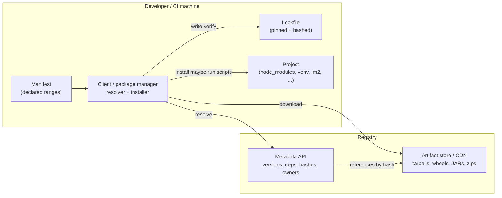
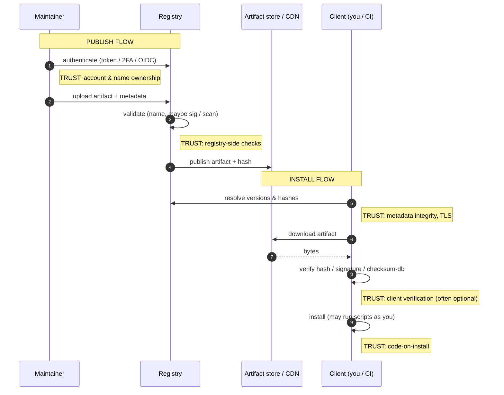
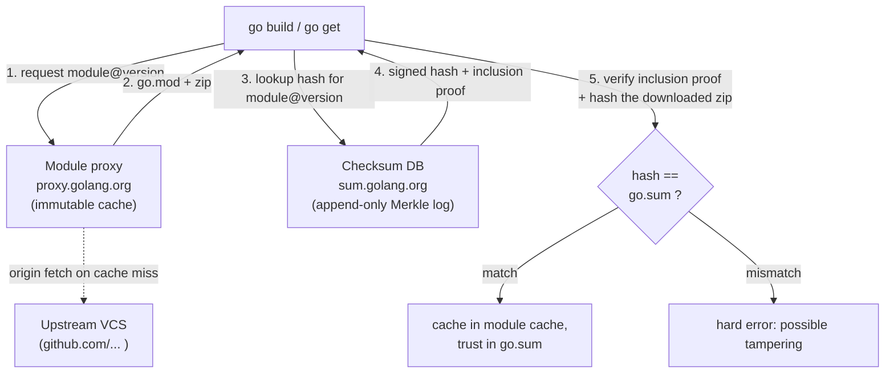
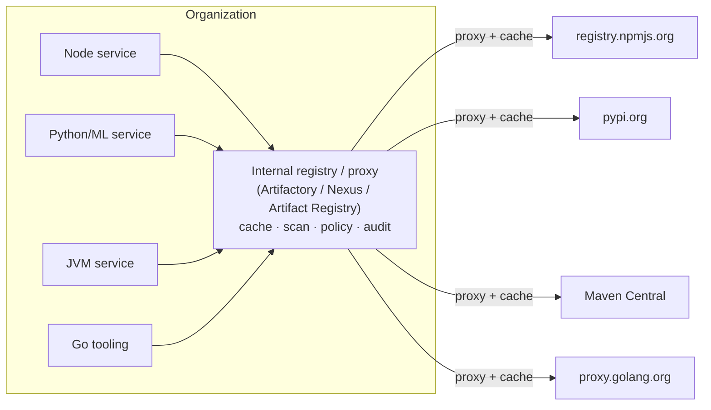
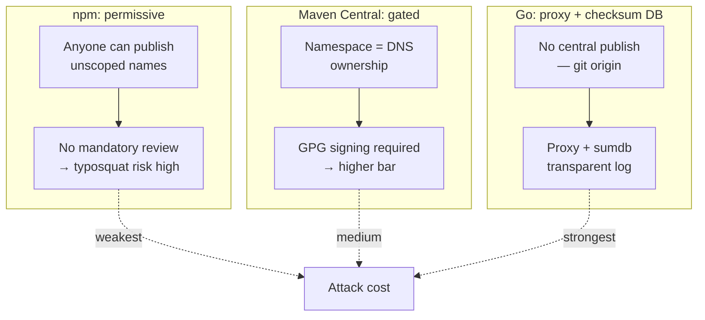
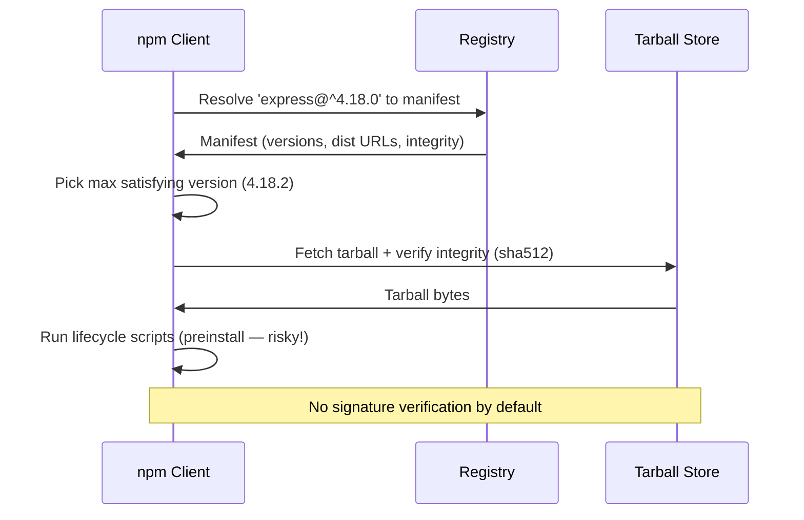

# Chapter 1 — Package Managers and Registries: Architecture and Trust Models

*What this chapter covers.* Every dependency attack and every dependency defense in the rest
of this book is a variation on one theme: code you did not write arrives on your machine
through a package manager, and something — the registry, an account, a hash, a signature, a
transparency log, or nothing at all — vouches for it along the way. Before we can reason about
dependency confusion (Chapter 3), malicious packages (Chapter 4), or software composition
analysis (Chapter 6), we have to understand the plumbing precisely: what a registry actually
stores, what a package manager actually does when it resolves and installs, and — the load-
bearing question — *where trust is placed at each step, and who can betray it.* This chapter
builds that foundation. It first draws the general anatomy of a package ecosystem, then
instantiates it concretely across the five ecosystems a polyglot backend org runs every day —
npm, PyPI, Maven Central, and Go modules in depth, with Cargo, RubyGems, NuGet, and the
Debian/RPM distro model as contrast. It ends by turning those per-ecosystem details into a
single comparison framework of trust properties, and by looking at the whole mess through the
lens of an organization that must consume all of them at once, at scale, with high uptime.

Learning goals — after this chapter you should be able to:

- Name the **five core components** of any package ecosystem — registry, client/package
  manager, manifest, lockfile, and artifact format — and explain what each one is trusted to
  do.
- Trace the **publish flow** and the **install flow** for a package and mark, at each hop,
  what the security of the result actually depends on.
- Describe accurately, and contrast, the architecture and trust model of **npm, PyPI, Maven
  Central, and Go modules** — including integrity mechanisms (SRI, GPG, checksum DB), the
  namespace/account model, whether installation executes arbitrary code, and whether a
  published version is immutable.
- Explain why **Go modules** is the most security-forward mainstream design, in terms of its
  transparency log, minimal version selection, and de-facto immutability.
- Build and apply a **cross-cutting trust framework** — centralized vs decentralized, mutable
  vs immutable, namespace ownership, account security, artifact integrity, code-on-install,
  auditability — and enumerate the concrete **trust anchors** each ecosystem rests on.
- Argue the distributed-systems case for an **internal registry/proxy** as a unifying caching
  and trust-control layer, and reason about **availability coupling** between your build and
  someone else's registry.

A note on scope. This chapter is deliberately about *mechanism and trust*, not about version
math or malice. How resolvers actually pick versions, why lockfiles matter, and how they are
generated and verified is Chapter 2. How attackers weaponize the namespace and index-priority
behaviors introduced here is Chapter 3. How you would run a mirror or internal registry in
production is Chapter 8. Where transparency logs come from and how Merkle-tree auditability is
built is Book 5, Chapter 5. This chapter gives you the map those chapters navigate.

## The anatomy of a package ecosystem

Strip away the branding and every language package ecosystem is the same five components
arranged the same way. Learn the shape once and each ecosystem becomes a set of concrete
answers to the same questions.

1. **The registry.** A networked service that stores two logically distinct things: *metadata*
   (which packages exist, which versions, their declared dependencies, their maintainers, their
   hashes) and *artifacts* (the actual bytes you download — a tarball, a wheel, a JAR, a zip).
   In practice the artifact bytes usually live on a CDN or object store fronting the metadata
   API. The registry is the thing that answers "what versions of `left-pad` exist and where do
   I get 1.3.0?"

2. **The client / package manager.** The tool on the developer's or CI machine — `npm`, `pip`,
   `mvn`/`gradle`, `go`, `cargo` — that reads your declared dependencies, talks to the
   registry, runs a **resolver** to turn loose version ranges into an exact set of versions,
   downloads the artifacts, verifies them (or doesn't), and installs them into a project. The
   client is where *policy* lives: it decides what to verify, whether to run install scripts,
   which index to trust.

3. **The manifest.** The human-authored, intent-level declaration of *direct* dependencies,
   usually with version *ranges* or constraints: `package.json`, `pyproject.toml` /
   `requirements.txt`, `pom.xml` / `build.gradle`, `go.mod`, `Cargo.toml`. It says "I want a
   React 18.x and an Express 4.x." It does not, by itself, pin the world.

4. **The lockfile.** The machine-generated, fully-resolved record of the *entire* transitive
   dependency graph, pinned to exact versions and — critically for security — usually to exact
   content hashes: `package-lock.json`, `poetry.lock` / `uv.lock`, `Cargo.lock`, `go.sum`
   (Go's integrity file, paired with the resolved `go.mod`). The lockfile is what makes an
   install *reproducible* and *verifiable*. Its presence, format, and whether it carries hashes
   is one of the sharpest differentiators between ecosystems, and the whole of Chapter 2.

5. **The artifact format.** The on-disk package: an npm tarball (`.tgz`), a Python wheel
   (`.whl`) or source distribution (`.tar.gz` sdist), a Maven JAR plus its POM, a Go module
   zip, a Cargo `.crate`, a `.nupkg`, a `.deb`/`.rpm`. The format determines something
   security-critical: **does merely installing it run code?** A wheel is inert data unzipped
   into place; an sdist runs `setup.py`; a `.deb` runs maintainer scripts as root.

### Two flows, and where trust lives

Everything a registry does reduces to two flows. Attacks live in the gap between what each hop
*proves* and what we *assume* it proves.

**The publish flow** puts a package into the registry. A maintainer authenticates (password +
token, ideally 2FA, or increasingly a short-lived OIDC credential), builds an artifact, and
uploads it. The registry may run some validation — name-availability, malware heuristics,
signature checks — and then makes the version available, often propagating to a CDN. The trust
question at publish time is: **who is allowed to speak for this name, and what did they have to
prove to do so?** If an attacker can obtain a maintainer's token (Codecov, event-stream) or
register a name close to a real one (typosquatting, Chapter 3), the publish flow has been
subverted at its root, and everything downstream faithfully distributes the poison.

**The install flow** pulls a package onto a machine. The client reads the manifest (or,
preferably, the lockfile), resolves the graph, downloads artifacts, verifies integrity to
whatever degree it is configured to, and installs — which in several ecosystems means *executing
code with the current user's privileges*. The trust questions at install time are: **did I get
the bytes the publisher intended (integrity)?** and **did those bytes come from the party I
think (authenticity)?** and **what did running the installer let the package do?** Integrity is
answered by hashes; authenticity by signatures, provenance, or a transparency log; execution
risk by the artifact format and the client's script policy.

Keep this diagram in mind for the rest of the chapter. Every ecosystem differs primarily in the
strength of the annotations — which trust points are enforced, which are advisory, and which
simply do not exist.

## npm and the Node ecosystem

npm is the largest package registry in the world by artifact count and by download volume, and
it is also the one whose defaults have historically placed the most trust in the least-verified
places. That combination is why so many real incidents in this book are npm incidents.

**Registry and artifacts.** The public registry is `registry.npmjs.org`, a CouchDB-lineage
metadata service fronting artifact tarballs served from a CDN. A package's metadata document
lists every published version, each version's `package.json`, and a `dist` object containing
the tarball URL and an **integrity** string. Since npm 5 the integrity is a Subresource
Integrity (SRI) hash, in practice `sha512-<base64>`, and this same value is written into your
`package-lock.json`. On install, npm recomputes the tarball's SHA-512 and compares it to the
locked integrity; a mismatch aborts the install. This gives npm strong *integrity* (you got the
bytes the lockfile expected) but, by itself, no *authenticity* (nothing proves who produced
those bytes — only that they match a hash someone recorded).

**Manifest, lockfile, resolution.** `package.json` declares direct dependencies with semver
ranges (`^4.18.0`, `~1.2.0`, `*`). `package-lock.json` records the fully resolved tree with
exact versions and integrity hashes. Resolution and the three major clients diverge here:

- **npm** installs a *hoisted*, mostly-flat `node_modules`: it lifts dependencies toward the
  root to deduplicate, falling back to nested copies only on version conflicts. This is why you
  can `require()` packages you never declared (phantom dependencies) and why the tree layout is
  non-deterministic across npm versions.
- **Yarn** (Classic) uses its own `yarn.lock` and a similar hoisting model; Yarn Berry's
  Plug'n'Play eliminates `node_modules` entirely, resolving modules through a `.pnp.cjs` map.
- **pnpm** uses a **content-addressable store**: every version of every package is stored once
  under `~/.pnpm-store`, and each project's `node_modules` is a tree of symlinks into it. The
  layout is *strict* — a package can only import what it declared — which structurally kills
  phantom dependencies and saves enormous disk space. pnpm's resolution is otherwise semver-
  compatible with npm.

**Namespaces and accounts.** Names are either unscoped (`express`) or **scoped**
(`@myorg/thing`), where a scope maps to a user or organization. The trust model is *account-
based*: whoever controls the publishing account (or a granted automation token) for a name can
push any version to it. There is no per-artifact signature from the author baked into the format
by default. This makes account security the primary trust anchor — hence npm's push toward
mandatory 2FA for high-impact packages and its move to shorter-lived, granular access tokens
after a series of token-theft compromises.

**Provenance (2023+).** In April 2023 npm shipped **provenance**: publishing with
`npm publish --provenance` from a supported CI (GitHub Actions, GitLab) generates a signed
provenance attestation via **Sigstore**, binding the published tarball to the source commit and
the build workflow that produced it, and recording it in Sigstore's transparency log. The
registry shows a "provenance" badge and you can verify the link from artifact back to source.
This is the authenticity layer npm historically lacked — but it is opt-in, and consumers must
choose to check it. Provenance and Sigstore are covered fully in Book 5, Chapter 3.

**Lifecycle scripts: execution on install.** This is npm's defining trust problem. A package's
`package.json` can define `preinstall`, `install`, and `postinstall` scripts that npm runs
automatically during `npm install`, **with the privileges of the user running the install** —
your laptop, your CI runner, your build container. A package you never intended to execute (it
was a transitive dependency six levels down) can run arbitrary shell the moment it lands. This
is the mechanism behind a large fraction of npm malware: the payload lives in `postinstall`,
harvesting environment variables, `~/.npmrc` tokens, and cloud credentials. You can blunt it
with `npm install --ignore-scripts` (and set `ignore-scripts=true` in `.npmrc`), at the cost of
breaking packages that genuinely need to compile native addons. Notably, **pnpm v10 (2025)
flipped the default**: dependency lifecycle scripts no longer run unless the package is added to
an `onlyBuiltDependencies` allow-list — a meaningful hardening of a decade-old footgun. Chapter
4 dissects install-script malware in detail.

## PyPI and the Python ecosystem

Python's ecosystem is a study in a good registry constrained by a legacy artifact format that
runs code, and in a lockfile story that the language standard only recently began to address.

**Registry and index model.** The Python Package Index, `pypi.org`, serves metadata and
artifacts, with `files.pythonhosted.org` as the CDN. Crucially, pip's notion of a "repository"
is a *simple index* — an HTML or JSON listing of files per project (PEP 503 / PEP 691) — and pip
can be pointed at several at once. `--index-url` **replaces** the default index;
`--extra-index-url` **adds** additional indexes. And here is the security-critical behavior:
pip treats all configured indexes as a single flat namespace and, among all candidates across
all indexes, selects the **highest compatible version** with no notion of index priority or
trust. An internal package name that also exists on public PyPI at a higher version will be
pulled from PyPI. This is the mechanism of **dependency confusion**, dissected in Chapter 3;
note it here as a property of the index model, not a bug.

**Artifacts: wheels vs sdists.** Python packages ship as **wheels** (`.whl`) and/or **source
distributions** (sdists, `.tar.gz`). A wheel is a zip of already-built files; installing it
copies files into the environment and runs no build code (though imported code runs later, at
runtime, like any Python). An **sdist** must be *built* to install, and building historically
means running `setup.py` — arbitrary Python executed on your machine at install time. Even with
modern PEP 517 build backends and `pyproject.toml`, an sdist install invokes a build hook that
can execute code. So "does pip install run code?" has a nuanced answer: **wheels, no; sdists,
yes.** Preferring wheels (`--only-binary=:all:`) is a real hardening control.

**Lockfiles and hash-checking.** For years Python had *no* native lockfile.
`requirements.txt` is a flat pinned list at best, and by default pip does not verify hashes. Two
things changed the picture. First, pip's **hash-checking mode**: if any requirement carries a
`--hash=sha256:...`, pip enters `--require-hashes` mode and refuses to install *anything*
unhashed or hash-mismatched — turning `requirements.txt` into a verifiable lockfile (tools like
`pip-tools`' `pip-compile --generate-hashes` produce these). Second, the rise of real lockfiles
from **Poetry** (`poetry.lock`), **PDM** (`pdm.lock`), and **uv** (`uv.lock`), each recording
the resolved graph with hashes. Standardization arrived with **PEP 751** (accepted 2025),
defining `pylock.toml` as an interoperable lockfile format so tools stop each speaking their
own dialect. Chapter 2 covers these resolvers.

**Publishing and authenticity.** Historically you published with a username/password or an API
token via `twine`. In 2023 PyPI launched **Trusted Publishers**: an OIDC-based flow where a CI
workflow (GitHub Actions, GitLab, others) authenticates to PyPI with a short-lived, workflow-
scoped OIDC token and no long-lived secret at all. This removes the most-stolen credential (the
API token) from the pipeline and is the recommended path today. For end-to-end artifact
integrity at the *repository* level, **PEP 458** (TUF-signed repository metadata, protecting
against a compromised index/CDN serving tampered metadata) was accepted back in 2019, and **PEP
480** extends it toward end-to-end (author) signing — but as of this writing (2026) TUF for PyPI
is not fully deployed in production; treat it as a designed-but-pending control rather than one
you can rely on today. (TUF's design is Book 5, Chapter 5.)

## Maven Central and the JVM ecosystem

The JVM world inverts several npm defaults. Its registry is strict about signatures and
immutability, its coordinates are globally namespaced by reverse-DNS, and installation does not
run package code — but its transitive resolution rules are subtle enough to be a security
concern of their own.

**Coordinates and the POM.** A JVM artifact is identified by **coordinates**:
`groupId:artifactId:version`, e.g. `org.apache.commons:commons-lang3:3.14.0`. The `groupId` is
conventionally a reverse-DNS namespace you must *prove control of* to publish under — you cannot
publish `com.google.*` unless you can demonstrate ownership of the domain (or the GitHub org, in
newer flows). This domain-rooted namespace is a stronger name-ownership model than npm's first-
come account model. Each artifact carries a **POM** (`pom.xml`) describing its own metadata and
its dependencies, and the registry stores the JAR alongside checksums (`.sha1`, `.md5`) and a
**GPG signature** (`.asc`).

**Signing is mandatory.** To publish to Maven Central you *must* GPG-sign your artifacts and
publish the public key to a keyserver; the ingestion process rejects unsigned uploads. This is a
real per-artifact authenticity control that npm and PyPI historically lacked — though note the
trust it provides is only as good as consumers actually verifying signatures, which most build
tools do not do automatically, and as good as the keyserver PKI, which is weak. Still, the
*requirement* raises the floor.

**Publishing path and immutability.** Publishing has run through Sonatype: the legacy **OSSRH**
(OSS Repository Hosting, a Nexus staging instance) is being retired in favor of the **Central
Portal** (the migration proceeded through 2024–2025). Either way, a **released version is
immutable**: once `commons-lang3:3.14.0` is in Central, those bytes are permanent — you cannot
overwrite or delete them. To fix a bad release you publish a new version. This immutability is a
foundational security property: your build for a pinned release version cannot change under you.
The exception is **SNAPSHOT** versions (`1.0.0-SNAPSHOT`), which are explicitly *mutable* — a
SNAPSHOT can be re-published repeatedly and resolves to "the latest build." SNAPSHOTs belong in
development, never in a reproducible or security-sensitive build; depending on a SNAPSHOT
reintroduces exactly the mutability that release immutability was designed to remove.

**Transitive resolution — "nearest wins."** When two paths through your dependency graph pull
different versions of the same artifact, Maven performs **dependency mediation** using a
**nearest-wins** rule: the version at the *shortest path* from the root of the graph wins, and
declaration order breaks ties at equal depth. This is *not* "highest version wins" — Maven can
silently select an *older* version because it is nearer in the tree, which has real security
consequences (you can end up with a known-vulnerable version even though a fixed one exists
deeper in the graph). **Gradle** resolves the same conflict differently: by default it picks the
**highest** requested version, and offers rich constraints, `strictly` version locking, and
`resolutionStrategy` overrides. The two tools reading the same POMs can therefore produce
*different* dependency sets — a fact worth internalizing before Chapter 2's deep dive on
resolution. Installation itself runs no package-supplied code: resolving and placing JARs into
the local `~/.m2` repository does not execute the dependency. Execution risk in the JVM world is
a *runtime* concern (deserialization gadgets, Log4Shell — Book 1, Chapter 5), not an install-
time one.

## Go modules

Go modules is the most security-forward mainstream package system, and it got there by making
different foundational choices: no central registry, cryptographic identity for every module
version, a public transparency log for checksums, and a resolution algorithm that is
deterministic without even needing a lockfile. It is worth understanding in detail precisely
because it is the counter-example the others are measured against.

**Decentralized by import path.** Go has **no central registry**. A module is identified by its
import path, which *is* a URL: `github.com/gorilla/mux`, `golang.org/x/crypto`. To resolve it,
the toolchain historically fetched directly from the VCS at that URL. There is no
`registry.npmjs.org` equivalent that owns the namespace — the namespace is the internet's own
DNS and hosting. Name ownership therefore reduces to control of the domain/repo, similar in
spirit to Maven's reverse-DNS but without a central gatekeeper at all.

**The module proxy.** Fetching straight from VCS is slow and fragile (the `left-pad` failure
mode: a deleted repo breaks everyone). So Go interposes a **module proxy**, default
`proxy.golang.org`, which speaks a simple HTTP GET protocol (`GOPROXY`): the client asks the
proxy for a module's version list, its `go.mod`, and its zip, and the proxy caches immutably.
Once the proxy has served `github.com/foo/bar@v1.2.3`, it keeps those exact bytes forever, even
if the upstream repo is deleted, force-pushed, or rewritten. The proxy thus provides both
*availability* (your build survives upstream disappearing) and *de-facto immutability* (a tag
cannot be silently re-pointed once cached).

**The checksum database — a transparency log.** The proxy could still lie, and the upstream
could still tamper. So Go adds a second service: the **checksum database**, default
`sum.golang.org`, a Google-operated **transparency log** built as an append-only Merkle tree
(the same Certificate-Transparency lineage as Trillian). The first time anyone in the world
resolves `github.com/foo/bar@v1.2.3`, its cryptographic hash is recorded in this global log. The
Go client (`GOSUMDB`) fetches the hash *and a signed proof that the hash is included in the log*,
and it caches trusted hashes in your project's **`go.sum`**. On every subsequent build, the
downloaded bytes are hashed and checked against `go.sum`; a mismatch is a hard failure. Because
the log is append-only and publicly auditable, a module author *cannot* serve one hash to you
and a different one to someone else without the divergence being globally detectable. This is
the property no other mainstream ecosystem has by default: **you don't have to trust the proxy
or the author — you can verify their claim against a log that cannot rewrite history.**

**Minimal Version Selection (MVS).** Go's resolver is philosophically opposite to npm's. Where
semver ranges plus "install the newest allowed" make npm builds a moving target,
Go's **`go.mod`** records each dependency's *minimum required* version, and MVS selects, for the
whole build, the **maximum of those minimums** — the lowest version that still satisfies every
requirement. There are no ranges, no "latest," and the algorithm is deterministic given the set
of `go.mod` files, so two builds of the same commit select the same versions *without needing a
lockfile at all*. `go.sum` is not a version lockfile; it is purely an **integrity** file (the
hashes). This is a genuinely different design: reproducibility comes from the *resolution rule*,
not from freezing a resolved tree. Upgrades happen only when a human bumps a minimum. Chapter 2
contrasts MVS with SAT-style and newest-wins resolvers.

**Private modules.** For internal code you do not want leaking to the public proxy or logged in
the public checksum DB, `GOPRIVATE` (and the finer-grained `GONOPROXY`/`GONOSUMDB`) marks path
prefixes to bypass both, fetching directly and skipping checksum-DB verification. (The very old
`GONOSUMCHECK` flag from the module system's 1.11/1.12 infancy has been removed; `GONOSUMDB`
and `GOSUMDB=off` are the modern knobs, with `GOPRIVATE` as the umbrella setting.) Misusing
these to disable verification for public modules is a self-inflicted downgrade of the strongest
property Go gives you.

## Brief comparisons: Cargo, RubyGems, NuGet, and the distro model

The four ecosystems above cover most of the design space, but four more sharpen the picture.

**Cargo / crates.io (Rust).** crates.io is centralized, and its defining property is
**strict immutability**: once a version of a crate is published, it can *never* be deleted or
overwritten — there is no unpublish at all. The only remediation is **`cargo yank`**, which does
*not* remove the bytes; it marks a version so the resolver will not *newly* select it, while any
existing `Cargo.lock` that already pins it keeps working. This is a deliberately narrower knob
than npm's historical unpublish, and it is why a `left-pad`-style deletion is structurally
impossible on crates.io. `Cargo.toml` is the manifest, `Cargo.lock` the lockfile with hashes,
and crates.io moved from a git-based index to a **sparse HTTP index** in 2023 for faster
resolution. Execution-on-install exists via **`build.rs`** build scripts and procedural macros,
which run arbitrary code at build time — the same install-script risk as npm, mitigated in
practice by Rust's smaller, more-curated ecosystem but not eliminated.

**RubyGems (rubygems.org).** Centralized, account-based, `Gemfile`/`Gemfile.lock` via Bundler.
Its notable trust wrinkle: a gem's **`.gemspec` is Ruby code that is *evaluated*** (not parsed as
data) during operations, and gems can carry C extensions compiled on install — so both metadata
handling and installation can execute code. RubyGems supports gem signing, but it is rarely used
in practice, leaving account security as the effective trust anchor.

**NuGet (.NET).** `nuget.org` is centralized; packages are `.nupkg` zips identified by
ID+version. nuget.org **requires signed packages** (author and/or repository signatures) and
supports strong-name/authenticode lineage from the .NET platform. Modern SDK-style
`PackageReference` restores do **not** run package-supplied install scripts (the old
`packages.config` world had `install.ps1` hooks in some hosts; the platform moved away from
them), so NuGet sits closer to the Maven "no code on restore" end than to npm.

**Debian / RPM — a different trust model entirely.** Distro packaging is not a language
ecosystem and its trust model is categorically different. The artifacts (`.deb`, `.rpm`) are
built and curated by **distribution maintainers**, not by upstream authors publishing directly.
A maintainer takes upstream source, applies distro patches, builds, and uploads to a repository
whose **metadata is cryptographically signed** by the distro's key: APT verifies the signed
`Release`/`InRelease` file (which chains to per-package hashes) against a trusted keyring; RPM
verifies signed repository metadata and, optionally, signed packages via `rpm --checksig`. The
result is a **curated, gatekept** supply chain — a human maintainer stands between upstream and
you, review happens, and the trust anchor is the distro's signing key rather than an individual
author's account. The cost is latency and a smaller catalog; the benefit is exactly the review
and accountability that the fast, author-direct language registries traded away. (Install still
runs `preinst`/`postinst` maintainer scripts **as root** — a real execution surface, but one
attached to a curated pipeline. The xz-utils backdoor, Book 1 Chapter 5, is the cautionary tale
of what happens when the trusted maintainer *is* the adversary.)

## A cross-cutting trust framework

We can now collapse everything above into one comparison across the dimensions that actually
decide dependency risk. Read each column as a question you should be able to answer for any
ecosystem you consume.

| Property | npm | PyPI | Maven Central | Go modules | Cargo | Debian/RPM |
|---|---|---|---|---|---|---|
| **Topology** | Centralized | Centralized | Centralized | **Decentralized** (proxy + checksum DB) | Centralized | Centralized (distro repos) |
| **Namespace ownership** | Account, first-come; scopes | Account, first-come | Reverse-DNS, proof of control | Domain/VCS control | Account, first-come | Distro-controlled |
| **Released version immutable?** | Historically no (unpublish limited after left-pad); yes in practice now | Effectively yes (no re-upload of same file) | **Yes** (SNAPSHOT is mutable) | **Yes** (proxy cache + checksum DB) | **Yes** (yank ≠ delete) | Repo-controlled, versioned |
| **Artifact integrity** | SRI sha512 in lockfile | sha256 in metadata; hash-mode opt-in | GPG sig + sha1 (mandatory sign) | **Checksum DB (transparency log) + go.sum** | sha256 in lockfile | Signed repo metadata |
| **Author authenticity** | Provenance (Sigstore, opt-in, 2023+) | Trusted Publishers (OIDC, 2023); TUF pending | **Mandatory GPG signature** | Log-backed, not author sig | Optional | **Distro signing key** |
| **Install executes code?** | **Yes** (lifecycle scripts) | sdist **yes**, wheel no | No (runtime only) | No | **Yes** (build.rs) | **Yes** (maintainer scripts, as root) |
| **Native lockfile w/ hashes?** | Yes (package-lock.json) | Emerging (Poetry/uv/PEP 751); pip hash-mode | Not built-in (plugins) | go.sum (integrity, not version lock) | Yes (Cargo.lock) | apt/dnf state, not per-project |
| **Public auditability** | Sigstore log (if provenance) | Limited | Limited | **Global transparency log by default** | Limited | Repo signing, not a log |
| **Default resolution** | Newest-in-range, hoisted | Newest-compatible | Nearest-wins (Gradle: highest) | **MVS (min-of-maxes)** | SemVer, newest compatible | Distro-pinned |

Two readings of this table matter. First, **Go modules is the only row that answers "public
auditability" with an unconditional yes** — because verification against an append-only log is
built into the default toolchain, not bolted on and opt-in. Immutability plus a transparency log
plus MVS is why Go is the security-forward outlier: an author cannot rewrite a released version,
cannot serve you different bytes than they served the world, and cannot silently move your build
to a newer version. Second, **the "install executes code" column predicts where the malware is.**
npm, sdist-PyPI, Cargo, and distro packages all run code at install/build time; that is exactly
where credential-stealing payloads live (Chapter 4). Maven, wheel-PyPI, and NuGet-restore do
not, which shifts their execution risk to *runtime* (deserialization, Log4Shell).

### Where trust actually rests: enumerating the anchors

"Is package X safe" is the wrong question; "what would have to be compromised for X to be
malicious, and how would I detect it" is the right one. That means enumerating the **trust
anchors** — the parties and mechanisms whose failure silently poisons the result:

- **The registry operator.** For every centralized ecosystem, the registry is a trust anchor: if
  npm, PyPI, or crates.io is compromised or coerced, it can serve tampered metadata or artifacts.
  Integrity hashes in *your* lockfile bound this — an attacker who changes the artifact but not
  your recorded hash is caught — but a *first* resolution (no lockfile yet) trusts the registry
  fully. Go narrows this anchor: the proxy is not fully trusted because the checksum DB backstops
  it.
- **The maintainer's account.** In account-based ecosystems (npm, PyPI, RubyGems, Cargo,
  NuGet) this is the softest and most-attacked anchor. Steal the token or phish the credential
  and you can publish as the maintainer. 2FA, OIDC Trusted Publishers, and short-lived tokens
  exist precisely to harden it. Maven's mandatory signature and the distro maintainer model
  shift trust off a single web account.
- **TLS and the CDN.** Every download trusts transport security and the artifact CDN. A
  compromised CDN can serve bad bytes; hashes in the lockfile and the checksum DB in Go are what
  make this survivable. TLS protects the fetch but proves nothing about the artifact's
  provenance.
- **The client's verification policy.** The most under-appreciated anchor is *your own client
  configuration*. pip does not check hashes unless you make it. npm runs scripts unless you say
  `--ignore-scripts`. Signature verification in Maven/NuGet is often not enforced by default. A
  strong registry-side control (a GPG signature, a provenance attestation, a checksum DB entry)
  provides zero protection if the consuming client never checks it. **Trust that is available but
  unverified is not trust; it is decoration.**

The engineering takeaway: for each ecosystem your org uses, know which of these anchors is
load-bearing, and push verification as far toward *enforced-by-default* as the ecosystem allows —
hash-checking mode in pip, provenance verification in npm, checksum DB left enabled in Go,
signature policy in Maven/NuGet. Chapters 3 and 4 show what happens when you don't.

## Distributed-systems lens: many ecosystems, one control plane

A real backend organization does not run *an* ecosystem; it runs *all of them at once*. Polyglot
microservices mean a single company simultaneously depends on npm for its front-ends and
Node services, PyPI for data and ML, Maven Central for JVM services, Go modules for
infrastructure tooling, plus Cargo, RubyGems, and NuGet in the corners, and Debian/RPM under all
of it in the base images. Each of those has, as we have just catalogued, a *different* trust
model, a *different* immutability guarantee, a *different* namespace convention, and a
*different* answer to "does install run code." Reasoning about supply-chain risk one ecosystem at
a time does not scale to an organization; you need a unifying layer.

**The internal registry / proxy as a unifying control plane.** The standard answer is to put a
private registry or repository proxy in front of *every* public ecosystem — Artifactory or Nexus
as a multi-format repository, GitHub Packages, Google Artifact Registry / AWS CodeArtifact, or
format-specific tools like Verdaccio for npm. Every developer and CI job is pointed at the
internal endpoint instead of the public registry, and the internal system proxies, caches, and
mediates. This buys three things that a bag of disparate public registries cannot:

1. **A single caching and availability layer.** Your builds stop depending on the uptime of
   half a dozen third-party registries. Which matters, because that dependency is not
   hypothetical.

2. **A single security chokepoint.** One place to scan every incoming artifact (Chapter 6), to
   enforce allow/deny lists and blocked-version policy, to require signatures or provenance, and
   to prevent dependency-confusion by controlling how internal and public names are resolved
   (Chapter 3). Instead of configuring hash-checking, script policy, and signature verification
   in six different client tools across thousands of repos, you enforce it once at the proxy.

3. **A uniform audit trail.** Every artifact that entered the org came through one system that
   logged it — an SBOM and provenance backbone (Book 3) rather than N registries' worth of
   scattered logs.

**Availability coupling is real.** Your build's success is coupled to the liveness and stability
of registries you do not operate. The canonical illustration is **left-pad**: in March 2016 a
maintainer, in a dispute with npm over an unrelated package name, unpublished more than 250 of
his packages — including `left-pad`, an eleven-line string-padding function transitively
depended on by Babel, React tooling, and much of the JavaScript build world. Builds across the
industry broke within minutes. npm took the unusual step of *restoring* the package and
subsequently tightened its unpublish policy (a 72-hour window, with restrictions once a package
has dependents). The lesson generalizes beyond npm: a public registry's uptime, unpublish
policy, and rate limits are inputs to *your* availability SLO. Go's immutable proxy and Cargo's
no-delete rule are direct architectural responses to exactly this failure mode; an internal
caching proxy is the operational one — a `left-pad` deletion cannot break a build whose
dependencies are already cached and validated in your Artifactory.

**The mirror as both resilience and security control.** The same cache that keeps you building
during an npm outage is also the natural place to *stop* a bad package from ever reaching a
developer. Resilience (serve from cache when upstream is down) and security (don't serve what
policy forbids, and only serve what has been scanned and, ideally, signature/provenance-verified)
are the same architectural lever pulled in two directions. That dual role — availability shock
absorber and security chokepoint — is why the internal registry is the single most important
piece of dependency infrastructure a serious backend org runs, and it is the subject of Chapter
8. Everything between here and there — resolution and lockfiles (Chapter 2), the attacks the
namespace and index models enable (Chapter 3), and how malicious packages actually behave
(Chapter 4) — is the risk this control plane exists to manage.

## Key takeaways

- **Every ecosystem is the same five parts** — registry (metadata + artifacts), client
  (resolver + installer), manifest (declared ranges), lockfile (resolved + hashed), and artifact
  format (which decides whether install runs code). Learn the shape once; each ecosystem is a set
  of concrete answers to the same questions.
- **Trust is placed at specific, enumerable hops.** Publish trusts *who may speak for a name*;
  install trusts *integrity* (hashes), *authenticity* (signatures/provenance/logs), and *code-on-
  install* (the artifact format and script policy). Attacks live where a hop proves less than we
  assume.
- **npm** maximizes reach and minimizes default verification: SRI hashes give integrity,
  provenance (Sigstore, 2023+) adds opt-in authenticity, but lifecycle scripts run arbitrary code
  as you on install — the mechanism behind most npm malware. pnpm's strict store and script-off
  default are meaningful hardenings.
- **PyPI**'s risk is the sdist (`setup.py` = code on install) and a flat multi-index model with
  no priority (the dependency-confusion substrate). Prefer wheels, use pip hash-checking mode or a
  real lockfile (Poetry/uv/PEP 751), and publish via OIDC Trusted Publishers.
- **Maven Central** raises the floor: reverse-DNS namespaces you must prove control of, mandatory
  GPG signing, immutable releases, and no code on install — but nearest-wins mediation can
  silently select an *older*, vulnerable version, and Gradle resolves the same graph differently
  (highest-wins). SNAPSHOTs are mutable; keep them out of real builds.
- **Go modules is the security-forward outlier.** Decentralized import paths, an immutable module
  proxy, a public append-only **checksum-DB transparency log** verified by default, and **MVS**
  (deterministic without a lockfile) together mean an author cannot delete a version, cannot serve
  divergent bytes undetectably, and cannot move your build silently. This is the bar the others
  are measured against.
- **The trust anchors are the registry operator, the maintainer's account, TLS/CDN, and — most
  neglected — your own client's verification policy.** A registry-side control you never verify is
  decoration; push verification toward enforced-by-default.
- **A polyglot org needs one control plane.** An internal registry/proxy (Artifactory, Nexus,
  Artifact Registry, Verdaccio) unifies caching, scanning, policy, and audit across every
  ecosystem, decouples your builds from third-party registry uptime (`left-pad`, 2016), and makes
  the mirror simultaneously a resilience shock-absorber and a security chokepoint — the topic of
  Chapter 8.

### Registry trust model comparison

### What happens on 'npm install' — resolution to fetch

## Further reading

- npm Docs — *package.json*, *package-lock.json*, *scripts*, and *Generating provenance
  statements* (`docs.npmjs.com`); npm blog, "Introducing npm package provenance" (April 2023).
- pnpm Documentation — *Motivation* (symlinked store) and the v10 change to
  `onlyBuiltDependencies` / lifecycle-script defaults (`pnpm.io`).
- Python Packaging User Guide (`packaging.python.org`); PEP 503 / PEP 691 (simple index), pip's
  *Secure installs* / hash-checking mode docs; PyPI blog, "Trusted Publishers" (2023); **PEP 458**
  and **PEP 480** (TUF for PyPI); **PEP 751** (`pylock.toml`).
- Maven — *POM Reference* and *Introduction to the Dependency Mechanism* (nearest-wins);
  Sonatype's Central Portal / OSSRH migration docs and the Central publishing requirements
  (GPG signing); Gradle *Dependency Resolution* docs (highest-version selection).
- The Go Blog — "Module Mirror and Checksum Database Launched" (2019) and "Publishing Go
  Modules"; Russ Cox, "Minimal Version Selection" (`research.swtch.com/vgo-mvs`) and the
  transparent-logs series; `go help goproxy`, `go help module-auth`, `go help private`.
- The Cargo Book — *Publishing on crates.io* and the semantics of `cargo yank`
  (`doc.rust-lang.org/cargo`).
- Debian Policy Manual, "Package maintainer scripts and installation procedure," and the APT
  secure-apt documentation; Fedora/RPM package-signing documentation.
- The left-pad incident: David Haney, "NPM & left-pad: Have We Forgotten How To Program?" (2016)
  and npm's own postmortem and unpublish-policy update.
