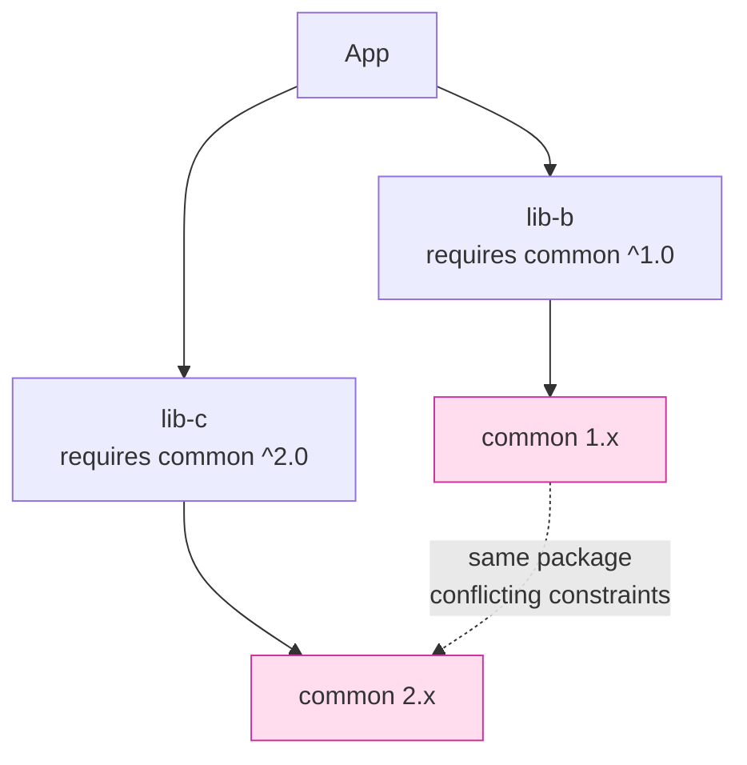
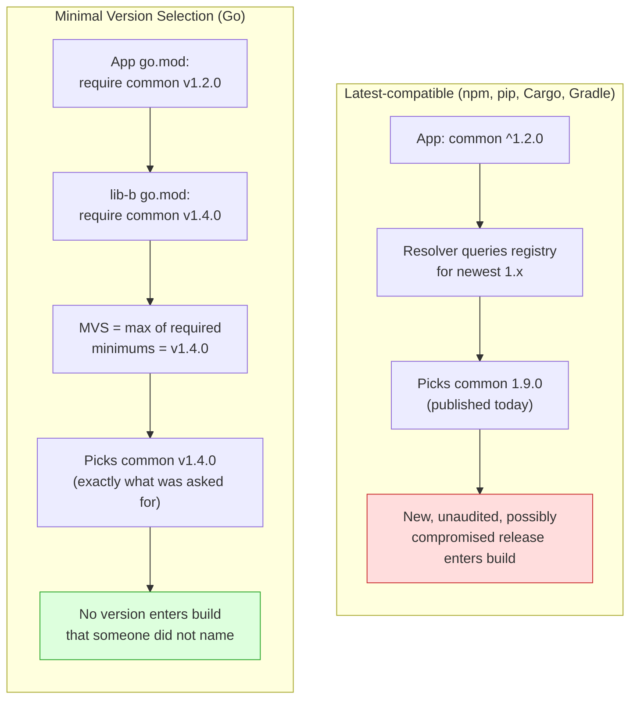
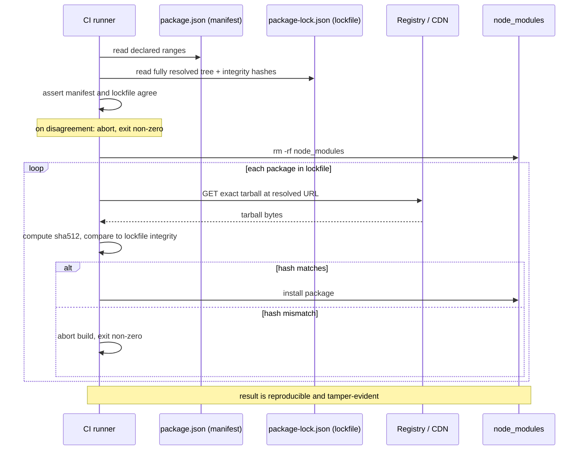
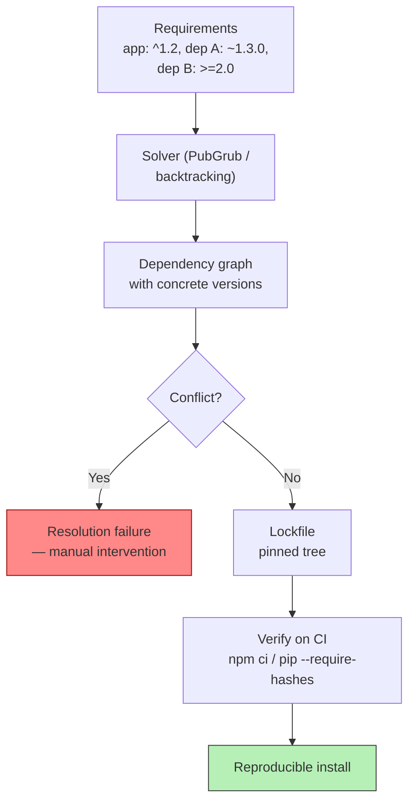
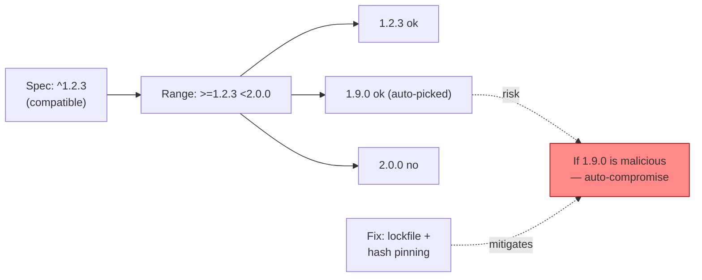
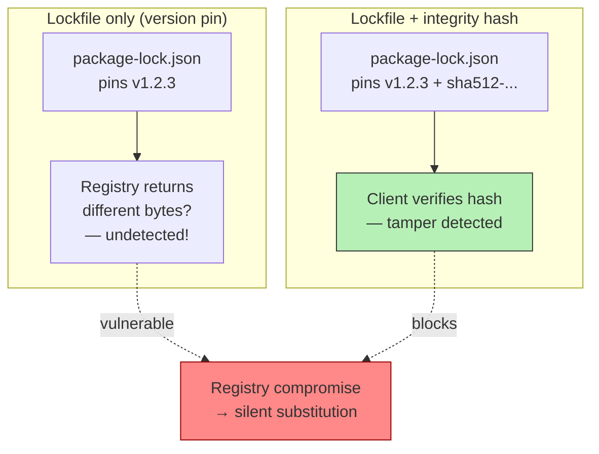

# Chapter 2 — Versioning, Resolution, and Lockfiles

*What this chapter covers.* Chapter 1 described the registries that store packages and the
per-ecosystem trust models that govern who may publish to them. This chapter goes one layer
down, into the machinery that decides *which* versions of *which* packages actually land in
your build: how versions are named, how a package manager turns a set of loose constraints into
a concrete set of installed artifacts, and how that concrete set is frozen into a lockfile so
the next build is identical. This is not administrative plumbing. The behavior of a version
range, the direction a resolver walks the version list, and whether a lockfile carries integrity
hashes together determine whether a compromised release reaches you automatically, whether you
would notice if it did, and whether the build that ships to production is the build you reviewed.
Nearly every incident in Book 1 — event-stream, ua-parser-js, the dependency-confusion cases —
succeeded in part because of a specific, defensible-looking choice in this machinery.

Learning goals — after this chapter you should be able to:

- State the SemVer 2.0.0 grammar and precedence rules precisely, and explain why SemVer is a
  social contract whose violation is a normal event rather than an anomaly.
- Read and reason about version-range syntax across npm, Python (PEP 440), Maven, Cargo, and Go,
  and articulate what a loose range like `^1.2.3` actually grants: standing trust in code that
  does not yet exist.
- Explain dependency resolution as a constraint-satisfaction problem, why it is NP-hard in
  general, and how npm/yarn hoisting, Maven nearest-wins, Gradle highest-wins, Go's Minimal
  Version Selection, and the modern SAT/PubGrub resolvers differ in both outcome and security
  posture.
- Describe what a lockfile is, why integrity hashes — not version pins — are the actual
  tamper-evidence mechanism, and why `npm ci` / `pip install --require-hashes` / `go mod verify`
  belong in every CI pipeline.
- Recognize lockfile-poisoning and lockfile-drift as review problems, and reason about the
  pin-and-review versus float-and-scan trade-off at fleet scale.

## Versions as a naming problem

Before a resolver can choose anything, every release needs a name that expresses ordering: given
two releases, which is newer, and by how much does it claim to differ? That ordering is the
substrate the whole system runs on. If versions did not order, ranges would be meaningless; if
the *magnitude* of a version bump carried no information, "allow patch updates but not major
ones" could not be expressed. Semantic Versioning is the dominant answer, and understanding
exactly what it promises — and, more importantly, what it does *not* enforce — is the
prerequisite for everything that follows.

### SemVer 2.0.0, precisely

Semantic Versioning 2.0.0 specifies a version as `MAJOR.MINOR.PATCH`, three non-negative integers
without leading zeros, optionally followed by a pre-release identifier and build metadata:

```
1.2.3
1.0.0-alpha
1.0.0-alpha.1
1.0.0-0.3.7
1.0.0-x.7.z.92
1.0.0-rc.1+build.20260731
1.0.0+20130313144700
```

The normative content is a set of rules about *when* each field must change. Given a public API:

- **MAJOR** must increment when you make an incompatible (breaking) API change.
- **MINOR** must increment when you add functionality in a backward-compatible manner.
- **PATCH** must increment when you make backward-compatible bug fixes only.

A **pre-release** version is denoted by a hyphen and a series of dot-separated identifiers after
PATCH (`1.0.0-alpha.1`). Identifiers are ASCII alphanumerics and hyphens; numeric identifiers must
not have leading zeros. A pre-release version has *lower* precedence than the associated normal
version — `1.0.0-rc.1` precedes `1.0.0`. This is why pre-releases are usually excluded from range
matching by default: `^1.0.0` does not, by design, select `2.0.0-beta.1`.

**Build metadata** is denoted by a plus sign and dot-separated identifiers (`+20130313144700`).
Build metadata is explicitly **ignored** when determining precedence. `1.0.0+build.1` and
`1.0.0+build.2` have equal precedence; a resolver treats them as the same version. This matters
for provenance discussions later in the suite: build metadata is not a version distinction and
cannot be used to force selection of one build over another.

Precedence — the total order the resolver relies on — is computed field by field:

1. Compare MAJOR, then MINOR, then PATCH, numerically. The first difference decides.
2. When those are equal, a version *with* a pre-release has lower precedence than one *without*.
3. Between two pre-releases, compare the dot-separated identifiers left to right. Numeric
   identifiers compare numerically; alphanumeric identifiers compare lexically in ASCII order;
   a numeric identifier always has lower precedence than an alphanumeric one; and if one set is a
   prefix of the other, the larger set (more identifiers) has higher precedence.

So the specification defines the canonical ascending chain:

```
1.0.0-alpha < 1.0.0-alpha.1 < 1.0.0-alpha.beta < 1.0.0-beta
            < 1.0.0-beta.2 < 1.0.0-beta.11 < 1.0.0-rc.1 < 1.0.0
```

Note `1.0.0-beta.2 < 1.0.0-beta.11`: because those identifiers are numeric they compare
numerically, not lexically, so 11 sorts after 2. A resolver that compared them as strings would
get this backward — a real class of bug in home-grown version parsers.

### SemVer is a social contract, and it is routinely broken

The specification's rules about MAJOR/MINOR/PATCH are stated in the imperative — "MUST increment"
— but nothing enforces them. SemVer is a *promise a human makes about the contents of an
artifact*, encoded in a number. The registry does not diff your API and reject a PATCH release
that removed a function. CI does not verify that your MINOR bump is backward compatible. The number
is whatever the publisher typed. This gap — between what the version claims and what the code does
— is the central weakness that this chapter's tooling both exploits and tries to contain.

The benign form of the gap is familiar: a "patch" release that changes a default, tightens
input validation, or fixes a bug your code was relying on, and your service breaks in production
having pulled it automatically. Every backend engineer has lived this. It is annoying, but it is
detectable, and the maintainer meant no harm.

The malicious form is the same mechanism pointed at you. Recall from Book 1, Chapter 4 that the
compromised **ua-parser-js** releases were published as ordinary version increments — 0.7.29,
0.8.0, and 1.0.0 — sitting in the normal version stream that any consumer's range was already
configured to accept. A consumer whose manifest said `^0.7.28` (that is, "any backward-compatible
release at or above 0.7.28") would resolve 0.7.29 automatically on the next install, because
0.7.29 is exactly what a patch release is *supposed* to be: a small, safe, backward-compatible
fix. The version number lied, and the lie was formatted to satisfy the range. **event-stream**
worked similarly: version 3.3.6 was a routine-looking increment that merely added a new dependency,
`flatmap-stream`, in which the payload eventually rode. In neither case did the attacker have to
defeat any version machinery. The machinery did what it was designed to do, because it trusts the
publisher's version number as a truthful statement of compatibility and risk. It is not one.

The lesson is not "SemVer is useless." It is that a version number is *self-asserted metadata*,
and any control you build on top of it — a caret range, an automated update, a policy that allows
patch bumps but not majors — inherits that self-assertion. The rest of this chapter is largely
about narrowing the window in which that self-assertion can hurt you.

### Range syntax across ecosystems

Manifests rarely pin a single version. They specify *ranges* — sets of acceptable versions — and
the resolver picks a concrete member. The range grammar differs by ecosystem, and the differences
have real security consequences.

**npm (node-semver).** npm has the richest and most-copied range grammar. The two operators that
dominate real manifests are the caret and the tilde:

- **Caret `^`** allows changes that do not modify the left-most non-zero version segment. This
  encodes "compatible according to SemVer": for a 1.x package it permits minor and patch updates
  but not a major.
  - `^1.2.3` := `>=1.2.3 <2.0.0`
  - `^0.2.3` := `>=0.2.3 <0.3.0` — for `0.x`, the minor acts as the breaking-change axis
  - `^0.0.3` := `>=0.0.3 <0.0.4` — for `0.0.x`, nothing but that exact patch is allowed
- **Tilde `~`** allows patch-level changes if a minor is specified, otherwise minor changes.
  - `~1.2.3` := `>=1.2.3 <1.3.0`
  - `~1.2` := `>=1.2.0 <1.3.0`
  - `~1` := `>=1.0.0 <2.0.0`

The full grammar also has X-ranges (`1.2.x`, `1.x`, `*`), hyphen ranges (`1.2.3 - 2.3.4`), explicit
comparators (`>=1.2.7 <1.3.0`), and unions with `||`. The caret is npm's default: `npm install
lodash` writes `"lodash": "^4.17.21"` into `package.json`. So the *default* posture of the largest
software ecosystem on earth is "accept every future minor and patch of this package, forever, up to
the next major."

**Python (PEP 440).** Python's versioning is specified by **PEP 440**, and it is emphatically *not*
SemVer. A PEP 440 version is `[N!]N(.N)*[{a|b|rc}N][.postN][.devN][+local]`: an optional **epoch**
(to reset an entire versioning scheme), a release segment of arbitrary length, pre-release segments
(`a`/`b`/`rc`), **post-release** segments (`.post1`, for republishing without a code change), **dev**
releases (`.dev1`), and a **local version** label after `+` (e.g. `1.2.3+cpu`). The comparison rules
are correspondingly more complex than SemVer's, and code that assumes SemVer semantics for a PyPI
version will mis-order post- and dev-releases. Specifiers use `==`, `!=`, `<=`, `>=`, `<`, `>`,
`~=`, and `===`:

- **`~=` (compatible release)** is the closest analogue to the caret. `~=1.4.2` means `>=1.4.2,
  ==1.4.*`, i.e. `>=1.4.2 <1.5.0`; `~=1.4` means `>=1.4 <2.0`. It fixes everything except the last
  specified digit.
- **`==1.4.*`** is a prefix match. `===` is arbitrary string equality, an escape hatch for versions
  that do not conform to PEP 440 at all.

Crucially, Python has **no default operator**. `pip install requests` installs the latest version
and, unless you use a tool that writes a constraint for you, records nothing. A hand-written
`requirements.txt` line is often a bare `requests`, which is `>=0` — "any version." Discipline in
Python is opt-in in a way it is not in npm.

**Maven (Java).** Maven's normal mode is a **soft requirement**: a bare `<version>1.2.3</version>`
is not a hard pin but a *recommendation* that participates in dependency mediation (discussed below)
and can be overridden by the resolution rules. Maven *does* support hard version ranges —
`[1.0,2.0)` (half-open), `[1.5]` (exactly 1.5), `(,1.0]` (up to and including 1.0) — using
mathematical interval notation, but in practice ranges are **rarely used** in the Java ecosystem.
The cultural norm is to state exact soft versions and let mediation and the build's dependency
management sort out conflicts. This makes Maven builds more stable against surprise upstream releases
than npm, and also less able to express "give me the latest patch."

**Cargo (Rust).** Cargo uses caret semantics by default: a dependency written as `"1.2.3"` is
interpreted as `^1.2.3`, exactly like npm's caret. Cargo also supports tilde, wildcard, and explicit
comparator requirements. So Rust manifests carry the same "accept future compatible releases"
posture as npm — but, as we will see, Cargo's mandatory `Cargo.lock` for applications blunts the
practical risk.

**Go.** Go modules are the outlier and deserve their own treatment below, because Go's *selection
algorithm* is fundamentally different. At the syntax level, a `go.mod` lists a specific version per
requirement (`require github.com/pkg/errors v0.9.1`), and there is no caret. The version listed is a
*floor*, not a range in the npm sense, and the resolution rule — Minimal Version Selection — turns
those floors into a deterministic build without ever consulting "the latest release."

### What a loose range actually grants

Step back and look at `^1.2.3` as a security statement rather than a convenience. It says: *install
1.2.3 today, and on any future resolution install the highest 1.x release then available, executing
whatever code it contains, on my developer laptops, my CI runners, and my build hosts, without asking
me again.* It is a standing, forward-dated grant of code-execution trust to releases that **do not
exist yet**, made by a package the transitive graph pulled in on your behalf, maintained by someone
you cannot name.

And it composes transitively. Your direct dependency's own manifest uses caret ranges on *its*
dependencies. So `^1.2.3` on one package is, in effect, a grant across the reachable frontier of the
graph: every package in the closure that has a caret range on a child extends the same standing trust
downward. This is the mechanism by which a single compromised leaf package — event-stream's
`flatmap-stream`, ua-parser-js as a transitive dependency of countless tools — fans out to millions
of installs the moment it publishes a version that satisfies the ranges already in place. The range
is not describing what you have; it is pre-authorizing what you will get.

## Resolution: from constraints to a concrete tree

Given a root manifest of ranges, and every dependency's own manifest of ranges, the resolver must
choose one concrete version for each package such that all constraints are satisfied — and then
produce an installable tree. This is where ecosystems diverge most sharply.

### The general problem is hard

Dependency resolution with version constraints is a **constraint-satisfaction problem**, and in the
general case it is **NP-hard**. The intuition is a reduction from boolean satisfiability: encode each
boolean variable as a package with two candidate versions ("true" and "false"), encode each clause as
a package that depends on a disjunction of the literal-versions that would satisfy it, and require the
whole thing to co-install. A set of versions that satisfies all constraints exists if and only if the
original formula is satisfiable. This is not a theoretical curiosity — it was worked out concretely
for Debian package installability by the EDOS/Mancoosi research programs, and it is why a "modern"
resolver is, under the hood, a SAT solver or a close cousin. When your `pip install` or `cargo update`
spins for a while and then reports a conflict, it is exploring an exponential search space.

The shape that makes this bite in practice is the **diamond dependency**: your application depends on
two packages that both depend on a third, with incompatible constraints on it.



There is no single version of `common` that satisfies both `^1.0` and `^2.0`. What happens next is
the entire personality of the ecosystem's resolver: some ecosystems install both versions side by
side, some pick one and hope, some refuse to build, and some pick the *smallest* version that
satisfies the most constraints. Each choice is a different trade between build success, correctness,
bloat, and security.

### npm and yarn: nested trees and hoisting

Node's module system permits **multiple versions of the same package to coexist in one build**. Each
package can have its own `node_modules` directory, and `require('common')` resolves to the nearest
`common` up the directory tree. So npm's answer to the diamond is simply: install `common@1.x` under
`lib-b` and `common@2.x` under `lib-c`, and let each see its own copy. The diamond does not have to be
resolved to a single version at all.

To avoid a combinatorial explosion of duplicated files, npm and yarn **hoist**: they lift a single
copy of each package as high as possible in the tree — ideally to the top-level `node_modules` — when
doing so does not violate any consumer's constraints, and only create nested copies where versions
genuinely conflict. `pnpm` takes a different structural approach, using a content-addressed store and
symlinks so that each package sees exactly its declared dependencies and nothing else, which also
closes a class of "phantom dependency" bugs where code accidentally imports a hoisted package it never
declared.

The security consequence is double-edged. On one hand, allowing multiple versions means npm almost
never fails to resolve a diamond — builds are robust. On the other hand, that robustness **multiplies
attack surface**: a large Node build routinely contains several versions of the same package, each a
distinct artifact from the registry, each with its own maintainers and its own lifecycle scripts, each
a place a vulnerability or a malicious release can live. When a CVE lands on `common`, "do I have a
vulnerable version?" is not a yes/no question but "which of the four copies in my tree are vulnerable,
and is the reachable one among them?" Hoisting is invisible in the manifest and only legible in the
lockfile — which is one reason lockfiles matter for security review, not just reproducibility.

### Maven nearest-wins, and Gradle highest-wins

The JVM world does *not* permit two versions of the same artifact on one classpath — the class loader
would see conflicting definitions. So a single version must be chosen, and Maven and Gradle choose
differently, which produces the classic "works in Maven, breaks in Gradle" surprise.

**Maven** uses **nearest-wins** dependency mediation. It computes each version's *depth* — the number
of edges from your project's POM to the declaration — and the version at the shallowest depth wins.
Ties at the same depth are broken by *declaration order* (first wins). Maven is not trying to pick the
newest compatible version; it is picking the one *closest to you in the graph*, on the theory that
things nearer your project are more likely to be what you intended. The footgun is direct: a transitive
path can silently *downgrade* a library. If `common 2.0` sits three levels deep but `common 1.0` sits
two levels deep, Maven installs 1.0 — even though something in your graph asked for 2.0 and may need it
— purely because of graph topology. Reordering `<dependencies>` or adding an intermediate can change
which version you ship, with no version-number reasoning involved.

**Gradle** defaults to **highest-version-wins**: among all versions requested anywhere in the graph, it
selects the greatest, regardless of depth. This matches most engineers' intuition (newer is a superset)
and usually avoids the silent-downgrade trap, but it means the same dependency set, resolved by the two
tools, can yield *different* installed versions — a real portability hazard for a codebase that some
teams build with Maven and others with Gradle. Gradle additionally offers **rich version constraints**
— `strictly`, `require`, `prefer`, and `reject` — that let you express, for example, "I will accept
anything in `[1.0, 2.0)` but *strictly* not 1.4.x because it is vulnerable," and it will fail the build
rather than silently pick a rejected version. That expressiveness is exactly what nearest-wins lacks.

### Go's Minimal Version Selection

Go modules use **Minimal Version Selection (MVS)**, and it inverts the assumption every ecosystem above
shares. npm, pip's resolver, Cargo, and Gradle all reach for the *newest* version a constraint permits.
MVS reaches for the *oldest version that satisfies every requirement*.

Concretely: each module in your build's requirement graph names, in its `go.mod`, a specific minimum
version for each of its dependencies. To select the version of some module `D`, MVS takes the **maximum
of all the minimum versions of `D` required by anything in the graph**. That maximum is, by construction,
the *smallest* version that is at least as new as every stated requirement — hence "minimal." It never
consults "the latest release of `D` on the proxy." If nothing in your graph requires `D` newer than
v1.4.0, you get v1.4.0, even if v1.9.0 was published this morning.



The design philosophy, articulated by Russ Cox in the "Minimal Version Selection" writeup, is
**high-fidelity builds**: the versions you build with today are exactly the versions you will build with
next month, until *you* explicitly change a requirement. There is no "latest that fits" floating target.
Upgrades are an explicit act — `go get D@v1.9.0` — recorded as a diff to `go.mod`, reviewable in a pull
request.

The security implications are significant and under-appreciated. Under latest-compatible resolution, a
compromised release becomes part of your build the moment it is published and satisfies an existing
range — automatically, silently, potentially in a routine CI run that nobody associates with a
dependency change. Under MVS, that same compromised release is inert until a human edits a `go.mod` to
require it. The window of "malicious release exists *and* I pulled it without deciding to" is closed by
construction. This is not a claim that Go is immune to malicious packages — a malicious *pinned* version
you deliberately upgrade to will still compromise you — but MVS removes the entire category of
*surprise* upgrades, which is precisely the category that ua-parser-js and event-stream exploited.
Go also, notably, downloads and executes no install-time scripts, which compounds the effect.

The cost is that security *fixes* are also not automatic. If v1.4.0 has a vulnerability and v1.4.1 fixes
it, MVS keeps you on v1.4.0 until someone bumps the requirement. Go's answer is tooling around the
explicit upgrade — `go list -m -u all` to see available updates, `govulncheck` to flag vulnerable
selected versions — plus, for the truly dangerous case, the `retract` directive and module deprecation.
The trade is deliberate: Go chose reproducibility and no-surprise upgrades over automatic freshness, and
made you opt in to the freshness.

### pip's resolver, and the SAT generation

Python's resolution story has two eras. **Before pip 20.3 (late 2020)**, pip had **no real dependency
resolver**. It installed packages in the order it encountered them and used the first version of each it
found that satisfied the *currently examined* constraint, without backtracking to reconcile conflicts.
The result was that pip would happily produce a "successful" install whose packages violated each
other's stated requirements — an inconsistent environment that only failed at runtime. For a language
that dominates data and ML infrastructure, this was a remarkably long-lived gap.

pip 20.3 shipped a **backtracking resolver** (built on the `resolvelib` library) that actually explores
the constraint space, backs out of dead ends, and refuses to install a set that cannot be reconciled —
at the cost of sometimes-dramatic resolution times and occasional "ResolutionImpossible" errors that
the old resolver would have silently papered over. That error is the resolver doing its job: it found a
genuine diamond with no solution and told you, rather than shipping an inconsistent environment.

The modern Python tools go further and use full **SAT-style** or **PubGrub** resolvers with lockfiles:
**Poetry**, **PDM**, and **uv** all resolve the whole graph to a consistent, reproducible set and write
a lockfile. `uv` (from Astral) uses a PubGrub-based algorithm — the same lineage as Dart's `pub` — which
is notable both for speed and for producing *good error messages*: PubGrub's structure lets it explain
*why* a resolution failed in terms of the conflicting constraints, rather than just reporting failure.
This is the direction the whole field has moved: resolution as an explicit, complete, reproducible search
that produces a lockfile, not an incremental best-effort walk.

### The tension that runs through the book

Every resolver choice above is a position on a single axis:

- **Newest-compatible** (npm, Cargo, Gradle, pip's install-latest default) optimizes for getting
  security fixes and improvements *fast and automatically*. The price is that it also pulls *malicious*
  or *broken* releases fast and automatically, and the moment of pull is decoupled from any human
  decision.
- **Pinned / minimal** (Go's MVS, and any ecosystem with a committed lockfile installed strictly)
  optimizes for *reproducibility and no surprises*. The price is that fixes are not automatic; you must
  act to get them.

There is no resolver setting that gives you both. You cannot simultaneously "always pull the newest so I
get fixes instantly" and "never pull anything I did not review so I am not surprised." The reconciliation
is not algorithmic; it is operational — a lockfile plus an *automated, reviewed* update process, which is
the subject of the last section and of Chapter 9.

## Lockfiles: freezing the resolution

A resolver's output is a specific choice of versions. A **lockfile** is that choice, written down: the
fully resolved, transitively complete, version-and-hash-pinned snapshot of the entire dependency graph.
It is the difference between a manifest that says "some 1.x of lodash" and a record that says "exactly
lodash 4.17.21, from exactly this URL, with exactly this SHA-512, and here are all 800 transitive
packages with the same detail."

### What a lockfile contains

Across ecosystems, a mature lockfile records four things per package: the **exact resolved version**, the
**resolved source** (registry URL or equivalent), an **integrity hash** of the artifact, and the
**dependency edges** that produced it. The formats:

| Ecosystem | Lockfile | Committed by default? | Integrity mechanism | Strict-install command |
|---|---|---|---|---|
| npm | `package-lock.json` / `npm-shrinkwrap.json` | Yes | SRI `sha512` per package (`integrity`) | `npm ci` |
| Yarn | `yarn.lock` | Yes | `integrity` (SRI) + `resolved` | `yarn install --immutable` |
| pnpm | `pnpm-lock.yaml` | Yes | per-package integrity | `pnpm install --frozen-lockfile` |
| Cargo | `Cargo.lock` | Yes (apps); no (libs) | `sha256` `checksum` per package | `cargo build --locked` |
| Go | `go.mod` + `go.sum` | Yes | `h1:` module + go.mod hashes; sum DB | `go mod verify`, `-mod=readonly` |
| Poetry | `poetry.lock` | Yes | per-file hashes | `poetry install` (respects lock) |
| PDM / uv | `pdm.lock` / `uv.lock` | Yes | per-file hashes | `pdm sync`, `uv sync --frozen` |
| pip (via pip-tools) | `requirements.txt` (compiled) | Yes | `--hash=sha256:...` per pin | `pip install --require-hashes` |
| pipenv | `Pipfile.lock` | Yes | per-file `sha256` | `pipenv sync` |
| Maven | *(none by default)* | — | — | — |
| Gradle | `gradle.lockfile` (opt-in) | Only if enabled | relies on artifact metadata | `--write-locks` / verification metadata |

Two rows in that table are the security story.

The **Maven/Gradle gap is real and worth naming plainly.** Maven has *no lockfile mechanism at all* in its
default operation. A Maven build's exact resolved graph is a function of the POMs, the mediation rules,
and whatever is in the repositories at build time — it is reproducible only to the extent that the inputs
happen not to have changed, and Maven ranges (when used) make even that fragile. Gradle added **dependency
locking**, but it is **opt-in** — you must enable it per configuration and generate the lockfile — and
Gradle's separate **dependency verification** metadata (checksums and signatures in
`verification-metadata.xml`) is a further, separate opt-in. So the JVM ecosystem, which underpins an
enormous fraction of enterprise backends, ships by default *without* the reproducibility-and-tamper-evidence
baseline that npm, Cargo, and Go treat as table stakes. If you run JVM services, turning on Gradle
dependency locking and verification metadata (or a Maven equivalent via enforced ranges and a repository
manager) is not gold-plating; it is closing a gap the tooling left open.

### Integrity hashes are the actual security mechanism

It is tempting to think the version pin is what makes a lockfile secure. It is not. A version pin says
"install lodash 4.17.21," but "lodash 4.17.21" is a *name*, and a name can be made to resolve to different
bytes — by a compromised registry, a poisoned mirror, a man-in-the-middle, or a re-published artifact. The
**integrity hash** is what turns the name into a statement about *bytes*: it says "install the artifact
whose SHA-512 is exactly this," and if the fetched bytes hash to anything else, the install fails.

- **npm** records **Subresource Integrity (SRI)** strings — `sha512-<base64>` — in each package's
  `integrity` field, and verifies the downloaded tarball against it.
- **Go**'s `go.sum` records two hashes per module: an `h1:` hash of the module's file tree and a hash of
  its `go.mod`. `go mod verify` recomputes and compares. On top of this, Go operates a **checksum
  transparency log** (`sum.golang.org`, `GOSUMDB`): the first time anyone fetches a given module version,
  its hash is recorded in an append-only, publicly auditable log, so a maintainer cannot quietly swap the
  contents of an already-published version without the substitution being globally visible. This is a
  materially stronger property than a per-repo lockfile hash alone.
- **Cargo** records a `sha256` `checksum` per package in `Cargo.lock` and verifies on fetch.
- **pip** verifies `--hash=sha256:` pins under `--require-hashes`.

Hash-pinning **defeats artifact substitution**. An attacker who compromises the registry, the CDN, or the
network path and swaps the bytes of lodash 4.17.21 is caught, because the swapped bytes do not match the
recorded hash and the install aborts. This is the property that makes `npm ci` "safe-ish."

What hash-pinning does **not** defeat is a malicious *version you willingly upgraded to*. If ua-parser-js
0.7.29 is malicious and your resolver selected it and wrote its (correct) hash into your lockfile, the hash
verifies perfectly — it is faithfully recording the bytes of the malicious release. Integrity hashes protect
the *channel* between the lockfile and the installed artifact; they say nothing about whether the version the
lockfile names is trustworthy. That question is answered upstream, at resolution and review time. Confusing
these two protections — thinking a lockfile with hashes means your dependencies are "verified" in the sense
of "known good" — is a common and dangerous category error.

### Strict install: `npm ci` and friends

A lockfile only helps if the install actually *obeys* it and *fails* on mismatch. Every ecosystem has two
modes, and the distinction is the whole point:

- `npm install` is a **resolving** install. It reads the lockfile as a hint, but it may re-resolve ranges,
  add newly permitted versions, and **rewrite** `package-lock.json` and even `package.json`. It is for
  development, where you *want* the graph to move.
- `npm ci` is a **strict** install. It requires a lockfile, refuses to run if `package.json` and the
  lockfile disagree, deletes `node_modules`, installs the exact tree the lockfile specifies, verifies every
  integrity hash, and **never writes** to `package.json` or the lockfile. If anything is off, it exits
  non-zero.

The strict mode is what belongs in CI and in any pipeline that produces a shippable artifact. The
equivalents:

```bash
npm ci                              # exact lockfile install, hash-verified, fails on drift
yarn install --immutable            # yarn 2+: fail if the lockfile would change
pnpm install --frozen-lockfile      # fail if pnpm-lock.yaml is out of date
cargo build --locked                # error rather than update Cargo.lock
go build -mod=readonly              # do not modify go.mod/go.sum; used in CI
go mod verify                       # recompute module hashes against go.sum
pip install --require-hashes -r requirements.txt   # every pin must carry a verified hash
poetry install                      # installs exactly poetry.lock (errors if lock is stale)
uv sync --frozen                    # install uv.lock exactly, no re-resolution
```

The sequence `npm ci` performs — and the property it gives you — is worth seeing end to end:



Two things fall out of this. First, **the lockfile must be committed to source control.** A lockfile that
lives only on a developer's machine reproduces nothing and verifies nothing for anyone else. Committing it is
what makes the resolution a reviewable, shared artifact. Second, **`npm ci` in CI gives you reproducibility
and tamper detection in one command** — the build is byte-for-byte the tree in the lockfile, and any attempt
to substitute an artifact along the way trips a hash check. Using `npm install` in CI throws both away: the
graph can move under you and no drift is flagged.

### Lockfile attacks and hygiene

Because the lockfile is trusted — `npm ci` installs *exactly* what it says — the lockfile itself becomes a
target. This is **lockfile poisoning**, and it is insidious precisely because lockfiles are large,
machine-generated, and rarely read line by line in review.

The moves an attacker makes in a poisoned lockfile:

- **Swap the `resolved` URL.** npm and yarn lockfiles record a `resolved` field — the URL the artifact was
  fetched from. A malicious pull request can change that URL to point at an attacker-controlled host while
  leaving the version string untouched, so the diff *looks* like it still installs lodash 4.17.21 but fetches
  the bytes from somewhere else. If the accompanying `integrity` hash is also changed to match the malicious
  bytes, the hash check passes — because the check verifies the *fetched* bytes against the *lockfile's* hash,
  and the attacker controls both. The `resolved` field is thus a genuine substitution and exfiltration vector,
  and it hides in a part of the file reviewers skim.
- **Inject a transitive dependency.** Adding an entry for a new package deep in the lockfile — one that
  appears in no manifest — can pull an attacker's package into the tree. Because the lockfile is authoritative
  for the transitive graph, an entry that no `package.json` references can still be installed.
- **Downgrade to a known-vulnerable version** by editing only the lockfile, leaving the manifest's range
  intact and satisfied.

The through-line is that all three edits are **content that a human must catch**, and lockfile diffs are
exactly the diffs humans wave through. A pull request that touches only `package-lock.json` and bumps a hash
and a URL is trivially mergeable-looking and semantically opaque. The mitigations are procedural and tie
directly to Book 7's source-security and code-review practices: treat lockfile changes as **security-relevant
diffs**, not noise; require that a lockfile change be accompanied by the manifest change that *explains* it (a
lockfile-only PR that adds packages should be a red flag); use tooling that regenerates the lockfile from the
manifest and fails if the committed lockfile does not match what a clean resolution would produce (so a
hand-edited `resolved` URL cannot survive); and prefer resolvers and registries that pin to an immutable,
integrity-checked source of record — Go's checksum transparency log is the strongest example, because a
swapped artifact is caught not against a hash the same attacker could edit, but against a global append-only
log.

**Lockfile drift** is the quieter failure: the manifest and lockfile fall out of sync (someone edits
`package.json` but runs `npm install` inconsistently, or merges branches with conflicting lockfiles), and the
tree that installs is neither clearly the old one nor the new one. Drift defeats reproducibility even without
an attacker, and it is exactly what `npm ci`'s "abort if manifest and lockfile disagree" is designed to
surface. A CI job that runs the strict install turns drift from a silent, drifting condition into a hard build
failure at the moment it is introduced.

## Practical guidance and the distributed-systems lens

### Pin-and-review versus float-and-scan

The two coherent operating postures fall directly out of the resolver tension:

- **Pin-and-review.** Commit lockfiles, install strictly (`npm ci` and its peers), and treat every dependency
  change — direct or transitive, manifest or lockfile — as a reviewable diff that a human or a policy gate
  approves before it ships. This maximizes control and closes the surprise-upgrade window that most dependency
  attacks depend on. Its failure mode is *staleness*: if review is the only path forward, security fixes queue
  up behind human attention, and you end up running vulnerable versions because nobody got to the bump.
- **Float-and-scan.** Allow ranges to float to newest-compatible and rely on scanners (SCA, Chapter 6;
  reachability, Chapter 7) to catch known-bad versions after the fact. This maximizes freshness and gets fixes
  fast. Its failure mode is exactly the attack channel this chapter describes: you pull a *newly published*
  malicious or broken release automatically, before any scanner's database knows it is bad — and zero-day
  malicious packages are, by definition, not yet in any feed.

Neither pole is tenable alone at fleet scale, and the resolution is not to pick one but to **automate the
reconciliation**. Tools like **Dependabot** and **Renovate** exist precisely to make pin-and-review's staleness
survivable: they hold you on pinned, lockfile-frozen versions for reproducibility and no-surprise safety, and
*separately* propose upgrades as pull requests — one per dependency or grouped — carrying the changelog, the
diff, and the CI result, so that the "get the fix" action becomes a reviewable, testable event rather than an
invisible float. That converts the impossible "newest *and* reviewed" into the achievable "pinned by default,
upgraded on a reviewed cadence." Chapter 9 is a deep dive on getting this automation right — batching,
auto-merge policies for low-risk updates, and cooldown windows that deliberately *delay* pulling a brand-new
release so that a malicious one has time to be caught and yanked before it reaches you. That cooldown is a
direct, deliberate re-introduction of MVS's "don't pull the newest thing the instant it appears" property into
ecosystems whose resolvers lack it.

### Reproducible resolution is a prerequisite, not the goal

Everything in this chapter — deterministic resolution, committed lockfiles, hash verification, strict installs
— produces one property: **given the same inputs, you get the same dependency graph, byte for byte, every
time.** That property is necessary but not sufficient for the larger goal the suite builds toward.
Reproducible *resolution* means the set of source artifacts is fixed and verified. Reproducible *builds*
(Book 4, Chapter 2) means that fixed set, run through a fixed toolchain in a controlled environment, produces
a bit-identical output — so that an independent rebuild can confirm a shipped binary corresponds to the source
and dependencies it claims. You cannot have reproducible builds on top of non-reproducible resolution: if the
inputs float, the output cannot be pinned no matter how hermetic the build. The lockfile is the first link in
that chain. When we discuss provenance and SLSA in Book 5, "the exact dependencies that went in" is a lockfile
away from being a verifiable claim rather than an aspiration.

### At fleet scale

A single service's dependency choices are a manageable problem; a hundred services across a dozen teams are a
governance problem, and the resolution machinery is where governance either has purchase or does not.

Consider the mechanics multiplied by an organization. **Caret ranges across a fleet** mean that "we depend on
package X" is not a fact about a version but about a *frontier* — different services, resolved on different days,
sit on different points of X's release history, and a compromised X release lands in whichever services next run
an unpinned resolution. Without committed lockfiles and strict CI installs, you cannot even *answer* "which
services are running the compromised version," because the version each service runs is a function of when it last
resolved, not of anything recorded. That is the difference between a scoped incident and an un-scopeable one: the
SolarWinds and ua-parser-js responses both hinged on the ability to enumerate exactly who had what, and that
enumeration is a lockfile query.

**Lockfile discipline is therefore an organizational control, not a per-repo preference.** The controls that
matter are enforceable at the platform layer: require committed lockfiles (a CI check that fails if one is missing
or drifted); mandate strict installs in every pipeline that produces a deployable artifact (`npm ci`,
`--frozen-lockfile`, `-mod=readonly`, `--require-hashes`); route all resolution through an internal registry or
proxy that pins to immutable, integrity-checked artifacts and can be frozen instantly during an incident (Book 2,
Chapter 8); and gate lockfile diffs through review that understands `resolved`-URL and injected-dependency
poisoning. The Maven/Gradle gap becomes an organizational liability here specifically: a fleet that cannot
enumerate its resolved graph cannot scope an incident, and "we build with Maven and never turned on locking" means
exactly that.

The resolver you did not choose — because it was your language's default — is quietly setting your fleet's risk
posture. An organization standardized on Go inherits MVS's no-surprise-upgrade property for free; one standardized
on npm inherits caret-default float and must claw reproducibility back with lockfiles and strict CI; one on the JVM
must opt into locking that the tooling leaves off. None of these is a reason to pick a language. All of them are a
reason to know, per ecosystem, exactly where on the newest-versus-pinned axis your defaults sit, and to move them
deliberately toward pinned-and-reviewed with automated updates — because the alternative is a fleet whose trust in
not-yet-written code is granted by default and legible to no one.

## Key takeaways

- **A version number is self-asserted metadata.** SemVer 2.0.0 specifies a precise grammar and precedence order,
  but nothing enforces that a PATCH release is actually a backward-compatible bug fix. Every control built on
  version numbers — caret ranges, "patch-only" update policies — inherits that unenforced promise, which is exactly
  what ua-parser-js and event-stream exploited by shipping payloads in ordinary-looking increments.
- **A loose range grants standing, forward-dated trust to code that does not exist yet.** `^1.2.3` pre-authorizes
  execution of every future compatible release, transitively, across your whole graph. That pre-authorization is
  the mechanism by which a compromised leaf package fans out to millions of installs automatically.
- **Resolvers sit on a newest-versus-minimal axis, and the choice is a security posture.** npm hoisting, Maven
  nearest-wins, Gradle highest-wins, and pip's backtracking resolver all reach for the newest compatible version;
  Go's MVS reaches for the oldest that satisfies requirements, closing the surprise-upgrade window by construction
  at the cost of automatic fixes.
- **Integrity hashes, not version pins, are the tamper-evidence mechanism.** Hash-pinning in lockfiles defeats
  artifact substitution — a swapped registry or CDN artifact fails the check — but it does *not* protect you from a
  malicious version you deliberately resolved and recorded. Do not confuse "hash-verified" with "known good."
- **Strict install in CI is the point of a lockfile.** `npm ci`, `--frozen-lockfile`, `cargo --locked`,
  `go mod verify`, and `pip --require-hashes` give reproducibility and tamper detection together. Committing
  lockfiles and installing strictly is what makes a fleet's resolved graph enumerable — the prerequisite for
  scoping any dependency incident.
- **Lockfile diffs are security-relevant diffs.** Lockfile poisoning — a swapped `resolved` URL, an injected
  transitive dependency, a stealth downgrade — hides in exactly the machine-generated file reviewers skim. Treat a
  lockfile change without an explaining manifest change as a red flag, and regenerate-and-compare to catch
  hand-edited entries.
- **The pin-versus-float tension is resolved operationally, not algorithmically.** Pin and freeze by default;
  reconcile staleness with automated, reviewed updates (Dependabot/Renovate, Chapter 9), ideally with a cooldown
  that re-introduces MVS's "don't pull the newest thing instantly" property. The Maven/Gradle lack of default
  locking is a real gap; close it deliberately.


### Version constraint to resolution algorithm




### Semver ranges: the floating window




### Lockfile without vs with hash pinning



## Further reading

- Semantic Versioning 2.0.0 — the specification (https://semver.org/spec/v2.0.0.html).
- node-semver — the reference implementation and range grammar used by npm
  (https://github.com/npm/node-semver).
- PEP 440, "Version Identification and Dependency Specification" — Python's version scheme and specifiers
  (https://peps.python.org/pep-0440/).
- Russ Cox, "Minimal Version Selection" and the surrounding "Go & Versioning" series
  (https://research.swtch.com/vgo-mvs).
- The Go Modules Reference, including `go.sum`, `go mod verify`, and the checksum database
  (https://go.dev/ref/mod).
- Cargo Book, "Specifying Dependencies" and "Cargo.lock vs Cargo.toml"
  (https://doc.rust-lang.org/cargo/reference/specifying-dependencies.html).
- Maven, "Introduction to the Dependency Mechanism" (dependency mediation / nearest-wins)
  (https://maven.apache.org/guides/introduction/introduction-to-dependency-mechanism.html).
- Gradle, "Dependency Constraints," "Resolution Rules," and "Dependency Locking / Verification"
  (https://docs.gradle.org/current/userguide/dependency_management.html).
- pip documentation on the 2020 backtracking resolver and `--require-hashes`; pip-tools for compiling hashed
  requirements (https://pip.pypa.io/en/stable/topics/dependency-resolution/).
- Natalie Weizenbaum, "PubGrub: Next-Generation Version Solving" — the algorithm behind Dart's `pub` and `uv`
  (https://nex3.medium.com/pubgrub-2fb6470504f).
- The EDOS/Mancoosi work on the NP-completeness of package installability (Mancoosi project publications), for
  the formal hardness result.
- npm documentation for `npm ci` and `package-lock.json` integrity fields
  (https://docs.npmjs.com/cli/commands/npm-ci).
