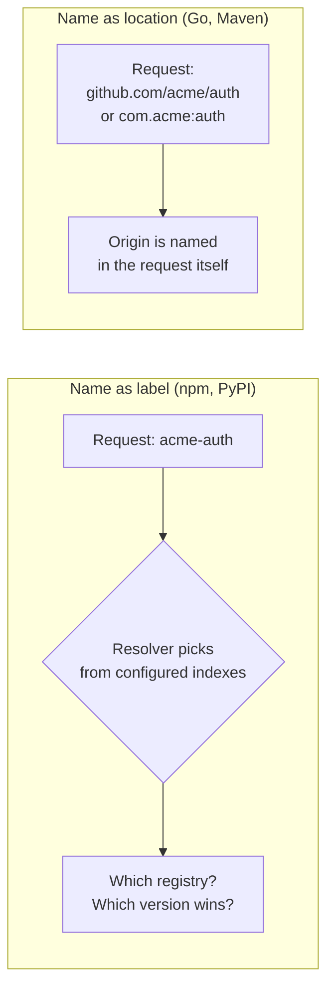
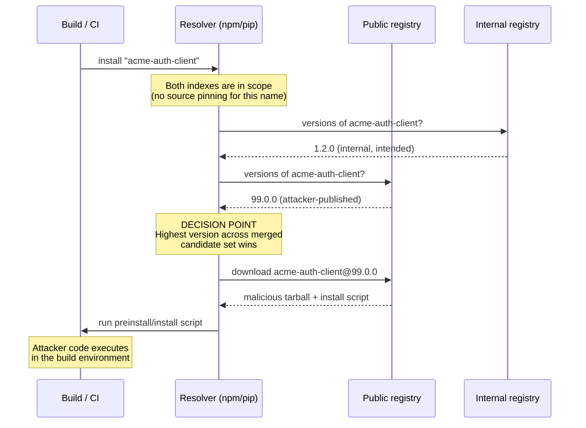
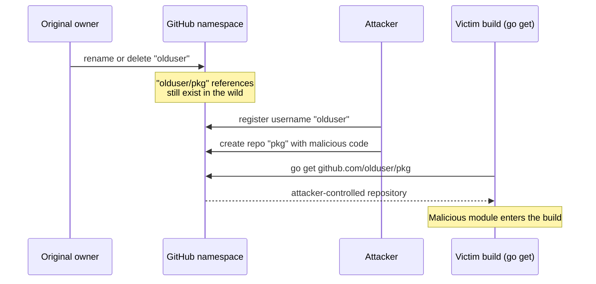
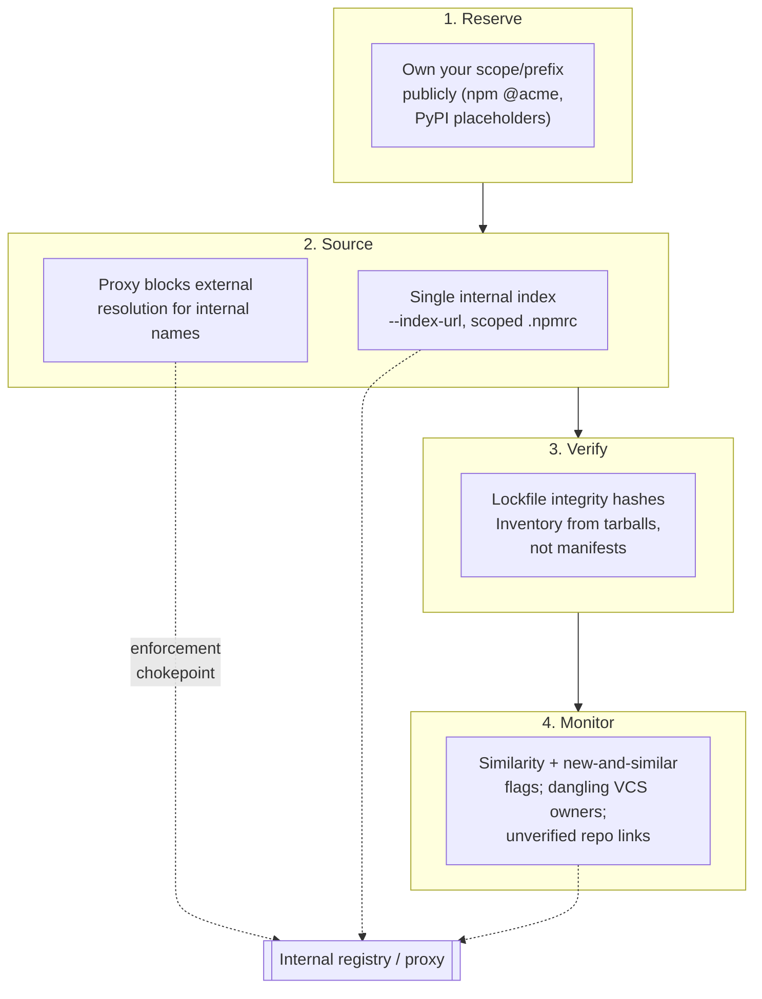
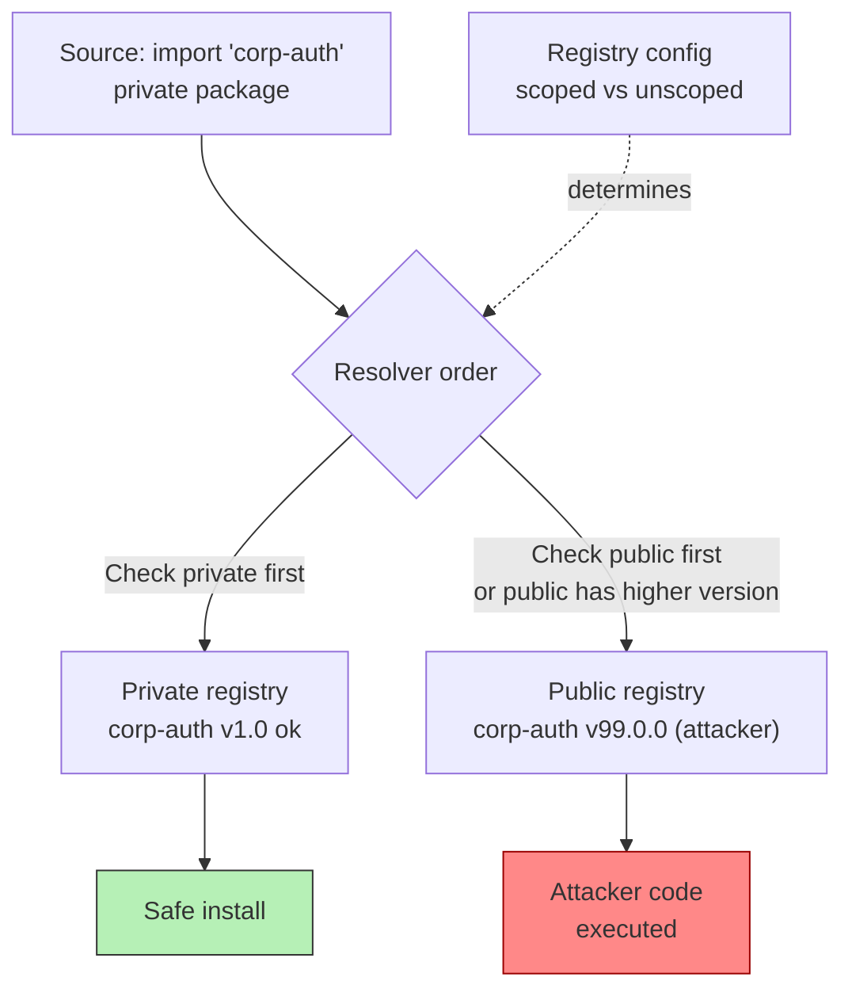
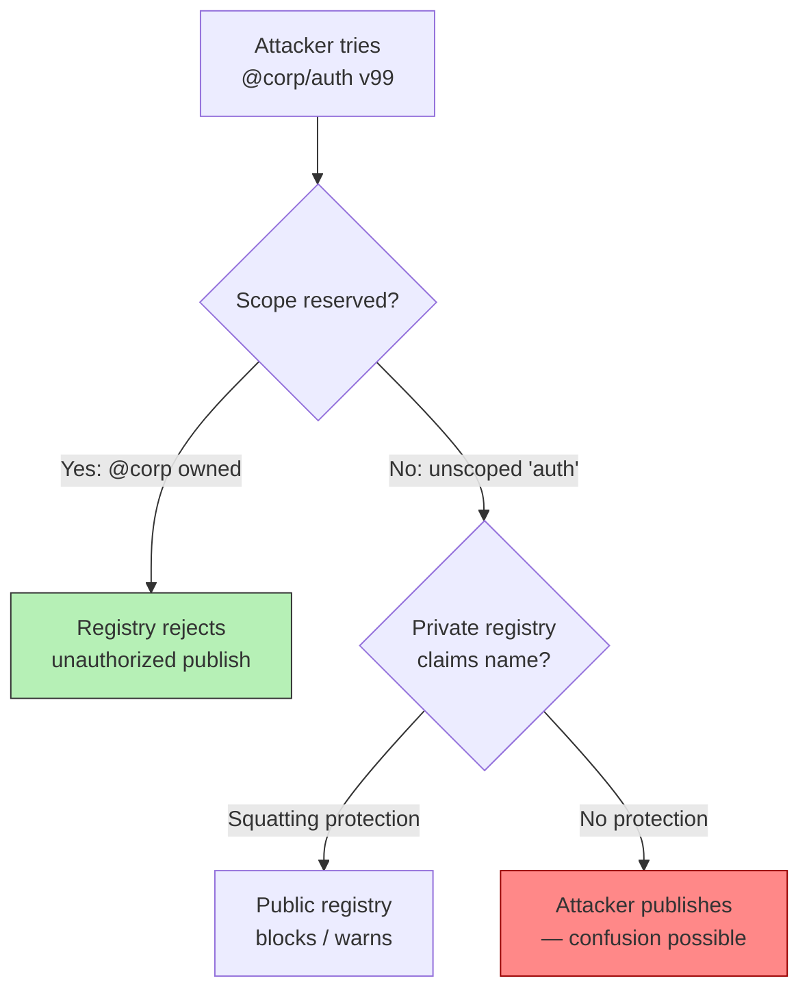

# Chapter 3 — Dependency Confusion, Typosquatting, and Namespace Attacks

*What this chapter covers.* Chapter 1 described the registries that store packages and their
trust models; Chapter 2 described the resolver that turns constraints into a concrete set of
installed artifacts. This chapter is about attacks that abuse the layer *between* those two — the
mapping from a **name** to an **artifact**. Book 1, Chapter 2 introduced dependency confusion,
typosquatting, combosquatting, repojacking, and starjacking as entries in a taxonomy. Here we
take them apart: the precise resolution behavior each one exploits, per ecosystem, and why the
design decisions that enable them looked reasonable when they were made. These are the cheapest
supply-chain attacks in existence — no stolen credential, no compromised build, no malicious
maintainer. The attacker publishes a package and waits for your resolver to pick it. Because the
precondition is a *naming* mistake rather than a *code* vulnerability, the defenses are almost
entirely about controlling how names resolve, and they can be closed deterministically once you
understand the mechanics. That is the goal of this chapter.

Learning goals — after this chapter you should be able to:

- Explain dependency confusion at the resolver level: exactly why an internal package name that
  is *also* resolvable from a public registry can be silently substituted, and how npm, pip,
  Maven, and Go differ in their structural exposure to it.
- Articulate why `--extra-index-url` is a security anti-pattern and `--index-url` is not, and why
  Maven's explicit repositories and Go's URL-based import paths resist confusion by construction.
- Distinguish typosquatting, combosquatting, and homoglyph attacks by mechanism, and reason about
  their scale, detectability, and the automation attackers use to mass-produce them.
- Describe repojacking, starjacking, expired-domain/maintainer takeover, and npm manifest
  confusion accurately — what each subverts, what capability it requires, and where the platform
  mitigations still leave gaps.
- Design a layered org defense that maps each attack class to a primary control, with the internal
  registry/proxy as the single enforcement chokepoint.

## The shared root: a name is not a location

Every attack in this chapter exploits the same structural fact. In npm, PyPI, RubyGems, and most
other flat-namespace registries, a dependency is requested by a **bare name** — `requests`,
`lodash`, `acme-auth-client` — and it is the *resolver's* job, at build time, to decide which
concrete artifact that name refers to. The name carries no proof of origin. It does not say
*which registry* is authoritative for it, *who* is allowed to publish it, or *what* the "right"
version is. The resolver answers those questions from configuration and from whatever indexes it
happens to be pointed at, and its default answers are optimized for convenience — pull the newest
compatible thing from wherever it is available — not for security.

Contrast this with a system where the name *is* a location. A Go import path like
`github.com/acme/auth` names a specific host and repository; there is no ambiguity about where it
resolves, only about who controls that repository. A Maven coordinate `com.acme:auth:1.4.0` binds
a `groupId` that is conventionally a domain you own, resolved from repositories you list
explicitly. When the name encodes origin, confusion attacks lose their footing — the attacker can
no longer inject a competing answer to "what does this name mean," only attack the origin
directly. This distinction — *name-as-label* versus *name-as-location* — is the single most
useful lens for the whole chapter, and we will return to it for every ecosystem.



## Dependency confusion

### Birsan's 2021 research

In February 2021, security researcher **Alex Birsan** published *"Dependency Confusion: How I
Hacked Into Apple, Microsoft and Dozens of Other Companies."* The technique he described — which
he and the industry now call **dependency confusion** (also *substitution* or *namespace
confusion*) — is elegant precisely because it requires no compromise of anything. It works like
this.

Large organizations build internal packages: shared utilities, client libraries, config modules,
named things like `acme-auth-client` or `paypal-analytics`. These are hosted on an *internal*
registry and are never published publicly. But the *names* leak. They appear in `package.json`
files accidentally committed to public repositories, in error messages, in JavaScript bundles
served to browsers (npm dependency names are often visible in the bundled source), in cached
pages, and in leaked internal artifacts. Birsan mined these names — he specifically noted
harvesting them from `package.json` manifests exposed in public assets — and then did the only
active step in the whole attack: he **published a package with that exact name to the public
registry** (npm, PyPI, or RubyGems), with a **higher version number** than the internal one, and
a small payload that phoned home on install.

Then he waited. When a victim's build ran and its resolver was configured — as many were — to
consult the public registry *alongside* the internal one, the resolver saw two candidates for
`acme-auth-client`: the internal `1.0.0` and Birsan's public `9.9.9`. It preferred the public,
higher-versioned copy, downloaded it, and ran the install script. Birsan received callbacks — DNS
and HTTP beacons carrying hostname, username, and paths — from build systems inside Apple,
Microsoft, PayPal, Shopify, Netflix, Yelp, Tesla, Uber, and dozens of others. He was running a
coordinated disclosure and collected bug bounties; the payload was deliberately benign
reconnaissance. But the same primitive delivers an infostealer or a reverse shell just as easily.
The **PyTorch/torchtriton** incident of December 2022 (Book 1, Chapter 4) is exactly this attack
executed for real, with an infostealer payload exfiltrating SSH keys over DNS.

The reason the attack landed at *large* companies specifically is worth stating plainly, because
it is the whole distributed-systems point: dependency confusion's precondition is *having a corpus
of internal package names consumed by builds that also reach a public registry*. Small shops have
few internal packages. A mature backend org has hundreds, across multiple language ecosystems, and
every single one is a public namespace an attacker can squat.

### The resolution decision, precisely

The vulnerability is not in any package. It is in the moment the resolver has two candidate
sources for one name and picks the wrong one. Here is that decision as a sequence.



The critical property is that the resolver treats the two indexes as a **merged candidate set**
and applies its ordinary "newest compatible version wins" rule across the union. It does *not*
treat the internal index as authoritative for `acme-auth-client`. There is no notion, by default,
of "this name belongs to that source." Once you see the decision this way, every defense in the
chapter is obviously a variation on one idea: change the resolver so that for internal names, the
internal source is the *only* candidate.

### npm: scope-less names and version-max resolution

npm's exposure comes from the interaction of two facts. First, an *unscoped* package name like
`acme-auth-client` lives in a single global namespace shared by everyone; there is nothing about
the name that ties it to your organization. Second, npm's default registry configuration and its
version-selection logic mean that when a name resolves against the public registry
(`registry.npmjs.org`) and a higher version exists there, that higher version is a valid
candidate for a caret or wildcard range.

Consider an internal package referenced as `"acme-auth-client": "^1.0.0"`. If your `.npmrc` points
the default registry at npm public — the out-of-the-box state — and your internal package is *not*
in that registry, the resolver simply fails to find it, unless someone has published a public
`acme-auth-client`, in which case it happily resolves *that*. Even in mixed setups where an
internal registry is configured, if it is configured such that a name not found internally falls
through to the public registry (or both are consulted and the max version wins), the attacker's
public `9.9.9` beats your internal `1.0.0`. The caret range `^1.0.0` does not save you here in the
worst configurations, and attackers publish absurdly high versions (`99.99.99`) precisely to win
any max-version comparison.

The clean npm answer is **scopes**. A scoped name `@acme/auth-client` is namespaced under `@acme`,
and `.npmrc` can bind a scope to a specific registry:

```ini
# .npmrc — the scope is pinned to the internal registry
@acme:registry=https://npm.internal.acme.com/
//npm.internal.acme.com/:_authToken=${ACME_NPM_TOKEN}
# everything else still comes from public npm
registry=https://registry.npmjs.org/
```

With this configuration, *every* request for a name under `@acme/*` goes to the internal registry
and *only* the internal registry. The public registry is never consulted for those names, so an
attacker who publishes `@acme/auth-client` publicly is invisible to the resolver — and, crucially,
they cannot publish it at all if you have **reserved the `@acme` scope** on public npm (more on
this below). Scopes convert an unscoped, globally-contested name into a name whose *prefix* routes
to a controlled source. This is the single most important npm mitigation, and it is why "scope
your internal packages" is the first line of every dependency-confusion remediation.

### pip: `--extra-index-url` treats all indices as equal

pip's exposure is more insidious because its most-recommended installation pattern *is* the
vulnerability. The Python packaging ecosystem long documented installing from a private index by
*adding* it:

```bash
# The dangerous pattern
pip install --extra-index-url https://pypi.internal.acme.com/simple/ acme-analytics
```

The word "extra" is doing enormous damage here. `--extra-index-url` does **not** make the private
index authoritative or even preferred. It adds the private index to a **flat set** of indexes that
pip treats as *equivalent*. When pip resolves `acme-analytics`, it queries *all* configured indexes
— public PyPI and your private one — collects every version it finds anywhere, and selects the
**highest version** according to its normal preference rules (subject to constraints, wheel-vs-sdist
preferences, and the backtracking resolver from Chapter 2). There is no index priority. There is no
"this name belongs to the private index." An attacker who uploads `acme-analytics` to public PyPI
with a higher version wins the max-version comparison exactly as in the torchtriton case, where the
public PyPI copy of `torchtriton` beat PyTorch's intended one from `download.pytorch.org`.

The fix in pip is to stop *adding* and start *replacing*:

```bash
# The safe pattern: --index-url REPLACES the index set
pip install --index-url https://pypi.internal.acme.com/simple/ acme-analytics
```

`--index-url` sets the *sole* index. Public PyPI is no longer consulted at all. This only works if
your internal index is a **proxy/mirror** that can also serve public packages you legitimately need
(Chapter 8) — otherwise you break every non-internal dependency. That is exactly why the mature
answer is a single internal index that merges upstreams under your policy: you point pip at *one*
place, and that place decides, per name, whether to serve an internal artifact or proxy a vetted
public one. pip has since gained a limited hardening in the form of index-source constraints, but
the core `--extra-index-url` behavior — flat, equal, max-version-wins — remains the default trap.

There is a subtle secondary pip exposure worth naming: even with a single private index, if that
index *transparently proxies* PyPI for unknown names, and an internal name is not present in the
index's own storage, a well-meaning proxy may fetch the public `acme-analytics` on your behalf. The
enforcement therefore has to live *in the proxy's policy*, not just in the client flag — "block
external resolution for internal namespaces," which we cover under org defenses.

### Why Maven and Go are structurally more resistant

Maven and Go are not immune to supply-chain attacks — nothing is — but they largely *design out*
dependency confusion, and understanding why sharpens the defenses for the ecosystems that don't.

**Maven** resists confusion for two reinforcing reasons. First, repositories are **explicit and
ordered**. A build declares its repositories in `settings.xml` or the POM, and Maven consults them
in a defined order; there is no implicit "also check the public one" that silently merges a public
candidate into the set. If your internal Nexus/Artifactory is the configured repository for
`com.acme:*`, Maven resolves those coordinates there. Second, and more fundamentally, the
**`groupId` is conventionally a reversed domain you own** — `com.acme`, `io.paypal`. Maven Central
enforces namespace ownership at publish time: to publish under `com.acme` on Central you must prove
control of `acme.com` (historically via DNS/domain verification through the Sonatype OSSRH/Central
onboarding). An attacker cannot simply publish `com.acme:auth:99.0.0` to Central, because they do
not own `acme.com`. The namespace is *reserved by construction* through domain ownership. This is
exactly the "reserve your namespace publicly" defense, except Maven bakes it into the publishing
model rather than leaving it as an optional step. Note the residual risk: Maven still applies
**nearest-wins / first-declared** mediation across repositories, so a *misordered* repository list
or a permissive mirror can reintroduce ambiguity — the structural protection is strong but depends
on not defeating it in configuration.

**Go** resists confusion because import paths **are URLs**. A dependency is
`github.com/acme/auth`, not `auth`. The name encodes the host and repository, so there is no
registry to consult that could offer a competing artifact for the same name — the name *is* the
location. The Go module proxy (`proxy.golang.org`) and checksum database (`sum.golang.org`, backed
by a `go.sum` in your repo) add tamper-evidence on top: the first time a module version is fetched,
its hash is recorded in the transparency log, and every subsequent fetch is verified against it
(the mechanics are in Book 2, Chapter 2 and Book 5). Because the name is a location, classic
dependency confusion — "publish a colliding name to a registry the resolver also checks" — has
nowhere to insert itself. Go's exposure moves *up the stack* to a different attack: whoever
controls `github.com/acme/auth` controls the code. That is **repojacking**, which we treat later —
Go trades registry-confusion risk for namespace-ownership risk, and the defense correspondingly
shifts from "reserve your registry name" to "don't lose control of your VCS namespace."

The lesson for npm and pip is that their confusion exposure is the *price of the flat namespace and
implicit multi-index resolution*. You cannot change the ecosystem design, but you can emulate the
protections: scopes/prefixes emulate `groupId` namespacing; single-index sourcing emulates Maven's
explicit repositories; reserving your names publicly emulates domain-ownership enforcement.

### Defenses in depth

No single control is sufficient; dependency-confusion defense is a stack, and a mature org runs all
of it. In rough order of leverage:

1. **Reserve your namespace on the public registry.** Publicly claim your organization's scope or
   name prefix so no attacker can publish under it. On npm, register the `@acme` **scope** (create
   an npm org and own the scope); an attacker then *cannot* publish `@acme/anything`. On PyPI,
   there is no true prefix reservation in the general case, so the practical equivalent is to
   **publish placeholder packages** under your internal names (as PyTorch did with `torchtriton`
   after the fact), occupying the name so no one else can — do this proactively for every internal
   name, not reactively after an incident. This is the one defense that protects even
   *misconfigured* consumers, because the malicious package can never exist.

2. **Source internal packages from a single controlled index.** Use `--index-url` (not
   `--extra-index-url`) for pip; bind scopes to the internal registry in `.npmrc`; point everything
   at one internal proxy/registry that merges upstreams under policy (Chapter 8). The goal is that
   for any given name, exactly one source is authoritative and the public registry is never a
   fallthrough candidate for internal names.

3. **Block external resolution for internal namespaces at the proxy.** JFrog Artifactory and
   Sonatype Nexus support "exclude patterns" / "priority resolution" so that names matching
   `com.acme.*`, `@acme/*`, or `acme-*` are served *only* from internal storage and are **never**
   proxied to an upstream public repository, even if they are absent internally. This closes the
   transparent-proxy fallthrough gap: an internal name that isn't found internally *fails*, rather
   than silently fetching an attacker's public copy. This is the enforcement chokepoint, and it is
   where org-wide policy actually bites.

4. **Pin index/registry configuration as versioned, reviewed policy.** The org-wide `.npmrc`,
   `pip.conf`, and `settings.xml` are security configuration. Ship them via your base images and
   golden CI templates, keep them in version control, and review changes to them the way you review
   firewall rules — because `--extra-index-url` slipping into one team's Dockerfile reopens the hole
   for that team.

5. **Verify integrity and use scoped/reserved names in manifests.** Prefer scoped names
   (`@acme/*`) over bare names so the manifest itself routes to the right source; combine with the
   lockfile integrity hashes from Chapter 2 so a substituted artifact fails verification even if it
   reaches you.

6. **Registry-side mitigations.** Public registries have added their own guards. npm's org scopes
   are the primary one — reserving a scope is registry-side namespace protection. Registries and
   scanners increasingly flag newly-published packages whose names match known internal-name
   patterns, and some CI security tools (and the OpenSSF ecosystem) scan for internal names lacking
   public reservation. These are backstops, not substitutes for the resolver-level controls above.

## Typosquatting and combosquatting

Dependency confusion abuses the *resolver*. Typosquatting abuses the *human* — the developer who
mistypes a name, copies a wrong one from a blog, or trusts a plausible-looking variant. The
mechanism is trivial and the scale is enormous.

### The mechanism and its automation

A **typosquat** is a package whose name is a near-miss of a popular one, exploiting predictable
human error:

- **Transposition and fat-finger errors:** `reqeusts` for `requests`, `electorn` for `electron`,
  `lodahs` for `lodash`.
- **Omitted or added characters:** `expres` for `express`, `djangoo` for `django`.
- **Homoglyphs and confusables:** visually similar characters, including Unicode homoglyphs
  (a Cyrillic `а` (U+0430) that looks identical to Latin `a`), or `rn` rendered to resemble `m`.
- **Wrong-but-plausible spelling:** `python-sqlite` where the real one is `pysqlite`, or a
  hyphenation the developer half-remembers.

**Combosquatting** is the adjacent technique that *adds* tokens to a real name rather than
misspelling it, exploiting the plausibility of an official-sounding variant: `python3-dateutil`
(the real package is `python-dateutil`), `<real-lib>-utils`, `node-<real-lib>`, `<real-lib>-js`.
The victim doesn't make a typo — they reasonably assume the composed name is an official companion
package. Combosquats are harder to catch than typosquats precisely because the name is not *wrong*,
just not *official*.

The economics favor the attacker overwhelmingly. Publishing is free and unrate-limited enough that
attackers **mass-register** — a single campaign scripts the generation of hundreds or thousands of
name variants (a Damerau-Levenshtein neighborhood around the top few thousand packages), publishes
them all, and waits for the long tail of installs. Each install is a low-probability event, but
across a whole ecosystem's typo rate over months, the aggregate hit count is meaningful. The
payload almost always rides an **install-time hook** — an npm `preinstall`/`install` script or a
Python `setup.py` that executes on `pip install` — so that merely *installing* the wrong name,
without ever importing it, runs the attacker's code. This is the direct tie to Chapter 4: the name
is the lure, and the install script is the trigger.

```mermaid
flowchart TD
    A["Developer types / copies<br/>a dependency name"] --> B{"Name correct?"}
    B -->|"Yes"| C["Legit package resolves"]
    B -->|"Typo: reqeusts<br/>Combo: python3-dateutil<br/>Homoglyph"] --> D["Squatted package resolves"]
    D --> E["Install-time hook fires<br/>preinstall / setup.py"]
    E --> F["Payload runs in dev or CI:<br/>steal env, tokens, ~/.npmrc"]
    F --> G["Often: re-publish, spread,<br/>or beacon out"]
    C --> H["Build proceeds normally"]
```

### Real incidents, described accurately

**crossenv (npm, 2017).** In August 2017 the npm registry removed a batch of malicious packages,
the best known of which was **`crossenv`** — a typosquat of the very popular **`cross-env`**
package (the real one uses a hyphen). The malicious `crossenv` carried a `postinstall`-style script
that harvested environment variables — which in CI and developer environments routinely contain
tokens, credentials, and secrets — and exfiltrated them to an attacker-controlled endpoint. The
campaign included around **a dozen** typosquatted names targeting other popular packages
(variations dropping hyphens or transposing characters). It is frequently cited as the incident
that put npm typosquatting on the industry's radar, and it established the template still in use:
squat a popular name, ride the install hook, steal environment secrets.

**python3-dateutil and jeIlyfish (PyPI, 2019).** In late 2019, two malicious PyPI packages were
identified and removed. **`python3-dateutil`** was a *combosquat* of the widely-used
**`python-dateutil`** — the `3` making it look like a Python-3 variant. **`jeIlyfish`** (note: the
name as published used a capital `I` where the legitimate package **`jellyfish`** has a lowercase
`l` — a **homoglyph** that is nearly indistinguishable in many fonts) squatted the real string-
comparison library `jellyfish`. Reporting at the time indicated `python3-dateutil` imported code
from `jeIlyfish`, which contained an obfuscated payload that attempted to exfiltrate data
(including SSH keys and GPG keys, per the disclosures). The pair is a clean illustration of two
techniques at once: combosquatting for the front-facing lure and a homoglyph for the hidden helper.

**The ongoing flood.** Beyond these named cases, both npm and PyPI experience continuous
typosquatting campaigns. PyPI has seen repeated waves of hundreds of malicious packages published
in short bursts; npm's public advisories and third-party researchers (Sonatype, Phylum,
Socket, ReversingLabs, and others) report new typosquat and combosquat batches on essentially a
weekly cadence. The individual packages are low-effort and short-lived — registries remove them,
often within hours to days — but the *class* is permanent because the economics never change. Treat
typosquatting not as a series of incidents to respond to but as ambient background radiation to
filter continuously.

### Detectability and defenses

Typosquatting is, happily, one of the more *detectable* attack classes, because the signal — a
name that is suspiciously close to a popular name but was published recently by an unknown account
— is machine-computable.

- **Name allowlists and pinning.** The strongest control is to remove the human from the loop:
  developers do not install ad hoc from the public registry at all. They request additions to a
  curated, reviewed internal set (Chapter 8), and CI installs only from that set. A typo cannot
  resolve to a squat if the squat is not in the allowlist.
- **Similarity detection at the enforcement point.** Compute edit distance
  (Damerau-Levenshtein), keyboard-adjacency distance, and homoglyph-normalized equality between
  every requested/new dependency and a corpus of popular names; flag near-misses for review. This
  is what tools in the space do, and you can run it in your proxy or CI. Normalize Unicode
  (NFKC and confusable-folding) before comparing so `jeIlyfish` collapses onto `jellyfish`.
- **New-and-similar flags.** The highest-signal heuristic combines *name similarity* with
  *package youth* and *low reputation*: a package published last week, by an account with no
  history, whose name is one edit away from a package with millions of downloads, is almost
  certainly malicious. Socket, OSSF, and commercial scanners key on exactly this combination.
- **Registry-side namespace protection.** For your *own* popular names, the same reservation logic
  from dependency confusion helps: owning the scope/prefix, and defensively registering obvious
  typo variants of your own package names, denies attackers the most valuable squats.
- **Install-script neutralization.** Because the payload rides install hooks, disabling them by
  default (`npm install --ignore-scripts`, and reviewing which packages genuinely need scripts)
  removes the trigger even when a squat slips through. This is a Chapter 4 control but it is a
  first-class typosquat defense.

## Namespace and identity attacks

The previous two families attack how a *name* resolves to an artifact. This family attacks the
*identity* behind a name — the VCS namespace, the linked repository, the maintainer account, or the
metadata — so that a name you already trust starts pointing at attacker-controlled substance.

### Repojacking

**Repojacking** exploits the reuse of a freed VCS namespace. When a GitHub user or organization is
**renamed or deleted**, the old `owner` path is, subject to platform rules, potentially
**re-registrable** by someone else. If a popular project lived at `github.com/olduser/pkg` and
still has references pointing there — Go modules (`go get github.com/olduser/pkg`), package metadata
`repository` URLs, install scripts that `git clone` the old path, documentation, redirect chains —
an attacker who *claims the freed `olduser` account* can create a `pkg` repository under it and
control what all those references now resolve to.

Go is the ecosystem most directly exposed, because Go import paths *are* the VCS URL: a module that
imports `github.com/olduser/pkg` will, on a fresh resolution, fetch from whatever now lives there.
(The Go checksum database mitigates this for *already-recorded* versions — a changed hash fails
`go.sum` verification — but a *new* version tag, or a first-time fetch, is not protected by a prior
hash.) But repojacking also hits redirect-based package references and any build step that trusts a
GitHub path.



GitHub's mitigation is **popular-repository namespace retirement**: when a repository that has
crossed a popularity threshold (historically framed around clone/traffic volume — on the order of
"more than 100 clones in the week before the owner's account was renamed or deleted") is orphaned by
a rename or deletion, GitHub **retires** the `owner/repo` namespace so it *cannot* be re-registered
by anyone. This blunts the highest-value cases. But the mitigation has real **gaps**:

- It is **popularity-gated.** The long tail of moderately-used repositories — below the threshold
  but still depended upon by real builds — is not retired and remains reclaimable.
- **Renames leave redirects that can be broken.** GitHub sets up a redirect from an old path to a
  renamed one, but if a *new* account later takes the old name, the redirect can be superseded —
  the interaction between redirects and re-registration has been the source of documented bypasses,
  where researchers reclaimed names that were supposed to be protected.
- It protects the **repo namespace, not the account.** Combined with account-takeover or
  expired-domain attacks (below), the retirement can be sidestepped by regaining the *original*
  account rather than registering a new one.

The org-side defense is to **avoid depending on mutable VCS namespaces you do not control** where
possible (vendor or mirror through an internal proxy, Chapter 8), pin module versions with recorded
hashes so a swapped repo fails verification, and monitor your dependency graph for GitHub paths
whose owners have gone missing.

### Starjacking

**Starjacking** is trust-signal forgery. Package registries commonly display a *linked* source
repository and surface signals from it — GitHub star count, README, contributor activity — on the
package's page. The problem is that registries frequently **do not verify** that the publisher of a
package actually controls the repository it links to. An attacker publishes a malicious (often
typosquatted) package and sets its `repository` metadata to point at a *famous, unrelated* project
— say, a package that borrows the repo URL of a library with 60,000 stars — thereby inheriting that
project's apparent popularity and legitimacy on the registry page and in any tooling that reads the
link.

Starjacking is not, by itself, a code-execution primitive; it is a *credibility amplifier* that
makes the other attacks more effective. It converts "unknown package, be careful" into "backed by a
famous, well-starred project, looks fine," and it is typically combined with typosquatting or
confusion to push a victim over the line. The reason it works is the **under-validation of the repo
link**: the `repository` field in `package.json` or PyPI metadata is self-asserted by the
publisher, and historically neither npm nor PyPI proved the publisher's control of that repository
before displaying its signals. The defense is to treat displayed stars and linked-repo signals as
*unverified* — weight them near zero in dependency evaluation (Chapter 10) — and to prefer
provenance you can verify cryptographically (npm's provenance attestations and Sigstore, Book 5)
over social signals that anyone can forge.

### Expired-domain and maintainer-email takeover

A registry account is only as secure as the identity anchoring it, and the weakest common anchor is
a **maintainer email tied to a domain**. Many package accounts were created years ago with an email
at a domain the maintainer has since let lapse — a company that folded, a personal domain not
renewed. If an attacker **re-registers the expired domain**, they can stand up a mail server for the
old address, trigger a **password reset** on the maintainer's registry account, receive the reset
email, and **take over the account** — and with it, publish rights to every package that maintainer
controls. No code compromise, no phishing: just a WHOIS check for lapsed domains cross-referenced
against maintainer emails, and a domain registration.

This is a documented, researched risk (studies have found thousands of npm/PyPI maintainer accounts
whose email domains were expired or re-registrable). It sits at the intersection of this chapter and
account-takeover (Book 7, Chapter 6), and it is why serious registries now push — and increasingly
mandate — **2FA for maintainers of popular packages** (npm's top-package 2FA enforcement, PyPI's
2FA mandate for all accounts as of 2023–2024). 2FA breaks the email-reset chain: regaining the
domain no longer suffices if a second factor is required. The org-side lesson is to prefer
dependencies whose maintainers demonstrably use strong account security, and to recognize that a
long-abandoned-but-still-installed package is a standing takeover risk even if its code has not
changed in years.

### Manifest confusion (npm, 2023)

In 2023, security researcher **Darcy Clarke** publicized a class of npm issues under the banner
**"manifest confusion."** The core finding: on npm, a package's **manifest metadata** — the JSON
the registry serves for a package/version, including its declared `dependencies`, `scripts`, and
other fields — is stored and served **separately** from, and is **not validated against**, the
actual **contents of the tarball** (its bundled `package.json` and files). The two can **diverge**.
An attacker can publish a package whose registry-level manifest advertises one set of dependencies
and scripts while the tarball actually contains *different* ones.

Why this matters:

- **Tooling that trusts the manifest is misled.** Anything that reads dependency or script
  information from the registry API — audit tools, SBOM generators, some resolvers' metadata paths,
  security scanners — sees the declared manifest, which may *hide* dependencies or scripts that the
  installed tarball actually pulls in or runs. A package could show "no dependencies, no install
  scripts" in the manifest while the tarball's real `package.json` declares a malicious dependency
  or a `postinstall` hook. What you *audit* is not what you *install*.
- **It undermines cache and integrity assumptions.** Divergence between metadata and content breaks
  the intuition that the manifest describes the artifact.

npm's response was partial and contested; Clarke argued the root cause — serving manifest metadata
that is decoupled from tarball contents — was not fully fixed at disclosure time. The practical
takeaway for defenders is to **derive your dependency and script inventory from the installed
tarballs, not from registry-served manifests** — resolve, install into an isolated environment, and
inventory what is actually on disk (which is what a good SCA tool and a lockfile with per-artifact
integrity hashes give you) rather than trusting the registry's word about a package's shape.

### Brandjacking and account-takeover overlaps

Several of the above shade into **brandjacking** — impersonating a trusted project or vendor to
borrow its reputation — and into **account takeover** (ATO) generally. Starjacking is brandjacking
of a repo's popularity; a typosquat with a copied README and logo is brandjacking of a package's
identity; expired-domain takeover is one *route* to ATO. The full treatment of account security —
credential theft, phishing, session hijacking, token compromise, and the defenses of 2FA, scoped
publish tokens, and trusted publishing (OIDC) — is Book 7, Chapter 6. For this chapter the point is
that namespace and identity attacks form a spectrum: at one end, purely *external* tricks that never
touch the real project (typosquat, starjack); at the other, *takeover* of the real project's account
(expired domain, ATO). The defenses correspondingly range from "control how names resolve" to
"harden the accounts that own the names."

## Synthesis: a layered org defense

No single control stops this whole family, because the family attacks three different layers — the
resolver (confusion), the human (squatting), and the identity (namespace/ATO). A defensible posture
runs a control at each layer and routes enforcement through one chokepoint. The model, in one
picture:



The mapping of each attack to its primary control is the operational summary of the chapter:

| Attack | Primary control | Enforcement point |
|---|---|---|
| Dependency confusion | Reserve namespace publicly + single-index sourcing + block external resolution for internal names | Public registry (reservation) + internal proxy (resolution policy) |
| Typosquatting | Name allowlist + similarity/new-and-similar detection + disable install scripts | Internal proxy / CI gate |
| Combosquatting | Allowlist + reviewed dependency additions (name looks plausible, so automation is weaker) | CI review gate |
| Repojacking | Pin versions with recorded hashes; mirror/vendor; monitor for dangling VCS owners | Internal proxy + dependency-graph monitoring |
| Starjacking | Ignore unverified social signals; require verifiable provenance | Dependency evaluation (Ch 10) |
| Expired-domain / maintainer takeover | Prefer 2FA-protected maintainers; treat abandoned deps as standing risk | Dependency evaluation + registry 2FA mandates |
| Manifest confusion | Inventory from installed tarballs, not registry manifests; integrity hashes | SCA / lockfile verification |

Two properties make this stack work. First, **reservation is the only control that protects
misconfigured consumers** — if the malicious package cannot exist under your namespace, no
resolver misconfiguration downstream can pick it. Do it proactively and exhaustively. Second, the
**internal proxy is the single place where "how names resolve" becomes enforceable org-wide.** A
per-team `.npmrc` or `pip.conf` is advisory; a proxy that refuses to serve `@acme/*` or `acme-*`
from any upstream is a wall. This is why Chapter 8's internal-registry material is the load-bearing
control for this entire chapter.

## Distributed-systems lens

At fleet scale, the character of this threat changes in ways worth stating explicitly.

**Every internal name, in every ecosystem, is a dependency-confusion target — and the count is
large.** A mature backend org has hundreds or thousands of internal package names spread across npm,
PyPI, Maven, NuGet, Cargo, Go, and more. Each one is a public namespace an attacker can squat, and
the exposure is *per name, per ecosystem*. The only way this is tractable is to make it a *systemic*
property rather than a *per-package* effort: the internal registry/proxy must, by policy, **refuse
public resolution for internal namespaces** across all ecosystems it fronts, so that adding a new
internal package inherits the protection automatically. If protection is manual — remember to
reserve this one, remember to pin that one — the long tail *will* have gaps, and the attacker only
needs one.

**The internal registry/proxy is the single enforcement chokepoint.** Fleet-wide, you cannot audit
every team's Dockerfile and CI config for a stray `--extra-index-url`. What you *can* do is ensure
that all builds resolve through *one* controlled index whose policy is centrally owned, and make
"talking to public npm/PyPI directly" a network-blocked path rather than a soft convention. Then the
resolver-level defense is enforced at the network and proxy layer, independent of per-repo
discipline. Chapter 8 builds this.

**Scan every repo for internal names lacking public reservation.** Turn the attacker's own
reconnaissance against them: enumerate every internal package name your fleet consumes (from
lockfiles and manifests across all repos), and for each, check whether the corresponding public
namespace is *reserved by you*. Any internal name that is *un-reserved publicly* and *resolvable
from a public index* is an open confusion door. This scan is cheap, and it converts a diffuse fear
into a finite, closeable list.

**The org-wide package-manager config is policy, and it must be distributed like policy.** The
`.npmrc`, `pip.conf`, and `settings.xml` that pin sources and scopes should ship in golden base
images and standard CI templates, be version-controlled, and be reviewed on change. At fleet scale
these files are the difference between a resolver posture that is *uniform and enforced* and one
that is *per-team and drifting* — and drift is exactly where the one vulnerable service that lands a
malicious internal-name substitution will be.

The through-line is that these are the *cheapest* attacks to mount and, correspondingly, the ones
most amenable to *deterministic* defense. Unlike a maintainer going rogue or a build system being
compromised, dependency confusion and its relatives are configuration and namespace problems. You
cannot make them impossible for the whole open-source ecosystem, but for *your* fleet you can close
them almost completely — if you treat name resolution as a security boundary and route it through a
chokepoint you control.

## Key takeaways

- **These attacks abuse the mapping from name to artifact, not any vulnerability in code.**
  Dependency confusion abuses the resolver, typosquatting abuses the human, and namespace/identity
  attacks abuse the origin behind a trusted name. The unifying weakness is that in flat-namespace
  registries a name is a *label*, not a *location* — it carries no proof of who may publish it or
  which source is authoritative.
- **Dependency confusion is a merged-candidate-set problem.** When the resolver treats an internal
  and a public index as one pool and picks the highest version, an attacker's public `99.0.0` beats
  your internal `1.0.0`. Birsan's 2021 research and the 2022 torchtriton incident are the same
  mechanism; the fix is to make the internal source the *only* candidate for internal names.
- **`--extra-index-url` adds; `--index-url` replaces.** pip treats all indexes as equal and picks
  the max version, so `--extra-index-url` is the trap and `--index-url` (pointed at a policy-driven
  internal proxy) is the fix. On npm, bind scopes to the internal registry in `.npmrc`.
- **Maven and Go resist confusion structurally** — Maven via explicit ordered repositories and
  domain-verified `groupId` namespaces, Go via URL-as-name import paths — which tells you exactly
  what to emulate on npm/PyPI: namespacing, single-source resolution, and public reservation.
- **Reserving your namespace publicly is the only control that protects misconfigured consumers.**
  Own your npm scope; publish placeholder packages under your internal PyPI names. If the malicious
  package cannot exist, no downstream misconfiguration can select it.
- **Typosquatting and combosquatting are permanent ambient risk, not incidents.** crossenv (2017),
  python3-dateutil/jeIlyfish (2019), and the ongoing weekly waves ride install-time hooks; defend
  with allowlists, similarity/new-and-similar detection, and script-disabling — and remove ad-hoc
  public installs from the workflow.
- **Namespace and identity attacks turn a trusted name malicious.** Repojacking reclaims freed VCS
  namespaces (GitHub's popularity-gated retirement leaves the long tail exposed); starjacking forges
  popularity via unverified repo links; expired-domain takeover resets maintainer accounts; npm
  manifest confusion (2023) lets served metadata diverge from tarball contents. Verify from
  installed artifacts, weight social signals near zero, and prefer 2FA-protected maintainers.
- **At fleet scale the defense is systemic, and the internal proxy is the chokepoint.** Make
  "refuse public resolution for internal namespaces" a policy the proxy enforces for every ecosystem,
  scan all repos for internal names lacking public reservation, and distribute package-manager config
  as versioned, reviewed policy through golden images and CI templates. See Book 2, Chapter 8 —
  Vendoring, Mirroring, and Internal Registries.


### Dependency confusion: resolver order exploit




### Namespace defense: scopes and prefixes



## Further reading

- Alex Birsan, "Dependency Confusion: How I Hacked Into Apple, Microsoft and Dozens of Other
  Companies" (2021): https://medium.com/@alex.birsan/dependency-confusion-4a5d60fec610
- Microsoft, "Three Ways to Mitigate Risk When Using Private Package Feeds" (the white paper
  published in response to Birsan's research): https://azure.microsoft.com/en-us/resources/3-ways-to-mitigate-risk-using-private-package-feeds/
- PyTorch, "Compromised PyTorch-nightly dependency chain between December 25th and December 30th,
  2022" (the torchtriton advisory): https://pytorch.org/blog/compromised-nightly-dependency/
- npm documentation, "scope" and configuring a registry per scope in `.npmrc`:
  https://docs.npmjs.com/cli/using-npm/scope and https://docs.npmjs.com/cli/configuring-npm/npmrc
- pip documentation, "Secure installs" and the semantics of `--index-url` vs `--extra-index-url`:
  https://pip.pypa.io/en/stable/topics/secure-installs/
- Maven Central / Sonatype documentation on namespace (groupId) ownership verification for
  publishing: https://central.sonatype.org/register/namespace/
- The Go Modules Reference and the checksum-database design (module authentication, `go.sum`):
  https://go.dev/ref/mod and https://go.dev/blog/module-mirror-launch
- GitHub, "Renaming a repository" and the namespace-retirement behavior for popular repositories:
  https://docs.github.com/en/repositories/creating-and-managing-repositories/renaming-a-repository
- Darcy Clarke, "npm manifest confusion" (2023): https://blog.vlt.sh/blog/the-massive-hole-in-the-npm-ecosystem
- Ladisa, Plate, Martinez, Barais, "SoK: Taxonomy of Attacks on Open-Source Software Supply
  Chains" (IEEE S&P 2023) — technique catalog including confusion, typosquatting, and repojacking.
- OpenSSF, "npm Best Practices Guide" and Scorecard checks relevant to dependency selection and
  namespace hygiene: https://openssf.org/
