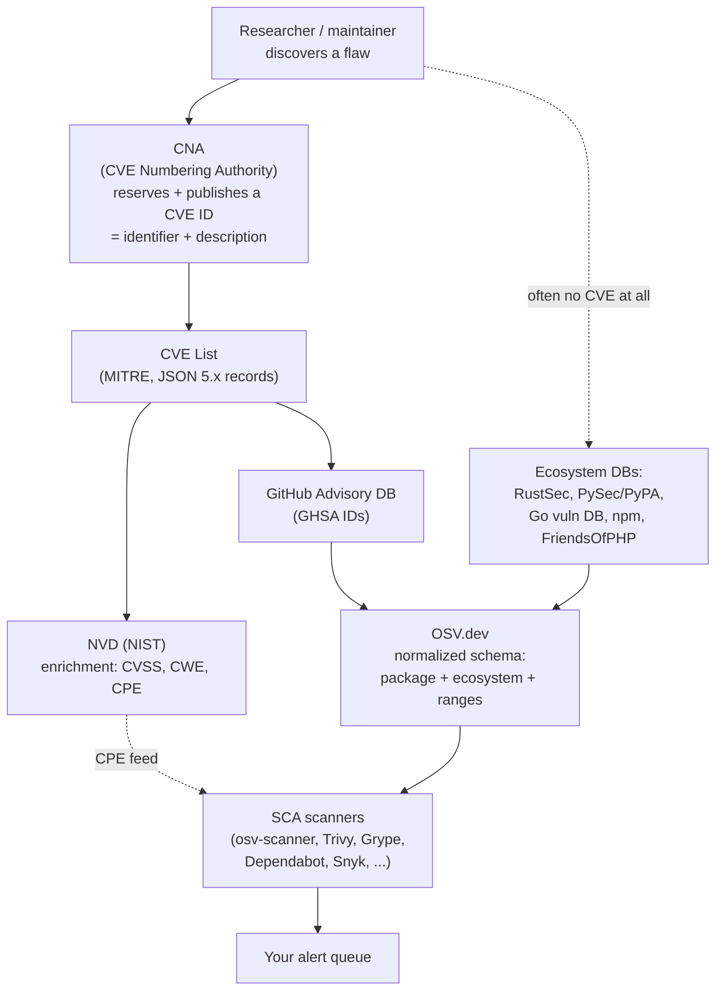
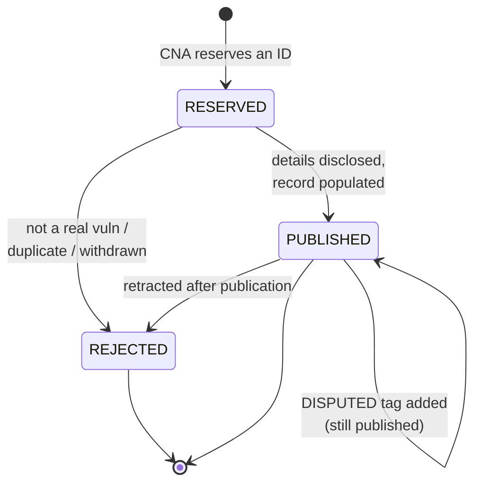
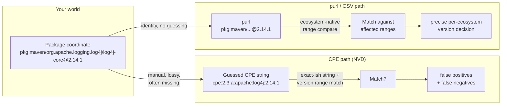
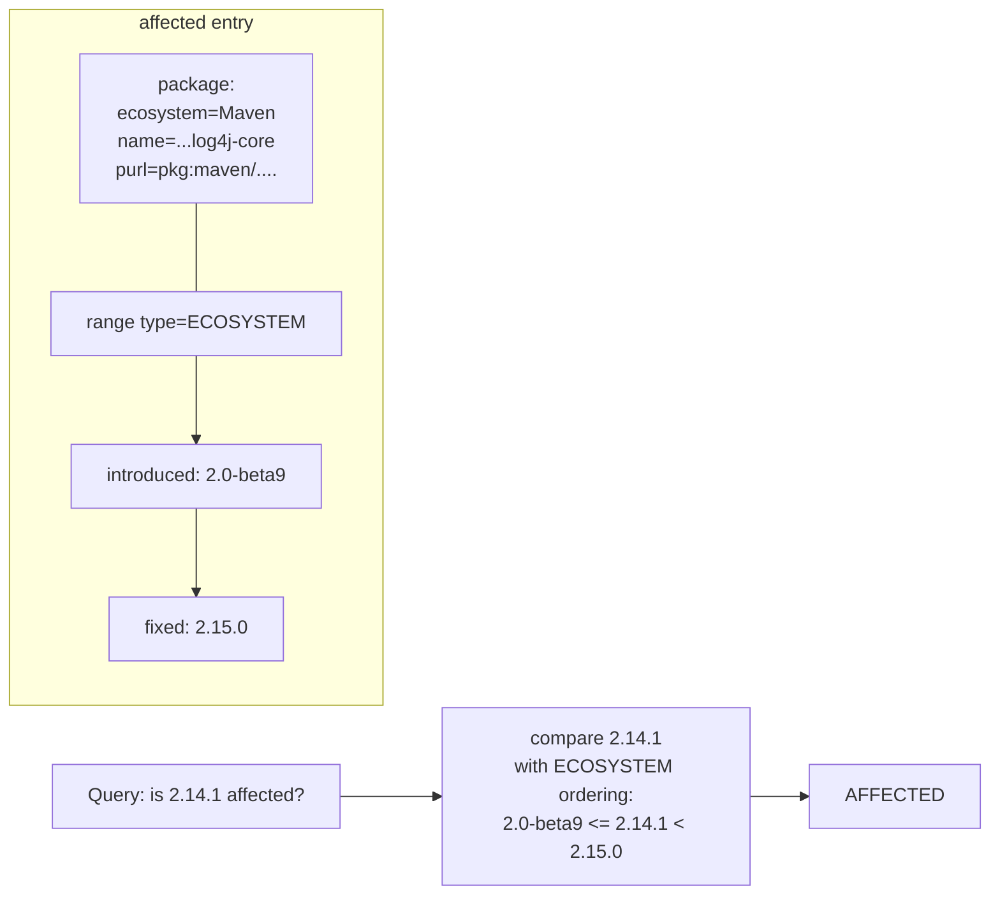
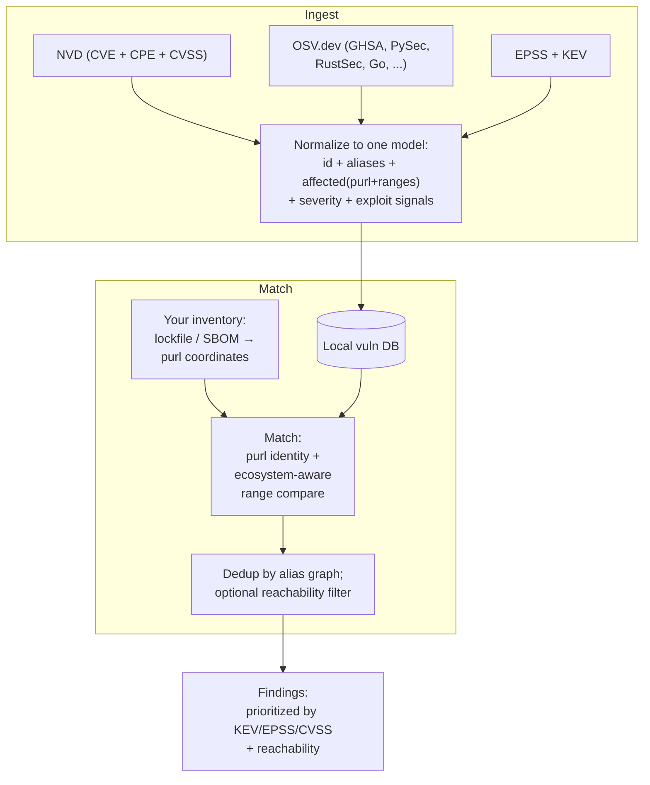

# Chapter 5 — Vulnerability Databases and Identifiers: CVE, NVD, OSV, GHSA

*What this chapter covers.* When your scanner tells you that `log4j-core:2.14.1` is
affected by CVE-2021-44228, a surprising amount of machinery stands behind that one
sentence. A researcher found the bug; a CVE Numbering Authority minted an identifier; NIST
attached a CVSS score and a product string; GitHub, Google, and half a dozen
language-specific projects each re-described the same vulnerability in their own schema; and
your scanner ingested some subset of those feeds and matched them against your dependency
graph. The differences between those descriptions are not cosmetic. They are the reason two
reputable scanners hand you two different vulnerability counts for the *identical* commit,
and the reason one of them flags a package you do not actually use. This chapter takes the
vulnerability-data ecosystem apart so you can build correct tooling on top of it, reconcile
the disagreements, and understand precisely why the coarse, product-centric world of CVE/NVD
is being displaced — for software dependencies — by the package-and-range world of OSV.

Learning goals — after this chapter you should be able to:

- Explain **what a CVE ID actually is** (an identifier plus a description — not a severity,
  not a fix, not a guarantee of accuracy), how the federated **CNA** model mints them, the
  CVE Record JSON 5.x format, and the reserved → published → rejected/disputed lifecycle.
- Describe the **known weaknesses of CVE** — assignment inconsistency, disputes, coverage
  gaps for open source — and account accurately, with appropriate hedging, for the
  2024 **NVD enrichment backlog** and the April 2025 **MITRE/CVE funding scare** and its
  resolution.
- Separate **CVE from NVD**: what NIST's enrichment layer adds (CVSS, CWE, CPE) and why
  **CPE matching** is structurally the wrong tool for mapping a Maven coordinate or npm
  package to a vulnerability — the root cause of a large class of false positives and
  negatives.
- Read a **CVSS v3.1 or v4.0** vector, say what the base score does and does not mean, and
  name the better prioritization inputs — **EPSS** and **CISA KEV** — that belong alongside
  it.
- Describe the **OSV schema** and osv.dev: vulnerabilities expressed against
  package + ecosystem + affected version ranges using purl-like coordinates and
  introduced/fixed events, and why this is dramatically better for dependency scanning than
  CPE.
- Situate **GHSA**, the GitHub Advisory Database, and the ecosystem-specific databases
  (RustSec, PySec/PyPA, the Go vuln DB, FriendsOfPHP, GitLab, Sonatype OSS Index) in the
  federation, and place **purl** as the universal package coordinate against CPE.
- Explain concretely **why two scanners disagree**, and design a single normalized
  vulnerability data model for a fleet.

A note on scope. This chapter is about the *data* — the identifiers, schemas, and databases,
and how a scanner consumes them. How a scanner is actually built and operated end to end is
Chapter 6 — Software Composition Analysis in Depth. Why a CVSS 9.8 on a dependency you ship
may still be unexploitable, and how to prioritize accordingly, is Chapter 7 — Reachability,
Exploitability, and Prioritization. How you record "not affected" decisions as machine-
readable VEX is Book 3, Chapter 6. This chapter gives you the vocabulary and the data model
those chapters assume.

## The shape of the ecosystem

Before the details, hold the whole flow in your head. A vulnerability travels from discovery
to your alert queue through a pipeline of independent organizations, each adding or
re-describing information, none of them fully authoritative over the others.



Three things about this picture matter more than any single box. First, **the identifier and
the severity are produced by different organizations** — MITRE's CNA network mints the CVE;
NIST's NVD scores it — and those steps can desynchronize, which is exactly what happened in
2024. Second, **a huge fraction of open-source vulnerabilities never enter through the CVE
door at all**; they are born in an ecosystem database (RustSec, the Go vuln DB) and may
acquire a CVE later, or never. Third, **OSV.dev is a normalizer, not an originator** — it
re-expresses everyone else's advisories in one schema keyed by package and version range.

## The CVE system

### What a CVE ID is — and what it is not

A **CVE ID** looks like `CVE-2021-44228`: the literal prefix `CVE`, a four-digit year, and a
sequence number. The year is the year the ID was *assigned or reserved*, not necessarily the
year the vulnerability was disclosed or the year the product shipped. The sequence number is
**at least four digits with no fixed upper bound** — a common misconception is that it is
exactly four or five digits. Since a 2014 syntax change the arbitrary-length form
(`CVE-2014-10000` and beyond) is valid, precisely so that a year can hold more than 9,999
CVEs. In 2024 the program issued well over 40,000 IDs, so the seven-digit form is now
routine.

Here is the load-bearing definition, and it is narrower than most engineers assume:

> **A CVE is a stable identifier plus a prose description of a specific vulnerability in a
> specific product. That is all it is.**

A CVE is *not* a severity score. It is *not* a CVSS vector. It is *not* a statement that a
fix exists, nor which versions are affected in any machine-readable form, nor a judgment that
the report is even correct. All of those things are added *later*, by *other* parties
(chiefly NVD and the ecosystem databases), or not at all. The CVE program's job is precisely
and only to guarantee that when two tools say "CVE-2021-44228," they mean the same flaw. That
deduplication guarantee — one identifier, one vulnerability, globally — is the entire point of
the system, and it is genuinely valuable. Confusing the identifier with the risk assessment
is the first and most common mistake in this domain.

### The MITRE program and the federated CNA model

The CVE Program is operated by **MITRE**, a US federally funded research and development
corporation, under sponsorship (and funding) from the **Cybersecurity and Infrastructure
Security Agency (CISA)**, part of the US Department of Homeland Security. But MITRE does not
assign most CVEs itself. Assignment is **federated** across a network of **CVE Numbering
Authorities (CNAs)** — organizations authorized to allocate CVE IDs within a defined scope.

There are several hundred CNAs (the number grows continually; it is well past 400). The scope
model is what makes federation work:

- **Vendor CNAs** cover their own products: Microsoft, Red Hat, Oracle, Google, Apple, Cisco,
  and so on assign CVEs for vulnerabilities in software they publish. GitHub is a CNA and
  assigns CVEs (and GHSAs) for advisories in its Advisory Database, including on behalf of
  open-source maintainers.
- **Open-source and third-party coordinator CNAs** cover projects that are not themselves
  vendors — for example curl, the Linux kernel (which became its own CNA in 2024), the Apache
  Software Foundation, and Python.
- **CNA-LRs (CNAs of Last Resort)** and **Top-Level Roots** sit above the leaf CNAs. MITRE is
  a root and a CNA-LR; CISA operates a root for industrial-control-system (ICS/OT) and
  medical-device coverage. When a vulnerability falls outside every leaf CNA's scope, the
  last-resort CNA handles it.

This federation is a classic distributed-systems trade-off. It **scales** — no central body
could triage tens of thousands of reports a year — and it puts assignment close to the parties
with the most product knowledge. But it **sacrifices consistency**: each CNA applies its own
judgment about what deserves a CVE, how to write the description, how to scope "one"
vulnerability versus several, and how quickly to publish. The result is exactly what you would
predict from any eventually-consistent system with hundreds of independent writers and no
strong schema enforcement: wide variance in quality and timeliness.

### The CVE Record format (JSON 5.x)

The modern CVE Record is a JSON document conforming to the **CVE JSON Record Format, schema
version 5.x** (5.0 introduced the current structure; 5.1 refined it). This replaced the older
4.0 format and is produced and consumed through **CVE Services**, the program's API for CNAs
to reserve and publish records. The whole CVE List is published as JSON on GitHub
(`CVEProject/cvelistV5`), which is where most downstream consumers now pull from.

The record separates a mandatory **CNA container** (authored by the assigning CNA) from
optional **ADP containers** (Authorized Data Publishers — parties allowed to enrich a record
without owning it; CISA's "Vulnrichment" program adds CVSS and CWE this way). A trimmed
record looks like this:

```json
{
  "cveMetadata": {
    "cveId": "CVE-2021-44228",
    "assignerShortName": "apache",
    "state": "PUBLISHED"
  },
  "containers": {
    "cna": {
      "affected": [
        {
          "vendor": "Apache Software Foundation",
          "product": "Apache Log4j2",
          "versions": [
            { "version": "2.0-beta9", "lessThan": "2.15.0",
              "status": "affected", "versionType": "maven" }
          ]
        }
      ],
      "descriptions": [
        { "lang": "en", "value": "JNDI features used in configuration ..." }
      ],
      "problemTypes": [ { "descriptions": [ { "cweId": "CWE-502" } ] } ]
    }
  }
}
```

Note the `affected` block. The 5.x schema *can* express version ranges (`versions` with
`lessThan`/`versionType`), and this is a real improvement over 4.0. But the field is optional,
loosely typed, and inconsistently populated by CNAs, and — crucially — it is *not* the data
NVD historically used for matching. NVD re-derives affected ranges into **CPE** applicability
statements, which is where the trouble begins (next section).

### The lifecycle: reserved → published → rejected/disputed

A CVE ID moves through a small state machine:



- **RESERVED**: an ID is allocated but details are embargoed or not yet filled in. During
  coordinated disclosure a CNA reserves the ID early so everyone can reference it, but the
  public record is a placeholder. Scanners will see the ID with essentially no data.
- **PUBLISHED**: the record has a description and affected-product information. This is the
  normal terminal state.
- **REJECTED**: the ID was withdrawn — a duplicate, a non-vulnerability, or an erroneous
  assignment. The ID is *never reused*; it stays rejected forever so dangling references do
  not silently rebind to a different flaw.
- **DISPUTED**: not a separate state but a tag on a published record indicating that a party
  (often the vendor) contests whether it is a real vulnerability. The record stays public and
  the dispute is noted. Disputed CVEs are a genuine operational headache: your scanner may
  flag one, and "the maintainer says this isn't a bug" is not something a version-range match
  can encode.

### The known weaknesses of CVE

The CVE system's weaknesses follow directly from its design, and you should build tooling that
expects them rather than trusting the data blindly.

**Assignment inconsistency.** Because hundreds of CNAs assign independently, the granularity of
"one CVE" varies wildly. Some CNAs mint one CVE per distinct code flaw; others bundle several
into one, or split one logical bug across several IDs. Description quality ranges from precise
to nearly useless ("a vulnerability in the product allows an attacker to do bad things"). None
of this is enforced by a machine-checkable schema.

**Disputed and low-quality CVEs.** A CVE is not a peer-reviewed claim. Anyone within a CNA's
scope can get one issued, and there is a recurring problem of CVEs filed for non-issues,
theoretical bugs in unmaintained projects, or as a form of pressure on maintainers. The curl
project's maintainer has publicly documented rejecting CVEs filed against curl that the
project considers invalid — a well-known example of the friction between the CVE process and
open-source maintainers who bear the reputational cost of a scary-sounding but bogus entry.

**Coverage gaps for open source.** This is the one that matters most for dependency scanning.
An enormous number of real, fixed vulnerabilities in open-source libraries **never get a CVE
at all**. A maintainer fixes a bug, notes it in a changelog or a GitHub advisory, and moves
on; no CNA is involved. The Go, Rust, and Python ecosystems in particular run their own
advisory databases precisely because the CVE process was too heavyweight and too slow to
capture the long tail of ecosystem vulnerabilities. If your scanner relies on CVE/NVD alone,
you are structurally blind to a large slice of open-source risk. This single fact is most of
the argument for OSV.

### The 2024–2025 turmoil, described carefully

Two related but distinct events shook this ecosystem, and both are frequently garbled. Here is
what is well established, stated at the level of certainty that is actually warranted.

**The 2024 NVD enrichment slowdown (a NVD problem, not a CVE problem).** Beginning around
**February 2024**, NIST's NVD **drastically slowed the rate at which it enriched newly
published CVEs** — that is, the rate at which it added CVSS scores, CWE mappings, and CPE
applicability data on top of the raw CVE records. CVE IDs kept being assigned and published by
MITRE and the CNAs; what stalled was NVD's *analysis* layer. NIST publicly attributed this to
a combination of factors — increased CVE volume, changes in interagency support, and a
transition in processes and tooling — and posted banners acknowledging a growing **backlog** of
unenriched CVEs. Through 2024 a large share of newly published CVEs sat without NVD-generated
CVSS/CPE data for extended periods. NIST engaged additional contractor support and set
targets to work down the backlog, and CISA's "Vulnrichment" ADP program began adding some of
the missing enrichment independently. The precise counts and completion dates shifted
repeatedly through 2024–2025; treat any specific "percent of CVEs unenriched" figure you see
as a snapshot, not a stable statistic. The durable lesson is structural: **any tool whose
matching depends on NVD's CPE data inherited a coverage hole in 2024**, and tools that could
fall back to OSV/GHSA/ecosystem data degraded far more gracefully.

**The April 2025 MITRE contract funding scare (a CVE-program problem).** In **April 2025**,
reporting — anchored by a leaked internal MITRE letter — indicated that MITRE's contract to
operate the CVE Program (funded through CISA) was set to **lapse on or about April 16, 2025**,
raising the prospect of an interruption in CVE assignment and publication. Within roughly a
day, **CISA acted to keep the program funded** — widely reported as exercising a contract
option / extension (on the order of eleven months) to avert an immediate lapse. Around the
same moment, a group of longtime CVE Board members announced the formation of the **CVE
Foundation**, a non-profit intended to provide a path to continuity and governance
independence for the program should US-government funding prove unreliable in future. As of
this writing the CVE Program continues to operate under CISA sponsorship, and the CVE
Foundation exists as an organization; the long-term governance model is unsettled. State it
that way and no further: there was a near-lapse, it was averted by a last-minute funding
extension, and an independent foundation was stood up in response. Do not claim the program
"moved" to the foundation or that funding is permanently secured — neither is established.

The two events share a theme worth internalizing: **the vulnerability data your fleet depends
on rests on a small amount of government-funded, single-point-of-failure infrastructure.** For
a distributed-systems engineer that is a familiar risk category — a critical upstream with no
redundancy — and a concrete reason to architect your tooling so it does not depend on any
*single* database.

## NVD: the enrichment layer

The **National Vulnerability Database**, run by **NIST** (part of the US Department of
Commerce, organizationally separate from MITRE and CISA), is best understood as a
value-adding *layer on top of the CVE List*, not a competing list. NVD ingests every published
CVE and attaches:

- a **CVSS** base score and vector (see below),
- one or more **CWE** identifiers — the *class* of weakness, from MITRE's Common Weakness
  Enumeration (e.g., CWE-79 cross-site scripting, CWE-502 unsafe deserialization),
- **CPE** applicability statements — the machine-readable answer to "which products and
  versions does this affect," and
- curated reference links.

The CVSS and CWE additions are genuinely useful. The **CPE** part is where NVD's data model
actively fights against the needs of software-dependency scanning, and it is worth
understanding exactly why.

### CPE and why it is the wrong key for dependencies

**CPE (Common Platform Enumeration)** is a structured naming scheme for IT products. A CPE 2.3
name is a colon-delimited string:

```
cpe:2.3:a:apache:log4j:2.14.1:*:*:*:*:*:*:*
       │  │      │     │
       │  │      │     └── version
       │  │      └──────── product
       │  └─────────────── vendor
       └────────────────── part (a=application, o=OS, h=hardware)
```

NVD expresses "affected" as CPE **match ranges** — an applicability statement pairing a CPE
with bounds like `versionStartIncluding: 2.0` and `versionEndExcluding: 2.15.0`. On its face
that is reasonable. The problem is that **CPE was designed to name products in an enterprise
asset inventory — installed operating systems, appliances, commercial applications — not to
name a package coordinate in a language ecosystem.** For software dependencies this mismatch is
fundamental, not incidental:

1. **There is no authoritative, timely mapping from a package coordinate to a CPE.** A Maven
   coordinate is `groupId:artifactId:version` — say `org.apache.logging.log4j:log4j-core:2.14.1`.
   An npm package is a name and a semver. A Go module is a URL-like path. *None* of these has a
   canonical CPE. Someone — historically an NVD analyst — has to *decide* that
   `log4j-core` maps to `cpe:2.3:a:apache:log4j:...`. That decision is manual, lossy, and
   often wrong or missing. When NVD's analysts stopped enriching in 2024, this mapping simply
   was not produced for new CVEs.

2. **The vendor/product string is ambiguous and unstable.** Is it vendor `apache` product
   `log4j`, or `apache` `log4j2`, or `apache_software_foundation` `apache_log4j`? Different CVEs
   for the same library have used different CPE strings over time. A matcher that keys on the
   exact string misses the variants; a matcher that fuzzy-matches over-fires.

3. **One package name, many CPEs; one CPE, many packages.** A single npm name can correspond
   to several CPE products (forks, renames), and a single CPE product name can be shared by
   unrelated packages across ecosystems. CPE has no notion of *ecosystem*, so `struts` the
   Java framework and an unrelated `struts` elsewhere are not cleanly separable.

The practical consequence is a well-known failure mode. A scanner that matches your SBOM
against NVD by guessing CPEs produces **false positives** (a CPE collision matches an unrelated
product, or a range nominally covers a version whose real fix your build already includes) and
**false negatives** (no CPE was ever assigned, or the CPE string your scanner guessed does not
match the one NVD recorded, so the match silently never happens). Neither error is a bug in the
scanner; both are the direct result of forcing package-manager coordinates through a
product-inventory naming scheme. This is the single most important structural fact in the
chapter, and the problem OSV exists to solve.

Here is the mismatch drawn out:



### The downstream impact of the 2024 backlog

Because so many scanners were built to consume NVD's CPE feed as a primary source, the 2024
enrichment slowdown propagated directly into their output: newly published CVEs arrived
without CPE data, so CPE-based matchers could not place them against any product, and those
CVEs effectively went dark for those tools until enrichment caught up. Tools that already
consumed OSV/GHSA — which carry their own affected-range data independent of NVD — were far
less affected. If you took one operational lesson from 2024, it should be: **do not make
NVD/CPE the sole or primary matching source for dependency scanning.** We now turn to scoring,
then to the better data model.

## CVSS: scoring, and what a score does not tell you

The **Common Vulnerability Scoring System (CVSS)**, maintained by **FIRST.org** (the Forum of
Incident Response and Security Teams), turns the qualitative properties of a vulnerability into
a 0.0–10.0 number and an accompanying **vector string**. You will meet two versions in the
wild today: **v3.1** (2019, still overwhelmingly the most common in NVD) and **v4.0**
(released November 2023, adopted gradually).

### Structure: base, and the optional metric groups

CVSS scores are built from metric groups. In v3.1:

- **Base metrics** — intrinsic, unchanging properties. Exploitability sub-metrics: **Attack
  Vector** (Network/Adjacent/Local/Physical), **Attack Complexity**, **Privileges Required**,
  **User Interaction**; plus **Scope** (does the flaw let you break out of the vulnerable
  component's security authority?) and the impact triad **Confidentiality / Integrity /
  Availability**. The base score is what NVD publishes and what almost everyone quotes.
- **Temporal metrics** — change over time: exploit-code maturity, remediation level, report
  confidence.
- **Environmental metrics** — the *consumer's* re-scoring for their own deployment (e.g.,
  raising or lowering impact based on how you actually run the component).

A v3.1 vector string is a compact encoding of the base metrics:

```
CVSS:3.1/AV:N/AC:L/PR:N/UI:N/S:C/C:H/I:H/A:H   →  base score 10.0
```

Read it directly: Attack Vector Network, Attack Complexity Low, no Privileges Required, no
User Interaction, Scope Changed, High impact to Confidentiality/Integrity/Availability — the
worst case, which is roughly the Log4Shell profile.

**CVSS v4.0** reworks this. The headline changes:

- The old *Temporal* group is renamed and refocused as **Threat** metrics, and v4.0 introduces
  a nomenclature for *which groups you actually scored*: **CVSS-B** (base only), **CVSS-BT**
  (base + threat), **CVSS-BE** (base + environmental), **CVSS-BTE** (all three). This is an
  explicit acknowledgement that a bare base score is an incomplete picture — the naming forces
  you to say so.
- **Scope** is removed and replaced by splitting impact into the **Vulnerable System**
  (`VC/VI/VA`) and the **Subsequent System** (`SC/SI/SA`), which captures downstream blast
  radius more granularly than the binary Scope flag did.
- **User Interaction** gains a Passive/Active distinction; a new **Attack Requirements (AT)**
  metric captures preconditions that Attack Complexity conflated.
- A group of **Supplemental** metrics (Automatable, Recovery, Safety, etc.) provides context
  that does not change the number.

A v4.0 vector is correspondingly longer, e.g.
`CVSS:4.0/AV:N/AC:L/AT:N/PR:N/UI:N/VC:H/VI:H/VA:H/SC:N/SI:N/SA:N`.

### What a CVSS score does and does not mean

CVSS measures **technical severity in the abstract** — how bad the flaw is *if* an attacker can
reach and trigger it. It deliberately says nothing about several things that dominate your
actual risk:

- **Reachability.** CVSS does not know whether the vulnerable code path is even reachable in
  your application. A CVSS 9.8 in a function your code never calls is, to you, close to
  harmless. Determining this is the subject of Chapter 7.
- **Exploitation in practice.** The base score does not encode whether an exploit exists, is
  public, or is being used. Two 9.8s — one with a weaponized exploit in every botnet, one
  purely theoretical — are indistinguishable by base score.
- **Your environment.** Whether the component is internet-facing, behind three layers of
  authentication, or running with the network capability the exploit needs — none of that is in
  the base metrics. (It is what *environmental* metrics are *for*, but almost nobody computes
  them, and NVD cannot: it does not know your deployment.)

The failure mode this produces at fleet scale is **alert fatigue**. If you sort your fleet's
findings by CVSS base score and start at 10.0, you will spend your first week on
vulnerabilities that may be entirely unreachable in your services, while a genuinely exploited
7.5 in an internet-facing edge service waits behind them. **CVSS 9.8 is a starting point, not
a verdict.** Two additional feeds do much more to tell you where to actually look:

- **EPSS (Exploit Prediction Scoring System)**, also a FIRST.org effort, publishes for (nearly)
  every CVE a **probability, 0 to 1, that the vulnerability will be exploited in the wild in
  the next 30 days**, plus a percentile. It is a data-driven model retrained regularly on
  observed exploitation. EPSS is explicitly a *likelihood* signal, orthogonal to CVSS's
  *severity* signal — the two are meant to be used together (high severity *and* high
  probability is where you start).
- **CISA KEV (Known Exploited Vulnerabilities) catalog** is a curated list of CVEs for which
  CISA has **confirmed evidence of active exploitation**. It was established in November 2021
  under Binding Operational Directive 22-01 (which mandates remediation timelines for US
  federal agencies). KEV is small, high-precision, and about as close to "drop everything" as
  a public feed gets: if a CVE affecting your fleet is on KEV, its theoretical CVSS is beside
  the point — it is being used *right now*.

A defensible fleet prioritization uses all three: **KEV membership** (is it being exploited?),
**EPSS** (how likely is exploitation?), and **CVSS** (how bad if exploited?), gated by
**reachability** (can it be triggered in *my* code — Chapter 7). Raw CVSS alone is the weakest
of these to lead with.

## OSV: vulnerabilities as package + range

Everything above shares one original sin for dependency work: it was designed around
*products*, and it bolts version information on awkwardly. **OSV (Open Source
Vulnerabilities)**, initiated by Google, starts from the opposite premise — the unit of a
vulnerability is a **package in a specific ecosystem, affected over specific version ranges** —
and this single design choice removes most of the pain.

### The OSV schema

OSV is two things: an **open schema** (the "OSV Schema," a documented JSON format anyone can
produce and consume) and **osv.dev** (Google's aggregating database and API that speaks it).
The schema's core is the `affected` array. Each entry names a package by **ecosystem + name**
(and, increasingly, a **purl**), and describes affected versions two ways: an explicit
enumerated `versions` list and/or `ranges` built from **events**.

```json
{
  "id": "GHSA-jfh8-c2jp-5v3q",
  "aliases": ["CVE-2021-44228"],
  "affected": [
    {
      "package": {
        "ecosystem": "Maven",
        "name": "org.apache.logging.log4j:log4j-core",
        "purl": "pkg:maven/org.apache.logging.log4j/log4j-core"
      },
      "ranges": [
        {
          "type": "ECOSYSTEM",
          "events": [
            { "introduced": "2.0-beta9" },
            { "fixed": "2.15.0" }
          ]
        }
      ]
    }
  ],
  "references": [ { "type": "ADVISORY", "url": "https://..." } ]
}
```

The `events` model is the elegant part. A range is an ordered list of events along a version
timeline: `introduced` marks where the vulnerability begins, `fixed` (or `last_affected`, or a
`limit`) marks where it ends. Multiple `introduced`/`fixed` pairs in one range express a
vulnerability that was fixed, regressed, and fixed again. The `type` field says *how to compare
versions*: `SEMVER` for ecosystems with true semver, `ECOSYSTEM` for ecosystem-specific version
ordering (Maven's, PyPI's PEP 440, etc.), or `GIT` for commit-range ordering by walking the
graph. That last one matters: OSV can express "affected between these two *commits*," which is
exactly what you need for Go modules, C/C++ projects vendored by hash, and anything without
clean release versions.



### Why this is dramatically better for scanning

Contrast the OSV query with the CPE query. To decide whether *your* `log4j-core:2.14.1` is
affected, an OSV-based scanner does something you can verify by hand: take the package's
**identity** — no guessing, because a Maven coordinate *is* the OSV package name and maps
directly to a purl — and compare `2.14.1` against the affected ranges using that ecosystem's
own version-ordering rules. There is no lossy product-string mapping, no analyst in the loop,
no ambiguity about *which* `log4j` this is. The ecosystem is part of the key, so
cross-ecosystem name collisions cannot occur. And because the affected ranges are authored by
people who know the package (frequently the maintainers themselves, via GHSA or an ecosystem
DB), they are far more likely to be correct and complete than a re-derived CPE range.

The other half of OSV's value is **aggregation**. osv.dev ingests and normalizes a long list
of source databases into the one schema and exposes them through a single API and bulk export:
GitHub's GHSA, PyPA/PySec (Python), RustSec (Rust), the Go vulnerability database, npm data,
the Global Security Database, OSS-Fuzz-discovered bugs, Debian, Alpine, and more. Each source
keeps its native identifier; OSV ties them together via the `aliases` field (so a GHSA and its
CVE and a RUSTSEC ID all cross-reference). One query against osv.dev therefore consults the
union of these databases — including the enormous open-source long tail that never got a CVE.

The reference tool is **`osv-scanner`** (Go), which reads your lockfiles and SBOMs, extracts
package coordinates, and queries the OSV data. A typical run:

```bash
$ osv-scanner scan --lockfile package-lock.json
╭─────────────────────────────────────┬──────┬───────────┬─────────┬──────────╮
│ OSV URL                             │ ECO. │ PACKAGE   │ VERSION │ FIXED     │
├─────────────────────────────────────┼──────┼───────────┼─────────┼──────────┤
│ https://osv.dev/GHSA-....           │ npm  │ minimist  │ 1.2.5   │ 1.2.6    │
╰─────────────────────────────────────┴──────┴───────────┴─────────┴──────────╯
```

The scanner never touches CPE. It matches on ecosystem-native coordinates and version ranges,
which is why, for pure dependency scanning, OSV-based tooling generally produces cleaner
results than CPE-based tooling.

## GHSA and the ecosystem databases

OSV is a federation, so it is worth knowing the members whose data it carries — because their
editorial policies, identifier schemes, and precision differ, and those differences leak into
your results.

### GitHub Security Advisories (GHSA)

**GitHub Security Advisories** carry IDs of the form `GHSA-xxxx-xxxx-xxxx` (three groups of
four characters from a restricted base32 alphabet — deliberately *not* year-based, so they
carry no coverage-year semantics). The **GitHub Advisory Database** is the curated collection
of these, spanning the ecosystems GitHub's dependency graph understands (npm, PyPI, Maven,
NuGet, RubyGems, Go, Rust, Composer, Pub, Actions, and more). GitHub is itself a **CNA**, so it
can mint a CVE for an advisory; a typical GHSA record therefore carries **both** a GHSA ID and
a CVE ID in its aliases, and stores affected data as package + version ranges (it publishes the
whole database in OSV format). GHSA is the data source behind **Dependabot** alerts: when
Dependabot tells you a dependency is vulnerable, it is matching your dependency graph against
the GitHub Advisory Database.

The GHSA↔CVE relationship is many-faceted: a GHSA may have a CVE (assigned by GitHub or by
another CNA), may predate its CVE, or may exist without one (for advisories where no CVE was
requested). Treat GHSA and CVE as **cross-referenced aliases for the same underlying flaw**,
not as a strict one-to-one mapping — the `aliases` graph in OSV is what stitches them together.

### The ecosystem-specific databases

Several language communities run their own advisory databases, and these are frequently the
*origin* of an advisory that only later (if ever) acquires a CVE:

- **RustSec** (`RUSTSEC-YYYY-NNNN`) — the Rust advisory database in the `rustsec/advisory-db`
  repo, consumed by `cargo audit` and `cargo deny`. Community-run, high quality, covers crates
  from crates.io.
- **PyPA Advisory Database / PySec** (`PYSEC-YYYY-NNN`) — the Python Packaging Authority's
  advisory database, published in OSV format, the canonical machine-readable source for PyPI
  vulnerabilities (`pip-audit` uses it).
- **Go vulnerability database** (`vuln.go.dev`, IDs `GO-YYYY-NNNN`) — curated by the Go team,
  and notable for feeding **`govulncheck`**, which does something almost unique among scanners:
  **symbol-level reachability**. Instead of only asking "is a vulnerable *version* present,"
  govulncheck uses the Go database's record of *which functions* are vulnerable plus static
  call-graph analysis to ask "does your code actually *call* the vulnerable symbol?" That
  collapses a large fraction of false positives before they are ever reported — a preview of
  Chapter 7's theme, built into the ecosystem's own tooling.
- **npm advisories** — historically `npm audit`'s own database, now sourced from the GitHub
  Advisory Database.
- **FriendsOfPHP `security-advisories`** — the YAML advisory database behind Composer/Symfony
  security checks for PHP packages.
- **GitLab Advisory Database** — GitLab's curated database powering its dependency scanning
  (a mix of community and proprietary tiers).
- **Sonatype OSS Index** — a free API and database (the lighter, public cousin of Sonatype's
  commercial data) queried by several build-time plugins.

The important synthesis: **OSV federates most of these into one schema and one API**, keyed by
package + ecosystem + range, with `aliases` tying every identifier for a flaw together. That is
what lets a modern scanner consult the union of CVE-derived data *and* the CVE-less
ecosystem long tail in a single, consistent query.

### purl vs CPE: the universal coordinate

Underlying OSV's clean matching is **purl (Package URL)**, a compact, ecosystem-aware syntax
for naming exactly one package:

```
pkg:maven/org.apache.logging.log4j/log4j-core@2.14.1
pkg:npm/minimist@1.2.5
pkg:pypi/requests@2.19.1
pkg:golang/github.com/gin-gonic/gin@v1.6.0
pkg:cargo/tokio@1.0.0
```

The grammar is `pkg:type/namespace/name@version?qualifiers#subpath`. The **type** *is* the
ecosystem (`maven`, `npm`, `pypi`, `golang`, `cargo`, `gem`, `nuget`, `deb`, ...), which is
exactly the dimension CPE lacks. A purl is *derivable* from a package manager coordinate
mechanically, with no analyst and no guessing — which is the whole point. purl is also the
package-identity backbone of the **CycloneDX** and **SPDX** SBOM formats (Book 3), so the same
coordinate that names a component in your SBOM inventory is the key you match against OSV. CPE
and purl are not competitors so much as tools for different jobs: **CPE for coarse product/OS
asset inventory, purl for precise package-dependency identity.** For everything in this book,
purl is the coordinate you want.

## Making sense of it: why two scanners disagree

You can now answer the question that opened the chapter concretely. Point two reputable
scanners at the identical repository and they hand you different findings for at least these
reasons, usually several at once:

1. **Different source databases.** One scanner leads with NVD/CPE; another leads with OSV
   (GHSA + ecosystem DBs). During and after the 2024 NVD backlog these diverged sharply: a
   CVE with no NVD CPE data is *invisible* to the CPE-first tool but present in the OSV-first
   tool via GHSA.
2. **CPE-vs-purl matching.** The CPE-based matcher may guess a CPE that does not match NVD's
   recorded string (false negative) or collide with an unrelated product (false positive),
   while the purl-based matcher compares exact ecosystem coordinates.
3. **Version-range interpretation.** Even given the "same" range, ecosystems order versions
   differently. Is `1.2.0-rc1` before or after `1.2.0`? Does a Python epoch or a Maven
   qualifier change ordering? A scanner using generic semver on a PEP 440 or Maven version can
   land on the wrong side of a boundary. OSV's per-`type` comparison exists precisely to make
   this deterministic; a tool that does not honor it will disagree at range edges.
4. **Reachability.** `govulncheck` reports only vulnerabilities whose vulnerable *symbol* your
   code can reach; a version-only scanner reports every vulnerable version present. Same repo,
   very different counts — and the smaller list is often the more useful one (Chapter 7).
5. **Deduplication and aliasing.** One tool collapses a GHSA and its CVE into a single finding
   via `aliases`; another lists them separately, inflating the count for the same flaw.

### A concrete worked comparison: CVE/CPE vs OSV/purl

Take Log4Shell against your `log4j-core:2.14.1`.

**As a CVE consumed via NVD/CPE**, the scanner must (a) decide that your Maven coordinate
`org.apache.logging.log4j:log4j-core` corresponds to some CPE — say
`cpe:2.3:a:apache:log4j:*` — a mapping that is external, manual, and was *not being freshly
produced during the 2024 backlog*; then (b) check `2.14.1` against the CPE match range
`versionStartIncluding 2.0-beta9 / versionEndExcluding 2.15.0`. If the CPE string it guessed
differs from NVD's, the match silently fails. If NVD had not yet enriched the CVE, there is no
range to check at all.

**As the same flaw consumed via OSV** (`GHSA-jfh8-c2jp-5v3q`, alias `CVE-2021-44228`), the
scanner takes your coordinate directly as
`pkg:maven/org.apache.logging.log4j/log4j-core@2.14.1`, finds the `affected` entry keyed on
that exact Maven package, and compares `2.14.1` against `introduced 2.0-beta9 / fixed 2.15.0`
using Maven's own version ordering. No string guessing, no analyst, no dependence on NVD
enrichment. It matches, correctly, every time.

Same vulnerability, same version of your code, two data models — and only one of them is robust
to a real-world operating failure of the upstream (the NVD backlog). That is the argument for
OSV/purl in one example.

### How a scanner turns feeds into findings

Every SCA scanner, under the branding, runs the same pipeline. Understanding it tells you which
knobs actually matter.



The identifier plumbing you have to get right is concentrated in two places. In **normalize**,
you must build the *alias graph* correctly — collapsing CVE, GHSA, RUSTSEC, GO-*, and PYSEC
identifiers that refer to one flaw into one logical vulnerability — or you will double-count and
your severity/exploit signals will attach to the wrong node. In **match**, you must extract
correct purls from lockfiles (each ecosystem has its own coordinate quirks) and honor
per-ecosystem version ordering, or you will misfire at range boundaries. Everything else is
tuning. Chapter 6 builds this pipeline in full.

### The database and identifier landscape at a glance

| System | Owner / operator | Unit of identification | Version model | Strengths | Weaknesses |
|---|---|---|---|---|---|
| **CVE** | MITRE (CISA-funded), federated CNAs | Global vuln ID + prose description | None (identifier only; 5.x has optional `affected`) | Universal, stable, deduplicating identifier | Not a severity/fix; inconsistent, disputes, big OSS coverage gaps |
| **NVD** | NIST | Enriches CVEs with CVSS, CWE, **CPE** | CPE match ranges (`versionStart/End…`) | CVSS + CWE; historically canonical enrichment | **CPE ≠ package**; lossy manual mapping; 2024 backlog |
| **CPE** | NIST (naming scheme) | Product string (`cpe:2.3:a:vendor:product:…`) | Version bounds on a product | Fine for OS/appliance asset inventory | No ecosystem; ambiguous; wrong tool for dependencies |
| **CVSS** | FIRST.org | Severity of a flaw (0–10 + vector) | n/a | Common severity language; v4.0 more expressive | Base ≠ risk; no reachability/exploitation/env |
| **EPSS** | FIRST.org | Exploit *probability* per CVE (0–1) | n/a | Data-driven likelihood signal | Predictive, not certainty; per-CVE not per-deployment |
| **KEV** | CISA | CVEs with confirmed active exploitation | n/a | High-precision "exploited now" list | Small; lagging; US-gov scoped |
| **OSV** | Google (schema) + osv.dev | **Package + ecosystem + ranges** | events (introduced/fixed), SEMVER/ECOSYSTEM/GIT | Precise, ecosystem-native, aggregates many DBs, purl-keyed | Depends on upstream advisory quality; younger |
| **GHSA** | GitHub | GHSA ID (+ CVE alias), per ecosystem | package + version ranges (OSV format) | Broad coverage, powers Dependabot, maintainer-authored | GitHub-curated editorial scope |
| **Ecosystem DBs** (RustSec, PySec, Go, …) | Each community | Ecosystem-native ID + package | package + ranges (often OSV) | Deep, timely, CVE-less long tail; Go adds symbol precision | Fragmented; per-ecosystem tooling |
| **purl** | package-url spec | Exactly one package (`pkg:type/ns/name@ver`) | n/a (identity) | Ecosystem-aware, mechanical, SBOM-native | Identity only, not a vuln record |

## Distributed-systems lens

At the scale this book assumes — hundreds of services, dozens of teams, many languages, many
deploys a day — the vulnerability-data problem stops being "look up a CVE" and becomes "operate
a correlation system." A few principles follow directly from everything above.

**Normalize to one internal model, and favor OSV/purl over CVE/CPE as its spine.** Do not let
each scanner's native output be your source of truth; ingest the feeds yourself (NVD for CVSS,
OSV for affected-ranges and the OSS long tail, EPSS and KEV for prioritization) and normalize
to a single record: a stable internal vuln ID, an **alias set** (CVE + GHSA + ecosystem IDs),
`affected` expressed as **purl + ecosystem-aware ranges**, plus severity and exploit signals.
Keying on purl means the *same* coordinate that identifies a component in your SBOM inventory
(Book 3) is the key you match against — no CPE guessing in the hot path. This is also your
insurance against upstream single-points-of-failure: a normalized model that can be fed from
OSV/GHSA/ecosystem data degrades gracefully when NVD stalls, as it did through 2024.

**Correlate against a central SBOM inventory, not against repositories one at a time.** The
right architecture is a service that continuously ingests SBOMs from every build (Book 3) into
an inventory of "which purl, at which version, is deployed where," and re-evaluates that
inventory against the normalized vuln feed as *new advisories arrive* — not only at build time.
When the next Log4Shell drops at 2 a.m., the question "which of our services ship an affected
version" must be a database query against known inventory, answerable in seconds, not a
fleet-wide rescan. This inverts the usual scanner model (scan a repo, get findings) into a
fleet model (maintain inventory, match incoming advisories), which is the only version that
scales to hundreds of services and gives you incident-response speed.

**Treat the false-positive rate as a first-class cost.** Across hundreds of services, a scanner
that over-reports does not just annoy — it *destroys the signal*. If every service carries fifty
"critical" findings and the true exploitable set is three, teams learn to ignore the queue, and
the next real KEV entry drowns. This is the economic argument, at fleet scale, for everything
in the next chapters: **reachability analysis** (Chapter 7) to filter the vulnerable-but-
unreachable, per-ecosystem symbol-level tools like `govulncheck` where available, and
**VEX** (Book 3, Chapter 6) to record, once and machine-readably, "we assessed CVE-X in
service-Y and it is not affected because the vulnerable code path is unreachable" — so that
assessment suppresses the finding fleet-wide instead of being re-litigated in every team's
backlog. Prioritize with **KEV then EPSS then CVSS, gated by reachability**, not with a raw
CVSS sort.

**Accept that the upstream data is imperfect infrastructure and design for it.** The 2024–2025
turmoil is not an aberration to wait out; it demonstrates that this data rests on thin,
government-funded plumbing with real failure modes. Build so that no *single* database is
load-bearing, cache the feeds locally (do not query osv.dev or NVD synchronously in your build
critical path), and record provenance on every finding — *which* database and *which* record
produced it — so that when a source is disputed, withdrawn, or wrong, you can re-evaluate every
finding it caused. Ordinary distributed-systems hygiene, applied to vulnerability data:
redundant sources, local caches, provenance.

## Key takeaways

- **A CVE is an identifier plus a description — nothing more.** Severity, affected ranges, and
  exploit status are added later by other parties (NVD, OSV, ecosystem DBs) or not at all.
  Confusing the identifier with the risk assessment is the root error in this domain.
- **CVE assignment is federated across hundreds of CNAs**, which scales but sacrifices
  consistency; and a large fraction of real open-source vulnerabilities **never receive a CVE**,
  so CVE/NVD-only tooling is structurally blind to the OSS long tail.
- **NVD is an enrichment layer, and its CPE matching is the wrong tool for dependencies.** CPE
  names products, not package coordinates; the coordinate→CPE mapping is manual, lossy, and
  ambiguous — the direct cause of a large class of false positives and negatives.
- **The 2024 NVD enrichment backlog and the April 2025 MITRE/CVE funding scare** are real and
  consequential, but must be stated carefully: NVD slowed CVSS/CPE enrichment starting around
  February 2024; a near-lapse of MITRE's CVE contract around April 16, 2025 was averted by a
  last-minute CISA funding extension, and the independent CVE Foundation was formed. The
  long-term governance model remains unsettled — do not overclaim.
- **CVSS measures abstract severity, not your risk.** A base score encodes no reachability, no
  exploitation-in-practice, and no environment. Lead prioritization with **KEV** (exploited
  now) and **EPSS** (exploit probability), use CVSS as the severity axis, and gate on
  **reachability** (Chapter 7). CVSS 9.8 is a starting point, not a verdict.
- **OSV's key insight — vulnerabilities as package + ecosystem + version ranges (purl-keyed),
  not product strings — is what makes dependency scanning precise.** It removes the lossy CPE
  mapping, encodes ecosystem-aware version ordering, and aggregates GHSA and the ecosystem
  databases (RustSec, PySec, Go, …) into one queryable schema including the CVE-less long tail.
- **Two scanners disagree because of different databases, CPE-vs-purl matching, version-range
  interpretation, reachability, and alias deduplication** — usually several at once. Building a
  single normalized model keyed on **purl**, with a correct alias graph, is what makes fleet
  results reconcilable.
- **At fleet scale, maintain a central SBOM inventory and match incoming advisories against
  it**, favor OSV/purl over CVE/CPE, treat the false-positive rate as a real cost that
  motivates reachability and VEX, and design for the upstream data being imperfect,
  single-point-of-failure infrastructure.

## Further reading

- The CVE Program — official site, CNA rules, and program documentation
  (https://www.cve.org/).
- CVE JSON Record Format, schema 5.x, and the published CVE List
  (https://github.com/CVEProject/cvelistV5 and https://github.com/CVEProject/cve-schema).
- NVD — the National Vulnerability Database, and NIST's public statements on the enrichment
  status (https://nvd.nist.gov/).
- CISA "Vulnrichment" — the ADP enrichment program
  (https://github.com/cisagov/vulnrichment).
- The CVE Foundation announcement (April 2025) and contemporaneous reporting on the MITRE
  contract funding extension — read several sources and note the hedging in this chapter
  (https://www.thecvefoundation.org/).
- CVSS v3.1 specification, and CVSS v4.0 specification and user guide, FIRST.org
  (https://www.first.org/cvss/v3.1/specification-document and
  https://www.first.org/cvss/v4.0/specification-document).
- EPSS — the Exploit Prediction Scoring System model and data, FIRST.org
  (https://www.first.org/epss/).
- CISA Known Exploited Vulnerabilities Catalog and BOD 22-01
  (https://www.cisa.gov/known-exploited-vulnerabilities-catalog).
- The OSV Schema specification and osv.dev documentation
  (https://ossf.github.io/osv-schema/ and https://osv.dev/).
- osv-scanner — the reference OSV scanner
  (https://github.com/google/osv-scanner).
- The GitHub Advisory Database and GHSA documentation
  (https://github.com/advisories and https://docs.github.com/en/code-security).
- Package URL (purl) specification (https://github.com/package-url/purl-spec).
- Ecosystem databases: RustSec advisory-db (https://rustsec.org/), the PyPA Advisory Database
  (https://github.com/pypa/advisory-database), and the Go vulnerability database with
  govulncheck (https://go.dev/security/vuln/).
- Common Weakness Enumeration (CWE), MITRE (https://cwe.mitre.org/).
