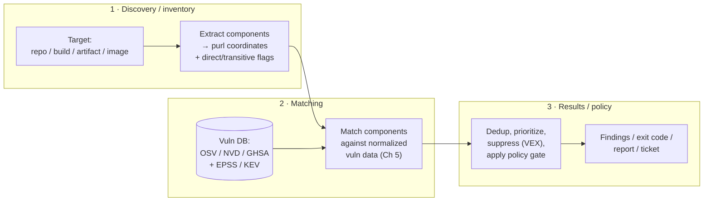
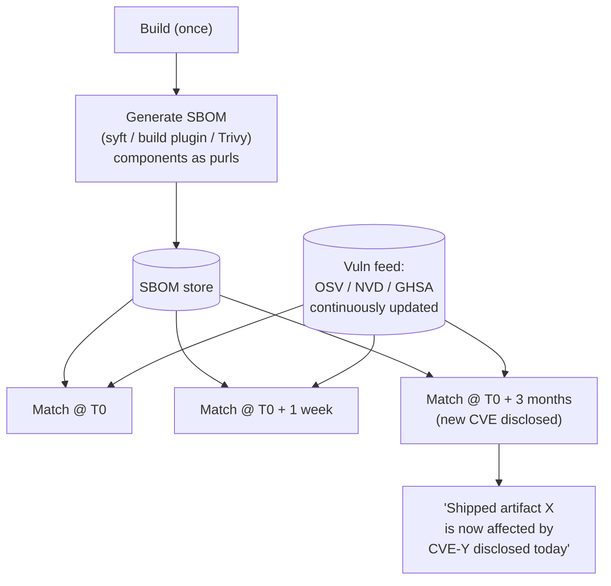
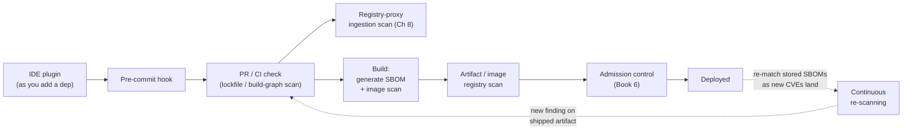
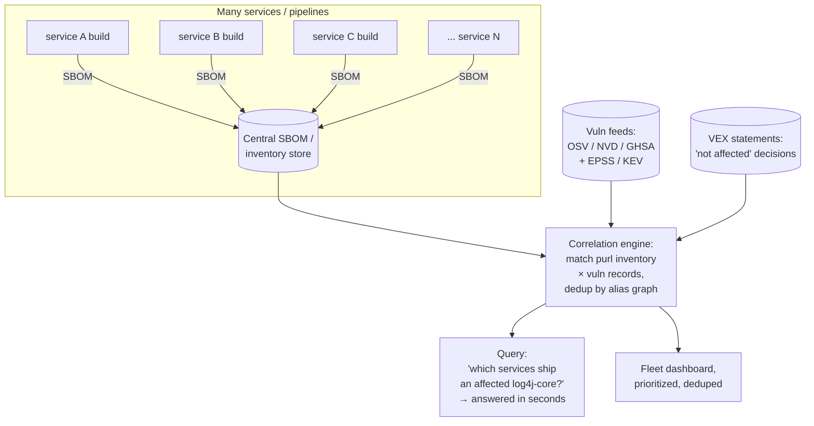

# Chapter 6 — Software Composition Analysis in Depth

*What this chapter covers.* Chapter 5 gave you the vulnerability *data* — the identifiers,
the schemas, the databases, and why CPE and purl produce different answers. This chapter is
about the machine that consumes that data: **Software Composition Analysis (SCA)**, the
practice of discovering which open-source components your software contains and matching them
against known vulnerabilities. On paper this is a lookup. In practice it is three hard
problems stacked on top of each other — *what components are actually here*, *which of them
are actually vulnerable*, and *what do we do about the thousands of findings that produces
across a fleet* — and every one of them leaks false positives and false negatives. We take
the pipeline apart stage by stage, survey the tool landscape honestly (open source and
commercial, by capability category rather than by brand), map where scanning belongs across
the SDLC, and then spend the back half of the chapter on the part nobody warns you about:
operating SCA at the scale of hundreds of services without drowning your engineers in noise.
We close by being blunt about what SCA does *not* find, because the most expensive mistake in
this domain is believing that a green SCA gate means your software is secure.

Learning goals — after this chapter you should be able to:

- Describe the **three-stage SCA pipeline** — dependency discovery, matching, and
  results/policy — and explain the real mechanics and failure modes of each stage.
- Compare the **discovery methods** — manifest/lockfile parsing, build-graph integration, and
  binary/artifact scanning — and choose the right one (or combination) for a given target,
  including the direct-vs-transitive distinction.
- Explain the **component-identification accuracy problem**: purl computation, hashing and
  binary fingerprinting, and the hard cases (shaded jars, statically linked C, minified JS,
  vendored copies) — the "where is Log4j, even shaded" problem.
- Place the major **open-source and commercial tools** in capability categories
  (version-matching, reachability, curated data, license, malware) without repeating vendor
  marketing, and explain the **SBOM-driven "scan once, re-match forever"** architecture.
- Map the **scan points across the SDLC** from IDE to admission control to continuous
  re-scanning of already-shipped artifacts.
- Design for the **alert-fatigue crisis**: prioritization, VEX suppression, dedup, central
  aggregation (the Dependency-Track pattern), and warn-then-enforce policy rollout.
- State precisely what SCA **cannot** do, so you neither over-trust it nor conflate it with
  security.

A note on boundaries. This chapter assumes Chapter 5's data model (CVE/NVD/OSV/GHSA, purl vs
CPE, EPSS and KEV). It **describes** reachability analysis as an operational lever but leaves
the mechanics — call-graph construction, symbol resolution, the limits of static analysis —
to Chapter 7 (Reachability, Exploitability, and Prioritization). It **describes** SBOMs as the
inventory substrate but leaves their formats (SPDX 3.0, CycloneDX 1.6) and generation to
Book 3. It **describes** VEX as a suppression mechanism but leaves the format to Book 3,
Chapter 6, and admission control to Book 6. And it deliberately keeps malicious-package
detection at arm's length: that is a *different problem* with different tooling, covered in
Chapter 4, and conflating it with vulnerability scanning is a category error we return to at
the end.

## What SCA actually is

Strip away the branding and every SCA tool does the same three things in the same order:

The stages are genuinely independent, and this independence is the single most useful thing to
internalize about SCA architecture. Discovery produces an **inventory** — a list of
components, ideally as purls. Matching joins that inventory against a **vulnerability
database**. Policy turns the matched findings into an **action**. Each stage has its own
accuracy characteristics and its own failure modes, and — critically — the inventory and the
vulnerability data change on completely different clocks. Your inventory changes when you
change your dependencies (occasionally). The vulnerability data changes when the world
discovers new flaws (constantly, against code you shipped months ago). Recognizing that these
two clocks are decoupled is what leads to the SBOM-driven "scan once, re-match forever"
architecture later in the chapter. Hold the three-stage picture in your head; everything below
hangs off it.

## Stage 1: dependency discovery

Discovery answers "what is in here?" It is the stage that most determines whether your results
are correct, because **matching can only find vulnerabilities in components you discovered** —
a component you miss is a false negative no vulnerability database can rescue. There are three
principal discovery methods, and they trade accuracy for cost in different directions.

### Manifest and lockfile parsing

The cheapest method reads your dependency declarations directly: `package-lock.json`,
`yarn.lock`, `pnpm-lock.yaml`, `go.sum`/`go.mod`, `Cargo.lock`, `poetry.lock`,
`requirements.txt`, `Gemfile.lock`, `pom.xml`, `gradle.lockfile`. The tool parses the file,
extracts each package name and version, and emits purls. This is what `osv-scanner
--lockfile`, `npm audit`, `pip-audit`, and Trivy's filesystem mode do by default.

The distinction between a **manifest** and a **lockfile** matters here. A manifest
(`package.json`, `pom.xml`, `go.mod`, top-level `requirements.txt`) declares your *direct*
dependencies, often as ranges (`^1.2.0`, `>=2,<3`). A lockfile records the *fully resolved
graph* — every direct and transitive dependency pinned to an exact version, which is what
actually gets installed (see Chapter 2 — Versioning, Resolution, and Lockfiles). **Scan the
lockfile, not the manifest.** A manifest range like `^1.2.0` tells you a vulnerable `1.2.7`
*might* be resolved; the lockfile tells you which version *is*. Scanning only the manifest
gives you either false positives (flagging a range that resolves to a safe version) or false
negatives (missing a transitive dependency the manifest never names).

The strengths of lockfile parsing are speed and precision *for what is declared*: it is
essentially a parse plus a hash-table lookup, it runs in seconds, it needs no build, and it
gives you exact resolved versions plus the direct-vs-transitive structure for free. The
weakness is a hard boundary: **it sees only what the lockfile declares.** It is blind to

- **vendored code** — a third-party library copied into your source tree (`vendor/`,
  `third_party/`, a pasted-in single-file JSON parser) with no manifest entry;
- **bundled/undeclared dependencies** — code pulled in by a build step, a `curl | tar` in a
  Dockerfile, a git submodule, or a language runtime shipped alongside your app;
- **native/system libraries** — the OpenSSL, zlib, or glibc your binary links against, which
  no npm lockfile will ever mention;
- **stale or hand-edited lockfiles** — a lockfile that has drifted from what the build actually
  resolves.

Lockfile parsing is the right *default* precisely because most dependencies do come through the
package manager, but it must not be your *only* method if you ship containers or native code.

### Build-graph integration

The second method asks the build system itself what it resolved. Instead of parsing a file, the
tool invokes the resolver — `mvn dependency:tree`, `gradle dependencies`, `npm ls --all`, `go
list -deps -m all`, `pip install --dry-run` / `pipdeptree` — and reads the *actual resolved
graph* for the current configuration.

This is more accurate than static lockfile parsing in the cases where resolution is dynamic or
where no single lockfile captures the truth. Maven and Gradle are the canonical examples: their
resolution involves version-conflict mediation, BOM imports, dependency management overrides,
platform constraints, and profile/configuration-specific dependencies that a naive `pom.xml`
read cannot reproduce. Only the build tool knows that `log4j-core` ended up at `2.14.1` after
mediation across five paths that each requested a different version. Build-graph integration
also cleanly distinguishes **direct** dependencies (edges from your root module) from
**transitive** ones (everything reachable below them), and can separate scopes/configurations —
`compile` vs `test` vs `runtime` — so you can, for example, decline to fail a build over a
vulnerability that exists only in a test-scoped dependency never shipped to production.

The cost is real: it requires a working build environment with the right toolchain, network
access to resolve dependencies, and time — for a large Gradle project, resolving the full graph
can take minutes. It also runs *your* build logic, which is both the point (accuracy) and a
constraint (you need the build to succeed to get a graph at all). At fleet scale, "every scan
needs a green build" is a meaningful operational tax.

### Binary and artifact scanning

The third method ignores manifests entirely and inspects a *built artifact* — a container
image, a jar/war, a Go binary, an OS package, a filesystem — to identify the components
actually present. This is the domain of **syft** (which produces an SBOM from an image or
directory) and **Trivy** (which scans images, filesystems, and more). It is the only method
that catches what the other two structurally miss: vendored code, bundled native libraries, the
OS packages in your base image, and anything a manifest never declared.

Binary scanning works by a combination of techniques layered together:

- **Package-database and metadata cataloging.** Inside a container, syft/Trivy read the OS
  package databases (`dpkg`/`/var/lib/dpkg/status`, `rpm`, `apk`) and the *installed*
  language-package metadata that ends up in the image — `*.dist-info`/`*.egg-info` for Python,
  `package.json` files under `node_modules`, jar `META-INF/MANIFEST.MF` and embedded
  `pom.properties`, Go build info embedded in the binary. Much of "binary" image scanning is
  really *installed-metadata* cataloging: the version is often sitting in a manifest inside the
  artifact, just not in a lockfile you controlled.
- **Embedded build metadata.** A Go binary compiled by modern toolchains embeds its module
  list and versions, readable with `go version -m binary`; syft and Trivy read exactly this.
  This is remarkably reliable — the compiler recorded the truth.
- **File hashing and fingerprinting.** When there is no metadata — a lone `.so`, a jar with a
  stripped manifest, a minified JS blob — a scanner can hash files and compare against a
  database of known-component hashes, or fingerprint by structural signatures. This is where
  accuracy degrades, discussed next.

The strengths: binary scanning sees the *deployed reality*, including the base-image OS packages
that dominate container CVE counts and the native libraries no language scanner touches. The
weaknesses: it identifies components with lower confidence than a lockfile (a hash match is a
guess, not an identity), it can miss things statically linked without recoverable metadata, and
for OS packages it must map to distro-specific advisory data (Debian, Alpine, RHEL each maintain
their own, with their own backport-patch semantics — a Debian-patched package may carry a fixed
CVE at a version number NVD still calls vulnerable, a notorious false-positive source that Trivy
and Grype handle via distro-specific feeds).

### The direct-vs-transitive distinction

Whichever method you use, distinguishing direct from transitive dependencies is not cosmetic —
it changes what action a finding implies. A vulnerability in a **direct** dependency you can
usually fix yourself: bump the version. A vulnerability in a **transitive** dependency you often
cannot fix directly — you must persuade the direct dependency to update, override the resolved
version (npm `overrides`, Gradle `resolutionStrategy`, Go `replace`, Maven `dependencyManagement`),
or accept it. Empirically the large majority of vulnerable components in a typical graph are
transitive, which is why "just update your dependencies" is glib advice: the vulnerable node is
frequently three levels down, pinned by something you don't control. Good SCA output shows the
**dependency path** to a vulnerable node (`your-app → foo@2 → bar@1 → vulnerable-baz@0.3`) so a
human knows which lever to pull.

### Discovery methods compared

| Method | Mechanism | Sees | Misses | Cost | Best for |
|---|---|---|---|---|---|
| **Manifest / lockfile parse** | Static parse of declared deps | Declared direct + transitive (resolved, if lockfile) | Vendored, bundled, native/OS, undeclared | Very low (seconds, no build) | Fast PR/CI checks on source repos |
| **Build-graph integration** | Invoke the resolver, read resolved graph | Exact resolved graph incl. mediation, scopes, direct/transitive | Vendored/native not managed by the build tool | Medium–high (needs working build) | Maven/Gradle/complex resolution; accurate transitive graph |
| **Binary / artifact scan** | Catalog installed metadata + hash/fingerprint | Deployed reality: OS packages, native libs, vendored, bundled | Statically linked w/o metadata; lower ID confidence | Medium (needs the artifact) | Containers, released binaries, "what actually shipped" |

The honest conclusion is that **no single method is complete**, and mature programs run a
**hybrid**: lockfile/build-graph scanning at the source/PR stage for fast, precise feedback on
what developers control, and binary/image scanning at the artifact stage to catch everything
that entered below the package manager. The two views disagree, and the disagreement is
informative — a component that shows up in the image scan but not the source scan is exactly the
vendored/bundled/native code your source-level tooling is blind to.

## Stage 2: component identification and matching

Discovery hands matching a list of components. Two sub-problems now decide accuracy: **can we
name the component precisely enough to match it** (identification), and **does our naming line
up with how the vulnerability database names it** (matching).

### Computing coordinates and the identification problem

For components that arrive through a package manager, identification is mechanical and reliable:
the lockfile or build graph gives you ecosystem, name, and exact version, and you compute a purl
directly — `pkg:npm/minimist@1.2.5`, `pkg:maven/org.apache.logging.log4j/log4j-core@2.14.1` (see
Chapter 5 on purl). No guessing, no analyst. This is the happy path, and it is why source-level
scanning of well-formed lockfiles is accurate.

The problem is everything that *didn't* arrive with a clean coordinate attached — and this is
exactly where Log4Shell taught the industry a painful lesson. In December 2021 the operational
question was not "is `log4j-core` vulnerable" (everyone knew the version range within hours) but
"**where is log4j-core in our estate, including the copies we can't see?**" (see Book 1,
Chapter 5 — Case Studies: xz, Codecov, Log4Shell). The hard cases:

- **Shaded and relocated jars.** Java "shading" (via the Maven Shade plugin or Gradle Shadow)
  copies a dependency's classes *into another jar*, often *relocating* the package names —
  `org.apache.logging.log4j` might be rewritten to `com.vendor.shaded.log4j` — to avoid classpath
  conflicts. The result is a jar whose `META-INF` may not mention Log4j at all and whose class
  names have been renamed. A lockfile scan of the shading project sees Log4j; a scan of a
  *downstream* consumer that depends on the fat jar sees only the fat jar. Finding shaded Log4j
  required class-level fingerprinting — scanning for the vulnerable `JndiLookup.class` regardless
  of the enclosing jar's name — which is precisely the kind of deep artifact inspection
  lockfile parsing cannot do.
- **Statically linked C/C++.** A binary that statically links OpenSSL or zlib contains the
  vulnerable code with *no manifest and no dynamic library to enumerate*. Identification falls
  back to fingerprinting: searching for version strings the library bakes in (`OpenSSL 1.1.1k`),
  matching function signatures, or hashing. This is inherently probabilistic and frequently
  fails to pin an exact version.
- **Minified/bundled JavaScript.** A webpack/rollup bundle concatenates and minifies dozens of
  npm packages into one `main.js`. The individual package identities and versions are largely
  erased; retrofit detection relies on residual fingerprints (a library's distinctive strings or
  code shape). This is why front-end SCA is best done at the *lockfile* stage, before bundling,
  not on the shipped bundle.
- **Vendored copies.** A single file copied from a library into your repo carries no version
  metadata at all. Content hashing against a corpus of known files is the only recourse, and it
  is best-effort.

The through-line: **identification is easy when a coordinate travels with the component and
hard when it has been stripped, renamed, inlined, or minified.** The accuracy of a "yes, this is
log4j-core 2.14.1" claim ranges from certain (lockfile) to educated guess (fingerprinted static
link), and good tooling attaches a *confidence* to the identification rather than presenting all
matches as equally certain.

### Matching components to vulnerability records

Given identified components, matching joins them against the vulnerability data (Chapter 5). The
quality of this join is dominated by the **CPE-vs-purl** distinction covered at length in
Chapter 5, so we only restate the operational consequence here: a purl-keyed match against OSV
compares ecosystem-native coordinates and version ranges deterministically; a CPE-keyed match
against NVD must first guess a product string and then evaluate a version range, and both the
guess and the range can go wrong. Version-range evaluation itself is subtle — is `1.2.0-rc1`
before or after `1.2.0`? does a Maven qualifier or a PEP 440 epoch reorder things? — and a
matcher that applies generic semver to an ecosystem with its own ordering rules lands on the
wrong side of a boundary. OSV's per-`type` comparison (`SEMVER`/`ECOSYSTEM`/`GIT`) exists to
make this deterministic; tools that honor it agree at range edges and tools that don't, don't.

Both error directions are structural, not bugs:

- **False positives** — matched but not actually the vulnerable configuration. The version is in
  the affected range, but: the vulnerable *feature* is compiled out or not enabled; a distro
  backported the fix without bumping the version NVD keys on; the code path is unreachable in
  your usage (the reachability problem, Chapter 7); or a CPE collision matched an unrelated
  product. These are the dominant contributor to alert fatigue.
- **False negatives** — a real vulnerability not reported. The component was missed at discovery
  (vendored/shaded/static); no advisory exists yet, or exists only in a database your tool
  doesn't ingest; the CPE was never assigned (the 2024 NVD backlog, Chapter 5); or the
  identification failed to pin a version. False negatives are more dangerous because they are
  *invisible* — a quiet gap you have no signal about.

The uncomfortable truth is that you cannot tune these to zero simultaneously: loosening matching
to catch more (fewer false negatives) admits more noise (more false positives), and tightening
does the reverse. Which is why the back half of this chapter — prioritization, suppression,
aggregation — is not optional polish. It is how you make an inherently noisy signal usable.

## The tool landscape

There are many SCA tools and they blur together in marketing. They are far easier to reason
about by the *capabilities* they combine on top of the shared three-stage pipeline. The base
capability — discover components, match against a vulnerability database, report — is
commoditized; every tool below does it. What differentiates them is what they add.

### Open-source tools

- **OSV-Scanner** (Google) — the reference client for OSV (Chapter 5). Reads lockfiles, SBOMs,
  directories, and Debian/container packages; matches purl-keyed against osv.dev. Its value is
  data quality and correctness of matching (no CPE guessing), not breadth of features. Newer
  versions add a guided remediation mode.
- **Trivy** (Aqua Security) — the swiss-army scanner. One binary scans container images,
  filesystems, git repos, Kubernetes clusters, and SBOMs, and covers OS packages *and* language
  dependencies *and* IaC misconfigurations *and* secrets. It maintains its own aggregated
  vulnerability database (drawing on NVD, GHSA, OSV, and per-distro feeds with backport
  awareness). Its breadth makes it the common default for container scanning.
- **Grype** (Anchore) — an image/filesystem vulnerability matcher designed to pair with
  **syft**, Anchore's SBOM generator. The intended workflow is the SBOM-driven pattern in the
  next section: `syft` produces an SBOM once; `grype` matches that SBOM against vulnerability
  data, and can re-match the *same* SBOM later as new advisories land. This clean separation of
  inventory (syft) from matching (grype) is architecturally the point.
- **OWASP Dependency-Check** — one of the oldest, historically **NVD/CPE-based**. It infers CPEs
  from evidence in JARs, .NET assemblies, and other artifacts and matches against NVD. It
  inherits every CPE weakness from Chapter 5 (guessed CPEs, false positives, dependence on NVD
  enrichment) and the 2024 backlog hit it hard, but it remains widely embedded in Java build
  pipelines.
- **Ecosystem-native scanners** — the package managers' own auditors: `npm audit` / `yarn audit`
  / `pnpm audit` (sourced from the GitHub Advisory Database), `pip-audit` (PyPA/PySec),
  `cargo audit` (RustSec), `bundler-audit` (Ruby), `composer audit` (PHP). They are convenient
  because they need no extra tooling and understand their ecosystem's lockfile natively; they are
  limited to that ecosystem and to version-level matching. **`govulncheck`** (Go) is the standout
  exception: it uses the Go vulnerability database's record of *which symbols* are vulnerable plus
  static call-graph analysis to report only vulnerabilities whose vulnerable *function your code
  actually calls* — genuine symbol-level reachability, not version-only matching. It is the one
  mainstream ecosystem scanner that filters by reachability out of the box; do not assume other
  ecosystem auditors do anything similar (they don't).
- **Dependabot** (GitHub) — not a CLI you run but a hosted service that continuously matches a
  repository's dependency graph against the GitHub Advisory Database and opens alerts and
  automated update PRs. Its strength is zero-setup continuous scanning and the automated PR
  remediation loop (see Chapter 9 — Dependency Update Strategy and Automation); its scope is
  what GitHub's dependency graph understands.

### Commercial tools

The commercial platforms (Snyk, Mend formerly WhiteSource, Black Duck, Sonatype Nexus
Lifecycle, JFrog Xray, Socket, Endor Labs, Semgrep Supply Chain, and others) all perform the
base pipeline; describe them by the categories of value they add:

- **Reachability analysis.** Several (Endor Labs, Snyk, Semgrep Supply Chain among them) offer
  static reachability — call-graph analysis to distinguish "vulnerable version present" from
  "vulnerable code reachable from your app," the manual version of what `govulncheck` does for
  Go. The depth, language coverage, and accuracy vary widely, and reachability has real limits
  (reflection, dynamic dispatch, config-driven code paths) covered in Chapter 7. Treat vendor
  reachability claims as "reduces noise substantially in supported languages," not "eliminates
  false positives."
- **Curated advisory databases.** A major commercial differentiator is a *proprietary* vuln
  database claimed to be faster and more complete than public sources — advisories added before
  a CVE exists, richer affected-range data, corrected false entries. This can be real value (the
  public feeds have genuine gaps and latency), but it is also a lock-in vector and unverifiable
  from outside; weigh it against the open OSV data it supplements.
- **License and policy analysis.** Most commercial tools also do open-source **license**
  detection and policy (flagging GPL in a proprietary product, tracking obligations) — a
  compliance concern adjacent to but distinct from vulnerability scanning, and often the original
  reason an organization bought the tool.
- **Malware / supply-chain signals.** A newer category (Socket most prominently, also Endor,
  Snyk) analyzes package *behavior and provenance* — install scripts, network access, obfuscation,
  maintainer changes, typosquatting — to catch **malicious** packages. Note carefully: this is
  the Chapter 4 problem, *not* vulnerability scanning, even when sold in the same product.
  Finding a malicious package and finding a known-CVE-in-a-benign-package are different analyses;
  a tool doing both is running two engines behind one dashboard.

The practical guidance: choose based on which *added* capability you actually need, and do not
assume "commercial" implies "reachability" or "no false positives." The base matching quality
of a good open-source tool (OSV-Scanner, Trivy, Grype) is competitive; you pay for reachability,
curated data, license/compliance, malware signals, and the platform (dashboards, integrations,
support) — decide which of those you're buying.

### The SBOM-driven pattern: scan once, re-match forever

Recall the two-clocks observation: inventory changes rarely, vulnerability data changes
constantly. The architectural consequence is to **decouple discovery from matching** by making
an **SBOM** the durable interface between them. Generate a Software Bill of Materials once, at
build time, when you have maximum information (the full build context, the exact artifact). Then
match that SBOM against vulnerability data *repeatedly*, forever, as new advisories arrive —
without ever rebuilding or re-discovering.

This is not a minor optimization; it changes what SCA *is*. In the scan-the-repo model, a
vulnerability disclosed against code you shipped three months ago is invisible until someone
happens to rebuild and rescan. In the SBOM-driven model, the newly disclosed CVE is matched
against your stored inventory of *already-shipped* artifacts automatically, and you learn that a
running service became vulnerable overnight — even though nothing about that service changed.
`syft` + `grype` is the canonical open-source realization (syft writes the SBOM, grype re-matches
it), and it is the mechanism behind the continuous re-scanning scan point below and the central
aggregation architecture at the end of the chapter. Book 3 covers SBOM formats and generation in
depth; the point *here* is that the SBOM is what makes "scan once, re-match forever" possible.

## Where SCA is deployed across the SDLC

SCA is not one gate; it is a series of checkpoints, each with a different cost/latency/blocking
trade-off. The design principle is **shift left for fast feedback, but keep scanning right
because new vulnerabilities are disclosed against old code.** The two are complementary, not
alternatives.

- **IDE** — a plugin flags a vulnerable version as you add or update a dependency, at the moment
  the fix is cheapest (you're already editing that file). Advisory, never blocking.
- **Pre-commit** — a fast lockfile scan in a git hook, catching an obviously vulnerable
  newly-added dependency before it's even pushed. Must be fast (seconds) and is easily bypassed
  (`--no-verify`), so it's a convenience, not a control.
- **PR / CI check** — the primary developer-facing gate. On every pull request, scan the lockfile
  or build graph and post findings as a status check. This is where *policy* first bites (below),
  and where the fast, precise source-level methods belong. Keep it fast enough not to become the
  bottleneck of every PR.
- **Registry-proxy ingestion scanning** — scan packages *as they enter* your organization through
  an internal proxy/mirror (Artifactory, Nexus, a pull-through cache), before any project depends
  on them. This is a chokepoint control covered in Chapter 8 — Vendoring, Mirroring, and Internal
  Registries; it also catches malicious packages (Chapter 4) at the door.
- **Build / SBOM generation + image scan** — at build time, generate the SBOM (the durable
  inventory) and scan the built image, catching the OS-package and native-library layer that
  source scanning misses.
- **Artifact/image registry scanning** — the registry (Harbor, ECR, GAR, Artifactory) scans
  pushed images and re-scans stored ones on a schedule, so an image that was clean when pushed
  gets re-evaluated as new CVEs land.
- **Admission control** — the deployment gate. A Kubernetes admission controller (Book 6) can
  refuse to run an image that fails policy or lacks a passing scan attestation. This is the last
  enforcement point before code runs.
- **Continuous re-scanning** — the closing of the loop and the reason "shift left" alone is
  insufficient. Because vulnerabilities are disclosed against already-shipped code, you must
  continuously re-match the stored SBOMs of deployed artifacts (the pattern above) and route new
  findings back into the remediation flow — the same channel a PR finding uses.

The mistake to avoid is treating the PR gate as the whole program. A PR gate scans what
*changes*; it says nothing about the hundreds of already-deployed services whose dependencies
didn't change but whose *risk* did when a new CVE dropped. The continuous re-scan of stored
inventory is what covers them, and it is the capability that turns SCA from a build-time
checkbox into fleet-wide vulnerability management.

## Operating SCA at scale: the hard part

Everything so far is mechanism. This section is the operational reality, and it is where most
SCA programs fail — not because the scanner is wrong, but because its output is unusable.

### The alert-fatigue crisis

Do the arithmetic. Take 300 services. Give each an average of, say, 200 resolved dependencies
(direct plus transitive — conservative for a modern app). That is 60,000 component instances.
Now the world discloses new vulnerabilities continuously, matching against components you already
ship. A raw, unfiltered scanner run across this fleet produces findings in the **thousands to
tens of thousands**, refreshed constantly, most of them repeats of the same vulnerable library
appearing in service after service, and a large fraction *not actually exploitable* in the way
that matters (unreachable code, disabled feature, backported fix, test-only scope).

This is **the** operational problem of SCA, and it is not a tuning nuisance — it is an
existential threat to the program's value. When every service carries fifty "critical" findings
and the truly exploitable set is three, engineers learn — correctly, rationally — that the queue
is noise, and they stop looking. Then the one finding that matters (a KEV-listed,
internet-reachable RCE) arrives in the same undifferentiated pile and drowns. **A scanner that
over-reports does not merely annoy; it destroys the signal it exists to provide.** The entire
back half of SCA engineering is the fight against this. Four levers, used together:

**1. Risk-based prioritization (Chapter 5's EPSS and KEV).** Do not sort by CVSS base score and
start at 10.0 — you will spend week one on unreachable theoretical criticals. Lead with **KEV**
(is it being actively exploited *right now*? — if yes, drop everything) and **EPSS** (what is the
model's probability it will be exploited?), use **CVSS** as the severity axis, and gate on
reachability. This reorders the pile so the top of it is worth acting on. It reduces *what you
look at first*; it does not reduce the pile's size.

**2. Reachability analysis (Chapter 7).** The largest reducer of *volume*. A vulnerability in a
library function your code never calls is, for prioritization purposes, close to harmless.
Tools that can determine reachability — `govulncheck` for Go out of the box, several commercial
tools for other languages — filter out the vulnerable-but-unreachable findings *before* they
reach a human. In practice this can remove a large majority of raw findings, though with the
caveats Chapter 7 details (reflection, dynamic loading, and config-driven paths defeat static
call-graph analysis, so reachability *reduces* noise rather than *eliminating* it).

**3. VEX suppression (Book 3, Chapter 6).** When a human *does* assess a finding and concludes
"not affected — the vulnerable path is unreachable / the feature is disabled / it's test-scoped,"
that judgment should be recorded once, machine-readably, as a **VEX** (Vulnerability Exploitability
eXchange) statement, so it *suppresses the finding everywhere it recurs* — fleet-wide, on every
future scan — instead of being re-litigated in every team's backlog every week. VEX is how you
prevent the same false positive from costing you the same triage effort a hundred times. Without
it, suppression decisions evaporate and the noise regrows.

**4. Deduplication and central aggregation.** The same vulnerable `log4j-core` in 80 services is
*one* problem with 80 locations, not 80 problems. Collapsing findings by the alias graph
(Chapter 5 — one CVE/GHSA/RUSTSEC flaw = one logical finding) and by component-across-services
turns "10,000 findings" into "300 distinct vulnerabilities, ranked, each with a list of affected
services." This is the difference between an unmanageable queue and a work list. It requires the
central aggregation architecture below.

### Policy: turning findings into gates

A finding is information; a *policy* decides what happens. The core knob is the **fail-the-build
threshold**, and the naive version — "fail on any Critical" — is wrong at scale because it fails
builds on unreachable, unexploitable, or unfixable-today findings and trains developers to
disable the gate. Better policies are multi-dimensional:

- **By severity** — the baseline (fail on Critical/High), but a poor sole criterion.
- **By exploitability** — fail on **KEV membership** (actively exploited) regardless of CVSS;
  gate High on an EPSS threshold. This targets the findings that actually matter.
- **By reachability** — fail only on findings the reachability engine confirms reachable; warn on
  unreachable. This is the single biggest reducer of false-blocking.
- **By fix availability** — fail on a vulnerability that *has* a fixed version (actionable) and
  merely warn where no fix exists yet (blocking helps no one, and just teaches bypass).
- **By scope** — don't fail production builds on test-only-scoped dependencies.

Around the threshold you need release valves, or the gate gets disabled wholesale:

- **Grace periods** — a newly disclosed vulnerability doesn't fail builds for N days, giving teams
  time to react rather than breaking every pipeline the instant a CVE publishes.
- **Allowlists / exceptions with mandatory expiry** — a team can suppress a specific finding, but
  the exception *expires* (30/60/90 days) and reappears, so suppressions don't become permanent
  amnesia. An exception without an expiry date is technical debt you will never see again.
- **Breaking-glass** — a documented, audited override so a genuinely urgent deploy is never
  *hard*-blocked by the scanner in an emergency, with the override logged for review.

And the rollout discipline: **warn-then-enforce.** Never turn on a hard-blocking gate cold across
a fleet — you will break hundreds of pipelines simultaneously and the org will route around you.
Ship the policy in *warn* mode first (findings reported, builds pass), measure the would-be
blocking rate, drive the backlog down, then flip to *enforce* for new findings while grandfathering
existing ones through a deadline. This is the same paved-road, warn-then-enforce rollout pattern
that governs any fleet-wide control (Book 1, Chapter 10 — Building a Program).

### Central aggregation: one system, not 500 dashboards

The anti-pattern is 500 pipelines each running an independent scanner writing to 500 separate
reports, because the fleet-critical question — "**who across the whole fleet is affected by
CVE-X?**" — is then answerable only by a fleet-wide rescan, which at 2 a.m. during a Log4Shell is
exactly what you don't have time for. The correct architecture **decouples inventory from matching
and centralizes both**, so that question is a single database query.

This is the **Dependency-Track** pattern (OWASP Dependency-Track is the reference open-source
implementation; several commercial platforms do the same). Every build submits its SBOM to a
central store; the store continuously correlates the accumulated inventory against updated
vulnerability feeds *and* against a corpus of VEX statements; and the output is one deduplicated,
prioritized, VEX-suppressed view of the whole fleet. The properties this buys you:

- **Continuous re-matching** falls out for free — new advisory arrives, correlation engine
  re-evaluates *all* stored SBOMs, no rebuilds (the scan-once-re-match-forever pattern, now at
  fleet scale).
- **Fleet-wide dedup** — one CVE with a list of affected services, not the same CVE re-reported by
  80 pipelines.
- **VEX applied centrally** — a "not affected" decision suppresses the finding everywhere at once.
- **The Log4Shell query becomes O(seconds).** When the next critical dependency vulnerability
  drops, "which of our services ship an affected version, and which are reachable/internet-facing"
  is a query against known inventory, not a fleet-wide fire drill. **This is the single
  capability that most distinguishes an organization that handled Log4Shell in hours from one that
  spent weeks.**

The central store is fleet infrastructure, the same way a metrics system or a service catalog is.
Building it is the architectural work that makes SCA scale past a handful of repos.

## Limitations: what SCA does not do

Be precise about the boundary, because the most dangerous failure in this domain is a false sense
of coverage. **SCA finds *known* vulnerabilities in *known* components.** That is a valuable,
necessary capability. It is nowhere near sufficient for security, and it specifically does *not*
find:

- **Malicious packages.** A backdoored or credential-stealing package (event-stream, the xz
  backdoor, typosquats) is not a "known vulnerability in a known component" — it is hostile code,
  often in a package with no CVE at all, and detecting it requires behavioral/provenance analysis,
  a *different discipline* covered in Chapter 4. An SCA tool that also does malware detection is
  running a second, separate engine; the version-matching engine at the heart of SCA is blind to
  malice. **Do not assume a clean SCA scan means no malicious dependencies.**
- **Zero-days and undisclosed vulnerabilities.** SCA matches against *published* advisories. A
  vulnerability that exists but has not been disclosed is, by definition, not in any database and
  will not be found. SCA's coverage is exactly as current as the vulnerability feeds — and no
  more.
- **Vulnerabilities without advisories.** Even *known* bugs that never received a CVE or an
  ecosystem advisory (the long tail, Chapter 5) are invisible to matching. OSV's aggregation
  shrinks this gap but does not close it.
- **First-party bugs.** SCA looks at your *dependencies*, not your code. The SQL injection, the
  auth bypass, the IDOR *you* wrote is entirely outside its scope — that is the domain of SAST,
  DAST, code review, and testing.
- **Logic, configuration, and design flaws.** An insecure default, an over-permissive IAM policy,
  a missing authorization check, a broken trust boundary — none of these are "a vulnerable version
  of a component," and SCA sees none of them.

State it plainly: **SCA is necessary, not sufficient, and it is not a synonym for "security."** It
is one layer — the known-vulnerable-dependency layer — in a defense that also needs
malicious-package detection (Chapter 4), first-party application security (SAST/DAST/review),
supply-chain integrity (signing and provenance, Book 5), and runtime controls (Book 6). A green
SCA gate means "no *matched known* vulnerabilities in *discovered* components." Read that sentence
literally, and never let it be reported to leadership as "our software is secure."

## Distributed-systems lens

At the scale this book assumes — hundreds of services, dozens of teams, many languages, many
deploys a day — SCA stops being a tool you run and becomes infrastructure you operate. A few
principles follow directly from the chapter.

**Build a centralized SBOM + vulnerability correlation service as fleet infrastructure.** The
unit of operation is not "scan this repo" but "maintain an inventory of what every service ships,
as purls, and continuously match it against vulnerability feeds and VEX." That correlation
service (Dependency-Track-style) is as much core platform as your metrics stack. It is what makes
the fleet-wide question answerable and what turns SCA from per-repo checks into vulnerability
management.

**Scan at three points, because each covers a different gap.** *At ingestion* (the registry
proxy, Chapter 8) to stop bad components at the door. *At build* (generate the SBOM, scan the
image) to capture the deployed reality including native/OS layers. *Continuously* (re-match stored
SBOMs) because the vulnerability clock runs independently of the deploy clock — new CVEs land
against old, unchanged code, and only continuous re-matching catches them. Any one of these alone
leaves a structural blind spot.

**The real metric is fleet MTTR-to-patch, not scan coverage.** "Percentage of repos scanned" is a
vanity metric; a scanner that finds everything and fixes nothing is theater. The number that
predicts whether the next Log4Shell hurts is **how fast a newly disclosed, reachable, exploited
vulnerability goes from disclosure to patched-and-deployed across every affected service** — mean
time to remediate, measured across the fleet, ideally split by severity/KEV. Optimizing it drives
the whole program: fast prioritization (KEV/EPSS), noise reduction (reachability, VEX) so humans
work the right findings, deduped fleet-wide visibility (central aggregation), and automated
remediation (Chapter 9).

**Make the scanner part of the paved road, inherited, not adopted.** Five hundred teams will not
each integrate, tune, and operate a scanner well; a handful never will, and those are the ones
that get breached. The scalable model is a **paved-road** CI template / reusable pipeline that
*every* build inherits, which generates the SBOM, submits it to the central store, and applies the
org policy — so scanning is the default a team gets for free, not a project each team must take on.
Teams opt *out* (visibly, with justification) rather than opt *in*. This is the same
paved-road-plus-warn-then-enforce pattern that governs every fleet-wide control in this suite
(Book 1, Chapter 10), applied to dependency scanning.

## Key takeaways

- **SCA is a three-stage pipeline — discovery, matching, policy — and the stages are decoupled.**
  Discovery builds an inventory (ideally purls); matching joins it to vulnerability data;
  policy turns findings into action. The inventory and the vulnerability data change on
  *different clocks*, which is the whole basis for the SBOM-driven architecture.
- **Discovery method determines whether results are even complete.** Lockfile parsing is fast and
  precise but blind to vendored/bundled/native code; build-graph integration is accurate for the
  resolved graph but needs a working build; binary/artifact scanning (syft, Trivy) catches the
  deployed reality but identifies with lower confidence. Mature programs run a **hybrid** —
  source-level at PR, binary at artifact — because no single method is complete.
- **Component identification is easy with a coordinate and hard without one.** Shaded jars,
  statically linked C, minified JS, and vendored copies strip the coordinate away — the "where is
  Log4j, even shaded" problem — and identification degrades from certainty to fingerprinted guess.
  Match quality then hinges on purl-vs-CPE (Chapter 5). Both false positives and false negatives
  are structural, not bugs.
- **Know the tools by capability, not brand.** Base matching is commoditized (OSV-Scanner, Trivy,
  Grype are competitive); you pay commercially for reachability, curated data, license/compliance,
  and malware signals. `govulncheck`'s symbol-level reachability and the syft+grype
  inventory/matching split are the two open-source behaviors worth internalizing.
- **"Scan once, re-match forever" via SBOMs is the key architectural pattern.** Generate the SBOM
  at build; re-match it against updated feeds indefinitely, so you learn when an *already-shipped*
  artifact becomes vulnerable to a *newly disclosed* CVE — even though nothing about it changed.
- **Scan across the SDLC — shift left *and* keep scanning right.** IDE/pre-commit/PR for fast
  feedback; ingestion/build/registry/admission for enforcement; continuous re-scanning of stored
  SBOMs because vulnerabilities are disclosed against old code. The PR gate alone is not a program.
- **Alert fatigue is THE operational problem.** Hundreds of services × hundreds of deps × constant
  new CVEs is unmanageable raw. Fight it with prioritization (KEV then EPSS then CVSS),
  reachability (Chapter 7), VEX suppression (Book 3, Chapter 6), and dedup/central aggregation.
  Over-reporting destroys the signal.
- **Policy must be multi-dimensional and rolled out warn-then-enforce.** Gate by exploitability
  (KEV), reachability, and fix availability — not raw severity — with grace periods, expiring
  exceptions, and breaking-glass, introduced in warn mode before enforcing.
- **Centralize into one correlation system (the Dependency-Track pattern), not 500 dashboards.**
  SBOM store + vuln feeds + VEX, deduped by the alias graph, makes "who across the fleet is
  affected by CVE-X" a one-second query — the capability that separates an hours-long Log4Shell
  response from a weeks-long one.
- **SCA finds known vulns in known components — nothing more.** It does *not* find malicious
  packages (Chapter 4's different problem), zero-days, unadvised bugs, first-party vulnerabilities,
  or logic/config flaws. It is necessary, not sufficient; a green gate is not "secure."

## Further reading

- OWASP Dependency-Track — the reference central SBOM/vulnerability aggregation platform
  (https://dependencytrack.org/ and https://github.com/DependencyTrack/dependency-track).
- OWASP Dependency-Check — the CPE/NVD-based scanner and its documentation
  (https://owasp.org/www-project-dependency-check/).
- OSV-Scanner — Google's reference OSV client
  (https://github.com/google/osv-scanner and https://google.github.io/osv-scanner/).
- Syft (SBOM generation) and Grype (vulnerability matching), Anchore — the canonical
  inventory/matching split (https://github.com/anchore/syft and
  https://github.com/anchore/grype).
- Trivy — the multi-target scanner (image, filesystem, repo, Kubernetes, SBOM), Aqua Security
  (https://trivy.dev/ and https://github.com/aquasecurity/trivy).
- govulncheck and the Go vulnerability database — symbol-level reachability
  (https://go.dev/security/vuln/ and https://pkg.go.dev/golang.org/x/vuln/cmd/govulncheck).
- Ecosystem auditors: `npm audit` (https://docs.npmjs.com/cli/commands/npm-audit), `pip-audit`
  (https://github.com/pypa/pip-audit), `cargo audit` (https://github.com/rustsec/rustsec).
- GitHub Dependabot alerts and the dependency graph
  (https://docs.github.com/en/code-security/dependabot).
- The OSV Schema and osv.dev (data model these tools consume — Chapter 5)
  (https://ossf.github.io/osv-schema/ and https://osv.dev/).
- Package URL (purl) specification — the component-identity backbone
  (https://github.com/package-url/purl-spec).
- CISA Known Exploited Vulnerabilities Catalog and the EPSS model, for prioritization inputs
  (https://www.cisa.gov/known-exploited-vulnerabilities-catalog and https://www.first.org/epss/).
- On SBOM formats and generation (the inventory substrate): Book 3. On reachability and
  exploitability mechanics: Chapter 7. On VEX: Book 3, Chapter 6. On admission control: Book 6.
- The Apache Log4j / Log4Shell disclosure (CVE-2021-44228) and the shaded-jar detection problem,
  for the identification hard case (https://logging.apache.org/log4j/2.x/security.html).
