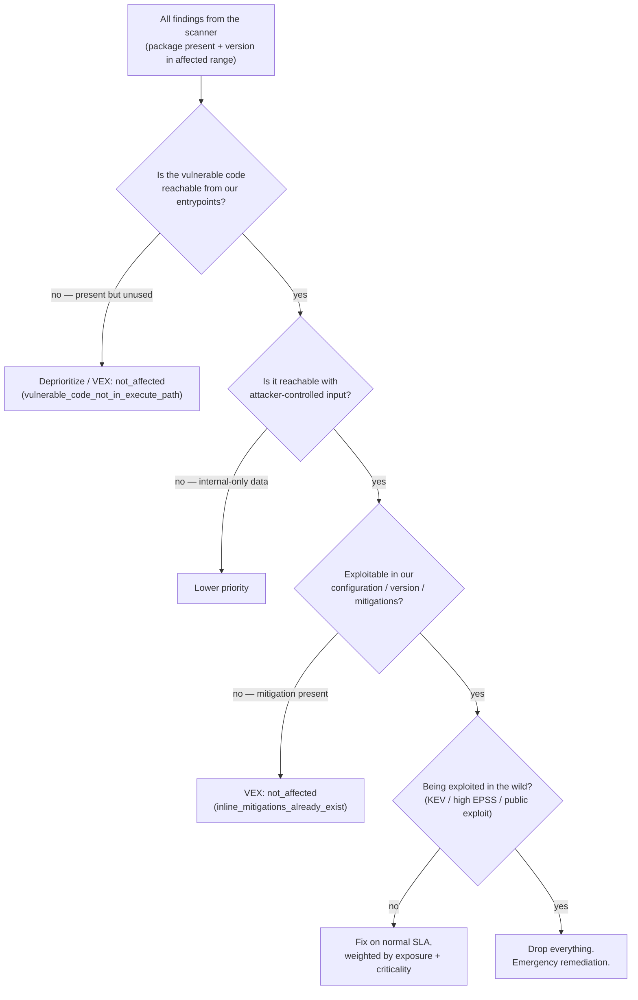
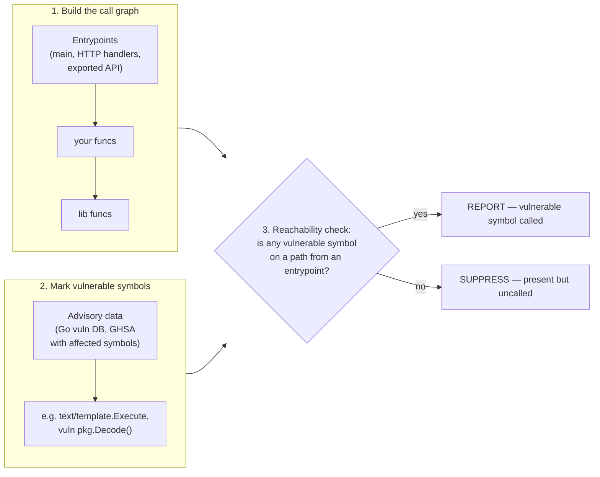
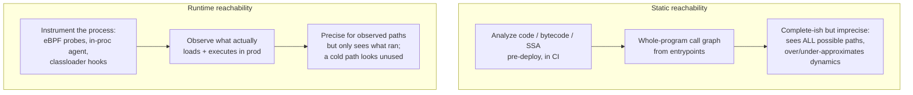
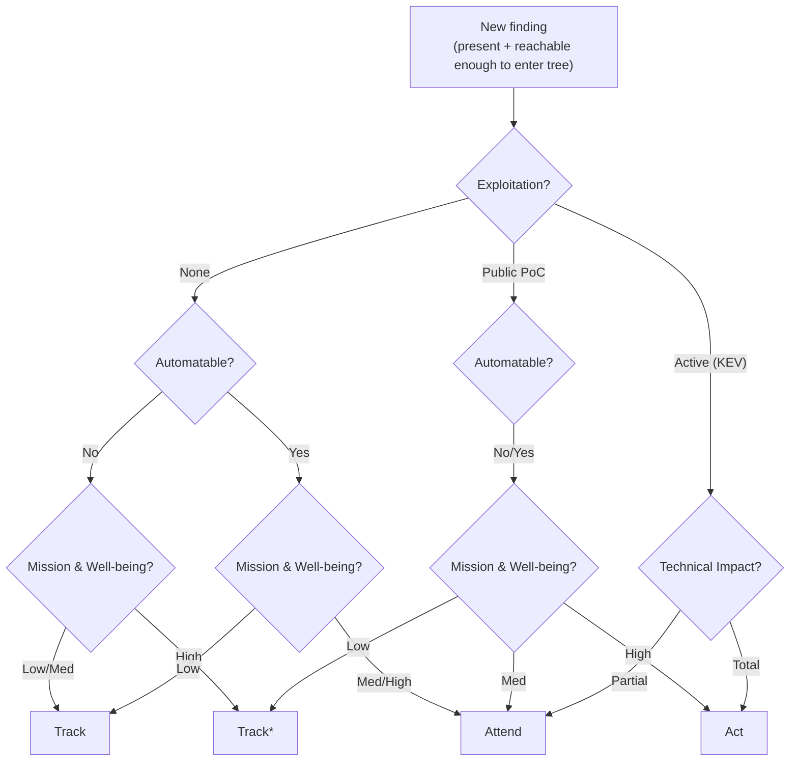
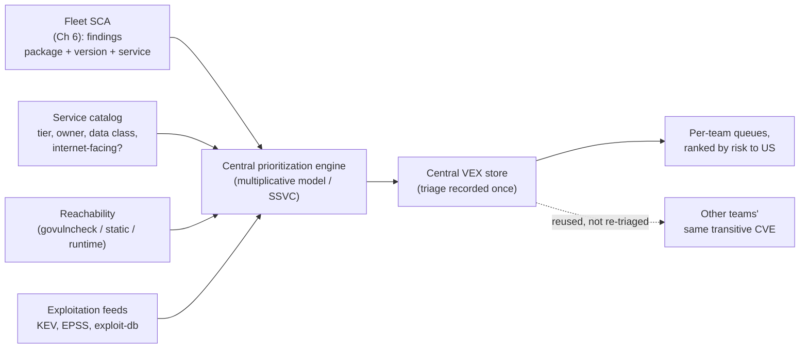
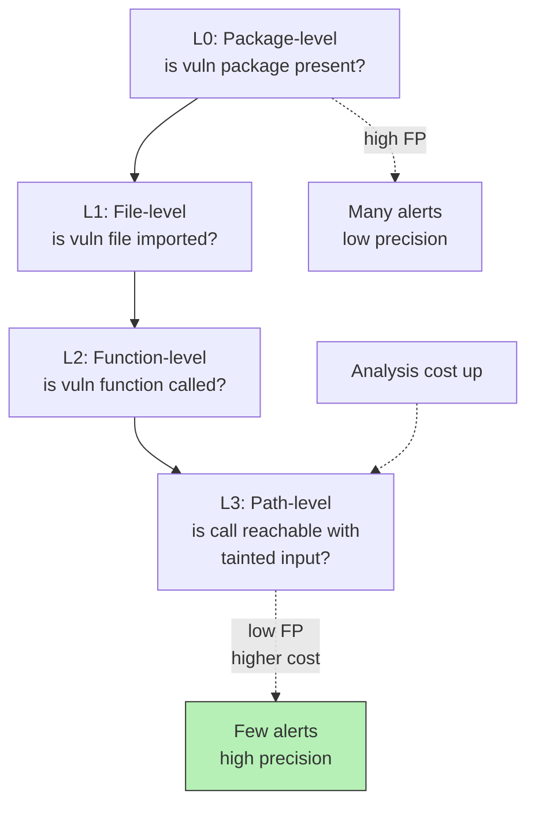
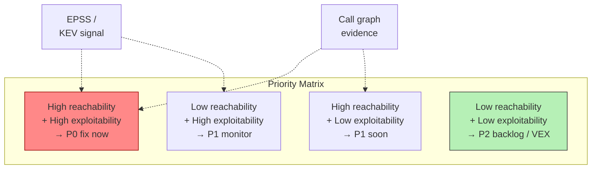

# Chapter 7 — Reachability, Exploitability, and Prioritization

*What this chapter covers.* By the end of Chapter 6 you can point a scanner at a fleet
and get an authoritative answer to the question "which vulnerable package versions are we
running, and where?" That answer, for any organization past a few hundred services, is a
firehose. A single mid-sized company routinely carries tens of thousands of open
findings across its inventory, and the raw list is sorted — if it is sorted at all — by
CVSS base score. That sort is close to useless. A CVSS 9.8 in a library you pull in for a
code path you never execute is noise; a CVSS 5.3 in an internet-facing parser that an
attacker is exploiting *today* is a fire. This chapter is about closing the gap between "a
vulnerability is present" and "a vulnerability matters to us," which is the single largest
source of wasted effort — and missed real risk — in dependency security. We build up the
filtering pipeline layer by layer, spend most of our time on the technical core
(**reachability analysis** and its hard limits, especially in dynamic languages), fold in
the exploitability signals from Chapter 5 (EPSS, KEV, exploit availability), and assemble
them into a defensible prioritization model — including the SSVC decision tree and the
role of VEX as the mechanism that lets 500 teams stop re-triaging the same transitive CVE.

Learning goals — after this chapter you should be able to:

- Explain **why CVSS-sorted alert lists fail** as a prioritization mechanism, and articulate
  the layered "does this actually matter to us?" filter — present, reachable, input-reachable,
  exploitable, exploited — that a mature program applies instead.
- Define **reachability** precisely and distinguish its levels of precision: package presence,
  dependency-graph position, and function/symbol-level static call-graph reachability.
- Describe **how symbol-level reachability works** (call graph from entrypoints → vulnerable
  symbols marked from advisory data → reachability check), why **Go's govulncheck** is the
  gold-standard example, and why the same analysis is progressively harder in Java, then
  JavaScript, then Python — and be honest about the false negatives and false positives on
  both ends.
- Contrast **static call-graph reachability with runtime/instrumented reachability** (eBPF and
  in-process agents) and reason about the trade-offs of each.
- Combine reachability with **exploitability signals** — EPSS, CISA KEV, public exploit
  availability, attack vector, and internet-exposure — into a single risk ranking, and apply
  **SSVC** as a repeatable decision tree.
- Use **VEX** to record and communicate triage decisions so that a "not affected because
  unreachable" verdict is made once and consumed everywhere.

A note on scope. Chapter 5 gave you the vulnerability data model (CVE, NVD, OSV/GHSA, purl,
CVSS, EPSS, KEV). Chapter 6 built the scanner that matches that data against your inventory.
This chapter assumes both. It is about what you do with the resulting list. How you *record*
the decisions as machine-readable VEX is Book 3, Chapter 6 — VEX and Exploitability. How
threat intelligence feeds exploitation signals is Book 8, Chapter 7. This chapter is where
those threads meet.

## The prioritization problem

Start with the failure mode, because naming it precisely tells you what a fix must do.

A scanner emits findings. Left to its own devices it ranks them by CVSS base score, because
that is the one number every finding carries. But the CVSS base score, as Chapter 5 laid out
in detail, is a deliberately *context-free* measure of a vulnerability's intrinsic severity.
It is computed once, by the CNA or NVD, for the vulnerability *in the abstract* — before
anyone knows whether you call the affected function, whether the affected service faces the
internet, or whether an exploit exists. By construction it encodes none of the things that
determine your actual risk. Sorting your work queue by it is like triaging an emergency room
by how bad each condition *could* be for *someone*, ignoring which patients are actually in
front of you and how sick they actually are.

The consequences are not subtle. Two of them dominate:

- **False urgency.** The top of a CVSS-sorted list is a wall of 9.8s. A large fraction are in
  transitive dependencies you pull for one narrow feature, on code paths you never reach, in
  services no attacker can touch. Engineers burn out patching them, or — worse and more
  common — learn that "critical" means nothing and stop looking. Alert fatigue is not a
  soft cost; it is the mechanism by which the *real* critical gets ignored.
- **False calm.** The genuinely dangerous finding — internet-reachable, taking untrusted
  input, with a Metasploit module and a spot on CISA's Known Exploited Vulnerabilities
  catalog — may carry a CVSS of 7.5 or even 5.3 and sit on page four. A severity sort
  actively buries it.

At the fleet scale of Chapter 6 this stops being an annoyance and becomes structurally
untenable. If you have 40,000 open findings and each takes even ten minutes to look at, that
is an impossible amount of human triage; you *must* filter automatically before a human ever
sees a list, and the filter must rank by risk *to your system*, not by abstract severity.

### The layers of "does this matter?"

The right mental model is a funnel. A raw finding — "package X version Y is affected by
CVE-Z, and it is in your inventory" — passes through a sequence of filters, each of which
asks a sharper, more context-dependent question, and each of which typically removes a large
fraction of what the previous layer let through.



Read the funnel top to bottom as a series of independent yes/no gates, roughly in increasing
order of how much context and how much analysis each requires:

1. **Is the vulnerable component present, at an affected version?** This is what basic SCA
   answers (Chapter 6). It is the entry to the funnel, not a prioritization signal.
2. **Is the vulnerable code reachable from my code?** Present-but-unused is, empirically,
   the *majority* of findings for most codebases. This is the reachability question, and it
   is the technical heart of the chapter.
3. **Is it reachable with attacker-controlled input?** A reachable `parse()` that only ever
   sees a constant you compiled in is very different from one that sees a request body.
4. **Is it exploitable in my configuration?** The classic example is Log4Shell
   (CVE-2021-44228): the JNDI lookup was only exploitable under specific configurations and
   JDK versions; some deployments had message-lookup disabled or ran a JVM that blocked the
   remote-class-loading step. Exploitability is not a property of the library alone.
5. **Is it being exploited in the wild?** KEV membership and high EPSS turn a maybe into a
   now.

Each layer filters the set down, and — critically — the layers are *cheap-to-expensive and
coarse-to-precise* in the same direction. You want to apply the cheap coarse filters (is it
even in an affected range? is it a direct or transitive dep of an unused optional feature?)
before spending call-graph-analysis cycles, and you want the expensive precise filters
(symbol reachability, exploitability-in-config) reserved for the survivors. The rest of this
chapter walks the layers in order.

## Reachability analysis

**Reachability** is the question: *does the application actually invoke the vulnerable
function or code path, or is the vulnerable dependency merely present-but-unused?* It is the
highest-leverage filter in the funnel because the answer is "unused" so often. A modern
service's dependency closure is enormous and each dependency exposes a broad API surface of
which you touch a sliver. When a vulnerability lands in the 95% of a library you never call,
the finding is real — the code *is* in your binary — but the risk to you is essentially nil.

Reachability comes in levels of precision. Sloppy tooling and sloppy conversation conflate
them; a serious program is explicit about which level a given verdict rests on, because the
levels differ enormously in both cost and trustworthiness.

### Level 1 — Package presence

The coarsest level, and what plain SCA reports: *is the affected package, at an affected
version, anywhere in my dependency graph?* This is a set-membership test against your
resolved dependency tree (Chapter 2's lockfiles) and the advisory's affected-range data
(Chapter 5's OSV ranges). It is fast, sound in the "no false negatives at the package
granularity" sense, and wildly imprecise: it says nothing about whether you *use* the
package, let alone the vulnerable part of it.

### Level 2 — Dependency-graph position

A modest refinement that is cheap and worth doing before any code analysis: *where in the
graph does the package sit?* A vulnerability in a **direct** dependency you obviously use is
different from one buried in a **transitive** dependency reached only through an **optional**
feature, a `devDependencies` entry, or a platform-specific package for an OS you do not ship.
Package-manager metadata carries a lot of this for free:

- npm `optionalDependencies` and `peerDependencies`, and the `dev`/`prod` split in the
  lockfile.
- Maven `provided` and `test` scopes, and `<optional>true</optional>`.
- Go's build constraints and the distinction between the module graph and the *pruned* module
  graph that actually contributes packages (Go 1.17+ module-graph pruning).
- Cargo `[dev-dependencies]` and target-specific `[target.'cfg(...)'.dependencies]`.

If a vulnerable package is only present as a test-scoped or dev dependency, it is not in your
production artifact at all — a categorical, high-confidence deprioritization that requires no
code analysis. Chapter 6's build-time SBOM, generated from the production build, is the right
input here precisely because it excludes those scopes.

### Level 3 — Function / symbol-level static reachability

This is the level people mean when they say "reachability analysis" as a differentiator, and
it is where the real precision — and the real difficulty — lives. The question is: *starting
from my program's entrypoints, does any call path in the program's call graph actually reach
the specific vulnerable function (symbol) named by the advisory?*

The mechanism, in three steps:



1. **Build a call graph** of the whole program: nodes are functions/methods, edges are "may
   call." You root it at the program's entrypoints (`main`, exported library API, HTTP/gRPC
   handlers, framework-invoked callbacks) and follow calls transitively, *through* your code
   *into* dependency code, all the way down.
2. **Mark the vulnerable symbols.** This requires advisory data at symbol granularity — not
   just "package foo ≤ 1.4 is vulnerable" but "the vulnerability is in `foo.Parse` and
   `foo.parseHeader`." Most advisory databases do *not* carry this; the Go vulnerability
   database is the notable one that does.
3. **Check reachability.** If any vulnerable symbol is on a path from an entrypoint in the
   call graph, the vulnerability is (statically) reachable — report it. If no vulnerable
   symbol is reachable, the package is present but the dangerous code is dead relative to your
   entrypoints — suppress or heavily deprioritize.

Consider the difference concretely. Two services both depend on a YAML library with a
vulnerability in its custom-tag deserialization path (`UnmarshalWithTags`). Service A calls
only `yaml.Marshal` to *emit* config and never unmarshals untrusted YAML; the vulnerable
symbol is not on any path from its entrypoints. Service B calls `yaml.UnmarshalWithTags` on a
request body. Package-level SCA flags both identically. Symbol-level reachability correctly
separates them: A is suppressed, B is reported. Across a fleet, that separation is the
difference between a triageable queue and an untriageable one.

#### The gold standard: govulncheck

Go's [`govulncheck`](https://go.dev/security/vuln/) is the reference implementation of
symbol-level reachability and the clearest thing to reason from, because two pieces line up
that rarely line up elsewhere.

First, the **Go vulnerability database** publishes affected *symbols*, not just affected
version ranges. A Go advisory (OSV format, in the `vulndb`) lists the specific packages and
exported symbols that carry the flaw. That is the marking data Step 2 needs, curated
upstream.

Second, Go is **statically typed and statically compiled with limited dynamic dispatch**, so
a precise whole-program call graph is tractable. `govulncheck` builds the program's SSA form
and runs a call-graph analysis (using the standard `golang.org/x/tools` machinery — a
VTA/RTA-style algorithm that resolves interface method calls conservatively but tightly), then
checks whether any vulnerable symbol is reachable from the module's entrypoints.

The output distinguishes the levels of the funnel explicitly. Findings where a vulnerable
symbol is actually called are reported with the call stack that reaches them; findings where
the package is present but no vulnerable symbol is reached are reported only at a lower
"module is imported" level, or suppressed:

```text
$ govulncheck ./...
=== Symbol Results ===

Vulnerability #1: GO-2024-2687
    HTTP/2 CONTINUATION flood in golang.org/x/net/http2
  More info: https://pkg.go.dev/vuln/GO-2024-2687
  Module: golang.org/x/net
    Found in: golang.org/x/net@v0.22.0
    Fixed in: golang.org/x/net@v0.23.0
    Example traces found:
      #1: server.go:141:29: myapp/server.Run calls http2.Server.ServeConn

Your code is affected by 1 vulnerability from 1 module.

This scan also found 3 vulnerabilities in modules that you require
that are neither imported nor called.
```

That last line is the whole point. Three vulnerabilities are *present in your dependency
graph* — a package-level scanner would report four criticals — but `govulncheck` has proven
they are not called and tells you so, leaving you one finding to act on with a concrete call
stack (`myapp/server.Run → http2.Server.ServeConn`) that shows exactly why it matters.

#### Why other languages are harder

Symbol-level reachability degrades as a language gets more dynamic, and it is worth
understanding *why*, because it tells you exactly how much to trust a reachability verdict in
each ecosystem.

- **Java / JVM.** Tractable but harder than Go. Bytecode is statically typed, so call-graph
  tools (Soot, WALA, OPAL, and the CHA/RTA/points-to algorithms they implement) can build
  reasonable graphs from compiled classes. The complications are runtime realities: heavy
  interface and virtual dispatch, reflection (`Class.forName`, `Method.invoke`), dynamic
  proxies, service-loader and dependency-injection frameworks (Spring, CDI) that wire calls at
  runtime, and classloader tricks. Analyses handle these with conservative over-approximation
  (assume reflection can call anything matching) or heuristics, trading false negatives for
  false positives. Advisory data rarely carries affected symbols for Java, so tools often must
  infer the vulnerable symbols themselves.
- **JavaScript / TypeScript.** Substantially harder. Dynamic dispatch is pervasive,
  first-class functions and callbacks everywhere, `eval` and dynamic `import()`, monkey-patching
  of objects and prototypes, and a module system where what a name refers to can change at
  runtime. Sound whole-program call graphs are a research-grade problem; production tools lean
  on approximate static analysis or fall back to coarser signals. Bundlers (webpack, esbuild)
  that tree-shake can *help* — code that was tree-shaken out is genuinely absent — but that is
  reasoning about presence, not reachability.
- **Python / Ruby.** Hardest of the mainstream set. Duck typing, no static types to resolve
  dispatch, `getattr`/`__getattr__` and metaclasses, monkey-patching, `importlib` and
  `__import__` with computed names, and decorators that rewrite behavior. A *sound* static
  call graph — one that never misses a real call — would have to assume almost anything can
  call almost anything, which makes it useless. Practical Python reachability tools are
  therefore *unsound by design*: they trace the calls they can resolve and accept that
  dynamically dispatched calls will be missed.

The honest summary is a table. Note that "precision" here means the trustworthiness of a
*negative* verdict — an "unreachable, safe to suppress" claim:

| Language | Call-graph tractability | Advisory symbol data | Trust in "unreachable" verdict |
|---|---|---|---|
| Go | High (static, compiled, SSA) | Yes (Go vuln DB) | High |
| Java/JVM | Medium-high (bytecode) | Rare | Medium — reflection/DI leak |
| JavaScript/TS | Low-medium | No | Low — dynamic dispatch, eval |
| Python/Ruby | Low | No | Low — unsound, misses dynamic calls |

### Be honest about the errors — both directions

Reachability analysis is not a truth oracle, and treating it as one is dangerous. It errs in
*both* directions, and the two errors have opposite consequences.

- **False negatives (missed real calls) → suppressed real risk.** This is the dangerous one.
  A tool that misses a call — because it went through reflection, a dynamic import, an `eval`,
  a framework's runtime wiring, a message queue, an HTTP boundary the static graph does not
  cross, or simply an entrypoint the tool did not know to root at — will confidently tell you
  a vulnerability is unreachable when it is not. In dynamic languages this is common. The
  operational rule that follows: **the strength of an "unreachable → suppress" decision is
  exactly the soundness of the tool that produced it.** A govulncheck "not called" is strong
  evidence; a Python reachability tool's "not called" is weak evidence, and you should treat
  it as a deprioritization, not a dismissal, especially for KEV-listed or actively exploited
  CVEs.
- **False positives (conservative over-approximation) → wasted work.** Sound-leaning analyses
  over-approximate: when reflection *might* call something, they assume it does. This
  reintroduces some of the noise reachability was meant to remove, but it fails safe.

The governing asymmetry: **for suppression decisions, prefer sound (over-approximating) tools
and treat unsound "unreachable" verdicts as soft signals.** Never let an unsound reachability
verdict override a KEV listing.

### Static versus runtime reachability

Everything so far is *static* reachability — analyzing code without running it. There is a
second family: **runtime (dynamic) reachability**, which observes what actually loads and
executes in a running process.



Runtime approaches instrument the process and watch. Two common mechanisms:

- **eBPF and OS-level probes.** Attach to the running process from the kernel side and observe
  which files/classes/shared objects are loaded and, at finer granularity, which functions
  execute — without modifying the application. This is how several "runtime SCA" and
  cloud-workload-protection products determine that, of the 300 packages in an image, only 60
  are ever loaded into memory at runtime.
- **In-process agents.** A language agent (a JVM `-javaagent`, a Python import hook, a Node
  `--require` shim) inside the runtime instruments loading and invocation directly, which
  gives language-aware, symbol-level observation — it can see that `yaml.UnmarshalWithTags`
  was actually invoked on a real request.

The trade-off is fundamental and mirrors the classic static-vs-dynamic-analysis tension:

| | Static | Runtime |
|---|---|---|
| When | Pre-deploy, in CI, on every PR | Post-deploy, in staging/prod |
| Coverage | All *possible* paths (complete-ish) | Only paths that actually *executed* |
| Precision | Imprecise (over/under-approx of dynamic dispatch) | Precise for what it observed |
| Dynamic calls | The weakness (reflection, eval) | Sees them directly — a strength |
| Main failure mode | Over-approximation → noise; unsoundness → misses | Cold paths look "unused" until they run |
| Cost | CI compute | Production instrumentation + overhead |

The critical asymmetry for runtime reachability: **"not observed" is not "not reachable."** A
code path that only fires on a rare error, a specific tenant, an admin endpoint, a
once-a-quarter batch job, or an attacker's deliberately unusual input will read as "unused"
in your telemetry right up until it executes — and an attacker's whole job is to execute the
path you never do. Runtime reachability is excellent for *confirming* something is used (a
strong positive) and for narrowing the *loaded* set; it is weak for *proving* something is
safe. The mature posture combines them: static reachability as the pre-deploy gate that is
complete-ish over possible paths, runtime reachability as the production signal that confirms
usage and catches the dynamic calls static analysis missed. Where they *disagree* — static
says unreachable, runtime observed it — the runtime observation wins and points straight at a
gap in your static model.

## Exploitability signals beyond reachability

Reachability answers "can our code get there?" Exploitability answers "would getting there
actually hurt, and is anyone trying?" These are Chapter 5's prioritization inputs, now put to
work as filters further down the funnel. Reachability without exploitability over-invests in
reachable-but-harmless code; exploitability without reachability chases exploited CVEs you do
not actually run. You need both axes.

### EPSS — probability of exploitation

The **Exploit Prediction Scoring System** (EPSS, from FIRST.org) produces, for a CVE, a
probability in [0, 1] that it will be *exploited in the wild in the next 30 days*. It is a
machine-learned model trained on observed exploitation activity against features drawn from
the CVE text, references, exploit-code availability, vendor, CWE, and more. Scores are
recomputed **daily** — an EPSS score is a live signal that rises when exploit code appears or
chatter increases, not a static attribute.

Two properties matter operationally. First, EPSS is heavily **right-skewed**: most CVEs sit
near zero, and a small tail carries most of the probability mass. That is exactly what makes
it useful as a filter — a threshold (say, EPSS ≥ 0.1, or top-percentile) isolates a small,
high-probability set. Second, it is **probabilistic and population-level**, not a statement
about your environment: it tells you how likely this CVE is to be exploited *somewhere*, not
whether it is reachable *in you*. Use it as the "is anyone likely to weaponize this soon?"
axis, orthogonal to reachability. (See Chapter 5 for the model's construction and caveats.)

### CISA KEV — known exploited, drop everything

The **CISA Known Exploited Vulnerabilities (KEV) catalog** is a curated list of CVEs with
**reliable evidence of active exploitation in the wild**. Where EPSS is a prediction, KEV is
an observation: inclusion means it is *being* exploited, not that it might be. Established
under Binding Operational Directive 22-01, it carries remediation due dates for US federal
agencies, but its value to everyone is as the highest-confidence "this is real, now" signal
available.

Operationally, **KEV is a near-absolute override.** A KEV-listed CVE that is present and
plausibly reachable jumps to the top of the queue regardless of its CVSS or EPSS, and — this
is the key interaction with the earlier sections — **a KEV listing should override an unsound
reachability "unreachable" verdict.** If your Python reachability tool says "not called" but
the CVE is on KEV, you verify by hand rather than trusting the suppression. KEV is small (low
thousands of entries), high-signal, and machine-consumable; every prioritization pipeline
should join against it first.

### Public exploit availability and attack surface

Between "predicted" (EPSS) and "confirmed exploited" (KEV) sits **exploit availability**: is
there a public proof-of-concept or a weaponized module? A PoC on GitHub, an Exploit-DB entry,
or — the strongest of these — a **Metasploit module** each lowers the effort an attacker
needs and each raises priority. (This is also a major *input* to EPSS, so treat it as
corroboration rather than a fully independent signal.)

Finally, three environmental factors that no CVE-level feed can know and that you must supply
from *your* context:

- **Attack vector.** CVSS's AV metric — Network vs. Adjacent vs. Local vs. Physical — is a
  legitimately useful base-metric field: a network-exploitable flaw in an exposed service is a
  categorically different animal from one requiring local access.
- **Untrusted input on the path.** Does the reachable vulnerable code actually receive
  attacker-controlled data (a request body, an uploaded file, a queue message from an external
  producer), or only internal, trusted values? This is funnel layer 3, and it often requires
  taint reasoning or human judgment, but it is decisive.
- **Internet exposure of the service.** The same reachable vuln in an internet-facing edge
  service and in an internal batch job are worlds apart. This is not a property of the CVE at
  all — it is a property of your *deployment topology*, and wiring it in automatically is the
  subject of the distributed-systems section below.

These environmental signals are also where **threat-intelligence-driven prioritization**
enters: knowing that a specific threat actor is actively exploiting a class of vulnerability
against your sector sharpens all of the above. That is developed in Book 8, Chapter 7 —
Threat Intelligence for Supply Chain.

## Putting it together — a prioritization model

We now have the axes. A defensible model combines them; it does not pick one. The shape most
teams converge on is multiplicative — a finding is urgent only when *several* axes are high at
once, and any single axis being near zero should pull the priority down. Conceptually:

```text
priority ≈ severity(CVSS base)
         × reachability      (0 = proven unreachable ... 1 = symbol called on hot path)
         × exploitation      (KEV = max ; else f(EPSS, exploit availability))
         × exposure          (internet-facing + untrusted input ... internal batch)
         × asset_criticality (tier-0 revenue path ... throwaway internal tool)
```

Do not over-fit the arithmetic — the point is the *structure*, not a spurious decimal.
Multiplicative combination captures the key intuition the CVSS-only sort misses: **a 9.8 that
is proven unreachable in an internal tool (reachability ≈ 0, exposure ≈ low) drops far below a
6.5 that is KEV-listed, reachable, and internet-facing.** The factors are the funnel layers,
re-expressed as multipliers.

### A worked example

Five findings, same week, one team. The CVSS-only sort would rank them 1–2 (both 9.8), then
3, then 4, then 5. Watch how a multi-axis model reorders them.

| # | Finding | CVSS | Reachable? | Exploit | Exposure | Asset | Verdict |
|---|---|---|---|---|---|---|---|
| A | RCE in image-parsing lib, called on upload path | 9.8 | Yes (symbol on request path) | EPSS 0.02, no PoC | Internet-facing | Tier-0 checkout | **Act now** |
| B | RCE in the same lib, but only in an unused codec | 9.8 | No (govulncheck: not called) | EPSS 0.02 | Internet-facing | Tier-0 | Track / VEX not_affected |
| C | Auth-bypass in an admin framework | 7.5 | Yes | **KEV**, Metasploit module | Internet-facing | Tier-1 | **Act now** |
| D | DoS in a YAML parser, reachable | 5.3 | Yes | EPSS 0.35 | Internal batch job | Tier-3 | Attend (normal SLA) |
| E | Info-leak in a logging lib | 6.5 | No (dev-dependency only) | EPSS 0.01 | n/a (not shipped) | n/a | Suppress |

The reordering is the entire lesson:

- **C (CVSS 7.5) leaps above B (CVSS 9.8)** because it is KEV-listed and reachable, while B is
  a proven-unreachable codec — the strong `govulncheck` "not called" verdict lets you
  confidently VEX it as `not_affected`.
- **A stays at the top** on the strength of every axis aligning: reachable on the upload path,
  internet-facing, tier-0 — even though its EPSS is low, the confluence of reachability +
  exposure + criticality makes it the thing to fix first.
- **D is real but patient**: reachable and moderate EPSS, but an internal batch job at tier-3;
  it earns a normal-SLA fix, not a fire drill.
- **E vanishes** on the cheapest possible filter — it is a dev-dependency, not in the shipped
  artifact — no code analysis required.

A pure CVSS sort gets *four of these five wrong* relative to actual risk. That is the case for
the whole chapter, in one table.

### SSVC — a decision tree instead of a score

Multiplying fuzzy factors bothers people, reasonably, because it manufactures false precision
and hides the reasoning. **SSVC — Stakeholder-Specific Vulnerability Categorization**, from
Carnegie Mellon's SEI and adopted/adapted by CISA — replaces the score with a **decision
tree**: an ordered set of yes/no-ish decision points whose leaves are *actions*, not numbers.
The output is auditable ("we chose Track because exploitation is None and it is not
Automatable"), and it forces the organization to define its risk appetite explicitly in the
tree rather than implicitly in a threshold.

CISA's deployer-facing SSVC uses four decision points that map cleanly onto everything above:

- **Exploitation** — None / Public PoC / Active. (This is the KEV + exploit-availability axis.)
- **Automatable** — can steps 1–4 of the kill chain be reliably automated? Yes/No. (Roughly:
  is it wormable / mass-exploitable, which is where reachability-with-untrusted-input and
  network attack vector feed in.)
- **Technical Impact** — Partial / Total. (Severity — does exploitation yield total control?)
- **Mission & Well-being** — the impact on the deploying organization's mission and on human
  well-being: Low / Medium / High. (This is your asset-criticality and exposure context.)

The leaves are four actions: **Track** (no action beyond normal updates), **Track\*** (track
closely, act if things change), **Attend** (bring in the team, act sooner than the next
normal cycle), and **Act** (remediate as fast as you can, out of band).



The tree above is illustrative, not the normative CISA table cell-for-cell — the real
decision table has more paths — but the *shape* is faithful: exploitation is the dominant
first cut, KEV/active pushes hard toward Act, and your mission/exposure context is what
separates Track from Attend on the low-exploitation branches. The genuine value of SSVC is
not the specific tree; it is that it **makes the organization's prioritization policy an
explicit, versioned, auditable artifact** instead of a folk practice living in a senior
engineer's head. You can and should tailor the decision points to your environment — that is
the "Stakeholder-Specific" in the name.

### VEX — record the decision once

Every reachability and exploitability judgment above is *expensive*: it costs analysis, or
human review, or both. The unforgivable waste is making the same judgment repeatedly — the
same transitive CVE in the same shared base image re-triaged by fifty teams, or re-triaged by
*you* every week because last week's "not affected, unreachable" verdict was never written
down anywhere a tool could read.

**VEX — Vulnerability Exploitability eXchange** — is the machine-readable mechanism for
recording and communicating exactly these decisions. A VEX statement asserts, for a given
product and vulnerability, a **status**: `not_affected`, `affected`, `fixed`, or
`under_investigation`. When the status is `not_affected`, VEX carries a **justification** —
and the justification vocabulary is precisely the language of this chapter's funnel:

- `component_not_present` — layer 1 (it is not even in this artifact).
- `vulnerable_code_not_present` — the affected code was removed/not compiled in.
- `vulnerable_code_not_in_execute_path` — **reachability**: present but not called.
- `vulnerable_code_cannot_be_controlled_by_adversary` — layer 3: reachable but no attacker
  input reaches it.
- `inline_mitigations_already_exist` — layer 4: a compensating control neutralizes it.

That mapping is not a coincidence — VEX was designed to record the outputs of exactly the
triage funnel we built. The payoff is twofold. **Suppression becomes durable and auditable:**
a govulncheck "not called" verdict becomes a `not_affected /
vulnerable_code_not_in_execute_path` VEX statement that your scanner reads on the next run and
does not re-surface, with the reasoning attached for the auditor. And **it becomes shareable
downstream:** when an upstream vendor ships a VEX saying their product is `not_affected` by a
CVE in a library they bundle, every consumer inherits that triage instead of redoing it. VEX
is the write-side of everything in this chapter; the full mechanics — CSAF VEX vs. CycloneDX
VEX, OpenVEX, statement lifecycle, and distribution — are Book 3, Chapter 6 — VEX and
Exploitability.

## Distributed-systems lens

At fleet scale, prioritization is not a per-finding analysis problem; it is a *data-join and
governance* problem. The technical filters of this chapter are necessary but insufficient
unless they are wired into the topology of your organization.

**Reachability and exposure are topology, not library facts.** The same reachable CVE in an
internet-facing edge gateway and in an internal nightly report generator carries wildly
different risk, and *nothing in the CVE, the CVSS vector, or even the call graph knows the
difference.* The exposure axis lives in your **service catalog** — the same system of record
that holds ownership, on-call, and tier from your platform's service metadata. The design
imperative is to **join findings against catalog metadata automatically**: for every finding,
the pipeline should look up whether the affected service is internet-facing (from the
ingress/gateway config or service-mesh topology), what data classification it touches (PII,
payments, secrets), and its criticality tier — and feed those directly into the multiplicative
model or the SSVC "Mission & Well-being" and exposure inputs. Exposure that a human has to
look up by hand is exposure that will not be looked up. Derive it from the mesh, the ingress
rules, and the catalog.



**Centralize triage; do not let 500 teams re-triage the same transitive CVE.** In a
microservice fleet, a single popular transitive dependency — a logging library, a serializer,
a base-image package — appears in hundreds of services. When a CVE lands on it, the *default*
outcome is hundreds of independent, mostly-duplicated triage efforts, most reaching the same
conclusion. This is pure waste and it is where alert fatigue metastasizes. The fix is a
**central prioritization engine and a central VEX store**: reachability and exploitability are
assessed once against the shared component (with per-service reachability where the usage
genuinely differs), the verdict is recorded as VEX, and every affected team's queue reads the
central verdict instead of regenerating it. When the shared base-image team publishes
"`not_affected / vulnerable_code_not_in_execute_path`" for a CVE in a bundled library nobody
calls, that statement suppresses the finding across every downstream service at once. Triage
becomes O(distinct components) instead of O(services × components).

**Make the exploitation and exposure joins live.** KEV and EPSS change *daily*; a service's
internet-exposure changes whenever someone edits an ingress rule; a cold code path becomes hot
when a feature ships. A prioritization built as a one-time report is stale within a day. Build
it as a continuously re-evaluated join: new KEV entries re-rank the existing inventory
overnight, a newly-exposed service re-scores its findings, and a reachability change from a
code deploy updates the verdict on the next scan. The output humans consume is not a static
severity-sorted CSV; it is a **live, per-team, risk-ranked queue** whose ranking already
reflects reachability, exploitation, exposure, and criticality — so that the first item on
each team's list is, actually, the thing most worth their next hour.

## Key takeaways

- **CVSS-sorted alert lists fail** because the base score is context-free by construction — it
  encodes no reachability, no exploitation-in-practice, and no environment. Sorting by it
  produces false urgency (walls of unreachable 9.8s) and false calm (a KEV-listed, reachable
  7.5 buried on page four). At fleet scale you must filter automatically and rank by risk *to
  your system*.
- **Prioritization is a funnel of increasingly precise filters:** present → reachable →
  input-reachable → exploitable → exploited. Each layer removes a large fraction, and they run
  cheap-to-expensive, coarse-to-precise. Apply the cheap coarse filters first.
- **Reachability is the highest-leverage filter** because "present but unused" is usually the
  *majority* of findings. It has levels: package presence (basic SCA), dependency-graph
  position (direct vs. transitive/optional/dev — free from package metadata), and
  symbol-level static call-graph reachability (the precise, hard one).
- **Symbol-level reachability = call graph from entrypoints + vulnerable symbols marked from
  advisory data + a reachability check.** Go's **govulncheck** is the gold standard because
  the Go vuln DB publishes affected *symbols* and Go's static compilation makes precise call
  graphs tractable — it reports the exact call stack and suppresses present-but-uncalled vulns.
- **The analysis degrades with dynamism:** Java is tractable-but-leaky (reflection, DI),
  JavaScript is hard (dynamic dispatch, eval), Python/Ruby are hardest and their reachability
  tools are *unsound by design*. Be honest: an "unreachable" verdict is only as trustworthy as
  the soundness of the tool — a govulncheck "not called" is strong; a Python tool's is a soft
  signal. **Never let an unsound reachability verdict override KEV.**
- **Static vs. runtime reachability trade completeness for precision.** Static is pre-deploy
  and complete-ish over possible paths but imprecise on dynamics; runtime (eBPF, in-process
  agents) is precise for what actually executed but blind to cold paths — "not observed" is not
  "not reachable." Combine them; where they disagree, the runtime observation exposes a gap in
  the static model.
- **Layer exploitability on top of reachability:** EPSS (daily probability of exploitation),
  KEV (confirmed active exploitation — a near-absolute override), public exploit/Metasploit
  availability, attack vector, untrusted-input-on-path, and internet exposure. Reachability
  without exploitability over-invests in harmless code; exploitability without reachability
  chases CVEs you do not run.
- **Combine the axes multiplicatively, not additively** — a proven-unreachable 9.8 in an
  internal tool should drop below a KEV-listed, reachable, internet-facing 6.5. Use **SSVC**
  when you want an auditable decision *tree* (Exploitation → Automatable → Technical Impact →
  Mission & Well-being ⇒ Track / Track\* / Attend / Act) that makes your risk appetite
  explicit and versioned.
- **Record every triage decision as VEX** so it is durable, auditable, and shareable — its
  `not_affected` justifications (`vulnerable_code_not_in_execute_path`,
  `cannot_be_controlled_by_adversary`, `inline_mitigations_already_exist`) *are* the funnel
  layers. Never re-triage the same finding twice.
- **The distributed-systems core is the data join:** wire exposure and criticality from the
  **service catalog** into prioritization automatically, **centralize triage as VEX** so
  O(distinct components) replaces O(services × components), and keep the join **live** because
  KEV, EPSS, and exposure all change daily. Ship each team a risk-ranked queue, not a
  severity-sorted CSV.


### Reachability analysis levels




### Prioritization matrix: reachability x exploitability



## Further reading

- The Go vulnerability database and govulncheck — design, the symbol-level OSV data, and how
  the static analysis works (https://go.dev/security/vuln/ and
  https://go.dev/blog/govulncheck).
- "Govulncheck v1.0.0 is released!" and the Go team's writing on call-graph-based reachability
  and its precision goals (https://go.dev/blog/govulncheck).
- EPSS — the Exploit Prediction Scoring System model, data, and user guide, FIRST.org
  (https://www.first.org/epss/).
- CISA Known Exploited Vulnerabilities Catalog and Binding Operational Directive 22-01
  (https://www.cisa.gov/known-exploited-vulnerabilities-catalog).
- SSVC — "Prioritizing Vulnerability Response: A Stakeholder-Specific Vulnerability
  Categorization," CMU SEI, and CISA's SSVC guide and decision trees
  (https://www.cisa.gov/stakeholder-specific-vulnerability-categorization-ssvc and
  https://github.com/CERTCC/SSVC).
- CVSS v3.1 and v4.0 specifications — for the attack-vector and base-metric semantics used as
  the severity axis, FIRST.org (https://www.first.org/cvss/).
- VEX — the CISA VEX minimum-requirements and status/justification documents, plus OpenVEX,
  CSAF VEX, and CycloneDX VEX (https://www.cisa.gov/resources-tools/resources/vulnerability-exploitability-exchange-vex-use-cases
  and https://github.com/openvex).
- Static call-graph analysis foundations — Soot, WALA, and the CHA/RTA/points-to literature
  for the JVM (https://soot-oss.github.io/soot/ and https://github.com/wala/WALA).
- The OSV schema's `affected[].ecosystem_specific` and symbol/range data that reachability
  tools consume (https://ossf.github.io/osv-schema/).
- On the limits of static analysis for dynamic languages — background on why sound call graphs
  for JavaScript and Python are hard (survey literature on dynamic-language points-to
  analysis); read critically and match claims to your ecosystem.
