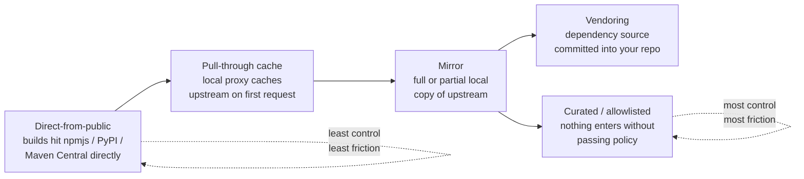
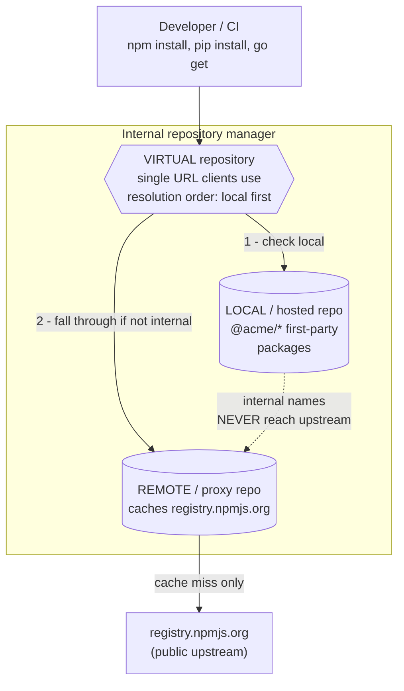
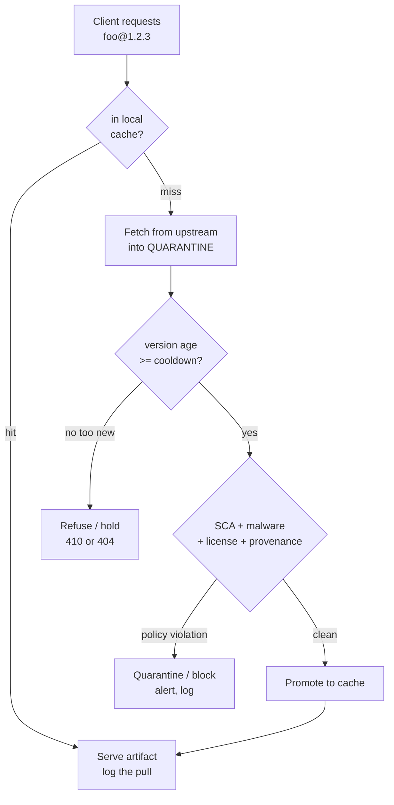
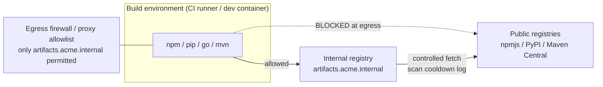
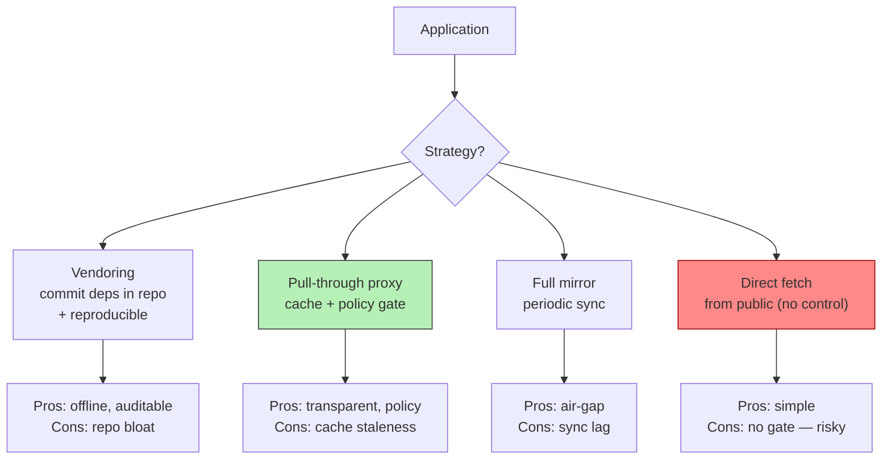
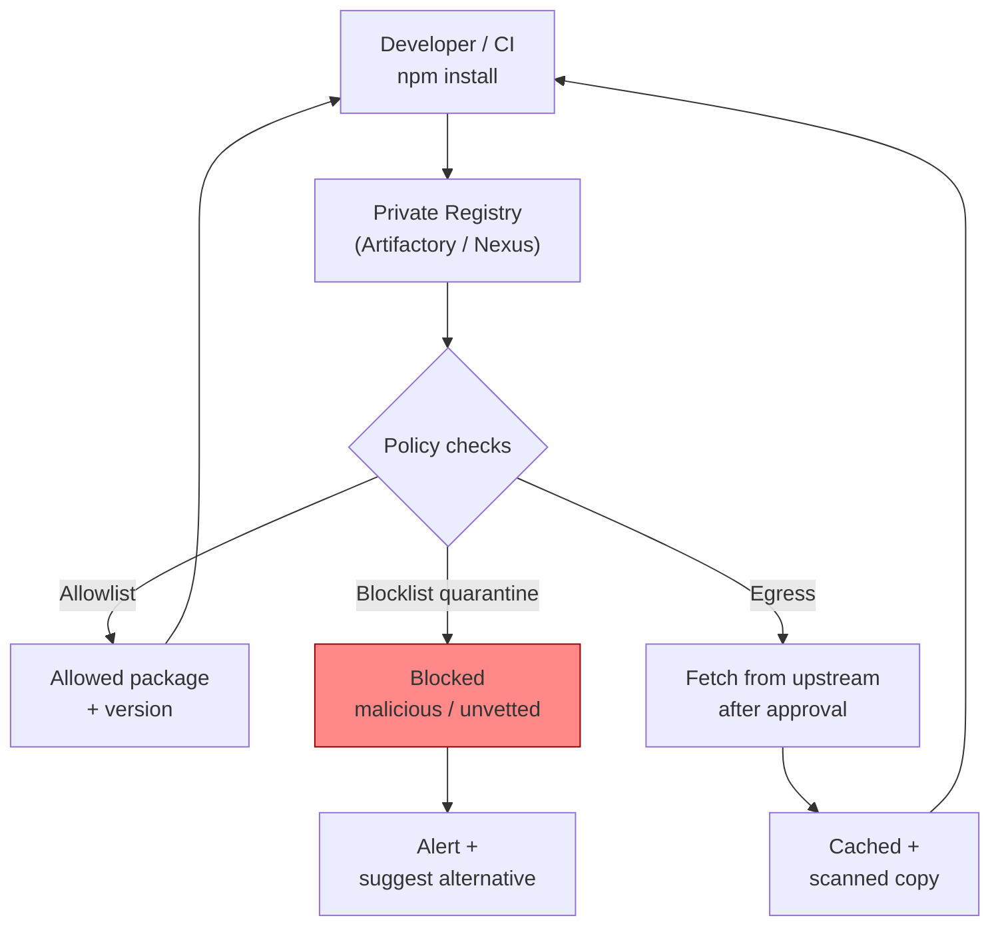

# Chapter 8 — Vendoring, Mirroring, and Internal Registries

*What this chapter covers.* Every previous chapter in this book has, at some point, pointed
here. Dependency confusion (Chapter 3) is defeated by *where* a name resolves. Malicious-package
detection (Chapter 4) only protects a fleet if the scan runs *once, at a chokepoint*, instead of
on ten thousand developer laptops that may never run it. Vulnerability data (Chapter 5) and SCA
(Chapter 6) need a single inventory of what actually entered the org. All of these controls share
a precondition: a controlled layer between your builds and the public registries. This chapter is
the full treatment of that layer — the single highest-leverage architectural control for
dependency security in a large organization. We walk the spectrum from "builds hit npmjs directly"
to "nothing enters without passing policy," dissect the internal repository-manager architecture
(remote, local, and virtual repositories) that every serious org runs, show precisely how the
resolution order in a virtual repository is where you *win* the dependency-confusion fight, and
then treat the chokepoint as what it really is: a fleet-wide control plane for scanning, cooldown,
licensing, provenance, and audit. We finish on the operational reality that this control plane is
now tier-0 infrastructure and a high-value target in its own right.

Learning goals — after this chapter you should be able to:

- Place any dependency-sourcing setup on the **spectrum of control** — direct-from-public,
  pull-through cache, mirror, vendoring, fully curated — and articulate what each buys and costs.
- Explain the **remote / local / virtual repository** model that repository managers
  (Artifactory, Nexus, CodeArtifact, and others) share, and how a virtual repository *resolves* a
  request.
- Configure the **resolution-order security property** — internal namespaces resolve locally and
  never fall through to upstream — with real `exclude-patterns`, scoped `.npmrc`, and package
  origin controls, and understand why this, not scanning, is the actual dependency-confusion fix.
- Turn the chokepoint into a **control plane**: ingestion scanning, version cooldown/quarantine,
  allow/deny and license policy, provenance verification, immutability, and a complete audit trail
  keyed to incident response and SBOM inventory.
- Run the registry as **critical infrastructure** — HA, DR, retention, build-farm performance —
  and make it the *mandatory* path with egress control rather than a suggestion.
- Stand up an **internal `GOPROXY`** and reason correctly about `GOSUMDB`, `GOPRIVATE`, and
  private-module checksum behavior.

A note on scope. This chapter is about *sourcing* — how artifacts get from the public internet
into your builds and under what controls. It deliberately overlaps with, but does not replace,
several neighbors: hermetic and reproducible builds are Book 4, Chapter 2 (vendoring is one road
to hermeticity); provenance and signature verification are Book 5 (we verify *at ingestion* here
and defer the cryptography there); the SBOM-keyed inventory that answers "which builds pulled the
bad version" is Book 3; and the incident-response playbook that consumes the registry's audit log
is Book 8, Chapter 6. Where those chapters own a mechanism, we use it and point.

## The spectrum of control over dependency sourcing

There is no single "right" way to source dependencies; there is a spectrum, and where you sit on
it is a deliberate trade of friction against control. Most organizations drift toward the
low-control end by default — nobody *decides* to let ten thousand builds hit `registry.npmjs.org`
directly, it is simply what happens when you `npm install` with no configuration — and then get
dragged rightward by an incident.



Note that this is not a strict linear ladder — vendoring and full curation are two different
answers to "I want reproducibility and control," reachable from a mirror, with different
ergonomics. Let us take them in turn.

### Direct-from-public: the dangerous default

In the direct model, each build talks straight to the ecosystem's public registry. It is the path
of least resistance and, for a hobby project, entirely fine. At organizational scale it is a
liability on five distinct axes:

- **Availability coupling.** Your ability to build and deploy is now transitively dependent on a
  third party's uptime and on individual maintainers' whims. The canonical demonstration is
  left-pad: in March 2016 a maintainer unpublished roughly 250 npm packages — including the
  eleven-line `left-pad` — over a naming dispute, and builds across the ecosystem that resolved
  `left-pad` transitively broke within minutes. Registry outages, rate-limiting, and regional
  network partitions produce the same effect less dramatically but more often. (Book 1, Chapter 8
  — The Open Source Ecosystem — treats the sustainability and unpublish dynamics in depth.)
- **No ingestion scanning.** There is no single place to inspect what enters, so any scanning you
  do is per-consumer and best-effort — precisely the property a smash-and-grab malicious release
  exploits.
- **Dependency-confusion exposure.** When a resolver can reach the public registry for *any* name,
  an internal name that also exists publicly can be hijacked (Chapter 3). Direct sourcing is the
  configuration that makes confusion possible.
- **No audit trail.** When an incident lands and someone asks "which of our builds pulled the
  compromised version between Tuesday and Thursday," the honest answer under direct sourcing is "we
  cannot tell you." That is an unacceptable answer during an incident (Book 8).
- **Unbounded blast radius.** A single malicious version can reach every build simultaneously, with
  no interposed control able to stop it fleet-wide.

### Pull-through cache (proxy): the minimum viable control

A caching or *pull-through* proxy sits between your builds and upstream. On the first request for
a given artifact it fetches from upstream, stores a local copy, and serves it; subsequent requests
are served locally. The immediate wins are resilience — a cached artifact survives an upstream
outage or unpublish — and, critically, a *single point through which every request passes*. That
single point is what everything later in this chapter is built on: one place to log, one place to
scan, one place to enforce. A pure cache does not yet *curate* — by default it will fetch anything
that exists upstream — but it converts an unbounded, unobservable problem into a bounded,
observable one. If you do exactly one thing on this spectrum, do this.

### Mirroring: a local copy of upstream

A mirror is a fuller local replica of upstream — potentially the entire index, potentially a
curated subset. The distinction from a pull-through cache is one of *policy and completeness*
rather than mechanism: a cache is demand-filled and lazy; a mirror is (at least partly)
proactively populated and may be complete enough to serve as an offline substitute for upstream.
Full mirrors of large ecosystems are expensive — a complete PyPI mirror via `bandersnatch` is
tens of terabytes and growing — so most "mirrors" in practice are curated partial mirrors, which
shades into the curated-registry model below. Mirroring earns its keep in air-gapped and
bandwidth-constrained environments and where you must guarantee an artifact's continued
availability independent of upstream.

### Vendoring: committing dependencies into your repo

Vendoring takes a different tack: instead of resolving dependencies at build time from *any*
registry, you commit the dependency source (or built artifacts) directly into your own repository,
so the build reads them from the working tree. Forms vary by ecosystem:

- **Go** has first-class support: `go mod vendor` writes all module dependencies into a top-level
  `vendor/` directory, and `go build -mod=vendor` (the default when `vendor/` is present and the
  `go` directive is ≥ 1.14) builds exclusively from it, touching no network and no proxy.
- **npm** offers `bundledDependencies` (dependencies packed *into* your published tarball) and, at
  the extreme, some teams commit `node_modules` outright. The latter is rare and generally
  discouraged: it bloats the repo, produces enormous and unreviewable diffs, and mixes
  platform-specific compiled artifacts into source control.
- **Git submodules** vendor *source* dependencies by pinning another repository at a specific
  commit — useful for first-party or forked libraries you build from source, less so for
  registry packages.

The trade is stark. Vendoring buys full reproducibility, offline and hermetic builds (no network
means no network-dependent flakiness or interference — see Book 4, Chapter 2 on hermetic builds),
and a guarantee that a critical dependency cannot be unpublished out from under you. It costs
repository bloat, noisy diffs, and *manual* update discipline — the vendored copy does not update
itself, and it is easy for a `vendor/` tree to silently drift from what your manifest claims.
Vendoring makes sense for: hermetic build targets where the network must be absent; air-gapped
environments; and a small set of critical dependencies you refuse to risk losing. It is a poor
default for a large, fast-moving dependency graph — which is exactly the case an internal registry
handles better.

### Fully curated / allowlisted registry: maximum control

At the far end, an internal registry admits *nothing* that has not passed policy. A package
version enters the org only after ingestion scanning, license checks, and whatever provenance and
approval gates you require; everything else is refused. This is the highest control and the
highest friction — developers occasionally wait for a new dependency to be vetted — and it is the
model that regulated and high-assurance environments converge on. Most mature organizations run a
pragmatic blend: pull-through with ingestion scanning and cooldown for the long tail, hard
allowlisting for a curated core, and vendoring for a handful of critical or hermetic targets.

| Model | Control | Friction | Offline | Defeats confusion? | Fleet-wide scan point? |
|---|---|---|---|---|---|
| Direct-from-public | Lowest | Lowest | No | No | No |
| Pull-through cache | Low–Medium | Low | Cached only | With config | Yes |
| Mirror | Medium | Medium | Partial/Full | With config | Yes |
| Vendoring | High (per repo) | Medium–High | Yes | Yes (no resolution) | No (per repo) |
| Curated / allowlisted | Highest | Highest | Yes | Yes | Yes |

## Internal registry / repository-manager architecture

The workhorse of everything from "pull-through cache" rightward is a *repository manager*: a
server that speaks the native protocols of multiple package ecosystems and interposes on every
resolve and publish. The market is mature and largely converges on the same conceptual model, so
learn the model once and the products map onto it.

| Product | Formats | Notable model detail |
|---|---|---|
| JFrog Artifactory | npm, PyPI, Maven, Docker/OCI, Go, NuGet, generic, … | remote / local / virtual repos; Xray + Curation for scanning |
| Sonatype Nexus Repository | npm, PyPI, Maven, Docker, Go, … | proxy / hosted / group repos; Nexus Firewall (IQ) quarantine |
| AWS CodeArtifact | npm, PyPI, Maven, NuGet, generic | domains + repos + upstreams; *package origin controls* |
| Google Artifact Registry | Docker/OCI, npm, PyPI, Maven, Go, … | remote and virtual repositories |
| Azure Artifacts | npm, PyPI, Maven, NuGet | feeds + upstream sources |
| GitHub Packages / GitLab Package Registry | npm, Maven, NuGet, Docker, … | per-org/project registries, upstream/virtual varies |
| Verdaccio | npm | lightweight self-hosted npm proxy with uplinks |
| Cloudsmith | multi-format SaaS | hosted + upstream proxying |

Multi-format is the norm, not a luxury: a real org needs one control plane covering npm *and*
PyPI *and* Maven *and* Docker *and* Go, because the security properties you want are identical
across ecosystems and you do not want five different policy engines.

### The three repository types

Nearly every repository manager exposes three kinds of repository. Names differ; concepts do not.

- **Remote repository** (Artifactory) / **proxy repository** (Nexus) / **upstream** (CodeArtifact,
  Azure): a proxy of an external source such as `registry.npmjs.org` or `pypi.org`. It caches on
  first fetch. This is your pull-through cache.
- **Local repository** (Artifactory) / **hosted repository** (Nexus): storage for *your own*
  internal packages — first-party libraries published by your teams. Nothing external can put
  anything here; only your publishers can.
- **Virtual repository** (Artifactory) / **repository group** (Nexus) / the aggregation an
  upstream chain forms (CodeArtifact): a single URL that *aggregates* one or more local and remote
  repositories and resolves requests across them in a configured order. This is the URL your
  developers and CI actually point at. They see one registry; behind it sits the resolution logic.



The resolution order in the virtual repository is the whole game. A client asks the virtual
repository for a package; the virtual repository consults its members in order. Put the local
(hosted) repository first and the remote (proxy) second, and an internal name is answered *locally*
and never falls through to the public upstream — which is exactly the dependency-confusion defense
Chapter 3 argued for, now realized concretely.

### The resolution-order security property: defeating dependency confusion

Local-first ordering alone is *necessary but not sufficient*. The failure mode is subtle: if an
internal package name is requested but that specific *version* does not exist in the local repo —
because of a typo, a not-yet-published version, or an attacker guessing a plausible future version
number — a naïvely configured virtual repository will fall through to the remote and happily fetch
an attacker's public package of the same name. The fix is to make internal namespaces resolve
*only* locally, with no fall-through possible. Two complementary mechanisms:

1. **Exclude/route the internal namespace off the remote.** Tell the remote (proxy) repository to
   refuse to proxy anything matching your internal name pattern, so a request for an internal name
   can never be answered upstream even by accident.
2. **Reserve the namespace on the client.** Point the internal scope/namespace at a registry that
   contains only your hosted packages, so the client never even asks upstream for those names.

Here is the exclude-pattern approach on an Artifactory *remote* (npm) repository — the pattern is
excluded from what the remote will proxy, so `@acme/*` can never be fetched from npmjs:

```json
{
  "key": "npm-remote",
  "type": "remote",
  "url": "https://registry.npmjs.org",
  "repoLayoutRef": "npm-default",
  "excludesPattern": "@acme/**,acme-*/**",
  "includesPattern": "**/*"
}
```

Any request matching `excludesPattern` is not served by this remote — full stop. Combined with a
virtual repository that lists `npm-local` before `npm-remote`, an `@acme/*` package resolves from
`npm-local` if present and returns a clean 404 (never an attacker's package) if absent. The 404 is
the point: a missing internal package must fail closed, not fall through.

On the client, scope the internal namespace to the virtual repository via `.npmrc`:

```ini
# .npmrc — baked into base images and CI, not left to developers
registry=https://artifacts.acme.internal/artifactory/api/npm/npm-virtual/
@acme:registry=https://artifacts.acme.internal/artifactory/api/npm/npm-virtual/
//artifacts.acme.internal/artifactory/api/npm/npm-virtual/:_authToken=${NPM_TOKEN}
always-auth=true
```

The `@acme:registry` line is the reservation: every `@acme/*` request goes to the internal virtual
repository, which resolves it local-first with the remote excluded. There is no configuration under
which a client asks npmjs for `@acme/*`.

AWS CodeArtifact bakes this into a dedicated feature — **package origin controls** — rather than
leaving it to include/exclude patterns. Origin controls govern, per package, whether versions may
be *published* directly to the repo and whether they may be *pulled from upstream*. Setting a
package (or a newly published internal package, which defaults to this) to `publish=ALLOW,
upstream=BLOCK` means once your team owns a package name in the repo, CodeArtifact will refuse to
ingest a same-named package from any upstream — the confusion vector is closed by construction:

```bash
aws codeartifact put-package-origin-configuration \
  --domain acme --repository team-npm \
  --format npm --namespace acme --package ui-components \
  --restrictions publish=ALLOW,upstream=BLOCK
```

Nexus achieves the equivalent with **routing rules** (to block upstream paths matching internal
patterns on the proxy) plus group ordering that lists the hosted repo first; Azure Artifacts relies
on the property that once a package version is saved to a feed, that feed copy is authoritative and
upstream is not consulted for it. Different mechanisms, identical property: *internal names resolve
internally and never win a public race.* Get this one thing right and you have eliminated a whole
attack class from Chapter 3 across every ecosystem at once.

## Turning the chokepoint into a control plane

Once every resolve and publish flows through one interposition point, that point stops being merely
a cache and becomes a *policy enforcement plane*. This is the strategic payoff of the whole
exercise: controls you would otherwise have to deploy and verify on every laptop and every runner
now run *once*, at ingestion, and protect the entire fleet.



### Ingestion scanning: scan once, protect the fleet

At ingestion you can run the full detection toolchain from Chapters 4 and 6 — SCA against
vulnerability databases *and* behavioral/malware heuristics — on every artifact *before* it is
served to a single build. The economic argument is decisive: a malicious or vulnerable version is
inspected one time, and either quarantined or blocked, rather than relying on ten thousand
independent consumers to each run a scan that most will skip. Artifactory pairs the registry with
**Xray** (SCA/policy) and **Curation** (block-on-ingestion); Nexus pairs with **Nexus Firewall /
IQ Server**, whose *quarantine* holds a newly requested component until policy evaluation completes
and releases or blocks it. The pattern is the same everywhere: **fetch into quarantine → evaluate →
promote or block**. A component that fails policy is never promoted into the served cache, so no
build ever sees it.

### Version cooldown / quarantine by minimum age

The most cost-effective single control against smash-and-grab malicious releases is a *cooldown*:
refuse to serve any version younger than N days. The reasoning, developed in Chapter 4, is that the
overwhelming majority of malicious npm/PyPI releases are detected and yanked within hours to a
couple of days; a fleet that simply refuses to consume anything newer than, say, seven days
converts the ecosystem's *eventual* detection into your *prospective* protection, at the modest
cost of not being on the absolute bleeding edge. This lives in two complementary places:

- **In the update tool.** Renovate's `minimumReleaseAge` (formerly `stabilityDays`) holds a
  proposed upgrade until the new version has been published for at least the configured duration:

  ```json
  {
    "minimumReleaseAge": "7 days",
    "internalChecksAsSuccess": true,
    "packageRules": [
      { "matchDepTypes": ["devDependencies"], "minimumReleaseAge": "3 days" }
    ]
  }
  ```

- **In the registry.** Curation/quarantine policies can refuse to serve versions below a minimum
  age regardless of who requests them, closing the gap for direct `npm install foo@latest` that
  bypasses the update bot. Belt and suspenders: the update tool covers proposed bumps, the registry
  covers everything else.

### Curation, allow/deny lists, license and provenance policy

Beyond vulnerabilities and malware, ingestion is where you enforce the *business* policy:

- **Allowlisting / denylisting.** A curated registry may admit only vetted packages (allowlist),
  or admit broadly but block known-bad names, abandoned packages, or packages from untrusted
  namespaces (denylist).
- **License policy.** Block or flag licenses your legal posture forbids — commonly copyleft such as
  AGPL for a proprietary SaaS — at ingestion, so a non-compliant dependency never enters the build
  in the first place. The license-risk taxonomy is Book 1, Chapter 8.
- **Provenance / signature verification.** Where an ecosystem publishes signed provenance — npm
  provenance attestations, Sigstore signatures, SLSA provenance — you can require and verify it at
  ingestion and refuse unsigned or unverifiable artifacts. The cryptography and the verification
  semantics are Book 5; the *placement* of the check at the registry chokepoint is the point here.
- **Immutability and retention.** Once a version is admitted, pin it immutable so its bytes cannot
  be silently swapped (an artifact that changes under a fixed version is a supply-chain incident in
  itself), and retain it independent of upstream so an unpublish upstream cannot break you.

### The audit trail: fleet-wide ground truth

Because every resolve passes through the registry, its access log is the *authoritative* record of
what your organization pulled and when. This is not a nice-to-have; it is the substrate of
incident response. When Chapter 4's smash-and-grab or a future xz-style backdoor is disclosed, the
first question is always "who pulled the affected versions, and when?" Under direct sourcing that
question is unanswerable. With a registry, it is a log query:

```
2026-07-30T14:22:11Z  build-farm-node-42  GET  npm/color-name/-/color-name-2.0.1.tgz  200
2026-07-30T14:22:11Z  ci-runner-prod-7    GET  npm/color-name/-/color-name-2.0.1.tgz  200
```

That log, joined with SBOM inventory (Book 3), turns "we might be affected" into a precise blast
radius: exact builds, exact times, exact downstream artifacts. It is also the evidence trail for
audits and the input to the incident-response playbook in Book 8, Chapter 6.

### Air-gapped and regulated environments

In an air-gapped or high-assurance environment the internal registry is not merely the *preferred*
source — it is the *only* source, by network design. Nothing in the build environment can reach the
public internet at all. Updates enter through a deliberate, human-gated import process: a vetting
station on the connected side pulls candidate artifacts, runs the full ingestion pipeline (scan,
cooldown, license, provenance), and only vetted artifacts are transferred across the boundary
(often via a one-way data diode or a manual media transfer) into the internal registry. The
registry thereby becomes the enforced, auditable membrane between the outside world and the
regulated environment — the same control plane, with the "block" path hardwired by the network
topology rather than by policy alone.

## Operational realities

Interposing a registry on every build solves the problems above and creates a new one: you now
depend, absolutely, on a piece of infrastructure you operate.

### Availability: the registry is now tier-0

If the registry is down, *nobody builds* — not development, not CI, not the emergency hotfix you
need to ship during an unrelated incident. This is a strictly worse availability profile than
direct sourcing at the moment of failure (direct sourcing depends on many external registries;
yours depends on one internal one), and it must be engineered accordingly:

- **High availability.** Run the registry as a clustered, multi-node service behind a load
  balancer, with a replicated or highly-available object store (S3/GCS with cross-AZ durability) for
  artifact bytes and an HA database for metadata. No single node failure should stop builds.
- **Disaster recovery.** Because a curated/hosted repository contains your *first-party* packages
  and your vetted copies of critical dependencies — some of which may no longer exist upstream —
  its loss is potentially unrecoverable. Back it up, replicate it cross-region, and test restore.
  Treat it as the tier-0 system it is. Book 1, Chapter 3's SolarWinds lesson generalizes here: your
  build/artifact infrastructure *is* production infrastructure and an attacker's prime target;
  protect it accordingly.
- **Caching for resilience.** The pull-through cache is itself a resilience feature — a cached
  dependency survives an upstream outage. Warm caches and long retention reduce your exposure to
  upstream flakiness.

### Storage growth, retention, and cleanup

A demand-filled cache plus your own published versions grows without bound, and Docker/OCI layers
in particular are large. Left unmanaged, storage is the operational failure that eventually stops
the registry (and thus all builds). You need retention and cleanup policies — evict unused cached
proxy artifacts after some idle period (they can be re-fetched from upstream), retain first-party
and vetted-critical artifacts indefinitely, and garbage-collect unreferenced Docker blobs — while
being careful never to evict the one vetted copy of a dependency that upstream has since deleted.
Retention policy is a security policy, not just a cost policy.

### Performance: build farms hammer the registry

A large CI fleet can generate enormous request volume — thousands of concurrent `npm ci` and
`pip install` runs, each pulling hundreds of artifacts. The registry must be sized for that peak,
not the average. Front it with a CDN or local caching layer for hot artifacts; place read replicas
or regional caches near large build farms; and design CI so that a slow registry degrades
throughput gracefully rather than failing builds. Metadata requests (dependency resolution reads
the package index, not just tarballs) are often the hot path, so cache metadata aggressively.

### Adoption: the paved road and preventing bypass

A control that developers can trivially bypass is not a control. Two moves make the registry the
*actual* path:

1. **Make it the default — the paved road.** Bake the registry configuration into base images and
   CI images and org-wide config so that the correct, secure behavior is what happens when someone
   does nothing special: `.npmrc`, `pip.conf`, Maven `settings.xml`, and `GOPROXY` all pointed at
   the internal virtual repositories, shipped in the standard developer container and the standard
   CI runner. The easy path and the secure path must be the same path.

   ```ini
   # pip.conf — shipped in base images
   [global]
   index-url = https://artifacts.acme.internal/artifactory/api/pypi/pypi-virtual/simple
   ```

   ```xml
   <!-- settings.xml — Maven mirror of everything to the internal virtual repo -->
   <settings>
     <mirrors>
       <mirror>
         <id>acme-virtual</id>
         <mirrorOf>*</mirrorOf>
         <url>https://artifacts.acme.internal/artifactory/maven-virtual</url>
       </mirror>
     </mirrors>
   </settings>
   ```

2. **Prevent bypass with egress control — belt and suspenders.** Configuration is a default, not an
   enforcement; a build can override `.npmrc`. The enforcement is network: block outbound access
   from build environments to public registries (`registry.npmjs.org`, `pypi.org`,
   `repo.maven.apache.org`, `proxy.golang.org`, …) at the egress firewall or via an egress proxy
   allowlist, so a build that *tries* to reach a public registry directly simply cannot. Now the
   internal registry is not the recommended path — it is the *only* reachable path, and the
   dependency-confusion and cooldown controls above cannot be bypassed by a misconfigured or
   malicious build.



Egress control is what converts the registry from *optional convenience* to *mandatory control
point*. Without it, every security property above is advisory.

### Go-specific: internal GOPROXY and the checksum database

Go deserves its own note because its module system has a distinctive, security-relevant design:
the module proxy protocol and the checksum database.

**The proxy.** `GOPROXY` is a comma-separated list of module-proxy URLs; the default is
`https://proxy.golang.org,direct`, where `direct` means "fetch straight from the source VCS." To
route Go builds through your control plane, point `GOPROXY` at an internal proxy. You can run a
dedicated Go proxy such as **Athens** (an open-source `GOPROXY` implementation with pluggable
storage) or use your repository manager's Go remote (Artifactory and Nexus both implement the Go
proxy protocol). The trailing `direct` is deliberately dropped in a locked-down setup so that a
module *not* available through your proxy fails rather than silently reaching out to arbitrary VCS
hosts:

```bash
# Shipped in the Go base image and CI. No 'direct' fallback: proxy is the only path.
export GOPROXY=https://athens.acme.internal
export GOFLAGS=-mod=mod
```

**The checksum database.** `GOSUMDB` names Go's transparency-log-backed checksum database (default
`sum.golang.org`), which the `go` command consults to verify that the hashes recorded in `go.sum`
for a module match what the wider ecosystem observed — a genuine, ecosystem-scale integrity control
(the transparency-log mechanism is Book 5, Chapter 5). The wrinkle is *private modules*: your
internal `github.com/acme/...` modules are not (and must not be) in the public checksum database,
and asking `sum.golang.org` about them would both fail and *leak the private module path* to a
public service. Go provides `GOPRIVATE` for exactly this. `GOPRIVATE` is a comma-separated list of
glob patterns of module-path prefixes to treat as private; it serves as the default for
`GONOPROXY` (fetch these directly, not via the public proxy) and `GONOSUMDB` (do not compare these
against the checksum database):

```bash
export GOPRIVATE=github.com/acme/*,git.acme.internal/*
# GOPRIVATE implies, for matching modules:
#   GONOPROXY  -> bypass the public proxy for these
#   GONOSUMDB  -> do not query the public checksum DB for these
```

A few correctness notes that trip teams up. First, `GOINSECURE` is *not* a checksum control — its
own documentation says it "does not disable checksum database validation"; it only permits
fetching matching modules over unencrypted HTTP and skipping TLS verification, and you almost never
want it. Use `GOPRIVATE`/`GONOSUMDB` to exempt private modules from the sumdb, not `GOINSECURE`.
(The old `GONOSUMCHECK` name from early Go 1.13 development no longer exists; `GOPRIVATE`,
`GONOPROXY`, and `GONOSUMDB` are the current controls.) Second, if your internal registry proxies
*public* Go modules, `go` will still (correctly) validate those public modules against
`sum.golang.org` unless you disable it — which you generally should *not*, because that check is
protecting you. A mature setup keeps the checksum database on for public modules and uses
`GOPRIVATE` to carve out exactly the internal namespace. Setting `GOSUMDB=off` wholesale throws away
a real integrity control and should be a last resort, not a convenience.

## Distributed-systems lens

This chapter is the most concentrated instance of a theme that runs through the whole book:
*controls that are hopeless to enforce per-node become tractable at a chokepoint.* In a fleet of
hundreds of services, thousands of repos, and a high deploy frequency, you cannot verify that every
developer laptop and every ephemeral CI runner scans its dependencies, honors a cooldown, checks a
license, or refuses an internal name from the public registry. You *can* verify it once, at the
internal registry, and have it hold for every build in the org simultaneously. The registry is the
one place where a single configuration change — block this version, exclude this namespace, require
this signature — takes effect fleet-wide, immediately, without touching a single service. When the
next event-stream or xz lands, the ability to cut off a bad version *for everyone at once* from one
console is the difference between a contained incident and a fleet-wide scramble.

That same centralization has two hard consequences you must design for. First, the registry is a
**single point of failure**: it now sits on the critical path of every build and deploy in the
organization, so it must be engineered as tier-0 infrastructure — HA, DR, tested restores, capacity
for peak build-farm load — because its outage is a *global* outage of your ability to ship.
Second, it is a **high-value target**. An attacker who compromises the one system every build pulls
from can poison every build — this is the SolarWinds lesson (Book 1, Chapter 3) applied to your own
infrastructure: the build/artifact plane is production, and it is precisely where a sophisticated
adversary aims. The controls you place *on* ingestion must be matched by controls that protect the
registry *itself*: strong publisher authentication, immutability, signed internal artifacts,
least-privilege access, and monitoring of the registry's own audit log for anomalous publishes and
pulls. Finally, that audit log is your fleet-wide ground truth — the one authoritative answer to
"what did we actually pull, and when." Protect it, retain it, and wire it into your SBOM inventory
(Book 3) and incident-response tooling (Book 8) *before* you need it, because during an incident it
is the difference between a query and a guess.

## Key takeaways

- **Dependency sourcing is a spectrum of control**, from direct-from-public (least control, least
  friction) through pull-through cache, mirror, and vendoring, to a fully curated allowlisted
  registry (most control, most friction). Most orgs should run a pragmatic blend; almost none
  should run direct-from-public at scale.
- **The pull-through proxy is the minimum viable control** because it creates a single point every
  request passes through — the precondition for scanning, logging, and enforcement. If you do one
  thing, do this.
- **Repository managers share a remote / local / virtual model.** The virtual repository's
  *resolution order* — local (hosted) first, remote (proxy) second, internal namespaces excluded
  from the remote — is where you defeat dependency confusion. A missing internal package must fail
  closed (404), never fall through to a public package of the same name. Real mechanisms: Artifactory
  `excludesPattern`, scoped `.npmrc`, CodeArtifact package origin controls, Nexus routing rules.
- **The chokepoint is a control plane.** Scan once at ingestion (SCA + malware) to protect the whole
  fleet; impose a version cooldown/minimum-age (Renovate `minimumReleaseAge` and registry policy) to
  defeat smash-and-grab releases; enforce license and provenance policy at ingestion; make artifacts
  immutable; and keep a complete audit trail — which is your fleet-wide ground truth for incident
  response and SBOM inventory.
- **The registry becomes tier-0.** If it is down, nobody builds; if it is compromised, every build
  is. Engineer HA, DR, retention, and peak build-farm performance, and protect the registry as the
  high-value target it is (the SolarWinds lesson, turned inward).
- **Make it mandatory, not optional.** Bake the config into base and CI images (the paved road) and
  enforce it with egress control so builds *cannot* reach public registries directly. Configuration
  is a default; the network is the enforcement.
- **Go specifics matter:** run an internal `GOPROXY` (Athens or a repository-manager Go remote),
  keep the public checksum database on for public modules, and use `GOPRIVATE` (which defaults
  `GONOPROXY` and `GONOSUMDB`) to carve out internal namespaces — not `GOINSECURE`, and not a
  blanket `GOSUMDB=off`.


### Vendoring vs proxy vs mirror




### Private registry as policy enforcement point



## Further reading

- JFrog Artifactory — repository types (local, remote, virtual) and include/exclude patterns
  (https://jfrog.com/help/r/jfrog-artifactory-documentation/repository-management) and JFrog
  Curation for block-on-ingestion (https://jfrog.com/help/r/jfrog-curation-documentation).
- Sonatype Nexus Repository — proxy/hosted/group repositories
  (https://help.sonatype.com/en/repository-manager-3.html) and Nexus Firewall / IQ Server
  quarantine (https://help.sonatype.com/en/sonatype-repository-firewall.html).
- AWS CodeArtifact — package origin controls, the built-in dependency-confusion defense
  (https://docs.aws.amazon.com/codeartifact/latest/ug/package-origin-controls.html) and upstream
  repositories (https://docs.aws.amazon.com/codeartifact/latest/ug/repos-upstream.html).
- Google Artifact Registry — remote and virtual repositories
  (https://cloud.google.com/artifact-registry/docs/repositories/remote-overview).
- Azure Artifacts — upstream sources and feed behavior
  (https://learn.microsoft.com/en-us/azure/devops/artifacts/concepts/upstream-sources).
- Verdaccio — self-hosted npm proxy, uplinks and package access
  (https://verdaccio.org/docs/uplinks).
- npm scoped registries and `.npmrc` configuration
  (https://docs.npmjs.com/cli/using-npm/config) and npm's dependency-confusion guidance.
- Renovate `minimumReleaseAge` for version cooldowns
  (https://docs.renovatebot.com/configuration-options/#minimumreleaseage).
- Go modules reference — `GOPROXY`, `GOSUMDB`, `GOPRIVATE`, `GONOPROXY`, `GONOSUMDB`, private
  modules (https://go.dev/ref/mod#private-modules) and "Module Mirror and Checksum Database
  Launched" (https://go.dev/blog/module-mirror-launch).
- Athens — an open-source Go module proxy (https://docs.gomods.io/).
- `bandersnatch` — PyPI mirroring (https://bandersnatch.readthedocs.io/).
- The left-pad incident retrospective — npm's account of the March 2016 unpublish
  (https://blog.npmjs.org/post/141577284765/kik-left-pad-and-npm).
