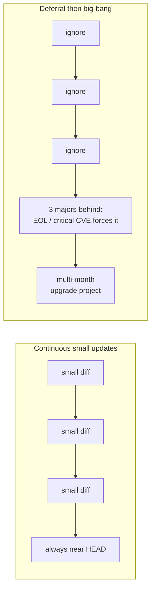
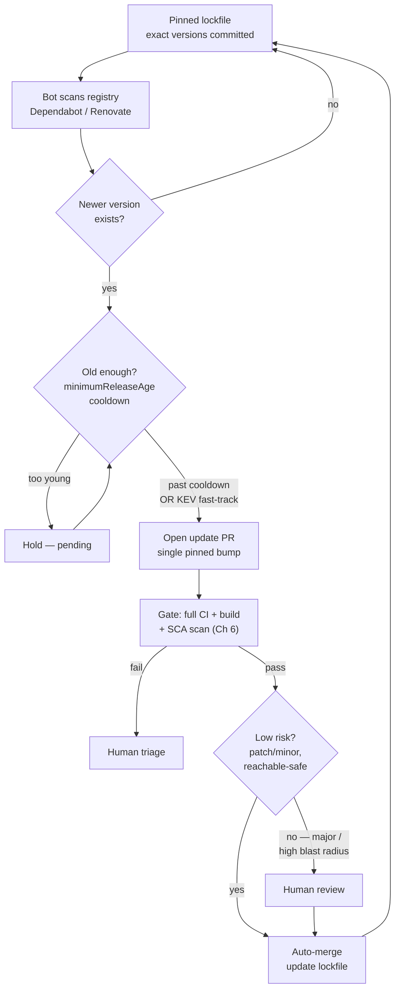
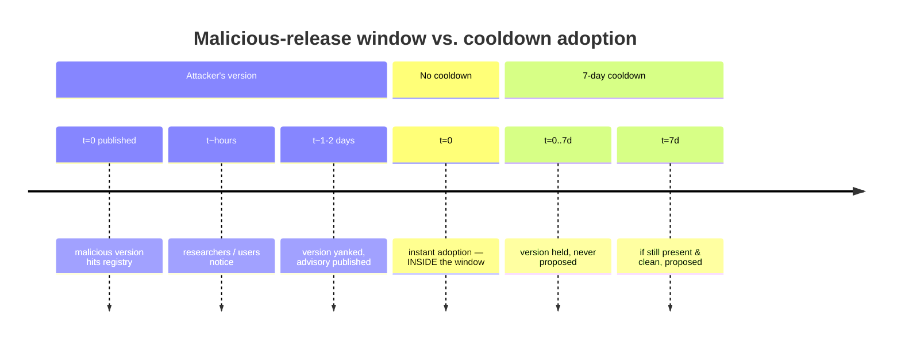
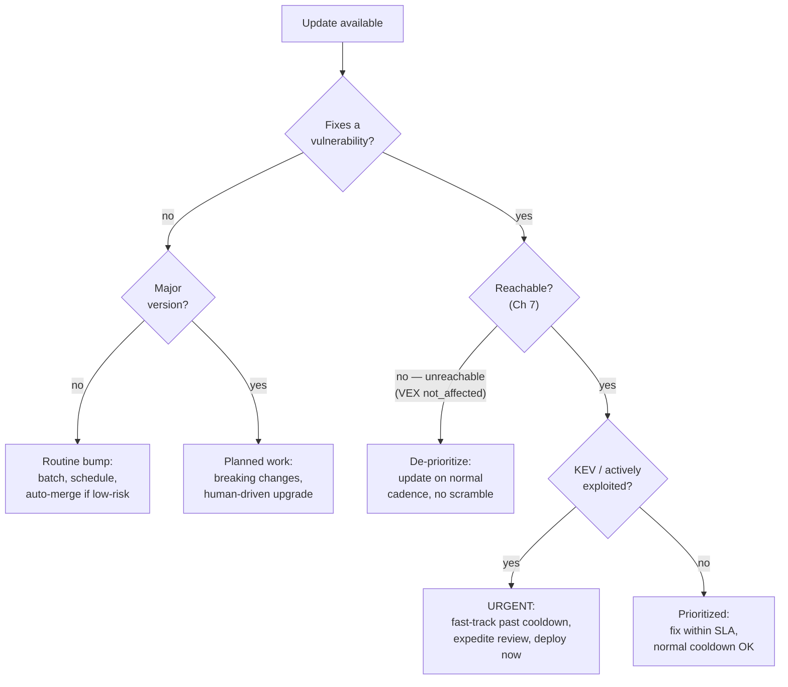
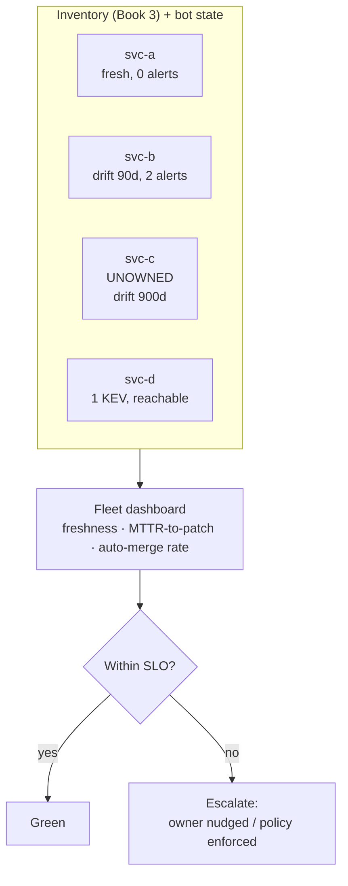
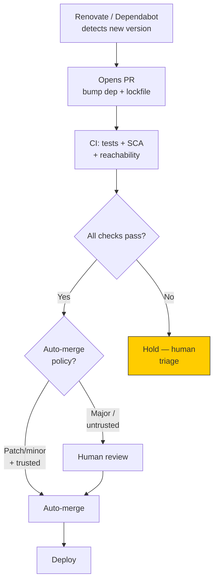
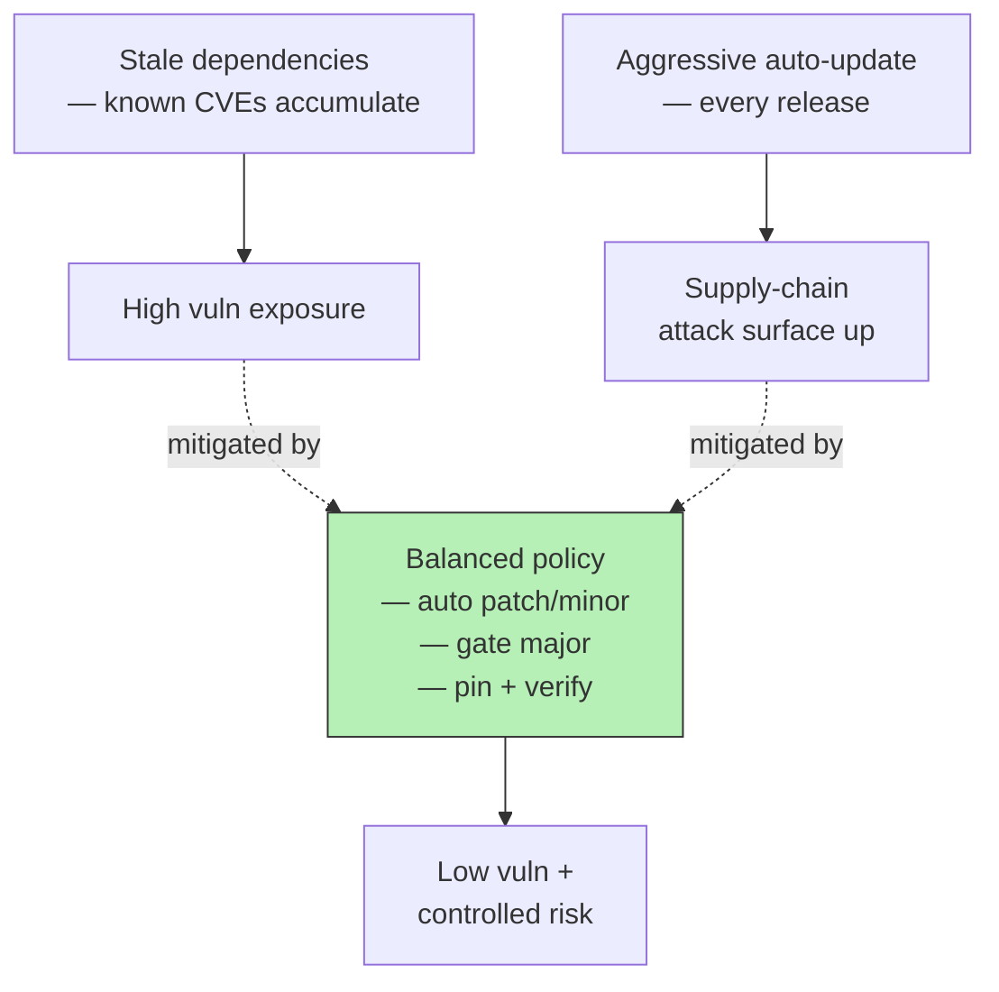

# Chapter 9 — Dependency Update Strategy and Automation

*What this chapter covers.* This book has spent eight chapters building tension and refusing to
resolve it. Chapter 2 argued for pinning exact versions and committing lockfiles, because
reproducibility and defense against silent substitution demand that a build resolve to the *same*
bytes every time. Chapters 3 and 4 showed that the very act of pulling a new version is the primary
supply-chain attack vector — a compromised maintainer account or a typosquat ships malware in a
release you did not write and barely reviewed. And yet Chapters 5, 6, and 7 insisted that the
dependencies you froze in place are quietly accumulating known vulnerabilities, and that *not*
updating is itself a security failure with a name and a CVE list. So which is it — pin and stay
still, or update and expose yourself? This chapter is the resolution, and the answer is neither
horn of the dilemma. You pin *and* you update, continuously, through disciplined automation with a
cooldown and a gate. That combination — reproducibility from pinning, currency from automated
proposals, safety from a quarantine window and CI — is the recommended posture for every serious
codebase, and the operational playbook for achieving it at fleet scale is the subject of this
chapter.

Learning goals — after this chapter you should be able to:

- Explain why **updating dependencies is a security activity**, why *not* updating is a
  vulnerability, and why blind auto-updating is simultaneously an attack vector — and hold both
  truths at once.
- Compare **Dependabot and Renovate** accurately: their real configuration models, grouping,
  scheduling, auto-merge, and the cooldown control (`minimumReleaseAge`) that is the single most
  important safety feature.
- Design a **safe-update policy**: cooldown/quarantine, CI-and-SCA gating, grouping for noise
  management, and the pin-plus-automate loop that gives you reproducibility and currency together.
- Distinguish **update types by urgency** — security patch, routine bump, major upgrade — and tie
  urgency to the reachability-and-KEV prioritization model from Chapter 7.
- Operate update automation **at fleet scale**: org-wide presets, freshness metrics as an SLO, the
  unowned long tail, and coordinated fleet-wide response when a Log4Shell-class CVE drops.

This chapter assumes the sourcing chokepoint of Chapter 8 (an internal registry or proxy) and the
prioritization machinery of Chapter 7 (reachability, VEX, KEV). Update automation is what *drives*
that machinery — it is the actuator that turns "we know we should be on 1.2.4" into "1,400 repos
are on 1.2.4."

## Updating is a security activity — and so is not updating

Start with the uncomfortable symmetry. Both action and inaction here are security-relevant, and
teams that internalize only one half of it end up in a predictable failure mode.

**Inaction is a vulnerability.** A dependency you froze eighteen months ago has not stood still in
the world's eyes even though it has stood still in your lockfile. Vulnerabilities are discovered in
it, published to the advisory databases (Chapter 5), and — critically — the *fix* ships as a new
version you have not adopted. The gap between "a patched version exists" and "you are running it" is
pure, self-inflicted exposure. Attackers read the same advisories and changelogs you do; a public
CVE with a public patch is a public map to the unpatched. Log4Shell (CVE-2021-44228) was not
dangerous only in the hours after disclosure — it was dangerous for the *months* afterward in every
organization that could not, or did not, roll out log4j 2.17. The dwell time between disclosure and
remediation is the window an attacker operates in, and for a stale fleet that window is measured in
quarters. Stale dependencies are not "technical debt" in the soft sense of the phrase; they are a
growing pile of *known, indexed, exploitable* defects with your name on them.

**Action is an attack vector.** And yet the mechanism by which you fix a stale dependency — pull a
newer version and run its code — is precisely how the worst supply-chain compromises reach you.
Book 1, Chapter 4 (Case Studies: Dependency Attacks) and Chapter 4 of this book catalog the
pattern: `event-stream` gained a malicious dependency in a point release; `ua-parser-js`,
`coa`, and `rc` shipped credential stealers from hijacked maintainer accounts; the `xz-utils`
backdoor rode in on ordinary-looking releases from a trusted contributor. In every case the
malicious payload arrived *as an update* — a new version, freshly published, that an
auto-updating consumer would pull within minutes. An organization that reflexively adopts the
newest version of everything the moment it appears has built the perfect delivery pipeline for a
smash-and-grab malicious release.

So the requirement is not "update" and it is not "don't update." It is **update fast enough to
close the disclosure-to-patch window, but with enough friction and inspection that a malicious or
broken release cannot slip through unexamined.** Those two goals pull in opposite directions along
a single axis — *time to adopt a new version* — and the entire discipline of this chapter is about
placing the fleet at the right point on that axis and defending the point with automation.

### Dependency drift and the big-bang death march

The tension has a scaling dimension that is easy to underestimate. Consider not one dependency but
the transitive closure of a large service — hundreds to low thousands of packages — and not one
service but a fleet of hundreds. Every one of those (service, dependency) pairs drifts
independently. Left alone, each service's manifest ages at the rate the ecosystem releases, which
for a busy JavaScript or Python project means *dozens* of your dependencies ship a new version
every week.

There are two ways to pay the resulting bill, and their cost curves are radically different.

The first is **continuous small updates**: adopt patch and minor bumps as they land, in a steady
trickle, each one a small diff that CI validates in isolation. The per-update cost is low, the blast
radius of any one update is small, and the codebase never drifts more than a few days from the
ecosystem's current state.

The second is **deferral followed by a big-bang upgrade**: ignore updates until something forces the
issue — an end-of-life announcement, a critical CVE with no backport to your ancient major version,
a new hire who refuses to work against a five-year-old framework — and then attempt to close years
of drift in a single project. This is the "we're three major versions behind" death march, and
anyone who has lived one knows its shape: every major bump in the chain has breaking changes; the
breaking changes interact; the test suite that would tell you whether the upgrade worked was itself
written against the old APIs; and the transitive graph has shifted so far that resolving a
consistent set at all becomes a research project. A drift that would have cost an hour a week
compounds into a quarter of a senior engineer's time, taken all at once, under deadline pressure,
with maximal risk.



The economics are not close, and the security economics are worse than the engineering economics: a
fleet that defers cannot adopt a security patch on demand, because "adopt the patch" for a
three-major-versions-behind service *is* the death march. Continuous updating is not merely tidier;
it is the precondition for being able to respond to an incident at all. You cannot sprint if you
have not been walking. The rest of this chapter is about making continuous updating cheap enough
that teams actually do it, and safe enough that it does not become the attack vector we just warned
about.

## The tooling: Dependabot and Renovate

Two tools dominate automated dependency updating, and their differences are not cosmetic — they
encode different philosophies about how much policy you want to express and how much control you
want centralized. Understand both mechanically before choosing.

### Dependabot

Dependabot is GitHub's native offering, and its great virtue is that it is *already there*: no app
to install, no runner to host, tight integration with GitHub's Advisory Database and the
repository's security tab. It operates in two distinct modes that are frequently conflated, and the
distinction matters for policy.

**Dependabot security updates** are alert-driven. When GitHub's Advisory Database records a
vulnerability affecting a version in your dependency graph, Dependabot raises an *alert* and can
automatically open a pull request bumping the offending package to the minimum non-vulnerable
version. These fire regardless of your schedule — they are reactive to disclosure — and they are the
mechanism most directly tied to the security mission. They can be enabled with no configuration file
at all.

**Dependabot version updates** are schedule-driven and configured explicitly in
`.github/dependabot.yml`. This is the routine-currency engine: on the cadence you specify, it checks
each ecosystem for newer versions and opens PRs. A representative config:

```yaml
version: 2
updates:
  - package-ecosystem: "npm"
    directory: "/"
    schedule:
      interval: "weekly"
      day: "monday"
    open-pull-requests-limit: 10
    groups:
      # Grouped updates: one PR for many low-risk bumps instead of a flood
      dev-dependencies:
        dependency-type: "development"
        update-types: ["minor", "patch"]
      production-patches:
        dependency-type: "production"
        update-types: ["patch"]
    ignore:
      # Never auto-bump the major of a framework we upgrade deliberately
      - dependency-name: "react"
        update-types: ["version-update:semver-major"]
    labels: ["dependencies"]
    commit-message:
      prefix: "deps"
  - package-ecosystem: "github-actions"
    directory: "/"
    schedule:
      interval: "weekly"
```

Grouped updates — the `groups` block — were a significant and relatively recent addition; before
them, Dependabot opened one PR per dependency, which at fleet scale meant drowning teams in review
noise. Grouping collapses many low-risk bumps into a single reviewable, mergeable unit.

Dependabot has no built-in review or merge policy of its own; auto-merge is assembled from GitHub
primitives. The idiomatic pattern is a workflow triggered on Dependabot's PRs that inspects the
update metadata and enables GitHub's native auto-merge for the safe cases:

```yaml
name: dependabot-auto-merge
on: pull_request
permissions:
  contents: write
  pull-requests: write
jobs:
  automerge:
    if: github.actor == 'dependabot[bot]'
    runs-on: ubuntu-latest
    steps:
      - uses: dependabot/fetch-metadata@v2
        id: meta
      - name: Auto-merge patch and minor
        if: steps.meta.outputs.update-type == 'version-update:semver-patch' || steps.meta.outputs.update-type == 'version-update:semver-minor'
        run: gh pr merge --auto --squash "$PR_URL"
        env:
          PR_URL: ${{ github.event.pull_request.html_url }}
          GH_TOKEN: ${{ secrets.GITHUB_TOKEN }}
```

Note the shape: `--auto` merges *only after* required status checks pass, so CI remains the gate.
Historically Dependabot's most-cited weakness was the absence of a version **cooldown** — a way to
refuse versions younger than N days — which is the central safety control this chapter builds toward.
GitHub has since added a `cooldown` configuration to `dependabot.yml` (letting you specify a minimum
age, with the option of different windows for patch/minor/major); if your Dependabot supports it,
enable it. Treat the exact option surface as something to verify against current GitHub
documentation rather than memory, because it is newer and less battle-tested than Renovate's
equivalent.

### Renovate

Renovate (open-source, stewarded by Mend) is the more configurable tool, and at scale it is
frequently the better choice for reasons that come down to *policy expressiveness* and *centralized
control*. It runs as a hosted app (the Mend Renovate app on GitHub) or as a self-hosted CLI/bot you
point at any platform, and it is configured in JSON5 (`renovate.json`) with a preset system that is
its defining feature.

The controls that matter for a safe-update policy:

- **`minimumReleaseAge`** (formerly named `stabilityDays`) is the cooldown control. A rule of
  `"minimumReleaseAge": "7 days"` tells Renovate not to *propose* a version until it has existed on
  the registry for at least seven days. This is the single most important security feature in the
  tool, and we devote a full section to why below. Renovate pairs it with `internalChecksFilter` to
  decide whether pending (too-young) releases hold back a branch or are simply skipped.
- **`packageRules`** is the policy engine: match on package name patterns, `matchDepTypes`,
  `matchUpdateTypes` (major/minor/patch/pin/digest), `matchPackagePatterns`, `matchManagers`, and
  apply grouping, scheduling, automerge, labels, or a different cooldown to each match. This is where
  "dev dependencies auto-merge, framework majors go to a human" becomes a few lines of config.
- **`group` / `groupName`** collapse related updates into one PR. Renovate ships opinionated grouping
  presets (`group:monorepos`, `group:recommended`, and many ecosystem-specific ones) that already
  know, for example, that all `@angular/*` packages must move together.
- **`schedule`** constrains *when* PRs are raised, in a readable syntax (`"after 10pm every
  weekday"`, or presets like `schedule:nonOfficeHours`, `schedule:weekends`, `schedule:earlyMondays`).
  Combined with `prConcurrentLimit` and `prHourlyLimit`, this is your primary noise-management lever.
- **`automerge`** with `automergeType` (`pr` via the platform, or `branch` to skip the PR entirely
  for the quietest cases) and `platformAutomerge` to use GitHub's merge queue. Auto-merge is
  expressed per-rule, so it composes with everything above.
- **The Dependency Dashboard** — an auto-maintained issue in each repo listing every pending update,
  every rate-limited or errored one, and checkboxes to force a PR — turns "what is Renovate waiting
  on?" from a mystery into a page.
- **Custom (regex) managers** (`customManagers` with `"customType": "regex"`) extend updating to
  versions embedded in files Renovate does not natively parse — a pinned tool version in a
  Dockerfile comment, a `ARG SOMETHING_VERSION`, a version string in a shell script. Almost nothing
  is un-updatable.
- **Presets and `extends`** are the org-scale superpower. You publish one config repository
  (`org/renovate-config`) and every other repo's `renovate.json` is a one-liner:
  `{ "extends": ["local>org/renovate-config"] }`. Change the org preset and the whole fleet's policy
  moves at once. We return to this under fleet scale; it is the single strongest argument for
  Renovate in a large organization.

A representative org-consuming config:

```json5
{
  "extends": ["local>acme/renovate-config"],
  "minimumReleaseAge": "5 days",
  "packageRules": [
    {
      "matchDepTypes": ["devDependencies"],
      "matchUpdateTypes": ["patch", "minor"],
      "groupName": "dev dependencies",
      "automerge": true
    },
    {
      "matchUpdateTypes": ["patch"],
      "automerge": true
    },
    {
      "matchUpdateTypes": ["major"],
      "automerge": false,
      "labels": ["major-upgrade", "needs-review"]
    },
    {
      // Actively-exploited fixes jump the cooldown queue
      "matchDepPatterns": ["*"],
      "isVulnerabilityAlert": true,
      "minimumReleaseAge": "0 days",
      "automerge": false,
      "labels": ["security"]
    }
  ]
}
```

Renovate can also raise **vulnerability-fix PRs** driven by OSV data (`osvVulnerabilityAlerts`),
giving you a security-update path comparable to Dependabot's, but expressed inside the same policy
engine as everything else — which means your cooldown, grouping, and automerge rules all compose
with it.

### Choosing, and the honest comparison

| Dimension | Dependabot | Renovate |
| --- | --- | --- |
| Hosting | Native to GitHub, zero setup | Hosted Mend app or self-hosted CLI; any platform |
| Config surface | `dependabot.yml`, deliberately small | JSON5 + presets, very large |
| Cooldown / min-age | `cooldown` (newer, less proven) | `minimumReleaseAge`, mature and widely used |
| Grouping | `groups` block (added later) | `packageRules` + grouping presets, very flexible |
| Scheduling | interval + day | rich schedules, concurrency and hourly limits |
| Auto-merge | assembled from Actions + native auto-merge | first-class, per-rule, branch or PR |
| Org-wide policy | per-repo files (some org defaults) | shared presets via `extends` — one source of truth |
| Custom file formats | limited | regex/custom managers |
| Dashboard | security tab / alerts | per-repo Dependency Dashboard issue |

The honest summary: **Dependabot is the right default for a single repository or a small
GitHub-native shop** — it is present, it is simple, and simple is a virtue when the alternative is
an unmaintained pile of config. **Renovate is usually the right choice at fleet scale**, because the
things that matter across hundreds of repos — a mature cooldown, one centrally-managed policy via
presets, fine-grained grouping and scheduling to control noise — are exactly where it is stronger.
Many organizations run Dependabot's *security* alerts (for the advisory-database integration and the
security tab) alongside Renovate as the *version-update* engine, and that is a coherent posture, not
a contradiction. Do not mistake tool choice for strategy, though: both tools implement the same
policy shape, and it is the policy — cooldown, gate, grouping, urgency tiers — that determines
whether your updating is safe.

### Ecosystem-native and adjacent tooling

Bots are not the only mechanism, and some ecosystems have first-class local tooling worth knowing:

- **JavaScript**: `npm-check-updates` (`ncu`) rewrites `package.json` ranges to the latest, for the
  developer-driven "let me pull everything current right now" workflow. It has no cooldown or gate of
  its own — it is a hammer, not a policy — so use it interactively, not in automation.
- **Go**: `go get -u ./...` bumps within a module; Dependabot and Renovate both support Go modules
  and are the automated path. Go's module proxy and checksum database (Chapter 8) give updates a
  strong integrity floor.
- **Python**: `pip-tools` (`pip-compile --upgrade`) and increasingly **uv** (`uv lock --upgrade` /
  `--upgrade-package`) recompile a pinned lockfile from loose top-level constraints — the same
  pin-and-recompile discipline Chapter 2 argued for, driven locally, with the bot proposing the
  recompiles.
- **JVM / Scala**: **Scala Steward** is a dedicated bot for the Scala ecosystem (sbt/Mill),
  functionally analogous to Renovate for that world; Gradle and Maven have `versions` plugins for
  local checks, and both are Renovate/Dependabot targets.

The common thread: local tools are for a human deciding to update *now*; bots are for the continuous,
policy-governed trickle. A mature program uses the bots for the steady state and keeps the local
tools for interactive major-upgrade work.

## The pin-plus-automate loop

Here is the resolution of the book's central tension, stated as a mechanism rather than a slogan.
**Pin exact versions and commit the lockfile (Chapter 2), *and* run a bot that continuously proposes
bumps against that lockfile.** Pinning gives you reproducibility and immunity to silent
substitution; the bot gives you currency; the cooldown and CI gate give you safety. You give up
nothing that pinning bought you, because every proposed bump is an explicit, reviewable,
CI-validated *change to the pinned version* — not a silent drift.

Contrast this with the tempting-but-wrong alternative of **floating ranges** (`^1.2.0`, `>=2,<3`).
Floating ranges appear to give you currency for free — resolve at install time and you get whatever
is newest-compatible. But they give it to you *without a gate*: the version that lands is whatever
the registry served at the moment CI happened to run, adopted with zero review, zero cooldown, and
zero reproducibility. Two builds an hour apart can differ. A malicious release published between them
is adopted automatically. Floating ranges are the auto-updating attack surface we warned about in the
first section, dressed up as convenience. Pinning plus a bot gives you the *same currency* with a
*review gate and a cooldown and a reproducible result* — strictly better on every axis that matters.

The loop:



Every arrow back to "Pinned lockfile" is the invariant closing: the repository is *always* in a
pinned, reproducible state, and the only way a version changes is through a PR that passed the gate.
The bot is a proposer; the gate is the decider; the human is in the loop exactly where risk requires
it and nowhere it does not. This loop is the whole strategy. The remaining sections are its
parameters: how long the cooldown, what the gate checks, how to group, and how urgency overrides the
defaults.

## The cooldown: quarantine as smash-and-grab defense

The cooldown — Renovate's `minimumReleaseAge`, Dependabot's `cooldown`, and the registry-level
quarantine of Chapter 8 — is the highest-value single control in a safe-update policy, and it is
worth understanding *why* precisely, because the reasoning also tells you how to tune it.

The threat model is the **smash-and-grab malicious release**. An attacker compromises a maintainer
account (phished token, leaked credential, hostile takeover of an abandoned package) and publishes a
malicious version. Their goal is maximum reach before detection, because these releases *are*
detected — by the maintainer noticing, by security researchers, by ecosystem automation, by the flood
of user reports — and once detected the version is yanked and the advisory published, typically
within hours to a couple of days. The malicious version's *useful life to the attacker* is the
window between publication and yank.

An organization that adopts new versions instantly puts itself squarely inside that window. An
organization that refuses to adopt any version younger than, say, seven days simply *is not in the
building* when the smash-and-grab happens — the malicious version is discovered and yanked long
before the cooldown expires, and the org never proposes it at all.



The elegance is that the cooldown costs you almost nothing on the legitimate path. A normal patch
release that fixes a real bug is just as good on day seven as on day zero; you lose a week of being
marginally-more-current on routine bumps, which is noise against the drift you are preventing. The
one place the cooldown genuinely bites is **security patches** — a legitimate fix for a real,
actively-exploited vulnerability, where a week of delay is a week of exposure. That is why every
serious cooldown policy pairs the quarantine with an **exception path**:

- For a vulnerability in **CISA's Known Exploited Vulnerabilities (KEV) catalog** — meaning it is
  being exploited in the wild *right now* — you fast-track the fix past the cooldown. In Renovate,
  `isVulnerabilityAlert` rules can set `minimumReleaseAge` to zero (as in the config above); a fix
  for an actively-exploited flaw is proposed immediately.
- For everything else, the cooldown holds. A vulnerability that is disclosed but not exploited, or a
  fix that is not urgent, waits out the quarantine like any other release — because the fix itself
  could be the smash-and-grab (a "security patch" that is actually a backdoor is a known pattern).

This is the trade stated plainly: the cooldown delays *all* adoptions by N days, which is free for
routine bumps and slightly costly for legitimate security fixes; the KEV exception buys back the one
case where the delay is genuinely dangerous. Seven days is a common, defensible default;
some orgs run three for lower friction and some run fourteen for higher assurance, and you can set
the window per-rule (longer for high-blast-radius shared libraries, shorter for leaf dev tools).

Note the **defense-in-depth** relationship with Chapter 8. The cooldown can live in *two* places: at
the update layer (the bot refuses to propose a too-young version) and at the registry layer (the
internal proxy refuses to *ingest* a too-young version at all). These are not redundant — the
registry-level quarantine protects every consumer including those not driven by a bot (a developer
running `npm install` directly, a build that pins by hand), while the bot-level cooldown shapes what
gets *proposed as an update*. Run both. The registry quarantine is the floor under the whole fleet;
the bot cooldown is the policy on top of it.

## Gating updates through CI

A proposed update is worthless — dangerous, even — without a gate, and the gate is the pull request.
The single most important framing in this whole discipline is that **the update PR is the unit of
review and the unit of validation.** Everything you would do to inspect a human's code change, you do
to a bot's dependency change, automatically, on every PR.

At minimum the gate runs, and requires green, before any merge (auto or human):

1. **The full test suite.** Not a smoke subset — the tests are the only thing standing between "the
   bump compiles" and "the bump preserves behavior." A minor bump that quietly changes a default, a
   patch that fixes one bug and regresses another: the test suite is what catches these. This is also
   the argument, made concrete, for *why the death march is so expensive* — a service with thin tests
   cannot safely auto-merge anything, so it either drifts or absorbs manual review on every bump.
2. **The build.** Type-checking, compilation, bundling — the update must produce a working artifact.
3. **SCA (Chapter 6).** Scan the *resulting* dependency set. This closes an important loop: an
   update that *introduces* a new vulnerability (a bump that pulls a new transitive dep with a known
   CVE) must fail the gate, not sail through because "updating is good." The SCA scan on the PR's
   lockfile is what makes the gate bidirectional — it blocks bad updates as firmly as it motivates
   good ones.
4. **Provenance / integrity checks where you have them** (Book 5): signature verification, and
   crucially a check that the update did not rewrite *resolved URLs or integrity hashes* in the
   lockfile to point somewhere unexpected — the **lockfile-poisoning** vector of Chapter 2. A bump
   that changes a version *and also* silently repoints an unrelated dependency's resolved URL is a red
   flag that must stop auto-merge cold.

Only if all of this is green does the update become eligible to merge. For the low-risk tier that
eligibility means auto-merge; for the high-risk tier it means "a human may now review a PR that has
already been validated." Either way, **CI is the gate that both automation and humans depend on**, and
a fleet whose CI is flaky or slow will find its update discipline collapses — teams disable
auto-merge, PRs pile up, drift returns. Investment in fast, trustworthy CI is investment in
patchability.

## Grouping, tiering, and noise management

The failure mode that kills update automation in practice is not a bad merge — it is **PR fatigue**.
A fleet with per-dependency PRs and no grouping generates a firehose; teams stop reading the PRs,
stop trusting them, and eventually mute the bot. Dead automation patches nothing. So a real policy is
as much about *noise management* as about safety, and the two goals align: the same tiering that
makes updates safe makes them quiet.

Tier updates by risk, and treat each tier differently:

- **Low risk → group and auto-merge.** Dev dependencies, patch bumps, digest updates, well-tested
  leaf libraries. Group these into a small number of PRs (one for dev-deps, one for prod patches),
  let CI gate them, and auto-merge on green after cooldown. A team should see *one* dev-dependency PR
  a week that mostly merges itself, not forty.
- **Medium risk → individual PR, human review, no auto-merge.** Minor bumps of production
  dependencies, especially ones with meaningful surface area. One PR each so the diff is reviewable;
  a human glances at the changelog; merge on green.
- **High risk → isolate and escalate.** Major-version bumps (breaking by SemVer contract), and
  updates to **high-blast-radius shared libraries** — the internal platform library, the logging
  framework, the serialization core — that a hundred services depend on. These are never grouped
  (you need to reason about each in isolation) and never auto-merged. A major bump of a shared
  library is *planned work*, not a bot PR you rubber-stamp.

The grouping is expressed directly in the tools: Dependabot's `groups` block, Renovate's
`packageRules` with `groupName` plus ecosystem grouping presets that already know which package
families must move together. Scheduling and concurrency limits (`schedule`, `prConcurrentLimit`,
`prHourlyLimit`) cap the flow so a big release day does not produce a hundred simultaneous PRs. The
target is a *steady, quiet trickle* that teams trust enough to keep reading — because a bot the team
trusts is a bot the team lets auto-merge, and auto-merge is what keeps the fleet current without
human toil.

## Update types and urgency

The tiering above is about *risk of the change*. Orthogonal to it is *urgency of the change*, and the
two must not be confused. Urgency is driven by *why* you are updating, and it maps directly onto the
prioritization model of Chapter 7.



Walk the three update *types*:

- **Security updates** patch a known vulnerability, and their urgency is *not uniform* — this is the
  key insight Chapter 7 earned. A security fix for a **reachable, KEV-listed** vulnerability is
  genuinely urgent: fast-track it past the cooldown, expedite or waive the usual review latency, and
  deploy it fleet-wide as fast as your rollout allows. A security fix for an **unreachable**
  vulnerability — one your VEX analysis has marked `not_affected` because the vulnerable code path is
  never called — is *not* an emergency; adopting it on the normal cadence is fine, and scrambling for
  it is wasted urgency that trains teams to ignore the next real alarm. **Do not scramble to patch an
  unreachable vuln; do scramble for a reachable KEV one.** Urgency is earned by reachability and
  exploitation, not by the mere existence of a CVE.
- **Routine version bumps** carry no security urgency. They exist to prevent drift, and drift is a
  slow problem, so they get the cheap treatment: batch them, schedule them for off-hours, auto-merge
  the low-risk tier on green. The entire point of automating these is to keep them from consuming
  human attention that should be spent on the urgent tier.
- **Major version upgrades** are not automatable and should not be automated. By the SemVer contract
  a major bump *is allowed to break you*, and adopting one means reading a migration guide, updating
  call sites, and revalidating behavior. Automation's role here is limited to *surfacing* the
  available major (the Dependency Dashboard listing it) and holding it in the "needs planning" queue —
  never to merging it. A major upgrade is a scheduled engineering task with an owner, not a bot PR.

The interaction with **reachability and VEX** deserves emphasis because it is where mature programs
diverge from immature ones. An immature program treats every CVE alert as equally urgent, scrambles
constantly, burns out its engineers, and *still* misses the one that mattered because it was buried
in the noise. A mature program uses reachability to route: unreachable findings ride the routine
cadence and often get closed by the ordinary bump that was coming anyway; reachable KEV findings
trip the fast-track. The update automation is the same machine in both cases — the difference is
which lever the finding pulls, and reachability is what decides.

## Operating at fleet scale

Everything so far describes one repository well. The distributed-systems reality is hundreds of them,
owned by dozens of teams, at wildly varying levels of hygiene — and this is where update *strategy*
becomes update *governance*.

### Org-wide presets: the paved road

The Chapter 8 idea of a paved road applies directly. You do not want three hundred repos each with a
hand-rolled, subtly-different, slowly-rotting Renovate config; you want *one* config that encodes the
org's policy — cooldown window, tiering, grouping, KEV fast-track, security-team labels — and three
hundred repos that inherit it in a single line:

```json5
// every repo:
{ "extends": ["local>acme/renovate-config"] }
```

```json5
// acme/renovate-config/default.json — the one source of truth
{
  "extends": ["config:recommended"],
  "minimumReleaseAge": "7 days",
  "prConcurrentLimit": 5,
  "schedule": ["after 9pm every weekday", "every weekend"],
  "packageRules": [
    { "matchDepTypes": ["devDependencies"], "matchUpdateTypes": ["patch", "minor"],
      "groupName": "dev dependencies", "automerge": true },
    { "matchUpdateTypes": ["patch"], "automerge": true },
    { "matchUpdateTypes": ["major"], "automerge": false, "addLabels": ["major-upgrade"] },
    { "isVulnerabilityAlert": true, "minimumReleaseAge": "0 days",
      "addLabels": ["security"], "reviewers": ["team:appsec"] }
  ]
}
```

Now policy is *centrally managed and consistently applied*. When AppSec decides the cooldown should
be five days, or that a newly-critical shared library must never auto-merge, they change the preset
and the whole fleet moves — no three-hundred-PR migration, no repos left behind on stale policy. This
is the single strongest operational argument for Renovate at scale, and it is why the preset system,
not any individual feature, is the reason large orgs pick it. Dependabot has partial analogues (org
default configs), but the shared-preset model is Renovate's home turf.

### Freshness as a fleet metric and an SLO

You cannot manage what you cannot see, and at fleet scale the thing to see is **dependency
freshness** — how far each service has drifted from current — and **MTTR-to-patch** — how long it
takes a disclosed, prioritized vulnerability to reach zero affected services. These are the update
program's analogues of the reliability SLOs your services already run on, and they belong on the same
dashboards (Book 1, Chapter 10 — Building a Program; Book 8, Chapter 8 — Metrics, Audits, and
Executive Reporting).

Concretely, track per-service and roll up to the fleet:

- **Freshness / libyear-style drift**: the aggregate age gap between what a service runs and what is
  current. A service whose drift is climbing is a death march accruing.
- **Time-to-patch distribution**: for each disclosed, reachable vulnerability, the time from advisory
  to "no service affected." This is the number executives and regulators actually care about, and the
  number that continuous updating *directly improves*.
- **Auto-merge rate and PR-close latency**: how much of the update flow is friction-free versus
  stuck. A falling auto-merge rate is an early warning that CI or trust is degrading.



Make freshness an **SLO with teeth**, not a vanity chart. "Every production service must be within N
days of current and must carry no reachable, unpatched KEV vulnerability older than its SLA" is a
policy you can enforce — in CI (fail the build that falls too far behind), in the paved-road platform
(un-updated services lose a compliance badge), and in the governance process (Book 8). Without
enforcement, freshness targets are decoration; with it, they are the mechanism that keeps the fleet
patchable.

### The long tail: unowned, abandoned, and rarely-tested services

The fleet's average freshness is a lie the moment you look at the tail. Every large org has services
nobody owns — the team reorganized, the original author left, the thing has run untouched for three
years — and these are precisely the services that (a) drift the most and (b) break when you finally
update them, because their thin, stale tests validate nothing. The long tail is where update
automation's promises go to die, and it must be managed deliberately:

- **Ownership is the precondition.** A service with no owner cannot be updated safely because there is
  no one to judge a failed test or approve a major. The inventory (Book 3) that lists services must
  also list *owners*, and an unowned production service is itself an incident to be resolved —
  reassigned or decommissioned. "Nobody owns it" is not a stable state for something on the internet.
- **A "must stay current" policy with enforcement.** The paved road makes currency the default; the
  policy makes it mandatory. Services that fall outside the freshness SLO get escalated, and
  ultimately a service that cannot be kept current is a service that must be *retired* — the safest
  dependency is the one you deleted with the service that used it.
- **The rarely-tested-service problem** has no cheap fix, only an honest one: a service whose tests
  cannot validate an update cannot auto-merge, so it either gets enough tests to participate in the
  automation or it gets human review on every bump or it gets decommissioned. Pretending a thinly-
  tested service is safe to auto-update is how a routine patch takes down production.

### Coordinated fleet-wide response: the payoff

Everything in this chapter pays off in a single scenario, and it is the scenario that justifies the
whole discipline: **a critical, actively-exploited CVE drops in a widely-used dependency** — the
Log4Shell shape. On December 9–10, 2021, when CVE-2021-44228 went public, every organization on the
planet faced the same two questions in the same order: *where do we have it?* and *how fast can we
replace it everywhere?*

The answer to the first is inventory (Book 3, Chapter 5 — SBOM Distribution, Storage, and Querying at
Scale): a fleet with an SBOM-keyed inventory answers "which services pull log4j-core, at what version,
reachably?" in minutes, not the weeks of frantic grep that unprepared orgs actually spent.

The answer to the *second* is this chapter. A fleet that has practiced continuous updating can push a
fix everywhere fast, because:

- The **automation is already wired** — a security-fix PR can be raised against every affected repo
  at once, past the cooldown via the KEV fast-track, with the org preset ensuring consistent labeling
  and routing.
- The **services are near-current**, so the fix is a small bump against a recent version, not a
  three-major death march per service under fire.
- The **CI gates are trusted**, so validated fixes can auto-merge and roll out at machine speed.
- The **freshness SLO and dashboard** turn "are we done?" from a rumor into a burn-down chart:
  affected-service count ticking toward zero, in view of everyone who needs to see it.

The contrast is the entire thesis. An org that deferred updates faced Log4Shell as hundreds of
independent, manual, dangerous upgrades of services that had drifted for years — the months-long
scramble. An org that updated continuously faced it as a *managed rollout* of a small, familiar bump
across a fleet it could see and steer. The Log4Shell fix that took one org an afternoon took another
a quarter, and the only difference was whether they had been walking before they had to sprint.

## Distributed-systems lens

The single-service view of dependency updating is a solved problem — pin, gate, cooldown, auto-merge.
The distributed-systems view is where the strategy earns its keep, and four points bind it together:

- **Continuous small updates keep the fleet patchable.** Patchability is not a property you can
  acquire in an emergency; it is a property you maintain continuously or lack entirely. A fleet that
  drifts loses the *ability* to respond, because responding becomes the death march. The steady
  trickle of small, gated bumps is what keeps every service one small step from current — and
  therefore one small step from patched.
- **Centralized policy plus inventory turns "patch 500 services" from a scramble into a rollout.** The
  org preset makes policy uniform and centrally steerable; the inventory makes the fleet visible; the
  automation makes the fix pushable everywhere at once. Together they convert a fleet-wide response
  from N independent heroics into one managed, observable operation.
- **Cooldown is defense-in-depth across two layers.** The registry-layer quarantine (Chapter 8)
  protects every consumer including the un-botted ones; the update-layer `minimumReleaseAge` shapes
  what gets proposed. Neither alone is complete; together they close the smash-and-grab window at both
  the ingestion boundary and the proposal boundary.
- **Freshness is an SLO.** Treat time-to-patch and drift as reliability targets with enforcement,
  reported alongside availability and latency, and the whole program acquires the one thing that makes
  distributed-systems disciplines actually stick: a measurable objective that a service can be *out
  of*, with consequences that follow.

The through-line of this book resolves here. Pinning (Chapter 2) and updating are not opposites; they
are the two halves of a single loop, and automation with a cooldown and a gate is the machine that
runs it. Do that continuously, at fleet scale, with policy centralized and freshness measured, and
you get what the book has been promising: reproducibility and currency and safety, all three, at
once.

## Key takeaways

- **Both updating and not-updating are security-relevant.** Stale dependencies accumulate known,
  indexed, exploitable CVEs — inaction is a vulnerability. But adopting new versions is the primary
  supply-chain attack vector (Book 1, Chapter 4). The goal is fast patching *with* enough friction and
  inspection to catch malicious or broken releases — not one or the other.
- **Pin *and* automate.** Pin exact versions and commit the lockfile (Chapter 2) for reproducibility
  and anti-substitution; run Dependabot or Renovate to continuously propose gated bumps for currency.
  This beats floating ranges on every axis — floating ranges give currency without a review gate,
  cooldown, or reproducibility.
- **The cooldown is the highest-value control.** `minimumReleaseAge` / `cooldown` refuses versions
  younger than N days, which sidesteps the smash-and-grab malicious-release window at almost no cost to
  routine updating. Pair it with a **KEV fast-track** so actively-exploited fixes jump the queue, and
  run it at both the registry layer and the update layer as defense-in-depth.
- **The update PR is the unit of review and validation.** Gate every bump through the full test suite,
  the build, SCA (Chapter 6) on the resulting lockfile, and integrity/provenance checks that catch
  lockfile poisoning. CI is the gate both auto-merge and humans depend on; invest in it.
- **Tier by risk and group for quiet.** Auto-merge grouped low-risk updates (dev deps, patches);
  individually review medium-risk minors; isolate and hand-drive high-risk majors and high-blast-radius
  shared libraries. PR fatigue kills automation, so noise management *is* the strategy.
- **Urgency comes from reachability and exploitation, not from a CVE existing.** Scramble for a
  reachable, KEV-listed fix; ride the normal cadence for an unreachable one (Chapter 7). Major upgrades
  are planned engineering work, never bot auto-merges.
- **At fleet scale, centralize policy and measure freshness.** One org-wide Renovate preset applied via
  `extends` keeps policy consistent and centrally steerable; dependency-freshness and MTTR-to-patch are
  fleet SLOs with enforcement (Book 1, Chapter 10; Book 8, Chapter 8). Manage the unowned long tail by
  assigning ownership or decommissioning.
- **Continuous discipline is what makes fleet-wide incident response possible.** When a Log4Shell-class
  CVE drops, inventory (Book 3) tells you where it is and update automation pushes the fix everywhere
  fast — but only if the fleet was already near-current. You cannot sprint if you have not been walking.


### Automated update pipeline with gates




### Update risk vs staleness tradeoff



## Further reading

- GitHub — Dependabot version updates configuration (`dependabot.yml`)
  (https://docs.github.com/en/code-security/dependabot/dependabot-version-updates/configuration-options-for-the-dependabot.yml-file)
  and Dependabot security updates
  (https://docs.github.com/en/code-security/dependabot/dependabot-security-updates/about-dependabot-security-updates).
- GitHub — grouped Dependabot updates
  (https://docs.github.com/en/code-security/dependabot/dependabot-version-updates/controlling-dependencies-updated)
  and automating Dependabot with GitHub Actions / `dependabot/fetch-metadata`
  (https://docs.github.com/en/code-security/dependabot/working-with-dependabot/automating-dependabot-with-github-actions).
- Renovate documentation — configuration options, including `minimumReleaseAge`
  (https://docs.renovatebot.com/configuration-options/#minimumreleaseage), `packageRules`
  (https://docs.renovatebot.com/configuration-options/#packagerules), and the noise/automerge model.
- Renovate — shareable config presets and the `extends` mechanism
  (https://docs.renovatebot.com/config-presets/) and the Dependency Dashboard
  (https://docs.renovatebot.com/key-concepts/dashboard/).
- Renovate — key concepts: automerge (https://docs.renovatebot.com/key-concepts/automerge/) and
  scheduling (https://docs.renovatebot.com/key-concepts/scheduling/).
- CISA — Known Exploited Vulnerabilities (KEV) catalog
  (https://www.cisa.gov/known-exploited-vulnerabilities-catalog) — the prioritization signal for the
  cooldown fast-track.
- OWASP — Vulnerable and Outdated Components (A06:2021)
  (https://owasp.org/Top10/A06_2021-Vulnerable_and_Outdated_Components/), the standard framing of
  stale dependencies as a vulnerability class.
- Scala Steward (https://github.com/scala-steward-org/scala-steward), `npm-check-updates`
  (https://github.com/raineorshine/npm-check-updates), `pip-tools`
  (https://github.com/jazzband/pip-tools), and uv (https://docs.astral.sh/uv/) — ecosystem-native
  update tooling.
- "libyear" — a measure of dependency freshness/drift (https://libyear.com/) as a fleet metric.
- The Apache Log4j / Log4Shell advisory for CVE-2021-44228
  (https://logging.apache.org/log4j/2.x/security.html) — the canonical fleet-wide-response case,
  covered in depth in Book 1, Chapter 5.
