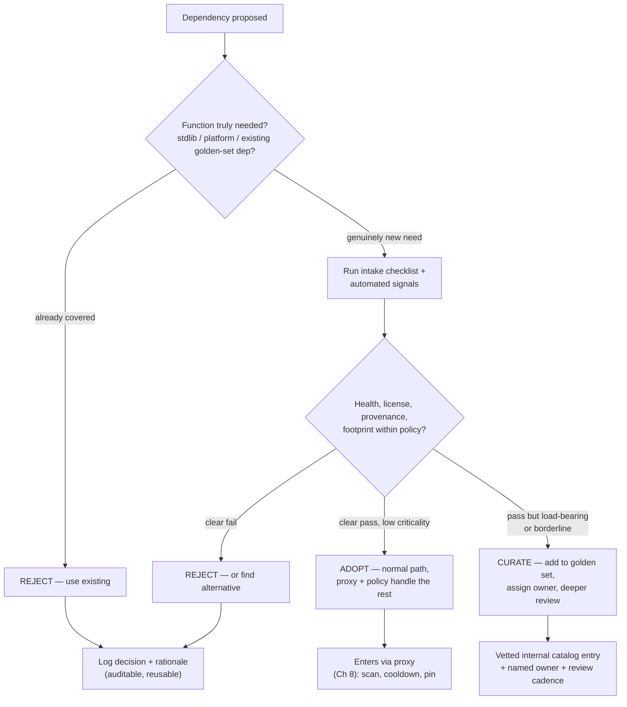
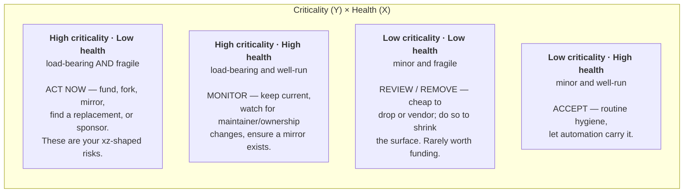
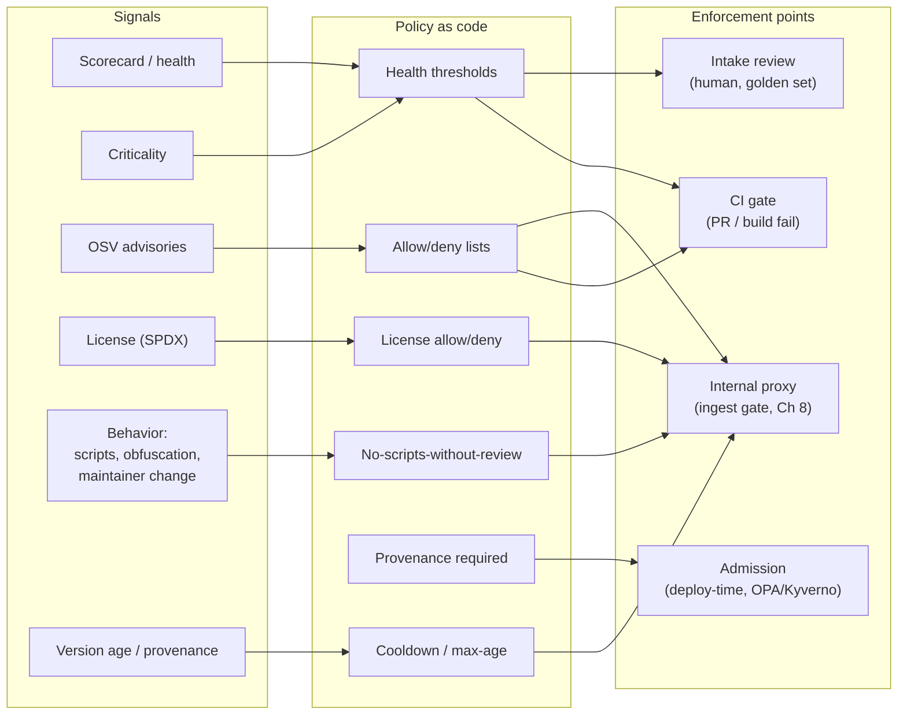
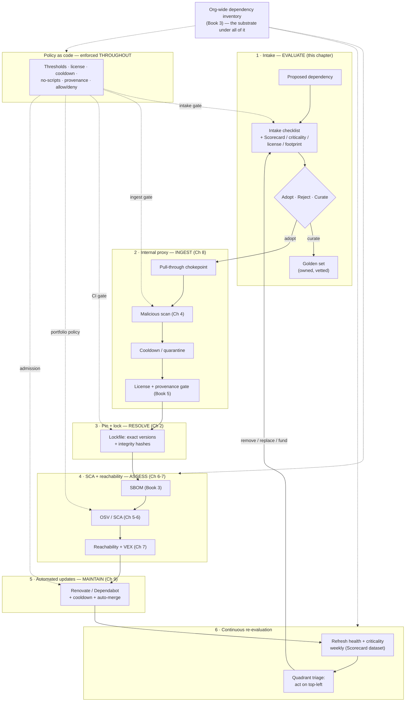

# Chapter 10 — Evaluating Dependencies: Scorecards, Signals, and Policy

*What this chapter covers.* Every previous chapter in this book has treated a dependency that
is *already in your tree*: how it resolves (Chapter 2), whether its name is a trap (Chapter 3),
whether it is malicious (Chapter 4), what it is vulnerable to (Chapters 5–7), where it entered
(Chapter 8), and how to keep it current (Chapter 9). This final chapter steps back to the
decision that precedes all of that machinery — *should this dependency exist in your tree at
all?* — and then to the governance question that follows from having thousands of dependencies
you never individually decided on: *how do you run a program that keeps a fleet of dependencies
inside policy without a human vetting each one?* We treat the adoption decision as an
engineering cost calculation, then build up the automated signal layer — OpenSSF Scorecard,
Criticality Score, deps.dev, and the commercial package-health services — that lets you triage
at scale. We are careful about what those signals actually measure: process hygiene, not
correctness or the absence of a backdoor. Then we turn signals into *policy as code* enforced at
the chokepoints this book has already built, and close with the capstone — a reference
dependency-governance architecture that ties the whole book together, plus the metrics that tell
you whether the program is working.

Learning goals — after this chapter you should be able to:

- Frame **"is it worth a dependency?"** as a cost calculation over the transitive closure, the
  maintenance trajectory, the security posture, and the standing trust grant — and run a
  concrete **intake checklist** for a proposed dependency.
- Explain what **OpenSSF Scorecard** actually checks, how it scores 0–10, how it is run (Action,
  CLI, public API/dataset), and — critically — the boundary of what it can and cannot tell you.
- Combine **Criticality Score** (how load-bearing) with health (how well-run) to triage a fleet,
  and query **deps.dev** and the commercial health services (Socket, Snyk Advisor, Libraries.io,
  Mend) as inputs.
- Encode a **dependency policy as code** — thresholds, license rules, cooldown, provenance
  requirements, allow/deny lists — and place enforcement at intake, the internal proxy, CI, and
  admission.
- Stand up a **golden set** / curated catalog and an **exception lifecycle** with expiry and
  ownership.
- Assemble the **end-to-end governance architecture** and the **fleet metrics** that measure it.

A note on the two questions this chapter answers, because they pull in opposite directions. The
first — *should we adopt this one dependency?* — rewards depth: a senior engineer sitting with a
proposed library, reading its issue tracker, weighing build-vs-borrow. The second — *how do we
govern the ten thousand we already have?* — rewards automation and refuses depth, because depth
does not scale to ten thousand. The chapter is honest that these are different activities with
different tools, and that the art of a dependency-governance program is spending human judgment
where it moves risk (the load-bearing few) and spending automated policy everywhere else.

## The true cost of a dependency

The instinct that a dependency is "free" — someone else wrote it, tested it, and gives it away —
is the single most expensive misconception in the field. The install is free. Everything after
the install is a liability you have signed for, and the signature is durable. Break the cost into
four components, none of which appears in the `npm install` output.

**The transitive closure, not the package.** When you add one dependency you add its entire
reachable dependency graph, and in the interpreted ecosystems that graph is large and mostly
invisible. A single mainstream JavaScript build tool or web framework routinely pulls in
*hundreds* of transitive packages; adding one direct dependency to a fresh project can materialize
a `node_modules` with a four-digit package count. Every one of those is code that runs in your
build or your process, each is a name that could be confused or typosquatted (Chapter 3), each is
a maintainer account that could be phished, and each is a future vulnerability you will have to
triage (Chapters 5–7). You did not choose them; you inherited them by choosing their parent. The
correct unit of cost is the closure, and you should measure it before you commit — `npm ls
--all`, `go mod graph`, `pipdeptree`, or a quick SBOM (Book 3) of the candidate tells you what you
are really signing for.

**The maintenance trajectory.** A dependency is not a static artifact; it is a *relationship with
a project over time*. You are betting that the project will keep pace with its own security fixes,
keep working on new runtime versions, and not abandon you two majors behind. The cost shows up
later as forced upgrades on someone else's schedule (Chapter 9), as security backports you have to
do yourself when upstream goes quiet, and in the worst case as a migration off an abandoned
package under time pressure. The maintenance question is not "is it maintained today" but "what is
the trajectory" — and Book 1, Chapter 8 (The Open Source Ecosystem) is the treatment of why so
many critical projects sit on a single unpaid maintainer's shoulders.

**The security posture.** Every dependency is attack surface and a future CVE. The relevant cost
is not just the count of past vulnerabilities but the project's *responsiveness*: does it have a
security policy, a private disclosure channel, a track record of fixing reported issues quickly?
A package with several past CVEs that were all patched within days is a *better* bet than one with
zero CVEs and no visible way to report one — the former demonstrates a working security process;
the latter demonstrates only that no one has looked or no one could report.

**The standing trust grant.** This is the one engineers most underweight, and Book 1, Chapter 6
(Trust and Threat Models) is its full treatment. Adding a dependency is granting its maintainers —
and everyone who can push to it, and everyone who compromises any of them — the standing ability
to run code in your build and, for runtime dependencies, in your production process, *on every
build and deploy, indefinitely, until you remove it*. It is not a one-time code review; it is a
continuously renewed grant of execution privilege to a set of people you do not control and whose
membership can change without your knowledge. The `event-stream` incident (Book 1, Chapter 4) is
the canonical demonstration: a maintainer handed the project to a stranger who added a malicious
transitive dependency, and every downstream consumer had already granted that stranger execution
by virtue of depending on the parent. You cannot revoke the grant retroactively for builds that
already ran.

### "Is it worth a dependency?" — the left-pad calculus

The tiny-dependency question is the sharpest version of the cost trade-off. In March 2016 the
eleven-line npm package `left-pad` was briefly unpublished and broke builds across the ecosystem
(the availability side is treated in Chapter 8). The security lesson is orthogonal and larger:
thousands of projects had taken a standing trust grant, an unpinned transitive dependency, and a
supply-chain attack surface — in exchange for a function any engineer could write correctly in
two minutes. The trade was catastrophically mispriced. The cost of *borrowing* eleven lines is
not eleven lines; it is a node in your dependency graph with all four cost components above, plus
a resolution and lockfile burden (Chapter 2), forever.

This does not mean "never take small dependencies." It means the build-vs-borrow calculus for a
senior engineer is not "how much code would I write" — that framing makes every dependency look
like a bargain. It is:

- **Borrow** when the function is genuinely hard to get right and the cost of a subtle bug is high:
  cryptography, TLS, date/time and timezone handling, Unicode normalization, protocol parsers,
  compression, numeric/decimal math. Here a mature, widely-audited dependency is *lower* risk than
  your own code, and the trust grant is worth it. You do not want to be the person who reimplemented
  a JWT verifier.
- **Build** when the function is small, stable, and easy to verify, *and* the dependency would drag
  in a closure, an install script, or a maintenance relationship out of proportion to what it does.
  Copying eleven lines (with attribution and a test) is often the correct answer for a leaf-level
  utility. The lasting cost of vendoring a few lines is near zero; the lasting cost of a dependency
  edge is not.
- **Prefer the standard library and the platform** over both. The cheapest dependency is the one
  the runtime already ships and already patches.

The senior-engineer move is to price the *closure and the grant*, not the lines of code, and to
notice that the ecosystems most prone to tiny dependencies (npm above all) are exactly where the
mispricing is most common and most exploited.

## The intake checklist

When a dependency is proposed — in a design review, a pull request, or an internal request to add
it to the golden set — evaluate it against a fixed checklist so the decision is consistent across
teams and auditable later. The checklist is the human-judgment counterpart to the automated
signals in the next section; on a load-bearing dependency you run both.

| Dimension | Question | Where the answer comes from |
|---|---|---|
| Criticality of function | How load-bearing is this in *our* system? What breaks if it fails or is compromised? | Design review; reachability (Chapter 7) |
| Maintenance | Active commits, releases, responsive maintainers? Bus factor? | Health signals (below); Book 1, Ch 8 |
| Transitive footprint | How many transitive deps does it add? Any of them already banned? | `npm ls --all` / `go mod graph` / SBOM |
| Install scripts | Does it run `postinstall`/`preinstall` or equivalent build-time code? | `npm`'s `--ignore-scripts` dry run; Socket |
| Provenance / signing | Signed releases? npm/PyPI provenance attestation? (Book 5) | Scorecard `Signed-Releases`; registry |
| License | Compatible with our distribution and obligations? | SPDX ID; Scorecard `License`; Book 1, Ch 8 |
| Security history | Past CVEs, and — more important — response time and a disclosure channel? | OSV (Ch 5); Scorecard `Security-Policy`, `Vulnerabilities` |
| Alternatives | Is there a better-maintained, lower-footprint, or already-blessed option? | Golden set; deps.dev comparison |

Two items on this list deserve emphasis because they are where malicious and merely-risky
dependencies overlap (the connection to Chapter 4's malicious-package detection). **Install
scripts** are a build-time execution grant that most engineers never notice they are giving; a
package that runs code on `npm install` can exfiltrate environment secrets from the build runner
before a single line of your application code executes, and this is the delivery mechanism for a
large share of npm supply-chain attacks. A default posture of `npm ci --ignore-scripts`, with an
allowlist of the few packages that legitimately need scripts, converts this from an invisible grant
to an explicit, reviewed one. **Transitive footprint** matters not only for the attack surface but
because a proposed dependency that drags in a *banned* transitive package must be rejected or
routed to a curated fork — the closure is part of what you are adopting.

The output of intake is one of three decisions, and the whole point of the checklist is to make
that decision explicit rather than a silent `install`:



Notice the asymmetry: a low-criticality dependency that passes the automated signals should flow
straight through on the paved road — the proxy, cooldown, pinning, and SCA (Chapters 4, 8, 2, 6)
handle it without a human in the loop — while a load-bearing or borderline one is *promoted* into
the curated golden set with a named owner. You do not spend equal effort on every dependency; you
spend it where criticality concentrates risk.

## Automated health and risk signals

You cannot run the intake checklist by hand on ten thousand existing dependencies, and you cannot
re-run it every week as their trajectories change. The scaling answer is automated signals:
programs that inspect a project's *process hygiene* and *importance* and emit machine-readable
scores you can feed into policy. This section is the tooling core. It is essential to keep in view
what these tools measure — hygiene and importance are proxies for risk, not measurements of it —
and we return to their limits explicitly at the end.

### OpenSSF Scorecard

OpenSSF Scorecard (the project and hosted dataset live under the Open Source Security Foundation)
is the most important open, automated health signal. It runs a battery of **checks** against a
source repository — primarily GitHub, with growing GitLab support — each of which inspects some
observable aspect of the project's development process and produces a score from 0 to 10 plus a
reason and remediation. The checks, grouped by the risk they proxy for:

**Source and build integrity.**
- **Branch-Protection** — are protected-branch rules in force on the default/release branches
  (required reviews, status checks, no force-push)? A high score means malicious or accidental
  changes cannot land without review.
- **Code-Review** — does change history show review before merge? A proxy for the two-person rule
  (which, as we note below, xz satisfied on paper).
- **Pinned-Dependencies** — are the project's *own* CI dependencies and container base images
  pinned by hash rather than by floating tag? Unpinned build dependencies are how a build gets
  compromised (Book 4).
- **Token-Permissions** — do the project's GitHub Actions workflows follow least privilege
  (`permissions: read-all` by default rather than a broad write token)? This is the control that
  directly addresses token-theft attacks against CI.
- **Dangerous-Workflow** — does any workflow contain a known-dangerous pattern, such as
  `pull_request_target` combined with checkout of untrusted PR head code, or script injection from
  untrusted input? These are concrete, exploitable CI misconfigurations.

**Build and release provenance.**
- **Signed-Releases** — are releases cryptographically signed / do they carry provenance (e.g.,
  cosign signatures, npm/PyPI provenance)? (Book 5.)
- **Binary-Artifacts** — does the repository contain committed binaries whose source you cannot
  review? A committed executable is an un-auditable trust grant.
- **Packaging** — is the project published through a recognized packaging/release automation
  rather than by hand?
- **CI-Tests** — do changes run CI tests before merge?

**Vulnerability and maintenance posture.**
- **Vulnerabilities** — does the project have known open, unfixed vulnerabilities (queried via OSV,
  Chapter 5)?
- **Maintained** — recent commit and issue activity (a rolling window, roughly the last 90 days) —
  a proxy for "is anyone home."
- **Dependency-Update-Tool** — is Dependabot / Renovate (Chapter 9) configured?
- **SAST** — is static analysis (CodeQL and similar) run in CI?
- **Fuzzing** — is the project fuzzed (e.g., enrolled in OSS-Fuzz)?
- **Security-Policy** — is there a `SECURITY.md` with a disclosure channel?
- **CII-Best-Practices** — does the project hold an OpenSSF Best Practices (formerly CII) badge?
- **License** — is a license present and detectable (SPDX)?
- **Contributors** — contributions from multiple organizations, a weak bus-factor/diversity proxy.

Some checks (webhooks, SBOM) are experimental or have moved in and out over versions; the
authoritative list is the project's `checks/` documentation, and you should read it against the
version you run rather than trusting any fixed enumeration, including this one.

**How the aggregate score is computed.** Each check returns 0–10. The overall Scorecard score is a
*weighted average* of the checks, where each check carries a risk weight — Critical, High, Medium,
or Low — reflecting how strongly it correlates with supply-chain risk (Critical-weighted checks
move the aggregate far more than Low-weighted ones). Checks that error out or are inapplicable are
excluded rather than scored zero. The result is a single 0–10 number per repository, plus the
per-check breakdown, which is the part you actually act on — the aggregate is a triage sort key;
the per-check reasons are the remediation list.

**How it is run.** Three modes, escalating in scale:

- *CLI, on demand.* Point it at a repo and read the JSON:

```bash
scorecard --repo=github.com/example/widget --format=json --show-details \
  | jq '{score: .score, checks: [.checks[] | {name, score, reason}]}'
```

- *GitHub Action, in CI.* The project (or a consumer forking it) runs Scorecard on every push and
  uploads results as SARIF to the code-scanning dashboard, or as a signed attestation, turning the
  score into a gate on the project's own repo.

- *The public dataset and API.* This is the piece that makes Scorecard usable at fleet scale: the
  OpenSSF runs Scorecard on the order of *millions* of the most-depended-upon public repositories on
  a recurring (roughly weekly) schedule and publishes the results — queryable through a public REST
  API and a public BigQuery dataset, and surfaced inside deps.dev. You do not have to run Scorecard
  yourself on your ten thousand transitive dependencies; you can *join your dependency inventory
  against the published scores*. That join — inventory (Book 3) × Scorecard dataset — is the
  mechanical core of fleet-wide health triage.

```bash
# Look up a project's latest published score without running anything.
curl -s https://api.scorecard.dev/projects/github.com/example/widget \
  | jq '{score, date, checks: [.checks[] | {name, score}]}'
```

**What Scorecard is *for*, stated precisely.** It is a *heuristic risk signal about development
process*, designed to be run at scale and to make the invisible hygiene of thousands of projects
comparable and sortable. It is explicitly not a guarantee, a certification, or a measurement of
whether the code is correct or backdoor-free. Hold that thought; the limits subsection makes it
load-bearing.

### OpenSSF Criticality Score — the other axis

Health answers "how well-run is this project?" It says nothing about "how much do we, and the
world, *depend* on it?" Those are orthogonal, and conflating them is a common triage error: a
sloppy but trivial leaf dependency and a sloppy but load-bearing framework have the same health
score and wildly different risk to you.

The **OpenSSF Criticality Score** (also an OpenSSF project, originally from Google) measures the
*importance / load-bearingness* of a project on a 0-to-1 scale, combining signals such as:

- age of the project (`created_since`) and recency of activity (`updated_since`),
- number of distinct contributors and contributing organizations,
- commit frequency and recent release count,
- issue activity (closed issues, issue comment frequency),
- and, most importantly, **`dependents_count`** — how many other projects depend on it, typically
  sourced from deps.dev's dependency graph.

These are combined by a weighted formula into a single criticality number. The higher it is, the
more the ecosystem (and, when you weight by *your* usage, your fleet) leans on the project. The
xz-utils library scored as broadly critical infrastructure precisely because half the Linux world
transitively links it — which is exactly what made it a target.

The reason both scores exist is that you use them *together*. Chapter-8-of-Book-1's quadrant is the
canonical framing, and here it becomes the triage engine of the whole program:



The top-left quadrant — high criticality, low health — is where a dependency-governance program
earns its budget, because it is where the next xz lives. It is a small set (that is the point:
criticality is concentrated), so you can afford *human* attention there: sponsor the maintainer,
mirror the source (Chapter 8) so an unpublish cannot break you, contribute the missing hygiene
(branch protection, a security policy), fork if you must, or plan a migration. Everything in the
bottom-right can be left to policy and automation. Criticality-weighted triage — spending human
effort in proportion to how load-bearing a dependency is — is the single most important idea for
making a fleet-scale program tractable.

### deps.dev — the aggregation substrate

Google's **deps.dev** (Open Source Insights) is the free service that makes the above practical
across ecosystems. It continuously builds the dependency graph for npm, Go, Maven, PyPI, Cargo, and
NuGet, and for every package version it aggregates: the full resolved **dependency graph** (direct
and transitive), known **advisories** (via OSV, Chapter 5), detected **licenses**, and the project's
**Scorecard** results. You reach it three ways — a web UI (`deps.dev`), a REST/gRPC **API**
(`api.deps.dev`), and a public **BigQuery** dataset for bulk analysis.

```bash
# Resolve a version's metadata: license, advisories, and the linked source repo.
curl -s https://api.deps.dev/v3/systems/npm/packages/left-pad/versions/1.3.0 \
  | jq '{licenses, advisoryKeys, links: .relatedProjects}'
```

deps.dev is the connective tissue: it is where "this npm package" is joined to "this GitHub repo"
to "this Scorecard result" to "these advisories" to "this license," across ecosystems, so that your
policy engine can ask one question and get health, criticality inputs, license, and vulnerability
data back together.

### Commercial and ecosystem-specific signals

Around this open core sit services that add behavioral and curated analysis:

- **Socket** takes a distinctive approach: rather than scoring process hygiene, it analyzes package
  *behavior and diffs between versions* — detecting newly-added install scripts, network or
  filesystem access, use of `eval`/obfuscation, and shell invocation. This is the signal set that
  overlaps most directly with **malicious-package detection (Chapter 4)**: "risky" and "malicious"
  are a spectrum, and a sudden new `postinstall` that opens a network connection is where they meet.
- **Snyk Advisor** publishes a package **health score** (a 0–100 composite of popularity,
  maintenance, security, and community) as a quick triage read.
- **Libraries.io** computes **SourceRank**, an older heuristic of package quality and popularity,
  and tracks release/dependent data across dozens of ecosystems.
- **Mend** (formerly WhiteSource) and **Snyk**'s platform features fold package health and license
  data into policy engines you can gate builds on.
- **The registries themselves** now emit signals: npm surfaces deprecation, provenance attestations
  (Sigstore-backed, Book 5), and download trends; PyPI and others expose similar metadata.

The **supply-chain-specific temporal signals** deserve their own emphasis because they are the ones
that catch fast-moving attacks that hygiene scores miss entirely: a package **newly published** or a
version released moments ago (the cooldown/max-age control, Chapters 4, 8, 9), a **maintainer change**
or new publisher on an established package (the `event-stream` pattern), a **sudden permission or
capability change** (a library that never touched the network suddenly opening sockets), **install
scripts added** where there were none, and **obfuscated code** appearing in a diff. None of these are
in a Scorecard number; all of them are high-signal for *this release is an attack*. A mature program
consumes both the slow hygiene signals (Scorecard/criticality, for adoption and quarterly triage) and
the fast behavioral signals (Socket-style, at the proxy on every ingest).

### The limits — hygiene is not a security guarantee

Be honest with yourself and with the teams you serve about the ceiling on all of this. Scorecard,
Criticality Score, and the health services measure **process and importance**, which are *correlated*
with risk. They do not, and cannot, measure code correctness, the absence of a vulnerability, or the
absence of a deliberately planted backdoor.

The definitive counterexample is **xz-utils (CVE-2024-3094)**, disclosed in March 2024 and treated in
full in Book 1, Chapter 5. The attacker operated the "Jia Tan" persona for roughly two years, becoming
a *legitimate co-maintainer* with commit rights, then landed a backdoor through the release-tarball
build tooling. Measured by process hygiene, xz looked *reasonable*: it had commits, releases, an active
(seemingly) maintainer, a real history, review on paper. A high Scorecard for `Code-Review` or
`Maintained` would have told you the process existed — and the entire attack was executed *through* a
legitimate actor operating that process. The two-person rule does not help when one of the two people
is the adversary. Criticality Score would (correctly) have flagged xz as load-bearing — which is a
reason to watch it, not a control that stops the attack.

The correct posture, therefore:

- **Signals are inputs to judgment, not verdicts.** A high score narrows where you must look; it does
  not certify safety. A low score is a reason to look harder, not always a reason to reject — a
  perfectly good small library may score low simply because it does not run OSS-Fuzz.
- **Defense in depth remains mandatory.** Hygiene scoring sits *alongside* cooldown (so you are not the
  first to ingest a compromised release), behavioral scanning (so a new install script is caught),
  pinning and lockfiles (Chapter 2, so you know exactly what ran), reachability and SCA (Chapters 6–7),
  provenance verification (Book 5), and the proxy chokepoint (Chapter 8). No single layer, least of all
  a hygiene number, is the control.
- **Weight human attention by criticality.** The top-left quadrant is exactly where automated scores are
  least sufficient and human review most valuable — because that is where a determined attacker will
  invest the two years.

State this plainly to leadership and to teams: a green dashboard of Scorecard numbers is a measure of
*hygiene coverage*, not a measure of *being un-backdoored*. Selling it as the latter is how a program
loses credibility the first time a well-scored dependency turns out to be malicious.

## Turning signals into policy

Signals that no one acts on are a dashboard. The value comes from encoding decisions as **policy as
code** — machine-checkable rules, versioned in a repository, reviewed like any other code, and enforced
automatically at defined points. A dependency policy typically encodes:

- **Health thresholds** — e.g., a direct dependency must have a Scorecard aggregate ≥ 5.0, or must not
  fail a specific Critical-weighted check (a `Dangerous-Workflow` failure is disqualifying regardless of
  aggregate). Thresholds are usually stratified by criticality: stricter for load-bearing deps.
- **License policy** — an allowlist of SPDX identifiers (permissive) and a denylist (e.g., strong copyleft
  in contexts where it is incompatible with distribution), with a review path for the ambiguous middle.
  (Book 1, Chapter 8 covers the license-obligation mechanics.)
- **No install scripts without review** — packages that run build-time scripts are denied by default and
  allowed only by explicit, expiring exception.
- **Max-age / cooldown** — no version younger than *N* days may be resolved, so a smash-and-grab malicious
  release is caught in quarantine before it reaches a build (Chapters 4, 8, 9).
- **Required provenance** — for defined tiers (or all of a critical service's deps), a package must carry a
  verifiable provenance attestation, e.g., npm/PyPI provenance or SLSA provenance (Book 5).
- **Allow / deny lists and banned packages** — named packages (or ranges) that are always permitted
  (golden set) or always forbidden (known-malicious, unlicensed, or superseded).

The same policy is enforced at several points, and choosing the right point matters as much as the rule:



The proxy (Chapter 8) is the highest-leverage enforcement point because it is the *chokepoint*: a rule
enforced there — cooldown, license, no-scripts, banned-package — applies to every build in the org
without depending on ten thousand developer laptops running the same check. CI gates catch what must be
evaluated in the context of a specific repo (a Scorecard threshold on a *newly-added* direct dependency in
a PR). Admission control (Book 6, and OPA/Kyverno mechanics) is the last line: it can refuse to deploy a
workload whose image lacks required provenance. Intake review is where humans make the golden-set decisions
the automation then enforces.

Express these as real policy. Dependency-Track's policy engine, Socket/Snyk/Mend policy features, and OPA
(Rego) all encode the same logic; a Rego fragment for a CI gate over a resolved dependency looks like:

```rego
package dependency.intake

# Deny a newly-added direct dependency below the health threshold,
# unless it is on the curated golden set.
default allow := false

allow if {
    input.dependency.direct
    input.dependency.scorecard.score >= 5.0
    not banned[input.dependency.name]
    license_ok
}

allow if {
    golden_set[input.dependency.name]   # curated deps bypass the score gate
}

license_ok if {
    input.dependency.license in {"Apache-2.0", "MIT", "BSD-3-Clause", "ISC"}
}

deny_reason contains msg if {
    input.dependency.direct
    input.dependency.scorecard.score < 5.0
    not golden_set[input.dependency.name]
    msg := sprintf("scorecard %.1f below threshold 5.0 for %s",
                   [input.dependency.scorecard.score, input.dependency.name])
}
```

The golden-set bypass in that policy is deliberate and central, and it is the subject of the next section.

### The golden set — a curated internal catalog

If every team independently vets a JSON library, an HTTP client, a logging framework, and a test runner,
you have paid for the same evaluation dozens of times and gotten dozens of inconsistent answers — and your
fleet now has five HTTP clients to patch instead of one. The **golden set** (curated internal catalog,
"paved road for libraries") is the fix: a blessed, small set of vetted, supported dependencies for common
needs, published internally, that teams are *encouraged or required* to use instead of choosing their own.

Its properties:

- **Vetted once, deeply.** Each golden-set entry has passed the full intake checklist and a human review,
  so consumers do not repeat it. This is where you spend the deep human effort the automated signals cannot.
- **Owned.** Each entry has a **named owner** (a team, not a person who might leave) responsible for keeping
  it current, watching its health and criticality signals, and driving migrations.
- **Supported and mirrored.** Golden-set packages are mirrored in the internal registry (Chapter 8) so an
  upstream unpublish cannot break the fleet, and they get first-class update automation (Chapter 9).
- **The path of least resistance.** The paved road only works if using the blessed dependency is *easier*
  than not — a scaffold that already includes it, docs that assume it, examples that use it. If the golden
  set is a wiki page of approvals nobody reads, teams route around it.
- **Bounded.** A golden set with a thousand entries is not curated. Keep it to the genuinely common needs;
  everything else flows through the automated intake path.

The golden set is what makes the whole program tractable: it collapses the vetting surface from "every
dependency every team might want" to "the small blessed set plus a policy gate for the long tail." It is
the library analog of the paved-road/golden-path pattern that shows up throughout this suite.

### Exceptions and lifecycle

Policy that cannot be broken will be routed around; policy with silent, permanent exceptions is not policy.
The reconciling mechanism is **risk acceptance with expiry**:

- An exception (this team may use a below-threshold dependency; this critical service may ingest a version
  inside the cooldown window for an urgent fix) is granted with an **explicit owner**, a **documented
  rationale**, and a **hard expiry date**. On expiry it is re-evaluated, not auto-renewed.
- Exceptions are recorded as data (in Dependency-Track, a policy-exception store, or the intake ledger), so
  the set of accepted risks is queryable — during an incident you can ask "which of our accepted exceptions
  touch this package?" (Book 8).
- Dependencies have a **deprecation and removal** lifecycle too: when a golden-set entry is superseded, it is
  marked deprecated with a migration deadline, update automation stops offering it, and the owner drives
  consumers off it. Removing a dependency is a first-class action, not an accident.
- Every dependency decision — adopt, reject, curate, exception, deprecate — is **logged with its owner and
  rationale**, so the program has an audit trail and so the same evaluation is never silently redone.

The through-line is **ownership**: an unowned dependency is an unmanaged risk, and "% of dependencies with a
named owner" is one of the health metrics of the program itself (below).

### Tooling for policy at fleet scale

- **OWASP Dependency-Track** is the reference open-source platform for the *inventory + policy + risk* side.
  It ingests SBOMs (CycloneDX, Book 3) continuously from every service, maintains a fleet-wide component
  inventory, evaluates each component against known vulnerabilities (OSV/NVD/GitHub advisories, Chapter 5)
  and against configurable **policies** (license, security-severity, and operational rules such as version
  age or banned coordinates), consumes **VEX** to suppress non-exploitable findings (Chapter 7), and computes
  portfolio-level **risk scores and metrics**. It is the substrate that turns "we have SBOMs" into "we can
  ask the whole fleet a policy question and get an answer."
- **OSV-Scanner and Scorecard in CI** provide the per-repo gates (advisory and hygiene) that Dependency-Track
  complements at the portfolio level.
- **Policy engines** — OPA/Rego and Kyverno-style admission controllers — enforce dependency and provenance
  policy at CI and deploy time (the Rego above; Kyverno/admission mechanics in Book 6).
- **Socket / Snyk / Mend** bundle behavioral signals, health scores, and policy enforcement into managed
  offerings for teams that prefer to buy the integration rather than assemble it.

No single tool is the program. The program is the *architecture* that wires signals into policy into
enforcement across the fleet — which is the capstone.

## Bringing Book 2 together — the governance architecture

Every chapter of this book has been one control on one dependency lifecycle. Assembled, they form a
pipeline in which a dependency is *evaluated before entry, controlled at ingest, pinned, scanned,
kept current, and continuously re-evaluated* — with policy enforced at every stage. This is the capstone.



Read it as a loop, not a line. A dependency is evaluated (this chapter), enters only through the proxy
(Chapter 8) where it is scanned, cooled down, and provenance-checked, is pinned into a lockfile with
integrity hashes (Chapter 2), is inventoried as an SBOM (Book 3) and continuously assessed by SCA and
reachability (Chapters 5–7), is kept current by automation with a cooldown (Chapter 9), and is *re-evaluated
continuously* by refreshing its health and criticality signals — which feeds back into the intake decision:
a dependency that drifts into the top-left quadrant gets funded, replaced, or removed. Policy as code is not
a stage; it is the connective enforcement applied at intake, ingest, CI, portfolio, and admission. And the
org-wide inventory is the substrate beneath all of it — you cannot re-evaluate, gate, or measure what you
have not inventoried.

### The distributed-systems reality this architecture answers

State the scaling argument plainly, because it is the reason the architecture looks the way it does.
You have hundreds of services, thousands of repositories, and — counting transitively — tens of thousands
of distinct dependency versions, changing daily. Three consequences follow directly:

- **You cannot manually vet the closure.** Human judgment does not scale to O(services × dependencies).
  So automated signals (Scorecard/criticality/behavioral) feed centralized policy, and humans are spent
  only on the curated golden set and the top-left quadrant — an O(load-bearing deps) budget.
- **Enforcement must live at a chokepoint, not on endpoints.** A policy that relies on every developer
  running a scanner is not enforced. The proxy (Chapter 8) is the one place every dependency passes, so it
  is where fleet-wide rules live; admission control is the deploy-time chokepoint for the same reason.
- **Everything hangs off the inventory.** Criticality-weighted triage, portfolio policy, incident blast-radius
  queries ("which builds pulled the bad version," Book 8) — all of them are *joins against the org-wide
  dependency inventory* (Book 3). The inventory is not a byproduct of the program; it is its foundation.

The design principle underneath all three: **spend judgment where risk concentrates, and automate
everywhere else.** Criticality tells you where risk concentrates; the golden set and policy-as-code are how
you automate everywhere else; the proxy and inventory are the leverage points that make "everywhere else"
tractable.

### Metrics — is the program working?

A governance program that cannot measure itself is faith, not engineering. The metrics below (which connect
to the program-metrics treatment in Book 8, Chapter 8) turn the architecture into a dashboard leadership can
read and teams can be held to:

| Metric | What it tells you | Healthy direction |
|---|---|---|
| % of dependencies meeting policy | Coverage of thresholds/license/provenance rules | → 100%, tracked by tier |
| Scorecard distribution across the fleet | Aggregate hygiene of what you actually depend on | Median rising; long low-tail shrinking |
| Criticality-weighted risk | Risk concentrated in load-bearing deps, not raw counts | Top-left quadrant shrinking |
| Freshness / dependency drift | How far behind current the fleet runs (Chapter 9) | Median lag falling |
| % of dependencies with a named owner | Unmanaged-risk surface | → 100% |
| Open policy exceptions (and % expired) | Accepted-risk backlog and hygiene of the exception process | Bounded; expired → 0 |
| Golden-set adoption | Whether the paved road is actually used | Rising share of the common needs |

The trap to avoid is optimizing the *easy* metric — raw vulnerability count or average Scorecard — at the
expense of the one that matters, which is **criticality-weighted** risk. A fleet whose average Scorecard is
8.0 but whose three most-load-bearing dependencies sit in the top-left quadrant is in worse shape than the
numbers suggest. Weight every fleet metric by how load-bearing the dependency is, for exactly the same
reason you weight your human attention that way.

## Key takeaways

- **A dependency is not free.** Its true cost is the transitive closure, the maintenance trajectory, the
  security posture, and a *standing trust grant* of code execution to people you do not control — renewed on
  every build, indefinitely, until you remove it. Price the closure and the grant, not the lines of code.
  (Book 1, Chapters 4, 6, 8.)
- **Run intake as an explicit decision** — checklist plus automated signals — that outputs adopt, reject, or
  curate, and log it. Install scripts and transitive footprint are where "risky" meets "malicious"
  (Chapter 4).
- **OpenSSF Scorecard** scores development-process hygiene 0–10 across concrete checks (Branch-Protection,
  Code-Review, Token-Permissions, Dangerous-Workflow, Pinned-Dependencies, Signed-Releases, Vulnerabilities,
  Maintained, and more), runs as CLI/Action/public dataset, and is a *heuristic risk signal, not a guarantee*.
- **Criticality Score is the orthogonal axis** — how load-bearing a project is. Health × criticality gives the
  triage quadrant; spend human effort on the top-left (load-bearing *and* fragile), because that is where the
  next xz lives.
- **Hygiene ≠ security.** xz-utils (CVE-2024-3094) had reasonable-looking process and was backdoored *through*
  a legitimate maintainer. Signals narrow where you look; they never certify safety. Keep defense in depth —
  cooldown, behavioral scanning, pinning, SCA/reachability, provenance, and the proxy.
- **Encode policy as code** — thresholds, license, cooldown, no-scripts, required provenance, allow/deny —
  and enforce it at the highest-leverage point: the proxy chokepoint (Chapter 8), with CI and admission gates.
- **A curated golden set** with named owners collapses the vetting surface and is the library paved road.
  Exceptions carry an owner and a hard expiry; every decision has an owner.
- **The capstone is the loop:** evaluate → proxy-ingest → pin → SCA/reachability → automated updates →
  continuous re-evaluation, with policy enforced throughout and the org-wide inventory (Book 3) as substrate.
  Measure it with *criticality-weighted* fleet metrics, not raw counts.

## Further reading

- OpenSSF Scorecard — project, the authoritative per-check documentation, and the public API/dataset
  (https://github.com/ossf/scorecard and https://securityscorecards.dev/ and https://api.scorecard.dev/).
- OpenSSF Criticality Score — the project, its metrics, and the scoring algorithm
  (https://github.com/ossf/criticality_score).
- deps.dev / Open Source Insights — web UI, API, and the BigQuery public dataset documentation
  (https://deps.dev/ and https://docs.deps.dev/).
- OWASP Dependency-Track — architecture, the policy engine, and portfolio risk metrics
  (https://dependencytrack.org/ and https://docs.dependencytrack.org/).
- OSV and OSV-Scanner — the vulnerability data and scanner used across the pipeline
  (https://osv.dev/ and https://github.com/google/osv-scanner).
- Socket — behavioral supply-chain analysis and the risk-signal taxonomy (install scripts, network access,
  obfuscation) (https://socket.dev/).
- Snyk Advisor and Libraries.io — package health scoring and SourceRank
  (https://snyk.io/advisor/ and https://libraries.io/).
- OpenSSF Best Practices Badge (formerly CII) — the criteria behind the Scorecard `CII-Best-Practices` check
  (https://www.bestpractices.dev/).
- The xz-utils backdoor (CVE-2024-3094) — for the definitive "hygiene is not security" case; read the
  timeline of the Jia Tan persona and the two-year trust build (background in Book 1, Chapter 5; primary
  discussion in the oss-security list archives).
- The Open Policy Agent / Rego documentation, for expressing dependency and provenance policy as code
  (https://www.openpolicyagent.org/docs/latest/).
- SLSA v1.0 and npm/PyPI provenance — for the `Signed-Releases`/provenance requirements referenced here,
  treated fully in Book 5 (https://slsa.dev/spec/v1.0/).
