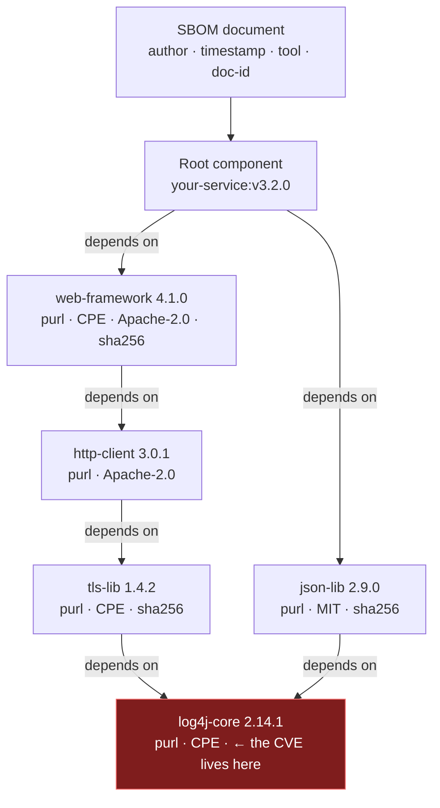
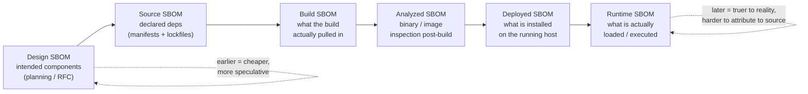
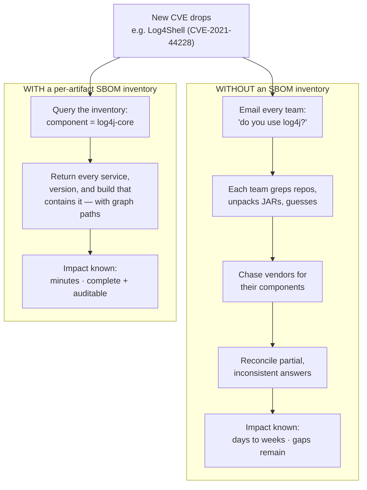
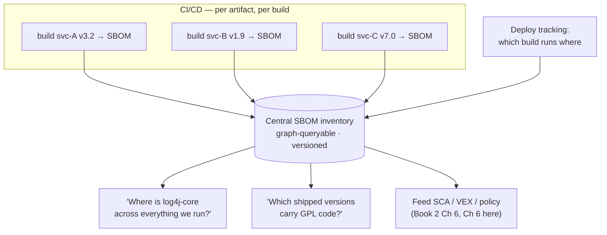
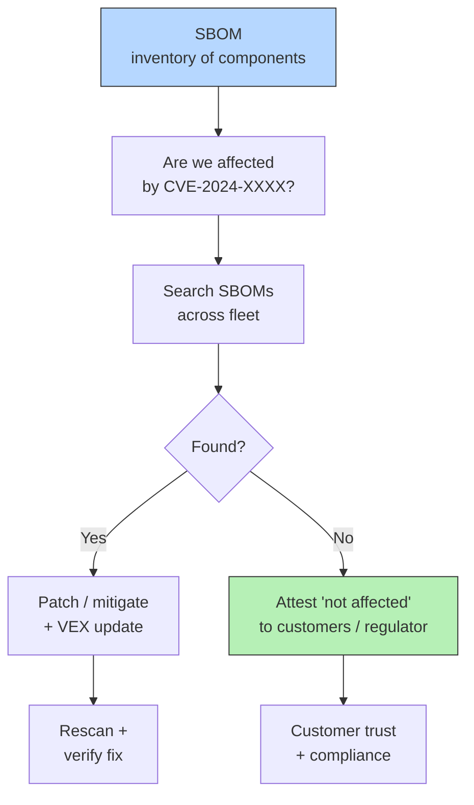
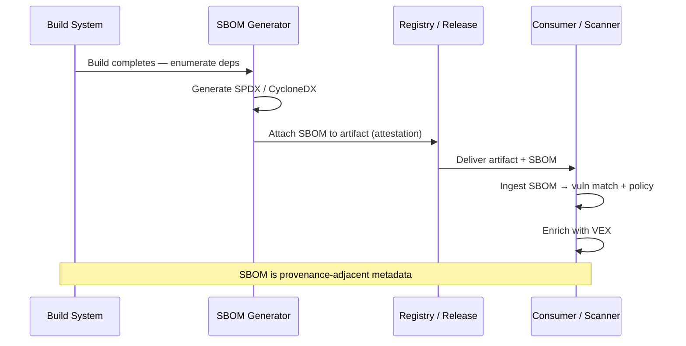

# Chapter 1 — Why SBOMs: Transparency and the Regulatory Landscape

*What this chapter covers.* Book 2 ended on a decoupling insight: your software's
*inventory* changes on one clock (when you change dependencies) and the *vulnerability
data* changes on another (constantly, against code you shipped months ago), and the
architecture that exploits this decoupling is "generate the inventory once, re-match it
against new advisories forever." The artifact that makes that inventory portable,
machine-readable, and durable is the **Software Bill of Materials** — the SBOM. This
chapter is the motivation for the entire book. It defines what an SBOM actually is (and
is not), takes apart the "ingredients list" analogy that everyone reaches for, explains
why the industry converged on SBOMs after a specific pair of incidents, catalogs the
problems SBOMs genuinely solve, is blunt about the ones they do not, and maps the
regulatory and standards landscape that is now dragging SBOM production from a
nice-to-have into a compliance obligation. We stay at the level of *concepts and forces*
here; the wire formats (SPDX in Chapter 2, CycloneDX in Chapter 3), the generation
mechanics and their accuracy limits (Chapter 4), the storage-and-query problem at fleet
scale (Chapter 5), VEX (Chapter 6), and an honest accounting of quality and limitations
(Chapter 7) are each their own chapter.

Learning goals — after this chapter you should be able to:

- Define an SBOM precisely as a **machine-readable component inventory with
  relationships and metadata**, and explain why the dependency *graph* — not a flat list
  — is the real deliverable.
- Enumerate the **core data** an SBOM carries: components with unique identifiers (purl,
  CPE, SWID), dependency relationships, licenses, hashes, and provenance pointers, and
  distinguish direct from transitive.
- Distinguish the **six SBOM types by lifecycle stage** (Design, Source, Build,
  Analyzed, Deployed, Runtime) per CISA's taxonomy, and explain why *where and when* you
  generate an SBOM determines what it can and cannot see.
- Articulate the **killer use case** — rapid impact assessment when a new vulnerability
  drops (the Log4Shell problem) — and the other problems SBOMs address: vulnerability
  management at scale, license compliance, vendor and procurement risk, incident
  response, and M&A due diligence.
- State honestly what an SBOM is **not**: not a security assessment, not an
  exploitability verdict, not a malware detector, and only ever as good as its
  generation.
- Place the **regulatory drivers** in accurate chronological order — US EO 14028, NTIA
  minimum elements, OMB memoranda, the EU Cyber Resilience Act, FDA premarket
  requirements — and name the **standards** they lean on (SPDX/ISO 5962, CycloneDX/
  ECMA-424, SWID/ISO 19770-2).

A word on boundaries. This chapter assumes Book 2's vulnerability data model (CVE, NVD,
OSV, GHSA, purl versus CPE) and its SCA pipeline (Book 2, Chapter 6 — Software
Composition Analysis in Depth). It treats the SBOM as the *inventory substrate* that
pipeline consumes and leaves the formats, generation, and scaling to the chapters that
follow. It is deliberately a chapter about *why* and *what*, not *how*.

## What an SBOM is

Strip away the acronym and an SBOM is a **formal, machine-readable record of the
components that make up a piece of software, the relationships among those components,
and enough metadata to identify each one unambiguously.** Three words in that sentence do
the load-bearing work.

*Formal* means it conforms to a published schema, not a spreadsheet someone maintains by
hand. *Machine-readable* means a program — an SCA scanner, a policy engine, an inventory
database — can parse it without heuristics. And *relationships* means it is not merely a
list: it encodes which component depends on which, so you can reconstruct the graph.

The universally reached-for analogy is the **ingredients list** on packaged food, and it
is worth examining because it is both genuinely useful and quietly misleading. The useful
part: like an ingredients label, an SBOM lets a consumer of the product see what is
inside *without having to reverse-engineer it*, and it lets them react to a recall — "this
lot contains an ingredient just found contaminated" — by checking the label rather than
lab-testing the food. That is exactly the SBOM value proposition: transparency you can act
on mechanically.

Where the analogy breaks down matters, and Chapter 7 returns to each of these:

- **Software ingredients have ingredients.** A food label is flat; software is a graph
  that can run ten or more levels deep. Your service depends on a web framework that
  depends on an HTTP client that depends on a TLS library that depends on a crypto
  primitive. The interesting component — the one with the CVE — is almost always
  *transitive*, buried several edges from anything you chose directly.
- **The label can be wrong in ways food labels usually are not.** An ingredients list is
  produced by the manufacturer who literally combined the ingredients. An SBOM is often
  produced *after the fact* by a tool inspecting a build output, and that tool can miss
  things (a statically-linked C library, a shaded Java class, a vendored copy of a
  package) or hallucinate things. Accuracy is a property of the *generation method*, not
  of the format.
- **"Contains X" is not "poisoned by X."** A recall on an ingredient means every product
  containing it is suspect. A CVE in a component does *not* mean every product containing
  that component is exploitable — the vulnerable code path may be unreachable, disabled,
  or compiled out. Bridging "contains" to "is actually at risk" is the entire subject of
  reachability (Book 2, Chapter 7) and VEX (Chapter 6 of this book).

Hold the analogy loosely, then. It sells the *why* well and describes the *reality*
poorly.

### The core data

What is actually inside an SBOM? At minimum, a set of **components**, each carrying
enough to identify it, plus the **relationships** among them. In practice a good SBOM
carries:

- **Component identity.** A human name and version, a *supplier* (who produced it), and
  — critically — one or more **unique identifiers** that a machine can match on. The two
  that matter most are **purl** (Package URL, e.g.
  `pkg:maven/org.apache.logging.log4j/log4j-core@2.14.1`), which encodes ecosystem, name,
  and version in a way that maps cleanly to package registries and to OSV, and **CPE**
  (Common Platform Enumeration, NIST's identifier, e.g.
  `cpe:2.3:a:apache:log4j:2.14.1:*:*:*:*:*:*:*`), which is what NVD keys its
  vulnerability records on. A component may also carry a **SWID** tag or a raw hash as an
  identifier. Book 2, Chapter 5 explained why purl and CPE produce *different* match
  results; an SBOM that carries both is more useful precisely because downstream tooling
  keys on different identifiers.
- **Dependency relationships.** Edges: "component A depends on component B," "package P
  contains file F." This is what turns the list into a graph.
- **License information.** An SPDX license expression (e.g. `Apache-2.0`,
  `MIT OR GPL-3.0-only`) per component — the raw material for the compliance use case
  (Book 1, Chapter 8).
- **Cryptographic hashes.** SHA-256 (and often others) of the component artifact, which
  let a consumer verify that the thing described is the thing they received, and let a
  scanner match binaries by digest rather than by fragile name-guessing.
- **Provenance pointers.** Where the component came from (a download URL, a VCS
  reference, a source repository), and increasingly a pointer to a *build attestation* or
  signature (Book 5) so the SBOM can be tied back to a verifiable build.
- **Document metadata.** Who or what authored the SBOM, a timestamp, the tool and
  version that generated it, and a unique document identity.

Two of these deserve emphasis because they are where beginners under-invest.

**Direct versus transitive.** Your `package.json` or `go.mod` lists your *direct*
dependencies — the ones you chose. The lockfile expands those into the *transitive*
closure — everything they pulled in. A flat SBOM listing "we use these 800 packages" is
strictly less useful than one that says "we directly depend on these 40, and here is the
graph by which they pull in the other 760." When a CVE lands in a transitive package, the
graph tells you *which of your direct choices to bump* to remediate — often a single
version change several edges up resolves the vulnerable leaf. Without the graph you are
left guessing, or upgrading blindly.

**The graph is the value, not the list.** This is the single most important framing in
the chapter. The flat set of components answers "do we contain X?" The graph answers the
follow-up questions that actually drive remediation: *why* do we contain X, *through what
path*, *which team's service introduced it*, and *what is the smallest change that
removes it*. Later chapters (especially Chapter 5) treat the SBOM fleet as a queryable
graph database precisely because the graph structure is what makes it answer questions
instead of just listing facts.

Notice two things in that diagram. First, the vulnerable component (`log4j-core`) is
reached by *two different paths* — through the framework and through the JSON library —
which is exactly the situation that makes flat lists useless and graphs indispensable.
Second, every leaf carries identifiers and a hash; the metadata is per-component, not a
single blob for the whole document.

### Types of SBOM: where and when you generate it

Here is a distinction that is routinely missed and that governs everything about SBOM
accuracy. An SBOM is not a single kind of object. The same software produces *different*
SBOMs depending on **which lifecycle stage you observe it at**, because different stages
expose different information. CISA's community work formalized six types, and they are
worth internalizing because "the SBOM was wrong" is very often really "you generated the
wrong *type* for the question you were asking."

- **Design SBOM.** Produced before the software exists, from an architecture or an RFC:
  "we intend to use these components." Speculative, but useful for procurement and
  early risk review.
- **Source SBOM.** Derived from the source repository — the manifests and lockfiles
  (`go.mod`/`go.sum`, `package-lock.json`, `poetry.lock`). It captures *declared*
  dependencies and their resolved versions. Cheap and accurate about *intent*, but blind
  to anything the build injects that is not in a manifest (a base image's OS packages, a
  vendored C library, a generated file).
- **Build SBOM.** Produced by or alongside the build, from the build graph itself: what
  the build *actually resolved and compiled in*. This is generally the highest-fidelity
  SBOM you can get about a released artifact, because it sees what the build system saw —
  including build-time-only dependencies and the exact resolution the build chose.
- **Analyzed SBOM.** Produced *after* the build by inspecting the finished artifact — a
  container image, a binary, a firmware blob — without access to the build's internal
  state. This is what a tool like Syft does when you point it at an image. It can find
  things the source never declared (OS packages baked into a base image), but it must
  *infer* identity from filenames, package databases, and hashes, so it is prone to both
  misses (a statically-linked library leaves few fingerprints) and misattributions.
- **Deployed SBOM.** What is actually installed in a running environment — the artifact
  *plus* its configuration and the host packages around it. Answers "what is on this
  machine," which can differ from "what we built" once operators patch, sidecar, or
  layer things on.
- **Runtime SBOM.** What is actually *loaded and executing* — observed by instrumenting
  the running process. It is the only type that can distinguish "present on disk" from
  "actually loaded into the process," which is the beginning (only the beginning) of the
  reachability question.

The general rule: **earlier stages are cheaper and more speculative; later stages are
truer to production reality but harder to attribute back to a source change you can make.**
A Source SBOM tells you what to fix in a pull request but might miss the OS package with
the CVE. An Analyzed SBOM of the shipped image catches that OS package but cannot tell you
which line of which manifest to edit. Mature programs generate *more than one type* and
reconcile them. Chapter 4 is about the generation mechanics that produce each type and the
accuracy trade-offs among them; Chapter 7 is about what every type still misses.

## Why SBOMs: the problems they solve

### The killer use case: rapid impact assessment

The single incident that moved SBOMs from standards-committee jargon into board-level
mandates was **Log4Shell** — CVE-2021-44228, a remote-code-execution flaw in the
ubiquitous `log4j-core` Java logging library, disclosed on 9–10 December 2021 (Book 1,
Chapter 5). The vulnerability itself was severe, but what seared it into the industry's
memory was the *response*. For most organizations, the first question after disclosure was
embarrassingly simple and catastrophically hard to answer:

> *Which of our systems contain `log4j-core`, at what version, and where?*

Very few could answer it. Log4j is almost never a *direct* dependency — it arrives
transitively, often shaded or repackaged inside other JARs, sometimes several edges deep
inside a framework nobody remembers adding. Organizations spent **days to weeks** hand-
auditing: grepping source trees, asking every team, unpacking JARs, chasing down vendors.
Because the vulnerable code could be buried inside a fat JAR under a renamed package path,
even "search for log4j" produced false negatives. The remediation effort was gated not by
the difficulty of patching but by the difficulty of *finding*.

An SBOM inverts this. If every artifact you build carries an SBOM, and those SBOMs feed a
central inventory (Chapter 5), then "which systems contain `log4j-core` and at what
version" is a **query**, not an investigation — and it returns in seconds because the work
of enumerating components was done *once, at build time*, and stored.

This is the killer use case, and it is worth being precise about *why* it works: the
inventory and the vulnerability data change on **different clocks**. You build your SBOM
when your dependencies change (occasionally). The world discovers new vulnerabilities
constantly, against code you shipped long ago. Decoupling the two — enumerate once,
re-match forever — is the architectural heart of both SCA (Book 2, Chapter 6) and every
SBOM program.

### Vulnerability management at scale

The Log4Shell scenario generalizes. Any organization running hundreds of services faces a
steady rain of new advisories against components it already ships. The scalable answer is
**"scan the SBOM," not "re-scan the software."** Generate the component inventory once per
build, store it, and every time a new advisory lands, re-match the *stored* inventory
against the *updated* vulnerability database. You do not need to rebuild or re-fetch a
five-year-old release to learn it is newly vulnerable; you need its SBOM and today's OSV
feed. This decoupling is what makes vulnerability management tractable across a fleet, and
it is why the SBOM is infrastructure rather than paperwork.

### License compliance and legal risk

Every component carries a license, and licenses carry obligations — attribution,
source-disclosure (copyleft), or outright incompatibility with how you ship. Discovering
a strong-copyleft library deep in a proprietary product *after* release is an expensive
surprise. Because a good SBOM records a license expression per component, license scanning
becomes the same "match the inventory against a policy" operation as vulnerability
scanning — one substrate, two consumers. Book 1, Chapter 8 covers the open-source
licensing model this rests on.

### Supply chain transparency and trust

SBOMs cut two ways. For software you **ship**, an SBOM is how you let *your* customers see
what is inside — increasingly a contractual and regulatory expectation. For software you
**buy or ingest**, a vendor-supplied SBOM is how you assess *their* risk without
reverse-engineering their product: you can run it through your own scanners and policies
before you deploy it. This is the core of third-party and vendor risk management (Book 8,
Chapter 3). The transparency is only as good as the SBOM's accuracy — a point Chapter 7
hammers — but even an imperfect SBOM beats a black box.

### Incident response and forensics

When an incident hits — a compromised dependency, a newly-weaponized flaw, a suspicious
build — responders need to reconstruct *what was actually running* at a point in time.
Historical SBOMs, tied to specific build and deploy versions, are the forensic record that
answers "which versions of which service contained the affected component, and when did we
deploy them." Without that record, incident scoping degrades into the same frantic audit
Log4Shell exposed. Book 8, Chapter 6 treats SBOM-driven incident response in depth.

### M&A due diligence and procurement

Finally, SBOMs have become a due-diligence instrument. An acquirer evaluating a target's
codebase, or a procurement team evaluating a vendor, can use SBOMs to assess license
exposure, vulnerability debt, and dependency risk *before* signing — turning a
qualitative "trust us, it's clean" into a reviewable artifact. Design-stage SBOMs feed
this even before a product ships.

## Why SBOMs are not a silver bullet

The industry's biggest SBOM mistake is treating the artifact as a *solution* rather than
as *necessary infrastructure*. An SBOM is an **inventory**. Inventories enable security
work; they are not themselves security. Chapter 7 is the full accounting; here is the
honest preview, because setting expectations now prevents the disillusionment that follows
a program built on the wrong premise.

- **An SBOM is not a security assessment.** It tells you what components are present. It
  does *not* tell you whether you are exploitable. "Contains `log4j-core` 2.14.1" and "is
  vulnerable to Log4Shell in a way an attacker can reach" are different claims; bridging
  them requires reachability analysis (Book 2, Chapter 7) and, for communicating the
  result, VEX (Chapter 6). A fleet-wide "contains" query without exploitability triage
  produces a mountain of findings, most of which are not actually risks — the alert-
  fatigue problem Book 2, Chapter 6 dissected.
- **An SBOM does not find malicious code.** It records the components you *have*, drawn
  from package metadata and build inputs. A backdoor smuggled into a component's build
  (the xz-utils implant, Book 1, Chapter 5) sits *inside* a component the SBOM faithfully
  lists as present and legitimate. SBOMs are about *known* components and *known*
  vulnerabilities; they are structurally blind to a novel implant. Conflating "I have an
  SBOM" with "I would catch malware" is a category error.
- **An SBOM is only as good as its generation.** Every accuracy caveat from the "types"
  section applies. An Analyzed SBOM of a container might miss a statically-linked library
  entirely; a Source SBOM might miss everything the base image contributes; a hand-
  maintained SBOM is stale the moment a dependency bumps. Incomplete and inaccurate SBOMs
  are the *common* case, not the exception, and a confidently wrong inventory can be worse
  than none because it manufactures false assurance. NTIA's own minimum-elements work
  explicitly includes "known unknowns" — the expectation that an SBOM should be able to
  *declare where it is incomplete* — precisely because completeness cannot be assumed.

None of this is an argument against SBOMs. It is an argument for treating them as the
*substrate* on which reachability, VEX, provenance, and policy are built — not as the
finish line. The rest of this book is largely about turning the substrate into something
that answers real questions.

## The regulatory and standards landscape

For most of the 2010s, SBOMs were a niche practice pushed by a handful of NTIA working-
group participants. Two things changed that: a landmark supply-chain incident, and the
regulation it triggered. What follows is the landscape as it stands, with dates stated
precisely where they are firm and hedged where they are not. **Get the dates right** — this
is a domain where a wrong year undermines everything, and where regulations are still
phasing in as this is written (mid-2026).

### United States: the executive-order lineage

The proximate cause was **SolarWinds** — the compromise of the Orion build pipeline,
disclosed in December 2020 (Book 1, Chapter 3), which pushed a trojanized update to
thousands of organizations including US federal agencies. The federal response was
**Executive Order 14028, "Improving the Nation's Cybersecurity," signed 12 May 2021.** EO
14028 is broad — it covers logging, zero trust, and incident response — but for our
purposes its supply-chain section is what matters: it directed NIST to define secure
software development practices and directed the production of guidance on providing a
**Software Bill of Materials** to purchasers, explicitly naming the SBOM as a mechanism
for software transparency to the federal government.

The EO delegated the definition of *what an SBOM must contain* to the Department of
Commerce / NTIA, which published **"The Minimum Elements for a Software Bill of Materials
(SBOM)" on 12 July 2021.** This document is the reference point every subsequent US
requirement cites, and it is worth knowing its three-part structure:

1. **Data Fields** — the baseline information for each component: **Supplier Name,
   Component Name, Version of the Component, Other Unique Identifiers, Dependency
   Relationship, Author of the SBOM Data, and Timestamp.** (Notice this maps almost
   exactly onto the "core data" we described earlier — that is not a coincidence; the
   formats were designed to carry these fields.)
2. **Automation Support** — the SBOM must be produced in a machine-readable, automatable
   format. NTIA names three: **SPDX, CycloneDX, and SWID tags.** This is the moment the
   regulation *pins itself to the standards*, which is why Chapters 2 and 3 exist.
3. **Practices and Processes** — operational expectations: frequency (regenerate on each
   build or component change), depth (how far down the dependency tree), handling of
   **known unknowns** (declaring incompleteness), distribution and delivery, access
   control, and accommodation of mistakes. This third pillar is the one organizations
   most often ignore, and it is exactly the part that separates a checkbox SBOM from a
   useful one.

The minimum elements are a *floor*, deliberately modest — the goal in 2021 was to get
adoption moving, not to demand perfection. Later chapters will show how far above this
floor a genuinely operable program has to reach.

Enforcement flows through the **Office of Management and Budget (OMB)**, which translates
EO direction into concrete obligations for federal agencies and, through them, their
software vendors. Two memoranda matter:

- **OMB M-22-18** (14 September 2022), *"Enhancing the Security of the Software Supply
  Chain through Secure Software Development Practices,"* requires that software producers
  selling to the federal government **self-attest** to following NIST's Secure Software
  Development Framework (**SSDF, NIST SP 800-218** — Book 1, Chapter 7). The memo makes an
  SBOM an artifact an agency *may require* as part of that assurance rather than a blanket
  mandate for every purchase, but it firmly establishes attestation-plus-SBOM as the
  federal procurement posture.
- **OMB M-23-16** (9 June 2023) updates and extends M-22-18 — principally adjusting
  timelines and clarifying scope after industry feedback. The practical effect is the
  same direction of travel: self-attestation to SSDF, with SBOMs as supporting evidence.

**CISA** (the Cybersecurity and Infrastructure Security Agency) carries the ongoing
community work. Beyond convening the SBOM working groups, CISA published the **"Types of
Software Bill of Materials (SBOM)"** document (2023) that gives us the Design/Source/
Build/Analyzed/Deployed/Runtime taxonomy used earlier in this chapter. As of this writing
CISA has been running a **refresh of the minimum-elements guidance** — a draft updating the
2021 NTIA baseline circulated for public comment in 2025, reflecting several years of
implementation experience (for instance, tightening expectations around component
identifiers and completeness). Treat the specifics of that refresh as *in flux*: the
direction is toward a stricter, more prescriptive baseline, but the exact finalized fields
should be checked against the published version rather than assumed.

### European Union: the Cyber Resilience Act

The EU's contribution is structurally different from the US approach. Where the US routed
requirements through *federal procurement* (comply if you want to sell to the government),
the EU's **Cyber Resilience Act (CRA)** — **Regulation (EU) 2024/2847** — is *product
regulation*: it applies to essentially any "product with digital elements" placed on the
EU market, government customer or not, backed by CE-marking and market-surveillance
enforcement.

The dates, stated carefully: the CRA **entered into force in December 2024** (twenty days
after its publication in the Official Journal in late November 2024). Its obligations
**phase in over roughly the following three years**, with the bulk of the substantive
manufacturer obligations applying from **late 2027** and certain earlier obligations
(notably vulnerability and incident reporting) applying sooner. Because the phase-in is
still ahead as of mid-2026, describe the CRA as *in force but not yet fully applicable* —
that is the accurate state.

On SBOMs specifically: the CRA makes the SBOM an **explicit expectation**. Manufacturers
must, among their cybersecurity obligations, **identify and document the components in
their products — including by drawing up a software bill of materials in a commonly used,
machine-readable format** — and must handle vulnerabilities across the product's support
period. A nuance worth getting right: the CRA (in its core text) requires the SBOM to be
*produced and maintained* and made available to market-surveillance authorities on
request, and to cover *at least the top-level dependencies* of the product; it does **not**
by default require handing a full SBOM to every end customer. Implementing standards and
guidance (developed under bodies such as ENISA and the European standards organizations)
are expected to sharpen the format and depth expectations over the phase-in period, so the
operational detail here is still settling.

The strategic point: the CRA globalizes the pressure. A US company selling connected
products into Europe inherits SBOM obligations regardless of any US mandate, which is a
large part of why SBOM production is becoming table stakes rather than a niche compliance
task.

### Sector-specific mandates

Two sectors moved faster and more concretely than the horizontal rules, and both are worth
knowing because they are *already enforced*, not phasing in.

- **Medical devices (US FDA).** The Consolidated Appropriations Act, 2023 (the "omnibus,"
  signed December 2022) added **section 524B to the Food, Drug, and Cosmetic Act**,
  requiring cybersecurity information for "cyber devices" in premarket submissions —
  **including an SBOM.** The FDA finalized its guidance, *"Cybersecurity in Medical
  Devices: Quality System Considerations and Content of Premarket Submissions,"* in
  **September 2023**, and began exercising **"refuse to accept" (RTA)** authority for
  non-compliant cyber-device submissions from **1 October 2023**. This is the sharpest
  teeth in the landscape: no compliant SBOM (among the other cyber requirements), no
  market authorization. If you build software that ends up in a regulated medical device,
  the SBOM is not optional and not future-tense.
- **Defense and automotive.** The US Department of Defense has folded SBOM expectations
  into its acquisition and software-assurance guidance, aligned with the same NTIA
  baseline. In automotive, the security-process standards (notably **ISO/SAE 21434** for
  road-vehicle cybersecurity, alongside UN Regulation No. 155) drive component-inventory
  and vulnerability-management practices that SBOMs directly support, even where "SBOM" is
  not the literal word in the standard. Treat these as *converging on the same substrate*
  rather than as separate demands.

### The standards the regulations lean on

Every regulation above stops short of inventing a file format — deliberately. They point at
**existing, standardized SBOM formats**, which is what makes cross-jurisdiction compliance
tractable: produce one good SBOM in a recognized format and it satisfies many masters. The
three named in NTIA's automation-support pillar, each now backed by a formal standards
body:

| Format | Steward | Standardization | Origin / character |
|---|---|---|---|
| **SPDX** | Linux Foundation | **ISO/IEC 5962:2021** (standardized SPDX 2.2.1); SPDX **3.0** released 2024 | Started as a *license-compliance* format; broad, expressive, relationship-rich. Deep dive in **Chapter 2**. |
| **CycloneDX** | OWASP | **ECMA-424** (1st edition, 2024, covering CycloneDX **1.6**) | Started as a *security/BOM* format; compact, security-focused, native VEX and VDR support. Deep dive in **Chapter 3**. |
| **SWID tags** | ISO | **ISO/IEC 19770-2:2015** | Software *identification* tags from IT asset management; narrower, used more as an identifier source than a full SBOM. |

A note on the identifiers these formats carry, which we met earlier: **purl** (Package
URL) and **CPE** (NIST's Common Platform Enumeration, current version 2.3) are not SBOM
formats — they are *component-identity schemes* that the formats embed. Book 2, Chapter 5
is the reference for why they matter and why they disagree; here it is enough to know that
a well-formed SBOM carries them so downstream tooling can match reliably.

The takeaway for a practitioner: the regulations converge on **"emit a machine-readable
SBOM in SPDX or CycloneDX, carrying the NTIA minimum fields, per artifact, kept current."**
That sentence is the compliance kernel underneath all the memoranda and articles.

## Distributed-systems lens

Everything above becomes concrete — and much harder — the moment you stop imagining "an
SBOM" and start imagining **an organization's SBOMs**. For a company running hundreds of
services across dozens of teams with high deploy frequency, the SBOM story is not a
document; it is a **data pipeline and an inventory system**.

The first thing to internalize is that **a single flat SBOM of "the company" is
meaningless.** There is no such artifact and there should not be. Software is versioned and
deployed per-artifact; its component inventory is a property of *a specific build of a
specific service*, and it changes every time that service's dependencies change. So the
unit of SBOM generation is **per-artifact, per-build**: every image, binary, or package
your CI produces emits its own SBOM at build time, tagged with the exact version it
describes. Ten services deploying twenty times a day produce a *stream* of SBOMs, not a
document you maintain.

The second thing is that those per-build SBOMs are only valuable if they flow into a
**central, queryable inventory** — a fleet-wide store you can ask questions of. This is
the architecture that turns the Log4Shell capability from aspiration into reality:

Three engineering realities fall out of this picture, each of which later chapters develop:

- **Generation must be automated and in-pipeline, not a manual step.** At fleet scale
  nobody hand-writes SBOMs; they are emitted by the build (Chapter 4). The generation must
  be cheap enough to run on every build and accurate enough to trust — and, as the "types"
  discussion warned, you often want *both* a Source/Build SBOM (accurate about intent,
  attributable to a PR) *and* an Analyzed SBOM of the final image (catches what the base
  image contributed).
- **Storage and query is a real systems problem.** Millions of SBOM documents, each a
  graph, versioned over time, is a substantial data-management challenge — dedup, indexing
  by component, joining against a moving vulnerability feed, and answering the "where is X"
  query in seconds. This is not a file share; it is a database. Chapter 5 is entirely
  about it, and it is where the "SBOM as graph, not list" framing pays off.
- **Deploy tracking closes the loop.** An SBOM inventory tells you what *builds* contain a
  component. To answer "where is it *running*," you must join that against deployment
  state — which build is live in which cluster, region, and namespace. The inventory plus
  the deploy map is what makes impact assessment *complete* rather than merely
  *approximate*.

Finally, the lens that reorganizes the whole book: **SBOMs for what you SHIP versus SBOMs
for what you RUN.** These are two consumers of the same substrate with different goals.

- The SBOM for what you **ship** is *outbound* — it goes to customers, auditors, and
  regulators (the CRA, the FDA, a procurement questionnaire). It must be complete,
  well-formed, and defensible, because someone external will judge it. Its consumer is a
  *third party assessing you*.
- The SBOM for what you **run** is *inbound and operational* — it feeds *your own*
  vulnerability management, the Log4Shell query, your policy gates. Its consumer is *your
  own security and platform teams*, and it must cover not just your first-party code but
  everything you deploy, including third-party and vendor software running in your
  estate.

Same generation machinery, same formats, same inventory — but the outbound case is driven
by *compliance and trust* and the inbound case by *operational risk reduction*. A program
that builds only one and calls it done will find the other stakeholder unserved: ship-only
SBOMs satisfy the auditor while your own responders still cannot answer "where is X," and
run-only SBOMs let you respond fast while your customers' procurement teams still treat you
as a black box. The rest of this book builds the machinery that serves both from one
substrate.

## Key takeaways

- An **SBOM is a formal, machine-readable inventory of a software's components, their
  relationships, and identifying metadata.** The "ingredients list" analogy sells the
  transparency value but hides three truths: software ingredients nest into a deep graph,
  the label is only as accurate as the tool that generated it, and "contains X" is not
  "exploitable via X."
- The **dependency graph — not the flat list — is the real deliverable.** The interesting
  component is almost always transitive, and the graph is what tells you *which direct
  choice to change* to remediate it.
- **Where and when you generate an SBOM determines what it can see.** CISA's six types
  (Design, Source, Build, Analyzed, Deployed, Runtime) trade earlier-and-speculative
  against later-and-truer; mature programs generate more than one type and reconcile them.
- The **killer use case is rapid impact assessment.** Log4Shell (CVE-2021-44228, December
  2021) turned "which systems contain this component?" from a weeks-long audit into a
  seconds-long query — *if* you have a per-artifact SBOM inventory. This works because
  inventory and vulnerability data change on decoupled clocks: enumerate once, re-match
  forever.
- SBOMs also underwrite **vulnerability management at scale, license compliance, vendor
  and procurement risk, incident-response forensics, and M&A due diligence** — different
  consumers of one substrate.
- An **SBOM is necessary infrastructure, not a security solution.** It is not an
  exploitability verdict (needs reachability and VEX), does not detect malicious code, and
  is only as good as its generation. Incomplete and inaccurate SBOMs are the common case.
- The **regulatory drivers, in order:** SolarWinds (Dec 2020) → US **EO 14028** (May 2021)
  → **NTIA Minimum Elements** (July 2021, defining the baseline data fields, format
  support, and practices) → OMB **M-22-18** (2022) and **M-23-16** (2023) tying
  procurement to SSDF self-attestation → **EU CRA** (Regulation 2024/2847, in force Dec
  2024, obligations phasing to ~2027, SBOM an explicit expectation) → **FDA §524B** and
  2023 premarket guidance with RTA enforcement from Oct 2023. A **CISA minimum-elements
  refresh** was in draft in 2025 — treat its specifics as still settling.
- Regulations lean on **standardized formats**: **SPDX** (ISO/IEC 5962:2021; 3.0 in 2024),
  **CycloneDX** (OWASP; ECMA-424 in 2024), and **SWID** (ISO/IEC 19770-2:2015), carrying
  identity schemes **purl** and **CPE**. Deep dives follow in Chapters 2 and 3.
- **At scale, SBOMs are a pipeline, not a document:** generated per-artifact per-build,
  fed into a central queryable graph inventory, joined against deploy state to answer
  "where is X across everything we run." And they serve two masters — **what you ship**
  (outbound, compliance and trust) and **what you run** (inbound, your own vulnerability
  management) — from the same substrate.

### SBOM answers: inventory to vulnerability to response

### SBOM lifecycle: produce to distribute to consume

## Further reading

- **Executive Order 14028**, "Improving the Nation's Cybersecurity," The White House, 12
  May 2021.
- **NTIA**, "The Minimum Elements for a Software Bill of Materials (SBOM)," US Department
  of Commerce, 12 July 2021.
- **OMB M-22-18**, "Enhancing the Security of the Software Supply Chain through Secure
  Software Development Practices," 14 September 2022; and **OMB M-23-16** (9 June 2023).
- **CISA**, "Types of Software Bill of Materials (SBOM)," 2023; and CISA's SBOM resource
  hub (`cisa.gov/sbom`) for the ongoing minimum-elements refresh and community documents.
- **Regulation (EU) 2024/2847** (the Cyber Resilience Act), Official Journal of the
  European Union, 2024; and ENISA guidance on CRA implementation.
- **FDA**, "Cybersecurity in Medical Devices: Quality System Considerations and Content of
  Premarket Submissions," final guidance, September 2023; and FD&C Act §524B.
- **NIST SP 800-218**, "Secure Software Development Framework (SSDF) Version 1.1," 2022.
- **ISO/IEC 5962:2021** (SPDX 2.2.1) and the **SPDX 3.0** specification, Linux Foundation.
- **ECMA-424**, "CycloneDX Bill of Materials Specification," Ecma International, 2024; and
  the OWASP CycloneDX project documentation.
- **ISO/IEC 19770-2:2015** (SWID tags); the **Package URL (purl)** specification; and
  **NIST CPE 2.3**.
- **CVE-2021-44228** (Log4Shell) — the Apache Log4j security advisory and the CISA log4j
  guidance, for the incident that motivated the killer use case.
