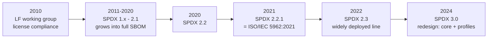
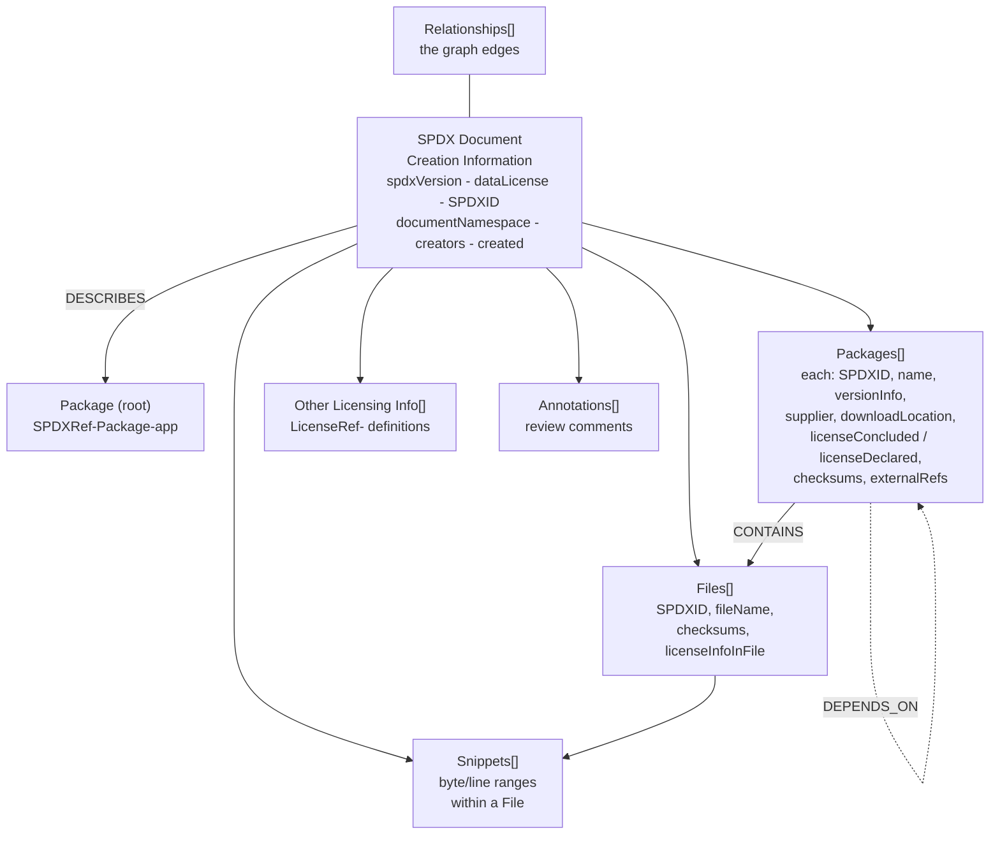
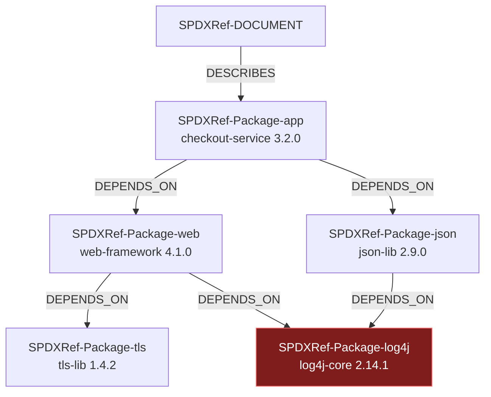
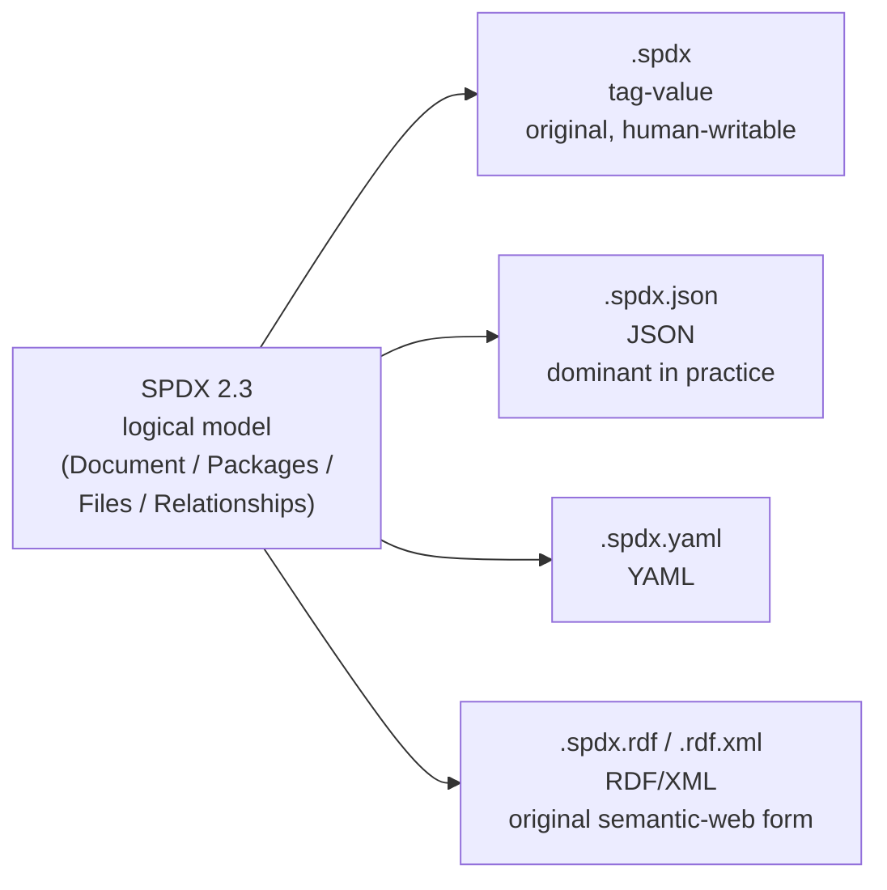
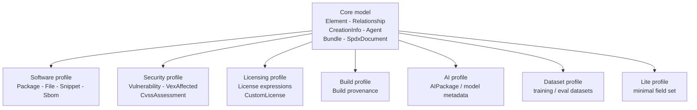
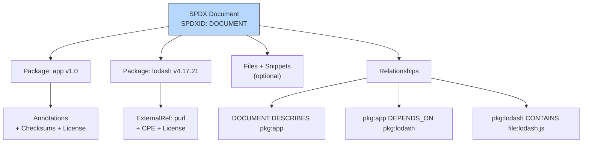
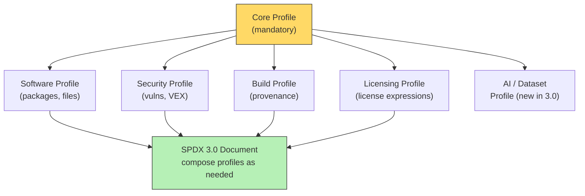

# Chapter 2 — SPDX in Depth

*What this chapter covers.* Chapter 1 argued *why* SBOMs exist and *what* they must carry:
a machine-readable inventory of components, their relationships, and enough metadata to
identify each one unambiguously. This chapter is the first of two that take apart the wire
formats those requirements actually travel in. It is the definitive technical treatment of
**SPDX** — the Software Package Data Exchange — the older of the two dominant formats, an
ISO standard, and the one most likely to land on your desk when a government or enterprise
customer asks for an SBOM. We treat SPDX at the level a systems engineer needs: the object
model, the exact field names, the relationship graph, the serializations on the wire, the
license-expression grammar that SPDX contributed to the whole industry, and the 2.x-versus-
3.0 fork that every organization now has to reason about. By the end you should be able to
read an SPDX document and reconstruct the dependency graph in your head, produce a valid one,
and make a defensible call about which version your program emits.

Learning goals — after this chapter you should be able to:

- Place SPDX historically and legally: a **2010 Linux Foundation license-compliance project**
  that became a full SBOM format and then **ISO/IEC 5962:2021** (standardizing SPDX 2.2.1),
  with **SPDX 3.0** released in 2024 as a ground-up redesign.
- Navigate the **SPDX 2.2/2.3 object model** — Document Creation Information, Packages,
  Files, Snippets, Relationships, Other Licensing Info, Annotations — and name the
  load-bearing fields (`SPDXID`, `documentNamespace`, `PackageLicenseConcluded` vs
  `PackageLicenseDeclared`, `ExternalRef`, checksums).
- Read and write the **relationship graph** — `DESCRIBES`, `CONTAINS`, `DEPENDS_ON`,
  `GENERATED_FROM` — and understand why SPDX's relationship model is more expressive than a
  flat dependency list.
- Choose among SPDX's **serializations** (tag-value, JSON, YAML, RDF/XML) and read a correct
  SPDX 2.3 JSON document without a reference open.
- Write **SPDX license expressions** correctly: the `AND`/`OR`/`WITH` grammar, the `+`
  operator, `LicenseRef-`, and `NOASSERTION`/`NONE` — a mini-standard reused far outside SPDX.
- Explain what **SPDX 3.0** changed — the core-plus-profiles class model, the element/
  relationship graph, JSON-LD serialization, and the Security/Build/AI/Dataset profiles — and
  why 2.3 remains the production reality.
- Weigh SPDX's **strengths and weaknesses** honestly, setting up a fair comparison with
  CycloneDX in Chapter 3.

This chapter assumes Chapter 1's vocabulary (purl, CPE, SWID, the NTIA minimum elements, the
six SBOM types) and Book 2's identifier model. It stays inside the format; *generating* SPDX
from a build is Chapter 4, *storing and querying* thousands of them is Chapter 5, and the
head-to-head with CycloneDX is Chapter 3.

## Where SPDX came from

SPDX did not start life as an SBOM format, and understanding that origin explains most of
its shape. The project began in **2010** under the **Linux Foundation** as a working group
with a narrow, painful problem: **open-source license compliance**. Companies shipping
products built on open-source code needed to communicate, machine-to-machine, exactly which
licenses applied to which files and packages — the "attribution and copyleft" obligations
that Book 1, Chapter 8 covers. Doing this by hand, in prose notices and spreadsheets, did not
scale across a supply chain. SPDX was the interchange format for that problem: a way to say
"this package is under Apache-2.0, this file was concluded to be MIT despite a declared
license of GPL, here is the copyright text" in a form a program could consume.

That heritage is why, even today, SPDX is unusually rigorous about *licensing* — the
**SPDX License List**, the **license-expression grammar**, and the concluded-versus-declared
distinction are all more developed than in any competing format, because licensing was the
original mission, not a bolt-on.

Over the 2010s the format grew. The same machinery that described a package's license could
describe its supplier, its download location, its checksums, its files, and — crucially — its
**relationships** to other packages. By the SPDX 2.x line, the format had become a
general-purpose software bill of materials: still license-fluent, but now able to carry the
full component inventory and dependency graph that Chapter 1 described. The industry's
convergence on SBOMs (Log4Shell, EO 14028, the NTIA minimum elements) met a format that was
already sitting there, mature and standardized.

The standardization milestone matters for procurement conversations, so state it precisely:
**SPDX 2.2.1 was published as ISO/IEC 5962:2021.** When a contract says "provide an SBOM in
an ISO-standard format," SPDX is the format it is usually pointing at. Note the exact
mapping: the ISO standard corresponds to **2.2.1**, a maintenance revision of 2.2. The widely
deployed line then moved on to **SPDX 2.3** (2022), which added fields and refinements while
staying backward-compatible with 2.2. Most tooling today emits **2.3**.

Then, in **2024**, the project shipped **SPDX 3.0** — not an incremental update but a
ground-up redesign of the data model, described in its own section below. The result is a
genuine fork in the road: **2.3 is what production tooling emits and what your customers can
consume today; 3.0 is where the standard is going but is still early in adoption.** A
practitioner needs both in their head, so this chapter covers both, with the weight on 2.3
because that is what you will actually handle in 2026.



## The SPDX 2.2/2.3 object model

An SPDX 2.x document is a single logical object with a fixed top-level shape. Whatever the
serialization — tag-value, JSON, YAML, RDF — the same conceptual pieces are present. There are
seven kinds of thing in a 2.x document:

1. **Document Creation Information** — metadata about the document itself.
2. **Packages** — the components: libraries, applications, containers, archives.
3. **Files** — individual files, when the document describes contents at file granularity.
4. **Snippets** — sub-file regions (byte or line ranges), for when a fragment of a file has
   a different license or origin than the file around it.
5. **Relationships** — the edges connecting all of the above into a graph.
6. **Other Licensing Information** — definitions for license identifiers not on the SPDX
   License List (the `LicenseRef-` entries).
7. **Annotations** — free-form review comments attached to any element.



### Document Creation Information

Every SPDX document opens with a header identifying the document, not its contents. These
fields are mandatory and a validator will reject a document missing them. In tag-value form
the field names are literal; in JSON they map to camelCase keys. The essentials:

- **`SPDXVersion`** (JSON: `spdxVersion`) — the format version, e.g. `SPDX-2.3`. This is the
  first thing a parser branches on.
- **`DataLicense`** (JSON: `dataLicense`) — the license of the SBOM *data itself*, and it is
  fixed: SPDX **requires `CC0-1.0`** here. This is deliberate. The metadata about your software
  must be freely shareable so that consumers, scanners, and regulators can pass it around
  without a licensing entanglement of its own. Do not put your product's license here; this
  field is about the document, not the software.
- **`SPDXID`** — the identifier of the document element itself, always `SPDXRef-DOCUMENT`.
- **`DocumentName`** (JSON: `name`) — a human-readable name for the document.
- **`DocumentNamespace`** (JSON: `documentNamespace`) — a globally unique URI for *this
  document instance*, typically a URL under your control plus a UUID, e.g.
  `https://acme.example/spdx/checkout-service-3.2.0-6f0a...`. This is the anchor that makes
  `SPDXRef-` identifiers globally unique: an `SPDXID` is only unique *within* a document, and
  the namespace plus the `SPDXID` together form a globally unique reference. At fleet scale
  (Chapter 5) this matters enormously — it is how you tell two `SPDXRef-Package-libc` entries
  in two different documents apart.
- **`Creator`** (JSON: `creationInfo.creators`) — who or what produced the document. SPDX
  distinguishes three creator types, and you can list several: `Tool: syft-1.18.1`,
  `Organization: Acme Corp`, `Person: Jane Roe`. The **tool** creator is what tells a
  downstream consumer *how* the SBOM was generated — which, per Chapter 1's "an SBOM is only as
  good as its generation," is essential provenance.
- **`Created`** (JSON: `creationInfo.created`) — an ISO-8601 UTC timestamp. Together with the
  namespace, this is what makes an SBOM a point-in-time forensic record.

An optional but important sub-field is **`licenseListVersion`** — which version of the SPDX
License List the concluded/declared identifiers were validated against. Because the license
list evolves (identifiers get added, a few get deprecated), recording the list version lets a
consumer interpret the expressions correctly.

### Packages

The **Package** is the workhorse element — in most SBOMs, packages are nearly the whole
document. A package is any unit of software you want to inventory: an application, a library,
a container image, an OS package, a source archive. The fields that carry the Chapter 1 "core
data" (using the tag-value names, with JSON keys noted):

- **`SPDXID`** — a document-local identifier of the form `SPDXRef-<something>`. The suffix is
  arbitrary but must match `[a-zA-Z0-9.-]+` and be unique in the document; tools typically
  generate `SPDXRef-Package-<name>-<hash>`.
- **`PackageName`** (JSON: `name`) and **`PackageVersion`** (JSON: `versionInfo`) — the human
  identity.
- **`PackageSupplier`** (JSON: `supplier`) — who supplied it, as `Organization: ...`,
  `Person: ...`, or `NOASSERTION`. Distinct from **`PackageOriginator`** (`originator`), which
  is who *originally created* it; supplier is who *you got it from*. This is one of the NTIA
  minimum "Supplier Name" fields.
- **`PackageDownloadLocation`** (JSON: `downloadLocation`) — where the package can be
  obtained: a URL, a VCS locator (`git+https://...@<commit>`), `NONE`, or `NOASSERTION`. This
  field is **mandatory** — a package with no download location must still say `NOASSERTION`
  explicitly, which encodes the "known unknowns" discipline Chapter 1 stressed.
- **`PackageLicenseConcluded`** (JSON: `licenseConcluded`) and **`PackageLicenseDeclared`**
  (JSON: `licenseDeclared`) — the two-license model, dissected below.
- **`PackageChecksum`** (JSON: `checksums`) — one or more digests, each an
  `{algorithm, checksumValue}` pair. `SHA256` is standard; `SHA1` appears for git-object
  compatibility, `SHA512` and `MD5` are also permitted. Checksums are what let a consumer
  verify the described artifact is the received artifact, and what let a scanner match by
  digest rather than by fragile name-guessing.
- **`FilesAnalyzed`** (JSON: `filesAnalyzed`) — a boolean that changes the document's meaning.
  When `true`, the document is asserting it enumerated the package's files and the package's
  license was derived from them, which requires a **`PackageVerificationCode`** (a hash over
  the set of contained files). When `false` — the common case for a dependency you did not
  unpack — the document is describing the package as an opaque unit and the verification code
  is omitted. Getting this flag wrong is a frequent validation failure.
- **`ExternalRef`** (JSON: `externalRefs`) — the crucial carrier of machine identifiers,
  covered in its own subsection.

### PackageLicenseConcluded versus PackageLicenseDeclared

This distinction is the clearest fingerprint of SPDX's license-compliance heritage, and it is
genuinely useful, so understand it precisely.

- **`PackageLicenseDeclared`** is the license the package **claims about itself** — what the
  upstream author put in the `LICENSE` file, the `package.json` `"license"` field, the Maven
  POM, the gem spec. It is the *declared intent* of the producer.
- **`PackageLicenseConcluded`** is the license the **SBOM author concludes actually applies**
  after analysis. This can differ from the declared license: a scanner might find a GPL header
  inside a package that declares MIT, a legal reviewer might resolve an ambiguous dual-license
  down to one, or an automated tool that does not do license analysis might set concluded to
  `NOASSERTION` while faithfully copying the declared field.

The two fields exist because **the producer's claim and the consumer's determination are
different facts**, and a compliance process needs both: the declared license is evidence, the
concluded license is a judgment. A tool like Syft, which reads package metadata but does not
perform deep license analysis, will typically populate `licenseDeclared` from the manifest and
set `licenseConcluded` to `NOASSERTION` — correctly declining to assert a conclusion it did not
make. A dedicated license scanner (FOSSology, ScanCode) is what fills in a meaningful
concluded license. When you consume an SBOM, know which field you are reading: treating a
tool's `NOASSERTION` concluded license as "no license" is a misread.

### ExternalRefs: how SPDX carries coordinates and security identifiers

A package's `PackageName` and `PackageVersion` are human strings; they are not reliable
machine keys. The **`ExternalRef`** mechanism is how SPDX attaches the *stable, matchable
identifiers* that make an SBOM queryable — the purl, CPE, and SWID that Chapter 1 and Book 2
established as the identity substrate. Each external reference has three parts:

- **`referenceCategory`** — one of `PACKAGE-MANAGER`, `SECURITY`, `PERSISTENT-ID`, or `OTHER`.
- **`referenceType`** — the specific scheme: `purl`, `cpe23Type` (and legacy `cpe22Type`),
  `swid`, `gitoid`, `advisory`, and others.
- **`referenceLocator`** — the actual value.

The two you will see most:

- **purl** under `PACKAGE-MANAGER`:
  `pkg:maven/org.apache.logging.log4j/log4j-core@2.14.1`. This is the identifier that maps
  cleanly to package registries and to OSV, and it is what most modern matching keys on.
- **CPE** under `SECURITY`, type `cpe23Type`:
  `cpe:2.3:a:apache:log4j:2.14.1:*:*:*:*:*:*:*`. This is NIST's identifier, the one NVD keys
  its vulnerability records on.

Carrying **both** is what makes an SPDX package robust for downstream security work, because —
as Book 2, Chapter 5 explained at length — purl and CPE produce *different* match results
against different databases, and a package that offers only one identifier is invisible to
tooling keyed on the other. The `SECURITY` category can also carry an `advisory` reference
pointing at a specific vulnerability disclosure, though SPDX 2.x has no native vulnerability
*model* — a limitation we return to when comparing with CycloneDX.

### Files, Snippets, and Annotations

Below the package level, SPDX can describe individual **Files** — each with an `SPDXID`
(`SPDXRef-File-...`), a `fileName`, checksums, and `licenseInfoInFile` (the licenses actually
found in that file). File-level detail is where SPDX's compliance heritage shines and where it
gets verbose: a source-scanned SPDX document for a large project can enumerate tens of
thousands of files. Most *dependency* SBOMs set `filesAnalyzed: false` on packages and skip
file enumeration entirely; file-level SPDX is characteristic of source-code license scans, not
of build-time dependency inventories.

**Snippets** go finer still: a snippet identifies a byte range or line range *within* a file
that has a different license or origin than its surroundings — the classic case being a chunk
of GPL code copy-pasted into an otherwise-permissive file. Snippets are powerful for
provenance forensics and almost never present in machine-generated dependency SBOMs.

**Annotations** are free-text review notes (`REVIEW` or `OTHER`) with an annotator and
timestamp, attachable to any element. They are how a human reviewer records "checked this
license conclusion on 2024-03-01" inside the document.

## The relationship graph

If Chapter 1's central claim is "the graph is the value, not the list," then **Relationships**
are where SPDX earns that claim. A relationship is a typed, directed edge:

```
Relationship: <spdxElementId> <RELATIONSHIP_TYPE> <relatedSpdxElement>
```

read as "`spdxElementId` *is/has* `RELATIONSHIP_TYPE` *toward* `relatedSpdxElement`." SPDX 2.3
defines a large vocabulary of relationship types — several dozen — which is exactly why the
model is more expressive than a flat parent-child dependency tree. The ones you must know:

- **`DESCRIBES`** — the document points at its top-level subject(s). Every well-formed SPDX
  document has a `SPDXRef-DOCUMENT DESCRIBES SPDXRef-Package-<root>` relationship (or the
  shorthand `documentDescribes` array). This answers "what is this SBOM *about*," which is not
  otherwise obvious in a document that may list hundreds of packages. Without it, a consumer
  cannot tell the root application from its 500th transitive dependency.
- **`CONTAINS`** — a containment edge: a package contains a file, or a container image contains
  an OS package. This models physical/archival inclusion, distinct from a build dependency.
- **`DEPENDS_ON`** (and its inverse `DEPENDENCY_OF`) — the dependency edge that encodes the
  graph Chapter 1 cares about. `A DEPENDS_ON B` means A needs B. This is what a "what depends
  on X" query traverses.
- **`GENERATED_FROM`** (and inverse `GENERATES`) — a provenance edge: a compiled artifact was
  generated from a source file. `libfoo.so GENERATED_FROM foo.c`.
- Others you will meet: **`BUILD_DEPENDENCY_OF`**, **`DEV_DEPENDENCY_OF`**,
  **`OPTIONAL_DEPENDENCY_OF`**, **`RUNTIME_DEPENDENCY_OF`** (dependency scoping),
  **`PATCH_APPLIED`**, **`COPY_OF`**, **`DYNAMIC_LINK`** / **`STATIC_LINK`**, and
  **`VARIANT_OF`**. The linking relationships matter for license reasoning (static linking of
  copyleft code has different obligations than dynamic).

Because relationships are first-class objects rather than nested structure, the *same* package
element can participate in many relationships — a diamond dependency where one library is
reached by two paths is represented naturally, with two `DEPENDS_ON` edges pointing at one
package element. This is the structural advantage over formats that nest dependencies as a
tree: SPDX represents a true DAG.



That diagram is a literal picture of a relationships array: one `DESCRIBES` edge and five
`DEPENDS_ON` edges, with `log4j-core` reached by two paths — the exact situation that makes the
graph indispensable and a flat list useless.

## Serializations

SPDX 2.x defines the *same logical model* in several concrete file formats. All five are
"real" SPDX; they differ only in encoding, and a conformant tool can round-trip between them.



- **Tag-value (`.spdx`)** is the original format: line-oriented `Tag: Value` pairs, grouped by
  element. It is the most human-readable and the form the SPDX spec uses in its examples. The
  literal tag names (`PackageLicenseConcluded`, `SPDXID`, `Relationship`) come from here.
- **JSON (`.spdx.json`)** is what the ecosystem has consolidated on. It is what Syft, the
  official SPDX tools, and virtually all modern tooling emit and consume by default, because
  JSON is trivial to parse and store in the kind of central inventory Chapter 5 builds. When
  someone says "an SPDX file" in 2026 without qualification, assume `.spdx.json`.
- **YAML (`.spdx.yaml`)** is a straightforward re-encoding of the JSON model — same keys, more
  human-editable, occasionally used in CI config contexts.
- **RDF/XML (`.spdx.rdf`)** is the original machine format, reflecting SPDX's early semantic-web
  design. It is verbose and rarely produced by hand today, but it is why SPDX has an underlying
  ontology at all — a lineage that becomes central in 3.0's JSON-LD.

### A correct SPDX 2.3 JSON document

Here is a small but complete and valid SPDX 2.3 JSON document describing the graph above:
`checkout-service 3.2.0` depending on `web-framework 4.1.0` and `json-lib 2.9.0`, with the
`log4j-core` leaf reached by two paths. Trimmed to two dependency packages for space, it shows
every structural piece — creation info, packages with the key fields, external refs, and the
relationships array.

```json
{
  "spdxVersion": "SPDX-2.3",
  "dataLicense": "CC0-1.0",
  "SPDXID": "SPDXRef-DOCUMENT",
  "name": "checkout-service-3.2.0",
  "documentNamespace": "https://acme.example/spdx/checkout-service-3.2.0-6f0a2e1c",
  "creationInfo": {
    "created": "2026-07-31T14:12:03Z",
    "creators": [
      "Tool: syft-1.18.1",
      "Organization: Acme Corp"
    ],
    "licenseListVersion": "3.25"
  },
  "documentDescribes": ["SPDXRef-Package-app"],
  "packages": [
    {
      "SPDXID": "SPDXRef-Package-app",
      "name": "checkout-service",
      "versionInfo": "3.2.0",
      "supplier": "Organization: Acme Corp",
      "downloadLocation": "git+https://git.acme.example/checkout.git@v3.2.0",
      "filesAnalyzed": false,
      "licenseConcluded": "Apache-2.0",
      "licenseDeclared": "Apache-2.0",
      "copyrightText": "Copyright 2026 Acme Corp",
      "checksums": [
        { "algorithm": "SHA256",
          "checksumValue": "3b1c9d0e5a7f4c2b8e6d1a0f9c3b5e7d2a4f6c8b0e1d3a5f7c9b1e3d5a7f9c1b" }
      ],
      "externalRefs": [
        { "referenceCategory": "PACKAGE-MANAGER",
          "referenceType": "purl",
          "referenceLocator": "pkg:generic/checkout-service@3.2.0" }
      ]
    },
    {
      "SPDXID": "SPDXRef-Package-log4j",
      "name": "log4j-core",
      "versionInfo": "2.14.1",
      "supplier": "Organization: Apache Software Foundation",
      "downloadLocation": "https://repo1.maven.org/maven2/org/apache/logging/log4j/log4j-core/2.14.1/log4j-core-2.14.1.jar",
      "filesAnalyzed": false,
      "licenseConcluded": "Apache-2.0",
      "licenseDeclared": "Apache-2.0",
      "copyrightText": "NOASSERTION",
      "checksums": [
        { "algorithm": "SHA256",
          "checksumValue": "8b2fed4b8f42c6d1e2c1e2c1e2c1e2c1e2c1e2c1e2c1e2c1e2c1e2c1e2c1e2c1" }
      ],
      "externalRefs": [
        { "referenceCategory": "PACKAGE-MANAGER",
          "referenceType": "purl",
          "referenceLocator": "pkg:maven/org.apache.logging.log4j/log4j-core@2.14.1" },
        { "referenceCategory": "SECURITY",
          "referenceType": "cpe23Type",
          "referenceLocator": "cpe:2.3:a:apache:log4j:2.14.1:*:*:*:*:*:*:*" }
      ]
    }
  ],
  "relationships": [
    { "spdxElementId": "SPDXRef-DOCUMENT",
      "relationshipType": "DESCRIBES",
      "relatedSpdxElement": "SPDXRef-Package-app" },
    { "spdxElementId": "SPDXRef-Package-app",
      "relationshipType": "DEPENDS_ON",
      "relatedSpdxElement": "SPDXRef-Package-log4j" }
  ]
}
```

A few things to notice, because they are exactly what trips people up when they first read
SPDX JSON:

- The **document element** (`SPDXRef-DOCUMENT`) and the **root package** (`SPDXRef-Package-app`)
  are different things, joined by the `DESCRIBES` relationship. The document is *about* the
  package.
- `dataLicense` is `CC0-1.0` and has nothing to do with the software's Apache-2.0 license —
  that lives on the packages.
- `log4j-core` carries `NOASSERTION` for `copyrightText` — a faithful "we didn't determine
  this" — while still carrying a confident purl and CPE. Partial knowledge is expressed field
  by field.
- The `relationships` array is a flat list of edges; the graph structure is entirely in those
  edges, not in nesting. To reconstruct the DAG you index packages by `SPDXID` and walk the
  relationships.

## SPDX license expressions

The **SPDX License List** and the **SPDX License Expression** grammar are arguably SPDX's most
widely reused contribution — you will find SPDX license identifiers in `package.json`, Cargo
manifests, Linux kernel `SPDX-License-Identifier:` header comments, and CycloneDX documents.
They are worth learning as a standard in their own right, independent of the SBOM format.

The **License List** is a curated registry of open-source and other licenses, each assigned a
short, stable **identifier**: `Apache-2.0`, `MIT`, `GPL-2.0-only`, `GPL-2.0-or-later`,
`BSD-3-Clause`, `MPL-2.0`, `LGPL-3.0-or-later`, and hundreds more, plus a companion list of
**license exceptions** (`Classpath-exception-2.0`, `GCC-exception-3.1`, `LLVM-exception`). The
list is versioned — hence the `licenseListVersion` field — and the identifiers are chosen to be
unambiguous, which is the whole point: `GPL-2.0-only` and `GPL-2.0-or-later` are distinct
identifiers precisely because "GPLv2" alone is ambiguous about the "or later" clause, and that
ambiguity has real legal consequences.

A **license expression** composes identifiers with a small grammar:

- A bare **identifier** is the simplest expression: `MIT`.
- The **`+` operator** means "or any later version" for a license family that supports it:
  `Apache-2.0+`. (For GPL-family licenses the modern practice is the explicit `-or-later`
  identifier rather than `+`.)
- **`WITH`** attaches a license exception:
  `GPL-2.0-or-later WITH Classpath-exception-2.0`. The left side must be a license identifier,
  the right an exception identifier.
- **`AND`** means all listed licenses apply simultaneously (you must comply with every one):
  `Apache-2.0 AND MIT`.
- **`OR`** means a choice is offered (you may pick one): `MIT OR GPL-3.0-only` — a
  dual-licensed package.
- **Parentheses** group: `(MIT OR Apache-2.0) AND BSD-3-Clause`.

Operator precedence is fixed and matters: **`WITH` binds tightest, then `AND`, then `OR`**. So
`Apache-2.0 AND MIT OR GPL-3.0-only` parses as `(Apache-2.0 AND MIT) OR GPL-3.0-only`, which is
a materially different obligation than `Apache-2.0 AND (MIT OR GPL-3.0-only)` — when in doubt,
parenthesize. A compliance engine that gets precedence wrong will compute the wrong obligation
set.

For licenses **not on the list** — a proprietary EULA, a bespoke or unrecognized open-source
license — SPDX provides **`LicenseRef-`** identifiers. You mint a document-local id such as
`LicenseRef-Acme-Proprietary`, reference it in an expression exactly like a list identifier
(`LicenseRef-Acme-Proprietary AND MIT`), and **define** it in the document's *Other Licensing
Information* section with its full license text (`extractedText`). This keeps expressions
uniform whether or not a license is standardized.

Two sentinel values complete the vocabulary and are not the same thing:

- **`NONE`** — an affirmative assertion that there is *no* license (public domain, or the field
  genuinely does not apply).
- **`NOASSERTION`** — the author is *not making a claim* (did not determine it, or could not).
  This is the "known unknown" from Chapter 1, and conflating it with `NONE` is a real bug:
  "no license" and "we don't know the license" are opposite operational situations.

```json
{
  "licenseConcluded": "(MIT OR Apache-2.0) AND BSD-3-Clause",
  "licenseDeclared": "GPL-2.0-or-later WITH Classpath-exception-2.0"
}
```

## SPDX 3.0: the redesign

SPDX 3.0, released in **2024**, is not a bigger 2.3 — it is a **new data model** built to carry
things the 2.x model was never designed for. Understanding *why* it exists makes the changes
legible: by the early 2020s, the software supply chain had grown demands SPDX 2.x could only
awkwardly serve. Security teams wanted a native place for vulnerability and VEX data. Build
teams wanted first-class provenance. The AI/ML community wanted to describe models and training
datasets as supply-chain artifacts (Book 7, Chapter 7). Stuffing all of that into a
license-compliance-shaped 2.x model — which had no vulnerability class at all — meant abuse of
`ExternalRef` and annotations. 3.0 answers this with **extensibility as the organizing
principle**.

### The core-plus-profiles model

The central idea is a **class model** split into a shared **Core** and a set of domain
**Profiles**. Everything is an **Element** — a base class with identity (`spdxId`), a name,
creation info, and the ability to participate in relationships. **Relationship** is itself an
Element, with `from`, `to`, and a `relationshipType`, so the whole document is a graph of
typed elements and typed relationships rather than the 2.x fixed sections. This is a genuine
graph model, closer to RDF (which is no accident — 3.0 serializes as JSON-LD).

On top of Core sit **profiles**, each adding classes and properties for a domain:

- **Software** — the SBOM classes proper: `Package`, `File`, `Snippet`, `Sbom`. This is the
  2.x functionality, re-homed.
- **Security** — vulnerability and assessment classes: a `Vulnerability` element, and
  relationship types expressing **VEX-style** statements (affected / not affected / fixed /
  under investigation) and CVSS/EPSS assessments. This is the native security model 2.x lacked.
- **Licensing** — the license-expression and `LicenseRef` machinery, now formalized as classes.
- **Build** — build **provenance**: a `Build` element capturing how an artifact was produced,
  aligning conceptually with SLSA and in-toto provenance (Book 4, Book 5).
- **AI** — classes describing AI/ML **models** (intended use, energy, safety-relevant
  metadata).
- **Dataset** — classes describing **training and evaluation datasets** (collection process,
  size, sensitivity) — together with the AI profile, this is what makes SPDX 3.0 a candidate
  format for the ML supply chain (Book 7, Chapter 7).
- **Lite** — a deliberately minimal profile for constrained producers (a heritage of the
  Japanese "SPDX Lite" work) who need a small mandatory field set.



A document declares which profiles it conforms to, and a consumer can process just the profiles
it understands — a security tool reads Core plus Security and ignores the Dataset classes it
does not care about. This is the extensibility payoff: new domains become new profiles without
re-versioning the whole format.

### Serialization and the migration reality

SPDX 3.0's primary serialization is **JSON-LD** — JSON with an `@context` that maps the plain
keys to the formal SPDX ontology IRIs. This makes a 3.0 document simultaneously ordinary JSON
(any JSON tool reads it) and linked data (RDF tools can consume it and merge graphs across
documents). Structurally a 3.0 document is a `@graph` array of elements, each with a `type`,
an `spdxId` (now a full IRI/URN, not a document-local `SPDXRef-`), and profile-prefixed
properties (e.g. `software_packageVersion`, `software_downloadLocation`).

```json
{
  "@context": "https://spdx.org/rdf/3.0.1/spdx-context.jsonld",
  "@graph": [
    {
      "type": "CreationInfo",
      "@id": "_:creationinfo",
      "specVersion": "3.0.1",
      "created": "2026-07-31T14:12:03Z",
      "createdBy": ["https://acme.example/agents/syft"]
    },
    {
      "type": "software_Package",
      "spdxId": "urn:acme:spdx:pkg:log4j-core-2.14.1",
      "name": "log4j-core",
      "software_packageVersion": "2.14.1",
      "creationInfo": "_:creationinfo"
    },
    {
      "type": "Relationship",
      "spdxId": "urn:acme:spdx:rel:app-depends-log4j",
      "from": "urn:acme:spdx:pkg:checkout-service-3.2.0",
      "relationshipType": "dependsOn",
      "to": ["urn:acme:spdx:pkg:log4j-core-2.14.1"],
      "creationInfo": "_:creationinfo"
    }
  ]
}
```

The blunt fact for a practitioner: **3.0 is not backward-compatible with 2.x.** The element
graph, the IRI identifiers, the JSON-LD envelope, and the profile-prefixed property names all
differ. A parser written for 2.3 will not read a 3.0 document and vice versa. Migration is a
real conversion, not a version bump, and the ecosystem is doing it gradually — the SPDX project
maintains tooling to convert between the versions, but every producer and consumer in a chain
has to move. As of this writing (mid-2026), **adoption is early**: most SBOM tooling — Syft,
the common CI plugins, most enterprise consumers — still emits and expects **2.3**. Treat 3.0
as strategically important and technically ready, but do not assume your customer's ingestion
pipeline can parse it yet.

## Producing, consuming, and validating SPDX

**Producing.** In practice almost nobody hand-writes SPDX; it is generated. The dominant
open-source generator is **Syft** (Anchore), which inspects a directory, container image, or
archive and emits SPDX JSON (`syft <image> -o spdx-json > sbom.spdx.json`). The reference
**SPDX tools** exist for several languages, and many build systems have SPDX-emitting plugins.
The generation mechanics — and their accuracy limits, which are the whole ballgame — are
Chapter 4; here it is enough to know that the JSON above is the *shape* those tools produce.

```bash
# Generate an SPDX 2.3 JSON SBOM from a container image
syft registry.acme.example/checkout-service:3.2.0 -o spdx-json > checkout.spdx.json
```

**Consuming and validating.** SPDX ships an **online validator** and libraries in the major
languages: **`tools-golang`** (Go) and **`spdx-tools`** (Python) are the reference
implementations, with equivalents elsewhere. Validation checks structural conformance —
mandatory fields present, `SPDXID`s unique and well-formed, relationships referencing existing
elements, `dataLicense` equal to `CC0-1.0`, license expressions parseable. Validating on
ingest is not optional at fleet scale: a malformed SBOM that a producer's pipeline emitted for
months is exactly the kind of silent corruption that turns the Log4Shell query into a false
negative.

Beyond structural validity there is **NTIA-minimum-elements conformance** (Chapter 1): does the
document actually carry Supplier, Component Name, Version, a unique identifier, dependency
relationships, author, and timestamp for each component? A structurally valid SPDX document can
still fail this — e.g. every package saying `supplier: NOASSERTION`. Conformance checkers (the
NTIA "sbom conformance" style tooling) test the minimum-elements bar specifically, which is a
different and stricter question than "does it parse."

### Reading a real-ish SPDX document

Put the pieces together on the example above as a consumer would. Given `checkout.spdx.json`,
here is what you extract and how:

- **What is this SBOM about?** Follow the `DESCRIBES` relationship (or `documentDescribes`):
  `SPDXRef-Package-app` — `checkout-service 3.2.0`. That is the root; everything else is a
  component of it.
- **What is the dependency graph?** Index every package by `SPDXID`, then walk the
  `relationships` array collecting `DEPENDS_ON` edges. From this document,
  `checkout-service → log4j-core`. In the full graph, `log4j-core` is reached through both
  `web-framework` and `json-lib` — two `DEPENDS_ON` edges into one package element.
- **What are the licenses?** Read `licenseConcluded` per package, falling back to
  `licenseDeclared` and noting any `NOASSERTION`. Here everything concludes to `Apache-2.0`;
  a copyleft or dual-license would surface in the expression and drive the compliance workflow.
- **What are the machine identifiers?** Collect `externalRefs`. `log4j-core` carries
  `pkg:maven/org.apache.logging.log4j/log4j-core@2.14.1` (purl, for OSV/registry matching) and
  `cpe:2.3:a:apache:log4j:2.14.1:*:*:*:*:*:*:*` (CPE, for NVD matching). Feed both to your SCA
  matcher — this is the seam where the SBOM meets Book 2's vulnerability data.

That four-step read — *root, graph, licenses, identifiers* — is the whole job of consuming an
SPDX document, and it is identical whether the file has two packages or two thousand.

## SPDX against your needs: strengths and weaknesses

SPDX is not the only format, and Chapter 3 gives CycloneDX a full and fair treatment. To set
that comparison up honestly, here is where SPDX is strong and where it is weak.

**Strengths.**

- **ISO standard, mature, broadly accepted.** ISO/IEC 5962:2021 status carries real weight in
  government and enterprise procurement; "provide an ISO-standard SBOM" points at SPDX. It has
  been in production for over a decade.
- **License rigor.** The License List and expression grammar are the industry reference for
  license identity — reused far outside SPDX. If license compliance is a first-order concern,
  SPDX's concluded-versus-declared model and expression precision are unmatched.
- **Relationship expressiveness.** The typed-relationship model represents true DAGs, linking
  semantics, build/dev/runtime scoping, patch and generation provenance — richer than a plain
  dependency tree.
- **Broad tooling and government mandate fit.** Named in the NTIA automation-support pillar;
  first-class support across the major SBOM tools.

**Weaknesses and criticisms.**

- **Verbosity.** SPDX documents, especially file-level ones, are large. The tag-value and
  RDF/XML forms in particular are heavy; even JSON SPDX tends to be bulkier than the equivalent
  CycloneDX. At fleet scale this is a real storage and parsing cost.
- **Historically weaker on security.** This is the sharpest, and it is fair: **SPDX 2.x has no
  native vulnerability model.** You cannot express "this component is affected by CVE-X, and
  here is the VEX status" in core 2.x — you bolt it on via `ExternalRef` advisories or
  annotations. Native vulnerability and VEX support is exactly the ground **CycloneDX led on**,
  and it is a major reason security teams often prefer CycloneDX. SPDX 3.0's Security profile
  is the answer, but it is not yet the deployed reality.
- **Complexity.** The generality that makes SPDX expressive also makes it harder to produce
  minimally and correctly. The number of fields, the concluded/declared subtlety, the
  `filesAnalyzed`/verification-code coupling, and the 2.x-versus-3.0 fork are all real cognitive
  load compared with a leaner format.

The honest summary: **SPDX is the license-and-compliance-first, ISO-blessed, relationship-rich
choice; CycloneDX (Chapter 3) is the security-and-VEX-first, compact choice.** Neither is
strictly better; they were optimized for different original problems, and Chapter 3 makes the
trade-off concrete before Chapter 5 shows how to normalize *both* into one internal model.

## Distributed-systems lens

Everything in this chapter changes character once you multiply it by a fleet. A single SPDX
document is a file you read; **thousands of SPDX documents flowing from CI on every build** are
a data-engineering problem, and several properties of the format determine how well it survives
that scale.

**JSON is the ingestion format, and stable identifiers are the join keys.** The reason
`.spdx.json` won over tag-value and RDF/XML is operational: a central inventory (Chapter 5)
ingests JSON trivially, and the `documentNamespace` plus `SPDXID` give every element a globally
unique address to store and reference. Even more important are the **purl and CPE in
`externalRefs`** — those, not the human `PackageName`, are the keys you index and join on. A
fleet inventory that indexes packages by purl can answer "where is
`pkg:maven/.../log4j-core@2.14.1` across every service" as a lookup; one that tries to match on
name strings drowns in `log4j` versus `log4j-core` versus `Log4j` disambiguation. **The value
of an SBOM at scale is proportional to the quality of the machine identifiers it carries** —
which is why an SPDX package that omits its purl is nearly worthless to the inventory even if
it is otherwise complete.

**The relationship graph is what makes "what depends on X" answerable.** Load the `DEPENDS_ON`
edges from every document into a graph store and the transitive-dependents query — "everything,
across the fleet, that transitively pulls in this component" — is a graph traversal, not a scan.
This is the direct fleet-scale payoff of SPDX's relationship model over a flat list, and it is
the mechanism behind Chapter 1's Log4Shell capability. The `DESCRIBES` edge matters here too:
it is how the inventory attributes each document to its root artifact, so a hit deep in the
graph can be traced back to *which service's build* introduced it.

**Choosing 2.3 versus 3.0 is an org-level decision with a clear near-term answer.** Emit **2.3**
today, because that is what your producers generate and your consumers — internal and
customer-facing — can parse. Track **3.0** deliberately: pilot it where its profiles buy you
something concrete (the Security profile for native VEX, the AI/Dataset profiles if you ship
ML), and design your ingestion so that adding a 3.0 parser later does not require re-architecting
the store. Because 3.0 is not wire-compatible with 2.x, the migration is a project, not a flag;
plan for a period where your pipeline reads *both*.

**Normalize into one internal model.** The strategic conclusion, developed fully in Chapter 5:
do not let SPDX-versus-CycloneDX or 2.3-versus-3.0 leak into every downstream consumer. Ingest
every format at the edge, extract the invariant substrate — components with purls and CPEs,
typed dependency edges, license expressions, checksums, document provenance — and store *that*.
Your policy engines, SCA matchers, and impact-assessment queries then run against one clean
internal graph, and the SPDX-specific concerns of this chapter (the `filesAnalyzed` flag, the
concluded/declared split, the tag-value versus JSON encoding) become an *ingestion-adapter*
detail rather than a fleet-wide concern. SPDX's job, at scale, is to be a faithful and
identifier-rich *source* for that internal model.

## Key takeaways

- **SPDX began in 2010 as a Linux Foundation license-compliance format** and grew into a full
  SBOM format; **SPDX 2.2.1 is ISO/IEC 5962:2021**, the production line is **2.3**, and **SPDX
  3.0 (2024)** is a ground-up redesign. Emit 2.3 today; track 3.0.
- A **2.x document has seven parts**: Document Creation Information, Packages, Files, Snippets,
  Relationships, Other Licensing Info, Annotations. The `documentNamespace` plus document-local
  `SPDXID`s give every element a globally unique identity; `dataLicense` is always `CC0-1.0`
  (the license of the *data*, not the software).
- **`PackageLicenseConcluded` versus `PackageLicenseDeclared`** is SPDX's signature distinction:
  declared is what the package claims about itself, concluded is what the SBOM author
  determined — and a tool that does not analyze licenses correctly sets concluded to
  `NOASSERTION`.
- **`ExternalRef` carries the machine identifiers** — purl under `PACKAGE-MANAGER`, CPE under
  `SECURITY` — and carrying **both** is what makes a package robust for downstream security
  matching, because purl and CPE key different databases.
- **Relationships are first-class typed edges** (`DESCRIBES`, `CONTAINS`, `DEPENDS_ON`,
  `GENERATED_FROM`, and dozens more), which lets SPDX represent a true dependency DAG — the
  graph, not the list, is the deliverable.
- SPDX serializes as **tag-value, JSON, YAML, and RDF/XML**; **`.spdx.json` is the production
  format**. The graph lives in a flat `relationships` array of edges, reconstructed by indexing
  packages on `SPDXID`.
- **SPDX license expressions** — `AND`/`OR`/`WITH`, the `+` operator, `LicenseRef-`, and the
  `NONE`/`NOASSERTION` sentinels, with precedence `WITH > AND > OR` — are a widely reused
  mini-standard; `NOASSERTION` ("unknown") and `NONE` ("no license") are opposites, not
  synonyms.
- **SPDX 3.0** replaces the fixed sections with a **Core-plus-Profiles class model** (Software,
  Security, Licensing, Build, AI, Dataset, Lite), an element/relationship graph, and **JSON-LD**
  serialization. It adds the native **Security (VEX-ish)** and **Build (provenance)** models 2.x
  lacked and the **AI/Dataset** profiles for the ML supply chain — but it is **not
  backward-compatible with 2.x**, and adoption is early.
- **Strengths:** ISO standing, license rigor, relationship expressiveness, broad tooling.
  **Weaknesses:** verbosity, historically **no native vulnerability/VEX model in 2.x** (the
  ground CycloneDX led on), and complexity. This sets up Chapter 3's comparison.
- **At fleet scale**, SPDX's value is its JSON serialization (easy ingest), its stable
  purl/CPE/`SPDXID` identifiers (the join keys for a central store), and its relationship graph
  (the "what depends on X" traversal). The right architecture normalizes SPDX *and* CycloneDX
  into one internal model (Chapter 5), leaving format specifics at the ingestion edge.


### SPDX 2.3 document structure




### SPDX 3.0 profile layering



## Further reading

- **SPDX Specification 2.3**, Linux Foundation / SPDX project — the authoritative reference for
  the production format (`spdx.github.io/spdx-spec/v2.3/`).
- **ISO/IEC 5962:2021**, "Information technology — SPDX Specification V2.2.1" — the ISO
  standardization of SPDX.
- **SPDX 3.0 Specification**, Linux Foundation / SPDX project — the core model and profile
  documents (`spdx.github.io/spdx-spec/v3.0.1/`).
- **SPDX License List** and the **SPDX License Expressions** appendix — the license identifier
  registry and the expression grammar (`spdx.org/licenses/`).
- **`tools-golang`** and **`spdx-tools`** (Python) — the reference parser/validator libraries;
  and the SPDX **online validator**.
- **Syft** (Anchore) documentation — the dominant open-source SPDX generator; deeper treatment
  in Book 3, Chapter 4 — Generating SBOMs.
- **NTIA**, "The Minimum Elements for a Software Bill of Materials (SBOM)," 2021 — the
  conformance bar an SPDX document must actually meet (Book 3, Chapter 1).
- **Package URL (purl)** specification and **NIST CPE 2.3** — the identity schemes SPDX carries
  in `ExternalRef` (Book 2, Chapter 5).
