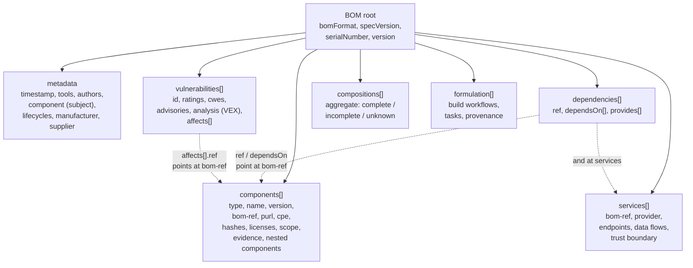
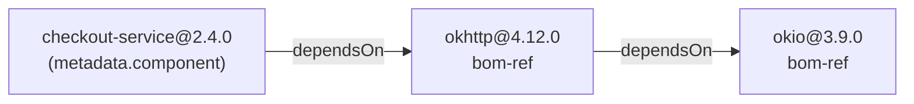
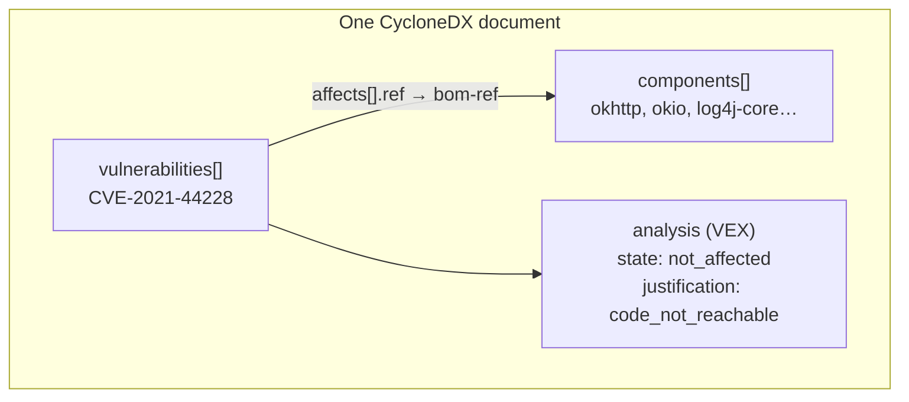
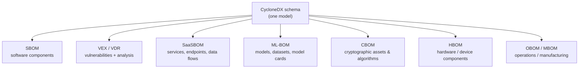
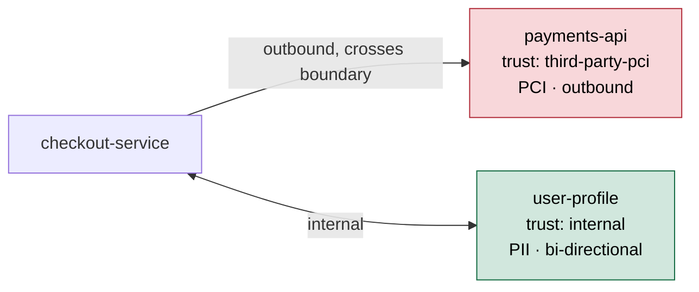
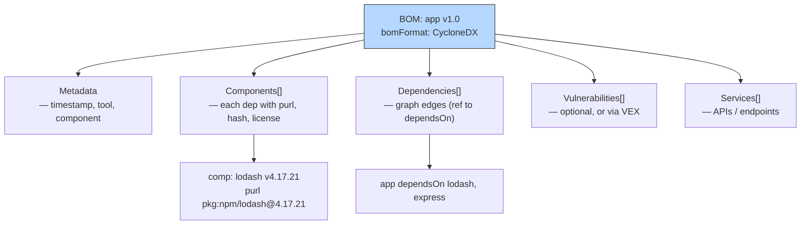
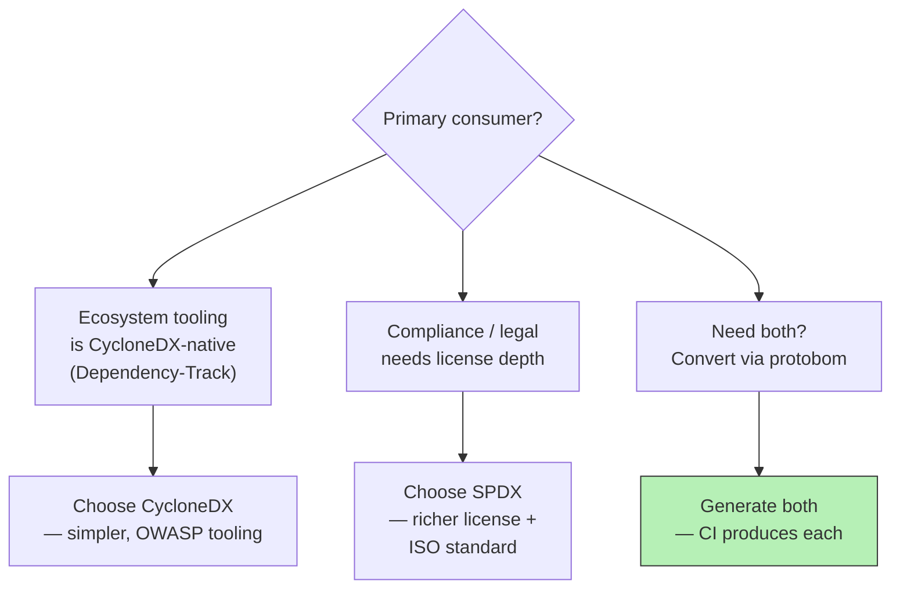

# Chapter 3 — CycloneDX in Depth

*What this chapter covers.* Chapter 2 dissected SPDX — a format whose bones were set by
the license-compliance world and which grew, through ISO standardization and the 3.0
rewrite, into a general-purpose graph model. This chapter is the counterpart: **CycloneDX**,
the other format you will actually encounter in production, and the one most likely to be
sitting in your artifact registry if a modern scanner produced it. CycloneDX comes from a
different lineage — application security and vulnerability management, not legal
compliance — and that heritage is visible in every design decision. It ships a native
vulnerability model, a native VEX, and an entire *family* of bill-of-materials types
(the "xBOM" vision) that reach past software into services, hardware, cryptography, and
machine-learning models. We cover the object model precisely, the differentiators that
matter, and then do the thing every engineer actually wants: an honest, non-partisan
SPDX-versus-CycloneDX comparison, because in a real fleet you do not pick one — you
*consume both* and normalize.

Learning goals — after this chapter you should be able to:

- Trace CycloneDX's **governance and heritage** (OWASP, Dependency-Track lineage,
  ECMA-424 in 2024, spec 1.6) and explain how a security-first origin shaped the format
  differently from SPDX's compliance-first origin.
- Read and write a **CycloneDX 1.6 document**: `bomFormat`, `specVersion`,
  `serialNumber`, `version`, `metadata`, `components` (with `bom-ref`, `purl`, `hashes`,
  `licenses`, `scope`), and the `dependencies` graph (`dependsOn` / `provides`).
- Use CycloneDX's **differentiators**: the native `vulnerabilities` array (ratings, CWEs,
  advisories, and the `analysis`/VEX block), `services` (SaaSBOM), `compositions`
  (completeness assertions), `formulation` (build provenance), and `evidence`
  (identification provenance and reachability support).
- Explain the **xBOM family** — SBOM, VEX, VDR, SaaSBOM, HBOM, ML-BOM, CBOM, OBOM, MBOM —
  and why CycloneDX treats them as one schema with different populated sections.
- Make a **defensible format choice** (or, more often, a defensible normalization
  strategy) using a fair trade-off table, and wire up a produce/consume pipeline with
  `syft`, `cdxgen`, the `cyclonedx-cli`, and OWASP Dependency-Track.

A word on boundaries. This chapter assumes Chapter 2's SPDX model, Chapter 1's motivation
and the identity schemes (purl, CPE) from Book 2, Chapter 6 — Software Composition
Analysis in Depth. It goes deep on *what CycloneDX can express*; the mechanics of getting
an accurate BOM out of a build live in Chapter 4 (SBOM Generation), the VEX correlation
pipeline in Chapter 6, and fleet-scale ingestion/normalization in Chapter 5. Signing is
sketched here and treated fully in Book 5 (Signing and Attestation).

## Origin, heritage, and governance

CycloneDX began around 2017 inside the **OWASP** ecosystem, closely tied to **OWASP
Dependency-Track** — a continuous component-analysis platform that needed a compact,
machine-friendly BOM to ingest and monitor. That origin is the single most important fact
about the format. SPDX was born to answer *"what are the licenses of everything in this
release, and can we ship it?"* CycloneDX was born to answer *"what components are in this
running application, and which of them have known vulnerabilities right now?"* The formats
have since grown toward each other, but the center of gravity never moved: SPDX is a
license/compliance format that learned security; CycloneDX is a security format that
learned compliance.

Concretely, the security heritage shows up as first-class schema real estate that SPDX
did not have natively for most of its life: an embedded `vulnerabilities` array, an
embedded VEX `analysis` block, a `services` model for describing the runtime call graph,
and `evidence` structures that record *how confidently* a component was identified (the
input to reachability analysis). None of that is bolted on — it is in the core schema.

### Governance and cadence

CycloneDX is governed as an OWASP flagship project with a working group and a public
GitHub-based process. Two properties matter to an engineer choosing a format:

- **Standardization.** In June 2024 CycloneDX was ratified as **ECMA-424** ("CycloneDX
  Bill of Materials Specification"), its first-edition text corresponding to the 1.6
  specification. This is the counterpart to SPDX's ISO/IEC 5962 — both formats now carry
  a formal standards imprimatur, though through different bodies (ECMA International for
  CycloneDX, ISO/IEC for SPDX). ECMA's process is generally faster and lighter-weight than
  ISO's, which is consistent with the rest of the CycloneDX story.
- **Cadence.** CycloneDX moves quickly and is unashamedly developer-centric. The version
  history is a good map of its ambitions: **1.4** (January 2022) introduced the native
  `vulnerabilities` array and VEX; **1.5** (June 2023) added `formulation` (build
  provenance), `annotations`, `lifecycles`, richer `compositions` and `evidence`, and the
  `machine-learning-model` and `data` component types (ML-BOM); **1.6** (April 2024) added
  the `cryptographic-asset` component type with `cryptoProperties` (CBOM), a `declarations`
  section for attestations (CycloneDX Attestations / CDXA), the `provides` dependency edge,
  `standards` definitions, and a rename of `manufacture` to `manufacturer`. That is a lot
  of surface area added in roughly two years — the trade-off for velocity is that tooling
  and downstream consumers lag the newest sections, so a 1.6 CBOM or attestation block may
  be produced before much of the ecosystem can *do* anything with it.

Throughout this chapter, "CycloneDX 1.6" means the ECMA-424 first edition unless noted.

## The CycloneDX object model

A CycloneDX BOM is a single document — JSON, XML, or Protocol Buffers — with a small set
of top-level arrays hanging off a thin header. The mental model is: a **header** that
identifies the document, a **metadata** block describing *what this BOM is about*, and then
parallel arrays (`components`, `services`, `dependencies`, `vulnerabilities`,
`compositions`, `formulation`, …) that are cross-linked by an internal identifier called
`bom-ref`. Unlike SPDX 2.x, where nearly every relationship is a generic
`(elementA, relationshipType, elementB)` triple, CycloneDX uses *purpose-built* structures
for each kind of relationship. That is the format's defining ergonomic choice, and we will
return to it in the comparison.



### The header and `metadata`

Four fields identify the document itself:

- **`bomFormat`** — always the literal string `"CycloneDX"`. This is how a consumer tells a
  CycloneDX file from an SPDX one without sniffing structure.
- **`specVersion`** — the schema version, e.g. `"1.6"`. It governs which fields are legal.
- **`serialNumber`** — a URN of the form `urn:uuid:<uuid>`. It is the *stable identity of
  this BOM document* across revisions.
- **`version`** — an integer, the **revision of the BOM**, starting at 1. If you regenerate
  a BOM for the same subject and correct an error, you keep the `serialNumber` and bump
  `version`. This lets consumers reason about "the latest BOM for artifact X."

Then **`metadata`** describes what the BOM is *about* and how it was made:

- **`timestamp`** — when the BOM was created (RFC 3339).
- **`lifecycles`** — new-ish; the lifecycle phase(s) this BOM reflects (`design`,
  `pre-build`, `build`, `post-build`, `operations`, `discovery`, `decommission`). This is
  CycloneDX's answer to CISA's SBOM-types taxonomy from Chapter 1: a *build*-phase BOM and
  an *operations*-phase BOM describe the same software but see different things.
- **`tools`** — what generated the BOM. In 1.5+ this is an object with `components[]` and
  `services[]` (the tools themselves modeled as components), superseding the flat 1.4-era
  `tool` array.
- **`authors`** — the people/contacts responsible.
- **`component`** — the *subject* of the BOM: the single component this BOM describes (your
  application, your container image). Everything in the top-level `components` array is,
  conceptually, *inside* this subject.
- **`manufacturer`** and **`supplier`** — the organization that made, and the organization
  that supplied, the subject. (`manufacturer` was `manufacture` before 1.6.)

### `components`

The `components` array is the inventory. Each component carries an identity and metadata;
the fields you will use constantly:

- **`type`** — and this is where CycloneDX's breadth first shows. The enumeration in 1.6 is
  `application`, `framework`, `library`, `container`, `platform`, `operating-system`,
  `device`, `device-driver`, `firmware`, `file`, `machine-learning-model`, `data`, and
  `cryptographic-asset`. A format that can type a component as a machine-learning model or
  a cryptographic asset is telling you it intends to describe more than a Maven jar.
- **`name`**, **`version`**, **`group`** — the human identity (`group` is the Maven
  groupId / npm scope).
- **`bom-ref`** — the *internal* identifier used by every other section to point at this
  component. It must be unique within the document. Conventionally people use the purl as
  the `bom-ref` (`pkg:npm/lodash@4.17.21`) because it is both unique and meaningful, but it
  is an opaque string as far as the schema cares.
- **`purl`** — the Package URL: the portable, ecosystem-aware identity
  (`pkg:maven/org.apache.logging.log4j/log4j-core@2.14.1`). This is the field that makes
  the component *matchable* against vulnerability databases (OSV, GHSA). See Book 2,
  Chapter 6.
- **`cpe`** — the NVD Common Platform Enumeration string, for matching against NVD/CVE data
  that is keyed on CPE rather than purl.
- **`hashes`** — an array of `{alg, content}` (SHA-256, SHA-512, SHA3, BLAKE2b/3, …). The
  cryptographic pin from an artifact to its bytes.
- **`licenses`** — an array of either `{license: {id | name, ...}}` (an SPDX license ID or a
  free name) or `{expression: "..."}` (an SPDX license expression). In 1.6 a license entry
  can carry an `acknowledgement` of `declared` or `concluded` — the same
  declared-vs-concluded distinction SPDX makes.
- **`supplier`**, **`publisher`** — provenance of the component.
- **`scope`** — `required`, `optional`, or `excluded`. A build tool can mark a dependency
  that is present but not actually used (`excluded`) or only needed in some configuration
  (`optional`) — directly useful when triaging whether a vulnerable component is even in
  the shipped path.
- **`components`** — **nested components**. A component can contain sub-components. This is
  how CycloneDX models "this container image contains these OS packages contains these
  files," and it is an alternative to expressing everything through the dependency graph.
- **`evidence`** — provenance of the *identification itself* (covered under differentiators).

Here is a minimal but real and correct CycloneDX 1.6 document: an application with two
library dependencies and a dependency graph.

```json
{
  "bomFormat": "CycloneDX",
  "specVersion": "1.6",
  "serialNumber": "urn:uuid:3e671687-395b-41f5-a30f-a58921a69b79",
  "version": 1,
  "metadata": {
    "timestamp": "2026-07-31T09:15:00Z",
    "lifecycles": [
      { "phase": "build" }
    ],
    "tools": {
      "components": [
        {
          "type": "application",
          "group": "@cyclonedx",
          "name": "cdxgen",
          "version": "10.9.5"
        }
      ]
    },
    "authors": [
      { "name": "Platform Security", "email": "seceng@example.com" }
    ],
    "component": {
      "type": "application",
      "bom-ref": "pkg:generic/checkout-service@2.4.0",
      "name": "checkout-service",
      "version": "2.4.0",
      "purl": "pkg:generic/checkout-service@2.4.0",
      "supplier": { "name": "Example, Inc." }
    },
    "manufacturer": { "name": "Example, Inc." }
  },
  "components": [
    {
      "type": "library",
      "bom-ref": "pkg:maven/com.squareup.okhttp3/okhttp@4.12.0",
      "group": "com.squareup.okhttp3",
      "name": "okhttp",
      "version": "4.12.0",
      "purl": "pkg:maven/com.squareup.okhttp3/okhttp@4.12.0",
      "scope": "required",
      "hashes": [
        { "alg": "SHA-256",
          "content": "b2a5c1d0f0a3e4b5c6d7e8f90112233445566778899aabbccddeeff001122334" }
      ],
      "licenses": [
        { "license": { "id": "Apache-2.0", "acknowledgement": "declared" } }
      ]
    },
    {
      "type": "library",
      "bom-ref": "pkg:maven/com.squareup.okio/okio@3.9.0",
      "group": "com.squareup.okio",
      "name": "okio",
      "version": "3.9.0",
      "purl": "pkg:maven/com.squareup.okio/okio@3.9.0",
      "scope": "required",
      "licenses": [
        { "license": { "id": "Apache-2.0" } }
      ]
    }
  ],
  "dependencies": [
    {
      "ref": "pkg:generic/checkout-service@2.4.0",
      "dependsOn": [ "pkg:maven/com.squareup.okhttp3/okhttp@4.12.0" ]
    },
    {
      "ref": "pkg:maven/com.squareup.okhttp3/okhttp@4.12.0",
      "dependsOn": [ "pkg:maven/com.squareup.okio/okio@3.9.0" ]
    },
    {
      "ref": "pkg:maven/com.squareup.okio/okio@3.9.0",
      "dependsOn": []
    }
  ]
}
```

Note what is *not* here: no per-relationship triples, no separate "describes" element. The
subject is `metadata.component`, and the graph is expressed once in `dependencies`.

### `dependencies` — the graph

CycloneDX's dependency graph is deliberately flat and purpose-built. Each entry has:

- **`ref`** — the `bom-ref` of a component (or service).
- **`dependsOn`** — an array of `bom-ref`s that `ref` directly depends on.
- **`provides`** — added in 1.6: an array of `bom-ref`s that `ref` *provides* an
  implementation of. This models the interface/implementation relationship — e.g. a
  concrete SLF4J binding *provides* the SLF4J API — which the pure `dependsOn` edge could
  not express cleanly.

The graph is a set of adjacency lists. To reconstruct the full transitive tree you walk
`dependsOn` from the subject. Leaf components appear with an empty `dependsOn` (or are
simply referenced without their own entry). Compared with SPDX, where you would encode the
same tree as a pile of `DEPENDS_ON` relationship objects each naming two SPDXIDs, the
CycloneDX form is terser and reads like the graph it represents — but it is also *less
expressive*: SPDX 2.x defines dozens of relationship types (`DYNAMIC_LINK`,
`BUILD_DEPENDENCY_OF`, `GENERATED_FROM`, `PATCH_APPLIED`, …), while CycloneDX gives you
`dependsOn` and `provides` and expects you to encode nuance elsewhere (in `scope`, in
`pedigree`, in `properties`). That is a real trade: CycloneDX optimizes for the graph you
query most (runtime dependency) at the cost of the long tail of relationship semantics.



### Serializations

CycloneDX defines three wire formats from a single logical model:

- **JSON** — the dominant format in practice, with a published JSON Schema
  (`bom-1.6.schema.json`). Almost every modern tool emits and ingests JSON first.
- **XML** — the original serialization (CycloneDX predates its own JSON support), still
  widely used and the only one for which the classic **XML Signature** enveloped-signing
  path applies.
- **Protocol Buffers** — a `.proto` schema for high-throughput, size-sensitive pipelines.
  Useful when you are shipping millions of BOMs through a message bus, but the protobuf
  representation historically trails the newest schema features, so treat it as a transport
  optimization rather than the canonical form.

The three are meant to be losslessly convertible for the features each supports;
`cyclonedx-cli convert` moves between them.

## CycloneDX's differentiators

Everything above has a rough SPDX analogue. What follows mostly does not — this is where
choosing CycloneDX buys you something concrete.

### The native `vulnerabilities` model

Since 1.4, a CycloneDX BOM can carry a top-level `vulnerabilities` array. This is the
feature that most cleanly separates it from SPDX, whose vulnerability story historically
lived in a separate profile or an external document. Each vulnerability entry can hold:

- **`id`** and **`source`** — the identifier (`CVE-2021-44228`, a GHSA ID, an internal ID)
  and where it came from (`{name: "NVD", url: "..."}`).
- **`ratings`** — an array of severity ratings, each with a `source`, a numeric `score`, a
  `severity` (`critical`/`high`/`medium`/`low`/`info`/`none`/`unknown`), a `method`
  (`CVSSv31`, `CVSSv4`, `OWASP`, `SSVC`, …), and a `vector`. Multiple ratings from
  different sources can coexist — you are not forced to collapse NVD and a vendor score
  into one number.
- **`cwes`** — an array of CWE integers (e.g. `502` for deserialization).
- **`advisories`**, **`references`** — links to the advisory and related records.
- **`description`**, **`detail`**, **`recommendation`**, **`workaround`**.
- **`affects`** — an array binding the vulnerability to *components in this BOM* by
  `bom-ref`, optionally with affected `versions`/ranges and a per-range `status`. This is
  the join back into the inventory.
- **`analysis`** — the VEX block (next).

Because the vulnerability is bound to the component graph by `bom-ref` in the *same*
document, a scanner's output and the inventory it scanned travel together. That is the
whole appeal of the model for a scan-and-triage pipeline.



### CycloneDX VEX and the `analysis` block

The **`analysis`** object inside a vulnerability entry is CycloneDX's inline **VEX**
(Vulnerability Exploitability eXchange). It answers the question a bare CVE match cannot:
*does this vulnerability actually affect this product?* Its fields:

- **`state`** — `resolved`, `resolved_with_pedigree`, `exploitable`, `in_triage`,
  `false_positive`, or `not_affected`.
- **`justification`** — when the state is `not_affected`, *why*: `code_not_present`,
  `code_not_reachable`, `requires_configuration`, `requires_dependency`,
  `requires_environment`, `protected_by_compiler`, `protected_at_runtime`,
  `protected_at_perimeter`, or `protected_by_mitigating_control`.
- **`response`** — planned responses: `can_not_fix`, `will_not_fix`, `update`, `rollback`,
  `workaround_available`.
- **`detail`** — free text for the human reasoning.

Crucially, CycloneDX VEX can live **inline** (the `analysis` block inside a full SBOM) *or*
as a **standalone BOM** that carries only `vulnerabilities` (with `analysis`) and points at
the components of an SBOM published elsewhere. That flexibility — one schema, two
deployment modes — is why Chapter 6 treats CycloneDX VEX as a first-class option alongside
the OpenVEX and CSAF/VEX profiles. Here is the shape:

```json
{
  "bomFormat": "CycloneDX",
  "specVersion": "1.6",
  "serialNumber": "urn:uuid:c2b8a0e4-6d21-4a7f-9b3e-8f0d6a1c2e34",
  "version": 1,
  "metadata": { "timestamp": "2026-07-31T10:00:00Z" },
  "vulnerabilities": [
    {
      "bom-ref": "vuln-log4shell-checkout",
      "id": "CVE-2021-44228",
      "source": { "name": "NVD", "url": "https://nvd.nist.gov/vuln/detail/CVE-2021-44228" },
      "ratings": [
        {
          "source": { "name": "NVD" },
          "score": 10.0,
          "severity": "critical",
          "method": "CVSSv31",
          "vector": "CVSS:3.1/AV:N/AC:L/PR:N/UI:N/S:C/C:H/I:H/A:H"
        }
      ],
      "cwes": [ 502, 917 ],
      "description": "Apache Log4j2 JNDI features do not protect against attacker-controlled LDAP endpoints.",
      "advisories": [
        { "title": "Apache Log4j Security", "url": "https://logging.apache.org/log4j/2.x/security.html" }
      ],
      "analysis": {
        "state": "not_affected",
        "justification": "code_not_reachable",
        "response": [ "will_not_fix" ],
        "detail": "log4j-core is on the classpath transitively but JNDI lookup is never invoked; message-lookup is disabled via log4j2.formatMsgNoLookups=true."
      },
      "affects": [
        {
          "ref": "pkg:maven/org.apache.logging.log4j/log4j-core@2.14.1",
          "versions": [
            { "range": "vers:maven/>=2.0.0|<2.15.0", "status": "affected" }
          ]
        }
      ]
    }
  ]
}
```

Note the `affects[].ref` points at a `bom-ref` that would exist in the *separate* SBOM this
VEX annotates — the two documents are joined by shared `bom-ref` values, which is exactly
how a fleet correlation engine reconnects them (Chapter 5, Chapter 6).

### The xBOM family

CycloneDX's most strategic bet is that a "bill of materials" is not specific to software.
The same schema — same header, same `bom-ref` linking, same `dependencies` graph — can
enumerate *anything* whose composition and provenance you want to track. This is the
**xBOM** vision, and the specification's breadth of component types and top-level sections
exists to serve it.



The members:

- **SBOM** — the software inventory (everything above).
- **VEX** — exploitability statements (the `analysis` block), inline or standalone.
- **VDR (Vulnerability Disclosure Report)** — the inverse framing of VEX: a report of the
  *known* vulnerabilities affecting a product, disclosed by the supplier. Same
  `vulnerabilities` array, different intent — VDR discloses what *is* wrong; VEX asserts
  what is *not* exploitable. A supplier often issues both.
- **SaaSBOM** — the `services` model (below): external services, endpoints, trust
  boundaries, and data flows.
- **HBOM (Hardware BOM)** — physical/device composition, using `device`, `device-driver`,
  and `firmware` component types. Relevant to medical devices and IoT where the FDA and CRA
  regimes from Chapter 1 reach hardware.
- **ML-BOM** — machine-learning models and datasets, via the `machine-learning-model` and
  `data` component types and the `modelCard` structure (energy, considerations, quantitative
  analysis, and — critically for supply-chain risk — training-data provenance). As AI
  systems become software dependencies, "what model and what data went into this" becomes a
  supply-chain question; see Book 7, Chapter 7 for the AI/ML supply-chain treatment.
- **CBOM (Cryptography BOM)** — new in 1.6: the `cryptographic-asset` component type with
  `cryptoProperties` describing algorithms, key sizes, protocols, and certificates. The
  motivating use case is **post-quantum cryptography (PQC) migration**: to know which of
  your systems use RSA-2048 or ECDSA and must move to PQC algorithms, you first need an
  inventory of cryptographic assets. A CBOM is that inventory.
- **OBOM (Operations BOM)** and **MBOM (Manufacturing BOM)** — runtime/operational
  configuration and manufacturing composition, rounding out the lifecycle.

The engineering point is not that you will use all of these — most teams use SBOM + VEX and
maybe SaaSBOM. It is that CycloneDX did not fork a new format for each; it extended one
schema, so a single parser, a single signing story, and a single `bom-ref` linking model
cover the whole family. SPDX 3.0 pursues comparable breadth through its **profiles**
mechanism instead; the comparison section returns to this.

### `services` — the SaaSBOM

The `services` array describes external services your software *calls* — the runtime supply
chain, not the compile-time one. This is uniquely valuable for distributed systems, and it
is the CycloneDX feature with no real SPDX analogue. A service entry carries:

- **`bom-ref`**, **`name`**, **`version`**, **`group`**, **`provider`** — identity and who
  runs it.
- **`endpoints`** — the URLs/URIs the service exposes or that you call.
- **`authenticated`** — whether calls to it are authenticated.
- **`x-trust-boundary`** — whether calling the service crosses a trust boundary (leaves your
  security domain).
- **`trustZone`** — a label for the zone the service sits in.
- **`data`** — the **data flows**: an array of classified flows, each with a `flow`
  direction (`inbound`, `outbound`, `bi-directional`, `unknown`), a `classification` (e.g.
  `PII`, `PCI`, `public`), and optional `source`/`destination` and `governance`
  (data-ownership) metadata.
- **`services`** — nested services.

That set of fields is essentially a machine-readable data-flow diagram. For a microservice,
a SaaSBOM records "I call the payments API (outbound, PCI data, crosses a trust boundary,
authenticated) and the internal user-profile service (bi-directional, PII, same trust
zone)." Combined with the software SBOM, you get both halves of the supply chain in one
document.

```json
{
  "bomFormat": "CycloneDX",
  "specVersion": "1.6",
  "serialNumber": "urn:uuid:9a1f0c33-77bd-4a2e-8e2b-1d4c9b0a2f55",
  "version": 1,
  "metadata": {
    "timestamp": "2026-07-31T11:20:00Z",
    "component": {
      "type": "application",
      "bom-ref": "checkout-service",
      "name": "checkout-service",
      "version": "2.4.0"
    }
  },
  "services": [
    {
      "bom-ref": "svc-payments",
      "provider": { "name": "Acme Payments" },
      "name": "payments-api",
      "endpoints": [ "https://api.acme-pay.example/v2/charges" ],
      "authenticated": true,
      "x-trust-boundary": true,
      "trustZone": "third-party-pci",
      "data": [
        {
          "flow": "outbound",
          "classification": "PCI",
          "name": "card-charge-request",
          "destination": "svc-payments"
        }
      ]
    },
    {
      "bom-ref": "svc-user-profile",
      "name": "user-profile",
      "authenticated": true,
      "x-trust-boundary": false,
      "trustZone": "internal",
      "data": [
        { "flow": "bi-directional", "classification": "PII", "name": "profile-lookup" }
      ]
    }
  ],
  "dependencies": [
    { "ref": "checkout-service", "dependsOn": [ "svc-payments", "svc-user-profile" ] }
  ]
}
```

Because services are `bom-ref`-addressable, they participate in the same `dependencies`
graph as software components — the subject `dependsOn` both a library and a service. This
is the diagram:



### `compositions`, `formulation`, `evidence`, and annotations

Four more sections carry provenance and completeness signal — the things that separate an
SBOM you can *trust* from one you merely *have*.

**`compositions`** encodes **completeness assertions**. Each composition has an `aggregate`
value declaring how complete a slice of the BOM is: `complete` (every constituent is
accounted for), `incomplete`, one of several qualified-incomplete values
(`incomplete_first_party_only`, `incomplete_third_party_only`, …), `unknown`, or
`not_specified`, plus the `assemblies`/`dependencies` the assertion applies to. This is how
a producer *honestly signals* "I enumerated the third-party dependencies completely but the
first-party file list is partial." A consumer that treats an SBOM as ground truth without
reading `compositions` is over-trusting it — Chapter 7 (SBOM Quality) leans hard on this
field.

**`formulation`** records **how the software was built** — build provenance inside the BOM.
A `formula` can contain `components`, `services`, and `workflows`, where a workflow is a
sequence of `tasks`/`steps` with `inputs` and `outputs` and `resourceReferences`. It
overlaps conceptually with SLSA provenance and in-toto attestations (Book 4, Chapter 5;
Book 5) — the distinction is that `formulation` lives *inside* the CycloneDX document as
part of one signed artifact, whereas SLSA provenance is typically a separate attestation.
Do not treat them as interchangeable, but do recognize they answer the same "how was this
made" question.

**`evidence`** (on a component) records the **provenance of the identification** — how the
tool decided this component is present, and how confident it is. It holds:

- **`identity`** — which field was inferred (`purl`, `cpe`, `name`, `version`, …), a
  `confidence` score in `[0,1]`, and the `methods` used, each a
  `{technique, confidence, value}` where `technique` is one of `source-code-analysis`,
  `binary-analysis`, `manifest-analysis`, `ast-fingerprint`, `hash-comparison`,
  `instrumentation`, `dynamic-analysis`, `filename`, `attestation`, or `other`.
- **`occurrences`** — *where* the component was found (file paths, locations), which
  supports **reachability**: a component found only in a test directory is a very different
  risk from one linked into the main binary.
- **`callstack`** — call-stack frames showing the component being invoked, the strongest
  possible "this code actually runs" evidence.

`evidence` is CycloneDX admitting that SBOM generation is *inference*, and giving tools a
place to show their work. A downstream reachability or triage system can read `confidence`
and `occurrences` to prioritize — a low-confidence `filename`-only match is a candidate for
suppression; a `callstack`-backed match is not.

**`annotations`** attach signed, authored commentary to any `bom-ref` — reviewer notes,
triage decisions, machine-generated remarks — with a timestamp and annotator, and can
themselves be signed.

### Signing and integrity

An SBOM you cannot verify is an SBOM you cannot trust in an automated pipeline. CycloneDX
supports **enveloped** signatures (the `signature` property carried inside the document) and
**detached** signatures. For JSON, signing uses the **JSON Signature Format (JSF)**; for
XML, **XML Signature (XML-DSig)**. The `signature` property can appear at the document root
and, granularly, on individual `compositions` and `annotations`, so you can sign a
completeness assertion or a triage annotation independently.

In practice, teams increasingly wrap the BOM in a **Sigstore/cosign** signature or an
**in-toto attestation** rather than using the native JSF envelope, because that plugs into
the same keyless-signing and transparency-log infrastructure used for container images
(Book 5, Chapters 3–4). Both approaches are valid; the native envelope keeps the signature
*in* the document, the cosign approach keeps signing uniform across all your artifacts. The
integrity requirement is the constant — an unsigned SBOM in a registry is a document any
build step could have tampered with.

## SPDX versus CycloneDX — the honest comparison

Engineers want a verdict. The honest answer is that both formats are mature, both are
standardized, both can express a modern dependency graph with purls and hashes and
licenses, and the interesting differences are about *heritage, ergonomics, and native
support for adjacent concerns* — not about one being "better." Here is a fair table.

| Dimension | SPDX | CycloneDX |
|---|---|---|
| Governance | Linux Foundation; **ISO/IEC 5962:2021** | OWASP; **ECMA-424 (2024)** |
| Heritage | License compliance / legal | Application security / vulnerability mgmt |
| Current version | 3.0 (2024), 2.3 widely deployed | 1.6 (2024) |
| Relationship model | Generic typed triples (`DEPENDS_ON`, `GENERATED_FROM`, dozens more) — very expressive | Purpose-built (`dependsOn`, `provides`) — terse, graph-shaped |
| Native vuln model | Weak historically; separate/evolving | **Native** `vulnerabilities` array since 1.4 |
| Native VEX | Via external/companion mechanisms | **Native** `analysis` block; inline or standalone |
| Services / runtime | Not natively modeled | **`services`** (SaaSBOM) — unique |
| Breadth strategy | **Profiles** (Core, Software, Security, Licensing, Build, AI, Dataset, …) in 3.0 | **xBOM** (SBOM, VEX, SaaSBOM, ML-BOM, CBOM, HBOM, …) in one schema |
| Serializations | Tag-value, JSON, RDF/Turtle, YAML, XML | JSON, XML, Protocol Buffers |
| Verbosity | Higher (explicit elements + relationships) | Lower (compact, especially JSON) |
| License expression | Origin of SPDX license IDs/expressions | Reuses SPDX license IDs/expressions |
| Tooling center of gravity | FOSSology, Tern, license/compliance tooling, gov procurement | Dependency-Track, cdxgen, appsec/vuln tooling |
| Build provenance | `Build` profile / relationships | **`formulation`** section |

Reading the table:

- **Heritage predicts fit.** If your primary driver is license compliance, open-source
  governance, or a government procurement mandate that names SPDX, SPDX's richer
  relationship vocabulary and ISO pedigree are advantages. If your primary driver is
  vulnerability management, VEX, and describing running services, CycloneDX's native
  security sections save you from bolting on external documents.
- **Expressiveness versus ergonomics.** SPDX's triple model can say more (patch-applied-to,
  generated-from, static-vs-dynamic link) but costs verbosity and complexity. CycloneDX's
  purpose-built sections are easier to produce and consume for the common cases and harder
  to stretch to the uncommon ones.
- **Breadth, two ways.** Both formats now reach beyond software — SPDX 3.0 via composable
  *profiles*, CycloneDX via the *xBOM* family. SPDX's profile model is arguably cleaner
  architecturally (opt into exactly the semantics you need); CycloneDX's single-schema
  model is arguably simpler operationally (one parser, one signer). Neither is obviously
  superior.

### The real answer: you consume both

Here is the operational reality that dissolves most of the debate: **at fleet scale you do
not choose a format — you receive both and normalize.** Your own builds might standardize
on one, but the SBOMs that arrive with third-party software, base images, and vendor
components will be a mix. Worse, the *same tool* frequently emits both: **`syft` produces
CycloneDX and SPDX** (and its own format) from the same scan; **Trivy** does likewise.

So the correct architecture is not "pick SPDX or CycloneDX." It is: **normalize every
inbound SBOM, whatever its format, into one internal component-graph model at ingestion,**
and treat SPDX-vs-CycloneDX as a serialization detail at the edge. That internal model
keys components by purl (falling back to CPE, then hash), stores the dependency graph, and
attaches vulnerability/VEX state as a separate overlay. Chapter 5 (SBOM Distribution,
Storage, and Querying at Scale) builds exactly this. The format war is a non-event once you
have a normalizer; format *bugs and lossiness* — what each format silently drops on
round-trip — are the real operational concern, and that is a Chapter 7 topic.

## Producing and consuming CycloneDX

### Producing

Three common paths, in rough order of accuracy (Chapter 4 goes deep on why the ordering
exists):

- **`cdxgen`** — the OWASP CycloneDX generator (`@cyclonedx/cdxgen`). Multi-ecosystem,
  CycloneDX-native, and the reference producer for the newer sections (services, evidence,
  ML-BOM). Runs against a project directory or a container image:

  ```bash
  # Generate a CycloneDX 1.6 SBOM for a project directory
  cdxgen -t java -o bom.json --spec-version 1.6 /path/to/checkout-service

  # Generate for a container image
  cdxgen -t docker -o image-bom.json registry.example.com/checkout-service:2.4.0
  ```

- **`syft`** — Anchore's scanner; emits CycloneDX *and* SPDX from one analysis, which is why
  it anchors so many normalization pipelines:

  ```bash
  syft registry.example.com/checkout-service:2.4.0 \
    -o cyclonedx-json=cdx.json \
    -o spdx-json=spdx.json
  ```

- **Build-plugins** — ecosystem-native plugins that read the *resolved* dependency graph
  from the build tool itself, generally the most accurate source because they see what the
  build actually resolved rather than inferring from lockfiles or binaries:
  `cyclonedx-maven-plugin`, `cyclonedx-gradle-plugin`, `@cyclonedx/cyclonedx-npm`,
  `cyclonedx-py` (Python), `cyclonedx-gomod` (Go), and others. Wiring these into CI is
  Chapter 4's subject.

### Consuming

- **OWASP Dependency-Track** — the natural home of a CycloneDX BOM. You POST the BOM to its
  API; it stores the component graph and *continuously* re-correlates it against
  vulnerability sources (OSS Index, the NVD mirror, GitHub Advisories, and others),
  surfacing new findings against components you shipped months ago. This is the
  "enumerate once, re-match forever" decoupling from Chapter 1 realized as a product, and it
  ingests CycloneDX VEX to suppress findings you have triaged. A Dependency-Track instance
  fronting a fleet of services is, in effect, a *fleet inventory + vulnerability
  correlation stack* (Book 2, Chapter 6).

  ```bash
  curl -s -X POST "https://dtrack.example.com/api/v1/bom" \
    -H "X-Api-Key: $DT_API_KEY" \
    -F "project=$PROJECT_UUID" \
    -F "bom=@cdx.json"
  ```

- **`cyclonedx-cli`** — the Swiss-army knife: `validate`, `convert` (between JSON/XML/
  protobuf and even to/from SPDX for the overlapping subset), `merge`, `diff`, and `sign`.

  ```bash
  # Validate against the 1.6 schema before publishing
  cyclonedx-cli validate --input-file cdx.json --input-version v1_6 --fail-on-errors
  ```

- **Libraries** — `cyclonedx-python-lib`, `cyclonedx-core-java`,
  `cyclonedx-javascript-library`, and `cyclonedx-go` give you typed models so your
  normalizer is not string-munging JSON.

### Validation

Always validate before you trust or publish. Two levels: **schema validation** (does it
conform to `bom-1.6.schema.json`?) via `cyclonedx-cli validate` or any JSON-Schema
validator, and **semantic checks** you add yourself (every `dependsOn` ref resolves to a
`bom-ref`; every `affects[].ref` resolves; purls parse). Schema-valid does not mean
*complete* or *accurate* — read the `compositions` block and the per-component `evidence`
before you treat an SBOM as ground truth. That gap between "valid" and "trustworthy" is the
whole of Chapter 7.

## Distributed-systems lens

Four ways CycloneDX specifically earns its place in a large backend estate:

- **SaaSBOM models the runtime supply chain.** A microservice architecture's real
  attack surface is not just its jars — it is the graph of services it calls, the data
  that crosses each edge, and which edges leave your trust boundary. The `services` model
  with `data` flows and `x-trust-boundary` is a machine-readable version of the data-flow
  diagram your threat model already needs (Book 1, Chapter 9 — the runtime supply chain).
  Generate a SaaSBOM per service from config/traffic analysis and you can query "which
  services send PII across a trust boundary" across the whole fleet.
- **The native vuln/VEX model streamlines scan-and-suppress.** Because the vulnerability,
  its rating, and its `analysis` (VEX) live *with* the component graph and are joined by
  `bom-ref`, the pipeline from "scanner found CVE-X in service-Y" to "team triaged it
  `not_affected` with justification `code_not_reachable`" to "suppressed everywhere that
  component appears" is one data model, not three integrations. Chapter 6 builds this
  pipeline; CycloneDX is the substrate that makes it terse.
- **Dependency-Track + CycloneDX is a fleet correlation stack.** Point every service's CI
  at Dependency-Track, feed it CycloneDX BOMs, and you have continuous re-matching of your
  entire inventory against fresh advisories, with VEX-based suppression — the fleet-scale
  version of Book 2, Chapter 6's SCA. The `serialNumber` + `version` scheme lets it track
  "the current BOM for service-Y" across rebuilds.
- **Normalize both formats at ingestion.** The distributed-systems reality is
  heterogeneity: many teams, many tools, inbound third-party BOMs in whatever format the
  vendor chose. Do *not* let format sprawl reach your inventory database. Normalize
  CycloneDX and SPDX into one internal graph model at the edge (Chapter 5), keyed on purl,
  with vuln/VEX as an overlay. Then CycloneDX's ergonomic advantages help you *produce*
  good BOMs and its native sections help you *consume* rich ones, without the format
  choice leaking into every downstream query.

## Key takeaways

- **CycloneDX is a security-first format.** Its OWASP / Dependency-Track heritage put a
  native `vulnerabilities` array, native VEX (`analysis`), a `services` model, and
  `evidence` structures in the core schema. SPDX learned security later; CycloneDX started
  there. Standardized as **ECMA-424 (2024)**, current spec **1.6**.
- **The object model is thin header + `metadata` + parallel arrays cross-linked by
  `bom-ref`.** `bomFormat` / `specVersion` / `serialNumber` (a `urn:uuid`) / `version`
  identify the document; `metadata.component` is the subject; `components`, `services`,
  `dependencies`, `vulnerabilities` hang off the root and reference each other by
  `bom-ref`.
- **The dependency graph is purpose-built and flat:** `dependencies[]` with
  `ref` / `dependsOn` (and `provides`, new in 1.6). Terser than SPDX's typed-triple graph,
  and less expressive — CycloneDX optimizes the query you run most.
- **The differentiators are the reason to reach for it:** native vuln + VEX joined to the
  graph by `bom-ref`; `services` (SaaSBOM) with classified data flows and trust
  boundaries; `compositions` (honest completeness signaling); `formulation` (build
  provenance); `evidence` (identification provenance + reachability); and native signing
  (JSF/XML-DSig).
- **The xBOM vision is one schema, many bills:** SBOM, VEX, VDR, SaaSBOM, HBOM, ML-BOM (AI
  supply chain — Book 7, Chapter 7), CBOM (cryptographic assets — the PQC-migration
  inventory), OBOM, MBOM. SPDX pursues the same breadth via *profiles*; both are valid,
  different architectures.
- **The format debate is mostly moot in practice.** Both are mature and standardized; tools
  like `syft` emit both. Do not choose — **normalize both into one internal model at
  ingestion** (Chapter 5) and treat SPDX-vs-CycloneDX as an edge serialization detail. The
  real risk is round-trip lossiness (Chapter 7), not format identity.
- **Produce with `cdxgen` / `syft` / build plugins; consume with Dependency-Track, the
  `cyclonedx-cli`, and typed libraries; validate against the schema — and remember that
  schema-valid is not the same as complete or accurate.**


### CycloneDX BOM structure




### CycloneDX vs SPDX: when to use which



## Further reading

- **ECMA-424**, "CycloneDX Bill of Materials Specification," 1st edition, Ecma
  International, June 2024.
- **OWASP CycloneDX** project documentation and the **CycloneDX 1.6 JSON Schema**
  (`cyclonedx.org/docs/1.6/`, `cyclonedx.org/schema/bom-1.6.schema.json`); the XML XSD and
  the Protocol Buffers `.proto`.
- **CycloneDX Authoritative Guides** (OWASP Foundation): the guides to SBOM, VEX, SaaSBOM,
  and the xBOM family, for the intended usage of each section.
- **OWASP Dependency-Track** documentation (`docs.dependencytrack.org`) for continuous
  BOM analysis, VEX ingestion, and the API.
- **`cdxgen`** (`github.com/CycloneDX/cdxgen`) and **`cyclonedx-cli`**
  (`github.com/CycloneDX/cyclonedx-cli`) documentation; **`syft`** (`github.com/anchore/
  syft`) for dual-format generation.
- **Package URL (purl) specification** (`github.com/package-url/purl-spec`) and **NIST
  CPE 2.3**, for the component identity schemes CycloneDX carries.
- For the CBOM/PQC angle: **NIST FIPS 203/204/205** (the standardized post-quantum
  algorithms) and the CycloneDX cryptography-BOM guidance, for context on why a
  cryptographic-asset inventory matters.
- Cross-references in this suite: **Chapter 2 — SPDX in Depth** (the comparison's other
  half); **Chapter 5 — SBOM Distribution, Storage, and Querying at Scale** (normalization);
  **Chapter 6 — VEX and Vulnerability Correlation** (the scan-and-suppress pipeline);
  **Book 2, Chapter 6 — Software Composition Analysis in Depth**; **Book 5 — Signing and
  Attestation** (SBOM integrity); **Book 7, Chapter 7** (AI/ML supply chain).
```