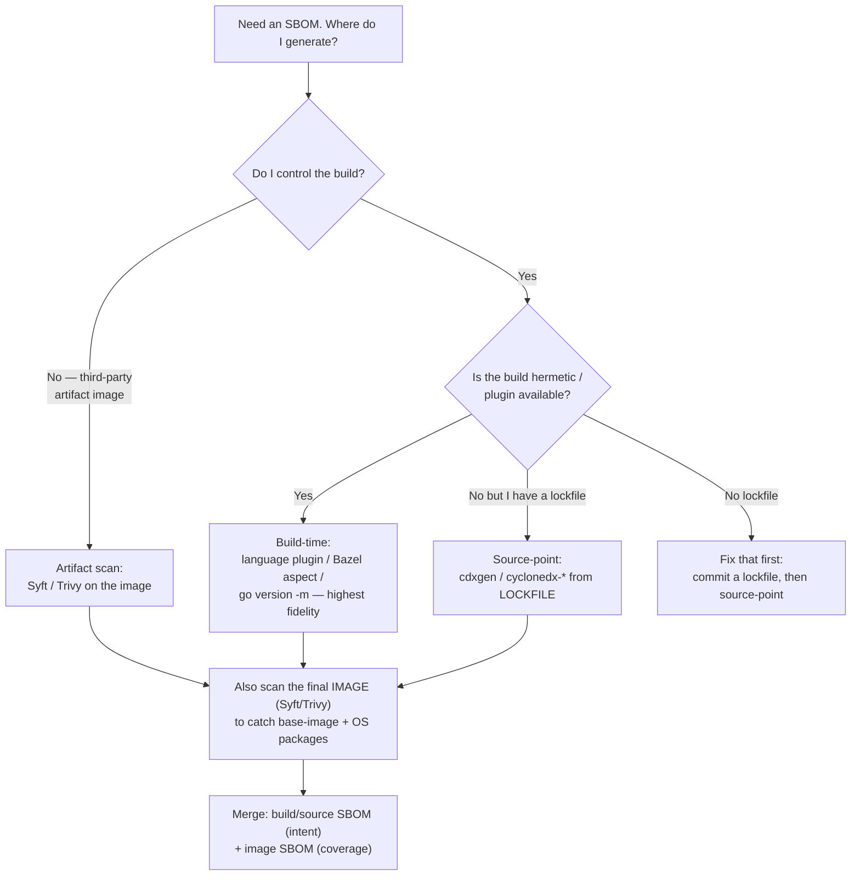
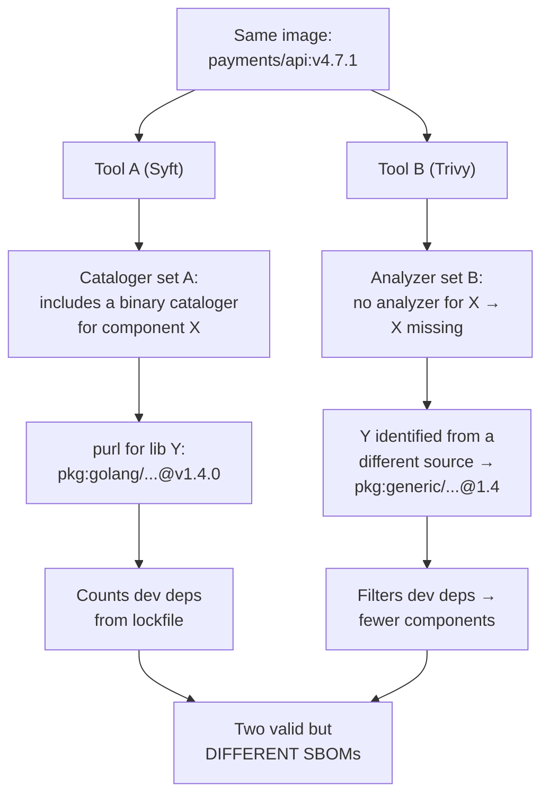
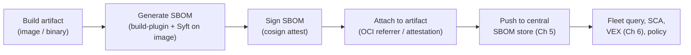
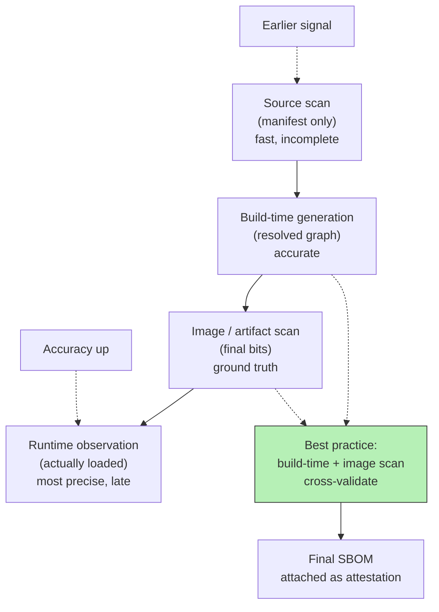
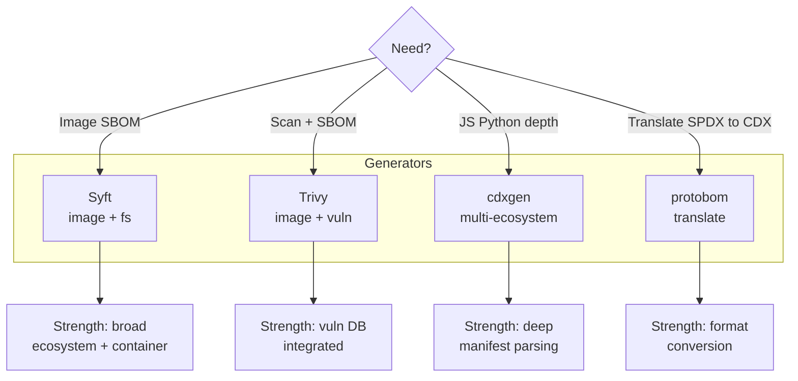
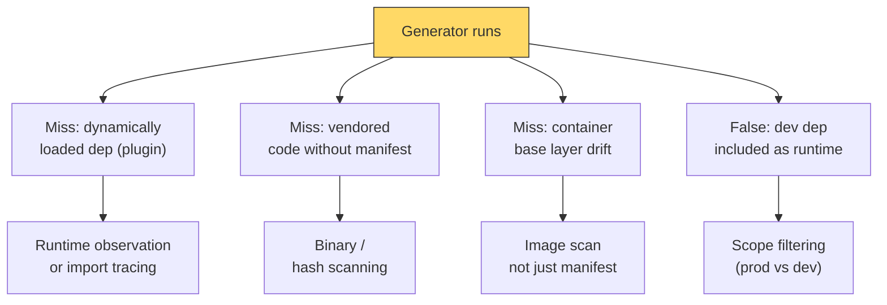

# Chapter 4 — SBOM Generation: Tools, Techniques, and Accuracy

*What this chapter covers.* Chapters 2 and 3 gave you the two wire formats an SBOM can be
written in. This chapter is about the far harder problem the formats quietly assume is
already solved: **where does the data come from, and how accurate is it?** An SBOM is only
as good as the process that produced it, and generation is the single most underestimated
part of the entire SBOM value chain. A perfectly-formed CycloneDX 1.6 document that is
missing a third of the components in your container is worse than useless — it is
confidently wrong. The thesis of this chapter, stated once and defended throughout, is
that **the point in your pipeline at which you generate an SBOM is the single biggest
determinant of its accuracy**, larger than tool choice, larger than format, larger than
anything in the schema. Everything else is a refinement on that decision.

Learning goals — after this chapter you should be able to:

- Map the four practical generation points — **source/manifest, build, binary/artifact,
  runtime** — onto the CISA SBOM types (Chapter 1) and state precisely **what each one
  sees and what it is structurally blind to**.
- Explain why **reading a lockfile** is the difference between a source SBOM that reflects
  declared intent and one that reflects resolved reality (Book 2, Chapter 2).
- Describe how the real tools — **Syft, Trivy, cdxgen, the CycloneDX language plugins, Go's
  build metadata, the Kubernetes `bom` tool, GitHub's dependency submission API** —
  actually work under the hood, and be honest about the limits of each, especially the
  limits of binary analysis.
- Enumerate the **hard cases** — static linking, vendoring, shaded JARs, bundled
  JavaScript, `curl | bash` installs, multi-stage build losses — and explain why each is a
  completeness gap no format can paper over.
- Distinguish **NTIA minimum-elements conformance** from **actual accuracy**, and confront
  the measurement problem: how do you even know an SBOM is complete?
- Design SBOM generation as a **standardized, automated, per-artifact CI step** inherited
  by every service via the paved road, with the SBOM signed and its own provenance
  recorded.

A boundary note. This chapter assumes Chapter 1's six SBOM types and the "graph, not list"
framing, Book 2's identifier model (purl versus CPE, Chapter 5) and its SCA pipeline
(Chapter 6), and Book 2, Chapter 2's account of resolution and lockfiles. It hands off
*distribution and storage* to Chapter 5, *VEX* to Chapter 6, and a full honest accounting
of quality limits to Chapter 7. Here the subject is narrowly the act of **production** and
its accuracy.

## When you generate determines what you capture

Return to the six SBOM types from Chapter 1 — Design, Source, Build, Analyzed, Deployed,
Runtime — but collapse them to the four points where you can *actually run a tool and get a
document*: at the **source** (parsing manifests and lockfiles), during the **build**
(instrumenting the compiler or build graph), against the **built artifact** (scanning a
binary or image after the fact), and at **runtime** (observing what a process loads). Each
of these observes the software at a different moment, and — this is the whole point —
**each moment exposes different information and hides different information.** No tool,
however good, can report on data that is not visible at the point where it runs.

```mermaid
flowchart LR
    subgraph SRC["SOURCE / MANIFEST"]
        S1["sees: declared deps,<br/>lockfile-resolved versions,<br/>dev vs prod split"]
        S2["blind to: OS packages,<br/>vendored/static C,<br/>base image, runtime downloads"]
    end
    subgraph BLD["BUILD"]
        B1["sees: the REAL resolved<br/>graph, generated code,<br/>native + build-only deps"]
        B2["blind to: things added<br/>after the build<br/>(base image extras, sidecars)"]
    end
    subgraph BIN["BINARY / ARTIFACT"]
        N1["sees: everything present<br/>in the image — OS pkgs,<br/>embedded manifests, Go buildinfo"]
        N2["blind to: stripped static<br/>libs, un-fingerprintable<br/>vendored source, intent"]
    end
    subgraph RUN["RUNTIME"]
        R1["sees: what is actually<br/>LOADED and executed"]
        R2["blind to: code paths not<br/>exercised in the window,<br/>anything not yet run"]
    end

    SRC -->|"build"| BLD -->|"package"| BIN -->|"deploy + run"| RUN

    classDef sees fill:#14532d,stroke:#4ade80,color:#fff;
    classDef blind fill:#7f1d1d,stroke:#f87171,color:#fff;
    class S1,B1,N1,R1 sees;
    class S2,B2,N2,R2 blind;
```



Read that diagram as a ledger of trade-offs, not a ranking. There is no single "best"
generation point; there is a *different* completeness profile at each, and the profiles are
partly complementary. The source point knows your *intent* — which dependency you chose,
in which manifest, which a scanner can map back to a one-line pull request — but it cannot
see the Alpine base image's `musl` or `busybox`. The binary point sees that base image in
full but cannot tell you which line of which file to edit, and it must *guess* the identity
of anything that does not carry structured metadata. This asymmetry is why Chapter 1
insisted that mature programs generate *more than one type and reconcile them*, and it is
the organizing principle for everything below.

### Source and manifest-based generation

The cheapest and most CI-friendly point is the source tree. A tool reads the ecosystem's
dependency manifests — `package.json`, `pom.xml`, `build.gradle`, `go.mod`,
`requirements.txt`, `Cargo.toml`, `*.csproj` — and emits a component for each declared
dependency. This is fast (seconds), needs no build, no network, no container runtime, and
slots trivially into a pull-request check. It is the natural producer of the **Source
SBOM** type.

The critical subtlety, and the thing that separates a competent source SBOM from a
misleading one, is **manifest versus lockfile**. A manifest declares *constraints*:
`"express": "^4.18.0"` means "some 4.x at or above 4.18.0." It does not tell you which
version actually got installed, and it says *nothing* about the transitive closure — the
hundreds of packages Express pulls in. Book 2, Chapter 2 dissected resolution in detail;
the consequence for SBOMs is stark. A tool that parses only the manifest produces a
document that is **wrong in two directions at once**: it lists version ranges instead of
resolved versions (so downstream vulnerability matching, which needs an exact version, has
nothing to match on), and it omits the entire transitive graph (so the component with the
CVE — almost always transitive, per Chapter 1 — is simply absent).

The lockfile fixes both. `package-lock.json`, `yarn.lock`, `poetry.lock`, `go.sum`,
`Cargo.lock`, `Gemfile.lock` record the *fully resolved* transitive closure with **exact,
pinned versions and often integrity hashes**. A source SBOM generated from the lockfile is
a genuinely useful artifact: exact versions, complete transitive graph, per-component
hashes you can verify. The single most important rule of source-based generation is
therefore: **generate from the lockfile, never from the bare manifest.** A tool pointed at
a repo with no lockfile is producing a wish list, not an inventory.

Even at its best — reading lockfiles — source generation has three structural blind spots
that no amount of tooling polish removes:

- **It sees only what the package manager manages.** OS packages baked into a base image
  (`apt`/`apk`/`yum` layers), a C library vendored into `third_party/` and compiled
  directly, a binary fetched by a `curl | bash` line in a Dockerfile — none of these
  appear in any language manifest, so none appear in the SBOM.
- **It reflects declaration, not the build's actual choices.** If your build uses a
  private mirror, applies a patch, or resolves differently than a clean `npm install`
  would (a `resolutions`/`overrides` block, a monorepo workspace hoist), the manifest-plus-
  lockfile can still diverge from what was truly linked.
- **It cannot tell shipped from unshipped.** `devDependencies`, test frameworks, and build
  tooling sit in the same lockfile as production dependencies. A naive source SBOM lists
  your test runner as a component of your shipped service. Good tools honor the scope
  metadata (`dev`, `optional`, `test`) and let you filter; many downstream consumers do
  not, and the result is inflated component counts and false-positive vulnerabilities in
  code that never ships.

Source generation is the right *first* SBOM — attributable, cheap, PR-native — but treating
it as the *only* SBOM is the most common accuracy mistake in the field.

### Build-time generation

The highest-fidelity point is *inside the build itself*. Instead of guessing from manifests
before, or fingerprinting from artifacts after, you instrument the build system to record
**what it actually resolved, compiled, and linked** — the real dependency graph as the
build saw it, including generated code, native toolchain inputs, and build-only
dependencies that no runtime artifact will ever reveal. This produces the **Build SBOM**
type, and it is the gold standard for one reason: the build system is the only actor that
has *ground truth* about what went into the artifact. It is not inferring; it *is* the
process that made the decisions.

Concretely this looks like: a Maven or Gradle plugin that hooks the resolved dependency
graph the build already computed; `go version -m` reading the module set the Go toolchain
stamped into the binary; a Bazel aspect that walks the action graph and emits a component
per resolved external repository. Because the data comes from the build's own internal
state, versions are exact, the transitive graph is complete *and* reflects the real
resolution (patches, overrides, mirrors and all), and build-time-only inputs are captured.

Build-time generation is also the hardest to implement, which is why it is rarer than it
should be. It requires modifying the build — a plugin, an aspect, a wrapper — for every
build system in your estate, and polyglot organizations run many. Its payoff is highest
exactly where builds are already **hermetic and reproducible** (Book 4, Chapter 2): a
hermetic build has already declared its complete, pinned input set, so emitting an SBOM
from it is nearly free and nearly perfect. And build-time SBOM generation is the natural
companion to **build provenance** (Book 4, Chapter 3; SLSA): the same instrumented build
that attests *how* it ran can emit *what* it consumed, and the two together — provenance
plus SBOM, both signed — are the strongest verifiable statement you can make about an
artifact. We return to this convergence in the operationalizing section, because on a
shared build platform it is where the whole strategy pays off.

The one thing build-time generation does *not* see: whatever gets added to the artifact
*after* the build it instrumented. If your build produces an application layer that is then
stacked on a base image assembled elsewhere, the base image's OS packages are outside the
build's view. That gap is exactly what artifact analysis fills.

### Binary and artifact analysis

The most widely deployed point today is *after* the build: point a tool at a finished
container image, filesystem, or binary and have it **catalog what is actually present**.
This produces the **Analyzed SBOM** type, and it is what Syft, Trivy, and similar tools do
when you hand them an image reference. Its great virtue is coverage of *the whole
artifact*: it sees the base image's OS packages (by reading the `dpkg`, `rpm`, or `apk`
package databases that the package managers left on disk), the language dependencies (by
reading manifests and lockfiles that happen to be *inside* the image), and structured
metadata embedded in binaries. It catches precisely the things source generation is blind
to.

Here is where honesty about mechanism matters, because "binary analysis" is routinely
oversold. These tools are overwhelmingly **metadata readers, not decompilers.** What they
actually do is find and parse files that already describe components:

- **OS packages:** parse the on-disk package databases — `/var/lib/dpkg/status`,
  `/lib/apk/db/installed`, the `rpm` BerkeleyDB/sqlite database. This is reliable because
  the package manager wrote an authoritative record.
- **Language packages:** find and parse manifests/lockfiles inside the image
  (`node_modules` with `package.json` files, installed Python `*.dist-info/METADATA`, a
  JAR's embedded `pom.properties` and `MANIFEST.MF`, a Ruby `Gemfile.lock`).
- **Structured build metadata inside binaries:** the few genuinely "binary" catalogers
  that work well rely on the build having *stamped* the metadata. Go binaries carry a
  module list you can read with `go version -m` (Syft has a cataloger for exactly this);
  .NET carries a `*.deps.json`; a Rust binary built with the right tooling can carry an
  audit section. These are reliable *because* the toolchain embedded structured data — not
  because the tool reverse-engineered the machine code.

What these tools **cannot** reliably do is identify a component that left no metadata
behind. A statically-linked C library compiled into a stripped executable is, to a
cataloger, an anonymous blob of machine code. There is no package database entry, no
manifest, no embedded version string it can trust. The best a tool can do is opportunistic
fingerprinting — matching known byte sequences or version-string patterns — which is
heuristic, incomplete, and prone to both misses and misattributions (Book 2, Chapter 6
covered the shaded-JAR and static-linking identification problem in depth). **Do not
believe any claim that a scanner "sees inside" arbitrary binaries.** It sees metadata that
someone chose to leave; where no one left any, it is blind, and — worse — it is silently
blind, reporting a clean catalog of the things it *could* read while omitting the things it
could not.

### Runtime and deployed generation

The last point is the running system. A **Deployed SBOM** captures what is actually
installed in an environment — the artifact plus host packages, sidecars, and operator
patches — while a **Runtime SBOM** goes further and observes what a process actually
**loads and executes**, typically via an eBPF probe or an in-process agent watching
`dlopen`, `mmap` of shared objects, class loading, or module imports.

Runtime generation has a unique and valuable property: it is the only point that can
distinguish **present on disk** from **actually loaded**. That distinction is the first
(and only the first) step toward reachability — a library that is installed but never
loaded cannot be exploited through your process, and a runtime SBOM can say so where a
static one cannot (Book 2, Chapter 7 on reachability and exploitability). This makes
runtime data the most *relevant* input for "what is actually exploitable here."

Its limitation is the mirror image of its strength: **it only sees what ran.** A code path
exercised for the first time an hour after you captured the SBOM is invisible; a component
loaded only under a rare feature flag or error condition may never appear. Runtime SBOMs
are therefore not a *complete* inventory of the artifact — they are an inventory of the
*observed* subset — and they are best used to *enrich* a build- or binary-time SBOM
(annotating which components were seen loaded) rather than to *replace* it. Treat runtime
as the reachability signal, not the ground-truth inventory.

### Putting the four points in one table

| Generation point | CISA type | What it captures well | Structurally blind to | Cost / friction | Best use |
|---|---|---|---|---|---|
| Source / manifest (lockfile) | Source | Declared + resolved language deps, exact versions, dev/prod scope, PR attribution | OS packages, vendored/static C, base image, runtime downloads | Very low; no build needed | PR-time check; "what to fix" attribution |
| Build (instrumented) | Build | The **real** resolved graph, generated code, native + build-only inputs | Anything added after this build (base image extras) | High to implement; near-free once hermetic | Gold standard; pairs with provenance |
| Binary / artifact (Syft, Trivy) | Analyzed | Whole-image OS + language pkgs, embedded build metadata | Stripped static libs, un-fingerprintable vendored code, *intent* | Low; runs on the finished artifact | Coverage of the full shipped image |
| Runtime (eBPF / agent) | Deployed / Runtime | What is actually loaded/executed; reachability signal | Anything not exercised in the observation window | Medium; needs production instrumentation | Enrich, not replace; exploitability triage |

## The tools, and how they actually work

The market has consolidated around a handful of open-source generators plus a set of
language- and build-native plugins. What follows is a mechanism-level tour; the goal is to
know *what each tool can and cannot see*, which follows directly from *where it runs*.

### Syft (Anchore)

Syft is the de-facto open-source tool for the binary/artifact point. You point it at a
container image, a directory, or an archive, and it emits an SBOM in SPDX or CycloneDX (JSON
or tag-value), plus its own `syft-json`.

```bash
# Catalog a container image and emit CycloneDX JSON
syft registry.example.com/payments/api:v4.7.1 -o cyclonedx-json > api-v4.7.1.cdx.json

# Catalog a local directory as SPDX
syft dir:./service -o spdx-json > service.spdx.json
```

Its architecture is a set of **catalogers** — independent modules, each specialized for one
package type. There is a `dpkg` cataloger that parses the Debian package database, an `apk`
cataloger for Alpine, an `rpm` cataloger, a `node` cataloger that walks `node_modules` and
reads each `package.json`, a `python` cataloger for `*.dist-info`, a `java` cataloger that
cracks open JARs/WARs/EARs to read `pom.properties` and `MANIFEST.MF`, a `go-module`
cataloger that reads the buildinfo stamped into Go binaries, and so on. Syft runs the
catalogers over the unpacked filesystem (for an image, over the squashed layer contents),
merges their findings, and assigns each component a purl. Its strengths and limits fall
directly out of this design: it is excellent where an authoritative metadata source exists
(OS databases, language manifests, Go buildinfo) and blind where none does. Syft does not
decompile; a statically-linked C dependency with no metadata will not appear. Knowing the
cataloger list is knowing Syft's coverage.

### Trivy (Aqua)

Trivy is a broader security scanner — vulnerabilities, misconfigurations, secrets, licenses
— that *also* generates SBOMs, using cataloging logic conceptually similar to Syft's
(analyzers per package type over images, filesystems, and repositories). Its distinguishing
feature is that generation and vulnerability matching live in one tool: it can emit a
CycloneDX or SPDX SBOM and, in the same pass or a later one, match that inventory against
its vulnerability database.

```bash
# Generate a CycloneDX SBOM for an image
trivy image --format cyclonedx --output api.cdx.json registry.example.com/payments/api:v4.7.1

# Later: scan the stored SBOM against today's advisories (the "match forever" step, Ch 1)
trivy sbom api.cdx.json
```

That last command is worth dwelling on: it operationalizes Chapter 1's decoupling insight —
enumerate the inventory once, then re-match the *stored* SBOM against a moving advisory feed
without re-scanning the artifact. Trivy's generation shares source/binary blind spots with
Syft (same fundamental reliance on discoverable metadata); the convenience is the unified
pipeline, not a fundamentally different cataloging capability.

### cdxgen (OWASP CycloneDX)

cdxgen is the CycloneDX project's own multi-language generator, and it leans toward the
*source and build* end rather than pure artifact scanning. It supports a wide spread of
ecosystems and can invoke the ecosystem's own tooling to resolve dependencies (e.g., driving
Maven or Gradle to compute the real resolved graph rather than parsing `pom.xml` naively),
which pushes it closer to build-fidelity for those languages. It also produces richer
CycloneDX-native metadata and integrates with the project's reachability/evidence tooling.
Where Syft asks "what is in this artifact?", cdxgen more often asks "what does this project
resolve to?", which makes it a strong choice at the CI-build point for polyglot repos.

### Language- and build-native generators

The most accurate SBOMs for a given ecosystem usually come from a tool that lives *inside*
that ecosystem's build, because it reads the same resolved graph the build itself computes —
this is build-time generation by another name:

- **Java:** the `cyclonedx-maven-plugin` and `cyclonedx-gradle-plugin` hook the build's own
  resolved dependency graph. Because they run as part of the build, they see the exact
  versions and scopes (`compile`, `runtime`, `test`, `provided`) the build resolved — far
  more reliable than cracking JARs after the fact.
- **JavaScript:** `cyclonedx-npm` (and the CycloneDX Node tooling) reads the installed tree
  and lockfile to emit CycloneDX; some npm versions also expose an `npm sbom` command.
- **Python:** `cyclonedx-py` reads the installed environment, `requirements.txt`,
  `poetry.lock`, or `Pipfile.lock`.
- **Go:** the toolchain itself is the generator. `go version -m ./binary` prints the module
  set and versions the compiler stamped into the binary — genuine build-time truth embedded
  in the artifact. Syft's Go cataloger and cdxgen both read exactly this data; Go's design
  makes its binaries unusually honest about their contents.
- **Rust / .NET:** `cargo` audit metadata and the `*.deps.json` that .NET emits play the
  same embedded-metadata role.

The pattern: when the ecosystem's build can emit the SBOM, prefer it — it is the closest
practical approximation to a Build SBOM for that language, and it sidesteps the identity-
guessing that artifact scanners must do.

### Kubernetes `bom`, and platform tooling

The Kubernetes project maintains **`bom`**, an SPDX-focused tool used to generate the
official SBOMs for Kubernetes releases; it can catalog files, images, and directories and is
a reference for how a large OSS project bakes SBOM generation into its release engineering.
It is worth knowing as an example of SBOM generation as *release infrastructure* rather than
a bolt-on.

### GitHub's dependency graph and Dependency Submission API

GitHub occupies a distinct niche: it derives a dependency graph from the manifests and
lockfiles in a repository (a source-point view), and — more interestingly — exposes a
**Dependency Submission API** that lets a CI job *submit* a computed dependency graph back
to GitHub. This matters because it lets a **build-time** resolver (a Gradle or Bazel step
that knows the true resolved graph) push that higher-fidelity data into GitHub's graph,
which then drives Dependabot alerts against the real transitive closure rather than a naive
manifest parse. The `actions` ecosystem also offers ready-made steps (Anchore's
`sbom-action` wrapping Syft, Trivy's action, the CycloneDX actions) so a team can add
SBOM generation to a workflow in a few lines. The takeaway is architectural: GitHub's graph
is a source-point view *unless* you feed it build-point data through submission, at which
point it inherits build-point accuracy.



## Accuracy, completeness, and the hard cases

This is the spine of the chapter, and it requires bluntness. SBOM generation is not a solved
problem; it is a collection of good-enough heuristics with well-known failure modes. A
practitioner who does not know the failure modes will ship confidently wrong inventories.

### Why two tools produce different SBOMs for the same artifact

Run Syft and Trivy against the identical container image and you will get two SBOMs that
disagree — different component counts, different versions, different identifiers, sometimes
different *components*. This is not a bug in either tool; it is inherent, and understanding
why inoculates you against the naive expectation that an SBOM is a deterministic property of
an artifact.



The disagreements come from four independent sources. First, **different cataloger
coverage**: if tool A has an analyzer for a package type and tool B does not, A finds
components B misses. Second, **different identification**: two tools may find the same
component but mint different purls or CPEs for it (different casing, different namespace
assumptions, one produces `pkg:golang/...` where another falls back to `pkg:generic/...`),
which then causes *downstream* vulnerability matching to diverge even when the underlying
inventory agrees (Book 2, Chapter 5). Third, **source-versus-binary vantage**: a source-
point tool and a binary-point tool are literally looking at different data. Fourth,
**scoping and merging policy**: whether dev dependencies are included, whether duplicate
components across layers are deduplicated, how relationships are expressed. This is the
**reproducibility problem** for SBOMs, and it has a sobering corollary for Chapter 7:
"complete" and "correct" are not tool-independent properties you can verify by re-running a
different scanner and checking for agreement — the scanners are *supposed* to disagree.

### The hard-to-capture components

Each of the following is a component class that routinely goes missing, and each is a
concrete completeness gap you should be able to name on sight:

- **Statically-linked C/C++.** Compiled into the binary with no package metadata, no
  version symbol you can trust, often stripped. To a cataloger it is anonymous machine code.
  This is the single worst gap for native-heavy software, and there is no general solution —
  only heuristic fingerprinting that misses more than it catches.
- **Vendored code.** A dependency copied wholesale into your source tree (`vendor/`,
  `third_party/`, a pasted-in single-file library) and compiled as if it were yours. It has
  no manifest entry, so source tools miss it; if it compiles into a stripped binary, artifact
  tools miss it too. It is present, exploitable, and invisible.
- **Shaded / relocated JARs.** The Maven Shade plugin (and its Gradle equivalent) inlines
  dependencies into an uber-JAR and *renames their packages* (`org.apache.foo` →
  `com.myapp.shaded.org.apache.foo`). The code is present but its coordinates are gone; a
  scanner that keys on package paths cannot recognize it. This is *exactly* how Log4Shell hid
  in fat JARs (Chapter 1), and it remains a first-class evasion of naive cataloging.
- **Minified / bundled JavaScript.** A webpack/Rollup/esbuild bundle concatenates dozens of
  npm packages into a single minified `.js` file with all package boundaries erased. Point a
  scanner at the *deployed* bundle and it sees one file, not the fifty libraries inside it.
  You must generate the SBOM *before* bundling, from the lockfile — after bundling the
  information is destroyed.
- **Dynamically-downloaded dependencies.** Anything fetched at build or first-run —
  `pip install` from a `postinstall` script, a plugin downloaded on first launch, a model or
  binary pulled from a bucket at container start. It is in none of the manifests because it
  is not resolved by the package manager at all.
- **`curl | bash` and ad-hoc Dockerfile installs.** `RUN curl -fsSL https://.../install.sh |
  bash` or `RUN wget .../tool && chmod +x tool` drops a binary into the image with zero
  package-manager involvement, so no package database records it. Artifact scanners see an
  executable they cannot identify; source tools never knew it existed.
- **Firmware and OS-below-the-package-manager layers.** Kernel modules, firmware blobs, and
  files placed on the image outside any package manager (`ADD` of a tarball) are invisible to
  package-database cataloging.
- **Multi-stage build losses.** A multi-stage Dockerfile builds in a fat stage full of
  compilers and manifests, then `COPY --from=build /app/binary /` into a minimal final
  stage. All the build metadata — the lockfiles, the `node_modules`, the `go.mod` — lives in
  the discarded stage. Scan the *final* image and you get a near-empty SBOM for a binary that
  contains a hundred dependencies. The fix is to generate the SBOM in the build stage, where
  the metadata still exists, and carry it forward — not to scan the slimmed artifact.

The through-line: **information is destroyed as software moves down the pipeline.**
Bundling erases package boundaries; static linking erases metadata; multi-stage builds
discard the stage that knew the truth. Generate where the information still exists, then
propagate the SBOM forward — do not try to reconstruct it after it is gone.

### Identifier quality: garbage in, garbage out

Even for components a tool *does* find, the *quality of the identifiers* determines whether
the SBOM is usable downstream. Book 2, Chapters 5 and 6 established that vulnerability
matching keys on purl (for OSV) and CPE (for NVD), and that a wrong or missing identifier
means a missed vulnerability or a false positive. Generation is where those identifiers are
born, and it is where they most often go wrong:

- **Malformed or fallback purls.** A cataloger that cannot confidently determine ecosystem
  or namespace emits `pkg:generic/name@version`, which matches nothing in OSV. The component
  is "in the SBOM" but invisible to vulnerability tooling.
- **Version inaccuracy.** A version scraped from a filename or a `MANIFEST.MF` may be wrong
  (a build timestamp, a `0.0.0` placeholder, a range). Vulnerability matching is exact; a
  wrong version silently mismatches.
- **Empty supplier fields.** The NTIA minimum elements require a *Supplier Name*, and it is
  the field most often left blank because generators frequently cannot determine it from an
  artifact. An SBOM full of empty suppliers technically fails the minimum elements even while
  looking complete.

The lesson for downstream: an SBOM's usefulness for vulnerability management is bounded by
its *worst* identifiers, not its component count. A thousand components with fallback purls
answer no queries.

### Minimum-elements conformance is not accuracy

It is tempting to treat "passes the NTIA minimum elements" as "is a good SBOM." It is not.
The minimum elements (Chapter 1) specify that each component *carry* certain fields —
supplier, name, version, unique identifier, dependency relationship, plus author and
timestamp for the document. A conformance checker verifies those fields are **present and
well-formed**. It cannot verify they are **true**, and — crucially — it cannot verify the
component *list itself is complete*. An SBOM that lists ten components, each with a perfectly-
formed purl and a supplier, **passes** the minimum elements even if the artifact actually
contains two hundred components. Conformance is a syntactic floor; accuracy is a semantic
property the floor does not touch. A program that measures itself only by conformance rate
is measuring the wrong thing and will believe it is done long before it is.

### The measurement problem

Which raises the hardest question in the chapter: **how do you even know your SBOM is
complete?** To verify completeness you would need an independent, authoritative list of what
is *actually* in the artifact — but that list is precisely the thing the SBOM was supposed
to produce, and no oracle hands it to you. You cannot verify completeness by re-running a
different tool, because (per the reproducibility discussion) the tools are supposed to
disagree; agreement between two tools with the same blind spot is not evidence of
completeness, only of shared blindness. In practice teams triangulate — cross-check a source
SBOM against an image SBOM, look for the "impossible" empty SBOM that signals a multi-stage
loss, spot-check against known-present components — but there is no clean measurement.
NTIA's own baseline builds in the concept of **known unknowns** precisely because
completeness cannot be assumed or easily proven; an honest SBOM should be able to *declare
where it may be incomplete*. Chapter 7 takes this measurement problem as its central
subject; for now, the operational stance is humility: assume your SBOMs have gaps, know
where the common ones are, and design generation to minimize them rather than to pretend they
do not exist.

## Operationalizing generation

Knowing *where* to generate and *which* tools do what is the theory; the practice is making
generation happen automatically, everywhere, on every build. The failure mode here is
predictable and near-universal: a team stands up SBOM generation as a manual, one-off, or
"we'll run Syft before the audit" activity, and ends up with SBOMs for a handful of flagship
services and nothing for the long tail — which is exactly where the forgotten, unpatched,
vulnerable stuff lives.

### Generate at build time, per artifact, automatically

The paved-road principle (Book 1, Chapters 9 and 10) applies directly: SBOM generation must
be a **standardized CI step that every service inherits by default**, not a thing each team
remembers to add. Every build of every artifact emits an SBOM, tagged with the exact version
it describes, so that **every deployed version has a corresponding SBOM** — because you
cannot answer "where is component X across everything we run" (Chapter 1's killer use case)
if some fraction of your running versions never produced an SBOM at all.

The canonical per-artifact pipeline is a short, fixed sequence:



Concretely, in a GitHub Actions workflow this is a handful of steps bolted onto the build
that produces the image:

```yaml
# After the image is built and pushed as ${IMAGE}@${DIGEST}
- name: Generate SBOM from the built image
  uses: anchore/sbom-action@v0
  with:
    image: ${{ env.IMAGE }}@${{ env.DIGEST }}
    format: cyclonedx-json
    output-file: sbom.cdx.json

- name: Sign the SBOM as an attestation on the image
  run: |
    cosign attest --yes \
      --type cyclonedx \
      --predicate sbom.cdx.json \
      ${IMAGE}@${DIGEST}
```

Two design points hide in those few lines. First, generation is keyed to the **digest**, not
a mutable tag — the SBOM describes an immutable artifact, so the association cannot rot when
`:latest` moves. Second, the SBOM is attached *as an attestation on the artifact itself* (an
OCI referrer), so it travels with the image and can be pulled back later by digest; Chapter 5
develops the store-and-query side of this, and distribution is where "attach it to the
artifact" becomes a fleet-wide discipline.

### Combine generation points for coverage

No single point is complete, so mature pipelines run **more than one and merge**. The common,
pragmatic combination is a **build-or-source SBOM** (accurate about intent, attributable to a
PR, produced by the language plugin or from the lockfile) *plus* an **image SBOM** (Syft or
Trivy over the final container, catching base-image OS packages the source never declared).
The build-time SBOM is the gold standard *where achievable*; the image scan is the safety net
that catches what the build's view could not — the base image, the `curl | bash` install, the
`COPY`'d tarball. Reconciling the two (deduplicating overlaps, keeping the higher-quality
identifier where both saw a component) yields materially better coverage than either alone,
and it directly implements Chapter 1's "generate more than one type and reconcile" prescription.

### Sign the SBOM and record its provenance

An SBOM whose origin you cannot verify is a weak artifact: if you cannot prove *which build*
produced it, *when*, and *with what tool*, an attacker who can substitute a doctored SBOM can
make a vulnerable artifact look clean. So the SBOM itself needs the same treatment as any
other build output:

- **Sign it.** `cosign attest` (above) binds the SBOM to the artifact's digest with a
  signature, so a verifier can confirm this SBOM belongs to this image and was not swapped.
  Book 5 is the full treatment of signing and attestation.
- **Record the SBOM's own provenance.** The document metadata (Chapter 1) — author (the CI
  system, not a person), timestamp, and the exact tool *and version* that generated it — is
  not bureaucratic filler; it is what lets you later reason about *which* SBOMs were produced
  by a generator you have since learned has a blind spot, and regenerate them. An SBOM is a
  claim; a claim you can trace to a specific automated producer at a specific time is a claim
  you can trust and, when necessary, distrust deliberately.

The convergence to aim for, on a mature platform, is this: the same instrumented, hermetic
build that emits **SLSA provenance** (Book 4, Chapter 3) also emits the **Build SBOM**, and
both are **signed** (Book 5) and pushed to the store as attestations on the artifact. At that
point "what went in" and "how it was built" are two verifiable, linked statements about one
immutable digest — which is the strongest position an SBOM program can occupy.

## Distributed-systems lens

At the scale of one repository, SBOM generation is a tooling choice. At the scale of hundreds
of polyglot services across dozens of teams deploying many times a day, it is an **inventory-
production system**, and the constraints change character entirely.

The first reality is that **consistency beats perfection.** A single team can lovingly hand-
tune a build-time SBOM with reconciled source-and-image data and perfect identifiers. That
does not scale to three hundred services in eight languages. What scales is a **standardized,
automated generation step delivered through the paved road** (Book 1, Chapters 9–10): the
shared CI template, the base pipeline, the golden workflow that every service inherits by
default and that emits a per-artifact SBOM without the service team writing a line of SBOM
config. A uniformly *good-enough* SBOM for all three hundred services is worth far more than
an excellent SBOM for the ten that had time to care — because the killer use case is a *fleet*
query, and a fleet query is only as complete as its worst-covered corner. The strategic goal
is *coverage of the estate*, not local optimality.

The second reality is that generation feeds a **central store, per artifact, per build**
(Chapter 5). The output of the generation step is not a file a team keeps; it is a document
pushed to a fleet-wide inventory, keyed by artifact digest and version, so that the stream of
SBOMs from hundreds of pipelines becomes one queryable graph. Generation and storage are two
halves of one system: generation that does not flow into the store answers no fleet questions,
and a store with no automated generation feeding it is empty.

The third reality is the highest-leverage one: a **shared, hermetic build platform** (Book 4,
Chapter 10) can make high-fidelity SBOM generation a property every tenant gets **for free.**
If the build platform is instrumented once to emit a Build SBOM (and provenance) from its own
action graph, then every team that builds on it inherits gold-standard SBOMs without doing
anything — the platform, not the tenant, carries the cost of build-time instrumentation, and
it carries it once. This is the distributed-systems payoff of build-time generation: it is the
hardest technique to implement, but on a shared platform it is implemented *once* and
amortized across every service, turning the most accurate SBOM type from a per-team luxury
into a platform default. The same argument recurs throughout this curriculum — signing,
provenance, policy — and it lands here with particular force, because SBOM accuracy is
determined by generation point, and the platform is the one place you can move every tenant to
the best generation point at once.

Put the three together and the target architecture is legible: **every artifact, built on a
shared instrumented platform, emits a signed Build SBOM plus an image-scan SBOM, keyed to its
digest, pushed automatically to a central graph store, for every service, by default.** No
team opts in; no team can forget; the long tail is covered because coverage is inherited, not
elected. That is what "operationalized SBOM generation" means at fleet scale, and it is the
precondition for everything Chapter 5 does with the resulting store.

## Key takeaways

- **Where you generate is the biggest determinant of accuracy** — bigger than tool or
  format. The four practical points (source/manifest, build, binary/artifact, runtime) map
  onto CISA's types and each sees different truth and is blind to different things. There is
  no single best point; there is a different completeness profile at each.
- **Source generation must read the lockfile, not the bare manifest.** The manifest declares
  version *ranges* and omits the transitive closure; the lockfile gives exact versions and the
  full graph. It still cannot see OS packages, vendored/static code, or anything the package
  manager does not manage.
- **Build-time generation is the gold standard** — it reads the real resolved graph from the
  build's own state, captures generated and build-only inputs, and is near-free once builds
  are hermetic. It pairs naturally with SLSA provenance (Book 4, Chapter 3).
- **Binary/artifact tools (Syft, Trivy) are metadata readers, not decompilers.** They excel
  where authoritative metadata exists (OS package databases, embedded manifests, Go buildinfo)
  and are *silently* blind where none does — stripped static libraries, un-fingerprintable
  vendored code. Do not overstate any tool's ability to "see inside" binaries.
- **Runtime generation uniquely distinguishes loaded from present** (the start of
  reachability, Book 2, Chapter 7) but only sees what ran; use it to *enrich*, not replace, a
  build- or binary-time inventory.
- **Two tools disagree on the same artifact by design** — different catalogers, different
  identifier minting, source-versus-binary vantage, different scoping. Agreement is not proof
  of completeness; it can be shared blindness.
- **Know the hard cases cold:** static linking, vendoring, shaded/relocated JARs, bundled/
  minified JS, dynamically-downloaded deps, `curl | bash` installs, firmware layers, and
  multi-stage build losses. Information is destroyed as software moves down the pipeline —
  generate where it still exists and propagate the SBOM forward.
- **Identifier quality gates downstream usefulness.** Fallback `pkg:generic` purls, wrong
  versions, and empty supplier fields turn a "complete-looking" SBOM into one that answers no
  vulnerability queries.
- **NTIA minimum-elements conformance is a syntactic floor, not accuracy.** Passing it proves
  fields are present and well-formed, not that they are true or that the component list is
  complete. And you cannot easily *measure* completeness — there is no oracle — which is why
  honest SBOMs declare their known unknowns (Chapter 7).
- **Operationalize it as a paved-road CI step:** per-artifact, per-build, automatic, keyed to
  digest; combine a build/source SBOM (intent) with an image SBOM (coverage); sign the SBOM
  and record its own provenance; push to the central store (Chapter 5).
- **At fleet scale, consistency beats perfection, and a shared hermetic build platform (Book
  4, Chapter 10) delivers high-fidelity build-time SBOMs to every tenant for free** — the
  most accurate technique, implemented once and amortized across the whole estate.


### SBOM generation: where in the pipeline




### Generator comparison matrix




### SBOM generation failure modes



## Further reading

- **Anchore Syft** — project documentation and cataloger source (`github.com/anchore/syft`),
  for the per-ecosystem cataloger architecture and supported package types.
- **Aqua Trivy** — documentation on SBOM generation (`trivy image --format cyclonedx`) and
  scanning stored SBOMs (`trivy sbom`), Aqua Security.
- **OWASP cdxgen** and the **CycloneDX tool center** — multi-language generation and the
  CycloneDX Maven/Gradle plugins, `cyclonedx-npm`, `cyclonedx-py`, and `cyclonedx-gomod`.
- **Go module build information** — the `go version -m` command and the `debug/buildinfo`
  package, for how Go binaries carry an authoritative module list.
- **Kubernetes `bom`** — `github.com/kubernetes-sigs/bom`, the SPDX generator used for
  Kubernetes release SBOMs, as an example of SBOM generation as release infrastructure.
- **GitHub Dependency Submission API** — GitHub docs, for pushing build-time-resolved
  dependency graphs into the dependency graph and Dependabot.
- **NTIA**, "The Minimum Elements for a Software Bill of Materials (SBOM)," 12 July 2021 —
  the fields a conforming SBOM must carry, and the concept of *known unknowns*.
- **CISA**, "Types of Software Bill of Materials (SBOM)," 2023 — the Design/Source/Build/
  Analyzed/Deployed/Runtime taxonomy this chapter maps generation points onto.
- **SLSA v1.0** provenance specification and **Sigstore `cosign`** documentation
  (`cosign attest`), for signing SBOMs and recording their provenance (Book 4, Chapter 3;
  Book 5).
- **Package URL (purl)** specification and **NIST CPE 2.3**, for why identifier quality at
  generation time governs downstream vulnerability matching (Book 2, Chapter 5).
