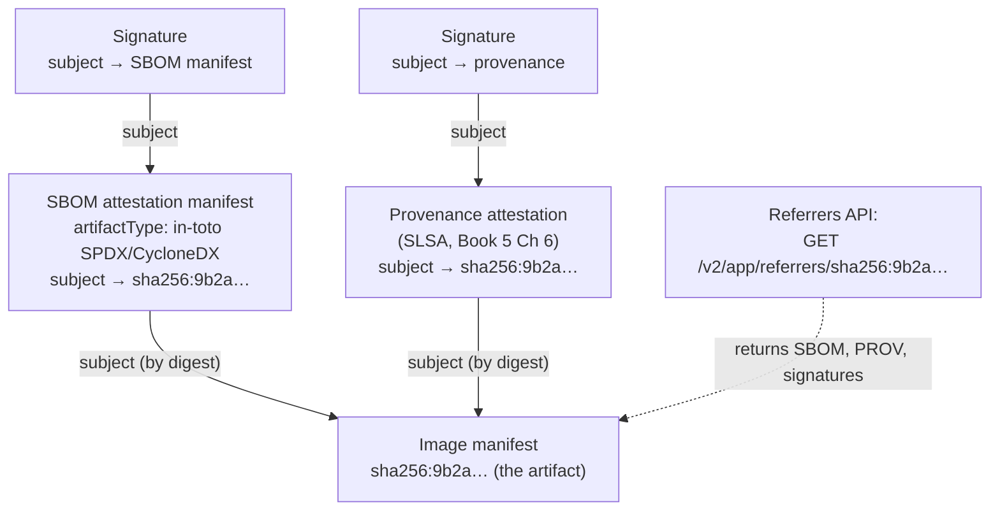
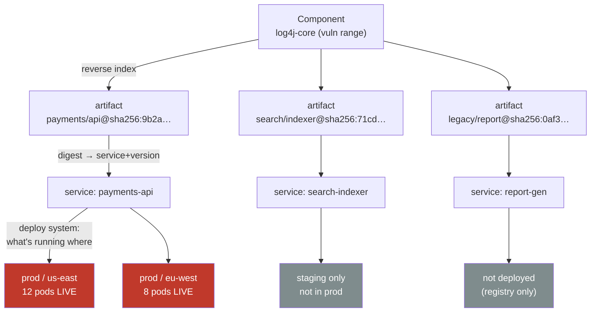
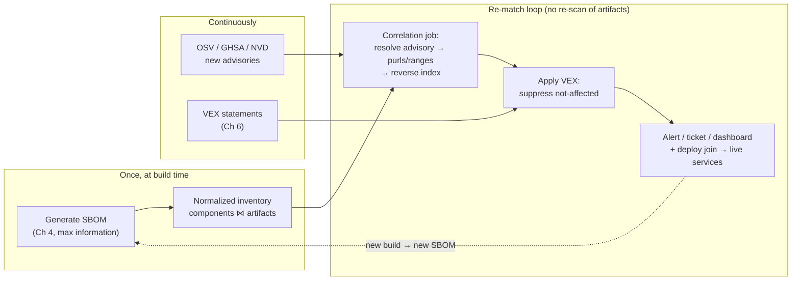
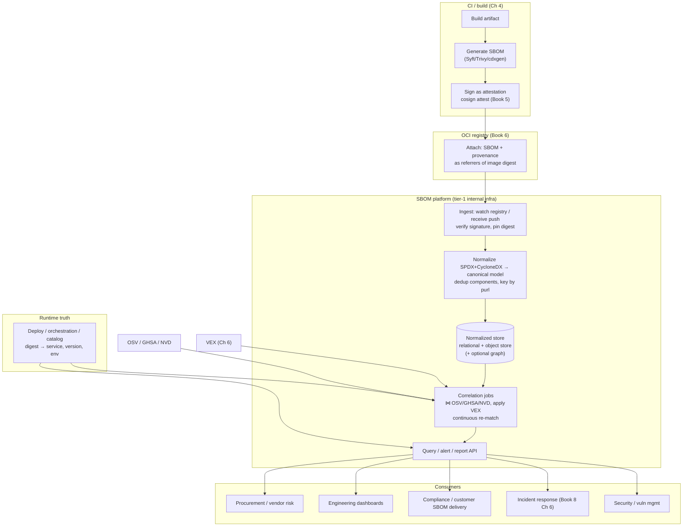
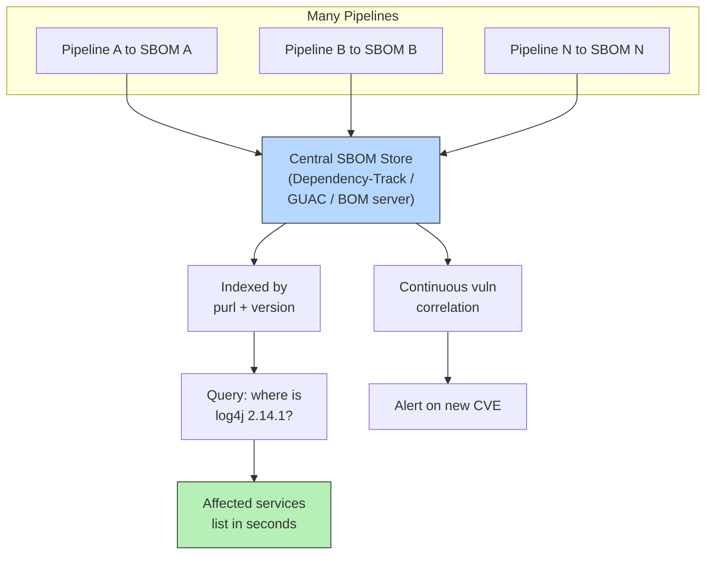
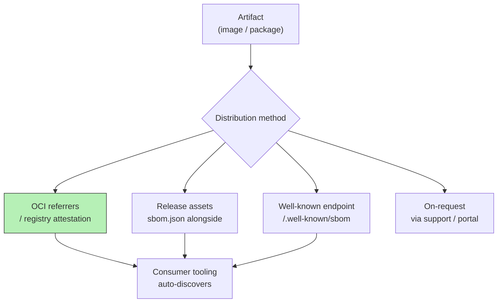

# Chapter 5 — SBOM Distribution, Storage, and Querying at Scale

*What this chapter covers.* Chapter 4 ended where most SBOM projects end: a well-formed,
accurate document, freshly generated in CI, sitting on a build agent about to be garbage-
collected. That document is a dead artifact. It becomes *infrastructure* only when it is
reliably bound to the thing it describes, pushed somewhere durable, folded into a
fleet-wide inventory, and made **queryable** — so that when the next Log4Shell lands at
02:00 you can answer "where is it?" in seconds instead of spending three weeks writing
`grep` scripts against a build cache. This is the systems-engineering half of SBOMs, and
it is the half most organizations get catastrophically wrong. It is also the half a senior
distributed-backend engineer is uniquely equipped to build, because it is not really an
SBOM problem at all: it is an ingestion pipeline, a normalized datastore, a correlation
job, and a query API, run at fleet scale, joined against a source of truth for "what is
actually running where." That last join is the whole game.

Learning goals — after this chapter you should be able to:

- State the **association problem** precisely and explain why binding an SBOM to an
  artifact by cryptographic **digest** is the only durable answer, not by name or tag.
- Compare the four **distribution models** — embedded, registry-attached (OCI referrers /
  attestations), a dedicated SBOM service, and customer delivery — and say when each
  applies, with the referrers model as the modern default.
- Design the **storage layer**: why you normalize both SPDX and CycloneDX into one
  canonical internal model at ingestion, keyed on **purl**; why deduplication is not
  optional at fleet scale; and where relational, document, and graph stores each fit.
- Describe **Dependency-Track**, **GUAC**, and **Grafeas** accurately — what each ingests,
  what graph it builds, and what question it is good at answering — without overstating
  their maturity.
- Realize the **Log4Shell query** and **blast-radius analysis** against a normalized
  inventory, and explain the architectural win of **continuous re-matching**: scan the
  stored SBOMs against new vulnerability data instead of re-scanning artifacts.
- Draw the **reference SBOM platform** end to end and reason about its consistency model —
  the eventual gap between *built*, *stored*, and *deployed* inventories, and the query
  latency/scale trade-offs between graph and relational for blast-radius questions.

A boundary note. This chapter assumes Chapter 4's generation points and the "graph, not
list" framing from Chapter 1, the purl-versus-CPE identifier model from Book 2, Chapter 5,
and the vulnerability databases (OSV, GHSA, NVD) from that same chapter. It hands off the
formal treatment of **VEX** to Chapter 6, an honest accounting of SBOM **quality limits**
to Chapter 7, the cryptographic machinery of **signing and attestation** to Book 5
(especially Chapter 3 — Sigstore Architecture, and Chapter 6 — in-toto), OCI image and
registry internals to Book 6 (Chapters 1 and 2), and **incident response** workflow to
Book 8, Chapter 6. Here the subject is the data platform: getting SBOMs to travel, storing
them once, and querying them fast.

---

## The association problem: an SBOM is nothing without a binding

Start with the failure mode, because it is endemic. A team stands up SBOM generation, wires
it into CI, and starts dropping `sbom.json` files into an S3 bucket, one per build, keyed by
a path like `s3://sboms/payments-api/1.4.2/sbom.json`. Six months later Log4Shell lands.
Someone opens the bucket and confronts the questions that were never designed for:

- Is `payments-api:1.4.2` the tag currently running in production, or was it rebuilt three
  times under the same tag? Tags are mutable; the SBOM is not.
- The SBOM was generated from the *source tree* at build time. Does it describe the actual
  container image that got pushed, including its base-image layers, or only the application
  dependencies? (Chapter 4: different generation points, different blindness.)
- There are four images that came out of that pipeline — `api`, `worker`, `migrator`, and a
  debug sidecar. Which one does this SBOM describe?

Every one of these is a variant of a single question: **which exact artifact does this
document describe?** A name is not an answer. A tag is not an answer. A tag is a mutable
pointer that a `docker push --force` or a re-run of a "release" job silently repoints. The
only answer that survives rebuilds, re-tags, mirror copies, and registry migrations is the
one thing about an artifact that cannot change without the artifact itself changing: its
**content digest**.

An OCI image is addressed by the SHA-256 digest of its manifest —
`sha256:9b2a...`. Change one byte of any layer, or the manifest, and the digest changes.
A binary or a tarball is addressed by the digest of its bytes. This is the same
content-addressing you already rely on in Git (a commit is its SHA), in content-addressable
caches, and in Merkle-tree replication. The correct primitive is therefore:

> An SBOM MUST carry the digest of the artifact it describes, and consumers MUST look up
> SBOMs by digest, never by tag or name.

Both formats have a slot for this. In CycloneDX the top-level `metadata.component` (or a
component in the graph) carries a `hashes` array; the whole document can also be wrapped as
a subject in an attestation. In SPDX 2.3 a package carries a `checksums` array and a
`SPDXID`; SPDX 3.0 makes the subject relationship explicit. But a hash *inside* the document
is a claim, not a binding — nothing stops the document from lying or drifting. The binding
becomes trustworthy only when the digest is the **address you fetched the SBOM by**, which is
exactly what the registry-attached model gives you, and doubly so when the SBOM is wrapped in
a signed attestation whose *subject* is the artifact digest (Book 5, Chapter 6). Content
address plus signature over that address is the association problem solved.

Two subtleties a distributed-systems engineer will immediately flag:

- **Multi-arch images.** A `linux/amd64` and a `linux/arm64` build of the "same" version are
  different images with different digests and, potentially, different component sets (a
  different libc, different native wheels). They are referenced by an OCI *image index*
  (manifest list) under one tag. You need an SBOM *per platform digest*, associated with the
  child manifest, not the index. Treating "the image" as one thing is the multi-arch bug that
  bites every SBOM platform eventually.
- **The build-versus-image gap.** As Chapter 4 argued, a source/build SBOM and a
  scan-the-image SBOM describe overlapping but non-identical component sets. If you attach
  both, attach each to the digest it actually describes and label its type, or you will merge
  a build-time dependency list onto an image and "lose" the base OS packages.

---

## Distribution: how SBOMs travel with — or near — artifacts

There are four ways an SBOM can reach a consumer. They are not mutually exclusive; a mature
program uses three of them for different audiences.

| Model | Where the SBOM lives | Binding to artifact | Best for | Weaknesses |
|---|---|---|---|---|
| **Embedded** | Inside the artifact (a file in the image, `/usr/share/sbom.json`, or a binary section) | Physically co-located; ships with the bits | Firmware, appliances, air-gapped delivery | Changes the artifact (and thus its digest); can't be updated without a rebuild; bloats the image; you can't enumerate SBOMs without pulling every artifact |
| **Registry-attached (referrers / attestation)** | The OCI registry, as a separate manifest that *references* the image by digest | Cryptographic: the referrer's `subject` is the image digest | Containers, the default modern path | Requires OCI 1.1 referrers support (or the tag-schema fallback); registry is now on the critical path for security queries |
| **Dedicated SBOM service / repository** | A central store you run (DB + object storage + API) | Logical: keyed by digest in your schema | Fleet-wide inventory, cross-artifact queries, non-OCI artifacts | You must build and operate it; ingestion must be reliable or the inventory silently rots |
| **Customer delivery** | Sent to a downstream consumer (portal, VEX feed, compliance package) | Contractual + digest in the doc | Regulated procurement, EU CRA, US federal buyers | Point-in-time; consumer trust and freshness are on them; format/version negotiation |

The four are layered, not competing. In practice: **attach** to the registry so the SBOM
travels with the artifact and can be verified at admission; **ingest** from the registry into a
central service so you can query across the whole fleet; and **deliver** a curated export to
customers who need it. Embedding is a niche you reach for only when the artifact must be
self-describing in an environment with no registry and no network.

### Registry-attached: OCI referrers and attestations

This is the model worth understanding in mechanism, because it is where the industry has
converged and because it exploits infrastructure you already run: the container registry.

Before OCI 1.1, there was no standard way to say "this blob is *about* that image." People
faked it with tag conventions — cosign's original scheme stored a signature for
`image@sha256:abcd...` at a synthetic tag `sha256-abcd....sig` in the same repository. It
worked but it was a side-channel: the registry had no idea the two objects were related, you
couldn't list "everything attached to this image," and garbage collection could delete the
image while orphaning its signatures (or vice versa).

**OCI Image Specification 1.1 (released 2024)** standardized the relationship with two
mechanisms:

1. A `subject` field on a manifest. Any manifest (an image, or an "artifact manifest") can
   name another manifest, by digest, as its subject. That is the machine-readable "this is
   *about* that."
2. The **Referrers API** — `GET /v2/<name>/referrers/<digest>` — which returns the list of
   all manifests whose `subject` is that digest, optionally filtered by `artifactType`. For
   registries that haven't implemented the endpoint, the spec defines a **fallback tag
   schema** (`sha256-<digest>` holds an index of referrers) so clients get the same answer
   without native support.

An SBOM, then, is not stored "inside" anything. It is pushed to the registry as its own blob
with its own manifest, whose `subject` is the image digest and whose `artifactType`
identifies it (e.g. `application/vnd.cyclonedx+json` or an in-toto predicate type). The
signature over that SBOM is *itself* another referrer pointing at the SBOM (or at the image).
The result is a small graph hanging off the immutable image digest:



The tooling is mature enough to use in anger, with caveats:

```bash
# Generate an SBOM for the exact image we built, addressed by digest.
DIGEST=$(cosign triangulate --type digest registry.example.com/payments/api:1.4.2)
syft "registry.example.com/payments/api@${DIGEST}" -o cyclonedx-json > sbom.cdx.json

# Attach the SBOM as a SIGNED in-toto attestation whose subject is the image digest.
# 'attest' wraps the predicate in a DSSE envelope and signs it (keyless via Fulcio here).
cosign attest --yes \
  --predicate sbom.cdx.json \
  --type cyclonedx \
  "registry.example.com/payments/api@${DIGEST}"

# Later — discover and verify everything attached to that digest.
cosign verify-attestation --type cyclonedx \
  --certificate-identity-regexp '^https://github.com/payments/.+' \
  --certificate-oidc-issuer https://token.actions.githubusercontent.com \
  "registry.example.com/payments/api@${DIGEST}" | jq '.payload | @base64d | fromjson'

# List raw referrers (OCI 1.1) with oras, independent of cosign's conventions.
oras discover --format tree "registry.example.com/payments/api@${DIGEST}"
```

A few honest notes on maturity. `cosign attach sbom` (the older, simpler command that stores
an SBOM as a plain OCI artifact without wrapping it in a signed attestation) is **deprecated**
in favor of `cosign attest`, precisely because an unsigned attachment solves distribution but
not trust — an attacker who can push to the registry can replace it. Prefer `attest`. Referrers
support is now broad (GHCR, ECR, GAR, Harbor, Zot, recent Docker Registry) but not universal;
clients like cosign and oras fall back to the tag schema transparently, so you rarely see the
gap, but self-hosted or older registries may only offer the fallback, which is chattier and
loses server-side filtering. And the registry becomes security-critical infrastructure: if
admission control verifies SBOM/provenance on every deploy, registry availability is now in the
deploy path (Book 6, Chapters 2 and 5).

The conceptual payoff is the **"SBOM everywhere"** pattern: every image your fleet produces
carries, hanging off its digest, a signed SBOM attestation and a signed provenance attestation,
discoverable by anyone with pull access via one standard API call. That is the ideal
distribution substrate — but it is only a substrate. You still cannot answer "which of my 4,000
images contain log4j-core?" by walking referrers image by image. For that you need to pull all
of it into one place. Which is the storage problem.

---

## Storage: the SBOM data platform

### The scale reality

Do the arithmetic that most SBOM pilots never do. Take a mid-to-large backend estate: 800
services, each built on average a few times a day, each build producing 1–4 images, retained
for some window. That is on the order of **millions of SBOM documents per year**. Each document
lists hundreds to low-thousands of components. You are looking at **hundreds of millions to
billions of component rows** if you store naively. And the access pattern is not "fetch one
SBOM" — it is "find every artifact, across all of history-that-still-matters, containing a
component matching predicate P," run reactively under incident pressure and proactively on every
new CVE.

This is a data-engineering problem with a specific shape: write-heavy ingestion of
semi-structured documents, a normalized inventory optimized for reverse lookup (component →
artifacts), heavy fan-out joins for blast radius, and a correlation workload that re-runs as
external feeds change. None of that is exotic to a backend engineer. What makes it SBOM-specific
is two format wars and one brutal redundancy.

### Normalize both formats into one canonical model at ingestion

You will receive SPDX (2.3 and 3.0) and CycloneDX (1.4–1.6), because Chapters 2 and 3 exist and
different teams and vendors picked differently. **Do not** store raw documents and query across
formats at read time — that pushes the format war into every query and every dashboard. Instead,
**normalize at ingestion into one internal model**, and keep the raw signed document as an
immutable blob for provenance and re-processing.

The canonical model is small. The linchpin is that both formats can express a component's
identity as a **Package URL (purl)** — `pkg:maven/org.apache.logging.log4j/log4j-core@2.14.1` —
and purl is your join key across everything: across formats, across SBOMs, and against
vulnerability feeds keyed the same way (Book 2, Chapter 5). CPE is a fallback for OS packages and
older data; store it too, but treat purl as primary. A workable relational schema:

```sql
-- One row per unique component identity, stored ONCE for the whole estate.
CREATE TABLE component (
    id           BIGINT PRIMARY KEY,
    purl         TEXT UNIQUE,          -- canonical identity; the join key
    cpe          TEXT,                 -- fallback identity for matching
    name         TEXT NOT NULL,
    version      TEXT,
    ecosystem    TEXT                  -- maven, npm, pypi, deb, apk, golang, …
);

-- One row per artifact we have an SBOM for, addressed by DIGEST.
CREATE TABLE artifact (
    id           BIGINT PRIMARY KEY,
    digest       TEXT UNIQUE NOT NULL, -- sha256:… — the binding from §1
    kind         TEXT,                 -- oci-image, jar, binary, …
    repo         TEXT,                 -- registry.example.com/payments/api
    platform     TEXT,                 -- linux/amd64 (multi-arch!)
    sbom_format  TEXT,                 -- source of truth for the raw blob
    raw_blob_ref TEXT,                 -- object-store key of the signed original
    generated_at TIMESTAMPTZ
);

-- The many-to-many edge: which components are in which artifact.
-- This is the table you reverse-scan for blast radius.
CREATE TABLE artifact_component (
    artifact_id  BIGINT REFERENCES artifact(id),
    component_id BIGINT REFERENCES component(id),
    scope        TEXT,                 -- runtime, dev, optional, provided
    relationship TEXT,                 -- DEPENDS_ON, CONTAINS, base-layer…
    PRIMARY KEY (artifact_id, component_id)
);
CREATE INDEX ON artifact_component (component_id);  -- the reverse-lookup index
```

Two design decisions in that schema carry the whole chapter:

- **Deduplication is structural, not an optimization.** `log4j-core@2.14.1` is one row in
  `component`, referenced by however many thousand artifacts contain it. A popular base-image
  layer's packages, a ubiquitous TLS library, the standard logging stack — each is stored once
  and referenced many. Without dedup, that billion-row estimate is real and your inventory is
  mostly copies of the same fifty thousand popular components. With it, `component` is small,
  bounded roughly by "distinct (package, version) pairs the org has ever shipped," and the
  expensive table is the edge table — which is exactly the table you want indexed for reverse
  lookup. This is the same normalization you would reach for in any inventory system; SBOMs just
  make the redundancy extreme because every image restates its base layers.
- **The reverse index on `component_id` is the Log4Shell index.** The forward direction
  (artifact → its components) is how you *store*; the reverse (component → its artifacts) is how
  you *respond to incidents*. Index the reverse direction or every blast-radius query is a full
  scan.

### Document vs relational vs graph

The component-relationship structure is a graph — a DAG of "depends on / contains" edges, exactly
Chapter 1's insistence that an SBOM is a graph, not a list. That tempts people straight to a graph
database. Resist reflexively; reason about the workload.

| Store | Fits when | Cost / caveat |
|---|---|---|
| **Relational (Postgres/MySQL)** normalized as above | The default. Reverse lookups and version-range predicates are indexed queries; joins to vuln feeds are ordinary joins; you get transactions, mature ops, and SQL everyone reads | Deep transitive traversal ("all things reachable from X through N hops") is recursive-CTE territory and gets awkward past a few levels |
| **Document store (Mongo, OpenSearch, or JSONB columns)** | Storing and retrieving whole raw SBOMs; full-text over component names; flexible schema across format versions | Cross-document reverse queries and dedup are painful; you re-implement the normalized index anyway |
| **Graph DB (Neo4j, JanusGraph, Dgraph)** | Blast-radius and provenance queries that are *natively* multi-hop: component → artifacts → services → environments → owners, plus SLSA/VEX edges | Operational maturity and cost; you still ingest from documents; the win appears only when queries are genuinely deep and the graph is dense |
| **Purpose-built (Dependency-Track, GUAC)** | You want the inventory + correlation semantics without building them | Opinionated model; you adopt their scale envelope and their gaps |

The pragmatic majority answer, and the one to default to, is **relational + a normalized
component table + purl as the join key**, with raw documents in object storage and, optionally,
a graph layer *on top* when your blast-radius questions genuinely go many hops (component to
service to environment to team, joined with provenance and VEX). The graph is a query
accelerator for a specific class of question, not the system of record. We return to that
trade-off in the distributed-systems lens.

### Purpose-built tools, described accurately

Three open-source systems occupy this space. Know what each actually does, and where it stops.

**Dependency-Track (OWASP).** The most operationally mature of the three for the specific job of
a **portfolio-wide component inventory with vulnerability correlation**. You model your estate as
*projects* (and project versions); you upload a **CycloneDX** SBOM per project version (SPDX is
not its native ingestion path — this matters). Dependency-Track maintains the deduplicated
component inventory across the whole portfolio and continuously correlates it against
vulnerability sources — the NVD mirror, OSS Index, GitHub Advisories, Snyk, VulnDB — so that when
a new advisory lands it flags every affected project **without re-scanning any artifact**. It also
ingests **VEX** (CycloneDX VEX) to suppress non-exploitable findings (Chapter 6), exposes metrics
and a REST API, and supports policy conditions. Its limits: it is CycloneDX-centric; it is a
component/vuln inventory, not a general artifact-provenance graph (it doesn't model SLSA
attestation chains); and very large portfolios need attention to its database and analyzer tuning.
For "give me a living inventory and tell me what's vulnerable," it is the fastest path to value.

**GUAC — Graph for Understanding Artifact Composition (OpenSSF, originated at Google, with
Kusari and others).** A different and more ambitious target: ingest **many document types** — SBOMs
(SPDX *and* CycloneDX), **SLSA provenance**, **VEX**, scorecard and vulnerability data — and
assemble them into **one queryable graph** of the software supply chain. Its purpose is the
relationship questions: "what uses component X?", "what is the **blast radius** if this dependency
is compromised?", "what is the provenance of this artifact and does it satisfy policy?", "what
other artifacts share this suspect dependency?" Architecturally GUAC separates ingestion
(collectors normalize documents into a canonical trie/graph model) from a GraphQL query layer over
a backing store. It is the closest thing to the fleet-wide impact graph this chapter builds toward.
Honest maturity note: GUAC is younger than Dependency-Track, its model and APIs have evolved, and
running it well at very large scale is a real engineering commitment — it is powerful and the right
mental model, not a turnkey appliance.

**Grafeas (Google/open source).** Often miscategorized. Grafeas is **not** an SBOM analyzer; it is
a **metadata API and store** — a normalized schema and API for attaching *notes* (a class of
metadata, e.g. a known vulnerability, a build, an attestation) and *occurrences* (an instance of a
note bound to a specific resource by URL/digest) to artifacts. It is the general substrate on which
you could store SBOM-derived facts, vulnerability findings, and attestations against artifact
digests; Google's Container/Artifact Analysis and Binary Authorization build on this model. Think of
it as the neutral metadata plane (the digest-keyed fact store), not the query engine that answers
"where is log4j." You bring the correlation logic; Grafeas gives you a consistent place to hang the
facts.

The mapping to remember: **Dependency-Track** = inventory + vuln correlation, CycloneDX-first,
production-ready today. **GUAC** = the relationship graph across SBOM + provenance + VEX,
newer, the right model for blast radius. **Grafeas** = digest-keyed metadata store, a substrate,
not an analyzer.

---

## Querying: the entire point

Everything so far — binding by digest, attaching to registries, normalizing, deduplicating — exists
to make a small number of questions answerable *fast*. If you cannot answer these, you have an
expensive filing cabinet, not a security capability.

### The Log4Shell query, realized

In December 2021, the industry's collective answer to "do we run a vulnerable log4j?" was measured
in **weeks** of manual archaeology. Against a normalized inventory it is a query that returns in
**seconds**, because it is exactly the reverse lookup the schema was built for. Conceptually:

```sql
-- "Which artifacts contain log4j-core in the affected version range?"
SELECT a.repo, a.platform, a.digest, c.version
FROM   component c
JOIN   artifact_component ac ON ac.component_id = c.id
JOIN   artifact a           ON a.id = ac.artifact_id
WHERE  c.ecosystem = 'maven'
  AND  c.name = 'log4j-core'
  AND  semver_in_range(c.version, '>=2.0-beta9, <2.16.0');   -- the CVE-2021-44228/45046 range
```

The shape matters more than the SQL. It is `component (predicate) → artifacts`, powered by the
reverse index. "Any version" is dropping the range clause; "version in range Y" is the
range predicate. The predicate can be a purl, a name, a version range, an ecosystem, a checksum, or
a transitive-reachability flag if you stored scope. And crucially, this query needs **no access to
the artifacts themselves** — no pulling images, no re-scanning, no build cache. The inventory *is*
the answer surface. That decoupling is the architectural win we make explicit below.

### Blast radius: from component to the running fleet

The Log4Shell query finds *artifacts*. Incident response needs the next hops: which **services**
those artifacts belong to, which **versions of those services are actually deployed**, and in which
**environments** — because "an image in the registry contains it" is not the same as "it is running
in production right now." This is the fleet-wide impact graph, and it is GUAC's core use case:



The graph tells the incident commander what a list cannot: `payments-api` is **live in two prod
regions** (page now, that is the real exposure), `search-indexer` is only in staging (fix in the
normal cycle), and `report-gen`'s affected image was built but never deployed (inventory hygiene,
not an incident). The reverse index answers the first hop; the **deploy/orchestration system** —
your CD tool, service catalog, or the cluster's own record of running digests — answers the last two.
That last join is what separates a real IR capability from a spreadsheet of "images that exist." We
return to it under freshness. This graph feeds directly into the IR playbook in Book 8, Chapter 6.

### Continuous re-matching: scan the SBOM, not the artifact

Here is the decoupling stated as an architecture principle, because it is the single most important
idea in the chapter. The traditional model scans **artifacts** for vulnerabilities: point a scanner
at an image, it enumerates packages and matches them against a vuln DB, emits findings. That coupling
is expensive and stale — every new CVE means re-pulling and re-scanning every artifact, so in practice
you scan on a schedule and your findings lag reality by however long the cycle is.

Invert it. **Generate the SBOM once** (Chapter 4), at the point of maximum information, and store the
component inventory. Then treat vulnerability detection as a **join between two datasets that change on
different clocks**: your (mostly static) SBOM inventory, and the (constantly updated) vulnerability feeds
— OSV, GHSA, NVD (Book 2, Chapter 5). When a new advisory arrives, you do not touch a single artifact;
you **re-run the match against the stored inventory**. New CVE at 03:00 → a correlation job wakes,
resolves the advisory's affected purls/ranges, hits the reverse index, and within minutes every
affected artifact — and, via the deploy join, every live service — is flagged.



This is precisely what Dependency-Track does internally and what `trivy sbom` /
`osv-scanner --sbom` do for a single document — evaluate a *stored SBOM* against current feeds
rather than re-scanning bits. At fleet scale you run it as a batch/stream job over the whole
inventory. The wins compound: findings are as fresh as your feed ingestion (minutes, not the scan
cycle); the cost of a new CVE is one query, not N re-scans; and — critically for old, rarely-rebuilt
services — you can detect a newly-disclosed vuln in an artifact **nobody has touched in a year**,
because you never depended on re-running a scanner against it. The artifact's SBOM is a durable
record; the vulnerability knowledge catches up to it.

### The unified picture: four datasets, one join

The complete operational view is the join of four continuously-changing datasets, keyed to make them
joinable:

- **SBOM inventory** — components ⋈ artifacts, keyed by **purl** and **digest** (this chapter).
- **Vulnerability feeds** — OSV/GHSA/NVD, keyed by **purl/CPE + version range** (Book 2, Chapter 5).
- **VEX** — per-(product, vuln) exploitability statements that suppress or confirm findings, keyed by
  **product digest + vuln ID** (Chapter 6). Without VEX, a fleet-scale re-match drowns you in
  not-actually-exploitable findings; VEX is what makes the continuous loop *actionable* rather than
  noise.
- **Runtime / deployment truth** — "what digest is running where," keyed by **digest → service,
  version, environment**, sourced from the deploy system, service catalog, or cluster state.

Purl bridges SBOM and vuln feeds; digest bridges SBOM and runtime; the (product, vuln) pair bridges VEX
into both. Get those keys consistent at ingestion and every question above is a join. Get them
inconsistent — CPE-only vuln data against purl-only SBOMs, tag-keyed deploys against digest-keyed
inventory — and you have four datasets that cannot be joined, which is the actual state of most
programs.

---

## Architecture: the reference SBOM platform

Assemble the pieces into a platform. The pipeline is: **generate → sign → attach → ingest → normalize
& dedup → correlate → serve**, with the deploy system feeding runtime truth and a set of consumers on
the query side.



Read it as a data platform, because that is what it is. Ingestion is a pipeline with a verification
step (never ingest an SBOM whose signature you didn't check — an unsigned SBOM is an unauthenticated
claim about what's in your fleet, and an attacker who can write to your inventory can hide their
implant from every query). Normalization is a schema-mapping ETL step. The store is a normalized
database with an object-store side-car for raw signed blobs. Correlation is a scheduled/streaming
job joining external feeds. The API is the product surface. And the deploy system is a **first-class
input**, not an afterthought — it is what turns "artifacts that exist" into "software that is
running."

### Freshness and lifecycle: inventory the running fleet, not the build history

The most common way a mature-looking SBOM platform still fails IR is a **freshness** failure: it
faithfully inventories every artifact ever built and has no idea which are actually deployed. During
an incident that is nearly useless — you get 4,000 hits and cannot tell the 30 that are live from the
3,970 that are cold. The fix is the digest→deployment join, sourced from whatever your orchestration
layer treats as truth:

- In Kubernetes, the running **image digest** per pod (the resolved digest, not the tag) from the API
  server or an admission/inventory controller.
- In a service catalog / CD system, the currently-released version → digest mapping per environment.
- Reconciled continuously, because deploys happen continuously and the "live set" is always drifting.

That join reframes retention, too. You do not need to keep every SBOM forever; you need, at minimum,
an SBOM for **every digest currently live in any environment**, plus enough history to investigate
"what were we running on the date of the breach" (forensics for Book 8, Chapter 6) and to satisfy
whatever regulatory retention applies (Chapter 1). A reasonable policy: hot storage for all live and
recently-live digests; cold/object storage for the long tail of historical SBOMs and their signatures;
and garbage-collection tied to the artifact's own lifecycle in the registry so you never orphan an SBOM
whose image is gone or, worse, delete an SBOM whose image is still running.

### APIs and consumers

The same normalized store, exposed through one API, serves audiences with genuinely different
questions — which is the argument for building it as shared infrastructure rather than letting each team
reinvent a corner of it:

- **Security / vulnerability management** — the continuous re-match results, prioritized by
  reachability (Book 2, Chapter 7) and deployment status; "what is exploitable and live."
- **Incident response** — the blast-radius query on demand, under time pressure, joined to the live
  fleet (Book 8, Chapter 6).
- **Compliance / customer delivery** — export a signed SBOM (and VEX) for a specific released digest in
  the customer's required format and version; regulated procurement and the EU CRA (Chapter 1) live
  here.
- **Engineering dashboards** — per-service component inventories, "how far behind is my dependency," end-
  of-life component flags; the feedback loop that gets teams to update (Book 2, Chapter 9).
- **Procurement / vendor risk** — ingest *third-party* SBOMs for software you buy and run the same
  queries against them (Book 8, Chapter 3), so a vendor's log4j is as visible as your own.

---

## Distributed-systems lens

Everything in this chapter is a distributed-systems build, and treating it as anything less is why
so many SBOM programs stall at "we generate SBOMs" and never reach "we can answer questions."

**It is tier-1 internal infrastructure.** The SBOM platform is on the critical path for incident
response and, if you gate admission on attestations (Book 6, Chapter 5), on the deploy path too. It
earns the same operational rigor as your service registry or metrics backend: SLOs on ingestion lag
and query latency, on-call, capacity planning against that millions-of-documents growth curve. An SBOM
inventory that is silently three weeks behind on ingestion is worse than none, because it will answer
an incident query with false confidence. Treat ingestion completeness and freshness as monitored SLIs,
not hopes.

**Three inventories, eventually consistent.** There are three distinct populations — what was **built**
(everything CI ever produced), what is **stored** (everything successfully ingested and normalized), and
what is **deployed** (what the fleet is actually running) — and they are **never simultaneously
consistent**. A build finishes before its SBOM is ingested; a deploy can promote a digest before your
inventory has caught up (or, in a badly-ordered pipeline, before the SBOM exists at all); a rollback can
make "live" jump backward. Design for the gaps explicitly: reconcile continuously rather than assuming
synchrony, alert on **skew** ("live digests with no SBOM in the store" is a coverage gap you must see),
and make queries state their own staleness ("as of ingestion watermark T"). The failure you are
preventing is answering "we're clean" from a stored inventory that simply hadn't ingested the vulnerable
build yet. Order the pipeline so an SBOM is attached and ingested *before* a digest is eligible for
production, and the worst gaps close.

**Graph vs relational is a latency/scale trade-off, not a religion.** The reverse-lookup query
(component → artifacts) is a single indexed step and relational wins on ops maturity and cost. The
deep blast-radius query (component → artifacts → services → environments → owners, further joined with
provenance and VEX) is genuinely multi-hop, and at some depth and graph density a native graph store
answers in one traversal what relational answers with escalating recursive-CTE pain. The engineering
call is empirical: measure your actual query depths and fan-outs. Most estates are well served by
relational as system-of-record with the deploy join precomputed, adding a graph layer (or GUAC) only
when blast-radius questions provably go deep enough to hurt. Don't pay graph-database operational cost
for a two-hop query you can index.

**Idempotent, digest-keyed ingestion.** The same image gets pushed to multiple registries, mirrored,
re-tagged, and re-scanned; the same SBOM will arrive more than once. Key ingestion on the artifact
**digest** and make it idempotent (upsert by digest, dedup components by purl) so replays and mirrors
converge instead of inflating the inventory — the same content-addressing discipline that makes the rest
of your distributed infrastructure sane, applied here. Digest is the idempotency key; purl is the dedup
key; get both right and the platform self-heals under the messy reality of a real registry topology.

## Key takeaways

- **An SBOM is worthless until it is bound to an exact artifact by digest.** Names and tags are mutable
  pointers; the content digest is the only durable binding. Look up SBOMs by digest, never by tag, and
  make the digest the *address you fetched by*, ideally inside a signed attestation whose subject is that
  digest.
- **Registry-attached distribution via OCI 1.1 referrers is the modern default.** The SBOM is a separate
  manifest whose `subject` is the image digest, discoverable through the Referrers API; `cosign attest`
  (signed) supersedes the deprecated `cosign attach` (unsigned). This is the "SBOM everywhere" substrate
  — but a substrate for fleet queries, not a query engine itself.
- **Storage is a real data-engineering problem.** Millions of documents, billions of component
  references. Normalize both SPDX and CycloneDX into one canonical model at ingestion, key on **purl**,
  **deduplicate** components so each identity is stored once, and index the **reverse** direction
  (component → artifacts). Relational + normalized component table is the pragmatic default; add graph
  only where blast-radius queries provably go deep.
- **Know the tools precisely.** Dependency-Track = CycloneDX-first portfolio inventory with continuous
  vuln correlation (production-ready). GUAC = the SBOM+provenance+VEX relationship graph for blast radius
  (newer, the right model, a real ops commitment). Grafeas = a digest-keyed metadata store/substrate, not
  an analyzer. Don't overstate any of their maturity.
- **Querying is the entire point.** The Log4Shell query is a reverse lookup that returns in seconds; the
  blast-radius query extends it through services to *live* environments via the deploy system. If you
  can't do these, you have a filing cabinet.
- **Scan the SBOM, not the artifact.** Generate once; re-match the stored inventory against
  ever-changing OSV/GHSA/NVD feeds. New CVEs cost one query, not N re-scans, and you can detect
  vulnerabilities in artifacts nobody has rebuilt in a year. This decoupling is the architectural win.
- **The deploy/orchestration system is a first-class input.** Joining SBOM inventory (by digest) to "what
  is running where" is what turns "images that exist" into "software that is live," and it is the
  difference between an IR capability and a spreadsheet.
- **Treat it as tier-1 distributed infrastructure.** Eventual consistency between built/stored/deployed
  inventories, digest-idempotent ingestion, purl-keyed dedup, monitored freshness SLOs, and an explicit
  latency/scale choice between relational and graph. This is a distributed-systems build; engineer it
  like one.


### Fleet-wide SBOM aggregation architecture




### SBOM distribution: how consumers get it



## Further reading

- **OCI Image Specification 1.1** and the **OCI Distribution Specification** — the `subject` field,
  `artifactType`, the **Referrers API** (`/v2/<name>/referrers/<digest>`) and the fallback tag schema
  (`opencontainers.org` specs on GitHub).
- **Sigstore cosign** documentation — `cosign attest`, `cosign verify-attestation`, and the deprecation
  of `cosign attach sbom`; the DSSE envelope and in-toto predicate types (Book 5, Chapter 3).
- **in-toto Attestation Framework** and the **SPDX** / **CycloneDX** predicate types — how an SBOM is
  carried as a signed attestation whose subject is an artifact digest (Book 5, Chapter 6).
- **ORAS** (`oras.land`) — `oras attach` / `oras discover`, for working with OCI referrers independent of
  cosign's conventions.
- **OWASP Dependency-Track** documentation — the project/portfolio model, CycloneDX ingestion, continuous
  analysis against NVD/OSS Index/GitHub Advisories, and VEX support.
- **GUAC** (`guac.sh`, OpenSSF) — the ingestion-collector/GraphQL architecture and the "what uses X" /
  blast-radius query model over SBOM, SLSA provenance, and VEX.
- **Grafeas** (`grafeas.io`) — the notes/occurrences metadata API and its use as a digest-keyed fact store
  underneath Google Container/Artifact Analysis and Binary Authorization.
- **OSV** (`osv.dev`) and the **OSV schema** — purl-keyed, range-based vulnerability data designed for
  matching against SBOM inventories, and `osv-scanner --sbom` (Book 2, Chapter 5).
- **Aqua Trivy** — `trivy sbom`, scanning a *stored* SBOM against current vulnerability data as the
  single-document form of continuous re-matching.
- **Package URL (purl) specification** (`github.com/package-url/purl-spec`) — the join key that makes
  cross-format normalization and vuln correlation possible.
- **CISA**, "Software Bill of Materials (SBOM) Sharing" guidance and the SBOM-a-rama materials — on
  distribution models and customer delivery.
