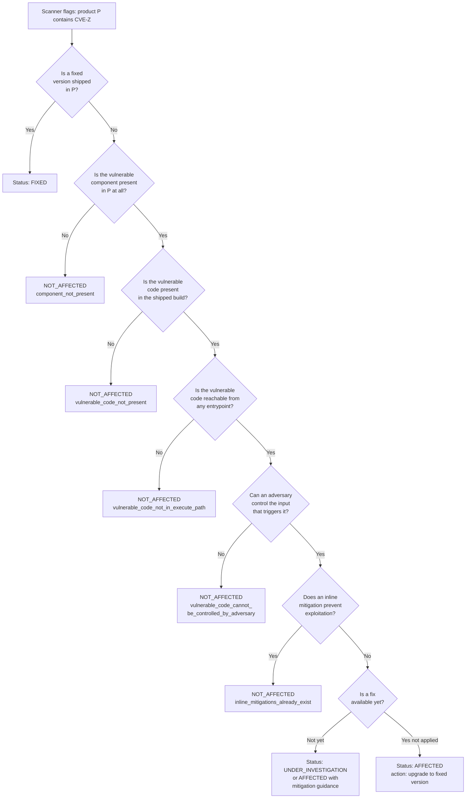
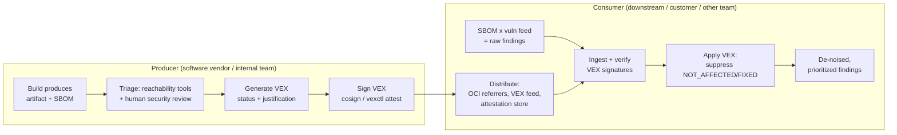
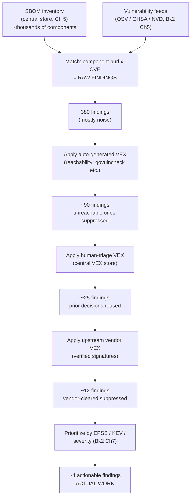
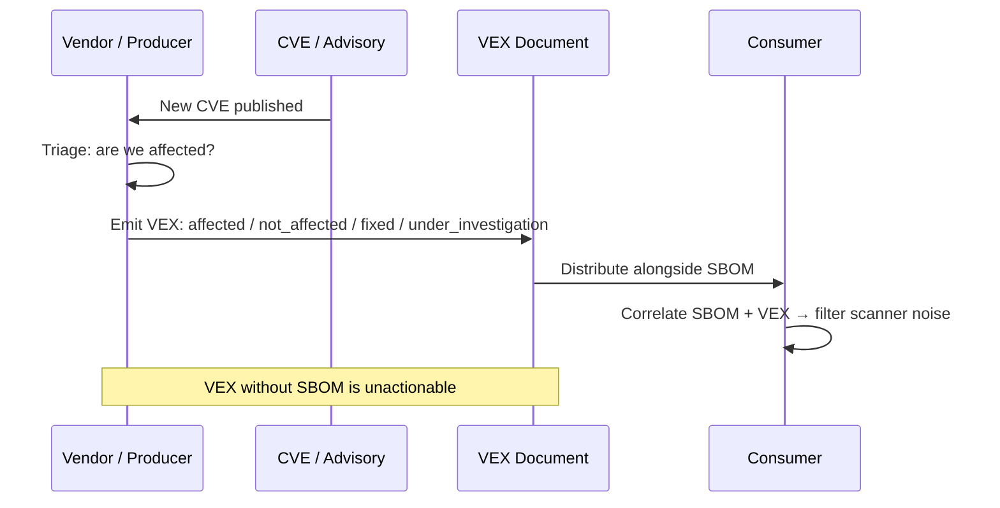
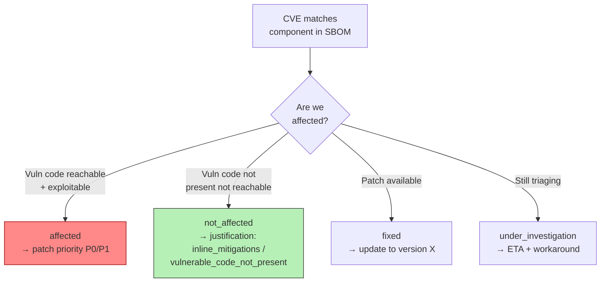
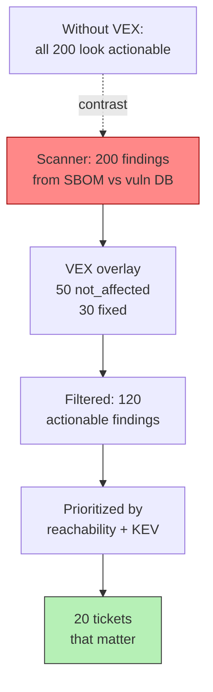

# Chapter 6 — VEX and Vulnerability Correlation

*What this chapter covers.* By now you can produce an accurate SBOM (Chapters 2–4) and
store and query it at fleet scale (Chapter 5). Point a scanner at that inventory and you
get the thing everyone actually wanted: a list of known vulnerabilities affecting your
software. You also get the thing nobody wanted — a *flood* of them, the overwhelming
majority of which are not exploitable in your product. This chapter is about the mechanism
that closes that gap: **VEX**, the Vulnerability Exploitability eXchange. VEX is a
machine-readable assertion, made by someone who actually knows, about whether a specific
product is affected by a specific vulnerability, and *why*. It is the piece that turns
"SBOM plus scanner" from a noise generator into a workable vulnerability-management
program. We cover the status semantics precisely (they are easy to get subtly wrong), the
three formats you will meet in production (CSAF, CycloneDX VEX, OpenVEX), how a VEX
statement flows from producer to consumer as a signed attestation, and how to
operationalize the whole thing so that one triage decision suppresses noise across an
entire estate instead of being re-made five hundred times.

Learning goals — after this chapter you should be able to:

- Explain **the problem VEX solves**: why an SBOM plus a vulnerability feed produces a
  finding list that is mostly non-actionable, and why recording "not affected, because…"
  in a machine-readable, attributable form is the only thing that scales.
- State the **four VEX statuses** and the **five `NOT_AFFECTED` justifications** exactly
  as CISA defines them, and choose the correct one for a given situation — including the
  reachability justification that ties directly to Book 2, Chapter 7.
- Read and write VEX in the **three real formats** — CSAF 2.0's VEX profile, CycloneDX's
  `vulnerabilities`/`analysis` block, and OpenVEX — and know which to reach for and why.
- Wire up the **correlation pipeline**: SBOM inventory × vulnerability feed × VEX → a
  de-noised, prioritized finding list, with VEX statements signed and distributed as
  attestations (Book 5).
- Operationalize VEX at fleet scale: **auto-generate** reachability VEX from a shared
  analysis platform, record human triage **once**, consume upstream vendors' VEX, and
  avoid the failure modes — stale VEX, scope errors, and over-suppression.

This chapter is the operational payoff for two threads. From Book 2 it inherits the
vulnerability-database and identifier plumbing (Chapter 5 — Vulnerability Databases and
Identifiers), Software Composition Analysis (Chapter 6), and the reachability and
exploitability material (Chapter 7 — Reachability, Exploitability, and Prioritization),
which is the intellectual core of what a good `NOT_AFFECTED` claim asserts. From Book 3 it
inherits the CycloneDX vulnerability model sketched in Chapter 3 and the SBOM platform of
Chapter 5, which is where your VEX ends up living.

## The problem: an SBOM plus a scanner is a noise machine

Run the standard pipeline. Generate a CycloneDX or SPDX SBOM for a container image
(Chapter 4). Feed it to a matcher — `osv-scanner`, `grype`, Trivy, Dependency-Track —
which joins each component's package URL against a vulnerability feed (OSV, GHSA, NVD;
Book 2, Chapter 5). Out comes a list:

```text
$ grype sbom:app.cdx.json
NAME            INSTALLED   VULNERABILITY   SEVERITY
libxml2         2.9.13      CVE-2022-40303  High
openssl         3.0.7       CVE-2023-0464   High
zlib            1.2.13      CVE-2023-45853  Critical
glibc           2.36        CVE-2023-4911   High
... 380 more findings
```

For a typical microservice built on a general-purpose base image, that list runs to
hundreds of entries. Here is the uncomfortable truth, which Book 2, Chapter 7 established
in detail: the large majority of those findings are *not exploitable in your product*.
The CVE is real, the component version is really present, the match is correct — and yet
the vulnerability cannot be triggered as your software is built and deployed. The reasons
recur:

- **The vulnerable code is not reachable.** `libxml2` is present because something in the
  base image links it, but your service never parses untrusted XML and never calls the
  affected function. The finding is a component match, not a reachable path. This is the
  reachability problem from Book 2, Chapter 7, wearing a different hat.
- **The vulnerable configuration is not the one you run.** The CVE requires a feature flag,
  a legacy cipher, a specific compile option, or a network mode you do not enable.
- **The vulnerable code is not even present.** The version *string* matches, but the
  distro backported a fix without bumping the version (Book 2, Chapter 5's version-range
  false-positive problem), or the affected file was compiled out.
- **A mitigation already neutralizes it.** A WAF rule, a seccomp profile, a compiler
  hardening flag, or an architectural control means the adversary cannot reach the
  precondition.

Now consider what happens *without* a way to write these conclusions down. A security
engineer spends forty minutes establishing that `CVE-2022-40303` in `libxml2` is not
reachable in service A. Next week the same CVE surfaces in service B, which shares the
base image, and someone re-triages it. Next quarter a customer runs their own scanner
against your published image and files a support ticket about the same CVE, and someone
re-triages it *again* — this time under external pressure. The triage conclusion is real
knowledge, produced at real cost, and it evaporates every time because it lives in a Slack
thread and a closed Jira ticket instead of in a machine-readable artifact that travels
with the software.

That is the problem VEX solves. **A VEX statement is the durable, attributable,
machine-processable record of a triage conclusion.** It is the *negative* complement to a
security advisory. An advisory says "component X version Y contains CVE-Z" — a statement
about the component in the abstract. A VEX statement says "*my product* P, which includes
X, is **not affected** by CVE-Z, because the vulnerable code is not in an execute path" —
a statement about the vulnerability *in the context of a specific product*. Advisories
are produced by the world (NVD, GHSA, the component's own maintainers). VEX is produced by
the party who integrated the component and therefore knows how it is actually used: the
software producer. The scanner asks "does my inventory contain anything with a known CVE?"
VEX answers the only question that matters operationally: "of those, which ones are
actually a problem?"

Crucially, VEX does not *replace* the advisory or the scanner. It *rides alongside* the
finding stream and annotates it. The dream state, which the rest of this chapter builds
toward, is a scanner output that shows only findings *not already adjudicated* by an
authoritative VEX — the real work, with the noise filtered by decisions someone already
made and recorded.

## The VEX status model

VEX has a small, precise vocabulary, and precision matters because the whole value
proposition is that a machine can act on the status without a human re-reading a paragraph.
The authoritative semantics come from the CISA VEX working group documents (the "VEX Use
Cases," "Minimum Requirements for VEX," and "VEX Status Justifications"). Every real format
maps onto this model, though — annoyingly — with different label spellings, which we will
untangle per-format below.

### The four statuses

A VEX statement asserts one of exactly **four statuses** about a (product, vulnerability)
pair:

- **`NOT_AFFECTED`** — No remediation is required with respect to this vulnerability. This
  is the workhorse status, and the entire reason VEX exists: it is how a producer says
  "yes, a scanner will flag this, and I am telling you it is noise, here is why." Because
  it is a suppression signal, CISA requires it to carry a machine-readable *justification*
  (the five reasons below) and/or an *impact statement*. A bare `NOT_AFFECTED` with no
  reason is not conformant and should not be trusted.
- **`AFFECTED`** — The product *is* affected by this vulnerability. A conformant `AFFECTED`
  statement should carry an **action statement**: remediation or mitigation guidance for
  the consumer (upgrade to version N, apply this configuration, disable this feature).
  `AFFECTED` is the honest admission; it is what a producer emits before a fix ships.
- **`FIXED`** — The product contains a fix for the vulnerability. This is how a producer
  says "this version and later are patched," which lets a consumer's tooling automatically
  clear the finding once it observes the fixed version in the SBOM.
- **`UNDER_INVESTIGATION`** — The producer does not yet know whether the product is
  affected; triage is in progress. This is a genuinely useful state at scale: it lets a
  producer publish "we have seen this CVE and are working on it" immediately, which is far
  better than silence, and it lets consumer tooling distinguish "not yet triaged" from
  "triaged and cleared."

Do not invent statuses. There is no `WONT_FIX` status, no `MITIGATED` status, no
`LOW_RISK` status. Those concepts are expressed *within* the four statuses — a "won't fix"
is an `AFFECTED` with an action statement that says so; a "mitigated" is usually a
`NOT_AFFECTED` with the `inline_mitigations_already_exist` justification.

Every statement also carries, at minimum, three things beyond the status (the CISA
"minimum requirements"): a **product identifier** (which product and which versions — a
purl, a CPE, or a product-tree reference), a **vulnerability identifier** (a CVE ID or
other vulnerability name), and **provenance/timestamp** metadata (who is asserting this,
and as of when — the timestamp is what makes staleness detectable later).

### The five `NOT_AFFECTED` justifications

When the status is `NOT_AFFECTED`, CISA defines exactly **five** standardized machine-
readable justifications. These are the load-bearing vocabulary of VEX; learn them cold and
do not paraphrase the labels, because tooling matches on them literally.

1. **`component_not_present`** — The vulnerable component is not in the product at all.
   This is the strongest, cleanest justification: the scanner matched on something that
   is not actually shipped. Example: your final distroless image was assembled in a
   multi-stage build and the vulnerable `git` binary existed only in the builder stage; a
   naïve SBOM that captured the builder layer flags its CVEs, but the runtime image does
   not contain `git`. The vulnerable component is simply gone.

2. **`vulnerable_code_not_present`** — The component *is* present, but the specific
   vulnerable code is not. This is the backport case and the compile-out case. Example:
   Debian backported the fix for a CVE into `libfoo` while keeping the upstream version
   string `1.2.3`; the version-range match fires, but the affected code path was patched
   out. Or: the vulnerability lives in an optional module you compiled without. The
   binary is present; the vulnerable *code* is not.

3. **`vulnerable_code_not_in_execute_path`** — The vulnerable code is present in the
   binary, but there is no execution path in your product that reaches it. **This is the
   reachability justification**, and it is the direct machine-readable output of the
   reachability analysis from Book 2, Chapter 7. Example: your Go service statically links
   a library that contains a vulnerable parsing function, but call-graph analysis
   (`govulncheck`) proves that no code path from any of your entrypoints ever calls that
   function. The code sits in the binary, dead, unreachable. This justification is the
   single biggest source of legitimate `NOT_AFFECTED` volume, and — as we will see — the
   most automatable.

4. **`vulnerable_code_cannot_be_controlled_by_adversary`** — The vulnerable code is
   present and reachable, but an adversary cannot supply the input needed to trigger it.
   Reachability is necessary but not sufficient for exploitability (again, Book 2,
   Chapter 7): the tainted data has to come from an attacker-controllable source. Example:
   a deserialization bug in a config-parsing library is reachable, but the only input it
   ever parses is a build-time-baked, read-only config file that no external actor can
   influence. The path is live; the attacker has no way to steer it.

5. **`inline_mitigations_already_exist`** — The vulnerable code is present, reachable, and
   controllable, but a built-in mitigation prevents exploitation. The compensating control
   is *inline* — part of the product or its deployment — not an assumption about the
   customer's environment. Example: a SQL-injection sink is reachable, but every call is
   gated by a parameterized-query layer and an input-validation allowlist that the
   adversary cannot bypass; or a memory-corruption bug is neutralized by a compiler
   hardening flag (stack canaries, CFI) that turns exploitation into a crash rather than
   code execution.

Notice that justifications 1 through 5 form a natural chain of increasingly weak (but still
valid) claims, mirroring the exploitability funnel from Book 2, Chapter 7: *is the
component even here → is the vulnerable code here → is it reachable → can the adversary
drive it → is it mitigated anyway*. Each step down the chain is a legitimate reason a
finding is not actionable, and each is progressively harder to establish and to trust.
`component_not_present` is nearly mechanical; `inline_mitigations_already_exist` is a
security-architecture judgment call. That gradient matters when you decide how much you
trust someone else's VEX.

### The decision tree

The status-and-justification logic is a decision tree, and drawing it makes the semantics
concrete. This is exactly the reasoning a triage engineer performs — and, increasingly,
the reasoning a tool automates.



The tree is worth internalizing because it is the same shape regardless of format: only
the field names change. A well-run VEX program is, operationally, a system for walking this
tree once per (product, CVE) pair and recording the leaf you land on.

## The three formats

Three formats matter in practice. They express the same status model with different
weights, different ergonomics, and different constituencies. You will *consume* all three
in a real fleet and probably *produce* at least two, so understand the object model of
each rather than picking a favorite.

### CSAF 2.0 and its VEX profile

**CSAF** — the Common Security Advisory Framework — is an **OASIS** standard (CSAF 2.0 was
approved in 2022) and the heavyweight of the space. It is the successor to the older CVRF
format and is designed as a full **security advisory** format: machine-readable
disclosures that big vendors publish for everything they ship. VEX in CSAF is not a
separate format but a **profile** of CSAF (`csaf_vex`), one of several document profiles
the standard defines. This is the format the large vendors already speak — **Red Hat,
Cisco, Oracle, Siemens, SICK, and others** publish CSAF advisories and VEX, and Red Hat in
particular has moved its entire security-data feed to CSAF/VEX.

A CSAF 2.0 document is JSON with three top-level structural pillars:

- **`document`** — metadata: the `category` (e.g., `csaf_vex`), `title`, the `tracking`
  block (document ID, version, revision history, status), the `publisher` (name, category,
  namespace), and the `csaf_version`.
- **`product_tree`** — the catalog of products this document talks about, expressed as
  nested `branches` (vendor → product family → product name → version) that mint
  `full_product_name` entries each with a stable `product_id`. Critically, the product
  tree supports `relationships` — "product X *installed on* product Y", "component C
  *bundled with* product P" — which is how CSAF expresses that a vulnerability in a
  bundled component maps to a specific integrated product. This relationship modeling is
  CSAF's superpower and its complexity tax; it can represent a large product portfolio in
  one document, at the cost of verbosity.
- **`vulnerabilities`** — an array, one entry per CVE, each carrying the `cve` ID,
  `scores` (CVSS), `flags` and `threats` (impact context), `remediations`, and — the VEX
  heart — **`product_status`**. `product_status` sorts the product IDs from the product
  tree into buckets: `fixed`, `first_fixed`, `known_affected`, `first_affected`,
  `last_affected`, `recommended`, `known_not_affected`, and `under_investigation`. Those
  buckets are how CSAF encodes the four VEX statuses: `known_not_affected` →
  `NOT_AFFECTED`, `known_affected`/`first_affected`/`last_affected` → `AFFECTED`,
  `fixed`/`first_fixed` → `FIXED`, `under_investigation` → `UNDER_INVESTIGATION`.

The `NOT_AFFECTED` justification lives in the vulnerability's **`flags`** array, whose
`label` uses exactly the five CISA justification labels (`component_not_present`,
`vulnerable_code_not_present`, `vulnerable_code_not_in_execute_path`,
`vulnerable_code_cannot_be_controlled_by_adversary`, `inline_mitigations_already_exist`),
each pointing at the affected `product_ids`. A trimmed skeleton:

```json
{
  "document": {
    "category": "csaf_vex",
    "csaf_version": "2.0",
    "publisher": {
      "category": "vendor",
      "name": "Example Corp",
      "namespace": "https://example.com"
    },
    "title": "Example Corp VEX: CVE-2022-40303 in AcmeProxy",
    "tracking": {
      "id": "EXAMPLE-VEX-2024-0001",
      "version": "1",
      "status": "final",
      "current_release_date": "2026-07-31T00:00:00Z"
    }
  },
  "product_tree": {
    "branches": [
      { "category": "vendor", "name": "Example Corp", "branches": [
        { "category": "product_name", "name": "AcmeProxy 4.2",
          "product": { "product_id": "ACMEPROXY-4.2", "name": "AcmeProxy 4.2" } }
      ]}
    ]
  },
  "vulnerabilities": [
    {
      "cve": "CVE-2022-40303",
      "product_status": { "known_not_affected": ["ACMEPROXY-4.2"] },
      "flags": [
        { "label": "vulnerable_code_not_in_execute_path",
          "product_ids": ["ACMEPROXY-4.2"] }
      ]
    }
  ]
}
```

CSAF is strict (a published JSON Schema plus mandatory profile tests and a conformance
program), auditable, and expressive enough for a hardware vendor's entire catalog. The
trade-off is weight: the product-tree modeling is a real learning curve, and hand-authoring
CSAF is unpleasant. It is a format for organizations that publish advisories as a
first-class product output and want one framework for both the advisory and the VEX.

### CycloneDX VEX

CycloneDX (Book 3, Chapter 3) carries VEX natively in its **`vulnerabilities`** array,
with an **`analysis`** object per vulnerability. This is the developer-friendly option, and
it has a decisive ergonomic advantage: the VEX can live *inline in the same BOM* that
inventories the components, so the assertion and the thing it asserts about travel
together. It can also be emitted as a standalone VEX-only CycloneDX document (a BOM with a
populated `vulnerabilities` array and empty/minimal `components`), which is the pattern
when you want to distribute VEX separately from the SBOM.

CycloneDX uses its *own* vocabulary rather than the raw CISA labels — a wrinkle you must
know when normalizing across formats. The `analysis.state` enum is `resolved`,
`resolved_with_pedigree`, `exploitable`, `in_triage`, `false_positive`, and
`not_affected`. The `analysis.justification` enum is `code_not_present`, `code_not_reachable`,
`requires_configuration`, `requires_dependency`, `requires_environment`,
`protected_by_compiler`, `protected_at_runtime`, `protected_at_perimeter`, and
`protected_by_mitigating_control`. And `analysis.response` carries remediation intent:
`can_not_fix`, `will_not_fix`, `update`, `rollback`, `workaround_available`. These map onto
the CISA model but not one-to-one: CycloneDX's `code_not_reachable` is CISA's
`vulnerable_code_not_in_execute_path`; `protected_*` and `requires_*` collectively cover
CISA's `vulnerable_code_cannot_be_controlled_by_adversary` and
`inline_mitigations_already_exist`. Any cross-format VEX consumer needs a translation table
between these vocabularies; do not assume the strings are portable.

A CycloneDX `analysis` block asserting the reachability case:

```json
{
  "vulnerabilities": [
    {
      "bom-ref": "vuln-cve-2022-40303-libxml2",
      "id": "CVE-2022-40303",
      "source": { "name": "NVD", "url": "https://nvd.nist.gov/vuln/detail/CVE-2022-40303" },
      "affects": [
        { "ref": "pkg:deb/debian/libxml2@2.9.13-2?arch=amd64" }
      ],
      "analysis": {
        "state": "not_affected",
        "justification": "code_not_reachable",
        "response": ["will_not_fix"],
        "detail": "Static call-graph analysis (govulncheck) shows no path from any service entrypoint reaches xmlNodeDumpOutput; the affected function is dead code in the shipped binary.",
        "firstIssued": "2026-07-31T00:00:00Z",
        "lastUpdated": "2026-07-31T00:00:00Z"
      }
    }
  ]
}
```

The `affects[].ref` points at a `bom-ref` (or purl) elsewhere in the same document, which
is the inline binding that makes CycloneDX pleasant: the VEX statement is anchored to the
exact component entry in the exact SBOM. CycloneDX VEX is the natural choice when your SBOM
is already CycloneDX (most modern scanners emit it) and your producers are developers who
want VEX to be a normal part of the build output rather than a separate advisory-publishing
workflow. It is consumed natively by Dependency-Track, which is the reference implementation
for the ingest side.

### OpenVEX

**OpenVEX** is the minimalist. Born in the **OpenSSF** in 2023, it exists because CSAF is
heavy and CycloneDX VEX is coupled to a full BOM schema, and neither is ideal when what you
want is a *tiny, standalone, signable* VEX document that you can generate in CI, attach to
an artifact as an attestation, and reason about mechanically. OpenVEX deliberately does
almost nothing except encode the CISA status model in the smallest possible JSON-LD
envelope.

An OpenVEX document is a small object with a `@context` (versioned spec URI), an `@id`, an
`author`/`role`, a document-level `timestamp` and integer `version`, and a `statements`
array. Each statement is a (vulnerability, products, status) triple with an optional
`justification` (for `not_affected`), `impact_statement`, `action_statement` (for
`affected`), and its own `timestamp`. Statuses are lowercase — `not_affected`, `affected`,
`fixed`, `under_investigation` — and the justification labels are exactly the five CISA
labels. That fidelity to the CISA vocabulary (unlike CycloneDX's re-spelling) is
deliberate.

```json
{
  "@context": "https://openvex.dev/ns/v0.2.0",
  "@id": "https://example.com/vex/2026-libxml2-acmeproxy",
  "author": "Example Corp Product Security",
  "role": "Document Creator",
  "timestamp": "2026-07-31T00:00:00Z",
  "version": 1,
  "statements": [
    {
      "vulnerability": { "name": "CVE-2022-40303" },
      "products": [
        { "@id": "pkg:oci/acmeproxy@sha256:abcd1234...", "subcomponents": [
          { "@id": "pkg:deb/debian/libxml2@2.9.13-2" }
        ]}
      ],
      "status": "not_affected",
      "justification": "vulnerable_code_not_in_execute_path",
      "impact_statement": "xmlNodeDumpOutput is not reachable from any entrypoint in AcmeProxy 4.2."
    }
  ]
}
```

The `products` and `subcomponents` use purls, and the crucial modeling nuance is that
OpenVEX distinguishes the *product* (the thing you ship — an OCI image identified by
digest) from the *subcomponent* (the vulnerable dependency inside it). That is exactly
right: the vulnerability is in the subcomponent, but the *affected/not-affected claim* is
about the product. Pinning the product to an OCI digest is what makes the statement precise
and what lets a consumer bind it to a specific image.

OpenVEX ships with a reference tool, **`vexctl`**, that creates, merges, and — critically —
*attests* VEX documents, attaching them to container images via Sigstore so they ride in
the OCI registry alongside the artifact (more below). It also implements a `vexctl filter`
mode that applies a set of VEX documents to a scanner's results to suppress adjudicated
findings — the consumer side of the loop. OpenVEX's minimalism is the whole point: a
document you can generate, sign, diff, and version-control without an advisory-publishing
apparatus.

### SPDX 3.0's security profile (brief)

For completeness: **SPDX 3.0** (Book 3, Chapter 2) introduced a **Security profile** that
can also express VEX, modeled — in SPDX's characteristic way — as **relationships** rather
than a dedicated document type. The profile defines VEX assessment relationship classes,
including `VexNotAffectedVulnAssessmentRelationship` (with a `justificationType` drawn from
the CISA labels and optional impact statement), `VexAffectedVulnAssessmentRelationship`
(with action statements), `VexFixedVulnAssessmentRelationship`, and
`VexUnderInvestigationVulnAssessmentRelationship`, all relating a `Vulnerability` element to
the affected SPDX element(s). This is the natural home for VEX if your inventory is already
SPDX 3.0 and you want everything in one graph model. Tooling for the SPDX security profile
is younger than for the other three, so in mid-2026 you are far more likely to meet CSAF,
CycloneDX VEX, or OpenVEX in the wild; know that SPDX can express VEX, and treat it as the
fourth normalization target rather than a primary producer format.

### Choosing among them

| Dimension | CSAF 2.0 (VEX profile) | CycloneDX VEX | OpenVEX |
|---|---|---|---|
| Governing body | OASIS | OWASP / ECMA-424 | OpenSSF |
| Encoding | JSON, schema-validated | JSON (or XML) | JSON-LD (tiny) |
| Weight | Heavy | Medium | Minimal |
| Standalone or inline | Standalone advisory | Inline in BOM *or* standalone | Standalone only |
| Justification vocabulary | CISA labels (in `flags`) | CycloneDX's own enum | CISA labels (verbatim) |
| Product model | Rich `product_tree` + relationships | `bom-ref` / purl inside BOM | purl product + subcomponents |
| Signing / attestation | Detached signature, PGP/GPG norms | Via BOM signing (Book 5) | First-class (`vexctl` + Sigstore) |
| Typical producers | Red Hat, Cisco, Oracle, Siemens | App/dev teams, scanner output | CI pipelines, OSS projects |
| Reference consumer | CSAF aggregators, vendor portals | OWASP Dependency-Track | `vexctl filter`, Grype/Trivy VEX |
| Reach for it when… | You publish advisories for a product portfolio | Your SBOM is already CycloneDX | You want a tiny signed statement per artifact |

The honest guidance: this is a normalize-don't-choose situation, exactly as with the SBOM
formats in Chapter 3. If you are a *large vendor* publishing advisories, you will almost
certainly land on CSAF, because it is the advisory framework and VEX is one profile of it.
If you are a *development organization* producing software and want VEX as build output,
CycloneDX VEX (inline with your CycloneDX SBOM) or OpenVEX (standalone, signed, attached to
the image) are both good, and many shops use OpenVEX for the auto-generated reachability
statements and CycloneDX for the richer human-authored analysis. On the *consume* side you
must handle all of them: an ingest pipeline that normalizes CSAF, CycloneDX VEX, and
OpenVEX into a single internal status model — the four statuses and five justifications —
is the durable design, because your upstream vendors will send whatever they send.

## How VEX flows: producer to consumer

VEX is only valuable if it *moves* — from the party who knows (the producer) to the party
drowning in findings (the consumer), with enough integrity that the consumer can act on it
automatically. The flow has three legs: produce, distribute (as a signed attestation), and
consume (as a suppression filter).



### VEX as a signed attestation

A `NOT_AFFECTED` claim is a *security assertion*, and an unauthenticated security assertion
is worthless — anyone can write a JSON file that says "not affected." So VEX belongs in the
same trust machinery as everything else in the supply chain: it should be **signed** and
**attributed**, and ideally **bound to the exact artifact** it describes.

The mature pattern, which ties directly to Book 5 (Signing and Attestation), is to package
the VEX document as an **in-toto attestation** with a VEX predicate, sign it with Sigstore
(`cosign attest` or `vexctl attest`), and push it into the **OCI registry as a referrer**
of the image it describes (Chapter 5's OCI referrers / `oci-referrers` model). Now the VEX
travels with the artifact: whoever pulls `pkg:oci/acmeproxy@sha256:abcd…` can also pull its
attached VEX attestations, verify the signature against the producer's identity (a
Fulcio-issued certificate tied to an OIDC identity — Book 5), and confirm the statement was
made by the party they think it was. The `subject` of the attestation is the image digest,
so the binding between VEX and artifact is cryptographic, not a fragile filename
convention.

```bash
# Producer: attach a signed OpenVEX attestation to an image
vexctl attest --sign acmeproxy.openvex.json \
  ghcr.io/example/acmeproxy@sha256:abcd1234...

# Consumer: verify and apply VEX when scanning
cosign verify-attestation --type openvex \
  --certificate-identity-regexp 'https://github.com/example/.*' \
  --certificate-oidc-issuer https://token.actions.githubusercontent.com \
  ghcr.io/example/acmeproxy@sha256:abcd1234...

grype ghcr.io/example/acmeproxy@sha256:abcd1234... \
  --vex acmeproxy.openvex.json
```

Scanners have grown native support for this consume step: Grype and Trivy both accept VEX
documents (`--vex`) and OpenVEX attestations and will drop or downgrade findings that a
verified VEX marks `not_affected`/`fixed`. That is the loop closing — a producer's signed
statement mechanically removing noise from a consumer's scan.

### The trust question

Here is the uncomfortable part, and it is not a technical problem you can sign your way out
of: **do you believe the producer's `NOT_AFFECTED`?** The producer has a structural
incentive to under-report — every `AFFECTED` statement is a support burden, a possible SLA
breach, a bad look. A dishonest or merely sloppy producer can suppress a real finding by
asserting it away. Signing does not fix this; signing tells you *who* made the claim and
that it was not tampered with, which is necessary but not sufficient. A signed lie is still
a lie; it is just an *attributable* one.

What VEX actually changes is the *epistemics* of the triage, not the *need* for judgment.
Before VEX, a `NOT_AFFECTED` conclusion was invisible: buried in a ticket, unattributable,
unauditable. After VEX, the claim is **explicit** (a specific status and justification),
**attributable** (signed by a named identity), **timestamped** (so staleness is
detectable), and **machine-processable** (so you can audit *all* of a vendor's `not_affected`
claims at once and spot a vendor who marks everything unreachable). That is a large
improvement, but it relocates the judgment rather than removing it. You still decide *which
producers' VEX you trust and for which justifications*. A reasonable posture:
auto-suppress on `component_not_present` and `vulnerable_code_not_present` (mechanical,
hard to fake), require a spot-check policy for `vulnerable_code_not_in_execute_path` (trust
the tool-generated ones, sample the human ones), and treat
`inline_mitigations_already_exist` from external vendors with real skepticism (it is a
judgment call you cannot verify from outside). Trust is per-producer and per-justification,
and VEX is what makes that granularity expressible.

## Operationalizing VEX at scale

A single VEX statement is easy. A VEX *program* across hundreds of services and thousands
of transitive dependencies is where the engineering is. Three ideas make it tractable:
generate what you can, record human decisions once, and correlate ruthlessly.

### Generating VEX: automation meets human triage

VEX generation is a spectrum from fully mechanical to irreducibly human, and the whole game
is to push as much as possible toward the mechanical end.

**The automatable frontier is reachability.** This is the most exciting development in the
space and the direct operational cash-out of Book 2, Chapter 7. Tools that perform
static call-graph analysis can *prove* that a vulnerable symbol is unreachable and emit the
corresponding `vulnerable_code_not_in_execute_path` VEX with no human in the loop. The
clearest example is **`govulncheck`** for Go: it consumes the Go vulnerability database,
does symbol-level reachability against your actual call graph, and reports only
vulnerabilities whose *vulnerable functions* your code can actually call. A CVE that
`govulncheck` clears is, by construction, a valid `vulnerable_code_not_in_execute_path`
`NOT_AFFECTED` — and you can wire the build to serialize that conclusion straight into
OpenVEX. Equivalent capabilities exist in varying maturity for other ecosystems (reachability
in JVM, Node, and Python SCA tooling). Even `component_not_present` and
`vulnerable_code_not_present` can be partly automated: multi-stage-build layer analysis can
generate `component_not_present` when a flagged component exists only in a builder stage,
and distro backport metadata can generate `vulnerable_code_not_present` for known-backported
fixes.

**The irreducible human core is architecture and configuration.** `vulnerable_code_cannot_be_controlled_by_adversary`
and `inline_mitigations_already_exist` are security-architecture judgments a tool cannot
make: they require knowing what data is attacker-controlled and what compensating controls
are actually in force. These are the statements your security team writes by hand — and the
key discipline is to write each one **exactly once**. The failure mode VEX exists to kill is
re-triaging the same transitive CVE five hundred times. When an engineer establishes that
`CVE-2022-40303` in `libxml2` is unreachable, that conclusion must become a durable,
centrally stored VEX statement keyed to the (component, CVE) pair, so that *every* service
that includes that component and *every* consumer of those services inherits the decision
automatically. The economic argument is overwhelming: triage is expensive and the same
transitive dependencies recur across the entire estate, so amortizing one decision across
the fleet is the difference between a tractable program and an impossible one.

### The correlation pipeline

Put the pieces together and you get the pipeline this whole book has been building toward:
**SBOM inventory (Chapter 5) × vulnerability feed (Book 2, Chapter 5) × VEX = a
prioritized, de-noised finding list.** The correlation is a series of joins that
progressively strips noise:



The numbers are illustrative, but the *shape* is real and repeatedly observed: raw findings
in the hundreds, actionable findings in the low single digits or low tens, with VEX doing
the heavy lifting of the reduction and exploit-prediction signals (EPSS, CISA KEV; Book 2,
Chapter 7) ordering what remains. The de-noised list is the deliverable. Everything before
it is plumbing; the point of the plumbing is that a human looks at four things instead of
three hundred and eighty, and the four are the right four.

### Pitfalls

VEX is powerful enough to hurt you. Four failure modes recur, and a serious program designs
against each.

- **Stale VEX.** A `NOT_AFFECTED` is a claim about a *specific build*. The moment the code
  changes — a refactor that adds a call into the previously-dead function, a config change
  that enables the vulnerable feature — the claim may silently become false while the VEX
  document keeps asserting it. This is the most dangerous failure because it *hides a real
  vulnerability behind an authoritative-looking suppression*. The mitigations are
  structural: pin VEX to artifact digests (a VEX for `@sha256:abcd…` simply does not apply
  to the next build's `@sha256:ef01…`), regenerate auto-generated reachability VEX on every
  build so it tracks the current call graph, and put an expiry/review-date on human-authored
  statements so a `not_affected` that is two years old gets re-examined rather than trusted
  forever. The timestamp in every VEX statement exists precisely so staleness is
  detectable.

- **Scope errors.** A VEX for the wrong version or the wrong product is worse than no VEX:
  it suppresses a finding that is genuinely present. The discipline is precise product
  identification — digest-pinned OCI subjects, exact purl version ranges — and treating a
  VEX whose scope you cannot resolve as *not applicable* rather than guessing. Loose
  version matching in VEX application is a foot-gun.

- **Over-suppression.** The organizational failure mode: VEX becomes a tool for making the
  dashboard green rather than for recording truth. A team under pressure marks findings
  `not_affected` with thin justification to clear the board. Because VEX is attributable and
  auditable, you can *detect* this — audit the `not_affected` statements, sample the human
  ones, look for producers or teams whose suppression rate is anomalous — but you have to
  actually run that audit. VEX makes over-suppression visible; it does not prevent it.

- **VEX sprawl.** Thousands of documents across formats, versions, and producers, with no
  authoritative merge, produces the same chaos VEX was meant to cure — now with signatures.
  The answer is centralization: a single VEX store (part of the SBOM platform, Chapter 5)
  that ingests all formats, normalizes to the four-status model, deduplicates, resolves
  conflicts by producer trust and recency, and serves the merged view to every scanner.
  `vexctl merge` and the platform's ingest layer are the tools; the principle is that there
  is *one* answer to "what do we believe about (component, CVE)," not one per document.

## Distributed-systems lens

VEX is, at bottom, a mechanism for making *fleet-scale* vulnerability management tractable,
and the distributed-systems framing is where it stops being a file format and becomes an
architecture.

The central move is to treat triage conclusions as **shared, authoritative state** rather
than per-team local knowledge. In a large backend organization you have many services, many
teams, many repos, and a *heavily shared* dependency base — the same base images, the same
core libraries, the same transitive graph reappearing across hundreds of services (Book 2,
Chapter 8 on internal registries; Book 3, Chapter 5 on the central store). That sharing is
exactly why centralized VEX pays off superlinearly: a single `NOT_AFFECTED` decision about a
common transitive dependency suppresses noise across *every* service that includes it and
*every* consumer of those services. The economics invert from "cost scales with services ×
CVEs" to "cost scales with *distinct* (component, CVE) pairs," and the latter grows far
more slowly because of the sharing. The **internal VEX store becomes the organization's
institutional memory**: the durable, queryable record of "we already looked at this CVE, and
here is what we concluded and who concluded it." That memory is the single highest-leverage
asset a mature program has, because it is what stops the same forty-minute triage from
happening five hundred times.

Two platform capabilities make this real. First, **auto-generate reachability VEX from the
shared build/analysis platform.** If your organization runs a hermetic, centralized build
platform (Book 4, Chapter 10), it already has every service's real call graph in a uniform
place — which is exactly the input reachability analysis needs. Run `govulncheck`-class
analysis as a platform step and emit `vulnerable_code_not_in_execute_path` OpenVEX for every
build, for free, across the whole estate. This is the same "implement once, amortize across
every tenant" pattern that Chapter 4 identified for SBOM generation, applied to VEX: the most
valuable class of VEX statement, produced mechanically by shared infrastructure, regenerated
on every build so it never goes stale. Second, **centralize human triage as signed VEX in
the SBOM platform** so that one security engineer's decision propagates automatically rather
than being re-litigated per team. The platform ingests the decision once, signs it, and
serves it to every scanner in the fleet as a suppression that no downstream team has to
reproduce.

Finally, the same architecture runs in reverse on the *consume* side: **ingesting upstream
vendors' VEX cuts third-party noise the same way your internal VEX cuts internal noise.** Red
Hat, your base-image vendor, and your language runtime all publish VEX (increasingly CSAF);
a fleet-scale program pulls those feeds into the same central VEX store, verifies their
signatures, and applies them so that the CVEs a vendor has already adjudicated for you never
reach a human. The internal store and the external feeds merge into one normalized view, and
every scanner in the organization queries that one view. That is the endgame: vulnerability
management at fleet scale where the flood is reduced to a stream, the stream is prioritized
by exploitability, and every suppression in it is an explicit, attributable, signed,
non-stale decision that someone — a tool or a person — made exactly once.

## Key takeaways

- **An SBOM plus a scanner is a noise machine.** The output is dominated by findings that
  are real component matches but non-exploitable in your product (unreachable, wrong config,
  code not present, already mitigated). Without a way to record "not affected, because…",
  every service and every consumer re-triages the same CVE, and real issues drown.
- **VEX is the durable, attributable, machine-readable record of a triage conclusion** — the
  negative complement to an advisory. Advisories say a component is vulnerable; VEX says
  whether a *specific product* is affected, and why. It rides alongside findings and
  annotates them; it does not replace the scanner.
- **Four statuses, exactly:** `NOT_AFFECTED`, `AFFECTED`, `FIXED`, `UNDER_INVESTIGATION`.
  There is no "won't fix" or "low risk" status; those live inside the four. `NOT_AFFECTED`
  must carry a justification and/or impact statement to be meaningful.
- **Five `NOT_AFFECTED` justifications, exactly, per CISA:** `component_not_present`,
  `vulnerable_code_not_present`, `vulnerable_code_not_in_execute_path` (the reachability one,
  Book 2, Chapter 7), `vulnerable_code_cannot_be_controlled_by_adversary`, and
  `inline_mitigations_already_exist`. They form a funnel of increasingly weak but still-valid
  claims; do not invent or paraphrase the labels.
- **Three formats you will meet:** CSAF 2.0's VEX profile (OASIS heavyweight, `product_tree`
  + `product_status` + `flags`, used by Red Hat/Cisco/Oracle), CycloneDX VEX (developer-
  friendly, inline `vulnerabilities`/`analysis` with its *own* vocabulary), and OpenVEX
  (OpenSSF minimalist, standalone, signable, `vexctl`, verbatim CISA labels). SPDX 3.0's
  security profile is a fourth, younger option. On consume you normalize all of them into the
  four-status model.
- **VEX belongs in the trust machinery:** sign it, attribute it, bind it to the artifact
  digest as an in-toto attestation attached via OCI referrers (Chapter 5, Book 5). Signing
  makes the claim attributable and tamper-evident — but a signed `not_affected` is only as
  good as the producer's honesty; VEX makes the judgment explicit and auditable, it does not
  remove it.
- **Auto-generate what you can, record human decisions once, correlate ruthlessly.**
  Reachability tools (`govulncheck`) auto-emit `vulnerable_code_not_in_execute_path` VEX on
  every build; architecture/config judgments are written by hand exactly once and reused
  fleet-wide. The pipeline SBOM × vuln feed × VEX turns hundreds of raw findings into a
  handful of actionable ones.
- **Design against the four pitfalls:** stale VEX (pin to digests, regenerate reachability
  per build, expire human statements), scope errors (precise product IDs, don't guess),
  over-suppression (audit the `not_affected` claims VEX makes visible), and sprawl
  (centralize and normalize into one authoritative view).
- **At fleet scale VEX becomes architecture:** a central VEX store is the org's "we already
  looked at this CVE" memory; the shared build platform auto-produces reachability VEX for
  free across every tenant; one signed human decision suppresses noise everywhere; and
  ingesting upstream vendors' VEX cuts third-party noise the same way. Cost scales with
  *distinct* (component, CVE) pairs, not services × CVEs.


### VEX lifecycle: from CVE to consumer decision




### VEX status decision tree




### VEX + SBOM correlation to cut scanner noise



## Further reading

- **CISA SBOM/VEX working group** — "Vulnerability-Exploitability eXchange (VEX) — Use
  Cases" (2022), "Minimum Requirements for Vulnerability Exploitability eXchange (VEX)"
  (2023), and "VEX Status Justifications" (June 2022), the authoritative source for the four
  statuses and five justifications used throughout this chapter.
- **CSAF 2.0** — OASIS Committee Specification, "Common Security Advisory Framework Version
  2.0" (2022), especially the VEX profile (`csaf_vex`) and the `product_tree` /
  `product_status` / `flags` model. See also the `csaf` reference tooling.
- **Red Hat CSAF/VEX** — Red Hat's security-data documentation on migrating its advisory and
  VEX feed to CSAF, as a large-vendor reference implementation.
- **CycloneDX 1.6 specification** — the `vulnerabilities` array and the `analysis` object
  (`state`, `justification`, `response`, `detail`), and the ECMA-424 standardization; OWASP
  CycloneDX, and the OWASP Dependency-Track documentation for the consume side.
- **OpenVEX** — the OpenSSF OpenVEX specification (`openvex.dev`), the `openvex/spec`
  repository, and the **`vexctl`** tool (`openvex/vexctl`) for creating, merging, attesting,
  and filtering with VEX.
- **SPDX 3.0 Security profile** — the SPDX 3.0 model documentation for the VEX assessment
  relationship classes (`VexNotAffectedVulnAssessmentRelationship` and siblings).
- **`govulncheck`** — the Go vulnerability scanner (`golang.org/x/vuln/cmd/govulncheck`) and
  the Go team's writing on symbol-level reachability, as the reference example of
  auto-generating `vulnerable_code_not_in_execute_path` assertions.
- **Grype and Trivy VEX support** — Anchore Grype and Aqua Trivy documentation on `--vex`
  and OpenVEX attestation consumption, for the scanner-side suppression loop.
- **Cross-references in this suite:** Book 2, Chapter 5 (Vulnerability Databases and
  Identifiers), Chapter 6 (Software Composition Analysis in Depth), and Chapter 7
  (Reachability, Exploitability, and Prioritization); Book 3, Chapter 3 (CycloneDX in Depth)
  and Chapter 5 (SBOM Distribution, Storage, and Querying at Scale); Book 5 (Signing and
  Attestation) for Sigstore, in-toto attestations, and OCI referrers.
