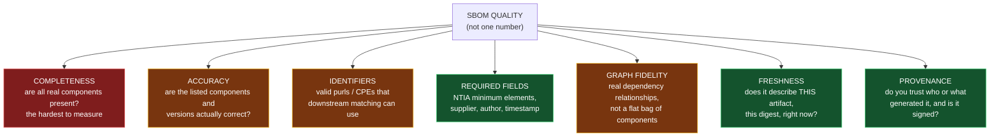
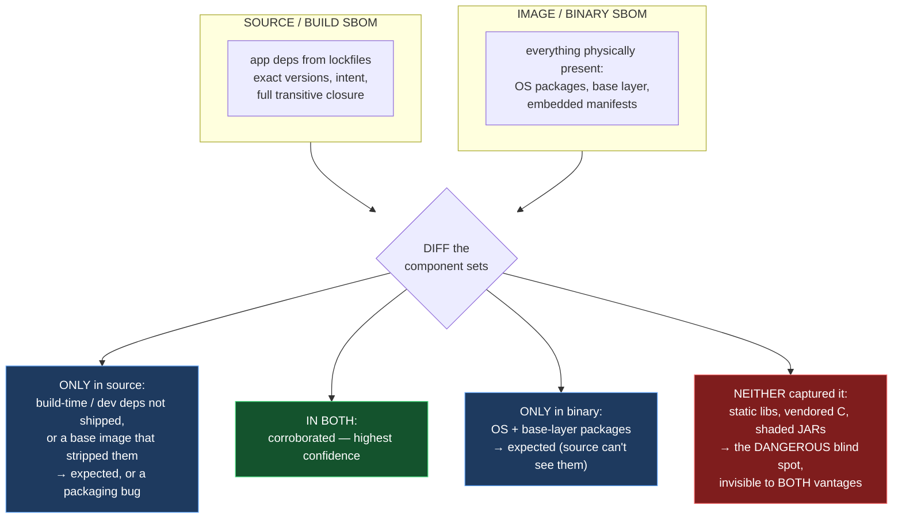
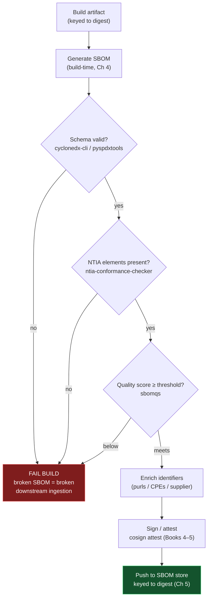
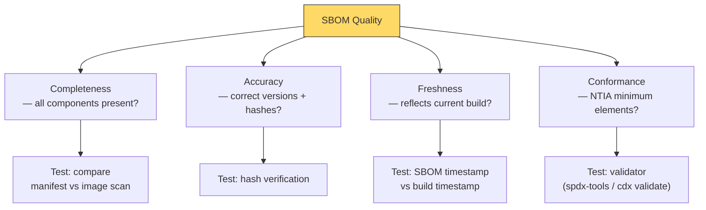
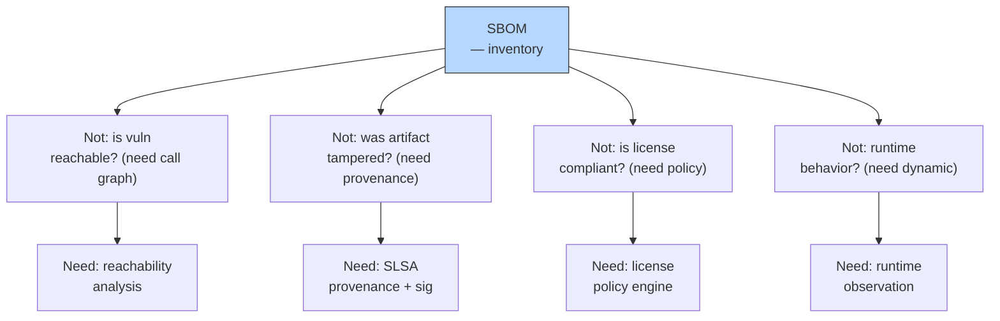

# Chapter 7 — SBOM Quality, Completeness, and Limitations

*What this chapter covers.* The previous chapters were constructive: what an SBOM is
(Chapter 1), how to write it in SPDX (Chapter 2) or CycloneDX (Chapter 3), how to generate
it (Chapter 4), how to distribute and query it at scale (Chapter 5), and how to correlate
it with vulnerabilities using VEX (Chapter 6). This chapter is the audit. It asks the
questions a skeptical senior engineer *should* ask before betting an incident-response plan
on a pile of JSON documents: **how good are these SBOMs actually, how would I measure that,
and what will they never tell me no matter how good they get?** The uncomfortable thesis is
that most SBOMs in circulation today are worse than their owners believe, that "we have
SBOMs for 100% of our services" is a coverage metric masquerading as a visibility metric,
and that even a flawless SBOM is an *inventory*, not a security assessment. None of this
makes SBOMs worthless — they are necessary infrastructure. It makes them a foundation, and
you have to know the shape of the foundation before you build on it. False confidence is the
specific failure mode this chapter exists to prevent.

Learning goals — after this chapter you should be able to:

- Decompose "SBOM quality" into its distinct dimensions — **completeness, accuracy,
  identifier validity, required-field presence, graph fidelity, freshness, and provenance**
  — and explain why **conformance, completeness, and accuracy are three different things** an
  SBOM can pass or fail independently.
- Use the real measurement tools — **sbomqs, ntia-conformance-checker, the CycloneDX/SPDX
  validators, eBay's sbom-scorecard** — and state precisely what each one checks and, more
  importantly, what none of them can check.
- Confront the **completeness measurement problem**: you can validate what is present, but
  you cannot in general know what is missing without ground truth you rarely have; and know
  the comparison-based techniques that partially substitute for that ground truth.
- Enumerate the **systematic accuracy failures** — static linking, vendoring, shaded JARs,
  bundled JavaScript, stripped binaries, firmware, broken identifiers — and explain why
  *false negatives* (a present component absent from the SBOM) are the dangerous class.
- State the **fundamental limits**: an SBOM does not tell you whether you are exploitable,
  whether a component is malicious, whether you have first-party bugs, whether the build was
  honest, or anything about zero-days — and map each limit to the mechanism that *does*
  address it.
- Design a **fitness-for-purpose** quality bar and a CI **quality gate**, and track quality
  as a fleet-wide distribution rather than a binary coverage checkbox.

A boundary note. This chapter builds directly on Chapter 4's account of generation and its
hard cases, and on Chapter 4's "measurement problem" — here both are deepened. It assumes
Book 2's identifier model (purl versus CPE, Book 2, Chapter 5), its SCA pipeline (Book 2,
Chapter 6), and its treatment of reachability (Book 2, Chapter 7) and malicious packages
(Book 2, Chapter 4). It hands off VEX to Chapter 6, provenance to Books 4 and 5, and
fleet-level metrics to Book 8, Chapter 8 — Metrics, Audits, and Executive Reporting.

## What "quality" is not: one word for seven properties

The first mistake is treating "quality" as a scalar. Ask "is this a good SBOM?" and you
have asked an unanswerable question, because the document can be excellent along one axis
and useless along another, and the axes do not correlate. A CycloneDX 1.6 file can be
schema-perfect and NTIA-conformant while omitting a third of the components in the image it
describes. A file with every component present can carry version strings that no
vulnerability database will ever match. An SBOM can be flawless the day it is generated and
a lie six hours later when the base image is rebuilt. "Quality" is shorthand for at least
seven distinct properties, and you must be able to name which one you mean.



**Completeness** asks whether every component actually present in the artifact appears in
the document. It is first because it is both the most important and, as the rest of this
chapter labors, the one property you fundamentally cannot verify without an oracle you do
not have.

**Accuracy** asks whether the components that *are* listed are correctly identified: right
name, right version, right supplier. A complete list of wrong facts is not progress. Accuracy
and completeness are orthogonal — you can have a short accurate list or a long inaccurate one.

**Identifier validity** is a special, load-bearing slice of accuracy. Book 2, Chapter 5
established that a component is only useful to downstream tooling if it carries an identifier
those tools can match on — a well-formed **purl** for the OSV/GHSA world, a correct **CPE**
for the NVD world. A component present in the SBOM with a `pkg:generic` fallback purl and no
CPE is, for vulnerability-matching purposes, nearly as invisible as a component that is
absent. This is why it earns its own axis: an SBOM can be complete and accurate in prose and
still answer zero vulnerability queries.

**Required-field presence** is conformance: does the document carry the fields a standard
demands? The NTIA minimum elements (supplier, component name, version, other unique
identifiers, dependency relationship, author of the SBOM, timestamp) are the canonical floor.
This is the *most* mechanically checkable property and, not coincidentally, the one most
often mistaken for quality writ large.

**Graph fidelity** is Chapter 1's "graph, not list" insistence applied to quality: are the
`dependsOn`/`DEPENDS_ON` relationships present and correct, or is the file a flat inventory
with every component hanging off the root? A flat list still tells you *what* is present, but
it destroys the *why* — you cannot answer "which of my services pulls in this transitively,
and through what" without the edges.

**Freshness** asks whether the document describes the artifact you are actually running.
SBOMs decay. An SBOM generated against `myservice:1.4.2` is a fabrication the moment a
`myservice:1.4.3` rebuild pulls a patched `libssl`. Freshness is why Chapter 5 keyed SBOM
storage to the immutable image *digest*, never a mutable tag.

**Provenance** asks whether you trust the SBOM's origin. An SBOM is itself an artifact in the
supply chain, and an attacker who can rewrite your SBOM can hide the very component they
injected. Provenance — who or what generated this, and is that claim cryptographically
verifiable — is addressed by signing and attestation (Books 4 and 5), not by anything inside
the component list.

### The distinction that everything hangs on

Hold three of these apart deliberately, because conflating them is the single most common
error in SBOM programs:

- **Conformance** — does the document have the required fields, well-formed? Answered by
  validators and NTIA checkers. *Cheap, mechanical, and about form.*
- **Completeness** — are all the real components present? Requires ground truth. *Expensive,
  often impossible, and about the world.*
- **Accuracy** — are the present components correctly identified? Requires per-component
  verification. *Expensive, partial, and about correspondence.*

An SBOM can pass conformance perfectly while failing completeness catastrophically, because
conformance is a property of the *document* and completeness is a property of the
*relationship between the document and the artifact*. A validator never sees the artifact. It
cannot know that `busybox` is in the image; it can only confirm that whatever components you
*did* list each carry a supplier and a version. Nothing about "this file conforms to the NTIA
minimum elements" implies "this file lists everything in my container." Treat any tool that
emits a single quality score as reporting a weighted blend of these independent properties,
and always ask which property drove the number.

## Measuring what is there: tools and rubrics

Given the dimensions, what can you actually measure, and with what? The tooling divides
neatly by which property it inspects, and the division exposes a hard boundary: **everything
in this section validates the document; none of it validates the document against the
artifact.** Every tool here is blind to completeness in the strong sense. Keep that in view
as we go.

### Schema validity is table stakes, not quality

The floor beneath the floor is *is this even a valid document of its claimed format*.
CycloneDX ships `cyclonedx-cli validate`, which checks a file against the JSON Schema for the
declared spec version; the SPDX ecosystem offers the online SPDX Online Tool and libraries
such as the Python `spdx-tools` (`pyspdxtools --validate`) that check against the SPDX schema
and the tag-value/JSON grammar.

```bash
# CycloneDX: schema validation against a specific spec version
cyclonedx-cli validate --input-file sbom.cdx.json --input-version v1_6

# SPDX: parse + validate structural correctness
pyspdxtools -i sbom.spdx.json
```

Schema validity means the JSON parses, the required top-level fields exist, enums hold valid
values, and references resolve. It says nothing about truth. A schema validator will happily
pass an SBOM that lists one component — `pkg:npm/left-pad@1.0.0` — for a 900-MB container
running a JVM and a Postgres client. It is a necessary gate (a malformed SBOM breaks every
downstream consumer, as Chapter 5's ingestion pipeline demonstrated) and it is the weakest
possible signal of quality. Pass it and move on; do not report it as "our SBOMs are good."

### NTIA minimum-elements conformance: the floor

The NTIA "Minimum Elements for a Software Bill of Materials" (12 July 2021, published in
response to Executive Order 14028) defines the field-level floor: for each component, a
**supplier**, **component name**, **version**, **other unique identifiers**, and
**dependency relationship**; and for the document, the **author of the SBOM data** and a
**timestamp**. It also specifies *automation support* (one of SPDX, CycloneDX, or SWID) and
*practices and processes* — the human commitments around depth, frequency, and handling of
known unknowns.

The tool most associated with checking this is the SPDX community's
**ntia-conformance-checker** (maintained under the SPDX org), which takes an SPDX document
and reports whether each minimum element is present:

```bash
$ ntia-checker --file sbom.spdx.json --verbose
NTIA conformant: False
Missing supplier names:
 - glibc
 - openssl
 - zlib
Missing version info: (none)
Total components: 214
Components missing supplier: 3
```

Read that output carefully. It is telling you three of 214 components lack a supplier field.
It is **not** telling you whether 214 is the right number. If the real image contains 260
components and 46 were never cataloged, `ntia-conformance-checker` reports nothing about
them, because it cannot see them — they are not in the file, and the file is all it has. This
is the conformance/completeness gap made concrete: a document can be **100% NTIA-conformant
and 82% complete**, and the conformance checker will call it conformant without a flicker.
Conformance is a property of the rows that exist, not of the rows that should.

The NTIA document itself is honest about this. It introduces the concept of **"known
unknowns"** — an SBOM author explicitly declaring that a portion of the tree is not
enumerated (a partial component, an opaque third-party binary). A mature SBOM that *declares*
its incompleteness is more trustworthy than one that silently implies completeness it does
not have. Conformance can encode "I know I don't know"; it cannot detect "I don't know that I
don't know."

### Quality scoring: sbomqs, sbom-scorecard, and the rubrics

Above bare conformance sit the *quality scorers*, which grade an SBOM across multiple
weighted categories and emit a composite score. The most widely used open-source scorer is
**sbomqs** (Interlynk). It parses SPDX or CycloneDX and scores dozens of features grouped
into categories — roughly: **structural** (is it spec-compliant and parseable), **NTIA
minimum elements** (are the mandated fields present), **semantic** (do fields carry
meaningful, correctly-typed values), **quality** (do components have valid identifiers,
licenses with recognized SPDX IDs, checksums, non-empty suppliers), and **sharing** (is the
document licensed for distribution). Recent versions also score against external profiles such
as the German **BSI TR-03183-2** guideline and OpenChain Telco.

```bash
$ sbomqs score sbom.cdx.json
SBOM Quality Score: 6.8  components:214  sbom.cdx.json
+-----------------------+--------------------------------+-----------+
| CATEGORY              | FEATURE                        | SCORE     |
+-----------------------+--------------------------------+-----------+
| NTIA-minimum-elements | comp_with_supplier             | 9.9/10.0  |
|                       | comp_with_version              | 10.0/10.0 |
|                       | sbom_authors                   | 10.0/10.0 |
| Quality               | comp_with_valid_licenses       | 7.1/10.0  |
|                       | comp_with_uniq_ids (purl/cpe)  | 5.4/10.0  |
|                       | comp_with_checksums            | 4.2/10.0  |
| Semantic              | comp_with_primary_purpose      | 3.0/10.0  |
| Structural            | spec_valid                     | 10.0/10.0 |
+-----------------------+--------------------------------+-----------+
```

**eBay's sbom-scorecard** takes a similar approach with a leaner rubric (presence of purls,
of licenses, of versions; a "spec compliance" check) and is useful precisely because
comparing two scorers on the same file exposes how much a "score" depends on the rubric's
weighting. OWASP's **Software Component Verification Standard (SCVS)** ships a *BOM Maturity
Model* — not a tool but a rubric — that grades SBOM practices across levels and is the right
reference when you want a vendor-neutral definition of "what a Level 2 SBOM program looks
like."

Here is the essential caveat, and it is the same one as for conformance: **every field a
scorer checks is a field that must already be in the document.** `comp_with_uniq_ids: 5.4`
means 54% of the *listed* components have a valid purl or CPE — a genuinely useful accuracy
signal. It says nothing about the components that were never listed. A scorer's number goes
*up* as your listed components get better identifiers and *cannot go down* when a whole class
of component is missing, because the missing class contributes no rows to score. It is
entirely possible to raise your sbomqs score by enriching a badly incomplete SBOM, producing
a higher-scoring document that is no more complete. Scorers measure the quality of what you
captured, not the fraction of reality you captured.

### The table: dimension, measurement, tool

| Quality dimension | What "good" means | How to measure it | Tools |
|---|---|---|---|
| Schema validity | Parses, valid enums, refs resolve | Validate against format schema | `cyclonedx-cli validate`, `pyspdxtools`, SPDX Online Tool |
| Required fields (conformance) | NTIA minimum elements present | Check each mandated field per component | ntia-conformance-checker, sbomqs (NTIA category) |
| Identifier validity | Valid purls / correct CPEs | Parse identifiers, check purl grammar, match against known types | sbomqs (`comp_with_uniq_ids`), eBay sbom-scorecard, custom purl linters |
| Field richness / semantics | Licenses (SPDX IDs), checksums, suppliers non-empty | Score presence + well-formedness of value fields | sbomqs (Quality/Semantic), sbom-scorecard |
| Graph fidelity | Real dependency edges, not a flat list | Count relationships vs components; check for a connected tree | Custom (relationship-count ratio); partial in sbomqs |
| **Completeness** | **All real components present** | **Comparison against ground truth (see next section)** | **No single tool — diff-based, no oracle** |
| Freshness | Describes this exact artifact | Compare SBOM subject digest to running artifact digest | Registry/attestation lookup (Chapter 5), admission policy |
| Provenance | Trusted, signed origin | Verify signature / attestation | `cosign verify-attestation`, in-toto (Books 4–5) |

Notice which row has no tool. Completeness is the property that matters most for
vulnerability response and the only one with no validator, because it is the only one that
requires knowledge outside the document.

## The completeness problem: how do you know what is missing?

You can validate what is present. You cannot, in general, know what is absent. This is not a
tooling gap that a better parser will close; it is structural. To *know* an SBOM is complete
you would need an independent, authoritative enumeration of every component in the artifact —
and if you had that, you would use *it* as your SBOM. The oracle you would need to check the
SBOM is exactly the artifact the SBOM was supposed to produce. Chapter 4 named this the
measurement problem; here we deepen it and salvage what can be salvaged.

What can be salvaged is *relative* completeness through **comparison**. You cannot compare an
SBOM to the truth, but you can compare it to *another observation of the same artifact made
from a different vantage point*, and every disagreement is a lead. Two techniques dominate.

**Tool-diffing.** Run two independent generators (say Syft and Trivy, per Chapter 4) against
the same image and diff the component sets. Where they agree, your confidence rises — with a
caveat below. Where they disagree, you have found either a false positive in one or a false
negative in the other, and both are worth investigating. This is cheap and repeatable in CI.
Its limit is *shared blindness*: two binary scanners that both rely on OS package databases
and embedded manifests will *both* miss a statically-linked, stripped C library, and their
perfect agreement is not evidence of completeness — it is evidence they share a blind spot.
Agreement bounds your false-positive rate, not your false-negative rate.

**Source-versus-binary diffing.** The more powerful comparison exploits the vantage
asymmetry Chapter 4 built its whole argument on. Generate a *source/build* SBOM (from
lockfiles and the build graph — high fidelity on your application's declared dependency
closure, with exact versions and intent) and an *image/binary* SBOM (from scanning the final
artifact — high fidelity on OS packages and whatever is physically present). Then diff them.
The two are *supposed* to differ in structured ways, and the structure of the difference is
diagnostic.



Read the four quadrants. Components **in both** are corroborated from independent vantages —
your highest-confidence rows. Components **only in the source SBOM** are usually build-time or
dev dependencies that never made it into the runtime image (expected, and a way to *shrink*
your reported attack surface honestly) — but occasionally they signal a packaging bug where
something you depend on was silently dropped. Components **only in the binary SBOM** are
almost always OS and base-layer packages the source vantage structurally cannot see
(expected). The lethal quadrant is the one the diagram cannot draw a box around cleanly:
components **in neither** — statically linked libraries, vendored C compiled straight into a
binary, a shaded JAR whose original coordinates were rewritten. Neither vantage sees them, so
the diff cannot surface them either. Comparison narrows uncertainty; it does not eliminate
it. Your known blind spots remain blind to every observation you make with the same class of
tool, which is why the last resort is not measurement but *documentation*: write down, per
build system, which classes of component your pipeline is structurally unable to see, and
carry that list into incident response (Book 8).

## Systematic accuracy failures

Random errors average out at scale; systematic errors replicate. The accuracy problems that
matter for a fleet are not the occasional mangled version string — they are the whole
*classes* of component that a standard build pipeline gets wrong the same way every time,
because a systematic gap in your paved road is a blind spot stamped identically onto every
service that rides it. This section catalogs the classes. It builds on Chapter 4's hard cases
and reframes them through the lens of *what the resulting SBOM claims versus what is true*.

### Identification failures: present but invisible

These are components that physically exist in the artifact but carry no metadata a scanner
can read, so they are either absent from the SBOM or listed under a wrong or meaningless
identity.

- **Statically linked libraries.** A C/C++/Rust/Go binary that statically links `zlib` or
  `openssl` contains that code with no package database entry, no manifest, and — once
  stripped — often no symbol table. The binary *is* vulnerable to a `zlib` CVE; the SBOM
  shows one component (the binary) and `zlib` is simply gone. Go is the partial exception:
  `go version -m` reads the module list the toolchain embeds, so Go binaries self-describe.
  C static linking has no such convention, and this is the archetypal invisible-but-present
  case.
- **Vendored / copied code.** A project that copies a third-party source tree into its own
  repository (a `vendor/` directory of C, an inlined header, a pasted utility file) presents
  that code to the compiler as first-party source. No package manager knows it exists, so no
  source or binary scanner attributes it to its upstream. It carries the upstream's
  vulnerabilities under your name.
- **Shaded / relocated JARs.** Java "shading" (via the Maven Shade plugin) rewrites a
  dependency's package namespace — `org.apache.commons` becomes
  `com.myapp.shaded.org.apache.commons` — and merges it into an uber-JAR. The classes are
  present and vulnerable; the coordinates that would identify them are deliberately erased.
  This is how Log4Shell hid: a shaded Log4j inside a fat JAR matched no naive scan for
  `log4j-core`.
- **Minified / bundled JavaScript.** A webpack or esbuild bundle concatenates and minifies
  dozens of npm packages into one `main.min.js`. The original package boundaries and versions
  are gone; a scanner sees one file. The npm lockfile at build time is the only place the
  identities survive — which is exactly why Chapter 4 insisted on source-side generation for
  this ecosystem.
- **Stripped binaries and firmware.** Stripping removes symbols; firmware images pack code,
  data, and filesystems into opaque blobs with no package metadata at all. Binary composition
  analysis here degrades to fuzzy matching and heuristics — informative, but a guess, not an
  inventory. Do not let an SBOM present a heuristic firmware guess with the same confidence as
  a lockfile-derived component.

The common thread: **each of these makes a component present in the artifact but absent or
misidentified in the SBOM**, and that is precisely the error class that produces a
false-negative vulnerability result — the dangerous kind, discussed next.

### Identifier problems: present but unmatchable

A component can be listed and still be useless downstream if its identifier is wrong,
missing, or ambiguous. Book 2, Chapter 5 is the reference for the identifier model; here is
what breaks in practice:

- **Missing or fallback purls.** A generator that cannot confidently determine a component's
  ecosystem emits `pkg:generic/something@1.0` or no purl at all. OSV and GHSA match on purl;
  no purl means no match.
- **Wrong purls.** A subtler failure: a purl with the wrong ecosystem, a normalized name that
  does not match the advisory's, or an epoch/qualifier mismatch. The component looks
  identified but silently matches nothing.
- **CPE ambiguity.** CPEs are human-assigned NVD strings with notorious vendor/product
  inconsistency (`openssl:openssl` versus `openssl_project:openssl`). A near-miss CPE fails to
  match NVD advisories that use the other form. Book 2, Chapter 5 covered why purl↔CPE
  translation is lossy.
- **Version mismatches.** `1.2.3` versus `1.2.3-r0` versus `1.2.3.el8` — distro-patched
  versions, epochs, and build suffixes routinely defeat naive version-range matching, causing
  both false negatives (patched-but-flagged) and, worse, false negatives where a vulnerable
  version reads as something the matcher does not recognize.
- **Empty supplier fields.** NTIA mandates a supplier, but many generators emit an empty or
  placeholder value. It passes some conformance checks weakly and provides no help
  disambiguating a component with a common name.

### Why false negatives are the dangerous class

Distinguish the two error directions cleanly, because they have wildly asymmetric costs.

- A **false positive** — a component in the SBOM that is not really in the artifact, or a
  vulnerability flagged that does not apply — costs analyst time. It is noise. VEX (Chapter 6)
  exists largely to suppress it. It is annoying and it erodes trust in the tooling, but it
  does not hurt you in an incident.
- A **false negative** — a component physically present in the artifact but *absent from the
  SBOM* — is silent. When the next Log4Shell-class advisory lands and you run the query "which
  of my 4,000 services ship this component," the affected service with the invisible static
  library or shaded JAR returns *clean*. You will not patch it, because you do not know it is
  there. The SBOM gave you confidence and the confidence was false.

This asymmetry should govern how you invest in SBOM quality. A program obsessed with trimming
false positives (nicer dashboards) while tolerating systematic false negatives (invisible
component classes) is optimizing the cheap error and ignoring the expensive one. A false
negative is a vulnerability query that lies to you at exactly the moment it matters most.

### Format and tool divergence

Chapter 4 established that two competent tools produce materially different SBOMs for the same
artifact — different catalogers, different identifier minting, different source-versus-binary
vantage, different scoping of what counts as a component. That divergence is a *quality*
problem too, not just a generation curiosity: it means "we have an SBOM" is underspecified
until you say *which tool produced it at which pipeline stage*, and it undermines
comparability across an organization where different teams picked different generators. If
service A's SBOM comes from Syft-at-build and service B's from Trivy-at-scan, a fleet-wide
query for a component executes against two populations with different systematic blind spots,
and a clean result from B means something weaker than a clean result from A. Standardizing the
generation path across the paved road is as much a *quality* decision as an operational one.

### The transitive-closure boundary: SBOM-of-an-SBOM gaps

Even a tool that captures its ecosystem perfectly faces scoping questions with no
format-mandated answer, and different answers produce SBOMs that are not wrong so much as
*differently scoped* — which is its own comparability hazard:

- **Dev versus prod dependencies.** Does the SBOM include test frameworks and build tools, or
  only what ships? Both are defensible; a consumer comparing two SBOMs that made opposite
  choices will misread the difference as a completeness gap.
- **Multi-stage build losses.** A builder stage installs a compiler and dev headers; the final
  stage copies only the binary. An SBOM generated against the final image legitimately omits
  the builder's toolchain — but if you needed to know the compiler version for a build-integrity
  question, it is gone (Chapter 4).
- **Base-layer and OS components.** How deep does the SBOM go into the base image — every
  `apk`/`dpkg` package, or only what the application directly links? Chapter 4's source vantage
  cannot see these at all; a source-only SBOM is *scoped* to exclude them, which is fine only
  if the consumer knows that.
- **Dynamically loaded plugins.** Code loaded at runtime via `dlopen`, JVM classpath scanning,
  or a plugin directory may not be present at build time and thus not in a build SBOM. Runtime
  generation (Chapter 4) is the only vantage that sees it.

None of these has a universally correct answer. The point is that the *transitive closure
boundary* — how deep, how wide, dev-inclusive or not — is a decision, and an SBOM that does
not document its own scoping decision is one a consumer will silently misinterpret. This is
another argument for NTIA's "known unknowns": an SBOM that states its boundaries is honest;
one that implies a completeness it never attempted is not.

## Fundamental limitations: what an SBOM cannot do

Everything above concerns making SBOMs *better*. This section concerns what a *perfect* SBOM —
complete, accurate, correctly identified, fresh, signed — still cannot tell you. These are not
quality defects; they are category boundaries. An SBOM is an inventory of components. It is not
a security assessment, and treating it as one is the overclaim that discredits the whole
practice when it inevitably fails to deliver.

```mermaid
flowchart LR
    subgraph CAN["WHAT AN SBOM TELLS YOU"]
        C1["what components are present"]
        C2["at what versions"]
        C3["in what dependency relationships"]
        C4["→ which KNOWN components map to<br/>which KNOWN vulnerabilities"]
    end
    subgraph CANNOT["WHAT IT DOES NOT TELL YOU"]
        X1["whether you are EXPLOITABLE<br/>(needs reachability + VEX)"]
        X2["whether a component is MALICIOUS<br/>(a bad package is still a listed component)"]
        X3["whether you have FIRST-PARTY bugs<br/>(your own code isn't a component)"]
        X4["whether the BUILD was honest<br/>(needs provenance)"]
        X5["anything about ZERO-DAYS /<br/>unknown vulnerabilities"]
    end

    CAN -.->|"inventory ≠ assessment"| CANNOT

    classDef can fill:#14532d,stroke:#4ade80,color:#fff;
    classDef cannot fill:#7f1d1d,stroke:#f87171,color:#fff;
    class C1,C2,C3,C4 can;
    class X1,X2,X3,X4,X5 cannot;
```



Walk each boundary, because each maps to a *different mechanism* that does the job the SBOM
cannot.

**An SBOM does not tell you whether you are exploitable.** "Component X is present and X has
CVE-2024-nnnnn" is a statement about presence, not exposure. The vulnerable function may never
be called, the code path may be unreachable, the feature may be compiled out, or a
compensating control may neutralize it. Determining exploitability needs **reachability
analysis** (Book 2, Chapter 7) to establish whether the vulnerable code is actually invoked,
and **VEX** (Chapter 6) to record and communicate the vendor's affected/not-affected
determination. The SBOM is the input to that analysis, never its conclusion. An SBOM-only
program drowns in "present but not exploitable" findings — which is precisely why VEX exists.

**An SBOM does not tell you whether a component is malicious.** This trips people up because
it feels like it should. But a malicious package — a typosquat, a compromised maintainer's
update, an `event-stream`-style payload (Book 2, Chapter 4) — *is a component*, and a faithful
SBOM lists it, correctly, by name and version. The SBOM does its job perfectly and tells you
nothing about the threat, because "is this component malicious?" is a question about the
component's *behavior*, not its identity. Detecting malice needs the machinery of Book 2,
Chapter 4 — behavioral analysis, install-script inspection, reputation signals — an entirely
different discipline. An SBOM full of malware is a complete, accurate, high-quality SBOM.

**An SBOM does not cover your first-party code.** Your own application logic — the SQL
injection you wrote, the auth bypass in your handler — is not a "component" and appears nowhere
in the SBOM. First-party vulnerabilities are the domain of SAST, DAST, code review, and
testing, wholly outside the SBOM's remit. An organization that believes "we have SBOMs, so we
have visibility into our vulnerabilities" has confused third-party inventory with total
security posture.

**An SBOM does not tell you the build was honest.** An SBOM describes *what is in* an artifact;
it says nothing about *how the artifact came to be* or whether the SBOM itself was generated by
an untampered pipeline. An attacker who compromises the build can produce a malicious binary
*and* a clean-looking SBOM that omits their injection. Establishing build integrity is the job
of **provenance** — SLSA attestations, in-toto, signing (Books 4 and 5) — which is why this
chapter's quality dimensions included *provenance* and why an unsigned SBOM of unknown origin
is a weak artifact regardless of how complete its component list appears.

**An SBOM tells you nothing about zero-days.** The entire mechanism is *match known components
to known vulnerabilities*. A vulnerability not yet in any database (OSV, NVD, GHSA — Book 2,
Chapter 5) matches nothing, no matter how perfect your SBOM. This is not an SBOM weakness
specifically; it is the same fundamental limit as all of Software Composition Analysis (Book
2, Chapter 6). The value of the SBOM is *latent and retroactive*: when the zero-day becomes a
known day — when the advisory publishes — a good SBOM store lets you answer "am I affected"
across the fleet in minutes instead of a week of frantic grepping. That retroactive query is
the real product. The SBOM does not prevent the attack; it collapses your response time after
disclosure.

### The overclaim, critiqued fairly

"SBOMs will secure the software supply chain" is the sentence to retire. It is false in the way
that matters and it sets the practice up to be judged a failure. An SBOM prevents no attack. It
does not stop a malicious dependency from being installed, a build from being poisoned, or a
zero-day from landing. What it does — and this is genuinely valuable, not a consolation prize —
is provide **transparency and response capability**. It converts "we think we might use Log4j
somewhere" into "these 37 services ship log4j-core 2.14.1, here are their digests, here are
their owners," in the first hour of an incident rather than the second week. It is the
difference between an incident response that is a database query and one that is an
archaeological dig across thousands of repositories.

Hold both truths at once without cynicism. SBOMs are **necessary infrastructure and not a
solution**. They are necessary because you cannot respond to a supply-chain incident you have
no inventory for; the organizations that suffered most in Log4Shell were the ones who could not
answer "where do we use this." They are not a solution because inventory is not assessment,
presence is not exploitability, and known is not all. An engineer who internalizes this builds
the SBOM as the *foundation layer* it is — feeding reachability, VEX, provenance, and malware
detection — rather than as a finish line.

### The table: limitation to remedy

| The SBOM cannot tell you… | Because… | What you need instead | Reference |
|---|---|---|---|
| Whether you are exploitable | Presence ≠ reachability of vulnerable code | Reachability analysis + VEX | Book 2 Ch 7; Book 3 Ch 6 |
| Whether a component is malicious | A malicious package is a correctly-listed component | Behavioral / package analysis | Book 2 Ch 4 |
| Whether you have first-party bugs | Your own code is not a "component" | SAST / DAST / review / testing | — |
| Whether the build was honest | Inventory ≠ integrity of the process | Provenance: SLSA, in-toto, signing | Books 4 & 5 |
| Anything about zero-days | Matching is known-component → known-vuln | Nothing prevents them; SBOM enables fast *retroactive* response | Book 2 Ch 6 |
| Whether the SBOM itself is trustworthy | The SBOM is an attackable artifact | Signed attestation of the SBOM | Books 4 & 5; Ch 5 |

## Getting to good-enough

The correct target is not a perfect SBOM. There is no perfect SBOM — completeness is
unmeasurable and some component classes are structurally invisible. The correct target is
**fit for purpose**: the quality bar is a function of what you will *do* with the document, and
different uses stress different dimensions. Pursuing perfection wastes effort on dimensions
your use case does not need while a program that never ships waits for an unachievable ideal.

### Fitness for purpose

Match the quality investment to the job:

- **Rapid vulnerability response** (the marquee use case) needs **component + version coverage
  and valid identifiers** above all. If you will query "who ships X at version Y," you need
  those two fields correct and a valid purl on every component. Licenses and rich descriptions
  are irrelevant to this job; a missing purl is fatal to it. Optimize accuracy and identifier
  validity; accept that some deep base-layer completeness is a stretch goal.
- **License compliance** needs correct, SPDX-ID-valid **license fields** on every component,
  and cares far less about exact patch versions or reachability. A different dimension
  entirely leads.
- **Customer / regulatory delivery** (an SBOM you hand to a buyer under a contract or a CRA
  obligation, Book 8, Chapter 1) needs **NTIA minimum elements plus format conformance plus a
  signature** — the deliverable is judged on conformance and provenance, and a
  conformance-clean, signed document is the contractual product even if its completeness is
  imperfect (declare known unknowns).

The same underlying generation can serve all three, but the *quality gate* you enforce should
weight the dimensions the consuming use case actually depends on. "Good enough" is defined by
the query you will run, not by a universal score.

### Improving quality, concretely

The levers, in rough order of impact, all trace back to earlier chapters:

1. **Generate at build time** (Chapter 4). The single biggest quality lever, because the
   build has the real resolved graph with exact versions and can see generated and build-only
   inputs. It moves whole component classes from "invisible" to "captured."
2. **Combine generation points.** Emit a build/source SBOM (intent, exact app deps) *and* an
   image/binary SBOM (coverage of OS and base layers), and reconcile them (the diff of the
   completeness section). One vantage's blind spot is often the other's strength.
3. **Enrich identifiers.** Post-process to add or correct purls and CPEs, fill supplier
   fields, and normalize versions — directly lifting the identifier-validity dimension that
   gates vulnerability matching.
4. **Validate and score in CI, and gate on it.** Fail the build when the SBOM drops below a
   threshold, so quality is enforced by the pipeline rather than hoped for.
5. **Sign the SBOM** (Books 4–5). Attach a `cosign` attestation keyed to the artifact digest
   so the provenance dimension is satisfied and the SBOM cannot be silently swapped.

### The quality gate in CI

Make the quality bar an executable gate on the paved road, not a review guideline. The gate
generates, validates, scores, and either passes the SBOM forward to storage (Chapter 5) or
fails the build.



```bash
# The gate, as a CI step
syft "$IMAGE" -o cyclonedx-json > sbom.cdx.json

cyclonedx-cli validate --input-file sbom.cdx.json --input-version v1_6 \
  || { echo "SBOM schema invalid"; exit 1; }

SCORE=$(sbomqs score sbom.cdx.json --json | jq '.files[0].avg_score')
awk -v s="$SCORE" 'BEGIN { exit (s >= 7.0) ? 0 : 1 }' \
  || { echo "SBOM quality $SCORE below threshold 7.0"; exit 1; }

cosign attest --predicate sbom.cdx.json --type cyclonedx "$IMAGE_DIGEST"
```

Set the threshold deliberately and raise it over time. Starting at a gate that fails on
schema-invalid and NTIA-non-conformant SBOMs, then ratcheting the sbomqs threshold up as the
fleet's tooling improves, is a workable adoption path — the same ratchet strategy Book 8,
Chapter 4 (Policy as Code) applies to any org-wide control. The gate's honesty depends on
remembering what it *cannot* check: it enforces every dimension except completeness, so a
build can pass the gate cleanly and still ship an SBOM missing a class of static libraries.
The gate raises the floor on the measurable dimensions; it does not close the blind spots.

### Honest metrics

The final lever is reporting. Track SBOM quality as a **distribution across the fleet**, not a
binary have/have-not, and feed it to the metrics program of Book 8, Chapter 8. "We have SBOMs
for 100% of services" is a coverage number, and reporting it as if it meant "we have 100%
visibility" is the executive-facing version of the conformance/completeness confusion this
whole chapter attacks. The honest dashboard shows the *distribution* of quality scores — the
p50 and the long tail of low-scoring services — plus explicit callouts of the known
structural blind spots ("static C libraries are not captured by our standard pipeline"). A
program that reports "100% coverage, median sbomqs 8.1, but our Go-CGO and firmware builds
have documented static-linking gaps" is telling the truth. A program that reports "100% SBOM
coverage" and stops is manufacturing exactly the false confidence that gets an organization
blindsided in the next incident.

## Distributed-systems lens

At fleet scale the danger is not the random error — it is the **systematic** one. A single
SBOM that mislabels one component is a local annoyance. A *standard build pipeline* that
mislabels or omits an entire class of component — every statically linked library, every
shaded JAR, every bundled front-end — stamps that identical blind spot onto every one of the
thousands of services that inherit the pipeline. The error does not average out; it
*replicates*. When the advisory for that component class lands, the fleet-wide query returns
clean across the board, and the cleanliness is uniform *because the blindness is uniform*. The
paved road that gives you consistency also gives you consistent blind spots, and consistent
blind spots are the ones that hurt at scale.

This reframes every recommendation above as a fleet decision:

- **Quality-gate in the paved-road pipeline, once.** The CI gate is not a per-team practice
  to be adopted; it is a property of the shared build platform (Book 4, Chapter 10) that every
  tenant inherits by default. Implement the generate-validate-score-sign-store flow once, in
  the platform, and every service gets a gated, signed, digest-keyed SBOM for free — the same
  amortization argument Chapter 4 made for generation itself, now extended to quality.
  Consistency of *tooling* also fixes the format-divergence problem: a fleet where every SBOM
  came from the same generator at the same stage is a fleet where a clean query result means
  the same thing everywhere.
- **Measure the quality *distribution*, not a coverage checkbox.** Emit each service's sbomqs
  score, format, generation stage, and known-blind-spot flags as a metric into the store
  (Chapter 5) and report the distribution. The interesting number is never the mean; it is the
  shape of the tail — the services on the old pipeline, the ones with `pkg:generic` fallbacks,
  the CGO binaries. That tail is your real exposure map.
- **Enumerate the blind spots explicitly, and hand them to incident response.** Because you
  cannot measure completeness, do the next best thing: maintain a written, per-pipeline
  catalog of *what your SBOMs structurally cannot see*. When Book 8's incident-response process
  runs a fleet query, it must account for "the SBOM will not show static C libraries, so for a
  `zlib`-class advisory, the SBOM query is necessary but not sufficient — also check these
  CGO-heavy services by hand." A fleet that knows its own blind spots can compensate for them
  in an incident. A fleet that believes its SBOMs are complete will trust a query that lies to
  it. The most valuable thing you can know about your SBOMs, at scale, is exactly the list of
  things they will not tell you.

The distributed-systems payoff of high-quality SBOMs is real and worth the investment: it is
the collapse of incident response from an archaeological dig into a database query, executed
uniformly across the whole estate. But that payoff is only as trustworthy as your honesty
about the query's blind spots. Build the SBOM as excellent, gated, signed foundation
infrastructure — and treat it as exactly that: a foundation the rest of the program is built
on, never the finished building.

## Key takeaways

- **"Quality" is seven independent properties**, not one number: completeness, accuracy,
  identifier validity, required-field presence, graph fidelity, freshness, and provenance. An
  SBOM can excel on some and fail others; the axes do not correlate.
- **Conformance, completeness, and accuracy are different things.** Conformance is a property
  of the document (are the fields present?); completeness is a property of the
  document-to-artifact relationship (are all real components listed?); accuracy is
  correspondence (are the listed components correct?). An SBOM can be 100% NTIA-conformant and
  badly incomplete simultaneously, and every validator will still call it conformant.
- **The tools validate what is present, never what is missing.** `cyclonedx-cli validate`,
  ntia-conformance-checker, sbomqs, and eBay's sbom-scorecard all score the rows that exist.
  Their scores rise as listed components improve and cannot fall when a whole class is absent.
  None can measure completeness, because completeness needs an oracle that would *be* the SBOM.
- **Completeness is approached only by comparison** — tool-diffing and, more powerfully,
  source-versus-binary diffing — and even that is defeated by *shared blindness*: components
  neither vantage can see (static libs, vendored C, shaded JARs) survive every diff. What
  cannot be measured must be *documented* as an explicit blind spot.
- **False negatives are the dangerous error class.** A component present in the artifact but
  absent from the SBOM (invisible static library, shaded JAR, minified bundle) returns *clean*
  on the incident query that matters most. Optimize against false negatives, not just the
  cheap false positives that VEX already handles.
- **A perfect SBOM is still only an inventory.** It cannot tell you whether you are
  exploitable (needs reachability + VEX), whether a component is malicious (a bad package is a
  correctly-listed component), whether you have first-party bugs, whether the build was honest
  (needs provenance), or anything about zero-days. Each limit maps to a different mechanism in
  another book.
- **"SBOMs will secure the supply chain" is an overclaim to retire.** SBOMs prevent no attack;
  they deliver transparency and fast *retroactive* response — turning a supply-chain incident
  from an archaeological dig into a database query. Necessary infrastructure, not a solution.
- **Pursue fit-for-purpose, not perfect.** Rapid vuln response needs component+version
  coverage and valid purls; license compliance needs license fields; customer delivery needs
  NTIA + conformance + a signature. Weight the quality gate toward the dimensions your actual
  use case queries.
- **Enforce quality as a CI gate on the paved road**: generate at build time, combine
  vantages, enrich identifiers, validate + score + fail below threshold, sign and store keyed
  to digest. Implement once in the shared platform; every service inherits it.
- **At fleet scale the systematic gap is the killer.** A blind spot baked into the standard
  pipeline replicates identically across every service. Quality-gate once in the platform,
  measure the quality *distribution* (watch the tail), and hand your explicit, per-pipeline
  blind-spot catalog to incident response so IR accounts for what the SBOM will not show.
- **Report honestly.** "100% SBOM coverage" is a coverage metric, not a visibility metric.
  Report the score distribution and the known structural gaps; never let a coverage number
  masquerade as completeness.


### SBOM quality dimensions




### What SBOMs cannot tell you



## Further reading

- **NTIA**, "The Minimum Elements for a Software Bill of Materials (SBOM)," 12 July 2021 — the
  field-level floor and the crucial concept of *known unknowns* (declaring the parts of the
  tree an SBOM does not enumerate).
- **Interlynk sbomqs** (`github.com/interlynk-io/sbomqs`) — open-source SBOM quality scorer;
  read the category/feature definitions to see exactly which per-component properties are
  scored and, by omission, which cannot be.
- **SPDX ntia-conformance-checker** (`github.com/spdx/ntia-conformance-checker`) — checks an
  SPDX document against the NTIA minimum elements; the canonical example of conformance
  checking that is structurally blind to completeness.
- **eBay sbom-scorecard** (`github.com/eBay/sbom-scorecard`) — a leaner quality rubric; useful
  precisely for comparing against sbomqs to see how much a "score" depends on the rubric.
- **OWASP Software Component Verification Standard (SCVS)** and its **BOM Maturity Model** — a
  vendor-neutral rubric for what SBOM practices at each maturity level look like.
- **CycloneDX** `cyclonedx-cli` and **SPDX** `spdx-tools` / SPDX Online Tool — schema
  validators; remember that schema validity is table stakes, not quality.
- **BSI TR-03183-2** (German Federal Office for Information Security) — a technical guideline
  specifying SBOM content and quality requirements, now a scored profile in sbomqs; a good
  example of a regulator formalizing quality expectations.
- **Package URL (purl)** specification and **NIST CPE 2.3** — the identifier standards whose
  correctness gates all downstream vulnerability matching (Book 2, Chapter 5).
- **CISA SBOM community resources** — the working-group outputs on SBOM types, sharing, and
  quality; useful for the evolving practice-and-process side of the NTIA elements.
