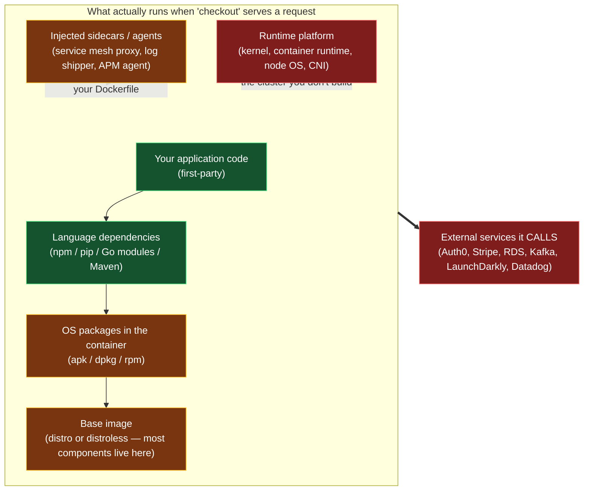
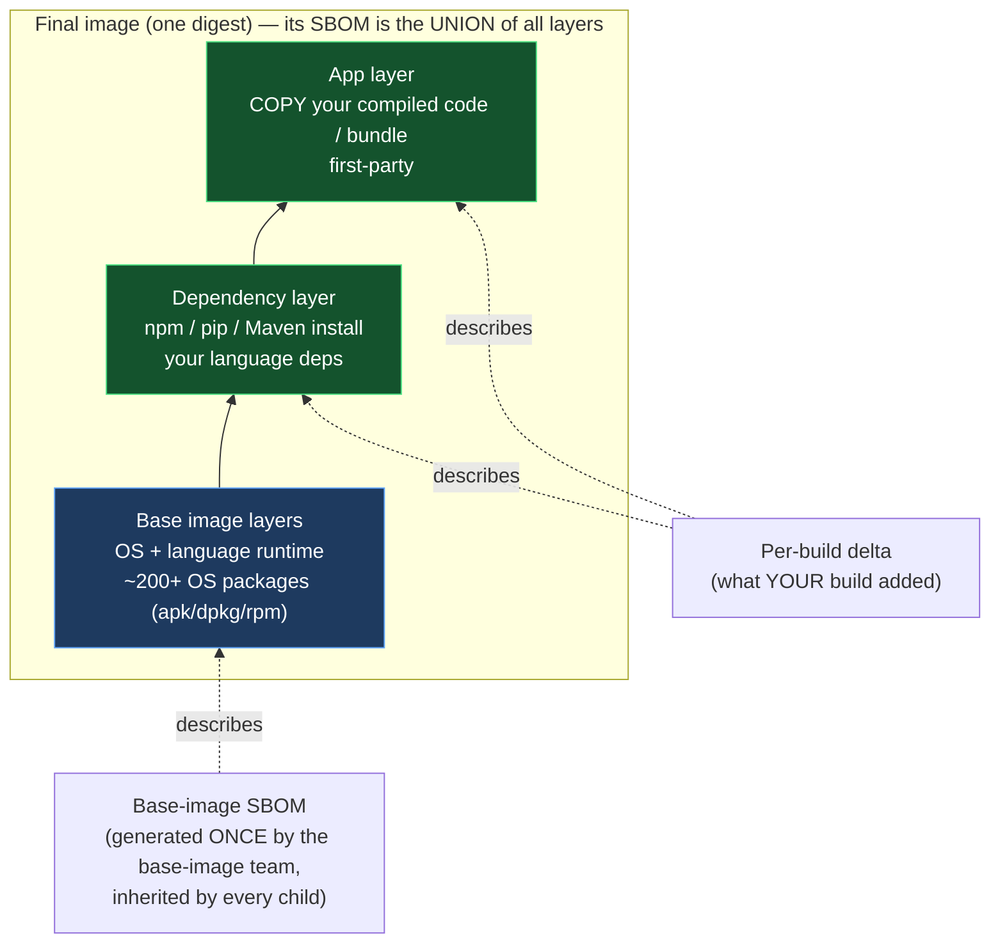
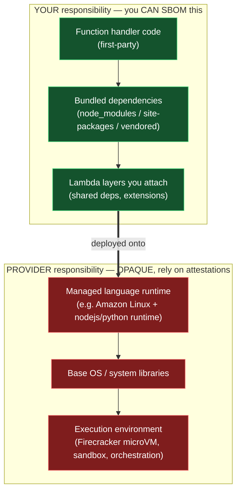
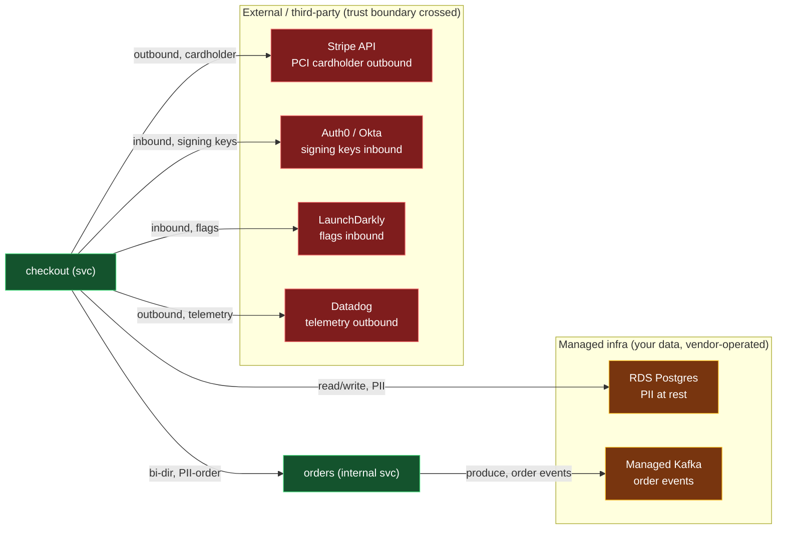
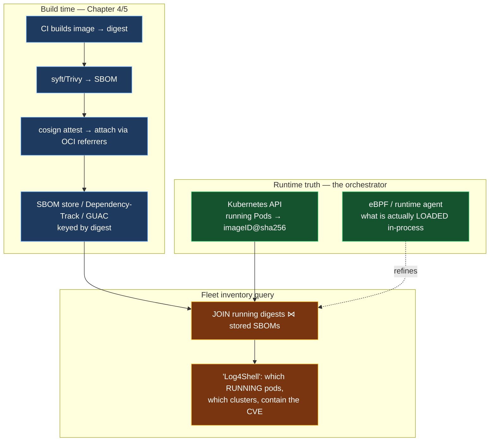
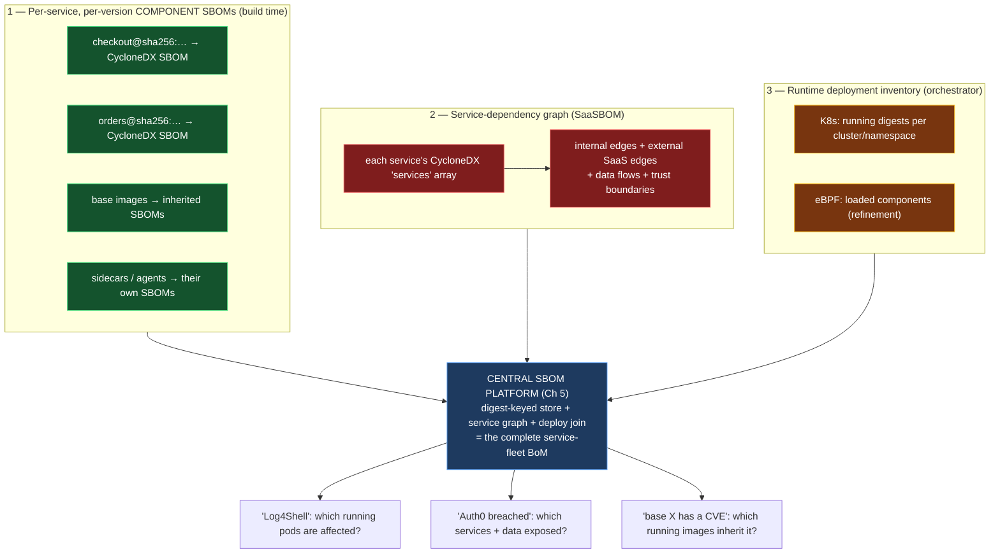
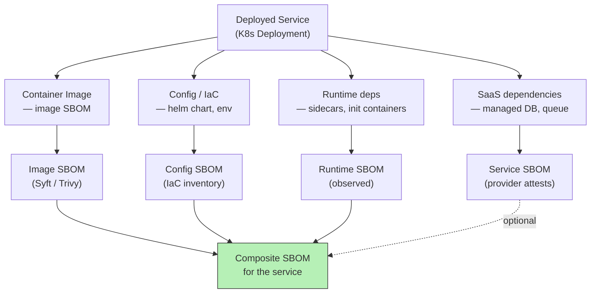
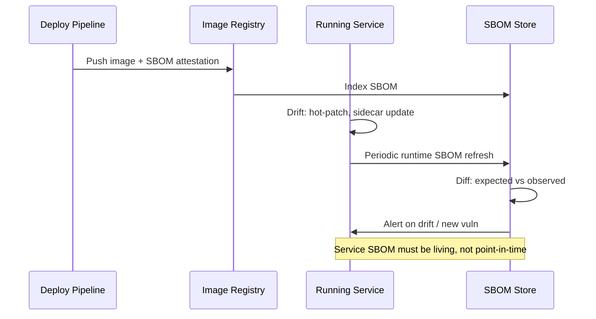

# Chapter 8 — SBOMs for Services: Containers, Serverless, and SaaS

*What this chapter covers.* Every chapter before this one carried a hidden assumption, inherited
from the origin of the whole idea: an SBOM describes a **shippable artifact**. NTIA's minimum
elements, the SPDX and CycloneDX document models (Chapters 2 and 3), the generation pipeline
(Chapter 4), even the distribution and query machinery (Chapter 5) — all of it is framed around a
thing you build, name, sign, and hand to someone. That framing fits a firmware image, a downloaded
installer, a library published to a registry. It fits almost nothing that a distributed-backend
organization actually operates. You do not ship a binary to a customer. You **run a fleet of
services** — containers scheduled across a cluster, functions invoked in someone else's execution
environment, request paths that fan out to a payment API, an identity provider, and three managed
datastores. The "software" you are responsible for is not a file. It is a running system whose
boundary is genuinely fuzzy, and whose composition changes every time a base image is rebuilt or a
scheduler moves a pod. This chapter adapts the SBOM to that reality. It is, for this suite's
audience, the most directly load-bearing chapter in the book: it answers the question "what is an
SBOM *for us*, given that we run services and don't ship products?"

Learning goals — after this chapter you should be able to:

- Explain **why a shipped-artifact SBOM under-describes a running service**, and decompose a
  service's true bill of materials into the layers that actually execute (app, language deps, OS
  packages, base image, injected sidecars/agents, platform runtime) plus the external services it
  calls.
- Treat the **container image as the unit of SBOM** for a backend org — generate per-image SBOMs
  with syft/Trivy, understand base-image inheritance and multi-stage builds, attach SBOMs via OCI
  referrers keyed to the image digest, and reason about the distroless trade-off.
- Map the **shared-responsibility boundary for serverless**: SBOM your function code and its deps,
  understand Lambda layers as a dependency and supply-chain mechanism, and acknowledge the
  irreducible gap where the provider's managed runtime is opaque.
- Model **service and SaaS dependencies** with the CycloneDX SaaSBOM `services` array — external
  endpoints, data flows, trust boundaries, data classification — and understand why the runtime
  supply chain (polyfill.io, Ledger Connect Kit) is a real class of compromise that component SBOMs
  miss entirely.
- Join **build-time SBOMs to the orchestrator's deployment truth** to produce a runtime fleet
  inventory — "what is actually running where," the query that answers Log4Shell for a service org.
- Assemble the three pieces — per-service container SBOMs, the service-dependency graph, and the
  runtime deployment inventory — into a **complete service-fleet BoM**, and know which parts are
  authoritative, which are best-effort, and which are permanently the provider's.

A boundary note. This chapter assumes the generation mechanics of Chapter 4, the referrers/attach
machinery and the deploy-join idea from Chapter 5, the CycloneDX model from Chapter 3, and VEX from
Chapter 6. It leans on Book 6 (Cloud-Native) for base-image and distroless detail (Book 6, Chapters
3 and 4) and on Book 1, Chapter 9 for the runtime supply-chain framing. It hands fleet-level metrics
to Book 8, Chapter 8, and provenance/signing to Books 4 and 5.

## The mismatch: you SBOM artifacts, but you run services

Start with the thing the classic model gets right, because the failure is instructive. A shipped
binary has a **crisp boundary**. When a vendor ships `nginx-1.25.3.tar.gz` or an appliance firmware
image, "what is in this" has an answer that does not change after the artifact leaves the build: the
bytes are fixed, the components are whatever got compiled or bundled in, and the SBOM is a faithful
manifest of those bytes. The document and the artifact are the same age forever. That is the
property every SBOM standard was designed around — a static artifact with a stable digest and a
stable content.

A running service has none of that crispness. Ask "what is in the `checkout` service" and you have
to decide what *in* means, because at least seven distinct things run when a `checkout` request is
served, and they belong to different owners with different lifecycles:



Three of these layers are things you authored or chose (app, language deps, and the OS/base image
you selected). Two arrive at deploy time without appearing in your Dockerfile at all — a service
mesh sidecar injected by a mutating admission webhook, an APM or log-shipping agent added by the
platform team. One is the substrate you rent (the node kernel, the container runtime, the CNI). And
one is not "in" the service in any byte sense at all but is unquestionably part of its supply chain:
the **external services it calls**. A compromise or outage in Stripe, Auth0, or your managed Kafka
degrades or breaks `checkout` exactly as surely as a bug in its own code. The boundary of "what is
in this service" is not fuzzy because we are being sloppy; it is fuzzy because a service is a
**composition that only fully exists at runtime**, assembled from parts with different owners.

That fuzziness is not an excuse to give up; it is a requirement to be precise about *purpose*,
because two different jobs need two different slices of the composition:

- **For vulnerability response**, you need every layer that *executes bytes* — app, language deps,
  OS packages, base image, sidecars, and ideally the platform. When Log4Shell drops, "does anything
  we run contain a vulnerable `log4j-core`" is a question about the union of all executing layers,
  including a sidecar's bundled JVM that no application team put there. This is a **component**
  question, and it is answered by container SBOMs joined to a deploy inventory.
- **For architecture and risk**, you need the **service dependencies** — what this service calls,
  across what trust boundary, carrying what data. When your identity provider has an incident, "what
  breaks and what data is exposed" is a question about the *edges* of the service graph, not the
  contents of any container. This is a **topology** question, and no component SBOM answers it. It
  needs a SaaSBOM.

The rest of the chapter builds both, plus the runtime join that makes either one true rather than
aspirational. Keep the two purposes distinct; conflating them is how organizations end up with a
pile of container SBOMs and still cannot answer "if Auth0 is breached, what is exposed?"

| Deployment model | What you must inventory | Who owns the rest | Authoritative identity anchor |
|---|---|---|---|
| **Container / pod** | App + language deps + OS packages + base image; sidecars separately; platform via cluster inventory | Platform team owns node OS/runtime; base-image team owns the base | Image **digest** (`sha256:…`) |
| **Serverless (zip/package)** | Your handler code + bundled deps + Lambda layers you attach | **Provider** owns the managed runtime, OS, and execution environment (opaque) | Function version + package hash |
| **Serverless (container image)** | Same as container (you supply the whole image) | Provider owns only the host/microVM below your image | Image digest |
| **SaaS-composed service** | The above *plus* every external service/API it calls | Each SaaS vendor owns its own internals | Service identity + endpoint + the vendor's own attestations |

## Container SBOMs: the workhorse

For the overwhelming majority of a backend fleet, the unit of SBOM is the **container image**, and
its identity anchor is the **image digest** — the content-addressed `sha256:…` that names an exact,
immutable set of bytes. Tags lie (`:latest`, `:v2.3`, and even `:v2.3.1` can all be re-pushed to
point at new content); digests do not. Every SBOM you generate, sign, and store must be keyed to a
digest, because the entire query architecture of Chapter 5 — "which running images contain X" —
degrades to guesswork the moment identity is a mutable tag.

### Layered composition and the base-image inheritance problem

An OCI image is a stack of content-addressed layers plus a config. Your Dockerfile's `FROM` line
pulls in a base image — itself one or more layers — and your `RUN`, `COPY`, and `ADD` instructions
add layers on top. The consequence that dominates container SBOMs: **most components come from the
base, not from you.** A Debian-based image carries a couple of hundred `dpkg` packages before your
application contributes a single dependency; a Node or Python base adds a language runtime and its
standard toolchain. Empirically, for a typical microservice the base layers account for the large
majority of SBOM entries, and your application layer contributes a comparatively small tail. (Book
6, Chapter 3 quantifies this and the distroless response.)



This has a direct operational implication for how you generate and store SBOMs. There are two
strategies, and mature organizations run both:

- **Per-final-image SBOM.** Scan the assembled image; the SBOM is the union of everything in every
  layer. This is what a scanner deployed in CI or against a registry produces by default, and it is
  what a vuln-response query needs, because at incident time you care about the *whole running
  image*, not who contributed which package.
- **Per-layer / base-inheritance model.** Generate the base image's SBOM **once**, when the base is
  built, and treat every child image as *base SBOM + build delta*. This is the same "generate shared
  components once and inherit" pattern Chapter 5 argues for at fleet scale, applied to the layer
  structure. It means a base-image CVE is analyzed against one authoritative base SBOM and the blast
  radius is computed by "which images are `FROM` this base," rather than re-deriving the base's
  contents from every one of the thousand images built on top of it. The base-image team becomes a
  supplier that ships an SBOM with its base, exactly as an external vendor would.

The base-inheritance model is not merely an optimization; it is a correctness and ownership win.
When the base carries a vulnerable OpenSSL, the fix belongs to the base-image team, and the
inheritance graph tells you precisely which child images inherit the fix once the base is rebumped.
Without it, every application team re-discovers the same base CVE independently and you have no
single place to assert "the base is patched as of this digest."

### Multi-stage builds: what actually ends up in the final image

Multi-stage builds complicate SBOM generation in a way that is easy to get wrong. A common pattern:

```dockerfile
# ---- build stage: heavy, full of toolchain and dev deps ----
FROM golang:1.22 AS build
WORKDIR /src
COPY go.mod go.sum ./
RUN go mod download
COPY . .
RUN CGO_ENABLED=0 go build -o /out/checkout ./cmd/checkout

# ---- final stage: tiny, only the binary ----
FROM gcr.io/distroless/static-debian12
COPY --from=build /out/checkout /checkout
ENTRYPOINT ["/checkout"]
```

The build stage contains the entire Go toolchain, the module cache, and every transitive
build-time dependency. **None of it ships.** Only `/checkout` is copied into the final stage. If you
generate the SBOM by scanning the build stage — or by scanning the source tree — you will produce an
SBOM full of components that are not in the artifact anyone runs, which is a **false-positive**
problem: you will chase CVEs in a compiler that never reaches production. Conversely, and more
dangerously, scanning only the final distroless stage with a package-database scanner may find
*nothing*, because a statically linked Go binary carries its dependencies compiled in, with no
`dpkg` database to read (Chapter 4's static-linking problem, and Chapter 7's false-negative class).

The correct posture is: **generate the SBOM against the final image**, and use a generator that
understands both package databases *and* language-native evidence — for Go, that means reading the
build metadata embedded in the binary (`go version -m`), which syft and Trivy both do. The
SBOM-per-final-image must reflect the bytes that run, and multi-stage builds mean the bytes that run
are a deliberate subset of the bytes that were built. This is one of the clearest cases where "SBOM
the artifact, not the build" is not a stylistic preference but a matter of getting the component set
right.

### Generating: syft/Trivy on the image, keyed to the digest

Mechanically, container SBOM generation is a solved problem, and Chapter 4 covered the internals.
The service-specific points are about *what to run it against* and *what identity to stamp on the
result*:

```bash
# Resolve the tag to an immutable digest FIRST — identity is the digest, not the tag.
DIGEST=$(crane digest registry.example.com/checkout:v2.3.1)
IMAGE="registry.example.com/checkout@${DIGEST}"

# syft reads apk/dpkg/rpm databases AND language manifests/binaries in the image.
syft "${IMAGE}" -o cyclonedx-json > checkout.cdx.json

# Trivy does the same and can emit SPDX or CycloneDX; it also drives vuln scanning.
trivy image --format cyclonedx --output checkout.cdx.json "${IMAGE}"
```

Both tools catalog the two families that matter for a service: **OS packages** (by parsing the
`/lib/apk/db`, `/var/lib/dpkg/status`, or rpm database inside the image) and **language
dependencies** (by parsing `package-lock.json`, `requirements.txt`/installed `*.dist-info`,
`go.mod`/binary build info, `pom.xml`/JAR metadata, and so on). The union is the executable content
of that image. What neither tool sees is anything with no package manager and no readable metadata —
a binary `COPY`ed in from a URL, a vendored C library statically linked with symbols stripped — and
that gap is the subject of Chapter 7; here it is enough to know it exists and that it is why
"generated an SBOM" is not the same as "the SBOM is complete."

### Attaching the SBOM: OCI referrers and the digest anchor

Having generated the SBOM, you attach it to the image so that "give me the SBOM for the thing
running in prod" is a lookup keyed by the exact digest that is running. The mechanism is the OCI
**referrers** model (Chapter 5, and Book 6): the SBOM is pushed as its own OCI artifact whose
manifest carries a `subject` field pointing at the image's digest, discoverable through the
Referrers API (`/v2/<name>/referrers/<digest>`). In practice you attach it as a signed in-toto
attestation:

```bash
# Attach as a signed attestation whose SUBJECT is the image digest (keyless, Fulcio/Rekor).
cosign attest --yes \
  --predicate checkout.cdx.json \
  --type cyclonedx \
  "${IMAGE}"

# Anyone (a Kyverno policy, an IR responder, GUAC's collector) can later discover and verify it:
cosign verify-attestation --type cyclonedx \
  --certificate-identity-regexp '.*' \
  --certificate-oidc-issuer https://token.actions.githubusercontent.com \
  "${IMAGE}"
```

Because the subject is the digest, the SBOM travels with the image across registries and cannot be
silently detached or swapped without breaking verification. This is what makes the Chapter 5 query
"pull the SBOM for `sha256:…`" a reliable primitive rather than a hope that some sidecar database
still has a row for that tag. The `cosign attach sbom` command that predated this is deprecated
precisely because it produced an unsigned association; use `cosign attest` and the referrers model.

### Distroless and minimal images: the SBOM trade-off

Distroless and other minimal base images (Book 6, Chapter 3) strip the image to the application plus
its direct runtime dependencies — no shell, no package manager, often no libc beyond what is needed.
The security case is strong and well known: fewer components mean a smaller attack surface and fewer
things to patch, and the SBOM is correspondingly smaller and easier to reason about. Two hundred
`dpkg` packages become a handful.

But there is a real trade-off for SBOM *generation*, and it is worth stating plainly because it is
counterintuitive. Package-database scanners work by reading package databases. A distroless image
has **no `dpkg`/`apk`/`rpm` database** to read, because the tooling that would have written one was
never installed. So a naive scan of a distroless image can report *fewer* components than are
actually present — not because the image is cleaner, but because the evidence a scanner relies on
was removed along with the package manager. The application's own language dependencies are usually
still discoverable (a Go binary's build info, a Python `dist-info` directory, a JAR's manifest
survive), but any C libraries that *were* installed via the distro and then had their metadata
stripped become invisible. The net effect is genuinely a security *improvement* (there is less
there, and less to exploit) coupled with a genuine *observability* cost (the SBOM tool has fewer
authoritative sources, so its completeness for the residual OS layer is lower). The right response
is to generate the SBOM of the distroless base **at the point it is built**, where the package
metadata still exists, and carry that base SBOM forward via inheritance — rather than trying to
reconstruct it from the stripped final image. This is the base-inheritance model earning its keep
again.

## Serverless and FaaS: the shared-responsibility boundary

Serverless breaks the container model's most useful property: **you no longer possess the whole
artifact.** With a container you supply every byte from the base image up, so an image SBOM can in
principle be complete. With AWS Lambda's zip/package deployment, Google Cloud Functions, or Azure
Functions, you supply your handler code and its bundled dependencies, and the provider supplies the
**managed runtime beneath it** — a base OS, the language runtime, and an execution environment
(microVM, sandbox) that you do not build, cannot inspect, and whose exact contents change without
your involvement. The bill of materials of a running Lambda is genuinely split across an ownership
boundary, and no tool you run can cross it.



### What you can SBOM, and how

Your side of the line is tractable and you should treat it exactly like any other language-dependency
SBOM (Chapter 4). The deployment package is a zip (or an OCI image, discussed below); its contents
are your code plus a `node_modules`, `site-packages`, vendored modules, or a compiled artifact. Point
a generator at the package or the build tree with the lockfile present:

```bash
# Build the deployment bundle, then SBOM exactly what will be zipped and uploaded.
npm ci --omit=dev
zip -r function.zip index.js node_modules/

syft dir:. -o cyclonedx-json > function.cdx.json    # reads package-lock.json + node_modules
# or, from the lockfile alone for the pre-bundle dependency view:
trivy fs --format cyclonedx --output function.cdx.json .
```

The identity anchor here is weaker than a container digest — a function *version* (Lambda publishes
immutable numbered versions) plus the SHA-256 of the deployment package, which AWS exposes as
`CodeSha256`. Key your SBOM to that, and you can answer "which deployed function versions contain
this dependency" for your own code.

### Lambda layers: a dependency mechanism and a supply-chain surface

Lambda **layers** are a first-class dependency mechanism that deserves specific attention because
they are both convenient and a supply-chain risk. A layer is a zip of libraries or a runtime
extension that is merged into the function's filesystem (under `/opt`) at invocation. Teams use them
to share common dependencies across many functions, to add binary tooling, or to inject a vendor's
observability/security **extension** that runs alongside your handler in the same execution
environment. That last case is the sharp edge: an extension layer is third-party code, often
supplied as a public layer ARN, that executes in your function's context with access to its
environment (including secrets injected as environment variables) and its network egress. It is,
architecturally, the serverless analogue of an injected sidecar — a component that is part of your
running service but was authored and controlled by someone else.

For SBOM purposes, layers must be inventoried **as their own components with their own versions**,
not folded silently into the function. A layer is referenced by a versioned ARN
(`arn:aws:lambda:…:layer:my-layer:7`); the version is immutable, so it is a usable identity anchor.
Your function's effective SBOM is the union of its package SBOM and the SBOMs of every attached
layer version — and if a layer is a vendor's extension, you are trusting the vendor's SBOM (or lack
of one) exactly as you trust a base image's. Treat public/third-party layers with the same scrutiny
as any external dependency: pin the version, know what is in it, and know that it runs with your
function's privileges.

### Container-image-based Lambda: back to the container model

AWS also lets you deploy a Lambda as an **OCI container image** (up to 10 GB) rather than a zip. When
you do, the SBOM story collapses back to the container case: you supply the whole image, so you can
generate a complete image SBOM with syft/Trivy, key it to the image digest, and attach it via
referrers, precisely as in the previous section. The provider's responsibility shrinks to the
microVM host beneath your image. If SBOM completeness matters and your function is non-trivial,
container-image packaging is the option that restores your ability to inventory the full executable
content — a real reason to prefer it over zip packaging in a supply-chain-conscious org.

### The irreducible visibility gap

Here is the honest conclusion that the shared-responsibility model forces, and it is different in
kind from the "our tooling is imperfect" gaps of earlier chapters: **for zip/package serverless you
cannot produce a complete SBOM of the running service, because part of the running service is the
provider's and is not exposed to you.** The managed Amazon Linux base, the language runtime build,
the patch level of the system libraries under your handler — these are real executing components with
real CVEs, and you have no scanner vantage point from which to enumerate them. This is not a bug to
be fixed with a better tool; it is a property of the deployment model.

The correct response is twofold. First, **document the boundary explicitly** in the service's SBOM
record: state which components are yours and inventoried, and mark the managed runtime as a
provider-owned component you have declared but not enumerated (CycloneDX lets you represent an
external component and annotate its provenance). Second, **rely on provider attestations** for the
other side: AWS patches and rebuilds managed runtimes and publishes runtime deprecation and update
information; providers increasingly publish their own security attestations and, over time, SBOMs for
managed runtimes. Your posture is the same shared-responsibility posture you already accept for the
node kernel under a container: you own your layers, you hold the provider accountable for theirs via
their attestations and SLAs, and you do not pretend a gap is filled when it is not. Chapter 7's rule
that false confidence is the failure mode to prevent applies with full force here.

| Model | SBOM coverage you can produce | Irreducible gap | How the gap is covered |
|---|---|---|---|
| Container image | App + deps + OS + base (whole image) | Node kernel, container runtime, CNI | Platform team's node/base attestations; cluster inventory |
| Distroless container | App + deps; base via inheritance SBOM | Stripped OS libs with no metadata | Base SBOM generated at base build time |
| Lambda (zip) | Handler + bundled deps + layers | **Entire managed runtime + OS + exec env** | Provider attestations; document boundary |
| Lambda (container) | Whole image (as container) | MicroVM host only | Provider attestation for host |
| SaaS-composed | Your own components only | The vendor's entire internals | Vendor SBOM/attestation; SaaSBOM declares the edge |

## SaaS and service dependencies: the SaaSBOM frontier

Everything so far inventories *bytes that run inside your boundary*. The distributed-systems reality
that classic SBOMs miss entirely is that a microservice's real dependency set includes the **other
services and SaaS APIs it calls** — and those are supply-chain dependencies in the strict sense that
a compromise, malicious change, or outage in them affects you, often without any change to your own
code. Your `checkout` service depends on Stripe for payments, Auth0 for token verification, an RDS
Postgres for state, a managed Kafka for events, LaunchDarkly for feature flags, and Datadog for
telemetry. None of these appears in any container SBOM. All of them are ways your service can be
harmed by something you did not build.

### The runtime supply chain is a real attack class

This is not theoretical. Two real incidents make the category concrete, and both are exactly the
kind of thing a component SBOM cannot see because the malicious code was never in any artifact you
built or scanned — it was served, at runtime, by a third party you depended on.

- **Ledger Connect Kit (December 2023).** Ledger's `@ledgerhq/connect-kit`, a JavaScript library
  that many decentralized-application front-ends loaded to connect hardware wallets, was compromised
  after a former employee's npm credentials were phished. A malicious version was published and, via
  the CDN that served the library, distributed to every site that pulled it — injecting a
  wallet-draining script into applications whose own code had not changed. The dependency was a
  *service/CDN-delivered component*, and the compromise propagated through the delivery channel, not
  through anyone's build. Reported losses were in the hundreds of thousands of dollars before the
  malicious version was pulled.
- **polyfill.io (June 2024).** The `polyfill.io` service delivered JavaScript polyfills to a very
  large number of sites via a `<script src="https://cdn.polyfill.io/…">` include. After the domain
  changed hands, the service began serving **malicious code** to a subset of requests — conditionally,
  targeting mobile users and evading detection — redirecting them to scam/malware sites. Every site
  that trusted the runtime `<script>` include was affected the moment the upstream service turned
  hostile, with no change to the sites' own repositories. Estimates put the number of affected sites
  in the range of a hundred thousand or more; major CDNs responded by blocking or rewriting the
  domain.

The common structure is what matters here: a dependency that lives *outside your artifact*, delivered
or invoked *at runtime*, whose integrity you do not control and whose turning-malicious is invisible
to every scan you run against your own bytes. Book 1, Chapter 9 develops this "runtime supply chain"
framing in full; the SBOM consequence is direct. If your bill of materials only lists what is inside
your containers, it structurally cannot represent the class of risk that polyfill.io and Ledger
Connect Kit exemplify. You need a model whose first-class objects are *services and the edges to
them*.

### The CycloneDX SaaSBOM: modeling services, not just components

CycloneDX (Chapter 3) is the standard that has this model. Alongside `components`, a CycloneDX
document carries a `services` array — the **SaaSBOM** — for declaring external services your system
depends on, each with its endpoints, the direction and classification of data that flows across the
boundary, whether the connection crosses a trust boundary, and whether the service is authenticated.
This is the vocabulary for saying "service A depends on service B and on Stripe and on Auth0" in a
machine-readable, queryable way.

```json
{
  "bomFormat": "CycloneDX",
  "specVersion": "1.6",
  "metadata": {
    "component": { "type": "application", "name": "checkout", "version": "2.3.1" }
  },
  "services": [
    {
      "bom-ref": "svc-stripe",
      "provider": { "name": "Stripe, Inc." },
      "name": "Stripe Payments API",
      "endpoints": ["https://api.stripe.com/v1/payment_intents"],
      "authenticated": true,
      "x-trust-boundary": true,
      "trustZone": "external-third-party",
      "data": [
        { "flow": "outbound", "classification": "PCI-cardholder" },
        { "flow": "inbound",  "classification": "payment-token" }
      ]
    },
    {
      "bom-ref": "svc-auth0",
      "provider": { "name": "Okta / Auth0" },
      "name": "Auth0 token verification",
      "endpoints": ["https://tenant.us.auth0.com/.well-known/jwks.json"],
      "authenticated": true,
      "x-trust-boundary": true,
      "data": [{ "flow": "inbound", "classification": "signing-keys" }]
    },
    {
      "bom-ref": "svc-orders",
      "name": "orders (internal service)",
      "endpoints": ["https://orders.internal.svc.cluster.local/grpc"],
      "authenticated": true,
      "x-trust-boundary": false,
      "trustZone": "internal-mesh",
      "data": [{ "flow": "bi-directional", "classification": "PII-order" }]
    }
  ]
}
```

The important fields, and why each earns its place for a distributed backend:

- **`endpoints`** — the concrete addresses, so a query can distinguish "calls Stripe" from "calls a
  self-hosted mock" and so egress policy can be reconciled against declared dependencies.
- **`data` with `flow` and `classification`** — the data-flow and data-classification model. This is
  what turns "we use Stripe" into "we send cardholder data outbound to Stripe," which is precisely
  the sentence a PCI or GDPR assessment needs and a component SBOM can never produce.
- **`x-trust-boundary` / `trustZone`** — whether the edge crosses out of your trust domain. An
  internal mesh call to `orders` and an external call to Stripe are both dependencies, but they carry
  categorically different risk, and the SaaSBOM makes that distinction explicit and queryable.
- **`authenticated`** — whether the edge is authenticated at all, a first-order risk signal.

Represented this way, "service A depends on service B and on Stripe and on Auth0" is not a diagram in
someone's head; it is data. And when Auth0 has an incident, the query "which services have an edge to
provider Okta/Auth0, and what data classification crosses that edge" returns an answer — the topology
question the opening section promised the component SBOM could not answer.



### The service-dependency graph as an org asset

The per-service SaaSBOM is useful; the **union of all of them across the fleet** is a strategic
asset. Combine every service's `services` array and you have the organization's complete
service-dependency graph — every internal edge and every external/SaaS edge, annotated with data
flows and trust boundaries. Joined with the per-service *component* SBOMs, you get the full picture
the opening section demanded: **what code runs** (components) *and* **what it talks to** (services).
That combined graph answers questions neither half can answer alone: "if this SaaS vendor is
breached, which services and which data classifications are exposed, and do any of those services
*also* run a vulnerable component that would compound the incident?" Practically, this graph is what
GUAC-style stores (Chapter 5) and internal service catalogs want to ingest; the SaaSBOM is the
standardized, per-service contribution that makes the org-wide graph assemblable from parts rather
than hand-maintained in a wiki that is wrong within a quarter.

A caveat worth stating: the SaaSBOM `services` model is a **declarative** artifact — it captures
intended/known dependencies, and it is only as complete as the discipline (or automation) that
populates it. A service that adds a call to a new SaaS without updating its SaaSBOM has a gap exactly
like an SBOM that misses a vendored library. The strongest implementations derive edges from
observed reality — egress logs, service-mesh telemetry, API-gateway records — rather than trusting a
hand-written list, which connects directly to the runtime-inventory theme of the next section.

## Deployed vs built: runtime SBOMs for services

Chapter 7 named the freshness axis: an SBOM describes the artifact it was generated from, and the gap
between "what we built" and "what is actually running in prod" is where inventory quietly goes wrong.
For a service fleet this gap is not an edge case; it is the normal state. You built a hundred image
digests last week; some are running, some were rolled back, some run in three regions and some in
one, and a canary is running a digest that is not yet the tag's target. The build-time SBOM tells you
what *could* be running. Only the orchestrator knows what *is*.

### The orchestrator is the source of truth for "what is running"

In a Kubernetes fleet, the authoritative answer to "what is running right now" lives in the cluster:
the images (by digest, if you resolve them) that are actually pulled and executing in Pods across all
namespaces and clusters. This is the deploy-join of Chapter 5, and it is the pivot that turns a pile
of build-time SBOMs into a live inventory:

```bash
# Enumerate every running container image, resolved to its digest, across the fleet.
kubectl get pods --all-namespaces \
  -o jsonpath='{range .items[*]}{range .status.containerStatuses[*]}{.imageID}{"\n"}{end}{end}' \
  | sort -u
# imageID carries the ...@sha256:<digest> that actually pulled — the identity your SBOMs are keyed to.
```

The join is then mechanical and is the heart of a real fleet inventory: for each **running digest**,
look up the **stored SBOM** attached to that digest (Chapter 5's store, populated via referrers), and
you have "what is actually running, and everything inside it." A new CVE becomes a single query
against the *stored inventory of running digests* — you do not rescan anything, and crucially you find
the vulnerability even in an image nobody has rebuilt in a year, because the answer was pre-computed
at build time and the deploy system tells you it is live. This is what answers Log4Shell **for a
service org**: not "which images in the registry contain `log4j-core`" (which over-reports, including
long-dead images) but "which *running* Pods, in which clusters and namespaces, contain it" — the
question that scopes the actual incident.



### Where even the deploy join is not enough: eBPF and what is loaded

The Kubernetes join tells you which *images* run, which is the right granularity for the vast
majority of vuln response. It does not tell you which components inside an image are actually
*loaded and executed*, nor does it catch things injected into a process after start — a library
`dlopen`'d at runtime, an interpreted module imported dynamically, an agent that attaches to a
running process. Runtime agents, increasingly built on **eBPF**, observe the process from the kernel
side: which shared objects a process actually maps, which files it opens, what it executes. Two
distinct uses follow. First, **reachability refinement** — an eBPF observation that a vulnerable
`.so` present in the image is never loaded is real-world evidence for a VEX `not_affected` /
`vulnerable_code_not_in_execute_path` justification (Chapter 6), turning a static "present" into a
runtime "not exercised." Second, **catching what the image SBOM missed** — components pulled in at
runtime that were never in the built artifact at all, the runtime-supply-chain case again but now
inside your own process. Runtime SBOM/agent tooling is younger and noisier than image scanning; treat
it as a refinement and a safety net over the build-time-plus-deploy-join backbone, not a replacement
for it. The backbone is authoritative and cheap; the runtime layer is higher-fidelity but partial and
operationally heavier.

## Putting it together: the complete service-fleet BoM

Assemble the three pieces and you have the actual SBOM target for a distributed-backend organization
— which is emphatically **not** "an SBOM for our product," because there is no product. There is a
fleet of service-version-images, a graph of what they call, and a live map of what runs where:



The three feeds are complementary and each answers a class of question the others cannot:

- **Component SBOMs (build time)** answer "what code runs inside our services" — the vuln-response
  substrate, keyed by digest, generated once per image with base images and sidecars inherited rather
  than re-derived.
- **The service-dependency graph (SaaSBOM)** answers "what our services talk to and what data crosses
  each edge" — the runtime supply chain and the blast radius of a *vendor* incident, which no
  component SBOM contains.
- **The runtime deployment inventory (orchestrator + eBPF)** answers "what is actually running where,
  right now" — the join that converts both of the above from "what we built and declared" into "what
  is live," and scopes any incident to real, running Pods.

Centralized in the Chapter 5 platform, keyed on digests and service identities, this is the
organization's real SBOM. It is not a document you hand to a customer; it is a queryable, continuously
updated model of a running distributed system.

## Distributed-systems lens

This entire chapter is the lens — it exists because the classic artifact model does not fit an
organization that runs services — but crystallize it into the load-bearing claims:

- **The unit of SBOM for a backend org is the service-version-image, not a shipped product.** There
  is no single artifact whose SBOM describes "your software." There is a fleet of digest-identified
  images, and the digest is the identity anchor for everything downstream.
- **Base images and sidecars are shared components; SBOM them once and inherit.** Most of a service's
  components come from the base. Generate the base and sidecar SBOMs at *their* build time, treat the
  base-image team as an internal supplier, and compute blast radius through the inheritance graph
  rather than re-deriving shared layers from every child.
- **The service-dependency graph (SaaSBOM) captures the runtime supply chain that classic SBOMs
  miss.** polyfill.io and Ledger Connect Kit are not exotic; they are the normal shape of a
  runtime-delivered third-party compromise. If your bill of materials only lists bytes inside your
  containers, it structurally cannot represent that risk. The CycloneDX `services` model can.
- **Join build-time SBOMs to the orchestrator's deployment truth for real inventory.** "What we
  built" over-reports; "what is running" is the question incidents actually ask. Kubernetes (refined
  by eBPF) is the source of truth for the join, and the join is what makes Log4Shell a query instead
  of a fire drill.
- **Managed and serverless runtimes create irreducible SBOM gaps you must acknowledge, not paper
  over.** For zip-packaged serverless you cannot enumerate the provider's runtime; that is a property
  of the shared-responsibility model, not a tooling deficiency. Document the boundary, cover the far
  side with provider attestations, and never let a coverage number imply a completeness it does not
  have.

## Key takeaways

- A running service's bill of materials is a **runtime composition** — app + language deps + OS
  packages + base image + injected sidecars/agents + platform + the external services it calls —
  with a genuinely fuzzy boundary and multiple owners. Two purposes slice it differently: vuln
  response needs every executing layer; architecture/risk needs the service-dependency edges.
- **Containers are the workhorse.** SBOM the *final* image (multi-stage builds mean built ≠ shipped),
  key everything to the **digest**, generate with syft/Trivy to catch OS *and* language components,
  and attach via **OCI referrers** as a signed `cosign attest`. Inherit base-image SBOMs rather than
  re-deriving them per child.
- **Distroless** shrinks the attack surface and the SBOM but removes the package databases scanners
  read — a security win with an observability cost, answered by generating the base SBOM at base
  build time.
- **Serverless splits the artifact across a shared-responsibility line.** SBOM your handler, deps, and
  Lambda **layers** (each layer is a versioned, third-party component running with your privileges);
  container-image Lambda restores full-image SBOMs. The managed runtime is an **irreducible gap** —
  document it and rely on provider attestations.
- **SaaSBOM (CycloneDX `services`)** models the runtime supply chain component SBOMs miss: endpoints,
  data flows, classifications, and trust boundaries for every service and API you call. The org-wide
  union is the **service-dependency graph** — the asset that answers "if this vendor is breached,
  what is exposed."
- **The complete service-fleet BoM** is component SBOMs + the SaaSBOM graph + the orchestrator's
  runtime deployment inventory, centralized and digest-keyed. That composite — not any single-artifact
  SBOM — is a distributed-backend organization's real SBOM target.


### SBOM for a deployed service: not just the image




### Continuous SBOM for long-lived services



## Further reading

- **OCI Image Specification 1.1** and the **Referrers API** (`/v2/<name>/referrers/<digest>`,
  `subject` / `artifactType`) — the mechanism for attaching a digest-anchored SBOM to an image
  (`opencontainers.org`; Chapter 5, Book 6, Chapter 4).
- **Anchore syft** and **Aqua Trivy** documentation — cataloging OS package databases (apk/dpkg/rpm)
  and language ecosystems from container images; `trivy image --format cyclonedx`, `syft <image> -o
  cyclonedx-json`.
- **CycloneDX 1.6 specification**, the **`services` (SaaSBOM)** model and the CycloneDX
  **Authoritative Guide to SaaSBOM** (OWASP) — external services, endpoints, data flows, and trust
  boundaries (Chapter 3).
- **Sigstore cosign** — `cosign attest --type cyclonedx`, `cosign verify-attestation`, and the
  deprecation of `cosign attach sbom`; the DSSE/in-toto predicate model (Book 5, Chapter 3).
- **AWS Lambda documentation** — the runtime **shared-responsibility model**, **Lambda layers** and
  **extensions**, container-image packaging, and `CodeSha256`/published function versions.
- **AWS Well-Architected / Shared Responsibility Model** and equivalent **Google Cloud Functions** and
  **Azure Functions** platform-responsibility documentation — the provider-versus-customer boundary
  for managed runtimes.
- The **polyfill.io** supply-chain incident (June 2024) — write-ups by Sansec and the Cloudflare/Fastly
  responses — and the **Ledger Connect Kit** compromise (December 2023) — Ledger's post-incident
  report — as canonical runtime/third-party-service compromises (Book 1, Chapter 9).
- **Kubernetes API reference** — `containerStatuses[].imageID` as the running-digest source of truth
  for the build-time-to-runtime join (Chapter 5).
- **OWASP Dependency-Track** and **GUAC** (`guac.sh`) — ingesting per-image SBOMs and per-service
  SaaSBOMs into a queryable, digest-keyed fleet model (Chapter 5).
- **eBPF** (`ebpf.io`) and runtime-inventory tooling — kernel-side observation of loaded components,
  for reachability refinement (Chapter 6) and catching runtime-injected components image SBOMs miss.
