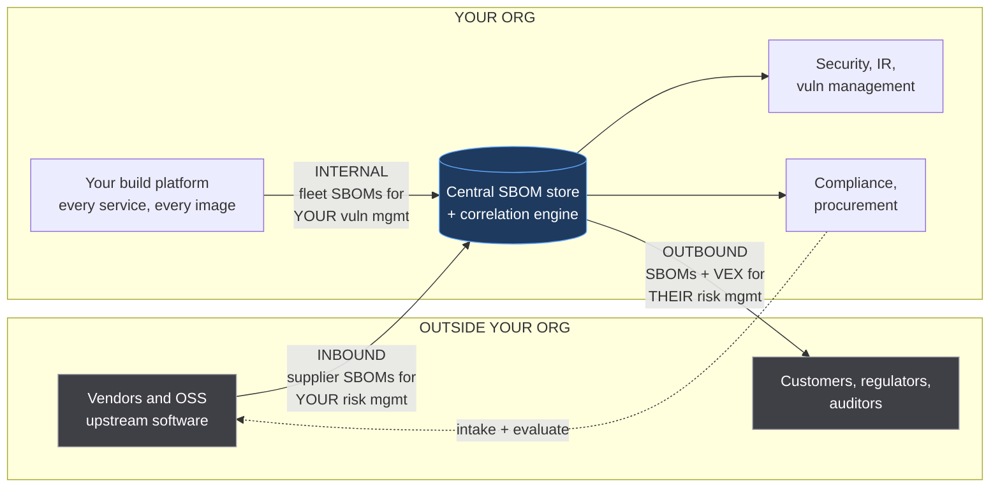
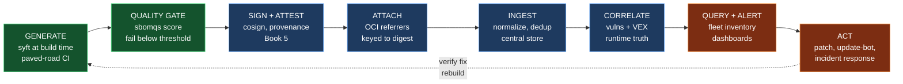
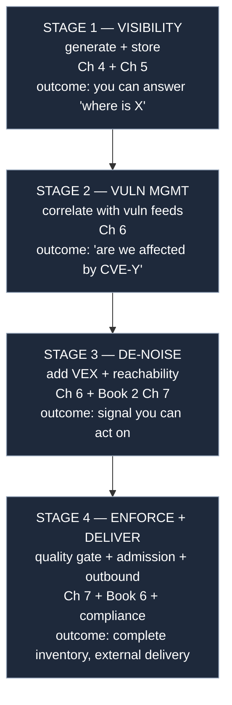
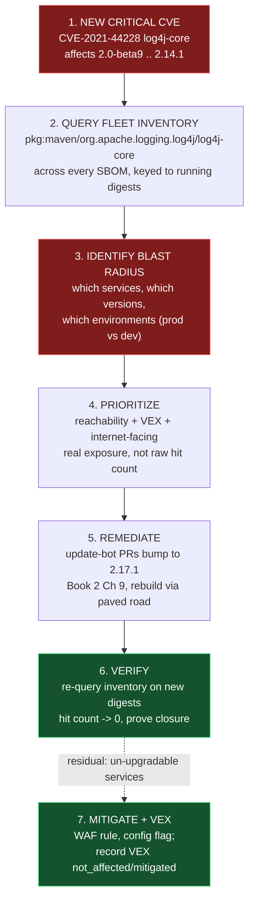
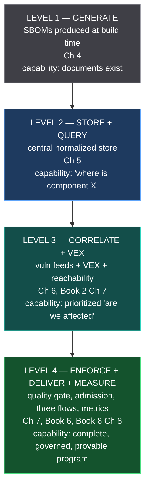

# Chapter 9 — Operationalizing SBOMs in the Enterprise

*What this chapter covers.* The preceding chapters were about documents and pipelines: what an
SBOM is and why regulators want it (Chapter 1), how to express it in SPDX (Chapter 2) or
CycloneDX (Chapter 3), how to generate it at build time (Chapter 4), how to distribute, store,
and query it at scale (Chapter 5), how to correlate it with vulnerabilities and suppress the
noise with VEX (Chapter 6), and how to distrust it appropriately (Chapter 7). This is the
capstone. It stops asking "what is a good SBOM?" and asks the only question an executive
sponsor actually cares about: **what capability does the money buy?** The thesis is blunt.
"We generate SBOMs" is a checkbox that produces landfill — millions of JSON documents nobody
queries, generated to satisfy a clause in a contract, delivering no security value and a false
sense of one. The deliverable is not the documents. The deliverable is a **capability**: the
ability to answer, for your entire fleet, in minutes, "are we affected, where, and in what
environment," and to drive that answer to remediation and prove it. That capability is a
distributed system you build and run, staffed by an owner, fed by a paved road, measured by
metrics that resist gaming, and rolled out the way you roll out any tier-1 dependency. This
chapter is how you build the program around the pipeline.

Learning goals — after this chapter you should be able to:

- Distinguish the **checkbox failure mode** ("we produce SBOMs") from the **capability goal**
  ("we have an SBOM-driven vulnerability-response and transparency function"), and explain why
  every component of Chapters 4–7 must be present for value.
- Frame the SBOM program around **three flows** — inbound (supplier SBOMs for *your* risk),
  internal (fleet SBOMs for *your* vuln management, the largest source of value), and outbound
  (SBOMs you ship to customers and regulators) — sharing one generation substrate but demanding
  different quality bars and access controls.
- Assign **ownership** with a concrete RACI: platform/security runs the platform, app teams own
  per-service quality *through the paved road* rather than by hand, and security/compliance/IR/
  procurement consume.
- Sequence a **crawl-walk-run rollout** — generation+storage, then correlation, then VEX, then
  enforcement and delivery — using warn-then-enforce gating rather than a big-bang mandate.
- Execute the **flagship use case**: a Log4Shell-class rapid-response runbook driven entirely
  off the SBOM platform, and four supporting use cases (license, customer delivery, procurement
  intake, forensics).
- Choose **metrics that measure the capability, not vanity coverage**, govern the sensitive data
  SBOMs contain, and place your program on a four-level **maturity model** mapped to the chapters.

A boundary note. This chapter integrates the whole book, so it references the others constantly
rather than re-deriving them. It leans on the paved-road and program-building material in Book 1,
Chapter 9 — Supply Chain Security in Distributed Backend Systems and Chapter 10 — Building a
Program; on the internal-registry substrate of Book 2, Chapter 8 — Vendoring, Mirroring, and
Internal Registries and the update automation of Book 2, Chapter 9; on Book 4's build platform;
on Book 5, Chapter 3 — Sigstore Architecture for signing; on Book 6, Chapter 6 — Admission
Control and Policy Engines for enforcement; and on Book 8's governance chapters — Chapter 3
(Vendor and Third-Party Software Risk), Chapter 6 (Incident Response for Supply Chain Events),
and Chapter 8 (Metrics, Audits, and Executive Reporting) — for the parts of the program that
live outside engineering.

## The checkbox and the capability

There is a specific, common, expensive way to fail at SBOMs, and almost every organization that
starts does it. A regulation lands — the U.S. Executive Order 14028 self-attestation, an EU CRA
obligation, an FDA premarket requirement, or simply a large customer's procurement questionnaire
(all surveyed in Chapter 1). Someone in security is told "we need SBOMs." They add `syft` to a
handful of CI pipelines, dump the output into an S3 bucket, and report to leadership that the
company "has SBOM coverage." The box is checked. The auditor is satisfied. And the organization
has bought *nothing* — no faster incident response, no fleet visibility, no reduced risk — while
believing it has bought safety. This is worse than doing nothing, because the false confidence
displaces the real work.

The tell is simple: **nobody queries the SBOMs.** An SBOM is a document written for exactly one
moment — when a new vulnerability lands and you need to know if you are exposed. If your SBOMs are
not wired into a system that answers that question, they are not security artifacts; they are
compliance exhaust. Chapter 5 made the point structurally: an SBOM is a normalized inventory
record, worthless in isolation and valuable only in aggregate, queried across the fleet. Chapter 6
added that without VEX the aggregate query drowns you in false positives until you stop trusting
it. Chapter 7 added that without quality gates the query returns clean on the components that will
hurt you most. The program is what assembles all of these into a function that fires when it
matters.

State the goal precisely, because the wording drives everything downstream. The goal is **an
SBOM-driven vulnerability-response and transparency capability.** Unpack it:

- *SBOM-driven* — the inventory of record is derived from build-time SBOMs, not from a
  best-effort periodic scan or a spreadsheet a team updates by hand.
- *vulnerability-response* — the primary consumer is your own incident response, continuously and
  during crises: the Log4Shell capability. This is where the value is, and it points *inward*.
- *transparency* — the secondary consumers are customers, regulators, and auditors who need to
  see into your software, and suppliers whose software you need to see into. This points *outward*
  and *inward* respectively, and it is the part regulation forces but not the part that pays.
- *capability* — a running system with an owner, an SLO, and a budget, not a pile of files.

Everything in this chapter is in service of turning the checkbox into the capability. And the
first move is to see that the capability is not one flow of documents but three.

## Three flows: inbound, internal, outbound

An SBOM is a description of software, and software crosses your organizational boundary in both
directions. That gives three distinct flows, and conflating them is the second-most-common
program design error (the first being generating without consuming). Each flow has a different
producer, a different consumer, a different quality bar, and a different access-control posture,
and a mature program handles all three off one shared generation-and-storage substrate.



**Internal flow — the fleet.** This is the flow that pays for the program. Every service you
build produces an SBOM at build time on the paved road (Chapter 4), the SBOMs land in the central
store (Chapter 5), and they are correlated against vulnerability feeds and VEX (Chapter 6). The
consumer is *you*: your vulnerability-management team, your incident responders, your on-call
during a Log4Shell. The quality bar is set by your own query needs — component-and-version
coverage and valid purls above all, per Chapter 7's fitness-for-purpose framing — and you control
it end to end because you generate these SBOMs yourself. This flow is where SBOMs stop being
compliance and become a live operational tool used every week, not every audit. If you build
nothing else, build this.

**Inbound flow — suppliers.** Software you did not build enters your estate: commercial products,
open-source you consume as binaries, container base images, appliances, SaaS you self-host. Their
risk is your risk, and their SBOMs — *if they provide them* — let you fold that software into the
same fleet inventory. The hard truths of this flow are covered in depth in Book 8, Chapter 3
(Vendor and Third-Party Software Risk); operationally, three problems dominate. First, **absence**:
many vendors still ship no SBOM, and your program needs a policy for the gap (require it in the
contract, generate one yourself from the delivered artifact, or accept the blind spot explicitly
and record it). Second, **quality**: a vendor's SBOM is subject to every failure mode in
Chapter 7, and you did not control its generation, so you must score it on intake (sbomqs,
ntia-conformance-checker) and treat a low score as a risk signal about the vendor, not just about
the document. Third, **normalization**: their SBOM arrives in whatever format and identifier
scheme they chose, and your store must ingest SPDX and CycloneDX alike and reconcile their purls
and CPEs with yours (Chapter 5's normalization problem, now with an adversarially indifferent
producer). Inbound SBOMs are lower-trust and lower-quality than internal ones, and the program
must model that difference rather than dumping everything into one undifferentiated table.

**Outbound flow — customers and regulators.** SBOMs you *ship*: to a customer whose procurement
demands one, to a regulator under CRA or FDA, to an auditor. Here the quality bar is highest
because the document leaves your control and represents you — it must be format-conformant, carry
the NTIA minimum elements, be signed for provenance (Book 5), and travel with a VEX document so
the recipient does not open thousands of tickets against components you have already assessed as
not-affected (Chapter 6 made this the difference between a useful delivery and a support-ticket
generator). It also must be **redacted**: an internal SBOM reveals your architecture, and you do
not hand your customers a map of your dependency graph without deciding what to omit. Same
generation substrate as the internal flow, different — stricter, redacted, signed — treatment on
the way out.

The design consequence: **one generation-and-storage substrate, three treatments.** You generate
once, on the paved road, at the highest internal quality you can. Internal consumption reads it
raw; outbound delivery redacts, conforms, signs, and attaches VEX; inbound ingestion is a
separate lower-trust path into the same store. Teams that stand up three separate tools for three
flows end up with three inconsistent inventories and no single answer to "are we affected." The
store is the point of convergence.

## The operational pipeline

Chapters 4 through 7 each owned one stage of a pipeline. Operationalizing means running the whole
pipeline as one system with the seams welded shut — every stage automatic, every handoff on the
paved road, every artifact keyed to an immutable digest so it can be found again.



Three properties make this a *pipeline* rather than a set of tools someone runs by hand.

- **Build-time generation, not scan-time.** The SBOM is produced by the build that produced the
  artifact, from the same inputs, so it describes exactly what shipped — the freshness property
  Chapter 7 insisted on. A scanner run later against a registry sees only what it can reverse from
  the binary and inherits every accuracy failure of after-the-fact analysis.
- **Digest as the join key.** Everything downstream — the signature, the SBOM attestation, the
  correlation record — is keyed to the artifact's content digest (`sha256:...`), the same key the
  OCI referrers API uses to attach the SBOM to the image (Chapter 5). This is what lets you answer
  "what is in the thing that is actually running" instead of "what is in the thing named
  `latest`," which is a different and usually wrong question.
- **Runtime truth, not just build truth.** The last correlation step joins the built inventory to
  what is *deployed*. An SBOM store that knows what you built but not what is running answers the
  archaeological question, not the operational one. Joining to the orchestrator (which digests are
  scheduled, in which clusters, in which environments) turns "we once built something with Log4j"
  into "these 14 running services in prod expose it." That join is the single highest-leverage
  integration in the whole platform, and it is the one most programs skip.

## Building the program: ownership

A capability without an owner decays into a checkbox. The first organizational question is not
"which tool" but "whose job." SBOMs cut across platform engineering, security, compliance,
procurement, and every app team, and diffuse ownership is how programs die — everyone assumes
someone else runs the store, nobody funds it, and it rots into a stale bucket. Assign it
explicitly. The pattern that works at scale mirrors Book 1, Chapter 10's paved-road model:
a central team *owns and operates the platform as a product*, and app teams *consume it* without
having to become SBOM experts.

| Responsibility | Platform/Security (platform team) | App teams | Security IR / VulnMgmt | Compliance / Procurement |
| --- | --- | --- | --- | --- |
| Run the SBOM store + correlation service | **R/A** | I | C | I |
| Provide paved-road generation + quality gate | **R/A** | C | I | I |
| Per-service SBOM quality (in practice) | **A** (via paved road) | **R** (fix flagged gaps) | I | I |
| Vulnerability triage + VEX authoring | C | C (app knowledge) | **R/A** | I |
| Drive remediation / patching | C | **R** | **A** | I |
| Outbound SBOM delivery to customers | C | I | I | **R/A** |
| Inbound supplier SBOM intake + scoring | C | I | C | **R/A** |
| Program metrics + executive reporting | C | I | C | **R/A** |

(R = responsible, A = accountable, C = consulted, I = informed.)

The load-bearing idea in this table is the third row. **App teams are responsible for per-service
SBOM quality, but only through the paved road** — not by writing SBOMs, running tools, or learning
SPDX. The platform generates a quality SBOM automatically for every service on the standard build;
the app team's residual responsibility is narrow: when the quality gate flags a gap the platform
*cannot* fix generically (a vendored C library the generator can't see, a shaded JAR, per
Chapter 7's systematic-accuracy failures), the team that owns that code supplies the missing
knowledge. Make app teams responsible for SBOM quality *without* the paved road and you have asked
five hundred teams to each become mediocre SBOM engineers, and will get five hundred inconsistent,
high-effort SBOMs. The paved road is what makes the RACI survivable.

The corollary is a funding reality Book 8, Chapter 8 will quantify: the platform team needs
headcount to run the store as tier-1 infrastructure, and that budget competes with feature work.
The argument that wins it is the flagship use case — one hour of a company-wide Log4Shell scramble
avoided pays for the platform — so instrument the program to *show* that value, which brings us to
metrics later.

## Building the program: the paved-road integration

The technical heart of the program is making a quality SBOM a *free, inherited, unavoidable*
side effect of building software. This is the paved-road pattern from Book 1, Chapters 9 and 10
applied to SBOMs: the golden path is so easy and so default that using it is less work than
avoiding it, and the security property comes along for free because it is baked into the shared
build, not bolted onto each service.

Concretely, the shared CI template — the reusable GitHub Actions workflow, the Tekton task, the
internal build wrapper (Book 4) — that every service already inherits for building and pushing its
image gains a few steps. Every service that builds the standard way gets them without touching
its own pipeline:

```yaml
# The shared, inherited build workflow — every service calls this, not its own copy.
# Adding SBOM generation here gives it to the whole fleet at once.
jobs:
  build-and-attest:
    steps:
      - uses: ./build-image        # existing: produces IMAGE_DIGEST

      # 1. Generate at build time, from the built image, keyed to its digest.
      - name: Generate SBOM
        run: syft "${IMAGE}@${IMAGE_DIGEST}" -o cyclonedx-json=sbom.cdx.json

      # 2. Quality gate (Chapter 7). Fail the build below threshold.
      - name: Score SBOM quality
        run: |
          sbomqs score sbom.cdx.json --json > score.json
          score=$(jq '.files[0].avg_score' score.json)
          echo "SBOM quality score: ${score}"
          awk -v s="$score" 'BEGIN{exit !(s>=7.0)}' \
            || { echo "SBOM quality ${score} below threshold 7.0"; exit 1; }

      # 3. Sign + attest the SBOM as an in-toto attestation, keyed to the digest (Book 5).
      - name: Attest SBOM
        run: |
          cosign attest --yes --predicate sbom.cdx.json \
            --type cyclonedx "${IMAGE}@${IMAGE_DIGEST}"

      # 4. Push SBOM to the central store, keyed to digest, for fleet-wide query.
      - name: Ingest into SBOM platform
        run: |
          curl -sf -X POST "${SBOM_STORE}/v1/sboms" \
            -H "Authorization: Bearer ${OIDC_TOKEN}" \
            -F "digest=${IMAGE_DIGEST}" -F "sbom=@sbom.cdx.json"
```

Four properties of this arrangement matter more than the exact commands:

```yaml
# Kyverno policy (Book 6, Ch 6): no SBOM attestation, no admission.
apiVersion: kyverno.io/v1
kind: ClusterPolicy
metadata:
  name: require-sbom-attestation
spec:
  validationFailureAction: Enforce      # start as Audit, promote to Enforce (warn-then-enforce)
  rules:
    - name: check-sbom-attestation
      match:
        any:
          - resources: { kinds: [Pod] }
      verifyImages:
        - imageReferences: ["registry.internal/*"]
          attestations:
            - type: https://cyclonedx.org/bom
              conditions:
                - all:
                    - key: "{{ regex_match('(?i)cyclonedx', '{{ predicateType }}') }}"
                      operator: Equals
                      value: true
```

This is the closed loop that defeats the checkbox failure: generation is inherited, quality is
gated, provenance is signed, and admission enforces presence. No team has to care, and the
inventory is complete anyway.

## Rollout: crawl, walk, run

You cannot flip all of this on at once. A big-bang mandate — "every service must have a
signed, quality-gated, VEX-annotated SBOM by Q3, enforced at admission" — fails the way every
big-bang security mandate fails: it breaks builds the platform team didn't anticipate, generates
a revolt, and gets rolled back, poisoning the well for the real rollout. Sequence it, and gate
each stage warn-then-enforce, exactly as Book 1, Chapter 10 prescribes for any fleet-wide control.
The sequence is not arbitrary; each stage is worthless without the one before and unusable without
becoming the substrate for the one after.



## Use cases realized

Maturity is measured in use cases served, not documents stored. Here are five, flagship first.

### Flagship: rapid vulnerability response

This is the use case that justifies the program, and it is worth walking end to end because it
exercises every stage of the pipeline under time pressure. The scenario is Log4Shell (CVE-2021-44228,
disclosed December 2021, a trivially exploitable unauthenticated RCE in the near-ubiquitous
`log4j-core`, described in detail in Book 1, Chapter 5). The lived experience of that incident,
for organizations without an SBOM platform, was days-to-weeks of manual archaeology: every team
grepping its own build files, no central answer, no way to know when you were done. The whole
point of the program is to turn that scramble into a query.



Walk the runbook with the platform:

1. **The CVE lands.** `log4j-core`, purl `pkg:maven/org.apache.logging.log4j/log4j-core`,
   vulnerable range `>=2.0-beta9, <2.15.0` (later widened as the fix itself needed fixing —
   2.15, then 2.16, then 2.17.1). Your correlation engine already pulls the advisory from OSV/GHSA
   the moment it publishes.

2. **Query the fleet.** One query against the store, matching that purl across every service's
   most-recent SBOM, joined to the orchestrator so it returns *running* digests, not just built
   ones:

   ```sql
   -- Fleet inventory query: who is running a vulnerable log4j-core, right now, where?
   SELECT s.service, s.version, d.environment, c.version AS log4j_version
   FROM   sbom_components c
   JOIN   sboms s        ON c.sbom_digest = s.digest
   JOIN   deployments d  ON d.image_digest = s.digest          -- runtime truth
   WHERE  c.purl_name = 'pkg:maven/org.apache.logging.log4j/log4j-core'
     AND  semver_in_range(c.version, '>=2.0-beta9,<2.15.0')
     AND  d.state = 'running'
   ORDER  BY d.environment, s.service;
   ```

   The answer comes back in the time the query takes to run — minutes, not days. This single
   capability is the difference between the program and the checkbox, and it is why the internal
   flow is where the value lives.

3. **Identify the blast radius.** The result set *is* the blast radius: exact services, exact
   versions, exact environments. Note what the SBOM alone cannot tell you and Chapter 7 warned
   about — a service that statically shaded log4j into an uber-JAR may not appear if your generator
   missed it, which is precisely why the quality gate and the known-blind-spot catalog exist. The
   honest program hands IR the query result *and* the list of pipeline blind spots so responders
   know where to look manually.

4. **Prioritize.** Raw hit count is not a work queue. Layer on Chapter 6's VEX and Book 2,
   Chapter 7's reachability: a service that bundles log4j but never calls the vulnerable JNDI
   lookup path, or runs with `log4j2.formatMsgNoLookups=true`, is a lower priority than an
   internet-facing service that logs user-controlled input. Sort by real exposure — internet-facing
   × reachable × prod — so the responders spend the first hour on the services that can actually be
   popped.

5. **Remediate.** Drive fixes through the update automation of Book 2, Chapter 9: the platform
   opens dependency-bump PRs (bumping to 2.17.1) across the affected services, they rebuild on the
   paved road, and the paved road regenerates and re-ingests the SBOM automatically — closing the
   loop back to stage 1 of the pipeline.

6. **Verify.** Re-run the same query. As fixed services redeploy on new digests, the hit count
   falls toward zero, and you have something the 2021 scramble never had: *proof of closure*, a
   number you can watch reach zero and report to leadership as "done" with evidence rather than
   hope.

7. **Handle the residual.** Some services can't upgrade immediately (a frozen release, a vendor
   dependency). Mitigate them out-of-band (WAF rule, the config flag) and *record the mitigation
   as VEX* (`status: not_affected` with justification, or `affected` with a mitigation note) so
   the next query and the next auditor see that the residual is known and managed, not forgotten.

Every stage of the program earns its keep here: generation (the inventory exists), storage and
query (the answer is fast), correlation (the CVE maps to components), VEX and reachability (the
answer is prioritized), runtime join (the answer is about what's running), update automation (the
fix ships), and verification (closure is proven). Remove any one and the runbook degrades to
archaeology.

### License compliance across the fleet

The same inventory answers a different question with a different consumer. Legal or an open-source
program office needs to know the fleet's license exposure — where GPL-family or other
copyleft/commercial-incompatible licenses appear, especially in software you distribute. Because
the SBOM already carries per-component license fields (Book 1, Chapter 8 covers the license model
in depth), this is another query against the same store:

```sql
SELECT s.service, c.name, c.version, c.license
FROM   sbom_components c JOIN sboms s ON c.sbom_digest = s.digest
WHERE  c.license SIMILAR TO '%(GPL|AGPL|SSPL)%'
  AND  s.distributed = true;      -- exposure matters most in shipped software
```

The operational point is reuse: you built the store for vuln response, and license compliance
falls out for near-zero marginal cost. A program that stood up a separate license scanner and a
separate vuln scanner with separate inventories has two partial truths; the SBOM program has one
inventory answering both.

### Customer and regulator delivery

The outbound flow, realized. A customer's procurement team or a regulator (CRA, FDA) demands an
SBOM for a product you ship. The delivery is not "email them the raw internal SBOM." It is a
pipeline of its own: pull the signed SBOM for the exact shipped digest from the store, **redact**
internal-only detail per your data-governance policy (below), **conform** it to the required format
and the NTIA minimum elements (Chapter 1), attach the current **VEX** so the customer doesn't
open a ticket for every unreachable CVE (Chapter 6), and deliver it signed (Book 5) so the
recipient can verify provenance. The quality bar here is the strictest of the three flows because
the artifact represents you to an outside party and to a regulator; a malformed or unsigned
outbound SBOM is a compliance finding waiting to happen.

### Procurement and vendor SBOM intake

The inbound flow, realized, and the operational half of Book 8, Chapter 3. When you onboard a
vendor or a new open-source binary dependency, request their SBOM as part of procurement, ingest
it into the same store on the lower-trust inbound path, and **score it on arrival** (sbomqs,
ntia-conformance-checker — Chapter 7). The score is a decision input two ways: a low-quality or
absent SBOM is a data point about the vendor's own supply-chain maturity, and it tells you how much
you can trust the resulting inventory rows. When the vendor ships no SBOM at all, the policy is
explicit rather than silent: require it contractually going forward, generate one yourself from the
delivered artifact (accepting that after-the-fact generation inherits Chapter 4's accuracy limits),
or record the blind spot. The failure mode to avoid is a store that silently mixes high-trust
internal rows with unlabeled low-trust vendor rows, so that a Log4Shell query returns an answer you
cannot calibrate.

### Forensics, audit, and M&A

The inventory is also a historical record, and three consumers want history. **Incident forensics**
(Book 8, Chapter 6): after a compromise you need to know exactly what was in a given artifact at a
given time — the store, keyed to immutable digests and retaining historical SBOMs, answers "what
was running in prod on the day of the breach" without reconstruction. **Audit**: an auditor asking
"show me you knew your components" gets a query result and a retention history rather than a
promise. **M&A due diligence**: acquiring a company, you want its fleet's component and license
exposure before you sign; if it runs an SBOM program you can ingest and query it, and if it does
not, the absence is itself diligence signal. In every case the value is the same — the inventory of
record, retained over time, keyed to what actually shipped.

## Metrics and governance

### Metrics that measure the capability, not the checkbox

Chapter 7 warned that "100% SBOM coverage" is a coverage metric masquerading as a visibility
metric. The program's metrics must resist that game. The governing distinction, developed fully in
Book 8, Chapter 8, is **leading vs lagging**: leading indicators (coverage, quality, VEX presence)
predict whether the capability *will work* when you need it; lagging indicators (time-to-inventory,
time-to-remediate) measure whether it *did work*. A program that reports only leading metrics is
claiming readiness it has never tested; one that reports only lagging metrics learns of gaps only
during incidents. Track both.

| Metric | Type | What it measures | The vanity trap it replaces |
| --- | --- | --- | --- |
| **Quality-weighted coverage** | Leading | % of running artifacts with a *current, quality-gated* SBOM (score ≥ threshold), not merely "an SBOM" | "100% have an SBOM" — counts landfill as coverage |
| **SBOM quality distribution** | Leading | The full histogram of sbomqs scores across the fleet, watching the tail | A single average that hides the unqueryable long tail |
| **Runtime-join coverage** | Leading | % of running digests joined to an SBOM (built truth = running truth) | "We built SBOMs" while inventory ≠ what's deployed |
| **VEX coverage** | Leading | % of open findings with a VEX status | Raw open-finding count that teams have learned to ignore |
| **Inbound-SBOM coverage** | Leading | % of vendors/third-party artifacts with an ingested, scored SBOM | Counting only what you built; ignoring supplier blind spots |
| **MTTR-to-inventory** | Lagging | Time from a new CVE to a fleet-wide "are we affected, where" answer | Not measured at all in checkbox programs |
| **MTTR-to-remediate** | Lagging | Time from identification to verified fix across affected services | Ticket-close counts detached from real closure |

Two disciplines around this table. First, **quality-weight every coverage number** — counting a
schema-perfect-but-empty SBOM (Chapter 7) as covered is precisely the vanity metric the book warns
against; count only SBOMs that would actually *answer the query*. Second, **treat MTTR-to-inventory
as the headline capability metric.** It directly measures the Log4Shell capability, it justifies
the platform's budget to the sponsor who signs off on headcount, and a checkbox program cannot
produce it because it has never run the query. Rehearse it: periodically pick a random component,
run the fleet query, and time it. That drill is to the SBOM program what a fire drill is to a
building — the only way to know the capability is real before the day you need it.

### Data governance: the SBOM is sensitive

An SBOM is a map of your software's internals — its dependencies, versions, and by inference its
architecture, its build tooling, and sometimes internal component and service names. That map is
useful to you and useful to an attacker, who can read your outbound SBOM to learn exactly which
vulnerable versions to target. So the program needs a data-governance posture, not an open bucket:

- **Access control on the store.** Internal SBOMs are internal data. The store enforces
  authorization the way any sensitive datastore does; not every engineer needs to query the whole
  fleet's dependency graph, and the query logs are themselves a signal.
- **Internal vs external is a deliberate boundary.** Decide explicitly what leaves the org. The
  internal flow can carry everything; the outbound flow carries a curated subset.
- **Redaction for customer-facing SBOMs.** Strip internal-only components, internal service and
  path names, and infrastructure detail from outbound SBOMs, keeping what the customer legitimately
  needs (the third-party and open-source components whose risk they are assessing) and omitting the
  parts that are purely a map of your internals. The regulation asks for transparency into the
  software you ship, not a blueprint of your estate.

The tension is real: transparency is the point of an SBOM, and redaction cuts against it. Resolve
it per-consumer rather than globally — maximal transparency internally where the SBOM is a tool,
calibrated transparency externally where it is a disclosure — which is exactly why the three-flow
model keeps the treatments separate.

## Common pitfalls

The failure modes cluster, and naming them is cheaper than living them:

Every one of these is a way of having the parts without the capability. The program is precisely
the work of assembling the parts so the capability emerges.

## The maturity model

Put it together as a ladder. Each level is a coherent capability plateau, mapped to the chapters
that build it, and — critically — each level is *worth reaching and stopping at* if that is your
budget, but only in order. Skipping a rung produces a program with expensive stage-4 outbound
delivery sitting on a stage-1 inventory nobody can query.



| Level | Capability | Key mechanisms | Chapters | Honest self-assessment |
| --- | --- | --- | --- | --- |
| **1 — Generate** | SBOMs exist for built artifacts | Build-time generation (`syft`), OCI attach | Ch 4 | "We have SBOMs" — the checkbox; zero query value if you stop here |
| **2 — Store + Query** | Answer "where is component X" fleet-wide | Central store, normalization, dedup, digest keys | Ch 5 | First real value; you could survive a Log4Shell manually-ish |
| **3 — Correlate + VEX** | Prioritized "are we affected by CVE-Y" | Vuln feeds, VEX suppression, reachability, runtime join | Ch 6, Book 2 Ch 7 | The Log4Shell capability is real and de-noised |
| **4 — Enforce + Deliver + Measure** | Complete inventory by construction; governed three-flow program; provable | Quality gate, admission control, outbound/inbound flows, metrics, governance | Ch 7, Book 4, Book 5, Book 6, Book 8 | A capability, not a checkbox; measured, funded, drilled |

Most organizations that "have SBOMs" are at Level 1 and believe they are done. The distance from
Level 1 to Level 3 is the distance from the checkbox to the capability, and it is almost entirely
platform-and-process work — the documents were already there at Level 1. Level 4 is where the
program becomes durable: complete by construction (admission enforcement), trustworthy (quality
gate), governed (the three flows with their access controls), and provable (metrics and drills).
Know your level, and climb it in order.

## Distributed-systems lens

The reframing this whole chapter argues for is that **the SBOM platform is a tier-1 internal
distributed system, and the documents are just its records.** Look at what you actually build to
operationalize SBOMs and it is unmistakably a distributed backend system of exactly the kind this
reader builds for a living:

- **An ingestion pipeline** running at fleet scale — every build of every service emits an SBOM,
  which is a high-fan-in write path with the usual concerns: backpressure when a monorepo's
  thousand services all rebuild at once, idempotency so a retried CI job doesn't double-write,
  schema evolution as SPDX and CycloneDX versions drift.
- **A normalized datastore** — the reconciliation of SPDX and CycloneDX, of purls and CPEs, of
  internal and inbound sources, into one queryable inventory, which is a data-modeling and
  entity-resolution problem (Chapter 5) with the added twist that the identifiers are unreliable
  (Chapter 7).
- **A correlation service** joining that inventory against continuously-updated external feeds
  (OSV, NVD, GHSA) and internal VEX — a streaming join between your slowly-changing inventory and a
  fast-changing vulnerability stream, with the freshness and consistency questions any such join
  raises.
- **A query and alerting layer** that must answer the fleet-wide "are we affected" in minutes under
  incident load — a latency SLO on the one query that matters most, precisely when the system is
  under the most stress and attention.

And it lives at the center of a graph of integrations that are themselves the org's core
infrastructure: joined to the **orchestrator** for runtime truth (what is running, where), to the
**internal registry and proxy** (Book 2, Chapter 8) and the **build platform** (Book 4) for
generation, to the **signing infrastructure** (Book 5) for provenance, and to the **admission
controller** (Book 6) for enforcement. It is not a side project bolted onto security; it is a
node in the same dependency graph as your service mesh and your CI system, with the same
availability expectations during an incident.

The payoff is the thing that makes it worth building as real infrastructure rather than a
spreadsheet: **one query answers "are we affected" for every service at once.** That property —
fleet-wide, in minutes, with a proof of closure — does not exist at any smaller scale of effort.
You cannot get it from per-team greps, from periodic scans, or from a compliance bucket. You get
it only by building the platform. And that is the whole argument of the book in one sentence:
the deliverable of an SBOM program is not the bill of materials. It is the *capability the bill of
materials makes possible* — retroactive, fleet-wide, provable transparency and response — and that
capability is a distributed system you build, run, staff, measure, and drill like any other tier-1
dependency. The documents are the substrate. The capability is the product.

## Key takeaways

- **The deliverable is a capability, not documents.** "We generate SBOMs" is a checkbox that
  produces landfill; the goal is "we can answer, fleet-wide, in minutes, are we affected, where, and
  in what environment — and prove the fix." If nobody queries the SBOMs, you have bought nothing but
  false confidence.
- **Value requires the whole book.** Generation (Ch 4) without storage/query (Ch 5) is sprawl;
  query without correlation (Ch 6) is inventory trivia; correlation without VEX is unactionable
  noise; all of it without quality gates (Ch 7) is false confidence. The program is the assembly.
- **Three flows, one substrate.** Internal (fleet vuln management — where the value is), inbound
  (supplier SBOMs, lower-trust, scored on intake — Book 8 Ch 3), and outbound (customer/regulator
  delivery, strictest bar, redacted and signed). Generate once; treat differently per flow.
- **Own it explicitly and pave the road.** A central platform team runs the store as a product;
  app teams get quality SBOMs for free from the inherited build; admission control (Book 6 Ch 6)
  makes shipping without a signed SBOM impossible, so the inventory is complete by construction.
- **Roll out crawl-walk-run, warn-then-enforce.** Visibility → correlation → VEX de-noising →
  enforce-and-deliver. Every gate ships in audit mode and flips to enforce only once the paved road
  already produces a passing SBOM with near-zero team effort.
- **Rapid vuln response is the flagship.** New CVE → fleet query joined to runtime truth →
  prioritize with reachability and VEX → drive fixes via update automation (Book 2 Ch 9) → re-query
  to prove closure. This turns a Log4Shell scramble from an archaeological dig into a database query.
- **Measure the capability, not vanity coverage.** Quality-weighted coverage, quality distribution,
  runtime-join coverage, VEX coverage, and above all MTTR-to-inventory (rehearsed as a drill). Never
  let "100% have an SBOM" masquerade as visibility.
- **Govern the data.** SBOMs map your internals and help attackers too; access-control the store,
  keep the internal/external boundary deliberate, and redact outbound SBOMs to disclose the
  third-party risk your customer needs without handing over a blueprint of your estate.
- **The platform is a tier-1 distributed system.** An ingestion pipeline, a normalized datastore, a
  streaming correlation join, and a low-latency query layer, integrated with the orchestrator, the
  registry, the build platform, and the admission controller. Build it, staff it, and drill it like
  any other core dependency.

## Further reading

- **CISA**, "Software Bill of Materials (SBOM)" resource hub and the SBOM community working-group
  outputs (Sharing & Exchanging, SBOM Types, Framing) — the evolving practice-and-process side of
  operationalization, beyond the document formats.
- **NTIA**, "The Minimum Elements for a Software Bill of Materials (SBOM)," 12 July 2021 — the
  outbound-delivery floor and the crucial concept of *known unknowns* for the blind-spot catalog.
- **OWASP Software Component Verification Standard (SCVS)** and its **BOM Maturity Model** — a
  vendor-neutral rubric that formalizes the maturity progression this chapter sketches.
- **U.S. Executive Order 14028** and the subsequent OMB M-22-18 / M-23-16 self-attestation guidance
  — the regulatory driver behind the outbound flow, and a cautionary source of checkbox pressure.
- **EU Cyber Resilience Act (CRA)** — SBOM and vulnerability-handling obligations for products with
  digital elements; a concrete forcing function for the outbound and internal flows both.
- **Dependency-Track** (OWASP) — a reference open-source implementation of the store-plus-correlate
  layers (Levels 2–3); read its architecture to see the ingestion/normalization/correlation split
  as a real system.
- **OpenVEX** and the **CSAF / CycloneDX VEX** profiles — the de-noising layer that makes correlation
  actionable (Chapter 6), and a required companion to any outbound delivery.
- **Sigstore / cosign** documentation on attestations and the **OCI referrers API** — how SBOMs are
  signed, attached to digests, and made trustworthy in transit (Book 5, Chapter 3).
- **Kyverno** and **OPA/Gatekeeper** image-verification documentation — the admission-control
  mechanism that enforces SBOM presence at deploy time (Book 6, Chapter 6).
- **The Log4Shell (CVE-2021-44228) retrospectives** — read several accounts of the December 2021
  response specifically for the *inventory problem*: the organizations that suffered longest were the
  ones that could not answer "where do we run this," which is the exact gap this program closes.
