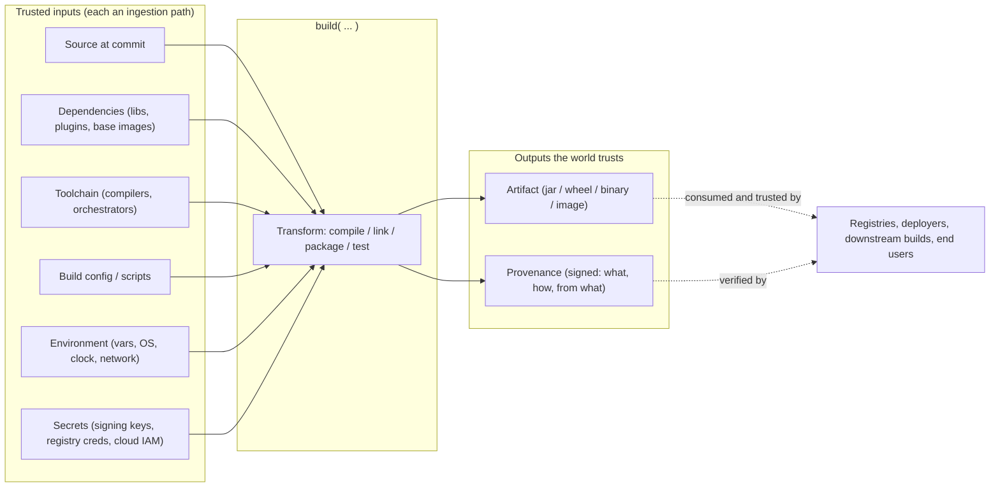
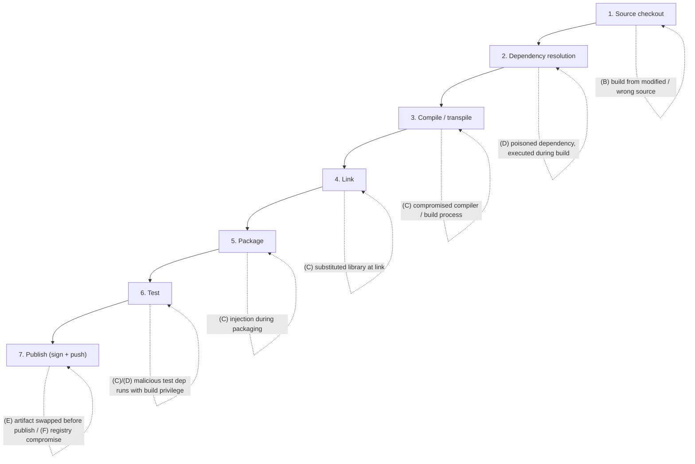
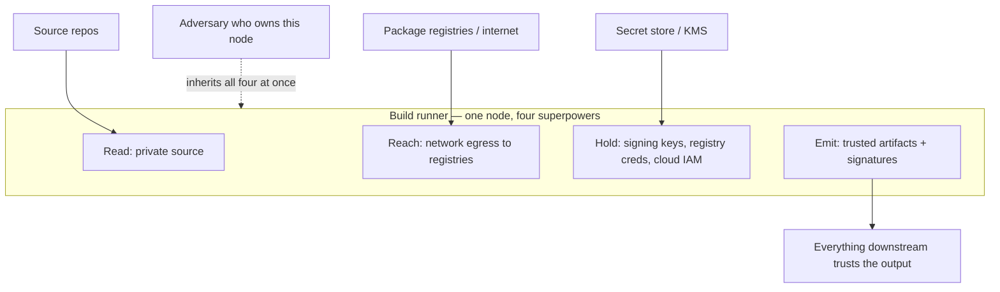
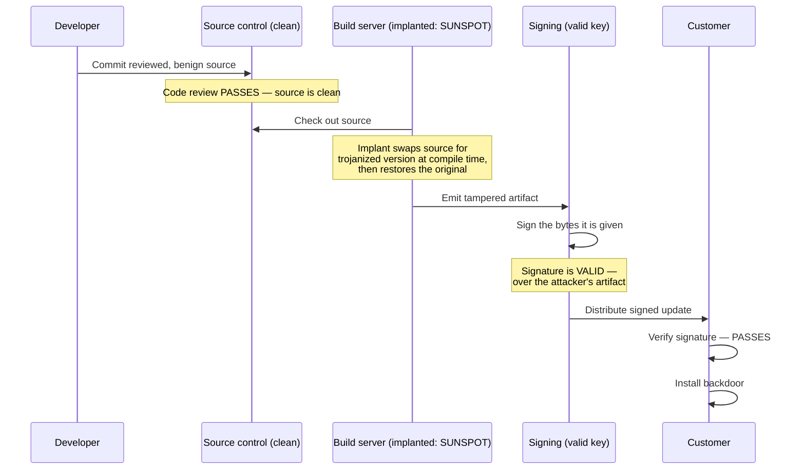

# Chapter 1 — Build Systems: Architecture and Threat Model

*What this chapter covers.* This is the opening chapter of Book 4, and it establishes the
object of study for the entire book: the **build system** — the machinery that turns source
code into the artifacts you ship. Book 1, Chapter 3 argued that the build is the
highest-leverage point in the whole supply chain, using SolarWinds as the proof. This
chapter takes that claim apart mechanically. We define precisely what a build *is* (a
function with a large, mostly-invisible set of trusted inputs), walk its anatomy stage by
stage, and then build a rigorous threat model aligned to **SLSA v1.0**'s supply-chain
threats. The recurring theme is that the build environment is the single most
over-privileged, over-trusted node in your production pipeline — it holds source, reaches
the network, carries signing keys and cloud credentials, and emits artifacts the rest of
the world will trust on sight — and that this concentration of privilege is exactly what
makes it the apex target. We close by laying out the seven pillars of build security that
the rest of Book 4 develops, and by taking the distributed-systems view: at fleet scale
your build farm is a shared, tier-0 concentration point — your own internal SolarWinds
waiting to happen.

Learning goals — after this chapter you should be able to:

- Model a build precisely as a **function**: enumerate its inputs (source, dependencies,
  toolchain, build config, environment, secrets), its transformation, and its outputs
  (artifacts and provenance), and reason about which trust relationships flow through it.
- Decompose a build into its **stages** — checkout, dependency resolution, compilation,
  linking, packaging, testing, publishing — and identify the tamper point each stage
  exposes.
- Explain why the **toolchain itself is a dependency**, and connect this to the
  Trusting Trust problem (Book 1, Chapter 6; Book 7, Chapter 5).
- Map the **SLSA v1.0 build-relevant threats** — (B) building from modified source,
  (C) compromising the build process, (D) using a poisoned dependency, (E) tampering with
  the artifact before publication, (F) compromising the registry — and place the source-side
  (A) and consumer-side (G/H) threats in context.
- Articulate why the build environment is a **maximally-privileged, maximally-trusted
  node**, and why its compromise defeats *both* source review *and* code signing — the
  SolarWinds/SUNSPOT lesson.
- Explain why builds are genuinely **hard to secure**: they legitimately execute arbitrary
  code, they are non-deterministic by default, and convenience pulls against isolation.
- Name the **seven pillars** of build security and map each to the chapter of Book 4 that
  develops it, and to the SLSA build levels (Chapter 3).

A note on scope. This chapter is deliberately about *what a build is* and *what can go
wrong*, not yet *how to fix it*. Every control mentioned here is a forward reference to a
later chapter; the point is to establish the map before we walk the territory.

## The build as a function

The most useful mental model of a build is the simplest one: a **build is a pure function**
that you *wish* were pure. It takes a set of inputs and produces a set of outputs, and the
central security question is always the same — *what feeds this function, and who trusts its
result?*

Write it out:

```
artifact, provenance = build(source, dependencies, toolchain, config, environment, secrets)
```

Six input classes. Most engineers, asked to name the inputs to their build, will say
"the source code." That answer is off by roughly five categories, and every category they
forget is an ingestion path an attacker can use.

- **Source** — the code in version control, at a specific commit. This is the input people
  think about, the one code review and branch protection guard (Book 7). It is also,
  historically, the *least* likely input to be tampered with in a serious build compromise,
  precisely because it is the most watched.
- **Dependencies** — the third-party code the build pulls in: libraries, modules, base
  images, build plugins. This is Book 2's entire subject. Crucially, dependencies are not
  passive data during a build — many of them *execute* (we return to this below).
- **Toolchain** — the compilers, interpreters, linkers, and build orchestrators that perform
  the transformation. The toolchain is code too, and it is a dependency like any other, only
  one that runs with the build's full authority.
- **Config / build scripts** — the `Makefile`, `pom.xml`, `build.gradle`, `BUILD` file,
  `package.json` scripts, `Dockerfile`, or CI YAML that *directs* the transformation. This
  input is executable by design; changing it changes what the build does.
- **Environment** — everything ambient: environment variables, the OS image and its
  installed packages, the clock, the working directory, the network, CPU architecture,
  locale. These are inputs even though nobody declares them, which is exactly what makes
  them dangerous (Chapter 2 on hermeticity).
- **Secrets** — signing keys, registry credentials, cloud IAM tokens, deploy keys. Secrets
  are a peculiar input: they do not usually change the *bits* of the artifact, but they
  authorize the build to *speak with authority* — to sign, to publish, to deploy.

The transformation in the middle — compile, link, package, test — is where source becomes
artifact. And the output is not one thing but ideally two: the **artifact** (the jar, wheel,
binary, container image) and its **provenance** (a signed statement of *what was built, from
what inputs, by which builder, how*). Provenance is the output most builds omit today;
producing it is the entire subject of SLSA and of Chapter 3.

The security semantics of this function are captured in one sentence: **everything that
feeds the build is trusted by the output, and everything the output feeds trusts the
build.** The artifact inherits the trustworthiness of the *least* trustworthy input. If any
one of source, a single transitive dependency, the compiler, a Gradle plugin, an environment
variable, or a build-server process is adversary-controlled, the output is
adversary-influenced — and it is signed and shipped as if it were not.



The dashed line on the right is the trust that flows *out*. A registry accepts the artifact;
a deployment system rolls it out; another team's build depends on it; an end user installs
it. Every one of them is trusting the build function to have been honest. That is the trust
an attacker who owns the build inherits — cheaply, and all at once.

## The anatomy of a build

Zoom into the transformation. A real build is a pipeline of stages, and each stage consumes
some inputs, produces some intermediate state, and hands off to the next. Naming the stages
matters because **each stage is an independent tamper point** — a place an adversary can
influence the output without touching any other stage, which is what lets a compromise stay
narrow and hard to spot.

1. **Source checkout.** The build fetches a specific revision from version control. Tamper
   points: fetching the wrong ref (a branch instead of a pinned SHA), a compromised VCS
   server serving different bytes than were reviewed, a poisoned `.gitattributes`/submodule
   pointer, or a build that checks out a mutable tag an attacker can move (Book 7 covers
   tag mutation and ref confusion).

2. **Dependency resolution.** The build reads a manifest and lockfile and downloads the
   declared dependencies. Tamper points: an unpinned or range version that resolves to a
   malicious release, dependency confusion pulling an internal name from a public registry,
   a compromised mirror or cache serving swapped bytes, a lockfile that was never verified
   against hashes. This is Book 2's territory — Chapters 3 (confusion/typosquatting) and 4
   (malicious packages) in particular.

3. **Compilation / transpilation.** Source and dependency source are turned into object
   code, bytecode, or transpiled output. Tamper points: a compromised compiler emitting
   different code than the source implies (the Trusting Trust attack), compiler plugins and
   macros that run arbitrary code, code generation steps that fetch templates over the
   network.

4. **Linking.** Object code and libraries are combined into an executable or library.
   Tamper points: linking against a substituted static library, `LD_PRELOAD`-style
   injection at link or run time, a linker script that pulls in unexpected objects.

5. **Packaging.** Compiled output is assembled into a distributable: a jar, a Python wheel,
   a Go binary, an OCI image, a `.deb`/`.rpm`. Tamper points: injecting files during
   assembly, a `Dockerfile` `RUN` step that modifies the image after the "real" build, a
   packaging script that pulls an extra layer or resource.

6. **Testing.** Tests run against the built artifact. This stage is often overlooked in
   threat models because it "just runs tests," but test harnesses execute arbitrary code
   with the build's privileges, frequently pull test fixtures and containers from the
   network, and in many pipelines run *before* publish inside the same trusted environment
   as the signing step. A malicious test dependency is a build compromise.

7. **Artifact publishing.** The artifact is signed and pushed to a registry or repository.
   Tamper points: substituting the artifact between build and signing, signing the wrong
   bytes, leaking the signing key, or pushing to a registry the attacker controls.



The parenthetical letters are SLSA v1.0 threat identifiers, which the next section defines.
The point of the diagram is spatial: the threats are not clustered at "the end" where you
sign — they are smeared across every stage, and several of them (dependency resolution,
compilation, testing) involve the build *executing untrusted code as a normal part of its
job.*

## Build tools and the toolchain

Step back from the pipeline to the machinery that runs it. A build is orchestrated by a
**build tool** — and in practice a stack of them:

- **Compilers and interpreters**: `gcc`, `clang`, `javac`, `rustc`, the Go toolchain, the
  Python interpreter, `tsc`.
- **Build orchestrators**: `make`, Maven and Gradle (JVM), Bazel and Buck2 (polyglot,
  hermetic-leaning), `npm`/`yarn`/`pnpm` scripts (JavaScript), `go build`, Cargo (Rust),
  `setuptools`/`pip` (Python), `dotnet build`.
- **Their plugins and extensions**: Gradle plugins, Maven plugins, Bazel rules,
  Webpack loaders, `npm` lifecycle scripts, `pip` build backends.

Two things about this stack matter for the threat model.

First, **the toolchain is itself a dependency**. When you run `gradle build`, you are
executing `gradle`, every plugin your `build.gradle` applies, and every version of `javac`
and every annotation processor those pull in — all fetched from somewhere, often a network
registry, often only loosely pinned. The compiler that turns your reviewed source into
bytecode is third-party code running with full authority over the output. The Book 2
disciplines for dependencies (pinning, hash verification, provenance, internal mirrors)
apply to the toolchain too, and are more often neglected there because engineers do not
think of `gcc` as "a dependency."

Second, **the toolchain is a trust anchor, and trust anchors can lie about themselves.**
This is the Trusting Trust problem, described by Ken Thompson in 1984 and revisited in
Book 1, Chapter 6 and Book 7, Chapter 5: a compromised compiler can inject a backdoor into
the programs it compiles *and* into future copies of the compiler it compiles, such that the
malicious behavior persists even after the compromise is removed from source — because the
source of the compiler is clean and only the binary is poisoned. You cannot detect this by
reading source; you can only detect it by *comparing independently-produced binaries*, which
is one of the deep motivations for reproducible builds (Chapter 2) and diverse
double-compilation. For now, hold the uncomfortable conclusion: **you cannot fully verify a
build by trusting the tools that perform it, because those tools are part of what you would
need to verify.**

## The build threat model: SLSA v1.0

We now make the threat model rigorous by mapping it to **SLSA v1.0** (Supply-chain Levels
for Software Artifacts, published by the OpenSSF in April 2023). SLSA frames the supply chain
as a flow — *producer → source → build → package → consumer*, with dependencies feeding the
build — and enumerates the integrity threats as a lettered set spanning that flow. SLSA
v1.0's normative content is organized around a **Build track**; source and dependency tracks
are lighter or deferred to future versions. Book 4's concern is the build, so we focus on the
threats the build track addresses and place the rest in context.

Here is the lettering as it applies along the chain:

| Letter | Threat | Where it strikes | Book 4 concern? |
|--------|--------|------------------|-----------------|
| A | Source threats: unauthorized change to source, or compromise of the source repo | Before the build, at the VCS | Context (Book 7) |
| B | Build from modified or unofficial source | Build ingests source not matching the reviewed, official source | **Yes** |
| C | Compromise the build process / platform | The builder itself is subverted (SolarWinds/SUNSPOT) | **Yes — the core** |
| D | Use a compromised dependency during the build | A build-time dependency is poisoned and executes | **Yes** (with Book 2) |
| E | Tamper with the artifact after build, before publication | The output is swapped between build and sign/push | **Yes** |
| F | Compromise the package registry | The distribution point is subverted | **Yes** (with Book 2 Ch 1) |
| G/H | Consumer-side: selecting or installing a compromised package | At the consumer, before or during install | Context (Book 2, Book 5) |

SLSA's central insight is that **most of these threats are only mitigated by producing and
then verifying provenance** — a signed statement, emitted by the builder, describing the
build — and comparing that provenance against expectations. Chapter 3 is dedicated to this.
For now, the table is a threat map; let us fill it with concrete attack vectors.

### (B) Building from modified or unofficial source

The build ingests bytes that are not the reviewed, intended source. This does *not* require
compromising version control (that would be threat A). It can happen entirely in the build
layer:

- The pipeline checks out a **mutable tag or branch** an attacker has repointed, rather than
  a pinned commit SHA.
- A **build script fetches source over the network** — `git clone` of a submodule, a `curl |
  sh` bootstrap, a code-generation step downloading templates — outside the reviewed tree.
- The build runs on a **fork or a pull-request branch** with attacker-authored changes, a
  vector we will study in detail as *pipeline poisoning* (Chapter 7) and in the CI/CD
  platform threat models (Chapter 4).

### (C) Compromising the build process or platform

This is the apex threat and the reason Book 4 exists. The source is clean, the dependencies
are clean, the signature is valid — but the *builder* has been subverted so that the bytes it
emits differ from the bytes the inputs imply. Vectors include:

- **The build machine is owned.** An implant on the build server intercepts compilation and
  substitutes source or output on the fly. This is exactly the SolarWinds/SUNSPOT mechanism,
  dissected below.
- **Build-script injection.** The attacker modifies the `Makefile`, `build.gradle`, CI YAML,
  or a plugin configuration to run an extra step. Because build config is *executable by
  design*, a one-line change is a code-execution primitive.
- **Compromised toolchain.** A poisoned compiler, linker, or build plugin (see Trusting
  Trust above).
- **Build cache poisoning.** Many build systems cache intermediate artifacts keyed by a hash
  of inputs; if an attacker can write a poisoned entry under a key a later build will read,
  the later build silently consumes malicious intermediate output. Chapter 7 treats cache
  poisoning in depth.
- **Shared-runner contamination.** On a build platform where runners are reused across jobs,
  residue from a previous (possibly attacker-controlled) job — a modified tool on `PATH`, an
  altered environment, a lingering process — influences yours. Chapter 8 is about
  eliminating exactly this via ephemerality.

### (D) Using a compromised dependency during the build

Here is the property that makes builds categorically more dangerous than "running a program
that uses libraries": **the build downloads and executes dependency-supplied code as part of
building.** This is not a hypothetical; it is how the tools work.

- A Python package's `setup.py` (or a PEP 517 build backend) runs **arbitrary code at
  install/build time**. `pip install` of a malicious package is remote code execution on the
  build host, before your code ever runs.
- An `npm`/`yarn` package can declare **`preinstall`/`postinstall` lifecycle scripts** that
  execute on `npm install`. The event-stream incident (Book 1, Chapter 4) is the canonical
  example of a malicious transitive dependency executing in the build/CI environment.
- A **Gradle or Maven plugin** is code that runs inside the build JVM with full access to the
  build's filesystem, environment, and network.
- A **base image** in a `Dockerfile` contributes every binary in its layers to your build and
  runtime.

The consequence: "don't run untrusted code" — the reflexive advice for most security
problems — is *inapplicable* to builds, because running dependency- and config-supplied code
is what a build *is*. The mitigation is not "don't run it" but "run it *constrained and
isolated*," which is why isolation (Chapter 8) and least privilege (Chapter 6) are pillars
rather than nice-to-haves. Dependency selection and vetting — deciding what to run at all —
is Book 2, especially Chapters 4 and 10.

### (E) Tampering with the artifact after build, before publication

There is a window between "the artifact exists" and "the artifact is signed and published."
If an attacker can write to the output during that window — swapping the binary, injecting a
file into the image, replacing the wheel — then the *signing step signs the tampered
bytes*, and the signature attests to the attacker's artifact with the producer's full
authority. The Codecov incident (Book 1, Chapter 5) is a cousin of this: a modification to a
widely-distributed script, served as if legitimate. Mitigations are integrity checks between
stages, signing as close to the build output as possible, and provenance that binds the
signed digest to the recorded build (Chapters 3 and 7).

### (F) Compromising the package registry

Even a perfect build can be undone at the distribution point: if the registry is compromised,
an attacker can replace the published artifact after the fact, or serve different bytes to
different consumers. This is where **binary transparency**, immutable/append-only registries,
and consumer-side signature verification matter (Book 2, Chapter 1 on registry trust models;
Book 5 on signing and verification).

### (A) and (G/H): the ends of the chain

Threat (A) — subverting source, whether by an authorized insider pushing a bad change or by
compromising the VCS — is the subject of Book 7 (Source and Insider). Threats (G) and (H) —
the consumer selecting or installing a compromised package, via dependency confusion,
typosquatting, or a poisoned mirror — are Book 2's dependency threats seen from the
consuming side, and are ultimately answered by verification (Book 5). We name them so the
map is complete; Book 4 owns the middle, B through F.

## The build environment: a maximally-privileged, maximally-trusted node

Return to the input list and notice what a single machine — the build runner — must
simultaneously possess to do its job:

- **Read access to source**, including private repositories.
- **Network access to fetch dependencies**, often broad egress to arbitrary registries and
  mirrors.
- **Secrets**: the **signing key**, **registry credentials**, and frequently **cloud IAM
  credentials** or a deploy identity powerful enough to push to production.
- **The authority to produce trusted output** — artifacts and signatures the entire
  downstream ecosystem accepts without further scrutiny.

No other node in a typical system concentrates this much. Your application servers do not
hold the signing key. Your developer laptops do not (or should not) hold production deploy
credentials *and* the ability to emit signed releases. The build host holds all of it at
once. It is, in the language of Book 1, Chapter 9, a **concentration point**: a node whose
compromise yields disproportionate reward.



The reason this concentration is *fatal* rather than merely risky is that build compromise
defeats the two controls organizations invest in most heavily and trust most deeply: **source
review** and **code signing**. Consider what each control actually proves:

- Code review proves that *the source*, at review time, contained no malicious change that a
  reviewer noticed. It says nothing about what the build does to that source.
- A code signature proves that *the holder of the signing key* signed *these bytes*. It says
  nothing about whether those bytes are the honest output of the intended build — only that
  the signer (or whoever held the key at signing time) endorsed them.

An attacker inside the build environment operates precisely in the gap between these two
statements. The source stays clean, so review passes. The signing key signs faithfully, so
verification passes. Nothing is malfunctioning. That is the SolarWinds lesson, and it is
worth seeing in mechanical detail.

### SolarWinds / SUNSPOT: source-clean, build-tampered

SolarWinds is a vendor whose Orion IT-monitoring platform sits deep inside enterprise and
government networks. Between roughly late 2019 and 2020, a well-resourced actor gained access
to SolarWinds' environment and — this is the important part — chose *not* to modify Orion's
source in version control. Instead, per CrowdStrike's analysis, they deployed an implant known
as **SUNSPOT** onto a SolarWinds **build server**. SUNSPOT's job was narrow and surgical: it
watched for the specific compiler invocation that built a particular Orion source file, and,
in the moment between the build reading the file and the compiler consuming it, **substituted
a trojanized version** carrying the SUNBURST backdoor. After the compilation, it restored the
original source. The net effect: the source in version control was never malicious, the
developers' checkouts were clean, and yet the *shipped* Orion binaries contained a backdoor —
which SolarWinds' build then signed with SolarWinds' code-signing key and distributed through
SolarWinds' official update channel. Customers' update clients verified the signature — a
valid signature, over the tampered artifact — and installed it exactly as designed.



Read the diagram as a checklist of every defense that did its job faithfully and still failed
to help: source control served the honest source; code review approved honest source; the
signing key signed; the customer verified. Each control answered the question it was designed
to answer. None of them answered the question that mattered — *did the build faithfully
transform the reviewed source into the shipped artifact?* — because no control in the chain
was even positioned to ask it. That question is what **build provenance** exists to answer,
and answering it is the through-line of Book 4.

## Why builds are hard to secure

If build compromise is so devastating, why is it not simply solved? Three structural reasons.

**1. Builds legitimately execute arbitrary code.** The universal first advice of security —
"do not run untrusted code" — is unusable here, because *compilation, build scripts,
dependency install hooks, and tests are arbitrary code execution, by design.* A `Makefile` is
a program. `setup.py` is a program. A Gradle plugin is a program. You cannot forbid the build
from running code; the build's entire purpose is to run code. The only available strategy is
to change the *conditions* under which that code runs: isolate it so it cannot reach what it
should not (Chapter 8), and strip its privileges so that if it turns malicious, it cannot sign,
publish, or pivot (Chapter 6). Security here is about **containment, not prevention of
execution.**

**2. Builds are non-deterministic and full of hidden inputs.** Recall the environment input
class. A default build absorbs the wall-clock time (embedded timestamps), the network (whatever
a dependency resolves to *today*), the ambient toolchain (whatever `gcc` happens to be on
`PATH`), build paths, locale, thread scheduling, and hostnames — none of them declared, all of
them able to change the output. This has two bad consequences. First, you cannot **verify** a
build by rebuilding it and comparing, because two honest builds of the same source produce
different bytes for boring reasons, drowning any malicious difference in noise. Second, hidden
inputs are *unmonitored ingestion paths*: an attacker who can influence the ambient
environment can influence the output without touching any declared input. Making inputs
explicit and outputs stable — **hermeticity and reproducibility** — is the subject of Chapter 2,
and it is a precondition for being able to *detect* tampering at all.

**3. Convenience pulls hard against security.** Every property that makes builds fast and
pleasant is, viewed adversarially, an attack surface:

| Convenience | Why it's convenient | Why it's dangerous |
|-------------|---------------------|--------------------|
| Shared, long-lived runners | No cold-start cost; warm caches | Cross-job contamination; residue from prior (untrusted) jobs |
| Broad network egress | `go get` anything, any registry | Exfiltration channel; fetch of malicious code |
| Ambient credentials on the runner | Scripts "just work" without wiring auth | Any code the build runs can steal and use them |
| Aggressive caching | Faster builds | Cache poisoning; stale/malicious intermediates |
| Rich plugin ecosystems | Reuse, less boilerplate | Each plugin is unsandboxed code in the build |

The secure-build project is, in large part, the disciplined *unwinding* of these
conveniences — ephemeral runners instead of shared ones, scoped short-lived credentials
instead of ambient ones, controlled egress instead of open internet, verified caches instead
of blind ones — while paying the smallest possible performance and ergonomics tax. That
trade-off is the recurring engineering tension across the rest of the book.

## The pillars of build security: a roadmap to Book 4

The defenses that answer these threats are not a grab-bag; they compose into a small number of
**pillars**, each of which gets a chapter. Here is the map.

- **Isolation and ephemerality** — every build runs in a clean, single-use, isolated
  environment, so nothing leaks between builds and no residue persists to be exploited. This
  directly answers threat (C)'s shared-runner and contamination vectors. *(Chapter 8 —
  Ephemeral and Isolated Build Environments.)*

- **Hermeticity and reproducibility** — inputs are fully declared and pinned; the build has no
  hidden dependence on the clock, network, or ambient environment; and the same inputs yield
  bit-identical outputs, so a rebuild can *verify* the artifact. This is what makes tampering
  *detectable*. *(Chapter 2 — Hermetic and Reproducible Builds.)*

- **Provenance** — the builder emits a signed, verifiable statement of *what was built, from
  which source and dependencies, by which builder, and how*. Consumers verify that statement
  against their expectations. Provenance is the control that finally answers the SolarWinds
  question, and it is the spine of the SLSA framework. *(Chapter 3 — SLSA Build Levels and
  Provenance.)*

- **Least privilege** — the build is granted the narrowest possible access to secrets, network,
  and identity: short-lived, workload-scoped credentials instead of ambient standing ones;
  egress allow-lists; signing that the build code itself cannot exfiltrate. This shrinks the
  blast radius of any code the build runs. *(Chapter 6 — Secrets Management in CI/CD.)*

- **Platform hardening** — the CI/CD platform that runs builds (GitHub Actions, GitLab CI,
  Jenkins, Tekton) is itself hardened against its specific threat model: pinned actions,
  constrained workflow permissions, protected runners. *(Chapters 4 and 5 — CI/CD Platform
  Threat Models, and Hardening GitHub Actions.)*

- **Pipeline integrity** — the pipeline as a system is defended against Poisoned Pipeline
  Execution, cache poisoning, and artifact-substitution attacks — the (B), (C), and (E)
  vectors seen from the attacker's playbook. *(Chapter 7 — Pipeline Poisoning: PPE, Cache, and
  Artifact Attacks.)*

- **Observability** — builds are instrumented so that anomalies (unexpected egress, unusual
  process trees, out-of-policy tool invocations) are detected, because prevention is never
  perfect and a compromised build often looks *almost* normal. *(Chapter 9 — Build
  Observability and Anomaly Detection.)*

These pillars are cumulative, and SLSA formalizes the accumulation as **build levels** (Chapter
3): higher levels demand stronger guarantees — from "provenance exists" to "the build is
run on a hardened, isolated platform whose provenance is non-forgeable even by the project's own
maintainers." Chapter 10 shows how the pillars combine into a coherent, scalable secure build
platform. The following table ties the whole model together — stage, the SLSA threat that
strikes there, and the pillar/chapter that answers it.

| Build stage | Primary SLSA threat | Concrete vector | Answering pillar (chapter) |
|-------------|--------------------|-----------------|----------------------------|
| Checkout | (B) modified source | Mutable tag, network-fetched source | Hermeticity (Ch 2); pipeline integrity (Ch 7) |
| Dependency resolution | (D) poisoned dependency | Confusion, `postinstall`, `setup.py` RCE | Book 2; isolation (Ch 8); least privilege (Ch 6) |
| Compile / link | (C) compromised process | Trojaned compiler/plugin, Trusting Trust | Hermeticity + reproducibility (Ch 2); provenance (Ch 3) |
| Package | (C)/(E) injection | Extra layer, output swap | Pipeline integrity (Ch 7); provenance (Ch 3) |
| Test | (C)/(D) malicious test dep | Test code runs with build privilege | Isolation (Ch 8); least privilege (Ch 6) |
| Publish | (E)/(F) swap / registry | Sign tampered bytes, registry compromise | Provenance + signing (Ch 3, Book 5); registry trust (Book 2 Ch 1) |
| Platform-wide | (C) platform compromise | Owned runner, shared-runner residue | Platform hardening (Ch 4–5); ephemerality (Ch 8); observability (Ch 9) |

## Distributed-systems lens: the build farm as tier-0

Everything above described a single build. At the scale this book assumes — hundreds of
services, dozens of teams, thousands of builds a day — builds do not run on one machine but on
**shared CI infrastructure**: a build farm, or a managed CI/CD platform, that many teams submit
work to. This changes the risk calculus in three ways that any senior engineer designing at
fleet scale must internalize.

**The platform is a concentration point — for defense and for attack.** Because one platform
builds for everyone, hardening it *once* protects every team that uses it: pinned toolchains,
ephemeral runners, scoped credentials, and provenance become properties of the *platform*
rather than something each team must reinvent. That is the optimistic reading, and it is the
economic argument for centralizing builds. The pessimistic reading is the same fact inverted:
**compromising the platform exposes everyone.** A single implant on a shared build farm is
positioned to tamper with the artifacts of every team that builds there, hold every project's
signing authority, and reach every project's secrets. In other words, *your build farm is your
internal SolarWinds* — the same source-clean, build-tampered attack, but now with your entire
org as the blast radius. This is precisely why the build platform must be treated as **tier-0
infrastructure**: on the same criticality tier as your identity provider, your KMS, and your
root of trust, defended and audited accordingly.

**Multi-tenancy demands isolation between tenants' builds.** When Team A's build and Team B's
build share a runner, a node, a cache, or a credential broker, an attacker who lands in Team A's
build (say, via a poisoned dependency) must not be able to influence Team B's build or steal
Team B's secrets. The isolation guarantees that Chapter 8 develops for a *single* build are, at
fleet scale, simultaneously **tenant-isolation** guarantees. A shared cache that is not
namespaced per-tenant is a cross-tenant poisoning channel (Chapter 7); a runner reused across
tenants without a full teardown is a cross-tenant contamination channel. The multi-tenancy
disciplines here are cousins of those in Volume 12, Chapter 7 (Multi-Tenancy and Isolation), but
with a sharper edge, because the shared resource is *the thing that signs your releases.*

**Build identity is the basis of downstream trust.** In a fleet, "who built this?" cannot be
answered by a human name; it must be answered by a **workload identity** the platform assigns to
each build — an identity that the build cannot forge and that is bound into the provenance it
emits. This is the hinge between Book 4 and Book 5: a build's identity (issued via OIDC to a CI
job, exchanged for short-lived signing credentials — the Sigstore/keyless model of Book 5) is
what lets a consumer, somewhere else in the distributed system, verify *not just that an artifact
was signed, but that it was built by the right builder, from the right source, under the right
policy*. Provenance (Chapter 3) is the document; build identity is the thing that makes the
document mean something. Get the identity model right and the whole distributed trust graph —
who is allowed to produce what, and how anyone downstream checks it — has a foundation. Get it
wrong and every signature downstream is just an assertion that *someone* endorsed some bytes,
which, as SolarWinds taught, is not the same as trust.

With the object of study defined and its threats mapped, the next chapter takes the first
pillar head-on: making builds **hermetic and reproducible**, so that "did the build faithfully
transform the source?" becomes a question you can actually answer.

## Key takeaways

- A build is a **function** with six input classes — source, dependencies, toolchain, config,
  environment, secrets — and two ideal outputs, artifact and provenance. The artifact inherits
  the trustworthiness of its *least* trustworthy input, and everything downstream trusts the
  output on sight.
- **Every stage is a tamper point.** Checkout, dependency resolution, compilation, linking,
  packaging, testing, and publishing each expose a distinct way to influence the output without
  touching the others.
- The **toolchain is itself a dependency** and a trust anchor that can lie about itself
  (Trusting Trust). You cannot fully verify a build using the very tools it relies on.
- SLSA v1.0's build-relevant threats are **(B)** build from modified source, **(C)** compromise
  the build process, **(D)** poisoned dependency executed during build, **(E)** artifact tamper
  before publish, and **(F)** registry compromise; **(A)** and **(G/H)** bound the chain on the
  source and consumer sides. Most are mitigated only by **producing and verifying provenance.**
- The build environment is a **maximally-privileged, maximally-trusted node**: it holds source,
  network egress, signing keys, and cloud credentials, and emits trusted output. Its compromise
  defeats **both source review and code signing** — the SolarWinds/SUNSPOT lesson: source-clean,
  build-tampered, validly-signed.
- Builds are hard to secure because they **legitimately execute arbitrary code** (so isolate,
  don't forbid), are **non-deterministic with hidden inputs** (so make them hermetic to detect
  tampering), and because **convenience trades directly against security**.
- The seven pillars — isolation/ephemerality, hermeticity/reproducibility, provenance, least
  privilege, platform hardening, pipeline integrity, observability — compose into SLSA build
  levels and, at scale, into a secure build platform.
- At fleet scale the build farm is a **shared, tier-0 concentration point** — your internal
  SolarWinds. Multi-tenant isolation and non-forgeable **build identity** are what turn a shared
  platform from a single point of catastrophic failure into a single point of leverage.

## Further reading

- **SLSA v1.0**, *Supply-chain Levels for Software Artifacts* — the specification, the
  "Threats & mitigations" page, and the build-track levels. https://slsa.dev/spec/v1.0/
- **CrowdStrike**, *SUNSPOT: An Implant in the Build Process* (January 2021) — the technical
  analysis of the SolarWinds build-server implant and its source-swap mechanism.
- **Ken Thompson**, *Reflections on Trusting Trust*, Communications of the ACM, 1984 — the
  foundational statement of the compiler trust-anchor problem.
- **NIST SP 800-218**, *Secure Software Development Framework (SSDF)* — the PW (Produce
  Well-Secured Software) and PS practices covering build integrity and provenance.
- **CNCF / OpenSSF**, *Software Supply Chain Best Practices* and the *SLSA provenance format*
  (in-toto attestations) — for how provenance is actually represented and verified.
- **Reproducible Builds project** — https://reproducible-builds.org/ — the definitions,
  tooling, and rationale behind bit-for-bit reproducibility (developed in Chapter 2).
- Book 1, Chapter 3 (SolarWinds and 3CX case studies), Chapter 6 (Trust and threat models),
  and Chapter 9 (the distributed-systems lens); Book 2, Chapters 1, 3, 4 (registry trust,
  confusion, malicious packages); Book 5 (Signing and Attestation) for the identity and
  verification side of provenance.
