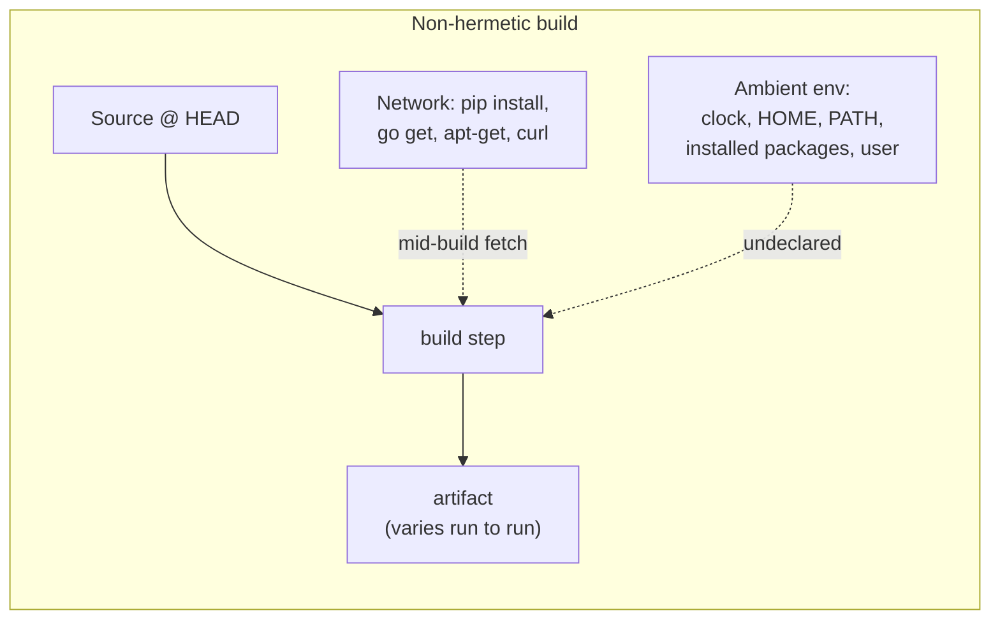
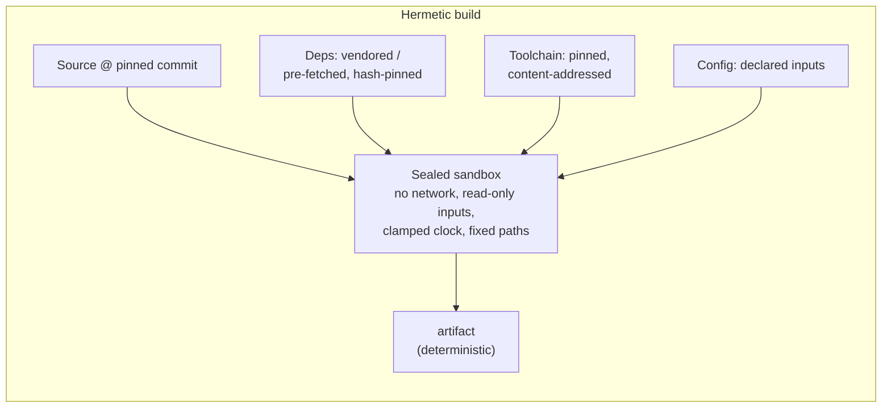
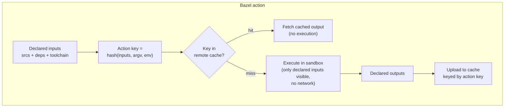
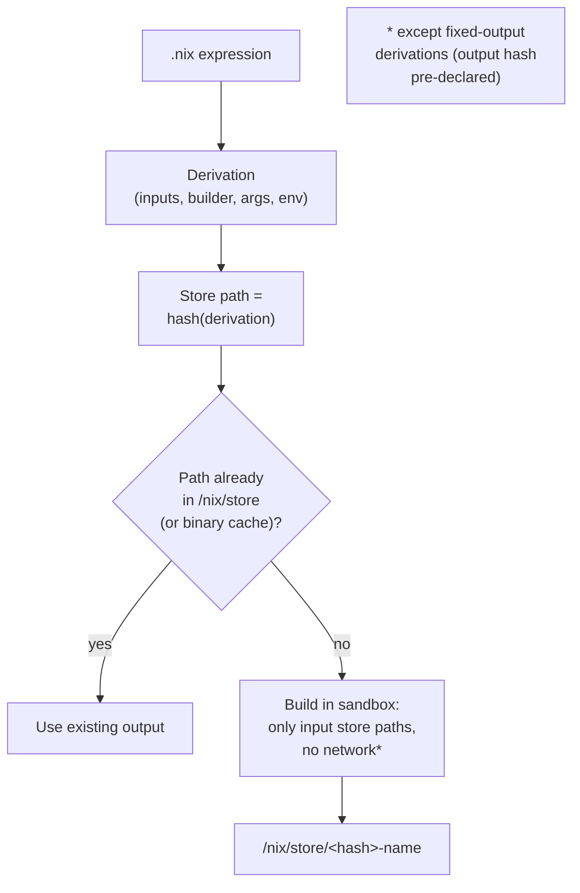
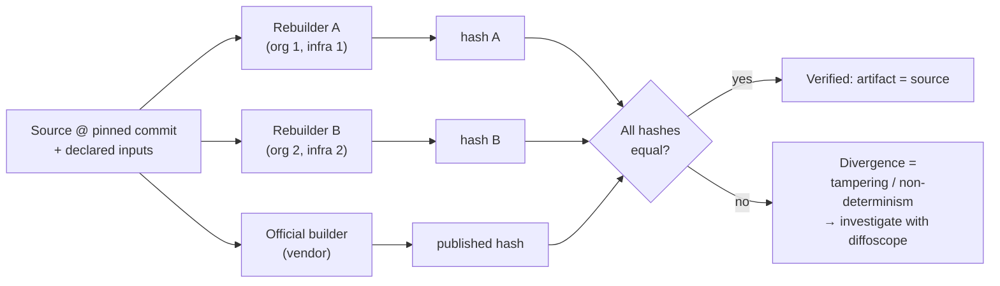

# Chapter 2 — Hermetic and Reproducible Builds

*What this chapter covers.* Chapter 1 modelled the build as a function you *wish* were pure,
with six input classes and a large set of undeclared, ambient inputs that attackers can feed.
This chapter is about closing that gap. It develops two related but genuinely distinct
properties — **hermeticity** (controlling and declaring every input) and **reproducibility**
(getting bit-for-bit identical outputs from the same inputs) — and shows how, together, they
turn "did the build faithfully transform the source?" from an act of faith into a question you
can mechanically answer.

These are not academic niceties. They are the properties that would have caught the two
canonical build-supply-chain attacks. The xz-utils backdoor (Book 1, Chapter 5) lived in the
release *tarball* — in a doctored `build-to-host.m4` and test fixtures that were never in the
upstream Git repository; a build hermetically pinned to the VCS state would have excluded it.
SolarWinds/SUNSPOT (Book 1, Chapter 3) swapped source inside a compromised build server and
emitted a validly-signed, source-clean, build-tampered artifact; a reproducible build,
independently rebuilt from the published source, would have produced a different hash and
screamed. Hermeticity shrinks the attack surface *going in*; reproducibility lets you *verify*
what came out. Neither is sufficient alone. Both are foundational to SLSA (Chapter 3), to a
paved-road build platform (Chapter 10), and to trustworthy remote build caches (Chapter 7).

Learning goals — after this chapter you should be able to:

- **Define hermeticity and reproducibility precisely** and articulate the relationship
  between them: why hermeticity is (mostly) a prerequisite for reproducibility, why they are
  nonetheless distinct goals, and what security property each one buys.
- **Enumerate the sources of build non-determinism** — timestamps, ordering, locale, paths,
  environment leakage, randomness, parallelism, toolchain behaviour — and name the fix for
  each.
- Use the real techniques: **`SOURCE_DATE_EPOCH`**, `strip-nondeterminism`, deterministic
  `tar`, `-ffile-prefix-map`, pinned toolchains, and normalized metadata.
- Explain the **hermetic build models** of Bazel and Nix at the mechanism level — the action
  graph and the derivation — and why Make, Maven, and npm are non-hermetic by default.
- Assess the **reproducibility maturity** of major ecosystems (Go, Rust, Java, Debian,
  containers) accurately, without overstating any of them.
- Explain **rebuilder networks** and **diverse double-compilation** as reproducibility applied
  to verification and to the Trusting Trust problem.
- Reason about hermetic/reproducible builds at **fleet scale**: shared build platforms, cache
  correctness, and the tension between fast dev builds and verifiable release builds.

## Two properties, one goal, easily confused

Engineers routinely conflate hermeticity and reproducibility, or treat them as synonyms for
"a good build." They are neither. They are orthogonal-ish axes, and being precise about the
difference is the whole point of this chapter.

A **hermetic build** is a build with fully declared, controlled inputs and **no access to
undeclared resources**. Every input — sources, dependencies, the toolchain itself, build
configuration — is explicitly provided and pinned to an exact version or content hash. During
the build there is no arbitrary network access, no reading of ambient system state (the wall
clock, `$HOME`, installed system packages, the current user), and no invocation of tools that
were not declared. Hermeticity is a statement about **inputs and isolation**: the build is
sealed off from its environment, so that the only things that can influence the output are
things you named.

A **reproducible** (or **deterministic**) build is one where the *same inputs produce
bit-for-bit identical outputs* — the same artifact, byte for byte, regardless of *when* it was
built, *where* (which machine, which directory), or *who* built it. Reproducibility is a
statement about the **output relative to its inputs**: build the same thing twice, on two
different continents, six months apart, and the SHA-256 of the result is the same.

Read those two definitions again and notice they are talking about different halves of the
function `artifact = build(inputs)`. Hermeticity constrains the *domain* — what may flow into
`inputs`. Reproducibility constrains the *mapping* — whether `build` is a genuine function or a
relation that returns different bytes for the same argument.

| | Hermeticity | Reproducibility |
|---|---|---|
| **What it constrains** | The build's *inputs* and environment | The build's *output* relative to inputs |
| **Property** | No undeclared inputs; isolated from ambient state | Same inputs → identical bytes |
| **One-line test** | "Can anything the build didn't declare influence it?" | "Do two independent builds of the same source match?" |
| **Primary security value** | Shrinks the attack surface; enables trustworthy provenance | Enables independent **verification** of artifacts |
| **Achieved by** | Pinning, vendoring/pre-fetch, sandboxing, no-network | Clamping time, stable ordering, path remapping, normalized metadata |
| **Flagship tooling** | Bazel, Nix, sandboxed CI | `SOURCE_DATE_EPOCH`, `strip-nondeterminism`, Reproducible Builds project |
| **SLSA relevance** | Isolation is required for higher build levels (L3+) | Enables the *verify-by-rebuild* trust model |

### The relationship: prerequisite, not identity

Hermeticity is **mostly a prerequisite for reproducibility**, and the "mostly" matters.

The prerequisite direction is intuitive: you cannot get deterministic output if undeclared
inputs vary between builds. If your build reads the system clock and stamps it into the binary,
then two builds five minutes apart differ — and no amount of "same source" fixes that, because
the clock was a *hidden input* that wasn't the same. Hermeticity is what lets you say "the
inputs were identical," which is the antecedent that reproducibility's promise is conditioned
on. In practice, most non-determinism is caused by exactly this: the build absorbing ambient
state (time, paths, hostnames, filesystem ordering) that hermeticity is supposed to exclude or
pin.

But the two are still distinct, and you can have one without the other:

- **Hermetic but not reproducible.** A perfectly sealed build can still be non-deterministic
  from the *inside*. If the compiler embeds `__DATE__`, or the linker orders symbols by a
  hash-table iteration seeded from a per-process random value, or the archiver writes entries
  in `readdir()` order, the build is non-deterministic even with zero undeclared inputs. The
  non-determinism is *internal* to the declared toolchain's behaviour. Hermeticity gets you a
  controlled clock; it does not stop a tool from reading that clock and stamping it in.
- **Reproducible but not (fully) hermetic.** Go builds are famously reproducible even when run
  with network access to fetch modules, because the toolchain normalizes away almost every
  source of non-determinism and the module cache is content-addressed. The reproducibility
  comes from the *toolchain's discipline*, not from a hermetic sandbox around it. (In practice
  you still want hermeticity for the *security* reasons below — reproducibility alone doesn't
  stop a poisoned mid-build fetch.)

So: pursue hermeticity to control what goes in and to make reproducibility *achievable*; pursue
reproducibility to make what comes out *verifiable*. They compose, but you have to do both.





### Why each matters for security

**Hermeticity shrinks the attack surface and underpins provenance.** Chapter 1 called the
build the most over-privileged node in the pipeline. A non-hermetic build multiplies that
privilege into ingestion paths: every `curl | sh` in a build script, every `go get` that
resolves a version at build time, every `apt-get install` against a live mirror is a moment
where an attacker who controls (or MITMs, or typosquats) that resource can inject code into a
maximally-trusted context. Hermeticity removes those moments by construction — there *is* no
mid-build fetch to poison, because all inputs were resolved and pinned beforehand, and the
network is off. This is also why SLSA leans on isolation for its higher build levels
(Chapter 3): provenance that says "this artifact was built from these inputs" is only
trustworthy if the build *couldn't* have quietly pulled in a seventh input the provenance
doesn't mention.

**Reproducibility enables verification.** This is the payoff that turns a build from a black
box into an auditable computation. If a build is reproducible, then *anyone* with the source
and the declared inputs can rebuild it and check that the official artifact matches, bit for
bit. Divergence is proof of tampering. This is precisely the check that would have caught
SUNSPOT: rebuild SolarWinds Orion from its published source and the hash would not match the
signed, shipped DLL, because source was swapped inside the build. And it is the check that
underpins the Reproducible Builds project's entire trust model — the ability to hold a vendor's
binary to account against its own source code, without trusting the vendor's build
infrastructure at all.

## Sources of non-determinism: the practical enemy

To make a build reproducible you have to hunt down every place where "the same inputs" can
still yield different bytes. This is unglamorous, empirical work — the Reproducible Builds
project has spent a decade cataloguing these — but the categories are finite and well
understood. Here is the taxonomy.

```mermaid
flowchart TD
  ND["Sources of<br/>non-determinism"] --> T["Time"]
  ND --> ORD["Ordering"]
  ND --> LOC["Locale / environment"]
  ND --> PATH["Paths"]
  ND --> RAND["Randomness"]
  ND --> PAR["Parallelism"]
  ND --> TOOL["Toolchain internals"]
  ND --> INP["Unstable inputs"]

  T --> T1["build date embedded<br/>(__DATE__, __TIME__)"]
  T --> T2["mtimes in archives<br/>(tar, zip, jar)"]
  ORD --> O1["readdir() filesystem order"]
  ORD --> O2["tar/zip entry order,<br/>glob expansion order"]
  ORD --> O3["hash-map iteration order"]
  LOC --> L1["LC_ALL sort order,<br/>date/number formatting"]
  LOC --> L2["TZ timezone,<br/>hostname, username leak"]
  PATH --> P1["build dir baked in<br/>(__FILE__, debug info)"]
  RAND --> R1["UUIDs, random seeds,<br/>ephemeral temp names"]
  PAR --> PP1["job completion order<br/>affecting output layout"]
  TOOL --> TT1["ASLR-influenced output,<br/>uninitialized memory, PGO"]
  INP --> I1["network-fetched deps<br/>that change under you"]
```



### Timestamps

The single most common source. Compilers embed build dates via `__DATE__`/`__TIME__` macros;
archive formats store per-entry modification times; documentation tools stamp "generated on…";
`jar` and `zip` write the current time into every entry header. Build the same source twice a
minute apart and the timestamps differ, so the bytes differ. Two flavours matter: **content
timestamps** (a date baked into the artifact's payload) and **metadata timestamps** (mtimes in
container/archive headers). Both must be clamped or zeroed.

### File ordering

Filesystems do not guarantee an order for `readdir()`; ext4's directory hashing returns entries
in an order that depends on hash seed and insertion history, which differs across machines and
even across `mkfs` runs. A build that does `tar cf out.tar $(ls dir/)` or globs `*.o` in
directory order will lay out its archive differently on different hosts. Link order is a close
cousin: if object files are passed to the linker in filesystem order, symbol layout (and thus
the binary) varies. **Fix: sort explicitly**, everywhere ordering can leak into output.

### Locale and timezone

`LC_ALL`/`LANG` change collation (so `sort` orders differently), and number/date formatting.
`TZ` changes any local-time rendering. A build that sorts strings under the user's locale, or
formats a date in local time, is non-deterministic across environments. Hostname and username
leak in via tools that record "built by user@host" — GCC's older behaviour, some packaging
tools, and many "about" screens.

### Paths

The absolute path of the build directory frequently ends up *inside* the artifact: `__FILE__`
expands to a full path in assertions and logs; DWARF debug info records the compilation
directory and source file paths; `__builtin_FILE()`, Go's older path embedding, and Rust's
panic messages all captured build paths. Build in `/home/alice/proj` versus
`/build/proj` and the debug sections differ. This is why CI often builds under a fixed path
like `/build` — but the real fix is compiler path remapping (below).

### Randomness

Anything that generates a UUID, a random seed, a nonce, or an ephemeral temp filename at build
time is non-deterministic by design. Some code generators emit a random build ID; some linkers
(e.g., via `--build-id` defaults) derive an ID that, depending on the mode, can vary. Temporary
file names (`mktemp`) leaking into output — e.g., into a `#line` directive or a generated
symbol — are a classic subtle case.

### Parallelism

When `make -j` or Bazel runs actions concurrently, the *completion order* is nondeterministic.
If any output aggregation depends on completion order (concatenating logs, appending to an
index, assigning IDs in the order results arrive), the output varies run to run even on the same
machine. The fix is to make aggregation order depend on a *stable key*, not arrival order.

### Toolchain internals

Some non-determinism lives inside the compiler or linker. Historically, GCC and Clang could
produce output influenced by address-space layout randomization (ASLR) in the compiler process,
because a hash table keyed on pointer values iterated in address order; both have been fixed to
sort by stable keys. **Profile-guided optimization (PGO)** introduces non-determinism if the
profile data itself is collected non-deterministically. **Uninitialized memory** written into
output — padding bytes in a struct that get serialized, uninitialized fields in an object file —
produces garbage that differs between runs; this is both a reproducibility bug and, often, an
information-disclosure bug. The good news is that mainstream toolchains have spent years adding
explicit determinism: Clang/LLVM's `-frandom-seed`, deterministic archive mode (`ar D`, on by
default in GNU binutils now), and the broad adoption of `SOURCE_DATE_EPOCH` support.

### Unstable inputs

Finally, the input that *isn't the same* even though you thought it was: a dependency fetched
from the network at build time that changed under you. `latest` tags, unpinned `apt`/`pip`
resolutions, a mutable Git branch, a base image `:latest` — each means "the same build" silently
consumed different bytes. This is where reproducibility and hermeticity meet: an unpinned
network fetch is *both* a determinism bug *and* the attack surface hermeticity exists to close.

| Source | Concrete example | Fix |
|---|---|---|
| Embedded build date | `__DATE__`, "generated on 2026-07-31" | `SOURCE_DATE_EPOCH`; strip/normalize |
| Archive mtimes | `tar`, `zip`, `.jar` entry timestamps | `tar --mtime` / `--clamp-mtime`; `strip-nondeterminism` |
| readdir ordering | `tar $(ls)`, `*.o` link order | `tar --sort=name`; explicit `sort`; stable link order |
| Hash-map iteration | symbol tables, JSON key order | sort by stable key before emit |
| Locale/collation | `LC_ALL`-dependent `sort` | pin `LC_ALL=C`, `TZ=UTC` |
| Hostname/username | "built by user@host" strings | omit or normalize; `-fno-…` where available |
| Build path in output | DWARF comp dir, `__FILE__` | `-ffile-prefix-map`, `-fdebug-prefix-map` |
| UUIDs / random seeds | generated build IDs, nonces | seed deterministically; `-frandom-seed` |
| Parallel completion order | concatenated logs, ID assignment | order by stable key, not arrival |
| Uninitialized memory | struct padding serialized | zero-init; fix the tool |
| Unpinned network dep | `pip install foo`, `FROM base:latest` | pin by version + hash; vendor/pre-fetch |

## Achieving reproducibility

The techniques below are the working toolkit of the **Reproducible Builds project**
(`reproducible-builds.org`), a cross-distribution effort that has been systematically making
Linux distributions rebuild bit-for-bit since 2013. Its core deliverables are (1) a
specification of the problem and its fixes, (2) tooling (`diffoscope`, `strip-nondeterminism`,
`reprotest`), and (3) *rebuilder infrastructure* that continuously rebuilds packages and
compares. Describing it accurately: Debian tracks reproducibility per package and has driven a
large majority of its archive to reproduce (well over 90% of `bookworm`/`trixie` source
packages in the tested set, though the exact figure moves and depends on the architecture and
test environment); it is emphatically *not* "100% of Linux is reproducible," and the last few
percent are the hard cases.

### `SOURCE_DATE_EPOCH`

The single most important standardization to come out of the project. `SOURCE_DATE_EPOCH` is an
environment variable, defined by the Reproducible Builds specification, holding a Unix timestamp
(seconds since the epoch) that build tools should use **in place of the current time** for any
timestamp they embed. Set it to, say, the commit date of the source, and a build tomorrow uses
the same value as a build today.

```bash
# Clamp all embedded timestamps to the source commit's date
export SOURCE_DATE_EPOCH=$(git log -1 --pretty=%ct)
```

Broad ecosystem support exists: GCC and Clang honour it for `__DATE__`/`__TIME__`, many doc
generators, `rpmbuild`, `dpkg`, Python's `py_compile`, and `tar --clamp-mtime` all read it.
Semantically it is a *clamp/override*, not just a default — tools that support it should never
write a timestamp newer than `SOURCE_DATE_EPOCH`. It solves the "time" category almost entirely
when tools cooperate.

### Deterministic archives

Archives (`tar`, `zip`, `ar`, `jar`) are a reproducibility minefield because they store mtimes,
owners, and entry order. GNU `tar` can produce a canonical archive:

```bash
tar --sort=name \
    --mtime="@${SOURCE_DATE_EPOCH}" \
    --owner=0 --group=0 --numeric-owner \
    --pax-option=exthdr.name=%d/PaxHeaders/%f,delete=atime,delete=ctime \
    -cf output.tar ./tree
```

`--sort=name` fixes ordering; `--mtime` clamps time; `--owner/--group=0 --numeric-owner`
strips the building user's identity; the `--pax-option` line removes access/change times that
would otherwise leak. For formats that don't offer these flags, or for the residue tools leave
behind, the Reproducible Builds project ships **`strip-nondeterminism`** — a post-processor that
normalizes known non-deterministic fields in `zip`/`jar`, `ar`, `gzip`, PNG, and other formats
(zeroing embedded timestamps, canonicalizing order). Debian runs it automatically as part of
`dpkg`'s build flow.

### Path remapping

To keep the build directory out of the artifact, modern compilers offer prefix-mapping flags
that rewrite paths in output:

```bash
# Rewrite /home/alice/proj -> /build in debug info and __FILE__
cc -ffile-prefix-map=$(pwd)=/build -c foo.c
# Older, narrower variants:
cc -fdebug-prefix-map=$(pwd)=/build -c foo.c   # debug info only
cc -fmacro-prefix-map=$(pwd)=/build -c foo.c   # __FILE__ etc. only
```

`-ffile-prefix-map` (GCC 8+, Clang) is the umbrella flag covering both debug info and
preprocessor macros. Rust has `--remap-path-prefix`; Go 1.13+ largely avoids embedding absolute
build paths and offers `-trimpath` to strip them. Get this right and the "paths" category is
closed without having to pin the build directory to a fixed location.

### Stable ordering, pinned toolchains, normalized metadata

The remaining reproducibility work is a discipline, applied everywhere output is assembled:
sort inputs by a stable key (never rely on `readdir` or glob order); pin `LC_ALL=C` and `TZ=UTC`
so locale can't perturb collation; pin the exact toolchain (a different GCC minor version can
emit different code — the toolchain is an input, Chapter 1); and normalize or remove embedded
metadata (build host, user, non-clamped timestamps, random build IDs). None of these is deep;
the difficulty is *coverage* — a single un-sorted `tar` or un-mapped path defeats the whole
artifact.

### Ecosystem maturity — accurately

Reproducibility ranges from "free, by design" to "genuinely hard," and it is important not to
overstate any ecosystem.

- **Go** — the strong case. The Go toolchain was designed for reproducibility: no `__DATE__`
  equivalent, `-trimpath` to strip build paths, a content-addressed, hash-verified module
  cache (`go.sum`), and a compiler that is deterministic by default. A Go binary built from a
  pinned module graph with `-trimpath` reproduces bit-for-bit across machines with the same Go
  version and target platform. Go even publishes its own toolchain reproducibly. This is the
  ecosystem to point at when someone says reproducibility is impractical.
- **Rust** — good and improving, with caveats. `rustc` supports `--remap-path-prefix`, Cargo's
  lockfile pins the dependency graph, and reproducible builds are an active, largely working
  goal. Caveats: incremental compilation is not designed to be reproducible; some codegen
  details and the exact LLVM version matter; and you must pin the compiler.
- **Java / JVM** — historically painful, mostly because of `jar`/`zip` timestamps and entry
  ordering. A `.jar` is a `.zip`, so every entry carries an mtime set to "now." The Maven
  world addressed this with the **Reproducible Builds for Maven** effort: a
  `project.build.outputTimestamp` property (which plugins read, analogous to
  `SOURCE_DATE_EPOCH`) and the `artifact:check-buildplan`/reproducibility plugins. Gradle has a
  `preserveFileTimestamps=false`/`reproducibleFileOrder=true` option on its archive tasks. It
  works, but it is opt-in and easy to get wrong.
- **Debian / distributions** — the reference program. Large majority reproducible, continuous
  rebuilder verification, `diffoscope` to explain any diff. The hard residue: builds that
  legitimately embed randomness, tools not yet honouring `SOURCE_DATE_EPOCH`, and
  architecture-specific quirks.
- **Containers** — the genuinely hard case, and worth being blunt about. A Dockerfile
  `RUN apt-get update && apt-get install -y foo` resolves against a live, mutable mirror, stamps
  layer creation timestamps, and records file mtimes — non-hermetic and non-reproducible on
  three axes at once. Making container images reproducible usually means abandoning the
  imperative Dockerfile model. The credible approaches: **Bazel `rules_oci`** (and the older
  `rules_docker`) build image layers as declared, ordered, timestamp-controlled tarballs;
  **`ko`** (for Go) builds a reproducible image from a Go binary with no Dockerfile at all;
  **Chainguard's `apko` and `melange`** build images and packages declaratively from a pinned
  APK repository with clamped timestamps, producing reproducible OCI images; and **Nix**
  (`dockerTools.buildImage`) constructs images from the Nix store with fixed metadata. The
  common thread is that reproducible containers come from *declarative, pinned* image builders,
  not from normalizing an imperative Dockerfile after the fact.

| Ecosystem | Reproducibility maturity | Why / caveat |
|---|---|---|
| Go | Strong, by design | `-trimpath`, content-addressed modules, deterministic compiler |
| Rust | Good, improving | `--remap-path-prefix`, Cargo lockfile; incremental builds are not reproducible; pin `rustc` |
| Debian / distros | Reference program | >90% of tested packages; continuous rebuilders; `diffoscope` |
| Java / JVM | Workable but opt-in | `.jar` timestamps/order; Maven `outputTimestamp`, Gradle archive flags |
| Containers (Dockerfile) | Hard | Live mirrors, layer timestamps, mtimes; imperative and non-hermetic |
| Containers (apko/ko/rules_oci/nix) | Good | Declarative, pinned, timestamp-controlled builders |

## Achieving hermeticity

Hermeticity is achieved by controlling inputs and cutting off the environment. There are three
layers: resolve-and-pin dependencies *before* the build, sandbox the build so it cannot reach
what it didn't declare, and — for the strongest guarantees — adopt a build system whose entire
model is hermetic.

### Pin, then vendor or pre-fetch

The foundational move (developed in Book 2, Chapters 2 and 8) is to separate **dependency
resolution** from **the build**. Resolution — deciding *which* versions satisfy your
constraints — is a network-bound, non-deterministic, attacker-influenceable activity. The
build should not do it. Instead:

1. Resolve once, producing a **lockfile** that pins every transitive dependency to an exact
   version *and content hash* (`go.sum`, `Cargo.lock`, `package-lock.json` with integrity
   hashes, `poetry.lock`, `requirements.txt` with `--hash`).
2. **Vendor** the dependencies into the repo, or **pre-fetch** them into a content-addressed
   cache, *before* the hermetic phase.
3. Run the actual build with the **network off**, consuming only the pre-fetched, hash-verified
   inputs.

Now there is no resolution during the isolated build, and therefore no moment at which a
version can be re-resolved to something poisoned, no `latest` that drifts, no mirror to MITM.
The lockfile's hashes mean even a compromised mirror can't substitute bytes without detection.
This is the concrete mechanism by which hermeticity closes the "poisoned dependency executed
during build" threat (SLSA threat D, Chapter 1).

### Sandboxing

The second layer enforces "no undeclared inputs" mechanically rather than by convention. A
hermetic sandbox gives the build:

- **No network** — egress blocked (network namespace with no route, or a deny-all firewall), so
  a build script *cannot* fetch anything not already present.
- **Read-only inputs** — declared inputs mounted read-only, so the build can't mutate its own
  inputs and can't accidentally depend on a writable ambient path.
- **A controlled filesystem** — only declared inputs are visible; `/usr`, `$HOME`, and the
  broader system are absent or a fixed, pinned image, so the build can't pick up an
  ambient tool or config.
- **Normalized environment** — a fixed `PATH`, `LC_ALL=C`, `TZ=UTC`, cleared `USER`/`HOSTNAME`,
  and `SOURCE_DATE_EPOCH` set, so ambient env can't leak in.

Linux primitives make this cheap: user/mount/network namespaces, `bwrap` (bubblewrap),
`seccomp`, and ephemeral containers. Chapter 8 develops ephemeral, isolated build environments
in depth; the point here is that sandboxing is what turns hermeticity from an aspiration ("we
try not to fetch things") into an invariant ("the build *cannot* fetch things").

### Build systems designed for hermeticity

The strongest guarantees come from build systems whose core model *is* hermeticity, rather than
bolting it on. Make, Maven, and npm are the counterexample: all three are **ambient and
non-hermetic by default**. Make actions are arbitrary shell that can read anything on the
system; Maven resolves and downloads from network repositories during the build and runs
plugins with full ambient access; npm's `install` executes lifecycle scripts (`postinstall`)
with network and filesystem access as a matter of course. In all three, the build's *actual*
inputs are a superset of what's declared, and nobody knows the full set.

#### Bazel: the action graph

Bazel (Google's open-sourced build system, descended from Blaze) models a build as a
**directed acyclic graph of actions**. Every target declares its inputs (`srcs`, `deps`) and
outputs explicitly in `BUILD` files; Bazel computes, for each action, the exact set of input
files, the command line, the environment, and the declared outputs. It then executes each
action in a **sandbox** that exposes *only* the declared inputs — if an action tries to read a
file it didn't declare, the sandbox hides it and the build fails, which is how undeclared
dependencies get caught rather than silently absorbed. External dependencies are fetched by
`WORKSPACE`/`MODULE.bazel` rules that pin URLs *and* SHA-256 hashes, so third-party inputs are
content-addressed too. Toolchains are modelled as hermetic, resolvable dependencies rather than
"whatever `cc` is on `PATH`."

The property that falls out of this model is a **stable, content-based cache key** for every
action: hash the action's inputs, command, and environment, and you have a key that identifies
its output. That is what makes Bazel's **remote caching and remote execution** sound — if the
key matches, the cached output is *guaranteed* to be the output this action would produce,
because nothing outside the declared inputs can influence it. Hermeticity and cache correctness
are the same property viewed from two angles (we return to this under the distributed-systems
lens).



#### Nix: the derivation

Nix takes hermeticity furthest, treating the entire build as a **pure function** in a
purpose-built functional language. The unit is a **derivation**: a complete, serialized
description of a build — its exact input derivations (recursively, all the way down to a pinned
bootstrap toolchain), the builder executable, arguments, and environment. Nix hashes that
description to produce a store path like `/nix/store/<hash>-openssl-3.3.2`. Builds run in a
sandbox with no network (except for explicitly declared **fixed-output derivations**, whose
*output* hash is pre-declared, so a source fetch is allowed precisely because its result is
pinned) and no access to anything outside the declared inputs. Every artifact lives in the
**content-addressed** store under a path derived from its inputs, so two builds with the same
inputs land at the same path and can be shared. NixOS builds an entire operating system this
way, which is why Nix is frequently called the gold standard for hermeticity: there is no
`/usr` for a build to accidentally depend on — everything, down to `libc` and the compiler, is
an explicit input in the store.



The distinction between Bazel and Nix is largely one of scope. Bazel is a *build tool* whose
hermeticity is strong within a workspace and whose toolchains you configure. Nix is a *package
manager and build system* whose hermeticity extends to the entire dependency closure including
the toolchain and libc, at the cost of rewriting your build in Nix's model. Both give you
content-addressed, cacheable, verifiable builds; both are a real adoption cost.

### The trade-offs

Hermetic and reproducible builds are not free, and pretending otherwise is how adoption
efforts die.

- **Engineering effort.** Someone has to vendor dependencies, write `BUILD`/`.nix` files or
  wrestle a Dockerfile into `apko`, hunt down every non-deterministic byte with `diffoscope`,
  and keep it working as the codebase evolves. This is ongoing, not one-time.
- **Ecosystem friction.** Enormous swaths of the software ecosystem *assume* network access at
  build time — `npm postinstall` scripts that download binaries, `pip` packages that compile
  against system libraries, Go modules resolved on the fly. Hermeticity fights all of this, and
  every fight is a small integration project.
- **Slower setup, sometimes slower cold builds.** Pre-fetching and sandboxing add overhead; a
  cold Bazel or Nix build can be slower than a naive `make`.

Against that, the ROI is substantial and compounding: **verification** (you can hold artifacts
to account against source), **trustworthy provenance** (SLSA L3+), **cache correctness** (safe,
massive build-time savings via shared caches — often *faster* than non-hermetic builds once
warm), and **debuggability** (a reproducible build is a build you can bisect and reason about;
"works on my machine" stops being a category of bug). For a single small service the effort may
not pay off; for a shared platform serving hundreds of teams (Chapter 10) it is
transformational.

## Verification via reproducibility: the security payoff

Reproducibility's deepest value is that it makes builds *falsifiable*. A signed binary asserts
"a key-holder vouches for this"; a reproducible binary lets you assert "this is what the source
actually compiles to," and *anyone* can check it, without trusting the builder.

### Rebuilder networks and diverse rebuilds

The mechanism is a **rebuilder network**: independent parties, on independent infrastructure,
rebuild the same source with the same declared inputs and publish the hash of what they got. A
consumer (or a distribution) collects these attestations and accepts the artifact only if
enough independent rebuilders agree on the hash — and, crucially, if that agreed hash matches
the officially published artifact.



The security property is powerful: to slip a backdoor past this, an attacker must either
compromise the *source* (which is watched, reviewed, and public) or simultaneously compromise
*enough independent rebuilders on independent infrastructure* to forge a consensus — a far
higher bar than compromising a single build server. This is exactly the defence SolarWinds
lacked. SUNSPOT tampered with one build environment and produced a validly-signed artifact;
signing verified the *key*, not the *computation*. A rebuilder network verifies the computation:
rebuild Orion from source, and the divergent hash exposes the injection immediately.

The connection to **build-from-source versus build-from-tarball** is the sharpest lesson of
xz-utils. The xz backdoor's activation machinery was *not in the Git repository*. It lived in
the release tarball — specifically in a modified `build-to-host.m4` (an autotools macro pulled
in during `./configure`) and in binary "test" files that the doctored build script decompressed
and executed. Anyone building from the *tarball* got backdoored; anyone building hermetically
from the *VCS commit* would not have, because the malicious inputs simply weren't there. A
hermetic build pinned to version control — declaring the VCS tree as the source of truth and
regenerating autotools output rather than trusting the shipped tarball — excludes exactly the
class of input xz used. This is why "reproducible from source in VCS" is a materially stronger
claim than "reproducible from the release artifact the maintainer handed you."

### Diverse double-compilation and Trusting Trust

Reproducibility also gives us the only known practical defence against the deepest version of
the build-trust problem: **Trusting Trust** (Ken Thompson, 1984; Book 1, Chapter 6; Book 7,
Chapter 5). Thompson's attack is a compiler that inserts a backdoor when it compiles a target
*and* re-inserts the backdoor-insertion logic when it compiles a new version of *itself* — so
the malice is present in the binary compiler but nowhere in any source, and recompiling from
clean source with the poisoned compiler reproduces the poison. You cannot detect it by reading
source, because the source is clean.

David A. Wheeler's **Diverse Double-Compilation (DDC)** defeats it using reproducibility. The
idea: compile the compiler's source with the (possibly-poisoned) compiler *and*, independently,
with a *different, diverse* compiler (a different implementation, on a different platform). Then
use each resulting compiler to compile the compiler source *again*. If the compiler is
deterministic and honest, the two second-stage binaries must be **bit-for-bit identical** — they
were produced from the same source by two functionally-equivalent-but-differently-implemented
compilers. If they differ, at least one compiler is lying. DDC is reproducibility applied to the
toolchain itself: it turns "is my compiler a faithful implementation of its source?" into a hash
comparison, and it works precisely *because* an honest, deterministic compilation is
reproducible. Without reproducibility, DDC has nothing to compare. (Wheeler demonstrated it
practically against a real compiler; it is the reason the Trusting Trust attack is considered
detectable in principle rather than an unbreakable dead end.)

## Distributed-systems lens

At fleet scale, hermeticity and reproducibility stop being per-project hygiene and become
platform properties — and the economics flip from "cost" to "leverage."

**A shared hermetic build platform makes builds consistent, cacheable, and verifiable for
everyone.** When every team builds through the same Bazel remote-execution cluster, or the same
Nix-based platform, hermeticity is enforced centrally: no tenant's build can reach an undeclared
resource, every artifact carries a content-addressed identity, and the platform can attach
trustworthy provenance because it *knows* the complete input set (there is no seventh,
undeclared input). This is the paved road of Chapter 10 — hermeticity is baked into the platform
so that every tenant gets it whether or not they understand it, which is the only way a property
this demanding reaches broad adoption.

**Reproducibility and cache correctness are the same property.** A remote build cache is safe to
share across teams *only if* identical inputs deterministically yield identical outputs — that is
literally the reproducibility guarantee. If a build is non-deterministic, a cache hit can return
an output that differs from what the requesting build would have produced, silently corrupting
results. Bazel's action key *is* a bet on determinism: "same inputs → same output → safe to
serve from cache." So the very property that lets you verify artifacts against source is the
property that lets a thousand-engineer org share one warm cache and cut build times by orders of
magnitude. Reproducibility pays for itself twice — once in security, once in speed.

**But the shared cache is now a supply-chain target.** A poisoned entry in a remote build cache
is a build compromise with fleet-wide blast radius: inject one malicious output under a
legitimate action key and every subsequent cache hit ships the malicious artifact, with the
provenance of a clean build. This is Chapter 7's territory (cache poisoning). The defences follow
directly from this chapter's model: the cache must be **integrity-protected** (authenticated
writes, content-addressed storage so an entry's key is a hash of its *bytes*, signed cache
entries), and — the belt-and-braces answer — reproducibility itself lets you *audit* the cache by
rebuilding entries and comparing. A content-addressed, reproducible world is one where a poisoned
cache entry is detectable rather than invisible.

**The central tension is dev speed versus release verifiability.** Fully hermetic, sandboxed,
network-off builds are slower to iterate on than a warm incremental `go build` or a `docker
build` with a live cache, and developers will route around friction. The pragmatic resolution
most mature platforms reach is a **two-track** model: fast, non-hermetic, ambient builds for
inner-loop development (where nobody is going to sign and ship the output), and hermetic,
reproducible, provenance-emitting builds for anything that crosses the release boundary. The
release track is where SLSA levels, signed provenance (Chapter 3, Book 5), and rebuilder
verification apply; the dev track optimizes for iteration speed. The platform's job is to make
the release track the *default* for anything that gets published — so that the artifact a
customer eventually runs was built hermetically and can be reproduced, even if the engineer's
laptop build was not.

## Key takeaways

- **Hermeticity and reproducibility are distinct properties.** Hermeticity controls *inputs*
  (fully declared, pinned, isolated from ambient state); reproducibility constrains *output*
  (same inputs → bit-for-bit identical bytes). Hermeticity is mostly a *prerequisite* for
  reproducibility, but you can have either without the other, and you need both.
- **Security value split:** hermeticity *shrinks the attack surface* (no mid-build fetch to
  poison, no ambient injection) and *enables trustworthy provenance* (SLSA L3+ needs isolation);
  reproducibility *enables verification* — independent rebuild-and-compare that catches the
  SolarWinds/xz class of build tampering.
- **Non-determinism has a finite, well-catalogued taxonomy:** timestamps, ordering, locale,
  paths, randomness, parallelism, toolchain internals, and unstable inputs. Each has a known fix;
  the difficulty is *total coverage* — one un-sorted `tar` defeats the artifact.
- **The real toolkit is real:** `SOURCE_DATE_EPOCH` to clamp time, `strip-nondeterminism` and
  deterministic `tar` for archives, `-ffile-prefix-map` for paths, pinned toolchains, `LC_ALL=C`.
  The Reproducible Builds project and Debian's rebuilders are the reference implementation.
- **Ecosystems vary — don't overstate any.** Go is reproducible essentially by design; Rust is
  good with caveats (not incremental builds); Java needs opt-in archive normalization; containers
  are hard and need declarative builders (`apko`/`melange`, `ko`, `rules_oci`, Nix), not
  normalized Dockerfiles.
- **Bazel and Nix are hermetic by construction:** Bazel's sandboxed action graph and Nix's
  content-addressed derivations both yield stable, content-based cache keys — the same property
  that makes remote caching *correct* also makes artifacts *verifiable*. Make/Maven/npm are
  ambient and non-hermetic by default.
- **Reproducibility is the verification substrate:** rebuilder networks turn "trust the vendor's
  build" into "compare independent hashes," and Diverse Double-Compilation applies it to the
  Trusting Trust problem. Building hermetically *from VCS* (not the release tarball) is what would
  have excluded the xz backdoor.
- **At fleet scale**, hermeticity is a platform property (the paved road), reproducibility *is*
  cache correctness, the shared cache becomes a supply-chain target that must be
  integrity-protected, and the durable design is a two-track split: fast ambient dev builds,
  hermetic reproducible release builds.

## Further reading

- **Reproducible Builds project** — https://reproducible-builds.org/ — the definitions, the
  documented sources of non-determinism, and the tooling (`diffoscope`, `strip-nondeterminism`,
  `reprotest`). Start with the "Documentation" and "Tools" sections.
- **`SOURCE_DATE_EPOCH` specification** —
  https://reproducible-builds.org/specs/source-date-epoch/ — the definitive semantics of the
  timestamp-clamping environment variable.
- **Debian Reproducible Builds** — https://tests.reproducible-builds.org/debian/ — the live
  per-package rebuilder dashboards and current reproducibility statistics.
- **Bazel documentation** — *Hermeticity* and *Remote caching/execution* —
  https://bazel.build/ — the action-graph, sandboxing, and content-addressed cache model.
- **Nix / NixOS** — Eelco Dolstra, *The Purely Functional Software Deployment Model* (PhD
  thesis, 2006) for the derivation model, and https://nixos.org/ for current practice.
- **Chainguard** — `apko` and `melange` documentation, and *ko* (https://ko.build/) — for
  reproducible, declarative container images without Dockerfiles.
- **David A. Wheeler**, *Fully Countering Trusting Trust through Diverse Double-Compilation*
  (PhD dissertation, 2009) — the reproducibility-based defence against the Thompson attack.
- **Go** — the *Go Modules Reference* (`go.sum`, content addressing) and the `-trimpath` flag
  documentation — for the strongest mainstream reproducibility story.
- **SLSA v1.0** — https://slsa.dev/spec/v1.0/ — for how isolation/hermeticity feed the build
  levels (developed in Chapter 3).
- Book 1, Chapter 3 (SolarWinds) and Chapter 5 (xz-utils); Book 2, Chapters 2 and 8 (dependency
  pinning and vendoring); Book 4, Chapter 7 (cache poisoning), Chapter 8 (ephemeral build
  environments), and Chapter 10 (the secure build platform at scale); Book 7, Chapter 5
  (Trusting Trust).
