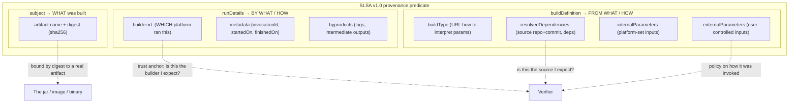
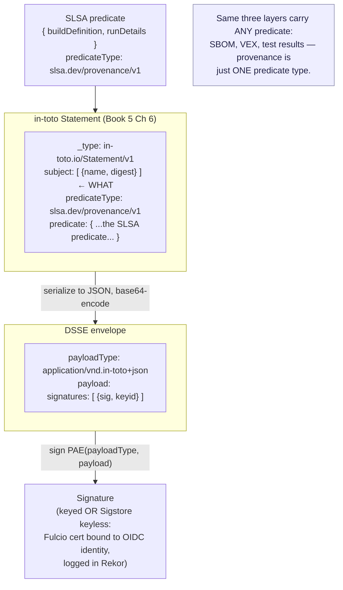
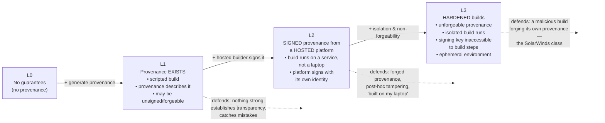
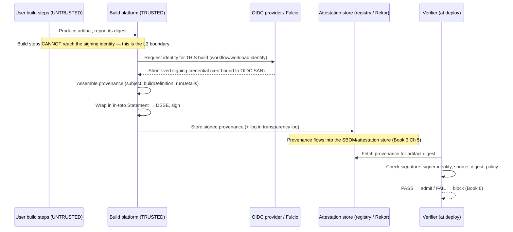

# Chapter 3 — SLSA Build Levels and Provenance

*What this chapter covers.* Chapter 1 ended with a question that no control in the SolarWinds
chain was positioned to answer: *did the build faithfully transform the reviewed source into
the shipped artifact?* Chapter 2 made that question *answerable* by making builds hermetic and
reproducible. This chapter is about the artifact that finally *answers* it —
**provenance** — and the framework that grades how much you can trust that answer:
**SLSA v1.0** (as of early 2026; see https://slsa.dev/spec/v1.0/ for the latest point releases and track updates), the Supply-chain Levels for Software Artifacts. Book 1, Chapter 7 introduced
SLSA as one framework among several (alongside SSDF and S2C2F). Here we take the Build track
apart mechanically. We define exactly what provenance *is* as a data structure — an in-toto
attestation carrying the `https://slsa.dev/provenance/v1` predicate, wrapped in a DSSE
envelope and signed — and read a real one field by field. We then walk the Build levels
(L0 through L3) precisely: what each *requires*, what each *defends against*, and what a
verifier must *check* to believe it. We look at how real platforms — the SLSA GitHub
Generator, GitHub's native `actions/attest-build-provenance`, Google Cloud Build, GitLab,
and Tekton Chains — produce this provenance, mostly "for free" once the platform owns the
signing identity. Finally we take the distributed-systems view: at fleet scale, provenance is
a *platform* deliverable, not a per-repo chore, and L3's isolation requirement is what drives
the ephemeral-build-environment design of Chapter 8.

Learning goals — after this chapter you should be able to:

- State precisely what SLSA v1.0 is and is not: a framework for **verifiable build integrity**,
  organized into **tracks**, with the **Build track** defined normatively in v1.0 — *not* a
  measure of code quality, vulnerability-freedom, or source-review rigor.
- Explain **provenance** as the answer to "how was this artifact built?": its content model
  (subject / buildDefinition / runDetails → *what / from what / by what / how*) and its exact
  SLSA v1.0 predicate schema, without inventing fields.
- Describe the **layering** — in-toto Statement → DSSE envelope → signature — and explain why
  provenance is a *specific predicate type* carried by generic attestation machinery.
- Distinguish **Build L0, L1, L2, and L3** by requirement, threat defended, and verification
  obligation, and explain why v1.0 **removed the old L4** and made L3 the top of the Build track.
- Explain how a hosted CI platform plus an **OIDC workload identity** plus **Sigstore** yields
  L2/L3 provenance, using the SLSA GitHub Generator and `actions/attest-build-provenance` as
  worked examples.
- Describe what a **verifier** (`slsa-verifier`, `cosign verify-attestation`) checks, and where
  that check gates deployment.

## SLSA, recapped and bounded

**SLSA** (pronounced "salsa") is *Supply-chain Levels for Software Artifacts*, a specification
stewarded by the **OpenSSF** (Open Source Security Foundation). Version **1.0** was published in
**April 2023** (current as of early 2026 — consult https://slsa.dev/spec/v1.0/ for errata and any post-1.0 tracks), a substantial restructuring of the earlier v0.1 draft (which Google had
open-sourced in 2021). The single most important structural change in v1.0 is that SLSA is now
organized into **tracks** — independent ladders of increasing rigor, each covering a different
part of the supply chain. v1.0 defines exactly one track normatively: the **Build track**,
with levels **L0–L3**. A **Source track** and others are under development and are explicitly
*not* what v1.0's levels certify. When someone says "we're SLSA L3," in v1.0 vocabulary they
mean **Build L3** unless they say otherwise. This chapter is entirely about the Build track.

It is worth restating the boundary that Book 1, Chapter 7 drew, because it is the most commonly
misread thing about SLSA. **SLSA measures build integrity, not software goodness.** A SLSA
Build L3 artifact can be a pile of exploitable code full of known-vulnerable dependencies. What
L3 certifies is narrow and specific: that the artifact was produced by a *particular, trusted
build process, from a particular source, on a hardened platform, and that this fact is recorded
in an unforgeable, verifiable statement.* It answers "was this built the way I think it was?" —
not "is this code any good?" Vulnerability management is Book 2 and Book 3's job; source-review
integrity is Book 7's; SLSA's Build track answers the one question the SolarWinds chain could
not. Keep the two axes separate: an artifact has a *build-integrity* level (SLSA) and,
orthogonally, a *security posture* (vulns, secrets, quality). Neither implies the other.

SLSA also has a *Threats & mitigations* model, which Chapter 1 already mapped to build stages:
threats (B) build-from-modified-source, (C) compromise-the-build-process, (D) poisoned
dependency, (E) tamper-before-publish, (F) registry compromise. The Build track's levels are
best understood as *a staged answer to threats (B), (C), and (E)* — the ones that live inside
the build itself. Provenance is the mechanism; the levels grade how strongly the provenance can
be trusted.

## Provenance: the core artifact

**Provenance** is a signed, machine-readable attestation that describes *how a specific
artifact was produced*. It is the "verifiable record of the build." Where a code signature says
only *"someone holding this key vouches for these bytes,"* provenance says *"this specific
build process, running on this platform, from this source at this revision, with these
parameters, produced an artifact with this digest."* It converts the build from an opaque,
unattested transformation into a documented, checkable one.

The content of provenance answers four questions, and it is worth holding these four in mind as
the organizing spine of the whole schema:

- **What was built?** — the **subject**: the artifact(s), identified by cryptographic digest
  (typically `sha256`). This is the thing the provenance is *about*, and the anchor a verifier
  uses to bind provenance to a concrete artifact it holds.
- **From what?** — the inputs: the **source repository and revision**, the **resolved
  dependencies**, and the **build configuration**. This is what lets a verifier assert "built
  from the repo I expected, at a commit I trust."
- **By what?** — the **builder identity**: *which build platform* ran this. Not a person — a
  system. `https://github.com/actions/runner/github-hosted`, a Cloud Build worker, a Tekton
  Chains signer. This is the trust anchor: a verifier decides whether it trusts *that builder*.
- **How?** — the **build process**: the build type, entrypoint, external and internal
  parameters, and run metadata (when it ran, a unique invocation ID). This is what lets a
  verifier enforce policy on *how* the build was invoked (e.g., "only from the `main` branch
  via the release workflow").



### The SLSA v1.0 provenance predicate schema

The v1.0 provenance is identified by the predicate type **`https://slsa.dev/provenance/v1`**.
Its predicate object has exactly **two top-level fields**: `buildDefinition` and `runDetails`.
Do not confuse this with the older v0.2 predicate (`predicateType`
`https://slsa.dev/provenance/v0.2`), which used `builder`, `buildType`, `invocation`,
`materials`, and `metadata` at the top level — a different shape. The v1.0 fields are:

**`buildDefinition`** — the *external, reproducible description* of the build. In principle,
another party with the same build platform and this object could re-run the build. Its fields:

- **`buildType`** (URI, required) — a schema identifier telling a verifier *how to interpret*
  `externalParameters` and `resolvedDependencies`. It is the "MIME type" of the build. Example:
  `https://actions.github.io/buildtypes/workflow/v1` for a GitHub Actions workflow, or
  `https://slsa.dev/container-based-build/v0.1`. The buildType is a contract: given this URI, a
  verifier knows what keys to expect below.
- **`externalParameters`** (object, required) — the inputs *under external (user) control* that
  are semantically part of the build request: the workflow reference, the source repository,
  user-supplied workflow inputs. These are the parameters an attacker would want to influence,
  so verifiers scrutinize them hardest.
- **`internalParameters`** (object, optional) — inputs *set by the build platform itself*, not
  the user: GitHub's `github` context values (event name, repository ID, runner environment),
  default configuration. Recorded for completeness and forensics.
- **`resolvedDependencies`** (array, optional) — the *fully-resolved* inputs actually consumed:
  the source repo pinned to a **git commit digest**, container base images by digest, resolved
  package versions. Each entry is a `ResourceDescriptor` — `{uri, digest, name, ...}`. This is
  where "from what" is nailed down to immutable identifiers.

**`runDetails`** — the *record of the particular execution*. It describes what actually
happened, as opposed to what was requested. Its fields:

- **`builder`** (object, required) — the build platform identity.
  - **`builder.id`** (URI, required) — the **identity of the build platform** that produced and
    is responsible for this provenance. This is the field a verifier's trust decision hinges on.
  - **`builder.builderDependencies`** (array, optional) — tools/components the builder itself
    depended on, by digest.
  - **`builder.version`** (object, optional) — versions of the builder's components.
- **`metadata`** (object, optional) — a `BuildMetadata` object:
  - **`invocationId`** — a globally-unique identifier for this build run (e.g., a link to the
    CI run). Critical for correlating provenance to logs.
  - **`startedOn`** / **`finishedOn`** — RFC 3339 timestamps bracketing the build.
- **`byproducts`** (array, optional) — additional outputs of the build that are not the primary
  subject: build logs, intermediate manifests, SBOMs. Also `ResourceDescriptor`s.

That is the *entire* v1.0 predicate. There is no `materials` field (that was v0.2), no
`recipe`, no `builderConfig`. If you see those, you are reading an older or a non-SLSA schema.
The discipline the STYLE guide demands — *do not invent schema fields* — is easy here because
the schema is small: two objects, and everything nests under `buildDefinition` or `runDetails`.

### Provenance is an in-toto attestation, wrapped in DSSE

The provenance *predicate* is only the innermost payload. To become a usable, signed artifact,
it is wrapped in two more layers. Understanding the layering is essential, because it is why
provenance and, say, an SBOM attestation or a test-result attestation all look structurally
alike — they share the outer machinery and differ only in the predicate.

**Layer 1 — the in-toto Statement.** The predicate is embedded in an **in-toto Statement**
(Book 5, Chapter 6 — in-toto: Attestations, Layouts, and Policies), the generic envelope for
"a claim about an artifact." A v1 Statement has four fields:

- `_type`: `https://in-toto.io/Statement/v1` — declares this is an in-toto v1 Statement.
- `subject`: an array of `{name, digest}` — *which artifacts* this statement is about. This is
  where the provenance's "what was built" lives; the digest here is what binds the whole
  attestation to a concrete artifact.
- `predicateType`: `https://slsa.dev/provenance/v1` — *what kind* of claim this is. This is the
  discriminator that tells a consumer "this is SLSA provenance," as opposed to an SBOM
  (`https://cyclonedx.org/bom`) or a vulnerability scan.
- `predicate`: the SLSA `buildDefinition` + `runDetails` object described above.

So `subject` and `predicateType` belong to the *Statement* layer (in-toto), while
`buildDefinition`/`runDetails` are the *predicate* (SLSA). A common point of confusion is
"where does `subject` live?" — it lives at the Statement level, one level *above* the SLSA
predicate, because *every* in-toto attestation has a subject regardless of predicate type.

**Layer 2 — the DSSE envelope.** The Statement is serialized to JSON and wrapped in a **DSSE**
(Dead Simple Signing Envelope). DSSE is a signing envelope designed to sign an arbitrary
payload together with its type, avoiding canonicalization pitfalls (it uses a
*Pre-Authentication Encoding*, PAE, so the signature covers both the payload and its
`payloadType`). A DSSE envelope has:

- `payloadType`: `application/vnd.in-toto+json` — the type of the wrapped payload.
- `payload`: the **base64-encoded** in-toto Statement JSON.
- `signatures`: an array of `{sig, keyid}` (or, in the Sigstore keyless model, an accompanying
  certificate). The signature is over the PAE of `(payloadType, payload)`.

**Layer 3 — the signature and its identity.** Who signs, and how a verifier learns the signing
identity, is Book 5's subject. In the keyless Sigstore model (Book 5, Chapters 3–4), the build
platform obtains a short-lived certificate from **Fulcio** bound to its **OIDC identity**, signs
the DSSE, and records the signature in the **Rekor** transparency log. The `builder.id` in
`runDetails` and the OIDC identity in the signing certificate should *agree* — that agreement is
what makes the provenance unforgeable by anyone who is not that builder.



The payoff of this layering is *generality*: the signing and transport machinery (in-toto +
DSSE + Sigstore) is predicate-agnostic. Provenance is "just" the predicate type
`https://slsa.dev/provenance/v1`. The same pipeline that signs and stores provenance stores
your SBOM attestations (Book 3, Chapter 5 — SBOM Distribution, Storage, and Querying at Scale)
and your VEX documents (Book 3, Chapter 6). This is why "attestation store" is a single piece of
infrastructure rather than one per claim type.

### A real SLSA v1.0 provenance attestation

Here is a complete, correct example, in the shape produced by GitHub's
`actions/attest-build-provenance` for a container image. The outer object is the in-toto
Statement (what you get after base64-decoding the DSSE `payload`); the DSSE wrapper and Sigstore
certificate are shown separately below.

```json
{
  "_type": "https://in-toto.io/Statement/v1",
  "subject": [
    {
      "name": "ghcr.io/acme/payments-api",
      "digest": {
        "sha256": "3f79bb7b435b05321651daefd374cd21d2f8f1b5e3f2e9a6c0b1d9e8a7c6b5a4"
      }
    }
  ],
  "predicateType": "https://slsa.dev/provenance/v1",
  "predicate": {
    "buildDefinition": {
      "buildType": "https://actions.github.io/buildtypes/workflow/v1",
      "externalParameters": {
        "workflow": {
          "ref": "refs/heads/main",
          "repository": "https://github.com/acme/payments-api",
          "path": ".github/workflows/release.yml"
        }
      },
      "internalParameters": {
        "github": {
          "event_name": "push",
          "repository_id": "612345678",
          "repository_owner_id": "98765432",
          "runner_environment": "github-hosted"
        }
      },
      "resolvedDependencies": [
        {
          "uri": "git+https://github.com/acme/payments-api@refs/heads/main",
          "digest": {
            "gitCommit": "7c2f4a9e1b3d5c6f8a0e2b4d6f8a0c2e4b6d8f0a"
          }
        }
      ]
    },
    "runDetails": {
      "builder": {
        "id": "https://github.com/acme/payments-api/.github/workflows/release.yml@refs/heads/main"
      },
      "metadata": {
        "invocationId": "https://github.com/acme/payments-api/actions/runs/9876543210/attempts/1"
      }
    }
  }
}
```

Read it against the four questions. **What**: the `subject` — an image identified by its
`sha256` digest. **From what**: `resolvedDependencies[0]` pins the source to a `gitCommit`, and
`externalParameters.workflow` records the repo, ref, and workflow file. **By what**:
`runDetails.builder.id` names the workflow identity that produced it. **How**: `buildType` says
"interpret this as a GitHub Actions workflow," and `invocationId` links to the exact run. Note
what is *absent* — no CVE data, no test results, no vulnerability claims. That is by design;
provenance is about the build, not the goodness.

The DSSE envelope that carries this, as stored (e.g., attached to the image in the OCI registry
or logged in Rekor), looks like:

```json
{
  "payloadType": "application/vnd.in-toto+json",
  "payload": "eyJfdHlwZSI6Imh0dHBzOi8vaW4tdG90by5pby9TdGF0ZW1lbnQvdjEiLC4uLn0=",
  "signatures": [
    {
      "sig": "MEUCIQCw...base64-DER-ECDSA-signature...AiEA9k=="
    }
  ]
}
```

In the keyless model, the verifying material is not a long-lived public key but a short-lived
**Fulcio** X.509 certificate whose Subject Alternative Name is the workflow's OIDC identity —
for a GitHub-hosted build, something like
`https://github.com/acme/payments-api/.github/workflows/release.yml@refs/heads/main`, with
certificate extensions recording the issuer (`https://token.actions.githubusercontent.com`),
the trigger, the commit SHA, and the run ID. The `builder.id` in the payload and the SAN in the
certificate describe the *same* identity from two directions — the payload *claims* it, the
certificate *proves* it. A verifier checks that they match. That cross-check is the seam where a
forged provenance would fail.

## The SLSA Build levels

The Build track defines four levels. Each is *cumulative*: L2 includes everything in L1, L3
everything in L2. The progression is not "more provenance fields" — it is *increasing
trustworthiness of the same provenance*, driven by *who generates it* and *how well the build
is isolated from tampering with its own attestation*.



### Build L0 — no guarantees

L0 is the absence of any SLSA claim: no provenance is produced. This is where most software in
the world sits today. There is nothing to verify, so a consumer has no machine-checkable basis
for any statement about how the artifact was built. L0 exists in the model only as the baseline
the ladder climbs away from.

### Build L1 — provenance exists

At **L1**, two things are true: the build **runs from a consistent, defined process** (a build
script — a `Makefile`, a CI workflow, a `Dockerfile` — rather than ad-hoc manual steps), and it
**generates provenance** describing how the artifact was built, made available to consumers. The
provenance must be complete enough to be useful, but at L1 it **may be unsigned, and it is
forgeable** — anyone could have produced it, and there is no cryptographic binding to a trusted
builder.

What does L1 actually buy you if the provenance is forgeable? Two real things. First,
**transparency and mistake-catching**: an honest team that publishes provenance can *itself*
detect when a build used the wrong source, an unexpected dependency, or a mis-configured
pipeline — the provenance surfaces the build's inputs for review, and downstream consumers can
sanity-check them. Second, and more importantly, **it establishes the practice**: the pipeline
now emits provenance as a matter of course, so raising the trust level later is a matter of
*where it is generated and how it is signed*, not of inventing the capability. L1 defends
against essentially *no determined adversary* — a malicious builder can write whatever
provenance it likes — but it is the difference between "we could verify builds if we chose to"
and "we have no build metadata at all."

### Build L2 — signed provenance from a hosted platform

**L2** adds two requirements that, together, defeat forgery by outsiders and tampering after the
fact. First, the build must run on a **hosted build platform** — a shared build service (GitHub
Actions, GitLab CI, Google Cloud Build, a Tekton cluster), *not* a developer's laptop or a
one-off machine. Second, that platform **cryptographically signs** the provenance using an
identity that belongs to the *platform*, not to the user's build steps.

The two shifts matter for distinct reasons. Moving off the laptop removes the
"built-on-my-machine" ambiguity: there is now a *specific, addressable builder identity*
(`builder.id`) responsible for the artifact, and an audit trail (the CI run, the `invocationId`)
behind it. Signing makes the provenance **authenticated to that platform**: a verifier can check
the signature and know the provenance was produced by *that builder* and has not been altered
since. A consumer can now assert, cryptographically, "this artifact was built by GitHub Actions
for repo X" — and no attacker who does not control that builder's signing identity can forge
that claim or swap the recorded digest.

L2 defends against: **forged provenance** by third parties, **post-build tampering** with the
provenance (any alteration breaks the signature), and the ambiguity of untraceable builds. What
L2 does *not* yet defend against is the subtle, crucial case: **the build's own steps forging or
influencing the provenance.** At L2, the build runs on a hosted platform, but the user-controlled
build steps may still run in the same trust domain as the provenance generator — they might be
able to reach the signing material, or to influence what the platform records. That gap is
exactly what L3 closes.

### Build L3 — hardened builds

**L3** is the current top of the Build track. It adds the requirement that the build platform
provide **strong guarantees of isolation and non-forgeability**. Specifically:

- **Provenance is unforgeable — even by the build's own steps.** The mechanism that generates
  and signs provenance must be **inaccessible to user-defined build steps.** The signing key (or
  the ephemeral Fulcio identity) must live somewhere the build code cannot read it, so that a
  malicious build cannot sign a provenance claiming it built something it did not, nor tamper
  with the digest or source recorded for its own run.
- **Builds are isolated from one another.** One build must not be able to influence another
  build's process or provenance — no shared mutable state, no cross-contamination through caches
  or runners (Chapter 7 on cache poisoning; Chapter 8 on ephemerality). The build environment is
  **ephemeral and isolated**: provisioned fresh, torn down after, with no persistence that a
  prior (possibly malicious) build could have poisoned.

The threat L3 defends against is the one that makes Book 4 exist: **a malicious build forging its
own provenance, or one build tampering with another.** Recall SolarWinds/SUNSPOT — an implant in
the build environment substituting bytes at compile time. At L3, the provenance-generation and
signing sit *outside* the tampering reach of the user build steps, so even a build whose steps
are fully attacker-controlled cannot make the platform sign a lie about *which source produced
which digest*. The build can still emit a malicious artifact — L3 does not stop bad code — but it
**cannot lie in the provenance about having done so.** The recorded source commit and output
digest are trustworthy, so a verifier comparing them against policy will catch a build that ran
from the wrong source or produced an unexpected artifact. This is the property that closes the
"the build process is compromised" (threat C) hole for the *attestation*: you may not prevent the
tampering, but you make it *undeniable and detectable* downstream.

Achieving L3 is fundamentally a **platform** property, not something a build script can assert
about itself. It requires the platform architecture to separate the untrusted, user-controlled
build from the trusted provenance generator — which is why L3 is a build-platform capability you
adopt (GitHub's reusable SLSA workflows, Cloud Build, Tekton Chains with proper isolation) rather
than a checklist you complete in your own YAML.

### On the removed L4

SLSA v0.1 had a fourth level, **L4**, whose requirements centered on **two-person review of all
changes** and **hermetic, reproducible builds**. In the v1.0 restructuring, the OpenSSF
**removed L4 from the Build track.** The reasoning: those requirements are heterogeneous — some
(two-person review) are really *source*-track concerns, and some (hermeticity/reproducibility,
Chapter 2) are valuable but do not fit cleanly as a single "level 4" of *build* integrity.
Rather than overload the Build track, v1.0 makes **L3 the top of the Build track** and defers the
old L4 material to other tracks (the Source track for review requirements) and to complementary
practices (reproducible builds as an independent property that *strengthens* verification but is
not itself a Build level). So: in v1.0 there is no Build L4. If a document references "SLSA 4,"
it is either citing v0.1 or speaking loosely. The ladder you climb today is L0 → L1 → L2 → L3.

### The Build levels at a glance

| Level | Requirement | Defends against | What a verifier checks |
|-------|-------------|-----------------|------------------------|
| **L0** | Nothing | Nothing | N/A — no provenance |
| **L1** | Scripted build **generates provenance** (may be unsigned/forgeable) | Honest mistakes; establishes transparency. No determined adversary. | Provenance exists and is well-formed; inputs look sane |
| **L2** | Build runs on a **hosted platform** that **signs** provenance with its own identity | Forged provenance by outsiders; post-hoc tampering; untraceable "laptop" builds | Signature valid + signer is the expected builder; subject digest matches artifact |
| **L3** | Platform makes provenance **unforgeable even by build steps**; builds are **isolated & ephemeral**; signing material inaccessible to user code | A malicious build forging its **own** provenance; one build tampering with another (SolarWinds class) | Everything at L2, **plus** trust that `builder.id` implies isolation guarantees; policy on source/params is now meaningfully enforceable |

The rightmost column is the operational punchline: **the level determines how much a verifier's
checks are worth.** At L1 the verifier can read provenance but cannot trust it against an
adversary. At L2 the verifier trusts *that the named builder produced it.* At L3 the verifier
additionally trusts *that the named builder could not have been coerced by the build's own code
into lying* — which is what makes source-and-parameter policy enforcement (below) actually
meaningful.

## Producing provenance: real implementations

The recurring pattern across every serious implementation is the same, and it is worth stating
before the specifics: **the platform — not the user's build steps — generates and signs the
provenance, using an identity the build steps cannot access.** That last clause is the entire
difference between L2 and L3. Everything below is a variation on how a given platform achieves
that separation.

### GitHub Actions: two paths to signed provenance

GitHub offers two mechanisms, and it is important not to conflate them.

**1. The SLSA GitHub Generator (`slsa-framework/slsa-github-generator`).** This is a set of
**reusable workflows** maintained by the SLSA project that reach **Build L3** on GitHub-hosted
runners. The key architectural trick is *isolation via the reusable-workflow boundary*: your
build calls the generator as a separate reusable workflow (`uses:
slsa-framework/slsa-github-generator/.github/workflows/generator_generic_slsa3.yml@v...`), and
that reusable workflow runs in a **separate job with its own OIDC identity**, distinct from your
build job. Your (untrusted) build steps produce the artifact and hand its *hash* to the
generator; the generator — whose job your build steps cannot inject code into — mints the
provenance, obtains a signing identity via **OIDC**, signs via Sigstore, and logs to Rekor. Your
build code never touches the signing identity. That separation is what earns L3: even a fully
malicious build job cannot forge the provenance the generator emits, because it runs in a
different job it cannot reach into. The generator's `builder.id` names the reusable workflow ref,
so a verifier can require *that specific trusted generator*.

**2. Native build provenance: `actions/attest-build-provenance`.** GitHub's first-party action
(GA since 2024) produces **build provenance attestations** directly, backed by **Sigstore** —
signing keylessly via **Fulcio** using the workflow's OIDC identity, and recording in the
**public-good Rekor** transparency log. A single step:

```yaml
permissions:
  id-token: write        # to fetch the OIDC token (the build identity)
  attestations: write    # to store the attestation on GitHub
  contents: read

steps:
  - uses: actions/checkout@v4
  - name: Build image
    run: |
      docker build -t ghcr.io/acme/payments-api:latest .
      digest=$(docker inspect --format='{{index .RepoDigests 0}}' ghcr.io/acme/payments-api:latest)
      echo "digest=${digest#*@}" >> "$GITHUB_OUTPUT"
    id: build
  - uses: actions/attest-build-provenance@v1
    with:
      subject-name: ghcr.io/acme/payments-api
      subject-digest: ${{ steps.build.outputs.digest }}
      push-to-registry: true
```

The `id-token: write` permission is the linchpin: it lets the job fetch a short-lived **OIDC
token** from `token.actions.githubusercontent.com` that encodes the workflow identity (repo, ref,
workflow path, commit, run ID). The action exchanges that token at Fulcio for a signing
certificate bound to the identity, signs the DSSE-wrapped provenance, and logs it. Because the
identity is minted by GitHub's OIDC provider — not by anything the build controls — the resulting
provenance is authenticated to the workflow. Whether this reaches **L2 or L3** depends on the
isolation between the build steps and the token: run on GitHub-hosted runners with the
attestation as a distinct trust boundary and it approaches L3; the SLSA generator's separate-job
model gives the cleaner L3 story. Either way, note what the engineer had to do: *almost nothing.*
Add a permission and a step. The hosted CI + OIDC identity + Sigstore stack yields signed
provenance essentially "for free" — the platform already knows who is building, when, from what.
That is the point of the paved road.

### Google Cloud Build, GitLab, and Tekton Chains

The same pattern recurs on other platforms, each generating provenance from the *platform side*:

- **Google Cloud Build** automatically generates SLSA build provenance for builds it runs, signed
  by Google's build service and stored alongside the image in Artifact Registry. Because Cloud
  Build controls the worker and the signing, the build steps do not hold the signing identity —
  the L2/L3 isolation story is a property of the managed service.
- **GitLab CI** can emit SLSA provenance statements for build artifacts, tied to the pipeline's
  identity, using GitLab's OIDC and runner model.
- **Tekton Chains** is the most instructive because it makes the separation explicit. Tekton
  Chains is a **controller that observes `TaskRun`/`PipelineRun` objects** in a Tekton cluster
  and, *after* a run completes, reads its inputs and results from the Kubernetes API and generates
  a signed provenance attestation (SLSA format, in-toto/DSSE), signing with a key the *controller*
  holds — **not** the pipeline pods. The build pods run untrusted user code; the Chains controller
  runs in a separate, privileged context with the signing key mounted where the build pods cannot
  reach it. That architectural separation — *observer generates provenance, build cannot touch the
  signer* — is precisely the L3 property, expressed in Kubernetes terms. Chains can store the
  attestation in an OCI registry (as a referring artifact) or a transparency log.



## Verifying provenance: the consumer side

Producing provenance is inert without verification — an unverified attestation is a comment
field. Verification is where provenance *does work*, and it is the subject of Book 5, Chapter 8
(Provenance Verification in Practice); here we outline what a verifier checks and where.

A provenance verifier answers a policy question of the form: *"Was this artifact
(by digest) built by the builder I trust, from the source I expect, under the constraints I
require?"* Concretely, it checks:

1. **Signature validity + signer identity.** Is the DSSE signature valid, and — crucially — does
   the signing identity match the **expected builder**? In the keyless model this means verifying
   the Fulcio certificate chains to the Sigstore root, that the OIDC issuer is the expected one
   (e.g., `token.actions.githubusercontent.com`), and that the certificate's SAN identity matches
   the expected workflow. A valid signature by the *wrong* identity must fail.
2. **Subject digest matches the artifact.** The `subject[].digest` in the provenance must equal
   the digest of the artifact actually being deployed. This binds the attestation to *this* bit
   pattern; without it, an attacker could present valid provenance for a *different* artifact.
3. **Source repository and revision are expected.** `resolvedDependencies` / `externalParameters`
   must show the artifact was built from the repo and (often) the branch/commit you trust — e.g.,
   `github.com/acme/payments-api` on `refs/heads/main`, not a fork or a PR branch.
4. **The builder is trusted.** `builder.id` must be an allowed builder — and, for L3, one whose
   isolation properties you rely on (the SLSA generator's reusable workflow, a specific Cloud
   Build service, your Tekton Chains signer).
5. **Policy on build parameters.** Any additional constraints: the build ran on a
   `github-hosted` runner (not self-hosted), from the release workflow file, on a protected
   branch, etc. — all readable from `externalParameters`/`internalParameters`.

Two tools embody this:

```bash
# slsa-verifier: purpose-built for SLSA provenance from known builders.
slsa-verifier verify-image ghcr.io/acme/payments-api@sha256:3f79bb7b... \
  --source-uri github.com/acme/payments-api \
  --source-branch main \
  --builder-id "https://github.com/acme/payments-api/.github/workflows/release.yml@refs/heads/main"

# cosign: general attestation verification, keyless, with an identity/issuer policy.
cosign verify-attestation \
  --type slsaprovenance \
  --certificate-identity-regexp "^https://github.com/acme/payments-api/.github/workflows/release.yml@.*" \
  --certificate-oidc-issuer https://token.actions.githubusercontent.com \
  ghcr.io/acme/payments-api@sha256:3f79bb7b...
```

`slsa-verifier` encodes SLSA-specific knowledge of known builders and their provenance formats
and is the safer default for SLSA provenance; `cosign verify-attestation` is the general-purpose
tool, requiring you to specify the identity and issuer policy explicitly. Note that **both take
the artifact by digest, not by tag** — verifying `:latest` is meaningless because tags are
mutable; you verify the immutable digest you are about to run.

Where does this check *run*? At the **deployment gate**. Book 5, Chapter 10 (Designing
Attestation-Based Deployment Gates) and Book 6, Chapters 5–6 (Image Signing and Verification in
Kubernetes; Admission Control and Policy Engines) place verification at **admission time** in the
cluster: a Kyverno or a Sigstore-policy-controller admission webhook fetches the provenance for
the image being admitted, runs exactly the checks above, and **blocks the deployment if
verification fails.** That is the moment the whole chain pays off — the SolarWinds-class tampered
artifact, lacking valid provenance from the expected builder and source, never reaches
production.

## Distributed-systems lens: provenance is a platform deliverable

At the scale this book assumes — hundreds of services, dozens of teams, thousands of builds a day
— the central insight about provenance is organizational as much as technical: **provenance
generation belongs to the shared build platform, not to individual teams.** Every point below
follows from that.

**Uniform coverage requires centralization.** If reaching L2/L3 were a per-repo task — each team
adding the right steps, wiring OIDC, configuring signing — coverage would be a patchwork, and the
one team that skipped it is the gap an attacker walks through. Provenance only delivers fleet-wide
assurance if *every* tenant's artifacts get it *automatically*. That is the **paved road** (Chapter
10 — Designing a Secure Build Platform at Scale): the shared platform emits signed provenance for
every build by default, so that "is this artifact SLSA L3?" has the same answer for every service
in the org without any team opting in. Individual teams cannot be trusted to do it consistently —
not from malice, but from the ordinary entropy of a hundred backlogs. Make it a platform property
and the question disappears.

**Builder identity is the trust anchor, and it is a workload identity.** In a fleet, "who built
this?" cannot be a human name. It is the **OIDC / workload identity** the platform assigns to each
build (Book 5, Chapter 4 — Keyless Signing and Workload Identity), bound into the provenance's
`builder.id` and proven by the Sigstore certificate's SAN. This is the hinge between Book 4 and
Book 5: the build's identity is what lets a verifier *somewhere else entirely* in the distributed
system decide whether to trust an artifact — not merely that it was signed, but that it was built
by the right builder, from the right source, under the right policy. Get the identity model right
and the whole distributed trust graph has a foundation; get it wrong and every downstream
signature is just "someone endorsed some bytes."

**Provenance flows into the attestation store and is verified at admission.** Provenance is not a
build-time curiosity; it is data with a lifecycle. It is generated at build (this chapter), stored
in the shared **SBOM/attestation store** (Book 3, Chapter 5) alongside SBOMs and VEX — all sharing
the in-toto/DSSE machinery — and **verified at admission** (Book 6, Chapters 5–6) as the gate on
deployment. The distributed-systems shape is a *pipeline of trust*: produce → store → verify, with
the producer and verifier often owned by different teams in different trust domains, communicating
only through signed, self-describing attestations. That is what lets the system scale: the verifier
does not need to trust the producer's infrastructure, only the producer's *identity and signature*.

**L3's isolation requirement drives the ephemeral-build design.** The reason Chapter 8 (Ephemeral
and Isolated Build Environments) exists is, in large part, SLSA L3. The requirement that provenance
be unforgeable *even by the build's own steps*, and that builds not contaminate one another, is
only satisfiable if build environments are isolated and ephemeral — provisioned fresh, torn down
after, with the signing identity architecturally out of reach of user code. So "reach L3" and
"build ephemerally and isolate tenants" are two descriptions of the same platform investment. The
multi-tenant isolation Chapter 1 flagged (Team A's build must not influence Team B's or steal its
secrets) is *the same property* as L3's cross-build isolation, viewed from the tenancy angle.

**Reaching L3 across the fleet is a platform-team deliverable.** The clean summary: an individual
repo cannot honestly self-certify Build L3, because L3 is about properties of the *builder* — its
isolation, its inaccessible signing material, its ephemerality — that no build script can assert
about itself. L3 is delivered by the platform team who runs the shared build service and can
guarantee those properties for every tenant. This inverts the usual "security is everyone's
responsibility" framing for this specific control: **provenance and build integrity are the
platform team's responsibility to provide, and every other team's responsibility only to
verify.** That division of labor — centralized production, decentralized verification, mediated by
signed attestations — is what makes build integrity tractable at scale.

With provenance defined and its levels understood, the next chapters turn to the platforms that
must generate it safely: the CI/CD threat models (Chapter 4), hardening GitHub Actions
specifically (Chapter 5), and the secrets and isolation disciplines (Chapters 6 and 8) that make
L3's "the build cannot reach the signing identity" a real architectural guarantee rather than a
hopeful assertion.

## Key takeaways

- **SLSA v1.0** (OpenSSF, April 2023) is organized into **tracks**; v1.0 defines the **Build
  track** (levels L0–L3) normatively. It measures **build integrity**, explicitly *not* code
  quality or vulnerability-freedom — keep the build-integrity axis and the security-posture axis
  separate.
- **Provenance** is a signed attestation answering *what* was built (subject digest), *from what*
  (source repo+revision, resolved dependencies), *by what* (builder identity), and *how* (build
  type, parameters, run metadata). It is the control that finally answers the SolarWinds question.
- The **v1.0 provenance predicate** (`predicateType: https://slsa.dev/provenance/v1`) has exactly
  two top-level fields: **`buildDefinition`** (`buildType`, `externalParameters`,
  `internalParameters`, `resolvedDependencies`) and **`runDetails`** (`builder.id`, `metadata`,
  `byproducts`). There is no `materials` field — that was v0.2.
- Provenance is an **in-toto Statement** (`subject` + `predicateType` + `predicate`) wrapped in a
  **DSSE envelope** and **signed** (keyed, or keyless via Sigstore/Fulcio/Rekor). Provenance is
  one *predicate type* carried by generic attestation machinery shared with SBOMs and VEX.
- **Build levels:** L0 = nothing; **L1** = provenance exists (may be forgeable) — transparency,
  catches mistakes; **L2** = a **hosted platform signs** provenance with its own identity —
  defeats forgery and post-hoc tampering; **L3** = **hardened, isolated** builds where provenance
  is unforgeable *even by the build's own steps* — defeats the SolarWinds-class self-forged
  provenance. **v1.0 removed the old L4;** L3 is the top of the Build track.
- The dominant production pattern is **hosted CI + OIDC workload identity + Sigstore**: the
  *platform* (not the user's build steps) generates and signs provenance using an identity the
  build cannot access. Real implementations: **`slsa-github-generator`** (L3 via separate-job
  reusable workflows), **`actions/attest-build-provenance`** (native, Fulcio+Rekor), **Google
  Cloud Build**, **GitLab**, **Tekton Chains** (a controller that signs *after* the run, outside
  the build pods' reach).
- A **verifier** (`slsa-verifier`, `cosign verify-attestation`) checks signature + signer
  identity, subject-digest match (by digest, never tag), expected source, trusted builder, and
  parameter policy — enforced at the **admission/deployment gate** (Book 5 Ch 10; Book 6 Ch 5–6).
- **Distributed-systems view:** provenance is a **platform deliverable**. Centralize its
  generation on the shared build platform so every tenant gets L2/L3 automatically (paved road);
  anchor trust in **workload identity**; flow provenance into the shared attestation store (Book 3
  Ch 5) and verify at admission (Book 6). **L3's isolation requirement is the same investment as
  ephemeral, tenant-isolated builds (Chapter 8)** — and reaching L3 across a fleet is the platform
  team's job, not a per-repo one.

## Further reading

- **SLSA v1.0** — the specification, especially *Build track / levels* and the *Provenance*
  format pages. https://slsa.dev/spec/v1.0/ and https://slsa.dev/provenance/v1.
- **SLSA v1.0 Threats & mitigations** — how the Build levels map to supply-chain threats
  (B)/(C)/(E). https://slsa.dev/spec/v1.0/threats.
- **in-toto Attestation Framework** — the Statement/predicate model and the `ResourceDescriptor`
  type. https://github.com/in-toto/attestation (developed in Book 5, Chapter 6).
- **DSSE — Dead Simple Signing Envelope** — the envelope and PAE that provenance is signed under.
  https://github.com/secure-systems-lab/dsse.
- **`slsa-framework/slsa-github-generator`** — reusable workflows for SLSA L3 provenance on GitHub
  Actions. https://github.com/slsa-framework/slsa-github-generator.
- **GitHub — `actions/attest-build-provenance`** and *Artifact Attestations* documentation —
  native Sigstore-backed build provenance.
- **Tekton Chains** — provenance generation for Tekton pipelines.
  https://tekton.dev/docs/chains/.
- **`slsa-framework/slsa-verifier`** — verification of SLSA provenance from known builders; and
  **Sigstore `cosign` `verify-attestation`** — general attestation verification.
- Book 1, Chapter 7 (Risk Frameworks: SLSA, SSDF, S2C2F); Book 4, Chapter 1 (build threat model)
  and Chapter 2 (hermetic and reproducible builds); Book 5, Chapters 3–4, 6, 8, 10 (Sigstore,
  keyless/workload identity, in-toto, provenance verification, deployment gates); Book 3, Chapter 5
  (attestation storage); Book 6, Chapters 5–6 (admission-time verification).
