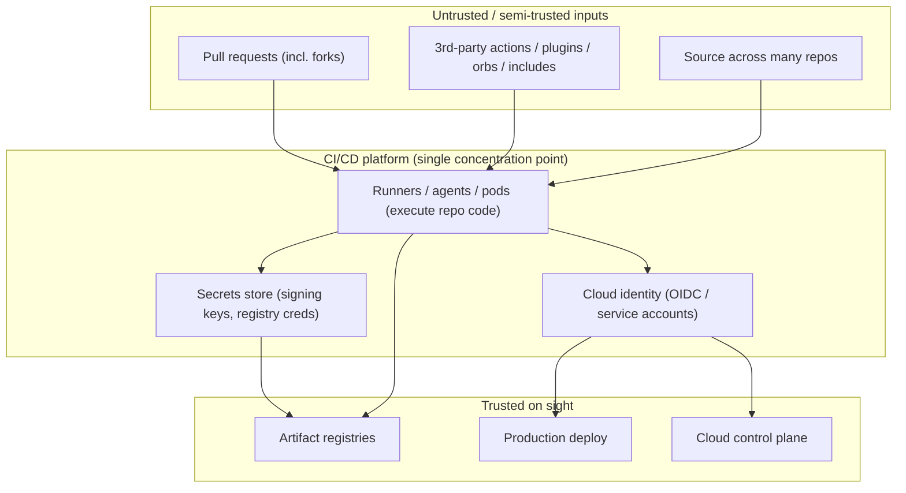
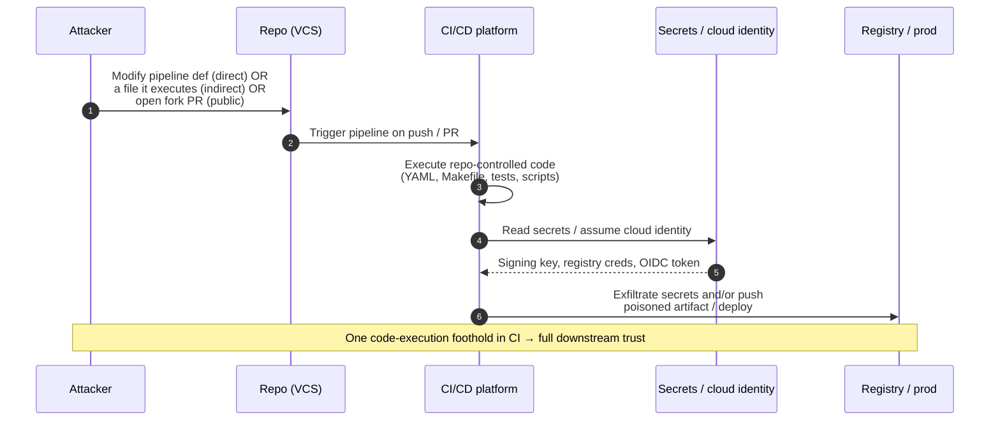
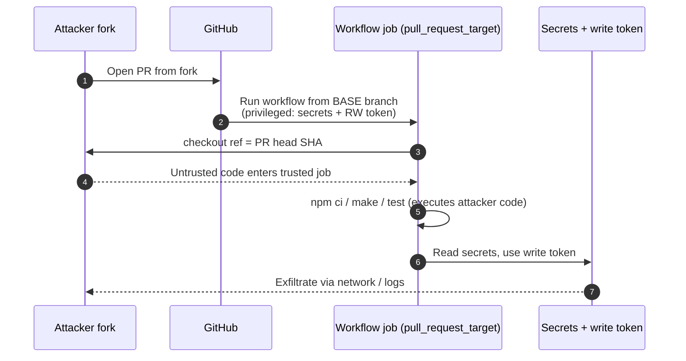
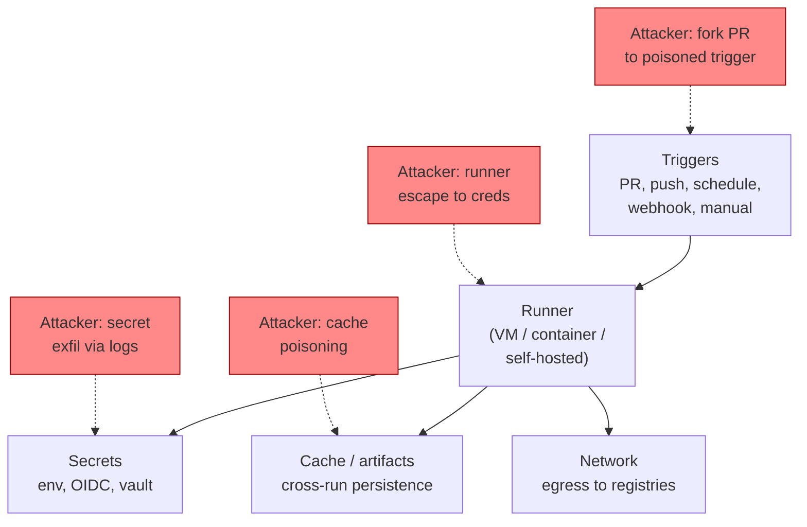
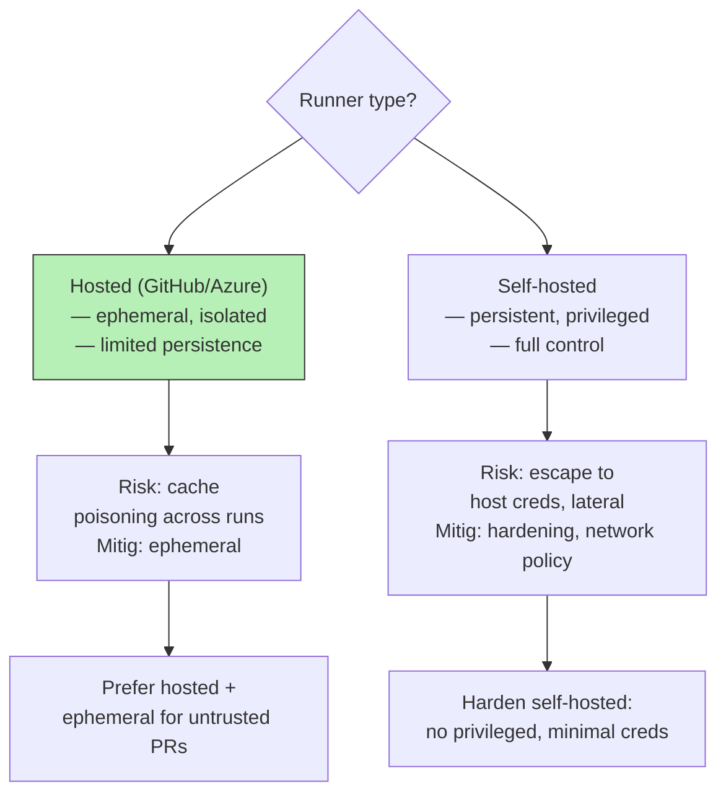
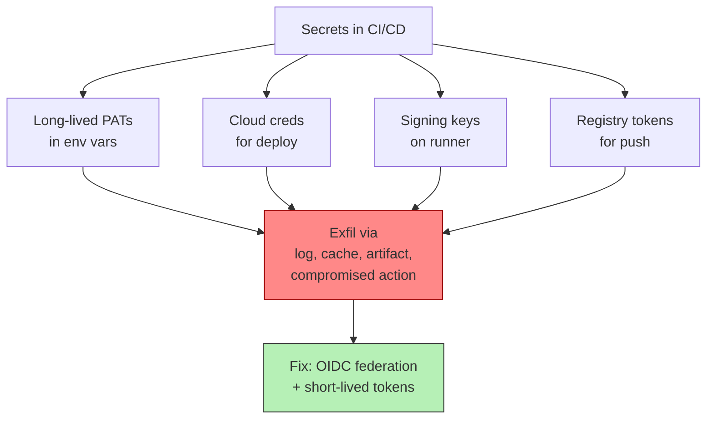

# Chapter 4 — CI/CD Platform Threat Models: Actions, GitLab, Jenkins, Tekton

*What this chapter covers.* Chapter 1 modelled the build in the abstract — a function whose
compromise defeats both source review and code signing. But nobody runs an abstract build.
They run GitHub Actions, or GitLab CI, or a Jenkins controller inherited from 2016, or a
Tekton install wired into their Kubernetes clusters. Each of these is a *real system* with a
concrete architecture, a concrete privilege model, and a concrete set of footguns, and the
threat model that matters to an on-call engineer is the platform-specific one. This chapter
is the comparative threat landscape. We first frame *why* CI/CD systems are a uniquely
dangerous class of target and adopt the **OWASP Top 10 CI/CD Security Risks (2022)** as an
organizing vocabulary. We introduce **Poisoned Pipeline Execution (PPE)** as the central
attack primitive (detailed in Chapter 7). Then we dissect four platforms — GitHub Actions,
GitLab CI, Jenkins, and Tekton — with brief case notes on CircleCI, Azure DevOps, Argo, and
Buildkite. We synthesize the cross-cutting threats, and close by mapping every OWASP CI/CD
risk to the control and chapter that addresses it. GitHub Actions gets its own hardening
chapter (Chapter 5); here it is one platform among several, examined comparatively.

Learning goals — after this chapter you should be able to:

- Explain why a CI/CD platform is a **top-tier target and a single point of compromise**:
  broad standing access, execution of repo-controlled code, continuous operation, and
  universal downstream trust.
- Enumerate the **OWASP Top 10 CI/CD Security Risks (2022)** accurately and use them as a
  shared vocabulary across platforms.
- Distinguish **direct, indirect, and public PPE** and recognize the injection surfaces each
  exploits.
- Describe the concrete threat model of **GitHub Actions, GitLab CI, Jenkins, and Tekton** —
  their isolation model, secrets model, pipeline-as-code exposure, and third-party extension
  risk — and reason about which failure modes each makes easy.
- Explain the **`pull_request` vs `pull_request_target`** footgun, the **`tj-actions/changed-files`**
  compromise (March 2025), and the **CircleCI** breach (January 2023) at a mechanistic level.
- Map each OWASP CI/CD risk to its control and to the chapter of Book 4 that develops it.

## The CI/CD platform as attack surface

Start with what makes a CI/CD platform categorically different from an ordinary service. Four
properties, and it is their *combination* that is lethal.

**It has broad, standing access.** A CI/CD system, by its job, holds read (usually write)
access to source across many repositories, the secrets to sign and publish artifacts, the
credentials to push to registries, and — increasingly — a cloud identity that can deploy to
production. It is not a system that *requests* privilege for a task; it is a system that *sits
on* privilege continuously. Chapter 1 called the build the most over-privileged node in the
pipeline; the CI/CD platform is the *fabric* that concentrates that privilege across your
entire engineering org.

**It executes code from the repository.** This is the property that separates CI/CD from a
database or a message queue. A pipeline definition — `.github/workflows/*.yml`,
`.gitlab-ci.yml`, a `Jenkinsfile`, a Tekton `Pipeline` — *is code*, and it is code that lives
in the repo, is edited through the same pull-request flow as application code, and is often
modifiable by anyone who can open a PR. The platform's job is *literally* to run
attacker-adjacent input. Worse, the pipeline doesn't only run the YAML: it runs the
`Makefile`, the test suite, the `npm` lifecycle scripts, the `Dockerfile`, the linters — all
of which are also repo-controlled code that executes with the pipeline's authority.

**It runs continuously and is trusted by everything downstream.** The platform is always on,
always polling for events, always ready to execute. And every artifact it produces is trusted
on sight by registries, deploy systems, and other pipelines. A compromise here is not a
lateral incident; it is a fan-out. One poisoned build step can taint every artifact the
platform ships, and — via signing keys and deploy credentials — endorse those artifacts as
legitimate.

**It is the join point of source and production.** In most orgs the CI/CD system is the one
place that touches *both* the source tree *and* the production deploy path. Compromise the
source and you still face review and signing. Compromise production directly and you still
face the source of truth. Compromise CI/CD and you have both ends of the pipe at once — which
is exactly why, as Chapter 1 argued with SolarWinds, this node's compromise is uniquely
catastrophic.



The picture is a bowtie: many partly-trusted inputs on the left, a small set of
highly-trusted outputs on the right, and the platform as the knot in the middle holding the
credentials that make the right side possible. Everything an attacker wants is reachable *if*
they can get code to run inside that knot.

### An organizing frame: the OWASP Top 10 CI/CD Security Risks

To talk about many platforms without inventing ad-hoc categories, we use the **OWASP Top 10
CI/CD Security Risks**, published in 2022 (originating from research by Cider Security, since
acquired by Palo Alto Networks). It is the best-known taxonomy for this domain and maps
cleanly onto the platforms below. The ten, with their `CICD-SEC-N` identifiers:

| ID | Risk | One-line meaning |
|----|------|------------------|
| CICD-SEC-1 | Insufficient Flow Control Mechanisms | An actor who can push code / config can push it *through* the pipeline to prod without a gate (review, approval, protected branch). |
| CICD-SEC-2 | Inadequate Identity and Access Management | Sprawl of identities (human, service, machine) with weak, stale, or over-broad access across the CI/CD estate. |
| CICD-SEC-3 | Dependency Chain Abuse | The pipeline fetches dependencies (packages, actions, images) in ways an attacker can hijack — confusion, typosquat, unpinned refs. |
| CICD-SEC-4 | Poisoned Pipeline Execution (PPE) | Getting attacker-controlled commands to run inside the pipeline by manipulating the pipeline definition or files it reads. |
| CICD-SEC-5 | Insufficient PBAC (Pipeline-Based Access Controls) | Pipelines run with more access than the job needs; one compromised step reaches everything the runner can reach. |
| CICD-SEC-6 | Insufficient Credential Hygiene | Secrets that are long-lived, over-scoped, printed to logs, or reachable by untrusted code. |
| CICD-SEC-7 | Insecure System Configuration | Weak platform / runner / controller configuration: default-permissive tokens, exposed consoles, no hardening. |
| CICD-SEC-8 | Ungoverned Usage of 3rd Party Services | Dozens of external SaaS integrations wired into the pipeline with broad scopes and no inventory. |
| CICD-SEC-9 | Improper Artifact Integrity Validation | Nothing verifies that an artifact moving through the pipeline is the one that was built and reviewed. |
| CICD-SEC-10 | Insufficient Logging and Visibility | You cannot tell, during or after, what the pipeline actually did. |

Keep this table in view. Each platform we examine makes some of these risks *easy* and others
*hard*, and the differences are the whole point of a comparative chapter.

### Poisoned Pipeline Execution: the central primitive

Most CI/CD attacks reduce to one thing: **get your code to run in the CI context.** OWASP
calls it Poisoned Pipeline Execution (CICD-SEC-4), and it is worth internalizing the three
flavours now because every platform section returns to them. Chapter 7 is the deep dive; this
is the vocabulary.

- **Direct PPE.** The attacker edits the pipeline definition itself — the workflow YAML, the
  `.gitlab-ci.yml`, the `Jenkinsfile` — and the platform runs it. This is the obvious case,
  and it is guarded (or should be) by requiring review and protection on the files that define
  what the pipeline does.
- **Indirect PPE.** The attacker cannot edit the pipeline definition, but *can* edit a file
  the pipeline *reads and executes*: a `Makefile` target the CI invokes, a test that runs
  during `pytest`, a `package.json` `postinstall` script, a linter config that shells out, a
  `Dockerfile`. The pipeline YAML is clean; the code it calls is not. Indirect PPE is more
  common and harder to spot because the malicious change lives far from the security-reviewed
  YAML.
- **Public PPE.** The injection arrives via a pull request from a fork of a public repo. The
  attacker doesn't need commit access at all — they open a PR, and if the pipeline runs
  untrusted PR code with real privileges (the `pull_request_target` footgun below, or a
  non-ephemeral self-hosted runner), the fork PR becomes remote code execution inside CI.



The defining feature is step 3: the platform runs code that an attacker influenced, holding
credentials the attacker wants. Everything else is consequence. The rest of this chapter is,
in effect, a survey of *how each platform makes step 3 reachable* and *what it hands you when
you get there*.

## GitHub Actions

We keep this brief — Chapter 5 hardens Actions in depth — but the threat model is
foundational because so many orgs live here.

**The model.** A *workflow* is a YAML file under `.github/workflows/`, triggered by events
(`push`, `pull_request`, `schedule`, `workflow_dispatch`, …). A workflow is a set of *jobs*;
each job runs on a *runner* (GitHub-hosted ephemeral VMs, or self-hosted); each job is a
sequence of *steps* that either run shell (`run:`) or invoke a reusable *action*
(`uses: owner/repo@ref`). Actions are the unit of reuse — and the unit of third-party
dependency risk.

**The `pull_request` vs `pull_request_target` footgun.** This is the single most important
Actions-specific fact. The `pull_request` event runs the workflow *from the PR's merge
commit*, and for PRs originating from forks it does so with a **read-only `GITHUB_TOKEN` and
no access to repository secrets**. That is the safe default: untrusted fork code runs, but
with nothing worth stealing.

`pull_request_target`, by contrast, runs the workflow definition *from the base branch* (the
trusted, already-merged version) but **in the context of the base repository, with a
read-write token and full access to secrets.** It exists for legitimate reasons — labelling
PRs, posting comments, workflows that need to write back to the base repo. The footgun is what
happens when someone combines it with an explicit checkout of the *PR head* code:

```yaml
# DANGEROUS: privileged event + checkout of untrusted PR code
on: pull_request_target
jobs:
  build:
    runs-on: ubuntu-latest
    steps:
      - uses: actions/checkout@v4
        with:
          ref: ${{ github.event.pull_request.head.sha }}   # attacker's code
      - run: npm ci && npm test                            # ...executed with secrets in scope
```

Now a pull request *from any fork* checks out attacker-controlled code and runs it (`npm ci`
alone executes lifecycle scripts) inside a job that holds a write token and secrets — textbook
public PPE. The correct pattern is: use `pull_request` for anything that runs untrusted code,
and reserve `pull_request_target` for jobs that do *not* check out or execute PR content, or
split into a trusted labelling job and an unprivileged build job. Chapter 5 details the safe
patterns.



**`GITHUB_TOKEN` permissions.** Each workflow run gets an automatically-minted `GITHUB_TOKEN`
scoped to the repository. Its permissions are configurable per-workflow or per-job with a
`permissions:` block. Historically the default was broadly read-write; GitHub now lets orgs
set the default to read-only, which every org should. Least privilege here (`permissions:
contents: read` and grant more only where needed) directly limits the blast radius of any PPE
(CICD-SEC-5).

**Third-party actions as dependencies.** `uses: some-org/some-action@v3` pulls in code that
runs with your job's privileges. A *tag* like `@v3` is a **mutable pointer** — the owner (or
anyone who compromises the owner's account or a token) can retarget it to a malicious commit,
and every consumer pulls the new code on the next run. Pinning by **full commit SHA**
(`@a1b2c3…`) makes the reference immutable. This is not theoretical:

> **The `tj-actions/changed-files` compromise (March 2025).** `tj-actions/changed-files` is a
> very widely used action (on the order of tens of thousands of repositories). In March 2025
> its code was altered so that, on execution, it ran a payload that dumped the CI runner
> process memory and printed secrets — base64-encoded — into the workflow build logs. The
> attacker retroactively **repointed many existing version tags to the single malicious
> commit**, so consumers pinning by tag (e.g. `@v35`) pulled the poisoned code without any
> visible version bump. Public repositories were hit hardest because their logs are public,
> so leaked secrets were world-readable; the issue was tracked as CVE-2025-30066. Reporting
> at the time traced the initial foothold upstream to a compromised token / a related action
> (`reviewdog/action-setup`) rather than a break of GitHub itself. The mechanistic lesson is
> exactly the pinning one: **had consumers pinned by commit SHA, the tag retargeting would
> have been inert.** (Some specifics of attribution were still being refined as reporting
> matured; the mechanism — tag mutation used to distribute a secret-dumping payload — is the
> well-established part.)

This is the CI/CD version of the Codecov lesson (Book 2): a trusted, auto-updating third-party
component running with your privileges is a dependency, and unpinned dependencies are a
supply-chain hole (CICD-SEC-3, CICD-SEC-8).

**OIDC to cloud.** Modern Actions setups avoid long-lived cloud keys by having the workflow
request a short-lived **OIDC token** from GitHub and exchanging it, via a cloud trust policy,
for temporary credentials (AWS `AssumeRoleWithWebIdentity`, GCP Workload Identity Federation,
Azure federated credentials). This is a major improvement over stored static keys — *if* the
cloud-side trust policy is scoped tightly (to a specific repo, and ideally a specific branch
or environment via the `sub` claim). A loose trust policy (`repo:my-org/*`, or no branch
condition) turns any PPE in any repo into cloud access, and re-concentrates the privilege you
were trying to distribute (CICD-SEC-2). Book 5 covers the OIDC identity model in depth.

**Self-hosted runners.** GitHub-hosted runners are ephemeral — a fresh VM per job, discarded
after. Self-hosted runners are frequently *not*: a persistent machine that runs job after job.
On a **public** repository this is dangerous: a fork PR (public PPE) can execute code on a
long-lived runner, and if that runner is non-ephemeral, the attacker can leave persistence —
modified tools, a poisoned build cache, a background process — that taints *subsequent* jobs
from other users. GitHub's own guidance is to never use self-hosted runners with public repos
for this reason. Chapter 8 is about making runners ephemeral and isolated precisely to close
this.

## GitLab CI

GitLab CI is architecturally similar to Actions — pipeline-as-code plus runners — but its
secrets and token model differ enough to change the threat picture.

**The model.** `.gitlab-ci.yml` at the repo root defines *stages* and *jobs*; jobs run on
*runners* via an *executor* (`shell`, `docker`, `kubernetes`, `docker+machine`). Runners come
in three scopes: **shared** (available to all projects on the instance), **group**, and
**specific/project**. The scope choice *is* a multi-tenancy decision.

**Shared-runner multi-tenancy.** A shared runner executes jobs from many projects — including,
on a public GitLab instance or a large internal one, projects owned by people you don't trust.
If the executor doesn't isolate strongly (e.g. the `shell` executor runs jobs directly on the
host; a mis-scoped `docker` executor with `privileged = true` for dind gives jobs a path to
the host), one tenant's malicious pipeline can attack the runner host and thereby other
tenants' jobs and secrets (CICD-SEC-5, insufficient isolation). The Docker-in-Docker
`privileged` requirement is a recurring sharp edge: it is convenient for building images and it
also hands the job effective root on the runner host. Prefer isolated, ephemeral runners
(Kubernetes executor with tight `securityContext`, or rootless build tooling like Buildah /
BuildKit); Chapter 8 develops this.

**CI/CD variables: protected vs masked vs regular.** GitLab variables come in flavours, and
the distinctions are frequently misunderstood in security-relevant ways:

- **Regular** variables are exposed to every pipeline, including those triggered on
  unprotected branches — i.e. potentially by any developer's feature branch or (with settings
  that allow it) merge requests. A production credential stored as a regular variable is
  reachable from an unreviewed branch.
- **Protected** variables are exposed *only* to pipelines running on **protected branches or
  protected tags**. This is the real access boundary: it ties secret exposure to the branch
  protection model, so untrusted feature-branch pipelines cannot read them.
- **Masked** variables are redacted (replaced with `[MASKED]`) if they appear in job logs.
  **Masking is not a security boundary.** It is a best-effort scrubber with formatting
  constraints (minimum length, restricted character set), and any pipeline that can read the
  variable can trivially defeat it — echo it one character at a time, base64 it, `rev` it, POST
  it to an attacker server. Masking reduces accidental leakage; it does nothing against a
  malicious pipeline. Treat "masked" as a hygiene feature, not a control.

The practical rule: **secrets that matter must be Protected** (bound to protected refs) and,
better still, sourced from an external secret manager via GitLab's integrations rather than
stored as CI variables at all (Chapter 6).

**Protected branches, tags, and environments.** These are GitLab's flow-control primitives
(CICD-SEC-1). Protected branches restrict who can push/merge; protected environments gate
deployments behind approvals and restrict which jobs can deploy to production. Without them,
"push to a branch" and "deploy to prod" collapse into the same action.

**Remote `include`.** GitLab pipelines can pull in configuration with `include:` — `local`
(same repo), `project` (another GitLab project + ref), `template` (GitLab-provided), and
**`remote`** (an arbitrary URL):

```yaml
include:
  - remote: 'https://example.com/ci/shared-pipeline.yml'   # supply-chain vector
```

A `remote` include fetches pipeline *code* from an external server every run. If that server
(or the path, or DNS) is compromised, or the URL is unpinned and mutable, an attacker can
inject pipeline steps — direct PPE by way of the include mechanism (CICD-SEC-3, CICD-SEC-8).
Prefer `project` includes pinned to a specific ref (ideally a commit SHA / immutable tag) over
`remote`, and treat any external pipeline source as a dependency to inventory and pin.

**The job token (`CI_JOB_TOKEN`).** Every job gets a `CI_JOB_TOKEN`, used to authenticate to
the GitLab API and to clone other repositories during the job. Historically this token was
**over-permissive**: its access was tied broadly to what the triggering user could reach,
meaning a job in one project could use the token to pull from other projects the user had
access to — a lateral-movement primitive if the job was poisoned. GitLab has since added a
**job-token access allowlist** (you declare which projects may be accessed via another
project's job token, in inbound/outbound directions) and tightened defaults. If you run
GitLab, verify the allowlist is enabled and scoped; if it isn't, `CI_JOB_TOKEN` is a
ready-made pivot for any PPE (CICD-SEC-2, CICD-SEC-5).

**Auto DevOps.** GitLab's Auto DevOps auto-generates build/test/scan/deploy pipelines from
conventions. It is convenient and it also means pipeline behaviour (including deploy steps and
the credentials they use) is defined by platform machinery rather than a reviewed file in the
repo — worth understanding before enabling it, since it changes where the "pipeline as code"
review boundary sits.

## Jenkins

Jenkins is the oldest and messiest of the four, and for many orgs the highest-risk because it
is legacy: long-lived controllers, huge plugin surface, and pipeline code with a history of
sandbox escapes. Treat an inherited Jenkins as a system to *contain and migrate off*, not one
to trust by default.

**Architecture.** A Jenkins **controller** (historically "master") orchestrates builds and
holds configuration, credentials, and the plugin set. **Agents** (historically "slaves")
execute the builds. Pipelines are defined in a `Jenkinsfile` (Declarative or Scripted
syntax), written in a **Groovy**-based DSL. Four structural risks follow.

**The plugin ecosystem.** Jenkins' power and its danger are the same thing: an enormous plugin
ecosystem (well over a thousand plugins), of wildly varying quality and maintenance. Jenkins
plugins have for years been one of the most prolific sources of CVEs in the software ecosystem
— the Jenkins security team publishes regular advisories covering many plugins at once (XSS,
CSRF, missing permission checks, credential exposure, RCE). Every installed plugin is code
running in the controller with the controller's authority. The security posture of a Jenkins
install is largely the *union* of the security postures of its plugins, and most installs
accumulate plugins nobody remembers enabling (CICD-SEC-7, CICD-SEC-8). Minimizing and patching
the plugin set is the single highest-leverage Jenkins hardening action.

**Groovy execution and the script-security sandbox.** Because pipelines are Groovy, running a
pipeline is running code on the JVM. To let non-admins define pipelines without handing them
arbitrary controller code execution, Jenkins provides the **Script Security** plugin and a
**Groovy sandbox** (built on Groovy CPS transformation): sandboxed scripts may only call
approved methods; anything else requires an administrator to approve it. The problem is that
**the sandbox has a long history of bypasses** — numerous CVEs over the years describe ways to
escape the Groovy sandbox and achieve arbitrary code execution as the controller (via
reflection tricks, meta-programming, constructor abuse, and unguarded plugin methods). The
sandbox raises the bar; it has repeatedly failed to be a hard boundary. Do not treat "it's
sandboxed" as "untrusted users can safely author pipelines here." Combine it with the
principle that untrusted pipeline authorship should not exist on a shared controller at all.

**Controller/agent trust and "builds on the controller."** Builds are supposed to run on
**agents**, not on the controller. A common, dangerous misconfiguration is running builds on
the **built-in node** (the controller itself): now pipeline code — which may be
repo-controlled and PR-editable — executes with direct access to the controller's filesystem,
the credentials store, and the plugin internals. Set the built-in node's executor count to
zero. Separately, Jenkins historically trusted agents more than it should; a malicious or
compromised agent could attack the controller. The **Agent-to-Controller Access Control**
subsystem restricts what agents may do to the controller and should be enabled. The trust
should flow *from* controller *to* agent, never the reverse.

**Credentials and exposure.** Jenkins stores credentials via the Credentials plugin, encrypted
on disk (with `master.key` / `hudson.util.Secret`), and injects them into builds. Two classic
failures: credentials scoped too broadly (global credentials reachable by any job — CICD-SEC-6),
and the **Script Console** (`/script`), which executes arbitrary Groovy as the controller and
is catastrophic if reachable by an unauthenticated or low-privilege user. Historically,
**large numbers of Jenkins instances were exposed to the internet with weak or no
authentication**, and unauthenticated RCE / arbitrary-file-read vulnerabilities in Jenkins and
its CLI have been exploited in the wild (for example CVE-2024-23897, an arbitrary file-read via
the Jenkins CLI, drew broad attention). An internet-reachable Jenkins is a standing invitation;
Jenkins controllers belong behind the network perimeter and strong auth, always.

Put together, Jenkins concentrates *many* OWASP risks: insecure config (SEC-7), ungoverned
plugins/services (SEC-8), weak credential hygiene (SEC-6), and — through Groovy + built-on-
controller misconfig — a direct PPE path to controller RCE (SEC-4). Its saving grace is that
it is self-hosted and can be locked down aggressively; its curse is that few installs are.

## Tekton

Tekton is the Kubernetes-native option, and it is interesting precisely because it *relocates*
the threat model into Kubernetes rather than inventing its own runner fabric.

**The model.** Tekton defines pipelines as **Custom Resources (CRDs)**: a `Task` is a sequence
of steps (each step a container), a `Pipeline` composes `Task`s, and you execute them by
creating a `TaskRun` or `PipelineRun`. Each `TaskRun` runs as a **Kubernetes Pod**, with each
step as a container in that pod. There is no separate "CI server" holding all the privilege —
the control loop is a set of controllers in the cluster, and the *executions are just pods*.

**The threat model shifts to Kubernetes RBAC and the cluster.** Because a pipeline is pods,
the security questions become Kubernetes questions (Book 6): What **ServiceAccount** does the
`TaskRun` pod run as, and what can that SA do via RBAC? Is the pod's **projected SA token**
mounted, and can a poisoned build step use it to hit the Kubernetes API? What
**securityContext** constrains the pod (non-root, no privilege escalation, seccomp, read-only
root FS)? Are there **NetworkPolicies** limiting egress? A compromised pipeline step (via any
PPE) doesn't just leak a CI secret — it becomes a foothold *inside your cluster*, and if the
SA is over-permissioned or the pod can reach the node/kubelet, it can pivot laterally into
other workloads. The concentration risk here is the *cluster*, and the isolation primitives
are Kubernetes-native: namespaces per tenant, tight RBAC, pod security standards, and network
policy. This is a genuinely different (and, done well, stronger) posture than a shared runner
host — but only if you actually apply Kubernetes hardening, because the defaults are permissive.

**Pod-based task isolation.** Each `TaskRun` gets its own pod, so isolation between tasks is
whatever Kubernetes gives you between pods — which, on a shared node, is namespaces and cgroups,
not a security boundary against a container escape. For multi-tenant Tekton you want tenant
separation at least at the namespace level with RBAC, and often stronger sandboxing (gVisor,
Kata, or per-tenant node pools) for untrusted workloads. Book 6 covers container isolation.

**Tekton Chains for provenance.** Tekton **Chains** is a controller that *observes* completed
`TaskRun`/`PipelineRun` objects and generates signed **provenance** (in-toto attestations,
SLSA-formatted), signing with cosign / a KMS and storing the attestation (attached to the OCI
image or stored alongside). This is how Tekton addresses artifact integrity (CICD-SEC-9): the
pipeline emits a signed statement of *what it built and how*, which downstream consumers verify
(Chapter 3 covers provenance; Book 5 covers signing). Chains is a strength of the Tekton
ecosystem — provenance generation is built into the platform rather than bolted on.

## Brief notes on other platforms

**CircleCI — a CI-provider compromise (January 2023).** CircleCI is instructive not for its
architecture but as a case study in what happens when the *provider* is breached. In early
January 2023 CircleCI disclosed a security incident and told **all customers to rotate all
secrets** stored on the platform. Per their post-incident write-up, the mechanism was: malware
on an engineer's laptop stole a **valid, 2FA-backed SSO session token**; because session
hijacking bypasses the second factor (the session is already authenticated), the attacker
could impersonate that employee. The employee had privileges to generate production access, so
the attacker reached production systems and was able to **exfiltrate customer secrets and
environment variables** stored in CircleCI (the data was encrypted, but the attacker also
obtained keys capable of decrypting some of it). The lessons are squarely in the OWASP frame:
your secrets sitting in a third-party CI SaaS are only as safe as that SaaS's *internal*
identity hygiene (CICD-SEC-2, CICD-SEC-6), which is an argument for short-lived,
externally-brokered credentials (OIDC) over long-lived secrets stored in the platform, so that
a provider breach yields expired or unusable material. (Fine details of the token type and
decryption scope come from CircleCI's own report; treat the mechanism — stolen SSO session →
impersonation → secret exfiltration — as the load-bearing fact.)

**Azure DevOps.** Structurally similar to the others: YAML (or classic) pipelines, **agent
pools** (Microsoft-hosted or self-hosted), **variable groups** for shared config/secrets, and
**service connections** that hold credentials to external systems (Azure subscriptions,
registries). The recurring risks map directly: over-scoped service connections (SEC-2/SEC-5),
secrets in variable groups reachable from unprotected pipelines, and the same fork-PR /
untrusted-contribution concerns. Azure DevOps has settings specifically to restrict secret
exposure to PRs from forks — the analogue of the `pull_request_target` problem.

**Argo.** Two different things often conflated. **Argo CD** is a GitOps *continuous delivery*
controller (reconciles cluster state to Git) — a Book 6, Chapter 7 topic, and a distinct
threat model (the CD controller holds cluster-admin-like power and watches Git). **Argo
Workflows** is a Kubernetes-native workflow engine that, like Tekton, runs steps as pods and
inherits the Kubernetes RBAC/cluster threat model.

**Buildkite.** A hybrid model worth noting: Buildkite hosts the **control plane** (pipeline
orchestration, UI, scheduling) as SaaS, but you run the **agents** on your own infrastructure.
This keeps source and secrets on *your* side of the line (the SaaS never needs your code or
your deploy creds), which is attractive for orgs wary of handing everything to a CI provider —
at the cost of owning agent hardening and isolation yourself.

## Cross-cutting threats

Step back from the platforms and the same failure classes recur. These are the threads Book 4
picks up chapter by chapter.

**Secrets exposure (Chapter 6).** Secrets leak through environment variables that untrusted
code can read, through logs (masking is best-effort, not a boundary), through fork PRs that get
handed privileged tokens, and through the `pull_request_target` pattern. The through-line: a
secret is exposed to *whatever code the pipeline runs*, so the question is always "can
attacker-influenced code reach this secret's scope?" Minimize secrets in CI, prefer short-lived
OIDC-brokered credentials, and bind exposure to protected refs/environments.

**Third-party pipeline dependencies (Chapters 3, 7).** Actions, Jenkins plugins, GitLab
`include`s, CircleCI orbs, container base images, and build tools are all code that runs with
CI privileges and, if referenced by a *mutable* pointer (a tag, `latest`, a remote URL),
auto-updates into your pipeline. The `tj-actions` and Codecov incidents are the same story:
trusted-but-unpinned third-party code is a supply-chain hole. **Pin by digest / commit SHA**,
inventory what you depend on, and treat the pipeline's dependency graph like the application's.

**Runner/agent compromise and persistence (Chapter 8).** Non-ephemeral runners are the durable
version of PPE: get code to run once, and if the runner survives to the next job, you persist —
poisoned caches, modified tools, background processes — and taint later jobs, possibly from
other tenants. Ephemeral, single-use, isolated runners turn a foothold into a
one-job-and-gone event.

**Privilege escalation: CI identity → cloud/prod.** The CI identity is the keys to the
kingdom, and the most common escalation is a CI-to-cloud trust that is too broad: an OIDC trust
policy scoped to a whole org rather than a repo+branch, a GitLab job token with no allowlist, a
Tekton ServiceAccount with cluster-wide RBAC, a Jenkins global credential reachable by any job.
The fix is uniform: scope the CI identity to the *narrowest* source and *narrowest* target that
the job actually needs, and **separate build privileges from deploy privileges** so a poisoned
build can't itself deploy.

**Supply-chain-in-the-pipeline.** Even a perfectly-authored pipeline pulls tools, base images,
and dependencies at runtime, any of which can be poisoned upstream (Book 2). The pipeline is
not just *what you wrote* — it is everything it fetches. Egress control and pinned, verified
inputs (Chapter 2's hermeticity) bound this.

**Insufficient isolation and cache poisoning (Chapter 7).** On shared runners and shared
caches, one job can poison state another job consumes — a poisoned build cache, a tampered
shared workspace, a mutated tool. Multi-tenancy without strong isolation means one team's
compromise is everyone's compromise.

## Distributed-systems lens

At the scale this book assumes — hundreds of teams, thousands of repos, high deploy frequency —
the CI/CD platform stops being a tool and becomes **critical infrastructure**, with all that
implies.

**It is a top-tier target and a single point of compromise.** One shared CI/CD platform serving
the whole org is a tier-0 concentration point (Book 1, Chapter 9): compromise it and you have
source, secrets, and prod for *every* team at once. It deserves the same threat modelling,
blast-radius analysis, and detection investment as your most sensitive production service — more,
because it *builds* your production services.

**Multi-tenancy demands hard isolation.** Hundreds of teams means hundreds of pipeline authors,
any one of whom might write a malicious or merely-poisoned pipeline. The platform's core
security property is that **one tenant's pipeline cannot reach another tenant's secrets, jobs,
or the platform's own control plane.** That is an isolation problem — ephemeral single-tenant
runners, per-tenant identities, network segmentation, and (on Kubernetes) namespace + RBAC +
node separation. Shared runners with weak isolation and broad job tokens are the exact opposite
and turn any single PPE into a platform-wide event.

**Standardize the paved road; don't trust every team's YAML (Chapter 10).** You will not make
every team write secure pipeline definitions by documentation. The scalable answer is a **paved
road**: hardened, reviewed, org-maintained pipeline templates (reusable workflows, GitLab CI
templates / `project` includes, shared Tekton `Pipeline`s, golden Jenkins shared libraries)
that bake in least-privilege tokens, pinned dependencies, ephemeral runners, and provenance
generation — so the *default* path is secure and teams opt *out* rather than *in*. Governance
(Book 8) plus platform engineering, not per-team heroics.

**Protect and scope the CI identity — it is the keys to the kingdom.** The CI identity sits at
the join of source, secrets, and prod. Every design decision in the rest of this book — pinning
third-party code, least-privilege tokens, ephemeral runners, separating build from deploy,
provenance and signing — is, at bottom, about ensuring that *when* an attacker gets code to run
inside a pipeline (assume they will, via indirect or public PPE somewhere across thousands of
repos), the identity that code inherits is scoped, short-lived, and observable enough that the
foothold stays a foothold instead of becoming the whole kingdom.

## Mapping OWASP CI/CD risks to controls and chapters

The point of the taxonomy is to drive controls. Each risk has a home in Book 4:

| OWASP CI/CD risk | Primary control | Chapter(s) |
|------------------|-----------------|------------|
| SEC-1 Insufficient Flow Control | Protected branches/tags/environments; required review on pipeline defs; deploy gates | Ch 7, Ch 10; Book 7 (source protection) |
| SEC-2 Inadequate IAM | Scoped, short-lived CI identities; tight OIDC trust policies; job-token allowlists | Ch 6; Book 5 (OIDC identity) |
| SEC-3 Dependency Chain Abuse | Pin actions/plugins/includes by digest; verify inputs; hermetic builds | Ch 2, Ch 7; Book 2 |
| SEC-4 Poisoned Pipeline Execution | Isolate untrusted PR code; no `pull_request_target` + checkout; sandbox and least-priv | Ch 5, Ch 7, Ch 8 |
| SEC-5 Insufficient PBAC | Least-privilege tokens per job; separate build from deploy; isolated runners | Ch 6, Ch 8 |
| SEC-6 Insufficient Credential Hygiene | Short-lived/brokered secrets; no secrets to untrusted code; no secrets in logs | Ch 6 |
| SEC-7 Insecure System Configuration | Harden platform/runner/controller; default-read-only tokens; no exposed consoles | Ch 5, Ch 8, Ch 10 |
| SEC-8 Ungoverned 3rd-Party Services | Inventory and scope integrations; govern plugins/actions; minimize surface | Ch 10; Book 8 |
| SEC-9 Improper Artifact Integrity | Provenance + signing (SLSA, Tekton Chains, cosign); verify before deploy | Ch 3; Book 5 |
| SEC-10 Insufficient Logging/Visibility | Build observability, audit logs, anomaly detection | Ch 9 |

Read the platform sections back through this table and the comparative shape emerges: GitHub
Actions makes SEC-4 (the `pull_request_target` footgun) and SEC-3 (unpinned actions) the
sharpest edges; GitLab makes SEC-5/SEC-6 (job token, variable types) and SEC-3 (remote
`include`) the ones to watch; Jenkins piles up SEC-7/SEC-8/SEC-4 through plugins, Groovy, and
misconfiguration; Tekton relocates SEC-5 into Kubernetes RBAC while giving SEC-9 a native answer
in Chains.

### Platform comparison at a glance

| Dimension | GitHub Actions | GitLab CI | Jenkins | Tekton |
|-----------|----------------|-----------|---------|--------|
| Isolation model | Ephemeral hosted VMs (safe) / self-hosted runners (risky if persistent) | Runner + executor; shared vs group vs specific; executor determines isolation | Controller + agents; strong only if builds kept off controller and agents isolated | Pods per TaskRun; isolation = Kubernetes namespaces/RBAC/securityContext |
| Secrets model | Repo/org/environment secrets; OIDC to cloud; fork PRs get no secrets by default | Variables: protected (real boundary) / masked (best-effort) / regular; external secret mgrs | Credentials plugin (encrypted on disk); scope global vs folder vs job | Kubernetes Secrets + ServiceAccounts; Chains signs provenance |
| Pipeline-as-code exposure | Workflow YAML + all repo code it runs; `pull_request_target` is the classic footgun | `.gitlab-ci.yml` + code it runs; `include: remote` as extra vector | `Jenkinsfile` (Groovy) — sandbox with history of escapes; built-on-controller misconfig | Task/Pipeline CRDs + step containers; PPE becomes cluster foothold |
| 3rd-party extension risk | Actions by tag (mutable) vs SHA (immutable) — `tj-actions` (2025) | `include`s, templates, components; remote include unpinned | Huge plugin ecosystem; top historical CVE source | Catalog Tasks/StepActions; container images pulled by tag/digest |
| Concentration risk | GitHub org + cloud via OIDC | GitLab instance + job-token reach | The controller (creds + plugins + script console) | The Kubernetes cluster |

## Key takeaways

- A CI/CD platform is uniquely dangerous because it **combines** broad standing access
  (source + secrets + prod + cloud identity), **execution of repo-controlled code**, continuous
  operation, and universal downstream trust. It is the join point of source and production, and
  its compromise is a fan-out, not a lateral incident.
- Use the **OWASP Top 10 CI/CD Security Risks (2022)** as the shared vocabulary: SEC-1 flow
  control, SEC-2 IAM, SEC-3 dependency chain, SEC-4 PPE, SEC-5 PBAC, SEC-6 credential hygiene,
  SEC-7 system config, SEC-8 3rd-party services, SEC-9 artifact integrity, SEC-10 logging.
- **Poisoned Pipeline Execution** is the central primitive: get attacker-influenced code to run
  in CI. Learn the three shapes — **direct** (edit the pipeline def), **indirect** (edit a file
  it executes: Makefile, tests, scripts), **public** (via fork PRs).
- **GitHub Actions**: the `pull_request` (safe, no secrets for forks) vs `pull_request_target`
  (privileged, secrets in scope) distinction is the classic footgun when combined with checking
  out PR head code. Pin actions by **commit SHA**, not tags — the `tj-actions/changed-files`
  compromise (March 2025) weaponized tag mutation to dump secrets into public logs.
- **GitLab CI**: **protected** variables are the real boundary (bound to protected refs);
  **masked** is best-effort scrubbing, not security. Watch `include: remote` (supply-chain
  vector) and `CI_JOB_TOKEN` (historically over-permissive — verify the allowlist). Shared
  runners are a multi-tenancy decision.
- **Jenkins**: legacy risk concentrator — a vast plugin ecosystem (top historical CVE source),
  a Groovy sandbox with a long history of escapes, and misconfigurations that run builds on the
  controller. Keep builds off the controller, minimize plugins, never expose it unauthenticated.
- **Tekton**: Kubernetes-native pipelines as CRDs running as pods; the threat model becomes
  Kubernetes RBAC and the cluster (a poisoned step is a cluster foothold). **Tekton Chains**
  gives native signed provenance (SEC-9).
- The **CircleCI breach (January 2023)** shows the provider-compromise failure mode: a stolen
  SSO session token → employee impersonation → customer secret exfiltration → "rotate
  everything." Prefer short-lived brokered credentials over secrets stored in the SaaS.
- At fleet scale the platform is **tier-0 infrastructure and a single point of compromise**:
  demand hard multi-tenant isolation, standardize hardened pipelines via the **paved road**
  rather than trusting every team's YAML, and scope the **CI identity** — the keys to the
  kingdom — as tightly and short-lived as possible.


### CI/CD platform attack surface




### Self-hosted vs hosted runner risk tradeoff




### Secrets sprawl in CI/CD



## Further reading

- **OWASP**, *Top 10 CI/CD Security Risks* (2022) — the canonical taxonomy used throughout this
  chapter, with detailed write-ups and recommendations per risk.
  https://owasp.org/www-project-top-10-ci-cd-security-risks/
- **GitHub Docs**, *Security hardening for GitHub Actions* — the authoritative reference on
  `pull_request_target`, `GITHUB_TOKEN` permissions, OIDC, and self-hosted runner risks
  (developed further in Chapter 5).
- **StepSecurity / community reporting and NVD (CVE-2025-30066)**, on the
  *`tj-actions/changed-files`* compromise (March 2025) — the mechanism of tag retargeting used
  to distribute a secret-dumping payload.
- **CircleCI**, *Incident Report for January 4, 2023 Security Incident* — the vendor's
  post-incident analysis of the stolen-session-token breach and the all-customer secret
  rotation.
- **GitLab Docs**, *CI/CD variables (protected, masked)*, *`include` keyword*, and *CI/CD job
  token* — the primary sources for GitLab's secrets and token model, including the job-token
  access allowlist.
- **Jenkins Project**, *Security advisories*, *Controller Isolation / Agent-to-Controller
  Access Control*, and *Script Security* documentation — for the plugin, Groovy-sandbox, and
  controller/agent threat surface.
- **Tekton**, *Tekton Pipelines* and *Tekton Chains* documentation — the CRD model and native
  provenance generation (SLSA / in-toto), connecting to Chapter 3 and Book 5.
- **Palo Alto Networks / Prisma Cloud** (formerly Cider Security) research on PPE and CI/CD
  attack techniques — the source material behind the OWASP CI/CD Top 10.
- Book 1, Chapter 3 (SolarWinds) and Chapter 9 (concentration and blast radius); Book 4,
  Chapter 5 (Hardening GitHub Actions), Chapter 6 (Secrets in CI/CD), Chapter 7 (Pipeline
  Poisoning), Chapter 8 (Ephemeral runners), Chapter 9 (Observability), Chapter 10 (Secure
  build platform at scale); Book 6 (cloud-native / Kubernetes and Argo CD).
```
