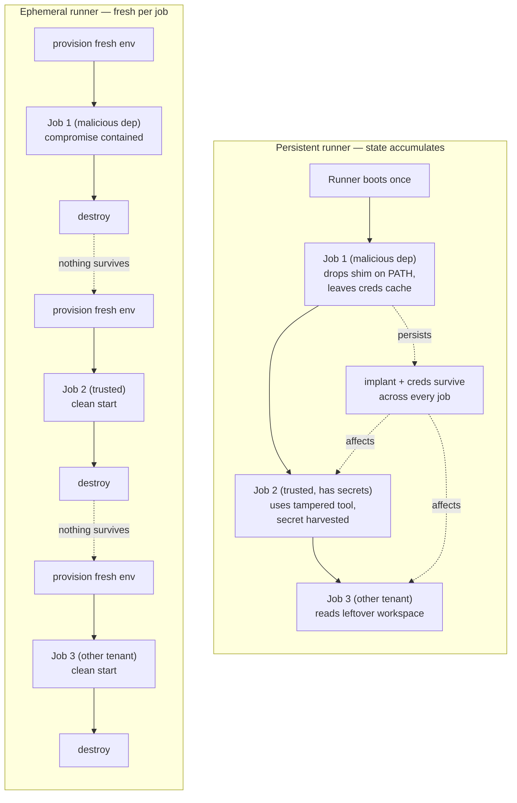
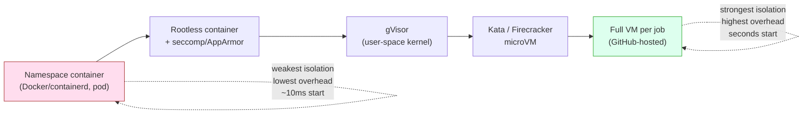
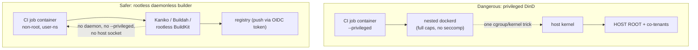
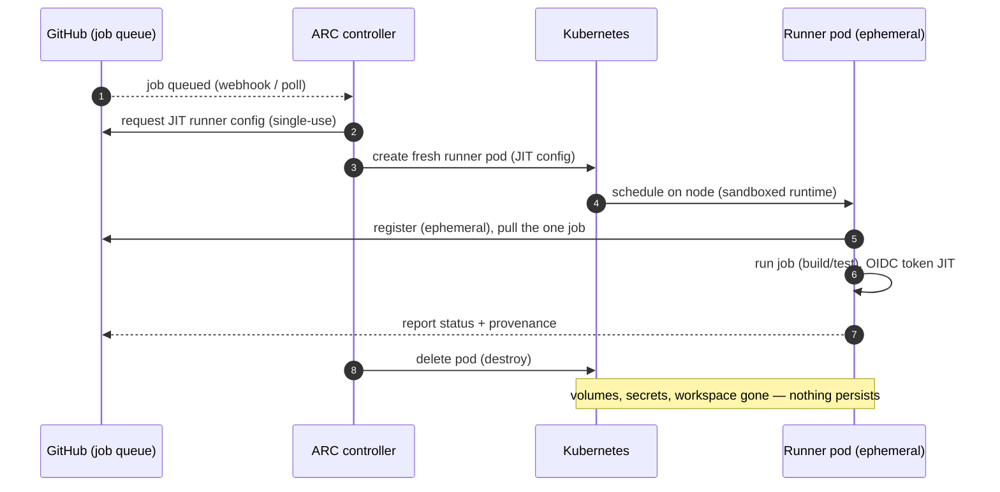
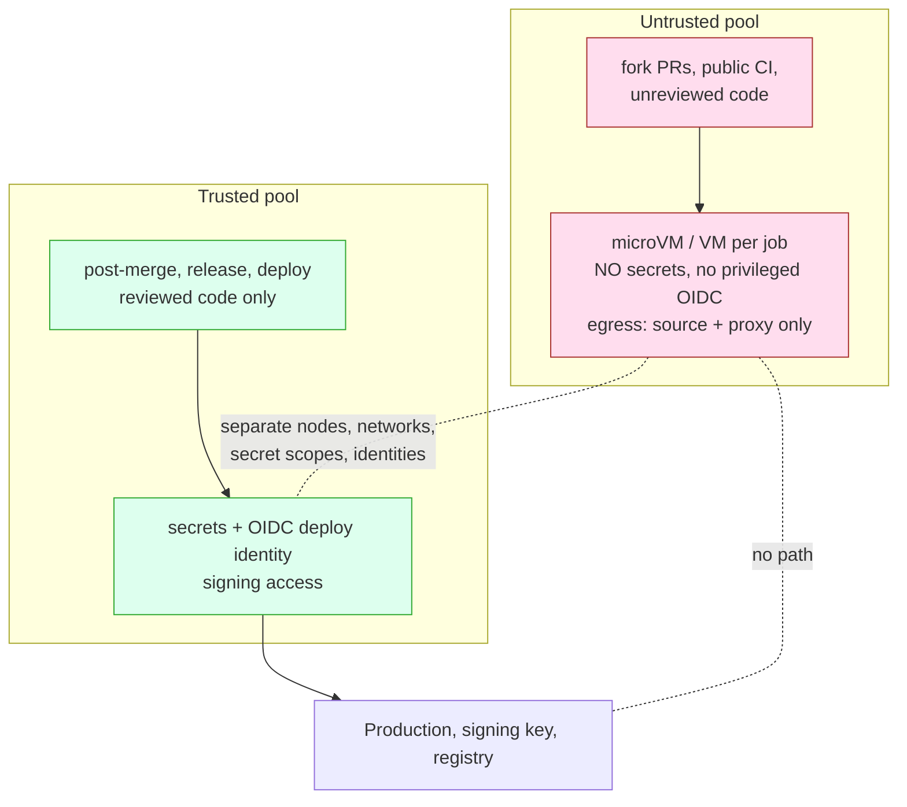
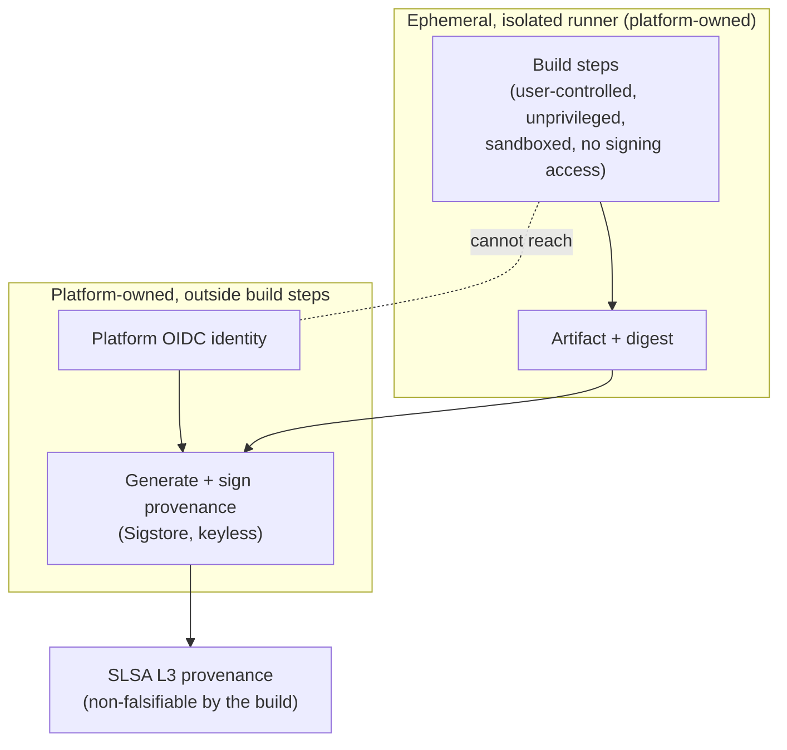

# Chapter 8 — Ephemeral and Isolated Build Environments

*What this chapter covers.* Chapter 3 defined SLSA Build L3 and then handed off one of its
requirements without paying it: the build must run in an environment that other builds cannot
influence, and that cannot forge or tamper with the provenance the platform signs. Chapters 4
and 5 showed what a compromised runner can do; Chapter 7 showed how a poisoned pipeline or cache
crosses from one build context into another. This chapter is the deep treatment of the mechanism
that answers all three at once: **ephemeral, isolated, hardened build environments.** Two
properties do the work. *Ephemeral* — the environment is created for one job, destroyed after,
never reused, so nothing an attacker leaves behind survives to touch the next build. *Isolated* —
the environment is bounded from other builds, from the host kernel, from the network, and from
the provenance-signing path, so one build cannot observe or corrupt another. We build up the
security rationale from the SolarWinds build-machine persistence model at CI scale, walk the
isolation-strength spectrum honestly (namespace containers → gVisor → microVMs → full VMs, with
real overhead numbers and honest limits), dissect the `--privileged` Docker-in-Docker problem and
the rootless daemonless builders that replace it, tour the real ephemeral-runner architectures
(GitHub-hosted, JIT runners, Actions Runner Controller, GitLab's Kubernetes executor, Jenkins
Kubernetes agents), lay out the hardening controls (least privilege, egress allowlisting,
just-in-time secrets, immutable base images), and separate trusted from untrusted build pools as
the operational form of Chapter 7's trust boundary. We close by showing how this design *is* the
SLSA L3 requirement, and by taking the fleet-scale view: ephemeral isolated runners are a paved-road
platform capability, not a per-team chore.

Learning goals — after this chapter you should be able to:

- Explain **why persistence and cross-build contamination are the core CI security failures**, and
  how ephemerality and isolation are the two independent properties that close them.
- Place the **isolation technologies on a strength/overhead spectrum** — namespace containers,
  gVisor, Kata/Firecracker microVMs, full VMs — and choose correctly for a given trust level, without
  overstating container isolation as equivalent to a VM.
- Explain precisely **why `--privileged` Docker-in-Docker is dangerous** and how **Kaniko, Buildah,
  and rootless BuildKit** build OCI images without a privileged daemon.
- Describe the **ephemeral-runner architectures** in real platforms — GitHub-hosted VMs, just-in-time
  runners, Actions Runner Controller pods, GitLab's Kubernetes executor, Jenkins Kubernetes agents —
  and the provision-run-destroy lifecycle they share.
- Apply the **hardening checklist**: non-root, dropped capabilities, read-only root FS, seccomp/AppArmor,
  egress allowlisting, JIT secrets, immutable runner images.
- Design the **trusted/untrusted pool split** and connect it to **SLSA L3**: ephemeral + isolated +
  platform-signed provenance outside the user's build steps *is* L3.

## Why ephemerality and isolation, precisely

Start from the failure mode. A CI runner executes untrusted-ish code by design: dependency install
scripts, test suites, `Makefile` targets, `docker build` — the whole invoked-file subtree from
Chapter 7, any node of which an attacker may control through a malicious dependency, a poisoned
cache, or a poisoned-pipeline foothold. When that code runs, it runs with the process's authority
on whatever machine it lands on. The security question is not only *what can it do during this
build?* but *what does it leave behind for the next one?*

On a **persistent runner** — a long-lived VM or a bare-metal agent that services job after job —
the answer is: potentially everything. State accumulates by design. The workspace is reused. Tool
caches (`~/.npm`, `~/.gradle`, `~/.cargo`, the Docker layer cache) persist. Environment variables,
cloud credential files (`~/.aws/credentials`, `~/.docker/config.json`, a mounted kubeconfig),
SSH known-hosts, and the runner's own registration token all sit on disk between jobs. An attacker
who achieves code execution in one build can therefore:

- **Implant.** Drop a modified compiler, linker, or `npm`/`pip` shim on `PATH`, or a malicious
  entry in a shared tool cache, so that a *later* build — possibly a trusted one, possibly another
  team's — silently uses the tampered tool. This is the SolarWinds mechanism (Book 1, Chapter 3):
  the Sunspot implant sat on the build machine and rewrote the source during `MSBuild`, then removed
  itself. It did not compromise the committed source; it compromised the *environment that built it*,
  persistently.
- **Harvest.** Read credentials, tokens, and secrets left by prior jobs, or install a background
  process that waits for the next high-privilege job and steals its just-injected secrets.
- **Persist.** Establish a foothold — a cron entry, a systemd unit, a modified runner binary, an
  reverse shell — that outlives the job and gives durable access to the CI fleet.

Every one of these depends on the same precondition: **the environment survives the build.** Remove
that precondition and the entire class collapses. That is what ephemerality buys.

### The two properties are independent

Ephemerality and isolation are often said in one breath, but they are distinct and you need both.

- **Ephemeral** = short-lived, single-use, destroyed after the job, never reused. It bounds a
  compromise *in time*: whatever the attacker does is gone when the environment is torn down. It does
  nothing about what the attacker can reach *during* the build.
- **Isolated** = bounded from other builds, the host, and the network *while running*. It bounds a
  compromise *in space*: even mid-build, the attacker cannot read another job's secrets, escape to
  the host kernel, or reach another tenant's workspace.

A persistent runner can be well-isolated (each job in a fresh container, but on a machine that keeps
its caches) and still fail: the shared cache carries the implant forward. An ephemeral runner with
weak isolation can fail the other way: the job is destroyed after, but *during* the build a container
escape reached a co-tenant on the same host. Neither property substitutes for the other. SLSA L3's
isolation requirement and the anti-persistence goal are two axes, and a serious build platform sits
in the corner where both are satisfied.



## The isolation spectrum

"Isolated" is not binary. It is a spectrum of mechanisms with a hard trade-off: stronger isolation
costs more startup latency, more memory, and often more operational complexity. The single most
common mistake in CI security is treating a container as equivalent to a VM. It is not, and the
difference matters exactly when you are running untrusted code — which is the CI case. Walk the
spectrum from weakest to strongest.

### Namespace/container isolation (the default)

Docker, containerd, and the Kubernetes pod are all built on the same Linux primitives: **namespaces**
(PID, mount, network, UTS, IPC, user, cgroup — each virtualizes one dimension of the global system
so the process sees its own view), **cgroups** (resource limits and accounting), **capabilities**
(the ~40 slices of root's power, individually grantable or droppable), **seccomp** (a BPF filter on
which syscalls the process may make), and **LSMs** (AppArmor/SELinux mandatory access control). A
container is a normal process on the host, wrapped in these controls.

The strength: near-zero overhead. A container starts in tens of milliseconds and adds no measurable
CPU cost, because it *is* a host process. For CI at scale this is why containers are the default —
you can pack hundreds per node and start them instantly.

The weakness, stated plainly: **the container shares the host kernel.** Every syscall the build makes
is serviced by the same kernel that services every other container on the node and the host itself.
The kernel is a large C attack surface (hundreds of syscalls, plus `ioctl`, `/proc`, `/sys`, netlink).
A single exploitable kernel bug reachable from an in-container syscall is a **container escape** — the
attacker breaks out to the host and thereby to every co-tenant container. This is not theoretical:
runc, containerd, and the kernel itself have shipped escape-class CVEs (runc's CVE-2019-5736
overwrote the host `runc` binary from inside a container; later `/proc/self` and cgroup-release-agent
tricks; kernel bugs in namespaces and `io_uring`). Seccomp and AppArmor shrink the reachable surface
substantially — a good seccomp profile blocks well over 40 dangerous syscalls — but they narrow the
surface, they do not eliminate the shared-kernel model.

Two container practices make this worse and both are common in CI:

- **`--privileged`** disables essentially all of the above — full capability set, no seccomp, no
  AppArmor, device access. A privileged container is, for security purposes, root on the host with a
  thin veneer. It exists mostly to run Docker-in-Docker (below).
- **Rootless containers** make it better. Running the container runtime and the container process as
  an unprivileged host user, using a **user namespace** so in-container UID 0 maps to an unprivileged
  host UID, means a container escape lands the attacker as a nobody user on the host, not as root. This
  is a meaningful mitigation and should be the default for untrusted builds where a full VM boundary is
  not used. It does not change the shared-kernel fact, but it removes the "escape == host root" step.

### gVisor — a user-space kernel

Google's **gVisor** takes a different approach: instead of hardening the path to the host kernel, it
*interposes a second kernel written in Go* between the container and the host. gVisor's `runsc`
runtime intercepts the application's syscalls (via `ptrace` or, faster, a KVM-based platform) and
services most of them in a user-space sentry process that reimplements the Linux syscall ABI. The host
kernel sees only a small, tightly-restricted set of syscalls made by the sentry itself, guarded by an
aggressive seccomp filter. The result: the build's syscalls almost never reach the host kernel
directly, so the host-kernel attack surface the build can touch shrinks from hundreds of syscalls to a
few dozen sentry-mediated ones.

This is Google's chosen isolation for untrusted workloads (it runs App Engine, Cloud Run, and Cloud
Functions second-gen). The cost is real: because the sentry reimplements syscalls in user space,
syscall-heavy and I/O-heavy workloads see meaningful overhead (often tens of percent, workload
dependent), some syscalls and `/proc` fields are incompletely emulated, and startup adds a sentry
spin-up. For a CI build that is compile-and-test heavy this is frequently acceptable; for something
that hammers the filesystem it may not be. gVisor is a *defense-in-depth strengthening of the container
model*, not a VM — the sentry is still a user-space process, but the isolation is materially stronger
than a bare namespace container.

### Kata Containers and Firecracker — microVMs

The next step is a real hardware-virtualization boundary. **Kata Containers** runs each pod (or
container) inside a lightweight VM with its own guest kernel, presenting an OCI/CRI-compatible runtime
so Kubernetes and containerd drive it like any other container — you get container UX with a VM
boundary. The isolation is the hypervisor's: the build runs on a *separate guest kernel*, and a guest
kernel compromise leaves the attacker inside a VM whose only exit is the far smaller hypervisor
interface (virtio devices, a handful of VM exits) rather than the full Linux syscall surface.

**Firecracker** is AWS's minimal VMM built for exactly this: a Rust virtual machine monitor that boots
a stripped microVM in roughly 125 ms, with a deliberately tiny device model (a few virtio devices, no
BIOS, no PCI) to keep the host-facing attack surface small. **AWS Lambda and Fargate run customer code
in Firecracker microVMs** precisely because they execute untrusted multi-tenant code and need a VM
boundary at container density and startup speed. Kata can use Firecracker (or QEMU, or Cloud
Hypervisor) as its VMM.

The trade-off: each microVM carries a guest kernel and a slice of dedicated memory (tens of MB of
overhead per VM), startup is ~100+ ms rather than ~10 ms, and nested virtualization or bare-metal
nodes are required (you cannot always run a hypervisor inside an already-virtualized cloud instance
without bare-metal or nested-virt support). For untrusted or public builds this is the right boundary
and the cost is well spent.

### Full VMs

A conventional VM per build — the model GitHub-hosted runners use — is the strongest common option:
full guest OS, full guest kernel, the mature hypervisor boundary (KVM, Hyper-V, Xen), and no sharing
of anything above the hypervisor with other tenants. It is also the heaviest: seconds of boot, a full
OS image, a whole guest to schedule. At fleet scale you amortize this with warm pools and image
snapshots, but the cold-start and per-VM memory cost is real. When a build is fully untrusted and you
want the least clever, most auditable boundary, a fresh VM per job is it.



| Technology | Boundary | Isolation strength | Startup / overhead | Multi-tenant untrusted? | Real users |
|---|---|---|---|---|---|
| Namespace container | Shared host kernel | Weak (escape reaches host) | ~10 ms, negligible CPU | No, not alone | Default Docker/K8s CI |
| Rootless + seccomp/AppArmor | Shared kernel, user-ns, filtered syscalls | Weak-moderate (escape → unprivileged host user) | ~10–50 ms | Marginal | Podman, rootless BuildKit |
| gVisor (`runsc`) | User-space kernel; host sees few syscalls | Moderate-strong | +10–50% on syscall-heavy work | Yes (Google uses it) | GKE Sandbox, Cloud Run |
| Kata / Firecracker microVM | Guest kernel + hypervisor | Strong (VM boundary) | ~100–300 ms, tens of MB/VM | Yes | AWS Lambda/Fargate |
| Full VM per job | Full guest OS + hypervisor | Strongest common | seconds, full OS image | Yes | GitHub-hosted runners |

The decision rule is trust-driven, not fashion-driven. **Trusted, internal builds** on code your
org already controls can often run in well-hardened rootless containers — the threat is a compromised
dependency, and ephemerality plus egress control plus seccomp is a reasonable posture. **Untrusted or
public builds** — fork-PR CI, community submissions, anything running attacker-influenced code with any
adjacency to secrets or other tenants — warrant a VM-class boundary (microVM or full VM). Do not run
untrusted code behind only a namespace container and call it isolated.

## The Docker-in-Docker and privileged-runner problem

CI builds container images. To build an OCI image you have historically needed a Docker daemon, and to
run a Docker daemon inside a container you have needed **`--privileged`** (or to bind-mount the host's
`/var/run/docker.sock`). Both are dangerous, and both are still widespread.

- **Mounting the host Docker socket** (`-v /var/run/docker.sock:...`) hands the build the host daemon's
  API. The build can `docker run --privileged -v /:/host ...` and it is now root on the host with the
  host filesystem mounted. This is a direct, trivial escape — not a bug, the documented behavior of the
  API. Any build that can reach the host socket owns the node and every container on it.
- **Privileged Docker-in-Docker** (`dind`) runs a *second* daemon inside a `--privileged` container.
  The privileged flag, as noted, disables seccomp/AppArmor and grants the full capability set and device
  access; the nested daemon needs this to manage cgroups, mounts, and the overlay filesystem. A build
  that can influence what runs in that privileged container is one kernel or cgroup trick away from the
  host. Privileged containers are the single most common isolation-defeating configuration in CI.

The point is architectural: you should not need a privileged daemon to *build an image*. Building an
image is unpacking base layers, running build steps in a chroot-like environment, and emitting a new
layered tarball with a manifest. That does not intrinsically require host-level privilege. Several
**daemonless, rootless image builders** exploit exactly this:

- **Kaniko** (Google) builds from a Dockerfile entirely in user space, inside the build container,
  with no daemon and no privileged mode. It executes each Dockerfile instruction and snapshots the
  filesystem in userland, pushing the result straight to a registry. It expects to run in a container
  and does not need `--privileged` (it does want its own container because it modifies the root
  filesystem as it builds). This is the common Kubernetes-native answer.
- **Buildah** (Red Hat) builds OCI images rootless, using user namespaces and fuse-overlayfs so no host
  root or daemon is required. It pairs with Podman (also daemonless). Buildah can build from a
  Dockerfile or via its own scriptable API.
- **BuildKit in rootless mode** (the engine behind modern `docker build`) runs the builder as an
  unprivileged user in a user namespace, with content-addressed caching and concurrent build graph
  execution. `buildkitd --oci-worker` rootless, or `buildctl`, gives you BuildKit's speed without a
  privileged daemon.
- **`img`** is a further daemonless, rootless BuildKit frontend in the same family.



The security win is direct: none of these need `--privileged`, none need the host Docker socket, and
all run as (or close to) an unprivileged user. You keep the container-build capability without
punching the isolation hole. On stronger substrates you can go further — run the rootless builder
*inside* a gVisor sandbox or a microVM, so even a builder compromise is boxed by a VM boundary. The
combination "rootless builder + microVM runner" is the current best practice for building images from
untrusted input.

## Ephemeral runner architectures

The abstract pattern is always the same three steps — **provision fresh → run exactly one job →
destroy** — and every major platform now implements it. The differences are in *what* the ephemeral
unit is (a VM, a pod, a container) and *who* orchestrates the lifecycle.

### GitHub-hosted runners

GitHub-hosted runners are ephemeral by construction: each job gets a **clean, fresh VM**, the job runs,
and the VM is discarded. No state carries between jobs; there is nothing for a compromise to persist
into, and one repo's job cannot observe another's. This is the reference model, and it is a large part
of why GitHub's native `actions/attest-build-provenance` can credibly claim L3 — the build environment
is ephemeral and isolated by default, and the provenance is signed by GitHub's OIDC identity outside
the user's job (Chapter 3). The catch is only that the VM's outbound network is wide open by default,
which is why egress control (below) is the missing hardening piece even on hosted runners.

### Self-hosted: the persistence trap and JIT runners

Self-hosted runners are where teams reintroduce persistence by accident. The classic setup registers a
long-lived runner that polls for jobs and services them one after another on the same machine — a
persistent runner, with every accumulation problem from the first section. Worse, GitHub's docs warn
explicitly that self-hosted runners should generally **not** be used with public repositories, because a
fork PR can run attacker code on your persistent runner.

Two mechanisms fix this:

- **Ephemeral runners** (`--ephemeral`): the runner registers, accepts exactly one job, and
  deregisters/exits after it. Pair with automation that provisions a fresh runner (a fresh VM or
  container) for each, and you have the provision-run-destroy loop on self-hosted infrastructure.
- **Just-in-time (JIT) runners**: instead of a long-lived registration token sitting on a machine, you
  call the GitHub API to mint a **single-use JIT config** for one runner, bound to `--ephemeral`. The
  runner uses that config once and it is spent. There is no reusable registration credential to steal
  and no re-registration; the identity is as short-lived as the runner. This closes the "attacker steals
  the runner registration token and registers their own runner" path.

### Actions Runner Controller (ARC) on Kubernetes

**Actions Runner Controller** is the Kubernetes-native way to run ephemeral GitHub self-hosted runners
as pods. In the current (autoscaling runner scale set) model, ARC watches GitHub for queued jobs and, per
job, creates a **fresh runner pod** using a JIT/ephemeral registration; the pod runs one job and is
deleted. Autoscaling is intrinsic — the scale set grows pods under load and shrinks to zero when idle.
Each job therefore gets a clean pod with clean volumes, and the isolation is whatever the underlying pod
sandbox provides (namespace container by default; gVisor via a `RuntimeClass`, or a microVM runtime, if
you want a stronger boundary). ARC is the canonical "ephemeral isolated runners as a platform capability"
implementation for GitHub-centric orgs.



### GitLab and Jenkins

The same pattern appears everywhere the ecosystem runs at scale:

- **GitLab Kubernetes executor**: each CI job runs in a **fresh pod**, created per job and torn down
  after — ephemeral by design, isolation per the pod runtime. GitLab's older **Docker Machine autoscaler**
  achieved the same shape at the VM level (spin up a fresh VM per demand, run, destroy), and its successor
  autoscaling models keep the per-job-VM property for stronger isolation. GitLab also supports the
  privileged-DinD-vs-Kaniko/Buildah choice for image builds and documents the rootless path.
- **Jenkins Kubernetes plugin**: provisions a **pod per build** as the agent; the pod is created when the
  build starts and deleted when it finishes. This replaced the old long-lived Jenkins agent (the archetypal
  persistent, state-accumulating runner) with an ephemeral one. Jenkins can equally use ephemeral cloud
  VMs via its EC2/cloud plugins.

The convergence is the point: at scale, *nobody* who takes build security seriously runs long-lived
shared agents anymore. The ephemeral unit differs (VM, pod, microVM), but provision-run-destroy is the
industry default, and autoscaling ephemeral fleets — spin up on demand, tear down to zero — is the
operational model that makes it affordable.

## Hardening the build environment

Ephemerality and isolation bound the blast radius; hardening shrinks it further and cuts off the
channels an in-build compromise would use. Treat the following as a checklist applied to the runner
image and the pod/VM spec, provisioned once as a platform default so every team inherits it.

### Least privilege inside the sandbox

- **Non-root by default.** The build process runs as an unprivileged UID. In Kubernetes:
  `runAsNonRoot: true`, an explicit `runAsUser`, and drop the ability to regain privilege via
  `allowPrivilegeEscalation: false`.
- **Drop capabilities.** Start from `drop: ["ALL"]` and add back only what a build genuinely needs
  (almost always nothing). Never `add: ["SYS_ADMIN"]` or run `privileged: true`.
- **Read-only root filesystem.** `readOnlyRootFilesystem: true` with explicit, minimal writable mounts
  (a scratch `emptyDir` for the workspace, `/tmp`). A read-only root means an attacker cannot overwrite
  binaries on `PATH` or drop persistence — and since the environment is ephemeral anyway, there is
  rarely a reason for a writable root.
- **seccomp and AppArmor/SELinux.** Apply at minimum the runtime's default seccomp profile
  (`seccompProfile: { type: RuntimeDefault }`) — a shocking number of clusters still run
  `Unconfined` — and an AppArmor or SELinux profile that confines file and network access. These narrow
  the reachable kernel/syscall surface that a container escape would exploit.
- **No host mounts, no host namespaces.** No `hostPath`, no `hostNetwork`/`hostPID`/`hostIPC`, no host
  Docker socket. Each of these is a direct bridge out of the sandbox.

```yaml
# Kubernetes runner pod securityContext (hardened default)
securityContext:
  runAsNonRoot: true
  runAsUser: 10001
  runAsGroup: 10001
  allowPrivilegeEscalation: false
  readOnlyRootFilesystem: true
  capabilities:
    drop: ["ALL"]
  seccompProfile:
    type: RuntimeDefault
# no hostPath volumes, no hostNetwork/hostPID, no privileged, no docker.sock
```

### Network egress control — the control most orgs are missing

By default a build can reach the entire internet. That default is an open exfiltration channel and an
open command-and-control channel. A malicious dependency's install script (Chapter 7, Book 2) wants to
POST your `AWS_SECRET_ACCESS_KEY` to an attacker endpoint; a poisoned build tool wants to fetch a second
stage. Both need egress. **Restricting outbound network is one of the highest-leverage controls you can
apply**, and most pipelines do not apply it.

The model is an **egress allowlist**: the build may reach the internal package proxy/registry (Book 2,
Chapter 8), the source host, the artifact store, and the specific internal services it legitimately needs
— and nothing else. Everything else is denied and, ideally, *logged*, so an unexpected egress attempt is
a detection signal, not a silent success.

- On GitHub Actions, **StepSecurity Harden-Runner** instruments the hosted runner to monitor and enforce
  outbound connections against an allowlist, blocking (or, in audit mode, alerting on) egress to any
  endpoint you did not permit. It surfaces exactly the "why is this build calling an IP in a country we
  have no infrastructure in" signal that catches dependency-confusion and poisoned-tool exfiltration in
  the act (Chapters 5 and 9). This is the reference implementation of egress control for Actions.
- In Kubernetes runner fleets, `NetworkPolicy` (or a CNI/service-mesh egress policy, or an egress gateway
  with an explicit allowlist) enforces the same shape at the pod level: default-deny egress, allow only
  the proxy and required services.

**Hermetic builds make this natural.** Chapter 2's hermetic model prefetches every input, then builds
with the network *cut off entirely*. If the build needs no network during execution, egress control is
not a fussy allowlist — it is `network: none`. A hermetic build in a no-network sandbox has no
exfiltration channel and no fetch-time poisoning surface, and it hardens every runner in the fleet
uniformly. Egress control and hermeticity are the same control viewed from two angles.

### Immutable, minimal runner images

The runner image itself is a supply-chain surface. Harden it:

- **Immutable and pinned.** Build the runner image once, pin base images by digest (not tag), pin the
  runner agent and every preinstalled tool to a specific version, and rebuild it through the same
  reproducible/hermetic pipeline you hold everything else to (Chapter 2). A mutable "latest tools" runner
  is an unversioned dependency in your most privileged context.
- **Minimal.** Ship only the toolchain a build needs. Every extra binary is extra attack surface and an
  extra thing an attacker can turn into a living-off-the-land tool. Distroless or minimal base images cut
  this down.
- **Scanned and provenanced.** The runner image gets an SBOM (Book 3), a vulnerability scan, and its own
  provenance, like any other artifact you deploy.

### Secrets in the ephemeral context

Ephemerality changes secret handling for the better, and you should lean into it (Chapter 6):

- **Just-in-time injection.** Secrets are injected into the environment only when the job needs them and
  are gone the instant the environment is destroyed. There is no persistent disk for them to linger on
  and no next job to leak into.
- **Prefer OIDC over stored secrets.** A runner that authenticates to your cloud, registry, or signer via
  a short-lived **OIDC workload-identity token** (Book 5, Chapter 4) has *no long-lived secret to steal or
  persist* — the token is minted for the job, scoped, and expires in minutes. This is the ideal pairing
  with ephemeral runners: ephemeral identity for an ephemeral environment. It is also what lets the
  platform sign provenance without ever exposing a signing key to the build steps.
- **Never bake secrets into the runner image or a persistent volume.** A secret on the image or a reused
  cache volume defeats ephemerality entirely — it is exactly the persistent state you removed everything
  else to avoid.

| Control | Mechanism | Defends against |
|---|---|---|
| Non-root build | `runAsNonRoot`, unprivileged UID | Escalation, host-privilege abuse |
| Drop all capabilities | `capabilities.drop: [ALL]` | Capability-based escape primitives |
| Read-only root FS | `readOnlyRootFilesystem` | Binary tampering, on-disk persistence |
| seccomp `RuntimeDefault` | BPF syscall filter | Kernel-surface reachable from build |
| AppArmor/SELinux profile | LSM mandatory access control | Unexpected file/network access |
| No host mounts/namespaces | Pod spec constraints | Direct sandbox escape bridges |
| Egress allowlist / `network: none` | Harden-Runner, NetworkPolicy, hermetic | Exfiltration, C2, fetch-time poisoning |
| Immutable pinned runner image | Digest-pinned, minimal, provenanced | Runner-image supply-chain drift |
| JIT secrets + OIDC | Short-lived tokens, no stored creds | Secret harvesting and persistence |
| Ephemeral + single-use | provision-run-destroy, `--ephemeral` | Implant persistence across jobs |

## Isolating trust levels

Isolation *within* a build environment is necessary but not sufficient. The operational failure that
keeps recurring is running *untrusted* code on a runner that holds — or will later hold — *trusted*
privileges. This is Chapter 7's trusted/untrusted boundary made concrete in infrastructure.

The rule: **untrusted builds and trusted builds run on separate pools, with separate isolation, separate
network egress, and separate identity.** Never let a fork-PR build, a community submission, or any
attacker-influenceable job run on a runner that has production deploy credentials, signing access, or
adjacency to jobs that do.

- **Untrusted pool.** Fork PRs, public-repo CI, anything running code you have not reviewed. Strongest
  isolation (microVM or full VM per job), **no secrets**, no OIDC to any privileged audience, tightest
  egress allowlist (often source + proxy only), ephemeral and single-use. If it is compromised, it has
  nothing worth stealing and nowhere privileged to reach.
- **Trusted pool.** Post-merge builds, release builds, deploys — jobs running reviewed code that must
  hold secrets, sign artifacts, and reach production. These get the secrets and the deploy identity, but
  they run *only* reviewed, trusted code, so the code-execution risk that would abuse those privileges is
  removed by construction.

The two pools must not share nodes, networks, secret scopes, or identities. On GitHub this maps to the
`pull_request` (untrusted, no secrets) vs `pull_request_target`/post-merge (trusted, has secrets)
distinction from Chapter 5, backed by *physically separate runner groups*. Getting this split right is
more important than any single isolation technology: perfect microVM isolation on a pool that
nonetheless holds production secrets *and* runs fork code has still handed the fork code a shot at those
secrets during the build.



## Achieving SLSA L3 through the build environment

Now tie it together. Chapter 3 defined SLSA Build L3 as adding, on top of L2's signed provenance from a
hosted platform, two requirements: the build must be **isolated** (builds cannot influence one another,
and — critically — cannot influence the provenance-generation process), and the provenance must be
resistant to forgery *by the build itself*. Read that against this chapter and the design falls out:
**an ephemeral, isolated, hardened build environment where the provenance is signed by the platform
outside the user-controlled build steps *is* the L3 requirement.** L3 is not a separate feature you bolt
on; it is what you get when the environment is built correctly.

Trace each L3 obligation to its mechanism:

- *Builds cannot influence each other* ← **ephemerality** (nothing persists between jobs) plus
  **isolation** (no cross-build reach during a job). Exactly the two properties of this chapter.
- *Builds cannot influence the provenance* ← the signing identity and the provenance-generation step
  live **outside the user's build steps**, in the platform. The build runs as an unprivileged process
  in a sandbox; the OIDC identity and the signing operation are the *platform's*, invoked after the
  build, not reachable from inside it. The build cannot read the signing key (there is no key to read —
  it is keyless via the platform's OIDC identity and Sigstore, Book 5) and cannot forge the provenance
  because it never holds the credential that vouches for it.
- *Non-falsifiable provenance* ← the platform, not the job, attests. GitHub's
  `actions/attest-build-provenance` and the SLSA GitHub Generator both run the signing in a trusted,
  isolated context using GitHub's OIDC identity — the ephemeral, isolated hosted runner is the substrate
  that makes the attestation trustworthy.



This is why L3 is achievable "for free" on a well-designed hosted platform and painful to bolt onto a
persistent self-hosted runner: on the hosted platform the ephemerality, isolation, and out-of-band
signing are structural; on the persistent runner you have to *recreate* all three, and if the build
steps can reach the signing identity — as they can when everything runs as the same user on the same
long-lived machine — you cannot honestly claim non-falsifiable provenance no matter what you attest.

## Distributed-systems lens

At the scale of many teams, many repos, and high deploy frequency, the through-line of this chapter is
that **ephemeral isolated runners are a platform capability, not a per-team project.** No individual
team should be designing microVM sandboxing, egress allowlists, or JIT-secret plumbing. The build
platform team provides a **paved road** (Book 4, Chapter 10): ARC scale sets or a GitLab/Jenkins
Kubernetes fleet where every job — for every team — lands in a fresh, hardened, sandboxed, egress-controlled
pod or microVM by default, with OIDC identity and platform-signed provenance wired in. Teams get L3-grade
isolation and clean environments *without knowing any of this exists*, which is the only way it actually
happens across hundreds of repos.

Several fleet realities sharpen the design:

- **Multi-tenant isolation between teams is the central requirement.** Teams share the build platform and
  its nodes; one team's build must not reach another's secrets, workspace, network, or provenance. This
  is exactly the untrusted-code-on-a-shared-substrate problem that pushes public multi-tenant platforms
  (Lambda, Fargate) to microVMs, and it is why "namespace container per job on a shared node" is a weak
  answer for a multi-tenant build platform: a container escape by one tenant's poisoned build reaches the
  co-tenants on that node. Stronger per-job boundaries (gVisor `RuntimeClass`, Kata/Firecracker) are the
  fleet-level control, chosen per pool by trust level.
- **Egress control and hermeticity applied fleet-wide cut off exfiltration and poisoning uniformly.** A
  single team enabling Harden-Runner protects one repo; the platform enforcing default-deny egress and
  hermetic builds across every pipeline removes the exfil and fetch-poisoning channel for the whole org
  at once — and turns any unexpected egress into a fleet-wide detection signal (Chapter 9).
- **Ephemerality compounds with reproducibility and provenance.** A clean environment per build is also
  the clean environment that reproducible builds need (Chapter 2) and the isolated environment that
  trustworthy provenance needs (Chapter 3). One design decision — provision-run-destroy in a hardened
  sandbox — pays into three different guarantees.
- **The cost is real and must be budgeted.** Stronger isolation and single-use environments cost
  **cold-start latency** (a fresh microVM or VM per job is ~100 ms to seconds versus a warm persistent
  agent's zero) and **resource overhead** (a guest kernel and dedicated memory per microVM, at fleet
  density, is real money). The fleet answers with **warm pools** (pre-booted sandboxes ready to accept a
  job, refreshed after use to preserve single-use semantics), **snapshotting** (Firecracker resume from a
  memory snapshot), **autoscaling to zero** when idle, and **tiering** — cheap namespace-container pools
  for trusted internal builds, expensive microVM pools reserved for untrusted and public work. The
  isolation-strength decision is therefore also a cost decision, made per pool against the trust level of
  the code that pool runs, not applied uniformly.

The synthesis: the secure build platform is not one where isolation is maximal everywhere — that is
unaffordable — but one where **every build is ephemeral, every build is at least as isolated as its
trust level demands, untrusted and trusted work are physically separated, egress is controlled by
default, and the provenance is signed by the platform outside every build's reach.** That configuration
delivers anti-persistence, cross-tenant isolation, and SLSA L3 together, as a shared capability, which is
the only way it survives contact with a hundred teams shipping continuously.

## Key takeaways

- **Persistence is the core CI failure; ephemerality removes it.** A persistent runner accumulates state
  — implants, cached tools, leftover credentials — so a compromise in one build reaches later builds and
  other tenants. This is SolarWinds at CI scale. A fresh, single-use environment destroyed after each job
  leaves nothing to persist into.
- **Ephemeral and isolated are independent and you need both.** Ephemeral bounds a compromise in *time*
  (gone after the job); isolated bounds it in *space* (cannot reach other builds, the host, or the
  network during the job). Neither substitutes for the other.
- **Container isolation is not VM isolation.** Namespace containers share the host kernel; an escape
  reaches the host and co-tenants. gVisor interposes a user-space kernel, microVMs (Kata/Firecracker) and
  full VMs add a real hypervisor boundary. Match the boundary to the trust level: untrusted/public builds
  warrant a VM-class boundary, and never run untrusted code behind only a namespace container.
- **`--privileged` DinD and the host Docker socket are the classic isolation holes.** You do not need a
  privileged daemon to build an image. Kaniko, Buildah, and rootless BuildKit build OCI images
  daemonless and rootless — use them, ideally inside a stronger sandbox.
- **Provision-run-destroy is the universal ephemeral pattern.** GitHub-hosted VMs, JIT/ephemeral
  self-hosted runners, ARC pods, GitLab's Kubernetes executor, and Jenkins Kubernetes agents all
  implement it, with autoscaling ephemeral fleets as the operational model.
- **Harden with a checklist, applied as a platform default.** Non-root, drop all capabilities, read-only
  root FS, seccomp/AppArmor, no host mounts, and above all **egress allowlisting** (or `network: none`
  for hermetic builds) — the exfiltration/C2 channel most pipelines leave wide open. JIT secrets and OIDC
  ensure nothing durable is left to persist.
- **Separate trusted from untrusted pools** — different isolation, network, and identity. Never run
  fork/untrusted code on a runner that holds or will hold production privileges. This split matters more
  than any single isolation technology.
- **The correctly-built environment *is* SLSA L3.** Ephemeral + isolated + provenance signed by the
  platform outside the user's build steps delivers the L3 isolation and non-forgeability requirements by
  construction — which is why L3 is nearly free on a well-designed hosted platform and hard to retrofit
  onto persistent self-hosted runners.

## Further reading

- **SLSA v1.0 — Build track requirements and Threats.** The normative L3 isolation and provenance-
  non-forgeability requirements this chapter's design satisfies. https://slsa.dev/spec/v1.0/requirements
  and https://slsa.dev/spec/v1.0/threats.
- **gVisor** — architecture of the user-space kernel (`runsc`), the sentry, and the platform models
  (ptrace/KVM). https://gvisor.dev/docs/.
- **Kata Containers** and **Firecracker** — VM-isolated containers and AWS's minimal VMM.
  https://katacontainers.io/ and https://firecracker-microvm.github.io/. See also the Firecracker
  NSDI '20 paper, *Firecracker: Lightweight Virtualization for Serverless Applications*.
- **Kaniko**, **Buildah**, and **BuildKit (rootless)** — daemonless/rootless OCI image builders.
  https://github.com/GoogleContainerTools/kaniko, https://buildah.io/, and
  https://github.com/moby/buildkit/blob/master/docs/rootless.md.
- **Actions Runner Controller (ARC)** — ephemeral autoscaling GitHub runners on Kubernetes.
  https://github.com/actions/actions-runner-controller. See also GitHub's docs on **just-in-time
  runners** and **ephemeral self-hosted runners** under *Autoscaling with self-hosted runners*.
- **GitLab Runner — Kubernetes executor** and **Jenkins — Kubernetes plugin** — pod-per-job ephemeral
  agents. https://docs.gitlab.com/runner/executors/kubernetes/ and
  https://plugins.jenkins.io/kubernetes/.
- **StepSecurity Harden-Runner** — egress monitoring and allowlisting for GitHub Actions runners.
  https://github.com/step-security/harden-runner.
- **Kubernetes** — *Pod Security Standards* (Baseline/Restricted), `securityContext`, seccomp and
  AppArmor tutorials, and `NetworkPolicy`. https://kubernetes.io/docs/concepts/security/.
- **runc CVE-2019-5736** — the canonical container-escape-via-host-binary-overwrite writeup, as a
  concrete reminder of the shared-kernel model's limits.
- Book 1, Chapter 3 (SolarWinds/3CX build-machine persistence) and Chapter 9 (blast radius); Book 2,
  Chapter 8 (internal registries and proxies for egress allowlisting); Book 4, Chapter 2 (hermetic and
  reproducible builds), Chapter 3 (SLSA provenance and the L3 isolation requirement), Chapters 4–5
  (CI/CD platform threats and hardening Actions), Chapter 6 (secrets and OIDC), Chapter 7 (pipeline
  poisoning and the trusted/untrusted boundary), Chapter 9 (build observability and egress detection),
  Chapter 10 (the secure build platform as a paved road); Book 5, Chapter 4 (OIDC workload identity) and
  Chapter 8 (provenance verification); Book 6, Chapters 5–6 (image signing and admission control).
