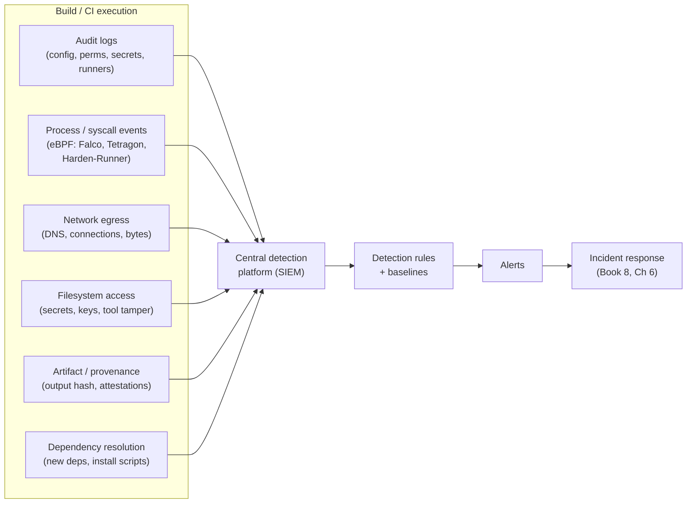
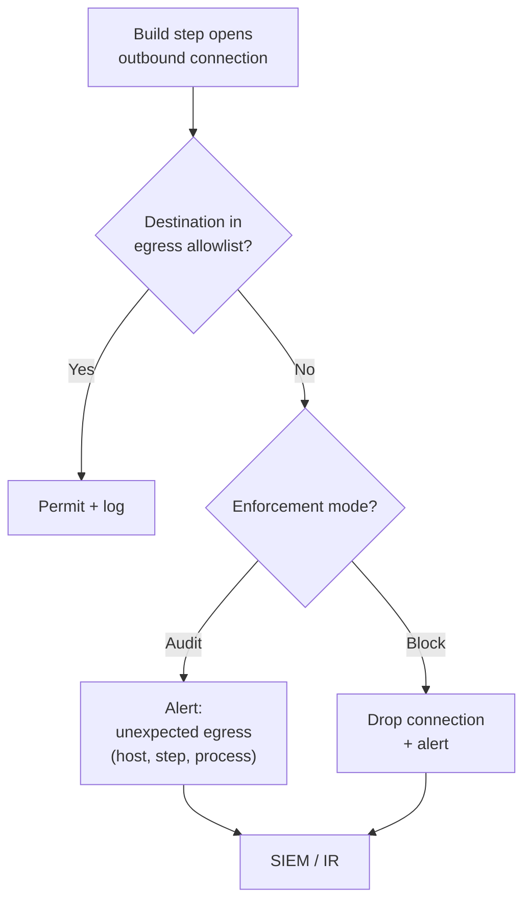
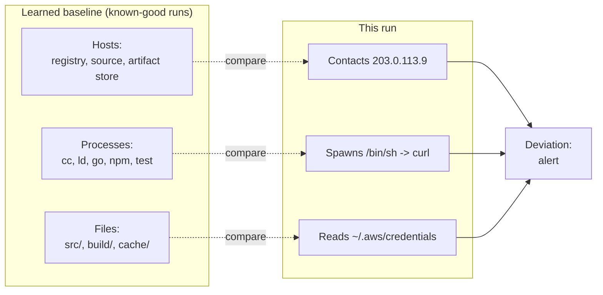
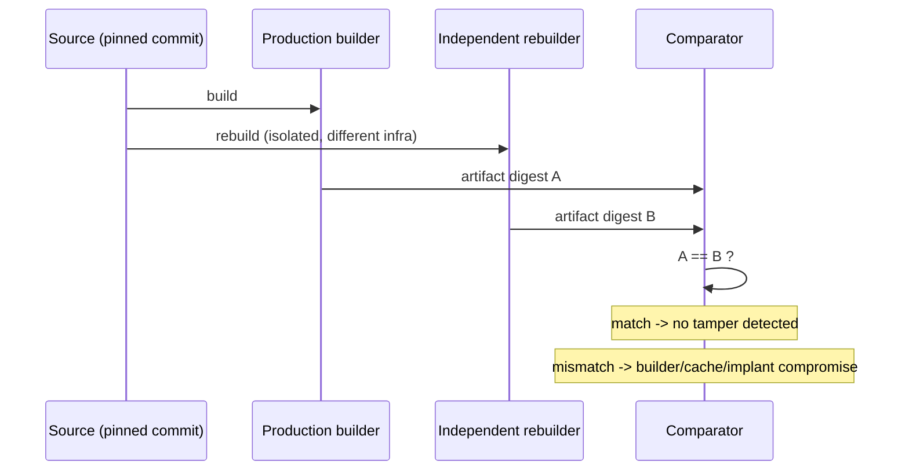
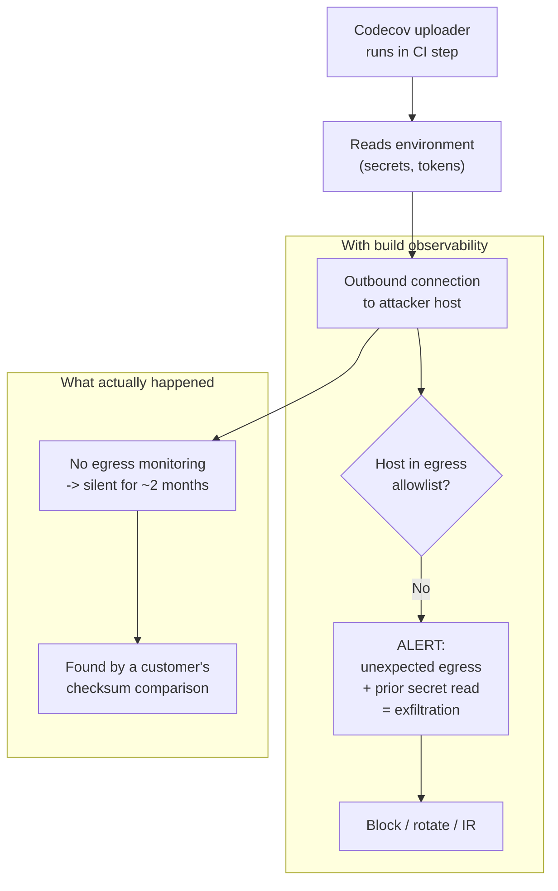
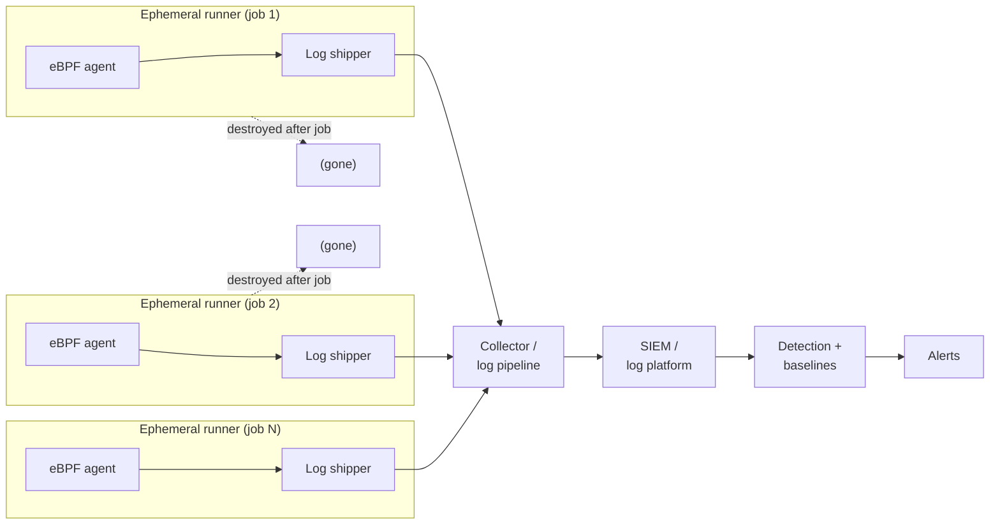
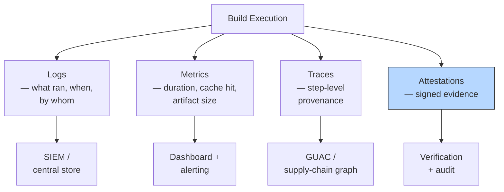
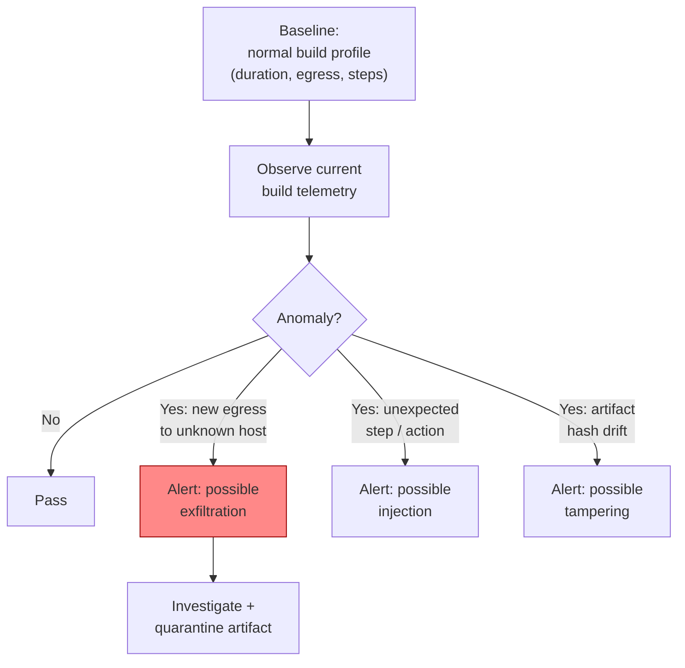

# Chapter 9 — Build Observability and Anomaly Detection

*What this chapter covers.* Chapters 2–8 built a wall: hermetic builds, provenance, platform
hardening, secret hygiene, and ephemeral runners. That wall is necessary and it is never
finished. Every control has a bypass, every configuration drifts, and every attacker gets exactly
one job right on the day you get one thing wrong. Prevention buys you a lower probability of
compromise; it does not buy you *knowledge that you were compromised*. That knowledge comes only
from **detection** — the detective controls that watch the build while it runs and tell you when it
does something it has never done before. This chapter is about instrumenting the build system like
the tier-0 production service it actually is: what telemetry to collect, how to reason about
"normal" for something as legitimately strange as a build, which anomaly-detection approaches
actually work at CI volume, and how to ship the evidence out of an ephemeral runner before it
evaporates. The organizing fact is uncomfortable and historical: **the two most instructive build
compromises of the last decade — SolarWinds and Codecov — were not caught by the victim's
monitoring.** They ran for months and were found by luck and by customers. This chapter is the
answer to the question "what monitoring would have caught them," turned into an operating
discipline.

Learning goals — after this chapter you should be able to:

- Explain **why CI/CD is a monitoring blind spot** despite being tier-0, and why builds are
  genuinely harder to baseline than production services.
- Enumerate the **telemetry sources** of a build — audit logs, process/syscall events, network
  egress, filesystem access, artifact/provenance state, dependency resolution — and know what each
  one detects.
- Reason about **anomaly detection for builds**: egress allowlisting as the most tractable model,
  behavioral baselining per pipeline, and signature/rule-based detection with tools like Falco and
  Tetragon.
- Map concrete **attack classes** (PPE, secret exfiltration, cache/artifact tampering, runner
  compromise) to the **detection signals** that reveal them.
- **Operationalize** detection: ship telemetry off ephemeral runners to a SIEM before teardown,
  route alerts to an owner, and keep false positives survivable through hermeticity and good
  baselines.
- Use **reproducibility as a detective control** and **provenance verification as continuous tamper
  detection** across a fleet.
- Reconstruct, in hindsight, the **egress signal that would have caught Codecov**, and generalize it
  into a monitoring posture.

## Why the build is a blind spot

Ask a mature engineering organization to show you their production observability and you will get a
tour: metrics, distributed traces, structured logs, SLOs, on-call rotations, a SIEM ingesting
authentication events, EDR on every host, network flow logs, an incident-response runbook. Ask the
same organization to show you the equivalent for their build system and you will usually get a
blank stare, or a link to the CI provider's build-log UI — which is not security telemetry, it is a
debugging convenience that developers read and no one alerts on.

This asymmetry is not an accident of maturity; it is a category error. The build system is treated
as *plumbing* — "it's just the build," a developer-facing utility that either turns red or green.
But Book 1, Chapter 9 established the opposite: the build system is **tier-0 infrastructure**. It
holds signing keys, deploy credentials, cloud OIDC identities, and write access to the artifacts
that every one of your production hosts will execute without question. A compromise of the build is
a compromise of everything the build can sign, push, or deploy — which, at a mature org, is
everything. A system with that blast radius deserves at least the observability you give a
payment service. It almost never gets it.

The consequences are not hypothetical. Consider the two canonical cases, described at the level of
certainty we actually have:

- **SolarWinds (SUNSPOT / SUNBURST, disclosed December 2020).** The attacker did not tamper with
  source in the repository. They planted a build-time implant (SUNSPOT) *on a build server* that
  waited for the Orion solution to compile and, during compilation, transparently replaced a source
  file so the malicious SUNBURST backdoor was woven into the legitimately signed product. The
  implant was engineered specifically to be invisible in ordinary developer workflows: it restored
  the original source after the build, matched timestamps, and produced a build that looked normal.
  By the best public reconstruction, the malicious builds ran for **months** — the trojanized
  releases shipped from roughly spring 2020 — before FireEye (Mandiant), a *customer*, discovered
  the intrusion in its own network and traced it back. The SolarWinds build environment's own
  monitoring did not raise the alarm.

- **Codecov (disclosed April 2021).** The attacker obtained credentials from a flaw in how Codecov
  built a Docker image, and used them to modify Codecov's **Bash Uploader** script — a tool that
  runs inside *customers'* CI pipelines to upload coverage reports. The altered uploader exfiltrated
  environment variables (which in CI means secrets, tokens, and keys) to an attacker-controlled
  server. By Codecov's own account the modification persisted for roughly **two months** (late
  January to early April 2021) and was discovered when a customer noticed a mismatch between the
  checksum of the uploader they downloaded and the checksum recorded in Codecov's own git — an
  integrity check the customer, not Codecov, happened to perform.

Two different mechanisms — an on-host build implant and a tampered distributed script — but the
same detection failure and the same lesson. In both cases the malicious behavior was *observable in
principle*: SUNSPOT manipulated files and processes on a build server; the Codecov uploader made an
outbound network connection to a host it had never contacted before. In both cases nobody was
watching the build with the instrumentation that would have surfaced it. The lesson is one
sentence: **instrument the build like production.**

### Why builds are genuinely hard to baseline

If it were easy, the blind spot would already be filled. It is not easy, for reasons intrinsic to
what a build *is*:

- **Builds legitimately do "weird" things.** A build compiles code (spawning compilers, linkers,
  code generators), fetches dependencies (outbound network to package registries and mirrors),
  executes arbitrary scripts (`make`, `npm run`, `setup.py`, Gradle tasks), writes and reads large
  numbers of files, and forks hundreds of short-lived processes. In a production web service, a
  process spawning `curl | bash` or reading `/etc/shadow` is a five-alarm fire. In a build, half of
  those behaviors have benign explanations. The signal-to-noise problem is real: the malicious needle
  is hidden in a haystack that is *made of needles*.

- **High volume.** A large org runs thousands to hundreds of thousands of pipeline executions per
  day. Each one generates process, file, and network events. Naïve full-fidelity telemetry from
  every runner is a firehose that overwhelms both storage and the humans reading alerts.

- **Ephemerality.** Chapter 8's central hardening recommendation — single-use, ephemeral runners
  that are destroyed after every job — is a security win that is *actively hostile* to
  investigation. When a job finishes, the runner is gone: no host to log into, no disk to image, no
  process list to inspect. If the telemetry was not shipped out *during* the job, it does not exist.
  Ephemerality and forensics are in direct tension, and the resolution is not "keep the runners" —
  it is "ship the evidence out in real time."

- **Diversity.** Every pipeline is a little different, so a per-pipeline baseline has to be learned
  per pipeline. This is where the paved road (Chapter 10) pays a detection dividend we will return
  to: uniform builds have uniform normal behavior, and uniformity is what makes an anomaly stand
  out.

Hold these four constraints in mind. Every design decision in the rest of the chapter is a response
to at least one of them.

## What to observe: the telemetry sources

Detection is only as good as its inputs. A build has six telemetry sources worth collecting, each
answering a different question and each catching a different attack. Treat them as a portfolio: no
single source is sufficient, and the strongest detections correlate across two or more.



### 1. Build and CI audit logs — who changed the machine

The control plane of your CI system emits an audit stream, and it is the cheapest, highest-value
telemetry you are probably already ignoring. GitHub emits an **organization and enterprise audit
log** (available as a stream to Splunk, Azure Event Hubs, S3, or Google Cloud Storage via *audit
log streaming*); GitLab emits **audit events**; Jenkins can be configured with the Audit Trail
plugin. The events that matter for build security are not the build runs — they are the *changes to
the system that runs the builds*:

- **Pipeline configuration changes** — who edited a workflow, who added a new `.github/workflows`
  file, who changed a `Jenkinsfile` or a protected pipeline. Recall from Chapter 7 that the entire
  invoked-file tree is code; the audit log for the YAML is a partial but real signal.
- **Permission and role changes** — who was granted admin, who changed branch protection, who
  disabled a required check, who added a deploy key or a personal access token.
- **Secret access and changes** — who created, read, or updated a repository or organization
  secret, who added an OIDC trust relationship.
- **Self-hosted runner registration.** This one deserves emphasis: **a newly registered self-hosted
  runner is a red flag by default.** An attacker who can register a runner can intercept jobs
targeted at that runner label and execute in your CI context (Chapter 4). A new runner appearing in
the audit log — especially one registered by an unexpected identity, or at an unusual time — is one
of the highest-fidelity single events in the whole build-security portfolio.

Audit logs answer *who changed the build system, and when*. They are structured, low-volume, and
easy to stream. If you do nothing else after this chapter, turn on audit log streaming to your SIEM.

### 2. Process and syscall telemetry — what actually ran

The audit log tells you the pipeline definition changed; it does not tell you what the pipeline
*did* when it ran. For that you need runtime visibility *inside the runner*, at the process and
syscall level. The modern mechanism for this is **eBPF** — the in-kernel virtual machine that lets
you attach programs to kernel events (syscalls, `execve`, network connections, file opens) and emit
structured events to userspace with low overhead and without a custom kernel module.

Several tools implement build-runner runtime detection on eBPF:

- **Falco** (a CNCF project) attaches to syscalls and evaluates a rules engine over them: "shell
  spawned in a container," "sensitive file opened," "outbound connection to a non-allowed host,"
  "package manager executed at runtime." It emits alerts to stdout, files, gRPC, or downstream sinks.
- **Tetragon** (from Cilium, also eBPF) does process and syscall observability with in-kernel
  filtering and can additionally *enforce* (kill a process, block a syscall) at the kernel level,
  not just observe.
- **StepSecurity Harden-Runner** is purpose-built for GitHub Actions: it runs an agent inside the
  Actions runner that uses eBPF to monitor process execution, file access, and — its headline
  feature — network egress, correlating each event to the workflow step that caused it.
- Commercial runtime-security platforms (**Aqua**, **Sysdig**, which productizes Falco) provide the
  same class of telemetry with managed rule sets and console.

What this source detects: a build step that spawns an *unexpected* shell, a compiler process that
forks a network tool, a step that reads `/etc/shadow` or an SSH private key, a process that was not
in the build's normal process tree. This is the source that would have surfaced SUNSPOT's file
manipulation on the build host — an unexpected process touching source files mid-compile.

The cost is volume and noise (constraints 1 and 2). Builds spawn many processes; unfiltered
`execve` telemetry is enormous. The mitigation is in-kernel filtering (Tetragon, Harden-Runner) and
good baselines (below), not "collect everything and sort it out in the SIEM."

### 3. Network egress — where the build reached out

Of all six sources, **network egress is the most valuable per byte of telemetry**, because
supply-chain attacks almost always have a network step: exfiltration needs a destination, and C2
needs a channel. The Codecov uploader's malice was, at the network layer, a single outbound
connection to a host that legitimate uploads never contacted. That connection was *observable* and
nobody observed it.

Egress telemetry is: DNS queries, connection attempts (destination IP/host, port), and optionally
bytes transferred, correlated to the process and workflow step that initiated them. The key insight
— developed at length in Chapter 8 as a *preventive* control — is that egress is *also* the best
*detective* control, and the same allowlist serves both. A build's set of legitimate destinations is
**small and stable**: your package registry, your source host, your artifact store, maybe a handful
of mirrors. Everything else is anomalous by construction. This is what makes egress tractable where
process telemetry is noisy: the space of "normal" is tiny.

Harden-Runner's default mode learns a workflow's egress and then, in a subsequent run, can alert on
(or block) any connection outside the learned set. A build phoning home to `evil.example` stands out
instantly against a background of `github.com`, `registry.npmjs.org`, and your internal Artifactory.

### 4. Filesystem access — what the build touched

Between processes and network sits the filesystem. The signals worth watching:

- **Access to secrets and keys the build has no business reading** — `/etc/shadow`, `~/.ssh/`,
  `~/.aws/credentials`, `~/.npmrc`, the CI agent's own credential files, mounted secret volumes read
  by a step that has no reason to.
- **Tampering with tools or outputs** — a step overwriting a compiler binary, a linker, or an
  already-built artifact between the build and the publish step (the SLSA (F) post-build modification
  from Chapter 7). SUNSPOT is precisely this class: replacing a source file at build time.

Filesystem telemetry is usually delivered by the same eBPF agents as source 2 (file-open events are
just another syscall class), which is why Falco/Tetragon/Harden-Runner appear across multiple rows.

### 5. Artifact and provenance anomalies — did the output change

The previous four sources watch the build *process*; this one watches the build *output*. Two
signals:

- **Provenance mismatch.** If you produce SLSA provenance (Chapter 3) attesting the builder, the
  source commit, and the build parameters, then a downstream verification step that *fails* — the
  artifact's digest does not match any signed attestation, or the attestation names a builder or a
  source you do not expect — is a tamper alarm. Provenance verification is not only a gate; run
  continuously across your artifact fleet, it is a **standing tamper-detection system**.
- **Reproducibility divergence.** Chapter 2 argued for hermetic, reproducible builds. Reproducibility
  has a detection corollary that Chapter 2 flagged and we develop below: if a build is *supposed* to
  be bit-for-bit reproducible and an independent rebuild produces a *different* output, something
  changed that should not have — a compromised builder, a poisoned cache, an implant. The unexpected
  *non*-reproducibility is the signal.

### 6. Dependency-resolution anomalies — what got pulled in

Finally, the build's inputs. Book 2 covered dependency-confusion and malicious-package attacks at
length; the detective view here is: did *this* build resolve dependencies differently than it
usually does? Signals include a **new or unexpected dependency** appearing in the resolved graph, a
**resolution change** (a version or registry source that shifted without a lockfile change), and
**install-script execution** — an npm `postinstall`, a `pip` build hook, a Gradle init script
running code at dependency-install time. A lockfile diff and an install-script inventory are cheap
telemetry that catch a whole class of Book 2 attacks at build time.

### Telemetry source → what it detects → tooling

| Telemetry source | What it detects | Representative tooling |
|---|---|---|
| CI/CD audit logs | Config/permission/secret changes; new self-hosted runner; workflow edits | GitHub/GitLab audit log streaming, Jenkins Audit Trail → SIEM |
| Process / syscall (eBPF) | Unexpected shell, process tree deviation, sensitive-file reads | Falco, Tetragon, Harden-Runner, Aqua, Sysdig |
| Network egress | Exfiltration, C2, connection to non-allowlisted host | Harden-Runner, Falco (network rules), Cilium/Tetragon, egress proxy logs |
| Filesystem access | Secret/key access, tool/output tampering | Falco, Tetragon, Harden-Runner |
| Artifact / provenance | Tampered output, provenance/builder/source mismatch | SLSA verifier, cosign verify-attestation, in-toto |
| Reproducibility | Unexpected non-reproducible output (tamper/implant) | Independent rebuilder + digest compare (rebuilderd-style) |
| Dependency resolution | New/unexpected deps, resolution drift, install-script exec | Lockfile diff, OSV scanning, install-script inventory |

## Anomaly detection: three approaches that actually work

Given the telemetry, how do you turn it into an alert? There are three approaches, in increasing
order of "sounds smart" and *decreasing* order of "actually works at CI scale." Use them in the
opposite order to how they are usually pitched.

### Approach 1: Egress allowlisting (the tractable one)

Start here because it works. An **egress allowlist** is a declared set of hosts a build is permitted
to contact; any connection outside the set is, at minimum, alerted and, ideally, blocked. This is
both a preventive control (Chapter 8) and the single most tractable anomaly detector in the build,
for one structural reason: **known-good egress is small and stable.** A production service might
legitimately talk to hundreds of endpoints; a hermetic build (Chapter 2) talks to a handful, and a
*fully* hermetic build talks to *one* — the content-addressed dependency store — because everything
else was resolved and vendored before the build began.

That is the deep connection between Chapter 2 and this chapter: **hermeticity shrinks the normal set
until anomalies have nowhere to hide.** The more hermetic the build, the smaller the allowlist, the
higher the signal-to-noise of any deviation. A build that should only ever contact your internal
proxy, caught contacting an external IP, is not a subtle statistical anomaly requiring machine
learning — it is a boolean rule with near-zero false positives.



Operationally: run in **audit mode** first to *learn* the legitimate set (this is how
Harden-Runner's "recommended policy" is generated), review the learned set, promote it to an
allowlist, then move to **block mode**. Audit mode is itself detection — you are watching what the
build reaches for — and block mode converts detection into prevention without changing the data
model.

### Approach 2: Behavioral baselining per pipeline

Egress is the easiest dimension to baseline, but the same idea generalizes. A **behavioral profile**
for a pipeline is the learned answer to: what hosts does this build contact? what processes does it
run? what files does it read and write? Build the profile from a window of known-good runs, then
alert on deviation.



Baselining is more powerful than a single allowlist dimension and correspondingly more work: you
must handle *legitimate* drift (a new dependency that adds a compiler, a new registry mirror) without
drowning in false positives every time a `package.json` changes. Two things make it survivable.
First, **hermeticity** (again): a hermetic build's behavior is deterministic, so its baseline is
tight and its drift is intentional and reviewable. Second, **standardization** (Chapter 10): if a
thousand services build on one paved-road template, you baseline the *template*, not a thousand
snowflakes, and any pipeline that deviates from the template's profile is interesting precisely
because it deviates from the fleet norm. Baselining rewards uniformity, and uniformity is exactly
what the paved road provides.

### Approach 3: Signature and rule-based detection

The most familiar approach, and the one to reach for *last* as your primary strategy — not because
it does not work, but because it detects only what you have already thought to write a rule for.
Signature/rule-based detection matches events against known-bad patterns:

- **Falco rules** for build-relevant behavior: a shell spawned in a container, a sensitive file
  opened, an outbound connection on an unexpected port, a package manager invoked at runtime, a
  process writing to a system binary directory.
- **Known-bad IOCs** — specific malicious IPs, domains, file hashes, or command patterns from threat
  intelligence.
- **Suspicious-command heuristics** — `curl ... | bash`, base64-decode-then-execute,
  reverse-shell one-liners, `nc -e`, credential-file `cat`s piped to a network tool.

Rules are precise and explainable, which is why they are excellent for *response* and *forensics*
and for encoding the specific TTPs you have already seen. Their weakness is coverage: a rule that
looks for `curl | bash` misses `wget | sh`, and an attacker who reads your rules writes around them.
The right posture is **rules on top of baselines**: the baseline catches the *novel* (something this
build has never done), and the rules catch the *known-bad* (something no build should ever do). The
two are complementary, and neither alone is sufficient.

## Detecting the specific attack classes

Abstract telemetry is only convincing when you can point it at a named attack. Here is the mapping
from the attack classes developed across Chapters 4–7 to the concrete detection signals that reveal
them.

| Attack class (chapter) | What the attacker does | Detection signal | Primary source |
|---|---|---|---|
| **PPE** (Ch 4, 7) | Untrusted code executes in privileged CI context | Unexpected process/network from a build step; egress to non-allowlisted host; new process in tree | Process + egress (eBPF) |
| **Secret exfiltration** (Ch 6) | Read secrets/env, send them out | Sensitive-file/env access **correlated with** outbound connection to unknown host | Filesystem + egress |
| **Cache poisoning** (Ch 7) | Poison a shared cache a trusted build consumes | Output hash mismatch; reproducibility divergence; cache entry from untrusted writer | Artifact/provenance + reproducibility |
| **Artifact tampering** (Ch 7) | Modify output post-build, pre-publish | Digest changes between build and publish; provenance verification fails downstream | Artifact/provenance |
| **Runner compromise** (Ch 8) | Persist on / abuse a self-hosted runner | New runner registration; persistence artifacts; process behavior outside baseline across jobs | Audit logs + process |
| **Malicious dependency** (Book 2) | Pull a poisoned package; run its install script | New/unexpected dep; install-script execution; egress during install | Dependency + process + egress |

Two of these rows deserve elaboration because they are where correlation, not any single source,
does the work.

**Secret exfiltration** is a two-step act — *access* then *egress* — and each step alone is noisy.
Builds read files constantly and builds make network connections constantly. The high-fidelity
signal is the **correlation**: a step that reads a credential file *and then*, in the same step,
opens a connection to a host outside the allowlist. Neither event is alarming alone; together they
are the Codecov attack. This is why shipping telemetry to a *central* platform matters — correlation
across sources is a query you run in the SIEM, not a property of any single agent.

**Runner compromise** is the attack that ephemerality is supposed to prevent (Chapter 8), and mostly
does — a single-use runner destroyed after one job has no persistence surface. But not everyone runs
ephemeral runners, and the audit-log signal (new runner registration) plus cross-job behavioral
consistency (does runner X behave the same way across the jobs it runs, or did its behavior change
after some point in time?) is how you catch a persistent runner implant on the fleets that still run
long-lived runners.

### Reproducibility as detection

The most elegant detective control in the build is the one Chapter 2 built the foundation for:
**independent rebuild and compare.** If a build is reproducible — same source, same inputs, byte-for-byte
same output — then you can detect tampering *without ever inspecting the builder* by rebuilding the
artifact on independent infrastructure and comparing digests.



This is not theoretical. Debian's reproducible-builds effort and the *rebuilderd* project operate
exactly this pipeline at distribution scale: rebuild published packages independently and flag any
that do not reproduce. Applied to your own build, an independent rebuilder that disagrees with your
production builder means one of them was tampered with — and because SUNSPOT's whole trick was
producing a *different* binary from the checked-in source, an independent rebuild from source would
have produced the *clean* binary and the digest mismatch would have screamed. Reproducibility turns
"trust the builder" into "verify the builder," continuously. The precondition is hermeticity
(Chapter 2); the payoff is a tamper detector that needs no signatures and no rules.

## The Codecov attack, in hindsight

Let us make the whole chapter concrete against the case that motivates it. What monitoring would
have caught Codecov?

The malicious behavior, stripped to its network essence, was: the tampered Bash Uploader, running
inside a customer's CI job, read the job's environment variables (secrets) and sent them via an
outbound connection to an attacker-controlled host that the legitimate uploader never contacted.



Every layer of this chapter would have caught it independently:

- **Egress allowlisting** (Approach 1): the uploader contacted a host outside the tiny set a coverage
  upload legitimately needs. A boolean rule, near-zero false positives. This alone is decisive.
- **Correlation** (secret access + egress): the step read environment secrets *and then* phoned an
  unknown host. High-fidelity exfiltration signal.
- **Integrity verification** of the fetched tool: the discovery that *did* happen — a checksum
  mismatch between the downloaded uploader and Codecov's recorded checksum — is exactly source 5
  (artifact/provenance), and it was performed by *one* customer, by hand, by luck. Pinning the
  uploader by digest and verifying it before execution (a preventive control) turns that lucky manual
  catch into an automatic gate.

The uncomfortable summary: Codecov ran for ~2 months and SolarWinds for months, and in both cases the
signal existed the whole time. Detection is not a matter of inventing new science. It is a matter of
*collecting telemetry you can already collect and alerting on deviations you can already define.*

## Operationalizing detection

A detection design that lives in a diagram catches nothing. Making it real means solving three
operational problems: getting the telemetry *out* of ephemeral runners, routing the alerts to
someone who will act, and keeping the false-positive rate low enough that they keep acting.

### Ship telemetry out before teardown

This is the operational constraint ephemerality (Chapter 8) forces, and it inverts the usual logging
posture. On a long-lived production host you can afford lazy log shipping — the disk persists, you can
investigate later. On an ephemeral runner **there is no later**: the moment the job ends, the runner
is destroyed and every process list, every open-file record, every connection log dies with it. The
telemetry must be **streamed out in real time, during the job**, to a central platform, or it does not
exist when you need it.



Concretely: run the eBPF agent (Falco, Tetragon, Harden-Runner) as a sidecar or DaemonSet co-located
with the runner, and have it push events continuously to a collector — a Fluent Bit / Vector /
OpenTelemetry pipeline, or the agent's native sink — that lands them in a SIEM (Splunk, Elastic,
Chronicle, a cloud-native log platform). Audit logs stream directly from the CI provider's streaming
API. The design goal is that **when a runner is torn down, everything you would have wanted from it
is already in the SIEM.** Ephemerality stops being an investigation-killer and becomes what it should
be: a clean-slate guarantee for the *next* job, with full history preserved centrally.

### Alerting, ownership, and integration with IR

Telemetry in a SIEM that nobody watches is theater. Two organizational commitments make it real:

- **Route build-security alerts to an owner.** In most orgs, build-security alerts fall in a gap:
  the security team does not own the build system, and the platform/CI team does not own security
  monitoring. Close the gap explicitly. The distributed-systems answer, developed below, is that the
  **build-platform team owns build-security monitoring the way an SRE team owns production
  observability** — it is their service, their telemetry, their alerts.
- **Wire alerts into incident response.** A confirmed build-security detection — unexpected egress
  correlated with secret access, a provenance verification failure, a rogue runner — is a supply-chain
  incident and must flow into the IR process (Book 8, Chapter 6), with the additional urgency that a
  build compromise has a *deploy-shaped blast radius*: whatever the build could sign or ship is
  potentially compromised. The runbook needs build-specific response steps: revoke and rotate the
  affected signing keys and CI credentials, quarantine the affected artifacts, and verify downstream
  consumers.

### Keeping false positives survivable

Builds are noisy (constraint 1); a detection system that cries wolf gets muted, and a muted system
detects nothing. Two levers, both already in your hands, hold the false-positive rate down:

- **Hermeticity.** A hermetic build's normal behavior is deterministic and small, so its "unexpected"
  set is genuinely unexpected. Non-hermetic builds have sprawling, drifting normals that generate
  false positives every time a transitive dependency changes what it reaches for. Every step toward
  hermeticity (Chapter 2) is also a step toward a quieter, more trustworthy alert stream.
- **Good baselines and audit-then-enforce rollout.** Never ship a build-detection rule straight to
  blocking or paging. Run it in audit mode, watch what it flags for a representative window, tune the
  baseline, *then* enforce. This is not just hygiene; it is how you learn the legitimate normal that
  makes the anomalies stand out.

Hermeticity thus pays a triple dividend: it enables reproducibility-as-detection, it shrinks the
egress allowlist, and it suppresses false positives. It is the single technical decision that most
improves your detection posture, which is why Chapter 2 came before this one.

## Posture and metrics: measuring the detective controls

Detection is not only real-time alerting; it also has a *posture* dimension — are the controls even
present and configured correctly across the fleet? — and a *measurement* dimension — how good is our
detection, quantitatively?

### CI/CD security posture management (CSPM-for-CI)

A category of tools has emerged to answer "is my CI/CD *configured* securely, everywhere?" — call it
**CI/CD security posture management**, the pipeline analogue of cloud CSPM. It scans pipeline
configurations for the misconfigurations covered in Chapters 4–5 (over-privileged tokens, unpinned
actions, `pull_request_target` foot-guns, missing branch protection, secrets in plaintext), detects
**drift** from a hardened baseline, and reports **coverage** of hardening controls across every repo
and pipeline. Vendors in this space include **Legit Security, Arnica, Cycode, and StepSecurity**,
among others; described honestly, they are a *category* — continuous scanning of your SCM and CI
configuration for supply-chain misconfiguration and drift — and you should evaluate them on coverage
of the specific control set this book describes rather than on marketing. The posture tool answers "is
the wall built and standing"; the runtime telemetry answers "is something climbing over it right
now." You need both.

### Detection coverage and MTTD

Two metrics turn detection from a vibe into a program:

- **Detection coverage** — of the attack classes in the table above (PPE, secret exfiltration,
  cache/artifact tampering, runner compromise, malicious dependency), *which can we actually detect
  today?* Map each attack class to the telemetry source and rule that would catch it, and mark the
  gaps honestly. A coverage matrix is a far more useful security artifact than a count of alerts,
  because it tells you what you are *blind* to. The Codecov lesson, expressed as a metric: an org with
  egress-monitoring coverage of the exfiltration class had a detection; an org without it had a
  two-month blind spot.
- **MTTD for build compromise** — mean time to *detect* a build compromise. SolarWinds and Codecov
  had MTTDs measured in months, and the detection was exogenous (a customer). The goal of everything
  in this chapter is to drive build-compromise MTTD down to the timescale of a single build run, and
  to make the detection *endogenous* — your telemetry, not your customer's incident.

Track coverage and MTTD the way you track SLOs. They are the numbers that tell you whether the
detective controls are real.

## Distributed-systems lens

At the scale this book assumes — hundreds to thousands of pipelines, many teams, high build
frequency — build observability is not a per-repo feature you toggle. It is a **fleet-wide data
platform**, and it has the same shape as production observability:

- **It is a real data pipeline.** Telemetry — audit logs, eBPF process/syscall events, egress records,
  provenance state — flows from thousands of ephemeral runners into a central detection platform,
  gets normalized, correlated, and evaluated against baselines and rules, and emits alerts into IR.
  This is an ingestion, storage, and stream-processing problem with the same engineering demands as
  any high-volume telemetry pipeline you already operate: backpressure, sampling, retention, cost.
  Design it as such. The ephemerality constraint makes real-time shipping non-negotiable — there is
  no batch-collect-later option when the source host is destroyed after every job.

- **Standardization makes baselining tractable.** This is the payoff the paved road (Chapter 10)
  hands to detection. When a thousand services build through *one* hardened, hermetic template, they
  share *one* normal behavioral profile. You baseline the template once; every pipeline that deviates
  from the template's egress set, process tree, or file-access pattern is anomalous *precisely because
  it deviates from the fleet norm*. Uniform builds have uniform normal behavior, and uniformity is
  what makes anomalies visible. A fleet of snowflakes has no shared normal and therefore no tractable
  anomaly detection — which is one more reason the paved road is a security investment, not just a
  developer-experience one.

- **Egress allowlisting is the single highest-value fleet control** — it is preventive and detective
  at once, its normal set is small and stable (especially under hermeticity), its false-positive rate
  is low, and it directly catches the exfiltration/C2 step that virtually every serious supply-chain
  attack requires. If you can do exactly one thing across the fleet, do egress allowlisting.

- **Provenance verification is continuous, fleet-wide tamper detection.** Every artifact carrying SLSA
  provenance (Chapter 3), verified at every consumption point (Book 5, Chapter 8; Book 6 admission),
  is a standing integrity check. Run across all artifacts, a provenance mismatch anywhere in the fleet
  is a tamper alarm — detection that scales with the number of artifacts rather than requiring a new
  rule per attack.

- **The build-platform team owns build-security monitoring** the way an SRE team owns production
  observability. This is the organizational keystone. Build-security telemetry, baselines, alerts, and
  the MTTD/coverage metrics are the build platform's *service-level responsibility*, on-call and all —
  not a security-team afterthought bolted on from outside, and not an unowned gap between two teams.
  The team that operates the build as tier-0 infrastructure operates its observability, because you
  cannot run a tier-0 service you cannot see.

## Key takeaways

- **Prevention is never complete; you must also detect.** Every control in Chapters 2–8 can be
  bypassed or drift out of configuration. Detective controls — watching the build while it runs — are
  what tell you when prevention failed. Instrument the build like production, because it *is*
  production: tier-0 infrastructure with a deploy-shaped blast radius.
- **The canonical build compromises were not caught by monitoring.** SolarWinds (build implant, ran
  for months) and Codecov (tampered uploader, ~2 months) were both found by luck and customers, not by
  the victim's telemetry — even though the malicious behavior was observable the whole time. The gap
  was collection and alerting, not science.
- **Six telemetry sources form the portfolio:** CI audit logs (who changed the build system; new
  self-hosted runner = red flag), eBPF process/syscall events, network egress, filesystem access,
  artifact/provenance state, and dependency resolution. The strongest detections correlate across two
  or more — secret exfiltration is *file access + egress*, not either alone.
- **Egress allowlisting is the highest-value control** and the most tractable anomaly detector: known-good
  egress is small and stable, especially under hermeticity, so deviation is a near-zero-false-positive
  boolean rule. It is preventive and detective with one data model. It would have caught Codecov
  outright.
- **Use baselines first, rules second.** Behavioral baselining catches the *novel* (something this
  build has never done); signature rules (Falco, Tetragon, IOCs) catch the *known-bad* (something no
  build should ever do). Neither alone suffices; hermeticity and standardization make both tractable.
- **Reproducibility and provenance are tamper detectors.** An independent rebuild that disagrees on
  the digest, or a provenance verification that fails downstream, detects tampering without inspecting
  the builder — continuous integrity checking that would have exposed SUNSPOT's swapped binary.
- **Ephemerality forces real-time shipping.** A destroyed runner cannot be investigated later; stream
  telemetry to a central SIEM *during* the job. Own the alerts (build-platform team, like SRE owns
  prod), wire them into IR, and keep false positives survivable through hermeticity and audit-then-enforce
  rollout.
- **Measure it.** Detection coverage (which attack classes can we catch?) and build-compromise MTTD
  are the SLOs of the detective program. The goal is endogenous detection at single-build-run timescale,
  not a customer's incident two months later.


### Build observability pillars




### Detecting anomalous builds



## Further reading

- **CISA / Mandiant (FireEye) — SolarWinds SUNBURST and SUNSPOT analysis.** CrowdStrike's technical
  write-up of the SUNSPOT build implant details the source-substitution-at-compile-time mechanism and
  the anti-detection engineering. Search for "SUNSPOT: An Implant in the Build Process."
- **Codecov — post-incident disclosure and security bulletin (April 2021).** The company's own account
  of the Bash Uploader modification, the credential origin, the ~2-month window, and the customer
  checksum discovery. See also the SEC/press coverage for scope.
- **eBPF** — the kernel mechanism underlying modern runtime security. https://ebpf.io. Read this
  before the tool docs; it explains what all of the agents share.
- **Falco** (CNCF) — rules engine over syscall events. https://falco.org. See the default ruleset for
  concrete build-relevant rules (shell in container, sensitive file read, unexpected outbound connection).
- **Tetragon** (Cilium) — eBPF process and syscall observability with in-kernel filtering and enforcement.
  https://tetragon.io.
- **StepSecurity Harden-Runner** — egress control and runtime detection for GitHub Actions runners.
  https://github.com/step-security/harden-runner. The audit-then-block egress model in practice.
- **GitHub — Audit log streaming** and **GitLab — Audit events** — the control-plane telemetry to stream
  to your SIEM. https://docs.github.com/organizations/keeping-your-organization-secure/managing-your-organizations-audit-log.
- **SLSA v1.0 — Threats & mitigations and Provenance.** Provenance verification as a detective control.
  https://slsa.dev/spec/v1.0/threats and https://slsa.dev/provenance/v1.
- **Reproducible Builds** and **rebuilderd** — independent rebuild-and-compare as tamper detection at
  distribution scale. https://reproducible-builds.org and https://github.com/kpcyrd/rebuilderd.
- **OWASP Top 10 CI/CD Security Risks (2022)** — the attack taxonomy this chapter's detection maps back
  to. https://owasp.org/www-project-top-10-ci-cd-security-risks/.
- Book 1, Chapter 3 (SolarWinds / build-system compromise) and Chapter 9 (build system as tier-0,
  blast radius); Book 2, Chapters 3–4 (malicious packages and dependency confusion); Book 4, Chapter 2
  (hermetic and reproducible builds), Chapter 3 (SLSA provenance), Chapters 4–7 (platform threats,
  hardening Actions, secrets, pipeline poisoning), Chapter 8 (ephemeral runners and egress control),
  Chapter 10 (the paved-road secure build platform); Book 5, Chapter 8 (provenance verification);
  Book 6 (image signing and admission control); Book 8, Chapter 6 (incident response).
```
