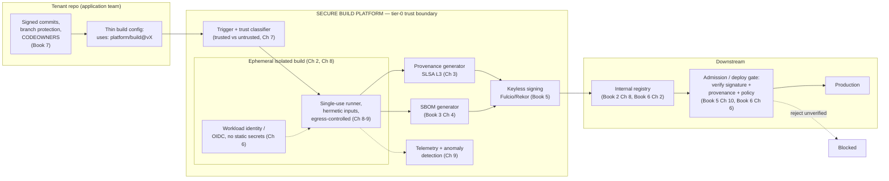
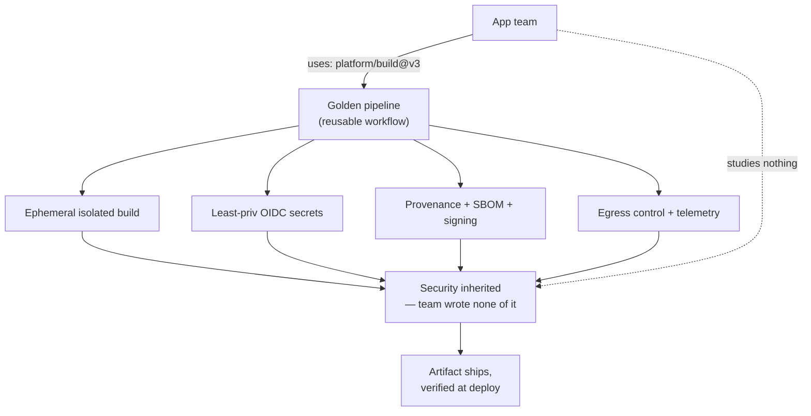
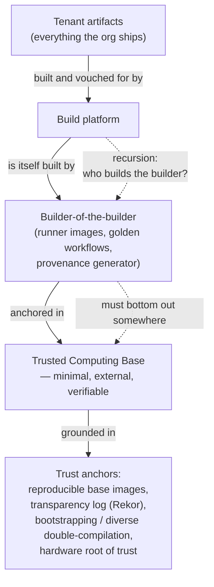
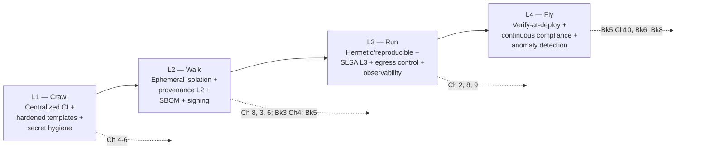

# Chapter 10 — Designing a Secure Build Platform at Scale

*What this chapter covers.* The previous nine chapters took the build system apart control by
control: the threat model (Ch 1), hermeticity and reproducibility (Ch 2), SLSA provenance
(Ch 3), the CI/CD platform attack surface (Ch 4), hardening GitHub Actions (Ch 5), secret
handling with workload identity (Ch 6), pipeline poisoning and the trusted/untrusted split
(Ch 7), ephemeral isolated runners (Ch 8), and build observability (Ch 9). Each was presented
as a technique a team *could* apply. This capstone argues that at organizational scale you must
not ask teams to apply them at all. You build a **platform** that applies them automatically, and
you make that platform the single, default, easiest way to turn source into a shipped artifact —
the **paved road** for builds. This chapter is the reference design: how the controls compose
into one hardened, multi-tenant system; how tenants inherit security "for free"; how you drive
hundreds of bespoke pipelines onto it without a revolt; how you govern it with policy-as-code;
how you measure and operate it as tier-0 infrastructure; and how you avoid the failure modes that
turn a security platform into shadow-CI bait. It is opinionated on purpose. A staff engineer who
has to actually build this needs decisions, not a menu.

Learning goals — after this chapter you should be able to:

- Make the **centralize-don't-distribute** argument precisely: why a shared hardened build
  platform beats N teams each securing their own build, and what the platform trades away
  (concentration of trust) for what it buys (a raised floor and a shrunken aggregate attack
  surface).
- Draw the **end-to-end secure build platform** — source integrity → hermetic isolated build →
  provenance + SBOM + signing → registry → verified deploy — with the platform trust boundary and
  the tenant model, and explain which guarantees each stage contributes.
- Design the **paved road**: golden reusable-workflow templates, a `build` abstraction that hides
  the security machinery, secure defaults, and self-service onboarding, so teams get security by
  *using* the platform rather than by *studying* it.
- Plan a **migration** off hundreds of legacy pipelines using warn-then-enforce, incremental
  control rollout, and accountable escape hatches instead of hard walls.
- Govern the platform with **policy-as-code**, express "everything built here is SLSA Build L3" as
  an enforced platform property, and instrument the **adoption** and **coverage** metrics that tell
  you whether any of it is working.
- Run the platform as **tier-0**, including securing *its own* supply chain — the "who builds the
  builder" recursion — with an anchored, minimal, verifiable trusted computing base.

---

## The thesis: centralize build security, do not distribute it

Start with the counterfactual, because it is the status quo almost everywhere. A large backend org
has hundreds of services, hundreds of repositories, and dozens of teams. Each team owns its
pipeline. Each pipeline is a snowflake: a `.github/workflows/` directory or a `.gitlab-ci.yml` or a
Jenkinsfile, accreted over years, copied from whatever example the first engineer found, edited by
a dozen hands, and understood in full by no one. Ask any single team to implement the controls of
this book — pin every action to a SHA (Ch 5), scope every token to least privilege (Ch 6), split
trusted from untrusted execution (Ch 7), run on ephemeral isolated runners (Ch 8), emit SLSA
provenance and an SBOM and a signature for every artifact (Ch 3, Book 3 Ch 4, Book 5) — and a good
team will do maybe half of it, once, and let it rot. Multiply that by a hundred teams and you have a
hundred independent, inconsistent, decaying security postures. The org's build security is the
**minimum** across all of them, because an attacker picks the weakest pipeline that ships to the
same production. This is the distributed-systems reality Book 1, Chapter 9 named: in a system of
many services, blast radius is a property of the *whole*, and security is bounded by the *worst*
component, not the average.

The alternative is to stop treating build security as something every team implements and start
treating it as something the org *provides*. Build one hardened build platform. Make it own the
isolation, the hermeticity, the secret handling, the provenance, the signing, the egress control,
and the monitoring. Then make it the default: the path of least resistance for shipping code is to
use the platform, and using the platform confers all of those controls without the tenant doing
anything security-specific. This is the **paved road** — a term from Netflix's platform
engineering vocabulary, but the idea is older than the phrase. *The secure path must be the default
path and the easiest path.* Any security architecture that depends on every engineer choosing the
hard, correct option over the easy, wrong one has already failed; humans under deadline pressure
route around friction. The only durable way to raise a floor is to move the floor, so that the
easy thing is also the safe thing.

The trade you are making is explicit and worth stating plainly, because it is the reason some
engineers resist centralization. A shared build platform **concentrates trust**. Every artifact
the org ships now passes through one system. Compromise that system and you compromise everything —
this is exactly the SolarWinds pattern (Book 1, Chapter 3): the attackers did not compromise
Orsion's source, they compromised the *build*, and because that build produced signed releases for
thousands of downstream customers, one build-system foothold became one of the widest-reaching
intrusions on record. A centralized build platform is a strictly higher-value target than any one
team's pipeline. You must accept that and respond to it: **the build platform is tier-0
infrastructure**, defended, monitored, access-controlled, and DR-planned at the same level as your
identity provider, your KMS, and your production Kubernetes control plane. We return to this at
length below.

But the concentration argument cuts both ways, and the net is strongly positive. Yes, you create
one high-value target. In exchange you **eliminate a hundred low-value ones** and shrink the
aggregate attack surface enormously. A hundred snowflake pipelines is a hundred configurations to
get wrong, a hundred sets of long-lived secrets to leak, a hundred runner fleets to leave
un-isolated. One platform is one configuration, audited by specialists, with one secret model, one
runner fleet, one egress policy — a small, concentrated, intensely-monitored surface a dedicated
team owns and can actually defend, instead of a large, diffuse, un-monitorable one no one owns.
Defenders get economies of scale individual teams never will: hardening one platform to SLSA L3 is
finite; hardening a hundred pipelines to L3 is a hundred times that and never finishes.
Concentration is what makes rigorous defense *affordable*.

### The build platform as a product

The organizational framing that makes this work: **the build platform is a product, and it has
customers.** The platform team is the owner. The application teams are tenants — customers who
consume a build service and ship faster because they no longer maintain pipeline plumbing.
Security is a partner, not the owner: security defines the required controls and audits coverage,
but the platform team builds and operates the thing, with the same product disciplines as any
internal platform — SLAs, on-call, a roadmap, docs, self-service onboarding, and a support channel.

This framing is not decoration; it changes what you build. A product exists to be *adopted*, and
adoption is voluntary in spirit even when it becomes mandatory in policy. If the platform is worse
than what a team already has — slower, less flexible, more painful to onboard — teams will resist,
route around it, and build shadow CI (more on this failure mode at the end). So the platform must
be a genuinely *better* way to build, not merely a *more secure* one. The security is the part the
tenant does not see and does not pay for in friction; the speed, the caching, the "it just works"
onboarding is the part they came for. Security rides in on the back of a product teams actually
want. Get that ordering wrong — lead with the security mandate, ship a worse developer experience —
and no amount of policy enforcement saves you.

---

## The reference architecture

Here is the whole book, composed into one system. Every stage maps to a chapter; the platform's job
is to own each stage so the tenant inherits it.



Read the diagram left to right as a chain of custody, and notice that the tenant's contribution is
tiny: signed source and a one-line build config. Everything inside the platform boundary is provided.

**Source integrity (Book 7).** The chain begins before the platform: the platform builds only from
source whose integrity is established upstream — signed commits (Book 7, Chapter 2), enforced review
and two-person rules on protected branches (Book 7, Chapter 3), and CODEOWNERS coverage extended to
the files the pipeline *executes*, not just the workflow file (the indirect-PPE lesson of Chapter 7).
The platform's first act is to fetch a specific, immutable commit by digest and record which commit
it built. It never builds mutable references.

**Trust classification and the trusted/untrusted split (Ch 7).** Every trigger is classified. A push
to a protected branch by a maintainer is *trusted* and may run with signing identity and deploy-
adjacent capability. A pull request from a fork is *untrusted* and runs in a context with **no
secrets, no signing identity, read-only cache, and no deploy reach** — it can compile and test but
cannot produce a releasable, signed artifact. This split is the single most important structural
control against pipeline poisoning (Ch 7, CICD-SEC-4), and centralizing it means no team can
accidentally opt out of it. In a bespoke pipeline the split is one careless `pull_request_target`
away from collapse; in the platform it is a property of the execution model.

**Hermetic, ephemeral, isolated build (Ch 2, Ch 8).** The build runs on a **single-use** runner —
provisioned per job, destroyed after, so nothing persists between builds and one tenant's build
cannot observe or poison the next (Ch 8). Inputs are hermetic: declared dependencies fetched from
controlled mirrors with pinned digests, no arbitrary network fetches during the build (Ch 2).
**Egress is controlled** — the runner reaches only an allowlist of package mirrors and the
platform's own services, so a poisoned dependency cannot exfiltrate to an attacker endpoint, and
the attempt is logged (Ch 8, Ch 9). Hermeticity also buys reproducibility, which is the independent
check on the provenance that comes next.

**Workload-identity secret handling (Ch 6).** The build holds **no long-lived secrets**. When it
needs to authenticate — to push to the registry, to sign — it exchanges its short-lived OIDC token
from the platform's identity for a scoped, minutes-long credential (Ch 6). There is no
`REGISTRY_PASSWORD` in an environment variable to leak; the identity is the runner's, ephemeral and
attested, and least-privileged to exactly the push target for this tenant.

**Provenance, SBOM, signing (Ch 3, Book 3 Ch 4, Book 5).** This is where the platform's leverage is
most visible. Because the platform owns the build environment and the signing identity, it generates
**SLSA Build L3 provenance** — an in-toto attestation with the `slsa.dev/provenance/v1` predicate,
recording what was built, from which source commit, by which builder, wrapped in a DSSE envelope —
and it does so with the isolation between the build step and the signing step that L3 requires (Ch
3). In the same pass it generates an **SBOM** (SPDX or CycloneDX) from the resolved dependency graph
(Book 3, Chapter 4), and it **signs** the artifact, the provenance, and the SBOM keylessly via
Sigstore — Fulcio issues a short-lived cert bound to the build's OIDC identity, Rekor logs it
transparently (Book 5, Chapters 3–4). The tenant wrote none of this. They inherited all of it.

**Observability (Ch 9).** Throughout, the platform emits structured telemetry — process, network,
and filesystem events — into an anomaly-detection pipeline. A build that suddenly reaches a new
domain, spawns an unexpected interpreter, or reads a credential path it never read before raises an
alert (Ch 9). At fleet scale this is only possible because builds are uniform: you can baseline
"normal" for a hundred thousand builds a week precisely because they all run the same hardened way.

**Publish and verify-at-deploy (Book 2 Ch 8, Book 5 Ch 10, Book 6).** The signed artifact plus its
attestations is pushed to the **internal registry** (Book 2, Chapter 8; Book 6, Chapter 2). Nothing
is trusted because it is *in* the registry — the registry is storage, not a trust boundary. Trust is
established at **deploy time**: the admission controller / deployment gate verifies the signature,
verifies the provenance meets policy (built by *this* platform, from a protected branch, SLSA L3),
and rejects anything that fails (Book 5, Chapter 10; Book 6, Chapter 6). This closes the loop. A
signed provenance nobody verifies is theater (Ch 3, Book 5); the platform *produces* the evidence
and the deploy gate *consumes* it, and both halves must exist for the control to mean anything.

### The guarantees tenants inherit for free

The payoff of composing all this behind one boundary is that a tenant who does nothing security-
specific still gets a strong posture by construction. Every artifact built on the platform is:

- built from a specific, immutable, review-gated source commit;
- built in an isolated, ephemeral, hermetic, egress-controlled environment;
- built with no long-lived secrets in reach;
- accompanied by SLSA L3 provenance, an SBOM, and signatures over all three;
- monitored for anomalies; and
- verifiable — and *verified* — at deploy.

The tenant's mental model is "I pushed code and it shipped." The security is inherited, not authored.
This is the entire point: **security by construction, not by discipline.**

### Control → platform mechanism → tenant benefit

| Control (chapter) | How the platform provides it | What the tenant does | Guarantee inherited |
|---|---|---|---|
| Source integrity (Book 7) | Builds only immutable commits from protected, review-gated branches; extends CODEOWNERS to executed files | Signs commits; uses protected branches | Artifact traces to reviewed source |
| Hermetic build (Ch 2) | Declared inputs, pinned mirrors, no build-time network | Declares dependencies in a lockfile | Reproducible, tamper-evident inputs |
| Ephemeral isolation (Ch 8) | Single-use runners, per-job VM/microVM, destroyed after | Nothing | No cross-build contamination or persistence |
| Trusted/untrusted split (Ch 7) | Trigger classifier; forks run without secrets or signing | Nothing | Poisoned PRs cannot produce releasable artifacts |
| Least-priv secrets (Ch 6) | OIDC → short-lived scoped credentials; no static secrets | Nothing | No long-lived secret to leak |
| Egress control (Ch 8–9) | Default-deny network allowlist per build | Requests additions with justification | Exfiltration blocked and logged |
| Provenance L3 (Ch 3) | Platform signs provenance with build/sign isolation | Nothing | Verifiable "how was this built" |
| SBOM (Book 3 Ch 4) | Generated from resolved graph each build | Nothing | Component inventory for every artifact |
| Signing (Book 5) | Keyless Sigstore signing of artifact + attestations | Nothing | Tamper-evident, verifiable identity |
| Observability (Ch 9) | Uniform telemetry → anomaly detection | Nothing | Build anomalies detected fleet-wide |
| Verify-at-deploy (Book 5 Ch 10, Book 6) | Admission gate checks sig + provenance + policy | Nothing | Unverified artifacts never reach prod |

The right-hand column is the product pitch. The middle column is the engineering. The tenant lives
almost entirely in a column that says "Nothing."

### Multi-tenancy and isolation

A shared platform serving many teams is a multi-tenant distributed system, and multi-tenancy is
where security platforms quietly fail. The isolation you provide *between* builds must also hold
*between tenants*. Concretely, separate along every axis a compromised tenant could exploit:

- **Runners.** Single-use per job (Ch 8) gives you time isolation for free. Add space isolation:
  strong per-job boundaries — microVMs (Firecracker/Kata) rather than shared-kernel containers for
  the untrusted tier — so a runner escape cannot reach the host or a neighboring tenant's build.
- **Caches.** The remote build cache (Bazel-style, Ch 2, Ch 7) is a *shared trusted input* and thus
  a cross-tenant poisoning vector. Namespace cache entries per trust scope so an untrusted context
  can never write an entry a trusted context reads (the cross-context poisoning inversion of Ch 7).
  Give untrusted contexts read-only cache access at most.
- **Secrets and identities.** Each tenant's workload identity is scoped to *its* push targets and
  deploy reach only. Tenant A's build must be unable to mint a credential for tenant B's registry
  path. This is the least-privilege boundary of Chapter 6 applied per tenant.
- **Provenance identity.** Provenance must record *which tenant* and *which builder configuration*
  produced the artifact, so a downstream verifier can require "built by platform, for tenant X, from
  repo X." A shared builder identity that erases the tenant boundary makes cross-tenant artifact
  substitution invisible to verification.

The trusted/untrusted execution split of Chapter 7 is the backbone here: it is not only a per-repo
control but the platform's tenancy model. Untrusted execution — fork PRs, unreviewed code — runs in
the most strongly isolated, least privileged tier, with no path to signing identity or deploy reach.
Trusted execution earns capability. The platform enforces this uniformly so that no tenant, and no
individual pipeline, can quietly grant untrusted code the privileges of trusted code.

---

## Paved-road adoption: making the secure path the easy path

A platform nobody uses secures nothing. Adoption is the whole game, and adoption is an
organizational problem at least as much as a technical one. The technical lever is to make the
secure path *dramatically* easier than rolling your own.



### The `build` abstraction

The unit of adoption is a **thin abstraction** that hides the security machinery. On GitHub Actions
this is a **reusable workflow** or a small set of composite actions the platform team owns and
versions; on GitLab, a CI `include` template; on Tekton, a curated Task/Pipeline in a shared
catalog; on Bazel, a macro. Whatever the substrate, the tenant's pipeline collapses to something
close to:

```yaml
# .github/workflows/release.yml — the entire tenant-authored pipeline
name: release
on:
  push:
    branches: [main]
jobs:
  build:
    uses: platform/golden-workflows/.github/workflows/build.yml@v3
    with:
      language: go
      image: ghcr.io/acme/checkout-service
    permissions:
      id-token: write   # OIDC for keyless signing
      contents: read
```

Everything in this book lives *behind* `build.yml@v3`: the runner selection and isolation, the
hermetic dependency fetch, the OIDC exchange, the provenance and SBOM generation, the signing, the
egress policy, the telemetry. The tenant declares *what* they are building, not *how* to build it
safely. Note two deliberate design choices. First, the reusable workflow is **pinned by version**
(`@v3`) — and the platform team, in turn, pins everything *it* uses by SHA (Ch 5), so the whole
transitive chain is immutable. Second, the tenant grants `id-token: write` but that only *enables*
the OIDC exchange the platform performs internally; the tenant never sees a signing key.

Secure **defaults** are the other half. The golden workflow ships with least-privilege token scopes,
SHA-pinned dependencies, egress default-deny, and provenance-on by default. A tenant gets the secure
configuration by accepting defaults — which is what every tenant does. The insecure options are
either absent or gated behind an accountable exception (below). Contrast the snowflake world, where
the default is whatever the copied example happened to contain, and secure is the deviation.

**Self-service onboarding** closes the loop. A team should be able to onboard a new service to the
platform in minutes, not via a ticket to the platform team: a scaffolding CLI or template repo that
generates the thin config, wires the OIDC trust, and registers the tenant identity. If onboarding
requires a human in the platform team's queue, adoption stalls at the platform team's headcount.
The paved road must be *self-serve* to scale past the size of the team that paves it.

### Migration: moving the long tail without a revolt

Greenfield services adopt the platform trivially — there is nothing to migrate. The hard part is the
hundreds of *existing* bespoke pipelines, each load-bearing, each subtly different, each owned by a
team with a roadmap that does not include "re-platform our CI." You cannot flip a switch. You run a
migration, and the migration strategy is where most platform efforts succeed or die.

**Warn, then enforce — never enforce first.** The cardinal rule (we will restate it as a failure
mode). Every new control ships first in *observe* mode: the platform evaluates whether a pipeline
would pass and reports it, but does not block. Teams see their gap, in their own dashboard, with a
clear remediation. Only after coverage is high and the remediation path is proven do you flip a
control to *enforce*. Enforcing a control before teams can realistically comply generates outages
and resentment, and resentment is how you lose the political capital a platform needs.

**Roll out controls incrementally, in dependency order.** Do not demand SLSA L3 on day one. The
sequencing that works — and it mirrors the maturity roadmap below — is:

1. **Generate first, enforce later.** Turn on provenance and SBOM *generation* across all builds,
   in observe mode. This is nearly free to the tenant (the platform does it) and immediately gives
   the org an inventory: which artifacts have provenance, which do not, what they contain.
2. **Add isolation and hardening** to the golden path — ephemeral runners, least-priv tokens,
   egress control — and migrate tenants onto the golden workflow so they inherit it.
3. **Then enforce verification** at deploy: require signatures and conformant provenance for
   production admission, gradually, environment by environment (dev → staging → prod).

Each step is shippable, delivers value, and de-risks the next. You are never one big-bang cutover
away from breaking everyone.

**Handle the long tail explicitly.** In any org, the distribution of pipelines is heavy-tailed: 80%
of services fit the golden path and migrate almost mechanically; the last 20% are weird — a monorepo
with a custom Bazel setup, a legacy service with a bespoke release dance, a team with a hard
regulatory constraint. Do not let the tail block the head. Migrate the easy majority first, bank the
coverage, and treat the tail as individually-negotiated migrations or documented long-term
exceptions. The goal is not 100% on day one; it is *monotonically increasing coverage* with the
gaps *known and owned*.

### Golden path versus escape hatches

Here is the most important cultural decision, and it is a decision, not a default: **allow deviation
with accountability, not hard walls.** A platform that forbids every deviation — no custom step, no
unusual dependency, no exception ever — drives its most sophisticated (and often most important)
teams into **shadow CI**: they stand up their own Jenkins in a corner, ship from it, and now you
have an *unmonitored* pipeline shipping to prod, which is strictly worse than a monitored deviation.
The paved road is paved because it is smooth, not because it is walled.

So provide **escape hatches with accountability**. A team that genuinely cannot use the golden path
files a documented exception: what they need, why the golden path does not serve it, who signed the
risk acceptance, and when it will be revisited. The exception is *visible* — it shows up in the
platform's coverage dashboard as a known gap with an owner — and it is *bounded* (an expiry, a
compensating control). The mental model is a **firewall exception process**, not a locked door. You
are trading a small, tracked, owned risk for the far larger, untracked, unowned risk of shadow CI.
The org's security posture is better served by a hundred deviations you can see than by ten you
cannot.

---

## Governance: policy as code, SLSA as a platform property

The platform makes the secure path easy; governance makes the insecure path *accountable*. The two
are complementary — enablement without governance drifts, governance without enablement revolts.

Express the platform's required controls as **policy as code** (Book 8, Chapter 4), enforced at the
points where it is cheapest to enforce:

- **At the org/repo configuration layer**, enforce structural controls: protected branches, required
  reviews, restricted runner groups, org-wide action allowlists (only SHA-pinned, only from the
  approved set — Ch 5). These are settings, and settings can be enforced centrally and drift-
  detected.
- **At the platform execution layer**, enforce build-time controls: no privileged runners, no static
  secrets, provenance-required, egress-default-deny. Because the platform owns execution, these are
  properties of the runtime, not requests to the tenant.
- **At the admission/deploy layer** (Book 5 Ch 10, Book 6 Ch 6), enforce the terminal control:
  reject any artifact whose signature or provenance does not verify against policy. This is the gate
  that makes all the upstream generation *mean* something.

A representative admission policy — the platform's guarantee expressed as an enforceable rule — as a
Sigstore policy for a Kubernetes admission controller:

```yaml
# require every prod image to carry conformant, platform-issued provenance
apiVersion: policy.sigstore.dev/v1beta1
kind: ClusterImagePolicy
metadata:
  name: require-platform-slsa-l3
spec:
  images:
    - glob: "registry.internal.acme/**"
  authorities:
    - keyless:
        url: https://fulcio.internal.acme       # the platform's own Fulcio
        identities:
          - issuer: https://oidc.internal.acme
            subjectRegExp: "^https://platform/golden-workflows/.+@refs/tags/v.+$"
      attestations:
        - name: must-have-slsa-provenance
          predicateType: https://slsa.dev/provenance/v1
          policy:
            type: cue
            data: |
              predicate: {
                buildDefinition: buildType: "https://platform.acme/buildtypes/v3"
                runDetails: builder: id: =~"^https://platform/golden-workflows/"
              }
```

The policy says, in effect: production accepts only images signed by *our* build platform's
identity, carrying SLSA provenance whose builder is *our* golden workflow. An artifact built any
other way — including a legitimately-signed artifact from a team's shadow Jenkins — does not deploy.
This is how "all artifacts built here are SLSA L3" becomes a *platform property* rather than an
aspiration: it is generated by construction upstream and *enforced by verification* downstream, and
the gap between the two is the thing your metrics must watch.

Two governance disciplines make this durable. First, **the policy is versioned and rolled out like
code** — proposed, reviewed, shipped in observe mode, then enforce mode — so a policy change cannot
itself become an outage. Second, **the platform team does not grant its own exceptions**; security
owns the exception process, the platform team owns the road. Separating who-builds from who-approves-
deviations keeps the platform honest, which matters enormously given what the platform is.

---

## Measuring and running the platform

### Metrics: adoption is the number that matters

You cannot manage what you cannot see, and at fleet scale the only view is metrics (Book 8, Chapter
8). Distinguish **leading** indicators (predictive; tell you where you are heading) from **lagging**
ones (outcomes; tell you where you have been), and above all fixate on the one metric that dominates
all others:

**Coverage — the percentage of production artifacts built on the platform — is the master metric.**
Every other control is conditional on it. SLSA L3 across the platform is worth little if only 40% of
what ships to prod goes through the platform; the attacker takes the other 60%. Drive coverage to
near-total and *keep* it there; a service that quietly migrated *off* the platform is a coverage
regression and a security incident in waiting.

Beyond coverage, the dashboard the platform and security teams run together:

| Metric | Type | What it tells you |
|---|---|---|
| % prod artifacts built on platform | Lagging (master) | Aggregate attack surface reduction |
| % artifacts with provenance / SBOM / signature | Leading | How close the generation half is to complete |
| SLSA level distribution (L0–L3) across artifacts | Lagging | Where the build-integrity floor actually sits |
| Hardening-control coverage (SHA-pinning, least-priv tokens, egress, ephemeral) | Leading | Config drift and gaps before they are exploited |
| % deploys gated by verification | Leading | Whether the produce-*and*-verify loop is closed |
| Open exceptions (count, age, owner) | Leading | The known, accountable risk surface |
| MTTD for build anomalies (Ch 9) | Lagging | Detection health of the monitoring pipeline |
| MTTR for build-platform incidents | Lagging | Operational resilience |

Read leading indicators to steer and lagging ones to grade. A rising count of aging exceptions is a
leading signal that the golden path is missing a real use case — fix the road, not the teams. A
falling percentage of gated deploys is a leading signal that verification is being bypassed — the
theater failure mode, arriving. Coverage plateauing below target is a leading signal that adoption
friction exceeds adoption incentive — a product problem, not a security one.

### Running the platform as tier-0

The platform builds everything the org ships. That makes it a **tier-0** dependency — as critical as
identity, KMS, and the production control plane — and it must be run like one:

- **High availability.** A build platform outage does not just slow feature work; it can block
  *security* releases — the emergency patch you cannot ship because CI is down. Multi-AZ, autoscaling
  runner fleets, no single control-plane instance whose loss halts builds.
- **Disaster recovery.** Backed-up and reproducible platform configuration, provenance/attestation
  stores, and the transparency log (Rekor) — with a tested restore. A DR plan you have never
  exercised is a hypothesis.
- **Access control.** Who can modify the golden workflows, the runner images, the signing identity,
  the admission policy? These are the platform's crown jewels — modifying them modifies *every*
  artifact — and they demand the strongest controls in the org: strict RBAC, two-person review on
  every change (the two-person rule of Book 7, Chapter 3 applied to the platform itself), and full
  audit. A malicious or careless change to a golden workflow is a supply-chain compromise of the
  entire org in one commit. Treat the platform's own repo as the highest-trust repo you own.
- **The platform's own provenance.** The platform must produce provenance and signatures for *its
  own* artifacts — runner images, the golden workflows, the provenance generator itself — so that
  its components are as verifiable as the tenant artifacts it vouches for. Which brings us to the
  recursion at the bottom of everything.

### Who builds the builder?

Every argument in this book reduces, eventually, to a question of what you trust *without checking*,
and a build platform makes the question sharp: **the platform vouches for every artifact — so who
vouches for the platform?** The platform is itself software. It is built from something. Its runner
images come from base images; its golden workflows run tools; its signing depends on keys and a
transparency log. If an attacker compromises *what builds the build platform*, they compromise
everything the platform subsequently vouches for — and the platform's own attestations will happily
certify the compromised outputs, because from the platform's perspective nothing is wrong. This is
Ken Thompson's *Reflections on Trusting Trust* (Book 7, Chapter 5; Book 1's trust framing in Chapter
6) at the level of an entire organization: a compromised builder can produce clean-looking
attestations for backdoored artifacts, and the attestation machinery cannot detect its own
subversion.



You cannot escape the recursion — every builder is built by *some* prior builder — but you can
**bottom it out** in a small, well-defended, externally-verifiable trust anchor, and you can shrink
the trusted computing base you must take on faith:

- **Minimize the TCB.** The fewer components the platform trusts implicitly, the smaller the surface
  where trust must be assumed rather than verified. A minimal, distroless runner image (Book 6,
  Chapter 3) is less to trust than a fat one.
- **Reproducibility as the escape route.** This is the deepest reason Chapter 2 mattered. If the
  platform's own components — its runner images, its generator binaries — are built **reproducibly**,
  then independent parties can rebuild them from source and confirm bit-for-bit that the running
  binary corresponds to the audited source. Reproducibility is what lets you *verify* the builder
  instead of *trusting* it, and it is the practical answer to Trusting Trust: diverse double-
  compilation and independent reproduction detect a subverted compiler that a single toolchain
  hides.
- **Transparency as the external witness.** The platform's own signing goes into the same public/
  internal transparency log (Rekor, Book 5, Chapters 3 and 5) as everything else, so that a
  surreptitious change to the platform's signing behavior leaves an append-only, tamper-evident
  trace someone can audit after the fact.
- **Bootstrap trust from something small and external** — a hardware root of trust, an offline root
  key, a minimal bootstrapping toolchain — so the base of the recursion is something you can actually
  inspect, not another sprawling system that itself needs a build platform to trust.

The honest position is that you will always trust *something* without fully verifying it. The
engineering goal is to make that something as small, as external, as verifiable, and as intensely
defended as possible — and to know exactly what it is. An org that cannot answer "who builds our
build platform, and how do we know it wasn't tampered with?" has an unexamined trust root at the
center of its supply chain.

---

## A maturity roadmap: crawl, walk, run

You do not build all of this at once, and you should not try. Book 1, Chapter 10 framed supply-chain
programs as a maturity progression, and the build platform follows the same crawl/walk/run arc. Each
level is independently valuable, shippable, and a prerequisite for the next.



| Capability | L1 Crawl | L2 Walk | L3 Run | L4 Fly |
|---|---|---|---|---|
| Centralized CI on shared platform | ✓ | ✓ | ✓ | ✓ |
| Hardened golden templates (SHA-pin, least-priv) | ✓ | ✓ | ✓ | ✓ |
| Secret hygiene (no static secrets, OIDC) | partial | ✓ | ✓ | ✓ |
| Ephemeral isolated runners | — | ✓ | ✓ | ✓ |
| Provenance | — | L2 | L3 | L3 |
| SBOM per artifact | — | ✓ | ✓ | ✓ |
| Artifact signing (keyless) | — | ✓ | ✓ | ✓ |
| Hermetic / reproducible builds | — | partial | ✓ | ✓ |
| Egress control | — | — | ✓ | ✓ |
| Build observability / anomaly detection | — | — | ✓ | ✓ |
| Verification enforced at deploy | — | — | observe | enforce |
| Continuous compliance / drift detection | — | — | partial | ✓ |
| Chapters | Ch 4–6 | Ch 3, 6, 8; Bk 3 Ch 4; Bk 5 | Ch 2, 8, 9 | Bk 5 Ch 10; Bk 6; Bk 8 |

**L1 (Crawl): centralized CI, hardened templates, secret hygiene.** Get every team onto one shared
platform running golden templates with SHA-pinned actions and least-privilege tokens, and get static
secrets out of pipelines. This alone eliminates the worst snowflake risks and creates the *substrate*
everything else builds on. Chapters 4–6.

**L2 (Walk): ephemeral isolation, provenance L2, SBOM, signing.** Add single-use isolated runners
(Ch 8) and turn on the generation half — SLSA L2 provenance (Ch 3), SBOMs (Book 3, Chapter 4), and
keyless signing (Book 5) — in observe mode. You now emit verifiable evidence for every artifact even
before anyone enforces on it.

**L3 (Run): hermetic/reproducible, SLSA L3, egress control, observability.** Tighten builds to
hermetic and (ideally) reproducible (Ch 2), which lifts provenance to L3 and, crucially, lets you
verify the *platform itself*. Add default-deny egress (Ch 8) and the anomaly-detection pipeline
(Ch 9). The platform is now genuinely hardened, not just instrumented.

**L4 (Fly): verify-at-deploy, continuous compliance, anomaly detection at scale.** Close the loop:
enforce signature and provenance verification at admission (Book 5, Chapter 10; Book 6, Chapter 6),
run continuous compliance and drift detection (Book 8, Chapter 4), and operate anomaly detection as a
live control with owned MTTD/MTTR. Only here does the produce-*and*-verify loop actually pay off,
because only here is the evidence *enforced*.

Most orgs live at L1–L2 for a long time, and that is fine — the levels are a ladder, not a race.
The failure is not being at L2; it is *believing you are at L4* because you generate provenance
nobody verifies.

---

## Common failure modes

Every one of these has sunk a real platform effort. They are predictable, which means they are
avoidable.

**The platform is harder than rolling your own.** If onboarding takes a week, builds are slower, and
the golden template is less flexible than a hand-rolled pipeline, sophisticated teams route around it
and build **shadow CI**. Now you have unmonitored pipelines shipping to prod — worse than where you
started, because at least the snowflakes were visible. *The paved road must be genuinely the easiest
path*, faster and lower-friction than the alternative. Lead with developer experience; security rides
in behind it.

**Enforcement before enablement.** Flipping controls to *enforce* before teams can comply produces
outages and a political backlash that can kill the platform outright. *Always warn before you
enforce.* Ship every control in observe mode, prove the remediation path, drive coverage, then
enforce. Enablement earns you the right to enforce.

**Ignoring the long tail.** Insisting on 100% before shipping anything means the weird 20% blocks the
easy 80% forever. Migrate the majority, bank the coverage, and negotiate the tail as tracked
exceptions. Monotonically increasing coverage with owned gaps beats a stalled quest for perfection.

**The platform as an unguarded single point of failure.** Centralization concentrates value; a
platform run casually is one malicious golden-workflow commit away from org-wide compromise (the
SolarWinds shape, Book 1, Chapter 3) and one outage away from blocking every release. *Run it as
tier-0*: HA, DR, strict change control, two-person review on the crown-jewel repos, and its own
verifiable supply chain.

**Security theater: provenance nobody verifies.** The most seductive failure, because it *looks*
like success — dashboards full of green, provenance and SBOMs and signatures on every artifact — and
secures nothing, because nothing downstream *checks* them. Provenance you produce but never verify is
a log file, not a control. *Produce and verify.* The generation half (the platform) and the
verification half (the deploy gate, Book 5, Chapter 10; Book 6) are one control in two places, and a
platform that has built only the first half has built a very expensive way to feel safe.

---

## Distributed-systems lens

The secure build platform is **itself a large distributed system**: an autoscaling fleet of ephemeral
runners, a remote build cache, artifact/provenance/SBOM object stores, a signing service and a
transparency log, a policy engine, an identity provider issuing short-lived tokens, and a telemetry
pipeline feeding anomaly detection. A senior backend engineer already knows how to design each of
these — the caching, autoscaling, multi-tenancy, HA, and observability are the same problems you
solve for any production service. The novelty is only in the *security properties* you compose on
top: isolation as a tenancy boundary, provenance as an audit trail, verification as an admission
gate. You are not learning a new discipline; you are pointing one you already have at the supply
chain.

And it is the **highest-leverage single investment** in supply-chain security a build-heavy org can
make. Every other control in this suite — signing (Book 5), SBOMs (Book 3), dependency policy (Book
2), admission control (Book 6) — protects one link. The build platform protects *every artifact for
every team at once*, by *construction* rather than exhortation. It raises the floor for the whole org
at once, turns the book's controls into **inherited platform properties**, and makes the secure path
the default. Centralize that platform, harden it once, run it as tier-0, verify its output at deploy,
and verify the platform itself — and you have converted a hundred independently-failing pipelines into
one system whose security you can actually reason about, measure, and defend.

The loop closes where it began. Chapter 1 asked whether the build faithfully transformed reviewed
source into the shipped artifact. This platform *answers* that question for every artifact, by
producing verifiable provenance in an isolated, hermetic, monitored environment — and Books 5 and 6
*enforce* the answer at the moment of deploy. That is what a secure build platform is: the machine
that makes "was this built the way we think it was?" a question you can answer, at scale, by default,
for everything you ship.

---

## Key takeaways

- **Centralize build security into a platform; do not distribute it to teams.** Hundreds of teams
  cannot each secure their own builds well. A shared hardened platform provides isolation,
  hermeticity, provenance, secret handling, and monitoring to every team automatically. The secure
  path must be the default and the *easiest* path.
- **The concentration trade is net-positive but real.** Centralizing creates one tier-0 target (the
  SolarWinds lesson) in exchange for eliminating a hundred un-owned ones and shrinking the aggregate
  attack surface. Accept the trade by defending the platform as tier-0.
- **Run the platform as a product.** Platform team owns it, app teams are tenants, security is a
  partner. It must be a genuinely *better* way to build, not just a more secure one — security rides
  in behind developer experience.
- **The whole book composes into one chain of custody:** source integrity → trusted/untrusted split →
  ephemeral hermetic isolated build → least-priv OIDC secrets → provenance + SBOM + signing →
  internal registry → verified-at-deploy. The tenant contributes signed source and a one-line config;
  everything else is inherited.
- **Enforce isolation between tenants, not just between builds** — runners, caches, secrets,
  identities, and provenance identity all scoped per tenant, with untrusted execution in the most
  isolated, least-privileged tier.
- **Adoption (coverage) is the master metric.** SLSA L3 on 40% of prod artifacts secures nothing; the
  attacker takes the other 60%. Drive coverage near-total and keep it there.
- **Migrate warn-then-enforce, incrementally, generate-before-enforce**, and handle the long tail as
  accountable, expiring exceptions — escape hatches with ownership, not hard walls that breed shadow
  CI.
- **Governance is policy-as-code enforced at three layers** (config, execution, admission), turning
  "everything built here is SLSA L3" into an enforced platform property — but only if you *produce
  and verify*; provenance nobody checks is theater.
- **Who builds the builder?** The platform vouches for everything, so its own supply chain must be
  the most-verified of all. Minimize the TCB, build the platform reproducibly, log to transparency,
  and anchor trust in something small, external, and verifiable — the organizational answer to
  Trusting Trust.

## Further reading

- **SLSA v1.0 — Build track and Threats & mitigations.** The normative basis for "everything built
  here is SLSA L3" as a platform property. <https://slsa.dev/spec/v1.0/> and
  <https://slsa.dev/spec/v1.0/threats>.
- **Ken Thompson, *Reflections on Trusting Trust* (1984 Turing Award lecture).** The founding
  statement of the "who builds the builder" problem. <https://dl.acm.org/doi/10.1145/358198.358210>.
  See also David A. Wheeler, *Fully Countering Trusting Trust through Diverse Double-Compiling* (2009)
  for the reproducibility-based countermeasure.
- **Reproducible Builds project.** The practical foundation for verifying — rather than trusting —
  the platform's own components. <https://reproducible-builds.org/>.
- **Sigstore (Cosign, Fulcio, Rekor) documentation and the sigstore policy-controller.** Keyless
  signing and admission-time verification — the produce-and-verify loop. <https://docs.sigstore.dev/>.
- **NIST SP 800-218, Secure Software Development Framework (SSDF v1.1)** and **CISA/NIST guidance on
  securing the software supply chain for build systems.** The control catalog a platform's required
  controls map to. <https://csrc.nist.gov/publications/detail/sp/800-218/final>.
- **Google, *BeyondProd* and SLSA origins**; **Netflix and Spotify engineering on "paved road" /
  "golden path" platform models.** The organizational pattern of secure-by-default internal
  platforms.
- Book 1, Chapter 3 (SolarWinds / 3CX build compromise), Chapter 6 (trust and threat-model
  economics), Chapter 9 (distributed-systems blast radius), and Chapter 10 (building a program).
  Book 3, Chapter 4 (SBOM generation). Book 4, Chapters 2–3 and 6–9 (hermetic builds, provenance,
  secrets, poisoning, ephemeral runners, observability). Book 5 (signing and attestation), especially
  Chapter 10 (attestation-based deployment gates). Book 6, Chapters 2 and 6 (registries; admission
  control). Book 7, Chapters 3 and 5 (two-person review; Trusting Trust and backdoors). Book 8,
  Chapters 4 and 8 (policy-as-code and continuous compliance; metrics and reporting).
