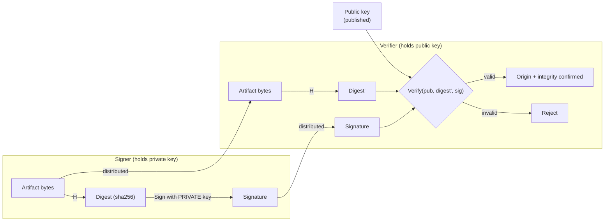
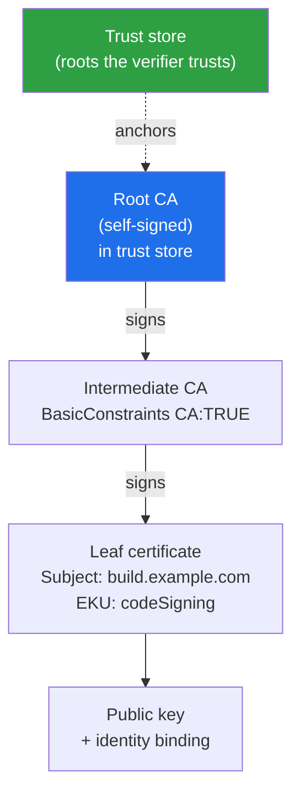
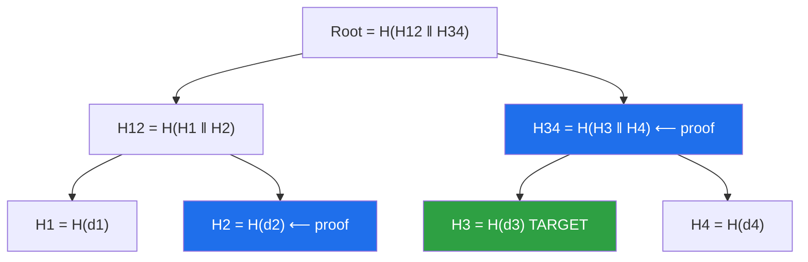
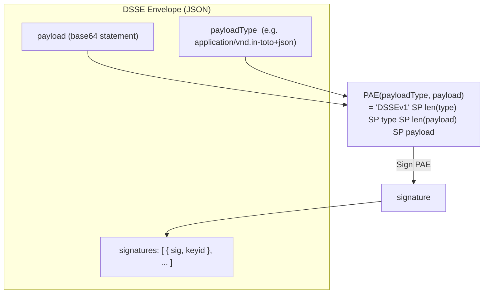
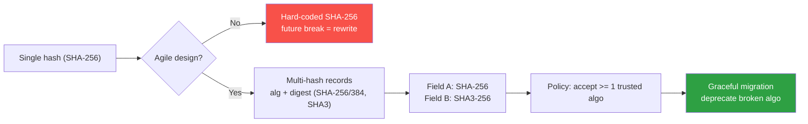
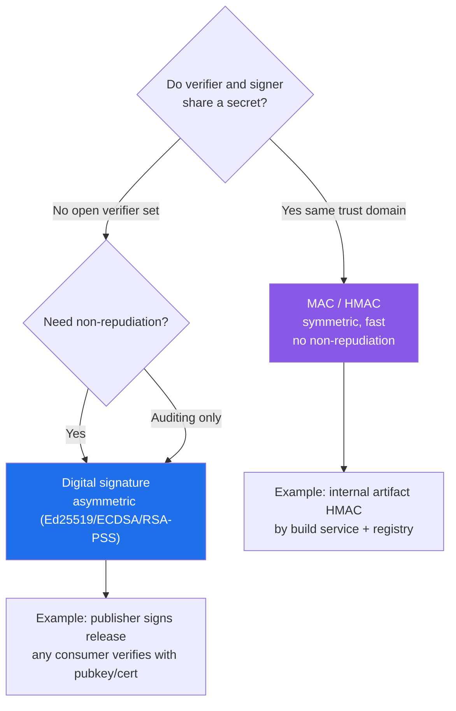
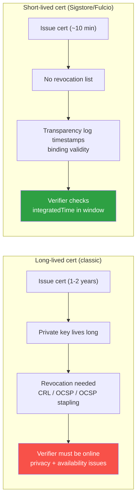

# Chapter 1 — Cryptographic Foundations for Supply Chain Security

*What this chapter covers.* This book is about proving things about software: that an artifact
came from a build you trust, that it has not been altered since, that a specific identity
vouched for it, and that these facts are recorded somewhere no one can quietly rewrite. Every
one of those guarantees rests on a small set of cryptographic primitives — hash functions,
digital signatures, certificates, Merkle trees, and the envelope and key-management machinery
that wires them together. The rest of Book 5 (Sigstore in Chapters 3–4, transparency logs in
Chapter 5, in-toto in Chapter 6, TUF in Chapter 7, key management in Chapter 9) assumes you
hold precise mental models of these primitives. This chapter builds them. It is deliberately
*not* a general cryptography course — there is no elliptic-curve arithmetic, no number theory
beyond what changes an engineering decision. It is a rigorous, practical refresher aimed at
exactly the operations supply chain security performs: hash an artifact, sign a digest, verify
a signature against an identity, prove membership in a log, and manage the keys underneath all
of it.

Learning goals — after this chapter you should be able to:

- State the three security properties of a cryptographic hash (preimage, second-preimage,
  collision resistance), explain which one **SHAttered** broke for SHA-1, and explain why
  "the hash *is* the name" (content addressing) is the load-bearing integrity pattern of the
  entire supply chain.
- Explain what a digital signature actually proves — authenticity, integrity, non-repudiation
  — and, just as importantly, what it does **not** prove: that the signed bytes are *safe*
  (the SolarWinds lesson).
- Choose correctly among **RSA (PKCS#1 v1.5 vs PSS)**, **ECDSA (P-256)**, and **Ed25519**,
  and say why Ed25519 is the modern default; distinguish a signature from an **HMAC**.
- Read an **X.509** certificate chain, describe how a verifier validates it, and explain why
  **revocation** is the hard part — setting up the short-lived-certificate design of Chapters 3–4.
- Explain **Merkle inclusion and consistency proofs** at the level Chapter 5 needs, describe
  the **DSSE** envelope and its **PAE** encoding, and give an accurate account of **threshold
  signing** and the **post-quantum** transition (ML-DSA / SLH-DSA, standardized 2024).

## Hash functions: turning bytes into names

A cryptographic hash function `H` maps an input of any length to a fixed-length output — 256
bits for SHA-256, 512 for SHA-512 — such that the output behaves, for all practical purposes,
like a random fingerprint of the input. Change one bit of a 4 GB container image and the digest
changes completely and unpredictably (the *avalanche* property). This is the workhorse of
supply chain integrity, and the reason is that a good hash gives you three distinct security
properties, which are worth keeping separate because attacks and use cases target them
individually.

- **Preimage resistance.** Given a digest `h`, it is computationally infeasible to find *any*
  input `m` with `H(m) = h`. This is what lets a hash stand in for a secret you never reveal:
  a password-hash comparison, or a commitment to a value you will disclose later.
- **Second-preimage resistance.** Given a *specific* input `m₁`, it is infeasible to find a
  *different* `m₂ ≠ m₁` with `H(m₂) = H(m₁)`. This is the property that matters when a hash is
  used as a name for a known artifact: an attacker who wants to swap `nginx:1.27` for a
  backdoored image must produce a *different* image with the *same* digest.
- **Collision resistance.** It is infeasible to find *any* pair `m₁ ≠ m₂` with
  `H(m₁) = H(m₂)`. This is strictly stronger than second-preimage resistance, because the
  attacker gets to choose *both* messages. It matters when the attacker controls the content
  being hashed — for example, submitting a benign document for signing and later claiming the
  signature covers a malicious one that hashes identically.

The generic cost of these attacks is set by the output length `n`. A brute-force preimage or
second-preimage search costs about `2ⁿ` operations; finding a collision costs only about
`2^(n/2)` because of the birthday paradox. So SHA-256 offers ~256-bit preimage resistance but
only ~128-bit collision resistance — which is why 256 bits is the modern floor: it puts the
*weaker* of the two properties at the 128-bit security level we treat as safe.

### Why MD5 and SHA-1 are dead

A hash is "broken" when an attack beats these generic bounds, and the supply chain has watched
two workhorses fall.

**MD5** (128-bit) lost collision resistance to Wang et al. in 2004; by 2008 researchers used
MD5 collisions to forge a rogue CA certificate, and in 2012 the **Flame** espionage malware
used an MD5 chosen-prefix collision to forge a Microsoft code-signing certificate and pass
itself off as a legitimate Windows Update. That last one is the canonical demonstration that a
broken hash *inside a signing scheme* is a signing-scheme break: Flame was validly signed
malware whose validity flowed entirely from a collision.

**SHA-1** (160-bit) was theoretically wounded for years, then killed in practice. On
**February 23, 2017**, researchers at Google and CWI Amsterdam published **SHAttered** — the
first *practical* SHA-1 collision: two different PDF files with the same SHA-1 digest, produced
with roughly 2⁶³ SHA-1 computations (far below the 2⁸⁰ a generic birthday attack would need).
In 2020, Leurent and Peyrin extended this to a **chosen-prefix** collision ("SHA-1 is a
Shambles"), which is the dangerous kind: the attacker can collide two meaningfully different,
attacker-chosen messages, cheaply enough to forge PGP web-of-trust certificates.

This matters directly for **git**, which names every object — blobs, trees, commits — by its
SHA-1 hash. A chosen-prefix collision is, in principle, a way to make two different commits
share an object ID, which is a foundational integrity failure for a content-addressed store.
In practice git mitigated the immediate risk by adopting **SHA-1DC** (hardened SHA-1 with
collision *detection*, which rejects inputs bearing the SHATTERED attack's fingerprint) and is
migrating toward SHA-256 object IDs — a transition explored in Book 7 (Source and Insider
Threats), because it touches every tool that assumes a git hash is 40 hex characters. The
lesson for this book: a content-addressed system inherits the collision resistance of its hash,
and no more.

### The modern hash toolbox

| Hash | Output | Structure | Status for supply chain |
|------|--------|-----------|-------------------------|
| MD5 | 128-bit | Merkle–Damgård | **Broken** (collisions trivial). Never for security. |
| SHA-1 | 160-bit | Merkle–Damgård | **Broken** (SHAttered 2017). Legacy only; git migrating off. |
| SHA-256 | 256-bit | Merkle–Damgård | **Recommended default.** OCI digests, cosign, most tooling. |
| SHA-512 | 512-bit | Merkle–Damgård | Fine; faster than SHA-256 on 64-bit CPUs. |
| SHA-512/256 | 256-bit | Merkle–Damgård (truncated) | SHA-512 internally, 256-bit output; length-extension safe. |
| SHA3-256 / SHA3-512 | 256 / 512-bit | Keccak sponge | Sound, different design; useful for algorithm diversity. |
| BLAKE3 | 256-bit (XOF) | Merkle-tree, keyed | Very fast, parallel; used by some newer tooling. |

Two design-family notes matter operationally. **SHA-2** (SHA-256/512) uses the Merkle–Damgård
construction, which has a **length-extension** weakness: given `H(secret ‖ m)` and the length
of `secret`, an attacker can compute `H(secret ‖ m ‖ padding ‖ m')` without knowing the secret.
This never affects plain artifact hashing or signatures, but it is why you must never build a
MAC as `H(secret ‖ message)` — use HMAC or SHA-512/256, which truncates the internal state and
closes the extension. **SHA-3** is a completely different construction (the Keccak sponge),
which is valuable precisely because it shares no structural DNA with SHA-2: if a break is ever
found in the Merkle–Damgård family, SHA-3 is unlikely to fall to the same technique. That
diversity is the seed of *crypto-agility*, a theme we return to at the end of the chapter.

### Content addressing: the hash *is* the name

Here is the pattern that makes hashes the backbone of supply chain security, not merely a tool
in it. In a **content-addressed** system, an artifact's identifier *is* its hash. The name is
derived from the bytes, so the name is a self-verifying claim about the bytes: anyone who has
the artifact can recompute the hash and confirm they have exactly the object the name refers
to — no trusted third party, no lookup, no metadata to forge.

Supply chain infrastructure is content-addressed nearly everywhere:

- **OCI image digests.** `nginx@sha256:a8f2...` names an image by the SHA-256 of its manifest.
  The manifest in turn lists each layer and config blob *by digest*, so the single top-level
  digest transitively commits to every byte of the image. Pulling by digest — rather than by
  the mutable tag `nginx:1.27` — is a security primitive: the registry, a MITM, or a
  compromised mirror cannot serve you different bytes than the digest names.
- **git commits.** A commit hashes its tree, parent commit(s), author, and message; the tree
  hashes its entries; each blob hashes its content. A single commit SHA is therefore a Merkle
  root over the entire repository state at that point (more on Merkle structure below).
- **Lockfile integrity hashes.** `package-lock.json` `integrity` fields (Subresource
  Integrity, `sha512-…`), Go's `go.sum`, Cargo's `Cargo.lock` checksums, and Python's
  `--require-hashes` all pin a dependency's *content* by hash. Note the contrast with a
  **purl** (`pkg:npm/lodash@4.17.21`), which is a *coordinate* — a mutable name a registry
  resolves — not a content address; the lockfile is exactly the layer that binds the coordinate
  to an immutable hash so that "resolve `lodash@4.17.21`" cannot silently return different bytes
  tomorrow.

The security move in all of these is the same: **pinning by digest**. A coordinate (`:1.27`,
`@4.17.21`, `latest`) is a promise someone else can break; a digest is a fact you can verify.
Throughout this book, "pin by digest" is the baseline, and signatures and provenance are what
you layer *on top* of a digest to answer questions the digest alone cannot — namely *who* built
these exact bytes and *whether you should trust them*.

## Digital signatures: the core primitive

A hash tells you whether bytes changed. It does not tell you *who* produced them, because
anyone can compute a hash. Digital signatures add that missing axis: origin.

### Asymmetric cryptography in one page

A signature scheme uses an **asymmetric keypair**: a **private key** (kept secret) and a
mathematically related **public key** (published freely). The defining property is that the two
keys play different roles that cannot be swapped:

- **Signing** takes the private key and a message and produces a signature.
- **Verification** takes the public key, the message, and the signature and returns
  valid/invalid.

Only the holder of the private key can produce a signature that verifies under the
corresponding public key, and this holds even though the public key is known to everyone. That
asymmetry — sign with private, verify with public — is what makes signatures *broadcast
authentication*: you can hand your public key to the entire world, and any of them can verify
your signatures, but none of them can forge one.



### What a signature proves — and what it does not

A valid signature under a public key you trust establishes three things:

- **Integrity.** The bytes were not altered after signing; any change breaks the signature.
- **Authenticity.** The signature was produced by the holder of the corresponding private key.
- **Non-repudiation.** Because only the private-key holder could have produced it, the signer
  cannot later credibly deny having signed — a property MACs (below) do *not* provide.

Now the single most important sentence in this chapter: **a signature proves origin, not
honesty.** It says "the holder of this key vouches for these exact bytes." It says *nothing*
about whether those bytes are safe, correct, or benign. A signature over malware is a perfectly
valid signature over malware.

This is not a hypothetical. In the **SolarWinds** compromise (2020; dissected in Book 1,
Chapter 3), the attackers implanted the SUNBURST backdoor into the Orion build *before*
SolarWinds' own signing step. The malicious DLL was then signed with SolarWinds' legitimate
code-signing key, as part of the normal, authorized release process. Every downstream customer
who verified the signature got a valid result — because the signature was, in the narrow
cryptographic sense, entirely valid. The signing key was not stolen; it did not need to be.
The attack subverted the *input* to signing, and the signature dutifully certified the origin
of code that was already backdoored.

| A valid signature **proves** | A valid signature does **not** prove |
|------------------------------|--------------------------------------|
| The bytes are unchanged since signing (integrity) | The bytes are free of vulnerabilities |
| A specific private key produced it (authenticity) | The bytes are non-malicious ("safe") |
| The signer cannot deny signing (non-repudiation) | The signer *should* be trusted for this use |
| *If* bound to identity via PKI: which identity signed | That the signing process was not subverted upstream |
| That you got the same bytes the signer signed | That the *right* thing was signed (see SolarWinds) |

The takeaway shapes the entire book. Signing is necessary but not sufficient. It answers "who
vouches for these bytes?" — a question worth answering — but it must be composed with
*provenance* (what process produced them, Book 4, Chapter 3), *transparency* (is this signature
publicly recorded, Chapter 5), and *policy* (do I trust this signer for this action, Chapter
10). A signature is a building block, not a verdict.

### Signature algorithms, accurately

You will almost never implement a signature algorithm, but you must choose one and configure it
correctly, so precision matters.

**RSA.** The oldest of the three, based on the difficulty of factoring large integers. RSA
signing has *two* padding schemes, and the distinction is not cosmetic:

- **PKCS#1 v1.5** is the older, deterministic padding. It is still ubiquitous (TLS
  certificates, older tooling) and there is no known practical forgery against RSA *signatures*
  with correct v1.5 padding — but the scheme lacks a security proof and has a long history of
  implementation pitfalls (the "Bleichenbacher" family, and signature-forgery bugs when
  verifiers parse padding sloppily, e.g. BERserk).
- **RSA-PSS** (Probabilistic Signature Scheme) is the modern padding: randomized, with a
  tight security proof reducing forgery to the RSA problem. New designs should prefer PSS.

RSA's cost is key and signature *size*: 2048-bit RSA gives roughly 112-bit security, and you
need **3072-bit** for the 128-bit level, producing 384-byte signatures. RSA verification is
fast (small public exponent); signing is comparatively slow.

**ECDSA.** Elliptic Curve Digital Signature Algorithm, based on the elliptic-curve discrete-log
problem. **P-256** (a.k.a. `secp256r1` / `prime256v1`) gives 128-bit security with 32-byte keys
and 64-byte signatures — an order of magnitude smaller than equivalent RSA. It is fast and
widely supported in hardware and standards. Its one sharp edge: ECDSA requires a fresh, uniformly
random secret **nonce** `k` for every signature, and *any* reuse or bias in `k` leaks the private
key. This is not theoretical — it is how the **PlayStation 3** code-signing key was recovered in
2010 (Sony reused a constant `k`), and it recurs whenever an implementation's RNG is weak. We
return to this under "correct usage."

**EdDSA / Ed25519.** The modern default. Ed25519 is EdDSA instantiated over the twisted Edwards
curve edwards25519 (RFC 8032), and it was engineered specifically to remove the footguns that
sink ECDSA deployments:

- **Deterministic.** The per-signature nonce is derived by hashing the private key together
  with the message, so there is no RNG to reuse or bias. The PS3-class failure is impossible by
  construction.
- **Fast.** Signing and verification are very fast, and batch verification is supported.
- **Misuse-resistant.** No parameter choices to get wrong, no point-validation subtleties left
  to the caller, 32-byte keys and 64-byte signatures.
- **128-bit security** at those small sizes.

For new signing systems, Ed25519 is the right default, and much of the modern supply chain
tooling reflects that. (Sigstore's Fulcio issues ECDSA-P-256 leaf certificates for ecosystem
and hardware-support reasons, but cosign, TUF, SSH, and many others use or prefer Ed25519 for
raw-key signing.)

| Algorithm | Security level | Key / sig size | Nonce risk | Recommendation |
|-----------|----------------|----------------|-----------|----------------|
| RSA-2048 PKCS#1 v1.5 | ~112-bit | 256 / 256 B | none (det.) | Legacy compat only |
| RSA-3072 PSS | 128-bit | 384 / 384 B | none (det.) | OK if RSA required |
| ECDSA P-256 | 128-bit | 32 / 64 B | **high** (needs good RNG) | Fine with vetted lib |
| ECDSA P-384 | 192-bit | 48 / 96 B | high | When 192-bit needed |
| **Ed25519** | 128-bit | 32 / 64 B | **none** (deterministic) | **Default choice** |

### Sign the hash, not the artifact

A subtlety that trips people up: signature algorithms do not sign the artifact. They sign its
**digest**. A 4 GB image is hashed to 32 bytes, and the signature operation runs on those 32
bytes. This is why "sign" and "hash" are inseparable in practice, and it has two consequences.
First, the collision resistance of the hash is part of the signature's security: if you can
find two artifacts with the same digest, a signature over one is a valid signature over the
other — which is *exactly* how the Flame malware forged its Microsoft certificate. Signing a
digest is only as strong as the hash under it, which is why signing schemes deprecate SHA-1 in
lockstep with everything else. Second, it means signing is cheap and streaming-friendly: you
hash the artifact once (linear, no secret needed) and perform one small asymmetric operation on
the result.

### MACs versus signatures

A **MAC** (Message Authentication Code) — in practice **HMAC** (RFC 2104), built from a hash
like `HMAC-SHA256` — also authenticates a message and detects tampering, and it is faster and
smaller than any signature. But it is **symmetric**: the *same* secret key both produces and
verifies the tag. Everyone who can verify can also forge. This has one decisive consequence for
supply chain use: an HMAC provides **no non-repudiation**. If Alice and Bob share an HMAC key
and Bob receives a validly-tagged message, Bob cannot prove to a *third party* that Alice sent
it — Bob could have produced the tag himself. A signature, being asymmetric, gives exactly the
property HMAC cannot: a verifiable link to a *single* party who alone could have produced it.

The rule of thumb: use an **HMAC** when the two parties are the same trust domain and you just
need fast integrity/authenticity on a channel (webhook signatures like GitHub's
`X-Hub-Signature-256`, session cookies, API request signing, deriving sub-keys). Use a
**digital signature** whenever a third party must independently verify origin, or whenever the
signer must be held to their signature — which is *every* artifact-signing scenario in this
book. Signing an artifact with an HMAC would be meaningless: the whole point is that the world,
not just the holder of a shared secret, can verify it.

## PKI and certificates: binding keys to identities

Signatures have a bootstrapping problem. Verification tells you "the holder of *this public key*
signed these bytes." But how do you know *whose* key it is? An attacker can generate a keypair,
sign malware with it, and hand you the public key claiming it belongs to "nginx maintainers."
The signature will verify perfectly against the key they gave you. The math is sound; the
*identity binding* is missing. This is the **trust problem**, and Public Key Infrastructure
(PKI) is one of the two answers to it (the other, keyless signing bound to workload identity, is
Chapters 3–4).

### Certificates and the X.509 chain

A **certificate** is a signed statement that binds a **public key** to an **identity**. In the
web PKI it is an **X.509 v3** certificate, whose essential fields are the subject (the identity
— a domain, an email, a service), the subject's public key, a validity window (`notBefore` /
`notAfter`), the issuer, and a set of extensions (Subject Alternative Names, Key Usage,
Extended Key Usage, Basic Constraints marking whether the cert may itself act as a CA). Crucially,
the certificate is **signed by a Certificate Authority (CA)** — an issuer whose own key you
already trust. The certificate is thus a signature that says: *"I, this CA, attest that this
public key belongs to this identity, until this date."*

Trust is not flat; it is a **chain**. You do not trust every CA directly. You trust a small set
of **root** CAs — self-signed certificates baked into a **trust store** (your OS/browser root
store, a container base image's `ca-certificates`, a private corporate root). Roots delegate to
**intermediate** CAs, which issue the **leaf** (end-entity) certificates that actually bind
service identities. Each certificate is signed by the one above it, forming a chain from leaf to
root.



**Chain validation**, which every TLS client and signature verifier performs, walks from the
leaf up to a trusted root and checks, at each link: (1) the signature on this certificate
verifies under the issuer's public key; (2) the current time is within the certificate's
validity window; (3) the issuer is actually permitted to issue — `BasicConstraints` marks it a
CA, `pathLenConstraint` is not exceeded, and Key/Extended-Key-Usage and name constraints permit
this issuance; (4) the certificate has not been **revoked**; and (5) the top of the chain is a
root in the trust store. If any check fails, the whole chain is untrusted. The identity you may
then rely on is the leaf's subject/SAN — *and only because* an unbroken chain of signatures
connects it to a root you decided, out of band, to trust.

### Revocation is the hard part

Certificates carry an expiry, but expiry is coarse. What happens when a private key is *stolen*
before its certificate expires, or a certificate was *misissued*? You need **revocation** —
a way to say "stop trusting this certificate now." PKI offers two mechanisms, and both are
operationally painful:

- **CRL** (Certificate Revocation List): the CA publishes a signed list of revoked serial
  numbers. Lists grow large, are fetched infrequently, and a verifier with a stale CRL happily
  accepts a revoked cert.
- **OCSP** (Online Certificate Status Protocol): the verifier asks the CA's responder, in real
  time, "is serial X still good?" This leaks the verifier's browsing/verification activity to
  the CA (a privacy problem), adds a network round-trip on the hot path, and — the fatal flaw —
  most clients **soft-fail**: if the OCSP responder is unreachable, they proceed *as if the cert
  were valid*, because hard-failing would make every CA outage a global outage. An attacker who
  can block the OCSP request therefore neutralizes revocation entirely. **OCSP stapling** (the
  server presents a recent signed status itself) mitigates the privacy and latency issues but
  not the soft-fail one, and the industry has been actively *deprecating* OCSP.

The deep lesson — the one that motivates half of Chapters 3–5 — is that **revocation of
long-lived credentials does not work well at scale.** Every revocation mechanism is either
stale, privacy-leaking, or fail-open. The modern answer is to sidestep revocation by making
certificates **short-lived**: if a certificate lives for 90 days (Let's Encrypt) or **~10
minutes** (Sigstore's Fulcio, Chapter 4), the revocation window is small enough that expiry
*is* the revocation mechanism. A stolen key that expires in ten minutes is a much smaller
problem than one that expires in two years and whose revocation the ecosystem may never notice.
Short-lived certificates fit ephemeral CI perfectly (Book 4, Chapter 8): the build runs for
minutes, gets a certificate for minutes, and the credential is worthless the moment the job
ends.

### The CA trust model's weaknesses

The web PKI has a structural fragility: **any** trusted CA can issue a certificate for **any**
identity. Your browser trusts scores of root CAs; a compromise or misbehavior at *any one* of
them produces a certificate that validates cleanly for `*.yourcompany.com`. This is not
hypothetical: in 2011 the Dutch CA **DigiNotar** was breached and issued fraudulent
certificates for Google and other domains, which were used to intercept traffic — the incident
ended with DigiNotar removed from trust stores and bankrupt. The same year, **Comodo** suffered
fraudulent issuance. Misissuance and CA compromise are the web PKI's persistent failure mode.

The response is **Certificate Transparency** (CT, RFC 6962): CAs must log every certificate they
issue to public, append-only **Merkle-tree logs**, so that a domain owner can *detect* a
certificate issued for their domain that they did not request. CT does not prevent misissuance;
it makes misissuance **discoverable**. That same architecture — append-only transparency over a
signing authority — is exactly what Sigstore's **Rekor** applies to software signatures
(Chapter 5). To understand either, you need Merkle trees, which we turn to now.

## Key management: protecting the crown jewels

Everything above assumes the private key is secret. That assumption is the hardest thing to
uphold in the whole system, and it is where real signing programs live or die. Chapter 9
develops key management fully; here is the foundation.

The asymmetry that makes signatures powerful also makes them fragile: a stolen signing key lets
the attacker **sign as you**, indefinitely, with output indistinguishable from your legitimate
signatures. There is no algorithm that can tell a signature made with your stolen key from one
you made yourself — that is the entire point of the key. A signing key is therefore a
**crown-jewels** asset (the framing of Book 4, Chapter 6): its compromise does not merely expose
data, it lets the attacker *manufacture trust* under your name until you detect it and revoke —
and we just saw how poorly revocation scales.

The discipline that follows:

- **Generation.** Keys must be generated with a strong CSPRNG, ideally *inside* the hardware
  that will hold them, so the private key never exists in exportable form.
- **Storage.** The gold standard is that **the private key never leaves hardware**. A **HSM**
  (Hardware Security Module) or a cloud **KMS** (AWS KMS, GCP Cloud KMS, Azure Key Vault) holds
  the key in a tamper-resistant boundary and exposes only a *sign* operation: you send a digest,
  it returns a signature, the key material never crosses the boundary. Even a full compromise of
  the application host does not exfiltrate the key — though note it *can* let the attacker
  request signatures while access lasts, which is why access to the sign operation is itself a
  guarded, audited privilege.
- **Rotation.** Keys should be rotated on a schedule so that the blast radius of an
  undetected compromise is bounded in time, and so the operational muscle for rotation exists
  *before* an incident forces an emergency one.
- **Revocation.** When compromise is suspected, you must be able to revoke — and, as above,
  revocation of long-lived keys is unreliable, which is the whole motivation for the next move.

This is the operational pain that **keyless signing** (Chapters 3–4) is designed to eliminate.
The insight: if the durable, high-value signing key is the problem, get rid of it. Fulcio
issues a *short-lived* certificate bound to a *workload identity* (an OIDC token from your CI
provider) and the private key exists only for the ~10 minutes of a single build, then is
discarded. There is no long-lived signing key to steal, rotate, or revoke — the identity
provider and the transparency log carry the trust instead. Understanding *why* that is
attractive requires having felt the weight of key management, which at fleet scale — thousands
of services each signing on every deploy — is considerable.

## Advanced primitives the domain depends on

### Merkle trees, inclusion proofs, and consistency proofs

A **Merkle tree** is a binary tree of hashes that lets a single small root value commit to an
arbitrarily large set of items, while allowing anyone to prove membership of one item cheaply.
Each **leaf** is the hash of a data item; each **internal node** is the hash of the
concatenation of its two children; the **root** hash therefore depends on every leaf. Change any
leaf and the root changes. (In RFC 6962's construction, leaves are hashed with a `0x00` prefix
and internal nodes with a `0x01` prefix — *domain separation* that prevents an attacker from
passing off an internal node as a leaf, a second-preimage defense worth knowing exists.)



An **inclusion proof** (audit proof) demonstrates that a specific item is a leaf under a known
root, *without* revealing the other items, using only the sibling hashes along the path from the
leaf to the root — about **log₂(n)** hashes for `n` leaves. In the diagram, to prove `d3` is in
the tree given the trusted root, the log supplies just two hashes: `H4` (its sibling) and `H12`
(its uncle). The verifier computes `H3 = H(d3)`, then `H34 = H(H3 ‖ H4)`, then
`H(H12 ‖ H34)`, and checks the result equals the trusted root. Two hashes prove membership in a
tree of four; for a log of a *billion* entries, only ~30 hashes are needed. This logarithmic
cost is precisely what makes transparency logs practical: a verifier can confirm "my signature
*is* recorded in Rekor" by fetching ~30 hashes, not the whole log.

A **consistency proof** demonstrates that a *later* version of the log is a superset of an
*earlier* one — that entries were only **appended**, never modified or deleted. Given the root
at size `m` and the root at size `n > m`, the log provides another ~log(n) hashes that let a
verifier confirm the size-`n` tree contains the size-`m` tree unchanged as a prefix. This is
what makes a log **append-only** in a way clients can *verify* rather than merely trust: even
the log operator cannot rewrite history without producing an inconsistency that monitors will
catch. Merkle inclusion + consistency proofs are the mechanical heart of both **Certificate
Transparency** and **Rekor**, and Chapter 5 is essentially a deep dive on this diagram. They
also underlie git (a commit is a Merkle root) and every content-addressed store.

### DSSE and PAE: signing arbitrary payloads unambiguously

Once you leave the world of "sign a raw blob" and start signing structured statements — "this
artifact has this SBOM," "this build produced this provenance" — you need an envelope that
carries the payload, says *what kind* of payload it is, and holds the signature(s). That
envelope is **DSSE**, the **Dead Simple Signing Envelope**, and it is the format in-toto
attestations (Chapter 6) and SLSA provenance (Book 4, Chapter 3) travel in.

A DSSE envelope is a small JSON object with three parts:

- `payload` — the actual statement, base64-encoded, opaque to DSSE.
- `payloadType` — a URI naming the payload's type/format (e.g.
  `application/vnd.in-toto+json`). This tells the verifier how to interpret the bytes.
- `signatures` — a list, each with a `sig` value and an optional `keyid`. A list because a
  payload may carry multiple signatures (multi-sig, below).



The subtle and important part is **PAE — Pre-Authentication Encoding**. The signature is *not*
computed over the raw payload bytes. It is computed over:

```text
PAE(payloadType, payload) = "DSSEv1" SP LEN(payloadType) SP payloadType SP LEN(payload) SP payload
```

where `SP` is an ASCII space and `LEN(x)` is the byte length of `x` in ASCII decimal. Why bother?
Because signing raw payload bytes invites **ambiguity attacks**. If the signature covered only
the payload, an attacker might re-present the *same signed bytes* under a *different*
`payloadType`, tricking a verifier into parsing an in-toto statement as, say, a different format
whose semantics flip the meaning — the same signature "means" two things. PAE closes this by
**binding the type into the signed data** and length-prefixing every field, so there is exactly
one unambiguous byte string the signature can correspond to; you cannot slide the boundary
between fields or reinterpret the type without changing what was signed. It also sidesteps
JSON-canonicalization headaches: DSSE signs the exact payload bytes (via PAE), not a re-serialized
version, so two verifiers can never disagree about which bytes the signature covers. "Dead
simple" is the point — the format is small enough to implement correctly, which is itself a
security property.

### Threshold and multi-signature schemes

Sometimes one key — one person, one machine — should not be sufficient to make a trusted
statement. **m-of-n** schemes require some threshold `m` of `n` authorized keys to agree.

There are two flavors, and they are often conflated:

- **Multi-signature** collects `m` *separate, independently-verifiable* signatures over the
  same payload. A verifier checks that at least `m` of the `n` known keys signed. This is what
  **TUF** (The Update Framework, Chapter 7) uses: each metadata role (root, targets, snapshot,
  timestamp) specifies a set of authorized keys and a signature **threshold**, so that
  compromising a single key does not let an attacker forge that role's metadata. Sigstore's own
  root of trust is governed this way — a quorum of geographically distributed keyholders must
  sign to change it. The DSSE `signatures` list is the on-the-wire form of this: multiple `sig`
  entries over one payload.
- **Threshold signatures** (true cryptographic threshold, e.g. **FROST** for Schnorr) split a
  *single* private key across `n` parties such that any `m` can jointly produce **one** ordinary
  signature, and no coalition smaller than `m` learns the key. The verifier sees a single normal
  signature and cannot even tell it was produced collaboratively.

For supply chain purposes, the relevant idea is the same and TUF is the canonical user:
**resilience through distribution of trust.** No single stolen key is catastrophic, because no
single key is sufficient. This is the counterweight to the crown-jewels problem — you cannot
protect any one key perfectly, so you arrange for no one key to be enough.

### A calibrated word on post-quantum

A sufficiently large, fault-tolerant quantum computer running **Shor's algorithm** would break
the hard problems underneath RSA (factoring) and ECDSA/Ed25519 (elliptic-curve discrete log) —
not weaken them, *break* them, making private keys recoverable from public keys. Such a machine
does not exist today and its arrival date is genuinely uncertain, so calibrate accordingly.

Two points keep the risk in proportion for *signing*:

- The urgent quantum worry — **"harvest now, decrypt later,"** where an adversary records
  encrypted traffic today to decrypt once quantum arrives — is a **confidentiality** problem. It
  does **not** apply to signatures: you cannot retroactively forge a 2026 signature with a 2035
  quantum computer, because the signature was already verified at the time it mattered. The real
  signing concerns are narrower: (a) **long-lived roots of trust and long-lived artifacts** whose
  signatures must still be *trustworthy* years from now, and (b) the lead time to migrate a whole
  ecosystem's tooling.
- **Hashes are largely fine.** Grover's algorithm gives only a quadratic speedup against hashes
  and symmetric ciphers, so SHA-256 retains ~128-bit preimage resistance against a quantum
  attacker — no migration panic there.

NIST finalized the first post-quantum standards in **August 2024**: **FIPS 203 ML-KEM**
(Kyber, key encapsulation), **FIPS 204 ML-DSA** (Dilithium, lattice-based signatures), and
**FIPS 205 SLH-DSA** (SPHINCS+, a **stateless hash-based** signature). SLH-DSA is especially
interesting for supply chain because its security rests *only* on hash functions — the most
conservative assumption available — at the cost of large signatures (kilobytes). Stateful
hash-based schemes (LMS/XMSS, RFC 8554 / 8391) are also standardized and suit firmware signing
where the number of signatures is bounded and controllable.

The practical mandate is not "migrate now" but **crypto-agility**: build systems that can swap
signature algorithms without re-architecting, so that when migration *is* warranted it is a
configuration and rotation exercise, not a rewrite. Knowing *which* algorithms are deployed
across a fleet is a prerequisite for agility, which is why a **CBOM** (Cryptography Bill of
Materials, expressible in CycloneDX and covered in Book 3, Chapter 3) is the inventory that
makes a coordinated migration feasible at all.

## Crypto-agility and correct usage

Two operational disciplines separate systems that use cryptography from systems that use it
*safely*.

**Do not roll your own.** The failure modes above — nonce reuse, padding-oracle parsing,
length-extension MACs, canonicalization ambiguity — are exactly the mistakes that vetted,
peer-reviewed libraries have already eliminated and that hand-rolled schemes reliably
reintroduce. Use a maintained library (libsodium/NaCl, Go's `crypto/ed25519`, `ring`, BoringSSL,
Tink) and a maintained *format* (DSSE, not a bespoke JSON-signing convention). "Don't design
your own signing scheme" is not conservatism; it is an acknowledgment that the design space is
littered with subtle, catastrophic mistakes that took the field decades to catalog. The place to
be creative in supply chain security is *policy and architecture*, never the primitive.

**Design for agility.** Algorithms weaken on human timescales — MD5, SHA-1, RSA-1024 all went
from "fine" to "forbidden" within the working life of systems still running. A signing system
should therefore (1) record *which* algorithm and key produced each signature (as DSSE and X.509
do), so verifiers can reason about it and migrations can be staged; (2) support verifying
multiple algorithms during a transition window; and (3) treat algorithm choice as configuration,
not a hardcoded assumption. The alternative — an algorithm baked so deeply that changing it means
re-signing the world under emergency conditions — is precisely the position git found itself in
with SHA-1.

**Prefer misuse-resistant primitives.** This is why Ed25519's determinism is more than a nicety:
it removes the single most common way ECDSA deployments leak their private keys. When a primitive
makes a class of catastrophic bug *impossible by construction* rather than *avoidable with care*,
choose it. Care does not scale across thousands of signing operations; construction does.

## Distributed-systems lens

Pull these threads together at fleet scale — many services, many teams, many builds per day —
and the primitives stop being isolated tools and become the *coordination substrate* for trust
across a system where no component trusts every other.

**Content addressing is how immutable references work without a trusted intermediary.** In a
distributed build-and-deploy system, artifacts move through registries, mirrors, caches, and CDNs
you do not all control. A digest (`sha256:…`) is a name that any node can independently verify
against the bytes it received, so a compromised mirror cannot substitute different content — the
name would no longer match. Pinning by digest turns "trust every hop" into "trust the math,"
which is the only thing that scales when the number of hops is large and their operators are
heterogeneous. OCI digests, git SHAs, and lockfile hashes are the same primitive applied at
three layers of the stack.

**Signatures plus transparency logs enable trust without trusting every intermediary.** A
signature lets a deploy-time admission controller (Chapter 10) verify origin without contacting
the builder; a transparency log lets it confirm the signature is *publicly recorded* without the
builder and verifier ever having communicated directly. Trust becomes a checkable property of the
artifact and its attestations, decoupled in time and space from their production — which is
exactly the property a distributed system needs, since the signer and verifier are usually
different teams, different clusters, and different points in time.

**Key management is the operational hard part, and it is where scale bites.** One signing key is
manageable. Thousands of services, each signing on every deploy, each needing a key that must be
generated, stored in an HSM/KMS, rotated, and revocable, is an operational burden that dominates
the design. This is the pressure that pushes the whole field toward **keyless signing and
KMS-backed identity** (Chapters 3–4 and 9): replace a durable secret you must protect forever
with a **short-lived credential** minted per-build from a **workload identity**. Ephemeral CI —
runners that exist for minutes (Book 4, Chapter 8) — is a natural fit for credentials that also
live for minutes; a ten-minute certificate matches a ten-minute build far better than a
two-year key matches a fleet of ephemeral runners. The arc of the rest of this book is, in large
part, the story of trading long-lived keys for short-lived, verifiable, logged identity — and
every primitive in this chapter is a piece of how that trade is made sound.

### Hash agility migration plan



### Signature vs MAC: when to use which



### Revocation vs short-lived certs



## Key takeaways

- **Hashes give you three separable properties** — preimage, second-preimage, and collision
  resistance — and the weakest (collision, at ~`2^(n/2)`) sets the floor. SHA-256 is the
  default; MD5 and SHA-1 are broken (SHAttered, 2017), which is a *signing*-scheme problem
  wherever those hashes are signed.
- **The hash *is* the name.** Content addressing (OCI digests, git SHAs, lockfile hashes) makes
  identifiers self-verifying, and pinning by digest is a security primitive that removes trust
  from every intermediary.
- **A signature proves origin, integrity, and non-repudiation — not safety.** SolarWinds was
  validly signed malware. Signing is necessary but must be composed with provenance,
  transparency, and policy.
- **Ed25519 is the modern default** — deterministic (no nonce-reuse footgun), fast, small.
  ECDSA is fine with a vetted library; RSA needs PSS and 3072-bit keys. Use HMAC only when a
  shared secret suffices and non-repudiation is not required.
- **PKI binds keys to identities via CA-signed certificate chains**, but **revocation does not
  scale** (stale CRLs, soft-fail OCSP), and any trusted CA can misissue (DigiNotar). This drives
  short-lived certificates and Certificate Transparency.
- **Protecting the private key is the crown-jewels problem.** HSM/KMS keep keys in hardware;
  rotation and revocation bound the damage — and the difficulty of doing this at fleet scale
  motivates keyless signing.
- **Merkle inclusion proofs (log n hashes) and consistency proofs** are the mechanical basis of
  transparency logs; **DSSE + PAE** sign typed payloads unambiguously; **m-of-n thresholds**
  (TUF) distribute trust so no single key is sufficient.
- **Post-quantum is real but calibrated**: Shor's breaks RSA/ECC eventually; NIST standardized
  ML-DSA and SLH-DSA in 2024; the mandate for signing is **crypto-agility**, not panic. Never
  roll your own; prefer misuse-resistant primitives and vetted libraries.

## Further reading

- **NIST FIPS 180-4** (Secure Hash Standard, SHA-2) and **FIPS 202** (SHA-3 / Keccak) — the
  authoritative hash specifications.
- **SHAttered** — Stevens, Bursztein, et al., "The first collision for full SHA-1" (2017),
  and Leurent & Peyrin, "SHA-1 is a Shambles" (2020), for the chosen-prefix extension.
- **RFC 8032** — Edwards-Curve Digital Signature Algorithm (EdDSA / Ed25519).
- **RFC 8017** — PKCS #1 v2.2 (RSA, including PKCS#1 v1.5 and PSS). **RFC 2104** — HMAC.
- **RFC 5280** — X.509 PKI certificate and CRL profile. **RFC 6960** — OCSP.
- **RFC 6962** — Certificate Transparency, including the Merkle tree, inclusion, and consistency
  proof definitions.
- **DSSE specification** — the `secure-systems-lab/dsse` repository, including the PAE definition.
- **The Update Framework (TUF) specification** — role-based threshold signing.
- **NIST FIPS 203 / 204 / 205** (ML-KEM, ML-DSA, SLH-DSA, 2024) and **NIST SP 1800-38**
  (Migration to Post-Quantum Cryptography).
- **Bernstein & Lange**, "SafeCurves," and the libsodium/NaCl documentation — for the "don't
  roll your own, prefer misuse-resistant primitives" discipline in practice.
- Book 5, Chapter 5 — Transparency Logs (Merkle trees applied to Rekor and CT); Chapters 3–4 —
  Sigstore and keyless signing (short-lived certs, Fulcio); Book 4, Chapter 3 — SLSA provenance
  (DSSE in production).


- **NIST FIPS 180-4 / FIPS 202** — hash standards: https://csrc.nist.gov/pubs/fips/180-4/final and https://csrc.nist.gov/pubs/fips/202/final
- **RFC 8032 (EdDSA), RFC 8017 (PKCS#1), RFC 5280 (X.509), RFC 6962 (CT)** — https://datatracker.ietf.org/doc/rfc8032/ , https://datatracker.ietf.org/doc/rfc8017/ , https://datatracker.ietf.org/doc/rfc5280/ , https://datatracker.ietf.org/doc/rfc6962/
- **DSSE and TUF specifications** — https://github.com/secure-systems-lab/dsse and https://theupdateframework.io/specification/
- **NIST PQC (FIPS 203/204/205) and SP 1800-38** — https://csrc.nist.gov/projects/post-quantum-cryptography and https://csrc.nist.gov/pubs/sp/1800/38/final
- **Sigstore / Rekor / Fulcio (for forward refs)** — https://docs.sigstore.dev/ , https://github.com/sigstore/rekor , https://github.com/sigstore/fulcio
- **SLSA provenance and in-toto** — https://slsa.dev/spec/v1.0/ and https://github.com/in-toto/attestation
