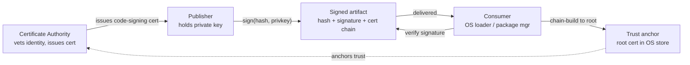
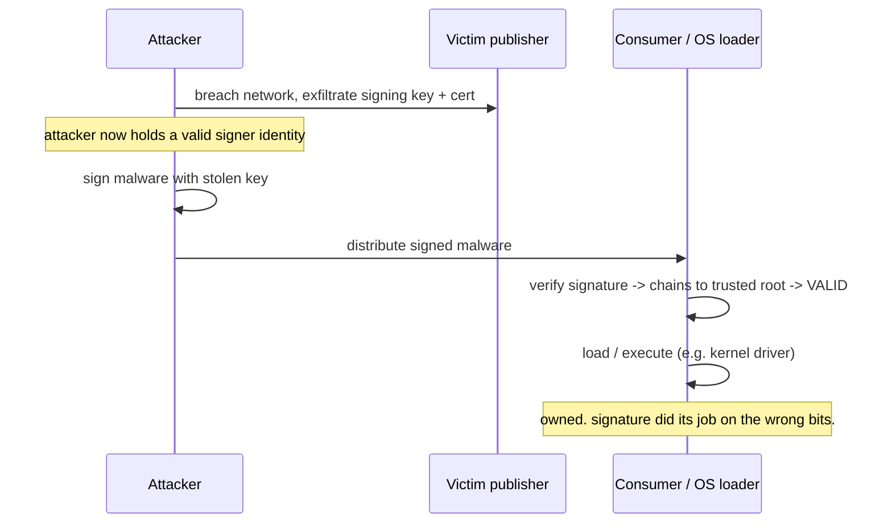
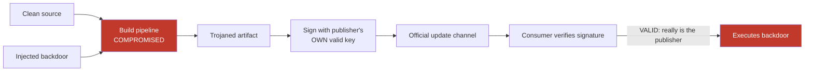
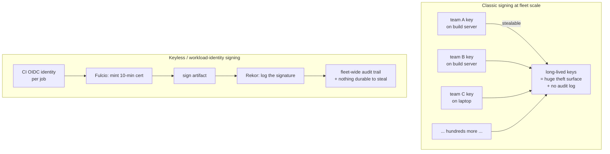
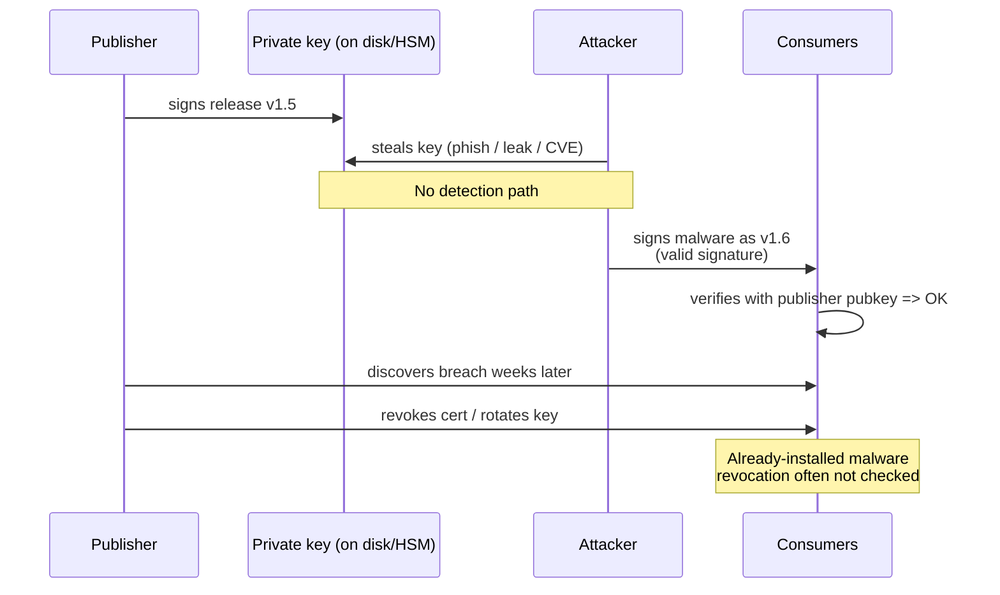
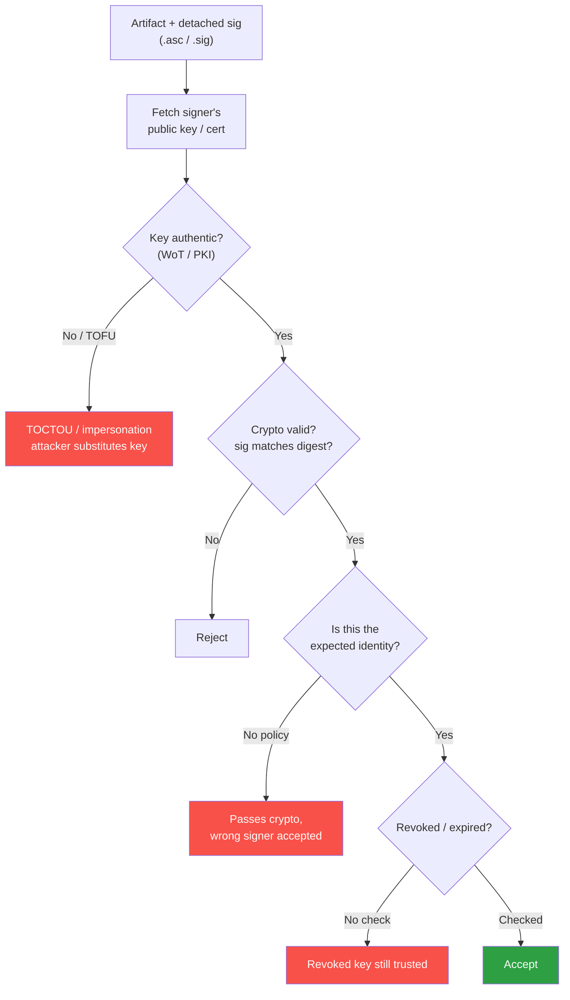
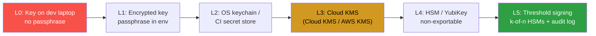

# Chapter 2 — Classic Code Signing and Its Failure Modes

*What this chapter covers.* Before Sigstore, before transparency logs, before anyone said
the words "keyless signing," the industry spent roughly three decades building code-signing
systems on the same template: a publisher holds a private key and a certificate from a
certificate authority, signs its artifacts, and consumers verify those signatures against a
set of trusted roots. Chapter 1 gave you the cryptographic primitives — signatures,
certificates, chains of trust. This chapter is about what the industry *built* with them,
and, more importantly, about why those systems failed in the field with grim regularity.

The failures are the point. Every design choice in the rest of this book — Fulcio's
short-lived certificates (Chapter 3), Rekor's append-only transparency log (Chapter 5),
in-toto's attestations (Chapter 6), TUF's key hierarchy (Chapter 7) — is a direct,
traceable response to a specific way classic signing broke. If you understand the failure
modes concretely, the modern machinery stops looking like ceremony and starts looking like
scar tissue. So we will be specific: real incidents, real mechanisms, real root causes.

Learning goals — after this chapter you should be able to:

- Describe the **classic code-signing trust model** precisely — publisher key plus CA
  certificate, sign, verify against trust anchors — and state exactly what property it does
  and does not provide.
- Explain the mechanics of the **major ecosystems**: Windows Authenticode, Apple code
  signing and notarization, Android APK Signature Schemes, Linux distro repository signing
  (apt and RPM), and the classic OSS **GPG detached-signature** pattern.
- Enumerate the **failure modes** — key theft, signed-but-malicious, CA/issuance failure,
  broken revocation, operational leakage, no transparency — and attach each to a real
  incident and a root cause.
- Articulate the **central lesson**: classic signing authenticates the *signer*, not the
  software's integrity relative to its source — which is why it did nothing to stop
  SolarWinds, CCleaner, or 3CX.
- Be **fair** about what classic signing gets right (distro repo signing is a genuine
  success) and where it is merely insufficient rather than worthless.
- Map each failure mode to the **modern mechanism** that addresses it, so the rest of Book 5
  reads as a set of answers rather than a catalogue of tools.

A note on framing. This is not a chapter about cryptography being broken. RSA and ECDSA
signatures did their job in essentially all of these incidents — the math held. The systems
failed at the *edges* of the cryptography: key custody, issuance, revocation, and the gap
between "who signed this" and "is this software what it should be." That distinction is the
spine of the whole book.

## The classic trust model

Strip away the ecosystem-specific details and every classic code-signing system is the same
three-party arrangement, inherited more or less directly from the X.509 web PKI (Chapter 1).

- A **certificate authority (CA)** vouches for identity. It performs some vetting of the
  publisher, then issues a **code-signing certificate**: an X.509 cert binding the
  publisher's public key to a name ("Contoso Ltd", "NVIDIA Corporation"), marked with an
  extended key usage of `codeSigning` (OID `1.3.6.1.5.5.7.3.3`).
- A **publisher** holds the corresponding private key. It hashes an artifact, signs the
  hash, and attaches the signature plus its certificate chain to (or alongside) the artifact.
- A **consumer** — an OS loader, a package manager, a browser download handler — verifies
  the signature and walks the certificate chain up to a **trust anchor** (a root certificate)
  it already trusts, typically shipped in the OS or a program-managed root store.



The system delivers exactly two properties, and it is worth stating them with pedantic
precision because almost every failure in this chapter comes from someone assuming a third:

1. **Integrity** — the artifact has not been modified since it was signed. Flip one bit and
   the hash changes and the signature no longer verifies.
2. **Authenticity of the signer** — the artifact was signed by the holder of a private key
   whose certificate a trusted CA issued to a named entity.

That is *all*. In particular, the model says **nothing** about:

- Whether the software is *benign*. A signature is not a virus scan.
- Whether the signed bits correspond to any particular *source code* or build. The signer
  can sign anything it can hash.
- Whether the key holder is *still* the legitimate publisher, or a thief, or a compromised
  build server acting with the publisher's authority.

Hold onto that gap between "authentic signer" and "software you should run." Everything
downstream lives in it.

## The major ecosystems

The template above got instantiated a dozen times, each with local variations that matter
in practice. We cover the ones a backend engineer actually meets.

### Windows Authenticode

Authenticode is Microsoft's PE (Portable Executable) signing scheme, dating to the
mid-1990s and still load-bearing today. It signs `.exe`, `.dll`, `.sys`, MSI installers,
and more. Mechanically, the signer computes a hash over the PE file — deliberately
*excluding* the checksum field, the certificate table pointer, and the attribute
certificate table itself, so the signature can be embedded back into the very file it
signs — wraps that hash in a `SignedData` PKCS#7 / CMS structure along with the signer's
certificate chain, and stuffs it into the PE's attribute certificate table. `signtool
sign` is the canonical tool. Verification (`signtool verify`, or the loader via
`WinVerifyTrust`) recomputes the hash over the same excluded ranges and checks the chain to
a root in the Microsoft-managed trusted root program.

Two Authenticode-specific mechanisms recur later:

- **Catalog files** (`.cat`). Rather than embedding a signature in every file, Windows lets
  you sign a *catalog* — a list of file hashes — and the OS treats any file whose hash
  appears in a trusted catalog as signed. This is how most OS components and many drivers
  are signed. It decouples the signature from the file, which is convenient and, as we will
  see with driver signing, occasionally dangerous.
- **Timestamping**. Because certificates expire, Authenticode signatures can carry an
  RFC 3161 countersignature from a trusted timestamp authority attesting *when* the signing
  happened. If a signature was timestamped while the cert was valid, it remains valid after
  the cert expires. This is a usability win and, as the NVIDIA case shows, a security
  liability.

On top of the raw signature Microsoft layered **SmartScreen reputation** and **EV
code-signing certificates**. An EV (Extended Validation) code-signing cert requires stricter
organizational vetting and mandates that the private key live on hardware (a smart card or
HSM). In exchange, EV-signed binaries accrue SmartScreen reputation faster — a fresh
standard-signed installer may still trip the "Windows protected your PC" warning, while an
EV-signed one from an established publisher sails through. Note what this does: it makes the
*reputation of the signer* a security signal layered on top of the signature, precisely
because the signature alone says nothing about benignity.

Finally, **kernel-mode driver signing**. Since 64-bit Windows Vista, kernel drivers must be
signed to load, and modern Windows (10 1607+) requires production drivers to be signed
through Microsoft's attestation/portal process, chaining to a Microsoft-controlled CA. The
kernel is the highest-value place to run code on a Windows box, which is exactly why stolen
driver-signing capability shows up repeatedly in the incident record below.

### Apple: Developer ID, Gatekeeper, notarization

Apple's model is stricter and more centralized than Windows'. Every macOS binary carries a
**code signature** structured around a *code directory* — a hash of hashes, one per page of
the executable, so the kernel can verify pages lazily as they are faulted in, plus hashes of
the bundle's resources. This is stronger than a single whole-file hash: it provides
*continuous* integrity enforcement at runtime, not just a one-time check at launch.

For software distributed outside the App Store, Apple issues **Developer ID** certificates
from Apple's own CA (there is no third-party CA market here — Apple is the only issuer).
**Gatekeeper** is the enforcement point: when you download and first launch an app, macOS
checks that it is signed by a valid Developer ID and — since macOS 10.15 Catalina — that it
has been **notarized**.

Notarization is the interesting part and a genuine partial answer to the "signature ≠
benign" problem. The developer uploads the signed app to Apple's **notary service**, which
runs automated malware and policy checks, and if the app passes, Apple issues a
**notarization ticket** — effectively Apple's own signature attesting "we scanned this
build and found nothing known-bad." The developer **staples** the ticket to the app (or
Gatekeeper fetches it online). So Gatekeeper checks *two* things: the developer's signature
(authenticity) and Apple's ticket (a scan verdict). The **hardened runtime** complements
this by opting the app into stricter runtime protections — no unsigned executable memory,
library validation, restricted entitlements — reducing the blast radius if the app is later
subverted.

Apple's stack is worth studying because it independently reinvented two ideas this book
returns to: a *centralized attestation of build safety* (notarization, a cousin of the
attestations in Chapter 6) and *revocation with teeth* (Apple can pull a notarization ticket
or revoke a Developer ID cert, and because Gatekeeper phones home this actually propagates —
contrast the revocation section below).

### Android: APK Signature Schemes v1–v4

Android's signing history is a compressed lesson in why signing *scope* matters.

- **v1 (JAR signing)** — the original scheme, inherited from Java's signed JAR format. Each
  file in the APK zip has a hash listed in `META-INF/MANIFEST.MF`, and a signature covers
  that manifest. The fatal flaw: the ZIP structure itself — file ordering, the central
  directory, unsigned metadata, and any files *not* listed in the manifest — is not
  protected. This enabled the **Master Key** class of bugs (2013) where an attacker could
  add or duplicate zip entries that verification and installation disagreed about, so a
  signed APK could be modified without breaking v1 verification.
- **v2 (APK Signature Scheme v2, Android 7.0)** — signs the *entire APK file* as a blob. The
  signature block sits in a dedicated region just before the ZIP central directory, and the
  scheme hashes everything else in the file. Whole-file integrity: no more
  entry-substitution games.
- **v3 (Android 9)** — adds **key rotation**. A v3 signing block can contain a *proof of
  rotation*: a chain where the old key signs the new key, so an app can migrate to a fresh
  signing key while proving continuity of identity. This directly addresses a real
  operational pain — before v3, an Android app's signing key was effectively immortal,
  because the platform identity of an app *is* its signing key and there was no way to change
  it without shipping a "new app."
- **v4 (Android 11)** — produces a small separate signature file designed around a Merkle
  hash tree over the APK, enabling incremental/streaming installation (`fs-verity` style)
  where the app can start running before every byte is verified.

Layered on top is **Play App Signing**, where Google — not the developer — holds the final
*app signing key* in Google's infrastructure, and the developer holds only an *upload key*.
The developer signs uploads with the upload key; Google re-signs with the app signing key
before distribution. This is a pragmatic response to the fact that developers kept losing
their signing keys (an unrecoverable catastrophe under the "key is the app's identity"
model) — so custody moved to a party better at holding keys. Keep this move in mind: it is
the same instinct that produces enterprise KMS (Chapter 9) and, taken to its logical end,
keyless signing (Chapter 4).

### Linux distributions: repository signing (apt and RPM)

The Linux distro model is different in a way that turns out to be its great strength: it
does **not** primarily ask individual upstream authors to sign their software. Instead the
*distribution* signs, and it signs the **repository metadata**, with package integrity
chained off that metadata.

For Debian/Ubuntu **apt**:

- A repository publishes a `Release` file listing every index (`Packages`, `Sources`) with
  its size and SHA-256 hash.
- The `Release` file is signed by a distro key. The signature is either detached
  (`Release.gpg`) or inlined (`InRelease`, a cleartext-signed `Release`).
- Each `Packages` index in turn lists every `.deb` with its SHA-256 hash.

So the trust chain is: apt trusts a keyring of distro keys → verifies the signature on
`InRelease` → trusts the hashes in `Release` → verifies `Packages` matches → trusts the
hashes in `Packages` → verifies each downloaded `.deb`. One signature transitively protects
the entire repository, including which *versions* are current. That last point matters:
because the signed `Release` is the authoritative statement of "current," an attacker cannot
silently feed you a stale, vulnerable package version without breaking the signature — this
defends against freeze/rollback attacks, a property TUF (Chapter 7) generalizes and
formalizes.

For Red Hat / Fedora **RPM + yum/dnf**: individual RPMs can carry a GPG signature over the
package header and payload (`rpm --checksig`), and repository metadata (`repomd.xml`) is
signed similarly. The keyring is managed via `rpm --import` of distro-published keys, often
pinned in the base install.

The distro model works because the trust relationships are few and stable: a handful of
long-lived, carefully guarded distro master keys, a curated maintainer keyring, and metadata
signing that covers the *whole* view of the repository rather than isolated artifacts. When
we discuss what classic signing gets right, this is Exhibit A.

### The OSS pattern: GPG detached signatures and the web of trust

The classic open-source release ritual: publish a release tarball
`foo-1.2.3.tar.gz`, publish a **detached signature** `foo-1.2.3.tar.gz.asc`, and publish
(somewhere) the maintainer's PGP public key. The consumer runs:

```bash
gpg --verify foo-1.2.3.tar.gz.asc foo-1.2.3.tar.gz
```

and is supposed to check that the signing key is the maintainer's genuine key. That last
clause is where it falls apart. How do you know the key is genuine? PGP's answer was the
**web of trust**: users sign each other's keys at key-signing parties, and you compute a
trust path from your keys to the maintainer's through mutual signatures. In theory,
decentralized, no CA required.

In practice the web of trust largely failed, for reasons worth naming because they recur:

- **Usability.** Key management, trust levels, keyservers, and signature verification defeated
  even sophisticated users. Almost nobody actually computes trust paths; they run
  `gpg --verify`, see "Good signature," and ignore the accompanying `WARNING: This key is
  not certified with a trusted signature.`
- **No useful revocation or discovery.** Keyservers were unauthenticated, spammable (the 2019
  certificate-flooding attacks broke key imports for targeted keys), and never had a coherent
  story for "is this the current key for this project?"
- **TOFU in disguise.** What people actually do is trust-on-first-use: grab whatever key the
  project's website links, and hope the website wasn't compromised. This collapses the whole
  edifice back to "trust the distribution channel," which the signature was supposed to
  remove from the trusted base.

The web of trust's failure is instructive precisely because Sigstore's keyless model
(Chapter 4) is, in a sense, the anti-WoT: instead of asking humans to manage and cross-sign
long-lived keys, it binds signatures to *machine-verifiable identities* (an OIDC token from
an IdP, a workload identity) and records them in a public log so trust does not depend on
anyone remembering to sign anyone else's key.

### The rest, briefly

**Java JAR signing** (`jarsigner`) is essentially the v1 Android scheme's ancestor:
per-entry hashes in the manifest, a signature over the manifest, the same ZIP-structure
weaknesses, plus a historically weak default of SHA-1. **NuGet** package signing supports
author and repository signatures (X.509, similar to Authenticode's CMS structures).
**Maven Central** requires GPG-signed artifacts. None of these change the fundamental model;
they are the same template with different file formats.

Here is the landscape in one table.

| System | What it signs | Trust anchor | Key strength | Notable weakness |
|---|---|---|---|---|
| Authenticode | PE files, MSI, catalogs, drivers | Microsoft root program CAs | Broad tooling, timestamping, EV+SmartScreen reputation | Signer ≠ benign; stolen certs sign malware; slow revocation |
| Apple Developer ID + notarization | macOS apps/binaries (page-hash code directory) | Apple's single CA | Notarization adds a malware scan; effective revocation; hardened runtime | Centralized in one vendor; scan is best-effort |
| Android APK v2/v3/v4 | Whole APK (v2+), key rotation (v3) | App's own signing key (Play App Signing: Google's) | Whole-file integrity, rotation, streaming verify | Key = app identity; v1 legacy weaknesses |
| apt / RPM repo signing | Repo metadata → package hashes | Distro keyring | Few stable keys; covers whole-repo view; anti-rollback | Trusts distro infra; upstream compromise still passes |
| GPG detached sigs (OSS) | Release tarballs | Web of trust / TOFU | Simple, decentralized in principle | WoT unusable; key discovery/revocation broken |

## The failure modes

Now the heart of the chapter. There are six recurring ways classic signing fails. They are
not exotic; they are the same handful of problems, over and over, for thirty years.

### Failure mode 1: key theft and compromise

The private key is the entire system. Steal it and you *are* the publisher, cryptographically
indistinguishable from the real one. Book 4, Chapter 6 called signing keys the crown jewels
of the build fleet; here is what happens when the jewels walk.

**Stuxnet (2010)** is the canonical case. The worm's kernel-mode drivers were signed with
**legitimate code-signing certificates stolen from two Taiwanese hardware companies, Realtek
Semiconductor and JMicron Technology**, whose offices were physically near each other. On
64-bit Windows, unsigned kernel drivers will not load — so the attackers needed a valid
driver signature, and rather than break the cryptography they stole keys that produced valid
signatures. The signature verified perfectly. The trust model performed *exactly as
designed* and delivered a rootkit into the kernel, because the model's job is to confirm the
signer, and the (stolen) key was, cryptographically, the signer.

**NVIDIA (2022)** shows a nastier variant. In the LAPSUS$ breach, attackers exfiltrated and
leaked internal data including **two code-signing certificates**. Even though the certs were
*expired*, malware signed with them still loaded as kernel drivers on Windows, because
Windows will honor a driver signature if it was (or appears to have been) timestamped during
the certificate's validity window — expiry does not automatically invalidate an
already-timestamped driver signature. Security researchers observed a variety of malware
(Cobalt Strike beacons, Mimikatz, backdoors) freshly signed with the leaked NVIDIA certs in
the weeks after the leak. The community's stopgap was to build Windows Defender Application
Control (WDAC) policies explicitly *blocklisting* those specific certificates by hash — a
manual, reactive countermeasure that only helps hosts that receive and enforce the policy.

Around these headline cases sits a steady, unglamorous **market in stolen and fraudulently
obtained code-signing certificates**. Underground vendors have sold valid (sometimes EV)
code-signing certs for years, because a signature dramatically improves malware's odds of
running and evading detection. The certificate is not a nuisance to the attacker; it is
*loot*.

The common root cause: **a long-lived, high-value secret exists and can be exfiltrated.**
The certificate might be valid for one to three years, it sits somewhere (a developer laptop,
a build server, occasionally an HSM), and for its entire lifetime it is a single point of
catastrophic failure. This is the observation that drives Fulcio's design (Chapter 3): issue
a certificate that lives for *ten minutes*, so there is essentially no long-lived key to
steal.



### Failure mode 2: signed-but-malicious (the central lesson)

Key theft at least involves a stolen key. The deeper problem needs no theft at all: **a
legitimate publisher, using its own genuine key, signs malware — because the publisher's
build or release process was compromised.** The signature is *authentic*. It verifies against
the real cert issued to the real company. And it is worthless as a safety signal, because
what got signed was poison.

**SolarWinds (2020)** is the defining example, dissected at length in Book 1, Chapter 3. The
SUNSPOT implant lived *inside SolarWinds' own build pipeline* and injected the SUNBURST
backdoor into the Orion product **during compilation**, before signing. SolarWinds then
signed the trojaned Orion DLL with **its own legitimate, valid code-signing certificate**,
and pushed it through its normal update channel to ~18,000 customers. Every signature was
genuine. Every verification passed. Code signing contributed *exactly nothing* to stopping
this, because signing happens *after* the build, and the build was the thing that was owned.
The signature faithfully attested "SolarWinds made this" — which was *true*, and useless.

**CCleaner (2017)** is the same shape. Attackers compromised Avast/Piriform's build
environment and inserted a backdoor into CCleaner, which was then **signed with the valid
CCleaner/Piriform certificate** and distributed to millions of users through the official
download. Validly signed the whole way. **3CX (2023)** repeats it again: a compromised
build produced a trojanized 3CXDesktopApp — itself the downstream result of an *earlier*
software-supply-chain compromise (a poisoned dependency, X_TRADER) — and the malicious build
was **signed with 3CX's legitimate certificate**. Three incidents, years apart, identical
lesson.



State the lesson as bluntly as possible, because it is the thesis of the entire book:

> **Classic code signing verifies the signer, not the software's integrity relative to its
> source.** It answers "did this named entity sign these bits?" It cannot answer "were these
> bits built from the source we reviewed, by a pipeline we trust, without tampering?" When the
> build is compromised, the signer is compromised, and the signature is a rubber stamp on
> whatever the attacker produced.

This is *the* gap that provenance and attestation (Book 4, Chapter 3; Book 5, Chapter 6)
exist to close. A SLSA provenance attestation says "this artifact was built from *this*
source commit by *this* builder using *this* command" — a claim that, unlike a bare
signature, would have been *false* for the trojaned SolarWinds DLL had the attacker not also
controlled the builder, and that hermetic/reproducible builds (Book 4, Chapter 2) let a
third party independently check.

### Failure mode 3: CA and issuance failures

The model assumes the CA only issues code-signing certs to the legitimate entity named in
them. That assumption has broken in several ways:

- **Fraudulent issuance.** Attackers register shell companies or impersonate real ones to
  obtain code-signing certificates through legitimate CA channels. Vetting for standard
  (non-EV) code-signing certs has historically been weak — sometimes little more than a
  domain and a payment — so a determined attacker can simply *buy* a valid signing identity
  under a plausible name.
- **CA compromise.** The web-PKI history (DigiNotar 2011, Comodo 2011) shows CAs themselves
  get breached and mis-issue certificates. A compromised code-signing CA can mint certs that
  chain cleanly to a trusted root.
- **Cross-purpose and constraint gaps.** Misconfigured intermediates, missing name
  constraints, or improperly scoped EKUs occasionally let certificates be used for signing
  contexts their issuer never intended.

The root cause is that **identity vetting is done once, by a party the consumer never
interacts with, and the consumer has no way to see what that party issued.** Which leads
directly to the transparency argument (below and Chapter 5): Certificate Transparency for
the web PKI exists precisely because CAs mis-issue and nobody could previously *detect* it.
Fulcio applies the same medicine to code signing — every issued certificate is logged.

### Failure mode 4: revocation does not work

Suppose you *detect* the misuse — a stolen key, a mis-issued cert, a compromised publisher.
Now revoke it. In classic signing, revocation is where hope goes to die, for reasons
Chapter 1 covered in the abstract and which bite hard here:

- **CRLs and OCSP are slow, incomplete, and often soft-fail.** Certificate Revocation Lists
  grow large and are fetched lazily; OCSP requires an online check the verifier frequently
  *skips* when the responder is unreachable (soft-fail), so an attacker who can block the
  OCSP request defeats revocation entirely. Many code-signing verification paths don't do a
  live revocation check at all.
- **Already-distributed artifacts.** Revoking a certificate does nothing to the millions of
  copies of the malware already installed. Revocation is a statement about *future*
  chain-building, not a recall of executed code. SolarWinds' cert was eventually revoked —
  long after the backdoor had been resident in target networks for months.
- **Expiry-honoring and stapling gaps.** As NVIDIA showed, a signature timestamped during
  validity survives cert expiry, so "just let it expire" is not revocation. And timestamped
  signatures may be honored even after revocation depending on how the verifier treats the
  timestamp — the semantics of "was this revoked *before or after* it was signed" are subtle
  and inconsistently implemented.
- **Distribution of revocation state is itself a distributed-systems problem.** Every
  verifier in the world needs the updated revocation info, promptly, or the revocation is
  theoretical. Apple's Gatekeeper can do this reasonably (it phones home); a Windows offline
  driver-verification path or an air-gapped host cannot.

The uncomfortable truth: **classic revocation assumes you can retract trust faster than the
attacker can exploit it, and you usually cannot.** This is why modern designs lean on
*short-lived* credentials (nothing to revoke — it already expired) and *transparency*
(detect misuse fast so containment can begin), rather than betting on revocation propagating
in time.

### Failure mode 5: operational failures

Even with honest CAs, safe algorithms, and working revocation, classic signing tends to fail
operationally because of how organizations actually run it:

- **Keys on developer laptops and build servers.** The most common real-world custody model
  is the worst one: a `.pfx` or `.p12` file (or a key in the CI secret store) that any build
  needs to reach in order to sign. Every machine that can sign is a machine from which the key
  can be stolen (failure mode 1). At fleet scale this is a target-rich disaster — more on this
  below.
- **No transparency.** This is the quiet killer. In classic signing, **nobody can enumerate
  what a key has signed.** A stolen key signs malware *in secret*; the legitimate owner has no
  log to consult, no way to notice "my key signed 4,000 things last night and I only signed
  40." Misuse is invisible until a victim reports it. Compare the web PKI before Certificate
  Transparency: mis-issuance was undetectable until someone stumbled on a rogue cert. CT fixed
  that for TLS; nothing equivalent existed for code signing until Rekor (Chapter 5).
- **Expiry management pain.** Certs expire on their own schedule, unrelated to release
  schedules. Teams get paged because a signing cert lapsed and the release pipeline is
  wedged, which pressures them toward long validity periods and lax renewal hygiene — the
  opposite of what security wants.
- **Weak algorithms living too long.** Authenticode and JAR signing shipped SHA-1 defaults
  well past SHA-1's cryptographic sunset. SHA-1 collisions (SHAttered, 2017) mean a
  determined adversary could in principle produce two files with the same hash, one benign
  and signed, one malicious. Migrating a whole ecosystem off a weak algorithm is slow because
  old verifiers must keep accepting old signatures.

### Failure mode 6: trust-store bloat and root governance

The consumer's trust anchors are a list of root certificates, and that list is a liability of
its own. Root programs (Microsoft's, Apple's, Mozilla's) each trust dozens to hundreds of
CAs, any one of which can issue a certificate the whole ecosystem will honor. The trust store
is an **OR** of every CA in it: your security is that of the *weakest* trusted CA, not the
strongest. Root programs are the governance layer trying to keep that OR from including
something rotten — auditing CAs, enforcing baseline requirements, ejecting misbehaving ones
(as browsers have done). It is real, valuable work, but it means the *ground* of the whole
system is a large, slowly-changing, human-governed list that any consumer implicitly trusts
in full.

Here is the failure landscape mapped to incidents, root causes, and the modern fix — the
table to remember from this chapter.

| Failure mode | Example | Mechanism / root cause | Modern approach that addresses it |
|---|---|---|---|
| Key theft | Stuxnet (2010), NVIDIA leak (2022) | Long-lived private key exfiltrated; valid signatures on malware | Short-lived / keyless certs (Ch 3–4) — no durable key to steal |
| Signed-but-malicious | SolarWinds (2020), CCleaner (2017), 3CX (2023) | Build/publisher compromised; signature authentic but on poisoned bits | Provenance + attestations + reproducible builds (Bk4 Ch2–3; Ch6) |
| CA / issuance failure | Fraudulent cert purchases; DigiNotar-class CA breaches | Weak or subverted identity vetting; consumer can't see issuance | Certificate Transparency model; Fulcio logs every cert (Ch 3, Ch 5) |
| Broken revocation | SolarWinds cert revoked months late; OCSP soft-fail | CRL/OCSP slow, skippable; already-installed code unaffected | Short-lived creds (nothing to revoke) + transparency for fast detect |
| No transparency | Stolen keys signing in secret; no CT-for-code | No public record of what was signed | Rekor append-only transparency log (Ch 5) |
| Operational (keys on hosts, SHA-1, expiry) | SHAttered (2017); build-server key sprawl | Bad custody, weak algs, expiry friction | Keyless (Ch 4), KMS/HSM custody (Ch 9), OIDC workload identity |
| Trust-store bloat | Root-program-wide mis-issuance risk | Trust = OR of every root CA | Scoped trust roots, policy-controlled verification (Ch 8, Ch 10) |

## What classic signing gets right

It would be dishonest, and bad engineering, to conclude that classic signing is worthless.
It is not. It is *insufficient alone*, which is a different and more useful claim.

When keys are genuinely safe, classic signing delivers real integrity and real signer
authenticity, and that is worth having. If SolarWinds had *not* signed Orion, an attacker who
merely tampered with the download in transit — without compromising the build — would have
succeeded trivially; the signature closed that (lesser) attack path. Signing raises the bar
from "modify the bytes anywhere in the distribution channel" to "compromise the signer or
steal the key." That is a meaningful bar. Most of the incidents in this chapter are notable
precisely *because* clearing that bar required a serious operation (a kernel-level build
implant, a nation-state cert theft) rather than a trivial man-in-the-middle.

And **distro repository signing is a genuine, durable success.** Billions of `apt` and
`dnf`/`yum` transactions run every day, protected by a small number of well-guarded keys, and
key-theft incidents against major distro signing infrastructure are strikingly rare relative
to the volume. Why does the distro model work where the OSS-tarball-plus-GPG model failed?

- **Few keys, professionally held.** A distribution has a handful of signing keys guarded by
  people whose job is guarding them — not thousands of individual maintainers each with a key
  on a laptop.
- **Signs the *metadata view*, not just artifacts.** Signing the `Release`/`repomd` file
  covers *which versions are current*, giving anti-rollback/anti-freeze protection for free.
  That is a property bare artifact signatures lack, and one TUF (Chapter 7) elevates to a
  first-class design goal.
- **A curated, bounded trust base.** The keyring is a small, known set, shipped with the OS
  and updated through the same signed channel — not a sprawling web of trust or a TOFU grab
  from a website.

The distro model is, in effect, a working template for *internal* package signing: a small
number of well-guarded organizational keys signing repository metadata that covers your whole
internal artifact view. When we get to enterprise key management (Chapter 9) and deployment
gates (Chapter 10), "be more like a distro, less like a pile of developer `.pfx` files" is a
recurring piece of advice.

## The distributed-systems lens

Everything above gets *worse* at fleet scale, and the way it gets worse is the reason large
organizations abandoned classic signing's custody model.

**The key-management burden is untenable at scale.** A serious backend organization ships
thousands of artifacts — container images, binaries, packages, Helm charts, Lambda bundles —
produced by hundreds of pipelines across dozens of teams. The classic model asks: *who holds
the signing key, and on what machine?* There is no good answer. Give every team its own
long-lived key and you have hundreds of crown jewels scattered across the org, each a failure
mode 1 waiting to happen. Centralize on one key and you create a bottleneck and a single
catastrophic target, and you lose the ability to attribute *which team* signed *what*. Neither
scales.

**Long-lived keys distributed across a build fleet multiply theft risk linearly with fleet
size.** Book 4, Chapter 6 made the point: every build server that can sign is a machine from
which a signing key can be stolen. A thousand build agents with access to a signing key is a
thousand-way attack surface for the single most valuable secret you own. And because CI is,
by design, a place that runs semi-trusted code (pipeline poisoning, Book 4, Chapter 7), it is
*exactly* the wrong place to store a durable signing key — yet under classic signing it is
exactly where the key must live to be usable.

**No transparency means you cannot audit signing across the fleet.** With hundreds of
pipelines signing continuously, "did any of our keys sign something they shouldn't have?" is a
question classic signing cannot answer at all. There is no log. A compromised pipeline can
sign a malicious image and you will find out when a customer does. At fleet scale, the
inability to *observe* signing is itself a critical control gap — you cannot detect what you
cannot see.

These three pressures — custody, distributed theft surface, and unobservability — are exactly
why organizations move to **keyless / workload-identity signing** (Chapters 3–4) and
**centralized KMS/HSM** custody (Chapter 9):

- Keyless signing replaces the durable per-team key with an *ephemeral* certificate minted
  on demand against a *workload identity* (the CI job's OIDC token). The build server never
  holds a long-lived key because there is no long-lived key — the certificate expires in
  minutes. The thousand-way theft surface collapses: there is nothing durable on any agent to
  steal.
- Workload identity attributes signing to *which pipeline, from which repo, at which commit*
  produced the artifact — restoring the attribution that a single shared org key would have
  destroyed, and doing it automatically.
- A transparency log (Rekor) gives you the fleet-wide audit trail classic signing never had:
  every signature is a public, append-only record, so "what did our identities sign?" becomes
  a query, and anomaly detection becomes possible.
- Where durable keys genuinely must exist (a root of trust, an offline signing ceremony),
  they live in an HSM/KMS under hardware custody and tight access policy (Chapter 9), not in
  a CI secret store — the distro model, applied internally.



The through-line: classic signing's model of "durable secret, held by the publisher, verified
against a root" was designed for a world of a few publishers shipping a few products on
release cycles measured in months. It does not survive contact with a continuous-delivery
fleet of thousands of artifacts and hundreds of pipelines. The rest of Book 5 is what
survives contact — and each piece of it is a named answer to a named failure from this
chapter.

### Long-lived key compromise timeline



### Classic verification and where it fails



### Hardware protection maturity model



## Key takeaways

- **The classic model provides exactly two things: integrity and signer authenticity.** It
  provably does *not* establish that software is benign, or that it was built from any
  particular source by any particular pipeline. Assuming a third property is the root of most
  code-signing disasters.
- **Key theft turns the model against you.** Stuxnet (2010, stolen Realtek/JMicron certs) and
  the NVIDIA leak (2022, leaked certs still loading kernel drivers post-expiry via
  timestamping) show that a valid signature on malware is not a cryptographic failure — it is
  the system doing its job on the wrong bits. Long-lived keys are the liability.
- **Signed-but-malicious is the central lesson.** SolarWinds (2020), CCleaner (2017), and 3CX
  (2023) were all *validly signed with the real publisher's key*, because the build/publisher
  was compromised. Signing did nothing, because signing authenticates the signer, not the
  software's integrity relative to source. This is what provenance and attestation exist to
  fix.
- **Revocation is not a safety net you can rely on.** CRL/OCSP are slow and soft-fail,
  already-installed code is unaffected, and timestamped signatures survive expiry. By the time
  a cert is revoked, the damage is usually done — which is why the industry moved to
  short-lived credentials and transparency instead of betting on revocation.
- **The quiet killer is the lack of transparency.** In classic signing nobody can enumerate
  what a key has signed, so misuse is invisible until a victim notices. Certificate
  Transparency proved the fix for the web PKI; Rekor brings it to code signing (Chapter 5).
- **Classic signing is insufficient, not worthless.** It genuinely closes the tamper-in-transit
  path, and **distro repository signing (apt/RPM) is a real success** — few well-guarded keys,
  metadata signing with anti-rollback, a bounded trust base. That model is the template for
  internal package signing.
- **At fleet scale the custody model collapses.** Thousands of artifacts and hundreds of
  pipelines make "who holds the key, on what machine?" unanswerable; long-lived keys on build
  agents multiply theft risk; no log means no audit. This is precisely why organizations move
  to keyless/workload-identity signing (Chapters 3–4) and centralized KMS (Chapter 9).

## Further reading

- Microsoft, "Windows Authenticode Portable Executable Signature Format" (specification) and
  the Microsoft Trusted Root Program documentation.
- Apple, "Notarizing macOS software before distribution" and "Code Signing Guide" (Apple
  Developer documentation).
- Android Open Source Project, "APK Signature Scheme v2 / v3 / v4" and "Application Signing"
  documentation.
- Debian, "SecureApt" wiki; and the `apt-secure(8)` and `Release` file format documentation.
- Fedora / RPM, "RPM package signing" and `createrepo`/`repomd` documentation.
- Falliere, Murchu, Chien (Symantec), "W32.Stuxnet Dossier" (2011) — the stolen Realtek and
  JMicron certificate details.
- NVIDIA LAPSUS$ incident (2022): security-vendor analyses of the leaked code-signing
  certificates and the WDAC blocklist mitigation guidance from Microsoft.
- CISA and FireEye/Mandiant reporting on SolarWinds / SUNBURST / SUNSPOT (2020–2021); and
  Book 1, Chapter 3 of this suite.
- Talos (Cisco), "CCleanup: A Vast Number of Machines at Risk" (2017); Mandiant reporting on
  the 3CX supply-chain compromise (2023).
- Stevens et al., "The first collision for full SHA-1" (SHAttered, 2017).
- Certificate Transparency (RFC 9162) — the transparency model this book applies to code
  signing (see Book 5, Chapter 5).
- Forward references in this suite: Book 5, Chapter 3 — Sigstore Architecture; Chapter 4 —
  Keyless Signing and Workload Identity; Chapter 5 — Transparency Logs; Chapter 6 — in-toto;
  Chapter 7 — TUF; Chapter 9 — Key Management and PKI for the Enterprise; Book 4, Chapter 2 —
  Hermetic and Reproducible Builds; Chapter 3 — SLSA Provenance; Chapter 6 — Secrets in CI/CD.
