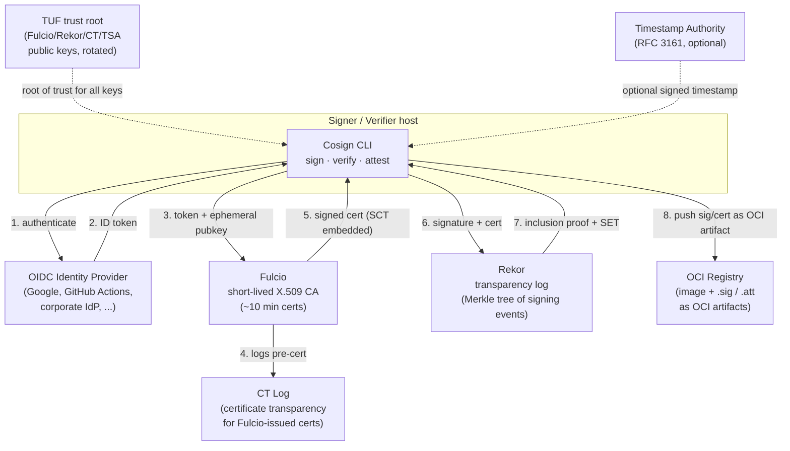
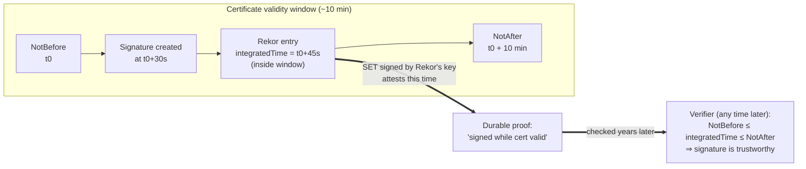
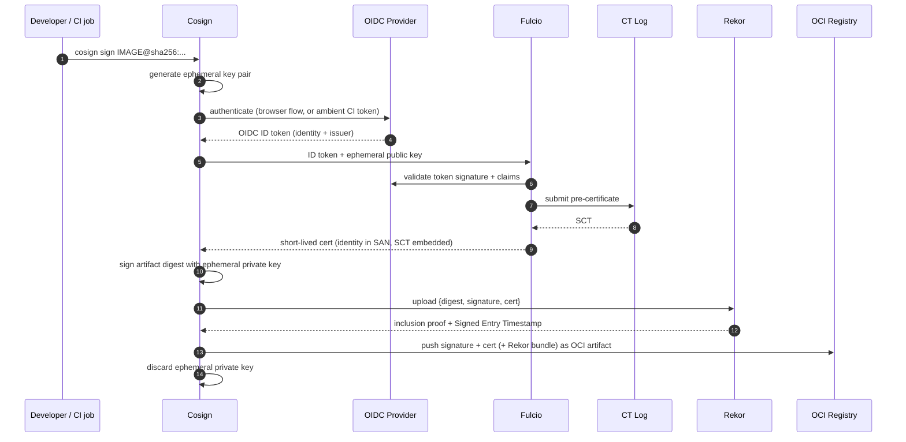

# Chapter 3 — Sigstore Architecture: Cosign, Fulcio, Rekor

*What this chapter covers.* Chapter 2 dissected classic code signing and found it broken in
predictable ways: the trust anchor is a **long-lived private key**, and that key is a single
point of failure that gets stolen (Stuxnet's driver certs, the NVIDIA leak), mismanaged, or
misused silently — nobody outside the signer can see what it signed. This chapter is about the
system that reorganizes signing to eliminate that failure class: **Sigstore** (as of early 2026; public-good instance at https://docs.sigstore.dev/ and https://fulcio.sigstore.dev / https://rekor.sigstore.dev), and its three
core components — **Cosign** (the client), **Fulcio** (a certificate authority that issues
certificates lasting *minutes*, not years), and **Rekor** (an append-only transparency log).
The central idea is **keyless signing**: instead of a durable key that you protect forever, you
authenticate an **OIDC identity**, receive a certificate that binds that identity to a
throwaway key, sign, and let the key evaporate. Transparency and short-lived certificates
together let a verifier check that signature *long after the certificate expired* — without
anyone holding a long-lived key. We take the architecture apart component by component, walk the
end-to-end **sign** and **verify** flows as sequence diagrams, and make explicit which of
Chapter 2's failures each design choice defeats — and which it does not. Keyless signing's
identity mechanics go deeper in Chapter 4; the Merkle-tree internals of the transparency log are
Chapter 5's subject; here we build the whole-system picture.

Learning goals — after this chapter you should be able to:

- State what **Sigstore** is and is not: an **OpenSSF / Linux Foundation** project (launched
  ~2021) providing free, easy signing whose core innovation is **keyless signing** tied to an
  **OIDC identity plus a transparency log** — not a new cryptographic algorithm.
- Describe the role of each component precisely: **Cosign** signs and verifies artifacts and
  stores signatures in the OCI registry; **Fulcio** issues **short-lived (~10-minute) X.509
  code-signing certificates** binding an OIDC identity to an ephemeral key; **Rekor** is the
  **tamper-evident transparency log** of signing events.
- Explain the **verify-after-expiry** mechanism — how a short-lived certificate plus a signed
  log timestamp lets a verifier trust a signature made by a certificate that expired minutes
  after it was issued, with **no long-lived key anywhere**.
- Walk the **keyless sign** and **keyless verify** flows end to end, and articulate the key
  mental shift: you verify an **identity** (who/what signed, against policy), not a pre-shared
  public key.
- Distinguish Sigstore's **two logs** — the **CT log** (for the certificates Fulcio issues) and
  **Rekor** (for the artifact-signing events) — which are routinely confused.
- Map each of Chapter 2's failure modes to the specific Sigstore mechanism that addresses it,
  and state honestly the one it does *not* fix: **signed still does not mean safe**.
- Explain how the design fits distributed CI: workload identity as signer, self-hosted Sigstore
  for enterprises, and the transparency log as a fleet-wide signing audit.

## What Sigstore is

**Sigstore** is a set of free, publicly operated services and open-source clients for signing,
verifying, and *logging* software signatures. It began in **2021** as a collaboration led by
engineers from **Google**, **Red Hat**, **Chainguard**, and Purdue University, and is now an
**Open Source Security Foundation (OpenSSF)** project under the **Linux Foundation**, with
contributors across the ecosystem. Its stated goal is disarmingly simple: make signing software
as easy as `cosign sign`, so that signing becomes the default rather than a specialist chore —
and in doing so, make **software provenance verifiable at scale**.

The important thing to understand up front is that Sigstore did **not** invent new cryptography.
It signs with the same primitives Chapter 1 covered — ECDSA over P-256, Ed25519, SHA-256, X.509
certificates, Merkle trees. What Sigstore reorganizes is the **trust model** around those
primitives. Classic signing (Chapter 2) makes a **long-lived private key** the durable root of
trust: the key *is* the identity, it must be protected for years, and its compromise is
catastrophic and often silent. Sigstore replaces the durable key with a durable **identity** —
an OIDC subject like an email address or, more importantly for CI, a **workload identity** — and
reduces the private key to a **momentary** object that exists only for the seconds it takes to
sign and is then discarded. The thing you protect forever is no longer a secret; it is an
identity provider's account and a public log.

Two properties make that substitution work, and they are the twin pillars of the whole system:

- **Keyless signing.** A signer proves an OIDC identity to a certificate authority (**Fulcio**),
  which issues an **X.509 certificate valid for roughly ten minutes** that binds that identity
  to a freshly generated key pair. The signer signs, uploads the signature and certificate to a
  log, and throws the private key away. There is no long-lived key to steal, leak, rotate, or
  escrow. (Sigstore also supports traditional keys and KMS-backed keys — `cosign sign --key` —
  but keyless is the design's whole point and the default in Cosign v2.)
- **Transparency.** Every signing event is recorded in **Rekor**, an append-only, cryptographically
  tamper-evident public log. Because signatures are logged, misuse becomes **detectable**: an
  identity owner (or an automated monitor) can see every artifact ever signed under an identity —
  something classic signing, where a stolen key signs malware in silence, structurally cannot
  offer.

### The public-good instance versus private Sigstore

There are two ways to consume Sigstore, and the distinction matters at fleet scale.

The **public-good instance** is the community-operated deployment: `fulcio.sigstore.dev`,
`rekor.sigstore.dev`, a Certificate Transparency log, a timestamp authority, and a TUF-served
trust root, run by the OpenSSF/Linux Foundation and reached GA in 2022 (state described as of early 2026 — check https://docs.sigstore.dev/ for current provider/endpoint updates). It is free, accepts a
fixed set of public OIDC providers (Google, GitHub, Microsoft, GitLab, and CI token issuers),
and is what `cosign sign` uses out of the box. It is superb for open source: zero setup, publicly
auditable, and every signature contributes to a public transparency record.

**Private / self-hosted Sigstore** is the same software (Fulcio, Rekor, the CT log, a TSA, and a
TUF root) deployed inside an organization — typically via the `sigstore/scaffolding` Helm charts
on Kubernetes, wired to the enterprise's own OIDC provider. Enterprises run their own for three
reasons: to avoid a hard runtime dependency on a public service on the artifact-verification
critical path; to keep signing events (which reveal what you build and when) **internal** rather
than in a public log; and to bind Fulcio to their **internal** identity provider so that
certificates carry corporate workload identities. Chapter 9 develops the operational and PKI
consequences of running private Sigstore; for now, hold the fact that every architectural
component below is **self-hostable**, and the public instance is one deployment of it, not the
system itself.

## The components



Read the numbers as the signing path; the dashed edges are the trust infrastructure that makes
the numbered steps verifiable. We now take each box apart.

### Cosign — the client

**Cosign** is the CLI (and Go library) that engineers and CI actually invoke. It is the
orchestrator: it drives the OIDC flow, talks to Fulcio and Rekor, computes digests, produces the
signature, and — critically for the container world — **stores the signature in the OCI registry
right next to the image**. Cosign signs three kinds of things: **container images** (by digest),
**arbitrary blobs** (`cosign sign-blob`), and **attestations** (in-toto statements wrapped in a
DSSE envelope — SBOMs, SLSA provenance, VEX; see Book 5, Chapter 6 and Book 4, Chapter 3).

The essential Cosign verbs:

```bash
# Keyless sign a container image (by digest — always sign digests, never tags).
# In Cosign v2 keyless is the default; this triggers an OIDC flow.
cosign sign ghcr.io/acme/api@sha256:9b2a...c1

# Keyless verify — the identity flags are REQUIRED in v2 for keyless verification.
cosign verify \
  --certificate-identity "https://github.com/acme/api/.github/workflows/release.yml@refs/heads/main" \
  --certificate-oidc-issuer "https://token.actions.githubusercontent.com" \
  ghcr.io/acme/api@sha256:9b2a...c1

# Attach an attestation (e.g. an SBOM) as a signed in-toto statement.
cosign attest --type cyclonedx --predicate sbom.cdx.json \
  ghcr.io/acme/api@sha256:9b2a...c1

# Verify an attestation of a given predicate type against an identity.
cosign verify-attestation --type cyclonedx \
  --certificate-identity-regexp "^https://github.com/acme/.+" \
  --certificate-oidc-issuer "https://token.actions.githubusercontent.com" \
  ghcr.io/acme/api@sha256:9b2a...c1
```

Two syntactic points matter. First, **you sign the digest, not the tag.** A tag is a mutable
pointer; a `sha256:` digest is the content. Cosign resolves and signs the digest so the signature
binds to immutable bytes. Second, in **Cosign v2** (released 2023) keyless verification *requires*
`--certificate-identity` (or `--certificate-identity-regexp`) and `--certificate-oidc-issuer`.
This is deliberate and is the single most important usability decision in the tool: **there is no
"just verify it's signed."** You must state *whose* signature you expect. Verification is a
policy statement about identity, and the CLI refuses to let you skip it. (Cosign v1 hid keyless
behind `COSIGN_EXPERIMENTAL=1`; if you see that in old docs, it is obsolete.)

#### How Cosign stores signatures in the OCI registry

Cosign's cleverest piece of plumbing is that it needs **no separate signature database**. The OCI
registry you already run *is* the signature store. There are two schemes, and both matter in
practice.

The original scheme is a **tag convention**. For an image with digest `sha256:9b2a...c1`, Cosign
computes a derived tag `sha256-9b2a...c1.sig` and pushes, under that tag, a small OCI image whose
layer(s) carry the signature and certificate as **annotations** — `dev.cosignproject.cosign/signature`
holds the base64 signature, and the associated certificate and Rekor bundle ride alongside. An
attestation lands under `sha256-9b2a...c1.att`. This is a pure naming trick: replace the digest's
`:` with `-`, append `.sig`, and any OCI 1.0 registry stores it with no special support. Its
weakness is that the signature is not *cryptographically* linked to the image in the registry's
own data model — it is linked only by the tag string.

The modern scheme is the **OCI 1.1 Referrers API** (Book 3, Chapter 5; Book 6, Chapter 1). OCI
1.1 added a `subject` field to manifests, letting an artifact declare "I am *about* that image
digest," plus a `GET /v2/<name>/referrers/<digest>` API that returns everything referring to an
image. Cosign can push signatures as referrers (`--registry-referrers-mode oci-1-1`), so the link
is part of the registry's data model and a single Referrers query returns every signature, SBOM,
and provenance for an image. Registries that lack native Referrers support fall back to a
tag-schema index so clients get the same answer. Either way, the operational property is the same
and it is a big deal at scale: **signatures travel with the image**. Pull the image to an
air-gapped environment, mirror it to another registry, promote it between registries — the
signature is right there under a derived reference, no out-of-band metadata service to keep in
sync.

### Fulcio — the short-lived certificate authority

**Fulcio** is a **certificate authority** with one unusual policy: it issues **X.509
code-signing certificates that are valid for roughly ten minutes**. You do not enroll, you do not
prove key ownership over email for days, and you never renew. You present two things — an **OIDC
identity token** and an **ephemeral public key** (freshly generated by Cosign for this one
signing) — and Fulcio, after validating the token, returns a certificate that **binds that
identity to that public key**, valid from now until about ten minutes from now.

The validity window is the entire point. A ten-minute certificate is worthless to steal. There is
nothing durable to exfiltrate: the private key lives only in Cosign's memory for the duration of
one signature and is then discarded, and the certificate is expired before an attacker could do
anything with it even if they grabbed it. Compare Chapter 2, where the whole game is protecting a
key that must stay valid for one-to-three years.

What is *in* a Fulcio certificate is the mechanism that makes keyless verification identity-based:

- **Subject Public Key** — the ephemeral public key Cosign generated for this signing.
- **Subject Alternative Name (SAN)** — the **OIDC identity**. For a human authenticating with
  Google or GitHub, this is an **email address** (`rfc822Name`). For a **workload** — a CI job —
  it is a **URI SAN**, e.g. the GitHub Actions workflow identity
  `https://github.com/acme/api/.github/workflows/release.yml@refs/heads/main`. This is the field a
  verifier matches against `--certificate-identity`.
- **The OIDC issuer**, carried in a Fulcio custom X.509 extension (OID under the
  `1.3.6.1.4.1.57264.1` arc). This records *which identity provider* asserted the identity —
  `https://token.actions.githubusercontent.com` for GitHub Actions, `https://accounts.google.com`
  for Google, your corporate IdP for private Sigstore. A verifier matches this against
  `--certificate-oidc-issuer`. Identity *and* issuer together: `alice@example.com` via Google is a
  different signer than `alice@example.com` via a rogue IdP.
- **Additional workload claims.** For CI issuers, Fulcio maps extra OIDC claims into further custom
  extensions — the commit SHA, the workflow ref, the repository, the runner — so the certificate
  records not just "the release workflow" but the exact build context. These become policy
  surface in Chapter 4 and Book 4, Chapter 5.
- **A Signed Certificate Timestamp (SCT)**, embedded in the certificate, proving Fulcio logged
  this certificate to a **Certificate Transparency (CT) log** at issuance (see below).

Fulcio chains to a **Sigstore root CA** whose public key clients obtain through TUF (below). So
the trust path a verifier walks is: *ephemeral signature* → *Fulcio leaf cert* (identity is here)
→ *Fulcio intermediate* → *Sigstore root* (trusted via TUF).

### Rekor — the transparency log

**Rekor** is an **append-only, tamper-evident transparency log** of signing events. When Cosign
finishes signing, it uploads an **entry** to Rekor containing the **artifact digest**, the
**signature**, and the **signing certificate** (the Fulcio cert, identity and all). Rekor stores
that entry as a leaf in a **Merkle tree** (the cryptographic machinery is Chapter 5's subject; the
one-line version is: every entry is hashed into a tree whose root commits to the entire log, so
you cannot alter or remove a past entry without changing the root, and the log operator publishes
signed roots so tampering is externally detectable). Rekor returns two things to Cosign:

- An **inclusion proof** — the Merkle audit path showing this specific entry is present in the
  tree under a particular **signed tree head** (checkpoint). Anyone can later recompute the path
  and confirm the entry is in the log.
- A **Signed Entry Timestamp (SET)** — Rekor's own signature over the entry's core fields,
  including its `logIndex`, the `logID`, and the **`integratedTime`** (when Rekor incorporated the
  entry). The SET is a **countersignature by the log**: it asserts, under Rekor's key, "this exact
  content existed in this log at this time."

Rekor serves two purposes, and the second is the subtle, load-bearing one.

**Purpose 1 — transparency.** Because every signing event is publicly logged, **misuse is
detectable**. If an attacker compromises an identity and signs malware, that event lands in Rekor
with the attacker-controlled identity in the certificate. The legitimate identity owner, or an
automated monitor watching Rekor for a given identity or repository, can **see** it — a stark
contrast with Chapter 2, where a stolen key signs in total silence and the first sign of
compromise is often the malware itself in the wild.

**Purpose 2 — verification after the certificate expires.** This is the design's cleverest move,
and it deserves its own section.

### The Timestamp Authority and the CT log (briefly)

Two supporting services round out the architecture.

The **Certificate Transparency (CT) log** is where **Fulcio** logs every certificate it issues.
It is a transparency log *for certificates*, not for signatures, and it is a **different log from
Rekor** — a distinction that trips people up constantly. The CT log lets anyone audit what
certificates Fulcio has issued (so a misbehaving or compromised CA is detectable), and Fulcio
proves it logged a given cert by embedding an **SCT** in that certificate. Verifiers check the SCT
to confirm the certificate was publicly logged.

The **Timestamp Authority (TSA)** is an optional **RFC 3161** service that issues a signed
timestamp over the signature. Rekor's SET already provides a trusted signing time, so on the
public instance the TSA is a belt-and-suspenders second source of time (and useful in deployments
that want an RFC 3161 timestamp independent of the transparency log). Sigstore's newer **bundle**
format can carry a TSA timestamp alongside the Rekor proof.

### The Sigstore trust root — TUF

Everything above rests on clients knowing the **right public keys**: Fulcio's root CA cert,
Rekor's public key, the CT log's key, the TSA's cert. If an attacker could feed a verifier a fake
Fulcio root, they could forge the entire chain. Sigstore distributes these trust materials using
**TUF — The Update Framework** (Book 5, Chapter 7), the same framework used to secure software
update systems against a compromised distribution channel.

The Sigstore **TUF root** (served from a CDN, e.g. `tuf-repo-cdn.sigstore.dev`, and mirrored) is a
set of TUF-signed metadata files whose top-level `root` role was established in a public
**root-key signing ceremony** with multiple independent keyholders and a signing **threshold** —
so no single person can forge the root, and compromise of one keyholder does not compromise the
root. Cosign ships with a pinned copy of this trust root and updates it through TUF's secure
workflow (`cosign initialize` refreshes it). The properties TUF buys here are exactly the ones
Chapter 7 develops: **secure key rotation** (Fulcio or Rekor can roll keys and clients learn the
new keys through signed metadata), **threshold trust** (no single key is fatal), and **resistance
to a compromised delivery channel** (a malicious CDN cannot substitute keys without valid TUF
signatures). For a private Sigstore deployment, you run your own TUF root and clients are pointed
at it — this is how an enterprise anchors verification in keys it controls rather than the public
instance's.

## Verify-after-expiry: how short-lived certs and a log combine

Here is the puzzle a skeptical reader should already be feeling. Fulcio certificates live for ten
minutes. Artifacts live for years. If verification naively required the signing certificate to be
*currently valid*, every Sigstore signature would become unverifiable ten minutes after it was
made — which would be absurd. So how does a verifier, running a year later, trust a signature made
by a certificate that expired 525,000 minutes ago?

The answer is that the verifier does **not** require the certificate to be valid *now*. It
requires proof that the signature was made **while the certificate was valid** — and Rekor
provides exactly that proof, in the form of the **`integratedTime`** carried inside the
Rekor-signed **SET**.



The logic the verifier runs is:

1. The signing **certificate** carries a validity window: `NotBefore` (t0) to `NotAfter` (t0 + ~10
   min). The verifier does *not* check this against the current wall clock.
2. Rekor's **SET** provides a **trusted time**, `integratedTime`, signed by Rekor's key (obtained
   via TUF). This is not the verifier's clock and not the signer's clock — it is the log's
   attestation of when the entry was integrated.
3. The verifier checks that `NotBefore ≤ integratedTime ≤ NotAfter`. If the log's trusted
   timestamp falls inside the certificate's ten-minute window, then **the signature was made while
   the certificate was valid**, even though that window closed long ago.

That single inequality is what lets a short-lived certificate produce a *durable* signature. The
certificate expiring is now irrelevant to verification; what matters is the **frozen, log-attested
record** that the signing happened during its brief life. This is why "short-lived certs plus a
transparency log" is not two independent features bolted together — it is one mechanism. The
short-lived cert removes the long-lived key (the thing that gets stolen); the log's signed
timestamp restores the "verify later" capability that a long-lived key used to provide. Take away
the log and short-lived certs are useless for durable artifacts; take away the short lifetime and
you are back to Chapter 2. Together they give you durable verifiability **with no long-lived key
anywhere in the system.**

(The same reasoning explains why **revocation** largely disappears as a problem. In classic PKI,
revoking a compromised long-lived cert via CRLs/OCSP is a notorious operational headache. A
Fulcio cert is expired within minutes of issuance — there is essentially nothing to revoke.
Compromise response shifts from "revoke the key" to "invalidate the *identity*, and audit Rekor
for what that identity signed.")

## The end-to-end keyless flow

We can now assemble the components into the two flows an engineer actually cares about.

### Signing



Step by step:

1. The developer or CI job runs `cosign sign` on an image *digest*.
2. Cosign generates a **fresh, ephemeral key pair** in memory for this one signing.
3. Cosign obtains an **OIDC ID token**. For a **human**, this is an interactive flow — Cosign opens
   a browser, you log in to Google/GitHub/your IdP, and the token comes back (Sigstore's OAuth
   flow uses a loopback/PKCE pattern so the token is bound to this session). For **CI**, it is
   **ambient**: the platform already exposes a workload OIDC token (GitHub Actions'
   `id-token: write` producing a token from `token.actions.githubusercontent.com`, or a cloud
   workload identity). No human, no secret — the runner's identity *is* the token. Chapter 4 is
   entirely about this half.
4. Cosign sends the **ID token and the ephemeral public key** to Fulcio.
5. Fulcio **validates the token** against the issuer's published keys and policy, then mints a
   **short-lived certificate** binding the token's identity (into the SAN) and issuer to the
   ephemeral public key, and logs the cert to the **CT log** (embedding the SCT).
6. Cosign **signs the artifact digest** with the ephemeral private key.
7. Cosign **uploads** the signature, the certificate, and the artifact digest to **Rekor**, and
   receives an **inclusion proof and SET**.
8. Cosign **stores** the signature, certificate, and Rekor bundle in the **OCI registry** next to
   the image (tag scheme or Referrers).
9. Cosign **discards the ephemeral private key.** There is now no private key in existence
   anywhere. The durable outputs are: the signature and cert in the registry, and the entry in
   Rekor.

### Verifying

```mermaid
sequenceDiagram
  autonumber
  participant V as Verifier (cosign verify / admission)
  participant Reg as OCI Registry
  participant TUF as TUF trust root
  participant Rekor

  V->>TUF: load trusted keys (Fulcio root, Rekor key, CT key)
  V->>Reg: fetch signature + cert (+ bundle) for IMAGE@sha256:...
  Reg-->>V: signature, Fulcio cert, Rekor bundle
  V->>V: verify signature over the artifact digest with cert's public key
  V->>V: verify cert chains to Fulcio root; check embedded SCT
  V->>V: extract identity (SAN) + issuer (OID) from cert
  V->>V: match identity + issuer against POLICY (expected signer)
  V->>Rekor: (or from bundle) verify inclusion proof + SET
  V->>V: check NotBefore <= integratedTime <= NotAfter
  V-->>V: PASS only if every check holds
```

Step by step:

1. The verifier loads Sigstore's **trusted keys** from the **TUF** root (Fulcio root CA, Rekor's
   public key, the CT log key). This is the anchor for everything else.
2. It **fetches the signature and certificate** for the image digest from the registry (tag scheme
   or Referrers). In offline setups this comes from a **Sigstore bundle** shipped with the
   artifact.
3. It **verifies the signature** over the artifact digest using the public key **in the
   certificate**.
4. It **verifies the certificate chains** to the Fulcio root and checks the embedded **SCT**
   (confirming the cert was publicly logged, so a rogue-CA cert is detectable).
5. It **extracts the identity** (SAN) and **issuer** (OID extension) from the certificate.
6. It **matches identity and issuer against policy** — `--certificate-identity` /
   `--certificate-oidc-issuer` (or an admission-controller policy, or `--certificate-identity-regexp`
   for a family of workflows). **This is the step that makes verification meaningful.** The signer
   must be *the identity you expected* — "the `release.yml` workflow of `acme/api` on `main`, via
   GitHub's OIDC issuer" — not merely "some valid Sigstore signature."
7. It **verifies the Rekor inclusion proof and SET**, confirming the signing event is in the
   transparency log.
8. It checks that the log's **`integratedTime` falls inside the certificate's validity window** —
   the verify-after-expiry check from the previous section.
9. **Pass only if every check holds.** Fail closed on any failure.

The mental model to internalize — and the phrase to carry out of this chapter — is: **you verify
the identity, not a pre-shared key.** In Chapter 2, verification answered "was this signed by key
X?" and you had to have obtained key X's public half through some trusted side channel and pinned
it. In Sigstore, verification answers "was this signed by **the identity my policy expects**,
provably during a certificate's validity, and is that event in the public log?" You never pin a
key. You pin an **identity and issuer**, which is far more meaningful to a human and far more
stable operationally — the CI workflow that builds `acme/api` keeps the same identity string
across thousands of signings and key rotations that no longer exist.

## Why this fixes Chapter 2's failures

Chapter 2 catalogued the ways classic code signing breaks. Sigstore's design targets each one.
Let us be explicit — and equally explicit about the one it does **not** fix.

| Chapter 2 failure mode | Root cause | Sigstore mechanism | Fixed? |
| --- | --- | --- | --- |
| **Stolen signing key** (Stuxnet's Realtek/JMicron driver certs; the NVIDIA 2022 leak used to sign malware) | A long-lived private key is a durable, stealable secret | **Keyless**: ephemeral key exists for seconds, then discarded; ~10-min cert | **Yes** — nothing durable to steal |
| **Silent misuse** — a stolen key signs malware and nobody outside the signer can tell | Signing leaves no external record | **Rekor** transparency log records every signing event; monitorable per identity/repo | **Yes** — misuse is publicly detectable |
| **Key management burden** — HSMs, escrow, rotation, offline ceremonies (Chapter 2, Chapter 9) | Keys must be protected for years | No long-lived key to manage; identity is the durable trust anchor | **Largely** — burden shifts to IdP + log ops |
| **Revocation is broken** — CRL/OCSP rarely works in practice | Long-lived certs must be revocable | Certs expire in ~10 min; revoke the **identity**, audit Rekor | **Mostly moots it** |
| **"Signed by key X" is not human-meaningful** — you pin an opaque key | Trust anchor is a key blob | Trust anchor is an **OIDC identity + issuer** in the cert SAN | **Yes** — verify a named identity |
| **Key distribution / pinning** — verifiers must obtain the right public key out-of-band | Every verifier must pin every signer's key | **TUF**-served roots + Fulcio chain; verify by identity, not pinned key | **Yes** — no per-signer key pinning |
| **Signing is hard, so people skip it** | Ceremony, HSMs, secrets in CI | `cosign sign` with ambient CI identity; zero secrets | **Yes** — signing becomes the default |
| **Signed ≠ safe** — a valid signature over malware is still a valid signature | Signing attests *who*, not *what's inside* | (none — out of scope) | **No** — see below |

That last row is the honest limit and it is the same lesson Chapter 2 ended on. **Sigstore makes
signing trustworthy; it does not make the signed thing good.** If an attacker compromises a CI
workflow's identity — poisons the pipeline (Book 4, Chapter 7), steals the OIDC token's trust,
subverts the build — they can produce a **perfectly valid** Sigstore signature over malware,
because the malware really was signed by the real workflow identity. Verification passes. The
xz-utils backdoor would have been *signed by the legitimate maintainer's identity*. Sigstore
raises the bar from "steal a key" to "compromise an identity or a build," which is real and
valuable progress, but it does not change the core truth: **a signature proves who/what signed,
not that the artifact is safe.** What signing gives you is **accountability and non-repudiation**:
if the release workflow signs malware, the transparency log names the release workflow, and you
know exactly where to look. To assert more — that the artifact was *built the way you expect, from
the source you expect* — you need **provenance and policy** layered on top: SLSA provenance (Book
4, Chapter 3), in-toto attestations (Chapter 6), verified against policy at admission (Chapter 10;
Book 6, Chapters 5–6). Signing is the *transport* for those attestations, not a substitute for
them. Keep the axes separate exactly as Book 4, Chapter 3 insisted: signing establishes identity;
provenance establishes build integrity; neither is the other.

## Distributed-systems lens

Keyless signing is, in a sense, a technology *designed for* large-scale CI — the properties that
feel like conveniences for an individual are structural wins for a fleet.

**Workload identity is the signer; there is no secret to distribute.** The central pain of signing
across a large organization has always been the key: to sign in CI you had to put a private key
*somewhere* the pipeline could reach — a CI secret, a mounted HSM, a KMS grant — and then defend
that key across hundreds of repos and runners, any one of which leaking it compromises everything.
Sigstore deletes the key. The **build's OIDC workload identity** *is* the signer (Book 4, Chapter
5 and Chapter 6; Chapter 4 here). There is no secret to provision, rotate, scope, or leak across
the fleet. A thousand repositories on GitHub Actions each sign under their own workflow identity
with zero key material configured. This is the difference between a control that scales and one
that doesn't: the classic model's cost grows with the number of signers; the keyless model's cost
is roughly constant.

**Signing becomes a platform property, not a per-repo chore.** Because the signer is ambient
identity and the client is a one-line `cosign sign`, the **paved-road build platform** (Book 4,
Chapter 10) can sign **every** artifact automatically — image, SBOM, provenance — with the
build's own identity, and the tenant team writes none of it. Every artifact leaving the platform
is signed by construction. That is only feasible because there is no key to hand each team.

**Verification is identity-and-policy, enforced at admission.** Downstream, the deploy gate does
not ask "is this signed?" — it asks "is this signed by **the identity our policy allows**?" A
Kubernetes admission controller (Sigstore's `policy-controller`, or Kyverno; Book 6, Chapters 5–6;
Chapter 10) rejects any image whose signature does not chain to Fulcio *and* whose certificate
identity does not match the expected workflow, failing closed:

```yaml
# sigstore policy-controller ClusterImagePolicy (illustrative)
apiVersion: policy.sigstore.dev/v1beta1
kind: ClusterImagePolicy
metadata:
  name: require-acme-release-signature
spec:
  images:
    - glob: "ghcr.io/acme/**"
  authorities:
    - keyless:
        url: https://fulcio.sigstore.dev
        identities:
          - issuer: https://token.actions.githubusercontent.com
            subjectRegExp: "^https://github.com/acme/.+/\\.github/workflows/release\\.yml@.*"
```

The policy names an **identity pattern**, not a key. Rotate nothing; the identity is stable. (For
private Sigstore, `url` points at the internal Fulcio and the `issuer` at the corporate IdP.)

**Self-hosted Sigstore removes the public-instance dependency.** At enterprise scale you generally
do not want the *verification* path — which may run on every deploy and every admission decision —
to depend on a public service's availability or rate limits, nor do you want your **signing events
(which reveal what you ship and when) in a public log**. Running **private Fulcio, Rekor, CT, TSA,
and TUF** (Chapter 9) keeps signing events internal, binds certificates to your own workload
identities, and puts the trust root under your control. The architecture is identical; only the
operator changes.

**The transparency log is a fleet-wide signing audit.** Rekor is not only a verification input —
it is a **queryable record of everything your organization has signed**. A private Rekor becomes
an audit substrate: which identities signed which digests, when, from which build context. You can
monitor it for anomalies (a signature from an identity that should never sign, an artifact signed
outside the release workflow), reconstruct incident timelines, and answer "what did this
compromised identity ever sign?" — the question that is *unanswerable* in the classic model where
signing leaves no trace. Book 4, Chapter 9 (build observability) and Book 8 (incident response)
both draw on this.

The through-line: Sigstore is what lets the **build-integrity story of Book 4 actually leave the
build**. Provenance and SBOMs are just data until something signs them with a verifiable identity
and logs them so a deploy gate can trust them later. Sigstore is that something. It is the
cryptographic transport that carries every other attestation in this suite from the platform that
produces it to the gate that enforces it (Chapter 10; Book 6).

## Key takeaways

- **Sigstore** (OpenSSF / Linux Foundation, launched ~2021) makes signing free and easy. Its
  innovation is not new crypto but a new **trust model**: replace the long-lived **key** with a
  durable **identity** plus a public **transparency log**. Three core components: **Cosign**
  (client), **Fulcio** (short-lived CA), **Rekor** (transparency log).
- **Cosign** signs images, blobs, and attestations, and stores signatures **in the OCI registry
  next to the image** — as a `sha256-<digest>.sig` tag artifact or, modern default, an **OCI 1.1
  referrer**. Signatures travel with the artifact; no separate signature database. Cosign v2
  **requires** `--certificate-identity` and `--certificate-oidc-issuer` for keyless verify.
- **Fulcio** issues **X.509 certs valid for ~10 minutes** binding an **OIDC identity** (in the
  **SAN** — email for humans, a **URI workload identity** for CI) and its **issuer** (a custom
  OID) to an **ephemeral** public key. There is no long-lived key to steal; the private key is
  discarded after signing.
- **Rekor** is an **append-only, tamper-evident Merkle-tree transparency log** of signing events.
  It returns an **inclusion proof** and a **Signed Entry Timestamp (SET)** carrying a trusted
  `integratedTime`. It provides both **transparency** (misuse is publicly detectable) and the
  **verify-after-expiry** timestamp.
- **Verify-after-expiry** is the linchpin: a verifier does *not* require the cert to be valid now;
  it checks `NotBefore ≤ integratedTime ≤ NotAfter` using Rekor's signed time. Short-lived certs
  remove the stealable key; the log's signed timestamp restores durable "verify later" — one
  mechanism, not two, with **no long-lived key anywhere**.
- There are **two logs**, routinely confused: the **CT log** logs the **certificates Fulcio
  issues** (proved by an embedded SCT); **Rekor** logs the **artifact-signing events**.
- **TUF** distributes Sigstore's own trust root (Fulcio/Rekor/CT/TSA keys) with threshold signing
  and secure rotation, so clients get and update the right keys through a compromise-resistant
  channel (Chapter 7). Everything is **self-hostable**; the public `sigstore.dev` instance is one
  deployment, and enterprises run **private Sigstore** (Chapter 9).
- **You verify an identity, not a pinned key.** Verification is a policy statement: signed by *the
  expected workflow identity*, via *the expected issuer*, logged in Rekor. This is more meaningful
  and more stable than pinning opaque public keys.
- Sigstore defeats Chapter 2's failure classes — stolen keys, silent misuse, key-management
  burden, broken revocation, key pinning, and the friction that made people skip signing — but
  **not the last one: signed ≠ safe.** A compromised CI identity can sign malware with a valid
  signature. Signing proves **who/what** signed; **provenance + policy** (Book 4, Chapter 3;
  Chapters 6, 10; Book 6) prove build integrity. Keep the axes separate.
- **Distributed-systems view:** the build's **workload identity** is the signer — **no secret to
  distribute** across the fleet; the **paved-road platform** signs every artifact automatically
  (Book 4, Chapter 10); verification is **identity + policy at admission** (Book 6, Chapters 5–6;
  Chapter 10); **private Sigstore** removes the public dependency and keeps events internal
  (Chapter 9); and **Rekor is a fleet-wide signing audit**.

## Further reading

- **Sigstore documentation** — the project overview, `cosign` reference, and the Fulcio/Rekor
  service docs. https://docs.sigstore.dev/.
- **Cosign** — the CLI and signature-spec (OCI signature storage, tag scheme, and Referrers
  support). https://github.com/sigstore/cosign and the *Cosign Signature Specification*.
- **Fulcio** — the certificate authority: certificate profile, SAN identities, OID extensions, and
  the ~10-minute validity policy. https://github.com/sigstore/fulcio and its `docs/`.
- **Rekor** — the transparency log: entry types, inclusion proofs, Signed Entry Timestamp, and the
  Merkle-tree design. https://github.com/sigstore/rekor (Merkle internals in Chapter 5).
- **Sigstore: the internals of Sigstore** and the **"How Sigstore works"** guide — the end-to-end
  keyless sign/verify flow and the verify-after-expiry reasoning. https://docs.sigstore.dev/.
- **The Update Framework (TUF)** and Sigstore's **root-signing** repository — the trust root and
  key-rotation model. https://theupdateframework.io/ and
  https://github.com/sigstore/root-signing (developed in Chapter 7).
- **Certificate Transparency (RFC 6962)** — the model the Fulcio CT log follows, and the SCT.
  https://www.rfc-editor.org/rfc/rfc6962.
- **sigstore/policy-controller** and **Kyverno** — admission-time keyless verification for
  Kubernetes (identity-based image policies). Applied in Chapter 10 and Book 6, Chapters 5–6.
- **sigstore/scaffolding** — Helm-based self-hosted Sigstore for private deployments (Chapter 9).
- Cross-references: Book 5, Chapter 1 (crypto foundations), Chapter 2 (classic code signing and
  its failures), Chapter 4 (keyless signing and workload identity), Chapter 5 (transparency logs),
  Chapter 6 (in-toto attestations), Chapter 7 (TUF), Chapter 9 (key management / private
  Sigstore), Chapter 10 (deployment gates); Book 4, Chapters 3, 5–7, 10 (provenance, workload
  identity, pipeline poisoning, secure build platform); Book 3, Chapter 5 (attestation storage,
  OCI referrers); Book 6, Chapters 1, 5–6 (OCI artifacts, admission-time verification).
