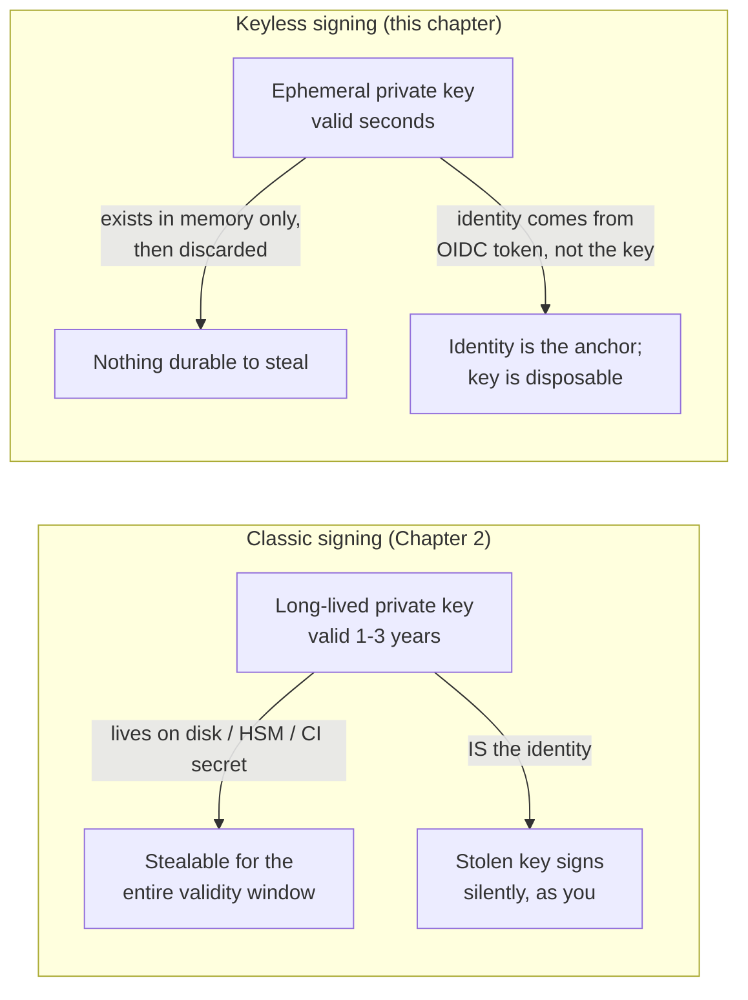
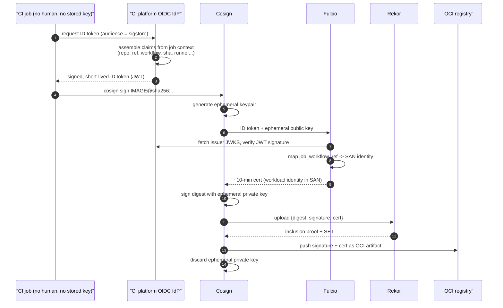
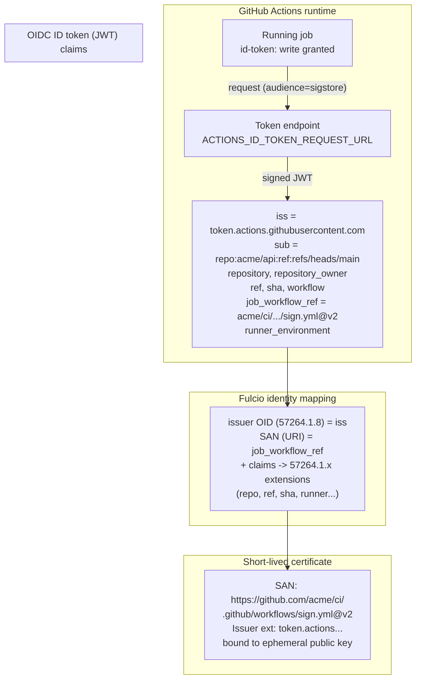
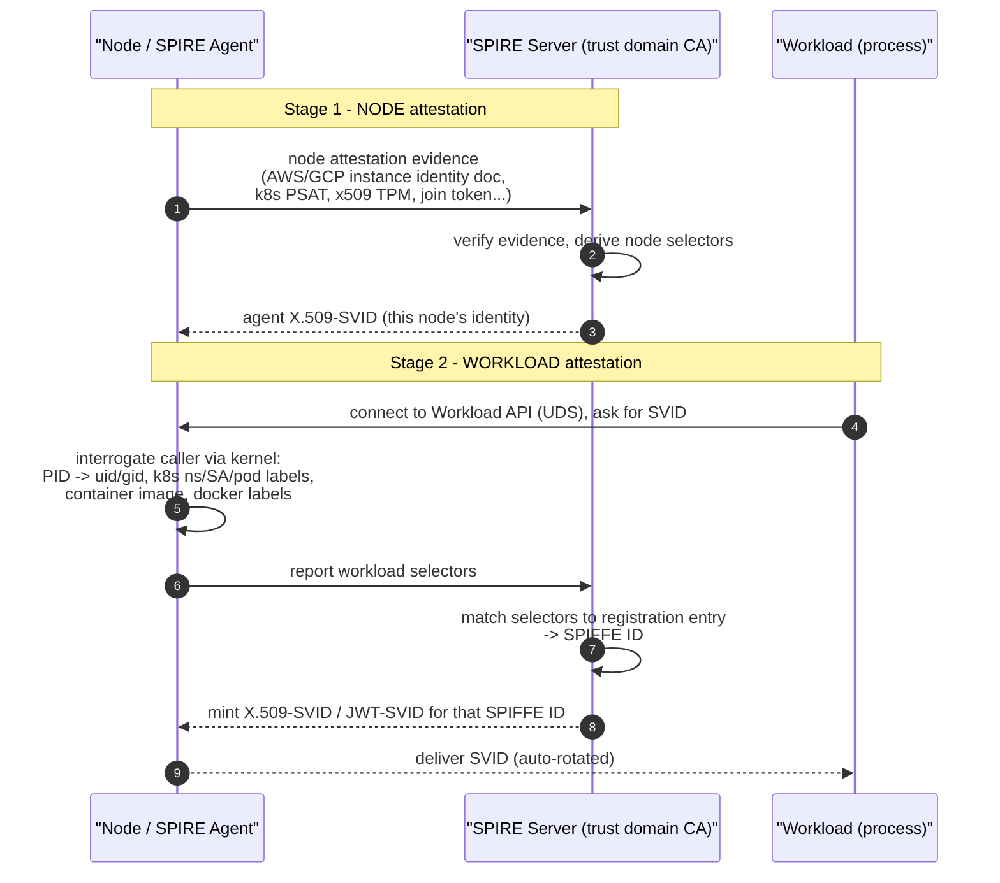
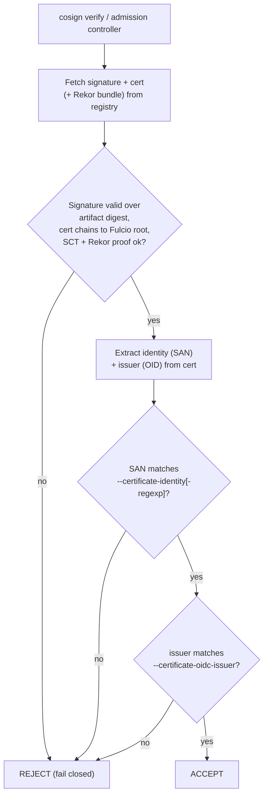
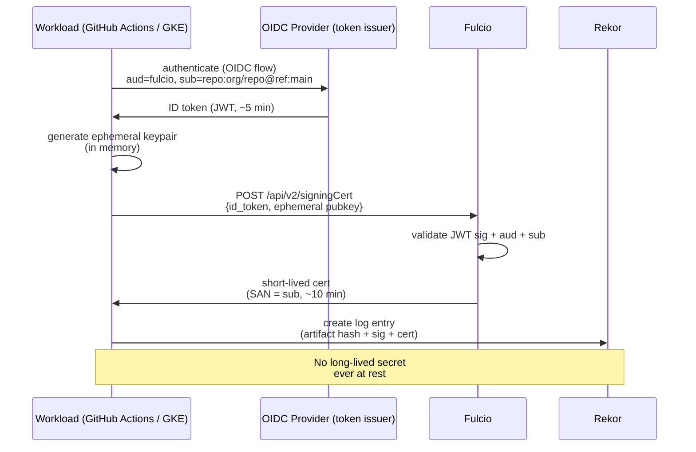

# Chapter 4 — Keyless Signing and Workload Identity

*What this chapter covers.* Chapter 3 built the whole-system picture of Sigstore and named its
central innovation **keyless signing**, but treated the identity that keyless signing binds to as a
given. This chapter opens that box. First it dispels the word "keyless" itself — there *are* keys;
what is gone is the **long-lived, human-managed** key that Chapter 2 spent a whole chapter watching
get stolen. Then it goes deep on the mechanism that makes keyless signing work for the systems a
backend engineer actually cares about: **automated pipelines with no human at the keyboard**. The
answer is **workload identity** — a CI job proving *what it is* ("I am the `release.yml` workflow of
`acme/api`, building commit `abc123` on `main`") through a short-lived, provider-signed token,
without any stored secret. We take GitHub Actions OIDC apart claim by claim, survey the equivalent
mechanisms on GitLab, AWS, Google Cloud, and other platforms, and give **SPIFFE/SPIRE** — the
vendor-neutral workload-identity standard — the full treatment it deserves, because it is the same
primitive that will show up again as the runtime service identity in zero-trust networking. Finally
we return to verification, where the entire security value lives or dies on one thing: **getting the
identity-matching policy right**, tight enough that "any workflow in the org" cannot masquerade as
"the release workflow."

Learning goals — after this chapter you should be able to:

- Explain precisely what **"keyless"** does and does not mean: no long-lived user-managed key, an
  **ephemeral keypair per signing** used once and discarded, identity (not a key) as the durable
  trust anchor — and why this structurally removes Chapter 2's key-theft failure class.
- Give an **OIDC refresher** sufficient to reason about signing: the ID token as a signed JWT, its
  standard claims (`iss`, `sub`, `aud`), and how **Fulcio** validates that token and binds its
  identity into the certificate.
- Distinguish **human identity** (interactive browser OIDC → email in the cert) from **workload
  identity** (ambient machine token → workflow URI in the cert), and explain why CI needs the
  latter.
- Read a real **GitHub Actions OIDC token** claim by claim — `sub`, `repository`,
  `repository_owner`, `ref`, `workflow`, and especially **`job_workflow_ref`** — and explain the
  `id-token: write` permission and the token endpoint that produce it.
- Map the workload-identity mechanisms of **GitLab CI**, **AWS**, **Google Cloud Workload Identity
  Federation**, and others onto the same shape, and explain **SPIFFE/SPIRE** as the general fabric:
  the **SPIFFE ID**, **X.509-SVID** and **JWT-SVID**, and **node + workload attestation**.
- Write correct `cosign verify` **identity policies** (`--certificate-identity` /
  `--certificate-identity-regexp`, `--certificate-oidc-issuer`) and recognize the **over-broad
  matching footgun**.
- State the honest security ledger: what keyless workload signing wins, and the new trust base it
  takes on (the IdP, Fulcio, Rekor, and the attestation of the workload identity itself).

## "Keyless" is a misnomer — say what it really means

Start by killing the word. **Keyless signing is not signing without keys.** Signing is a
mathematical operation over a private key; there is no such thing as a signature without one. What
"keyless" names is the absence of a *particular kind* of key — the **long-lived, user-managed**
private key that Chapter 2 built its entire failure taxonomy around.

Here is the mechanism, compressed. For each signing operation, the Cosign client generates a **fresh
ephemeral keypair in memory** — typically ECDSA over P-256. It obtains an OIDC identity token, sends
the token and the ephemeral *public* key to Fulcio, and receives back a certificate — valid for
roughly ten minutes — that binds *this identity* to *this public key*. It signs the artifact digest
with the ephemeral *private* key, uploads the signature and certificate to Rekor, and then **throws
the private key away**. The keypair existed for the duration of one signature — seconds — and then
ceased to exist. Nothing was written to disk, no HSM slot was provisioned, no secret was mounted
into the runner.

Now re-read Chapter 2's central failure through that lens. The whole game in classic signing is
protecting a private key that must stay valid for one to three years, because that key *is* the
identity — anyone holding it can sign as you, forever, silently. Stuxnet's operators stole Realtek's
and JMicron's legitimate driver-signing keys; the 2022 NVIDIA breach leaked code-signing
certificates that were promptly reused to sign malware. Every one of those incidents is an instance
of the same structural fact: **a durable secret is a durable liability.** It sits somewhere — a
build server, an HSM, a developer laptop, a CI secret store — for the entire time it is valid, and
that entire time is a window of theft.

Keyless signing closes the window by making it a few seconds wide and leaving nothing behind.



The trade is not "no keys" but **"key you keep" for "identity you prove."** The durable thing you now
protect is not a secret file — it is an **account with an identity provider** and the integrity of a
public log. That is a different, and for automated systems a far better, thing to defend, because
the properties of "an account at an IdP" (revocable, auditable, MFA-protected, centrally managed)
are exactly the properties "a private key on a build server" never had. The rest of this chapter is
about where that identity comes from when there is no human to log in.

## OIDC and identity — just enough to reason about signing

Keyless signing rests entirely on **OpenID Connect (OIDC)**, so we need a precise-but-compact model
of it. (Book 9, Chapter 6 — OAuth 2.0 and OpenID Connect — is the full treatment; here we take only
what signing needs.)

OIDC is an **identity layer on top of OAuth 2.0**. The cast:

- An **identity provider (IdP)** — Google, GitHub, GitLab, a corporate Okta/Entra tenant, or a CI
  platform's token service — that can authenticate a principal and vouch for who it is.
- An **ID token**: a **JWT** (JSON Web Token) the IdP issues, containing **claims** about the
  principal, and **signed by the IdP's private key**. Anyone can verify that signature using the
  IdP's public keys, which the IdP publishes at a well-known JWKS endpoint discoverable from its
  OIDC metadata (`/.well-known/openid-configuration`).

A JWT is three base64url segments — header, payload, signature — joined by dots. The payload carries
**standard claims** defined by the spec plus **provider-specific claims**. The three that matter
most for signing:

- **`iss`** (issuer) — *who asserted this identity*. A URL, e.g.
  `https://token.actions.githubusercontent.com` for GitHub Actions or `https://accounts.google.com`
  for Google. This is the anchor for trust: you verify the token's signature against *this issuer's*
  published keys, and no other.
- **`sub`** (subject) — *who or what the token is about*, in the issuer's namespace. For a human this
  might be an opaque user ID or an email-bearing token; for a workload it is a **structured string
  describing the job** (we will dissect GitHub's shortly).
- **`aud`** (audience) — *who the token is for*. The intended recipient. A verifier must check that
  the token was minted for it and not replayed from somewhere else. Fulcio requires the audience to
  be `sigstore`.

Plus the housekeeping claims every JWT carries: `iat` (issued-at), `nbf` (not-before), `exp`
(expiry — OIDC ID tokens are short-lived, minutes), and `jti` (a unique token ID).

### How Fulcio turns a token into a certificate identity

When Cosign sends Fulcio an ID token and an ephemeral public key, Fulcio does four things (Chapter 3
walked the flow; here is the identity-binding detail):

1. **Validates the token.** It fetches the issuer's public keys from the issuer's JWKS endpoint and
   verifies the JWT signature, then checks `exp`/`nbf` and that `aud == sigstore`. A token whose
   signature does not verify against the *claimed issuer's* keys is rejected — this is what stops an
   attacker minting their own tokens.
2. **Selects an identity mapping.** Fulcio has a configured set of accepted issuers, and for each
   issuer a rule for *which claim becomes the certificate's identity*. For a human Google/GitHub
   login it is the email; for GitHub Actions it is the **`job_workflow_ref`** claim; for GitLab it
   is the `ci_config_ref_uri` claim. This per-issuer mapping is the crux of the whole scheme and we
   return to it below.
3. **Mints a short-lived certificate** whose **Subject Alternative Name (SAN)** is that identity —
   an `rfc822Name` for an email, a **URI SAN** for a workload — and whose **custom X.509 extensions**
   (under the `1.3.6.1.4.1.57264.1` OID arc) record the issuer and, for CI issuers, a rich set of
   the other claims (repository, ref, commit SHA, runner environment, and so on).
4. **Logs the certificate** to the CT log and returns it (SCT embedded) to Cosign.

The upshot: **the OIDC token's identity becomes the certificate's identity**, cryptographically
bound to the ephemeral key that will do the signing. Verification later (last section) is a check
against *that identity*, never against a key you pinned.

### Human identity versus workload identity

There are two ways to obtain the OIDC token in step 1, and they define two different modes of
Sigstore use.

**Human / interactive.** A developer runs `cosign sign` at a terminal. Cosign opens a browser to the
IdP's authorization endpoint (using an OAuth loopback + PKCE flow so the resulting token is bound to
this local session), the human authenticates — possibly with MFA — and the token comes back with
their **email** as the identity. The Fulcio certificate's SAN is `alice@example.com`; the issuer OID
records `https://accounts.google.com`. This is fine for a maintainer signing a release by hand, and
it is how a lot of open-source signing happens. But it does not scale and it is not what a pipeline
can do: **there is no human in a CI job to click a browser button.**

**Workload / ambient.** A CI job runs `cosign sign` with no browser and no human. The token is
**ambient**: the platform the job runs on *is itself an OIDC provider*, and it has already made a
signed token describing the running job available to that job through the environment. Cosign detects
the CI environment, fetches the ambient token, and proceeds. The certificate's SAN is not an email —
it is a **URI describing the workload**, e.g.
`https://github.com/acme/api/.github/workflows/release.yml@refs/heads/main`. **This is the mode that
matters for everything a backend engineer builds**, and it is the rest of this chapter.

## Workload identity in CI/CD — the core

### The problem statement

A CI job needs to prove a specific, verifiable claim about itself —

> "I am the build produced by the `release.yml` workflow of the `acme/api` repository, running
> against commit `abc123` on branch `main`, on a GitHub-hosted runner."

— to a party (Fulcio, a cloud IAM endpoint, a secret manager) that has never seen this job before,
**without presenting any stored secret.** The "without a stored secret" clause is the whole
difficulty. The obvious pre-keyless approach — put a long-lived credential (a signing key, a cloud
access key, a service-account JSON) into a CI secret — is exactly the durable liability we are trying
to eliminate. It sits in the secret store for years; it is copied into every runner that needs it; it
leaks through log exposure, a malicious dependency in the build (Book 4, Chapter 7 — pipeline
poisoning), a compromised action, or an insider; and once leaked it authenticates as the pipeline
from anywhere until someone notices and rotates it.

The solution reframes the CI platform's role. **The platform becomes an OIDC identity provider.**
Because the platform is the thing that actually schedules and runs the job, it is uniquely positioned
to *know* what the job is — which repo, which workflow file, which ref, which commit, which runner —
and to **assert those facts in a signed, short-lived token** minted freshly for that job and
delivered only to it. The job proves its identity not by holding a secret but by holding a token the
platform made about it, on the fly, that expires in minutes. There is nothing durable to steal
because the credential *is created per-run and dies with the run*.



The signer, at the end of this, is provably and specifically **the workload** — not "someone with a
key", not "the acme org", but *that exact build context*. Let us see how each platform produces that
token.

### GitHub Actions OIDC

GitHub Actions is the reference implementation and the one most readers will meet first, so we do it
in detail.

**Turning it on.** A workflow requests an OIDC token by granting itself the `id-token: write`
permission. This permission is **off by default** and must be explicitly granted — either at the
workflow top level or per-job. Granting it is what makes the runner expose the token endpoint to the
job.

```yaml
name: release
on:
  push:
    tags: ["v*"]

permissions:
  contents: read
  id-token: write        # REQUIRED for OIDC / keyless signing

jobs:
  build-and-sign:
    runs-on: ubuntu-latest
    steps:
      - uses: actions/checkout@v4
      - uses: sigstore/cosign-installer@v3
      # ... build and push image, capture its digest ...
      - name: Keyless sign
        run: cosign sign --yes ghcr.io/acme/api@${{ steps.build.outputs.digest }}
        # No key, no secret. Cosign detects Actions, fetches the ambient
        # OIDC token, and drives the Fulcio -> Rekor flow.
```

Note the principle of least privilege even here: `contents: read`, `id-token: write`, nothing more.
The `id-token: write` name is slightly misleading — it does not let the job *write* anything durable;
it lets the job *request* an ID token be written for it. It is the switch that turns on OIDC for the
job.

**The token endpoint.** When `id-token: write` is granted, the runner injects two environment
variables into the job:

- `ACTIONS_ID_TOKEN_REQUEST_URL` — a per-job URL on GitHub's token service.
- `ACTIONS_ID_TOKEN_REQUEST_TOKEN` — a short-lived bearer token authorizing the request to that URL.

Code fetches an ID token by calling that URL, optionally passing an `audience` query parameter (the
`aud` claim the returned token will carry). Cosign requests `audience=sigstore`; a job federating to
a cloud would request that cloud's audience.

```bash
# What Cosign (and the GitHub toolkit's core.getIDToken) do under the hood.
curl -sS -H "Authorization: bearer $ACTIONS_ID_TOKEN_REQUEST_TOKEN" \
  "$ACTIONS_ID_TOKEN_REQUEST_URL&audience=sigstore" | jq -r '.value'
# -> eyJ...  (a signed JWT, the OIDC ID token for THIS job)
```

The issuer is always `https://token.actions.githubusercontent.com`, whose JWKS Fulcio (and any
verifier of the raw token) fetches to check the signature.

**The claims.** Decode that JWT's payload and you get the workload's self-description. A representative
token from a tag-triggered release build (trimmed and annotated):

```json
{
  "iss": "https://token.actions.githubusercontent.com",
  "aud": "sigstore",
  "sub": "repo:acme/api:ref:refs/heads/main",

  "repository": "acme/api",
  "repository_id": "123456789",
  "repository_owner": "acme",
  "repository_owner_id": "987654",
  "repository_visibility": "private",

  "ref": "refs/heads/main",
  "ref_type": "branch",
  "ref_protected": "true",
  "sha": "abc123def4567890abc123def4567890abc123de",

  "workflow": "release",
  "workflow_ref": "acme/api/.github/workflows/release.yml@refs/heads/main",
  "workflow_sha": "abc123def4567890abc123def4567890abc123de",

  "job_workflow_ref": "acme/api/.github/workflows/release.yml@refs/heads/main",
  "job_workflow_sha": "abc123def4567890abc123def4567890abc123de",

  "event_name": "push",
  "run_id": "7654321098",
  "run_number": "42",
  "run_attempt": "1",
  "runner_environment": "github-hosted",
  "actor": "release-bot",
  "actor_id": "555111",

  "iat": 1753900000,
  "nbf": 1753899700,
  "exp": 1753900300,
  "jti": "6f2a...c1"
}
```

The claims break into families:

- **What repo** — `repository`, `repository_id` (a stable numeric ID that survives repo renames),
  `repository_owner`, `repository_owner_id`, `repository_visibility`.
- **What code** — `ref`, `ref_type`, `ref_protected`, `sha`. The `ref_protected` flag is genuinely
  useful in policy: it tells you the ref is a protected branch.
- **What workflow** — `workflow` (the name), `workflow_ref` / `workflow_sha` (the *entrypoint*
  workflow file and its commit), and **`job_workflow_ref` / `job_workflow_sha`** (see below).
- **What run and who triggered it** — `event_name`, `run_id`, `run_number`, `run_attempt`, `actor`,
  `actor_id`, and `runner_environment` (`github-hosted` vs `self-hosted` — a claim you often want to
  pin, because a self-hosted runner is a different trust posture).

**`job_workflow_ref` — the load-bearing claim.** The distinction between `workflow_ref` and
`job_workflow_ref` is subtle and it is the most important thing in this section.

- `workflow_ref` is the **top-level workflow that was triggered** — the entrypoint in the repo whose
  event fired.
- `job_workflow_ref` is the **workflow file that actually contains the running job's definition.**
  When a job calls a **reusable workflow** (`uses: acme/ci/.github/workflows/build.yml@v2`), the job
  runs *inside that reusable workflow*, and `job_workflow_ref` points at the reusable workflow's
  path, repo, and ref — while `workflow_ref` still points at the caller. When there is no reuse, the
  two coincide (as in the token above).

This is precisely why `job_workflow_ref` is the claim **Fulcio maps to the certificate SAN** for
GitHub Actions, and the claim **SLSA Level 3 provenance** treats as the builder identity: it names
the *code that actually did the work*, following into reusable workflows. If you run a hardened,
centrally-owned reusable workflow — the paved-road signer of Book 4, Chapter 10 — then
`job_workflow_ref` is `acme/ci-central/.github/workflows/sign.yml@refs/tags/v2`, and **every repo in
the org that calls that shared workflow signs under the same, verifiable identity.** Downstream policy
can require *that* identity and be certain the signing was done by the trusted shared workflow, not
by arbitrary code in some tenant repo. This is the mechanism that turns "we have a golden signing
pipeline" from an aspiration into an enforceable fact.



The Fulcio certificate that comes out embeds the issuer in the OID extension `1.3.6.1.4.1.57264.1.8`
and maps a whole family of claims into further extensions in the same arc — the source repository URI
and digest, the ref, the runner environment, the build trigger, and the run invocation URI. So the
certificate is not just "signed by a GitHub workflow" — it is a durable record of the exact build
context, all of which becomes *verifiable policy surface*. (You rarely match on every extension;
`--certificate-identity` on the SAN plus `--certificate-oidc-issuer` on the issuer is the common
case, with extension matching available for stricter policies.)

### The same shape on other platforms

Every major CI platform and cloud implements the same primitive — the platform vouches for the
workload via a short-lived, signed token — with different claim names and wiring.

**GitLab CI/CD** issues **ID tokens** via the `id_tokens` keyword; you declare the audience per job.
GitLab is an accepted Fulcio issuer (`https://gitlab.com`, or your self-managed instance URL).

```yaml
sign:
  image: alpine
  id_tokens:
    SIGSTORE_ID_TOKEN:
      aud: sigstore
  script:
    - cosign sign --yes "$IMAGE@$DIGEST"   # cosign reads SIGSTORE_ID_TOKEN
```

Its claims mirror GitHub's with GitLab vocabulary: `namespace_path`, `project_path`, `project_id`,
`ref`, `ref_type`, `ref_protected`, `pipeline_id`, `job_id`, `runner_id`, `environment`,
`user_login`, `user_email`, a structured `sub` (e.g.
`project_path:acme/api:ref_type:branch:ref:main`), and — the analogue of `job_workflow_ref` —
**`ci_config_ref_uri`** and `ci_config_sha`, which Fulcio maps to the certificate SAN. So a GitLab
keyless signature's identity looks like
`https://gitlab.com/acme/api//.gitlab-ci.yml@refs/heads/main`.

**AWS.** AWS does not sign your artifacts, but it uses the identical OIDC-federation trick for the
job to *assume an IAM role without a stored access key*. You register GitHub's issuer as an **IAM
OIDC identity provider**, then write a role trust policy that conditions on the token's claims:

```json
{
  "Effect": "Allow",
  "Principal": { "Federated": "arn:aws:iam::123456789012:oidc-provider/token.actions.githubusercontent.com" },
  "Action": "sts:AssumeRoleWithWebIdentity",
  "Condition": {
    "StringEquals": {
      "token.actions.githubusercontent.com:aud": "sts.amazonaws.com",
      "token.actions.githubusercontent.com:sub": "repo:acme/api:ref:refs/heads/main"
    }
  }
}
```

The job calls `sts:AssumeRoleWithWebIdentity` with its GitHub token and gets back **short-lived AWS
credentials** — no static `AWS_ACCESS_KEY_ID` in CI at all. The footgun here is exactly the one we
meet again for signing: **a lazy `sub` condition** (`repo:acme/*:*`, or matching only `aud`) lets any
workflow in any matched repo assume the role. Scope the `sub` to the exact ref/environment. (Inside
EKS, the same idea appears as **IRSA — IAM Roles for Service Accounts** — where a pod's projected
service-account token is the OIDC credential; Book 6, Chapter 9 develops the cloud side.)

**Google Cloud Workload Identity Federation** is the GCP analogue: you create a **workload identity
pool** and add the CI platform as an OIDC **provider**, mapping token claims to Google attributes,
then let the external identity impersonate a service account via STS token exchange — again, no
downloaded service-account JSON key, which is the credential Google most wants you to stop shipping.

**Buildkite, CircleCI, and others** expose OIDC tokens through their own steps/contexts (Buildkite's
agent OIDC token, CircleCI's OIDC context), with claims describing organization, pipeline, and job.
The pattern is universal now: **the CI platform is an IdP for the jobs it runs.**

| Platform | How the job gets a token | Fulcio-relevant identity claim | Issuer |
| --- | --- | --- | --- |
| GitHub Actions | `id-token: write` + token endpoint | `job_workflow_ref` -> URI SAN | `token.actions.githubusercontent.com` |
| GitLab CI/CD | `id_tokens:` keyword (per-job `aud`) | `ci_config_ref_uri` -> URI SAN | `gitlab.com` or self-managed URL |
| AWS (role assume) | `AssumeRoleWithWebIdentity` | `sub` in trust-policy condition | the federated IdP (e.g. GitHub) |
| Google Cloud WIF | pool + provider, STS exchange | mapped attributes/`sub` | the federated IdP |
| Buildkite / CircleCI | agent OIDC token / OIDC context | org/pipeline/job claims | platform issuer URL |

### SPIFFE and SPIRE — the vendor-neutral workload-identity fabric

Everything above is per-platform. The vendor-neutral standard for "give a workload a verifiable
identity with no stored secret" is **SPIFFE** (Secure Production Identity Framework For Everyone), a
CNCF project, with **SPIRE** (the SPIFFE Runtime Environment) as its reference implementation. SPIFFE
matters here for two reasons: it generalizes the CI-OIDC pattern into a framework you can run
yourself across a heterogeneous fleet, and — the architectural punchline of this chapter — **it is
the same identity a service uses at runtime for mTLS in a zero-trust network** (Book 9, Chapter 10),
so build-time signing identity and runtime service identity can be *one thing*.

**The SPIFFE ID.** A workload's identity is a URI:

```
spiffe://acme.example/ns/prod/sa/payments-api
        └── trust domain ──┘└─── workload path ───┘
```

The **trust domain** (`acme.example`) is an administrative root — one organization or environment —
and the **path** names a workload within it, by whatever scheme you choose (here, Kubernetes
namespace and service account). It is a name, not a secret. Compare the GitHub SAN
`https://github.com/acme/api/.github/workflows/release.yml@...`: same idea — a URI that *names the
workload* — which is exactly why the two worlds converge.

**SVIDs — the credential.** A SPIFFE ID is carried by an **SVID (SPIFFE Verifiable Identity
Document)**, which comes in two forms, mirroring Sigstore's X.509-and-JWT duality:

- **X.509-SVID** — a short-lived X.509 certificate with the SPIFFE ID in its **URI SAN** (precisely
  the field Fulcio uses for the workload identity). Used for **mTLS**: two services present X.509-SVIDs
  and each verifies the other's SPIFFE ID against policy. This is the zero-trust building block.
- **JWT-SVID** — a JWT with the SPIFFE ID in `sub` and the intended audience in `aud`, signed by the
  trust domain's authority. Used where you cannot do mTLS (crossing an L7 proxy, calling an API that
  wants a bearer token) — structurally the same object as the CI OIDC tokens above.

**SPIRE's architecture.** SPIRE issues SVIDs through two components:

- A **SPIRE Server** per trust domain: the signing authority. It holds the trust domain's CA (which
  mints X.509-SVIDs and JWT-SVIDs), and a database of **registration entries** — the policy that maps
  *attestable properties of a workload* to the SPIFFE ID it should receive.
- A **SPIRE Agent** on every node: it authenticates to the server, then exposes the **Workload API**
  to local workloads over a Unix domain socket, handing out SVIDs and rotating them automatically.

The security rests on **two-stage attestation**, and this answers the question the CI platforms
answered implicitly ("how does the issuer *know* the workload is what it claims?"):



- **Node attestation** proves *which node* an agent runs on, without a pre-shared node secret. The
  agent presents platform evidence the server can independently verify: an **AWS/GCP/Azure instance
  identity document** signed by the cloud, a **Kubernetes projected service-account token (PSAT)**, a
  **TPM-backed x509pop** proof, or (weaker, for bootstrap) a one-time **join token**. The server
  verifies it and issues the agent its own SVID.
- **Workload attestation** proves *which workload* is asking, without the workload presenting any
  credential. When a process connects to the Workload API socket, the agent asks the **kernel** who
  the caller is (its PID), then runs **attestor plugins** that derive **selectors** from
  attestable properties: Unix `uid`/`gid`/path, or Kubernetes namespace, service account, and pod
  labels, or the container image digest. The server matches those selectors to a registration entry
  and returns the matching SPIFFE ID.

The crucial property, identical to keyless CI signing: **the workload holds no secret and presents no
key to get its identity.** Its identity is *derived from what it verifiably is* — where it runs, as
what user, in which pod — and re-issued continuously as a short-lived SVID. A stolen SVID is useless
in minutes; there is no long-lived credential to steal in the first place. SPIFFE also **federates**
across trust domains: each domain publishes its CA public keys at a **bundle endpoint**, so a
workload in `acme.example` can verify one in `partner.example` — the same rotate-and-distribute-keys
problem Sigstore solves with TUF, solved here per trust domain.

### The trust chain, assembled

Whether the platform is GitHub, GitLab, a cloud, or SPIRE, the chain a keyless workload signature
rides is the same:

```
workload  ──►  short-lived OIDC token / SVID   (signed by the platform IdP / trust-domain CA,
                asserting "this is workload W")           minted per-run, expires in minutes)
          ──►  Fulcio verifies the token against the issuer's published keys,
                maps the identity claim into the certificate SAN
          ──►  short-lived certificate binds workload identity  ►  ephemeral public key
          ──►  signature over the artifact digest, logged in Rekor
```

At no point is there a durable secret. The signer, provably, is **the workload** — specific, named,
and (via Rekor) recorded. That specificity is the entire point of the next section: it is only worth
producing if verification actually *checks* it.

## Verifying workload-identity signatures — policy is everything

Here is the mental discipline this whole book keeps returning to: **you do not verify a key — you
verify an identity against a policy.** With a pinned key, "valid signature by key X" was the whole
question. With keyless workload signing there is no key to pin; the certificate's key is ephemeral
and different every time. What is stable, and what you must check, is the **identity and issuer** in
the certificate. A "valid Sigstore signature" that you do not constrain to an expected identity is
close to worthless — anyone in the world can produce a valid Sigstore signature over your image using
*their own* GitHub identity. The signature is real; it just is not *yours*.

Cosign v2 enforces this by making the identity flags **mandatory** for keyless verification — there
is no "just check it's signed" mode:

```bash
# Verify: this image MUST have been signed by the exact release workflow,
# via GitHub's OIDC issuer. Both flags are required; order of checks is fail-closed.
cosign verify \
  --certificate-identity "https://github.com/acme/api/.github/workflows/release.yml@refs/heads/main" \
  --certificate-oidc-issuer "https://token.actions.githubusercontent.com" \
  ghcr.io/acme/api@sha256:9b2a...c1
```

`--certificate-identity` matches the certificate **SAN** (the `job_workflow_ref`-derived URI);
`--certificate-oidc-issuer` matches the **issuer OID extension**. Both together, because — as Chapter
3 stressed — `alice@example.com` via Google and `alice@example.com` via a rogue IdP are different
signers, and `release.yml@main` in *your* repo versus in a fork are different signers only
distinguished by the full URI.

When you legitimately need to accept a *family* of identities — say every repo in your org that calls
a shared signing workflow — use the regexp forms, but **anchor them and make them specific**:

```bash
# Accept the SHARED signing workflow called from any repo in the acme org,
# only from a version tag, via GitHub's issuer.
cosign verify \
  --certificate-identity-regexp '^https://github\.com/acme/ci-central/\.github/workflows/sign\.yml@refs/tags/v[0-9]+' \
  --certificate-oidc-issuer 'https://token.actions.githubusercontent.com' \
  ghcr.io/acme/api@sha256:9b2a...c1
```

The verify-by-identity flow, end to end:



The cryptographic checks (signature valid, chains to Fulcio, logged in Rekor, `integratedTime` inside
the cert window — Chapter 3's verify-after-expiry) are necessary but **not sufficient**. They prove
"a real Sigstore signature by *some* identity." The **identity/issuer match** is what turns that into
"a signature by *the identity I trust to build this*." Skip it, or write it loosely, and you have
built an elaborate no-op.

### The footgun: over-broad identity matching

This is the same class of bug as the AWS `sub`-condition footgun above, and it is the single most
common way real deployments get keyless verification wrong. Every one of these "works" — it accepts
signatures and passes CI — while under-verifying:

- **Matching the org, not the workflow.** `--certificate-identity-regexp '^https://github\.com/acme/'`
  accepts a signature from *any workflow in any acme repo* — including a `test.yml` in a
  low-privilege repo, or a workflow a compromised insider added. If your security story is "only the
  hardened release workflow may sign production images," this regexp does not encode it.
- **Unanchored / dot-wildcards.** `--certificate-identity-regexp 'acme/api'` (no `^`, unescaped `.`)
  matches `evil-acme/api-backdoor` and more. Regex identity matching **must** be anchored (`^`) and
  escape literal dots and slashes. An unanchored substring match is an open door.
- **Ignoring the ref.** Matching `.../release.yml@` with any ref accepts a signature produced when the
  workflow ran on an attacker's branch or a PR fork. Pin the ref (`@refs/heads/main`, or
  `@refs/tags/v...`) — a workflow file's *contents* are whatever they were on that ref, so "release.yml
  on some random branch" is code you never reviewed.
- **Not pinning the issuer** (or accepting multiple issuers loosely). The issuer is half the identity.
- **Forgetting `runner_environment`** where it matters. If production images must be built on
  GitHub-hosted runners, the `runner_environment=github-hosted` extension is available to match; a
  self-hosted runner is a different (often weaker) trust boundary.

The correct instinct is **least-authority identity policy**: name the *exact* workflow path, the
*exact* issuer, and the *exact* ref (or a tightly anchored pattern over versions), and add extension
constraints (`runner_environment`, `ref_protected`) where your threat model needs them. In a
Kubernetes admission policy (Sigstore `policy-controller` or Kyverno; Book 6, Chapters 5–6, and
Chapter 10) the same discipline applies to the `subject`/`issuer` fields — a `subjectRegExp` of
`^https://github.com/acme/.+` is a **finding**, not a policy.

## Security properties and caveats — the honest ledger

Keyless workload signing is a large, real improvement, and it is important to state both sides
plainly.

**The wins.**

- **No key management.** There is no signing key to generate, store, rotate, escrow, HSM-protect, or
  distribute across the fleet — the entire apparatus of Chapter 2 and much of enterprise PKI (Chapter
  9) simply does not exist for the signer. The cost that used to grow with the number of signers is
  gone.
- **No stored secrets in CI.** The credential is minted per-run and dies with the run. There is
  nothing in the CI secret store to leak through pipeline poisoning, log exposure, or a malicious
  dependency in the build.
- **Specific, verifiable identities.** The signer is not "a key" but *this workflow, this repo, this
  ref, this runner* — human-meaningful and enforceable in policy.
- **Transparency.** Every signing event lands in Rekor (Chapter 5), so misuse of an identity is
  *detectable*, unlike a stolen key signing in silence.
- **It fits ephemeral CI natively.** Runners are cattle; they come up, build, sign, and vanish.
  Ambient identity with no provisioning step is the only signing model that matches that lifecycle.

**The caveats — a different trust base, not a smaller one.**

- **You now trust the OIDC IdP.** The security of every signature reduces to the integrity of the
  platform's token issuance. If GitHub, GitLab, or your corporate IdP mis-issues a token — a bug that
  lets one repo obtain another's `job_workflow_ref`, a signing-key compromise at the issuer — the
  identity binding is only as good as that issuance. You have traded "protect a key" for "trust an
  IdP's token minting," which is usually a *better* trade (IdPs are hardened, audited, MFA-gated) but
  it is a real dependency, not its absence.
- **You trust Fulcio and Rekor.** On the public-good instance, verification and (on the sign path)
  signing depend on services run by the OpenSSF/Linux Foundation. Their **availability** is on your
  critical path if you verify online, and their **integrity** underwrites the whole chain. This is a
  strong argument, at fleet scale, for **self-hosted Sigstore** (Chapter 9) so the dependency and the
  signing-event data are yours — and for offline verification via bundles so admission does not call a
  public service on every deploy.
- **A compromised CI identity still signs valid artifacts.** This is the persistent lesson, restated
  once more: signing proves *who/what* signed, **not that the thing is honest**. If an attacker
  subverts the release workflow — poisons a step, compromises a used action, exploits a `pull_request_target`
  misconfiguration (Book 4, Chapters 5 and 7) — the malware they produce is signed by the *real*
  workflow identity and verifies perfectly. Keyless signing raises the attacker's bar from "steal a
  key" to "compromise the build," which is genuine progress, but the axis is unchanged: **signed ≠
  safe.** Build integrity is a separate axis carried by provenance and policy (SLSA, Book 4, Chapter
  3; in-toto, Chapter 6), transported *by* signatures, not replaced by them.
- **The workload identity itself must be bootstrapped and attested.** "The platform vouches for the
  workload" only helps if the platform's vouching is itself sound. That is exactly what SPIRE's
  **node and workload attestation** formalize — and it is why the *quality of attestation* matters:
  a weak node attestor (a shared join token, an unbounded selector) undermines every SVID derived
  from it, just as a lazy `job_workflow_ref` mapping or an over-broad verify policy undermines every
  signature. The identity is only as strong as the attestation that grounds it. There is no free
  lunch; there is a *better-shaped* lunch, and its shape is "attest what the workload verifiably is,
  issue a short-lived credential, and check it against a tight policy."

## Distributed-systems lens

The reason this chapter sits at the center of the book is that **workload identity is the unifying
primitive of the modern secure fleet** — the same identity, in the same shape, does four different
jobs that used to require four different long-lived secrets.

Consider a single service, `payments-api`, across its lifecycle:

- **At build time (this chapter):** the build's workload identity —
  `.../ci-central/.github/workflows/sign.yml@v2` or a SPIFFE ID — signs the image, its SBOM, and its
  SLSA provenance. No signing key.
- **Authenticating to secret managers and clouds (Book 4, Chapter 6):** the *same* OIDC token
  federates to AWS/GCP/Vault to fetch runtime config, via `AssumeRoleWithWebIdentity` or Workload
  Identity Federation. No stored cloud key.
- **At runtime, service-to-service (Book 9, Chapter 10 — zero trust and mTLS):** the service presents
  an **X.509-SVID** carrying `spiffe://acme.example/ns/prod/sa/payments-api` and does mutual TLS;
  peers authorize by SPIFFE ID. No shared service password.
- **At admission (Book 6, Chapters 5–6; Chapter 10):** the deploy gate accepts the image *only if*
  its signature's certificate identity matches the trusted build identity. The verification policy
  references the *same identity strings* the build produced.

There are **no long-lived secrets anywhere in that lifecycle.** Every credential is short-lived,
minted per-use from an attested identity, and named by a URI a human can read and a policy can match.
This is the architectural convergence worth internalizing: **the identity that signs an artifact at
build time and the identity a service uses at runtime are the same kind of thing** — a SPIFFE-style
or OIDC-style workload identity — and can, with SPIFFE/SPIRE as the org-wide fabric, be literally the
same identity system. The certificate SAN Fulcio fills from `job_workflow_ref` and the URI SAN in an
X.509-SVID are the same field doing the same job.

Two consequences for platform design:

**Signing becomes automatic and free at the platform layer.** Because the signer is ambient identity
and the client is one line, the **paved-road build platform** (Book 4, Chapter 10) signs *every*
artifact — image, SBOM, provenance — under the build's own identity, with no key handed to any team
and no code written by any tenant. Route all signing through a **shared reusable workflow** so that
`job_workflow_ref` is *one* stable, hardened identity across thousands of repos, and downstream policy
can require exactly that identity. A thousand services, one signing identity to trust, zero keys to
distribute — the classic model could never do this, because it priced in a key per signer.

**Verification is identity-and-policy at the edges of every trust boundary.** The admission
controller, the deploy gate, the peer in an mTLS handshake, the cloud IAM endpoint — each is asking
the same question in its own dialect: *"is this the identity my policy allows?"* Get that policy tight
(the footgun section) and the fleet has a single, coherent, keyless identity story from `git push` to
production traffic. Get it loose and you have spent a lot of cryptography to check almost nothing.

### Workload identity federation (OIDC)



### Keyless vs keyed decision tree

```mermaid
flowchart TD
  Q1{"Who signs?"}
  Q1 -->|Human releasing locally| K1["Keyed: hardware key (YubiKey)<br/>or KMS — human holds identity"]
  Q1 -->|CI/CD workload| Q2{"Can CI mint OIDC tokens?"}
  Q2 -->|Yes (GHA, GCP, AWS IAM OIDC)| KL["Keyless: Fulcio + ephemeral key<br/>identity = workload sub claim"]
  Q2 -->|No / air-gapped| K2["Keyed: KMS-anchored<br/>long-lived workload key"]
  Q1 -->|Third-party / vendor| K3["Keyed + transparency<br/>vendor long-lived cert<br/>+ Rekor for auditability"]
  style KL fill:#2ea043,color:#fff
  style K1 fill:#1f6feb,color:#fff
```

## Key takeaways

- **"Keyless" is a misnomer.** There *is* an ephemeral keypair per signing — generated in memory,
  used once, then discarded. What is gone is the **long-lived, user-managed** key. Identity, not a
  key, is the durable anchor, which structurally removes Chapter 2's key-theft failure class:
  **nothing durable to steal.**
- **OIDC is the foundation.** An IdP issues a short-lived **ID token (a signed JWT)** with claims —
  `iss`, `sub`, `aud`, plus provider-specific ones. **Fulcio validates the token against the issuer's
  published keys and maps its identity claim into the certificate SAN**, binding identity to the
  ephemeral key.
- **Human vs workload identity.** Interactive signing yields an **email** in the cert via a browser
  flow; CI signing uses an **ambient** platform-issued token yielding a **workload URI** in the cert.
  Automated pipelines need the latter — there is no human to click a browser.
- **The CI platform is an OIDC provider for its jobs.** GitHub Actions: grant **`id-token: write`**,
  fetch from the token endpoint (`ACTIONS_ID_TOKEN_REQUEST_URL`), get a JWT whose claims describe the
  job (`repository`, `ref`, `sha`, `workflow`, `runner_environment`, ...). **`job_workflow_ref`** —
  which follows into reusable workflows — is the claim Fulcio maps to the cert SAN and that SLSA L3
  uses as the builder identity.
- **Same shape elsewhere.** GitLab `id_tokens` (`ci_config_ref_uri`); AWS `AssumeRoleWithWebIdentity`
  and IRSA; Google Cloud **Workload Identity Federation**; Buildkite/CircleCI OIDC. All: the platform
  vouches for the workload via a short-lived signed token, no stored secret.
- **SPIFFE/SPIRE is the vendor-neutral fabric.** Identity is the **SPIFFE ID**
  (`spiffe://trust-domain/workload`), carried by an **X.509-SVID** (URI SAN, for mTLS) or **JWT-SVID**
  (bearer). SPIRE issues them via **node attestation** (prove the node with a cloud instance identity
  doc, k8s PSAT, TPM) then **workload attestation** (kernel-derived selectors → registration entry),
  so the workload holds no secret to get its identity.
- **Verify the identity, not a key.** Cosign v2 **requires** `--certificate-identity`
  (or `-regexp`) and `--certificate-oidc-issuer`. The crux is getting this policy **tight**: name the
  exact workflow, ref, and issuer. **Over-broad matching** (org-wide instead of the specific workflow,
  unanchored regexes, ignoring the ref, missing issuer) under-verifies while appearing to work — the
  most common real-world failure, the same class as a lazy AWS `sub` condition.
- **Honest ledger.** Wins: no key management, no stored secrets, transparency, specific verifiable
  identities, native fit for ephemeral CI. Caveats: you now trust the **IdP + Fulcio + Rekor** (a
  different trust base, and a public-instance dependency — argues for self-hosting, Chapter 9); a
  **compromised CI identity still signs valid artifacts** (signed ≠ safe); and the **workload identity
  itself must be attested** (node/workload attestation) — the identity is only as strong as its
  attestation.
- **Distributed-systems view.** Workload identity is the **one primitive** that signs build artifacts
  (here), federates to clouds and secret managers (Book 4, Chapter 6), and does runtime mTLS in a
  zero-trust mesh (Book 9, Chapter 10) — **no long-lived secrets anywhere**. The paved-road platform
  signs every artifact under a shared reusable-workflow identity automatically; admission policies
  reference those same identity strings. **Build-signing identity == runtime service identity** is the
  key convergence, with SPIFFE/SPIRE as the org-wide fabric.

## Further reading

- **OpenID Connect Core 1.0** — the ID token, standard claims (`iss`, `sub`, `aud`), and discovery.
  https://openid.net/specs/openid-connect-core-1_0.html (full treatment in Book 9, Chapter 6).
- **GitHub Actions — OIDC** — `id-token: write`, the token endpoint, the full claim set, and hardening
  cloud trust with `sub` conditions.
  https://docs.github.com/en/actions/security-for-github-actions/security-hardening-your-deployments/about-security-hardening-with-openid-connect.
- **Fulcio certificate profile and OID extensions** — the `1.3.6.1.4.1.57264.1` arc, the
  issuer/SAN/`job_workflow_ref` mappings, and per-issuer identity rules.
  https://github.com/sigstore/fulcio (`docs/oid-info.md` and the certificate spec).
- **Cosign verification** — `--certificate-identity`, `--certificate-identity-regexp`,
  `--certificate-oidc-issuer`, and extension matching.
  https://docs.sigstore.dev/ and https://github.com/sigstore/cosign.
- **GitLab CI/CD — ID tokens and OIDC** — the `id_tokens` keyword, claims (`ci_config_ref_uri`, ...),
  and Sigstore integration. https://docs.gitlab.com/ee/ci/secrets/id_token_authentication.html.
- **AWS — IAM OIDC identity providers and `AssumeRoleWithWebIdentity`**; **Google Cloud — Workload
  Identity Federation.** The cloud-federation side is developed in Book 6, Chapter 9.
- **SPIFFE and SPIRE** — the **SPIFFE ID** and **SVID** specs (X.509-SVID, JWT-SVID) and the SPIRE
  node/workload attestation model. https://spiffe.io/docs/ and https://github.com/spiffe/spire
  (applied to runtime mTLS/zero trust in Book 9, Chapter 10).
- **SLSA v1.0 provenance** — how the builder identity (`job_workflow_ref` on GitHub) grounds Build L3.
  https://slsa.dev/spec/v1.0/ (Book 4, Chapter 3).
- Cross-references: Book 5, Chapter 2 (classic code signing and its key-theft failures), Chapter 3
  (Sigstore architecture — Cosign/Fulcio/Rekor, verify-after-expiry), Chapter 5 (transparency logs),
  Chapter 6 (in-toto attestations), Chapter 9 (private Sigstore and key management), Chapter 10
  (attestation-based deployment gates); Book 4, Chapters 3, 5, 6, 7, 10 (SLSA provenance, hardening
  Actions, CI secrets/OIDC federation, pipeline poisoning, secure build platform); Book 6, Chapters
  5, 6, 9 (image signing in Kubernetes, admission policy engines, cloud/serverless chain); Book 9,
  Chapter 6 (OAuth/OIDC), Chapter 10 (zero trust and service-to-service mTLS with SPIFFE).
