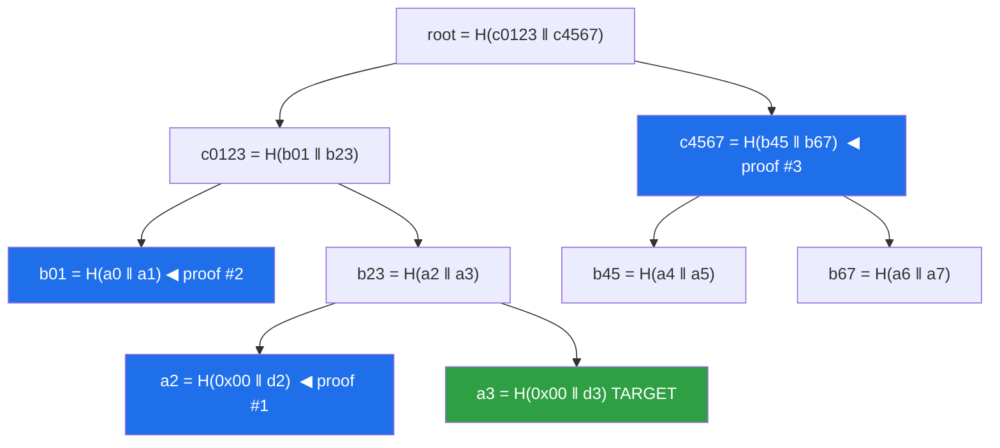
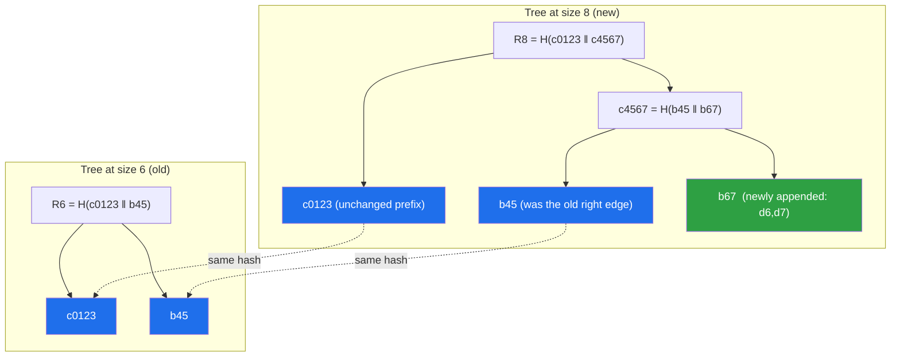
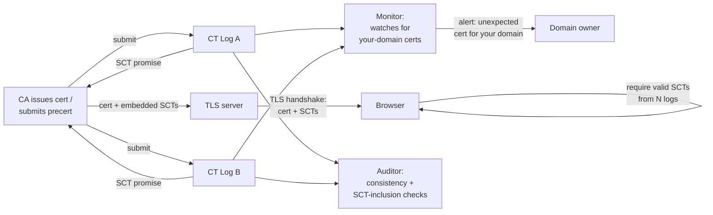
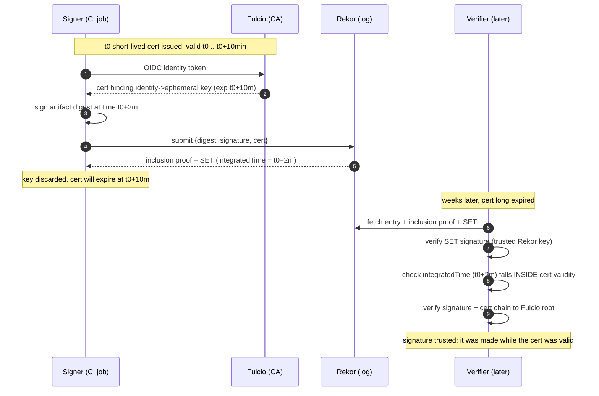
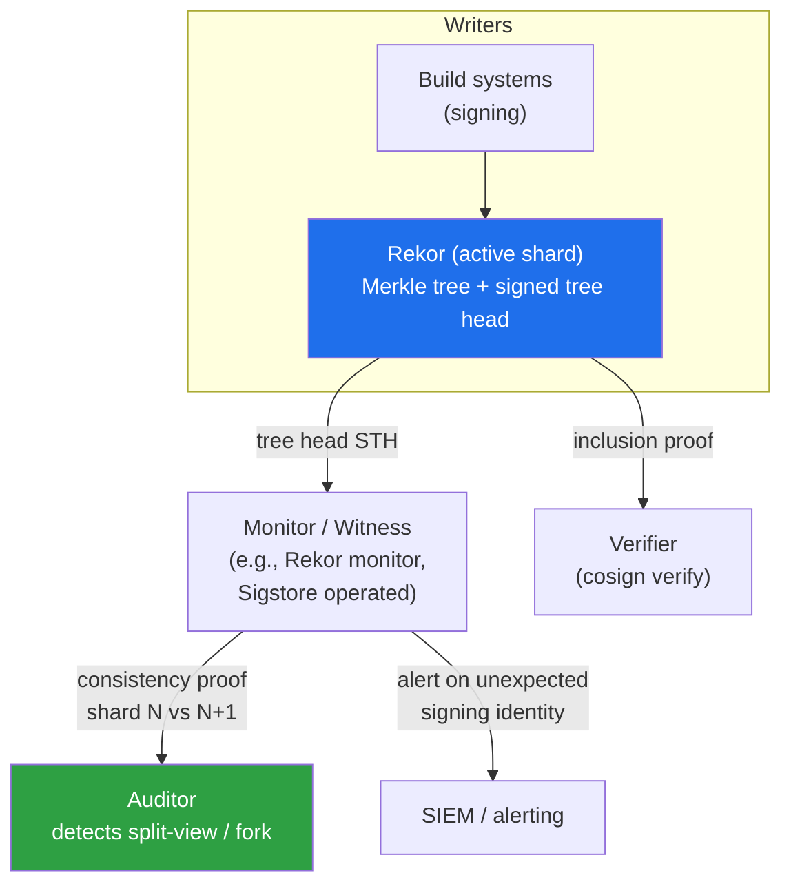
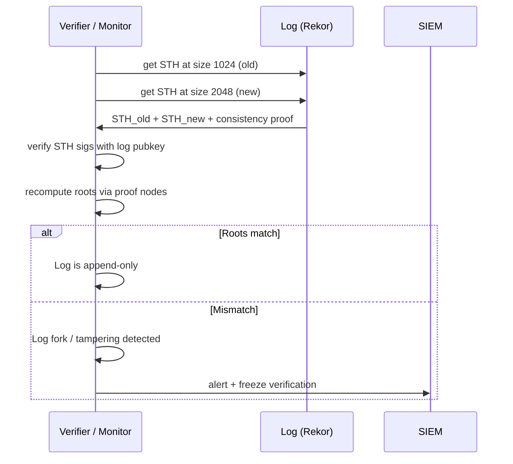
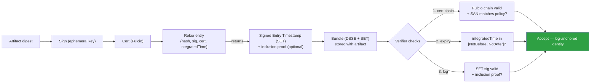

# Chapter 5 — Transparency Logs: Merkle Trees, Rekor, and CT Lessons

*What this chapter covers.* A signature answers *who signed*. It does not answer *who else has
been signing, and what*. Chapter 2 showed the consequence: a stolen key or a compromised CA can
sign malware, and with classic signing **nobody outside the signer can see it happen**. The
signature is valid; the abuse is invisible. Chapter 3 introduced Sigstore's answer — short-lived
certificates plus a **transparency log** — and deferred the log's internals to here. This
chapter is that deferred deep dive. Transparency logs are the mechanism that converts "trust me"
into "verify publicly": they make issuance of certificates, signatures, and attestations a
matter of **public record** that is **tamper-evident** and **append-only**, so misuse becomes
*detectable*. The slogan to carry through the chapter: *you can still be attacked, but you cannot
be attacked silently.* We build the cryptographic spine first — RFC 6962 Merkle trees, inclusion
proofs, consistency proofs, and signed tree heads, worked through concrete small examples —
because everything else is an application of that spine. Then we study the proven precedent
(**Certificate Transparency** and the Web PKI), the Sigstore application (**Rekor**), the two
other major deployments (**Go's checksum database** and **binary transparency**), and finally the
honest weaknesses: transparency has no value without **monitoring**, and a log means nothing if
different people can be shown different versions of it — the **split-view** problem.
_All tool versions, spec references, and defaults verified as of early 2026._

Learning goals — after this chapter you should be able to:

- State precisely what a transparency log guarantees — **append-only**, **tamper-evident**,
  **publicly auditable**, **globally consistent** — and what each guarantee does and does *not*
  buy you.
- Construct an **RFC 6962 Merkle tree** by hand, including the `0x00`/`0x01` **domain
  separation** and why it exists, and compute an **inclusion proof** and a **consistency proof**
  on a concrete tree.
- Explain why the append-only property is **cryptographic**, not a matter of policy — how a
  consistency proof makes history-rewriting *detectable by anyone*.
- Describe **Certificate Transparency**'s real mechanics — logs, **SCTs**, **monitors**,
  **auditors** — the misissuance disasters that motivated it, and its limits.
- Describe what **Rekor** logs, how the **Signed Entry Timestamp** and inclusion proof enable
  **verify-after-expiry**, and how to query Rekor to *detect misuse* of your signing identities.
- Explain the **Go checksum database** and **binary/key transparency**, and why the Go design is
  unusually strong.
- Reason about the operational realities — the **monitoring requirement**, the
  **split-view/gossip** problem and **witnesses**, availability, and the **privacy** cost of
  public logging.

## The problem: silent signing

Recall the failure class from Chapter 2. Classic code signing roots trust in a **long-lived
private key**. When that key is stolen (Stuxnet's Realtek and JMicron driver certificates; the
2022 NVIDIA leak) or a certificate authority is subverted, the attacker produces signatures that
are, by every cryptographic test a verifier can run, **valid**. Verification checks a chain to a
trusted root and a signature over a digest; a stolen-but-not-yet-revoked key passes both. The
defender's only recourse is **revocation**, and revocation is both slow and reactive: it can only
act on abuse someone has already discovered.

The deeper problem is *discovery*. With classic signing, issuance is a **private act**: a CA that
misissues a `*.google.com` certificate, or an attacker who signs a backdoored driver with a
stolen key, leaves **no public trace**. The victim learns of it only if the malicious artifact
surfaces and someone inspects it. This is the **silent-signing problem** — the signing
infrastructure can be abused for weeks or months with no external signal.

Transparency logs attack this problem directly. They do **not** prevent a key from being stolen
or a CA from being compromised — that is a different axis, covered by hardware protection and
short-lived credentials (Chapters 2, 9). What they change is **observability**. If every
certificate a CA issues, and every signing event a system produces, must be **published to a
public, append-only, tamper-evident log** before it is honored, then abuse leaves an indelible,
globally visible record. A domain owner watching the CT logs *sees* the fraudulent certificate; a
platform team watching Rekor *sees* their CI identity sign an artifact they never built. The
attack is no longer silent — the difference between a breach discovered in hours and one
discovered, if ever, in months.

### The four guarantees

A transparency log makes four distinct promises. Keep them separate, because different mechanisms
enforce each and different attacks defeat each.

- **Append-only.** Entries are only ever added at the end. Nothing already logged is removed or
  altered. Enforced *cryptographically* by consistency proofs (below), not by the operator's good
  behavior.
- **Tamper-evident.** Any modification to any past entry changes the tree root, so it is
  *detectable*. Note the word: tamper-*evident*, not tamper-*proof*. The log does not stop
  tampering; it makes tampering impossible to hide from anyone checking.
- **Publicly auditable.** Anyone — not a privileged auditor — can fetch entries and proofs and
  verify inclusion and consistency for themselves, using only public data and a trusted root.
- **Globally consistent.** Everyone sees the *same* log. This is the hardest guarantee and the
  one most often glossed over: a log that shows one entry set to you and a different one to me has
  defeated the entire point. This is the **split-view problem**, and it is not solved by the
  Merkle math alone — it needs gossip and witnesses (final section).

The first three are properties of a single log's internal structure and are enforced by the
cryptography we build next. The fourth is a *distributed-systems* property about many observers
agreeing, and it is where transparency logs are most subtle.

## Merkle tree mechanics

This is the technical spine of the chapter. Chapter 1 sketched Merkle trees; here we pin down the
exact RFC 6962 construction, because CT, Rekor, and the Go checksum database all use it (or a
close variant), and because getting the details right is what separates "I've heard of inclusion
proofs" from "I can verify one."

### RFC 6962 tree construction and domain separation

RFC 6962 (Certificate Transparency, June 2013) defines the **Merkle Tree Hash (MTH)** of a list
of *n* data entries `D[n] = d(0), d(1), …, d(n-1)` recursively, using a hash function that in
practice is SHA-256. Two rules do all the work:

- **Leaf hashing (a one-entry list).** For a single entry `d(i)`, the hash is
  `MTH = HASH(0x00 || d(i))`. The single byte `0x00` is prepended before hashing.
- **Internal nodes (n > 1 entries).** Let `k` be the **largest power of two strictly less than
  n**. Split the list into a left part `D[0:k]` (the first `k` entries) and a right part
  `D[k:n]`. Then `MTH(D[n]) = HASH(0x01 || MTH(D[0:k]) || MTH(D[k:n]))`.

Two consequences of that `k` rule are worth internalizing. First, the **left subtree is always a
complete (perfect) binary tree** of `k` leaves; the right subtree holds the remainder. The tree
is not padded to a power of two — a log of 6 entries is a real 6-leaf tree, left-heavy. Second,
because leaves are hashed with `0x00` and internal nodes with `0x01`, a leaf hash and an internal
node hash live in **disjoint domains**.

That domain separation is not decoration; it is a **second-preimage defense**. Without the
prefixes, an attacker could take an internal node — which is itself just `HASH(left || right)`,
i.e. the hash of two concatenated child hashes — and present it as if it were a *leaf* whose data
happened to be `left || right`. The verifier, unable to tell a leaf from a node, could be tricked
into accepting a proof for an entry that was never actually logged, or into a tree that has two
valid interpretations. Prefixing every leaf with `0x00` and every node with `0x01` makes the two
hash inputs structurally impossible to confuse: no leaf hash can ever equal a node hash, so no
node can masquerade as a leaf. This is the single most commonly omitted detail in hand-rolled
Merkle implementations, and omitting it is a real vulnerability.

The **root hash** — the MTH of the whole list — is a single 32-byte value that commits to every
entry and to their exact order. Change any entry, insert one, reorder two, and the root changes.

### Inclusion proof: proof of presence

An **inclusion proof** (RFC 6962 calls it an *audit path*) demonstrates that a specific entry is
a leaf under a given root, using only the **sibling hashes** along the path from the leaf to the
root — about **log₂(n)** hashes for `n` entries. It reveals nothing about the other entries.

Work a concrete example: a perfect tree of **8 entries**, `d0 … d7`, and prove that `d3` is
present. Write `a_i = HASH(0x00 || d_i)` for the leaf hashes, and build up:

- Level 0 (leaves): `a0, a1, a2, a3, a4, a5, a6, a7`
- Level 1: `b01 = HASH(0x01 || a0 || a1)`, `b23 = HASH(0x01 || a2 || a3)`, `b45`, `b67`
- Level 2: `c0123 = HASH(0x01 || b01 || b23)`, `c4567 = HASH(0x01 || b45 || b67)`
- Root: `r = HASH(0x01 || c0123 || c4567)`



The proof for `d3` is exactly **three** hashes — the siblings encountered climbing from `a3` to
the root:

1. `a2` — the sibling of `a3` (on the **left**, since `d3` is at an odd index).
2. `b01` — the sibling of `b23` (on the left).
3. `c4567` — the sibling of `c0123` (on the **right**).

The verifier, holding the entry `d3` and a **trusted root** `r`, recomputes:

```text
a3    = HASH(0x00 || d3)          # verifier hashes the entry itself
b23   = HASH(0x01 || a2 || a3)    # a2 from proof, on the left
c0123 = HASH(0x01 || b01 || b23)  # b01 from proof, on the left
r'    = HASH(0x01 || c0123 || c4567)   # c4567 from proof, on the right
```

and checks `r' == r`. Match means `d3` is in the tree committed to by `r`, in that position, and
the log could not have forged the proof without breaking the hash's collision resistance. Note
the **left/right orientation matters**: the verifier must know at each step whether the supplied
sibling goes on the left or right of the running value, which is determined by the leaf's index
and the tree size. Get the order wrong and you compute a different (wrong) root.

Three hashes prove membership among eight. The cost is logarithmic: a log of **one billion**
entries needs only ~30 hashes for an inclusion proof. This is precisely what makes transparency
*practical at scale* — a verifier confirms "my signature **is** recorded" by fetching ~30 hashes
and doing ~30 SHA-256 computations, never the whole log.

### Consistency proof: proof of append-only

Inclusion proves *presence*. **Consistency** proves *append-only-ness*: that a later version of
the log is a strict superset of an earlier one, with the earlier entries **unchanged** and only
new entries appended. This is the guarantee that makes the log tamper-evident against **the log
operator itself**.

Given the root `R_m` at an earlier size `m` and the root `R_n` at a later size `n > m`, a
**consistency proof** is a set of ~log(n) node hashes that lets a verifier confirm two things at
once from the *same* nodes: (a) those nodes recompute the old root `R_m`, and (b) those same
nodes, plus the new material, recompute the new root `R_n`. Because the identical subtree hashes
feed both computations, the old tree must sit inside the new one unchanged.

Concrete example: the log grows from **m = 6** to **n = 8**. At size 6 the tree covers `d0 … d5`.
By the `k` rule, the largest power of two below 6 is 4, so the size-6 root is built from the
complete left subtree `c0123` (over `d0…d3`) and a right subtree `b45` (over `d4, d5`):

```text
R6 = HASH(0x01 || c0123 || b45)        # b45 = HASH(0x01 || a4 || a5)
```

At size 8 the tree is the perfect tree from before, with `R8 = r = HASH(0x01 || c0123 || c4567)`
and `c4567 = HASH(0x01 || b45 || b67)`. The RFC 6962 consistency proof from 6 to 8 is the three
nodes **`[b45, b67, c0123]`**.



The verifier does two reconstructions from the proof nodes:

- **Old root:** `HASH(0x01 || c0123 || b45)` and checks it equals the trusted `R6`. This proves
  the log has not altered anything in the first six entries.
- **New root:** `HASH(0x01 || c0123 || HASH(0x01 || b45 || b67))` — i.e.
  `HASH(0x01 || c0123 || c4567)` — and checks it equals `R8`.

The load-bearing fact is that the **same** `c0123` and the **same** `b45` appear in both
reconstructions. The verifier does not take the log's word that "the old tree is a prefix"; it
proves it, because any change to entries `d0…d5` would have changed `c0123` or `b45`, which would
break *either* the old-root check *or* the new-root check. An operator who tried to rewrite entry
`d2` (say, to swap a logged certificate for a different one) cannot produce a size-8 tree that is
consistent with the size-6 root it already published — every client that later requests a
6→8 consistency proof would get a failure. **History-rewriting is not forbidden by policy; it is
made mathematically detectable by anyone.** That is what "append-only" means in a transparency
log.

### Signed tree head / checkpoint

The Merkle root is only meaningful if clients agree on *which* root is authoritative at a given
time. That is the job of the **Signed Tree Head (STH)** — RFC 6962's term — or **checkpoint**, the
name used by the modern note-based format (Rekor and the Go checksum database). Periodically (in
CT, at most every **Maximum Merge Delay** — typically 24 hours; in Rekor, continuously) the log
computes its current root and **signs a small structure** committing to:

- the **tree size** (number of entries, `n`),
- the **root hash** at that size, and
- a **timestamp**.

In RFC 6962 the signed structure is `{ version, signature_type, timestamp, tree_size,
sha256_root_hash }`, signed with the log's private key. The modern **checkpoint** ("note")
serialization is human-readable and looks like:

```text
rekor.sigstore.dev - 1193050959916656506
30707170
oS4TL5UWNoZbLTa1Rgmxj2Rn+DdOJUS5Fk9J0KtRTgU=

— rekor.sigstore.dev wNI9ajBFAiEA…base64-signature…
```

The first line is the log's **origin** (identity), the second the tree size, the third the
base64 root hash; the `—` line carries the signature. This checkpoint is the log's **signed
commitment** — "at this moment, I attest that my tree has exactly `n` entries and this root." A
verifier trusts a checkpoint if the signature verifies against the log's public key (distributed
out of band, in Sigstore via the TUF **trust root**; see Book 5, Chapter 7). Every inclusion and
consistency proof is verified *relative to a checkpoint*: the proof shows an entry belongs to, or
one tree extends to, the root that this signed checkpoint pins down.

The checkpoint is also the unit of the **global-consistency** problem: two clients who hold two
*different* checkpoints for the *same* tree size, with *different* root hashes, have caught the
log in a fork. We return to that.

### Inclusion vs consistency at a glance

| Property | Inclusion proof (audit path) | Consistency proof |
|---|---|---|
| Question answered | "Is **this entry** in the tree with root R?" | "Is the size-`m` tree an **unmodified prefix** of the size-`n` tree?" |
| Inputs | The entry, its index, tree size, a trusted root R | Old size `m` + root `R_m`, new size `n` + root `R_n` |
| Proof contents | ~log₂(n) sibling hashes leaf→root | ~log(n) subtree node hashes spanning the m/n boundary |
| Verifier checks | Recompute root from entry + siblings == R | Recompute **both** `R_m` and `R_n` from shared nodes |
| Guarantees | **Presence** (tamper-evidence of one entry) | **Append-only** (tamper-evidence of all history) |
| Who runs it | Anyone proving their own entry is logged (monitors, signers) | **Auditors**, and any client tracking the log over time |

Both are needed. Inclusion without consistency lets an operator rewrite the past between the time
you saw an inclusion proof and now. Consistency without inclusion tells you the log is
append-only but not that *your* entry is in it. Real clients — and real security — use both.

## Certificate Transparency: the proven precedent

Transparency logs are not a Sigstore invention. They were designed, deployed, and battle-tested
for the Web PKI a decade earlier, and Sigstore borrowed the model wholesale. Understanding CT is
the fastest way to understand what a transparency log *is for*.

### Why CT exists: the misissuance disasters

The Web PKI has a structural weakness: **any** trusted CA can issue a certificate for **any**
domain. Your browser trusts on the order of a hundred root CAs (and the intermediates they
delegate to); a certificate for `mail.yourcompany.com` from any one of them is accepted. So the
security of *your* domain depends on the security of *every* CA in the store — a weakest-link
system.

That weakness became catastrophe in **2011**. The Dutch CA **DigiNotar** was compromised;
attackers issued fraudulent certificates for high-value domains, most infamously a wildcard for
`*.google.com`, and used it to **man-in-the-middle an estimated ~300,000 Iranian Gmail users**.
DigiNotar had *no idea* which certificates the attacker had issued — the issuance was silent, and
the CA could not even enumerate the damage. DigiNotar was removed from browser trust stores and
went bankrupt within weeks. The same year, a reseller for **Comodo** was breached and issued
fraudulent certificates for Google, Yahoo, Skype, and others. The lesson was stark: the Web PKI
had **no mechanism to detect misissuance**, whether from a breached CA or a rogue insider.

**Certificate Transparency** (Google — Ben Laurie, Adam Langley, Emilia Kasper — standardized as
**RFC 6962**) is the response. Its thesis: a CA cannot be prevented from misissuing, but it can be
*required to publish* every certificate it issues to public append-only logs, so that misissuance
is **detectable**. Chrome began requiring CT for Extended Validation certificates and then, from
**April 30, 2018**, for **all** newly issued publicly trusted certificates. A certificate that is
not logged is not trusted.

### The mechanics: logs, SCTs, monitors, auditors

CT has four roles, and each maps to a piece of machinery you should be able to name.

- **Logs.** Independently operated append-only Merkle logs (RFC 6962 construction) run by Google,
  Cloudflare, Let's Encrypt (Sectigo, DigiCert, and others). CAs submit every certificate (in
  practice a **precertificate**, a poison-extended variant submitted before final issuance) to
  several logs.
- **SCTs (Signed Certificate Timestamps).** When a CA submits a (pre)certificate, the log returns
  an **SCT**: a signed promise, `{ timestamp, log_id, signature }`, that the log **will**
  incorporate this certificate into its tree within the **Maximum Merge Delay** (MMD, usually
  24h). Crucially, the SCT is a **promise, not a proof of inclusion** — at SCT-issue time the
  entry may not yet be merged into the tree. Browsers require a certificate to carry **SCTs from
  multiple independent logs**, delivered by one of three channels: embedded as an **X.509
  extension** in the certificate (by far the most common), via a **TLS extension** during the
  handshake, or via **OCSP stapling**.
- **Monitors.** Parties who **download the logs and watch for entries of interest** — most
  importantly, certificates for **their own domains**. A monitor for `yourcompany.com` fetches
  every new entry and flags any certificate naming your domains that your team did not request.
  This is the role that actually *catches misissuance*. Services like Cloudflare's and Facebook's
  monitors, plus commercial and DIY tooling querying `crt.sh`, fill it.
- **Auditors.** Parties who verify the logs **behave correctly**: that they are genuinely
  append-only (consistency proofs check out), and that certificates promised by SCTs actually
  **appear** in the tree within the MMD (inclusion proofs check out). Lightweight auditing is
  built into browsers; standalone auditors and the log operators' peers do the heavier checking.



The **monitor and auditor roles are both essential, and they answer different questions**. The
auditor asks "is the log honest and append-only?" The monitor asks "did anything *bad for me* get
logged?" A log that is perfectly append-only but that **nobody monitors** provides transparency
*in principle* and none *in practice*: the misissued certificate is sitting there, cryptographically
undeniable, and no one is looking. This is the single most important operational lesson from CT,
and it transfers directly to Rekor: **transparency is a capability, not an outcome — it delivers
security only when someone actually watches.**

### CT's success and its limits

CT worked. Misissuance today is *detectable and routinely detected*: Symantec's large-scale
misissuance was surfaced through CT-based analysis, and domain owners now catch unauthorized
certificates within hours. It changed CA behavior, because every issuance is now public.

But CT's limits are instructive too. CT proves a certificate **exists and was logged**; it says
nothing about whether the certificate **should** have been issued — that judgment is the
monitor's, and it requires the domain owner to actually run or subscribe to monitoring. The SCT
is a *promise*, so a colluding or buggy log could issue an SCT and never merge the entry;
catching that requires auditors to check SCT-to-inclusion, which browsers historically did only
partially (fetching inclusion proofs raises privacy questions — the browser reveals which sites
you visit to the log). And CT does nothing about the **split-view** problem on its own: a log
could theoretically present different trees to different auditors. These gaps drove the gossip and
witness work discussed at the end of the chapter.

## Rekor: Sigstore's transparency log

Rekor is CT's model applied to **software signing events** rather than TLS certificates. Chapter
3 introduced it as one of Sigstore's three components; here we can be precise about what it stores
and why it matters.

### What Rekor logs

Rekor is an append-only RFC 6962-style Merkle log (built on Google's **Trillian**, with a newer
tile-based backend, **Rekor v2/tessera**, emerging) of **signing events**. Each entry is a typed,
canonicalized record. The common **entry types** include:

- **`hashedrekord`** — the default: the **hash of the signed artifact**, the **signature**, and
  the **public key or certificate** used. For keyless Sigstore signing, that certificate is the
  short-lived **Fulcio** certificate carrying the **OIDC identity** in its subject-alternative
  name (Chapter 3, 4).
- **`intoto`** and **`dsse`** — in-toto attestations / DSSE envelopes (Book 5, Chapter 6): the
  signed *statement* about an artifact (e.g., a SLSA provenance predicate), so provenance itself
  is transparency-logged.
- Others: `rekord`, `alpine`, `helm`, `jar`, `cose`, `rfc3161`, `tuf` — canonicalizations for
  specific ecosystems and formats.

Note what Rekor does **not** store: it does not store your artifact. It stores the artifact's
**digest** plus the signature material. The log is a record of *"identity X signed something with
digest D at time T"*, not a copy of the something.

When you submit an entry, Rekor returns a `LogEntry` whose `verification` block carries two
things that matter:

- an **inclusion proof** (the ~log(n) hashes tying the entry to a signed **checkpoint**), and
- a **Signed Entry Timestamp (SET)** — Rekor's signature over a canonical subset of the entry
  (log index, log ID, `integratedTime`, and the entry body). The SET is the direct analog of CT's
  SCT: an immediately-returned, signed attestation that *this entry was integrated at this
  timestamp*. Unlike CT's SCT, the SET is issued at merge time and is backed by the inclusion
  proof, so it functions as a **trusted timestamp** you can carry with the signature.

### The killer feature: verify-after-expiry

Here is where Rekor earns its place in the architecture. Fulcio certificates live for **about ten
minutes** (Chapter 3). A naïve verifier checking a certificate that expired months ago would
reject the signature — the certificate is long dead. Rekor's timestamp resolves the paradox.



The reasoning: the verifier trusts Rekor's SET as a **timestamping authority**. The SET says the
entry — including the certificate and signature — existed in the log at `integratedTime = t0+2m`.
That time falls **inside** the certificate's validity window (`t0 .. t0+10m`). Therefore the
signature was **made while the certificate was valid**, even though the certificate is now expired.
No long-lived key exists anywhere in this system: the signing key evaporated after ~two minutes,
the certificate died after ten, and the durable trust anchors are the *Fulcio root* and the
*Rekor key* (both managed via TUF; Chapter 7). This is the precise mechanism by which "short-lived
certificate + transparency log" replaces "long-lived signing key" — and it is impossible without
the log's trusted timestamp.

### Rekor as an auditability tool

The transparency guarantee is only realized if you **query** the log. Rekor exposes a REST API and
`rekor-cli`. You can search by artifact digest, by public key, or by **identity**:

```bash
# Find every log entry for a signing identity (e.g. your CI workflow)
rekor-cli search --email builder@ci.yourcompany.com

# Fetch and verify a specific entry, including its inclusion proof
rekor-cli get --uuid <entry-uuid>

# By artifact hash: has THIS digest ever been signed, and by whom?
rekor-cli search --sha sha256:<digest>
```

Newer tooling (`rekor-monitor`, and identity-based verification in `cosign verify`
`--certificate-identity` / `--certificate-oidc-issuer`) makes the monitoring pattern concrete:
**watch Rekor for your own signing identities**. If your GitHub Actions workflow identity
`https://github.com/yourorg/yourrepo/.github/workflows/release.yml@refs/tags/*` appears in Rekor
signing an artifact your team never released, you have **detected a compromise of your CI
identity** — exactly the "not silent" property, applied to your own supply chain. Without this
monitoring, Rekor is a beautifully-engineered log that provides you nothing; with it, Rekor is a
fleet-wide **misuse detector** (Book 8 develops the detection story).

## Other transparency applications

The same Merkle-log spine appears in several other systems. Two are worth real attention; a third
deserves a mention.

### Go's checksum database (sum.golang.org)

Go's module checksum database is, in many engineers' judgment, the **best-executed transparency
log in production**, and it is worth studying as a design (Book 2, Chapter 1 covers the
dependency-management side).

`go.sum` records a cryptographic hash for every module version your build depends on, in the form
`module version h1:base64hash=` plus a second line for the module's `go.mod`. The question is: how
do you trust the *first* time you fetch a module and populate `go.sum`? Go's answer is a
**transparency log of module hashes** operated at `sum.golang.org`. When the `go` command fetches
a new module version, it computes the hash **and** consults the checksum database, which returns
the recorded hash together with an **inclusion proof** against a signed tree head. The `go` tool
caches the log's tree state (under `$GOPATH/pkg/mod/cache/download/sumdb`) and, on every
subsequent interaction, requires a **consistency proof** from the previously seen size to the new
one — so the tool *itself* audits the log's append-only property, automatically, on ordinary
`go build`s.

What makes the Go design unusually strong:

- **Verification is on by default and built into the standard toolchain.** There is no optional
  monitor to deploy; the `go` command enforces it (`GOSUMDB=sum.golang.org` by default;
  `GONOSUMCHECK`/`GONOSUMDB`/`GOPRIVATE` opt *out* for private modules). Contrast CT, where
  monitoring is a separate thing you must set up.
- **The client is a real auditor.** Every developer's `go` command checks consistency, so the log
  cannot rewrite history without some client's build failing. The auditing burden is distributed
  across the entire Go ecosystem's machines.
- **A tiled, efficient log format** (`golang.org/x/mod/sumdb/tlog`) makes proofs cheap enough to
  fetch on routine builds — the design that later influenced Sigstore's tile-based logs.
- The record is **content-addressed and append-only**: once `example.com/foo v1.2.3` maps to a
  hash in the log, that mapping is permanent and public, so a maintainer cannot silently swap the
  bits behind a published version without it being globally visible.

Go pairs this with `proxy.golang.org` (immutable module caching) so the module bits themselves are
served consistently. The result: the *default* Go experience gives you tamper-evident, transparency-
backed dependency integrity with no configuration — the gold standard for "transparency that
actually delivers because monitoring is not optional."

### Binary transparency

**Binary transparency** applies the CT model to **released binaries**: require every distributed
build of a product to be logged to a public append-only log, so consumers and monitors can detect
**unexpected releases**. Mozilla implemented a form of it for Firefox (logging the binaries served
by its update system); the general concept has been prototyped by several projects, and it
underlies the "transparent releases" direction of tools like `cosign` + Rekor for release
artifacts.

The threat it addresses is **targeted delivery**. Consider a supply-chain attacker who can serve
a **different, backdoored binary to a specific set of victims** while everyone else gets the clean
build — the most dangerous form of the SolarWinds-class attack, where malicious payloads are
delivered selectively to evade broad detection. With binary transparency, a client refuses to run
a binary unless it appears in the public log, and monitors watch the log for builds the vendor
never announced. A build served to only a few victims must *either* be absent from the log (so
those clients reject it) *or* present in the log (so monitors see it and raise the alarm).
Selective, silent delivery becomes impossible: every binary that runs is a public binary. It does
not stop the vendor from *building* a backdoor — that is provenance and build-integrity's job
(Book 4) — but it removes the attacker's ability to hit a narrow target invisibly.

### Key transparency (briefly)

**Key transparency (KT)** applies transparency logs to the **identity → public key** mapping used
by end-to-end encrypted messaging. The problem: your provider tells you your contact's public key,
and a malicious or coerced provider could hand you a *substitute* key to man-in-the-middle you
silently. KT publishes the key directory to a transparency log so clients can verify their own key
is correctly published and monitor for unexpected changes. Because looking a key up by *identity*
efficiently needs more than an ordered log, KT typically combines a Merkle **log** with a
**verifiable map / prefix tree** keyed by identity. Google's Key Transparency, Keybase, WhatsApp,
and Apple's iMessage Contact Key Verification are production examples. The through-line is
identical to CT and Rekor: **make issuance public so substitution cannot be silent.**

### The transparency-system landscape

| System | What is logged | Who monitors (and how) | Enforcement |
|---|---|---|---|
| **Certificate Transparency** (RFC 6962) | Every publicly-trusted TLS certificate (as precerts) | Domain owners (via `crt.sh`, commercial/DIY monitors); auditors check consistency | Browsers require valid **SCTs**; unlogged cert = untrusted |
| **Rekor** (Sigstore) | Signing events: artifact digest + signature + Fulcio cert / OIDC identity; in-toto & DSSE attestations | You, for **your** identities (`rekor-cli`, `rekor-monitor`, `cosign verify --certificate-identity`) | `cosign verify` requires a Rekor inclusion proof + SET |
| **Go checksum DB** (sum.golang.org) | `module@version → hash` records | The **`go` command itself**, on every build (consistency proofs), by default | Hash mismatch or missing entry **fails the build** |
| **Binary transparency** | Released/served binaries | Consumers + release monitors watching for unannounced builds | Client refuses to run unlogged binaries (where deployed) |
| **Key transparency** | `identity → public key` directory (log + verifiable map) | The key owner (self-audit) + monitors for unexpected key changes | Client flags/rejects keys not consistently published |

The pattern is one design applied five ways: an append-only Merkle log of *issuance events*,
inclusion proofs for "mine is in there," consistency proofs for "history is intact," and
**monitoring** to turn public record into actual detection.

## Weaknesses and operational realities

Transparency logs are powerful, but they are not magic, and treating them as magic is how teams
end up with a false sense of security. Four honest limitations.

### Transparency is worthless without monitoring

This bears repeating as a standalone point because it is the failure mode most likely to bite you.
A transparency log makes misuse **detectable**; it does not make it **detected**. If you log every
signing event to Rekor but no one ever queries Rekor for your identities, then when your CI
identity is compromised and used to sign malware, the evidence sits in a public log that nobody on
your team is reading. You have paid the full cost of transparency (see privacy, below) and
collected none of the benefit.

The operational requirement is explicit: **run a monitor** for your signing identities. For
Sigstore, that means `rekor-monitor` (or equivalent) watching for your CI workflow identities,
your team's signing identities, and any Fulcio-issued identity mapping to your organization, with
alerts wired into your detection pipeline (Book 8). For dependencies, Go's toolchain monitors for
you by default — which is precisely why the Go design is held up as the model. The absence of a
monitor is the difference between transparency-in-principle and transparency-in-practice, and it
is entirely on you.

### The split-view (fork) problem and gossip

The four guarantees included **global consistency**, and it is the one the Merkle math does *not*
deliver on its own. Consistency proofs guarantee that a log is append-only **within a single
view** — but they cannot, by themselves, stop a malicious or compromised log from maintaining
**two views**: presenting checkpoint `A` (and a self-consistent history) to a victim, and
checkpoint `B` (a different self-consistent history) to everyone else. This is the **split-view**
or **fork** attack. Each view is internally consistent; the victim's inclusion and consistency
proofs all verify; and yet the victim is being shown a fabricated reality — a certificate or
signing event that "the log" claims to record for the victim but that no one else can see.

The defense is not more Merkle math; it is **distributed agreement about which checkpoint is
canonical**:

- **Gossip.** Clients, monitors, and auditors **exchange the checkpoints they have seen**. If two
  parties hold two checkpoints for the **same tree size with different roots**, or two checkpoints
  that cannot be reconciled by a consistency proof, the fork is exposed. Gossip converts a
  split-view from an invisible attack into a detectable inconsistency the moment two victims
  compare notes.
- **Witnesses (co-signing).** A stronger, proactive defense: a set of independent **witnesses**
  each track the log and **co-sign** a checkpoint only after verifying it is consistent with the
  last checkpoint they signed. A verifier then requires a checkpoint carrying signatures from a
  quorum of witnesses. To mount a split-view, the log would now have to **collude with a quorum of
  independent witnesses** to get them to co-sign two forking histories — a far higher bar than
  compromising the log alone. Sigstore and the Go/`transparency-dev` community have been building
  exactly this **witness network** (the checkpoint "note" format carries multiple signatures for
  precisely this reason). The idea generalizes: consistency proofs make a single log honest;
  witnesses make the *set of observers* agree on one log.

For a distributed-systems engineer this should feel familiar: it is a consensus problem dressed in
cryptography. The log alone is an append-only data structure; witnesses and gossip are the
replication-and-agreement layer that keeps all replicas (all observers' views) converged.

### Availability, scale, and the log as tier-1 infrastructure

If verification **requires** an inclusion proof from the log — as `cosign verify` and the `go`
command do — then the log is on the **critical path of deploys and builds**. That has hard
operational implications:

- **The log is tier-1 infrastructure.** If Rekor (or your self-hosted log) is down and your
  admission policy hard-requires a fresh inclusion proof, deploys stall. Verifiers therefore
  cache checkpoints and proofs, and policies must decide their behavior on log unavailability
  (fail-closed vs. fail-open — a real trade-off, discussed at admission in Book 6).
- **Scale is a genuine engineering problem.** The public Rekor instance has grown to tens of
  millions of entries and has repeatedly pushed the limits of its Trillian/MySQL backend, driving
  the move to a **tile-based, more horizontally scalable design** (the same tlog/tile approach Go
  pioneered). A log that everyone must write to on every sign and read from on every verify is a
  high-throughput, append-only, globally-read datastore — exactly the sort of system backend
  engineers respect and know is hard to run well.

### Privacy: public logs expose what you sign

Transparency is, by construction, **public**. Every entry in Rekor is world-readable: the
artifact digests you sign, the identities that signed them, the timestamps, and — for in-toto/DSSE
entries — potentially the **attestation contents** (build system, source repo, workflow paths).
For open-source software this is a feature. For an enterprise, it can be a **metadata leak**: the
public Rekor log reveals your internal artifact naming, your build cadence, the existence of
products before announcement, and the structure of your CI. You may not want the world to know
that `internal-fraud-detection-service` was built 40 times last Tuesday.

This is a primary motivation for **self-hosting Sigstore** (private Fulcio + private Rekor;
Chapter 9): you keep the transparency guarantees — append-only, tamper-evident, monitorable — but
the log is **internal**, so metadata stays inside your trust boundary and you control availability
and retention. The trade-off is that you now operate a tier-1 log and its monitoring apparatus
yourself. For most large organizations running private CI anyway this is the right call; the point
is that "public" is not a free property, and the privacy cost is real.

## Distributed-systems lens

A transparency log is, stripped of the security framing, a **distributed data structure** — and a
particularly elegant one, which is why it rewards a backend engineer's attention.

- **It is a verifiable, replicated, tamper-evident append-only log.** The Merkle tree is the
  authenticated data structure; inclusion and consistency proofs are `O(log n)` membership and
  prefix queries with cryptographic integrity; the checkpoint is a signed vector-clock-like
  commitment to a specific state. If you have built event-sourced systems or append-only ledgers,
  this is that, with the added property that **clients can verify the log's integrity without
  trusting the operator**.
- **Consistency proofs are the local invariant; witnesses/gossip are the global consensus.** The
  math makes any *single* log honest with itself; the split-view problem is the classic
  distributed-systems difficulty of getting many observers to agree on one history, and the
  solution — a quorum of independent witnesses co-signing checkpoints — is recognizably a
  consensus/quorum design. Do not mistake the cryptography for the whole system; the interesting
  hardness is in the agreement layer.
- **Monitors are watchers; at fleet scale, watch your own log.** Just as you run alerting on your
  own infra, run **Rekor (or self-hosted log) monitoring for all your signing identities** — every
  CI workflow, every release identity, every service that signs. This is how transparency becomes
  *detection* (Book 8): an unexpected entry for one of your identities is a high-signal compromise
  alert. A log you do not monitor is telemetry you are not collecting.
- **The log lets you trust artifacts across untrusted intermediaries.** Content-addressing
  (digests) plus a transparency log means a **registry, mirror, CDN, or proxy in the middle need
  not be trusted**: the consumer verifies the digest against a publicly-logged signing event, and
  a tampering intermediary is caught because it cannot forge an inclusion proof against a
  witnessed checkpoint. This is the property that makes global software distribution over
  untrusted infrastructure safe — the same reason Go can serve modules through `proxy.golang.org`
  without you trusting the proxy.
- **Treat the log as tier-1.** If it gates deploys, it has the availability and scale requirements
  of any critical dependency: cache aggressively, decide your fail-open/fail-closed posture
  deliberately, capacity-plan the write and read paths, and — if privacy or availability demands
  it — **self-host** (Chapter 9). The log is not a nice-to-have side service; when verification
  depends on it, it is production infrastructure.

### Rekor shard and monitor architecture



### Consistency proof verification



### Log-backed verification end-to-end



## Key takeaways

- **Transparency logs convert silent abuse into detectable abuse.** They do not stop a stolen key
  or a compromised CA from signing; they make every issuance a **public, append-only,
  tamper-evident record**, so misuse leaves an indelible trace. *You can still be attacked; you
  cannot be attacked silently* — but only if someone is watching.
- **The RFC 6962 Merkle construction is the spine.** Leaves hashed with `0x00`, internal nodes
  with `0x01` (domain separation — a real second-preimage defense, not decoration); the tree is
  left-complete, not power-of-two-padded. **Inclusion proofs** (~log n sibling hashes) prove
  *presence*; **consistency proofs** (~log n shared subtree hashes) prove *append-only* by
  recomputing both old and new roots from the same nodes. Append-only is **cryptographic**, not
  policy: rewriting history breaks a consistency proof that anyone can check.
- **The signed tree head / checkpoint** is the log's signed commitment to `(size, root,
  timestamp)`; every proof is verified relative to it, and two forking checkpoints at the same
  size are how you catch a lying log.
- **Certificate Transparency is the proven precedent.** Born from DigiNotar/Comodo (2011), RFC
  6962 requires CAs to log all certs; browsers require **SCTs** (a *promise*, not proof of
  inclusion); **monitors** watch for misissuance of *your* domains; **auditors** check the log is
  honest. Both roles are needed — a log nobody monitors is transparent in principle only.
- **Rekor is CT for signing events.** It logs the digest + signature + Fulcio cert/OIDC identity
  (and in-toto/DSSE attestations), returns an **inclusion proof + Signed Entry Timestamp (SET)**,
  and the SET's trusted timestamp is what makes **verify-after-expiry** work: a ten-minute
  certificate is trusted forever because the log proves the signature was made while it was valid.
  Query Rekor for your identities to **detect misuse**.
- **Go's checksum database is the model execution** because verification and consistency-auditing
  are **built into the default toolchain** — monitoring is not optional. Binary transparency
  defeats *targeted* delivery (every running binary is a public binary); key transparency defeats
  silent key substitution.
- **The honest limits:** transparency needs **monitoring** to have value; **split-view** attacks
  need **gossip and witnesses** (a quorum-consensus layer) to defeat; the log is **tier-1
  infrastructure** with real availability/scale demands; and public logs **leak metadata**, which
  is why enterprises self-host (Chapter 9).
- **Distributed-systems view:** a transparency log is a verifiable, replicated, append-only Merkle
  ledger; consistency proofs are the local invariant and witnesses the global consensus; monitors
  are watchers you should run for your whole fleet; and content-addressing + a witnessed log let
  you trust artifacts across **untrusted** registries, mirrors, and proxies without trusting them.

## Further reading

- **RFC 6962 — Certificate Transparency.** The normative Merkle Tree Hash, inclusion (audit) and
  consistency proof algorithms, SCTs, and STH. The single most important source for this chapter.
  https://www.rfc-editor.org/rfc/rfc6962.
- **Certificate Transparency project** — the ecosystem, log list, monitors, and the
  `certificate-transparency` tooling. https://certificate.transparency.dev/ and the CT
  policy in the Chrome/Apple root programs.
- **`crt.sh`** — a public CT log search interface; the fastest way to see monitoring in practice
  for your own domains. https://crt.sh/.
- **Sigstore Rekor** — entry types, inclusion proofs, the Signed Entry Timestamp, the REST API,
  and `rekor-cli`. https://docs.sigstore.dev/logging/overview/ and
  https://github.com/sigstore/rekor. See also **`rekor-monitor`** for the monitoring pattern.
- **Sigstore verify-after-expiry** — "How Sigstore works" / the internals docs on short-lived
  certs plus the log timestamp. https://docs.sigstore.dev/.
- **Go Module Mirror, Index, and Checksum Database** — the design of `sum.golang.org`, the tlog/
  tile format, and how the `go` command audits it. https://go.dev/ref/mod#checksum-database and
  Russ Cox's *"Transparent Logs for Skeptical Clients"* — the clearest exposition of tiled
  transparency logs anywhere. https://research.swtch.com/tlog.
- **`transparency-dev`** — the witness network, tessera (tile-based log), and gossip/consistency
  tooling that Sigstore and Go share. https://github.com/transparency-dev.
- **Google Key Transparency** and **Apple iMessage Contact Key Verification** — the KT variant
  (log + verifiable map). https://github.com/google/keytransparency and Apple's security docs.
- **CONIKS** (Melara et al., USENIX Security 2015) — the academic foundation for key transparency
  and the split-view/gossip reasoning. Worth reading for the fork-detection argument.
- Cross-references: Book 5, Chapter 1 (Merkle trees, inclusion/consistency proofs, hashing),
  Chapter 2 (classic signing and silent misuse), Chapter 3 (Sigstore/Rekor architecture, the two
  logs), Chapter 4 (keyless signing and OIDC identity), Chapter 6 (in-toto/DSSE attestations, the
  `intoto`/`dsse` Rekor entry types), Chapter 7 (TUF and the Sigstore trust root/witness keys),
  Chapter 9 (private Sigstore, self-hosted Rekor, key management); Book 2, Chapter 1 (Go modules,
  `go.sum`, checksum DB); Book 8 (monitoring transparency logs as fleet-wide detection).
