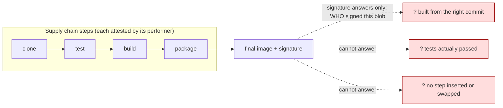
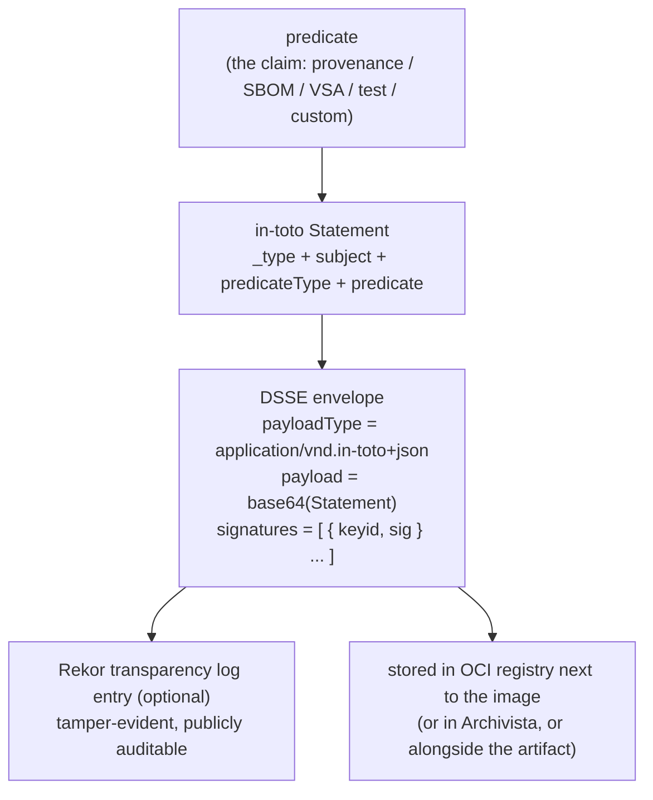
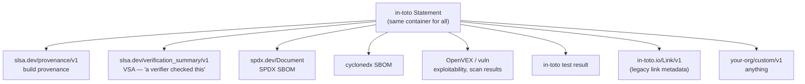
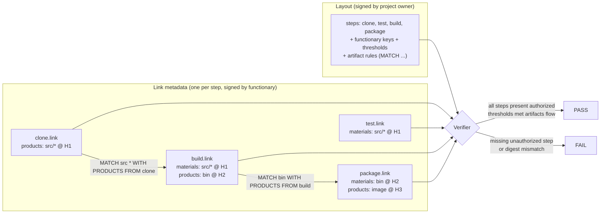
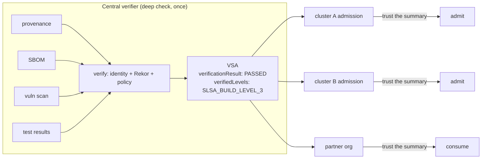
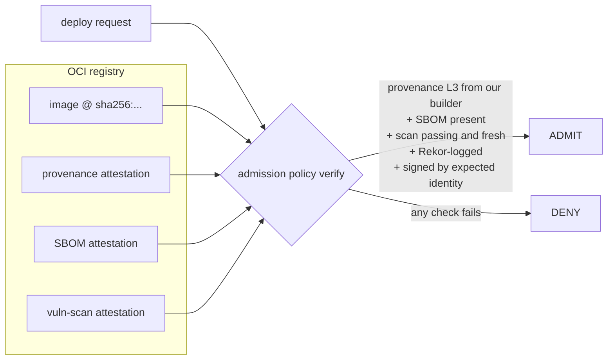
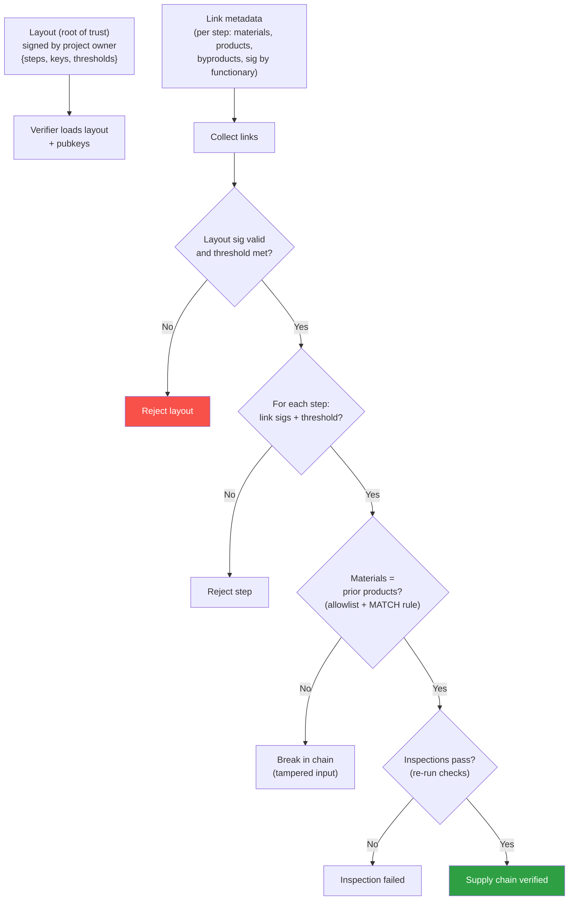
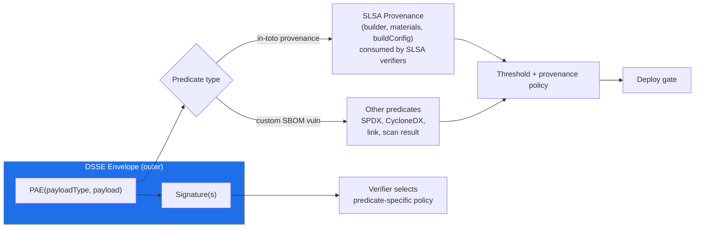

# Chapter 6 — in-toto: Attestations, Layouts, and Policies

*What this chapter covers.* The last four chapters were about signing an artifact and proving
*who* released it. Chapter 2 dissected classic code signing; Chapters 3–5 rebuilt the trust model
around keyless signing, ephemeral identities, and a transparency log. But a valid signature on a
container image answers exactly one question — *who signed this blob* — and it is not the question
that matters most. The question that matters is: **did the right steps happen, in the right order,
performed by the right actors, with each step consuming exactly what the previous step produced?**
A signature on the final artifact is silent about the *process* that produced it. SolarWinds
(Book 1, Chapter 3) shipped a perfectly, legitimately signed DLL; the signature was valid because
the attacker had corrupted a *step in the middle of the build*, not the signing key. This chapter
is about **in-toto**, the framework built precisely to secure the whole chain rather than its last
link. We cover the modern, dominant core — the **in-toto Attestation Framework**, whose `Statement`
is the universal container that SLSA provenance, SBOMs, VEX, test results, and vulnerability scans
all ride inside — and then the original, still-conceptually-important **layout / link** model that
verifies an entire pipeline against a signed policy. We tie attestations to DSSE (Chapter 1) and
Rekor (Chapter 5), show how `cosign` produces and verifies them, and end at the policy gate that
turns a pile of signed metadata into an admit/deny decision.
_All tool versions, spec references, and defaults verified as of early 2026._

Learning goals — after this chapter you should be able to:

- Explain **why signing the final artifact is insufficient** and what in-toto adds: attestation of
  *each step* plus verification that the steps connect (this step's output was that step's input)
  and were performed by *authorized* parties — defending against a tampered, skipped, or inserted
  step.
- State the **in-toto Statement v1** structure exactly — `_type`, `subject`, `predicateType`,
  `predicate` — and explain that `predicateType` is the **extensibility point** that makes one
  framework carry provenance, SBOMs, VEX, tests, and custom claims uniformly.
- Draw the **layering**: predicate → Statement → DSSE envelope (signed) → optionally logged in
  Rekor — and place SLSA provenance correctly as *one predicate type*, not a separate system.
- Describe the classic **layout model**: a signed policy defining steps, authorized **functionaries**,
  m-of-n **thresholds**, and **artifact rules** (`MATCH`, `CREATE`, `DELETE`, `REQUIRE`, `ALLOW`,
  `DISALLOW`) that connect step outputs to step inputs; and how **link metadata** records materials
  and products per step.
- Explain the **VSA** (Verification Summary Attestation) and how it enables *delegated* verification
  — verify once centrally, let consumers trust a signed summary.
- Use `cosign attest` / `cosign verify-attestation` to produce and policy-check attestations stored
  in an OCI registry, and describe the tooling landscape (Python in-toto, Witness/go-witness,
  Archivista).

## Why signing the final artifact is not enough

Consider the minimal supply chain for a service: a developer's commit is **cloned** from source
control, **tested**, **built** into a binary, and **packaged** into a container image that is signed
and pushed. Chapters 2–5 let you sign that final image and prove an identity signed it. Now enumerate
what a valid image signature does *not* tell you:

- Was the image built **from the commit it claims** — or from a tampered working tree?
- Did the **tests actually run and pass**, or did someone route around them?
- Was a **malicious step inserted** between build and package — a script that patched the binary
  after compilation but before signing?
- Did the tarball the build consumed **match** the tarball the clone produced, or was an artifact
  **swapped** between steps?
- Was each step performed by an **authorized** actor, or did a compromised runner masquerade as the
  builder?

These are all *process integrity* questions, and a signature on the output is structurally incapable
of answering them. SolarWinds is the canonical demonstration: the SUNBURST backdoor was injected by
**SUNSPOT**, malware resident on the build servers that replaced source during compilation. The
resulting artifact was signed with SolarWinds' *legitimate* code-signing certificate, so every
downstream check of the signature passed. The failure was not a stolen signing key; it was a
**corrupted build step** inside an otherwise trusted pipeline. Signing the output cannot catch that,
because the output *is what the corrupted process produced*.

in-toto's thesis is that you must attest to the **steps**, not just the result. Each step, when
performed, emits a signed statement of *what it consumed* (materials) and *what it produced*
(products), keyed by cryptographic digest. A separate signed **policy** declares which steps are
supposed to happen, in what order, who may perform each, and — crucially — how the artifacts must
**flow**: the products of step *N* must be the materials of step *N+1*. A verifier checks the whole
graph. If a step was skipped, its link metadata is missing. If a step was inserted, there is no
authorized functionary for it. If an artifact was swapped mid-chain, the digest in one step's
products won't match the digest in the next step's materials, and the artifact-flow rule fails. This
is **provenance for the entire pipeline**.

in-toto came out of **NYU's Secure Systems Lab** — Santiago Torres-Arias, Justin Cappos, and
colleagues — and was presented at **USENIX Security 2019** ("in-toto: Providing farm-to-table
guarantees for bytes and binaries"). It is a **Cloud Native Computing Foundation (CNCF)** project
(it entered the CNCF in 2019) and has become the substrate for the broader attestation ecosystem:
SLSA provenance (Book 4, Chapter 3) is *defined as* an in-toto attestation, and Sigstore's
`cosign attest` speaks the in-toto Statement format natively.



## The in-toto Attestation Framework

Modern in-toto splits into two related but distinct things. The **layout/link** model (covered later)
verifies a full pipeline against a signed policy — it is the original 2019 design. The **Attestation
Framework** is the newer, and today far more widely deployed, core: a **general, typed container for
any signed claim about software**. If you have touched SLSA provenance, an SBOM attestation, or
`cosign attest`, you have used the Attestation Framework whether you knew it or not. We start here
because it is what you will actually encounter.

### The Statement

The heart of the framework is the **Statement**, the standardized envelope contents. Statement
**v1** has exactly four top-level fields:

```json
{
  "_type": "https://in-toto.io/Statement/v1",
  "subject": [
    {
      "name": "ghcr.io/acme/api",
      "digest": { "sha256": "d34db33f0c0ffee5eaf00d1234abcd...9f21" }
    }
  ],
  "predicateType": "https://slsa.dev/provenance/v1",
  "predicate": {
    "buildDefinition": { "...": "..." },
    "runDetails": { "...": "..." }
  }
}
```

Read the four fields precisely — they are the whole model, and inventing extra ones or renaming them
is a common source of broken tooling:

- **`_type`** — a constant identifying the object as an in-toto Statement of a given version:
  `https://in-toto.io/Statement/v1`. (The older schema used `https://in-toto.io/Statement/v0.1`;
  v1 is the current one and the field is literally spelled `_type`, with the leading underscore.)
- **`subject`** — an **array** of `{ name, digest }` objects naming the artifacts the statement is
  *about*. `digest` is a map from algorithm to hex value (`sha256`, `sha512`, `gitCommit`, …). The
  subject is the **binding**: it ties the claim to specific bytes by content hash, so a verifier can
  confirm *this attestation is about the artifact in front of me* by recomputing the digest. A single
  statement may cover multiple subjects.
- **`predicateType`** — a **URI naming the schema** of the `predicate` field. This is the single most
  important design decision in the framework: it is the **extensibility point**. The predicate type
  tells a consumer how to parse and interpret the predicate, and lets a verifier select attestations
  by kind ("give me the SLSA provenance for this image").
- **`predicate`** — the arbitrary, typed payload: the actual claim, whose shape is defined by the
  `predicateType`. For SLSA provenance it is `{ buildDefinition, runDetails }`; for an SBOM it is an
  SPDX or CycloneDX document; for a VSA it is the verification summary; for a custom attestation it is
  whatever your schema says. The predicate may be **omitted entirely** when the subject and predicate
  type carry all the meaning (a "this artifact is of type X" assertion).

The insight to internalize is that **the container is generic and the meaning lives in
`predicateType`**. SLSA Provenance is not a different file format from an SBOM attestation — both are
in-toto Statements. They differ only in the `predicateType` string and the shape of `predicate`. One
framework, one parser, one verification pipeline, arbitrarily many claim types.

### The layering: predicate → Statement → DSSE → Rekor

A Statement is just JSON; on its own it is unsigned and unauthenticated. in-toto attestations are
**always** wrapped and signed, and the signing envelope is **DSSE** — the Dead Simple Signing
Envelope from Chapter 1. The full stack, from innermost claim to outermost log record:



- **DSSE** wraps the Statement. Its `payloadType` is the constant
  `application/vnd.in-toto+json`, its `payload` is the base64-encoded Statement, and `signatures` is
  an array of signatures. The signature is computed over the **PAE** (Pre-Authentication Encoding) of
  `(payloadType, payload)`, not over the raw JSON — this is what stops an attacker from reinterpreting
  the same bytes under a different type (Chapter 1 covers PAE in detail). Because DSSE carries an
  *array* of signatures, an attestation can be co-signed — the mechanical basis for the m-of-n
  thresholds we return to below.
- **Rekor** (Chapter 5) optionally records the signed envelope in a transparency log. Sigstore
  supports a dedicated `intoto`/`dsse` entry type; logging makes the attestation **discoverable and
  tamper-evident**, and — combined with keyless signing's short-lived certificates — lets a verifier
  trust it long after the signing certificate expired.
- **Storage** is usually the **OCI registry**, next to the image it describes, addressed by the
  image's digest (Book 3, Chapter 5, on OCI referrers / attestation storage). The attestation travels
  with the artifact.

Place SLSA provenance correctly in this picture: it is **an in-toto attestation whose predicateType
is `https://slsa.dev/provenance/v1`** (Book 4, Chapter 3). SLSA does not define a new envelope, a new
signature format, or a new transport. It defines *one predicate schema* (`buildDefinition` +
`runDetails`) and the *requirements and levels* around producing it honestly. in-toto is the general
framework; SLSA provenance is a specific, standardized predicate plus the build-integrity program
built on top. Confusing "in-toto" with "SLSA" — treating them as competitors or as the same thing —
is the single most common error in this area. They are a container and one of its contents.

### One framework, many predicate types

The predicate ecosystem is where the generality pays off. A handful of standardized predicate types
cover most of the secure-supply-chain metadata you will emit, and custom types cover the rest:



| Predicate | `predicateType` (representative) | What it asserts |
|---|---|---|
| SLSA Provenance | `https://slsa.dev/provenance/v1` | how/from-what/by-what an artifact was built |
| SLSA VSA | `https://slsa.dev/verification_summary/v1` | a verifier checked an artifact against a policy and it passed |
| SPDX SBOM | `https://spdx.dev/Document` | the components/dependencies in the artifact (SPDX) |
| CycloneDX SBOM | `https://cyclonedx.org/bom` | components/dependencies (CycloneDX) |
| Vulnerability scan | `https://in-toto.io/attestation/vulns/v0.1` | scanner, timestamp, findings |
| VEX | OpenVEX / CSAF predicate | exploitability of specific CVEs in this artifact |
| Test result | `https://in-toto.io/attestation/test-result/v0.1` | which tests ran and their outcome |
| Link (legacy) | `https://in-toto.io/Link/v1` | materials/products of a pipeline step (layout model) |
| Custom | `https://acme.example/attestation/review/v1` | anything: manual approval, license check, deploy record |

The **`in-toto/attestation`** repository on GitHub is the canonical home for these predicate specs and
their JSON schemas; the SLSA site owns the provenance and VSA schemas; SPDX and CycloneDX own their
SBOM formats. When you invent a custom predicate, you mint your own `predicateType` URI (ideally under
a domain you control and versioned) and document the `predicate` shape — nothing else in the stack
changes. The container, the DSSE signing, the Rekor logging, and the OCI storage are all reused
verbatim.

### Producing and verifying attestations with cosign

`cosign` (Chapter 3) is the workhorse for attestations in the container world. It wraps a predicate in
an in-toto Statement, signs it in a DSSE envelope (keyless by default), optionally logs it to Rekor,
and stores it in the OCI registry attached to the image digest.

```bash
# Attach a signed SLSA-provenance attestation to an image (keyless / OIDC).
cosign attest \
  --predicate provenance.json \
  --type slsaprovenance \
  --yes \
  ghcr.io/acme/api@sha256:d34db33f...9f21

# Attach an SBOM attestation (SPDX predicate) to the same image.
cosign attest \
  --predicate sbom.spdx.json \
  --type spdxjson \
  --yes \
  ghcr.io/acme/api@sha256:d34db33f...9f21

# A custom predicate type by full URI.
cosign attest \
  --predicate review.json \
  --type https://acme.example/attestation/review/v1 \
  --yes \
  ghcr.io/acme/api@sha256:d34db33f...9f21
```

`--type` accepts shorthands (`slsaprovenance`, `slsaprovenance1`, `spdx`, `spdxjson`, `cyclonedx`,
`vuln`, `link`) or an arbitrary predicate-type URI. Cosign takes your `--predicate` file as the
`predicate`, computes the image's digest as the `subject`, sets `predicateType` from `--type`,
assembles the Statement, DSSE-signs it, records it in Rekor, and pushes it to the registry as an
attestation associated with `sha256:d34db33f...`. Multiple attestations of different types coexist on
the same image.

Verification is a **policy** operation, and this is where the distributed-systems payoff lives:

```bash
cosign verify-attestation \
  --type slsaprovenance \
  --certificate-identity-regexp '^https://github.com/acme/.+/\.github/workflows/build\.yml@refs/heads/main$' \
  --certificate-oidc-issuer 'https://token.actions.githubusercontent.com' \
  --policy provenance-policy.rego \
  ghcr.io/acme/api@sha256:d34db33f...9f21
```

This one command checks several independent things, all of which must hold:

1. There **exists** an attestation of type `slsaprovenance` for this exact image digest.
2. It was signed by the **expected identity** — here, a specific GitHub Actions workflow on `main`,
   via the expected OIDC issuer (Chapter 4 covers identity-based verification; the identity is bound
   in the Fulcio certificate's SAN).
3. The signing certificate and the entry are consistent with **Rekor** (transparency, Chapter 5).
4. The **predicate satisfies the policy** — the CUE or Rego file asserts things about the predicate
   content, e.g. the builder ID equals your platform's, the source repo matches, the build was on the
   protected branch.

A minimal Rego policy body that `cosign verify-attestation` will evaluate against the decoded
predicate:

```rego
package sigstore

default allow = false

allow {
    input.predicateType == "https://slsa.dev/provenance/v1"
    input.predicate.runDetails.builder.id == "https://github.com/acme/build-platform/.github/workflows/builder.yml@refs/heads/main"
    startswith(input.predicate.buildDefinition.externalParameters.workflow.repository, "https://github.com/acme/")
}
```

The mental model to carry forward: **producing** an attestation is one signed statement about an
artifact; **verifying** is "does an attestation of the right *type*, from the right *identity*, logged
in the right *place*, whose *content* satisfies my *policy*, exist for these exact bytes?" That
compound check is the deployment gate (Chapters 8 and 10; Book 6, Chapters 5–6).

## The layout model: verifying a whole pipeline

The Attestation Framework gives you signed claims about artifacts. It does **not**, by itself, verify
that a *sequence* of steps was followed correctly — that the build consumed exactly what the clone
produced, that no step was skipped or inserted. That end-to-end verification is the job of the
original in-toto **layout** model. It is less ubiquitous than the Attestation Framework in
cloud-native tooling today (SLSA provenance from a trusted builder often substitutes for a
multi-step layout), but it is the *complete* expression of in-toto's thesis and remains the right
mental model for full-chain verification, so it is worth understanding precisely.

The model has three roles:

- **The project owner** authors and signs a **layout** — the policy. Its key is the root of trust.
- **Functionaries** perform steps and sign **link metadata** attesting to what each step consumed
  and produced.
- A **verifier** (often the end user, or an admission gate) checks the link metadata against the
  layout.

### The layout: a signed policy for the pipeline

A **layout** is a signed document that declares the expected shape of the supply chain. Its principal
fields:

- **`steps`** — the sequence of operations the chain must perform (`clone`, `run-tests`, `build`,
  `package`). For each step the layout specifies:
  - **`pubkeys`** / **`threshold`** — which functionary keys are authorized to sign this step's link
    metadata, and how many distinct authorized signatures are required (the **m-of-n threshold**).
  - **`expected_command`** — the command the functionary is expected to have run (advisory but
    recorded).
  - **`expected_materials`** and **`expected_products`** — the **artifact rules** governing this
    step's inputs and outputs (below).
- **`inspections`** — commands the *verifier* runs at verification time to inspect the
  final products (e.g., untar the package and confirm its contents match the build's products),
  each with its own artifact rules.
- **`keys`** — the public keys of all functionaries, referenced by the steps.
- **`expires`** — an expiration, so a layout cannot be trusted forever.

The whole layout is signed by the project owner (optionally with its own threshold of owner keys). The
owner's public key is the trust anchor the verifier must obtain out of band — this is the one key
whose authenticity the whole scheme depends on.

### Link metadata: what each step actually did

When a functionary performs a step, it records **link metadata** — a signed statement of that step's
execution. A link's fields:

- **`name`** — the step it corresponds to in the layout.
- **`materials`** — the **inputs**: a map from file path to digest (`{"src.tar.gz": {"sha256": "..."}}`)
  of everything the step consumed.
- **`products`** — the **outputs**: the same shape, for everything the step produced.
- **`byproducts`** — captured stdout/stderr/return value (advisory).
- **`command`** — the command actually run.
- **`environment`** — optional execution context.

The link is signed by the functionary's key. `materials` and `products` are the load-bearing fields:
they are the *measured* record of what flowed in and out, by content hash, which the layout's artifact
rules will be checked against. In the modern framework, link metadata is expressed as a Statement with
`predicateType` `https://in-toto.io/Link/v1` — the layout model and the Attestation Framework are the
same machinery viewed at different granularity.

### Artifact rules: connecting outputs to inputs

Artifact rules are the mechanism that makes the chain a *chain* rather than a set of disconnected
steps. Each rule matches file paths and either constrains what a step may touch or, most importantly,
asserts that an artifact **flows** correctly from one step to another. The rule verbs:

- **`CREATE <pattern>`** — the step must have **produced** files matching the pattern (they are in
  `products` but not `materials`). A build step *creates* the binary.
- **`DELETE <pattern>`** — the step must have **removed** matching files (in `materials`, not
  `products`).
- **`MODIFY <pattern>`** — matching files must appear in both, with **different** digests.
- **`ALLOW <pattern>`** — matching files are permitted (no constraint beyond permission).
- **`DISALLOW <pattern>`** — matching files must **not** appear; a catch-all `DISALLOW *` at the end of
  a rule list rejects anything not explicitly allowed.
- **`REQUIRE <pattern>`** — matching files must be present.
- **`MATCH <pattern> WITH (MATERIALS|PRODUCTS) [IN <path>] FROM <step>`** — the **cross-step** rule and
  the crux of the whole model. It asserts that files matching the pattern in *this* step correspond,
  by digest, to the materials or products of *another* step.

The **`MATCH`** rule is what stitches steps together. Its full grammar is:

```text
MATCH <pattern> [IN <src-prefix>] WITH (MATERIALS | PRODUCTS) [IN <dst-prefix>] FROM <step-name>
```

Read a concrete example. The `build` step's materials must be exactly the `clone` step's products:

```text
# In the layout, for the "build" step:
expected_materials:
  - ["MATCH", "src/*", "WITH", "PRODUCTS", "FROM", "clone"]
  - ["DISALLOW", "*"]
```

This says: every file under `src/*` that the build step consumed must, by digest, equal a file the
clone step produced — and nothing else may be consumed. If an attacker swaps the source tarball
between clone and build (a SUNSPOT-style substitution), the digests diverge, the `MATCH` fails, and
verification rejects the chain. The trailing `DISALLOW *` forbids any *unexpected* input from
sneaking in. Chaining `MATCH` rules across every adjacent pair of steps encodes the full artifact flow:
clone→test→build→package, each link pinned by hash to its predecessor.



### Verification: checking the chain against the layout

The verifier's algorithm, given the owner's public key, the layout, and the collected link metadata:

1. **Verify the layout's signature** with the owner's public key (and check `expires`). If this fails,
   stop — the policy itself is untrusted.
2. **Load the functionary keys** declared in the layout.
3. **For each step**: collect the link metadata named for that step, discard any not signed by an
   **authorized** functionary key, and verify that at least **`threshold`** distinct authorized
   functionaries signed it. A missing step (no valid links) or an unauthorized signer fails here.
4. **Apply the artifact rules** for every step's `expected_materials` and `expected_products` against
   the links' `materials` and `products`. Every `MATCH` must resolve to equal digests in the
   referenced step; every `CREATE`/`DELETE`/`DISALLOW` must hold. A swapped or tampered artifact fails
   here.
5. **Run the inspections** from the layout, apply their artifact rules to the results, and confirm the
   final products match what the last step produced.

If every check passes, the verifier has cryptographic evidence that **the declared steps happened, in
order, each performed by an authorized functionary, with artifacts flowing intact from step to step —
none skipped, inserted, or swapped**. That is a materially stronger guarantee than any signature on
the final artifact.

### Functionaries and thresholds

A **functionary** is any party authorized to perform a step and sign its link — a CI runner, a build
service, a human reviewer. The layout binds each step to a set of functionary public keys and a
**threshold** `m`: the step is only satisfied if **m distinct authorized functionaries** independently
performed it and signed matching link metadata. This is the same **m-of-n** idea as threshold signing
in Chapter 1, applied to *steps* rather than to a single signature. Setting `threshold: 2` on the
`build` step means an attacker must subvert *two* independent builders that produced *identical
products* to forge that step — a strong defense for high-value stages, at the cost of running the step
redundantly. Most steps run at threshold 1; reserve higher thresholds for the stages whose compromise
is catastrophic (the build itself, a release-approval step).

## Delegated verification: the VSA

Full verification — pull every attestation, check every signature and identity, evaluate every policy,
maybe re-run inspections — is expensive, and it is wasteful for *every consumer* of an artifact to
repeat it. The **Verification Summary Attestation (VSA)** solves this by making the *result of
verification* itself an attestation.

A VSA is an in-toto attestation with `predicateType` `https://slsa.dev/verification_summary/v1`. Its
predicate records that **a specific verifier checked a specific artifact against a specific policy, and
what the outcome was**. Its notable fields:

- **`verifier`** — the identity of the party that performed the verification (`{ "id": "https://acme.example/verifier" }`).
- **`timeVerified`** — when.
- **`resourceUri`** — the artifact verified (the subject binds the digest).
- **`policy`** — a reference to the policy that was applied.
- **`inputAttestations`** — the attestations that were consumed (provenance, SBOM, scans…).
- **`verificationResult`** — `PASSED` or `FAILED`.
- **`verifiedLevels`** — the SLSA levels the artifact was confirmed to meet (e.g. `["SLSA_BUILD_LEVEL_3"]`).
- **`slsaVersion`**, **`dependencyLevels`** — supporting detail.

The point is **delegation of trust in verification**. A central, trusted verifier — your platform
security team's service — does the full, expensive check once, and emits a signed VSA. Downstream
consumers (an admission controller in a cluster that does not run your full policy engine, a partner
org, a fleet of thousands of pods) then only need to check **one** thing: does a VSA from *the verifier
they trust* exist for this artifact, with `verificationResult: PASSED` and the required
`verifiedLevels`? They trust the summary rather than re-deriving it. This is exactly the kind of
tiered trust that scales: verify deeply in one place, propagate a cheap signed assertion everywhere
else.



## Tooling

The attestation ecosystem has several reference and production implementations; you will mix them
depending on where you sit in the pipeline.

- **Python in-toto** (`in-toto/in-toto`) — the reference implementation from NYU. Provides
  `in-toto-run` (wrap a command and emit signed link metadata), `in-toto-record` (for interactive or
  multi-command steps), and `in-toto-verify` (check links against a layout). This is the canonical
  home of the **layout/link** model.
- **Witness / go-witness** (`in-toto/witness`, from TestifySec) — a Go tool that runs **in-pipeline**:
  you wrap a build command with `witness run`, and it observes the execution (via attestors for git,
  the environment, materials/products, GitLab/GitHub context, SLSA provenance, and more) and emits a
  signed in-toto attestation capturing what happened. Witness is designed to generate rich
  attestations *as the pipeline runs*, rather than after the fact.
- **Archivista** (`in-toto/archivista`) — a GraphQL-fronted **storage and retrieval** service for
  attestations, letting you store the DSSE envelopes Witness produces and query the attestation graph
  (find all attestations for a subject digest, traverse materials→products links across steps). It is
  the persistence layer for attestation-heavy pipelines.
- **cosign** (`sigstore/cosign`) — the dominant tool for *producing and verifying attestations in the
  OCI world*, as shown above: keyless DSSE signing, Rekor logging, registry storage, and
  policy-based `verify-attestation`.
- **The `in-toto/attestation` repository** — not a tool but the **spec home**: the Statement schema,
  the predicate-type registry, and the JSON schemas for the standard predicates. When in doubt about a
  field name, this is the authority; do not guess.

A common production shape: Witness emits attestations during the build and stores them in Archivista;
the paved-road platform *also* has `cosign attest` push SLSA provenance and an SBOM to the OCI
registry; a central verifier evaluates the lot and emits a VSA; admission trusts the VSA.

## Verifying attestations in practice: the deployment gate

Everything in this chapter converges on a single operational moment: **the gate that decides whether an
artifact may be deployed**. This is policy-based verification, and it is where attestations stop being
metadata and start being enforcement. It previews Chapters 8 and 10 and Book 6, Chapters 5–6.

A representative fleet policy: *an image may be admitted to production only if it has (1) SLSA
Build-Level-3 provenance from our build platform's identity, (2) an SBOM, (3) a passing vulnerability
scan no older than 24 hours, and (4) all of the above logged in Rekor.* An admission controller
evaluates that at deploy time against the attestations attached to the image:



The controller does not care *how* the attestations were produced — Witness, cosign, a bespoke signer —
only that they are the right *types*, from the right *identities*, logged in the right *place*, and
that their *content* satisfies policy. That uniformity is the entire reason the in-toto container is
generic: one verification engine consumes provenance, SBOMs, VEX, and test results identically,
selecting by `predicateType` and evaluating each against the relevant rule. Chapter 8 builds the
policy engine; Chapter 10 and Book 6 wire it into Kubernetes admission (`policy-controller`, Kyverno,
sigstore image policies).

## Distributed-systems lens

Attestations are the **universal metadata currency** of the secure supply chain, and in-toto is the
mint. At fleet scale — hundreds of services, dozens of teams, thousands of deploys a day — the
architecture that actually works has three properties, and in-toto supplies all three:

- **Uniformity through one container.** Every stage — source, build, scan, test, deploy — emits a
  signed in-toto Statement, differing only in `predicateType`. Provenance, SBOM, VEX, test results,
  and your custom "SRE-approved-this-release" claim all flow through the *same* signing (DSSE), the
  *same* transport (OCI referrers, Book 3, Chapter 5), the *same* transparency log (Rekor, Chapter 5),
  and the *same* verification engine. You do not build one pipeline for provenance and another for
  SBOMs; you build one attestation pipeline and vary the predicate. That is the only way the
  metadata problem stays tractable across hundreds of services.
- **Attestations travel with the artifact.** Because they are stored next to the image by digest, an
  attestation is portable across registries, clusters, and organizational boundaries. The artifact
  and its provenance move as a unit; verification is possible anywhere the artifact lands, with no
  side channel to the pipeline that built it.
- **The paved road produces them for free; the gate consumes them.** The secure build platform (Book
  4, Chapter 10) auto-generates a *standard set* of attestations for **every** artifact — no team opts
  in, no team can opt out — and admission (Book 6) verifies them. This is how you enforce
  supply-chain requirements across an entire org without asking every team to become a security
  expert: the platform emits, the gate checks, and non-conforming artifacts simply cannot deploy.
  **Attestations plus policy are the enforcement mechanism**; in-toto is what makes them composable.

And **VSA closes the scaling loop**: full verification is expensive and does not need to run in every
cluster and every consumer. Verify deeply, once, in a central trusted service; emit a signed summary;
let thousands of downstream consumers trust the summary. This is the same tiered-trust pattern that
lets any large distributed system scale a costly operation — do the hard work in one authoritative
place, and propagate a cheap, verifiable assertion of the result everywhere else.

The through-line from Chapter 2 to here: a signature answers *who signed this blob*; in-toto answers
*was the right process followed by the right actors to produce it*. Signing proves identity;
attestation proves **process**. Keep the axes separate — and note the honest limit that carries over
from Chapter 3: an attestation is only as trustworthy as the step that produced it. A compromised,
authorized builder can emit a perfectly valid provenance attestation for a malicious artifact.
in-toto raises the bar from "steal a signing key" to "subvert an attested, authorized, threshold-gated
step whose products are hash-pinned to its neighbors" — a dramatically harder attack — but it does not
make "attested" mean "benign." Provenance and policy tell you *how* something was built and by *whom*;
whether that *how* is trustworthy is the subject of build-integrity levels (SLSA, Book 4) and of the
policies you write at the gate.

### In-toto layout verification flow



### Provenance types: SLSA vs in-toto statement



## Key takeaways

- **Signing the final artifact proves who signed a blob; it says nothing about the process.**
  SolarWinds shipped a legitimately signed DLL corrupted by a subverted build step. in-toto secures the
  **whole chain**: each step is attested by whoever performed it, and a policy verifies the steps
  connect (output → input, hash-pinned) and were done by authorized parties.
- **The in-toto Statement v1 has exactly four fields:** `_type` (`https://in-toto.io/Statement/v1`),
  `subject` (array of `{name, digest}` — the artifacts, bound by content hash), `predicateType` (a URI
  naming the predicate schema), and `predicate` (the typed payload). **`predicateType` is the
  extensibility point** — one generic container carries provenance, SBOMs, VEX, tests, and custom
  claims uniformly.
- **The layering is:** predicate → Statement → **DSSE** envelope (signed, `payloadType`
  `application/vnd.in-toto+json`) → optionally **Rekor** → stored in the **OCI** registry next to the
  image. **SLSA provenance is *one predicate type* (`https://slsa.dev/provenance/v1`), not a separate
  system** — in-toto is the framework; SLSA is a specific predicate plus the levels around it.
- **The classic layout model** verifies a full pipeline: a project owner signs a **layout** (steps,
  authorized **functionary** keys, m-of-n **thresholds**, and **artifact rules**); each step emits
  signed **link** metadata (`materials`, `products`); the verifier confirms every step ran, was
  authorized, met threshold, and that artifacts flow intact. The **`MATCH ... WITH PRODUCTS FROM
  <step>`** rule is the crux — it hash-pins one step's inputs to another's outputs, defeating
  mid-chain artifact swaps.
- **The VSA** (`https://slsa.dev/verification_summary/v1`) records that a verifier checked an artifact
  against a policy and the result (`PASSED`/`FAILED`, `verifiedLevels`). It enables **delegated
  verification**: verify deeply once, centrally; let downstream consumers trust the signed summary.
- **`cosign attest --predicate ... --type ...`** produces attestations; **`cosign verify-attestation
  --type ... --certificate-identity-regexp ... --policy ...`** checks type + identity + Rekor + policy
  content in one gate. Tooling: reference **Python in-toto** (layout/link), **Witness/go-witness**
  (in-pipeline attestation), **Archivista** (storage), and the **`in-toto/attestation`** spec repo.
- **Distributed-systems view:** attestations are the universal signed-metadata currency; one framework
  covers every claim type uniformly; the paved-road platform auto-emits a standard attestation set for
  every artifact and admission verifies them at the gate; VSA lets you verify once and propagate a
  cheap signed summary across the fleet. **Attestations + policy are how supply-chain requirements are
  enforced across hundreds of services.**

## Further reading

- **in-toto specification** — the layout, link, and artifact-rule model. https://github.com/in-toto/docs
  and the in-toto website. The formal grammar of `MATCH`/`CREATE`/`DELETE`/`ALLOW`/`DISALLOW`/`REQUIRE`
  lives here.
- **in-toto Attestation Framework** (`in-toto/attestation`) — the Statement v1 schema, the DSSE
  envelope binding, and the **predicate-type registry** with JSON schemas for the standard predicates.
  https://github.com/in-toto/attestation. The authority on field names; do not guess.
- **"in-toto: Providing farm-to-table guarantees for bytes and binaries"** — Torres-Arias, Afzali,
  Kuppusamy, Curtmola, Cappos, *USENIX Security 2019* — the original design and threat model.
- **SLSA v1.0** — provenance (`https://slsa.dev/provenance/v1`) and the **VSA**
  (`https://slsa.dev/verification_summary/v1`) specs, and the levels/requirements around producing
  provenance. https://slsa.dev/spec/v1.0/ (developed in Book 4, Chapter 3).
- **DSSE — Dead Simple Signing Envelope** — the envelope and PAE that wrap and sign every attestation.
  https://github.com/secure-systems-lab/dsse (mechanics in Chapter 1).
- **Cosign attestations** — `cosign attest` / `cosign verify-attestation`, predicate types, and OCI
  storage. https://docs.sigstore.dev/ and https://github.com/sigstore/cosign (Chapter 3).
- **Witness / go-witness and Archivista** (TestifySec, in the in-toto org) — in-pipeline attestation
  generation and storage. https://github.com/in-toto/witness and
  https://github.com/in-toto/archivista.
- **SPDX 3.0** and **CycloneDX 1.6** — the SBOM predicate formats carried as attestations (Book 3).
- **sigstore/policy-controller** and **Kyverno** — admission-time attestation verification for
  Kubernetes. Applied in Chapter 10 and Book 6, Chapters 5–6.
- Cross-references: Book 5, Chapter 1 (DSSE, PAE, thresholds), Chapters 3–5 (Sigstore, keyless
  identity, Rekor), Chapter 8 (policy engines), Chapter 10 (deployment gates); Book 4, Chapters 3, 10
  (SLSA provenance, secure build platform); Book 3, Chapter 5 (SBOMs, OCI attestation storage); Book 1,
  Chapter 3 (SolarWinds); Book 6, Chapters 5–6 (admission-time verification).
