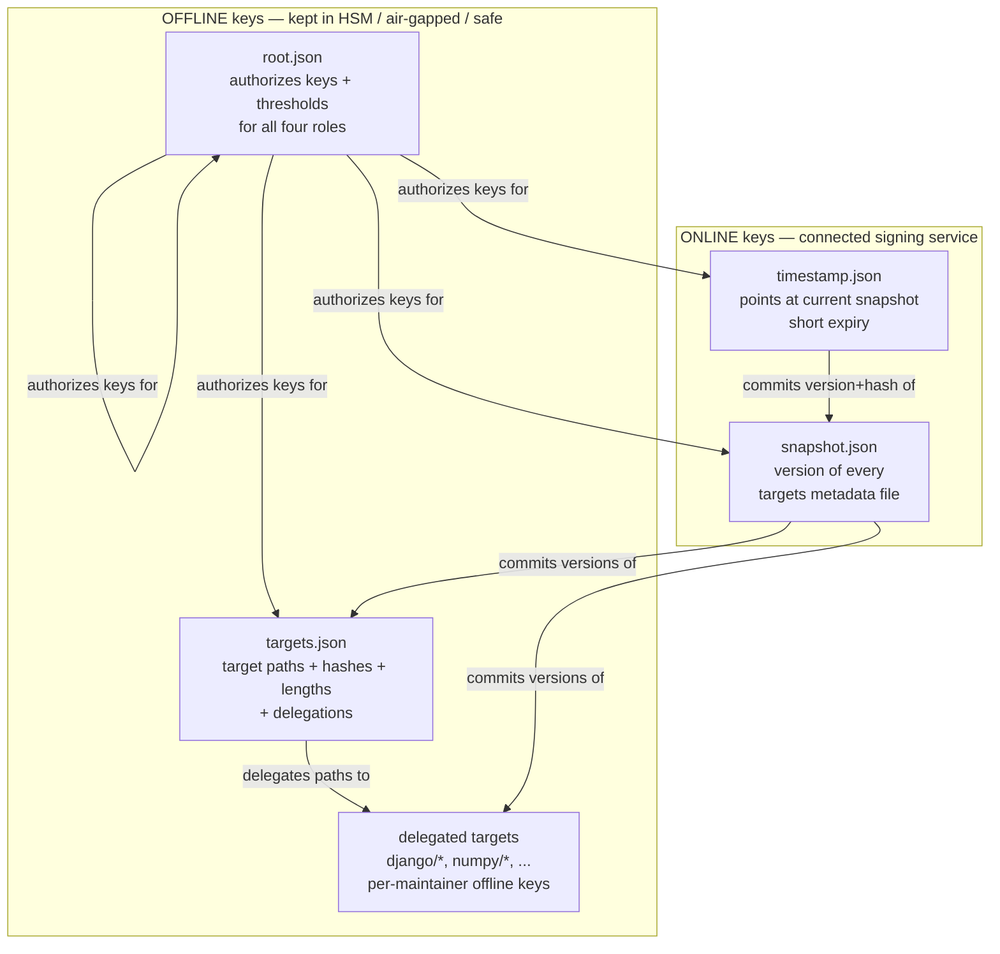
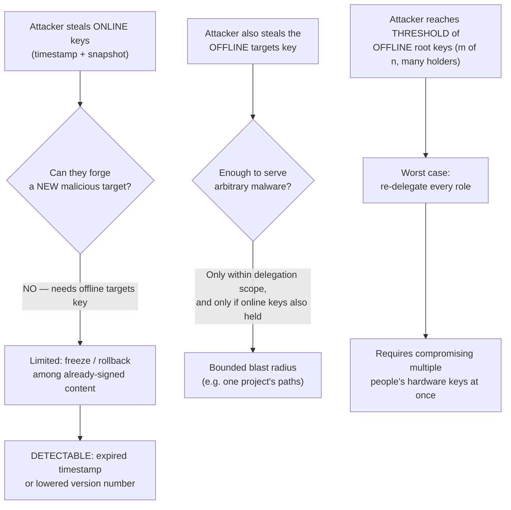
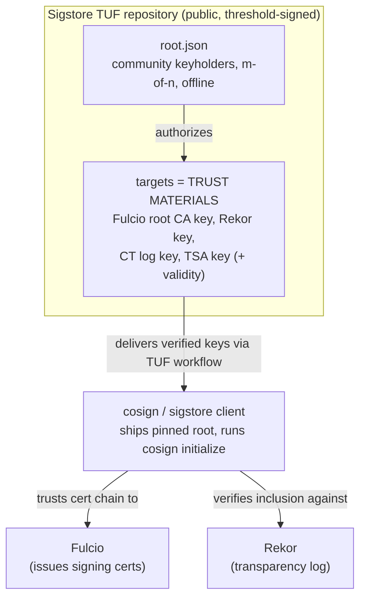
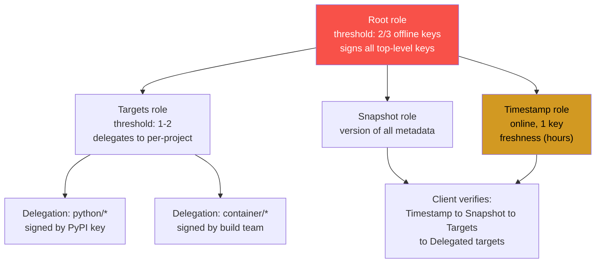
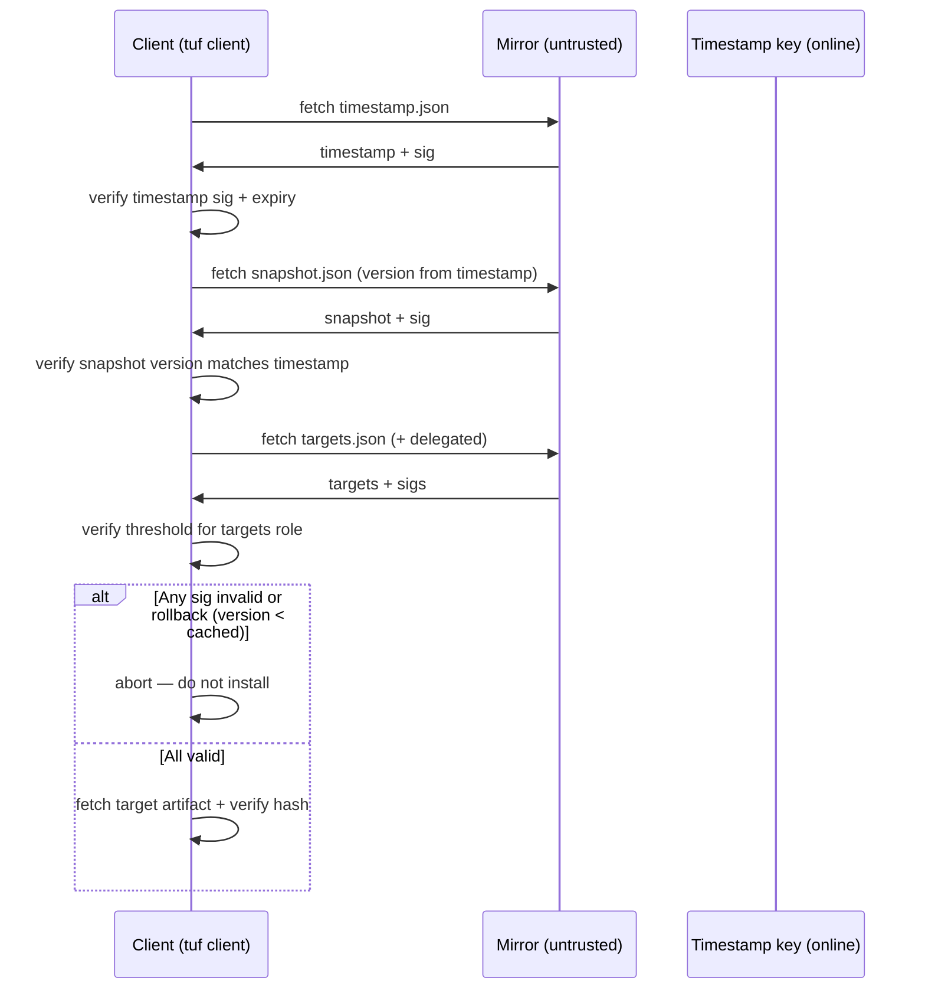
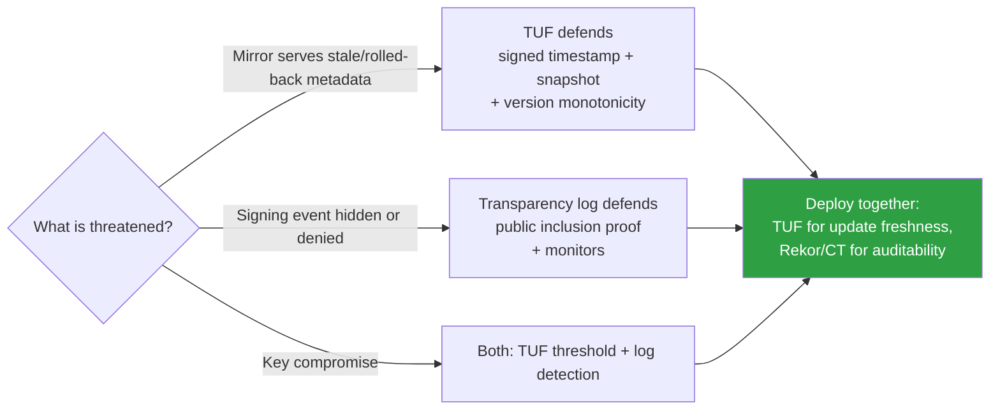

# Chapter 7 — TUF: The Update Framework

*What this chapter covers.* Every chapter so far has been about proving something true of a
single artifact: this blob was signed by that identity (Chapters 2–4), this signing event was
logged (Chapter 5), these steps produced this output (Chapter 6). This chapter changes the
question. It is not "is this artifact authentic?" but "**can I still get authentic artifacts
when the system that serves them has been compromised?**" A software repository — PyPI, a
container registry, an internal mirror — is a *distributed system that many parties can attack*:
its web servers, its CDN, its storage, its signing keys. Naive signing assumes the signing key
is safe and everything else is untrusted. That assumption is exactly backwards for the threats
that matter. **The Update Framework (TUF)** is a design that assumes the repository *will* be
partially compromised — a stolen key here, a hijacked CDN there — and bounds the damage so that,
in most compromise scenarios, an attacker still cannot make you install malware, and in the
scenarios where they can slow you down, you can *detect* it. This is **compromise resilience**,
and it is TUF's one big idea. We take apart the four roles and their metadata precisely, walk the
client update algorithm in order, show exactly how online/offline key separation and thresholds
contain a key compromise, and then look at where TUF actually runs in production — most
importantly, *inside Sigstore itself* (Chapter 3), where TUF is the root of trust for a root of
trust.

Learning goals — after this chapter you should be able to:

- Explain why **signing alone is not enough** for an update system, and enumerate the
  repository-level attacks TUF is designed to survive — arbitrary-package, rollback, freeze,
  fast-forward, mix-and-match, endless-data, slow-retrieval — and the mechanism that defeats each.
- State the **four top-level TUF roles** — root, targets, snapshot, timestamp — with their exact
  responsibilities and the metadata each signs, without confusing their duties.
- Describe **online/offline key separation** and **m-of-n thresholds**, and explain precisely how
  they *bound the damage* of a key compromise: why stealing the frequently used online keys still
  does not let an attacker forge malicious content.
- Walk the **client update workflow** in its mandated order — root → timestamp → snapshot →
  targets → download-and-verify — and justify why the order (authority, then freshness, then
  consistency, then content) is load-bearing.
- Explain **delegation** of the targets role and why it scopes trust to sub-maintainers, and how
  **key rotation and recovery** through the root role let a TUF repository recover from compromise
  rather than collapse.
- Place TUF in the real world accurately: **PEP 458/480** for PyPI, **Notary v1 / Docker Content
  Trust**, **Sigstore's TUF root** (go-tuf, `root-signing`), and **Uptane** for automotive — and
  articulate how TUF underpins the Sigstore trust you have been relying on since Chapter 3.

## Why signing an artifact is not enough

Start from where Chapter 2 left off. You sign a package with a private key; clients hold your
public key and verify the signature. If the key stays secret, an attacker who compromises the
repository cannot forge a valid signature over malware, and you are done. That is the naive model,
and it fails for two independent reasons.

The first is that it defends against exactly one attack — content substitution — and a repository
is vulnerable to *many* attacks that have nothing to do with forging a signature. An attacker who
controls the repository or its CDN does not need to sign anything to hurt you. They can serve you a
**genuinely signed but old** version of a package — one with a known, exploitable
vulnerability — and your signature check passes, because the old package really was signed. They
can **withhold updates** entirely, pinning you to a stale, vulnerable state while a CVE is being
actively exploited, and again every signature you see is valid. They can serve a package whose
signature is fine but whose *dependencies* are an inconsistent, never-tested combination. None of
these are defeated by "is the signature valid?", because in each case it is.

The second reason is the one that defines TUF's threat model: **the signing key is not
categorically safer than the repository**. Book 1's case studies are a catalogue of stolen and
misused signing keys — the NVIDIA and stolen-driver-certificate incidents in Chapter 2, the
long-lived key that *is* the single point of failure. A repository is a high-value target (Book 2,
Chapter 1 on the dependency attack surface; Book 6, Chapter 2 on registries), and its signing
infrastructure is *part of that target*. If your entire security model is "one key, kept safe,"
then the compromise of that one key is total: the attacker signs whatever they want and every
client accepts it. There is no containment, no detection, and no recovery short of manually
re-pinning a new key at every client. For infrastructure that ships code to millions of machines,
"one key compromise equals game over" is not an acceptable failure mode.

TUF's thesis is to invert the assumption. **Assume the repository will be partially
compromised** — some server, some CDN edge, some key — and design so that the *set* of things an
attacker must simultaneously compromise to make you install malware is large, well-defended, and
mostly offline; and so that the attacks achievable with a lesser compromise are limited to
*denial and delay*, which are **detectable**. This property has a name: **compromise resilience**.
It is not "the repository cannot be hacked" — nothing offers that — it is "hacking the repository,
up to and including stealing its most-exposed keys, does not get the attacker arbitrary code
execution on your machines, and cannot silently freeze you forever."

TUF came out of **NYU's Secure Systems Lab** — Justin Cappos, Trishank Karthik Kuppusamy,
Sebastien Awwad, and colleagues — building on Cappos's earlier "package management security" work
(the *Thandy*/Stork lineage and the 2008 study of how badly real package managers handled
repository compromise). It is a **Cloud Native Computing Foundation (CNCF)** graduated project. Its
design has been adopted by Python (**PEP 458/480** for PyPI), **Docker/Notary v1**, **Sigstore**
(as its root of trust), the automotive industry (**Uptane**), RubyGems, and others. The framework
is a *specification* with multiple implementations — `python-tuf` (the reference implementation)
and `go-tuf` chief among them — not a single program.

## The attacks TUF is designed to survive

TUF's design reads backwards from a threat enumeration. Every role and every metadata field exists
to defeat a specific named attack, so it is worth stating the attacks first — they *are* the
requirements.

- **Arbitrary software / arbitrary package.** The attacker gets you to install a file of their
  choosing. This is the attack ordinary signing already stops *if the signing key is safe*. TUF
  keeps that property but no longer depends on a single key staying safe.
- **Rollback attack.** The attacker serves an *older, legitimately signed* version of a package or
  of metadata — often one with a known vulnerability — to downgrade you into an exploitable state.
  The signature is valid; the problem is that it is *stale*.
- **Freeze attack (indefinite freeze).** The attacker prevents you from ever seeing new updates by
  continuing to serve the last metadata you accepted. You never learn a patch exists. Every byte is
  validly signed.
- **Fast-forward attack.** A subtler cousin: an attacker who has (temporarily) compromised an
  online key inflates a metadata **version number** to an enormous value. After the key is rotated
  and legitimate publishing resumes at a normal version number, clients that saw the inflated
  version reject the *legitimate* new metadata as a rollback — a self-inflicted denial of service
  planted during the compromise window.
- **Mix-and-match attack.** The attacker serves a combination of packages (and delegated metadata)
  that were each individually signed but were **never published together** and never tested as a
  set — e.g., a new `libfoo` with an old, incompatible `libbar` chosen to reopen a vulnerability.
- **Endless data attack.** The server responds to a metadata or target request with an endless
  stream of bytes to exhaust the client's disk or memory.
- **Slow retrieval attack.** The server trickles bytes just fast enough to keep the connection
  alive, stalling the client indefinitely without ever technically timing out.
- **Key compromise.** The headline. The attacker steals one or more of the repository's signing
  keys. TUF's defining contribution is that the *consequences* of a key compromise depend on
  *which* key and *how many* — and that the keys most exposed to theft are precisely the ones whose
  theft grants the least power.

The following table maps each attack to the TUF mechanism that defeats it. The mechanisms are
introduced in the next sections; treat this as the map you are about to walk.

| Attack | What the attacker achieves | TUF defense |
|---|---|---|
| Arbitrary package | Install attacker's file | Target hashes/length in **targets** metadata, signed by an offline key; verified after download |
| Rollback | Downgrade to old vulnerable version | Monotonic **version numbers** in every metadata file; **timestamp** pins the current snapshot version |
| Freeze / indefinite freeze | Withhold updates silently | Short **expiration** timestamps, especially on **timestamp** metadata; clients reject expired metadata |
| Fast-forward | Poison version numbers to block recovery | Rotating the compromised keys via **root** re-establishes trust; version-number reset on re-keying |
| Mix-and-match | Serve an inconsistent, untested set | **snapshot** metadata commits one consistent set of metadata versions |
| Endless data | Exhaust client resources | Exact **length** (and hashes) recorded in the referring metadata; client stops at the declared length |
| Slow retrieval | Stall the client | Client-side download-rate/timeout enforcement (implementation requirement in the spec) |
| Key compromise | Steal a signing key | **Role separation** + **online/offline split** + **m-of-n thresholds** bound the damage |

## The four roles and their metadata

TUF's core is a set of **signed metadata files**, one per **role**. A role is a named
responsibility with an associated set of authorized keys and a signing **threshold** (how many of
those keys must sign for the metadata to be valid). There are four top-level roles. Getting their
responsibilities exactly right is the whole game; they are frequently confused, and the security
argument collapses if you blur them.

### root — the trust anchor

The **root** role is the anchor from which everything else is derived. Root metadata (`root.json`)
does one job: it **lists which public keys are authorized for each of the four roles**, and the
threshold for each. Concretely, root's metadata contains a `keys` dictionary (key ID → public key)
and a `roles` dictionary mapping each of `root`, `targets`, `snapshot`, and `timestamp` to the set
of key IDs authorized to sign that role and the number of signatures required. It also carries a
`version`, an `expires` timestamp, and a `consistent_snapshot` flag (discussed below).

Root is signed by the **root keys** themselves, at a threshold — typically several keys held by
several people, e.g. 3-of-5. These keys are kept **offline**: on hardware tokens or HSMs, in a
safe, brought together only for a deliberate signing ceremony. Root metadata **rarely changes** —
only when a role's keys are added, removed, or rotated. It is the metadata a client bootstraps
from: a TUF client ships with a pinned copy of a trusted `root.json` and, from that anchor,
learns which keys to trust for every other role. Because root defines *all other trust*, **root
key compromise is the worst case** — an attacker who controls a threshold of root keys can
re-delegate every other role to keys they hold. The entire design of root — offline storage, a
high threshold across multiple holders, infrequent use — exists to make reaching that threshold as
hard as possible.

### targets — what is actually available, and delegation

The **targets** role describes the actual files clients can download — the "targets." Targets
metadata (`targets.json`) lists each available target file by path, recording for each its
**length** and one or more **cryptographic hashes**, plus an optional free-form `custom`
dictionary (where deployments stash things like the package version, or in Sigstore the *role* of a
given key file). A client that trusts targets metadata can download a file and verify it byte-for-byte
against the recorded length and hash: this is the mechanism that actually defeats arbitrary-package
substitution. Targets is signed by the **targets keys**, and — like root — these are high-value keys
that should be kept **offline**, because forging a malicious *target* requires them.

Targets' second power is **delegation**. Instead of one targets file listing every package in a
large repository, the targets role can **delegate** authority over a subset of the target
namespace to other roles — *delegated targets* roles — each with its own keys and threshold.
Delegations are scoped: a delegated role is granted authority over specific paths (glob patterns
like `django/*`) or over targets whose path hashes fall under given prefixes (`path_hash_prefixes`,
used to shard a huge namespace evenly). Delegations can be **terminating** or non-terminating,
which controls whether the client keeps searching other delegations if the target is not found in
this one. The metadata expresses this in a `delegations` object carrying the delegated roles' keys
and their `roles` list (name, key IDs, threshold, paths).

Delegation is what makes TUF usable at repository scale and what makes *end-to-end* developer
signing possible. A registry can delegate `numpy/*` to the NumPy maintainers' keys and `django/*`
to the Django maintainers' keys, so that each project's releases are signed by *that project's*
offline keys. The top-level targets key never signs individual packages; it only signs the
delegation structure. This directly bounds compromise: stealing the Django delegated key lets an
attacker forge Django releases and *nothing else* — the delegation's path scope confines the blast
radius to `django/*`. PEP 480 (below) uses exactly this to give PyPI maintainers their own signing
keys.

### snapshot — one consistent set

The **snapshot** role solves mix-and-match. Snapshot metadata (`snapshot.json`) records the
**version number of every targets metadata file** in the repository — the top-level `targets.json`
and every delegated targets file — as a single, atomically published set. Its `meta` field maps
each metadata filename to (at least) its current version number. The guarantee snapshot provides is
that **every client sees the same consistent set of metadata versions**: the exact combination that
the repository operator published and (implicitly) intends to be used together. An attacker cannot
splice a new `libfoo.json` together with an old `libbar.json` of their choosing, because a valid
snapshot commits *one* version of each, and the client checks the metadata it downloads against the
versions snapshot names. Snapshot is signed by the **snapshot key**, which is an **online** key —
it must be re-signed whenever *any* targets metadata changes, which on a busy repository is
constantly, so it cannot live in a safe.

### timestamp — freshness

The **timestamp** role solves freeze and rollback of the whole tree. Timestamp metadata
(`timestamp.json`) is tiny: it references the **current snapshot** file, recording snapshot's
version number, length, and hashes. It is **re-signed frequently and expires quickly** — on the
order of a day for public repositories, sometimes far less. Because it is the first thing a client
checks and it carries a short `expires`, a client that is being served stale metadata *notices*:
either the timestamp has expired (freeze detected) or it names a snapshot version lower than one
the client already trusts (rollback detected). Timestamp is signed by the **timestamp key**, the
**most frequently used and most exposed** key in the system — it lives online and re-signs
continuously. And here is the crux of the whole design: **compromising the timestamp key alone
buys the attacker almost nothing.** They can serve a stale-but-not-yet-expired timestamp (a brief
freeze) or point at an older snapshot (a rollback among already-published states), both of which
are bounded and detectable — but they *cannot forge new malicious content*, because that requires
the offline targets key, which timestamp compromise does not grant.

The following table is the one to remember.

| Role | Responsibility | Key exposure | Signs how often | Damage if this key alone is compromised |
|---|---|---|---|---|
| **root** | Authorizes keys/thresholds for all roles | **Offline**, high threshold (m-of-n) | Rarely | Catastrophic *only if threshold reached*: attacker re-delegates every role. The anchor is the hardest target by design. |
| **targets** | Lists targets with hash+length; delegates | **Offline** | On release / delegation change | Can forge malicious targets — but the file must also be admitted into a signed snapshot and timestamp; still bounded by delegation scope |
| **snapshot** | Commits one consistent set of metadata versions | **Online** | On any metadata change | Rollback/mix-and-match among *already-published* metadata; cannot forge new targets |
| **timestamp** | Points at the current snapshot; short expiry | **Online** (most exposed) | Continuously | Freeze / rollback of the whole tree, bounded and **detectable**; cannot forge new targets |

### The picture



Read the arrows as trust flow. Root authorizes the keys for every role (including itself, for
rotation). Targets delegates sub-namespaces to delegated targets roles. Snapshot commits *which
version* of every targets file is current. Timestamp commits which version of snapshot is current.
The dashed line between the two boxes is the single most important architectural fact in TUF: the
two roles whose keys are exposed online — snapshot and timestamp — are the two roles that cannot,
by themselves, introduce new content.

## How key compromise is contained

Now make the containment argument explicit, because it is the reason TUF exists. Ask the precise
question: *what does an attacker have to compromise, simultaneously, to make a client install a
file of the attacker's choosing?*

To get you to accept a malicious file, the attacker needs three things to line up. (1) A **valid
targets metadata entry** for that file — the right hash and length, signed by an authorized targets
or delegated-targets key. (2) That targets file admitted into a **valid snapshot** — signed by the
snapshot key. (3) That snapshot referenced by a **valid, unexpired timestamp** — signed by the
timestamp key. The client checks all three, in order, and each check is against keys that *root*
authorized.

The snapshot and timestamp keys are online and comparatively easy to steal — but stealing them
gets the attacker only (2) and (3). They still lack (1): a *fresh, malicious* targets entry signed
by the offline targets key. Without it, the best they can do with online keys is replay,
rollback, or freeze *content that was already legitimately signed* — annoying and worth detecting,
but not arbitrary code execution. To get (1), they must reach the **offline** targets key (or an
offline delegated key, whose damage is confined to that delegation's path scope). And for the
absolute worst case — re-delegating everything — they must reach a **threshold** of the **offline**
root keys held by multiple people.



This is a strict improvement over flat single-key signing on two axes. First, **the easy-to-steal
keys are the low-power keys**: online exposure is inversely correlated with the damage a stolen key
does. Second, **the high-power keys require multi-party, offline, threshold compromise**: there is
no single key whose theft ends the game. A flat model has neither property — its one key is both
maximally exposed (it signs every release, so it is used constantly) and maximally powerful (it
*is* the trust). Thresholds add the final margin: even holding one offline root key is not enough;
you need m of them, from m different holders' hardware, before the anchor moves.

## The client update workflow

A TUF client does not just "download and check a signature." It runs a fixed, ordered algorithm
over the metadata, and the **order is part of the security argument**. The client begins with a
locally trusted `root.json` (shipped with the client, pinned) and proceeds:

```mermaid
sequenceDiagram
  participant C as Client (trusted root pinned)
  participant R as Repository / CDN
  Note over C: 1. Update ROOT (authority)
  C->>R: fetch N+1.root.json, N+2.root.json, ...
  R-->>C: newer root metadata (if any)
  Note over C: verify each with OLD threshold AND NEW threshold;<br/>walk the chain to latest; check expiry
  Note over C: 2. Update TIMESTAMP (freshness)
  C->>R: fetch timestamp.json
  R-->>C: timestamp metadata
  Note over C: verify sig vs root-authorized timestamp keys;<br/>reject if version < trusted; reject if expired
  Note over C: 3. Update SNAPSHOT (consistency)
  C->>R: fetch snapshot.json (version from timestamp)
  R-->>C: snapshot metadata
  Note over C: verify length+hash vs timestamp;<br/>verify sig; reject any targets version rollback; check expiry
  Note over C: 4. Update TARGETS (content metadata)
  C->>R: fetch targets.json (version from snapshot)
  R-->>C: targets metadata
  Note over C: verify length+hash vs snapshot; verify sig; check expiry;<br/>follow delegations to locate the target
  Note over C: 5. DOWNLOAD + VERIFY the target
  C->>R: fetch target file
  R-->>C: file bytes
  Note over C: verify length + hashes vs targets metadata;<br/>stop at declared length (endless-data defense)
```

Step by step, and why the order is what it is:

1. **Update root first (authority before anything).** The client repeatedly fetches the next
   version of root (`2.root.json`, `3.root.json`, …) and verifies each against **both** the
   *previous* root's threshold **and** the *new* root's threshold. This double check is what makes
   root rotation safe: a new root is trusted only if the currently trusted root's keyholders signed
   off on it *and* the new root is self-consistent. The client walks this chain to the latest root,
   then checks expiry. Root is updated first because it defines which keys are valid for every
   subsequent step — you cannot check any other signature until you know whose keys to trust.
2. **Update timestamp (freshness before consistency).** Fetch `timestamp.json`, verify its
   signature against the (now up-to-date) root-authorized timestamp keys, reject it if its version
   is lower than the timestamp the client already trusts (rollback), and reject it if it has
   expired (freeze). Timestamp is small and cheap, and doing it early means the client detects a
   freeze or rollback *before* spending effort on the larger metadata.
3. **Update snapshot (consistency).** The trusted timestamp names the current snapshot's version,
   length, and hash. Fetch `snapshot.json`, verify its length and hash against what timestamp
   promised, verify its signature against root-authorized snapshot keys, and check that **no
   targets metadata version has decreased** relative to the snapshot the client already trusted
   (rollback of any individual targets file), then check expiry. After this step the client knows
   the exact, consistent set of targets-metadata versions it is allowed to use.
4. **Update targets (content metadata).** For each targets file it needs (starting with top-level
   `targets.json`, following delegations toward the specific target), the client fetches the
   version snapshot named, verifies length and hash against snapshot, verifies the signature
   against the authorized (possibly delegated) keys, and checks expiry. Delegation search respects
   path scoping and the terminating flag.
5. **Download and verify the target.** Only now does the client fetch the actual file. It verifies
   the file's length and hashes against the trusted targets metadata, and — crucially — it stops
   reading at the declared length, which is what makes the endless-data attack impossible.

The overarching logic of the order is **authority → freshness → consistency → content**. You
establish *whose keys to trust* before checking any signature; you check *whether the metadata is
current* before trusting its contents; you pin *a consistent set* before selecting individual
files; and you verify the *bytes* last, against metadata you have already fully validated. Reorder
these and you open a hole — e.g., checking content before freshness would let a freeze attack feed
you validly signed but stale targets.

### Consistent snapshots

One implementation detail makes the whole thing survive concurrent publishing. With
**consistent snapshots** enabled (the `consistent_snapshot` flag in root), metadata and targets are
written under **version- or hash-prefixed filenames** — `3.snapshot.json`, `<hash>.targets.json`,
`<hash>.django-4.2.tar.gz` — rather than being overwritten in place. A client fetching a set of
metadata during a publish therefore never sees a half-updated repository: the timestamp it reads
names specific prefixed filenames that are immutable once written. This turns "publish an update"
into an atomic swap (write all new prefixed files, then write the new timestamp last) and removes a
class of races that would otherwise let a client assemble an inconsistent view. Public deployments
(PyPI's design, Sigstore's root) run with consistent snapshots on.

## Key management, rotation, and recovery

Compromise resilience is only half the promise; the other half is **recovery**. A flat single-key
model has none — once the key is out, your only move is to generate a new key and somehow deliver
it, out of band, to every client, invalidating everything ever signed. TUF makes recovery a
routine, *in-band* operation because the root role can re-delegate keys.

**Root signing ceremonies.** Because root is the anchor, establishing and updating it is done as a
deliberate, auditable **ceremony**: the m-of-n root keyholders — ideally in different
organizations, on different hardware tokens — each sign the new root metadata. Sigstore's root
(below) does this in public, with recorded ceremonies and community keyholders, precisely so that
the anchor's provenance is itself transparent. Offline hardware (HSMs, YubiKeys) and geographic and
organizational distribution of the holders are what make reaching the threshold hard.

**Rotating a role's keys.** If a *snapshot* or *timestamp* key (or a targets/delegated key) is
compromised or simply due for rotation, the fix is a **new root** that removes the old key ID and
adds the new one for that role, signed by the root threshold. Clients pick this up through the
normal root-update step (step 1 above): the next time they walk the root chain, they learn the old
key is no longer authorized and the new one is. No client re-pinning, no flag day. This is why the
online keys can be online: their compromise is *recoverable* by an offline action, and their
limited power means the window before recovery is bounded to freeze/rollback rather than malware.

**Rotating root itself.** Root rotation is the double-signed chain from step 1: the new root must
be signed by a threshold of the *old* root keys (proving the current holders authorize the change)
and satisfy the *new* root's own threshold (proving the new keys are present and consistent). A
client that trusts version N follows N → N+1 → N+2 verifying each hop against both, so it can move
its anchor forward safely even across a complete change of root keyholders — as long as each step
was blessed by the previous set.

**The fast-forward wrinkle.** Recall the fast-forward attack: an attacker with a stolen online key
sets a metadata version to something enormous, so that after recovery the *legitimate* lower
versions are rejected as rollbacks. TUF's answer is that **rotating the compromised keys via root
resets the trust chain for that metadata** — when the role is re-keyed, clients begin trusting
metadata signed by the *new* keys and the poisoned version number no longer binds them, allowing
the version counter to be reset to a sane value under the new keys. The general principle: any
damage an online key can do is undone by an offline re-key, which is exactly the recovery a flat
model lacks.

**The genuine limit.** Recovery bottoms out at root. If a threshold of root keys is *lost* (holders
gone, hardware destroyed) the repository cannot produce a new valid root and must re-bootstrap all
clients out of band — the one scenario TUF cannot rescue you from in-band. And if a threshold of
root keys is *stolen*, the attacker can re-delegate everything, which is why root is offline,
thresholded, and multi-party. TUF does not claim invulnerability; it claims that the invulnerable-
in-practice case (multi-party offline threshold) is the *only* path to total compromise, and every
lesser compromise is bounded and recoverable.

## TUF in the real world

TUF is a specification with several serious deployments. They differ in *how much* of the model
they use and *who holds which keys*, and those differences matter.

### PyPI — PEP 458 and PEP 480

Python packaging has two accepted/proposed PEPs built on TUF. **PEP 458** applies TUF to PyPI so
that clients can verify the **integrity of downloaded distributions** against signed target hashes,
with the repository (PyPI/Warehouse) operating the online snapshot and timestamp roles and holding
the targets keys. Its threat model is primarily a **compromised mirror or CDN**: even if the file-
serving layer is hostile, it cannot substitute or roll back a distribution without valid TUF
metadata, and consistent snapshots prevent mix-and-match. Note the honest limit of PEP 458 alone:
because PyPI holds the targets keys, a full compromise of PyPI's *signing* infrastructure is not
defended by 458 — it protects the distribution channel, not against PyPI itself being subverted at
the signing layer.

**PEP 480** extends this with the "maximum security model": **maintainer (developer) keys**, using
TUF **delegation** so that individual project maintainers sign their own releases with their own
offline keys, and PyPI's online keys can no longer forge those projects' packages. That is genuine
end-to-end signing, and it is the more ambitious, harder-to-operate model.

A candid status note, per this book's accuracy rules: **PEP 458 was accepted (2019) but has not
been fully deployed in production on PyPI as of this writing, and PEP 480 remains a draft/deferred
proposal.** In practice PyPI's integrity efforts have in recent years also moved toward Sigstore-
based **digital attestations / provenance (PEP 740)** — a different mechanism than a full TUF
rollout. Treat "PyPI runs TUF end-to-end" as aspirational, not deployed; the PEPs are the important
*design* reference regardless of rollout state.

### Notary v1 and Docker Content Trust

**Notary v1** is a from-scratch implementation of TUF for signing content in container registries;
**Docker Content Trust (DCT)** is the Docker CLI experience built on it (`DOCKER_CONTENT_TRUST=1`).
Each repository gets its own TUF trust hierarchy — a root key held by the publisher, plus targets,
snapshot, and timestamp roles (with the registry-side Notary server holding the online timestamp
key). It is a faithful TUF deployment and it *works*, but it saw **limited adoption**, largely
because of the operational burden it pushed onto users: publishers had to generate and safeguard a
per-repository root key locally, key loss meant losing the ability to sign that repository, and the
delegation UX for teams was awkward. For most users the ceremony outweighed the perceived benefit.

Much of the container-signing world has since moved to **Sigstore/cosign** (Chapters 3–4), whose
keyless model removes the user-held long-lived root key that made DCT painful. Note a naming trap:
**Notary v2 / `notation`** (the OCI Notary Project) is a *different* design — X.509 signatures stored
as OCI artifacts — and is **not** TUF-based. "Notary" alone is ambiguous; only Notary v1 is TUF.

### Sigstore's TUF root — the root of trust for a root of trust

This is the deployment you have been depending on since Chapter 3, whether or not you knew it. A
Sigstore client (cosign) verifies signatures by trusting Fulcio's root CA, Rekor's public key, the
CT log's key, and the timestamp authority's key. **Those keys are distributed and rotated via TUF.**
Sigstore runs a public TUF repository (served from a CDN, e.g. `tuf-repo-cdn.sigstore.dev`, and
mirrored) whose targets are the *trust materials* — the Fulcio/Rekor/CT/TSA public keys and their
validity metadata. The root role was established in a **public root-signing ceremony** with a
threshold of community keyholders across multiple organizations, using **go-tuf** and the
`sigstore/root-signing` repository. Cosign ships a pinned copy of this TUF root and refreshes it
through the normal TUF update workflow (`cosign initialize` fetches the latest trust root).



The layering is worth stating plainly because it is easy to get tangled. Sigstore is a root of
trust for *artifact signatures* (Chapter 3). But Sigstore's own trust anchors — the keys that make
Fulcio and Rekor trustworthy — need their own secure distribution and rotation, and *that* is what
TUF provides. **TUF is the root of trust for Sigstore's root of trust.** The properties it buys are
exactly TUF's: a malicious CDN cannot substitute Fulcio's or Rekor's key without a valid threshold-
signed TUF update; keys can be rotated (a Rekor key rollover, a Fulcio CA change) without re-pinning
every client; and the whole thing survives compromise of the delivery channel. For a *private*
Sigstore deployment (Chapter 9), you run your own TUF root and point your clients at it — same
architecture, your keys. See Book 5, Chapter 3 — Sigstore Architecture, for how cosign consumes
this root during verification, and Chapter 5 for how the Rekor key it distributes anchors log
inclusion proofs.

### Uptane — TUF for cars

**Uptane** is a TUF adaptation for **automotive over-the-air updates**, and it is a genuine
standard in that industry. It extends TUF for the realities of a vehicle: two repositories — an
**Image repository** (offline-signed, holds the firmware images and their targets metadata, the
long-term trust) and a **Director repository** (online, decides which ECUs get which images and can
respond to per-vehicle state) — with the vehicle verifying both. It adds concepts for **primary and
secondary ECUs** and **partial verification** for resource-constrained ECUs that cannot run the full
metadata check, while a more capable primary ECU does full verification on their behalf. Uptane
exists because the vehicle threat model is severe (an attacker on the update path could brick or
weaponize cars) and because ECUs are heterogeneous and constrained — a good demonstration that TUF's
role/threshold/freshness model generalizes beyond package registries.

### Others and the implementations

**RubyGems** has explored TUF integration (research and prototypes from the same NYU lineage);
treat production status as partial/uncertain rather than assuming a full rollout. The two reference
implementations to know are **`python-tuf`** (the specification's reference implementation, with the
modern `ngclient` update API) and **`go-tuf`** (used by Sigstore and historically related to the
Notary lineage). When you build on TUF, you build on one of these rather than re-implementing the
update algorithm — the ordering and edge cases (double-signed root chains, delegation search,
consistent-snapshot filenames) are exactly the kind of thing you do not want to get subtly wrong.

## Distributed-systems lens

TUF is, at bottom, a **compromise-resilient distributed-trust design**, and its ideas transfer
directly to any system that distributes artifacts to many consumers — which describes most of the
infrastructure a senior backend engineer owns.

- **Internal artifact distribution is a repository too.** If you run an internal registry, a
  language-package mirror, or a binary/model distribution service (Book 2, Chapter 8), it has the
  same threat surface as PyPI: high-value target, exposed CDN/storage, signing keys that live
  *somewhere*. The naive posture — one signing key, kept safe — has the same single-point-of-failure
  failure mode internally as externally. Adopting TUF (or its principles) makes an internal mirror
  compromise-resilient: a stolen mirror or a stolen online key cannot silently ship your fleet a
  malicious build.
- **Online/offline separation is a key-infrastructure design pattern.** The rule "the keys you use
  constantly are the keys whose theft must be survivable; the keys that grant real power are used
  rarely and kept offline" is the exact discipline you want when you design signing infrastructure
  at scale (Chapter 9). TUF is a worked example of that pattern with a clean security proof attached.
- **Freshness and rollback protection matter for auto-updating fleets.** Anything that pulls updates
  automatically — agents, sidecars, node daemons, edge components (Book 1, Chapter 9; Book 6) — is
  vulnerable to freeze (an attacker pins your fleet to a vulnerable version by withholding updates)
  and rollback (downgrading you into a known CVE). TUF's timestamp/version machinery is the
  general-purpose answer: short-expiry freshness metadata plus monotonic versions turn "you silently
  stopped getting patches" from an invisible failure into a detectable one.
- **Thresholds and delegation are org-structure primitives.** Delegation maps to how large orgs
  actually work — each team owns and signs its own namespace, and a compromised team key is confined
  to that team's paths. Thresholds map to the reality that you should not let any one person or one
  machine be a total trust singularity for tier-0 distribution.
- **The philosophy is the takeaway even if you never run TUF.** "Assume the repository and some keys
  *will* be compromised; bound the damage; make what you can't prevent detectable; make recovery
  in-band." That is the mature security posture for tier-0 distribution infrastructure, and it is a
  strictly higher bar than "we signed it." Signed, as Chapter 3 kept insisting, is not the same as
  safe — and TUF is the framework that takes the next step: *safe even when the thing doing the
  signing is partly owned.*

### TUF role hierarchy and thresholds



### TUF client update workflow



### TUF vs transparency log: complementary guarantees



## Key takeaways

- TUF secures **software update/distribution systems**, not just individual artifacts. Its goal is
  **compromise resilience**: even if the repository infrastructure or *some* keys are compromised,
  an attacker cannot make you install arbitrary malware, and the attacks they *can* mount (freeze,
  rollback) are bounded and **detectable**.
- It defends a specific, enumerated attack set — arbitrary-package, rollback, freeze, fast-forward,
  mix-and-match, endless-data, slow-retrieval, and above all **key compromise** — with a specific
  mechanism for each. The design reads backwards from that threat list.
- There are **four top-level roles**: **root** (authorizes all keys/thresholds; offline anchor),
  **targets** (lists files by hash+length; delegates to sub-maintainers; offline), **snapshot**
  (commits one consistent set of metadata versions; defeats mix-and-match; online), and
  **timestamp** (points at the current snapshot; short expiry; defeats freeze/rollback; online).
  Do not confuse their duties.
- **Online/offline separation plus thresholds is the core insight.** The most-exposed keys
  (timestamp, snapshot) are the *least powerful* — their theft cannot forge new content, only freeze
  or roll back already-signed content, detectably. Forging malware requires the **offline** targets
  key (scoped by delegation) and, for total compromise, a **threshold of offline root keys** held by
  multiple people.
- The client update algorithm runs in a **mandatory order** — root → timestamp → snapshot → targets
  → download+verify — which is **authority → freshness → consistency → content**. Each step checks
  signatures against root-authorized keys, plus version (no rollback) and expiry (no freeze).
- The root role makes **rotation and recovery in-band**: a new root re-keys any compromised role and
  clients pick it up automatically; a flat single-key model has no equivalent. Recovery bottoms out
  only at loss/theft of a *threshold* of offline root keys.
- Real deployments: **PEP 458/480** for PyPI (accepted/proposed; not fully deployed — hedge),
  **Notary v1 / Docker Content Trust** (faithful but low-adoption; superseded by Sigstore for many),
  **Uptane** (automotive standard), and — most importantly for this book — **Sigstore's own TUF
  root**, which distributes and rotates the Fulcio/Rekor/CT/TSA keys your cosign verifications
  depend on. TUF is the **root of trust for Sigstore's root of trust**.

## Further reading

- **The Update Framework specification** — the authoritative definition of the four roles, metadata
  formats, delegation, consistent snapshots, and the detailed client workflow. https://theupdateframework.github.io/specification/latest/
  and the project site https://theupdateframework.io/. Do not guess metadata field names; the spec is the authority.
- **"Survivable Key Compromise in Software Update Systems"** — Samuel, Mathewson, Cappos, Dingledine
  (ACM CCS 2010) — the foundational paper establishing role separation, thresholds, and the
  online/offline split. The threat enumeration in this chapter derives from it.
- **"A Look in the Mirror: Attacks on Package Managers"** — Cappos et al. (ACM CCS 2008) — the study
  of how real package managers mishandled repository compromise, which motivated TUF.
- **PEP 458** ("Secure PyPI downloads with signed repository metadata") and **PEP 480**
  ("Surviving a compromise of PyPI: maximum security model") — https://peps.python.org/pep-0458/
  and https://peps.python.org/pep-0480/. The target-hash model and the maintainer-key delegation
  model, respectively; read alongside the deployment-status caveat above.
- **Uptane standard** — https://uptane.org/ — the automotive adaptation, with the Director/Image
  two-repository split and partial verification for constrained ECUs.
- **Sigstore root-signing** — `sigstore/root-signing` and **go-tuf** (https://github.com/theupdateframework/go-tuf);
  the public TUF root that distributes Fulcio/Rekor/CT/TSA keys (Book 5, Chapter 3). See how cosign
  consumes it via `cosign initialize`.
- **python-tuf** — the reference implementation and `ngclient` update API. https://github.com/theupdateframework/python-tuf.
  The place to read a correct implementation of the ordered update algorithm.
- **Notary v1 / Docker Content Trust** — https://github.com/notaryproject/notary (v1, TUF-based) —
  and note the contrast with **Notary v2 / notation**, which is *not* TUF-based.
- Cross-references: Book 5, Chapter 2 (single-key failure modes TUF avoids), Chapter 3 (Sigstore
  architecture and its TUF root), Chapter 5 (the Rekor key TUF distributes), Chapter 9 (key
  management, private trust roots, signing infra at scale); Book 2, Chapter 1 (dependency attack
  surface) and Chapter 8 (internal registries/mirrors); Book 6, Chapter 2 (registries) and the fleet
  auto-update chapters; Book 1's key-compromise case studies.
