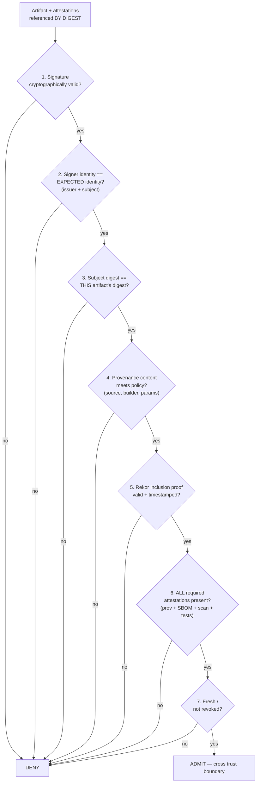
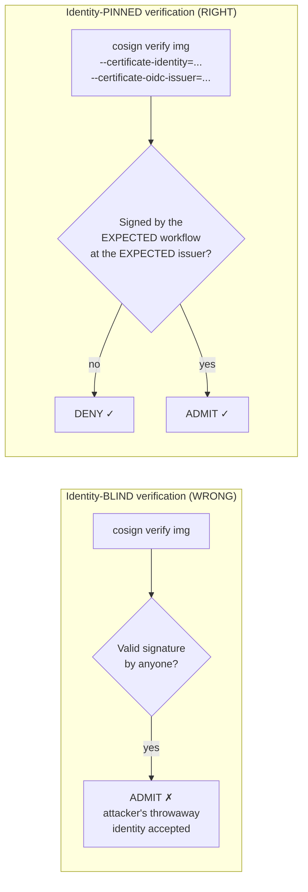
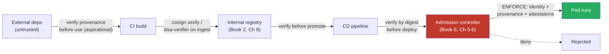
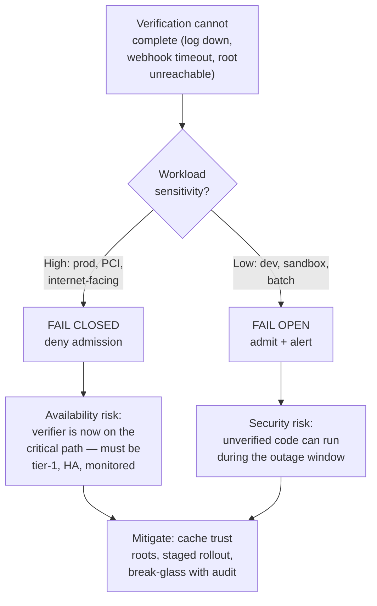

# Chapter 8 — Provenance Verification in Practice

*What this chapter covers.* The last five chapters built the *production* side of the trust
machine: cryptographic primitives (Chapter 1), classic and keyless signing (Chapters 2–4), the
transparency log that makes ephemeral keys auditable (Chapter 5), and the in-toto attestation
framework that carries provenance, SBOMs, tests, and scans (Chapter 6). Producing all of that is
necessary but, on its own, worth almost nothing. A signature that no one checks changes no
attacker's calculus. Provenance that never gates a deploy is a log file with extra steps. The
value of every mechanism in this book is realized at exactly one moment: when a **verifier** reads
the metadata, compares it against a **policy**, and makes an **admit/deny** decision that stops
bad code from running. This chapter is the practical, hands-on treatment of that moment — what to
check, in what order, with which tools, where in the pipeline, and how to reason about the
inevitable operational failure: what to do when the verifier itself cannot decide.

The single most important idea here is deceptively simple and constantly botched: **verifying that
something is validly signed is nearly useless; you must verify that it was signed by the *expected*
identity, and that the signed thing is *this* artifact.** Most of this chapter is spent making that
distinction concrete and enforceable.

Learning goals — after this chapter you should be able to:

- Articulate the **"produce AND verify"** principle and name the six properties verification
  establishes: identity, integrity, provenance, policy compliance, transparency, and
  freshness/non-revocation.
- Execute the **layered verification checklist** — signature validity → *signer identity vs
  policy* → subject/digest match → provenance content vs policy → transparency-log inclusion →
  required-attestation set → freshness — and explain what each step defends against.
- Run real verification with `cosign verify`, `cosign verify-attestation`, and `slsa-verifier`,
  using the correct flags (`--certificate-identity`, `--certificate-oidc-issuer`, `--type`,
  `--policy`, `--source-uri`, `--builder-id`) and knowing what each enforces.
- Write admission-time policy with **sigstore/policy-controller** (`ClusterImagePolicy`) and
  **Kyverno** (`verifyImages`) that requires keyless signatures from a specific identity *plus*
  named attestations, and understand why `verify-by-digest` matters.
- Place verification gates across the SDLC — CI, registry ingest, CD, and **admission as the
  enforcement backstop** — and recognize the trust boundary each gate defends.
- Diagnose the common failure modes (identity-blind verification, over-broad identity policy,
  sign-but-don't-verify, subject mismatch, TOCTOU, skipped transparency checks) and reason
  explicitly about **fail-open vs fail-closed**.

## The verification mindset

Security in a signing system is not enforced where signatures are produced. It is enforced where
they are *checked*. This is worth stating baldly because the industry's incentives push the other
way: producing signatures is visible, demo-able, and satisfying — you run `cosign sign`, a green
check appears, and the ticket closes. Verification is invisible when it works and a production
outage when it's too strict, so it is chronically underinvested. The result is an ecosystem full of
diligently signed artifacts that nothing on the consuming side ever inspects.

That gap is the attacker's dream. A pipeline that signs everything and verifies nothing has *more*
attack surface than one that does neither, because it manufactures a false sense of assurance while
providing no actual gate. The attacker does not need to forge a signature; they need only get their
artifact into the flow at a point where no one is checking — and if nothing checks, every point
qualifies. The recurring warning across this suite (Book 4, Chapter 3 on SLSA provenance; Book 3,
Chapter 9 on operationalizing SBOMs) is the same: **an attestation you produce but never verify is
security theater.** The metadata has to *gate* something.

So the mental model to internalize is a pipeline of two halves. The first half — everything in
Chapters 1–6 — *emits* signed claims. The second half — this chapter — *consumes* them and
converts them into a decision. Verification is where the following six properties actually get
established:

| Property | Question it answers | Established by |
|---|---|---|
| **Identity** | *Who or what* produced this? | Signature over an identity-bound certificate (Ch 4) |
| **Integrity** | Has it been modified since? | Digest binding, signature check (Ch 1) |
| **Provenance** | Built *how*, from *what source*? | SLSA provenance predicate (Book 4, Ch 3) |
| **Policy compliance** | Does it meet *our* requirements? | Policy engine over the attestations (Ch 6) |
| **Transparency** | Is it publicly logged and auditable? | Rekor inclusion proof (Ch 5) |
| **Freshness / non-revocation** | Is the trust still valid *now*? | Timestamps, revocation checks |

Note that a bare signature check — the thing most people mean when they say "we verify our images"
— establishes only the first two, and only partially. The rest require reading the *content* of
attestations and comparing it against policy. That is the work.

## The layered verification checklist

Verification is not one check; it is an ordered gate of them. Each layer answers a different
question, and skipping any one leaves a specific, exploitable hole. Run them in this order — cheap
cryptographic checks first, then identity, then content — and deny on the first failure.



### 1. Signature validity

The cheapest and most fundamental check: does the signature verify against the public key or
certificate? For keyed signing this is a raw signature verification (Chapter 1); for keyless
Sigstore signing it means the certificate chains to a trusted Fulcio root, the certificate's
validity window covered the signing time (proven by the Rekor timestamp — Chapter 5), and the
signature verifies against the certificate's embedded public key. This layer establishes that
*some* private key controlled by *some* identity produced this signature. It says nothing about
*which* identity. Passing this and stopping is the single most common verification mistake in the
wild.

### 2. Signer identity versus policy — the layer everyone botches

A valid signature by *anyone* is worth essentially nothing. Sigstore's Fulcio will issue a signing
certificate to *any* authenticated identity — your CI, my CI, an attacker's GitHub Actions
workflow, a random Gmail account via the browser OIDC flow. The transparency log will happily log
all of them. So "this image is validly signed and in Rekor" is true of an image an attacker signed
five minutes ago with their own throwaway identity. The signature is real. The identity is wrong.

Verification must therefore assert the **expected identity**, not merely *an* identity:

- For **keyless** signing: the certificate's **OIDC issuer** must be the expected issuer (e.g.,
  `https://token.actions.githubusercontent.com` for GitHub Actions), *and* the certificate's
  **subject / SAN** must be the expected workload — the specific repository, workflow file, and ref
  (Chapter 4). "Signed by a GitHub Actions workflow" is not enough; it must be *our* workflow at
  *our* ref.
- For **keyed / KMS** signing: the signature must verify against the *specific* public key you
  trust, and that key's identity in your KMS must be the expected one.



This is the load-bearing layer. Everything else is defense in depth around it. If you take one
operational lesson from this chapter: **pin the identity.**

### 3. Subject / digest match

An attestation or signature is *about* a specific artifact, identified by cryptographic digest
(content addressing — Chapter 1). Verification must confirm the metadata you validated actually
describes the artifact you are about to run. Two failure modes hide here. First, an attestation for
image A can be presented alongside image B — if you validate the attestation's signature and
identity but never check that its `subject.digest` equals B's digest, you've verified a claim about
a *different* artifact. Second, the whole verification must be **anchored to a digest, not a
mutable tag**. `registry.example.com/app:latest` is a pointer that can be repointed after you check
it. `registry.example.com/app@sha256:abcd…` is immutable. Verify the digest; deploy the digest.

### 4. Provenance content versus policy

Now we read the *inside* of the provenance predicate (Book 4, Chapter 3) and compare it to policy.
A signature proves who signed; the provenance predicate says *how the artifact was built*, and
policy decides whether that's acceptable:

- **Source**: built from the expected repository and ref — e.g., `main`, not an attacker's fork or
  feature branch.
- **Builder**: produced by a trusted builder ID — your hosted CI, the SLSA GitHub generator, your
  internal build platform — not an unknown runner.
- **Build parameters**: meets policy — e.g., SLSA Build Level 3, hermetic build, no injected
  parameters, expected entry point.

This is where "signed by our CI" becomes "built from `main` of the right repo, on our L3 builder,
with the expected workflow." A compromised-but-legitimate identity (say, a workflow that an
attacker triggered from a malicious branch) can pass the identity check and still be caught here if
your policy pins the ref.

### 5. Transparency-log inclusion

The Rekor entry must exist and carry a valid **inclusion proof** and a signed **timestamp**
(Chapter 5). This does two things. It makes the signing event **auditable** — anyone monitoring the
log can detect a signature by an unexpected identity. And it enables **verify-after-expiry**: the
Rekor timestamp proves the short-lived Fulcio certificate was valid *at signing time*, so you can
verify the signature years later even though the certificate expired minutes after issuance. Skip
this and you lose both auditability and the ability to trust anything past the ~10-minute
certificate lifetime. Cosign checks the log by default; disabling it (`--insecure-ignore-tlog`) is
a deliberate downgrade.

### 6. Required-attestation set

Policy rarely wants *one* attestation. A mature gate requires a **set**: SLSA provenance *and* an
SBOM (Book 3) *and* a passing vulnerability scan *and* test results (Chapter 6). Verification must
check that *all* required predicate types are present, each individually valid and identity-pinned.
A missing SBOM is a policy failure, not a warning. This turns "is it signed?" into "does it satisfy
our full supply-chain contract?"

### 7. Freshness and revocation

Where applicable: is the trust still current? A vulnerability-scan attestation from six months ago
may no longer reflect known CVEs; policy may require a scan attestation no older than N days. If you
run your own PKI (Chapter 9) rather than ephemeral keys, revocation matters — a compromised signing
key's artifacts must stop verifying. With keyless Sigstore the ephemeral-key model sidesteps
classic revocation, but freshness of *content* attestations remains a live concern.

## Tools and concrete commands

### cosign verify — signature + identity + transparency, in one command

For keyless verification, cosign 2.0 and later **require** you to pin the identity — the flags are
not optional, precisely because identity-blind verification was such a common footgun in the 1.x
era:

```bash
cosign verify \
  --certificate-identity "https://github.com/myorg/myrepo/.github/workflows/release.yml@refs/heads/main" \
  --certificate-oidc-issuer "https://token.actions.githubusercontent.com" \
  registry.example.com/app@sha256:3f7a...c19d
```

Note the reference is a **digest**, not a tag. What each part enforces:

- `--certificate-identity` — the exact SAN in the Fulcio cert; here, the specific workflow file at
  a specific ref. This is checklist layer 2. Use `--certificate-identity-regexp` when you must
  match a family of identities, but keep the regex tight (see the over-broad footgun below).
- `--certificate-oidc-issuer` — the OIDC issuer that minted the token; pins the *source* of the
  identity. An attacker signing via Google OAuth cannot satisfy an issuer pinned to GitHub Actions.
- By default, cosign also verifies the **Rekor** inclusion proof (layer 5). Add `--rekor-url` for a
  private log; `--offline` verifies from a bundle without contacting Rekor live.

For **keyed** verification, swap identity flags for a key:

```bash
cosign verify --key cosign.pub registry.example.com/app@sha256:3f7a...c19d
# or a KMS reference:
cosign verify --key awskms:///alias/prod-signing registry.example.com/app@sha256:3f7a...c19d
```

A successful run prints the verified DSSE/signature payloads (trimmed):

```
Verification for registry.example.com/app@sha256:3f7a...c19d --
The following checks were performed on each of these signatures:
  - The cosign claims were validated
  - Existence of the claims in the transparency log was verified offline
  - The code-signing certificate was verified using trusted certificate authority certificates
Certificate subject: https://github.com/myorg/myrepo/.github/workflows/release.yml@refs/heads/main
Certificate issuer URL: https://token.actions.githubusercontent.com
```

### cosign verify-attestation — checking the *content* of attestations

`verify-attestation` does everything `verify` does (signature + identity + Rekor) *plus* selects a
predicate type and evaluates a **policy** over its content — checklist layers 4 and 6 in one shot:

```bash
cosign verify-attestation \
  --type slsaprovenance \
  --certificate-identity-regexp "^https://github.com/myorg/" \
  --certificate-oidc-issuer "https://token.actions.githubusercontent.com" \
  --policy provenance-policy.cue \
  registry.example.com/app@sha256:3f7a...c19d
```

- `--type` selects the predicate. Cosign understands shorthands: `slsaprovenance` (SLSA v0.2),
  `slsaprovenance1` (SLSA v1.0), `spdxjson`, `cyclonedx`, `vuln`, `link`, or a full predicate-type
  URI for custom types.
- `--policy` points at a **CUE** or **Rego** file evaluated against the predicate. This is where
  "built from `main`" becomes an enforced assertion rather than a hope.

A minimal CUE policy pinning the source and builder for a SLSA v0.2 provenance predicate:

```cue
// provenance-policy.cue
predicateType: "https://slsa.dev/provenance/v0.2"

predicate: {
    builder: id: =~"^https://github.com/myorg/"
    invocation: configSource: {
        uri: =~"^git\\+https://github.com/myorg/myrepo@refs/heads/main$"
    }
}
```

If the provenance says it was built from a fork, a feature branch, or an unexpected builder, CUE
evaluation fails and cosign exits non-zero. That non-zero exit is the entire point: it is what a CI
step or admission controller gates on.

### slsa-verifier — purpose-built SLSA provenance verification

`slsa-verifier` (from the SLSA framework) is a focused tool that verifies SLSA provenance against a
source and builder, doing the source/builder/ref checks (layer 4) with SLSA-aware defaults. For a
released binary with detached provenance:

```bash
slsa-verifier verify-artifact app-linux-amd64 \
  --provenance-path app-linux-amd64.intoto.jsonl \
  --source-uri github.com/myorg/myrepo \
  --source-tag v1.4.2 \
  --builder-id "https://github.com/slsa-framework/slsa-github-generator/.github/workflows/generator_generic_slsa3.yml@refs/tags/v2.0.0"
```

For a container image (provenance stored in the registry):

```bash
slsa-verifier verify-image "registry.example.com/app@sha256:3f7a...c19d" \
  --source-uri github.com/myorg/myrepo \
  --builder-id "https://github.com/slsa-framework/slsa-github-generator/.github/workflows/builder_container-based_slsa3.yml@refs/tags/v2.0.0"
```

What it checks: the provenance signature and its transparency-log entry, that the **`--source-uri`
matches** the repository recorded in the provenance, that the **`--builder-id` matches** the builder
that produced it (this is the trust anchor — you are asserting *which* builder you trust), and,
when supplied, that `--source-tag` / `--source-branch` match. It rejects on any mismatch. The
crucial mental model: `--builder-id` and `--source-uri` are *your policy inputs*. Passing them is
how you say "I only trust artifacts built by *this* builder from *this* repo." Omitting the pins,
or accepting any builder, reduces the tool to a signature check.

### Policy engines for attestations at admission

The commands above are what you run in a pipeline step. At the runtime platform, verification is
expressed as **policy** enforced by an admission controller. Two dominant approaches on Kubernetes:

**sigstore/policy-controller** with a `ClusterImagePolicy` — this is the Sigstore-native admission
controller. It requires matching images to be signed by a pinned keyless identity *and* to carry
named attestations, evaluating a CUE/Rego policy over each:

```yaml
apiVersion: policy.sigstore.dev/v1beta1
kind: ClusterImagePolicy
metadata:
  name: require-prov-and-sbom
spec:
  images:
    - glob: "registry.example.com/**"
  authorities:
    - keyless:
        url: https://fulcio.sigstore.dev
        identities:
          - issuer: https://token.actions.githubusercontent.com
            subjectRegExp: "^https://github.com/myorg/[^/]+/.github/workflows/release.yml@refs/heads/main$"
        ctlog:
          url: https://rekor.sigstore.dev
      attestations:
        - name: must-have-slsa-provenance
          predicateType: https://slsa.dev/provenance/v1
          policy:
            type: cue
            data: |
              predicate: buildDefinition: externalParameters: workflow: ref: "refs/heads/main"
        - name: must-have-sbom
          predicateType: https://spdx.dev/Document
```

This one policy asserts identity (`issuer` + `subjectRegExp`), transparency (`ctlog`), a
provenance *content* check (the CUE block), *and* the presence of a second required attestation
(the SBOM). A pod referencing a non-conforming image is rejected at admission.

**Kyverno** with a `verifyImages` rule — Kyverno is a general-purpose policy engine whose image
verification does the same job with an important extra: it can **rewrite the tag to a digest** at
admission, closing the TOCTOU gap:

```yaml
apiVersion: kyverno.io/v1
kind: ClusterPolicy
metadata:
  name: verify-image-and-attestations
spec:
  validationFailureAction: Enforce
  webhookTimeoutSeconds: 30
  rules:
    - name: verify-signature-and-provenance
      match:
        any:
          - resources:
              kinds: ["Pod"]
      verifyImages:
        - imageReferences:
            - "registry.example.com/*"
          mutateDigest: true      # resolve tag -> digest, pin it into the Pod spec
          verifyDigest: true
          required: true
          attestors:
            - count: 1
              entries:
                - keyless:
                    subject: "https://github.com/myorg/myrepo/.github/workflows/release.yml@refs/heads/main"
                    issuer: "https://token.actions.githubusercontent.com"
                    rekor:
                      url: https://rekor.sigstore.dev
          attestations:
            - type: https://slsa.dev/provenance/v1
              attestors:
                - entries:
                    - keyless:
                        subject: "https://github.com/myorg/myrepo/.github/workflows/release.yml@refs/heads/main"
                        issuer: "https://token.actions.githubusercontent.com"
              conditions:
                - all:
                    - key: "{{ buildDefinition.externalParameters.workflow.ref }}"
                      operator: Equals
                      value: "refs/heads/main"
```

`mutateDigest: true` is doing security work, not convenience: Kyverno resolves the tag to a digest,
verifies against *that* digest, and pins the digest into the admitted Pod spec, so the kubelet
pulls exactly what was verified. `validationFailureAction: Enforce` makes this a hard gate rather
than an audit log. The `attestations.conditions` block is the content check (layer 4) expressed in
Kyverno's JMESPath.

**in-toto / Witness** verification (Chapter 6) rounds out the toolset for full-pipeline layout
verification — `in-toto-verify` against a signed layout, or `witness verify` against a policy —
when you need to assert that an entire chain of steps ran in order and connected by hash, not just
that a final artifact is signed.

## Where verification happens: defense in depth

Verification is not a single gate; it is a series of gates along the path an artifact travels from
"untrusted/external" to "trusted/will-run." Each gate defends a **trust boundary** — the point
where an artifact crosses from a lower-trust zone to a higher-trust one. The rule of thumb:
**verify at every boundary crossing, and treat admission as the non-negotiable backstop.**



- **At pull / in CI** — verify the provenance of *dependencies* before consuming them (e.g.,
  `slsa-verifier` on a downloaded release, `cosign verify` on a base image). This is the most
  aspirational gate because much of the ecosystem still lacks provenance, but where it exists it
  stops a poisoned dependency at the door.
- **At the internal registry (ingest)** — when an artifact enters your controlled registry (Book 2,
  Chapter 8), verify it once at the boundary between "built" and "storable." This is a good place to
  attach your own re-attestation.
- **In the CD pipeline (before deploy)** — the promotion gate. Verify by digest before the pipeline
  hands the artifact to the platform. Pair with a Verification Summary Attestation (VSA, Chapter 6)
  so downstream stages can trust a cheap signed summary instead of re-verifying deeply.
- **At admission in the runtime platform — the backstop.** This is the most important gate because
  it is the *last* one and the one closest to execution. Kubernetes admission (Book 6, Chapters 5–6;
  and deployment gates in Chapter 10) verifies image signatures, identity, and attestations *before
  a pod is allowed to run*. Every other gate can be bypassed by someone who deploys out-of-band —
  `kubectl apply` straight to the cluster, a rogue GitOps commit, a compromised CD system. Admission
  cannot be bypassed by anything short of compromising the control plane itself, because *nothing
  runs* without passing through it. That property — unavoidable, closest to execution — is what
  makes admission the enforcement backstop that justifies all the upstream signing.

Multiple gates are not redundant; they are defense in depth. Upstream gates give fast feedback and
catch problems early and cheaply; admission guarantees that *nothing* runs unverified regardless of
how it got there.

## Common failure modes and pitfalls

These are the ways real verification setups fail. Every one has been observed in production
supply-chain programs.

**1. Verifying validity but not identity.** The classic mistake, restated because it dominates:
accepting anything validly signed by anyone. A pipeline that runs `cosign verify --key cosign.pub`
against a shared org key, or keyless `cosign verify` without identity flags (impossible in cosign
2.0+, which is *why* the flags became mandatory), is verifying that *a* signature exists — not that
*your* signer made it. The fix is layer 2: always pin `--certificate-identity(-regexp)` and
`--certificate-oidc-issuer`, or the specific key.

**2. Over-broad identity policy.** The subtler cousin: you pin identity, but too loosely.
`--certificate-identity-regexp "https://github.com/myorg/.*"` accepts *any repo in the org* and
*any workflow* — including a low-security sandbox repo an attacker can push to, or a non-release
workflow. The identity footgun from Chapter 4 lives here. Scope the regex to the specific
repository, the specific workflow file, and the specific ref. Anchor it (`^…$`). Every character you
leave as `.*` is trust you're extending to someone.

**3. Sign but don't verify.** The organizational failure: teams stand up `cosign sign` and SLSA
provenance generation, celebrate the coverage metric, and never build the consuming gate. The
attestations pile up in the registry, verified by nothing. This is the Book 4, Chapter 3 warning
made concrete — provenance that gates no decision protects nothing. The remedy is not more
production; it is a *gate*, ideally at admission, that fails closed on missing or non-conforming
attestations.

**4. Not checking subject/digest match.** Verifying an attestation whose signature and identity are
valid but whose `subject.digest` describes a *different* artifact. An attacker who can present a
legitimately-signed attestation for image A alongside malicious image B slips through if you never
bind the check to B's digest. Tools like `cosign verify-attestation` bind subject to the image
reference automatically *when you pass a digest* — which is another reason to always reference by
digest.

**5. TOCTOU — time-of-check to time-of-use.** You verify `app:latest`, resolve it to digest X, and
approve — then between check and deploy the tag is repointed to malicious digest Y, and the platform
pulls Y. The defect is verifying a *mutable* reference. The fix is end-to-end digest pinning:
verify by digest, record the digest, deploy *that* digest, and have admission re-verify the digest
it's actually about to run. Kyverno's `mutateDigest: true` operationalizes this by pinning the
verified digest into the admitted spec (ties to Book 6, Chapter 1 on image references).

**6. Ignoring transparency-log verification.** Passing `--insecure-ignore-tlog`, or accepting
signatures from expired certificates without a Rekor timestamp to prove signing-time validity. This
silently discards auditability *and* breaks verify-after-expiry — the keyless model depends on the
log to make ephemeral certificates verifiable later (Chapters 3 and 5). Don't disable it outside of
tightly-scoped air-gapped cases with a private log.

**7. Availability coupling on the verifier chain.** If admission verification calls out to Fulcio's
root, Rekor, or an OIDC provider synchronously, an outage in any of those (Chapters 5 and 9) can
stall or fail your deploys. This is not a reason to skip verification; it is a reason to design the
verifier, log, and policy engine as tier-1 infrastructure and to make an explicit fail-open /
fail-closed decision — which is the next section.

## Fail-open vs fail-closed

Eventually the verifier itself cannot decide. Rekor is unreachable, the policy engine's webhook
times out, the Fulcio root can't be fetched, the OIDC issuer is down. The gate faces a binary
choice with no good universal answer: **fail-open** (admit despite being unable to verify) or
**fail-closed** (deny). This is the security-versus-availability tension in its rawest form, and
pretending it doesn't exist is how you get either a self-inflicted outage or a gate that quietly
stops gating.



The reasoning framework:

- **Match the mode to the blast radius.** For high-sensitivity workloads — production, regulated
  environments, internet-facing services — **fail closed**. The cost of running one unverified
  artifact exceeds the cost of a deploy freeze during an outage. For low-sensitivity paths —
  developer sandboxes, batch jobs behind other controls — fail-open-and-alert may be acceptable.
- **Fail-closed makes the verifier a hard dependency**, so you must earn it: run the policy engine
  and log as **tier-1 HA infrastructure**, cache trust roots and (where possible) inclusion proofs
  locally, use bundle-based **offline verification** (`cosign verify --offline`) so admission does
  not call Rekor synchronously on the hot path, and monitor the verifier's own availability as a
  first-class SLO.
- **Roll out staged.** Introduce a new fail-closed policy in **audit/warn** mode first
  (`validationFailureAction: Audit` in Kyverno; dry-run in policy-controller), watch what it *would*
  have denied, fix the false positives, and only then flip to `Enforce`. Flipping straight to
  fail-closed across a fleet is how you take down every deploy at once.
- **Provide break-glass, with audit.** A documented, logged, time-boxed override for genuine
  emergencies — but one that generates a loud, auditable trail so it isn't the default path.

The honest summary: fail-closed is correct for anything that matters, *and* it obligates you to
operate the verification chain as critical infrastructure. You cannot have a meaningful backstop
that is also allowed to be flaky.

## Distributed-systems lens

At the scale this suite assumes — hundreds of services, dozens of teams, thousands of deploys a day
— verification stops being a command an engineer runs and becomes a property of the platform.
Several consequences follow.

**Verification must be automated and enforced at gates, uniformly.** No human runs `cosign verify`
before a deploy at this scale; the paved-road deploy path and the admission controllers (Book 6) do
it on *every* artifact, every time, without exception. The moment verification is optional or
manual, it is skipped under deadline pressure, and the gate that is skipped 1% of the time is the
gate an attacker targets. Uniform automated enforcement is the only kind that holds.

**Policy is centralized; enforcement is distributed.** *What* identities are trusted, *which*
builders are acceptable, and *which* attestations are required belong in one place — central policy,
managed as code (Book 8, Chapter 4 on policy-as-code; Book 8, Chapter 4 also frames continuous
compliance). That central policy is then *applied* at every admission controller across every
cluster. A single change ("we now require an SBOM attestation on all prod images") propagates to the
whole fleet without touching individual services. The `ClusterImagePolicy` / Kyverno `ClusterPolicy`
resources are the distribution mechanism.

**Verify by digest, end to end.** Immutable references are the distributed-systems answer to swap
attacks. When the CI output, the registry entry, the CD promotion, and the admission decision all
name the *same digest*, there is no seam for a TOCTOU substitution. Tags are for humans; the machine
path is digests all the way down.

**The verifier, policy engine, and transparency log are tier-1 infrastructure.** If admission is the
backstop that makes all upstream signing worthwhile — and it is — then the components that admission
depends on inherit production-grade availability requirements. A flaky policy engine is not a minor
annoyance; it is either a deploy outage (fail-closed) or a silent security hole (fail-open). Treat it
like the load balancer: HA, monitored, on-call.

**VSA lets you verify centrally and delegate the summary.** Re-verifying deep provenance and a full
attestation set at every gate for every artifact is expensive in latency and in load on Rekor and
Fulcio. The Verification Summary Attestation (Chapter 6) is the scaling lever: a trusted central
verifier does the deep check once, emits a signed VSA recording the result and the levels achieved,
and downstream gates verify the *summary* — one cheap signature check — instead of redoing the work.
This is the same delegated-trust pattern that shows up throughout distributed systems: verify once at
a trusted authority, propagate a compact signed assertion, and let consumers check the assertion
rather than re-deriving the fact.

The through-line: producing signatures and provenance is the easy, visible half. Verification —
automated, identity-pinned, digest-anchored, enforced at admission, failing closed for anything that
matters — is the half that actually stops attacks. Everything in Chapters 1–6 is potential energy.
The gate in this chapter is where it converts to work.

## Key takeaways

- **Produce AND verify.** Signatures, provenance, and SBOMs that nothing checks are security
  theater. Security is enforced at the *verifier*, not the producer. A system that signs diligently
  and verifies nothing has *negative* value — false assurance over a real gap. This warning recurs
  across the suite (Book 4, Ch 3; Book 3, Ch 9) because the mistake is endemic.
- **Valid ≠ trusted.** A cryptographically valid signature by *anyone* is nearly worthless; Fulcio
  and Rekor will happily issue and log a signature for an attacker's throwaway identity. You must
  verify the **expected identity** — issuer *and* subject (workflow, repo, ref) for keyless; the
  specific key for keyed. **Pin the identity.** This is the most-botched step and the one that
  matters most.
- **Verification is a layered checklist:** signature validity → *identity vs policy* → subject/digest
  match → provenance content vs policy (source, builder, params) → Rekor inclusion → required
  attestation set → freshness. Deny on the first failure. Each layer closes a specific hole.
- **Use the real tools with the real flags.** `cosign verify --certificate-identity
  --certificate-oidc-issuer`; `cosign verify-attestation --type --policy`; `slsa-verifier
  verify-artifact/verify-image --source-uri --builder-id`. In cosign 2.0+ the keyless identity
  flags are *mandatory* — a deliberate fix for identity-blind verification.
- **Enforce at admission as the backstop.** Verify at CI, at registry ingest, and in CD for fast
  feedback — but Kubernetes admission (policy-controller `ClusterImagePolicy`, Kyverno
  `verifyImages`) is the unavoidable, last-line gate that guarantees nothing runs unverified
  regardless of how it was deployed. Use `mutateDigest`/digest pinning to defeat TOCTOU.
- **Verify by digest, end to end.** Mutable tags enable swap attacks; content-addressed digests
  close the seam. Verify the digest, record it, deploy it, re-verify it at admission.
- **Decide fail-open vs fail-closed deliberately.** Fail closed for anything that matters, and pay
  the price: run the verifier, policy engine, and log as tier-1 HA infrastructure; use offline
  bundle verification off the hot path; roll out in audit mode before enforcing; provide audited
  break-glass. Fail-open is only for low-sensitivity paths.
- **At fleet scale:** centralize policy (what's trusted/required), distribute enforcement (every
  admission controller applies it), and use **VSA** to verify deeply once and propagate a cheap
  signed summary — managing latency and load without weakening the gate.

## Further reading

- **Cosign documentation** — `cosign verify` and `cosign verify-attestation`, the certificate
  identity/issuer flags, predicate `--type` values, and CUE/Rego `--policy`.
  <https://docs.sigstore.dev/> and <https://github.com/sigstore/cosign>. The cosign 2.0 release
  notes document the shift to *mandatory* keyless identity flags — read them for the rationale.
- **slsa-verifier** — `verify-artifact`, `verify-image`, `verify-npm-package`, and the
  `--source-uri` / `--builder-id` / `--source-tag` semantics. <https://github.com/slsa-framework/slsa-verifier>.
  The authority on what SLSA provenance verification actually checks (developed in Book 4, Chapter 3).
- **sigstore/policy-controller** — the `ClusterImagePolicy` CRD: `authorities`, `keyless.identities`
  (issuer/subject regex), `ctlog`, and `attestations` with CUE/Rego policy blocks.
  <https://docs.sigstore.dev/policy-controller/overview/> and
  <https://github.com/sigstore/policy-controller>.
- **Kyverno image verification** — the `verifyImages` rule, `attestors`/`attestations`,
  `mutateDigest`, and `verifyDigest`. <https://kyverno.io/docs/policy-types/cluster-policy/verify-images/>.
  Applied at admission in Book 6, Chapters 5–6.
- **in-toto Attestation Framework** — the Statement/predicate model whose content these tools verify;
  the predicate-type registry. <https://github.com/in-toto/attestation> (Chapter 6).
- **SLSA v1.0 — Verifying artifacts / Verification Summary Attestation** — the provenance and VSA
  specs, and the delegated-verification model. <https://slsa.dev/spec/v1.0/verifying-artifacts> and
  <https://slsa.dev/verification_summary/v1>.
- **Rekor** — inclusion proofs, signed timestamps, and offline/bundle verification enabling
  verify-after-expiry. <https://docs.sigstore.dev/logging/overview/> (mechanics in Chapter 5).
- Cross-references: Book 5, Chapter 1 (crypto, digests, DSSE), Chapters 3–5 (Sigstore, keyless
  identity, Rekor), Chapter 6 (in-toto attestations, VSA), Chapter 10 (attestation-based deployment
  gates); Book 4, Chapter 3 (SLSA provenance); Book 2, Chapter 8 (internal registries); Book 6,
  Chapters 1, 5–6 (image references, image signing in Kubernetes, admission and policy engines);
  Book 8, Chapter 4 (policy as code and continuous compliance).
