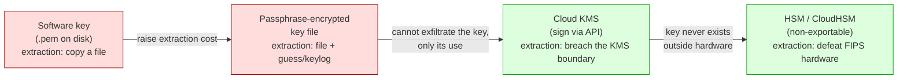
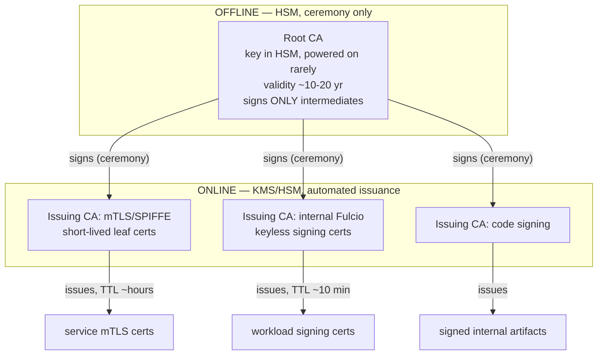
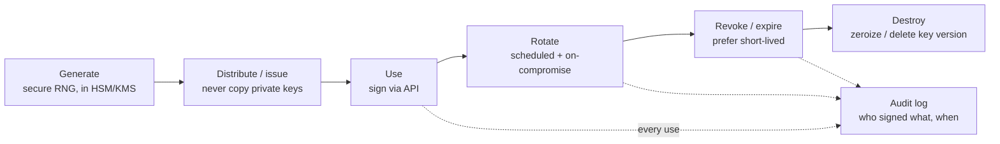
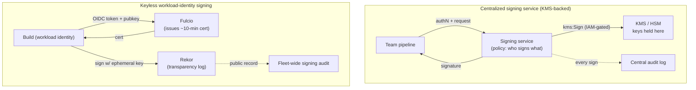
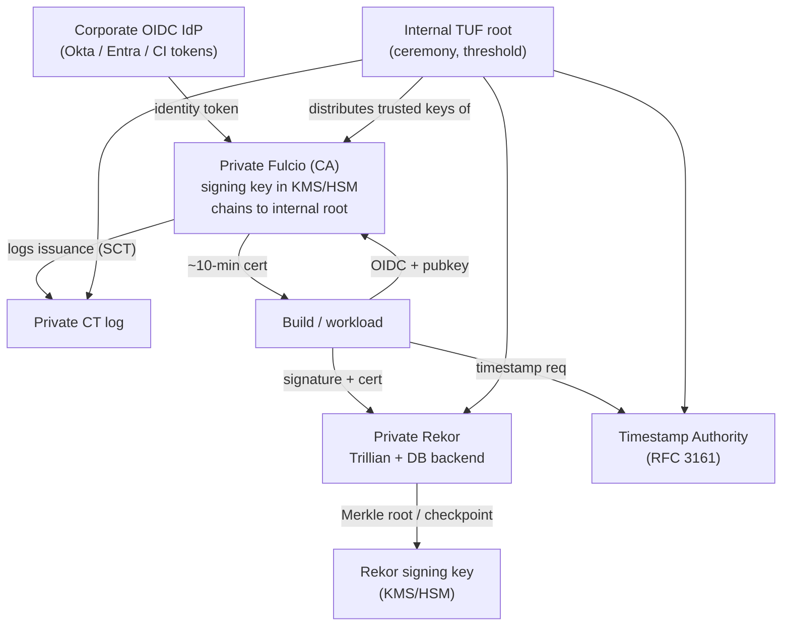
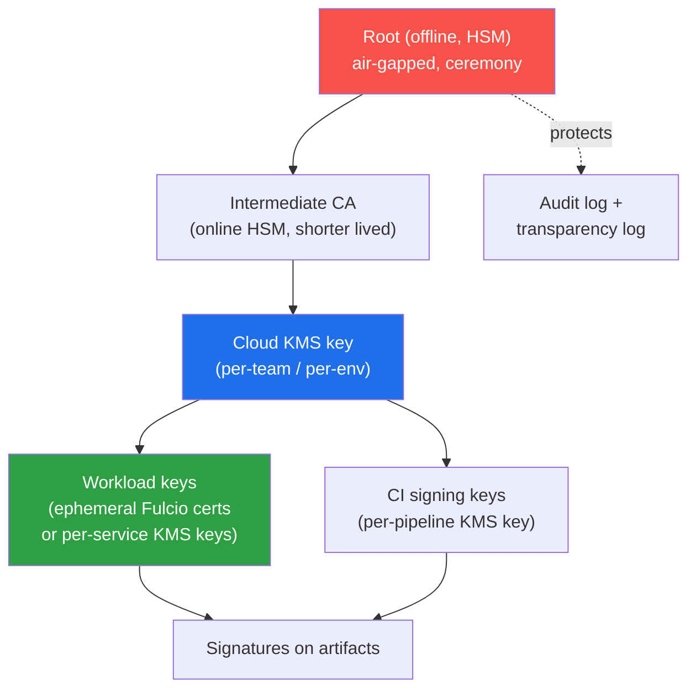
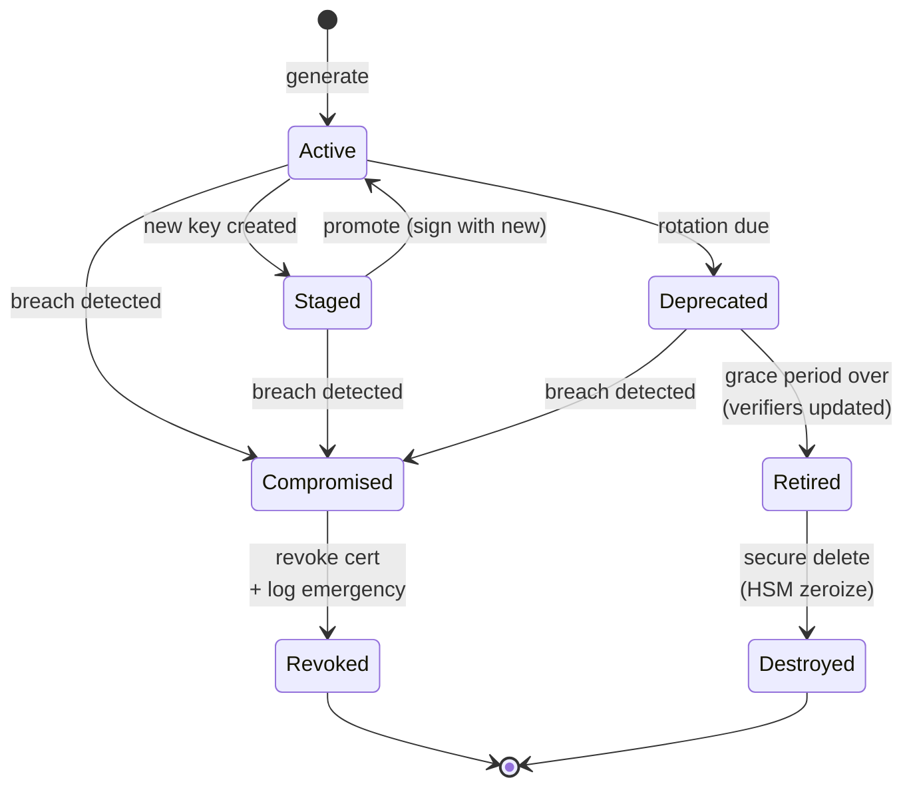

# Chapter 9 — Key Management and PKI for the Enterprise

*What this chapter covers.* Chapter 4 spent a chapter dismantling the word "keyless," and its
conclusion was sobering rather than triumphant: keyless signing removes the *long-lived,
human-held* key, but it does not remove keys from the world. Someone runs Fulcio's certificate
authority, and Fulcio has a signing key. Someone holds the TUF root keys that anchor Sigstore's
own trust (Chapter 7). Someone provisions the KMS keys behind an internal CA, and someone signs
release binaries with a high-assurance key that no OIDC token will ever stand in for. The
enterprise reality is that even a fully keyless artifact pipeline sits on a foundation of real
keys and real public-key infrastructure — for internal CAs, mTLS between services (Book 9), an
internal Fulcio, a private Rekor, and the crown-jewel release and root keys that must survive
audits and adversaries. This chapter is the practical, operational treatment of that foundation:
how to store keys so they are hard to steal, how to build and run internal PKI, how to move the
whole fleet onto short-lived certificates so revocation stops mattering, how to run the key
lifecycle as a disciplined operation rather than a folder of `.pem` files, and how to stand up a
self-hosted Sigstore that meets the same tier-1 availability bar as the rest of your platform.

Learning goals — after this chapter you should be able to:

- Place any key-storage option on the **extraction-cost / assurance spectrum** — software file →
  passphrase-encrypted → KMS → HSM — and justify the enterprise default: *sign via an API; never
  hold the key material.*
- Use **cloud KMS** (AWS KMS, GCP Cloud KMS, Azure Key Vault) and **HSMs** as signing backends,
  including the real `cosign` KMS URI schemes (`awskms://`, `gcpkms://`, `azurekms://`,
  `hashivault://`) and PKCS#11 for hardware.
- Design an **enterprise PKI hierarchy** with an offline HSM-backed root and online issuing
  intermediates — the same online/offline split TUF uses — and pick the right tool (Vault PKI,
  step-ca, cfssl, AWS Private CA, GCP CAS, EJBCA/Dogtag).
- Explain why **short-lived certificates + automation** (ACME, cert-manager, SPIRE) beat
  long-lived certificates plus revocation, and how they eliminate both expired-cert outages and
  the revocation problem Chapter 2 dissected.
- Run the **key lifecycle** — generation, distribution, rotation (without breaking verification),
  revocation, destruction, and audit — and run a **root-key ceremony** with m-of-n threshold,
  offline material, and witnesses (the TUF model, Chapter 7).
- Choose between and combine the two org-scale signing architectures: a **centralized
  KMS-backed signing service** and **keyless workload-identity signing** — and stand up
  **self-hosted Sigstore** (private Fulcio/Rekor/TUF/TSA) as tier-1 infrastructure.

## Why key management is the hard part

Chapter 2 built an entire failure taxonomy for classic code signing, and its dominant entry was
**key theft**: Stuxnet's operators signed with driver-signing keys stolen from Realtek and
JMicron; the 2022 NVIDIA breach leaked code-signing certificates that were promptly reused to sign
malware. In every one of those incidents the cryptography was flawless. What failed was
*custody* — the operational problem of keeping a durable secret secret for the one-to-three-year
window during which it is, cryptographically, the identity.

Chapter 3 and Chapter 4 showed keyless signing shrinking that window from years to seconds. But
"shrink" is not "eliminate," and the residue is exactly the set of keys an enterprise cannot make
ephemeral:

- **Fulcio's CA key.** Every keyless certificate is signed by Fulcio's intermediate, which chains
  to a root. Those are long-lived, high-value keys. If you self-host Fulcio, they are *your* keys.
- **The TUF root keys** that anchor whichever Sigstore trust root your clients use (Chapter 7).
  Threshold-held, offline, ceremony-rotated — the most valuable keys in the system.
- **Rekor's signing key**, which signs checkpoints and Signed Entry Timestamps (Chapter 5).
- **Release and high-assurance keys** where a regulator, a customer contract, or an OS root
  program requires a specific, auditable, hardware-bound signer that OIDC identity cannot satisfy.
- **The mTLS/SPIFFE PKI** that every service in the fleet uses to authenticate every other
  service (Book 9) — thousands of certificates, issued and rotated continuously.

Key management is where cryptography meets operations, and operations is where it breaks. The math
never fails; the folder of unrotated `.pem` files, the CI secret copied into a Slack thread, the
intermediate that expired at 2 a.m. and took the fleet down — those fail. The goal of everything
in this chapter can be stated in one sentence: **keys that are hard to steal, easy to rotate, and
whose every use is controlled and audited.** Those three properties pull in different directions —
a key locked in an offline HSM is hard to steal and hard to rotate — and the craft of enterprise
key management is resolving that tension deliberately for each *class* of key rather than treating
all keys the same.

## Key storage and protection: the spectrum

Every private key lives somewhere, and where it lives sets a single dominant property: the **cost
to an attacker of extracting the key material**. Think of storage options as a spectrum from
"trivially copyable file" to "non-exportable hardware," and read the whole spectrum as a campaign
to raise that extraction cost until it exceeds the value of the key.



### Software keys — the worst option

A private key in a file is a private key one `cat`, one misconfigured S3 bucket, one leaked CI log,
or one `docker history` away from being someone else's. Book 4, Chapter 6 (secrets in CI) is a
catalog of the ways this file escapes: it gets committed, printed to a build log, baked into an
image layer, exfiltrated by a poisoned dependency in the build (event-stream, Codecov). The key is
**exportable by construction** — possession *is* the private key — so the extraction cost is
"obtain read access to one file," which in a large organization is not a high bar. Software keys
are acceptable only for throwaway, low-value, ephemeral material (the ephemeral keypair of keyless
signing lives in memory as a file-like object for seconds — that is fine precisely because it is
worthless after use).

### Passphrase-encrypted keys — marginal

Wrapping the key file in a passphrase (Cosign's default `import-key-pair`/`generate-key-pair`
produces a password-encrypted private key) raises the cost from "copy a file" to "copy a file
*and* obtain the passphrase." That is better, but the passphrase must be *somewhere* to be usable
by automation — a CI secret, an env var, a config file — and now you are protecting the passphrase
with the same broken tools you were protecting the key with. Encryption at rest defends against a
stolen backup or a lost laptop; it does nothing against an attacker who already has the process
that decrypts and uses the key. Marginal, not solved.

### Cloud KMS — the enterprise default for signing

The structural leap is a **key management service**: AWS KMS, GCP Cloud KMS, or Azure Key Vault.
The defining property is that **the private key material never leaves the service.** You do not
possess the key; you possess *permission to ask the service to sign on your behalf.* You send a
digest to a `Sign` API, IAM decides whether your caller is allowed to invoke that key for that
operation, the service signs inside its own boundary, and you get back a signature. The key is
**not exportable** — there is no API that returns the private bytes.

Re-read Chapter 2's key-theft class against that. There is nothing to steal from the runner,
because the runner never held the key. An attacker who fully compromises your CI can, at worst,
*use* the key while their access lasts — and every such use is an IAM-authenticated, logged API
call. That converts silent, permanent key theft into a bounded, revocable, *auditable* misuse
window, which is exactly the trade keyless signing makes with identity, achieved here with a key
you still nominally own. This is why KMS is the enterprise default for any signing key that must be
a *key* (rather than a keyless identity).

Cosign speaks KMS natively through URI references — the key is named by a URI and Cosign calls the
provider's signing API instead of reading a file:

```bash
# Generate an asymmetric signing key inside the KMS (never leaves the boundary),
# then reference it by URI for signing and verification.

# AWS KMS — reference by alias, key id, or full ARN
cosign generate-key-pair --kms awskms:///alias/release-signing
cosign sign --key awskms:///alias/release-signing \
  registry.example.com/app@sha256:1a2b...
# Verify against the KMS-held public key (or an exported copy)
cosign verify --key awskms:///alias/release-signing \
  registry.example.com/app@sha256:1a2b...

# GCP Cloud KMS — the URI is the full CryptoKeyVersion resource path
cosign sign \
  --key gcpkms://projects/acme/locations/global/keyRings/supply-chain/cryptoKeys/release/cryptoKeyVersions/1 \
  registry.example.com/app@sha256:1a2b...

# Azure Key Vault — vault host + key name (auth via AZURE_* env / managed identity)
cosign sign --key azurekms://acme-kv.vault.azure.net/release-signing \
  registry.example.com/app@sha256:1a2b...

# HashiCorp Vault Transit — the transit key name
cosign sign --key hashivault://release-signing \
  registry.example.com/app@sha256:1a2b...
```

Three operational points that matter more than the syntax. **First**, the KMS key must be an
*asymmetric signing* key with a compatible algorithm — ECDSA P-256 (`ECC_NIST_P256` in AWS) or
RSA-2048/3072; a symmetric KMS key cannot sign. **Second**, IAM is now your access control for
signing: an AWS key policy plus IAM grants decide *which principals* may call `kms:Sign` on *which
key*, and that is where "who can sign the release image" is actually enforced — not in a wiki.
**Third**, every `Sign` call lands in CloudTrail / Cloud Audit Logs / Azure Monitor with caller
identity, key, and timestamp, giving you a per-signature audit trail for free. That audit stream
is a fleet-wide misuse detector (Book 8): a `kms:Sign` on the release key from an unexpected
principal or region is an alarm.

### HSM — hardware for the crown jewels

A **Hardware Security Module** is the same "sign via API, key never leaves" idea implemented in
dedicated, tamper-resistant hardware validated to **FIPS 140-2** or **FIPS 140-3** (the successor
standard; Level 3 adds tamper-*response* — the module zeroizes keys on physical intrusion). Keys
are generated *inside* the HSM by its hardware RNG and are **non-exportable** by policy; you drive
it through the **PKCS#11** interface (the vendor-neutral cryptographic-token API) or a
vendor/KMS-fronted API. Options span **on-prem appliances** (Thales Luna, Entrust nShield),
**cloud HSMs** (AWS CloudHSM, Azure Dedicated HSM / Managed HSM, Google Cloud HSM — the last is a
FIPS 140-2 Level 3 backing tier *within* Cloud KMS), and USB tokens (YubiHSM, or a YubiKey's PIV
applet for a developer-scale hardware key).

Cosign can sign with a PKCS#11 token directly:

```bash
# PKCS#11 URI naming a token slot and key label; PIN via env or config
cosign sign --key "pkcs11:token=release-hsm;object=code-signing?module-path=/usr/lib/softhsm/libsofthsm2.so" \
  registry.example.com/app@sha256:1a2b...
```

Reach for an HSM specifically when: you run a **high-assurance root or intermediate CA** (the
signing key of an internal CA is worth an HSM because it vouches for everything below it); a
**regulatory or contractual regime** mandates FIPS-validated key storage (FedRAMP, PCI DSS, many
OS root programs require the CA's key in a FIPS 140-2 Level 3 module); or you are protecting a
**root of trust** — a TUF root key, a release key that signs software shipped to customers — where
the difference between "very hard to extract" (KMS) and "cannot be extracted without defeating
certified tamper hardware" (HSM) is worth the operational cost. For most *application* signing
keys, cloud KMS is the correct default and an HSM is over-provisioning; reserve HSMs for the small
set of keys whose compromise is catastrophic.

### TPM and secure enclaves for workload and edge keys

Two hardware roots of trust show up at the *workload* rather than the *CA* tier and deserve a
mention. A **TPM** (Trusted Platform Module) is a chip present on most server and laptop hardware
that can generate and hold non-exportable keys and — importantly — *attest* to the boot and
software state of the machine. SPIRE (below, and Book 9) can use TPM-based node attestation to bind
a workload identity to a specific attested machine. **Secure enclaves** (Intel SGX, AWS Nitro
Enclaves, Arm CCA) provide an isolated execution environment where a key can be generated, used,
and sealed such that even the host OS cannot read it. For edge and IoT fleets, a per-device TPM or
secure element is what makes "one non-exportable identity key per device" tractable at scale. The
principle is identical to the CA-tier one, pushed to the leaf: *the key is born in hardware, is
used in hardware, and never becomes a file.*

### The storage decision, tabulated

| Storage | Assurance | Extraction cost | Rotation ease | Fits |
|---|---|---|---|---|
| Software file (`.pem`) | Very low | Copy one file | Trivial | Ephemeral/throwaway keys only |
| Passphrase-encrypted file | Low | File + passphrase (often colocated) | Trivial | Dev-local, low value |
| Cloud KMS (AWS/GCP/Azure) | High | Breach KMS boundary + IAM | Easy (new key version + rebind) | **Default for signing keys** |
| HSM / CloudHSM (PKCS#11) | Very high | Defeat FIPS 140-2/3 tamper hardware | Harder (ceremony) | CA roots, release/root keys, regulated |
| TPM / secure enclave | High (per-node) | Defeat chip + attestation | Per-device reissue | Workload/edge identity keys |

The rule that spans the whole table: **prefer "key never leaves hardware/KMS, sign via an API" over
"key in a file," always.** Possession of key material is a liability; permission to invoke a key is
an asset you can revoke.

## PKI for the enterprise: building and running internal trust

An enterprise needs its own public-key infrastructure for reasons that have nothing to do with the
public web PKI: issuing certificates for **internal service mTLS** and **SPIFFE identities** (Book
9), **internal code signing**, the **TUF** roles you may run (Chapter 7), and — the reason this
book cares — an **internal Fulcio** that issues keyless-signing certificates against *your* OIDC
identities rather than the public good instance's. All of these need a trusted issuer, and that
issuer is an internal CA.

### The offline-root / online-intermediate hierarchy

The load-bearing pattern of every serious PKI is a **two-tier (or deeper) hierarchy** that
separates the key that *anchors* trust from the keys that *do* the daily issuing:

- A **root CA** whose key is the ultimate trust anchor. It signs almost nothing — only intermediate
  CA certificates — and it is kept **offline**, its key in an **HSM**, powered on rarely and only
  for a witnessed ceremony. Its certificate is what you distribute to clients as the trust root;
  because it is used so seldom, its key is extraordinarily hard to compromise, and its long
  validity (10–20 years) is acceptable *because* it is offline.
- One or more **intermediate (issuing) CAs**, whose keys are **online** in KMS/HSM and which do the
  actual high-volume work of issuing leaf certificates. If an intermediate is compromised, you
  revoke *it* at the root and stand up a new one, without touching the root or re-distributing the
  trust anchor to every client.
- **Leaf certificates** — the short-lived, high-churn certs issued to services, workloads, and
  signers.

This is not a coincidence of naming: it is **exactly the online/offline split TUF uses** (Chapter
7), where the offline **root** role delegates to online **targets/snapshot/timestamp** roles so
that the keys touched by automation every few minutes are never the keys that anchor trust. Same
threat model, same solution: keep the anchor cold, delegate the hot path.



Compromise of an intermediate is *recoverable* (revoke at the root, rotate); compromise of the
root is *catastrophic* (re-establish trust everywhere) — which is precisely why the root does
almost nothing and lives offline.

### Tools for running internal PKI

You do not build a CA from OpenSSL scripts anymore; several mature tools implement the hierarchy
and, crucially, the *automation* that makes short-lived certs viable:

- **HashiCorp Vault PKI secrets engine** — issues certificates on demand via API, with roles
  constraining allowed subjects/SANs/TTLs, and can act as both root and intermediate. Vault also
  now ships an **ACME server** so standard ACME clients (and cert-manager) can enroll against it.
  Its natural mode is **dynamic, short-lived certs**: a service requests a cert, uses it for an
  hour, and lets it expire.
- **step-ca (Smallstep)** — a small, opinionated online CA with **ACME**, OIDC, JWK, and X5C
  provisioners; issues X.509 *and* SSH certificates; defaults to short lifetimes. Excellent for an
  internal ACME endpoint and for developer/host certificate automation.
- **cfssl (CloudFlare)** — a toolkit/library for CA operations and issuance; lower-level, good for
  embedding certificate issuance into your own control plane.
- **Cloud private CA** — **AWS Private CA** (formerly ACM Private CA) and **Google Cloud
  Certificate Authority Service (CAS)** run the CA as a managed service with the root/intermediate
  key in the cloud provider's HSM (FIPS 140-2 Level 3), IAM-controlled issuance, and native
  integration with the rest of the cloud. You trade some control for not operating CA
  infrastructure yourself.
- **EJBCA** and **Dogtag** — full enterprise CA platforms (Common Criteria / WebTrust-grade) for
  organizations that need a heavyweight, audited, feature-complete CA — multiple profiles, CMP/EST
  enrollment, formal validation. Reach for these when you are effectively a PKI operator.

### Short-lived certificates: the modern default

Chapter 1 and Chapter 2 established that **certificate revocation does not work well**: CRLs grow
unbounded and are fetched late or not at all; OCSP adds a latency/privacy/availability dependency
on every validation and is widely soft-failed (an attacker who blocks the OCSP responder turns
"revoked" into "unknown → accept"). The web PKI has spent two decades failing to make revocation
reliable. The modern internal answer is to **not need revocation**: issue certificates with a very
short **time-to-live** and let them **expire** instead of revoking them.

If a service certificate is valid for one hour and is reissued continuously, then "revoke" becomes
"stop renewing" — a compromised or decommissioned identity simply stops getting new certs and its
current cert dies within the TTL. There is no CRL to distribute, no OCSP responder to keep up, no
soft-fail hole. The security window equals the TTL. This is why **Vault, step-ca, and SPIRE** all
default to short lifetimes, and it is the same reasoning behind **Fulcio's ~10-minute
certificates** (Chapter 3–4) taken to the extreme: Fulcio issues a cert so short-lived that
revocation is not even a concept — the cert is expired before a revocation entry could propagate,
and verification instead relies on the Rekor timestamp proving the signature happened *during* the
validity window (Chapter 5). SPIRE sits in the middle, issuing **X.509-SVIDs** with a default
one-hour TTL and rotating them automatically for every workload in the mesh (Book 9).

| TTL class | Example | Revocation strategy |
|---|---|---|
| Years | Web PKI leaf (legacy), offline root | CRL/OCSP — the broken model |
| Hours | SPIRE X.509-SVID, Vault/step-ca service cert | Stop renewing; expiry |
| ~10 min | Fulcio keyless signing cert | None — expiry + logged timestamp |

The trade you accept is a **hard dependency on automation and on the issuing CA's availability**:
if certs live an hour, your CA must be up and your renewal loop must run, or things expire and the
fleet stops talking. That is the right trade — an available, automated CA is a solvable operations
problem; reliable revocation across a large fleet is not — but it moves the CA firmly into tier-1
infrastructure (see the distributed-systems lens).

### Certificate lifecycle automation

Short-lived certs are only viable if issuance, renewal, and rotation are **fully automated**;
manual certificate management at any scale produces the classic **expired-certificate outage** —
the incident where a cert nobody was tracking lapsed and took down a load balancer, an API, or an
mTLS mesh at the worst possible hour. Automate all of it:

- **ACME** (the protocol behind Let's Encrypt) is not just for the public web. Run it *internally*:
  Vault's ACME server, step-ca, and Smallstep all speak ACME, so any ACME client can enroll and
  auto-renew against your internal CA using the same battle-tested protocol.
- **cert-manager** is the Kubernetes-native answer. You declare an `Issuer`/`ClusterIssuer` (backed
  by Vault, step-ca, an ACME endpoint, AWS Private CA, or a self-signed root) and a `Certificate`
  resource, and cert-manager issues the cert into a `Secret`, watches its expiry, and **renews it
  automatically** before it lapses. The desired state is declarative; the renewal loop is the
  controller's job, not a human's.

```yaml
# cert-manager: an internal issuing CA and an auto-renewed short-lived cert
apiVersion: cert-manager.io/v1
kind: ClusterIssuer
metadata:
  name: internal-ca
spec:
  vault:                          # back the issuer with Vault PKI
    server: https://vault.internal:8200
    path: pki_int/sign/service
    auth:
      kubernetes:
        role: cert-manager
        mountPath: /v1/auth/kubernetes
---
apiVersion: cert-manager.io/v1
kind: Certificate
metadata:
  name: payments-mtls
spec:
  secretName: payments-mtls-tls
  issuerRef:
    name: internal-ca
    kind: ClusterIssuer
  duration: 1h                    # short-lived
  renewBefore: 20m               # controller renews well before expiry
  dnsNames:
    - payments.svc.cluster.local
```

The pattern generalizes: **declare the desired certificate, let a controller keep it fresh.**
The human never touches a `.pem`, and there is no expiry to forget.

## The key lifecycle

Storage and PKI are two facets of a single discipline: managing a key across its whole life. Every
key — signing, root, mTLS, TUF — moves through the same stages, and the operational quality of your
program is how deliberately you handle each one.



**Generation.** Keys must come from a cryptographically secure RNG, and the strongest form is
**generation inside the HSM/KMS** so the private material never exists outside the hardware
boundary — no "generate on a laptop and import" step, which briefly creates the exportable file you
spent the whole chapter avoiding. Cloud KMS "create key" and HSM "generate key pair" both do this;
`cosign generate-key-pair --kms ...` delegates generation to the provider.

**Distribution — the anti-pattern to eliminate.** The single most common key-management failure is
**copying a private key to where it is needed**: onto every server, into every CI project, across
regions. Each copy is another place to steal it from, and you can no longer say *where* your key
is. The rule is **never copy a private key.** Either (a) **issue a distinct key per location** (per
service, per node, per workload — SPIRE issues a unique SVID to each workload), so there is no
shared secret to leak, or (b) **keep one central key and have everyone call a signing API** (KMS or
a signing service — next section), so the key stays in one controlled place and callers hold only
permission. Both eliminate the copied secret; which you choose depends on whether the identity is
per-workload (issue-per-location) or a shared organizational identity (central signing).

**Use.** Every use should be an *authenticated, authorized, logged* operation — the KMS/HSM `Sign`
API gives you all three. This is where audit lives.

**Rotation.** Rotate keys **on a schedule** (to bound the exposure of any single key and to keep
the rotation mechanism exercised — a rotation path you never run will not work in the emergency)
and **on compromise** (immediately, when you suspect exposure). The hard part is rotating a
*signing* key **without breaking verification**: verifiers pinned to the old public key will reject
everything signed by the new one. Three mechanisms handle this, in increasing order of elegance:

- **Overlap / multiple trusted keys.** Configure verifiers to trust *both* the old and new public
  key during a transition window. Start signing with the new key while old signatures still
  verify; once everything in flight is re-signed and the window passes, drop the old key. This is
  the general-purpose answer for pinned-key signing.
- **Threshold / role rotation (TUF).** TUF's root role is designed to rotate: a new root version is
  signed by a **threshold of the *old* root keys** *and* the new ones, so clients holding the old
  root can validate the transition to the new root and update their trust safely (Chapter 7). The
  offline root's whole purpose is to make this rare, deliberate, and compromise-resistant. This is
  the gold standard for rotating a trust anchor.
- **Identity instead of key (keyless).** With keyless signing there is *no signing key to rotate* —
  the durable anchor is the OIDC identity and the Fulcio root, and the per-signature key is thrown
  away in seconds (Chapter 4). Rotation of the signing key is a non-problem by construction; you
  rotate the *identity's* credentials at the IdP instead.

**Revocation and its limits.** Revocation is the escape hatch for "this key is compromised and must
stop being trusted *now*," but Chapter 2 showed it works poorly (CRL/OCSP fragility, soft-fail).
Prefer designs that **don't depend on revocation**: short-lived certs (expiry replaces revocation),
keyless (nothing durable to revoke), and multiple-trusted-keys (drop the bad key from the trust
set). Where you must revoke — a compromised long-lived intermediate — do it at the layer that
distributes trust (revoke the intermediate at the root; update the TUF metadata; drop the key from
the verifier's allowlist), not by hoping every client fetches a CRL in time.

**Destruction.** When a key's life ends, it must be **irrecoverably destroyed** — HSM zeroization,
KMS key-version deletion (note the mandatory waiting period AWS/GCP impose to prevent accidental
loss), and destruction of any backups. A "destroyed" key that still exists in a snapshot is not
destroyed.

**Audit.** Log **every** key use — signer identity, key, operation, timestamp — centrally. KMS and
HSM give this natively; a signing service adds application-level context ("which artifact, which
pipeline, which policy"). This log is both your compliance evidence and your **misuse detector**
(Book 8): unexpected use of a high-value key is one of the highest-signal alerts you can build.

### Root-key ceremonies

The highest-value keys — a root CA key, a TUF root key, a top-level release key — are generated and
managed through a **key ceremony**: a formal, documented, *witnessed* procedure, performed
**offline** (air-gapped hardware, HSM), producing an auditable record of exactly what happened.
The defining properties:

- **m-of-n threshold.** The key (or the authority to use it) is split so that no single person can
  wield it — a quorum of `m` out of `n` designated key-holders must act together. Chapter 1
  covered the mechanisms (Shamir secret sharing to split a key; true threshold signatures like
  FROST; or, most commonly, `m` distinct signing keys held by `m` people with a policy requiring
  a threshold of signatures). This removes the single insider and the single stolen laptop as
  points of failure.
- **Offline and air-gapped.** The ceremony runs on hardware never connected to a network, with the
  key in an HSM, so there is no online path to the material at any point.
- **Documented and witnessed.** A written script executed step by step, multiple witnesses,
  recorded evidence (often video), and signed attestations of what occurred — so the provenance of
  the trust anchor is itself auditable.

This is not theoretical: it is **exactly how Sigstore's own TUF root is managed** (Chapter 7). The
Sigstore root-signing ceremony uses threshold-held keys on hardware, is performed by named
key-holders, and — through the `tuf-on-ci` / `root-signing` workflow — is now conducted with the
ceremony steps and signatures captured in a public, auditable repository. When you run your own
internal root CA or private Sigstore, this is the model to copy: the crown-jewel key is born and
rotated in a ceremony, and everything else delegates from it.

## Signing infrastructure patterns for the org

Bring storage, PKI, and lifecycle together and two org-scale architectures for "how does an
artifact get signed here" emerge. They are not competitors so much as answers to different
questions, and most mature enterprises run both.

### Centralized signing service vs. keyless

The **centralized signing service** pattern: teams do **not** hold signing keys. Instead they call
an internal **signing API** — backed by KMS or an HSM — that signs on their behalf after checking
policy. The service owns the keys, enforces "who can sign what" (this team may sign images in this
namespace; only the release pipeline may invoke the release key), and emits a single, uniform audit
stream for every signature in the company. It is the "central key, everyone calls the API"
distribution model from the lifecycle section, elevated to a platform.

The **keyless / workload-identity** pattern (Chapter 3–4): there is no signing key to hold at all.
The build's *workload identity* — its OIDC token — is presented to Fulcio, which issues a
~10-minute certificate, the build signs with an ephemeral key, and the signature plus certificate
go to Rekor. There is no key custody problem because there is no durable key.



Compare them directly:

| Dimension | Centralized KMS signing service | Keyless (Sigstore) |
|---|---|---|
| Keys held | Yes — in KMS/HSM, you own them | No durable signing key |
| Access control | IAM + service policy | OIDC identity + verifier policy |
| Audit | Central app + KMS logs (can be private) | Rekor transparency log (public unless self-hosted) |
| Trust anchor | Your KMS key / internal CA | Fulcio root + TUF (Chapter 7) |
| Best for | Release/high-assurance/root keys, regulated signing, privacy | High-volume CI artifact signing |
| Failure if down | Cannot sign until service recovers | Cannot sign until Fulcio/Rekor recover |

The practical enterprise posture is **both**: **keyless for the high-volume CI artifact stream**
(no keys to manage across thousands of pipelines, identity-based verification), and a
**KMS-backed centralized signing service for the high-assurance tier** — release keys, root keys,
anything with a regulatory FIPS requirement, or anything you cannot expose in a public transparency
log for privacy reasons (Chapter 5's metadata-leak concern). Use each where its properties fit; do
not force one architecture to cover both jobs.

### Self-hosted Sigstore

The bridge between the two — keyless signing but on infrastructure *you* own — is **self-hosted
(private) Sigstore.** Enterprises stand this up when they cannot or will not depend on the public
good instance:

- **Availability / SLAs.** The public `sigstore.dev` instance is a public good with best-effort
  availability; if signing artifacts is on your critical release path, you need a **tier-1** signing
  service with *your* SLA, HA, and DR — not a shared community deployment.
- **Privacy.** The public Rekor log is exactly that — public — and every entry leaks metadata: what
  you build, when, under which identities (Chapter 5, and Chapter 5's privacy section). A private
  Rekor keeps that internal.
- **Internal-only trust and policy.** A private **Fulcio** issues certificates against *your*
  corporate OIDC (Okta/Entra) identities and *your* internal CA, so your verification policy binds
  to internal identities rather than public providers.

A self-hosted Sigstore is a set of cooperating services, each of which you now operate:



The components, and what operating each entails:

- **Fulcio** (the CA) — backed by your KMS/HSM signing key and chaining to your internal root
  (which is why the PKI section came first: private Fulcio *is* an issuing CA in your hierarchy).
  It validates tokens from *your* IdP.
- **Rekor** (the transparency log) — a Trillian-backed Merkle log with a MySQL/Spanner backend
  (Chapter 5), signing checkpoints with a KMS-held key. Now it is *your* append-only log to keep
  available and consistent.
- **A CT log** for Fulcio's certificate issuance (the SCT embedded in each cert; Chapter 3).
- **A Timestamp Authority (TSA)** — an RFC 3161 timestamping service, so signatures can be
  timestamped without solely depending on Rekor's log time.
- **An internal TUF root** distributing the trusted keys of *all* of the above to clients, rotated
  by ceremony (Chapter 7). This is the trust anchor of your private Sigstore, and it is the one key
  set you manage with the full ceremony discipline.

The **sigstore/scaffolding** project (Helm charts and Terraform for a Kubernetes deployment) is the
canonical way to stand these up, and `tuf-on-ci` manages the TUF root. The essential point for a
backend engineer is the operational one: **self-hosted Sigstore is not a checkbox, it is four or
five stateful, security-critical services** — a CA, one or two transparency logs, a TSA, and a TUF
repository — each of which must meet the availability, consistency, and DR bar of your most
important infrastructure. If your builds cannot sign because private Fulcio is down, your release
pipeline is down; if verifiers cannot reach the private Rekor, you face the same fail-open /
fail-closed decision Chapter 8 dissected. Run it like the tier-1 service it is, or use the public
instance and accept its properties — but do not run a half-maintained private Sigstore on your
critical path.

## Distributed-systems lens

At fleet scale — many services, many teams, many pipelines — key management stops being about
protecting *a* key and becomes about a fleet-wide policy for *all* keys. The through-lines:

- **No team should hold signing keys.** With hundreds of pipelines, "each team manages its own
  signing key" guarantees leaked keys. The two scalable answers are **keyless/workload-identity**
  (Chapter 4 — no key to hold) and a **centralized KMS-backed signing service** (teams hold IAM
  permission, not key material). Both replace `n` copied secrets with one controlled surface.
- **One PKI anchors both identity and signing.** The same internal PKI that issues **mTLS/SPIFFE
  identities** to every service (Book 9) can back an internal Fulcio that anchors **artifact
  signing** — the Chapter 4 convergence, where "who this service is" and "who signed this artifact"
  draw on the same root of trust. Do not run two disconnected trust hierarchies.
- **Short-lived certs + automated rotation eliminate two whole failure classes.** Across thousands
  of services, cert-manager/Vault/SPIRE issuing hour-long certs and renewing them automatically
  removes both the **expired-certificate outage** (a controller renews before expiry) and the
  **revocation problem** (expiry replaces revocation). Long-lived certs plus CRLs do not scale;
  short-lived certs plus automation do.
- **Signing and verification infrastructure is tier-1, with the availability question front and
  center.** A self-hosted Sigstore, an internal CA, a KMS — if signing is down, *can you ship?*; if
  the verification log is unreachable, do you **fail open or fail closed** (Chapter 8)? These are
  HA/DR design decisions, not afterthoughts, and they determine whether your security control
  becomes an availability outage.
- **Offline root + online intermediates + HSM for the crown jewels.** The handful of keys whose
  compromise is catastrophic — the root CA, the TUF root, the top release key — get the maximum
  treatment (offline, HSM, m-of-n ceremony) precisely so the millions of daily operations can run
  on cheap, rotatable, delegated keys.
- **Every sign operation is audited centrally.** KMS logs, a signing service's application log, and
  Rekor's public ledger all converge on the same capability: a fleet-wide, queryable record of who
  signed what and when, which is the substrate for **misuse detection** (Book 8). At scale, the
  audit stream is as valuable as the access control.

### Key hierarchy from root to workload



### Key rotation lifecycle



## Key takeaways

- **Keyless does not abolish keys; it relocates them.** Someone runs Fulcio's CA, the TUF root, and
  Rekor's key; enterprises still hold release, root, and mTLS keys. Key management is the residual
  hard problem, and it is where cryptography meets operations and usually breaks.
- **Storage is an extraction-cost spectrum.** Software file (copy one file) → passphrase-encrypted
  (marginal) → **KMS** (key never leaves; sign via IAM-gated API; every use logged — the enterprise
  default) → **HSM** (FIPS 140-2/3, non-exportable, PKCS#11 — for CA roots, release/root keys,
  regulated signing). Always prefer "sign via an API, key never leaves hardware" over "key in a
  file." Cosign speaks KMS natively: `awskms://`, `gcpkms://`, `azurekms://`, `hashivault://`, and
  `pkcs11:`.
- **Enterprise PKI is an offline-root / online-intermediate hierarchy** — the same online/offline
  split as TUF. The root lives offline in an HSM and signs only intermediates; online issuing CAs
  (Vault PKI, step-ca, cfssl, AWS Private CA, GCP CAS, EJBCA/Dogtag) do the high-volume leaf
  issuance and are recoverable if compromised.
- **Short-lived certificates + automation replace revocation.** Issue hour-long (or ~10-minute)
  certs and let them expire; automate issuance/renewal with ACME and cert-manager. This kills both
  the revocation problem (Chapter 2) and the expired-cert outage — at the cost of a hard dependency
  on an available, automated CA.
- **Run the key lifecycle deliberately:** generate in-HSM/KMS, **never copy private keys** (issue
  per-location or centralize signing), rotate on schedule and on compromise (overlap/multiple
  trusted keys, or TUF-style threshold rotation, or keyless where there is nothing to rotate),
  prefer expiry over revocation, destroy irrecoverably, and **audit every use**. Crown-jewel keys
  are born and rotated in **offline, m-of-n, witnessed ceremonies** — the Sigstore TUF-root model.
- **Two org-scale signing architectures, and you likely want both:** a **centralized KMS-backed
  signing service** (you hold keys, IAM-gated, private audit — for release/root/regulated keys) and
  **keyless** (no keys, OIDC identity — for high-volume CI artifacts). **Self-hosted Sigstore**
  (private Fulcio/Rekor/CT/TSA/TUF via `sigstore/scaffolding`) gives keyless on infrastructure you
  own, for availability, privacy, and internal-only trust — but it is four or five tier-1 stateful
  services, not a checkbox.
- **Distributed-systems bottom line:** no team holds keys; one PKI anchors both service identity
  (mTLS/SPIFFE) and artifact signing; short-lived certs plus automated rotation eliminate expiry
  outages and revocation pain across thousands of services; and your signing/verification
  infrastructure is tier-1 — design its HA/DR and its fail-open/closed behavior before an outage
  designs it for you.

## Further reading

- **AWS KMS**, **Google Cloud KMS**, and **Azure Key Vault** developer guides — asymmetric signing
  keys, the `Sign` API, key policies/IAM, and audit integration (CloudTrail / Cloud Audit Logs /
  Azure Monitor). https://docs.aws.amazon.com/kms/, https://cloud.google.com/kms/docs,
  https://learn.microsoft.com/azure/key-vault/.
- **Cosign KMS support** — the `awskms://`, `gcpkms://`, `azurekms://`, `hashivault://` URI schemes
  and PKCS#11 signing. https://docs.sigstore.dev/cosign/key_management/ and
  https://github.com/sigstore/cosign/blob/main/KMS.md.
- **FIPS 140-2 / FIPS 140-3** (NIST) and **PKCS#11** (OASIS Cryptographic Token Interface) — the
  validation standard and the interface for HSMs. https://csrc.nist.gov/publications/detail/fips/140/3/final
  and the OASIS PKCS#11 spec.
- **HashiCorp Vault PKI secrets engine** (including its ACME server) and **Smallstep step-ca** — API
  CAs built for short-lived certificate automation. https://developer.hashicorp.com/vault/docs/secrets/pki
  and https://smallstep.com/docs/step-ca/.
- **cert-manager** — Kubernetes certificate lifecycle automation (`Issuer`/`ClusterIssuer`,
  `Certificate`, automatic renewal). https://cert-manager.io/docs/.
- **AWS Private CA** and **Google Cloud Certificate Authority Service** — managed private CAs with
  HSM-backed keys. https://docs.aws.amazon.com/privateca/ and
  https://cloud.google.com/certificate-authority-service/docs.
- **ACME (RFC 8555)** — the enrollment/renewal protocol, usable internally.
  https://www.rfc-editor.org/rfc/rfc8555.
- **SPIFFE / SPIRE** — short-lived X.509-SVID/JWT-SVID issuance and rotation for workload identity
  (developed in Book 9). https://spiffe.io/docs/.
- **Sigstore self-hosting** — `sigstore/scaffolding` (Helm/Terraform for private Fulcio/Rekor/CT/
  TSA) and the Fulcio/Rekor operational docs. https://github.com/sigstore/scaffolding and
  https://docs.sigstore.dev/.
- **The Update Framework (TUF)** and **Sigstore root-signing / `tuf-on-ci`** — threshold root keys,
  secure rotation, and the ceremony model (Chapter 7). https://theupdateframework.io/,
  https://github.com/sigstore/root-signing, and https://github.com/theupdateframework/tuf-on-ci.
- Cross-references: Book 5, Chapter 1 (crypto foundations, Shamir/threshold/FROST, DSSE), Chapter 2
  (classic code signing — key theft, broken revocation), Chapters 3–4 (Sigstore, Fulcio, keyless
  signing and workload identity), Chapter 5 (transparency logs, Rekor internals, privacy/metadata
  leakage), Chapter 7 (TUF — offline root, threshold rotation, ceremonies), Chapter 8 (provenance
  verification, fail-open/closed), Chapter 10 (deployment gates); Book 4, Chapter 6 (secrets in CI);
  Book 8 (monitoring key use as fleet-wide misuse detection); Book 9 (mTLS, SPIFFE/SPIRE, service
  identity PKI).
