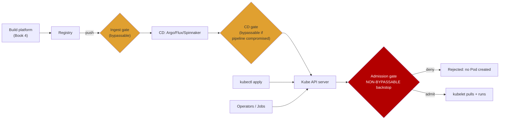
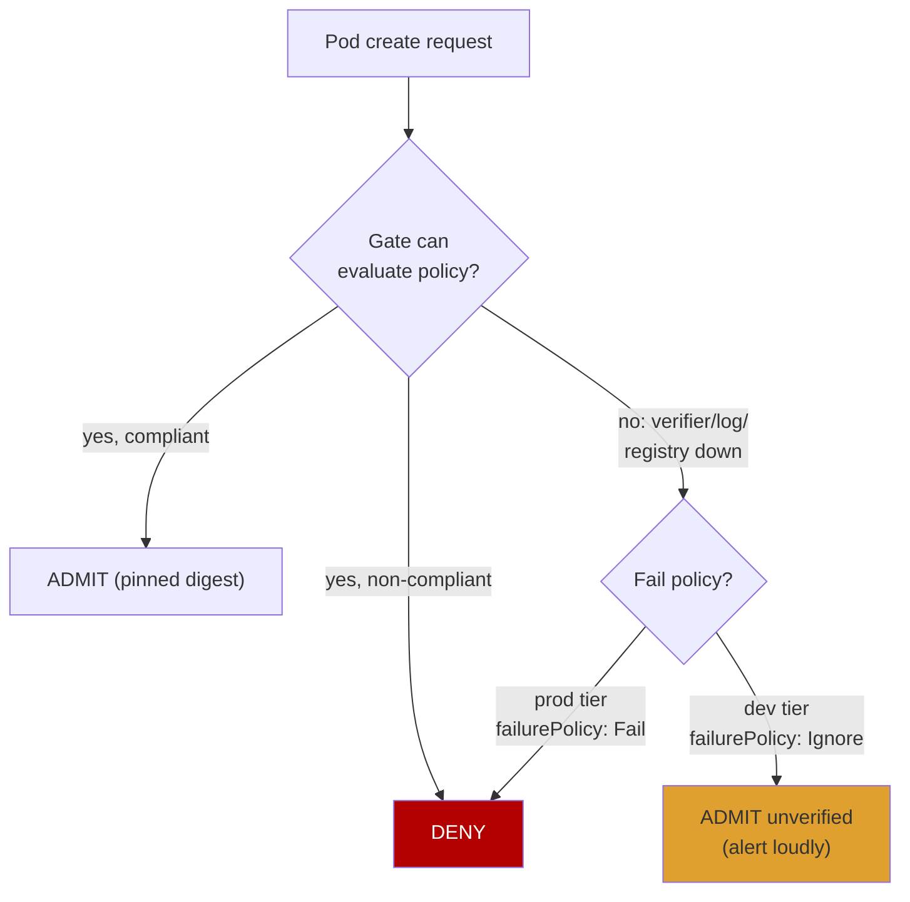
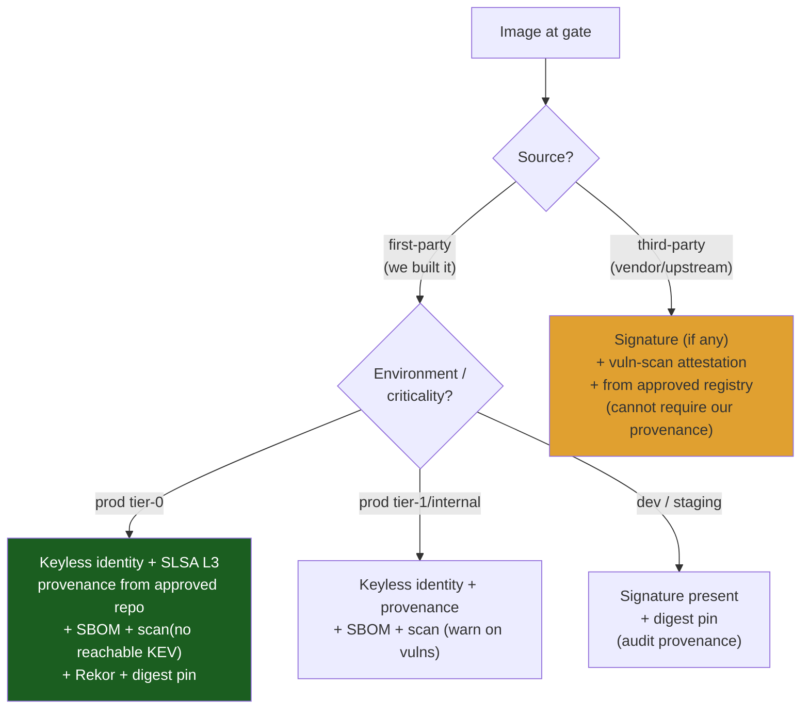
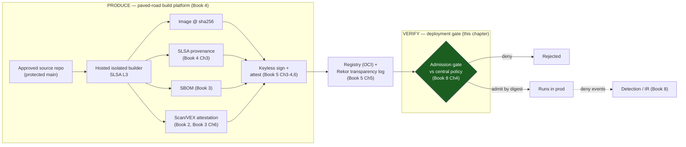
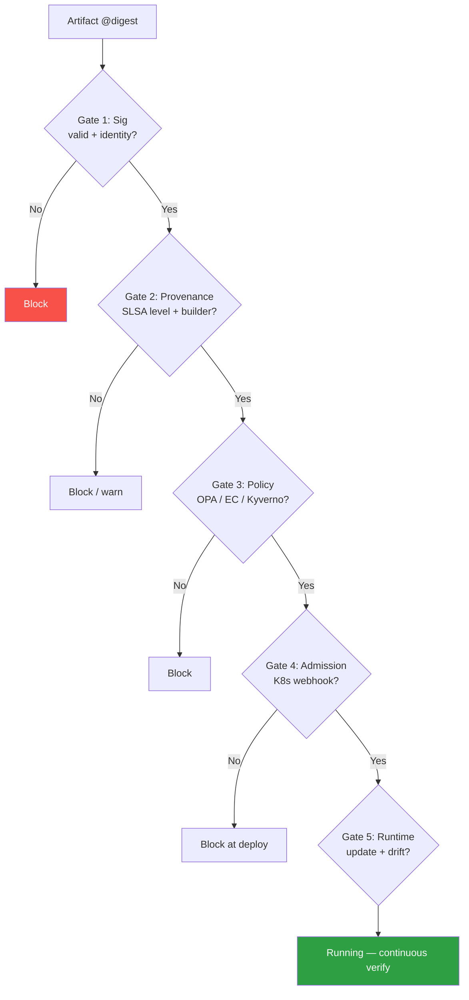
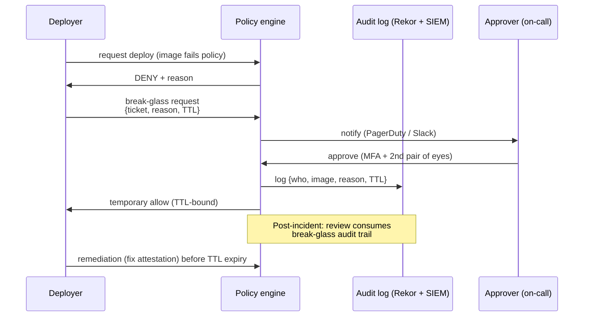

# Chapter 10 — Designing Attestation-Based Deployment Gates

*What this chapter covers.* This is the capstone of Book 5 and, in a real sense, of the whole
supply-chain arc that runs from Book 3 through Book 5. Everything the earlier chapters built —
signatures (Chapters 2–4), the transparency log that makes ephemeral keys auditable (Chapter 5),
in-toto attestations carrying provenance, SBOMs, and scan results (Chapter 6), TUF-protected roots
of trust (Chapter 7), the verification checklist (Chapter 8), and the PKI/key custody underneath it
all (Chapter 9) — is *production*: it emits signed claims. None of it changes an attacker's calculus
by itself. The value is realized at exactly one place: the **deployment gate**, the control that
reads all that metadata, compares it to a **policy**, and refuses to run anything that fails. This
chapter is about designing that gate — where it lives, what it checks, how you roll it out across a
fleet without breaking every deploy on day one, and how you make "only verified artifacts run in
production" a structural property of your platform rather than an aspiration on a slide.

Learning goals — after this chapter you should be able to:

- Explain why the deployment gate is *the* enforcement point of supply chain security, and why
  **admission control in the runtime platform is the non-bypassable backstop** behind CI and CD
  gates.
- Assemble a concrete, multi-property **deployment policy** from the mechanisms of Books 3–5:
  signature + expected identity, digest pinning, provenance vs source/builder/SLSA level, required
  attestations, transparency-log inclusion, and vulnerability/VEX posture.
- Implement gates with real tooling: **sigstore policy-controller** (`ClusterImagePolicy`),
  **Kyverno** (`verifyImages` + attestations), **OPA/Gatekeeper + Ratify**, **Connaisseur**, and
  managed services like **Google Binary Authorization**.
- Design the **policy lifecycle**: warn/audit → enforce rollout, break-glass and time-boxed
  exceptions, tiered requirements for legacy and third-party images, and a defensible
  **fail-open vs fail-closed** stance.
- Instrument the gate with metrics that *prove* it works, and reason about it as a fleet-wide,
  tier-0, HA control in the pod-scheduling path.
- Draw the end-to-end Books 3–5 architecture: produce (build + sign + attest) → store/log →
  gate verifies → admit/deny → runs.

## The gate is where supply chain security is enforced

State the thesis plainly, because the industry's incentives constantly push against it. Producing
signatures and attestations is visible, demo-friendly, and satisfying: you run `cosign sign`, a
green check appears, a compliance box is ticked. Verifying them is invisible when it works and a
production outage when it is too strict. So the producing half is chronically over-invested and the
consuming half chronically neglected — and the result is an ecosystem full of diligently signed
artifacts that nothing on the consuming side ever inspects. As Chapter 8 put it: a pipeline that
signs everything and verifies nothing has *more* attack surface than one that does neither, because
it manufactures assurance while providing no gate.

The deployment gate is the trust boundary between **built** and **running in production**. On the
near side is a heterogeneous, partly untrusted world: dozens of build pipelines, hundreds of repos,
external base images, vendor artifacts, a registry that anyone with push credentials can write to,
and the standing possibility that any one of those was compromised (Book 1's case studies —
SolarWinds' build-time implant, the Codecov script tamper, the xz-utils backdoor — are all failures
that a downstream gate checking provenance and identity could have blunted). On the far side is your
runtime: the thing that actually executes code against production data and credentials. The gate is
the last place you can say *no* before an artifact becomes a running process with network access and
a service-account token.

This is the **produce-AND-verify** principle from Chapter 8 and Book 4, Chapter 3, restated as an
architectural mandate: for every signed claim your build platform emits, there must be a
corresponding check at a gate that *refuses to proceed* when the claim is missing, invalid, or
non-compliant. A claim that never gates anything is a log line with extra cryptography. The gate is
the mechanism that turns metadata into a decision, and the decision into a control.

## Defense in depth, and admission as the backstop

You do not want a single gate. You want gates at several points, each defending a different trust
boundary, arranged so that the *last* one is the one an attacker cannot route around.

There are three natural gate locations in a modern deployment path:

1. **Registry ingest** — verify on push (and/or on pull). Catches bad artifacts early, close to the
   build. But it is bypassable: an attacker who can push directly to the registry, or who compromises
   the ingest checker's configuration, can defeat it, and not every path to production goes through
   your ingest hook.
2. **CD pipeline** — a verification step in Argo CD, Flux, Spinnaker, or your bespoke deploy tooling,
   run *before* rollout. This is the natural place for rich, slow checks (fetch and evaluate full
   provenance, cross-reference a vulnerability service). But CI/CD is itself a high-value attack
   surface (Book 4, Chapters 4 and 7 on pipeline poisoning): a compromised pipeline can simply *skip*
   its own verification step. A gate that the thing being gated can turn off is not a control.
3. **Admission control in the runtime platform** — a Kubernetes `ValidatingAdmissionWebhook` (or a
   policy engine wired into one) that verifies signatures and attestations at the moment a Pod is
   created, *before the kubelet is ever told to pull and run the image*. This runs in the API server's
   request path, outside the CI/CD trust domain, and it sees every workload regardless of how it got
   there — `kubectl apply` by a human, a GitOps reconcile, an operator, a Job spawned by another
   controller. It is the **backstop**.

The design principle: **treat admission as the non-bypassable backstop and everything upstream as
shift-left convenience.** The registry and CD gates exist to fail fast and give developers feedback
early; they reduce load on admission and catch problems before they reach a cluster. But you assume
they *can* be bypassed, and you make the platform itself refuse to run an unverified image. Even if
CI is fully compromised and pushes a malicious image with a valid-looking but wrong-identity
signature, admission — running in the cluster, evaluating against central policy, checking the
*expected* signer identity — still says no.



Notice the shape: the two upstream gates have side entrances (direct `kubectl`, operators, Jobs) that
route *around* them straight to the API server. Only admission sits astride every path. That is the
whole argument for centering your enforcement there. Books 6 (Chapters 5–6 on admission control and
policy engines, Chapter 7 on GitOps verification) develops the runtime-platform mechanics in depth;
here we treat admission as the enforcement primitive and focus on the *policy* it enforces.

One caveat you must design around: admission validates the *spec* of a Pod, and by default that
spec may reference images by tag. A tag is a mutable pointer. If the gate verifies `app:v1.2.3` at
admission time but the kubelet later resolves that tag to a different digest, you have a
time-of-check/time-of-use (TOCTOU) gap (Chapter 8). The fix is **verify-by-digest end to end**: the
gate resolves the tag to a digest, verifies signatures and attestations *against that digest*, and —
critically — mutates the Pod spec to pin the image to `app@sha256:…` so the kubelet pulls exactly the
bytes that were verified. Both policy-controller and Kyverno do this digest-pinning mutation; it is
not optional hardening, it is what makes the check sound.

## What the gate checks: assembling the policy

A deployment gate is only as good as the policy it evaluates. This is where Books 3–5 converge: each
mechanism contributes one clause. A serious prod policy is a *conjunction* of checks, and every one
of them defends against a specific class of failure.

| Check | Mechanism (source) | Defends against |
|-------|--------------------|-----------------|
| Valid signature | Cosign / DSSE (Ch 2–4) | Unsigned or corrupted artifacts |
| **Expected signer identity** | Keyless cert identity / OIDC issuer + subject (Ch 4) | Attacker signing with *their own* valid key; the single most-botched check |
| Digest match / pinning | Content-addressed refs (Ch 8) | TOCTOU, tag mutation, wrong-artifact substitution |
| Provenance vs policy | SLSA provenance (Book 4 Ch 3) | Built from wrong source repo/branch, wrong builder, insufficient SLSA level |
| Required attestations present | in-toto predicates (Ch 6) | Missing SBOM, missing/failed tests, missing scan |
| Transparency-log inclusion | Rekor inclusion proof (Ch 5) | Off-log (unauditable) signatures; backdated/forged signing events |
| Vulnerability + VEX posture | Scan attestation + VEX (Book 2, Book 3 Ch 6) | Known-exploitable, reachable vulns shipping to prod |

The two most important and most frequently skipped are **expected identity** and
**verify-by-digest**. "Is this validly signed?" is nearly useless — anyone can produce a valid
signature over anything with a key they control. The question that matters is "is this signed *by the
identity our policy expects* (our build platform's keyless identity, from our OIDC issuer, for a
workflow in an approved repo) and is the signed subject *this exact digest*?" Every gate in this
chapter is built around answering that question, not the useless one.

### A worked prod policy

Here is a concrete, opinionated policy for a tier-0 production service. It is deliberately strict; the
tiering discussion later relaxes it for other classes of workload.

> **To deploy to `prod`, an image must:**
> 1. Be **signed keyless** by our build platform's identity — OIDC issuer
>    `https://token.actions.githubusercontent.com`, certificate subject matching the release
>    workflow `…/.github/workflows/release.yml@refs/heads/main` in an **approved build repo**.
> 2. Carry a **SLSA v1.0 provenance** attestation (`predicateType`
>    `https://slsa.dev/provenance/v1`) whose `buildDefinition` shows the source is an approved
>    repository, built on `main` (or a release tag), by our reusable/trusted builder — i.e., **SLSA
>    Build L3** (Book 4, Chapter 3): non-forgeable provenance from an isolated, hosted builder.
> 3. Carry an **SBOM attestation** (CycloneDX or SPDX; Book 3).
> 4. Carry a **passing vulnerability-scan attestation** with **no reachable KEV-listed
>    vulnerabilities unaccounted for by VEX** (Book 2 Chapter 7 on reachability; Book 3 Chapter 6 on
>    VEX).
> 5. Have its signature **logged in Rekor** with a verifiable inclusion proof (Chapter 5).
> 6. Be admitted **by digest**, with the Pod spec pinned to the verified `sha256`.

Every clause maps to a book. Clause 1 is Chapters 3–4. Clause 2 is Book 4, Chapter 3. Clause 3 is
Book 3. Clause 4 is Books 2 and 3. Clause 5 is Chapter 5. Clause 6 is Chapter 8. The gate is the
place where all of it is finally *load-bearing*.

## Implementing the gate

### Kubernetes admission: sigstore policy-controller

The sigstore project's **policy-controller** is a Kubernetes admission controller whose policy object
is the `ClusterImagePolicy` (CIP). It matches images by glob and requires that each matched image
satisfy a set of *authorities* (who must have signed) and, optionally, attestation requirements.

```yaml
apiVersion: policy.sigstore.dev/v1beta1
kind: ClusterImagePolicy
metadata:
  name: prod-keyless-and-attestations
spec:
  images:
    - glob: "registry.example.com/prod/**"
  authorities:
    - name: build-platform-keyless
      keyless:
        url: https://fulcio.sigstore.dev
        identities:
          - issuer: https://token.actions.githubusercontent.com
            subjectRegExp: "^https://github.com/example-org/[^/]+/\\.github/workflows/release\\.yml@refs/heads/main$"
      ctlog:
        url: https://rekor.sigstore.dev
      attestations:
        - name: require-slsa-provenance
          predicateType: https://slsa.dev/provenance/v1
          policy:
            type: cue
            data: |
              predicateType: "https://slsa.dev/provenance/v1"
              predicate: {
                buildDefinition: {
                  buildType: "https://actions.github.io/buildtypes/workflow/v1"
                  externalParameters: {
                    workflow: {
                      repository: =~"^https://github.com/example-org/"
                    }
                  }
                }
              }
        - name: require-sbom
          predicateType: https://cyclonedx.org/bom
  mode: enforce
```

Read what this enforces. `keyless.identities` demands a Fulcio-issued certificate whose OIDC
**issuer** and **subject** match — this is the expected-identity check, expressed as a regex over the
release workflow's identity across any approved repo in the org. `ctlog.url` requires a Rekor entry
(transparency, Chapter 5). The `attestations` block requires *both* a SLSA provenance predicate and a
CycloneDX SBOM predicate to be present and signed by that same authority, and the CUE policy on the
provenance asserts the build came from an `example-org` repository via the GitHub Actions build type.
`mode: enforce` makes a non-compliant image a hard admission failure; `mode: warn` (the audit
posture) logs the violation and admits — the lifecycle lever we return to below.

policy-controller enforces only in namespaces you opt in by label
(`policy.sigstore.dev/include: "true"`), and it digest-pins on admission. Its default behavior when
*no* CIP matches an image is itself a policy decision (allow vs deny unmatched images) that you must
set deliberately — a fleet where unmatched images are silently allowed has a gaping hole.

### Kubernetes admission: Kyverno

Kyverno is a general-purpose policy engine with first-class image-verification support via
`verifyImages`. It can check signatures *and* attestations, and evaluate conditions over attestation
*contents* — useful for asserting things like "provenance says it was built from this repo."

```yaml
apiVersion: kyverno.io/v1
kind: ClusterPolicy
metadata:
  name: prod-verify-images
spec:
  validationFailureAction: Enforce      # Audit during rollout, then Enforce
  webhookTimeoutSeconds: 20
  failurePolicy: Fail                    # fail-closed: deny if the webhook errors/times out
  background: false
  rules:
    - name: verify-keyless-signature-and-provenance
      match:
        any:
          - resources:
              kinds: ["Pod"]
              namespaces: ["prod", "prod-*"]
      verifyImages:
        - imageReferences:
            - "registry.example.com/prod/*"
          mutateDigest: true            # pin the verified digest into the Pod spec
          verifyDigest: true
          required: true
          attestors:
            - count: 1
              entries:
                - keyless:
                    subject: "https://github.com/example-org/*/.github/workflows/release.yml@refs/heads/main"
                    issuer: "https://token.actions.githubusercontent.com"
                    rekor:
                      url: https://rekor.sigstore.dev
          attestations:
            - type: https://slsa.dev/provenance/v1
              attestors:
                - entries:
                    - keyless:
                        subject: "https://github.com/example-org/*/.github/workflows/release.yml@refs/heads/main"
                        issuer: "https://token.actions.githubusercontent.com"
              conditions:
                - all:
                    - key: "{{ buildDefinition.buildType }}"
                      operator: Equals
                      value: "https://actions.github.io/buildtypes/workflow/v1"
                    - key: "{{ regex_match('^https://github.com/example-org/', buildDefinition.externalParameters.workflow.repository) }}"
                      operator: Equals
                      value: true
```

Two things earn their place here. `mutateDigest: true` is the TOCTOU fix — Kyverno rewrites the image
reference to `…@sha256:<verified>` so the kubelet cannot resolve a tag to different bytes. And
`failurePolicy: Fail` is the fail-*closed* stance: if the Kyverno webhook is unreachable or times out,
the API server *rejects* the Pod rather than admitting it unchecked. `validationFailureAction` is the
audit/enforce toggle (`Audit` logs a `PolicyReport` and admits; `Enforce` denies) — precisely the
lifecycle control the next section formalizes.

### OPA/Gatekeeper + Ratify, and Connaisseur

Two other production-grade patterns:

- **OPA/Gatekeeper + Ratify.** Gatekeeper enforces Rego constraints at admission but has no native
  notion of "verify a cosign signature." **Ratify** fills that gap: it is a verification engine
  (signature, SBOM, vulnerability-report verifiers via plugins) wired to Gatekeeper as an *external
  data provider*. A Gatekeeper `ConstraintTemplate` calls out to Ratify, which fetches and verifies
  the artifact's signatures/attestations from the registry and returns a pass/fail that the Rego
  constraint consumes. This suits shops already standardized on OPA/Rego for general policy who want
  image verification in the same engine.
- **Connaisseur** is a focused admission controller specifically for verifying container image
  signatures (cosign/Sigstore and Notary v1), designed to be small and auditable. It resolves tags to
  digests, verifies against configured trust roots/identities, and mutates the spec to the verified
  digest. It does less than Kyverno/policy-controller (it is signature-centric, less about rich
  attestation-content policy) but is a clean choice when signature enforcement is the whole job.

Choosing among them: if you want the richest attestation-content policy in a mainstream engine,
Kyverno; if you are all-in on Sigstore and want its native object model, policy-controller; if you
already run OPA/Gatekeeper for everything, Ratify; if you want a minimal signature-only gate,
Connaisseur. All four are real, actively maintained admission-time gates that do the same core job:
verify expected-identity signatures and (except Connaisseur's narrower scope) required attestations,
by digest, before the Pod runs.

### CD-pipeline and GitOps gates

Admission is the backstop, but you also want to fail fast in the deploy pipeline so developers get
feedback before a bad artifact reaches a cluster. In a CD tool this is a pre-rollout verification
step. With Cosign directly:

```bash
cosign verify \
  --certificate-identity-regexp "^https://github.com/example-org/.+/\.github/workflows/release\.yml@refs/heads/main$" \
  --certificate-oidc-issuer https://token.actions.githubusercontent.com \
  registry.example.com/prod/checkout@sha256:${DIGEST}

cosign verify-attestation --type slsaprovenance \
  --certificate-identity-regexp "^https://github.com/example-org/.+@refs/heads/main$" \
  --certificate-oidc-issuer https://token.actions.githubusercontent.com \
  --policy prod-provenance.cue \
  registry.example.com/prod/checkout@sha256:${DIGEST}
```

Note the same discipline as admission: verify by digest, assert the certificate identity, run a policy
over the provenance predicate. In **GitOps** flows, Flux can verify the OCI artifacts and Helm charts
it reconciles against a cosign identity (its source-controller supports Sigstore/keyless verification
on `OCIRepository`/`HelmChart` sources), and Argo CD can gate sync on external verification (a
pre-sync hook or an admission gate on the resources it applies). The GitOps mechanics are Book 6,
Chapter 7; the point for us is that these are *shift-left* gates whose job is early feedback — they do
not replace admission, because a compromised GitOps controller could skip them, and admission cannot
be skipped.

### Managed gates: Google Binary Authorization

Cloud providers offer managed deploy gates. **Google Binary Authorization** is an attestation-based
admission control for GKE (and Cloud Run): you define a *policy* that requires images to have
**attestations** from named **attestors** before they can be deployed, and Binary Authorization
enforces it in the GKE admission path.

```yaml
# Binary Authorization policy (gcloud container binauthz policy import)
globalPolicyEvaluationMode: ENABLE
admissionWhitelistPatterns:
  - namePattern: "gcr.io/google-containers/*"
  - namePattern: "gke.gcr.io/*"
defaultAdmissionRule:
  evaluationMode: REQUIRE_ATTESTATION
  enforcementMode: ENFORCED_BLOCK_AND_AUDIT_LOG
  requireAttestationsBy:
    - "projects/example-prod/attestors/built-by-approved-pipeline"
    - "projects/example-prod/attestors/vuln-scan-passed"
clusterAdmissionRules:
  "us-central1-a.prod-cluster":
    evaluationMode: REQUIRE_ATTESTATION
    enforcementMode: ENFORCED_BLOCK_AND_AUDIT_LOG
    requireAttestationsBy:
      - "projects/example-prod/attestors/built-by-approved-pipeline"
      - "projects/example-prod/attestors/vuln-scan-passed"
```

`enforcementMode: ENFORCED_BLOCK_AND_AUDIT_LOG` blocks non-compliant deploys and logs them; the
alternative `DRYRUN_AUDIT_LOG_ONLY` is the audit posture (log, don't block) — again the same
warn-then-enforce lever, this time as a first-class field. `admissionWhitelistPatterns` is how you
exempt platform/system images that will never carry your attestations. AWS's analogous building blocks
are **AWS Signer** (managed signing for container images and Lambda code) combined with admission
enforcement; describe these to stakeholders accurately as *managed implementations of the same gate
pattern* — an attestation/signature requirement enforced in the platform's deploy path — not as
something categorically different from a self-run Kyverno/policy-controller gate.

## The policy lifecycle: shipping a gate without an outage

The single fastest way to discredit supply-chain security in your org is to flip a fleet-wide gate to
enforce on day one and break every deploy. A gate is a distributed rollout like any other risky
change, and it needs the same discipline: observe, then enforce, incrementally.

### Warn/audit before enforce

Every serious gate has a dry-run posture: evaluate the policy, **log what would be denied**, but
admit. policy-controller's `mode: warn`, Kyverno's `validationFailureAction: Audit`, Binary
Authorization's `DRYRUN_AUDIT_LOG_ONLY` — all exist precisely for this. Run in audit across the fleet
first and you get a free, complete inventory of exactly which images, namespaces, and teams would
fail, *before* you break anyone. Then you drive the would-deny count to zero (fix the pipelines,
onboard the stragglers, write the exceptions) and only then flip to enforce — and even then, flip it
per-namespace or per-tier, not everywhere at once.

```mermaid
stateDiagram-v2
  [*] --> Audit: deploy policy, log-only
  Audit --> Audit: measure would-deny;<br/>fix pipelines / onboard teams
  Audit --> EnforceCanary: would-deny ~ 0 for a tier
  EnforceCanary --> Audit: canary breaks -> roll back
  EnforceCanary --> EnforceFleet: canary clean N days
  EnforceFleet --> EnforceFleet: steady state;<br/>monitor deny events
  EnforceFleet --> [*]
```



The state you must resist is jumping straight to `EnforceFleet`. The would-deny signal from audit is
the cheapest risk assessment you will ever get; spend it.

### Break-glass and time-boxed exceptions

A gate with no escape hatch will be ripped out the first time it blocks an emergency fix during an
incident. So design the escape hatch deliberately, and make it *self-closing*.

- **Break-glass for emergencies.** A pre-defined, audited path to deploy past the gate during a
  declared incident — a specially labeled namespace, a signed break-glass approval, or an
  emergency-only policy variant. It must fire a loud, high-severity alert (a break-glass deploy is a
  security event by definition), be usable only by a small on-call group, and be reviewed after every
  use. The goal is not to prevent break-glass — you *want* engineers to be able to save prod — but to
  make it rare, visible, and accounted for.
- **Time-boxed, risk-accepted exceptions.** For known gaps ("vendor image X can't have our
  provenance yet"), a documented exception with an **owner and an expiry date**. The critical design
  choice is that exceptions *expire*: encode them as objects the gate reads (e.g., a policy exception
  CRD, or an allowlist entry with an `expiresAt` field) and report on expiry, so a temporary hole does
  not become permanent. An exception without an expiry is just a permanent hole with better
  paperwork. The metric to watch is **outstanding exceptions and their age** — a rising line is your
  policy quietly rotting.

### Fail-open vs fail-closed

The gate depends on services that can fail: the admission webhook itself, Fulcio/Rekor (or your
private instances), the registry it fetches attestations from, the policy service. When the gate
*cannot decide*, does it admit or deny? This is the availability-vs-security decision, and Chapter 8
framed it: the honest default for a security control is **fail-closed** — if you cannot prove the
artifact meets policy, do not run it.



But fail-closed has a brutal corollary: **if the gate is down, no deploy anywhere succeeds.** A
crashing admission webhook with `failurePolicy: Fail` can wedge your entire platform — you cannot even
deploy the fix to the gate. So fail-closed is only *safe* if the gate infrastructure is highly
available: multiple replicas across zones, tight `webhookTimeoutSeconds`, a scoped `namespaceSelector`
so the webhook never intercepts its own control-plane namespaces, and monitoring/paging on gate
health. The defensible pattern is **tiered**: `failurePolicy: Fail` (fail-closed) for prod-critical
namespaces where security dominates, `failurePolicy: Ignore` (fail-open, but *always* alerting) for
low-risk dev namespaces where a gate outage should not block iteration. Never fail open silently —
a fail-open admit under a gate outage is exactly the window an attacker waits for, so it must page.

This is why the gate is a **tier-0 service**: it sits in the pod-scheduling path, and its
availability requirements are a direct consequence of running it fail-closed. You cannot demand
fail-closed security without funding gate HA; the two decisions are one decision.

## Tiered and graduated policy

The strict prod policy above is unachievable for most of your fleet on day one, and *permanently*
unachievable for some of it. A third-party vendor image will never carry a SLSA L3 provenance
attestation from *your* build platform — you did not build it. Requiring it uniformly means either
blocking half your workloads or granting so many exceptions that the policy is meaningless. The
answer is **tiered policy: required checks as a function of environment × criticality × artifact
source.**



The tiers, concretely:

- **First-party, prod tier-0:** the full worked policy — identity, SLSA L3 provenance from an approved
  source, SBOM, scan with no reachable KEV vulns, Rekor, digest pinning. No exceptions without
  break-glass.
- **First-party, internal/lower-risk:** identity + provenance + SBOM, but scan results *warn* rather
  than block, and the SLSA-level bar may be L2. Lets internal tooling ship while you mature it.
- **Dev/staging:** require a signature and digest pinning (so you are always running known bytes), but
  only *audit* provenance. Dev velocity dominates; you still get the inventory.
- **Third-party images:** you cannot demand your own provenance, so require what is achievable —
  a signature *if the vendor publishes one* (many now do via Sigstore), a vulnerability-scan
  attestation *you* produce at ingest, and that the image comes from an approved registry/namespace.
  This tier is where honest engineering matters: do not pretend a vendor image meets L3; state its
  weaker guarantees explicitly and compensate elsewhere (network policy, runtime restrictions).

Tiered policy is not a compromise of the thesis; it is how the thesis survives contact with a real
fleet. A uniform policy that everyone routes around with exceptions enforces nothing. A tiered policy
that is *actually enforced at each tier* enforces a lot. The engineering judgment is in setting the
tiers honestly and ratcheting them upward over time — this quarter dev is signature-only; next quarter
it requires provenance-in-audit; the quarter after, provenance-in-enforce. The gate's audit metrics
tell you when a tier is ready to ratchet.

## Metrics: proving the gate works

A gate you cannot measure is a gate you cannot trust or defend in an audit. Instrument it as a
first-class control (this ties to Book 8, Chapter 8 on measuring a supply-chain program):

- **Coverage** — % of running workloads, across all clusters and namespaces, that pass through an
  *enforcing* gate. The uncomfortable number: what fraction of prod is actually gated vs merely
  audited or exempt? This is the headline metric.
- **Policy pass rate** — % of admission decisions that pass on the first try, trended per tier and per
  team. A team stuck at 60% is a team whose pipeline needs help.
- **Deny events** — every enforce-mode denial, as a *security signal*. A deny at admission means
  something tried to run an image that failed policy; that is either a misconfigured deploy or an
  attack, and both deserve a look. Feed deny events into detection/IR (Book 8): a spike in denials, or
  a denial for an image whose signer identity is wrong, is an incident indicator.
- **Would-deny (audit) volume** — while rolling out, the count of images that *would* be denied, driven
  toward zero before enforce. In steady state this should stay near zero; a rise means new
  non-compliant artifacts are appearing.
- **Outstanding exceptions and their age** — how many risk-accepted holes are open and how old. Rising
  or aging = policy decay.
- **Break-glass uses** — count and review status. Each is a security event.

The ultimate test — the one to put in the exec summary — is a question, not a metric: **can an
unsigned, unverified, or unauthorized-source image reach prod?** If the honest answer requires "well,
if someone did X and Y…", you have a bypass to close. In a well-designed system the answer is
*structurally no*: every path to a running Pod passes through admission, admission is enforcing and
fail-closed for prod, and the only escapes are loud, audited, and self-expiring break-glass. That
structural "no" is the deliverable of this entire book.

## Capstone: bringing Books 3–5 together

Step back and look at the whole machine. The three books you have worked through describe two halves
of one loop, closed by the gate.



Trace one artifact through it. A commit lands on a protected `main` in an approved repo (Book 7 on
source security). The **paved-road build platform** (Book 4, Chapter 10) builds it in an isolated,
hosted builder — SLSA Build L3 — and emits, alongside the image, a **SLSA provenance** attestation
(Book 4, Chapter 3), an **SBOM** (Book 3), and a **scan/VEX** attestation (Books 2 and 3). The
platform **signs** the image and wraps each attestation in a DSSE envelope using **keyless** signing
(Book 5, Chapters 3–4 and 6), and every signature is recorded in **Rekor** (Chapter 5). The image and
its attestations sit in the registry, content-addressed by digest. Then someone tries to run it —
via GitOps, `kubectl`, or an operator — and the request hits the **deployment gate** (this chapter),
which evaluates the artifact against **central policy** (Book 8, Chapter 4): expected keyless
identity, provenance from an approved source at the required SLSA level, the required attestation set
present, Rekor inclusion, no reachable KEV vulns — and admits *by digest* or denies. Deny events flow
to detection and IR (Book 8).

That is the realized supply-chain security architecture for a distributed backend. The build platform
and the gate are the two halves — **produce and verify** — and neither is worth much without the
other. A build platform that emits perfect attestations nothing checks is theater. A gate with a
strict policy and no build platform producing the attestations it demands blocks everything. The two
are designed together, share one vocabulary (in-toto predicates, Sigstore identities, digests), and
close the loop: the platform produces exactly the claims the gate is configured to verify, and the
gate refuses anything the platform did not vouch for.

## Distributed-systems lens

The deployment gate is a **fleet-wide control**, and everything hard about it is a distributed-systems
problem.

- **One policy, uniformly enforced, no bypass.** The entire value proposition is that *no service
  bypasses it*. In a world of hundreds of services and dozens of teams, you cannot rely on each team
  to verify correctly; you centralize verification at admission so the guarantee holds uniformly
  whether a team opted in or not. A per-service check that a team can forget is not a fleet control; a
  platform admission gate that intercepts every Pod is.
- **Central policy, distributed enforcement, per-tier variation.** Policy is authored centrally (Book
  8, Chapter 4) — one source of truth for "what prod requires" — but *enforced* at every cluster's
  admission point. The policy is not uniform in its *requirements* (tiers by environment ×
  criticality × source) but it is uniform in its *authority*: teams cannot weaken it locally, only
  central governance ratchets it.
- **The gate is in the critical path, so it is tier-0.** Admission runs synchronously in the API
  server's request path; a slow gate slows every deploy and every scale-up, and a down fail-closed
  gate blocks all of them. This forces real availability engineering: multi-replica, multi-zone, tight
  timeouts, scoped selectors that exclude control-plane namespaces, and health-based paging. You do
  not get fail-closed security for free — you buy it with HA.
- **Verify-by-digest end to end.** Content-addressing is what makes verification sound across the
  distributed hops from build to registry to kubelet. The gate resolves and pins the digest so the
  thing verified is the thing that runs; tags — mutable pointers — are a TOCTOU trap at every hop.
- **The gate closes the loop with the build platform.** The paved road (Book 4, Chapter 10) produces
  the attestations; the gate consumes them. Designed together, the two halves make "only verified
  artifacts run in production" a structural invariant rather than a hope.
- **Deny events are a detection feed.** Because the gate sees every deploy, its denials are a
  high-signal, low-noise security telemetry source (Book 8): a deploy blocked for a wrong signer
  identity is an attempted intrusion or a serious misconfiguration, and either way IR wants to know.

### Deployment gate stack (defense in depth)



### Break-glass procedure



## Key takeaways

- **The gate is the enforcement point.** All of Books 3–5's signing, provenance, and attestation
  machinery is realized only where a gate *refuses to run* artifacts that fail policy. Produce AND
  verify; a claim that gates nothing is theater.
- **Admission is the non-bypassable backstop.** Gate at registry ingest and in CD for fast feedback,
  but center enforcement at runtime admission — it is the only point every path to a running Pod must
  cross, and it is outside the CI/CD trust domain that upstream gates depend on.
- **Policy is a conjunction, and identity + digest are the load-bearing clauses.** Verifying "validly
  signed" is nearly useless; verify the *expected* signer identity and pin the *exact* digest.
  Assemble the rest — provenance vs source/builder/SLSA level, required attestations, Rekor
  inclusion, vuln/VEX posture — into one concrete policy.
- **Use real tools, real syntax.** policy-controller `ClusterImagePolicy`, Kyverno `verifyImages` +
  attestations, OPA/Gatekeeper + Ratify, Connaisseur, Google Binary Authorization — all enforce
  expected-identity signatures and required attestations by digest at admission.
- **Roll out audit → enforce, per tier.** Dry-run to inventory would-deny, drive it to zero, then
  enforce incrementally. Build in self-expiring exceptions and loud, audited break-glass. Fail-closed
  for prod — but only if the gate is HA, because fail-closed plus a down gate wedges the whole
  platform.
- **Tier the policy** by environment × criticality × source. Strict for first-party prod tier-0;
  achievable checks (signature + your-own-scan) for third-party images you did not build. Tiering is
  how the thesis survives a real fleet; ratchet tiers upward using audit metrics.
- **Measure it and pass the ultimate test.** Coverage, pass rate, deny events (as a security signal),
  outstanding exceptions, break-glass uses. The exec-summary question: *can an unsigned/unverified/
  unauthorized-source image reach prod?* A well-designed gate makes the answer structurally no.
- **Distributed-systems reality:** one central policy, enforced uniformly at every cluster's
  admission, in the tier-0 pod-scheduling path, verifying by digest the attestations the paved-road
  build platform produced — the two halves of the loop, closed.

## Further reading

- **sigstore/policy-controller** — `ClusterImagePolicy` reference, keyless authorities, attestation
  policies (CUE/Rego), and enforce/warn modes. https://docs.sigstore.dev/policy-controller/overview/.
- **Kyverno** — image verification (`verifyImages`), attestation checks and conditions, and
  `validationFailureAction`. https://kyverno.io/docs/writing-policies/verify-images/ and
  https://kyverno.io/policies/ (the "verify-image" samples).
- **OPA/Gatekeeper** and **Ratify** — Gatekeeper constraints plus Ratify as an external-data
  verification engine for signatures, SBOMs, and vulnerability reports.
  https://open-policy-agent.github.io/gatekeeper/ and https://ratify.dev/docs/.
- **Connaisseur** — admission controller for container image signature verification (Sigstore/Notary).
  https://github.com/sse-secure-systems/connaisseur.
- **Google Binary Authorization** — attestation-based deploy gating on GKE/Cloud Run: policies,
  attestors, dry-run vs enforced modes. https://cloud.google.com/binary-authorization/docs.
- **AWS Signer** — managed signing for container images and Lambda code, and its verification model.
  https://docs.aws.amazon.com/signer/.
- **Cosign** — `cosign verify` / `cosign verify-attestation`, `--certificate-identity(-regexp)`,
  `--certificate-oidc-issuer`, `--type`, `--policy`. https://docs.sigstore.dev/cosign/verifying/verify/.
- **SLSA v1.0** — provenance predicate, build levels (L1–L3), and verification guidance.
  https://slsa.dev/spec/v1.0/.
- **in-toto attestation framework** and predicate types (provenance, SBOM, test, vuln).
  https://github.com/in-toto/attestation.
- **Kubernetes admission control** — validating/mutating admission webhooks and `failurePolicy`.
  https://kubernetes.io/docs/reference/access-authn-authz/admission-controllers/ and
  https://kubernetes.io/docs/reference/access-authn-authz/extensible-admission-controllers/.
- **Flux** (source-controller Sigstore/keyless verification) and **Argo CD** deployment gating —
  GitOps verification of OCI artifacts and manifests (developed in Book 6, Chapter 7).
  https://fluxcd.io/flux/components/source/ and https://argo-cd.readthedocs.io/.
- Cross-references: Book 5, Chapter 4 (keyless signing, expected identity), Chapter 5 (Rekor
  transparency), Chapter 6 (in-toto attestations), Chapter 8 (verification checklist, fail-open/
  closed), Chapter 9 (key management/HA for the gate's trust roots); Book 4, Chapter 3 (SLSA
  provenance), Chapter 10 (the secure paved-road build platform); Book 3 (SBOMs), Chapter 6 (VEX);
  Book 2, Chapter 7 (reachability/prioritization); Book 6, Chapters 5–7 (admission control, policy
  engines, GitOps verification); Book 8, Chapter 4 (central policy) and Chapter 8 (metrics,
  detection, IR).
