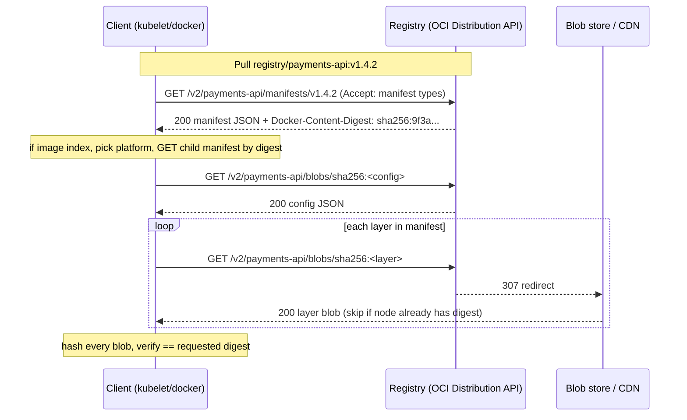
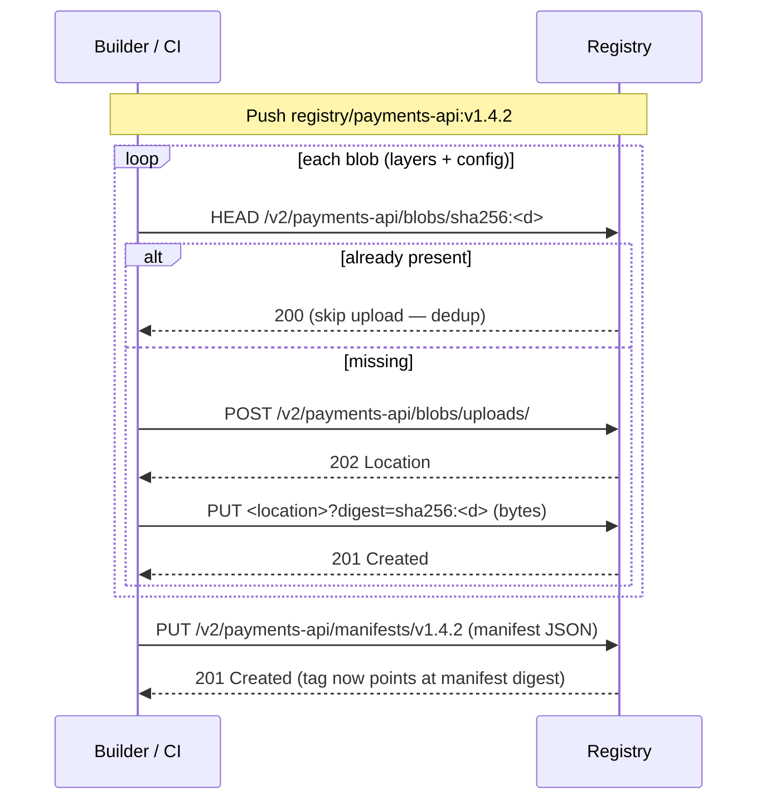
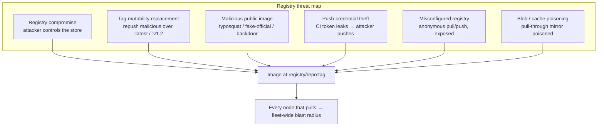
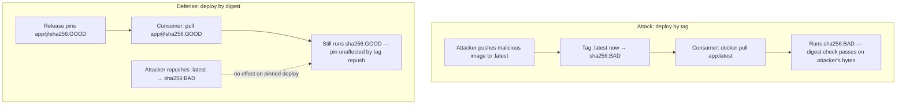
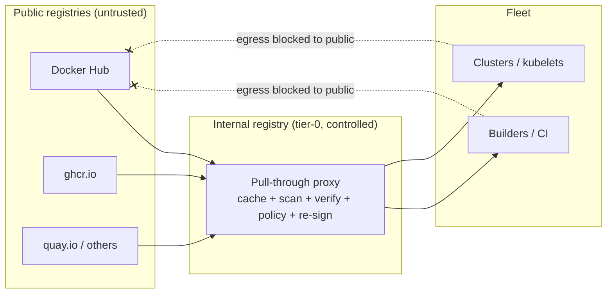
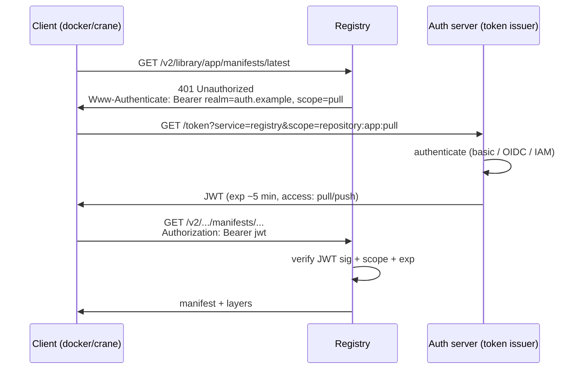
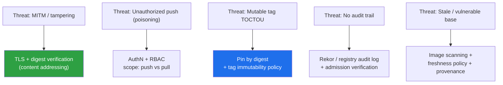

# Chapter 2 — Container Registries: Architecture, Trust, and Threats

*What this chapter covers.* A container registry is where images live between the build that
produces them and the node that runs them. Every `docker pull`, every `kubelet` image fetch,
every GitOps deploy terminates at a registry. That makes the registry the single most
load-bearing piece of distribution infrastructure in a containerized backend: it is the OCI
analogue of the package registries you met in Book 2, Chapter 1 — Package Managers and
Registries: Architecture and Trust Models — and it sits at exactly the same place in the
threat model. If you understood *why* an internal package proxy is a control point and not a
convenience (Book 2, Chapter 8 — Vendoring, Mirroring, and Internal Registries), most of this
chapter's conclusions will feel familiar; the mechanics differ because the artifact is an OCI
image, not an npm tarball, but the trust questions are identical. This chapter takes the
registry apart at the protocol level (the OCI Distribution Specification), surveys the real
registry landscape without marketing gloss, builds the trust model precisely — *what does a
pull actually prove?* — and then enumerates the threats and the controls that answer them. It
assumes the image internals of Chapter 1 (manifests, config, layers, digests, the
mutable-tag-versus-immutable-digest distinction) and hands off enforcement to Chapters 5 and 6
(signing verification and admission control).
_All tool versions, spec references, and defaults verified as of early 2026._

Learning goals — after this chapter you should be able to:

- Describe what an OCI registry stores and serves, and trace the **pull flow** and **push
  flow** of the OCI Distribution Specification at the level of individual HTTP requests, by
  digest and by tag.
- Explain **content-addressable storage**, blob deduplication, and the **referrers API**, and
  how signatures, SBOMs, and attestations attach to an image as referring artifacts.
- Contrast the real registry options — Docker Hub, GHCR, ECR, Google Artifact Registry, ACR,
  Harbor, Quay, Artifactory/Nexus, Zot, and the reference `distribution` implementation — on
  hosting model and built-in scanning/signing.
- State precisely **what a pull trusts** — and what it does not — and enumerate the registry
  threat model: registry compromise, tag-mutability image replacement, malicious public
  images, push-credential theft, misconfigured/anonymous registries, blob and cache poisoning,
  and the image analogue of dependency confusion.
- Map each threat to a concrete control: scoped/short-lived credentials, sign-and-verify,
  registry-integrated scanning, allowed-registries and signing admission policy, tag
  immutability, and an internal pull-through registry as the fleet-wide chokepoint.
- Argue the distributed-systems case for treating the internal registry as **tier-0 fleet
  infrastructure**: HA, audited, deploy-by-digest, pull-only-from-approved-registries.

A note on scope. This chapter is about the registry as *architecture and trust point*. The
image format it serves is Chapter 1. Base-image selection is Chapter 3. What scanning actually
finds and how to triage it is Chapter 4. How you *verify* a signature at admission time — the
control that makes signing worth doing — is Chapters 5 and 6. This chapter tells you what the
registry is, what can go wrong at it, and how to wrap it in controls.

## What a registry is, mechanically

Strip the branding and a container registry is a content-addressable blob store with a thin
metadata layer and an access-control front door, speaking one HTTP protocol: the **OCI
Distribution Specification** (current stable v1.1, which folded in the referrers API). Docker
Hub, ECR, Harbor, GHCR, and the 150-line reference implementation all speak the same wire
protocol; a client that can pull from one can pull from any of them. That interoperability is
the whole point of standardizing distribution, and it is why "which registry" is mostly an
operational and trust decision, not a compatibility one.

A registry stores exactly three kinds of object, all addressed under a **repository name**:

1. **Blobs** — opaque, immutable byte strings addressed by their content digest, almost
   always `sha256:<hex>`. Layer tarballs are blobs. The image config JSON is a blob. Any
   attached artifact's content is a blob. A blob's name *is* the hash of its bytes; this is
   the property everything else rests on.
2. **Manifests** — small JSON documents that reference blobs by digest and give them meaning.
   An image manifest lists the config blob and the ordered layer blobs (Chapter 1). A manifest
   is itself addressable by its own digest.
3. **Tags** — mutable human-readable pointers (`latest`, `v1.2.3`, `sha-9f3a1c`) that resolve
   to a manifest digest within a repository. A tag is the *only* mutable thing in the system,
   and — as we will belabor — that mutability is the root of an entire threat class.

The full name of an image is `registry-host[:port]/repository[:tag|@digest]`. In
`ghcr.io/acme/payments-api:v1.4.2`, `ghcr.io` is the registry host, `acme/payments-api` is the
repository (namespaced by org), and `v1.4.2` is a tag. Replace `:v1.4.2` with
`@sha256:9f3a1c...` and you have pinned the exact manifest by digest, bypassing the mutable
tag entirely. Hold that distinction; it is the hinge of the security story.

### The pull flow, request by request

A pull is a sequence of GETs that walks the manifest → config → layers graph. Suppose a
kubelet pulls `registry.internal/payments-api:v1.4.2`.

1. **Resolve and fetch the manifest.**
   `GET /v2/payments-api/manifests/v1.4.2` with an `Accept` header listing the media types the
   client understands (image manifest, image index, and the legacy Docker schema). The
   registry returns the manifest JSON and, in the `Docker-Content-Digest` response header, the
   manifest's digest. If the reference had been a digest (`.../manifests/sha256:9f3a...`) the
   client would verify the returned bytes hash to exactly that digest and reject any mismatch.
   If the manifest is an **image index** (multi-arch, Chapter 1), the client picks the entry
   matching the node's platform and does a second manifest GET by that child digest.
2. **Fetch the config.** The manifest names a config blob by digest;
   `GET /v2/payments-api/blobs/sha256:<config>` retrieves it. The config carries the
   `rootfs.diff_ids`, env, entrypoint, and history.
3. **Fetch the layers.** For each layer digest in the manifest, `GET
   /v2/payments-api/blobs/sha256:<layer>`, typically served as a redirect to a CDN or object
   store. Layers the node already has (by digest) are skipped — this is why a shared base
   layer downloads once per node, not once per image.
4. **Verify.** A correct client hashes every blob it downloads and checks it against the digest
   it was asked for. This is the integrity guarantee the registry gives you *for free*: if the
   bytes were corrupted or swapped in transit or at rest, the digest will not match. Note
   carefully what this does and does not prove — it proves the bytes match the digest you
   asked for; it proves nothing about whether that digest is the one you *should* have asked
   for. That gap is the entire signing story.



### The push flow, request by request

A push runs the graph in reverse: **blobs first, manifest last**, so the manifest never
references a blob the registry does not yet have.

1. **Check what already exists.** For each blob, the client may `HEAD
   /v2/<repo>/blobs/sha256:<digest>`. A `200` means the registry already has that content and
   the upload is skipped — cross-image, cross-tag **deduplication** falls out of
   content-addressing for free. A shared base layer is uploaded by the first image that uses
   it and never again.
2. **Upload missing blobs.** `POST /v2/<repo>/blobs/uploads/` opens an upload session and
   returns a `Location`; the client `PUT`s the bytes (monolithically or in chunks) and
   finalizes with the `?digest=sha256:<digest>` query parameter. The registry recomputes the
   digest and rejects the upload if the bytes do not match — you cannot push a blob under a
   digest that is not its actual hash.
3. **Push the manifest.** `PUT /v2/<repo>/manifests/<tag-or-digest>` uploads the manifest JSON.
   This is the step that makes an image *appear at a tag*. The registry validates that every
   blob the manifest references is present.

The ordering matters for a subtle reason: because the manifest is written last and by tag, the
act of "publishing to `:latest`" is a single mutable pointer write over an immutable content
graph. Everything the tag points at is content-addressed and tamper-evident; the *pointer* is
not. Attacks live in that pointer.



### Referrers: signatures, SBOMs, and attestations as first-class objects

The interesting supply-chain metadata about an image — its cosign signature, its SBOM, its
SLSA provenance attestation — is not *inside* the image. It is stored as separate OCI artifacts
that *refer to* the image by digest, and OCI Distribution v1.1 standardized how to find them:
the **referrers API**. Each referring artifact is itself a manifest with a `subject` field
holding the digest of the image it describes and an `artifactType` naming what it is. A client
asks `GET /v2/<repo>/referrers/sha256:<image-digest>`, optionally filtered by `artifactType`,
and gets back an image index enumerating everything that refers to that image: "here are the
two signatures, the CycloneDX SBOM, and the provenance attestation attached to this digest."

This is what lets an admission controller, given only an image digest, discover and verify the
signature that vouches for it (Chapters 5 and 6) without a side-channel database. Two
mechanics matter for security. First, referrers hang off the *digest*, not the tag — a
signature is bound to specific content, so re-tagging cannot silently move a signature onto
different bytes. Second, on registries that predate v1.1 or disable the referrers endpoint,
tooling falls back to a **tag schema**: the referring artifact is pushed to a tag derived from
the subject digest (e.g. `sha256-9f3a1c....sig`). It is the same idea projected onto older
registries; be aware that a registry lacking real referrers support degrades this discovery,
which matters when you standardize on cosign or SBOM attach across a heterogeneous fleet.

### Content-addressing and deduplication

Everything above rests on one property: **a blob's identity is the hash of its content.**
Consequences worth stating explicitly, because the controls later depend on them:

- **Deduplication is automatic.** Ten images built `FROM debian:12` share the base layers;
  each unique layer is stored once per repository (or once per registry, depending on the
  backend). This is why registries scale and why a node caches by digest.
- **Integrity is intrinsic to the address.** You cannot alter a blob's bytes and keep its
  name. Any tampering changes the digest, so a client pinning a digest is tamper-evident by
  construction — the registry would have to break SHA-256 to serve different bytes under the
  same digest.
- **The tag is the only lie you can tell.** Since only the tag→manifest mapping is mutable,
  every integrity attack that does not break SHA-256 reduces to *changing what a tag points
  at* or *convincing you to pull a name you should not trust.* Keep this reduction in mind; it
  organizes the entire threat section.

### The registry as content store *and* access-control point

A registry is two things wearing one uniform. It is a **content store** (the blobs and
manifests above) and it is an **access-control point** — the gate that decides who may pull
and who may push which repository. The Distribution spec deliberately does not mandate an
authN/authZ scheme; it defines a `401` challenge and a bearer-token dance (the "docker auth"
token flow), and each registry plugs in its own identity model behind it. That separation is
why the *same* image protocol fronts everything from an anonymous public mirror to an
IAM-gated private ECR repository. For our purposes the crucial point is that push and pull are
distinct, per-repository capabilities, and the security of your images depends as much on who
holds the *push* capability as on the bytes themselves. We return to this under credential
theft.

## The registry landscape

The registries you will actually encounter differ on three axes that matter: **hosting model**
(public SaaS, cloud-managed, or self-hosted), **built-in security features** (integrated
scanning, signing, policy), and **operational posture** (rate limits, availability, cost).
They do *not* differ on the wire protocol — all speak OCI Distribution — so switching is an
operational migration, not a rewrite.

| Registry | Hosting | Built-in scanning | Signing / policy | Notes |
|---|---|---|---|---|
| Docker Hub | Public SaaS | Optional (Docker Scout) | No native enforcement | Official-images program; `library/` namespace; anonymous-pull rate limits |
| GitHub Container Registry (`ghcr.io`) | Public SaaS | Via GitHub code/dep tooling | Cosign-friendly; per-repo/org visibility | Tied to GitHub identity; convenient for GitHub Actions OIDC |
| Amazon ECR | Cloud-managed (AWS) | Basic (native) + enhanced (Inspector) | IAM-gated; tag immutability; pull-through cache | IAM is the authZ model; private by default |
| Google Artifact Registry (GAR) | Cloud-managed (GCP) | On-push scanning (Container Analysis) | IAM-gated; remote/virtual repos | Successor to Container Registry (GCR); multi-format |
| Azure Container Registry (ACR) | Cloud-managed (Azure) | Defender for Cloud integration | Entra/RBAC; tokens; retention | Tasks for in-registry build; geo-replication |
| Harbor | Self-hosted (CNCF) | Built-in (Trivy) | Cosign/Notation verify; project policy; quarantine | The reference "policy-enforcing private registry" |
| Quay / Project Quay | Self-hosted or SaaS | Built-in (Clair) | Robot accounts; per-repo notifications | Clair pioneered layer-level vuln scanning |
| JFrog Artifactory / Sonatype Nexus | Self-hosted or SaaS | Add-on (Xray / IQ) | Multi-format incl. OCI; RBAC | The multi-format proxy of Book 2, Ch 8 — hosts images too |
| Zot | Self-hosted | Optional (Trivy) | OCI-native; referrers-first | Lightweight, standards-focused; good air-gap fit |
| `distribution/distribution` | Self-hosted | None | None | The reference implementation; a store, not a platform |

A few landscape realities worth stating plainly, because they drive architecture decisions:

- **Docker Hub rate limits are an availability dependency, not a footnote.** Anonymous and
  free-tier pulls are rate-limited by source IP over a rolling window. In a Kubernetes cluster,
  *every node* NAT'd behind one egress IP shares that budget, so a modest fleet can exhaust
  anonymous pulls and see `ImagePullBackOff` fleet-wide during a scale-up or a node-image
  refresh. This single fact has pushed more organizations toward an internal pull-through
  mirror than any security argument — and, conveniently, the mirror is also the security
  chokepoint. We come back to this in the distributed-systems lens.
- **The official-images program and the `library/` namespace.** Docker Hub curates a set of
  "Docker Official Images" (`debian`, `postgres`, `nginx`, …) that live in the special
  `library/` namespace and are referenceable by bare name (`postgres:16` is
  `docker.io/library/postgres:16`). These are reviewed and rebuilt for CVEs, which makes them
  *relatively* trustworthy — but "official" is a curation signal, not a cryptographic
  guarantee, and the bare-name convenience is exactly what namespace-confusion attacks abuse
  (below).
- **"Built-in scanning/signing" means integrated, not automatic.** Harbor ships Trivy and can
  *enforce* on push; ECR/GAR/ACR can scan on push and expose findings; but none of this blocks
  a deploy unless you wire it to a policy that fails closed. The registry feature is the sensor;
  the enforcement is admission control (Chapter 6). Do not confuse "the registry can scan" with
  "vulnerable images cannot ship."

The recurring architectural conclusion — the mirror of Book 2, Chapter 8 for images — is that a
serious backend org fronts all of these with an **internal registry** it controls, and points
its builders and clusters at that one endpoint. Everything below explains why that is a
security decision and not just an ops one.

## The trust model: what a pull actually proves

Here is the load-bearing question, asked precisely. When a node runs
`registry/payments-api:v1.4.2` and the container starts, what has actually been *proven* about
those bytes?

- **The registry served bytes that hash to some digest, and TLS protected them in transit.**
  That is real: the digest check means the bytes were not corrupted or swapped between the
  registry's store and your node, and TLS means no on-path attacker rewrote them. Both are
  worth having.
- **If you pinned a digest, you got exactly that content.** Digest pinning is tamper-evident:
  the bytes provably match the digest you named. But it says nothing about whether that digest
  is *the right one* — only that you got what you asked for.
- **If you pulled by tag, you got whatever the tag pointed at *at pull time*.** The tag is
  mutable. You are trusting the registry to have resolved the tag honestly, *and* trusting
  whoever last pushed that tag, *and* trusting that no one has repushed the tag since you last
  looked. That is three separate trusts, none of them cryptographic.
- **Without signing, you have proven nothing about authenticity.** The digest ties bytes to a
  name; it does not tie them to a *publisher*. A registry (or anyone with push access) can put
  any bytes under any tag, sign nothing, and every puller's digest check will pass — because
  the check only verifies bytes-match-digest, and the attacker chose both.

State it as a slogan: **a plain pull trusts the registry to serve the right bytes and trusts
the tag to point at the right image; it does not, by itself, authenticate the image at all.**
The digest gives you integrity relative to a name you chose; only a signature you *verify*
(Chapters 5–6) gives you authenticity relative to a publisher you chose. Everything in the
threat model below is a way of exploiting the gap between "integrity relative to a name" and
"authenticity relative to a publisher."

## Threats

The registry sits at the same place in the container supply chain that a package registry sits
in the dependency chain (Book 1, Chapter 2 — A Taxonomy of Supply Chain Attacks), and the
threats rhyme. Six matter.



### 1. Registry compromise

If an attacker controls the registry — through a platform compromise, a stolen admin
credential, or a vulnerability in a self-hosted deployment — they can replace or add images at
will and serve them to everyone who pulls. This is the container analogue of a package-registry
compromise (Book 1), and its blast radius is the same shape: the registry is a single point of
distribution, so a compromise is a fleet-wide malware delivery channel. Note the one thing a
registry compromise *cannot* silently do: it cannot serve different bytes under a digest you
pinned without breaking SHA-256, and it cannot forge a signature it does not have the key for.
Those two facts — digest pinning and verified signing — are precisely the controls that survive
a registry compromise, which is why they are the load-bearing defenses and the registry's own
integrity check is not.

### 2. Tag-mutability image replacement

This is the most common and most underrated attack, and it requires no registry compromise at
all — only push access to one repository. Because a tag is a mutable pointer, anyone who can
push can repush a *different* image to an *existing* tag. Push a backdoored image to `:latest`,
or to `:v1.2` after `v1.2` has been "released," and every consumer who pulls by that tag from
that moment on gets the swapped bytes. Their digest check passes — the attacker recomputed the
digest for their own bytes. Nothing in the plain pull path detects it. CI that runs
`docker pull app:latest && deploy` will faithfully deploy the poison; a Kubernetes Deployment
with `imagePullPolicy: Always` and a mutable tag will pull the swap on the next reschedule.

The defense is the digest/tag distinction from Chapter 1, applied ruthlessly: **deploy by
digest, not by tag.** A manifest reference of `@sha256:9f3a1c...` cannot be repointed; it names
content, and content is immutable. A tag repush produces a *new* digest, and a deploy pinned to
the old digest simply keeps running the old, known content. The tag becomes a human-friendly
label used at *selection* time (in the build/release pipeline, under access control), while the
thing that reaches the cluster is a digest.



Immutable tags (below) are the complementary control: some registries can *refuse* a repush
over an existing tag, converting this attack from "silent swap" into "push rejected." Digest
pinning defends the consumer; tag immutability defends the tag. Use both.

### 3. Malicious public images

Public registries host user-uploaded images, and some of those images are hostile by design.
The recurring, well-documented pattern on Docker Hub over the past several years has been
**cryptomining images**: images that run a miner on pull-and-run, uploaded under
plausible-looking names and, in some campaigns, pulled millions of times before takedown.
Security vendors and Docker have removed such images repeatedly; this is an *ongoing* problem,
not a single historical incident, and I will not attach invented counts or dates to it — the
accurate statement is that malicious images, cryptominers prominent among them, are a
persistent presence on open public registries and are periodically discovered and removed. The
delivery tricks are familiar from Book 2, Chapter 3 — Dependency Confusion, Typosquatting, and
Namespace Attacks:

- **Typosquatting.** An image named to resemble a popular one (a transposed character, an extra
  word, a plausible fork name) so a fat-fingered or copy-pasted reference lands on the
  attacker's image.
- **Fake "official" images.** Images named or described to imply first-party or vendor
  provenance they do not have — trading on the reputation of a real project. The
  official-images/`library/` curation exists precisely to give the genuine ones a
  distinguishable home.
- **Namespace confusion.** The bare-name convenience of `library/` cuts both ways: `postgres`
  resolves to the curated `library/postgres`, but users frequently assume a bare-looking or
  vendor-looking name is official when it is an ordinary user repository. A reference to
  `someuser/postgres` is *not* the official image, and nothing in the pull enforces that you
  noticed.
- **Backdoored images.** Otherwise-functional images carrying an added payload — a reverse
  shell, credential exfiltration, a miner — so the image "works," passing casual inspection,
  while doing extra work.

The through-line: on a public registry, an image name plus a tag is a *claim*, not a
credential. The defense is not to trust names from open registries at all — pull only from an
internal registry that has vetted, scanned, and (ideally) re-signed the images it holds, and
enforce that with allowed-registries policy at admission (below).

### 4. Push-credential theft

Push access is the crown jewel, and in a modern org it usually lives in CI (Book 4, Chapter 6
— Securing CI/CD Credentials and OIDC). A registry push credential leaked from a CI job — a
long-lived Docker Hub token in a plaintext secret, a static ECR credential in an environment
variable, a robot-account password in a build log — hands the attacker the ability to push
malicious images under your legitimate repository names. This is the container version of the
Codecov and event-stream credential-abuse pattern (Book 1): the attacker does not need to
compromise the registry platform if they can just log in as a publisher. Worse, a stolen push
credential composes with the tag-mutability attack: the attacker pushes over your existing,
trusted tags, and consumers deploying by tag ship the swap. The mitigations are the CI-credential
mitigations — short-lived OIDC/workload-identity tokens instead of long-lived secrets
(Book 4, Chapter 6; Book 5, Chapter 4 — Keyless Signing and Workload Identity), least-privilege
scoping (push to one repository, not the whole registry), and, as the safety net that survives
a leak, verified signing so that unsigned or wrongly-signed pushes fail at admission even when
they carry valid push credentials.

### 5. Unauthenticated and misconfigured registries

A depressingly common real-world finding is a registry exposed to the network with **no
authentication** — the reference `distribution` implementation deployed for "internal" use and
then reachable, anonymous **pull** enabled where it should not be, or worst of all anonymous
**push** enabled, letting anyone add images. Internet-wide scans routinely turn up open
container registries; the reference implementation ships without authentication by design (it
is a store, not a platform) and it is easy to stand one up and forget the front door. The
consequences are direct: anonymous pull leaks proprietary images and their secrets (baked-in
credentials, source, config — Chapter 1's attack surface), and anonymous push lets an attacker
seed malicious images that your own systems then pull by name. The control is unglamorous:
authentication on by default, network policy so the registry is not reachable from where it
should not be, and periodic checks (including external attack-surface scanning) that no registry
is answering `/v2/` anonymously.

### 6. Blob poisoning and pull-through cache poisoning

A **pull-through cache** (a mirror that fetches from an upstream public registry on first
request and serves the cached copy thereafter) is a control point, but a poorly-secured one is
also a poisoning target. If an attacker can influence what the mirror caches for a given
reference — by racing a tag, by exploiting a mirror that keys its cache on a mutable tag rather
than on the resolved digest, or by compromising the upstream — the mirror can serve poisoned
content to every downstream client from a single successful poisoning. The digest guarantee
still holds *if consumers pin digests*: a cache cannot serve different bytes under a pinned
digest. The risk concentrates on tag-based pulls through the mirror. The mitigation is to have
the mirror resolve and pin digests (cache by digest, not by tag), verify signatures on ingest,
and, again, have consumers deploy by digest so a poisoned tag cannot move a running workload.

### The image analogue of dependency confusion

Finally, the container mirror of dependency confusion (Book 2, Chapter 3). If your internal
image name — say `acme/payments-api` — is *also resolvable on a public registry*, and your
clients or clusters can reach that public registry, then a client that fails to specify the
registry host, or a mirror/registry-mirror configuration that falls back to a public registry,
can be steered to an attacker's public image of the same repository name. The container
ecosystem is somewhat more resistant than npm/PyPI here because image references are usually
*fully qualified* with a registry host (`registry.internal/acme/payments-api`), and Kubernetes
image references are explicit. But the failure modes exist: registry-mirror configs that add a
public fallback, tooling that defaults an unqualified name to `docker.io`, and multi-registry
search paths (the historical `search-registries` behavior in some runtimes). The defense is to
**fully qualify every image reference**, disable unqualified-search and public fallback in
runtime and mirror configuration, and enforce an allowed-registries admission policy so a
reference to an unexpected registry host is rejected before it schedules.

## Controls

The controls are not registry features in isolation; they are a layered system in which the
registry is a sensor and a chokepoint, and *enforcement* happens at admission. Map them to the
threats explicitly.

| Threat | Primary control(s) |
|---|---|
| Registry compromise | Deploy by digest; **verify signatures** at admission (survives a compromised store) |
| Tag-mutability replacement | Deploy by digest; **immutable tags**; sign-and-verify |
| Malicious public images | Pull only from internal registry; scan on ingest; **allowed-registries** admission policy |
| Push-credential theft | Short-lived OIDC/workload-identity; least-privilege per-repo scoping; sign-and-verify as safety net |
| Misconfigured / anonymous registry | Auth on by default; network policy; external attack-surface monitoring |
| Blob / cache poisoning | Mirror caches by digest; verify signatures on ingest; consumers deploy by digest |
| Image dependency confusion | Fully-qualified references; allowed-registries policy; disable public fallback/search |

### Authentication and authorization

Treat push and pull as distinct, least-privilege capabilities. Use **robot / service accounts**
and **scoped tokens** rather than human or shared credentials: a CI job that publishes
`payments-api` should hold a credential that can push *only* `payments-api`, not the whole
registry, and consumers should hold pull-only credentials. Every managed registry supports this
— ECR through IAM policies scoped to repository ARNs, GAR/ACR through cloud RBAC, Harbor and
Quay through per-project robot accounts. Prefer **OIDC / workload identity** for pushes so the
build platform presents a short-lived, verifiable token instead of a long-lived secret that can
be stolen and replayed (Book 4, Chapter 6; Book 5, Chapter 4). The security property you want
is that a leaked credential is both narrow (one repo) and short-lived (minutes), so the blast
radius and the window are both small.

### Content trust: sign, and *verify*

The registry's own integrity check proves bytes-match-digest, which — as we established — does
not authenticate the publisher. The control that does is **signing the image and verifying the
signature on the consuming side.** In the Sigstore world (Book 5, Chapter 3 — Signing Software
Artifacts with Cosign), the pipeline signs the image *by digest*:

```bash
# Sign the image by digest (keyless / OIDC-backed), attaching a signature
# as a referring artifact discoverable via the referrers API.
cosign sign --yes \
  registry.internal/payments-api@sha256:9f3a1c...
```

and the *consumer* — a Kubernetes admission controller, not a human — verifies it before the
image is allowed to run:

```bash
cosign verify \
  --certificate-identity-regexp '^https://github.com/acme/.+/\.github/workflows/.+$' \
  --certificate-oidc-issuer https://token.actions.githubusercontent.com \
  registry.internal/payments-api@sha256:9f3a1c...
```

The signature is stored as a referrer alongside the image, discoverable by the referrers API
without a side database. The critical, easily-missed point: **signing is worthless without
verification.** A signature nobody checks defends nothing; the value materializes only when an
admission policy *fails closed* on a missing or wrong signature (Chapters 5 and 6). This is the
control that survives a full registry compromise and a stolen push credential — the attacker
can serve any bytes and hold any push token, but cannot produce a valid signature from an
identity your policy trusts. Deploy by digest is its precondition: you sign a digest and verify
a digest, so the reference that reaches the cluster must be a digest.

### Registry-integrated scanning

Registries that embed a scanner — Harbor with Trivy, Quay with Clair, ECR basic/enhanced, GAR
Container Analysis, ACR with Defender — let you **scan on push** and surface (or block on)
vulnerable or malicious images (Chapter 4 — Image Scanning and Vulnerability Management). The
architectural value is placement: the registry sees every image once, at ingest, so it is the
natural chokepoint to scan *all* images with *one* integration. Two cautions. First, scanning
on push is a sensor; blocking a *deploy* is admission control — wire the finding to a policy
that fails closed, or the scan is merely informative. Second, a scan reflects the vulnerability
databases *at scan time*; images must be re-scanned as new CVEs land, which is why registries
support scheduled rescans and why the scanning lives at the registry rather than only in the
build.

### Policy: allowed-registries, signing, and quarantine

Policy is where the sensors become enforcement, and it lives at **admission** (Book 6, Chapters
5–6 — Image Signing and Verification in Kubernetes; Admission Control and Policy Engines). Three
policies matter here:

- **Allowed-registries.** Reject any workload whose images do not come from an approved
  registry (in practice: your internal registry only). This single policy neutralizes malicious
  public images and image dependency confusion at the cluster boundary — a reference to
  `docker.io/someuser/...` never schedules.
- **Signing policy.** Require a valid signature from a trusted identity, by digest, before an
  image runs — the enforcement half of the previous section.
- **Quarantine on push.** Some registries (Harbor's project policies, for instance) can hold a
  newly-pushed image in a state where it cannot be pulled until it has been scanned and/or
  signed — failing closed at *ingest* rather than at *deploy*, so a bad image never becomes
  pullable in the first place.

A minimal Kyverno policy expressing "only from our registry, and signed" looks like:

```yaml
apiVersion: kyverno.io/v1
kind: ClusterPolicy
metadata:
  name: registry-and-signing
spec:
  validationFailureAction: Enforce   # fail closed
  rules:
    - name: only-internal-registry
      match:
        any:
          - resources:
              kinds: [Pod]
      validate:
        message: "images must come from registry.internal"
        pattern:
          spec:
            containers:
              - image: "registry.internal/*"
    - name: require-signature
      match:
        any:
          - resources:
              kinds: [Pod]
      verifyImages:
        - imageReferences:
            - "registry.internal/*"
          attestors:
            - entries:
                - keyless:
                    subject: "https://github.com/acme/*"
                    issuer: "https://token.actions.githubusercontent.com"
```

The details are Chapter 6; the point here is that the registry supplies the artifacts (image,
signature via referrers) and the admission engine supplies the *no*.

### Immutability, retention, and garbage collection

**Immutable tags** — supported by ECR (per-repository tag immutability), Harbor (project-level),
and others — make the registry *refuse* a push that would overwrite an existing tag. This
directly defeats the silent-repush half of the tag-mutability attack: `:v1.2` can be written
once and never moved, so "the image at `:v1.2`" means one fixed thing forever. Combine with
consumer-side digest pinning: immutability protects the tag, digest pinning protects the
consumer, and together they close the tag-swap vector from both ends. **Retention and garbage
collection** policies keep the store bounded (delete untagged manifests, expire old tags), but
note the interaction with digests — GC that reclaims a blob no longer referenced by any manifest
can break a deploy that pinned a now-orphaned digest, so retention policy and long-lived digest
pins must be reconciled (keep-N-versions, protect signed/attested digests).

### The internal pull-through registry as chokepoint

The single highest-leverage control — the one that ties the others together — is an **internal
registry that proxies the public ones** and that your builders and clusters are configured to
use *exclusively*. This is Book 2, Chapter 8's internal-proxy argument, instantiated for images.
It serves four purposes at once:

1. **Availability.** It caches upstream images, so a Docker Hub rate-limit event or outage does
   not break your deploys (the motivating pain point from the landscape section). Your fleet
   pulls from infrastructure you control.
2. **A scan/policy chokepoint.** Every image entering your world passes through one place, so
   you scan and apply policy *once* and protect *all* consumers — the same "one control, whole
   fleet" property that makes the internal proxy worth running.
3. **Provenance re-anchoring.** The mirror can verify upstream signatures on ingest and
   re-sign vetted images under *your* trust root, so downstream verification checks *your*
   identity, not a public one.
4. **Egress control.** Configure builds and clusters to reach *only* the internal registry, and
   block egress to public registries at the network layer (Book 4, Chapter 8 — Network Egress
   Control for Build and Runtime). Now "pull from a random public image" is not merely
   discouraged by policy, it is *impossible* by network — the strongest form of allowed-registries
   enforcement.



### Air-gapped registries

The limit case of the internal registry is the **air-gapped** one: an environment with no
egress to public registries at all, where images are imported deliberately (often as OCI layouts
on removable media or across a one-way transfer) and served from a fully self-contained internal
registry. This is standard in regulated and high-assurance settings, and it turns the
allowed-registries policy into a physical property. The operational cost is real — you own the
entire ingest, vetting, scanning, signing, and update lifecycle for every image and every base
layer — but the trust story is the cleanest possible: nothing runs that you did not deliberately
import and vet. Zot and Harbor both target this use case (OCI-layout import/export, offline
scanner database updates), and the reference implementation can serve a curated store.

## Distributed-systems lens

Zoom out to the fleet, and the registry's true nature is clear: it is **tier-0 infrastructure**,
in exactly the sense that a service whose failure or compromise takes down or poisons everything
else is tier-0. Three properties follow, and they should shape how you run it.

**Every deploy depends on it, so its availability is your availability.** A registry that is
down does not degrade gracefully — new pods cannot start, scaled-up nodes cannot pull, a node
reboot cannot recover its workloads. The Docker Hub rate-limit episodes that broke deploys
across many organizations were not exotic; they were the predictable consequence of coupling a
fleet's availability to a shared, throttled, third-party endpoint. The mitigation is the internal
pull-through registry, run **highly available** (replicated, backed by durable object storage,
multi-AZ), so that the thing every deploy depends on is infrastructure you operate to your own
SLO rather than someone else's free tier.

**Its compromise is fleet-wide, so its integrity controls must be fleet-wide.** A poisoned
registry, or a single stolen push credential, is a delivery channel to *every service that pulls*.
You cannot make that blast radius small by hardening individual services; you make it small by
making the two controls that survive registry compromise *universal*: **deploy by digest**
everywhere (no service deploys a mutable tag), and **verify signatures at admission** for every
cluster. One admission policy, applied fleet-wide, is worth more than any amount of per-service
diligence — it is the same leverage as the internal proxy, on the enforcement side.

**The internal registry is *the* image chokepoint — treat it like the package proxy and the
build platform.** This is the unifying idea of the cloud-native supply chain and the mirror of
Book 2, Chapter 8. Because every image passes through one controlled endpoint on ingest and on
serve, that endpoint is where you concentrate your controls: **scan** on ingest, **verify** (or
re-anchor) signatures, apply **policy**, and **audit** every push and pull. One control point,
correctly operated, protects all services — and the audit log of who pushed what and who pulled
what is your forensic record when something goes wrong. Correspondingly, the registry's **push
credentials and access control are among the highest-value secrets in the organization**: a
push-credential leak is not a single-service incident, it is a fleet-wide image-poisoning
capability, so those credentials deserve the short-lived, scoped, workload-identity treatment
the rest of this book argues for, and the registry's admin plane deserves the same scrutiny as
the CI control plane (Book 4) and the build platform (Book 4, Chapter 5).

Put the three together and the operating posture writes itself: run the internal registry as
**tier-0, HA, audited** infrastructure; **deploy by digest** across the whole fleet; **verify
signatures and enforce allowed-registries at admission** on every cluster; and pull **only** from
the internal chokepoint, with egress to public registries blocked. The registry stops being a
place images happen to sit and becomes what it should be: the controlled front door through
which every image the fleet runs must pass, once, under policy.

### Registry auth: token exchange flow



### Registry threat model and controls



## Key takeaways

- A registry is a **content-addressable blob store** with a mutable **tag** layer and an
  access-control front door, speaking one protocol — the **OCI Distribution Specification**.
  Pull walks manifest → config → layers by digest; push uploads blobs first, manifest last;
  content-addressing gives free dedup and intrinsic integrity.
- The **referrers API** (OCI Distribution v1.1) makes signatures, SBOMs, and attestations
  discoverable as artifacts that refer to an image *by digest* — the basis for verifying an
  image at admission from its digest alone.
- A plain pull proves only **bytes-match-digest and TLS-in-transit**. It authenticates
  *nothing* about the publisher. Integrity relative to a name you chose is not authenticity
  relative to a publisher you chose; only a **verified signature** closes that gap.
- The threat model reduces to abusing that gap: **registry compromise**, **tag-mutability
  replacement** (repush over `:latest`/`:v1.2` — the most common and most underrated),
  **malicious public images** (typosquat/fake-official/backdoor — cryptomining images are a
  persistent Docker Hub problem), **push-credential theft**, **misconfigured/anonymous
  registries**, **cache/blob poisoning**, and the **image analogue of dependency confusion**.
- The controls that **survive a registry compromise or a stolen push credential** are
  **deploy-by-digest** and **verify-signatures-at-admission**; the registry's own integrity
  check is not one of them. Sign by digest and *verify* by digest, or the signature defends
  nothing.
- Wrap all public registries in an **internal pull-through registry** you control: availability
  against rate limits/outages, a single scan/verify/policy/audit chokepoint, provenance
  re-anchoring, and — with egress control — the strongest form of allowed-registries
  enforcement.
- Treat the registry as **tier-0 fleet infrastructure**: HA, audited, deploy-by-digest
  fleet-wide, allowed-registries + signing policy at admission, push credentials short-lived and
  scoped. A compromised or unavailable registry is a whole-fleet event.

## Further reading

- **OCI Distribution Specification v1.1** — the HTTP API this chapter describes (pull, push,
  referrers). https://github.com/opencontainers/distribution-spec
- **OCI Image Specification** — manifests, image index, config, and the digest/media-type model
  the distribution spec references (see also Book 6, Chapter 1). https://github.com/opencontainers/image-spec
- **`distribution/distribution`** — the reference registry implementation (formerly "Docker
  Registry"). https://github.com/distribution/distribution
- **Harbor** — the CNCF registry with built-in scanning (Trivy), signature verification, and
  project policy/quarantine. https://goharbor.io/docs/
- **Amazon ECR** — private registry, IAM authZ, tag immutability, pull-through cache, and image
  scanning. https://docs.aws.amazon.com/AmazonECR/latest/userguide/
- **Google Artifact Registry** and **Azure Container Registry** — cloud-managed registries with
  on-push scanning and cloud RBAC. https://cloud.google.com/artifact-registry/docs · https://learn.microsoft.com/azure/container-registry/
- **Docker Official Images** and Docker Hub rate limits — the curation program, the `library/`
  namespace, and the pull-limit policy that motivates internal mirrors. https://docs.docker.com/docker-hub/official_images/
- **Sigstore / cosign** — signing and verifying OCI images and storing signatures as referrers
  (Book 5, Chapter 3). https://docs.sigstore.dev/
- **Kyverno** and **OPA/Gatekeeper** — admission policy engines for allowed-registries and
  image-signature verification (Book 6, Chapters 5–6). https://kyverno.io/policies/ · https://open-policy-agent.github.io/gatekeeper/
- Cross-references within this suite: Book 2, Chapter 1 (package registry trust models), Book 2,
  Chapter 3 (dependency confusion and typosquatting), Book 2, Chapter 8 (internal registries and
  mirrors), Book 4, Chapter 6 (CI credentials and OIDC), Book 5, Chapters 3–4 (cosign and keyless
  signing), and Book 6, Chapters 1, 4, 5, and 6.
